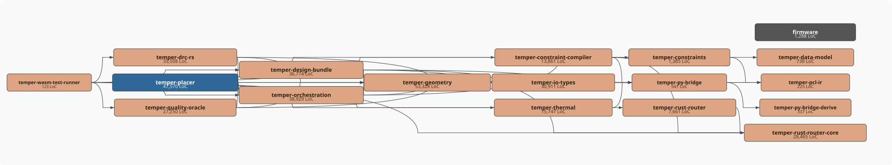
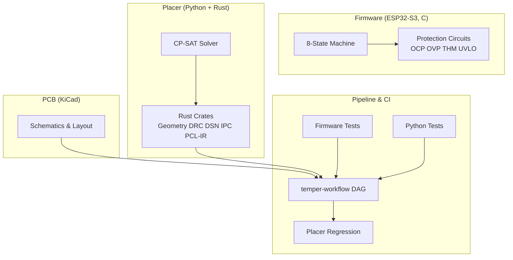

# Temper — ESP32-S3 Induction Cooker

[](./LICENSE)
[](https://github.com/BennetLeff/temper/actions/workflows/firmware-tests.yml)
[](https://github.com/BennetLeff/temper/actions/workflows/python-tests.yml)
[](https://conventionalcommits.org)

## Architecture



> Package inventory — boxes sized by lines of code, colored by language, with dependency arrows. The Mermaid diagram below shows data-flow relationships.

Temper is a consumer induction cooker built around three pillars: an
**ESP32-S3 firmware** with an 8-state transition-table machine handling
real-time power control and hardware-latched protection circuits; a **KiCad
PCB design** optimized through a custom CP-SAT-based signal-integrity and
thermal-aware placer pipeline; and a **Python/Rust placer toolchain**
(CP-SAT solver, geometry/DRC/DSN/IPC crates, workflow DAG) that automates layout
and checks placement against IPC standards. Protection — over-current,
over-voltage, thermal shutdown, UVLO — is *designed* to be hardware-latched with
firmware monitoring.

> **Implementation status is deliberately not summarized here.** As of this
> writing not all protection gates are implemented, and none has been validated
> on hardware. [`docs/STRATEGY.md`](docs/STRATEGY.md) holds the measured state
> and the gate matrix; it churns by design, and this file does not restate it.
> An earlier version of this paragraph asserted that all safety gates were
> hardware-latched and monitored, which was not true when written.



## Get Started in 60 Seconds

Build and run the firmware test suite:

```bash
cmake -B firmware/test/build firmware/test
cmake --build firmware/test/build
./firmware/test/build/test_state_machine_only
```

Or build and test the placer toolchain:

```bash
uv sync
uv run pytest packages/temper-placer/tests/
```

**Prerequisites:** CMake ≥ 3.16 and the ESP-IDF toolchain (see
[CONTRIBUTING.md](CONTRIBUTING.md) for full setup instructions).

## Reading Paths

### 5-Minute Overview

For anyone wanting to understand what Temper is and how it's structured:

- [docs/STRATEGY.md](docs/STRATEGY.md) — project approach, safety and performance gates
- Architecture diagram above — subsystem relationships at a glance
- [Project structure](#project-structure) — what lives where

### 30-Minute Build & Test

For developers ready to build, test, and navigate the codebase:

- [CONTRIBUTING.md](CONTRIBUTING.md) — development workflow, commit convention, codegen rules
- [AGENTS.md](AGENTS.md) — firmware build section; codegen and CI conventions
- [`.importlinter`](.importlinter) — package boundary contracts; verify with `uv run python scripts/import_linter_gate.py`
- [packages/temper-placer/tests/regression/](packages/temper-placer/tests/regression/) — placer regression test suite

### Deep-Dive Contributor

For contributors working on architecture, verification, or toolchain internals:

- [AGENTS.md](AGENTS.md) — full agent instructions, traceability convention, physics verification rules
- [docs/plans/](docs/plans/) — feature and improvement plans with requirements trace
- [docs/solutions/](docs/solutions/) — documented fixes for past bugs, patterns, and tooling decisions
- [docs/TRACEABILITY.md](docs/TRACEABILITY.md) — requirements-to-code traceability specification
- [docs/physics-verification-methodology.md](docs/physics-verification-methodology.md) — CP-SAT constraint soundness and validation framework

## Project Structure

<!-- BEGIN GENERATED: repo-map -- edits here are overwritten by scripts/gen_repo_state.py -->

*All 18 tracked top-level directories. Generated -- a new directory without a description fails CI.*

| Directory | Purpose |
|---|---|
| `.github/` | CI workflows, issue templates, code owners |
| `benchmarks/` | CP-SAT benchmark harness and external board corpora manifests |
| `components/` | Local KiCad symbol/footprint libraries, one directory per part |
| `configs/` | Named placer configurations (deterministic, production) |
| `dashboard/` | Static HTML/JS dashboard for placer metrics |
| `datasheets/` | Vendor PDFs for parts used in the design |
| `docs/` | Plans, brainstorms, solutions, evidence, specs, and strategy |
| `elec/` | Atopile electrical source -- the schematic's source of truth |
| `firmware/` | ESP32-S3 firmware (C), 8-state machine and protection monitoring |
| `max31865/` | KiCad library for the MAX31865 RTD front-end (predates components/) |
| `metrics/` | Recorded routing/placement metric snapshots (JSON) |
| `output_gerbers/` | Exported Gerber/drill artifacts from a past routed revision |
| `packages/` | Python and Rust workspace members -- placer, DRC, geometry, router |
| `pcb/` | KiCad project: schematics, board, and project settings |
| `power_pcb_dataset/` | Regression corpus, baselines, and DRC ceilings |
| `scripts/` | CI gates, generators, and one-off analysis tooling |
| `simulation/` | ngspice models and protection-gate simulation harnesses |
| `tools/` | Developer utilities not wired into CI gates |

<!-- END GENERATED: repo-map -->

## Inventory

<!-- BEGIN GENERATED: inventory -- edits here are overwritten by scripts/gen_repo_state.py -->

**15 workspace packages** under `packages/`:

- `temper-constraint-compiler`
- `temper-design-bundle`
- `temper-drc-rs`
- `temper-dsn`
- `temper-geometry`
- `temper-io-types`
- `temper-ipc`
- `temper-pcl-ir`
- `temper-placer`
- `temper-py-bridge`
- `temper-py-bridge-derive`
- `temper-quality-oracle`
- `temper-rust-router`
- `temper-rust-router-core`
- `temper-workflow`

Sizes and dependency edges are in [`ARCHITECTURE.svg`](./ARCHITECTURE.svg), regenerated automatically on push.

<!-- END GENERATED: inventory -->
