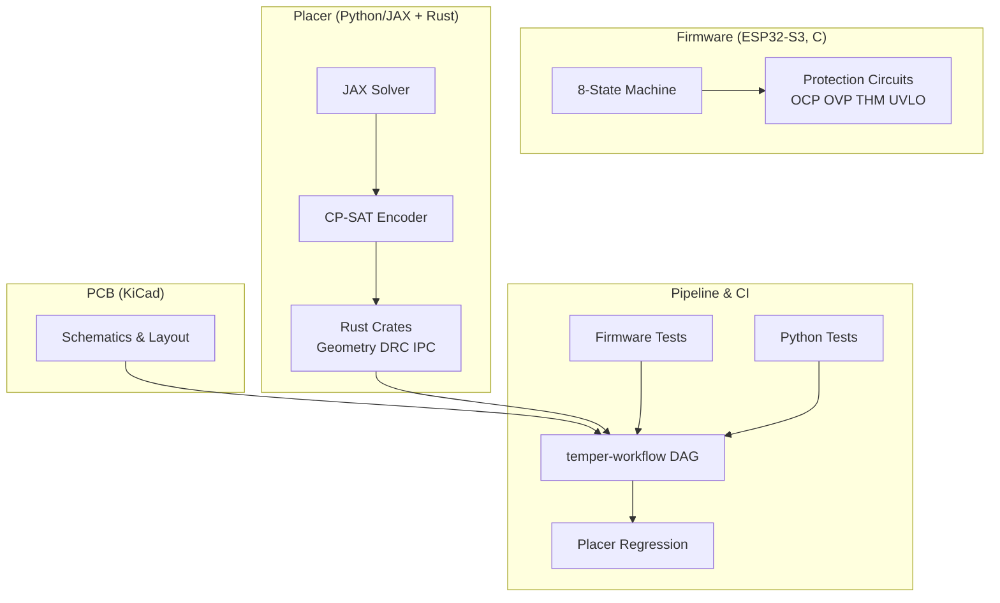

# Temper — ESP32-S3 Induction Cooker

[](./LICENSE)
[](https://github.com/BennetLeff/temper/actions/workflows/firmware-tests.yml)
[](https://github.com/BennetLeff/temper/actions/workflows/python-tests.yml)
[](https://conventionalcommits.org)

Temper is a consumer induction cooker built around three pillars: an
**ESP32-S3 firmware** with an 8-state transition-table machine handling
real-time power control and hardware-latched protection circuits; a **KiCad
PCB design** optimized through a custom JAX-based signal-integrity and
thermal-aware placer pipeline; and a **Python/Rust placer toolchain**
(CP-SAT encoder, geometry/DRC crates, workflow DAG) that automates layout
and checks placement against IPC standards. All safety gates —
over-current, over-voltage, thermal shutdown, UVLO — are hardware-latched
with firmware monitoring. See [docs/STRATEGY.md](docs/STRATEGY.md) for the
full safety and performance gate matrix.



## Get Started in 60 Seconds

Build and run the firmware test suite:

```bash
cmake -B firmware/test/build firmware/test
cmake --build firmware/test/build
./firmware/test/build/test_state_machine_only
```

**Prerequisites:** CMake ≥ 3.16 and the ESP-IDF toolchain (see
[CONTRIBUTING.md](CONTRIBUTING.md) for full setup instructions).

## Reading Paths

### 5-Minute Overview

For anyone wanting to understand what Temper is and how it's structured:

- [docs/STRATEGY.md](docs/STRATEGY.md) — project approach, safety and performance gates
- Architecture diagram above — subsystem relationships at a glance
- [Project structure](#project-structure) — what lives where

### 30-Minute Build & Test

For developers ready to build, test, and navigate the codebase:

- [CONTRIBUTING.md](CONTRIBUTING.md) — development workflow, commit convention, codegen rules
- [AGENTS.md](AGENTS.md) — firmware build section; codegen and CI conventions
- [`.importlinter`](.importlinter) — package boundary contracts; verify with `uv run python scripts/import_linter_gate.py`
- [packages/temper-placer/tests/regression/](packages/temper-placer/tests/regression/) — placer regression test suite

### Deep-Dive Contributor

For contributors working on architecture, verification, or toolchain internals:

- [AGENTS.md](AGENTS.md) — full agent instructions, traceability convention, physics verification rules
- [docs/plans/](docs/plans/) — feature and improvement plans with requirements trace
- [docs/solutions/](docs/solutions/) — documented fixes for past bugs, patterns, and tooling decisions
- [docs/TRACEABILITY.md](docs/TRACEABILITY.md) — requirements-to-code traceability specification
- [docs/physics-verification-methodology.md](docs/physics-verification-methodology.md) — CP-SAT constraint soundness and validation framework

## Project Structure

| Directory | Description |
|-----------|-------------|
| `firmware/` | ESP32-S3 induction cooker firmware (C, 8-state machine) |
| `packages/temper-placer/` | JAX-based PCB placement optimizer |
| `packages/temper-*` | Supporting Python packages (DRC, workflow, tools, testing) |
| `pcb/` | KiCad schematics and layout |
| `docs/` | Plans, solutions, architecture, specs |
| `scripts/` | CI gates, profiling, regression tools |
| `.github/` | Workflows, templates, code owners |
