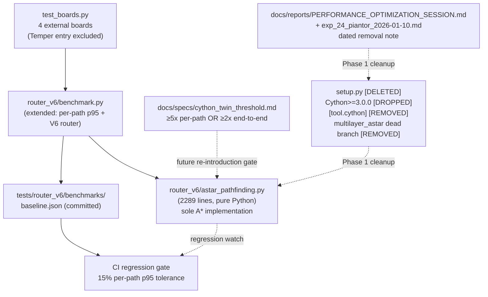
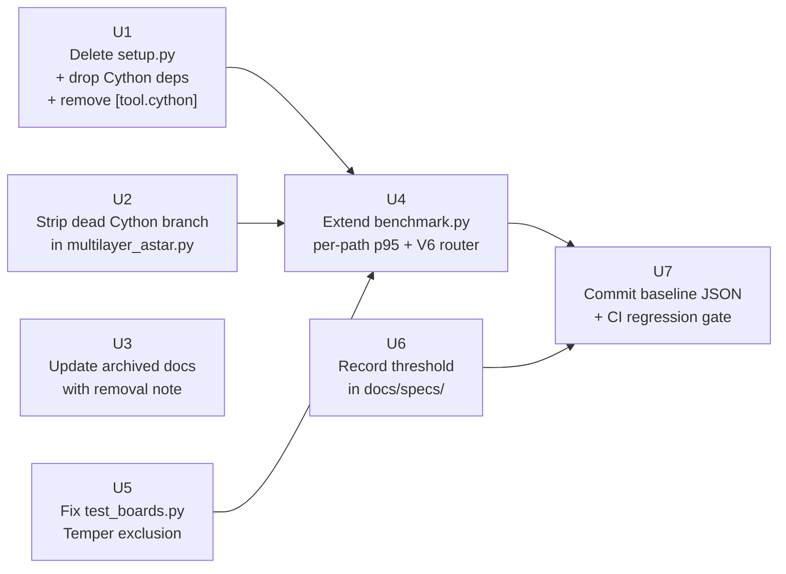

# fix: Finalize Cython Twin Cleanup and Lock Pure-Python A* Performance

## Summary

Four-phase initiative that (1) finalizes the incomplete Jan 17 2026 cleanup of the deleted Cython A* twin — removing `setup.py`'s broken `cythonize()` call, dropping the dangling `Cython>=3.0.0` build dependency and `[tool.cython]` section, stripping the dead `ImportError`-and-recover branch in `multilayer_astar.py`, and correcting the historical 40× speedup claim in archived reports; (2) extends `router_v6/benchmark.py` with per-path A* p95 latency capture and fixes the V6 router stub so the active pure-Python hot path can be measured on the four-board corpus; (3) commits the measured JSON as a regression baseline and adds a CI gate that fails on >15% per-path p95 regression; (4) records the re-introduction threshold (≥5× per-path p95 OR ≥2× end-to-end) so any future Cython twin has an unambiguous, pre-agreed gate. The parity test (R6) is *specified* but *not implemented* — it is conditional on the threshold being met in a future, separate initiative.

---

## Problem Frame

The Jan 17 2026 cleanup commit `3314d94a` ("Major Cleanup: JAX Removal, Legacy Purge, and Structural Flattening") deleted `packages/temper-placer/src/temper_placer/routing/astar/astar_core.{pyx,pxd}` (707 lines) and the entire `routing/astar/` package, but left four classes of dangling reference on `main`:

1. **Broken build hook.** `packages/temper-placer/setup.py` still calls `cythonize()` on `src/temper_placer/routing/astar/astar_core.pyx` — a path that no longer exists (the `src/` directory was removed in the same commit). Running `python setup.py build_ext --inplace` fails immediately. The file is also redundant: `pyproject.toml` already declares `hatchling` as the build backend, so `setup.py` is not the active build entry point — but its presence and broken state are noise that misleads tooling and readers.
2. **Dangling build dependency + config.** `pyproject.toml` declares `Cython>=3.0.0` in both `[build-system].requires` (line 2) and `[dependency-groups].dev` (line 133), and carries a `[tool.cython]` section (lines 136–138). With no `.pyx` to compile, these declare a build capability the package does not use.
3. **Dead runtime branch.** `packages/temper-placer/temper_placer/deterministic/stages/multilayer_astar.py:261-301` still runs `from temper_placer.routing.astar import find_path as find_path_impl` on every `find_path` call (guarded only by `TEMPER_USE_CYTHON_ASTAR` defaulting to `"1"`), catches the guaranteed `ImportError`, prints a warning, and falls through to the Python implementation. This is dead code that fires an exception-and-recover on every invocation of the legacy deterministic router — which is still imported by `pipeline/mvp3_runner.py` and several diagnostic scripts, so the branch is not strictly unreachable. The module docstring (lines 14–15) also advertises "Cython-accelerated A* (50-100x speedup)" that no longer exists.
4. **Misleading documentation.** `docs/reports/PERFORMANCE_OPTIMIZATION_SESSION.md` cites `astar_core.pyx` as live infrastructure (lines 83, 87, 306), advertises `TEMPER_USE_CYTHON_ASTAR`, and repeats a "40× per-path speedup (0.086ms vs 3.5ms)" claim (line 39) that is no longer reproducible because the implementation is gone. `router-experiments/reports/exp_24_piantor_2026-01-10.md:222` references the missing Cython implementation as the reason for a Python fallback. A reader of these reports in 2026 will waste time looking for `astar_core.pyx`.

Meanwhile the **active** A* — `packages/temper-placer/temper_placer/router_v6/astar_pathfinding.py` (2289 lines, pure Python, imported by `router_v6/pipeline.py`) — has no Cython twin, references none, and has never been benchmarked with per-path latency capture. The existing `router_v6/benchmark.py` records only per-board aggregates (`runtime_seconds`, `overall_score`, `completion_rate`) and its V6 router path is a stub (`# TODO: Implement V6 router`, line 235). The historical 40× figure was measured against the *deleted* `astar_core.pyx` driving the *legacy* `multilayer_astar.py` — it is not evidence about the active router.

So the real problem has two parts: (a) a drift-causing incomplete deletion that should be finalized regardless of any performance decision (Phase 1), and (b) an open question about whether the now-pure-Python active hot path justifies re-introducing a Cython twin — informed by *measurement* on the active router, not by the historical 40× figure (Phases 2–4). The re-introduction itself is **out of scope** for this plan: this plan finalizes the deletion, builds the measurement harness, locks the baseline, and records the threshold. Re-introduction is a future, separate initiative triggered only if the threshold is met.

(see origin: `docs/brainstorms/2026-06-21-cython-twin-measure-requirements.md` — Problem Frame, Key Decisions)

---

## Requirements

From the origin requirements document (R1–R7):

**Phase 1 — Finalize the deletion (unconditional, bug fix)**

- R1. `packages/temper-placer/setup.py` no longer references `astar_core.pyx`, `temper_placer.routing.astar.astar_core`, or `cythonize`. With no other Cython extension in the package, the file is **deleted** and the `[build-system]` table in `pyproject.toml` drops `Cython>=3.0.0` from `requires`. `[dependency-groups].dev` also drops `Cython>=3.0.0`. The `[tool.cython]` section is removed. Hatchling remains the sole build backend.
- R2. `packages/temper-placer/temper_placer/deterministic/stages/multilayer_astar.py` no longer attempts `from temper_placer.routing.astar import find_path`. The `TEMPER_USE_CYTHON_ASTAR` env-var branch (lines 261–301) is removed; the Python implementation is the sole path. The module docstring (lines 14–15) is updated to drop the "Cython-accelerated" advertisement. `docs/reports/PERFORMANCE_OPTIMIZATION_SESSION.md` and `router-experiments/reports/exp_24_piantor_2026-01-10.md` carry a dated note that the Cython twin was removed in commit `3314d94a` (Jan 17 2026) and that any re-introduction is gated on the R3 measurement; the historical 40× figure is explicitly labeled as non-reproducible against the current router.

**Phase 2 — Measure-first gate (unconditional harness, conditional decision)**

- R3. A benchmark extension measures the active pure-Python `router_v6/astar_pathfinding.py` on the existing four-board corpus defined in `packages/temper-placer/temper_placer/router_v6/test_boards.py` (Piantor_Right, LibreSolar_BMS, RP2040_DesignGuide, BitAxe_Ultra). The Temper entry at `test_boards.py:54` (hardcoded `/Users/bennet/Desktop/temper/...` absolute path) is **excluded** from the corpus — the file is not under version control and the four external boards span a representative range of complexity (consumer keyboard, BMS, MCU design guide, mining board). The script records, per board: total routing-stage wall time, per-path A* latency (mean / median / p95), path count, and failure count. Output is machine-readable JSON committed under `packages/temper-placer/tests/router_v6/benchmarks/`. The benchmark **extends the existing runner pattern** in `router_v6/benchmark.py` rather than introducing a new harness — including fixing the V6 router stub so the active `astar_pathfinding.py` is actually exercised.
- R4. A decision threshold is recorded in `docs/specs/cython_twin_threshold.md` (new): re-introduce a Cython twin only if the measured per-path p95 A* latency on the corpus is **≥ 5×** the hypothetical Cython target, **OR** the measured end-to-end routing-stage wall time is **≥ 2×** what a Cython twin would deliver. The 2× single-number threshold from ideation is rejected: the historical evidence was 40× per-path, and a build step that delivers <5× per-path speedup does not justify the ongoing drift risk and build complexity. The two-number form (per-path **OR** end-to-end) prevents the case where per-path speedup is large but the routing stage is not the wall-time bottleneck.

**Phase 3 — Lock the pure-Python performance (unconditional)**

- R5. A CI performance-regression gate runs the R3 benchmark on every push that touches `router_v6/astar_pathfinding.py` or its direct imports (`occupancy_grid.py`, `channel_mapping.py`, `adaptive_grid.py`, `stage0_data.py`). The gate compares against the committed baseline JSON; a regression beyond 15% on per-path p95 fails CI with a named diff. This gate exists whether or not a twin is re-introduced: it makes the pure-Python performance a tracked, non-regressing property of the codebase and provides the baseline against which any future Cython twin is measured.

**Phase 4 — Parity test specification (conditional: only if R4 threshold is met in a *future* initiative)**

- R6. *(Specified now, not implemented in this plan.)* A parity test runs both the pure-Python `router_v6/astar_pathfinding.py` and any future Cython twin against a set of golden routing fixtures, asserting byte-identical path output for each net (same coordinate sequence, same layer assignments, same via positions). The fixtures are drawn from the R3 corpus — at minimum the four external boards. The assertion surface is `RoutePath.coordinates` (list of `(x, y)` tuples) and `RoutePath.layer_name` from `astar_pathfinding.py:20-26`. For multi-layer paths, `RoutePath3D.segments` (with per-segment layer) and `via_positions` are the additional surface — confirm the exact dataclass at implementation time. The test name identifies the diverging net, the diverging coordinate index, and both implementations' values. The parity test is the artifact that makes any future deletion of the twin safe.
- R7. *(Specified now, not implemented in this plan.)* If a twin is re-introduced, it is **generated from type-annotated `.py`** (Approach B), not hand-maintained as a separate `.pyx` (Approach C). The `.py` carries Cython type annotations (`cython.int`, `cython.double`, typed memoryviews) guarded by `if cython.compiled` so the file remains importable as pure Python. The build step lives in `pyproject.toml` as a hatchling build hook (or a re-introduced `setup.py` if hatchling does not support the required cythonize step). Hand-maintained `.pyx` is rejected as the default because it reintroduces the exact drift risk this initiative exists to eliminate.

---

## High-Level Technical Design

*This illustrates the intended approach and is directional guidance for review, not implementation specification.*

### Target state (after Phase 1–3)



### Implementation unit dependency graph



---

## Implementation Units

### Phase 1 — Finalize the Deletion (Unconditional Bug Fix)

### U1. Delete `setup.py`, drop Cython build deps, remove `[tool.cython]`

**Goal:** Make the build honest about what it ships. Remove the broken `cythonize()` call, the dangling `Cython>=3.0.0` declarations, and the unused `[tool.cython]` section.

**Requirements:** R1

**Dependencies:** None

**Files:**
- `packages/temper-placer/setup.py` — **delete the file**
- `packages/temper-placer/pyproject.toml` — three edits:
  - Line 2: `requires = ["hatchling", "Cython>=3.0.0"]` → `requires = ["hatchling"]`
  - Lines 133: remove `"Cython>=3.0.0",` from `[dependency-groups].dev`
  - Lines 136–138: remove the entire `[tool.cython]` block and its preceding comment (`# Cython configuration for A* acceleration`)

**Approach:** `setup.py` is redundant — `pyproject.toml` already declares `hatchling.build` as the build backend (line 3), and hatchling does not consult `setup.py` for wheel builds. Deleting `setup.py` is safe: confirm no other tooling invokes it by grepping `rg 'setup\.py' packages/temper-placer/ docs/ scripts/ .github/` before deletion. The three `pyproject.toml` edits are mechanical. After the edits, `pip install -e packages/temper-placer` must succeed without invoking `cythonize` and without referencing any `.pyx`.

**Patterns to follow:** Existing `[build-system]` and `[dependency-groups]` table syntax in `pyproject.toml`.

**Test scenarios:**
- `pip install -e packages/temper-placer` succeeds and produces no `build/` directory containing Cython artifacts.
- `grep -r "cythonize\|astar_core\|tool.cython" packages/temper-placer/pyproject.toml packages/temper-placer/setup.py` returns zero matches (the second path does not exist).
- `uv run ruff check packages/temper-placer/` exits 0 (no new lint errors from the deletion).
- `uv run pytest packages/temper-placer/tests/ -q` passes (no consumer depended on `setup.py` at test time).

**Verification:** `pip install -e packages/temper-placer 2>&1 | grep -i cython` returns no matches. The package imports cleanly: `python -c "import temper_placer.router_v6.astar_pathfinding"`.

---

### U2. Strip the dead Cython branch from `multilayer_astar.py`

**Goal:** Remove the runtime path that attempts an import guaranteed to fail on every invocation of the legacy deterministic router.

**Requirements:** R2

**Dependencies:** None (parallel with U1)

**Files:**
- `packages/temper-placer/temper_placer/deterministic/stages/multilayer_astar.py`:
  - Module docstring lines 14–15: remove the "New in v5 (temper-6te4): Cython-accelerated A* implementation (50-100x speedup). Toggle between Cython and Python using TEMPER_USE_CYTHON_ASTAR environment variable." paragraph.
  - Lines 261–301: remove the entire `# Try Cython implementation if available` block — from the `# Try Cython implementation if available` comment through the `pass` at line 301 (the `except Exception as e:` block and its `print(f"WARNING: Cython A* failed ...")`).
  - The `# Python implementation fallback` comment at line 303 becomes the sole path; demote it from "fallback" to the implementation (e.g. `# Pure-Python A* implementation`).
  - Audit the `import os` at line 20: if `os.getenv` is no longer used elsewhere in the file, remove the import. Confirm with `rg 'os\.' packages/temper-placer/temper_placer/deterministic/stages/multilayer_astar.py` after the edit.

**Approach:** The deleted branch's behavior was "always raise `ImportError`, print a warning, fall through to Python." Removing it does not change observable behavior — it only removes the exception-and-recover overhead and the misleading `print`. The Python A* search starting at line 303 (the `end_blocked_layers` computation and the `# A* with 3D state` block) is the sole surviving path and is already self-contained.

**Patterns to follow:** Existing comment style in the file. Do not introduce new docstrings; just remove the stale ones.

**Test scenarios:**
- `grep -n "TEMPER_USE_CYTHON_ASTAR\|routing.astar\|Cython" packages/temper-placer/temper_placer/deterministic/stages/multilayer_astar.py` returns zero matches.
- `python -c "from temper_placer.deterministic.stages.multilayer_astar import MultiLayerAStar; print('ok')"` prints `ok`.
- A legacy router smoke test (`uv run pytest packages/temper-placer/tests/pipeline/ -k mvp3 -q` or equivalent, if one exists) still passes. If no such test exists, run `python -c "from temper_placer.pipeline.mvp3_runner import *"` to confirm import succeeds.
- `uv run ruff check packages/temper-placer/temper_placer/deterministic/stages/multilayer_astar.py` exits 0 (no unused `import os`, no unused variables from the deleted branch).

**Verification:** The grep returns zero matches; the module imports without error; the legacy pipeline import chain is intact.

---

### U3. Update archived reports with a dated removal note

**Goal:** A reader of the historical performance docs knows within the first section that the Cython twin was removed in Jan 2026 and that the current router is pure Python — they do not waste time looking for `astar_core.pyx`.

**Requirements:** R2

**Dependencies:** None (parallel with U1, U2)

**Files:**
- `docs/reports/PERFORMANCE_OPTIMIZATION_SESSION.md` — prepend a dated admonition block immediately after the `# Performance Optimization Session - Router v5` title (line 1) and the session metadata block. The block reads:
  ```
  > **Historical note (added 2026-06-22):** The Cython A* twin described in this
  > report (`packages/temper-placer/src/temper_placer/routing/astar/astar_core.pyx`,
  > 707 lines) was **deleted in commit `3314d94a` on Jan 17 2026** along with the
  > entire `routing/astar/` package. The `TEMPER_USE_CYTHON_ASTAR` env var no longer
  > exists. The active router is `packages/temper-placer/temper_placer/router_v6/
  > astar_pathfinding.py` (pure Python, 2289 lines). The 40× per-path speedup claim
  > below was measured against the deleted implementation driving the legacy
  > `deterministic/stages/multilayer_astar.py` and is **not reproducible** against
  > the current router. Any re-introduction of a Cython twin is gated on the
  > measure-first threshold recorded in `docs/specs/cython_twin_threshold.md`.
  ```
  Do **not** edit the body of the report — it is a historical record. The note at the top is the correction.
- `router-experiments/reports/exp_24_piantor_2026-01-10.md` — add a similar one-line note immediately above line 222 (the sentence mentioning "missing Cython implementation"):
  ```
  > **Note (2026-06-22):** The Cython implementation referenced below was removed
  > in commit `3314d94a` (Jan 17 2026). See `docs/specs/cython_twin_threshold.md`
  > for the re-introduction gate.
  ```

**Approach:** These are archived reports — they document what was true on their date. The correction is a dated prefix note, not a rewrite. The note points forward to the threshold doc (U6) so a reader who wants the current state has a single hop.

**Patterns to follow:** Markdown blockquote admonition style. Match any existing dated-note convention in `docs/` if one exists.

**Test scenarios:**
- `head -20 docs/reports/PERFORMANCE_OPTIMIZATION_SESSION.md` shows the removal note before the session summary.
- `grep -n "3314d94a" docs/reports/PERFORMANCE_OPTIMIZATION_SESSION.md router-experiments/reports/exp_24_piantor_2026-01-10.md` returns matches in both files.
- The body of `PERFORMANCE_OPTIMIZATION_SESSION.md` is unchanged (verify with `git diff --stat` — only insertions, no modifications to existing lines).

**Verification:** Visual inspection of the prepended note. `git diff` shows insertions only.

---

### Phase 2 — Measure-First Gate (Unconditional Harness)

### U4. Extend `benchmark.py` with per-path p95 latency and a working V6 router path

**Goal:** Make the active `router_v6/astar_pathfinding.py` measurable on the four-board corpus. The existing `benchmark.py` records only per-board aggregates and its V6 router path is a stub (`# TODO: Implement V6 router`, line 235). This unit extends the harness to capture per-path A* latency (mean / median / p95) and wires the V6 branch to actually invoke the active router.

**Requirements:** R3

**Dependencies:** U1 (broken `setup.py` must not interfere with `pip install`), U2 (dead Cython branch removed so the legacy router does not emit spurious warnings during corpus setup)

**Files:**
- `packages/temper-placer/temper_placer/router_v6/benchmark.py` — extend:
  - Add a `run_v6_router(pcb_path: Path) -> BoardRoutingReport` function that actually invokes the active `router_v6/pipeline.py` (which imports `astar_pathfinding.py`) rather than printing "ERROR: V6 router not yet implemented". Model the function on the existing `run_v5_router` (lines 39–185) but route through the V6 pipeline stages.
  - Add per-path A* latency capture: wrap each `run_astar_pathfinding` invocation in a `time.perf_counter()` pair and accumulate a `list[float]` of per-path latencies per board. Compute `mean`, `median`, and `p95` (via `statistics.quantiles(latencies, n=100)[94]` or `numpy.percentile(latencies, 95)` — numpy is already a dependency).
  - Extend the JSON output schema (lines 266–274) to include, per board: `per_path_latency_ms: {mean, median, p95, min, max, count}`, `path_count`, `failure_count`. The existing `runtime_seconds` becomes `routing_stage_wall_seconds` (rename for clarity, or add as an alias).
  - The `--router v6` branch (line 234) calls `run_v6_router` instead of `sys.exit(1)`.
- `packages/temper-placer/temper_placer/router_v6/pipeline.py` — read-only audit: confirm the entry point that exercises `astar_pathfinding.py` and the per-path invocation boundary. The benchmark must time *individual path* calls, not the whole routing stage as one block — if the V6 pipeline does not expose a per-path hook, instrument the pipeline at the `run_astar_pathfinding` call site with a callback or a timing list. **Deferred to implementation:** confirm the exact call boundary in `pipeline.py` and whether a timing hook already exists.
- `packages/temper-placer/temper_placer/router_v6/diagnostics.py` — read-only audit: confirm `BoardRoutingReport.to_dict()` (called at line 269) can absorb the new per-path fields, or extend the dataclass with an optional `per_path_latency_ms: dict | None = None` field.
- `packages/temper-placer/tests/router_v6/test_benchmark_per_path.py` (new) — a test that runs the benchmark on the smallest corpus board (Piantor_Right, 33 nets) and asserts the JSON output contains `per_path_latency_ms.p95` as a finite float ≥ 0.

**Approach:** Reuse the existing `run_benchmark_suite` orchestration (lines 188–281) — do not introduce a new harness. The extension is: (a) a real `run_v6_router` function, (b) per-path timing instrumentation, (c) extended JSON schema. The V6 router must exercise `router_v6/astar_pathfinding.py` specifically — not the legacy `multilayer_astar.py` (which is the V5 path). If the V6 pipeline is not yet wired for end-to-end routing on external boards, document the gap in the plan and fall back to timing `astar_pathfinding.run_astar_pathfinding` calls directly on a parsed board — the per-path latency is the primary measurement, the end-to-end wall time is secondary.

**Patterns to follow:** Existing `run_v5_router` structure (parse → state → pipeline → reports). Existing JSON output schema at lines 266–274. `numpy.percentile` for p95 (numpy is already a dependency, line 30 of `pyproject.toml`).

**Test scenarios:**
- `python -m temper_placer.router_v6.benchmark --router v6 --board Piantor_Right --output /tmp/bench.json` produces a JSON file with `boards[0].per_path_latency_ms.p95` as a finite float.
- The p95 value is ≥ the mean value (sanity check on the percentile computation).
- `path_count` equals the number of nets the V6 router attempted to route.
- `failure_count` is non-negative and `path_count + failure_count` is consistent with the board's net count.
- `python -m temper_placer.router_v6.benchmark --router v5 --board Piantor_Right` still works (V5 path unchanged).
- The new test `test_benchmark_per_path.py` passes in CI.
- A board with zero routable nets produces `per_path_latency_ms.count == 0` and does not raise on percentile computation (guard: if `len(latencies) == 0`, emit `null` for all percentile fields).

**Verification:** Run the benchmark on all four external boards; confirm the JSON contains the new fields for each. Run the new test. Run the V5 path to confirm no regression.

---

### U5. Exclude the Temper board from the benchmark corpus

**Goal:** The hardcoded `/Users/bennet/Desktop/temper/packages/temper-placer/temper_router_v6_fine.kicad_pcb` path at `test_boards.py:54` is a pre-existing bug that would make the benchmark corpus non-reproducible on any other machine. Exclude the Temper entry from the corpus rather than relativizing the path (the broader path-hygiene cleanup is out of scope per the origin document).

**Requirements:** R3 (corpus reproducibility)

**Dependencies:** None (parallel with U1–U3)

**Files:**
- `packages/temper-placer/temper_placer/router_v6/test_boards.py`:
  - Line 48: `BASE_PATH = Path("/Users/bennet/Desktop/temper/packages/temper-placer/tests/fixtures/external/.cache")` — relativize to the repo root: `BASE_PATH = Path(__file__).resolve().parents[2] / "tests" / "fixtures" / "external" / ".cache"`. This makes the four external boards reproducible on any checkout.
  - Line 54: `TEMPER_PATH = Path("/Users/bennet/Desktop/temper/packages/temper-placer/temper_router_v6_fine.kicad_pcb")` — **remove this line**. The Temper board is not in `TEST_BOARDS` (it is not appended to the list at lines 58–99), so removing the constant is safe. Confirm with `rg 'TEMPER_PATH' packages/temper-placer/` before deletion — if no consumer references it, delete; if a consumer does, leave a `# TEMPER_PATH removed 2026-06-22; file was not under version control` comment or relocate the constant behind a `if Path(...).exists()` guard.

**Approach:** The four external boards (Piantor, LibreSolar, RP2040, BitAxe) are the corpus. The Temper board is excluded because (a) its path is hardcoded to a user-local absolute path, (b) the file is not under version control, (c) the four external boards span a representative range of complexity per the origin document's Dependencies/Assumptions section. Relativizing `BASE_PATH` is in scope because it is the same class of bug and blocks corpus reproducibility on CI.

**Patterns to follow:** `Path(__file__).resolve().parents[N]` pattern for repo-relative path resolution. Existing `TestBoard` dataclass.

**Test scenarios:**
- `python -c "from temper_placer.router_v6.test_boards import get_available_boards; print(len(get_available_boards()))"` prints `4` on a machine where the external board cache is populated (or `0` on a fresh checkout — the `exists()` guard handles this).
- `grep -n "/Users/bennet" packages/temper-placer/temper_placer/router_v6/test_boards.py` returns zero matches.
- `python -c "from temper_placer.router_v6.test_boards import TEST_BOARDS; print([b.name for b in TEST_BOARDS])"` prints `['Piantor_Right', 'LibreSolar_BMS', 'RP2040_DesignGuide', 'BitAxe_Ultra']` — no Temper entry.
- The benchmark in U4 runs successfully on a checkout that is not `/Users/bennet/Desktop/temper` (i.e. `BASE_PATH` resolves correctly relative to the file).

**Verification:** Run the grep. Run `get_available_boards()` on a fresh clone (or simulate by renaming the user directory) — the four external boards resolve correctly.

---

### U6. Record the re-introduction threshold in `docs/specs/`

**Goal:** The decision threshold for any future Cython twin re-introduction is recorded in a single, citable location before the R3 measurement runs. The threshold is the gate R4 refers to.

**Requirements:** R4

**Dependencies:** None (parallel with U4, U5)

**Files:**
- `docs/specs/cython_twin_threshold.md` (new) — a short spec document recording:
  - The two-number threshold: re-introduce a Cython twin only if **(per-path p95 A* latency on the four-board corpus is ≥ 5× the hypothetical Cython target) OR (end-to-end routing-stage wall time is ≥ 2× what a Cython twin would deliver)**.
  - The rationale: the historical 40× figure was measured against the deleted `astar_core.pyx` driving the legacy `multilayer_astar.py` and is not evidence about `router_v6/astar_pathfinding.py`. A 2× single-number threshold under-weights the build-complexity cost and ignores the historical reality. The two-number form guards against per-path speedup being large but the routing stage not being the bottleneck.
  - The corpus: the four external boards in `test_boards.py` (Piantor_Right, LibreSolar_BMS, RP2040_DesignGuide, BitAxe_Ultra).
  - The measurement protocol: the R3 benchmark (`router_v6/benchmark.py --router v6`), the committed baseline JSON, and the per-path p95 field.
  - The re-introduction path: Approach B (codegen from type-annotated `.py`) is the default; Approach C (hand-maintained `.pyx`) is escalation-only. The parity test (R6) is implemented alongside any re-introduction.
  - A pointer to the origin brainstorm (`docs/brainstorms/2026-06-21-cython-twin-measure-requirements.md`) for the full reasoning.

**Approach:** This is a spec document, not a report — it is normative for any future re-introduction initiative. Keep it under 100 lines. Cite the origin document rather than reproducing its argument.

**Patterns to follow:** Existing `docs/specs/` documents (e.g. `HIGH_VOLTAGE_CLEARANCE_SPEC.md`). Frontmatter with `date` and `status: active`.

**Test scenarios:**
- `test -f docs/specs/cython_twin_threshold.md` succeeds.
- `grep -n "5×\|5x\|2×\|2x" docs/specs/cython_twin_threshold.md` matches the threshold.
- The U3 removal notes in the archived reports link to this spec.

**Verification:** The spec exists, is cited by U3, and contains both threshold numbers.

---

### Phase 3 — Lock the Pure-Python Performance (Unconditional)

### U7. Commit the baseline JSON and add the CI regression gate

**Goal:** The pure-Python A* performance becomes a tracked, non-regressing property of the codebase. A 15% per-path p95 regression on `router_v6/astar_pathfinding.py` or its direct imports fails CI.

**Requirements:** R5

**Dependencies:** U4 (benchmark extension must exist), U5 (corpus must be reproducible), U6 (threshold recorded so the baseline's purpose is documented)

**Files:**
- `packages/temper-placer/tests/router_v6/benchmarks/baseline.json` (new, committed) — the output of `python -m temper_placer.router_v6.benchmark --router v6 --output baseline.json` run on the four-board corpus on a quiet machine. Includes a `metadata` block recording: the commit SHA, the Python version, the machine hostname (or a note that the baseline is machine-relative and the gate tolerance absorbs cross-machine variance), the date, and the threshold doc path.
- `packages/temper-placer/tests/router_v6/test_astar_perf_regression.py` (new) — a pytest test marked `@pytest.mark.benchmark` (already a registered marker in `pyproject.toml` line 85) that:
  1. Runs the R3 benchmark on the four-board corpus (or a subset if CI time is constrained — Piantor_Right at minimum).
  2. Loads `baseline.json`.
  3. Compares per-board `per_path_latency_ms.p95` against the baseline.
  4. Fails with a named diff if any board's p95 exceeds the baseline by more than 15%.
  5. Skips (not fails) if the baseline JSON is absent or the corpus boards are not on disk (CI environments without the external board cache).
- `.github/workflows/` (audit existing workflows) — add a job or extend an existing one to run `pytest -m benchmark packages/temper-placer/tests/router_v6/test_astar_perf_regression.py` on pushes that touch `packages/temper-placer/temper_placer/router_v6/astar_pathfinding.py`, `occupancy_grid.py`, `channel_mapping.py`, `adaptive_grid.py`, or `stage0_data.py`. Use a path filter.

**Approach:** The baseline is committed once, after U4 lands. The gate compares current p95 against the baseline with a 15% tolerance — this absorbs cross-machine variance and minor noise while catching real regressions. The gate is a pytest test (not a standalone script) so it integrates with the existing CI workflow and reuses the `benchmark` marker. The skip-when-corpus-absent behavior prevents false failures on contributor machines that have not populated the external board cache.

**Relationship with existing `make perf-regression`:** The existing `make perf-regression` target (invoked at `.github/workflows/python-tests.yml:81`, implemented in `scripts/check_perf_regression.py`) measures JAX loss-function compute performance (OverlapLoss, WirelengthLoss, BoundaryLoss, SpreadLoss) against `metrics/performance_baseline.json`. The U7 gate is complementary: it tracks pure-Python A* per-path routing latency against `tests/router_v6/benchmarks/baseline.json`. Both gates run in the same job (`python-tests.yml`) but measure orthogonal properties — one guards JAX loss computation, the other guards A* routing latency. If the two gates were to share runner resources and cause timing jitter, adding `--dist=loadscope` or a serialization constraint in the workflow is deferred to implementation.

**Patterns to follow:** Existing `@pytest.mark.benchmark` marker registration in `pyproject.toml`. Existing CI workflow structure in `.github/workflows/`.

**Test scenarios:**
- `uv run pytest packages/temper-placer/tests/router_v6/test_astar_perf_regression.py -m benchmark` passes on the machine that produced the baseline.
- If `astar_pathfinding.py` is edited to introduce a 20% p95 regression (e.g. add a `time.sleep(0.001)` per path), the test fails with a diff naming the board, the baseline p95, and the current p95.
- If the baseline JSON is deleted, the test skips with an informative message (not fails).
- If the external board cache is absent, the test skips.
- The CI workflow runs the gate only on pushes touching the watched files.

**Verification:** Run the test on the baseline machine — passes. Introduce a synthetic regression — fails with a named diff. Delete the baseline — skips.

---

## Key Technical Decisions

**Phase 1 is an unconditional bug fix, not a measure-then-decide outcome.** The `.pyx` is deleted (confirmed: no `.pyx` or `.pxd` files exist in `packages/temper-placer/`; `find` returns empty; only git history at `3314d94a` and a stale `.claude/worktrees/` copy contain the old files). The dangling references are bugs: a build script that fails on a missing source, a runtime branch that always raises `ImportError`, a build dependency declared but unused. Finalizing the deletion is correct regardless of any performance decision. (see origin — Key Decisions, first bullet)

**`setup.py` is deleted, not repaired.** `pyproject.toml` already declares `hatchling.build` as the build backend (line 3). `setup.py` is not the active build entry point — it is a leftover from the pre-hatchling era that happens to call `cythonize()` on a non-existent file. Repairing it (e.g. removing the `Extension` entry) would leave a dead file with no purpose. Deleting it is the honest representation: the package has no Cython extensions and does not need a `setup.py`. (see origin — R1, Key Decisions first bullet)

**Cython is dropped from both `[build-system].requires` and `[dependency-groups].dev`.** Confirmed by grep: the only on-disk consumers of `Cython>=3.0.0` in `packages/temper-placer/` are `setup.py` (deleted in U1) and `pyproject.toml` itself. No `.py` file in `temper_placer/` imports `cython` or `Cython`. Dropping both declarations is safe. (see origin — Open Question [Affects R1])

**The `[tool.cython]` section is removed.** It configures a build that no longer exists (`language_level = "3"`). Removing it is mechanical.

**The threshold is ≥5× per-path p95 OR ≥2× end-to-end, not 2× single-number.** The ideation floated 2×; verification rejects it. The historical evidence was 40× per-path; a build step that delivers <5× per-path speedup does not justify the ongoing drift risk and build complexity. The two-number form (OR, not AND) guards against the case where per-path speedup is large but the routing stage is not the wall-time bottleneck — either condition alone justifies re-introduction. (see origin — Key Decisions, third bullet)

**`benchmark.py` is extended, not replaced.** The existing `run_benchmark_suite` orchestration (lines 188–281) is reusable. The extension is additive: a real `run_v6_router` function, per-path timing instrumentation, and extended JSON schema. Introducing a new harness would duplicate the corpus-loading and report-aggregation logic. (see origin — R3, Dependencies/Assumptions second bullet)

**The V6 router stub is fixed in this plan, not deferred.** `benchmark.py:235` (`# TODO: Implement V6 router`) blocks R3 — without a working V6 path, the benchmark cannot measure `astar_pathfinding.py`. Fixing it is in scope as part of U4. If the V6 pipeline is not yet wired for end-to-end routing on external boards, the fallback is to time `astar_pathfinding.run_astar_pathfinding` calls directly on a parsed board — the per-path latency is the primary measurement. (see origin — Open Question [Affects R3])

**The Temper board is excluded, not relativized.** `test_boards.py:54` points to `/Users/bennet/Desktop/temper/packages/temper-placer/temper_router_v6_fine.kicad_pcb` — a file not under version control. Relativizing would require the file to exist in the repo, which it does not. Excluding it does not invalidate the measurement per the origin document's Dependencies/Assumptions: the four external boards span consumer keyboard, BMS, MCU design guide, and mining board. The `BASE_PATH` at line 48 *is* relativized because the external board cache *is* under version control (or under `.cache/` which is populated by a fixture-download step). (see origin — Dependencies/Assumptions last bullet, Scope Boundaries last bullet)

**The parity test (R6) is specified but not implemented.** The ideation proposed adding it "either way." Verification changes this: with no twin, there is nothing to test parity against. The regression gate (R5) plays the drift-prevention role when no twin exists. R6 is specified now (in this plan's Requirements section and in the threshold spec) so the gate is unambiguous if a twin is introduced in a future initiative. Implementing R6 now would be dead code. (see origin — Key Decisions, fifth bullet)

**Re-introduction is out of scope for this plan.** This plan finalizes the deletion, builds the measurement harness, locks the baseline, and records the threshold. Re-introduction (Approach B codegen or Approach C hand-maintained) is a future, separate initiative triggered only if the R3 measurement on the active router meets the R4 threshold. Implementing re-introduction here would conflate a bug fix (Phase 1) with a speculative performance optimization.

**The historical 40× figure is labeled non-reproducible, not deleted.** `PERFORMANCE_OPTIMIZATION_SESSION.md` is a historical record dated Jan 8, 2026. Editing its body would falsify the record. The dated prefix note (U3) is the correction: it tells a 2026 reader that the figure was measured against a now-deleted implementation and is not evidence about the current router. (see origin — R2, Success Criteria fourth bullet)

---

## Scope Boundaries

### In scope

- R1, R2, R3, R4, R5 — finalized deletion, measurement harness, threshold recording, regression gate.
- R6, R7 — *specified* in this plan and in `docs/specs/cython_twin_threshold.md`, *not implemented*. Implementation is conditional on a future re-introduction initiative.
- Relativizing `BASE_PATH` in `test_boards.py:48` (blocks corpus reproducibility on CI).
- Fixing the V6 router stub in `benchmark.py:235` (blocks R3 measurement).

### Out of scope

- **Re-introducing the pre-Jan-17 `routing/astar/` package verbatim.** The deleted twin targeted the legacy `deterministic/stages/multilayer_astar.py` algorithm, not the active `router_v6/astar_pathfinding.py`. Any re-introduction targets the active router and is a separate initiative.
- **Implementing the Cython twin (Approach B or C).** Out of scope for this plan; triggered only if R4 threshold is met in a future measurement initiative.
- **Implementing the parity test (R6).** Specified, not implemented. Conditional on re-introduction.
- **Migrating the legacy `deterministic/stages/` router to `router_v6/`.** The legacy router is still imported by `pipeline/mvp3_runner.py` and diagnostic scripts. This plan only removes its dead Cython branch (U2).
- **Repairing the broader hardcoded-path hygiene in `test_boards.py`.** Only `BASE_PATH` (line 48) and `TEMPER_PATH` (line 54) are touched. Other path constants, if any, are deferred.
- **Hardware-specific SIMD or C-extension optimization beyond Cython.** If R3 shows A* is bottlenecked and Cython is insufficient, the escalation is Approach C, not a hand-written C extension.
- **Property-based route optimality testing.** R6 asserts byte-identical output between implementations, not route optimality.
- **Editing the bodies of archived reports.** `PERFORMANCE_OPTIMIZATION_SESSION.md` and `exp_24_piantor_2026-01-10.md` are historical records; only dated prefix notes are added.

---

## Dependencies / Assumptions

- **The benchmark corpus is already available.** `test_boards.py` defines four external boards with `.kicad_pcb` fixtures under `packages/temper-placer/tests/fixtures/external/.cache/`. U5 relativizes `BASE_PATH` so the corpus resolves on any checkout. If the cache is absent (fresh clone, CI without fixture download), the R3 benchmark and R5 gate skip with an informative message.
- **The benchmark harness pattern is already established.** `router_v6/benchmark.py` demonstrates the per-board runner + structured-report pattern. U4 extends it with per-path A* latency capture rather than introducing a new harness.
- **The deleted `.pyx` is recoverable from git history.** Commit `3314d94a`'s tree contains `astar_core.{pyx,pxd}` (707 lines). If a future re-introduction initiative is triggered, the historical implementation is a reference, not a starting point — it targeted a different algorithm.
- **The legacy `deterministic/stages/multilayer_astar.py` is still imported but is not the active router.** `pipeline/mvp3_runner.py` and several diagnostic scripts import it. U2 removes its dead Cython branch; it does not delete the file. The branch's behavior is "always raise `ImportError` and fall through to Python," so removing it is behavior-preserving by construction.
- **Hatchling is the sole build backend.** `pyproject.toml` line 3 declares `build-backend = "hatchling.build"`. Deleting `setup.py` does not change the build path. If a future re-introduction (R7) requires `cythonize`, the build hook goes in `pyproject.toml` as a hatchling plugin, or `setup.py` is re-introduced at that time — not before.
- **The four external boards span a representative complexity range.** Piantor (33 nets, 2L digital), LibreSolar BMS (200 nets, 4L power), RP2040 (120 nets, 4L mixed), BitAxe (80 nets, 2L mixed). Excluding the Temper board does not invalidate the measurement. (see origin — Dependencies/Assumptions last bullet)

---

## Risk Analysis & Mitigation

| Risk | Severity | Likelihood | Mitigation |
|------|----------|------------|------------|
| Deleting `setup.py` breaks an undiscovered consumer | Medium | Low | Grep `rg 'setup\.py' packages/temper-placer/ docs/ scripts/ .github/` before deletion; run `pip install -e` and the full test suite after |
| `multilayer_astar.py` has an undiscovered dependency on the deleted branch's side effects | Low | Very Low | The branch's only side effect is a `print()` to stderr on `ImportError`; removing it is behavior-preserving by construction. Confirm with a legacy-pipeline import smoke test |
| The V6 pipeline is not wired for end-to-end routing on external boards | High (blocks R3) | Medium | U4 fallback: time `astar_pathfinding.run_astar_pathfinding` calls directly on a parsed board if the pipeline does not expose a per-path hook. The per-path latency is the primary measurement; end-to-end wall time is secondary |
| The external board cache is absent on CI | Medium | Medium | U7 skips the regression gate when corpus boards are not on disk; document the fixture-download step in the CI workflow |
| Cross-machine variance makes the 15% tolerance too tight or too loose | Medium | Medium | The 15% tolerance is a default; U7 records the tolerance in the baseline JSON metadata. If CI noise causes false failures, widen the tolerance and re-commit the baseline with a dated note |
| The p95 computation fails on a board with zero routable nets | Low | Low | U4 guards: if `len(latencies) == 0`, emit `null` for all percentile fields; the regression gate skips boards with `null` p95 |
| Archived reports drift further after the dated note is added | Low | Low | The note is a prefix; the body is unchanged. Future edits to the body are unrelated to this plan |
| `setup.py` deletion interacts with an upstream CI step that invokes `python setup.py ...` | Medium | Low | Audit `.github/workflows/` for `setup.py` invocations before deletion; replace with `pip install -e .` or `uv build` as appropriate |

---

## Deferred Implementation Notes

- **Exact per-path timing boundary in `router_v6/pipeline.py`.** U4 needs to know where `astar_pathfinding.run_astar_pathfinding` is invoked and whether a timing hook already exists. Confirm during U4 implementation by reading `pipeline.py` and grepping for `run_astar_pathfinding` call sites.
- **`BoardRoutingReport.to_dict()` extensibility.** U4 extends the JSON schema; confirm whether `diagnostics.py` `BoardRoutingReport` needs a new optional field or whether the per-path latency rides in a separate top-level key per board.
- **CI workflow structure for the path-filtered gate.** U7 needs the existing `.github/workflows/` layout. Confirm whether a new workflow file or an extension of an existing one is the right pattern.
- **Whether `os` import in `multilayer_astar.py` is used elsewhere.** U2 removes the `os.getenv` call; confirm with `rg 'os\.' packages/temper-placer/temper_placer/deterministic/stages/multilayer_astar.py` after the edit and remove the import if unused.
- **`RoutePath3D` assertion surface for R6.** The parity test (if ever implemented) asserts byte-identical output. Confirm whether the surface is `RoutePath.coordinates` + `layer_name` (from `astar_pathfinding.py:20-26`) or `RoutePath3D.segments` + `via_positions` for multi-layer paths. This is deferred to the future re-introduction initiative.

---

## System-Wide Impact

- **Build system:** `pip install -e packages/temper-placer` no longer invokes `cythonize` and no longer requires `Cython>=3.0.0`. The build is faster and honest about what it ships. Contributors without a C toolchain can install the package.
- **CI pipeline:** U7 adds one new test file (`test_astar_perf_regression.py`) marked `@pytest.mark.benchmark`, gated on a path filter. The test skips when the corpus is absent, so it does not block contributors who lack the fixture cache.
- **`pyproject.toml`:** Three lines removed (the two `Cython>=3.0.0` declarations and the `[tool.cython]` block). No new dependencies.
- **`docs/`:** One new spec (`docs/specs/cython_twin_threshold.md`), two dated prefix notes in archived reports. No existing doc bodies are modified.
- **Legacy router:** `deterministic/stages/multilayer_astar.py` loses its dead Cython branch and its docstring advertisement. Its observable behavior is unchanged (the branch always raised `ImportError` and fell through to Python). Consumers (`pipeline/mvp3_runner.py`, diagnostic scripts) are unaffected.
- **Active router:** `router_v6/astar_pathfinding.py` is unchanged in code but becomes measured and regression-gated for the first time.

---

## Success Criteria

(from origin document, mapped to units)

- `pip install -e packages/temper-placer` succeeds without invoking `cythonize` and without referencing any `.pyx` file. **(U1)**
- `grep -r "routing.astar\|astar_core\|cythonize\|TEMPER_USE_CYTHON_ASTAR\|tool.cython" packages/temper-placer/temper_placer/ packages/temper-placer/setup.py packages/temper-placer/pyproject.toml` returns zero matches. **(U1, U2)**
- A run of the R3 benchmark on the four-board corpus produces a committed JSON baseline with `per_path_latency_ms.p95` per board; a subsequent run that introduces a 15% per-path p95 regression on `router_v6/astar_pathfinding.py` fails CI. **(U4, U7)**
- A reader of `docs/reports/PERFORMANCE_OPTIMIZATION_SESSION.md` knows within the first section that the Cython twin it describes was removed in Jan 2026 and that the current router is pure Python. **(U3)**
- `docs/specs/cython_twin_threshold.md` records the ≥5× per-path OR ≥2× end-to-end threshold and is cited by the archived-report notes. **(U6, U3)**
- If a twin is re-introduced in a future initiative: the R6 parity test passes on all golden fixtures; deleting the twin (returning to Approach A) is a one-changeset operation that the parity test proves is behavior-preserving. **(R6 — specified, not implemented in this plan)**
