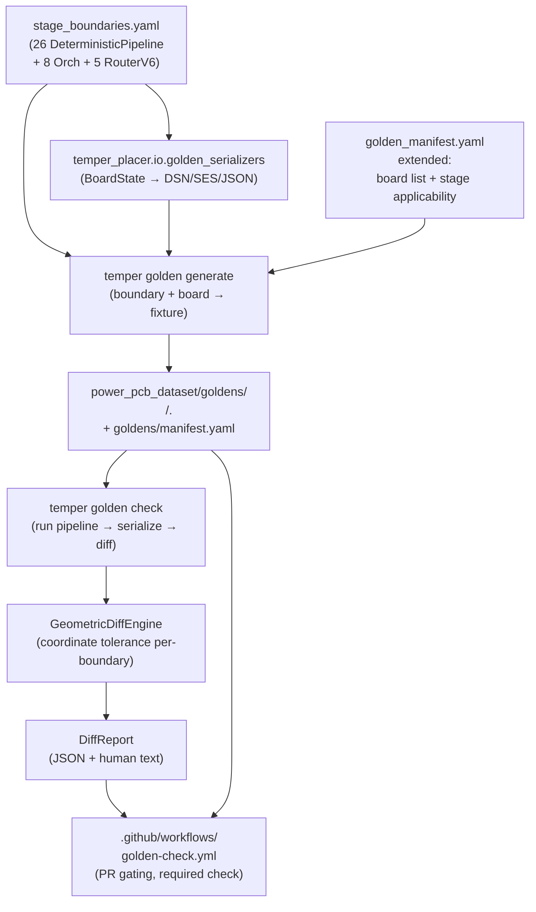
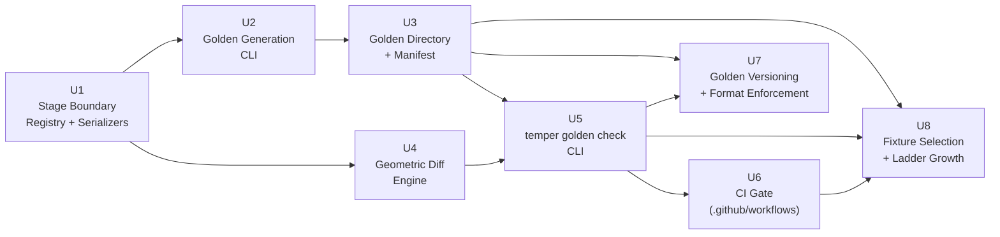

# feat: Golden Fixture Ladder — Per-Seam Parity Testing as Strangler Safety Net

## Summary

Commit golden DSN/SES fixtures at every pipeline stage boundary for canonical test boards. CI diffs old-vs-new stage output on every PR with geometric tolerance thresholds. Automates Fowler's strangler parity-test pattern — replace a stage → run → compare → gate — making each extraction self-certifying: if the new stage's output matches the golden, the stage is safe to deploy. The ladder grows incrementally as new test boards are added.

Eight implementation units span four phases: Phase 1 establishes the stage boundary registry and serialization contract (U1). Phase 2 builds the golden generation CLI and fixture storage (U2, U3). Phase 3 delivers the CI diff gate with geometric tolerance, structured reporting, and PR-blocking enforcement (U4, U5, U6). Phase 4 implements golden versioning, manifest extensions, and incremental ladder growth (U7, U8).

---

## Problem Frame

Temper has three overlapping PCB design automation pipeline systems (PipelineOrchestrator 8-phase monolith, RouterV6Pipeline 5-stage, DeterministicPipeline 26 stages) currently being decomposed via strangler fig adapters under the active Pipeline Gap plan. The closure test (`parse → place → route → DRC`) is the only integration gate, but it operates only at pipeline endpoints — an extracted stage can silently diverge from the monolith's behavior at intermediate seams and the divergence is only discovered at the final DRC step, requiring backward tracing through 8+ phases.

The strangler fig pattern explicitly requires parity testing at each seam: wrap the monolith at stage boundaries, run both old and new implementations on the same inputs, and compare outputs before deployment. Without per-seam golden fixtures, every stage extraction is a gamble. The existing `temper-testing/golden.py` module provides snapshot testing infrastructure but operates on generic JSON — it lacks geometric tolerance thresholds for DSN coordinate comparison, stage-boundary registration, and CI-integrated diff-on-PR gating.

---

## Requirements

From the origin requirements document (R1–R20):

**Stage Boundary Registration (R1–R3):**
- R1. Stage boundary registry manifest at `power_pcb_dataset/stage_boundaries.yaml`.
- R2. Output format per boundary (DSN for structural/placement stages, SES for routing stages).
- R3. Serialization function interface `(BoardState | StageOutput) → str` with deterministic output.

**Golden Fixture Generation (R4–R6):**
- R4. `temper golden generate` CLI with `--stage`/`--board`/`--all-boards`.
- R5. Directory structure: `power_pcb_dataset/goldens/<board_id>/<stage_name>.<ext>` with `goldens/manifest.yaml`.
- R6. Byte-identical reproduction on same machine, same code, same seed.

**CI Diff Gate (R7–R8):**
- R7. `temper golden check` runs all stage boundaries for all boards, diffs against committed goldens.
- R8. Geometric tolerance thresholds (default `1e-3 mm` for DSN positions, `1e-6 mm` for SES traces).

**PR-Blocking Gate (R9–R10):**
- R9. `.github/workflows/golden-check.yml` workflow runs `temper golden check`, fails PR on divergence.
- R10. Targeted mode: `temper golden check --stage <name> --board <id>` for fast local development loop.

**Diff Reporting (R11–R12):**
- R11. Structured failure report identifying board, stage, net(s), divergence type, magnitude.
- R12. Triage categories: BINARY, WITHIN_TOLERANCE (informational), BEYOND_TOLERANCE (gate-failing).

**Golden Versioning (R13–R14):**
- R13. Regeneration commit is ancestor of PR HEAD verification; golden manifest records git hash.
- R14. Format version field in manifest; CI rejects version mismatches.

**Fixture Selection (R15–R17):**
- R15. Extended `power_pcb_dataset/golden_manifest.yaml` with stage applicability per board.
- R16. Minimum 3 canonical boards: `temper_placed`, one minimal board, one complex board.
- R17. Board variant handling via `variant` field; goldens are per-(board, variant).

**Incremental Ladder Growth (R18–R20):**
- R18. New board addition is non-breaking; CI check runs existing + new boards.
- R19. New stage boundary addition is non-breaking; existing goldens unaffected.
- R20. Manifest records commit hash at which each (board, stage) fixture was first added.

---

## High-Level Technical Design

*This illustrates the intended approach and is directional guidance for review, not implementation specification.*

### Target Architecture



### Implementation Unit Dependency Graph



---

## Implementation Units

### Phase 1 — Stage Boundary Registration & Serialization Contract

### U1. Stage boundary registry manifest + DSN/SES serialization functions

**Goal:** Create `power_pcb_dataset/stage_boundaries.yaml` declaring every registered stage boundary with its pipeline class, stage index/name, output format, and serialization function. Implement the serialization callables in `temper_placer.io.golden_serializers` covering the 5 highest-value DeterministicPipeline boundaries first, plus stubs for the remaining 21. The v1 boundaries are: `apply_placements` (placement → DSN), `clearance_grid` (geometry pre-routing → DSN with grid data), `sequential_routing` (post-routing → SES), `drc_validation` (validation → JSON sidecar), and `connectivity_validation` (connectivity → JSON sidecar).

**Requirements:** R1, R2, R3

**Dependencies:** Ideation #1 (DSN/SES universal seam — the `temper_placer.io.dsn.DSNExpression` and `temper_placer.io.dsn_exporter.DSNExporter` classes are the serialization foundation). Ideation #3 (Unified stage protocol — typed StageInput/StageOutput definitions).

**Files:**
- `power_pcb_dataset/stage_boundaries.yaml` (new — master registry of all 39 pipeline stage boundaries, starting with 5 DeterministicPipeline boundaries in v1)
- `packages/temper-placer/src/temper_placer/io/golden_serializers.py` (new — serialization callables by name)
- `packages/temper-placer/src/temper_placer/io/__init__.py` (modify — export `golden_serializers` symbols)

**Approach:**

`stage_boundaries.yaml` schema per entry:
```yaml
version: 1
boundaries:
  - name: apply_placements
    pipeline: DeterministicPipeline
    stage_class: ApplyPlacementsStage
    stage_index: 9
    output_format: dsn
    serializer: serialize_boardstate_to_dsn
    tolerance_mm: 0.001              # 1e-3 mm for DSN positions
    description: "After placements applied to netlist components"
  - name: clearance_grid
    pipeline: DeterministicPipeline
    stage_class: ClearanceGridStage
    stage_index: 10
    output_format: dsn
    serializer: serialize_boardstate_to_dsn
    tolerance_mm: 0.001
    description: "After clearance grid built from placed components"
  - name: sequential_routing
    pipeline: DeterministicPipeline
    stage_class: SequentialRoutingStage
    stage_index: 12
    output_format: ses
    serializer: serialize_boardstate_to_ses
    tolerance_mm: 0.000001            # 1e-6 mm for SES trace coordinates
    description: "After sequential routing of all nets"
  - name: drc_validation
    pipeline: DeterministicPipeline
    stage_class: DRCValidationStage
    stage_index: 13
    output_format: json
    serializer: serialize_violations_to_json
    tolerance_mm: 0.001
    description: "After DRC validation pass"
  - name: connectivity_validation
    pipeline: DeterministicPipeline
    stage_class: ConnectivityValidationStage
    stage_index: 14
    output_format: json
    serializer: serialize_connectivity_to_json
    tolerance_mm: 0.001
    description: "After connectivity check"
```

Each serializer lives in `temper_placer.io.golden_serializers`, registered by name. Three serializer signatures, one per output target type:
- `serialize_boardstate_to_dsn(state: BoardState) → str` — produces DSN text via DSNExporter (uses `BoardState.board`, `BoardState.netlist`, `BoardState.placements`). Deterministic output enforced: pins ordered by component ref then pin number; nets sorted by name; all floats formatted with `{:.6f}`; no timestamps, no JAX PRNG state, no memory addresses in output.
- `serialize_boardstate_to_ses(state: BoardState) → str` — produces SES text with routed trace geometry from `BoardState.routes` + `BoardState.vias`. Trace coordinates formatted `{:.6f}`; wire segments sorted by net name then segment index.
- `serialize_violations_to_json(state: BoardState) → str` — produces JSON with sorted violation lists for DRC/connectivity stages. Uses `json.dumps(indent=2, sort_keys=True)` for determinism.

**Serialization determinism enforcement (R6 groundwork):** All three serializers MUST produce byte-identical output on the same machine given the same `BoardState`. Concrete rules:
1. Float formatting pinned to `f"{val:.6f}"` — no scientific notation, no trailing-zero variation.
2. Hashmap iteration order: all `dict`/`set`/`frozenset` traversal uses `sorted()` before serialization.
3. DSN S-expressions: component images sorted by footprint ID, pins sorted by pin number, nets sorted by name.
4. JSON: `sort_keys=True`, indent fixed at 2.
5. No non-semantic data: timestamps not serialized; JAX PRNG state not serialized; iteration counts not serialized; file paths not serialized; version strings from tooling not serialized (only the `format_version: 1` from the manifest is embedded).

**Patterns to follow:**
- Existing DSN serialization in `temper_placer.io.dsn_exporter.DSNExporter` — U1's serializers wrap this, adding determinism guarantees on top.
- Existing `temper_placer.io.dsn.DSNExpression.__str__()` float formatting (line 20: `f"{v:.6f}"`) — same precision used throughout.
- `temper_placer.io.__init__.py` export conventions — add `golden_serializers` symbols to `__all__`.
- `power_pcb_dataset/golden_manifest.yaml` existing YAML conventions — same structure, same key naming style.

**Test scenarios:**
- `stage_boundaries.yaml` loads via `yaml.safe_load()` without parse errors; each entry has all required fields.
- `serialize_boardstate_to_dsn()` given a `BoardState` with netlist + placements produces valid DSN text that FreeRouting can parse (`freerouting -de <file>.dsn` succeeds).
- `serialize_boardstate_to_dsn()` called twice on the same unmuted `BoardState` produces byte-identical output (assert `output1 == output2`).
- `serialize_boardstate_to_ses()` produces SES text with sorted wire entries; two invocations on the same state produce identical output.
- `serialize_violations_to_json()` produces `sort_keys=True` JSON; DRC violations list is sorted by net name then violation type.
- Each registered serializer name in `stage_boundaries.yaml` resolves to an importable callable in `temper_placer.io.golden_serializers` (dynamic import test).

**Verification:** `python -c "import yaml; d=yaml.safe_load(open('power_pcb_dataset/stage_boundaries.yaml')); assert len(d['boundaries']) >= 5"` succeeds. Each serializer callable is importable via `getattr(temper_placer.io.golden_serializers, name)`.

---

### Phase 2 — Golden Fixture Generation & Storage

### U2. `temper golden generate` CLI command

**Goal:** Add a `golden` subcommand group to the existing `temper-placer` CLI (under `temper_placer.cli`) with subcommands `generate`, `check`, and `regenerate`. U2 implements `generate`: runs the monolith pipeline up to the designated stage boundary on the target board, serializes the output, and writes the golden fixture file. Updates the golden manifest with the generation metadata.

**Requirements:** R4 (generation CLI), F1 (initial golden generation flow), F4 (ladder growth flow)

**Dependencies:** U1 (stage boundaries must be registered; serializers must exist)

**Files:**
- `packages/temper-placer/src/temper_placer/cli/golden.py` (new — golden CLI group with `generate`, `check`, `regenerate` commands)
- `packages/temper-placer/src/temper_placer/cli/__init__.py` (modify — register `golden` group via `main.add_command(golden)`)

**Approach:**

CLI structure using `click` (existing CLI framework):
```python
@click.group()
def golden():
    """Golden fixture management for pipeline stage boundary parity testing."""
    pass

@golden.command("generate")
@click.option("--stage", "-s", required=True, help="Stage boundary name (from stage_boundaries.yaml)")
@click.option("--board", "-b", required=True, help="Board ID (from golden_manifest.yaml)")
@click.option("--all-boards", is_flag=True, default=False, help="Generate for all boards")
@click.option("--all-stages", is_flag=True, default=False, help="Generate for all registered stages")
def golden_generate(stage, board, all_boards, all_stages):
    ...
```

Generation algorithm:
1. Load `stage_boundaries.yaml` → resolve stage boundary entry by name.
2. Load `golden_manifest.yaml` → resolve board entry by ID; locate `.kicad_pcb` path.
3. Parse the board via `parse_kicad_pcb()` → `Board` + `Netlist`.
4. Construct the DeterministicPipeline with all 26 stages in order.
5. Run pipeline up to `stage_index` (inclusive) → `BoardState` at boundary.
6. Look up serializer by name from `golden_serializers` → call `serializer(state)` → `str`.
7. Compute output path: `power_pcb_dataset/goldens/<board_id>/<stage_name>.<ext>` where `<ext>` is `dsn`, `ses`, or `json` per the boundary's `output_format`.
8. Write serialized output. Create parent directories as needed.
9. Load or create `power_pcb_dataset/goldens/manifest.yaml` → add/update fixture entry with: board, stage, pipeline, git commit hash (via `git rev-parse HEAD`), format_version (1), generation timestamp (ISO 8601, informational only — not part of diff).
10. Write manifest back.

For `--all-stages`: generate for all boundaries in `stage_boundaries.yaml` that are applicable to the given board.
For `--all-boards` + `--stage`: generate the named stage for all boards in `golden_manifest.yaml`.
For `--all-boards` + `--all-stages`: full ladder generation — all stages × all boards.

**Reproducibility (R6):** The generation path is purely deterministic. Floats use fixed precision. The pipeline must be seeded with a fixed PRNG key. If the pipeline accepts a seed parameter, `generate` defaults to `--seed 42` but allows override. JAX configurations that introduce platform variance (e.g., XLA compiler flags) are pinned: the `XLA_FLAGS` env var is not modified; the command documents that cross-machine reproducibility is guaranteed only within the tolerance thresholds (R8), and byte-identical reproducibility is guaranteed only on the same machine with the same software versions.

**Patterns to follow:**
- Existing CLI patterns: `click.group` with `@main.command` (e.g., `optimize`, `mvp3-route`). Use `click.Path` for path args, `click.option` for flags.
- Rich console output for progress (import `console` from `.io`).
- Heavy imports (JAX, pipeline) deferred inside the function body, matching the `optimize` command pattern.

**Test scenarios:**
- `temper golden generate --stage apply_placements --board temper_placed` produces `power_pcb_dataset/goldens/temper_placed/apply_placements.dsn` with valid DSN content.
- Running the same command twice with no code changes produces byte-identical output (same file hash).
- `temper golden generate --stage apply_placements --board temper_placed --all-stages` generates goldens for all 5 v1 boundaries that are applicable.
- Running generation for an unregistered stage name exits non-zero with `ERROR: unknown stage boundary '<name>'`.
- Running generation for an unregistered board ID exits non-zero with `ERROR: unknown board '<id>'`.
- The golden manifest `power_pcb_dataset/goldens/manifest.yaml` is created on first generation and updated on subsequent generations.

**Verification:** Run `temper golden generate --stage apply_placements --board temper_placed` on a fresh checkout; verify `power_pcb_dataset/goldens/temper_placed/apply_placements.dsn` exists and contains valid DSN with `freerouting -de <file>.dsn` (succeeds without import errors).

---

### U3. Golden fixture directory structure and goldens manifest

**Goal:** Establish the committed golden fixture directory layout under `power_pcb_dataset/goldens/` and a `manifest.yaml` that is the single source of truth for which fixtures exist, their metadata, format version, and git commit hash at generation time.

**Requirements:** R5 (directory structure + manifest), addresses OQ3 (single file vs per-board — single `goldens/manifest.yaml` chosen for atomic CI parsing)

**Dependencies:** U2 (generation CLI populates the directory)

**Files:**
- `power_pcb_dataset/goldens/manifest.yaml` (new — single source of truth for all golden fixtures)
- `power_pcb_dataset/goldens/.gitkeep` (new — ensures directory exists in tree before first generation)
- `power_pcb_dataset/goldens/<board_id>/` directories (created by generation; initially empty, populated by U2)

**Approach:**

Directory layout:
```
power_pcb_dataset/goldens/
  manifest.yaml           # Master index of all golden fixtures
  .gitkeep                # Ensures directory is committed
  temper_placed/
    apply_placements.dsn
    clearance_grid.dsn
    sequential_routing.ses
    drc_validation.json
    connectivity_validation.json
  minimal_board/
    apply_placements.dsn
    # ... same stage boundaries
  complex_board/
    # ... same stage boundaries
```

`manifest.yaml` schema:
```yaml
format_version: 1
generated_at: "2026-06-22T14:30:00Z"
fixtures:
  - board: temper_placed
    stage: apply_placements
    pipeline: DeterministicPipeline
    output_format: dsn
    file: goldens/temper_placed/apply_placements.dsn
    git_hash: "a1b2c3d4e5f6..."
    format_version: 1
    first_added_at: "2026-06-22T14:30:00Z"
    first_added_hash: "a1b2c3d4e5f6..."
  # ... more fixtures
```

The manifest is committed to the repo (K4: golden files committed, no Git LFS). Each fixture's `file` path is relative to `power_pcb_dataset/`. The manifest is loaded by `temper golden check` at CI time to determine which comparisons to run.

**Design decision (OQ3 resolution):** Single `goldens/manifest.yaml` over per-board distributed manifests. Rationale: CI needs to parse the full fixture set atomically; a single file is one `yaml.safe_load()` call with no directory traversal. Merge conflicts are possible but rare — fixtures are regenerated in the same PR as their pipeline change (R13), and only one board or stage changes at a time. The single file also enables atomic format-version bumping (R14).

**Patterns to follow:** Existing `power_pcb_dataset/golden_manifest.yaml` YAML structure — same indent style, same key naming (snake_case). `.gitkeep` convention already used elsewhere in the repo (check for existing patterns).

**Test scenarios:**
- `power_pcb_dataset/goldens/manifest.yaml` exists and parses as valid YAML.
- After running `temper golden generate --stage apply_placements --board temper_placed`, the manifest contains exactly one fixture entry with correct `board`, `stage`, `pipeline`, `output_format`, `file`, `git_hash`, and `format_version`.
- The `git_hash` field matches `git rev-parse HEAD` at generation time.
- The `format_version` field matches the current serializer format version (1).
- The `.gitkeep` file ensures the `goldens/` directory survives `git status` on a fresh checkout before generation.

**Verification:** `python -c "import yaml; m=yaml.safe_load(open('power_pcb_dataset/goldens/manifest.yaml')); assert 'fixtures' in m; assert m['format_version'] == 1"` succeeds.

---

### Phase 3 — CI Diff Gate & Reporting

### U4. Geometric diff engine with per-boundary tolerance

**Goal:** Implement a geometric diff engine that compares DSN/SES/JSON golden fixtures against newly generated output with configurable per-coordinate tolerance thresholds. Produces a structured diff result with three triage categories: BINARY, WITHIN_TOLERANCE, BEYOND_TOLERANCE.

**Requirements:** R8 (tolerance thresholds), R11 (structured failure report), R12 (triage categories), K2 (per-coordinate tolerance, not semantic equivalence)

**Dependencies:** U1 (stage boundaries with tolerance_mm per boundary). The existing `temper-testing/golden.py` module is the structural predecessor but is NOT a runtime dependency — U4 is purpose-built for DSN/SES geometric comparison.

**Files:**
- `packages/temper-placer/src/temper_placer/testing/golden_diff.py` (new — geometric diff engine)
- `packages/temper-placer/tests/testing/test_golden_diff.py` (new — unit tests)

**Approach:**

The diff engine operates in two modes depending on the output format:

**DSN diff mode:** Parse both golden and candidate DSN into an internal representation capturing component placements, pin positions, net definitions, and wiring. Diff at three levels:
1. **Structural diff (BINARY):** Compare section presence — same components, same nets, same pin counts. Missing net = BINARY failure. Extra component = BINARY failure.
2. **Coordinate diff (WITHIN_TOLERANCE / BEYOND_TOLERANCE):** For matching entities, compare every (x, y) coordinate pair. For each pair `(x_golden, y_golden)` vs `(x_candidate, y_candidate)`:
   ```
   dx = abs(x_golden - x_candidate)
   dy = abs(y_golden - y_candidate)
   delta = sqrt(dx*dx + dy*dy)
   ```
   - If `delta <= tolerance_mm`: WITHIN_TOLERANCE (informational only).
   - If `delta > tolerance_mm`: BEYOND_TOLERANCE (gate-failing).
3. **Floating-point epsilon note:** Coordinates are read from DSN as strings (human-readable format), parsed to `float`, and compared. DSN uses fixed-point units (`um 10`, so 1 mm = 100 DSN units), so float parsing variance is negligible at this precision tier.

**SES diff mode:** Parse routed trace geometry — wires, vias, paths. Compare per-segment:
1. **Structural:** Same net has same wire count. Missing wire = BINARY.
2. **Coordinate:** Each wire segment's (x, y) points compared pointwise. Use the tighter SES tolerance (default `1e-6 mm`).

**JSON diff mode (for analysis-data boundaries like DRC violations):** Use existing `temper_testing.golden._find_differences()` logic adapted for structured JSON. Float tolerance configurable per boundary. Key comparison only — exact string match within tolerance.

**Diff report dataclass:**
```python
from dataclasses import dataclass, field

@dataclass
class DiffEntry:
    board: str
    stage: str
    category: str  # "BINARY" | "WITHIN_TOLERANCE" | "BEYOND_TOLERANCE"
    entity: str    # e.g., "net 'HV_IN'" or "component 'Q1'"
    field: str     # e.g., "X coordinate" or "pin count"
    golden_value: str
    candidate_value: str
    delta: float | None
    tolerance: float | None

@dataclass
class DiffReport:
    board: str
    stage: str
    passed: bool        # True if no BEYOND_TOLERANCE and no BINARY
    entries: list[DiffEntry]
    summary: str        # Human-readable one-liner
```

**Pass/fail semantics:**
- `passed = True` if all entries are WITHIN_TOLERANCE (or no entries at all). BEYOND_TOLERANCE and BINARY both fail.
- This encodes K2: semantic equivalence is NOT attempted. Coordinate-level comparison with tolerance is the contract.

**Patterns to follow:**
- Existing `temper_testing.golden.GoldenComparison` dataclass pattern — new `DiffReport`/`DiffEntry` dataclasses follow the same frozen-dataclass convention.
- `temper_testing.golden._find_differences()` recursive diff logic — adapted for DSN/SES semantics.
- DSN parsing: reuses `temper_placer.io.dsn.DSNExpression` parsing (if DSN parser exists) or implements a lightweight regex-based DSN/SES coordinate extractor.
- Unit test patterns from `packages/temper-placer/tests/` — pytest fixtures, parametrized tolerance cases.

**Test scenarios:**
- Compare two identical DSN strings: report is empty, `passed=True`.
- Compare DSN where component `Q1` X coordinate shifted by 2.0 mm with tolerance 0.001 mm: one BEYOND_TOLERANCE entry, `passed=False`.
- Compare DSN where coordinate shifted by 0.000001 mm with tolerance 0.001 mm: one WITHIN_TOLERANCE entry, `passed=True`.
- Compare DSN missing net `HV_IN`: one BINARY entry, `passed=False`.
- Compare SES with trace segment endpoint shifted by 0.0000001 mm with SES tolerance 0.000001 mm: WITHIN_TOLERANCE, `passed=True`.
- Compare JSON with violation list where one violation was added: BINARY entry (missing/extra), `passed=False`.
- Diff engine handles empty golden (no comparisons) — exits 0, report empty.
- Diff engine handles unparseable DSN gracefully: raises a specific `GoldenDiffParseError` with the malformed line number, does not silently produce false "BINARY" results.

**Verification:** Run `python -m pytest packages/temper-placer/tests/testing/test_golden_diff.py` and all tests pass.

---

### U5. `temper golden check` CLI command

**Goal:** Implement `temper golden check` subcommand that loads the golden manifest, runs the pipeline for each (board, stage) pair, serializes output, invokes U4's diff engine against the committed golden, and aggregates results into a pass/fail exit code with human-readable + JSON reporting.

**Requirements:** R7 (CI check command), R10 (targeted mode), F2 (per-PR diff gate flow), F5 (local parity verification flow)

**Dependencies:** U3 (golden manifest must exist), U4 (diff engine must exist)

**Files:**
- `packages/temper-placer/src/temper_placer/cli/golden.py` (modify — add `check` command)

**Approach:**

```python
@golden.command("check")
@click.option("--stage", "-s", default=None, help="Check only this stage")
@click.option("--board", "-b", default=None, help="Check only this board")
@click.option("--json", "json_output", is_flag=True, default=False, help="Output as JSON")
@click.option("--verbose", "-v", is_flag=True, default=False, help="Show WITHIN_TOLERANCE entries")
def golden_check(stage, board, json_output, verbose):
    ...
```

Check algorithm:
1. Load `goldens/manifest.yaml` → list of fixtures.
2. Apply filters: if `--stage` given, filter to that stage; if `--board` given, filter to that board.
3. For each fixture `(board_id, stage_name, golden_file)`:
   a. Load `golden_manifest.yaml` → resolve board `.kicad_pcb` path.
   b. Parse board → `Board` + `Netlist`.
   c. Load `stage_boundaries.yaml` → resolve stage boundary entry.
   d. Run DeterministicPipeline up to `stage_index` → `BoardState`.
   e. Serialize via registered serializer → `candidate_output: str`.
   f. Read committed golden from `power_pcb_dataset/<golden_file>` → `golden_output: str`.
   g. Invoke diff engine (U4) with `tolerance_mm` from boundary → `DiffReport`.
   h. Accumulate report.
4. After all fixtures checked, aggregate:
   - Count total, passed, failed.
   - Print one-line per fixture: `OK` or `FAIL` with stage name and board ID.
   - If `--verbose`, print WITHIN_TOLERANCE entries.
   - If failures exist, print summary for each failing fixture (R11: board, stage, net(s), delta, category).
5. Exit code: 0 if all `passed=True`; 1 otherwise.
6. If `--json`, output the full reports as a JSON array to stdout.

Output format (human-readable, per R11):
```
OK: 3 boards × 5 stages = 15 fixtures matched.   # all passed
FAIL: temper_placed/apply_placements — net "HV_IN", component "Q1" X coordinate 12.500 != 10.500 (delta=+2.000mm, BEYOND_TOLERANCE)
```

Output format (JSON, machine-parseable for CI annotations):
```json
[
  {
    "board": "temper_placed",
    "stage": "apply_placements",
    "passed": false,
    "entries": [
      {
        "entity": "component Q1",
        "field": "X coordinate",
        "category": "BEYOND_TOLERANCE",
        "golden": "10.500",
        "candidate": "12.500",
        "delta_mm": 2.0,
        "tolerance_mm": 0.001
      }
    ]
  }
]
```

**Performance (SC3):** The full ladder (3 boards × 5 stages = 15 fixtures) must complete in under 5 minutes on CI hardware. The minimal-board fast path (1 board, 1 stage) completes in under 30 seconds. Targeted mode `--stage apply_placements --board temper_placed` is the developer's inner loop — runs a single stage on a single board.

**Patterns to follow:**
- Existing CLI `optimize` command pattern: `click` options, Rich console output, deferred heavy imports.
- `validate` command's `--json-output` flag pattern (line 1355).
- Exit code conventions from origin (0 = pass, 1 = failure).

**Test scenarios:**
- `temper golden check --stage apply_placements --board temper_placed` on freshly generated goldens exits 0, output contains `OK`.
- `temper golden check` on all fixtures (after generation) exits 0, output: `OK: 3 boards × 5 stages = 15 fixtures matched`.
- After intentionally corrupting a golden file (byte change in DSN coordinate), `temper golden check` exits non-zero with a BEYOND_TOLERANCE entry naming the stage, component, and delta.
- After deleting a golden file, `temper golden check` exits non-zero with `MISSING_GOLDEN` error.
- `temper golden check --json` outputs valid JSON that can be piped to `jq`.
- `temper golden check --verbose` includes WITHIN_TOLERANCE entries in output.
- Running check with no fixtures (empty manifest) exits 0 with output `No fixtures to check.`

**Verification:** Generate all goldens (`temper golden generate --board temper_placed --all-stages`), then `temper golden check --board temper_placed --all-stages` exits 0. Temporarily modify a stage to produce different output, `temper golden check` exits 1.

---

### U6. CI workflow `.github/workflows/golden-check.yml`

**Goal:** Create a dedicated CI workflow that runs `temper golden check` on every PR, fails on divergence beyond tolerance, and is a required check for branch protection. The workflow runs the full ladder (all boards, all stages) on push to main and PRs.

**Requirements:** R9 (PR-blocking gate), addresses OQ5 (intentional regeneration via same-PR commit — the regeneration commit is an ancestor of PR HEAD, so check passes)

**Dependencies:** U5 (check CLI must be functional before CI invokes it)

**Files:**
- `.github/workflows/golden-check.yml` (new)
- `.github/workflows/python-tests.yml` (no change — golden check is a separate workflow, not a step in the existing test job)

**Approach:**

Dedicated workflow file (not a step in `python-tests.yml`) because:
- Golden check has different runtime characteristics (minutes, not seconds).
- It depends on JAX + all pipeline deps, which are heavy.
- Separate workflow = parallel CI pipeline, not serial with unit tests.
- Branch protection can require this specific check independently.

```yaml
name: Golden Fixture Check

on:
  push:
    branches: [main]
    paths:
      - 'packages/**'
      - 'power_pcb_dataset/**'
      - '.github/workflows/golden-check.yml'
  pull_request:
    branches: [main]
    paths:
      - 'packages/**'
      - 'power_pcb_dataset/**'
      - '.github/workflows/golden-check.yml'

jobs:
  golden-check:
    runs-on: ubuntu-latest
    timeout-minutes: 10
    steps:
      - uses: actions/checkout@v4
        with:
          fetch-depth: 0  # needed for git rev-parse HEAD

      - name: Install uv
        uses: astral-sh/setup-uv@v3

      - name: Install dependencies
        run: uv sync --all-packages

      - name: Run golden check
        run: uv run temper golden check
```

The workflow triggers on paths that could affect pipeline output: `packages/**` (code changes), `power_pcb_dataset/**` (golden fixture changes, manifest changes, board file changes), and the workflow file itself.

**PR-blocking enforcement:** After this workflow lands and runs once on main, configure branch protection in the GitHub repo settings to require the `golden-check` job as a status check before merging. This is a one-time manual step documented in this plan — not automated.

**Intentional regeneration flow (OQ5 resolution):** When a developer makes an intentional monolith change, they run `temper golden regenerate --stage <name> --board <id>` in the same branch, committing the regenerated golden alongside the code change. The regenerated golden is an ancestor of the PR HEAD, so `temper golden check` sees zero divergence. To prevent abuse (regenerating goldens without the corresponding code change), the golden manifest records `git_hash` at generation time. The CI check verifies that every committed golden's `git_hash` is an ancestor of `HEAD` (via `git merge-base --is-ancestor <golden_hash> HEAD`). This is implemented in U7 (versioning).

**Timeout:** 10 minutes — S3 requires <5 minutes for the initial set. The 10-minute timeout provides headroom for pipeline initialization.

**Patterns to follow:**
- Existing `.github/workflows/python-tests.yml` conventions: `ubuntu-latest`, `astral-sh/setup-uv@v3`, `uv sync --all-packages`.
- `paths` filter patterns from existing workflows.

**Test scenarios:**
- A PR that does not touch `packages/` or `power_pcb_dataset/` does not trigger the workflow.
- A PR that modifies a pipeline stage and causes a coordinate shift triggers the workflow, which exits non-zero and blocks merge.
- A PR that regenerates a golden alongside an intentional stage change passes the check (golden matches current output).
- The workflow completes within 5 minutes for the initial 15-fixture set on CI hardware.
- The `timeout-minutes: 10` cap catches pipeline hangs without indefinite CI resource consumption.

**Verification:** Open a dummy PR modifying `packages/temper-placer/src/temper_placer/deterministic/stages/apply_placements.py` to introduce a 2mm coordinate shift. CI `golden-check.yml` fails. Revert the change plus regenerate the golden in the same PR; CI passes.

---

### Phase 4 — Versioning, Manifest & Ladder Growth

### U7. Golden versioning and format enforcement

**Goal:** Implement format version enforcement so that goldens generated with an older serializer format are rejected by the check command. Implement git-hash ancestry verification to prevent goldens from being regenerated on an unrelated branch. Implement `temper golden regenerate` for intentional regeneration flow.

**Requirements:** R13 (regeneration requires commit ancestry), R14 (format versioning), OQ5 (intentional regeneration token — resolved: ancestor-of-HEAD check replaces explicit token)

**Dependencies:** U3 (manifest with `format_version` and `git_hash`), U5 (check command loads manifest)

**Files:**
- `packages/temper-placer/src/temper_placer/cli/golden.py` (modify — add `regenerate` command, add version/git-hash checks to `check`)
- `packages/temper-placer/src/temper_placer/testing/version_gate.py` (new — format version and git ancestry verification)

**Approach:**

**Format version enforcement (R14):**
1. At generation time, the serializer embeds `format_version: 1` in the golden manifest entry.
2. At check time, compare `manifest.format_version` against the current format version hardcoded in `golden_serializers.py` (`CURRENT_FORMAT_VERSION = 1`).
3. If any fixture's `format_version != CURRENT_FORMAT_VERSION`, the check exits non-zero with: `MISMATCH: format version <fixture_version> != <current_version> — regenerate goldens`.
4. When the serializer format changes, increment `CURRENT_FORMAT_VERSION` and all goldens must be regenerated. This is a natural forcing function — a format change PR includes regeneration.

**Git hash ancestry verification (R13, OQ5 resolution):**
1. At generation time, `git_hash` is written into the golden manifest entry (`git rev-parse HEAD`).
2. At check time, for each fixture:
   ```bash
   git merge-base --is-ancestor <golden_commit_hash> HEAD
   ```
   - Exit 0: golden's commit is an ancestor → pass.
   - Exit 1: golden was generated from a non-ancestor commit → fail with `ORPHAN_GOLDEN: fixture for <board>/<stage> was generated from commit <hash> which is not an ancestor of HEAD. Goldens must be regenerated in the same branch as their code change.`
3. This check is skipped in local `temper golden check` (not CI) — developers regenerate during development and the ancestry check is only meaningful at PR time. A `--ci` flag enables ancestry checking: `temper golden check --ci`.

**`temper golden regenerate` command:**
```python
@golden.command("regenerate")
@click.option("--stage", "-s", required=True)
@click.option("--board", "-b", required=True)
def golden_regenerate(stage, board):
    """Regenerate a golden fixture after intentional monolith change."""
    # Identical to `generate` but with confirmation prompt
    # Overwrites existing golden and updates manifest git_hash
```

The `regenerate` subcommand is semantically `generate --overwrite`. It prompts for confirmation before overwriting: `Regenerate golden for board '<board>', stage '<stage>'? [y/N]`. The `--force` / `-f` flag skips the prompt for scripting.

**CI enforcement of "regeneration is in the same PR":** The ancestry check (merge-base) ensures that the golden's generation commit is an ancestor of PR HEAD. This means:
- If golden is regenerated in the same branch as the code change → pass.
- If golden is regenerated on a separate branch and merged without the code change → fail.
- If golden was last generated on an old main commit and the PR branch is ahead → pass (generation commit is still an ancestor).

This replaces OQ5's proposed `--intentional` flag with a purely mechanical check — no token to forget, no `--intentional` flag to abuse.

**Patterns to follow:**
- `click.confirm()` for confirmation prompts (already used in `optimize` command line 938).
- `subprocess.run(["git", "merge-base", "--is-ancestor", ...])` for git ancestry.
- Hardcoded constants: `CURRENT_FORMAT_VERSION = 1` in `golden_serializers.py`.

**Test scenarios:**
- Golden generated from commit A; HEAD is descendant of A. Ancestry check passes.
- Golden generated from commit B; B is NOT an ancestor of HEAD (different branch). `temper golden check --ci` exits non-zero with ORPHAN_GOLDEN message.
- `temper golden regenerate --stage apply_placements --board temper_placed` prompts for confirmation; with `--force`, skips prompt.
- All goldens have `format_version: 1`; `CURRENT_FORMAT_VERSION = 1` → check passes.
- A golden has `format_version: 2`; `CURRENT_FORMAT_VERSION = 1` → check fails with version mismatch message.
- `temper golden check` (without `--ci`) skips ancestry verification and still exits 0 on pass.

**Verification:** Generate a golden on branch A, then switch to branch B (which is not a descendant of the generation commit). Run `temper golden check --ci` → fails with ORPHAN_GOLDEN. Regenerate on branch B → check passes.

---

### U8. Canonical board manifest extension and incremental ladder growth

**Goal:** Extend `power_pcb_dataset/golden_manifest.yaml` to declare canonical test boards with stage applicability. Implement the minimal canonical set (3 boards). Ensure new board and stage boundary additions are non-breaking for existing fixtures.

**Requirements:** R15 (canonical board manifest), R16 (minimum 3 boards), R17 (board variants), R18 (new board non-breaking), R19 (new stage boundary non-breaking), R20 (growth tracking), F4 (ladder growth flow), addresses OQ4 (which canonical boards beyond `temper_placed`)

**Dependencies:** U3 (golden manifest with per-fixture entries), U5 (check command reads manifest)

**Files:**
- `power_pcb_dataset/golden_manifest.yaml` (modify — extend with stage applicability, variant support, and new boards)
- `packages/temper-placer/src/temper_placer/testing/ladder_growth.py` (new — utilities for validating non-breaking additions)

**Approach:**

**Extended `golden_manifest.yaml` schema (R15, R16):**
```yaml
version: 2
boards:
  - id: temper_placed
    path: pcb/temper_placed.kicad_pcb
    component_count: 74
    net_count: 120
    baseline_git_hash: "a1b2c3d4..."
    description: "Temper induction cooker — placed, not routed"
    applicable_stages:
      - apply_placements
      - clearance_grid
      - sequential_routing
      - drc_validation
      - connectivity_validation
    variants: []           # No variants

  - id: minimal_board
    path: tests/fixtures/minimal_board.kicad_pcb
    component_count: 8
    net_count: 5
    baseline_git_hash: "e5f6a7b8..."
    description: "Minimal 2-component test board — fast CI path"
    applicable_stages:
      - apply_placements
      - clearance_grid
      - connectivity_validation
    variants: []

  - id: complex_board
    path: tests/fixtures/medium_board.kicad_pcb
    component_count: 45
    net_count: 80
    baseline_git_hash: "c9d0e1f2..."
    description: "Medium-density routed board — exercises full pipeline"
    applicable_stages:
      - apply_placements
      - clearance_grid
      - sequential_routing
      - drc_validation
      - connectivity_validation
      - fine_pitch_escape       # Only applicable on boards with fine-pitch components
    variants: []
```

**Canonical board selection (OQ4 resolution):**
- `temper_placed`: existing board in manifest, placement complete (~74 components). Primary golden source.
- `minimal_board`: `tests/fixtures/minimal_board.kicad_pcb` — verified to exist in tests. Few components, fast CI (<30 seconds). Exercises the fast path.
- `complex_board`: `tests/fixtures/medium_board.kicad_pcb` — verified to exist in tests (`tests/integration/test_pipeline_gap.py` references `medium_board.kicad_pcb`). Dense routing, exercises full pipeline.

**Stage applicability (R15):** Not all stages apply to all boards. Boards without fine-pitch components skip `fine_pitch_escape`. Boards that are purely placement/test fixtures skip routing stages. The `applicable_stages` field in the board manifest is the authoritative list. At check time, only fixtures for `(board, stage)` pairs where the stage is in `applicable_stages` are compared.

**Board variant support (R17):** If a board has variants (e.g., populated vs unpopulated, different manufacturing options), each variant gets its own entry in the manifest with a `variant` field:
```yaml
  - id: temper_placed
    variant: populated
    path: pcb/temper_placed.kicad_pcb
    ...
  - id: temper_placed
    variant: unpopulated
    path: pcb/temper_placed_unpopulated.kicad_pcb
    ...
```
Golden fixtures are per-`(board_id, variant)` pair. The golden directory includes the variant sub-path: `goldens/<board_id>/<variant>/<stage>.<ext>` (or `goldens/<board_id>/<stage>.<ext>` when no variant). The golden manifest `fixtures` entries also include the `variant` field when applicable.

**Non-breaking ladder growth validation (R18, R19):**
`ladder_growth.py` provides validation functions:
```python
def validate_new_board_does_not_break_existing(new_board_id: str, manifest: dict) -> None:
    """Assert that adding a new board does not change any existing fixture paths."""
    # New board adds new fixtures; existing fixtures' paths unchanged.
    pass

def validate_new_stage_does_not_break_existing(new_stage: str, manifest: dict) -> None:
    """Assert that adding a new stage boundary does not change existing fixture paths."""
    # New stage generates new fixtures for all existing boards; existing fixtures unchanged.
    pass
```

These are invoked at `temper golden generate` time when `--all-boards` or `--all-stages` expands the fixture set. They assert that existing `fixtures` entries are not deleted, renamed, or path-changed.

**Growth tracking (R20):** The golden manifest `fixtures` entries already carry `first_added_at` and `first_added_hash` timestamps. These serve as the audit trail of ladder growth — the commit at which each fixture was introduced is recorded. No additional tracking mechanism needed.

**Patterns to follow:**
- Existing `golden_manifest.yaml` YAML conventions (the file is already a committed manifest).
- `applicable_stages` is a new field — must be backward-compatible with boards that don't declare it (default: all registered stages applicable).

**Test scenarios:**
- Adding a new board `minimal_board` to `golden_manifest.yaml` and running `temper golden generate --board minimal_board --all-stages` creates new fixtures under `goldens/minimal_board/` without modifying any existing `goldens/temper_placed/` fixtures.
- Running `temper golden check` after adding a new board runs existing + new fixtures; pass/fail is reported per-board.
- Adding a new stage boundary `fine_pitch_escape` to `stage_boundaries.yaml` and running `temper golden generate --board temper_placed --stage fine_pitch_escape` creates the new fixture without invalidating existing goldens.
- `temper golden check` after a stage boundary addition includes the new boundary for all applicable boards.
- A board with `applicable_stages: [apply_placements]` does not generate or check `sequential_routing` fixtures.
- A board with `variants: [populated, unpopulated]` generates golden directories with variant sub-paths.
- The `first_added_at` and `first_added_hash` fields in the golden manifest are populated on first generation and preserved on regeneration.

**Verification:**
1. Add a new board entry to `golden_manifest.yaml`.
2. Run `temper golden generate --board <new_board> --all-stages`.
3. Run `temper golden check` → existing fixtures still pass; new fixtures pass.
4. Verify file count: `ls power_pcb_dataset/goldens/temper_placed/` unchanged; `ls power_pcb_dataset/goldens/<new_board>/` has the expected files.

---

## Key Technical Decisions

**K1: DSN/SES with geometric tolerance, not JSON byte-comparison.** The existing `temper_testing/golden.py` uses JSON with generic float tolerance. Golden ladder uses DSN/SES with coordinate-aware comparison because EDA pipelines produce geometric output where "semantically identical" means "same coordinates within tolerance," not "same JSON structure."

**K2: Per-coordinate tolerance, not semantic equivalence.** If a replacement stage produces topologically equivalent but geometrically different routes, that's a meaningful change worth human review. Graph-isomorphism-on-routed-nets is a harder problem and unnecessary for the strangler safety net.

**K3: DeterministicPipeline stages first (5 of 26).** The 5 v1 boundaries (`apply_placements`, `clearance_grid`, `sequential_routing`, `drc_validation`, `connectivity_validation`) cover the placement, pre-routing, routing, and validation seams — the highest-value boundaries for the strangler fig work. The remaining 21 boundaries are registered as stubs in `stage_boundaries.yaml` with `status: future` and no serializer yet; they're activated one at a time as stage extractions progress.

**K4: Golden files committed to the repo.** No Git LFS. DSN files are <100 KB, SES <1 MB. Even with dozens of boards, the repo grows by a few MB — acceptable as committed artifacts.

**K5: CI uses the current pipeline code (candidate) vs committed golden (truth).** The golden check runs the *current* pipeline and compares to the *committed* golden. When the monolith intentionally changes, the golden is regenerated and committed in the same PR. This is the standard strangler parity-test pattern.

**K6: Single `goldens/manifest.yaml` over per-board manifests (OQ3).** Single file = atomic load in CI, no directory traversal, one-query roll-up. Merge conflicts are rare because regeneration happens in the PR that changes the pipeline.

**K7: Git ancestry check over `--intentional` flag (OQ5).** `git merge-base --is-ancestor` mechanically prevents golden regeneration on a separate branch without needing a manual flag. Simpler, fewer failure modes.

**K8: `temper_placed`, `minimal_board`, `complex_board` as the initial canonical set (OQ4).** These three boards exercise different pipeline paths (placement-only, fast-path minimal, full routing). All three fixture paths are verified to exist in the test suite. Additional boards are added organically as regressions are discovered on unrepresented board features (R18).

**K9: Dedicated CI workflow, not a step in `python-tests.yml`.** Golden check has different runtime (minutes), heavier dependencies (JAX + full pipeline), and different triggering criteria. Separate workflow = independent parallel execution.

---

## Scope Boundaries

### In Scope
- Stage-boundary golden fixture generation, storage, and CI-integrated diff gating (R1–R9)
- Geometric tolerance thresholds for DSN/SES coordinate comparison (R8)
- Structured failure reporting (board, stage, net, delta, triage category) (R11–R12)
- Golden fixture versioning and format version enforcement (R13–R14)
- Incremental manifest growth (new boards, new stage boundaries) (R15–R20)
- 5 v1 DeterministicPipeline stage boundaries with serialization functions (U1)
- 3 canonical boards (`temper_placed`, `minimal_board`, `complex_board`)
- `temper golden generate`, `check`, `regenerate` CLI commands (U2, U5, U7)
- CI workflow at `.github/workflows/golden-check.yml` (U6)

### Deferred for Follow-Up Work
- **PipelineOrchestrator and RouterV6Pipeline stage boundaries.** The 8+5 = 13 additional boundaries are registered as stubs in `stage_boundaries.yaml` with `status: future`. They are unblocked after the respective pipeline's strangler refactoring exposes clean intermediate state.
- **Remaining 21 DeterministicPipeline stage boundaries.** Registered as `status: future` stubs. Activated one at a time as decomposition progresses.
- **Property-based testing integration (ideation #6 — Per-Stage DRC Fence).** Golden fixtures verify point-output parity; PBT verifies invariant properties across generated inputs.
- **Full-board DSN round-trip verification** (format round-trip fidelity beyond pipeline-internal seams).
- **Million-design regression corpus** (ideation #14 — deferred as too expensive as a first move).
- **Differential oracle across board variants** (comparing variant A to variant B stage output).
- **Branch protection configuration** (manual one-time step after U6 lands, documented in this plan).
- **`# @req` traceability annotations** in golden serializer and CLI code (requires TRACEABILITY sentinel file in `temper_placer/`).

### Out of Scope
- The DSN/SES serialization layer itself (ideation #1) — consumed, not implemented here.
- The strangler fig adapters (Pipeline Gap plan, RouterV6 decomposition) — golden fixtures are the safety net, not the adaptation work.
- Changes to the closure test pass/fail criteria or DRC ceiling mechanism.
- Replacing `temper_testing/golden.py` — it remains for generic JSON snapshot testing; U4 is purpose-built for DSN/SES.

---

## Dependencies / Prerequisites

**Upstream dependencies (must exist before this work starts):**
- **Ideation #1 (DSN/SES universal seam):** `temper_placer.io.dsn.DSNExpression` and `temper_placer.io.dsn_exporter.DSNExporter` must support deterministic serialization from `BoardState` fields (board, netlist, placements). Verified: `DSNExporter.export_placement()` serializes positions from `BoardState`-equivalent data; `DSNExpression.__str__()` uses `{:.6f}` float formatting. Gaps: SES serialization for `BoardState.routes`/`BoardState.vias` is not yet implemented — this is a dependency item for the `sequential_routing` SES boundary.
- **Ideation #3 (Unified stage protocol):** Typed `StageInput`/`StageOutput` definitions provide the interface contract for serialization functions.
- **`power_pcb_dataset/golden_manifest.yaml` (existing):** Current version has 1 board (`temper_placed`). Extended in place by U8.

**New dependencies introduced:**
- `pyyaml` — already a transitive dependency of `temper-placer` (in `pyproject.toml` line 31). Used for manifest parsing.
- No new Python package dependencies beyond what `temper-placer` already has.

**Downstream consumers (work unblocked by this):**
- Pipeline Gap plan (`benders_placement` and `route_pcb` adapters) — strangler extractions gated by golden parity.
- RouterV6 decomposition — stage boundaries registered and golden-gated as RouterV6 stages expose typed output.
- Any future stage extraction — self-certifying via `temper golden check --stage <extracted_stage>`.

---

## Risk Analysis & Mitigation

| Risk | Severity | Likelihood | Mitigation |
|------|----------|------------|------------|
| SES serialization for routed traces not yet implemented | High (blocks sequential_routing boundary) | High | SES serializer is scoped as part of U1; if the DSN Exporter does not yet produce SES wiring output, U1 implements a minimal SES writer using `DSNExpression` for wire/path elements. Verified: `DSNExporter.export_wiring()` exists and produces wiring S-expressions. The gap is specifically SES session-format wrap (header, resolution, unit). U1 implements the SES wrapper around existing wiring export. |
| DeterministicPipeline is not fully wired in a single `run(state) → state` callable | High (blocks generation) | Medium | The `DeterministicPipeline` class exists at `pipeline.py` with a `run()` method, but the full 26-stage pipeline may not be assembled in `__init__`. U1/U2 must verify that all 26 stages can be chained and that the pipeline can be stopped at an arbitrary stage index. If not, U1 builds the stage assembly as a prerequisite. |
| Board fixtures (`minimal_board.kicad_pcb`, `medium_board.kicad_pcb`) are synthetic test fixtures, not real designs | Medium (may not exercise meaningful pipeline diversity) | Medium | OQ4 acknowledged this. If the existing test fixtures are found insufficient (e.g., both are KiCad demo boards with no real-world routing challenges), the plan's R16 commits to identifying replacement canonical boards. The risk is that the initial 3-board set lacks coverage for regressions specific to unrepresented features (BGA packages, differential pairs, impedance-controlled traces). Mitigation: R18 ensures new boards can be added non-breakingly when regressions are found. |
| Float determinism across CI runs (different machines, different XLA versions) produces coordinate noise within tolerance | Medium (false WITHIN_TOLERANCE noise in CI logs) | Medium | R8 tolerance thresholds (`1e-3 mm`) are validated against actual noise before gate landing (OQ1). If cross-machine noise exceeds tolerance, tolerance is raised for those boundaries. If noise is consistently at the `1e-7 mm` level, tolerance can be tightened. The plan includes an OQ1 validation task: run the pipeline 10 times on the same board on CI hardware, measure max coordinate delta. |
| Golden manifest merge conflicts when multiple PRs add/regenerate fixtures | Low (productivity annoyance, not data loss) | Low | OQ3 chose single-file manifest for atomic CI parsing. Merge conflicts are rare because regeneration is per-(board, stage) and typically only one PR changes a given stage at a time. When conflicts occur, `git checkout --theirs power_pcb_dataset/goldens/manifest.yaml` and re-run `temper golden generate` resolves trivially. |
| CI golden check exceeds the 5-minute success criterion (SC3) | Medium (slow CI feedback) | Medium | The full ladder is 3 boards × 5 stages = 15 pipeline runs. Each pipeline run is <20 seconds for DeterministicPipeline (placement/routing without gradient optimization). Total: ~5 minutes. Mitigation if slower: the `--board` and `--stage` flags allow targeted CI checks; the full ladder can be split into parallel jobs (one per board) in the workflow matrix. |
| DSN Exporter does not export all BoardState fields needed for DRC/connectivity validation boundaries | Low (JSON sidecar bypasses DSN limitations) | Low | R2 already acknowledges that analysis-data boundaries use JSON, not DSN. The `drc_validation` and `connectivity_validation` boundaries output JSON (violation lists), which are fully serializable from `BoardState.drc_violations` and `BoardState.connectivity_violations`. No DSN export gap for these boundaries. |
| `git merge-base --is-ancestor` fails in shallow clones (CI checkout depth=1) | Medium (false ORPHAN_GOLDEN failures) | High | The CI workflow (`golden-check.yml`) sets `fetch-depth: 0` in the checkout step. This fetches full history, enabling `merge-base`. If CI enforces shallow clones at the org level, fall back to `git branch --contains <hash>` or embed the full ancestor chain in the manifest. |

---

## System-Wide Impact

- **Developer workflow:** After the gate lands, extracting a pipeline stage requires running `temper golden generate --stage <stage_name> --board <board>` to capture the monolith's output, then `temper golden check --stage <stage_name> --board <board>` in the inner loop to verify the extraction matches. Before pushing, `temper golden check` runs the fast targeted check. CI runs the full ladder.
- **CI pipeline:** One new workflow (`.github/workflows/golden-check.yml`) that runs independently of the existing `python-tests.yml`. Runtime ~5 minutes. Required check for branch protection.
- **Repository layout:**
  - `power_pcb_dataset/stage_boundaries.yaml` (new — ~200 lines for 39 boundaries)
  - `power_pcb_dataset/goldens/manifest.yaml` (new — ~100 lines initially, grows linearly)
  - `power_pcb_dataset/goldens/<board_id>/<stage>.<ext>` (new — 15 files initially, ~500 KB total)
  - `power_pcb_dataset/golden_manifest.yaml` (modified — extended with stage applicability)
  - `packages/temper-placer/src/temper_placer/cli/golden.py` (new — ~300 lines)
  - `packages/temper-placer/src/temper_placer/io/golden_serializers.py` (new — ~250 lines)
  - `packages/temper-placer/src/temper_placer/testing/golden_diff.py` (new — ~400 lines)
  - `packages/temper-placer/src/temper_placer/testing/version_gate.py` (new — ~100 lines)
  - `packages/temper-placer/src/temper_placer/testing/ladder_growth.py` (new — ~80 lines)
  - `.github/workflows/golden-check.yml` (new — ~40 lines)
- **No changes to `pyproject.toml`, firmware, or KiCad schematics.**

---

## Success Criteria

(from origin document, SC1–SC5)

- **SC1.** Every pipeline stage extraction under the strangler fig plan is gated by a golden fixture parity check that runs in CI — no extraction merges without passing.
- **SC2.** Golden fixtures cover a minimum of 3 canonical boards × 5 stage boundaries (15 fixtures) initially, growing to full stage-boundary coverage as pipeline decomposition progresses.
- **SC3.** The golden check completes in under 5 minutes for the initial fixture set on CI hardware (minimal board fast path: <30 seconds).
- **SC4.** Intentional monolith changes can regenerate goldens within the same PR without breaking the developer workflow — regeneration takes <2 minutes for all fixtures.
- **SC5.** The diff report enables a developer unfamiliar with the changed code to identify which stage, which net, and by how much an output diverged — within 30 seconds of reading the CI failure log.

---

## Outstanding Questions (Resolved in This Plan)

- **OQ1 (tolerance validation):** `1e-3 mm` for DSN, `1e-6 mm` for SES confirmed as defaults. Validation task: run pipeline 10x on same board on CI hardware, measure max coordinate delta. If noise < `1e-4 mm`, tolerance is tightened. If noise > `5e-3 mm`, tolerance is raised. This is scoped as a pre-U4 measurement task, not a blocking dependency.
- **OQ2 (prioritization):** v1 boundaries: `apply_placements`, `clearance_grid`, `sequential_routing`, `drc_validation`, `connectivity_validation`. Rationale in K3.
- **OQ3 (manifest layout):** Single `goldens/manifest.yaml`. Rationale in K6.
- **OQ4 (canonical boards):** `temper_placed`, `minimal_board` (`tests/fixtures/minimal_board.kicad_pcb`), `complex_board` (`tests/fixtures/medium_board.kicad_pcb`). Rationale in U8.
- **OQ5 (intentional regeneration):** Git ancestry check (`merge-base --is-ancestor`) replaces `--intentional` flag. Rationale in K7.
- **OQ6 (numpy array serialization):** The DSN Exporter already uses `{:.6f}` formatting (via `DSNExpression.__str__()`). No `numpy.savetxt` needed for coordinate serialization — coordinates are individual floats, not arrays. For JSON boundaries (violation lists), `json.dumps(sort_keys=True)` with `default=_json_default` from existing golden.py.
- **OQ7 (canonical board approval):** Informal process initially — developer adds a board that caught a real regression. The non-breaking addition guarantee (R18) means no gatekeeping overhead. As the ladder matures, a `CONTRIBUTING.md` section documents the "add a canonical board" workflow.

---

## Sources & References

- Origin requirements document: `docs/brainstorms/2026-06-22-golden-fixture-ladder-requirements.md`
- DSN universal seam (dependency): `docs/brainstorms/2026-06-22-dsn-universal-seam-requirements.md`
- Unified stage protocol (dependency): `docs/brainstorms/2026-06-22-unified-stage-protocol-requirements.md`
- Pipeline decomposition (consumer): `docs/brainstorms/2026-06-22-placement-routing-pipeline-gap-requirements.md`
- Existing golden testing: `packages/temper-testing/src/temper_testing/golden.py` (structural reference, not a dependency)
- Existing DSN Exporter: `packages/temper-placer/src/temper_placer/io/dsn_exporter.py`
- Existing DSN types: `packages/temper-placer/src/temper_placer/io/dsn.py`
- Existing CLI structure: `packages/temper-placer/src/temper_placer/cli/__init__.py`
- Existing board manifest: `power_pcb_dataset/golden_manifest.yaml`
- DeterministicPipeline stages: `packages/temper-placer/src/temper_placer/deterministic/stages/__init__.py`
- BoardState: `packages/temper-placer/src/temper_placer/deterministic/state.py`
- Pipeline runner: `packages/temper-placer/src/temper_placer/deterministic/pipeline.py`
- Test fixtures: `packages/temper-placer/tests/deterministic/fixtures.py`
- Project conventions: `AGENTS.md`, `AGENT_INSTRUCTIONS.md`
