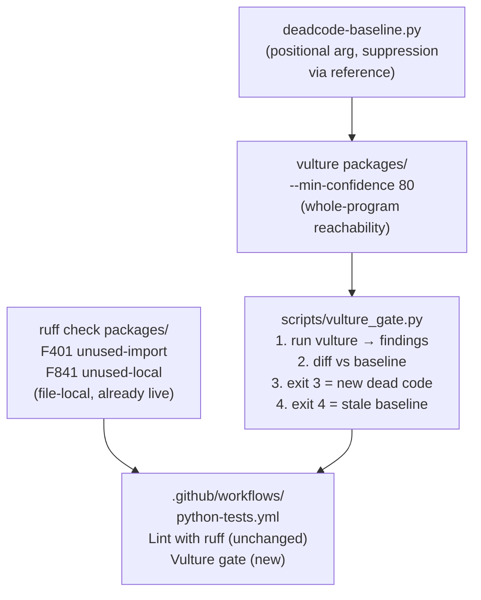
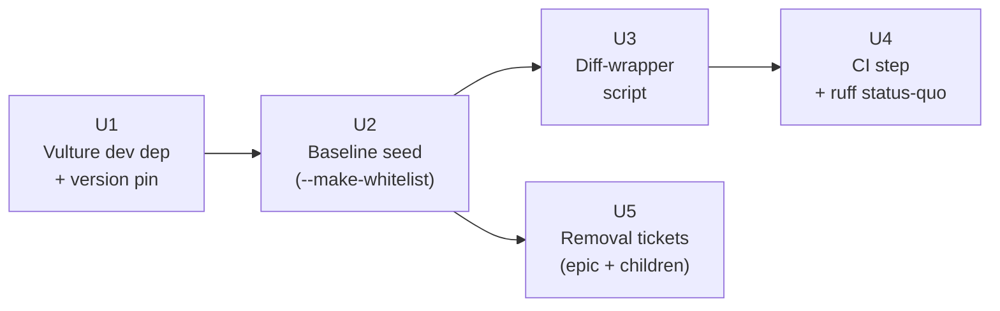

# feat: Vulture + Ruff F401/F841 CI Dead-Code Gate with Baseline Allowlist

## Summary

Two-phase initiative that makes dead code a CI failure instead of a slow accumulation. Phase 1 adds Vulture as a workspace dev dependency and seeds a committed `deadcode-baseline.py` allowlist from `vulture --make-whitelist` output across all seven `packages/` at once. Phase 2 lands the CI gate: a Vulture step in `.github/workflows/python-tests.yml` runs after the existing "Lint with ruff" step, plus a diff-wrapper script that fails the job on any finding not in the baseline (new dead code) AND on any baseline line Vulture no longer reports (stale entry). Ruff `F401`/`F841` are already enabled in `pyproject.toml` line 59 and already run at `.github/workflows/python-tests.yml` line 53 — this plan asserts that status quo as R6 rather than re-implementing it. The net-new mechanism is Vulture's whole-program AST reachability, which catches the "implemented but never wired in" failure mode that ruff's file-local F-rules cannot see. Composes with the N3 coverage gate (dynamic) as the static reachability layer.

---

## Problem Frame

The June 2026 clean-base sprint surfaced the recurring failure mode: code that exists, compiles, imports, and never runs. A DRC check implemented but never wired into the CLI's hardcoded list; a debug `print()` in a class body; a `design_rules.py` path duplicated outside the `src/` layout; a `.pyx` twin of a pure-Python module. None are caught by tests (the code is unreachable, so tests don't exercise it) or by ruff `F401`/`F841` (which are file-local: unused imports and unused locals, not unreachable functions or classes). They are found only when a human opens the file.

The structural defense missing is **whole-program reachability analysis**: a tool that knows `foo()` is never called from any entry point, anywhere in `packages/`. Vulture provides this via AST traversal with confidence tiers; ruff does not. The boy-scout rule has no mechanical enforcement today — dead code accrues because removing it is optional and adding it is unblocked. This gate freezes current debt into a baseline allowlist and makes *new* dead code a CI failure. Baseline entries are individually ticketed and removed over time; the allowlist only ever shrinks. (see origin — Problem Frame)

---

## Requirements

From the origin requirements document (R1–R7):

- R1. **Vulture is a dev dependency** in the workspace `pyproject.toml` `[dependency-groups] dev` group, alongside the existing `ruff`/`mypy`/`pytest` entries. No runtime dependency is introduced.
- R2. **A CI step runs Vulture** in `.github/workflows/python-tests.yml`, after the existing "Lint with ruff" step. The step runs Vulture over `packages/` at `--min-confidence 80`, referencing a committed baseline. The step fails the job on any finding not present in the baseline.
- R3. **A baseline allowlist file** (`deadcode-baseline.py`, repo root, committed) is seeded from `vulture --make-whitelist` output at gate-landing time. It lists every pre-existing dead-code finding the gate is introduced with. The file is a Python source file consumed by Vulture as a positional argument (suppression via reference), per Vulture's native whitelist mechanism.
- R4. **New dead code fails CI immediately.** No warn-only grace period; the baseline absorbs all pre-existing debt at landing, so any finding absent from the baseline is by definition new.
- R5. **A stale baseline entry is a CI failure.** A line in `deadcode-baseline.py` that Vulture no longer reports (because the symbol was deleted or wired up) must itself fail the gate. Enforced by a diff-wrapper that compares Vulture's reported findings against the baseline and fails on baseline-only entries.
- R6. **Ruff `F401` and `F841` remain enabled** in `[tool.ruff.lint]` `select` (currently `"F"` covers both) and are not added to `ignore`. Status-quo assertion — already live in `.github/workflows/python-tests.yml` line 53 (`uv run ruff check packages/`). This requirement exists to prevent the dead-code gate from being weakened by a future config edit.
- R7. **Every baseline entry has a removal ticket** filed at gate-landing time as a single tracking epic with one child ticket per entry. Tickets are linked from the PR that lands the gate. The baseline is debt with a documented exit path, not permanent amnesty.

---

## High-Level Technical Design

*This illustrates the intended approach and is directional guidance for review, not implementation specification.*

### Target architecture



### Implementation unit dependency graph



---

## Implementation Units

### Phase 1 — Dependency & Baseline

### U1. Add Vulture to workspace dev dependencies with version pin

**Goal:** Add `vulture` to the workspace root `[dependency-groups] dev` group in `pyproject.toml`, pinned to `vulture>=2.16,<3.0`. Workspace-level declaration matches how `ruff`/`mypy`/`pytest` are declared today (root `pyproject.toml` lines 8–14).

**Requirements:** R1

**Dependencies:** None

**Files:**
- `pyproject.toml` (root — append `"vulture>=2.16,<3.0"` to the `dev = [...]` list in `[dependency-groups]`)

**Approach:** Append `"vulture>=2.16,<3.0"` to the existing `dev` group array. The pin matches how other dev tools are declared (lower-bound + major upper-bound). Vulture 2.16 is the current stable line; the `<3.0` upper bound guards against a major release silently changing CLI semantics or whitelist format and invalidating the committed baseline. A Vulture 3.x upgrade PR would regenerate the baseline and review entry-by-entry (see origin — Assumptions).

After editing, run `uv sync --all-packages` to materialize the dependency, then `uv run vulture --version` to confirm the installed version is in the pinned range.

**Patterns to follow:** Existing `[dependency-groups] dev` entries in root `pyproject.toml` (lines 8–14).

**Test scenarios:**
- `uv run vulture --version` prints a version `>= 2.16` and `< 3.0`.
- `uv sync --all-packages` succeeds with the new entry present.
- No per-package `pyproject.toml` is modified — Vulture is workspace-scoped, matching ruff/mypy.

**Verification:** `uv run vulture --version` succeeds and reports a 2.16.x version.

---

### U2. Seed `deadcode-baseline.py` from `vulture --make-whitelist` across all packages

**Goal:** Generate the committed baseline allowlist file at repo root by running `vulture --make-whitelist` over all seven `packages/` at `--min-confidence 80`. The file lists every pre-existing dead-code finding the gate is introduced with, in Vulture's native whitelist format (a Python source file where each reported symbol is referenced, suppressing it on subsequent runs).

**Requirements:** R3, covers F2

**Dependencies:** U1 (Vulture must be installed before seeding)

**Files:**
- `deadcode-baseline.py` (new — repo root, committed)
- `docs/plans/2026-06-22-009-feat-vulture-ruff-deadcode-gate-plan.md` (this document — record baseline entry count in U5)

**Approach:** Vulture's whitelist mechanism is *not* a `--whitelist <file>` flag — there is no such flag in Vulture 2.x. The whitelist is a `.py` file passed as a **positional argument** alongside the scan paths. Vulture treats names referenced in the whitelist file as "used", suppressing their reports. This is why the baseline file is `deadcode-baseline.py`, not `.txt`.

Seeding command (run once, at gate-landing time):

```bash
uv run vulture packages/ --min-confidence 80 --make-whitelist > deadcode-baseline.py
```

`--make-whitelist` prints Python source referencing each reported symbol (one line per finding), suitable for committing as the suppression file. Review the output before committing — `--make-whitelist` emits a header comment indicating it is auto-generated; retain that header so future readers know regeneration is `vulture ... --make-whitelist > deadcode-baseline.py`.

**Scope:** All seven `packages/` at once — `temper-autoprof`, `temper-drc`, `temper-placer`, `temper-testing`, `temper-tools`, `temper-validation`, `temper-workflow`. A pilot on `temper-drc` alone would defer the gate's value and require a second landing. The baseline absorbs `temper-placer`'s larger existing debt without per-package triage. Vulture scans Python files by path, not by import resolution, so the layout mismatch (`temper-placer` uses a flat `packages/temper-placer/temper_placer/` layout while others use `src/`) does not affect reachability analysis. (see origin — Assumptions)

**Sanity check after seeding:** Run `uv run vulture packages/ deadcode-baseline.py --min-confidence 80` and confirm the exit code is 0 (all findings suppressed by the baseline). If exit code is nonzero, either the baseline is incomplete or some findings shifted confidence — re-run `--make-whitelist` and review.

**Patterns to follow:** Vulture's native `--make-whitelist` output format. No project precedent exists for a dead-code baseline; this file establishes it.

**Test scenarios:**
- `deadcode-baseline.py` exists at repo root and is valid Python (parses with `python -c "import ast; ast.parse(open('deadcode-baseline.py').read())"`).
- `uv run vulture packages/ deadcode-baseline.py --min-confidence 80` exits 0 (baseline suppresses all current findings).
- The baseline file contains a header comment indicating it is auto-generated by `vulture --make-whitelist`.
- The baseline entry count is recorded in the landing PR description and in U5's tracking epic.

**Verification:** The post-seed Vulture run exits 0 with the baseline as a positional argument. The baseline file parses as valid Python.

---

### Phase 2 — CI Gate

### U3. Diff-wrapper script for new-dead-code and stale-baseline enforcement

**Goal:** A small Python wrapper script that runs Vulture, captures its findings, and produces a three-bucket diff against `deadcode-baseline.py`: new (fail), matched (pass), stale-baseline (fail). This implements R5 — Vulture alone cannot detect stale baseline entries because it exits 0 when all findings are whitelisted (the whitelist is a suppression list, not a report-allowlist). The wrapper is the mechanism that makes a stale baseline line a CI failure.

**Requirements:** R2 (partial — the wrapper is invoked by the CI step), R5

**Dependencies:** U2 (baseline must exist before the wrapper can diff against it)

**Files:**
- `scripts/vulture_gate.py` (new)
- `scripts/vulture_gate_test.py` (new — unit tests for the diff logic, optional but recommended)

**Approach:** Vulture's exit-code semantics in 2.x:

- Exit 0 when no unreachable code is reported (or all reports are suppressed by the whitelist positional arg).
- Exit nonzero (typically 1) when unreachable code is reported that is NOT suppressed.

This means a bare `vulture packages/ deadcode-baseline.py --min-confidence 80` catches **new** dead code (R4) but is structurally blind to **stale** baseline entries (R5): if a baseline line references a symbol Vulture no longer reports, Vulture exits 0 because there is nothing to report. The diff-wrapper closes this gap.

Wrapper algorithm (directional):

```
1. Run `vulture packages/ --min-confidence 80 --output=...` (without the baseline) to capture the full "raw" report set.
2. Run `vulture packages/ deadcode-baseline.py --min-confidence 80 --output=...` (with the baseline) to capture the baseline-suppressed "reported" set.
   - After each Vulture invocation, check the return code. If Vulture exits with any code other than 0 or 1, exit 5 with `[VULTURE-ERROR] Vulture exited with unexpected code <N>`.
   - Vulture's report format: "<file>:<line>: <kind> <name> (<confidence%>)"
3. Parse the raw report into a set of (file, line, name) triples — the "raw" set.
4. Parse the reported set into a set of (file, line, name) triples — the "reported" set.
5. Parse deadcode-baseline.py into the set of (file, line, name) triples it suppresses — the "baseline" set.
   - The baseline file is Python source; each suppression line has the form
     `_.foo  # <file>:<line>: <kind>` (or similar — confirm exact format against
     the installed Vulture 2.16 output at implementation time).
   - If any line in the baseline file cannot be parsed, fail loudly: exit 5 with `[VULTURE-ERROR] Unparseable line in deadcode-baseline.py: <line>`.
6. If any line in Vulture's output reports cannot be parsed, fail loudly: exit 5 with `[VULTURE-ERROR] Unparseable Vulture output: <line>`. Do NOT silently drop findings.
7. Buckets:
   - new = reported     → fail with exit code 3, print each new finding
   - stale = baseline − raw    → fail with exit code 4, print each stale line
   - matched = raw ∩ baseline  → pass
8. If both new and stale are empty, exit 0.
9. If only `new` is nonempty, exit 3.
10. If only `stale` is nonempty, exit 4.
11. If both are nonempty, exit 3 (new dead code is the more urgent signal; print stale too).
```

The wrapper runs Vulture **twice**: once without the baseline (to capture all current findings for stale detection) and once with the baseline (to detect new dead code). Vulture is fast on this codebase (~seconds for seven packages).

Exit codes are chosen to be distinct from Vulture's own (1) and from each other so CI logs name the failure mode unambiguously. The wrapper prints a human-readable summary to stdout and a GitHub-annotation-formatted block to `$GITHUB_STEP_SUMMARY` when that env var is present.

**Patterns to follow:** Existing `scripts/` Python utilities (e.g., `scripts/generate_kicad_dru.py`). Use `argparse`, `subprocess.run`, exit codes per POSIX convention. No third-party deps beyond Vulture itself.

**Test scenarios:**
- Given a clean tree where Vulture's report matches the baseline exactly, `scripts/vulture_gate.py` exits 0.
- Given a new unreachable function added to a `packages/` module, the wrapper exits 3 and names the file, line, and symbol.
- Given a baseline entry whose symbol has been deleted, the wrapper exits 4 and names the stale baseline line.
- Given both a new finding and a stale entry, the wrapper exits 3 and prints both buckets.
- The wrapper resolves `packages/` and `deadcode-baseline.py` relative to the repo root regardless of working directory.
- When run with `--help`, the wrapper documents its exit codes (0 ok, 3 new dead code, 4 stale baseline, 5 Vulture error).
- Given Vulture exits with an unexpected code (e.g., signal crash, exit 137), the wrapper exits 5 and prints a message naming the failure mode (e.g., `[VULTURE-ERROR] Vulture exited with unexpected code 137`).
- Given Vulture produces output on stderr but exits 0, the wrapper still exits 0 (stderr is informational; Vulture uses it for warnings).
- Unit tests for the parsing/diff logic run without invoking Vulture (mock the subprocess output).

**Verification:** `uv run python scripts/vulture_gate.py --help` exits 0. Temporarily adding an unreachable function to a `packages/` module causes exit 3. Temporarily removing a line from `deadcode-baseline.py` for a still-reported symbol causes exit 4.

---

### U4. CI step in python-tests.yml + ruff F-rule status-quo assertion

**Goal:** Add a "Vulture dead-code gate" step to `.github/workflows/python-tests.yml` that invokes `scripts/vulture_gate.py` after the existing "Lint with ruff" step. Confirm ruff `F401`/`F841` remain enabled in `pyproject.toml` and that the existing ruff step is unchanged — this is the R6 status-quo assertion, recorded as a CI-visible fact rather than new work.

**Requirements:** R2, R4, R5, R6

**Dependencies:** U3 (the wrapper must exist before the CI step invokes it)

**Files:**
- `.github/workflows/python-tests.yml` (modify — add one step after "Lint with ruff", line 53)
- `pyproject.toml` (no change — R6 is a status-quo assertion; record in this plan that `"F"` remains in `select` and is absent from `ignore`)

**Approach:** Insert a new step immediately after the existing "Lint with ruff" step (currently line 52–53):

```yaml
      - name: Vulture dead-code gate
        run: uv run python scripts/vulture_gate.py
```

Also extend `on.push.paths` and `on.pull_request.paths` to include `'deadcode-baseline.py'` and `'scripts/vulture_gate.py'` so that edits to the gate itself trigger the workflow:

```yaml
on:
  push:
    branches: [main]
    paths:
      - 'packages/**'
      - 'pyproject.toml'
      - '.github/workflows/python-tests.yml'
      - 'deadcode-baseline.py'          # <-- added
      - 'scripts/vulture_gate.py'       # <-- added
  pull_request:
    branches: [main]
    paths:
      - 'packages/**'
      - 'pyproject.toml'
      - '.github/workflows/python-tests.yml'
      - 'deadcode-baseline.py'          # <-- added
      - 'scripts/vulture_gate.py'       # <-- added
```

The step inherits the workflow's `on:` triggers (push to `main` + pull_request to `main`, path-filtered to `packages/**`, `pyproject.toml`, and the workflow file itself). Matching ruff's triggers is the default and is correct: Vulture's runtime over seven packages is seconds, not minutes — there is no CI-cost reason to narrow triggers. The path filter should be extended to include `deadcode-baseline.py` and `scripts/vulture_gate.py` so edits to the gate itself trigger the workflow. Add those paths to both `push` and `pull_request` `paths:` lists.

R6 status-quo assertion: at the time of landing, confirm by reading `pyproject.toml` line 59 that `select = ["E", "W", "F", "I", "B", "C4", "UP"]` (the `"F"` family covers F401 and F841) and line 60 that `ignore = ["E501"]` (no F-rule suppression). Record this in the PR description as a verified status-quo, not as a config change. The requirement exists so a future config edit that drops `"F"` or adds `"F401"`/`"F841"` to `ignore` is a visible regression against this gate's intent.

**Patterns to follow:** Existing "Lint with ruff" step (`.github/workflows/python-tests.yml` line 52–53) — same shape, same job (`test`), same `uv run` invocation pattern.

**Test scenarios:**
- On a pull request that adds no new dead code and does not touch the baseline, the "Vulture dead-code gate" step exits 0 and the workflow passes.
- On a pull request that adds an unreachable function, the step exits 3 and the workflow fails, naming the file, line, and symbol in the step log.
- On a pull request that deletes a dead symbol but leaves its line in `deadcode-baseline.py`, the step exits 4 and the workflow fails, naming the stale baseline line.
- On a pull request that deletes a dead symbol AND removes its baseline line in the same commit, the step exits 0 — the documented monotonic-shrinkage workflow (F3).
- The workflow still runs the "Lint with ruff" step unchanged; `F401`/`F841` continue to catch file-local unused imports/locals.

**Verification:** A PR touching only `packages/` triggers the workflow; the Vulture step runs after ruff and passes on the current tree. A contrived PR adding an unreachable function fails the Vulture step.

---

### Phase 3 — Process

### U5. File tracking epic with one child ticket per baseline entry

**Goal:** File a single tracking epic in the beads issue tracker with one child ticket per entry in `deadcode-baseline.py`, linked from the PR that lands the gate. Each child ticket is a removal task: delete the dead symbol AND remove its baseline line in the same commit. The baseline is debt with a documented exit path, not permanent amnesty.

**Requirements:** R7

**Dependencies:** U2 (baseline must be seeded before entries can be ticketed)

**Files:**
- No file changes — issue tracker only. The epic ID is recorded in the landing PR description.

**Approach:** After U2 seeds the baseline, count the entries and file the epic:

```bash
bd create "Remove dead-code baseline entries (vulture gate landing)" \
  --description="Tracking epic for shrinking deadcode-baseline.py to zero. \
Each child is one baseline entry: delete the dead symbol and remove its line \
from deadcode-baseline.py in the same commit. See \
docs/plans/2026-06-22-009-feat-vulture-ruff-deadcode-gate-plan.md." \
  -t epic -p 2 --json
```

Then for each baseline entry, file a child:

```bash
bd create "Remove dead code: <file>:<line> <symbol>" \
  --description="Delete the unreachable <kind> <symbol> at <file>:<line> and \
remove its line from deadcode-baseline.py in the same commit. Stale baseline \
enforcement (R5) requires both edits in one PR." \
  -t task -p 3 \
  --parent temper-<epic-id> \
  --json
```

The epic is priority 2 (important but not urgent — the gate is landed, debt is frozen). Children are priority 3 (removal is good-citizen work, not blocking). Link the epic ID in the landing PR description so reviewers can verify the exit path exists.

Per origin Open Question [Affects R7][Process], "one tracking epic with a child ticket per entry" is chosen over "one ticket per entry filed directly" — the epic gives a single roll-up view of remaining debt and makes "baseline is strictly shorter one month after landing" (Success Criteria) a one-query check.

**Patterns to follow:** `bd create --parent` pattern documented in `AGENTS.md` "Creating Issues" → "As child of epic".

**Test scenarios:**
- The epic exists in `bd list --status open --json` after gate landing.
- The number of child tickets equals the number of entries in `deadcode-baseline.py` at landing.
- Each child ticket's description names a specific file, line, and symbol present in the baseline.
- Closing a child ticket corresponds to a PR that both deletes the symbol and removes the baseline line (enforced socially via PR review, plus mechanically via R5's stale-entry check).

**Verification:** `bd show temper-<epic-id> --json` lists children whose count matches `wc -l deadcode-baseline.py` (minus header comment lines).

---

## Key Technical Decisions

**Ruff F401/F841 are already live — this plan's ruff portion is a status-quo assertion, not new work.** Verified: `pyproject.toml` line 59 `select = ["E", "W", "F", "I", "B", "C4", "UP"]` enables the `F` family (F401 unused-import, F841 unused-local), line 60 `ignore = ["E501"]` suppresses nothing in `F`, and `.github/workflows/python-tests.yml` line 53 runs `uv run ruff check packages/`. R6 is recorded in U4 as a verified fact at landing time, not a config change. The net-new mechanism is Vulture. (see origin — Assumptions; confirmed by research)

**Vulture is the net-new mechanism because ruff is structurally blind to whole-program reachability.** Ruff `F401`/`F841` are file-local: unused imports within a file, unused locals within a function. Neither detects a module-level function never called from *any* file, or a method never invoked through any dispatch path. Vulture's AST traversal with confidence tiers is the only mechanism here that catches the "implemented but never wired in" DRC-check failure mode. The two tools are complementary, not redundant. (see origin — Assumptions)

**Vulture v2.16, pinned `vulture>=2.16,<3.0`.** The `<3.0` upper bound guards against a major release silently changing CLI semantics or whitelist format and invalidating the committed baseline. A Vulture 3.x upgrade PR would regenerate the baseline via `--make-whitelist` and review entry-by-entry. (see origin — Open Questions [Affects R3][Tooling])

**CRITICAL: there is no `--whitelist` flag in Vulture 2.x.** The whitelist is a `.py` file passed as a **positional argument** alongside the scan paths. Vulture treats names referenced in the whitelist file as "used", suppressing their reports. This is why the baseline file is `deadcode-baseline.py`, not `deadcode-baseline.txt` as the origin requirements document's R3 wording suggested. The origin document's `--whitelist deadcode-baseline.txt` invocation is incorrect for Vulture 2.x and is corrected by this plan: the actual invocation is `vulture packages/ deadcode-baseline.py --min-confidence 80`. (see origin — Open Questions [Affects R3][Tooling], resolved by research)

**Vulture exits 0 when all findings are whitelisted — R5 requires a diff-wrapper.** Vulture's whitelist is a *suppression list* (entries are ignored), not a *report allowlist* (entries must be present). When a baseline entry's symbol is deleted, Vulture simply has nothing to report for it and exits 0 — the stale line silently persists. R5's stale-entry enforcement is therefore not achievable with Vulture alone. U3's `scripts/vulture_gate.py` runs Vulture twice (with and without the baseline) and diffs the sets to produce the three-bucket result. (see origin — Open Questions [Affects R5][Tooling], resolved by research)

**Exit codes: 0 ok, 3 new dead code, 4 stale baseline, 5 Vulture error.** Distinct from Vulture's own exit 1 and from each other so CI logs name the failure mode unambiguously. When both new and stale are nonempty, exit 3 (new dead code is the more urgent signal) and print both buckets.

**`--min-confidence 80` is the threshold.** 80 surfaces high-confidence unreachable functions/classes/methods while excluding the long tail of dynamic-dispatch false positives that Vulture itself flags below 80. 60 is too noisy for a CI gate (would inflate the baseline); 90 misses real dead code that Vulture scores in the 80–89 band (typical for indirectly-unreachable helpers). 80 is Vulture's commonly-recommended gate threshold. (see origin — Assumptions)

**All seven `packages/` scanned at once at landing.** Seven packages is a small surface; a pilot on `temper-drc` alone would defer the gate's value and require a second landing. The baseline absorbs `temper-placer`'s larger existing debt without requiring per-package triage. (see origin — Assumptions)

**Block CI immediately for new dead code (R4).** No warn-only grace period. The baseline absorbs all pre-existing debt at landing, so any finding absent from the baseline is by definition new. Grace periods are reserved for the case where the baseline is empty at landing — not expected here. (see origin — Requirements R4)

**Vulture added to workspace root `[dependency-groups] dev`, not per-package.** Matches how `ruff`/`mypy`/`pytest` are declared today (root `pyproject.toml` lines 8–14). Vulture is a workspace-scoped tool scanning all packages; a per-package declaration would be redundant. (see origin — Open Questions [Affects R1][Tooling], resolved)

**Tracking: single epic with one child per baseline entry (R7).** Chosen over "one ticket per entry filed directly" — the epic gives a single roll-up view of remaining debt and makes "baseline is strictly shorter one month after landing" (Success Criteria) a one-query check via `bd show <epic> --json`. (see origin — Open Questions [Affects R7][Process], resolved)

**Complementary to N3 (coverage gate), not overlapping.** Vulture is static reachability: catches code that *cannot* be reached by any caller. Coverage is dynamic execution: catches code that *can* be reached but *is not* tested. A finding from one is not silently dismissed by the other — they operate on different failure classes. This plan composes with `docs/plans/2026-06-21-002-feat-source-of-truth-validation-plan.md` (which establishes the N3/N7 gates) as the static reachability layer. (see origin — Success Criteria)

**No `.pre-commit-config.yaml` is added.** Confirmed: no `.pre-commit-config.yaml` exists at repo root today. A pre-commit hook for Vulture is a developer-experience enhancement, not a gate requirement. The CI step is the enforcement boundary; a local hook is optional and deferred per origin Out of Scope. This plan does not create one.

---

## Scope Boundaries

### In scope
All seven requirements (R1–R7) from the origin requirements document, in three dependency-ordered phases. R1–R3 in Phase 1, R2/R4/R5/R6 in Phase 2, R7 in Phase 3.

### Deferred to Follow-Up Work
- Pre-commit hook for Vulture (developer-experience enhancement; CI is the enforcement boundary).
- Per-package Vulture triage reports (the workspace-wide baseline is sufficient at landing).
- Automating baseline-shrinkage metrics (e.g., a bot that posts "baseline entries remaining: N" on PRs that touch the baseline).
- Migration to a Vulture 3.x baseline when released (regenerate via `--make-whitelist` and review).

### Out of scope
- **Removing the existing dead code** — the gate freezes current debt; removal is ticketed work via U5, not part of landing the gate. (see origin — Out of Scope)
- **Vulture on non-Python sources** — the firmware C tree and KiCad schematics are not scanned; the gate is Python-only over `packages/`. (see origin — Out of Scope)
- **Ruff rule expansion** — adding non-F ruff rules (e.g., `ARG`, `PLR`, `SIM`) is a separate hygiene initiative. This gate touches only `F401`/`F841` (already on) and Vulture. (see origin — Out of Scope)
- **Dynamic dead-code detection** — coverage-based unreachable-code inference (N3) and the static parity test (N7) are separate initiatives in `docs/plans/2026-06-21-002-feat-source-of-truth-validation-plan.md`. This gate is static-only. (see origin — Out of Scope)
- **`# noqa: V` inline suppression as a primary mechanism** — inline comments are permitted for genuine false positives but are not the default suppression path; the baseline allowlist is. Inline suppression does not decay (it persists after the dead code is removed), the baseline does (R5). (see origin — Out of Scope)

---

## Dependencies / Prerequisites

- **Vulture ≥ 2.16, < 3.0** — new dev dependency; added to root `pyproject.toml` `[dependency-groups] dev` in U1. No runtime dependency is introduced.
- **No new runtime dependencies.** The gate is dev-only; production firmware and placer code are unaffected.
- **No external binaries.** Unlike the N3 coverage gate or the KiCad headless DRC (U8 in `2026-06-21-002`), this gate requires only Python tooling already in the `uv` environment. No `kicad-cli`, no system packages.
- **Ruff F-rules remain enabled.** R6 is a status-quo assertion verified at landing time, not a prerequisite requiring upstream work.

---

## Risk Analysis & Mitigation

| Risk | Severity | Likelihood | Mitigation |
|------|----------|------------|------------|
| Vulture process crashes or exits with an unexpected code | High (gate silently passes) | Low | The wrapper (`scripts/vulture_gate.py`) checks Vulture's return code explicitly; any non-zero exit that is not Vulture's standard "unreachable code found" exit (1) produces a distinct failure code (exit 5) and an unambiguous error message. Added as a U3 test scenario. |
| Vulture 2.x whitelist format changes across minor versions | High (invalidates baseline) | Low | Pin `vulture>=2.16,<3.0`; upgrade PR regenerates baseline and reviews entry-by-entry |
| Diff-wrapper parses Vulture output incorrectly | High (false pass/fail) | Medium | U3 includes unit tests for parsing/diff logic with mocked Vulture output; confirm exact output format against installed 2.16 at implementation time |
| Baseline seeded incomplete (some findings missed at landing) | Medium (false positives later) | Medium | U2 sanity check: `uv run vulture packages/ deadcode-baseline.py --min-confidence 80` must exit 0 before commit; review `--make-whitelist` output before committing |
| Vulture reports false positives at confidence ≥80 | Medium (noisy baseline) | Medium | `--min-confidence 80` excludes the long tail; genuine false positives use `# noqa` inline (permitted but not the default path) or are added to the baseline with a removal ticket |
| Stale-baseline check (R5) doubles Vulture runtime | Low | High | Vulture is fast (~seconds for seven packages); running twice is still negligible vs. the test suite. Acceptable cost for monotonic-shrinkage enforcement |
| Baseline grows instead of shrinks over time | Medium (gate loses teeth) | Low | R5 makes stale entries a CI failure; U5 epic tracks remaining count; Success Criteria audits "strictly shorter one month after landing" |
| Ruff `"F"` dropped from `select` in a future config edit | Medium (gate weakened) | Low | R6 records the status-quo in this plan; PR review catches config edits to `[tool.ruff.lint]`; consider a CI grep test asserting `"F"` in `select` as a follow-up |

---

## Deferred Implementation Notes

- **Exact Vulture 2.16 whitelist line format:** `--make-whitelist` emits Python source referencing each reported symbol. Confirm the exact line form (e.g., `_.foo  # path/to/file.py:123: unused function`) at implementation time by running `uv run vulture packages/ --min-confidence 80 --make-whitelist | head`. The U3 wrapper's baseline parser must match this format exactly; unit-test the parser against captured real output.
- **Vulture output parsing for the "reported" set:** Vulture's report line format is `<file>:<line>: <kind> <name> (<confidence%>)`. Confirm against the installed 2.16 output. The wrapper should fail loudly (exit non-zero with a clear message) if it encounters a line it cannot parse, rather than silently dropping findings.
- **GitHub Step Summary annotations:** U3's wrapper can emit `::warning file=...,line=...::message` lines for GitHub annotation rendering. Confirm the annotation format is supported by the runner version in use; otherwise plain stdout is sufficient.
- **Baseline header comment:** `--make-whitelist` may or may not emit a header comment indicating auto-generation. If it does not, add one manually at the top of `deadcode-baseline.py` documenting the regeneration command and the Vulture version pinned at landing. This prevents future readers from hand-editing the file.
- **Path filter for `deadcode-baseline.py` and `scripts/vulture_gate.py`:** U4 adds these to the workflow's `paths:` list so edits to the gate itself trigger the workflow. Confirm the glob syntax matches the existing `packages/**` pattern style.

---

## System-Wide Impact

- **Developer workflow:** After the gate lands, adding a function that no `packages/` entry point ever calls fails CI with a named file/line/symbol. The developer either removes the dead code, wires it to a caller, or (justified case) adds it to `deadcode-baseline.py` with a removal ticket filed under the U5 epic. Touching code near a baseline entry is safe — the entry is still suppressed; removing the dead symbol requires removing the baseline line in the same commit (R5).
- **CI pipeline:** One new step ("Vulture dead-code gate") in the existing `test` job in `.github/workflows/python-tests.yml`, after "Lint with ruff". Runtime is seconds. Triggers unchanged (push to main + PR to main, path-filtered), with `deadcode-baseline.py` and `scripts/vulture_gate.py` added to the path filter.
- **`pyproject.toml`:** One new line in `[dependency-groups] dev` (U1). `[tool.ruff.lint]` unchanged (R6 status-quo).
- **Repo root:** One new file `deadcode-baseline.py` (U2). One new file `scripts/vulture_gate.py` (U3). Optionally `scripts/vulture_gate_test.py`.
- **Issue tracker:** One new epic with N children (U5), where N is the baseline entry count at landing.
- **Composes with `2026-06-21-002`:** This gate is the static reachability layer; the N3 coverage gate (dynamic) and N7 parity test in `2026-06-21-002` are complementary, not overlapping. A finding from one is not silently dismissed by the other.

---

## Success Criteria

(from origin document)

- A developer who adds a function that no `packages/` entry point ever calls sees a CI failure naming the file, line, and symbol — without any human having to read the file.
- The `.pyx` twin / `design_rules.py`-outside-`src/` class of duplication (a symbol shadowed by a same-named file elsewhere in the import path) is reported by the gate, not discovered by accident.
- `deadcode-baseline.py` is strictly shorter one month after landing than at landing. The allowlist never grows. (Verified via `bd show <epic> --json` — open child count must decrease monotonically.)
- A baseline entry whose dead symbol is deleted is removed from the allowlist in the same PR — a stale line is itself a CI failure (exit 4 from `scripts/vulture_gate.py`).
- The gate composes with the N3 coverage gate (R-* in `docs/brainstorms/2026-06-21-source-of-truth-validation-requirements.md`) without overlap: Vulture catches code that *cannot* be reached; coverage catches code that *can* be reached but *is not* tested. A finding from one is not silently dismissed by the other.

---

## Sources & References

- Origin requirements document: `docs/brainstorms/2026-06-21-vulture-ruff-deadcode-gate-requirements.md`
- Companion plan (N3 coverage gate, N7 parity test): `docs/plans/2026-06-21-002-feat-source-of-truth-validation-plan.md`
- Ruff config (status-quo): `pyproject.toml` lines 53–60
- Ruff CI step (status-quo): `.github/workflows/python-tests.yml` line 52–53
- Vulture documentation: https://github.com/jendrikse/vulture (whitelist positional-arg semantics, `--make-whitelist`, `--min-confidence`)
- Issue tracker conventions: `AGENTS.md` "Creating Issues" → "As child of epic"
