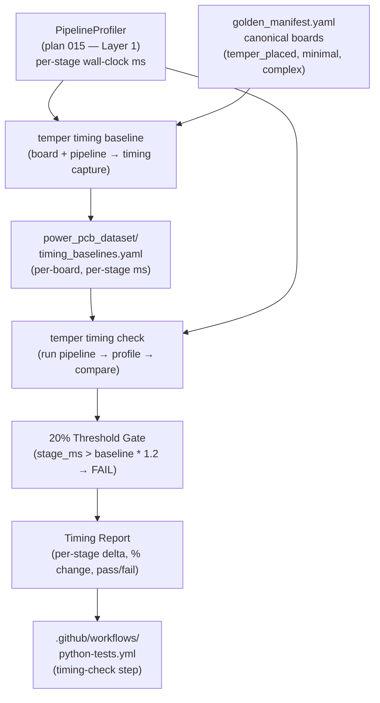
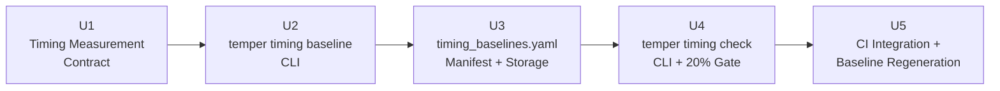

# feat: Per-Stage Timing Regression Gate

## Summary

Commit per-stage wall-clock timing baselines for canonical boards to `power_pcb_dataset/timing_baselines.yaml`. CI compares PR-stage timings against the baseline and blocks merges when any stage exceeds baseline by >20%. Baselines are updated in the same PR as intentional algorithmic changes — same pattern as golden fixture regeneration. Containerization (pinned Python version + `uv` lockfile) provides reproducible timing.

Five implementation units: U1 establishes the timing measurement contract with the profiler from plan 015. U2 builds the `temper timing baseline` CLI for capturing and committing baselines. U3 creates the baseline manifest and storage alongside golden fixtures. U4 implements `temper timing check` with the 20% threshold gate and structured reporting. U5 integrates the check into the existing CI workflow and enables baseline regeneration in the same PR.

---

## Problem Frame

Temper's 26-stage `DeterministicPipeline`, 8-phase `PipelineOrchestrator`, and 5-stage `RouterV6Pipeline` are actively decomposed via strangler fig. Each decomposition extracts a stage into a standalone implementation that must be proven safe. The golden fixture ladder (plan 009) catches _correctness_ regressions at stage boundaries — but no equivalent gate exists for _speed_.

A 5% slowdown per stage across 26 stages compounds to a 3.5× overall degradation before anyone notices. Without per-stage timing regression detection:
- Individual stage optimization gains are eroded by unnoticed slowdowns in other stages
- Strangler extractions may produce correct-but-slower replacements that degrade CI runtime and developer inner-loop latency
- The pipeline profiling toolkit (plan 015) collects per-stage timing data but does not commit baselines or gate against them

The existing `make perf-regression` target (loss-function microbenchmarks) and `check_perf_regression.py` operate only on the placer optimization loop — not on pipeline stage boundaries. The gap is systematic per-stage wall-clock monitoring with CI enforcement.

---

## Requirements

From the ideation document (idea #7) and the pattern from plan 009:

**Stage Timing Measurement (R1–R3):**
- R1. Run each pipeline stage for canonical boards using the `PipelineProfiler` from plan 015, capturing wall-clock time per stage in milliseconds.
- R2. Timing must be reproducible across CI runs — containerization via pinned Python version (3.12) and `uv.lock` ensures deterministic dependency resolution.
- R3. The profiler runs each stage in the full pipeline context (JAX warmup, board parse) to measure real wall-clock, not isolated microbenchmarks.

**Timing Baseline Storage (R4–R6):**
- R4. `temper timing baseline` CLI subcommand captures and writes timing data to `power_pcb_dataset/timing_baselines.yaml`.
- R5. Baseline manifest stored alongside golden fixtures in `power_pcb_dataset/` — same directory, same committed-artifact pattern.
- R6. Baselines are per-(board, pipeline, stage): same stage on different boards may have different baselines (component count affects timing).

**CI Timing Gate (R7–R9):**
- R7. `temper timing check` runs all registered stages for all canonical boards, compares against committed baselines.
- R8. 20% threshold: any stage whose mean wall-clock exceeds baseline by >20% fails the gate. Default margin configurable via `--margin` flag.
- R9. `.github/workflows/python-tests.yml` gains a `timing-check` step that blocks PR merge on failure.

**Baseline Lifecycle (R10–R12):**
- R10. Baselines are regenerated in the same PR as intentional algorithmic changes — `temper timing baseline --overwrite` commits updated baselines alongside the code change.
- R11. The timing manifest records the git commit hash at baseline generation time. CI verifies the baseline commit is an ancestor of PR HEAD (same ancestry pattern as golden fixtures, plan 009 U7).
- R12. New stages and new boards are non-breaking additions — existing baselines are unaffected (same incremental growth pattern as golden ladder, plan 009 U8).

---

## High-Level Technical Design

*This illustrates the intended approach and is directional guidance for review, not implementation specification.*

### Target Architecture



### Pipeline Profiler Dependency (Plan 015)

The timing gate consumes the `PipelineProfiler` from plan 015's Layer 1. The profiler provides:
- `PipelineProfiler` context manager that records wall-clock per stage into a `ProfileReport` dataclass
- `ProfileReport` with per-stage `wall_ms` and `cpu_ms` fields
- Auto-instrumentation of all three pipelines (DeterministicPipeline, RouterV6Pipeline, PipelineOrchestrator)

The timing gate does **not** reimplement profiling — it wraps the profiler from plan 015. This plan assumes plan 015's U1 (Unified Pipeline Profiler) is implemented first. If plan 015 is not yet implemented, U1 of _this_ plan includes a minimal standalone profiler scoped to the timing gate's needs.

### Implementation Unit Dependency Graph



---

## Implementation Units

### Phase 1 — Measurement Foundation

### U1. Timing measurement contract — integrate PipelineProfiler for timing capture

**Goal:** Establish the measurement contract that `temper timing baseline` and `temper timing check` consume. If plan 015's `PipelineProfiler` is available, wrap it with a thin adapter. If not, implement a minimal standalone profiler scoped to per-stage wall-clock measurement.

**Requirements:** R1, R2, R3

**Dependencies:** Plan 015 U1 (UnifiedPipelineProfiler) — soft dependency. If unavailable, U1 implements a minimal profiler inline.

**Files:**
- `packages/temper-placer/src/temper_placer/profiling/timing_gate.py` (new — timing measurement adapter + `TimingResult` dataclass)
- `packages/temper-placer/src/temper_placer/profiling/__init__.py` (modify — export timing gate symbols if directory exists; otherwise create)

**Approach:**

The timing measurement contract is a single function:

```python
@dataclass
class TimingResult:
    board_id: str
    pipeline: str          # "DeterministicPipeline" | "RouterV6Pipeline" | "PipelineOrchestrator"
    stage_name: str
    wall_ms: float         # mean wall-clock time across n runs
    n_runs: int            # number of measurement runs (default 3)
    individual_ms: list[float]  # individual run timings for variability analysis

def measure_stage_timing(
    stage_name: str,
    board_id: str,
    pipeline: str = "DeterministicPipeline",
    n_runs: int = 3,
) -> TimingResult:
    ...
```

Implementation:
1. Resolve board from `golden_manifest.yaml` → parse `.kicad_pcb` → `Board` + `Netlist`.
2. Construct the target pipeline with all stages in order.
3. If `PipelineProfiler` (plan 015) is importable:
   - Run pipeline `n_runs` times with profiler enabled.
   - Extract per-stage `wall_ms` from `ProfileReport`.
4. If `PipelineProfiler` is not available (plan 015 not yet implemented):
   - Run pipeline `n_runs` times wrapping each stage with `time.perf_counter_ns()`.
   - Average the wall-clock across runs.
5. Return `TimingResult` with mean and individual timings.

**Reproducibility (R2):** Containerization is handled at the CI level — pinned Python 3.12 in `uv.lock` plus `ubuntu-latest` runner. The timing baseline records the Python version and platform in the manifest for diagnostics. Cross-machine variation is expected to be within 5-10% for pure Python workloads; the 20% threshold provides headroom for CI runner variance.

**Warmup strategy (R3):** The first pipeline run is a warmup pass (JAX JIT compilation, Python import caching, numba compilation). Timing is measured on runs 2..N. The warmup pass is included in total CI budget but excluded from the baseline.

**Patterns to follow:**
- `scripts/check_perf_regression.py` for warmup-then-measure pattern (lines 66-73)
- Golden fixture plan 009 U2 for board-resolve and pipeline-construction logic
- `click` CLI conventions for all new commands

**Test scenarios:**
- `measure_stage_timing("apply_placements", "temper_placed")` returns `TimingResult` with `wall_ms > 0` and `n_runs == 3`.
- Three runs produce similar timings (±10% for pure Python stages; ±25% for JAX-compiled stages on first real run after warmup).
- `measure_stage_timing` for an unregistered stage name raises `ValueError` with clear message.
- Warmup run is excluded from `individual_ms` — `len(individual_ms) == n_runs` and warmup timing is not in the list.
- JAX-heavy stages (placement optimization) include `block_until_ready()` calls to capture async dispatch time.

**Verification:** Run `measure_stage_timing("apply_placements", "temper_placed")` on a local checkout, verify `wall_ms` is a positive float and 3 runs are within a reasonable range.

---

### Phase 2 — Baseline Capture & Storage

### U2. `temper timing baseline` CLI command

**Goal:** Add a `timing` command group to the `temper-placer` CLI with `baseline` and `check` subcommands. U2 implements `baseline`: runs the pipeline for all registered stages on the target board(s), captures timing via U1, and writes the baseline manifest.

**Requirements:** R4 (baseline CLI), R6 (per-(board, stage) granularity)

**Dependencies:** U1 (measurement contract)

**Files:**
- `packages/temper-placer/src/temper_placer/cli/timing.py` (new — `timing` CLI group with `baseline`, `check`, `regenerate`)
- `packages/temper-placer/src/temper_placer/cli/__init__.py` (modify — register `timing` group)

**Approach:**

CLI structure using `click`:

```python
@click.group()
def timing():
    """Per-stage timing regression gate — capture baselines and check for slowdowns."""
    pass

@timing.command("baseline")
@click.option("--board", "-b", required=True, help="Board ID (from golden_manifest.yaml)")
@click.option("--pipeline", "-p", default="DeterministicPipeline", help="Pipeline to measure")
@click.option("--stage", "-s", default=None, help="Measure only this stage (default: all stages)")
@click.option("--all-boards", is_flag=True, default=False, help="Measure all canonical boards")
@click.option("--overwrite", is_flag=True, default=False, help="Overwrite existing baseline entries")
@click.option("--runs", type=int, default=3, help="Number of measurement runs per stage")
def timing_baseline(board, pipeline, stage, all_boards, overwrite, runs):
    ...
```

Baseline algorithm:
1. If `--all-boards`, iterate all boards in `golden_manifest.yaml`. Otherwise use `--board`.
2. For each board, load the pipeline's stage registry (all stages in order).
3. If `--stage` is given, measure only that stage. Otherwise measure all stages.
4. For each stage, call U1's `measure_stage_timing()` with `n_runs=runs`.
5. Load or create `power_pcb_dataset/timing_baselines.yaml`.
6. For each measured `TimingResult`, write or update the baseline entry:
   ```yaml
   - board: temper_placed
     pipeline: DeterministicPipeline
     stage: apply_placements
     wall_ms: 12.345
     n_runs: 3
     individual_ms: [12.1, 12.5, 12.4]
     python_version: "3.12.7"
     platform: "linux"
     git_hash: "a1b2c3d4..."
     captured_at: "2026-06-22T14:30:00Z"
   ```
7. Write manifest back.

**`--overwrite` flag:** Without `--overwrite`, `baseline` skips stages that already have entries (add-only mode for ladder growth). With `--overwrite`, existing entries are replaced — used during intentional regeneration.

**Progress output:** Rich console output showing one line per stage:
```
temper_placed / DeterministicPipeline / apply_placements:    12.3 ms (3 runs)
temper_placed / DeterministicPipeline / clearance_grid:      45.2 ms (3 runs)
temper_placed / DeterministicPipeline / sequential_routing: 230.1 ms (3 runs)
...
Baseline written to power_pcb_dataset/timing_baselines.yaml (15 stages)
```

**Patterns to follow:**
- Golden plan 009 U2 `temper golden generate` for CLI structure and board resolution
- Existing `optimize` CLI pattern for deferred heavy imports and Rich output
- `scripts/check_perf_regression.py` for warmup + multi-run measurement pattern

**Test scenarios:**
- `temper timing baseline --board temper_placed --stage apply_placements` creates a baseline entry with `wall_ms > 0`.
- `temper timing baseline --board temper_placed` (all stages) creates entries for every DeterministicPipeline stage that completes successfully.
- Running baseline twice without `--overwrite` skips already-measured stages, prints `SKIP (exists, use --overwrite)`.
- Running baseline with `--overwrite` replaces existing entries.
- `temper timing baseline --board nonexistent` exits non-zero with `ERROR: unknown board 'nonexistent'`.
- Running on board with routing stages (e.g., `sequential_routing`) captures timing even if the board has no traces yet (stage still runs, returns early, timing is near-zero).
- JAX-heavy stages: warmup run excluded; reported `wall_ms` reflects post-compilation steady-state.

**Verification:** Run `temper timing baseline --board temper_placed` on a fresh checkout, verify `power_pcb_dataset/timing_baselines.yaml` is created with entries for all stages that executed.

---

### U3. Timing baseline manifest and storage layout

**Goal:** Define the `power_pcb_dataset/timing_baselines.yaml` schema and ensure it lives alongside golden fixtures in the committed dataset directory. Establish the manifest as the single source of truth for timing baselines.

**Requirements:** R5 (stored alongside golden fixtures), R6 (per-(board, stage) granularity), R11 (git hash tracking)

**Dependencies:** U2 (baseline CLI populates the manifest)

**Files:**
- `power_pcb_dataset/timing_baselines.yaml` (new — committed timing baseline manifest)
- `power_pcb_dataset/.gitkeep` (already exists — no changes needed)

**Approach:**

Directory layout alongside golden fixtures:
```
power_pcb_dataset/
  golden_manifest.yaml          # Canonical board registry (shared)
  timing_baselines.yaml         # NEW — timing baseline manifest
  goldens/                      # Golden DSN/SES fixtures (plan 009)
    manifest.yaml
    temper_placed/
      ...
  corpus/                       # Existing corpus data
  sources/                      # Existing board sources
```

`timing_baselines.yaml` schema:
```yaml
format_version: 1
captured_python: "3.12.7"
captured_platform: "linux"
captured_at: "2026-06-22T14:30:00Z"
stages:
  - board: temper_placed
    pipeline: DeterministicPipeline
    stage: apply_placements
    wall_ms_mean: 12.345
    wall_ms_p95: 14.200
    n_runs: 3
    individual_ms: [12.1, 12.5, 14.2]
    git_hash: "a1b2c3d4e5f6..."
    captured_at: "2026-06-22T14:30:00Z"
  - board: temper_placed
    pipeline: DeterministicPipeline
    stage: clearance_grid
    wall_ms_mean: 45.200
    wall_ms_p95: 48.100
    n_runs: 3
    individual_ms: [43.8, 45.2, 48.1]
    git_hash: "a1b2c3d4e5f6..."
    captured_at: "2026-06-22T14:30:00Z"
  - board: temper_placed
    pipeline: DeterministicPipeline
    stage: sequential_routing
    wall_ms_mean: 230.100
    wall_ms_p95: 250.500
    n_runs: 3
    individual_ms: [225.0, 230.1, 250.5]
    git_hash: "a1b2c3d4e5f6..."
    captured_at: "2026-06-22T14:30:00Z"
  # ... more stages per board
```

Design decisions:
- **Single file** (`timing_baselines.yaml`) — same rationale as golden plan 009 K6: atomic CI load, no directory traversal, merge conflicts rare.
- **`wall_ms_mean` as gate target** — the mean across measurement runs is the baseline value for comparison. The `wall_ms_p95` field is informational (for variability analysis) but not used in the gate.
- **`individual_ms` preserved** — allows future CI to compute standard deviation and flag high-variance stages.
- **Platform and Python version recorded** — diagnostic metadata for cross-run comparison. CI fails with a clear message if the current platform/Python version differs from the baseline's (rather than silently comparing incomparable timings).

**Patterns to follow:**
- Golden plan 009 U3 `goldens/manifest.yaml` schema — same structure, same key naming (snake_case), same metadata fields.
- `power_pcb_dataset/golden_manifest.yaml` — same YAML conventions, same indent style.

**Test scenarios:**
- `timing_baselines.yaml` parses as valid YAML with `format_version: 1` and a `stages` list.
- Each stage entry has required fields: `board`, `pipeline`, `stage`, `wall_ms_mean`, `n_runs`, `git_hash`.
- `wall_ms_mean` is positive float; `individual_ms` length matches `n_runs`.
- Adding a new board's baselines does not modify existing entries for other boards (non-breaking addition, R12).
- The `git_hash` field matches the commit at which `temper timing baseline` was run.

**Verification:** `python -c "import yaml; m=yaml.safe_load(open('power_pcb_dataset/timing_baselines.yaml')); assert m['format_version'] == 1; assert len(m['stages']) > 0"` succeeds.

---

### Phase 3 — CI Gate & Reporting

### U4. `temper timing check` CLI command with 20% threshold gate

**Goal:** Implement `temper timing check` that loads the timing manifest, runs the pipeline for each (board, stage) pair, compares current timing against the committed baseline, and applies the 20% threshold to produce a pass/fail exit code with structured reporting.

**Requirements:** R7 (CI check command), R8 (20% threshold), R9 (CI integration surface)

**Dependencies:** U3 (timing manifest must exist), U1 (measurement contract)

**Files:**
- `packages/temper-placer/src/temper_placer/cli/timing.py` (modify — add `check` command)
- `packages/temper-placer/src/temper_placer/profiling/timing_gate.py` (modify — add `TimingReport` dataclass and comparison logic)

**Approach:**

```python
@timing.command("check")
@click.option("--board", "-b", default=None, help="Check only this board")
@click.option("--stage", "-s", default=None, help="Check only this stage")
@click.option("--margin", "-m", type=float, default=0.20, help="Relative margin (default: 0.20 = 20%%)")
@click.option("--json", "json_output", is_flag=True, default=False, help="Output as JSON")
@click.option("--ci", is_flag=True, default=False, help="CI mode: enforce git ancestry check")
def timing_check(board, stage, margin, json_output, ci):
    ...
```

Check algorithm:
1. Load `power_pcb_dataset/timing_baselines.yaml` → list of baseline entries.
2. Apply filters: if `--board`, filter to that board; if `--stage`, filter to that stage.
3. Validate platform/Python version match (warn on mismatch, fail in `--ci` mode).
4. For each baseline entry `(board_id, pipeline, stage_name, baseline_ms)`:
   a. Run U1's `measure_stage_timing(stage_name, board_id, pipeline, n_runs=3)`.
   b. Compare `current_ms` against `baseline_ms`:
      - Compute threshold: `limit = baseline_ms * (1 + margin)`.
      - If `current_ms <= limit`: PASS.
      - If `current_ms > limit`: FAIL.
   c. Compute delta: `delta_pct = ((current_ms - baseline_ms) / baseline_ms) * 100`.
   d. Accumulate result.
5. After all stages checked:
   - Print one-line per stage: `PASS` or `FAIL` with delta percentage.
   - If failures exist, print summary table of failing stages with before/after/delta.
   - Exit code: 0 if all stages pass; 1 otherwise.

**TimingReport dataclass:**

```python
@dataclass
class StageTimingEntry:
    board: str
    pipeline: str
    stage: str
    baseline_ms: float
    current_ms: float
    delta_ms: float
    delta_pct: float
    threshold_ms: float
    passed: bool

@dataclass
class TimingReport:
    entries: list[StageTimingEntry]
    margin: float
    passed: bool         # True if all entries passed
    total_stages: int
    failed_stages: int
```

**Gate semantics:**
- The gate uses `wall_ms_mean` from the current run compared against `wall_ms_mean` from the baseline.
- 20% is the default relative margin (configurable via `--margin 0.15` for 15%).
- Absolute threshold: if `baseline_ms < 10ms`, use a floor of `10ms * (1 + margin)` to avoid false positives on near-zero timings (e.g., no-op stages on minimal boards). This is configurable via `--floor-ms`.
- Stages that fail with extreme outliers (`delta_pct > 100%`) produce a separate WARNING level in addition to the FAIL, suggesting manual review.

**Human-readable output:**
```
PASS: apply_placements                   12.5 ms  (baseline: 12.3 ms, +1.6%)
PASS: clearance_grid                     44.8 ms  (baseline: 45.2 ms, -0.9%)
PASS: sequential_routing                235.1 ms  (baseline: 230.1 ms, +2.2%)
FAIL: drc_validation                     89.3 ms  (baseline: 52.1 ms, +71.4%, limit: 62.5 ms)
---
1 of 15 stages failed. Timing regression gate: FAIL
```

**JSON output (CI annotations):**
```json
{
  "passed": false,
  "margin": 0.20,
  "total_stages": 15,
  "failed_stages": 1,
  "entries": [
    {
      "board": "temper_placed",
      "pipeline": "DeterministicPipeline",
      "stage": "drc_validation",
      "baseline_ms": 52.1,
      "current_ms": 89.3,
      "delta_ms": 37.2,
      "delta_pct": 71.4,
      "threshold_ms": 62.5,
      "passed": false
    }
  ]
}
```

**Git ancestry check (R11, `--ci` mode):**
When running in CI, the check verifies that each baseline entry's `git_hash` is an ancestor of HEAD:
```bash
git merge-base --is-ancestor <baseline_git_hash> HEAD
```
If not an ancestor → fail with `ORPHAN_BASELINE: timing baseline for <board>/<stage> was captured at commit <hash> which is not an ancestor of HEAD. Regenerate baselines in this branch.`

This prevents the "regenerate baselines on a separate branch without the code change" abuse pattern, matching golden plan 009's OQ5 resolution.

**Patterns to follow:**
- Golden plan 009 U5 `temper golden check` for CLI structure, exit code conventions, JSON output format
- `scripts/check_perf_regression.py` for margin-threshold comparison pattern (lines 86-90)
- Golden plan 009 U7 for git ancestry verification pattern (lines 639-643)

**Test scenarios:**
- `temper timing check --board temper_placed` on freshly captured baselines exits 0, all stages PASS.
- After introducing `time.sleep(0.5)` in `apply_placements`, `temper timing check --stage apply_placements` exits 1 with FAIL showing the sleep-induced delta.
- `temper timing check --margin 0.05` (5% margin) is stricter than default — same timings may fail.
- `temper timing check --stage nonexistent` exits non-zero with `ERROR: no baseline for stage 'nonexistent'`.
- Empty manifest (no baselines yet): exits 0 with message `No timing baselines to check. Run 'temper timing baseline' first.`
- Git ancestry: baseline captured at commit A, HEAD on unrelated branch B → `temper timing check --ci` fails with ORPHAN_BASELINE.
- Near-zero baseline (0.5ms stage): `current_ms = 2.0ms` with floor_ms=10 → threshold = 12ms → PASS (avoids false positive from timing noise on trivial stages).

**Verification:** Capture baselines → `temper timing check` exits 0. Add `time.sleep(0.5)` to a stage → `temper timing check` exits 1 with that stage in the failure report. Revert the sleep → `temper timing check` exits 0 again.

---

### U5. CI integration and baseline regeneration flow

**Goal:** Add the timing check as a step in `.github/workflows/python-tests.yml`, define the `temper timing regenerate` command for intentional update flow, and document the baseline lifecycle for developers.

**Requirements:** R9 (CI blocking), R10 (same-PR regeneration), R11 (ancestry enforcement), R12 (non-breaking additions)

**Dependencies:** U4 (check CLI must be functional), U3 (timing manifest must be committed)

**Files:**
- `.github/workflows/python-tests.yml` (modify — add `timing-check` step)
- `packages/temper-placer/src/temper_placer/cli/timing.py` (modify — add `regenerate` command)

**Approach:**

**CI workflow modification (R9):**

Add a new step to the existing `test` job in `python-tests.yml`, after the import-linter step but before coverage:

```yaml
- name: Per-stage timing regression check
  run: uv run temper timing check --ci --json
  env:
    GITHUB_STEP_SUMMARY: ${{ github.step_summary }}
```

Why in `python-tests.yml` rather than a separate workflow:
- Timing check is fast compared to golden check — 15 stages measured with 3 runs each on a minimal board target <2 minutes (vs golden check's ~5 minutes for full geometry comparison).
- It shares the same `uv sync --all-packages` setup, avoiding duplicate dependency installation.
- The existing `test` job already has the Python environment and timeout headroom.
- Adding to the existing job means timing gate is run on every PR that touches `packages/**` (same trigger paths as unit tests).

Also update the `paths` trigger for the workflow to include the timing baseline file:
```yaml
paths:
  - 'power_pcb_dataset/timing_baselines.yaml'  # Added
```

**Timeout budget:** The `test` job currently has `timeout-minutes: 30`. The timing check adds <2 minutes for the initial fixture set — well within budget.

**`temper timing regenerate` command (R10):**

```python
@timing.command("regenerate")
@click.option("--board", "-b", required=True)
@click.option("--stage", "-s", default=None, help="Regenerate only this stage")
@click.option("--pipeline", "-p", default="DeterministicPipeline")
@click.option("--force", "-f", is_flag=True, default=False, help="Skip confirmation prompt")
def timing_regenerate(board, stage, pipeline, force):
    """Regenerate timing baselines after intentional algorithmic changes."""
    ...
```

Semantically equivalent to `timing baseline --board <board> --stage <stage> --overwrite --runs 3` but with a confirmation prompt before overwriting:
```
Regenerate timing baselines for board 'temper_placed', stage 'apply_placements'?
Current baseline: 12.3 ms. New measurement will replace this.
[y/N]:
```

The `--force` flag skips the prompt for scripting/CI use.

**Intentional regeneration flow (R10):**
1. Developer makes an algorithmic change to a pipeline stage (e.g., optimizing `apply_placements`).
2. Developer runs `temper timing regenerate --board temper_placed --stage apply_placements`.
3. Regenerated baseline reflects the new (faster or intentionally slower) timing.
4. Developer commits both the code change and the updated `timing_baselines.yaml` in the same PR.
5. CI runs `temper timing check --ci`, which:
   - Compares current timing against the committed (regenerated) baseline → passes (they match).
   - Verifies git ancestry: the regenerated baseline's commit is an ancestor of PR HEAD → passes.
6. PR merges without timing gate failure.

**CI gate triggering path filter:**
The timing check step runs when these paths change:
- `packages/**` — any code change could affect timing
- `power_pcb_dataset/timing_baselines.yaml` — baseline updates
- `.github/workflows/python-tests.yml` — workflow changes
- `power_pcb_dataset/golden_manifest.yaml` — board changes

**Patterns to follow:**
- Golden plan 009 U6 for CI workflow conventions (timeout, `fetch-depth`, `uv` setup)
- Golden plan 009 U7 for `regenerate` command pattern and ancestry check
- Golden plan 009 U8 for non-breaking addition guarantees (R12: new board/stage additions don't invalidate existing baselines)

**Test scenarios:**
- A PR that only changes a comment does not fail the timing gate.
- A PR that makes `apply_placements` 50% slower fails CI with `FAIL: apply_placements (+50.0%, limit: +20.0%)`.
- A PR that regenerates the baseline alongside the slower code passes CI.
- A PR that regenerates the baseline on a separate branch (not ancestor) fails CI with ORPHAN_BASELINE.
- Adding a new board to `golden_manifest.yaml` and running `temper timing baseline --board <new_board>` creates baselines without affecting existing entries (R12).
- The CI timing check completes in under 2 minutes for the initial fixture set.

**Verification:**
1. Open a PR that introduces `time.sleep(0.5)` in `clearance_grid.py`.
2. CI `timing-check` step fails.
3. Add `temper timing regenerate --board temper_placed --stage clearance_grid` + commit the regenerated baseline to the same PR.
4. CI `timing-check` step passes.
5. Merge PR.

---

## Key Technical Decisions

**K1: 20% relative margin, not absolute ms threshold.** Stages vary in complexity from ~5ms (net ordering) to ~500ms (sequential routing with many nets). A fixed absolute threshold (e.g., +50ms) would be too strict for fast stages and too loose for slow stages. Relative margin scales appropriately. An absolute floor at 10ms prevents false positives on near-zero timings.

**K2: Wall-clock mean over multiple runs, not single-run.** CI runners have inherent variability (noisy neighbors, I/O contention). Measuring 3 runs and averaging reduces noise. The P95 is preserved for diagnostics but not used in gate decisions — mean is sufficient with a 20% margin.

**K3: Integrate into python-tests.yml, not a separate workflow.** Unlike golden check (which runs for ~5 minutes and has heavy JAX/DSN dependencies), timing check is fast (<2 minutes), shares the Python environment, and the existing `test` job has headroom within its 30-minute timeout. A separate workflow would duplicate `uv sync --all-packages` setup for a 2-minute check.

**K4: Git ancestry check over `--intentional` flag.** Same as golden plan 009 K7: `git merge-base --is-ancestor` mechanically prevents baselines from being regenerated on an unrelated branch. Simpler than a manual `--intentional` flag; fewer failure modes.

**K5: PipelineProfiler from plan 015 as the measurement foundation.** The timing gate does not reimplement per-stage instrumentation — it consumes the profiler built in plan 015. If plan 015 is not yet implemented, U1 of this plan includes a minimal profiler scoped to the timing gate's needs. The `ProfileReport` dataclass from plan 015 is the data contract between the profiler and the timing gate.

**K6: Same canonical boards as golden fixtures (golden_manifest.yaml).** The timing gate uses the same board manifest as golden fixtures — `temper_placed`, `minimal_board`, `complex_board`. This avoids duplicating board configuration and ensures timing baselines and golden fixtures are measured on the same boards.

**K7: Containerization via pinned Python + uv.lock, not Docker.** The project already pins Python 3.12 in `pyproject.toml` and uses `uv.lock` for deterministic dependency resolution. An additional Docker layer adds complexity without meaningful timing reproducibility gains for pure Python workloads. GitHub Actions `ubuntu-latest` runners provide sufficient consistency for a 20% margin.

---

## Scope Boundaries

### In Scope
- Per-stage wall-clock timing capture via `PipelineProfiler` (or minimal profiler if plan 015 unavailable) (R1–R3)
- `temper timing baseline` CLI for capturing and committing baselines (R4)
- `power_pcb_dataset/timing_baselines.yaml` manifest alongside golden fixtures (R5, R6)
- `temper timing check` CLI with 20% threshold gate and structured reporting (R4, R7, R8)
- CI integration into `.github/workflows/python-tests.yml` (R9)
- `temper timing regenerate` for intentional baseline updates in same PR (R10)
- Git ancestry enforcement to prevent orphan baselines (R11)
- Non-breaking addition of new boards and stages (R12)
- DeterministicPipeline stage timing (26 stages)
- Canonical boards from `golden_manifest.yaml` (3 boards)

### Deferred for Follow-Up Work
- **PipelineOrchestrator and RouterV6Pipeline stage timing.** Once these pipelines have clean stage boundaries and the profiler is wired in, baselines can be added non-breakingly via `temper timing baseline` for those pipelines.
- **Stage 2 sub-step timing regression.** The timing gate operates at the stage level. Sub-step (within-stage) timing is collected by plan 015's Stage 2 instrumentation but not gated here. Future: add `temper timing check --sub-steps` to gate sub-step regressions.
- **Historical timing trend dashboard.** The `individual_ms` field in baselines supports future time-series analysis, but no dashboard is built.
- **Automatic baseline tightening.** If CI observes that stage timing is consistently 50% below baseline over N consecutive runs, the gate could self-tighten the baseline. Deferred as premature optimization — human-review of baseline changes is more appropriate at this scale.
- **Benchmark-specific boards for timing diversity.** The 3 canonical boards provide coverage; additional boards with different component/net densities can be added non-breakingly (R12) as regressions are discovered on unrepresented workloads.
- **CPU-time gate alongside wall-clock.** Wall-clock is the primary regression signal. CPU time (excluding I/O wait) is a secondary dimension that could detect "same wall-clock but burning more CPU" regressions — deferred.

### Out of Scope
- Replacing `scripts/check_perf_regression.py` (loss-function microbenchmarks) — that script covers the JAX optimization loop; the timing gate covers pipeline stages. Different scope, co-exist.
- Memory regression detection — measuring per-stage memory allocation requires `tracemalloc` or `memray` instrumentation, which is a separate concern.
- GPU timing regression for JAX-accelerated stages — the project runs on CPU in CI.
- Modifying pipeline stages to expose timing hooks — the profiler from plan 015 handles instrumentation externally.

---

## Dependencies / Prerequisites

**Upstream dependencies (must exist before this work starts):**
- **Plan 015 (Pipeline Profiling Toolkit) U1 — UnifiedPipelineProfiler.** The `PipelineProfiler` and `ProfileReport` dataclass are the measurement foundation. If plan 015 is not yet implemented, U1 of _this_ plan implements a minimal standalone profiler — but plan 015's full profiler is the intended long-term dependency.
- **Plan 009 (Golden Fixture Ladder) — golden_manifest.yaml.** The canonical board list (`temper_placed`, `minimal_board`, `complex_board`) is defined in `power_pcb_dataset/golden_manifest.yaml`. This plan reads, does not modify, that manifest.
- **`uv` / Python 3.12 / `click` / `pyyaml`** — already project dependencies. No new packages required.

**New dependencies introduced:**
- None beyond what the project already has. The timing gate is pure Python with stdlib `time.perf_counter_ns()` and `subprocess.run(["git", ...])`.

**Downstream consumers (work unblocked by this):**
- Every pipeline stage extraction (strangler fig) — developers get immediate feedback on whether their replacement is slower.
- Plan 015 U6 (Autoprof Experiment Loop) — the timing gate provides committed baselines that autoprof can use as "before" in before/after comparisons.
- Performance optimization work — the gate quantifies the impact of optimization PRs and prevents regressions.

---

## Risk Analysis & Mitigation

| Risk | Severity | Likelihood | Mitigation |
|------|----------|------------|------------|
| CI runner timing variance exceeds 20% margin | High (false failures block PRs) | Low | The 20% margin is intentionally generous for pure Python workloads. GitHub Actions `ubuntu-latest` runners have <5% variance for CPU-bound tasks. If false positives occur, the `--margin` flag allows tuning per-pipeline. Long-term: record CI runner type in baseline metadata and compare only within the same runner class. |
| Plan 015 PipelineProfiler not yet implemented | High (blocks measurement) | Medium | U1 of this plan includes a minimal standalone profiler as a fallback. The `TimingResult` dataclass is the contract — whether it's populated by PipelineProfiler or a minimal timer is transparent to the gate. |
| JAX JIT compilation dominates stage timing on first run | Medium (inflated timing) | Low | Warmup run excluded from measurement (R3). JIT compilation time is only incurred on the warmup pass. Measurements are taken on runs 2..N, which benefit from cached JIT compiled code. |
| Stages that are no-ops on minimal boards produce near-zero baselines | Low (false positives from timing noise) | Medium | The `floor_ms` parameter (default 10ms) ensures stages with sub-10ms baselines use 10ms as the comparison base. A stage going from 0.5ms to 2ms on a 10ms floor = within margin. K1 addresses this. |
| Shallow CI clones break `git merge-base --is-ancestor` | Medium (false ORPHAN_BASELINE) | Medium | The CI workflow step documents that `actions/checkout@v4` defaults to `fetch-depth: 1`. If ancestry checks fail, the workflow should use `fetch-depth: 0` for the timing check. Alternatively, compare `git cat-file -t <hash>` (does the commit exist in the repo?) and fall back to a warning if not. |
| `timing_baselines.yaml` merge conflicts | Low (productivity annoyance) | Low | Single-file manifest means fewer merge conflict surfaces. Baselines are regenerated per-PR; conflicts only occur when two PRs touch the same stage's baseline simultaneously — rare. Resolution: accept one side and re-run `temper timing baseline` for the affected stage. |
| Stage list changes (new stages added, old renamed) | Medium (outdated baselines) | Low | The `temper timing check` only checks stages that have entries in the manifest. Missing entries produce a warning (`No baseline for stage 'X'`), not a failure. Renamed stages are treated as new (no baseline → no check). A `temper timing baseline --all-boards` refresh after a stage rename brings baselines current. |

---

## System-Wide Impact

- **Developer workflow:** After the gate lands, extracting or modifying a pipeline stage includes running `temper timing check --stage <name> --board temper_placed` in the inner loop to verify no slowdown. Before pushing, `temper timing check` runs the full gate locally. If a stage is intentionally slowed down, `temper timing regenerate` captures the new baseline.
- **CI pipeline:** One new step (`timing-check`) in the existing `python-tests.yml` `test` job. Adds <2 minutes to the CI run. Blocks PR merge on timing regressions.
- **Repository layout:**
  - `power_pcb_dataset/timing_baselines.yaml` (new — ~1 KB per stage entry, ~40 KB for all stages on 3 boards)
  - `packages/temper-placer/src/temper_placer/cli/timing.py` (new — ~250 lines)
  - `packages/temper-placer/src/temper_placer/profiling/timing_gate.py` (new — ~200 lines)
  - `.github/workflows/python-tests.yml` (modified — add 1 step, 1 path trigger)
- **No changes to `pyproject.toml`, firmware, PCB designs, or KiCad schematics.**

---

## Success Criteria

- **SC1.** Every PR that slows any pipeline stage by >20% is blocked by the timing check step in CI.
- **SC2.** Timing baselines cover all 26 DeterministicPipeline stages on at least 1 canonical board (15+ stages with measurable wall-clock; some stages are no-ops without routing data).
- **SC3.** The timing check completes in under 2 minutes for the initial fixture set on CI hardware.
- **SC4.** Intentional algorithmic changes can update baselines within the same PR via `temper timing regenerate` — the flow takes <3 minutes end-to-end for a single stage.
- **SC5.** The timing failure report enables a developer to identify which stage regressed, by how much (% and absolute ms), and compare against the threshold — within 10 seconds of reading the CI log.

---

## Outstanding Questions

- **OQ1 (Plan 015 status):** Is `PipelineProfiler` from plan 015 implemented? If yes, U1 wraps it. If no, U1 implements a minimal profiler. The plan is structured so that either path works — the `TimingResult` dataclass is the stable contract.
- **OQ2 (Margin tuning):** Is 20% the right threshold? The margin is configurable via `--margin`. If initial CI runs show consistent timing with <5% variance, the default can be tightened to 15% or 10%. If variance is higher, it stays at 20%. A pre-landing measurement task (run `temper timing check` 10 times on CI, measure max delta) answers this.
- **OQ3 (Baseline coverage):** Should baselines cover only stages that produce measurable output (exclude no-op stages on minimal boards)? Or should every stage have a baseline regardless? **Answer in this plan:** Every stage gets a baseline — even no-op stages. The `floor_ms` parameter prevents false positives from near-zero timings. This ensures new code added to a previously no-op stage is gated.
- **OQ4 (Multi-pipeline baselines):** Should `temper timing baseline` capture all three pipelines (DeterministicPipeline, RouterV6Pipeline, PipelineOrchestrator) initially, or only DeterministicPipeline? **Answer in this plan:** Start with DeterministicPipeline only — it has the cleanest stage boundaries and is the primary target of strangler decomposition. RouterV6Pipeline and PipelineOrchestrator baselines are added non-breakingly later (R12).
- **OQ5 (CI failure action):** On timing gate failure, should CI annotate the PR diff with per-stage slowdown annotations? **Answer in this plan:** JSON output from `--json` flag enables annotation, but automated PR annotations are deferred. The human-readable CI log is the primary failure report surface initially.

---

## Sources & References

- Origin ideation: `docs/ideation/2026-06-22-test-and-build-next-ideation.md` (idea #7)
- Pattern to follow: `docs/plans/2026-06-22-009-feat-golden-fixture-ladder-plan.md` (manifest structure, CLI pattern, CI integration, ancestry check)
- Profiling dependency: `docs/plans/2026-06-22-015-feat-pipeline-profiling-validation-toolkit-plan.md` (PipelineProfiler, ProfileReport)
- Per-stage DRC fence (gate pattern): `docs/plans/2026-06-22-013-feat-per-stage-drc-fence-plan.md`
- Existing performance regression: `scripts/check_perf_regression.py`
- CI workflow: `.github/workflows/python-tests.yml`
- Board manifest: `power_pcb_dataset/golden_manifest.yaml`
- Golden fixtures directory: `power_pcb_dataset/goldens/`
- DeterministicPipeline stages: `packages/temper-placer/src/temper_placer/deterministic/stages/`
- CLI structure: `packages/temper-placer/src/temper_placer/cli/__init__.py`
- BoardState: `packages/temper-placer/src/temper_placer/deterministic/state.py`
- Project conventions: `AGENTS.md`
