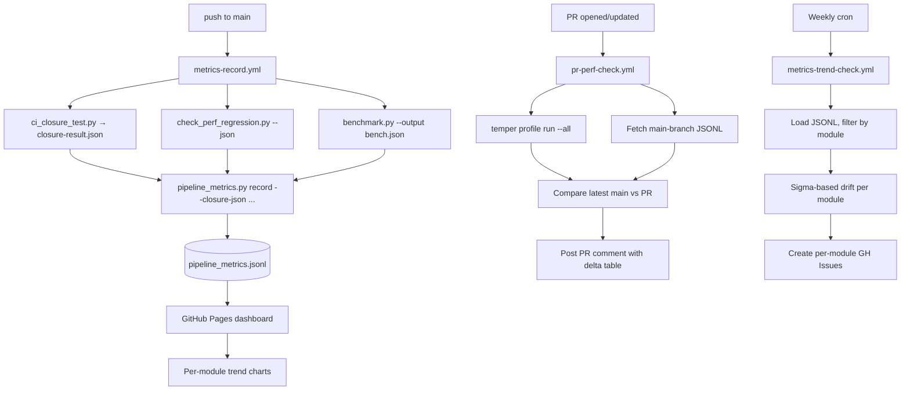

# feat: CI Profiling Regression Platform

## Summary

A unified CI/CD profiling pipeline that captures per-module performance metrics (pipeline stages, loss functions, router benchmarks, firmware) on every main push into an extended JSONL time-series store, surfaces trends via a GitHub Pages dashboard, and enforces PR-level regression detection with delta comments. Fixes the existing broken metrics recorder, wires currently-scattered profilers into one schema, and defines a firmware profiling blueprint with on-target runner deferred.

---

## Problem Frame

The repo has 5+ ad-hoc profiling scripts producing non-portable output (`full_pipeline_profile.py` hardcodes a local worktree path, `profile_router_v6_sampling.py` writes to `/tmp/`), a `metrics-record.yml` that commits zero-valued records (never consumes the actual closure test JSON it produces), and no way to answer "is this PR slower?" at review time. The existing `metrics-trend-check.yml` detects sigma-based drift but only on the `closure` stage. Plans 015 (unified `PipelineProfiler`) and 022 (per-stage timing gate) specify the architecture but neither is implemented.

The result: perf regressions ship unnoticed, PR reviewers have no data, and ad-hoc profiling scripts multiply.

---

## Requirements

- R1. Fix `pipeline_metrics.py record` to consume actual closure test output (currently writes all-zero records).
- R2. Extend `PipelineMetricsRecord` schema with a `module` field to distinguish profiling dimensions (pipeline, loss-fn, router-bench, firmware).
- R3. Multi-module profiling harness: pipeline stages (DeterministicPipeline), loss functions (JAX microbenchmarks), and router benchmarks (4-board corpus) all emit to the same JSONL store.
- R4. PR-level comparison: profile the PR branch, compare each metric against the latest main-branch JSONL entry, post a delta comment on the PR.
- R5. Extend weekly trend-check to cover all profiled modules with per-module GitHub Issues.
- R6. GitHub Pages static dashboard rendering per-module trend charts from committed JSONL data.
- R7. Firmware profiling schema and CI job blueprint defined; on-target ESP32 runner deferred.
- R8. All profilers use the same `PipelineMetricsRecord` format — a single `load_metrics()` call returns the full time-series for any module.

---

## Scope Boundaries

- **In scope**: Python-side profiling (pipeline stages, JAX loss functions, router benchmarks), JSONL schema extension, PR comparison workflow (initially `packages/**` only — firmware profiling data is not yet collected per R7), weekly multi-module drift detection, GitHub Pages dashboard, firmware schema blueprint.
- **Out of scope**: External TSDB (InfluxDB/Grafana), coverage gate.
- **Deferred to Follow-Up Work**: Plan 015 `PipelineProfiler` full implementation, on-target ESP32 firmware profiling CI runner, differential flame graphs, auto-baseline tightening, sub-step timing gates, multi-PR merge conflict resolution for JSONL.

---

## Context & Research

### Relevant Code and Patterns

- `scripts/pipeline_metrics.py` — existing record/trend CLI; record writes zero-valued records via dummy `ClosureResult`.
- `packages/temper-placer/src/temper_placer/regression/metrics_recorder.py` — `PipelineMetricsRecord` dataclass, `record_closure_result()`, `record_metrics()`, `load_metrics()`.
- `.github/workflows/metrics-record.yml` — main-push trigger: runs `ci_closure_test.py` → `pipeline_metrics.py record` → auto-commits `power_pcb_dataset/metrics/pipeline_metrics.jsonl`.
- `.github/workflows/metrics-trend-check.yml` — weekly cron: sigma-based drift detection across all board/stage pairs in JSONL, creates `metrics-drift` issues.
- `packages/temper-placer/tests/router_v6/test_astar_perf_regression.py` — proven PR-level regression pattern: committed baseline JSON, 15% tolerance, pytest-integrated, skip-when-absent.
- `scripts/check_perf_regression.py` — loss-function microbenchmarks: warmup + 10-iteration timing against `metrics/performance_baseline.json` with 30% margin. Outputs to `GITHUB_STEP_SUMMARY`.
- `packages/temper-placer/src/temper_placer/router_v6/benchmark.py` — 4-board router benchmark with JSON output (per-board score, completion rate, per-path p95 latency). Not CI-integrated.
- `scripts/full_pipeline_profile.py` — hardcoded worktree path, writes to `/tmp/`, monkey-patches Numba for instrumentation. Non-portable.
- `scripts/ci_closure_test.py` — produces `closure-result.json` with real `wall_clock_seconds`, `router_completion_pct`, `drc_errors`, `benders_iterations`, `benders_cuts`.
- `session-dashboard/` — Chart.js-based local dashboard (Python HTTP server). Reads Claude/Codex session data, not pipeline metrics. UI patterns reusable.
- `docs/plans/2026-06-22-022-feat-per-stage-timing-regression-gate-plan.md` — defines `TimingResult` dataclass, 20% margin gate, ancestry check. Not yet implemented.
- `docs/plans/2026-06-22-015-feat-pipeline-profiling-validation-toolkit-plan.md` — defines `PipelineProfiler` and `ProfileReport`. Not yet implemented.

### Institutional Learnings

- **Profile wrapper overhead**: Per-call `dict.append({...})` in profiling wrappers caused measurable pipeline slowdown (router V6: 5min → 23s fix). Any instrumentation added to hot paths must use scalar counters.
- **JIT warm-up + min-of-N timing**: Single-run JAX/Numba timing is flaky; `check_perf_regression.py` uses warmup + multi-run average. Plan 022 explicitly excludes the first run as warmup.
- **Metrics auto-commit fragility**: `metrics-record.yml` uses `git pull --rebase` with retry. Works at current commit frequency but creates merge conflicts with concurrent pushes. Artifact-based backup recommended.
- **Dead profiling flags**: `enable_smoothing=True` was a silent no-op — broken flags must raise on construction. Profile features that are optional must either work or fail loudly.
- **Pipeline-vs-output contracts**: `_inject_ghost_pads` was unit-tested but dead in the production pipeline. Profiling hooks must be exercised by the CI pipeline, not just isolated tests.

---

## Key Technical Decisions

- **K1: Extend JSONL, don't replace it.** The existing `pipeline_metrics.jsonl` works — `metrics-record.yml` commits it, `metrics-trend-check.yml` reads it. Adding a `module` field to `PipelineMetricsRecord` preserves backward compatibility while enabling multi-module storage in the same file.
- **K2: Minimal profiler inline (Plan 022 approach), not Plan 015's full `PipelineProfiler`.** Plan 015's U1 implements a full context-manager profiler with sub-step instrumentation. That's unblocked by this plan but not a dependency — this plan builds per-module profiling functions that emit `PipelineMetricsRecord` directly. This plan's `PipelineMetricsRecord` schema is designated as the canonical metrics contract for the profiling platform. When Plan 015 and Plan 022 are implemented, their `ProfileReport` and `TimingResult` types will be adapted to emit `PipelineMetricsRecord` records for CI consumption. The profiling harness built in U3 provides total pipeline timing that Plan 022's per-stage gate will decompose.
- **K3: PR comparison via GitHub Actions artifacts, not committed PR data.** PR metrics are ephemeral — they shouldn't be committed to the JSONL. The PR workflow writes metrics to a GitHub Actions artifact, fetches the main-branch JSONL, compares, and posts a comment. This avoids polluting the time-series store with experimental PR data.
- **K4: GitHub Pages with Chart.js (following `session-dashboard/` patterns).** The existing `session-dashboard/` uses Chart.js embedded in a static HTML page served by a Python HTTP server. The dashboard replaces the server with GitHub Pages, reads `pipeline_metrics.jsonl` from a co-located file in the `gh-pages` branch, and renders per-module trend charts. This preempts Plan 004's V5 deferred "Deployed metrics observatory" — the dashboard is built now as part of the profiling platform rather than gated on the health-digest adoption criterion.
- **K5: Firmware schema defined, on-target runner deferred.** The JSONL schema includes a `firmware` module with fields for state-machine cycle time, PID compute time, ADC guard latency. The CI job structure is defined but the hardware runner is deferred — firmware profiling is opt-in when a runner is available.

---

## Output Structure

```
packages/temper-placer/src/temper_placer/profiling/
    __init__.py                 # Public exports: record_pipeline_metrics, record_loss_metrics, etc.
    pipeline_metrics.py         # Unified profiling harness: per-module record functions
    cli.py                      # temper profile CLI (run, check, baseline subcommands)
packages/temper-placer/tests/
    test_profiling.py           # Tests for unified profiling harness
.github/workflows/
    metrics-record.yml          # Modified: consume actual closure JSON, record multi-module
    metrics-trend-check.yml     # Modified: multi-module drift detection
    pr-perf-check.yml           # New: PR-level performance comparison workflow
scripts/
    pipeline_metrics.py         # Modified: fix zero-valued record, add --closure-json flag
dashboard/
    index.html                  # GitHub Pages entry point
    js/
        app.js                  # Dashboard logic: fetch JSONL, render charts per module
        charts.js               # Chart.js configuration per metric type
    css/
        styles.css              # Dashboard styling
power_pcb_dataset/metrics/
    firmware_perf_baseline.json # New: committed firmware perf baseline (schema only initially)
```

---

## High-Level Technical Design

> *This illustrates the intended approach and is directional guidance for review, not implementation specification.*

### Data Flow



### Unified Metrics Schema (extending PipelineMetricsRecord)

The existing `PipelineMetricsRecord` gains a `module` field:

```python
@dataclass
class PipelineMetricsRecord:
    board: str
    stage: str         # existing
    module: str        # NEW: "pipeline" | "loss-fn" | "router-bench" | "firmware"
    metrics: dict[str, float]
    timestamp: str
    git_commit: str
    schema_version: int
```

Metric shapes per module:

- **module=pipeline, stage=closure**: `{completion_pct, drc_errors, drc_warnings, wall_time_ms, benders_iterations, benders_cuts}` (existing)
- **module=loss-fn**: `{overlap_ms, spread_ms, wirelength_ms, boundary_ms, total_step_ms}`
- **module=router-bench**: `{geometric_mean_score, completion_rate, runtime_seconds, p95_latency_ms, total_route_length_mm}`
- **module=firmware**: `{sm_cycle_us, pid_compute_us, adc_guard_us, pwm_guard_us, ntc_guard_us, fan_guard_us, coil_guard_us, probe_detect_us, task_free_stack, heap_free}` (schema only)

---

## Implementation Units

### U1. Fix Metrics Recording — consume actual closure test output

**Goal:** Fix `pipeline_metrics.py record` so it reads the `closure-result.json` produced by `ci_closure_test.py` instead of creating a zero-valued `ClosureResult`.

**Requirements:** R1

**Dependencies:** None

**Files:**
- Modify: `scripts/pipeline_metrics.py` (add `--closure-json` flag to `record` subcommand, read real data)
- Modify: `.github/workflows/metrics-record.yml` (pass `--closure-json closure-result.json` to record step)

**Approach:**
- Add `--closure-json PATH` optional flag to the `record` subcommand. When provided, parse the JSON into a real `ClosureResult` and pass it to `record_closure_result()`.
- When `--closure-json` is absent, fall back to the existing zero-valued behavior (for manual/backfill use).
- Update `metrics-record.yml` to pass `--closure-json closure-result.json` in the record step.

**Patterns to follow:**
- `scripts/pipeline_metrics.py:133-143` for current record implementation
- `scripts/ci_closure_test.py` `--output` flag for JSON output contract

**Test scenarios:**
- Happy path: `pipeline_metrics.py record --board temper --closure-json closure-result.json` produces a record with `wall_time_ms > 0` and actual `completion_pct`.
- Missing JSON: `pipeline_metrics.py record --board temper --closure-json nonexistent.json` exits non-zero with clear error.
- Backward compat: `pipeline_metrics.py record --board temper` (no `--closure-json`) still produces a record (zero-valued for backfill).
- Integration: `metrics-record.yml` CI run produces a JSONL line with `wall_time_ms > 0`.

**Verification:** After a CI push to main, `pipeline_metrics.jsonl` contains records with non-zero `wall_time_ms`. Existing trend-check continues to work with the now-populated data.

---

### U2. Extend Metrics Schema — add `module` field and generalize recording

**Goal:** Add a `module` field to `PipelineMetricsRecord`, generalize `record_closure_result()` into a generic `record_metrics_for_stage()`, and ensure backward compatibility with existing JSONL data.

**Requirements:** R2, R8

**Dependencies:** U1 (schema consumers should work with existing records)

**Files:**
- Modify: `packages/temper-placer/src/temper_placer/regression/metrics_recorder.py` (add `module` field, generalize recording)
- Modify: `scripts/pipeline_metrics.py` (update record/tend subcommands for `module` field)
- Modify: `.github/workflows/metrics-trend-check.yml` (add `--module` filter to trend queries)
- Test: `packages/temper-placer/tests/test_metrics_recorder.py` (new or extend existing)

**Approach:**
- Add `module: str` field to `PipelineMetricsRecord` dataclass, default `"pipeline"` for backward compatibility.
- `record_closure_result()` sets `module="pipeline"` (existing behavior preserved).
- Add `record_metrics_for_stage(board, stage, module, metrics, commit)` as the generic entry point.
- Add `--module` filter to `pipeline_metrics.py trend` subcommand so trend-check can query per-module.
- Bump `CURRENT_SCHEMA_VERSION` to 2 (or keep at 1 — the `module` field is additive and existing records with `schema_version: 1` still load correctly with `module` defaulting to `"pipeline"`).
- `load_metrics()` auto-populates `module: "pipeline"` on records that lack it (backward compatibility).

**Patterns to follow:**
- `metrics_recorder.py:21-65` for existing record structure
- `metrics_recorder.py:78-103` for `load_metrics()` backward-compat pattern (already handles `schema_version`)

**Test scenarios:**
- Happy path: `record_metrics_for_stage("temper", "closure", "pipeline", {"wall_time_ms": 100}, "abc123")` writes a record with `module: "pipeline"`.
- Backward compat: loading an existing v1 record (no `module` field) returns `module: "pipeline"`.
- Multi-module: two records with different modules (`"pipeline"`, `"loss-fn"`) coexist in the same JSONL file.
- Trend filtering: `pipeline_metrics.py trend --board temper --stage closure --module pipeline` returns only pipeline records.
- Missing module filter: `pipeline_metrics.py trend --board temper --stage closure` (no `--module`) returns all modules (backward compat).

**Verification:** Existing `pipeline_metrics.jsonl` loads successfully. New records with `module` field append correctly. `pipeline_metrics.py trend --module pipeline` returns only pipeline data.

---

### U3. Unified Profiling Harness — `temper profile` CLI

**Goal:** Build a `temper profile` CLI with `run` subcommand that profiles pipeline stages, loss functions, and router benchmarks, emitting `PipelineMetricsRecord`-compatible JSON to stdout (for CI piping) and directly to JSONL (for local use).

**Requirements:** R3, R8

**Dependencies:** U2 (schema must be extended)

**Files:**
- Create: `packages/temper-placer/src/temper_placer/profiling/__init__.py` (public exports)
- Create: `packages/temper-placer/src/temper_placer/profiling/pipeline_metrics.py` (per-module profile functions)
- Create: `packages/temper-placer/src/temper_placer/profiling/cli.py` (Click CLI: `temper profile run`, `temper profile check`)
- Modify: `packages/temper-placer/src/temper_placer/cli/__init__.py` (register `profile` group)
- Create: `packages/temper-placer/tests/test_profiling.py` (harness tests)

**Approach:**
- Three profile functions, each returning a list of `PipelineMetricsRecord`:
  - `profile_pipeline(board_id, commit)` — runs closure test via `ci_closure_test.py` internals, captures total wall-clock timing (`ClosureResult.wall_clock_seconds`). Uses warmup + 3-run measurement following Plan 022's contract (first run warmup, measure runs 2-4). Per-stage wall-clock breakdown is deferred to Plan 022 — this profiling harness provides the total pipeline timing that Plan 022's per-stage gate will decompose.
  - `profile_loss_functions(board_id, commit)` — wraps `check_perf_regression.py`'s timing loop (overlap, spread, wirelength, boundary timings), emits per-function metrics.
  - `profile_router_benchmark(commit)` — runs `benchmark.py` on 4-board corpus, extracts per-board scores, p95 latency, completion rate, geometric mean.
- CLI structure using Click (following existing `temper` CLI conventions):
  ```python
  @click.group()
  def profile():
      """Performance profiling harness — run per-module profiling and emit PipelineMetricsRecord output."""
      pass

  @profile.command("run")
  @click.option("--module", "-m", required=True, type=click.Choice(["pipeline", "loss-fn", "router-bench", "all"]))
  @click.option("--board", "-b", default="temper")
  @click.option("--commit", default="")
  @click.option("--output-jsonl", default=None, help="Append to JSONL file")
  @click.option("--json", is_flag=True, help="Output JSON to stdout")
  def profile_run(module, board, commit, output_jsonl, json):
      ...
  ```
- `--module all` runs all three profilers sequentially.
- Output modes: `--json` prints records to stdout as NDJSON (one JSON object per line, same format as the JSONL file), `--output-jsonl` appends directly to the time-series file. The `--from-stdin` flag on `pipeline_metrics.py record` reads the same NDJSON format.

**Patterns to follow:**
- `scripts/check_perf_regression.py:66-73` for warmup + multi-run timing
- `packages/temper-placer/tests/router_v6/test_astar_perf_regression.py` for benchmark invocation
- `packages/temper-placer/src/temper_placer/cli/optimize.py` for Click CLI conventions

**Test scenarios:**
- Happy path: `temper profile run --module pipeline --board temper --json` prints valid `PipelineMetricsRecord` JSON with `wall_time_ms > 0`.
- Happy path: `temper profile run --module loss-fn --board temper --json` prints per-loss-function timings.
- Happy path: `temper profile run --module router-bench --json` prints per-board scores from 4-board corpus.
- All modules: `temper profile run --module all --json` prints records for all three modules in sequence.
- JSONL output: `temper profile run --module pipeline --output-jsonl test.jsonl` appends to the file.
- Empty corpus: `temper profile run --module router-bench` with missing corpus boards prints warning, not error.
- Warmup excluded: pipeline profiling records show consistent timings across runs 2-4 (warmup excluded from output).

**Verification:** `temper profile run --module all --json` produces NDJSON (one valid record per line) with `module`, `board`, `stage`, `metrics` fields populated for all three profilers. Each line parses as valid JSON.

---

### U4. Wire Existing Profilers to JSONL on Main Push

**Goal:** Modify `metrics-record.yml` to run loss-function and router-benchmark profiling alongside the existing closure test, appending all results to `pipeline_metrics.jsonl` in a single commit.

**Requirements:** R3

**Dependencies:** U3 (profiling harness must be functional), U2 (schema must support multi-module)

**Files:**
- Modify: `.github/workflows/metrics-record.yml` (add loss-fn and router-bench steps)
- Modify: `scripts/pipeline_metrics.py` (ensure `record` subcommand supports piping from `temper profile run --json`)

**Approach:**
- Add steps to `metrics-record.yml` after the closure test:
  1. Run `temper profile run --module loss-fn --board temper --json` → append to JSONL via `pipeline_metrics.py record --from-stdin`.
  2. Run `temper profile run --module router-bench --json` → append to JSONL via `pipeline_metrics.py record --from-stdin`.
- Add `--from-stdin` flag to `pipeline_metrics.py record` that reads JSON records from stdin and appends them to the JSONL file. This decouples the profiler output from the recorder.
- All profiling steps use `continue-on-error: true` (same pattern as the existing closure test step) so one failing profiler doesn't block metrics from the others.
- Single commit at the end with all appended records.

**Patterns to follow:**
- `.github/workflows/metrics-record.yml:27-51` for existing step structure and commit pattern
- `scripts/pipeline_metrics.py:133-143` for `record` subcommand extension

**Test scenarios:**
- Happy path: CI push to main appends pipeline, loss-fn, and router-bench records to `pipeline_metrics.jsonl` in one commit.
- Partial failure: loss-fn profiling fails (timeout) — pipeline and router-bench records still committed.
- No-op: if no new data, commit step prints "No metrics changes" and exits cleanly.
- Stdin record: `echo '{"module":"loss-fn",...}' | pipeline_metrics.py record --from-stdin --board temper` appends the record.

**Verification:** After a CI push to main, `pipeline_metrics.py trend --list --json` shows `("temper", "loss-fn")` and `("Piantor_Right", "router-bench")` etc. as available board/stage pairs.

---

### U5. PR Performance Comparison Workflow

**Goal:** Create a new workflow (`pr-perf-check.yml`) that runs on PR open/update, profiles the PR branch, compares against main-branch JSONL latest entries, and posts a delta comment on the PR.

**Requirements:** R4

**Dependencies:** U3 (profiling harness), U2 (schema)

**Files:**
- Create: `.github/workflows/pr-perf-check.yml`
- Create: `scripts/pr_perf_compare.py` (comparison logic + PR comment posting)
- Modify: `scripts/manifest.yaml` (add `pr_perf_compare.py` entry per script manifest convention)

**Approach:**
- New workflow `pr-perf-check.yml` triggers on `pull_request: [opened, synchronize]` paths-filtered to `packages/**`, `firmware/**`.
- Workflow steps:
  1. Checkout PR branch (`ref: ${{ github.event.pull_request.head.sha }}`).
  2. Run `temper profile run --module all --json` → save to `pr-metrics.json`.
  3. Fetch main-branch `pipeline_metrics.jsonl` (checkout main with sparse-checkout or use GitHub API raw content).
  4. Run `scripts/pr_perf_compare.py --pr-metrics pr-metrics.json --main-jsonl pipeline_metrics.jsonl` → produce delta report.
  5. Post delta report as PR comment via `actions/github-script@v7`.
- `scripts/pr_perf_compare.py` logic:
  - For each `(module, board, stage)` in PR metrics, compute the rolling-window baseline from the main-branch JSONL: median of the last N entries (N ≥ 3, configurable) with the same keys. Fall back to the latest single entry when <3 entries exist; skip with "insufficient baseline data" when zero entries exist.
  - Compare each metric key (e.g., `wall_time_ms`, `overlap_ms`, `completion_pct`) against the baseline median.
  - Compute delta percentage.
  - Flag regressions: >20% degradation on timing metrics (following Plan 022's threshold), >10% on completion rates.
  - Flag improvements: >10% better.
  - Output a Markdown table for the PR comment.
- Skip (don't fail) if main-branch JSONL has no baseline for a given module (new modules start clean).
- PR comment format: a table with columns `Module | Board | Metric | Main | PR | Delta | Status`.

**Patterns to follow:**
- `packages/temper-placer/tests/router_v6/test_astar_perf_regression.py` for baseline comparison and tolerance pattern
- `.github/workflows/metrics-trend-check.yml:66-84` for GitHub Issue creation with `actions/github-script@v7`
- `scripts/check_perf_regression.py:86-90` for margin-threshold comparison

**Test scenarios:**
- No regression: PR that doesn't change performance produces a comment with all metrics showing `<10%` delta, status "OK".
- Regression detected: PR that adds `time.sleep(0.5)` to a pipeline stage produces a comment showing `wall_time_ms +500%`, status "REGRESSION".
- Improvement detected: PR that optimizes a loss function shows `overlap_ms -30%`, status "IMPROVED".
- New module: PR adds a new profiling dimension with no main-branch baseline — shows "No baseline" for that module, not an error.
- No main-branch data: if `pipeline_metrics.jsonl` is empty/missing, workflow skips comparison with a comment noting "No baseline data available yet."
- Concurrent PRs: comparison uses latest main-branch data (fetched during workflow run), not a potentially-stale cache.

**Verification:** Open a PR with a deliberate slowdown (e.g., `time.sleep(0.1)` in `apply_placements`). CI posts a PR comment showing the regression with `wall_time_ms` delta.

---

### U6. Multi-Module Weekly Trend Detection

**Goal:** Extend `metrics-trend-check.yml` to detect sigma-based drift across all profiled modules, creating separate GitHub Issues per module when drift is detected.

**Requirements:** R5

**Dependencies:** U2 (schema with `module` field), U4 (multi-module data in JSONL)

**Files:**
- Modify: `.github/workflows/metrics-trend-check.yml` (iterate over modules, create per-module issues)
- Modify: `scripts/pipeline_metrics.py` (ensure `trend --module` filtering works end-to-end)

**Approach:**
- Update the trend-check job to iterate over `(board, stage, module)` tuples instead of `(board, stage)`.
- `pipeline_metrics.py trend --list` already returns board/stage pairs; extend to include `module` in the output.
- For each module, run `pipeline_metrics.py trend --module <module> --board <board> --stage <stage> --json`.
- On drift: create a GitHub Issue with title `"[metrics-drift] <module> / <board> / <stage>"` and label `metrics-drift`.
- De-duplicate issues by title (existing pattern).
- Issue body includes: delta table, sigma multiples, window size, link to dashboard.

**Patterns to follow:**
- `.github/workflows/metrics-trend-check.yml:20-84` for existing job structure
- `scripts/pipeline_metrics.py:33-81` for `_compute_trends()` logic

**Test scenarios:**
- All clear: all modules within sigma threshold → no issues created.
- Pipeline drift: `closure/wall_time_ms` drifts beyond 1.0σ → issue created with title `[metrics-drift] pipeline / temper / closure`.
- Loss-fn drift: `overlap_ms` drifts → separate issue for `loss-fn` module.
- Multiple modules drift: separate issues per module, not one combined issue.
- De-duplication: running trend-check twice with same drift does not create duplicate issues.
- Manual dispatch: `workflow_dispatch` with `sigma_multiple=0.5` (stricter) flags more metrics.

**Verification:** After a week of main-push data, Monday cron produces drift issues for any module exceeding sigma threshold. Issues link to the specific metric and window.

---

### U7. GitHub Pages Static Dashboard

**Goal:** Build a static HTML/JS dashboard served via GitHub Pages that reads `pipeline_metrics.jsonl` from the main branch and renders per-module trend charts.

**Requirements:** R6

**Dependencies:** U4 (multi-module data must be in JSONL)

**Files:**
- Create: `dashboard/index.html` (entry point)
- Create: `dashboard/js/app.js` (fetch JSONL, route to per-module charts)
- Create: `dashboard/js/charts.js` (Chart.js configuration per metric type)
- Create: `dashboard/css/styles.css` (dashboard styling)
- Create: `.github/workflows/dashboard-deploy.yml` (GitHub Pages deploy workflow)
- Modify: `power_pcb_dataset/metrics/.gitkeep` (no change — JSONL already tracked)

**Approach:**
- Dashboard structure:
  - **Module selector**: tabs/buttons for Pipeline, Loss Functions, Router Benchmarks.
  - **Per-module view**: one or more time-series line charts (Chart.js) plotting metrics over time (git commit date on x-axis, metric value on y-axis).
  - **Summary card**: latest values, 7-day trend arrow, worst regression in window.
- Data loading: `pipeline_metrics.jsonl` is copied into the `gh-pages` branch alongside dashboard assets during the deploy workflow. The dashboard JavaScript fetches it via a relative path (`./pipeline_metrics.jsonl`), avoiding CORS issues with cross-origin GitHub raw content fetches and keeping the dashboard self-contained. The JSONL is parsed client-side.
- Chart types per module:
  - **Pipeline**: dual-axis chart — `wall_time_ms` (line) + `completion_pct` (line on secondary axis).
  - **Loss Functions**: stacked bar chart — per-function timing breakdown per commit.
  - **Router Benchmarks**: per-board line chart — `p95_latency_ms` and `geometric_mean_score` per board.
- Deployment: GitHub Actions workflow triggers on push to main, copies `dashboard/` contents to `gh-pages` branch (or uses `actions/deploy-pages`). Dashboard is served at `https://<user>.github.io/temper/`.

**Patterns to follow:**
- `session-dashboard/js/app.js` for Chart.js initialization and data fetching patterns
- `session-dashboard/index.html` for static HTML structure
- `session-dashboard/css/styles.css` for visual styling conventions

**Test scenarios:**
- Data loaded: dashboard loads `pipeline_metrics.jsonl` and renders at least one chart with data points.
- No data: empty JSONL produces a "No data recorded yet" message, not a JS error.
- Module switching: clicking module tabs switches between pipeline, loss-fn, and router-bench views without page reload.
- Time window: dashboard shows last 30 days by default; dropdown allows 7d/30d/90d/all.
- Responsive: charts resize to viewport width.
- Regression highlight: metric values exceeding 20% from baseline are highlighted red in charts.

**Verification:** After deploying, visiting the GitHub Pages URL shows per-module trend charts with data from recent commits. Adding a new record to JSONL and redeploying shows the new data point.

---

### U8. Firmware Profiling Blueprint

**Goal:** Define the `firmware` module schema in `PipelineMetricsRecord`, create the CI job blueprint for on-target profiling, and commit a placeholder baseline. Actual on-target hardware runner is deferred.

**Requirements:** R7

**Dependencies:** U2 (schema must support `module="firmware"`)

**Files:**
- Modify: `packages/temper-placer/src/temper_placer/regression/metrics_recorder.py` (add firmware metric keys to documentation/schema)
- Create: `.github/workflows/firmware-perf-record.yml` (blueprint — `workflow_dispatch` only, with `runs-on: [self-hosted, esp32]` placeholder)
- Create: `power_pcb_dataset/metrics/firmware_perf_baseline.json` (schema-only placeholder baseline)
- Modify: `docs/STRATEGY.md` (no change — firmware perf is a CI concern, not a product gate)

**Approach:**
- Define firmware metric keys for `PipelineMetricsRecord(module="firmware")`:
  ```json
  {
    "sm_cycle_us": 0,        // State machine main loop cycle time
    "pid_compute_us": 0,     // PID computation time
    "adc_guard_us": 0,       // ADC guard check latency
    "pwm_guard_us": 0,       // PWM guard check latency
    "ntc_guard_us": 0,       // NTC guard check latency
    "fan_guard_us": 0,       // Fan guard check latency
    "coil_guard_us": 0,      // Coil guard check latency
    "probe_detect_us": 0,    // Probe detection latency
    "task_free_stack": 0,    // FreeRTOS task stack headroom
    "heap_free": 0           // Free heap bytes
  }
  ```
- `firmware-perf-record.yml` blueprint:
  - Trigger: `workflow_dispatch` only (not automatic).
  - Runner: `runs-on: [self-hosted, esp32]` — requires hardware-attached runner.
  - Steps: flash firmware → run test sequence → collect perf counters via serial → emit JSON → pipe to `pipeline_metrics.py record --from-stdin`.
  - The workflow is documented as opt-in and experimental.
  - Future: when a hardware runner is provisioned, this workflow activates automatically on `push: [main]` path-filtered to `firmware/**`.
- `firmware_perf_baseline.json`: placeholder with expected metric keys and zero values, documenting the schema. Not used for gating until data is collected.

**Patterns to follow:**
- `.github/workflows/metrics-record.yml` for CI structure
- `metrics/performance_baseline.json` for placeholder baseline format
- `firmware/test/` Unity test infrastructure for firmware test patterns

**Test scenarios:**
- Schema validity: `PipelineMetricsRecord(module="firmware", metrics={"sm_cycle_us": 150})` serializes correctly.
- Workflow dispatch: manual trigger of `firmware-perf-record.yml` with no hardware runner logs "No ESP32 runner available, skipping" (or times out gracefully).
- JSONL integration: manually-created firmware records appear in `pipeline_metrics.py trend --module firmware` output.

**Verification:** The firmware schema is defined and documented. A `PipelineMetricsRecord` with `module="firmware"` serializes and loads correctly. The workflow blueprint is committed and documented in workflow comments.

---

## System-Wide Impact

- **CI pipeline:** Two modified workflows (`metrics-record.yml`, `metrics-trend-check.yml`) and two new workflows (`pr-perf-check.yml`, `dashboard-deploy.yml`). The `metrics-record.yml` change increases runtime by ~5 minutes (loss-fn + router-bench profiling added). The `pr-perf-check.yml` runs on PR events and takes ~5 minutes.
- **Repository layout:** New `dashboard/` directory for GitHub Pages assets, new `packages/temper-placer/src/temper_placer/profiling/` package, new `scripts/pr_perf_compare.py`. `power_pcb_dataset/metrics/pipeline_metrics.jsonl` grows by ~2 KB per commit (3 modules × ~600 bytes).
- **Developer workflow:** PR authors get a perf delta comment on every PR touching `packages/**`. No local workflow changes required — profiling is CI-only.
- **Error propagation:** All profiling steps use `continue-on-error: true` — a profiling failure never blocks CI. PR comparison failures are informational (comment posted, no check failure). Weekly trend detection creates issues but doesn't block PRs.
- **Unchanged invariants:** Existing `python-tests.yml` regression gate (`make perf-regression`) is untouched — it continues to run the 30% margin gate on loss functions. The `metrics-record.yml` auto-commit pattern is preserved with retry. The `pipeline_metrics.jsonl` file format is backward-compatible (schema version 1 records still load).

---

## Risks & Dependencies

| Risk | Mitigation |
|------|------------|
| PR comparison false positives from CI runner variance | Use 20% relative margin with 10ms floor (per Plan 022 K1). Warmup-excluded multi-run averaging reduces noise. |
| JSONL auto-commit merge conflicts on concurrent main pushes | Existing retry loop (3 attempts with rebase) handles current commit frequency. If conflicts increase, switch to artifact-primary storage with JSONL as queryable copy (deferred). |
| Router benchmark runtime exceeds `metrics-record.yml` timeout (30 min) | Timeout is already 30 min; router benchmark on 4 boards takes ~5 min. Headroom exists. If corpus grows, add `--timeout` flag to benchmark invocation. |
| Loss-function profiling JIT warmup dominates CI time | JIT compilation happens once (warmup run excluded from measurement). The loss-function profiler inherits `check_perf_regression.py`'s warmup pattern which already handles this. |
| GitHub Pages dashboard becomes stale if deploy workflow fails | Dashboard deploy is a separate workflow; `metrics-record.yml` runs independently. Stale dashboard is visible (last-updated timestamp shown). |
| Profile wrapper overhead introduced by U3 hot-path instrumentation | Scalar counter pattern enforced (learnings from router-v6-5min-to-23s issue). Aggregation into dict happens only at profiler exit, not per-call. |
| Shallow CI clones break main-branch JSONL fetch in PR comparison | `pr-perf-check.yml` uses `fetch-depth: 0` for the main checkout step. JSONL fetch uses GitHub API raw content as fallback. |
| `profiling/__init__.py` merge conflict with Plan 015 which also creates this file | Both plans are active and unimplemented. The first plan to implement `profiling/__init__.py` should leave a comment block documenting the reserved export surface for the other plan. K2 designates this plan's `PipelineMetricsRecord` as canonical so Plan 015 bakes into a compatible surface. |

---

## Dependencies / Prerequisites

- **Upstream:** None — this plan has no blocking prerequisites. It builds on existing `metrics-record.yml` and `metrics-trend-check.yml` without requiring Plan 015 or Plan 022 implementation.
- **New dependencies introduced:** None — all tooling uses existing project dependencies (Click for CLI, Chart.js via CDN for dashboard, GitHub Actions built-ins for PR comments).
- **Downstream unblocks:** Plan 022 (per-stage timing gate) gets a working profiling harness to build on. Plan 015 (pipeline profiling toolkit) gets a consumer for `PipelineProfiler` when it lands.

---

## Success Criteria

- SC1. Every push to main appends non-zero pipeline, loss-function, and router-benchmark records to `pipeline_metrics.jsonl`.
- SC2. Every PR updated with `packages/**` changes receives a perf delta comment within 5 minutes of the push.
- SC3. The GitHub Pages dashboard renders at least 30 days of per-module trend data with interactive module switching.
- SC4. Weekly drift detection covers all three active modules with separate GitHub Issues per regression.
- SC5. A developer can determine whether their PR introduced a perf regression within 10 seconds of reading the PR comment.

---

## Sources & References

- Existing metrics infrastructure: `.github/workflows/metrics-record.yml`, `.github/workflows/metrics-trend-check.yml`, `scripts/pipeline_metrics.py`, `power_pcb_dataset/metrics/pipeline_metrics.jsonl`
- Metrics schema: `packages/temper-placer/src/temper_placer/regression/metrics_recorder.py`
- Profiling scripts: `scripts/check_perf_regression.py`, `scripts/full_pipeline_profile.py`, `scripts/profile_router_v6_sampling.py`, `scripts/profile_rust_topology.py`
- Router benchmark: `packages/temper-placer/src/temper_placer/router_v6/benchmark.py`
- PR regression pattern: `packages/temper-placer/tests/router_v6/test_astar_perf_regression.py`
- Downstream plans: `docs/plans/2026-06-22-022-feat-per-stage-timing-regression-gate-plan.md`, `docs/plans/2026-06-22-015-feat-pipeline-profiling-validation-toolkit-plan.md`
- Dashboard reference: `session-dashboard/`
- Dashboard brainstorm: `docs/brainstorms/2026-06-28-repo-health-dashboard-requirements.md`, `docs/plans/2026-06-28-004-feat-repo-health-dashboard-plan.md`
- Learnings: `docs/solutions/performance-issues/router-v6-full-pipeline-5min-to-23s-2026-06-23.md`, `docs/solutions/architecture-patterns/ci-gate-quality-enforcement.md`, `docs/solutions/performance-issues/2026-06-23-pcb-autorouter-completion-rate-47x-speedup.md`
