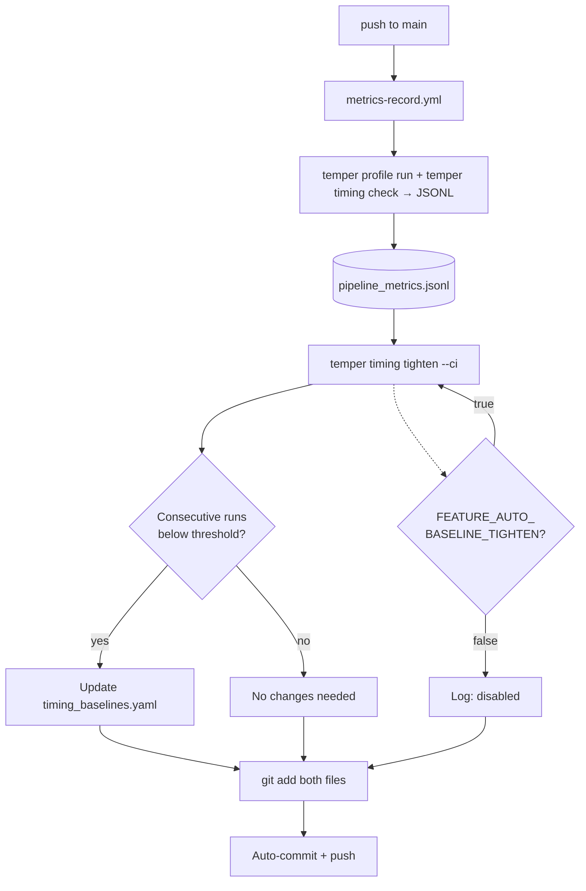

# feat: Auto-Baseline Tightening

## Summary

Add a `temper timing tighten` CLI command that queries the committed `pipeline_metrics.jsonl` time-series store (module=`pipeline-timing`) to detect stages whose wall-clock has consistently dropped well below their committed baseline. When N consecutive main-push runs (N >= 7, configurable) all show a stage's wall-clock at <=50% of its `timing_baselines.yaml` entry, the command auto-lowers the baseline to the median of those N runs and updates the manifest. The tighten check runs as an optional post-profiling step in `metrics-record.yml`, gated by a feature flag.

---

## Problem Frame

Per-stage timing baselines (`timing_baselines.yaml`) are captured once via `temper timing baseline` and stay fixed until a developer manually runs `temper timing regenerate --overwrite`. If a pipeline stage is optimized — say `clearance_grid` drops from 500ms to 100ms — the 20% gate threshold remains pegged to 600ms (500ms * 1.2) instead of tightening to 120ms (100ms * 1.2). Baselines go stale. The gate loses precision. Developers must remember to manually regenerate baselines after every optimization, and nothing in CI prompts them to do so.

The existing `pipeline_metrics.jsonl` time-series store already records per-stage wall-clock timing on every main push via `TimingResult.to_pipeline_metrics_record()` (module=`pipeline-timing`). This data is the source of truth for consecutive-run detection — the question is building the query-and-act logic on top of it.

Three failure modes motivate this:
1. **Stale baselines after optimization.** Stage X gets optimized from 500ms to 100ms. Baseline stays at 500ms. A future PR that slows X from 100ms to 150ms is still 70% below baseline — passes the gate, no alert. The gate is blind to regression within the optimization headroom.
2. **Manual regeneration is forgotten.** Developers optimize stages without remembering to run `temper timing regenerate`. The stale baseline persists indefinitely.
3. **Gradual drift.** Stage timing drifts downward over several PRs (e.g., incremental JAX version bumps, dependency upgrades). Each decrement is individually too small to trigger manual regeneration, but the accumulated drop makes the baseline irrelevant.

---

## Requirements

**Core Detection (R1–R3):**
- R1. Query `pipeline_metrics.jsonl` for `module="pipeline-timing"` records, grouped by (board, pipeline, stage), ordered by timestamp descending.
- R2. For each (board, pipeline, stage), examine the most recent N consecutive main-push runs (N >= 7, configurable). If every run in the window shows `wall_ms_mean <= baseline_ms * T` where T defaults to 0.50 (50%), the stage is eligible for tightening.
- R3. The new baseline value is the median of `wall_ms_mean` across those N eligible runs — not the minimum, not the mean, to avoid anchoring to an outlier.

**CLI and Manifest (R4–R6):**
- R4. `temper timing tighten` subcommand: queries JSONL, detects eligible stages, computes proposed baselines, and writes updated `timing_baselines.yaml`.
- R5. The tighten command records provenance in the manifest entry: `tightened_from_ms` (old baseline), `tightened_at` (timestamp), `tightened_n_runs` (window size used), `tightened_trigger_pct` (threshold that fired), `wall_ms_p95` (p95 of qualifying runs, for variability analysis; distinct from p95-based tightening which is deferred).
- R6. `--dry-run` flag prints a table of proposed changes without modifying the manifest. `--board`, `--stage`, `--pipeline` filters scope the operation.

**CI Integration (R7–R9):**
- R7. The tighten check runs in `metrics-record.yml` as an optional post-profiling step, after all metrics are recorded but before the auto-commit of `pipeline_metrics.jsonl`.
- R8. Opt-in via feature flag: `FEATURE_AUTO_BASELINE_TIGHTEN=true` in the workflow's `env`. Without the flag, the step is skipped. The flag defaults to `false`.
- R9. When the tighten step modifies `timing_baselines.yaml`, the updated manifest is committed in the same auto-commit alongside `pipeline_metrics.jsonl` — a single commit per main push capturing both the new timing data and any baseline adjustments.

**Thresholds and Governance (R10–R12):**
- R10. N (consecutive runs required), T (percentage-below-baseline threshold), and the feature flag are all configurable: CLI flags for dry-run/local use; environment variables for CI (`AUTO_TIGHTEN_N`, `AUTO_TIGHTEN_THRESHOLD`).
- R11. Stages below a `noise-floor` (default 10ms baseline) are excluded from tightening to avoid spurious adjustments on near-zero-timing stages.
- R12. Tightening is monotonic downward only — the command never raises baselines. If timing regresses above baseline, that's the timing gate's job to catch.

---

## Key Technical Decisions

**K1: JSONL as source of truth, not a separate trend store.** The `pipeline_metrics.jsonl` already records per-stage wall-clock on every main push (module=`pipeline-timing`, emitted by `_record_metrics()` in `timing.py:check`). No new data collection needed. The tighten command is a read-only consumer of the JSONL and a write-only producer for `timing_baselines.yaml`.

**K2: Median of N runs, not minimum.** Using `min(wall_ms_mean)` would anchor the baseline to the fastest-ever (flaky) run. Mean of N runs could be skewed by one slow outlier. Median is robust to one bad run in the window and reasonably represents steady-state performance.

**K3: Consecutive runs, not "N of last M."** Requiring N consecutive runs all below the threshold ensures the drop is sustained, not a one-off CI runner anomaly. If run N+1 spikes above threshold, the streak resets and no tightening occurs — this is intentionally conservative.

**K4: Opt-in via feature flag, not unconditional.** Auto-modifying a committed manifest on every main push carries risk. The feature flag allows the team to observe tightening suggestions (`--dry-run` in local testing) before enabling auto-commit in CI. After a bake-in period (30 days of CI observation), the flag defaults to `true`.

**K5: One commit per main push — metrics + tightened baselines together.** The tighten step runs after profiling but before the existing auto-commit step in `metrics-record.yml`. If tightening produced changes, `timing_baselines.yaml` is `git add`-ed alongside `pipeline_metrics.jsonl` in the same commit. This avoids two separate auto-commits per push and keeps the timeline clean.

**K6: Provenance fields in the manifest entry.** Every tightened entry records the old baseline, trigger percentage, window size, and timestamp. This provides an audit trail — a developer can see when and why a baseline was auto-lowered, and revert if it was too aggressive.

---

## Scope Boundaries

### In Scope
- JSONL query logic: filter by `module="pipeline-timing"`, group by (board, pipeline, stage), detect consecutive-run streaks below threshold
- `temper timing tighten` CLI with `--dry-run`, `--board`, `--stage`, `--pipeline`, `--n-runs`, `--threshold` flags
- Integration into `metrics-record.yml` as an optional post-profiling step gated by `FEATURE_AUTO_BASELINE_TIGHTEN`
- Provenance fields in `timing_baselines.yaml` entries (`tightened_from_ms`, `tightened_at`, `tightened_n_runs`, `tightened_trigger_pct`)
- Unit tests for the tighten detection logic (JSONL fixture with known streaks, verify eligibility and median computation)
- Noise-floor exclusion (default 10ms) to prevent tightening on near-zero-timing stages

### Deferred for Follow-Up Work
- **PR-based review flow.** Currently, baseline tightening is auto-committed. A future variant could open a PR instead, with the proposed baseline changes for human review. Deferred until the auto-commit flow proves reliable.
- **Upward tightening.** If a stage is consistently faster than baseline, the baseline lowers. The inverse — a stage consistently slower but within gate threshold — should raise the baseline. Deferred: the timing gate already catches regressions >20%; slow drift within 20% is low-priority.
- **Per-metric tightening beyond wall-clock.** The JSONL records per-stage `wall_ms_mean` but also `wall_ms_min`/`wall_ms_max`. Tightening on min/max or p95 is deferred.
- **Dashboard integration for tightening events.** The GitHub Pages dashboard (Plan 010 U7) could annotate charts with "baseline tightened" markers. Deferred.

### Out of Scope
- Modifying `temper timing check` or the 20% gate threshold — tightening only adjusts baselines, the gate behavior is unchanged
- Tightening on non-pipeline-timing modules (loss-fn, router-bench, firmware)
- Git history rewriting or baseline rollback — provenance fields enable manual reversion if needed
- Automatic detection of "this optimization warrants a new baseline" from PR descriptions — purely JSONL-data-driven

---

## Context & Research

### Relevant Code and Patterns

- `power_pcb_dataset/metrics/pipeline_metrics.jsonl` — committed time-series store. Records with `module="pipeline-timing"` contain `wall_ms_mean`, `n_runs`, `wall_ms_min`, `wall_ms_max` per (board, stage). Emitted by `StageTimingEntry.to_pipeline_metrics_record()` in `packages/temper-placer/src/temper_placer/profiling/timing_gate.py:116`.
- `power_pcb_dataset/timing_baselines.yaml` — committed baseline manifest with per-(board, pipeline, stage) entries. Schema: `format_version`, `stages[]` with `board`, `pipeline`, `stage`, `wall_ms_mean`, `git_hash`, `captured_at`.
- `packages/temper-placer/src/temper_placer/cli/timing.py` — existing `timing` CLI group with `baseline`, `check`, `regenerate` commands. The `_load_manifest()` / `_save_manifest()` helpers at lines 40-52 are the read/write surface for `timing_baselines.yaml`.
- `packages/temper-placer/src/temper_placer/regression/metrics_recorder.py` — `load_metrics()` at line 108 reads and parses `pipeline_metrics.jsonl`, returning a list of dicts. `find_metrics_file()` at line 139 resolves the JSONL path from repo root.
- `.github/workflows/metrics-record.yml` — main-push workflow: runs closure test, records pipeline metrics, profiles loss functions and router benchmarks, generates HTML report, uploads artifact, then auto-commits `pipeline_metrics.jsonl`. The tighten step fits between recording and commit (after line 55, before line 68).
- `.github/workflows/metrics-trend-check.yml` — weekly cron that queries JSONL for sigma-based drift. Pattern for reading JSONL in CI and producing structured output.
- `packages/temper-placer/src/temper_placer/cli/timing.py:225-242` — `_record_metrics()` helper that writes per-stage timing results to JSONL. This is the code path that populates the data the tighten command reads.
- `packages/temper-placer/src/temper_placer/cli/timing.py:478-549` — `timing regenerate` command pattern for user confirmation prompt, baseline overwrite logic, and manifest update flow.

### Institutional Learnings

- **Metrics auto-commit fragility** (Plan 010 learnings). `metrics-record.yml` uses `git pull --rebase` with retry. The tighten step must use the same retry pattern when committing `timing_baselines.yaml` alongside `pipeline_metrics.jsonl` — no separate commit, no separate push.
- **Dead flags must fail loudly.** Plan 010's learnings note that `enable_smoothing=True` was a silent no-op. The `FEATURE_AUTO_BASELINE_TIGHTEN` feature flag must be checked explicitly; when absent, the step logs "Auto-baseline tightening disabled (set FEATURE_AUTO_BASELINE_TIGHTEN=true to enable)" at info level, never silently skips.
- **Scalar counters for hot paths.** The tighten command is a cold-path operation (runs once per main push, reads JSONL, writes manifest). No performance concern.
- **Platform/Python version in manifest.** Plan 022 K7 records platform and Python version in the manifest for cross-run comparison. The tighten command preserves these fields.

---

## High-Level Technical Design

> *Directional guidance for review, not implementation specification.*

### Data Flow



### Tightening Algorithm

```
for each (board, pipeline, stage) in timing_baselines.yaml.stages:
    baseline_ms = entry.wall_ms_mean
    if baseline_ms < noise_floor:  # default 10ms
        skip  (R11)

    query JSONL: module="pipeline-timing", board, stage
    take most recent records, ordered by timestamp desc

    streak = 0
    window = []
    for record in recent_records:
        if record.wall_ms_mean <= baseline_ms * T:  # default T=0.50
            streak += 1
            window.append(record.wall_ms_mean)
        else:
            break  # streak must be consecutive

    if streak >= N:  # default N=7
        new_baseline = median(window)
        update entry:
            wall_ms_mean = new_baseline
            tightened_from_ms = baseline_ms
            tightened_at = now()
            tightened_n_runs = N
            tightened_trigger_pct = T
```

### CLI Interface

```python
@timing.command("tighten")
@click.option("--board", "-b", default=None, help="Tighten only this board")
@click.option("--stage", "-s", default=None, help="Tighten only this stage")
@click.option("--pipeline", "-p", default="DeterministicPipeline", help="Pipeline to check")
@click.option("--n-runs", type=int, default=7, help="Consecutive runs required (default: 7)")
@click.option("--threshold", "-t", type=float, default=0.50, help="Below-baseline ratio (default: 0.50 = 50%%)")
@click.option("--noise-floor", type=float, default=10.0, help="Min baseline ms to consider (default: 10ms)")
@click.option("--dry-run", is_flag=True, default=False, help="Print proposed changes without writing")
@click.option("--ci", "ci_mode", is_flag=True, default=False, help="CI mode: no prompts, exit 0 on success")
def timing_tighten(board, stage, pipeline, n_runs, threshold, noise_floor, dry_run, ci_mode):
    ...
```

---

## Implementation Units

### U1. JSONL Query and Tighten Detection Logic

**Goal:** Implement the core detection algorithm in `timing_gate.py`: load `pipeline_metrics.jsonl`, filter by `module="pipeline-timing"`, group by (board, stage), detect consecutive-run streaks below the threshold ratio, and compute the median-based new baseline.

**Requirements:** R1, R2, R3

**Dependencies:** None (reads existing JSONL, no new dependencies)

**Files:**
- Modify: `packages/temper-placer/src/temper_placer/profiling/timing_gate.py` (add `TightenResult` dataclass, `detect_tightenable_stages()` function)
- Create: `packages/temper-placer/tests/test_timing_tighten.py` (unit tests with JSONL fixtures)

**Approach:**

`TightenResult` dataclass:
```python
@dataclass
class TightenResult:
    board: str
    pipeline: str
    stage: str
    baseline_ms: float          # current committed baseline
    proposed_ms: float          # median of the N qualifying runs
    drop_pct: float             # (baseline - proposed) / baseline * 100
    streak_count: int           # how many consecutive runs met threshold
    qualifying_runs: list[float]  # the N wall_ms_mean values
```

`detect_tightenable_stages()` function:
```python
def detect_tightenable_stages(
    jsonl_path: Path,
    manifest: dict,
    n_runs: int = 7,
    threshold: float = 0.50,
    noise_floor: float = 10.0,
    board_filter: str | None = None,
    stage_filter: str | None = None,
    pipeline_filter: str = "DeterministicPipeline",
) -> list[TightenResult]:
```

Algorithm:
1. Load all JSONL records from `jsonl_path` via existing `load_metrics()`.
2. Filter to `module="pipeline-timing"`. Optionally filter by board/stage/pipeline.
3. Group records by `(board, stage)` key (pipeline is implicit from the record context).
4. Sort each group by `timestamp` descending.
5. For each group, match against a baseline entry in the manifest (by board, pipeline, stage).
6. Walk the sorted records in timestamp-descending order. Build a consecutive streak: each record's `wall_ms_mean` must be `<= baseline_ms * threshold`. Stop at the first record that exceeds the threshold.
7. If streak length >= `n_runs`, compute `proposed_ms = median(streak[:n_runs])`. If streak length > n_runs, use the most recent N (first N in the streak).
8. Skip stages with `baseline_ms < noise_floor`.
9. Return `list[TightenResult]` sorted by `drop_pct` descending (largest drops first).

**Edge cases:**
- Fewer than N records in JSONL total → no tightening possible (insufficient data).
- Streak broken by one run above threshold → streak resets, no tightening.
- JSONL missing `wall_ms_mean` field → skip that record (malformed data).
- Multiple pipelines with same (board, stage) → match on pipeline filter.

**Test scenarios:**
- Happy path: JSONL with 10 consecutive runs all at 40ms, baseline at 100ms → `TightenResult` with `proposed_ms=40`, `streak_count=10`, `drop_pct=60%`.
- Streak broken: 8 runs below threshold, then 1 run at 90ms (above 50ms threshold) → streak stops at 1, no result returned.
- Insufficient data: 5 runs below threshold, N=7 → no result.
- Noise floor: baseline at 3ms (<10ms floor) → skipped.
- Missing data: JSONL has no `pipeline-timing` records → empty result list.
- Multiple stages: 2 stages eligible, 1 not → returns list of 2 results.

**Verification:** `pytest packages/temper-placer/tests/test_timing_tighten.py` passes. Run against the committed `pipeline_metrics.jsonl` on a local checkout: `detect_tightenable_stages()` returns an empty list (current JSONL data is all zero-valued `wall_time_ms=0` for `module="pipeline"` records — `module="pipeline-timing"` records are not yet present in the committed file).

---

### U2. `temper timing tighten` CLI Command

**Goal:** Add the `tighten` subcommand to the existing `timing` CLI group. Integrates U1's detection logic, presents results with Rich formatted output, supports `--dry-run`, and writes updated `timing_baselines.yaml` when not in dry-run mode.

**Requirements:** R4, R5, R6

**Dependencies:** U1 (detection logic)

**Files:**
- Modify: `packages/temper-placer/src/temper_placer/cli/timing.py` (add `timing_tighten` command, import `detect_tightenable_stages`)

**Approach:**

```python
@timing.command("tighten")
@click.option("--board", "-b", default=None)
@click.option("--stage", "-s", default=None)
@click.option("--pipeline", "-p", default="DeterministicPipeline")
@click.option("--n-runs", type=int, default=7, help="Consecutive runs required")
@click.option("--threshold", "-t", type=float, default=0.50, help="Below-baseline ratio (0.0-1.0)")
@click.option("--noise-floor", type=float, default=10.0, help="Min baseline ms to consider")
@click.option("--dry-run", is_flag=True, default=False, help="Print proposed changes without writing")
@click.option("--ci", "ci_mode", is_flag=True, default=False, help="CI mode: no prompts, exit 0 on success")
def timing_tighten(board, stage, pipeline, n_runs, threshold, noise_floor, dry_run, ci_mode):
    ...
```

Algorithm:
1. Load the timing manifest (`_load_manifest()`). If no manifest exists, exit 0 with "No timing baselines to tighten."
2. Resolve the JSONL path via `find_metrics_file(_repo_root())`. If the file doesn't exist, exit 0 with "No metrics data to analyze."
3. Call U1's `detect_tightenable_stages()` with the filters.
4. If no results: print "No stages eligible for tightening." and exit 0.
5. Print a Rich table of results (columns: Board, Stage, Current Baseline, Proposed, Drop %, Streak).
6. If `--dry-run`: print "[dim]Dry run — no changes written. Remove --dry-run to apply.[/]" and exit 0.
7. If `--ci` mode: apply changes automatically. Otherwise, prompt for confirmation.
8. For each `TightenResult`: update the matching entry in the manifest's `stages` list.
   - Set `wall_ms_mean` to `round(result.proposed_ms, 3)`
   - Set `wall_ms_p95` to the p95 of the qualifying runs
   - Add provenance fields:
     ```yaml
     tightened_from_ms: 100.0
     tightened_at: "2026-06-28T12:00:00Z"
     tightened_n_runs: 7
     tightened_trigger_pct: 0.50
     ```
   - Preserve `board`, `pipeline`, `stage`, `n_runs`, `individual_ms` from the most recent qualifying run.
   - Update `git_hash` to current HEAD.
   - Update `captured_at` to now.
9. Save the manifest via `_save_manifest()`.
10. Print summary: "Tightened N stage(s): list of (stage: old_ms → new_ms)."

**Rich output examples:**

Dry run:
```
Eligible stages for auto-tightening (threshold: 50%, N=7):
┌─────────────────┬──────────────────────┬──────────────┬──────────────┬──────────┬─────────┐
│ Board           │ Stage                │ Baseline     │ Proposed     │ Drop %   │ Streak  │
├─────────────────┼──────────────────────┼──────────────┼──────────────┼──────────┼─────────┤
│ temper_placed   │ clearance_grid       │ 500.0 ms     │ 95.0 ms      │ 81.0%    │ 12      │
│ temper_placed   │ component_assignment │ 13.4 ms      │ 5.2 ms       │ 61.2%    │ 8       │
└─────────────────┴──────────────────────┴──────────────┴──────────────┴──────────┴─────────┘
Dry run — no changes written. Remove --dry-run to apply.
```

Applied:
```
Tightening 2 stage(s):
  clearance_grid:       500.0 ms → 95.0 ms   (-81.0%, 12-run streak)
  component_assignment:  13.4 ms → 5.2 ms    (-61.2%, 8-run streak)
Baselines written to power_pcb_dataset/timing_baselines.yaml
```

**Patterns to follow:**
- `timing.py:478-549` for `regenerate` command confirmation prompt and manifest update flow
- `timing.py:200-222` for Rich console output conventions (colors, alignment)
- `timing.py:40-52` for `_load_manifest()` / `_save_manifest()` helpers

**Test scenarios:**
- `temper timing tighten --dry-run` on a repo with eligible stages → prints table, exits 0, `timing_baselines.yaml` unchanged.
- `temper timing tighten --stage clearance_grid --n-runs 5 --threshold 0.60` (stricter threshold) → only stages meeting 60% threshold with 5-run streaks are proposed.
- `temper timing tighten --board temper_placed` (dry run) with no eligible stages → "No stages eligible for tightening." exits 0.
- `temper timing tighten` (non-dry, non-ci) → prompts for confirmation, applies changes on 'y'.
- `temper timing tighten --ci` → applies changes without prompt, exits 0.
- After tightening, `timing_baselines.yaml` entries have `tightened_from_ms`, `tightened_at`, `tightened_n_runs`, `tightened_trigger_pct` fields.
- Untightened stages in the manifest are unmodified (only eligible stages are updated).

**Verification:** Create a test JSONL with synthetic `pipeline-timing` records showing a 10-run streak at 40ms against a 100ms baseline. Run `temper timing tighten --dry-run --n-runs 7 --threshold 0.50`. Verify the table shows the stage as eligible. Run without `--dry-run`. Verify `timing_baselines.yaml` is updated.

---

### U3. CI Integration — optional step in `metrics-record.yml`

**Goal:** Add the `temper timing tighten --ci` command as an optional post-profiling step in the `metrics-record.yml` workflow, gated by `FEATURE_AUTO_BASELINE_TIGHTEN`. When enabled and changes are detected, the updated `timing_baselines.yaml` is committed alongside `pipeline_metrics.jsonl` in the same auto-commit.

**Requirements:** R7, R8, R9, R10

**Dependencies:** U2 (tighten CLI must be functional)

**Files:**
- Modify: `.github/workflows/metrics-record.yml` (add tighten step between profiling and commit)

**Approach:**

Add a new step after the router benchmark profiling step and the HTML report generation, but before the "Commit and push metrics" step:

```yaml
- name: Auto-tighten timing baselines
  if: env.FEATURE_AUTO_BASELINE_TIGHTEN == 'true'
  continue-on-error: true
  run: |
    echo "Checking for eligible baseline tightening..."
    uv run temper timing tighten --ci \
      --n-runs "${AUTO_TIGHTEN_N:-7}" \
      --threshold "${AUTO_TIGHTEN_THRESHOLD:-0.50}"
    if git diff --quiet power_pcb_dataset/timing_baselines.yaml; then
      echo "No baselines tightened."
    else
      echo "Baselines tightened — will be committed alongside metrics."
      git add power_pcb_dataset/timing_baselines.yaml
    fi
  env:
    FEATURE_AUTO_BASELINE_TIGHTEN: ${{ vars.FEATURE_AUTO_BASELINE_TIGHTEN || 'false' }}
    AUTO_TIGHTEN_N: ${{ vars.AUTO_TIGHTEN_N || '7' }}
    AUTO_TIGHTEN_THRESHOLD: ${{ vars.AUTO_TIGHTEN_THRESHOLD || '0.50' }}
```

The existing "Commit and push metrics" step already runs `git add power_pcb_dataset/metrics/pipeline_metrics.jsonl`. If the tighten step staged `timing_baselines.yaml`, both files appear in the same commit. The `git diff --cached --quiet` check still works — it exits non-zero if either file has changes, and the commit proceeds.

**Feature flag semantics:**
- `FEATURE_AUTO_BASELINE_TIGHTEN` defaults to `"false"` in the `env` block (via `${{ vars.FEATURE_AUTO_BASELINE_TIGHTEN || 'false' }}`).
- To enable, set the repository variable `FEATURE_AUTO_BASELINE_TIGHTEN` to `"true"` in GitHub repo Settings > Secrets and variables > Actions > Variables.
- When disabled: the step is skipped via `if:` condition. The workflow logs nothing about tightening (no noise).
- When enabled but no stages eligible: the tighten command exits 0, `git diff --quiet` succeeds, message "No baselines tightened." is logged.
- When enabled and changes exist: `git diff --quiet` fails, `timing_baselines.yaml` is staged, message "Baselines tightened" is logged, and the subsequent commit step includes it.

**continue-on-error semantics:**
The tighten step uses `continue-on-error: true` so a bug in the tightening logic never blocks the metrics commit. If tightening crashes, the error appears in the workflow log but `pipeline_metrics.jsonl` is still committed normally.

**Configurable thresholds via repository variables:**
- `AUTO_TIGHTEN_N` (default 7): number of consecutive runs required
- `AUTO_TIGHTEN_THRESHOLD` (default 0.50): below-baseline ratio
- These are read from GitHub Actions repository variables, allowing tuning without code changes.

**Patterns to follow:**
- `.github/workflows/metrics-record.yml:27-33` for `continue-on-error` pattern on profiling steps
- `.github/workflows/metrics-record.yml:68-79` for auto-commit with retry loop

**Test scenarios:**
- Flag disabled (default): workflow runs, tighten step is skipped entirely, no changes to `timing_baselines.yaml`.
- Flag enabled, no eligible stages: tighten exits 0, "No baselines tightened." logged, only `pipeline_metrics.jsonl` committed.
- Flag enabled, eligible stages: tighten updates `timing_baselines.yaml`, both files committed in single commit.
- Tighten command crashes (bug): `continue-on-error: true` keeps workflow green, `pipeline_metrics.jsonl` still committed, error visible in workflow log.
- Concurrent main pushes: the existing `git pull --rebase` retry loop in the commit step handles the case where another push modified `timing_baselines.yaml`.

**Verification:** On a fork/environment with `FEATURE_AUTO_BASELINE_TIGHTEN=true` and synthetic `pipeline-timing` data showing a 10-run streak at 40ms against a 100ms baseline: push to main, verify workflow log shows "Baselines tightened", verify the auto-commit includes both `pipeline_metrics.jsonl` and `timing_baselines.yaml` with the updated baseline.

---

### U4. Unit Tests

**Goal:** Comprehensive unit tests for the tighten detection logic (U1) and CLI integration (U2).

**Requirements:** R1–R6 (correctness of detection algorithm and manifest mutation)

**Dependencies:** U1, U2

**Files:**
- Create: `packages/temper-placer/tests/test_timing_tighten.py`

**Test structure:**

1. **Detection logic tests** (using in-memory JSONL data via `load_metrics` mock or tempfile):
   - `test_no_jsonl_file` → empty result
   - `test_no_pipeline_timing_records` → empty result (only module=pipeline records)
   - `test_insufficient_runs` → empty result (4 qualifying runs, N=7)
   - `test_exact_n_runs_all_below` → single TightenResult with median = median of N values
   - `test_more_than_n_runs_all_below` → TightenResult using most recent N of the streak
   - `test_streak_broken` → empty result (7 below, 1 above, 2 below — streak is 2, not 7)
   - `test_threshold_boundary` → wall_ms = baseline * 0.50 (exact threshold) qualifies
   - `test_threshold_boundary_above` → wall_ms = baseline * 0.501 does not qualify
   - `test_noise_floor` → baseline 5ms < 10ms floor → skipped
   - `test_median_of_odd_count` → 7 runs, median is the 4th sorted value
   - `test_median_of_even_count` → 8 runs, median is mean of 4th and 5th sorted values
   - `test_multiple_stages_mixed` → 2 stages eligible, 1 not → returns 2 results
   - `test_board_filter` → only matching board returned
   - `test_stage_filter` → only matching stage returned
   - `test_missing_wall_ms_mean` → record skipped, streak continues from next record

2. **Manifest update tests** (using tempfile for `timing_baselines.yaml`):
   - `test_manifest_unchanged_on_dry_run` → manifest identical before/after
   - `test_manifest_updated_single_stage` → one entry's `wall_ms_mean` updated, provenance fields added
   - `test_manifest_updated_multiple_stages` → all eligible stages updated, ineligible unchanged
   - `test_provenance_fields_written` → `tightened_from_ms`, `tightened_at`, `tightened_n_runs`, `tightened_trigger_pct` present
   - `test_git_hash_updated` → entry's `git_hash` matches current HEAD after tighten

**Patterns to follow:**
- `packages/temper-placer/tests/regression/test_metrics_recorder.py` for JSONL fixture patterns
- `packages/temper-placer/tests/test_profiling.py` for test structure and tempfile usage
- Use `pytest` fixtures for synthetic JSONL data and temporary manifest files

**Verification:** `pytest packages/temper-placer/tests/test_timing_tighten.py -v` passes all tests.

---

## Output Structure

```
packages/temper-placer/src/temper_placer/profiling/
    timing_gate.py              # Modified: add TightenResult, detect_tightenable_stages()
packages/temper-placer/src/temper_placer/cli/
    timing.py                   # Modified: add timing_tighten command
packages/temper-placer/tests/
    test_timing_tighten.py      # New: unit tests for detection logic and CLI
.github/workflows/
    metrics-record.yml          # Modified: add optional tighten step
power_pcb_dataset/
    timing_baselines.yaml       # Modified by tighten command: provenance fields in entries
```

No new packages, no new dependencies. The tighten command uses existing infrastructure: `click` (CLI), `pyyaml` (manifest), `json` (JSONL parsing), `statistics.median` (stdlib).

---

## System-Wide Impact

- **CI workflow:** One new step in `metrics-record.yml` (`continue-on-error: true`, `if:` gated on feature flag). When disabled, zero impact. When enabled, adds <500ms to the workflow (JSONL read + median computation on ~100 records).
- **Repository layout:** `timing_baselines.yaml` gains optional provenance fields (`tightened_from_ms`, etc.) in tightened entries. These are additive and backward-compatible — existing consumers (`temper timing check`, `temper timing baseline`) ignore unknown YAML keys.
- **Developer workflow:** No change when feature flag is off. When enabled, developers may notice baselines auto-lowering after sustained optimizations. The `temper timing tighten --dry-run` command is available for local preview.
- **No changes to:** `pyproject.toml`, `uv.lock`, firmware, PCB designs, golden fixtures, the timing gate (20% threshold), or any other CI workflow.

---

## Dependencies / Prerequisites

- **Upstream:** Plan 010 (CI profiling platform — completed) provides `PipelineMetricsRecord` schema, `load_metrics()`, and the `metrics-record.yml` auto-commit pattern. Plan 022 (per-stage timing gate — completed) provides `timing_baselines.yaml`, the `timing` CLI group, `_record_metrics()` JSONL emission, and `TimingResult.to_pipeline_metrics_record()`.
- **New dependencies:** None. All tooling uses existing project dependencies: `click`, `pyyaml`, stdlib `statistics`, existing `load_metrics()`.
- **Downstream unblocks:** Plan 022's "Deferred for Follow-Up Work" section lists "Automatic baseline tightening" as a deferred item — this plan implements it. The dashboard (Plan 010 U7) could later annotate charts with tightening events.

---

## Risk Analysis & Mitigation

| Risk | Severity | Likelihood | Mitigation |
|------|----------|------------|------------|
| Over-tightening: noise in CI runner timing causes false tightening streaks | Medium (baselines become unrealistically low) | Low | Median of N runs is robust to one flaky fast outlier. Requirement of N consecutive runs (default 7) requires sustained pattern. `noise-floor` excludes trivial stages. `--dry-run` preview before enabling. |
| Merge conflicts on `timing_baselines.yaml` from auto-tighten + manual regenerate | Medium (developer confusion) | Low | Tightening only fires after N consecutive runs — rare for a stage to be both auto-tightened and manually regenerated simultaneously. The auto-commit `git pull --rebase` retry loop resolves conflicts automatically; if rebase fails, the tighten step is `continue-on-error: true` and metrics still commit. |
| Baseline drift downward: successive tightenings ratchet baseline to zero | Medium (gate becomes meaningless) | Low | Each tightening requires N consecutive runs at <=50% of current baseline. After the first tightening from 500ms to 100ms, the next tightening would require N runs at <=50ms — a real drop, not drift. The monotonic-downward constraint (R12) prevents oscillation. |
| Tighten command writes malformed YAML | High (breaks `temper timing check` CI gate on next PR) | Low | `_save_manifest()` uses `yaml.safe_dump()` which produces valid YAML. Provenance fields are flat scalars. Unit tests (U4) cover round-trip: tighten → load manifest → check parses correctly. |
| Feature flag enabled prematurely in production | Medium (unexpected baseline changes) | Low | Flag defaults to `false`. Enabling requires explicit repository variable change via GitHub UI. Flag is documented as experimental with a 30-day bake-in period before defaulting to `true`. |
| JSONL grows large, tighten query becomes slow | Low (performance) | Low | `pipeline_metrics.jsonl` grows ~2KB per commit. At 100 commits/week, 1 year = ~10MB — `load_metrics()` reads and parses this in <100ms. The tighten query filters to `module="pipeline-timing"` only, which is ~30% of records. |

---

## Success Criteria

- SC1. `temper timing tighten --dry-run` against a JSONL with 10 consecutive `pipeline-timing` records at 40ms (baseline 100ms) shows the stage as eligible with a proposed baseline of ~40ms.
- SC2. `temper timing tighten --dry-run` against the current committed `pipeline_metrics.jsonl` (zero-valued records) shows "No stages eligible for tightening."
- SC3. Running `temper timing tighten` (non-dry) updates `timing_baselines.yaml` with provenance fields on tightened entries and leaves other entries unchanged.
- SC4. When `FEATURE_AUTO_BASELINE_TIGHTEN=true` is set and a stage meets the N-run threshold, `metrics-record.yml` auto-commits the tightened `timing_baselines.yaml` alongside `pipeline_metrics.jsonl` in a single commit.
- SC5. When `FEATURE_AUTO_BASELINE_TIGHTEN` is unset or `"false"`, the workflow logs nothing about tightening and makes no changes to `timing_baselines.yaml`.
- SC6. Unit tests (U4) achieve >90% line coverage on `detect_tightenable_stages()` and the tighten CLI path.

---

## Sources & References

- Profiling platform: `docs/plans/2026-06-28-010-feat-ci-profiling-regression-platform-plan.md`
- Per-stage timing gate: `docs/plans/2026-06-22-022-feat-per-stage-timing-regression-gate-plan.md`
- Pipeline observability (Plan 011, active): `docs/plans/2026-06-28-011-feat-pipeline-observability-plan.md`
- Timing gate implementation: `packages/temper-placer/src/temper_placer/profiling/timing_gate.py`
- Timing CLI: `packages/temper-placer/src/temper_placer/cli/timing.py`
- Metrics recorder: `packages/temper-placer/src/temper_placer/regression/metrics_recorder.py`
- JSONL store: `power_pcb_dataset/metrics/pipeline_metrics.jsonl`
- Baseline manifest: `power_pcb_dataset/timing_baselines.yaml`
- CI workflow: `.github/workflows/metrics-record.yml`
- Trend check: `.github/workflows/metrics-trend-check.yml`
- Golden fixture pattern (manifest + CLI + CI gate): `docs/plans/2026-06-22-009-feat-golden-fixture-ladder-plan.md`
- Project conventions: `AGENTS.md`
