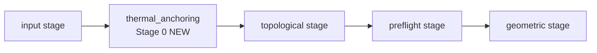

# feat: Thermal-Potential-Field Anchoring for Power Device Placement

## Summary

Construct a continuous thermal potential field over the board surface before gradient-based placement begins, greedily assign power devices to field minima as fixed positions, then run the existing pipeline relative to those anchors. This moves thermal awareness from curriculum Phase 3 (epoch 3000) to Phase 0 — before any optimizer iteration — while keeping existing thermal losses active as safety nets at reduced weight.

---

## Problem Frame

By epoch 3000 the optimizer has already committed components to a rough topology under spread, overlap, and boundary pressure. Activating thermal losses at that point forces them to fight established gradients, resulting in compromised positions (e.g., IGBTs settling at 25mm from the heatsink edge instead of the required 5mm). Phase-0 anchoring eliminates this conflict at its root by pre-placing power devices at thermally optimal positions before the optimizer ever runs.

In the context of the Temper induction cooker, this is a fire-risk safety issue — IGBTs far from the heatsink edge face insufficient cooling and risk thermal runaway.

---

## Requirements

- R1. After Phase-0 anchoring, all anchored power devices are within their `max_distance_from_edge_mm` of the designated heatsink edge (SC1)
- R2. No two anchored power devices are closer than `min_separation_mm` (SC2)
- R3. Heatsink edge validation (3 checks) must pass before any anchoring proceeds; failure is a hard pipeline abort (safety gate)
- R4. Predicted Tj must not exceed rated Tj_max for any anchored device; violation is a hard pipeline abort (safety gate)
- R5. Stackup with <4 layers disables φ_copper with a logged warning and proceeds with φ_base + φ_coupling only
- R6. Phase-0 anchoring is activated by config flag `initialization.thermal_anchoring: true` AND presence of `thermal_constraints` in PCL
- R7. Final wirelength after full pipeline must not increase by more than 5% vs baseline (SC3)
- R8. Critical-loop loop_area must not increase by more than 5% vs baseline (SC4)
- R9. DRC violation count must not increase vs baseline (SC5)
- R10. Anchoring produces deterministic output for fixed input — identical positions across runs (SC7)
- R11. Potential field is non-negative everywhere (property-based test invariant)
- R12. Field minima lie within 10mm of the declared heatsink edge (property-based test invariant)
- R13. Greedy assignment produces unique positions — no two devices at same coordinates
- R14. Anchor positions are within each component's assigned zone polygon
- R15. Fixed components truly prevent gradient updates — verified by 10-epoch test with epsilon tolerance
- R16. With no power dissipation data, coupling is skipped and φ_base used only with a logged warning
- R17. Phase-0 anchoring completes in under 500ms for ≤10 power devices on a 100×100 grid

---

## Scope Boundaries

**In scope:**
- Thermal potential field construction (φ_base, φ_copper, φ_convection, φ_coupling, φ_exclusion) as a pure Python/JAX module
- Greedy anchor assignment for power devices in `ThermalProperties.high_power_components` with power_dissipation_w > 0
- Writing anchors to `PlacementConstraints.fixed_positions` / `fixed_components` before pipeline execution
- Integration into pipeline DAG manifest as a prepended Stage 0 between input and topological
- Safety gates: heatsink edge validation (3 checks), Tj hard error, stackup-layer check
- Curriculum thermal loss weight reduction when Phase-0 is active
- A/B testing infrastructure (baseline vs variant, metrics collection)
- Full test suite: property-based, safety gate, prerequisite validation, integration

**Deferred to Follow-Up Work:**
- Anchoring heat-sensitive components (sensors, MCU) — remain optimizer-placed with `HeatSensitiveDistanceLoss`
- Full thermal simulation (CFD / finite-element) — this is a heuristic approximation
- Temperature-dependent derating iteration (v2)
- Transient thermal effects / duty cycle modeling (v3)
- Multi-heatsink edge support (v2)
- Anchor relaxation pass during Phase 4-5 (±3mm radius) if SC3/SC4 fail beyond tolerance (v2) — tracked as separate work item
- Active heat-sensitive repulsion between anchored power devices and sensitive components (v2)

---

## Context & Research

### Relevant Code and Patterns

- **Pipeline stage pattern:** classes with `__call__(self, state, context: DataContext) -> StageResult` — see `pipeline/stages/preflight_stage.py:12-40` for the canonical pattern
- **Pipeline DAG manifest:** `configs/pipeline_default.yaml` — stages declare `requires`, `provides`, `handler`, `skip_if`, `timeout_s`
- **Fixed component gradient suppression:** `optimizer/train.py:621-648` — `fixed_mask` array zeroes gradients and optimizer state at each step; this mechanism is battle-tested and requires no changes
- **PlacementConstraints.fixed_components / fixed_positions:** `io/config_loader.py:677,680` — populated from PCL YAML, applied to netlist via `apply_fixed_components_to_netlist()` at `io/config_loader.py:1717-1730`
- **ThermalProperties:** `io/config_loader.py:133-156` — `high_power_components`, `power_dissipation_w`, `heat_sensitive_components`, `thermal_pad_components`
- **ThermalConstraint:** `losses/types.py` — `component_ref`, `edge`, `max_distance`, `weight`
- **Existing thermal loss functions:** `losses/thermal.py` — `compute_edge_distance()`, `ThermalLoss`, `ThermalSpreadLoss`, `HeatSensitiveDistanceLoss`, `EdgePreferenceLoss`
- **Junction temperature estimation:** `physics/thermal.py:8-51` — `estimate_junction_temp()` with lumped-parameter Rjc/Rch/Rha model
- **Curriculum phases:** `optimizer/curriculum.py:24-129` — 5-phase schedule; thermal losses activate in Phase 3 (epoch 3000-5000) at weight 25.0
- **Layer stackup:** `core/board.py:350-395` — `LayerStackup`, `Layer` dataclasses; `manufacturing/stackup_validator.py:69` — `validate_stackup()`
- **Board validation enforces 4-layer:** `core/board.py:465-475` — raises `ValueError` if not exactly 4 canonical layers
- **Test patterns:** `tests/losses/test_thermal_advanced.py` — pytest fixtures with `Board`, `Component`, `Netlist`; JAX-compatible assertions
- **LossContext:** `losses/base.py:53-1382` — carries `fixed_mask`, `board`, netlist indices, component indices; built via `LossContext.from_netlist_and_board()`

### Institutional Learnings

No existing `docs/solutions/` entries for thermal anchoring. This plan is the first systematic treatment of pre-optimization thermal initialization.

---

## Key Technical Decisions

- **Superposition over coupled solve.** A full coupled thermal simulation is overkill for a placement heuristic. Linear superposition with Gaussian kernels is fast, differentiable if needed later, and sufficient for anchor assignment. The `physics/thermal.py` lumped-parameter model cross-validates results. (see origin: `docs/brainstorms/2026-07-01-thermal-anchoring-requirements.md`)
- **Greedy assignment over optimal assignment.** The anchor problem is small (6-10 devices); greedy-by-power gives a natural priority ordering (hottest first = most constrained first). Tie-break by alphabetical component reference for determinism (SC7).
- **Phase-0 rather than Phase-3 weight increase.** Adding Phase-0 anchors is architecturally cleaner than increasing `ThermalLoss` weight in Phase 3, which would cause gradient conflict with settled layouts.
- **Keep existing thermal losses active.** They serve as safety nets for non-anchored thermal components and provide gradient pressure if an anchor position becomes invalidated by later stages. Weights reduced 5x when anchoring is active.
- **Two-pass assignment (φ_base only, then φ_coupling corrected).** Avoids the bootstrap problem where early-assigned devices lack neighbor positions for coupling computation. Cap reassignment at 3 iterations.
- **Config-file gating, not hardcode gating.** The `initialization.thermal_anchoring` PCL flag determines activation, with graceful fallback when `thermal_constraints` is absent.
- **Pipeline stage prepended between input and topological.** Anchoring needs board/netlist/constraints (post-input) and must complete before deterministic placement initializes remaining components.

---

## Open Questions

### Resolved During Planning

- **U1 (Rjc values).** Origin asks: what Rjc values are available from BOM/footprint library? Resolution: add an optional `Rjc: float | None` field to `core/board.py` `Component` dataclass and `io/footprint_library.py` `Footprint` dataclass. Infer from package type when not explicitly provided (TO-247 → 0.6, DPAK → 2.0, standard lookup table). When Rjc is unavailable, use a conservative default (0.6 K/W).
- **U2 (via density pre-routing).** Origin asks: what via density data exists pre-routing? Resolution: via density is estimated from ground-net footprint patterns. If insufficient data exists, φ_copper degrades to copper-pour-only mode with a logged warning. Full via stitching analysis requires post-routing data and is deferred to v2.
- **U3 (which components to anchor).** Origin asks: how many devices need anchoring? Resolution: anchor components in `ThermalProperties.high_power_components` that have `power_dissipation_w > 0`. The Temper board's IGBTs (Q1, Q2) are the primary targets; diodes (D1, D2) and sense resistors benefit from spreading but not edge anchoring. The anchoring decision is per-component, driven by the presence of a `ThermalConstraint` edge requirement in the PCL.
- **U4 (opt-in per-component vs automatic).** Origin asks: should anchoring be opt-in per-component? Resolution: automatic for components that appear in both `high_power_components` AND have a `ThermalConstraint` specifying an edge. For Temper, this means Q1 and Q2. The `high_power_components` list without an edge constraint indicates components that benefit from spreading but not edge anchoring.
- **U5 (grid resolution).** Origin asks: what grid resolution? Resolution: parameterized, default 50×50. The 100×100 grid mentioned in the computational budget constraint is the maximum supported resolution, not the default.
- **U6 (fixed_components gradient suppression).** Origin asks: does `fixed_components` correctly prevent gradient updates? Resolution: confirmed by codebase research. `optimizer/train.py:549,621-648` applies `fixed_mask` to zero out gradients, clamp positions, and zero optimizer momentum/nu state. This mechanism is battle-tested across multiple pipeline stages. Unit U11 provides a direct 10-epoch verification test.

### Deferred to Implementation

- Exact method signature for φ field superposition; determined by JAX tracing compatibility during implementation
- Precise Gaussian kernel σ parameter calibration; tuned against golden board thermal constraints during implementation
- Zone polygon intersection algorithm for anchor clamping; chosen from existing `geometry/` utilities during implementation

---

## Output Structure

    packages/temper-placer/src/temper_placer/
      physics/
        thermal_potential.py          # NEW — φ field construction + superposition
      pipeline/stages/
        thermal_anchoring_stage.py    # NEW — Stage 0: build field, assign anchors
      io/
        config_loader.py              # MODIFY — ThermalProperties fields
        footprint_library.py          # MODIFY — Rjc field
      optimizer/
        curriculum.py                 # MODIFY — conditional weight reduction
      core/
        board.py                      # MODIFY — Rjc field on Component
    packages/temper-placer/configs/
      pipeline_default.yaml           # MODIFY — thermal_anchoring stage entry
    packages/temper-placer/tests/
      physics/
        test_thermal_potential.py     # NEW — property-based + unit tests
      pipeline/stages/
        test_thermal_anchoring_stage.py  # NEW — stage unit + integration tests
    packages/temper-placer/experiments/
      ab_test_thermal_anchoring.py    # NEW — A/B testing infrastructure

---

## High-Level Technical Design

> *This illustrates the intended approach and is directional guidance for review, not implementation specification. The implementing agent should treat it as context, not code to reproduce.*

### Potential Field Construction

The board is discretized into a `grid_resolution × grid_resolution` uniform grid. Five field components superpose at each cell:

```
φ(x, y) = w_edge * φ_edge(x, y)
        + w_copper * φ_copper(x, y)
        + w_coupling * φ_coupling(x, y)
        + w_exclusion * φ_exclusion(x, y)
        + w_convection * φ_convection(x, y)
```

Where each weight w_i is configurable (default all 1.0) so field components can be disabled individually.

**φ_edge** — Derived from 1D heat equation ∂T/∂x ∝ distance. Exponential decay from the declared heatsink edge:
```
φ_edge(x, y) = exp(-d_edge(x, y) / λ)   where λ = 10mm (decay length)
```
For "TOP" edge: d_edge = board_height - y. Distance of 5mm → φ ≈ 0.61; distance of 25mm → φ ≈ 0.08. The softer exponential (vs. hard cutoff) keeps the gradient smooth.

**φ_copper** — Effective thermal conductivity of FR4 + Cu stackup. Per-cell conductance from:
```
k_eff(cell) = Σ_layer (k_i * t_i * cu_fill_fraction)
```
where FR4 k ≈ 0.3 W/m·K, copper k ≈ 385 W/m·K, t_i is layer thickness, and cu_fill_fraction is estimated from zone definitions. Outer layers weighted 3x for direct convection. φ_copper = 1 / (k_eff + ε) — high conductance → low potential.

**φ_coupling** — Steady-state heat equation ∇²T = -q/k with point-source Green's function. Gaussian kernel centered on each power device j:
```
φ_coupling(x, y) = Σ_j P_j * exp(-||(x,y) - pos_j||² / (2σ_j²))
```
where σ_j = sqrt(P_j) * R_θ_board / A_effective. This models mutual heating: two 50W devices at 10mm separation contribute ΔT proportional to P_i * Rθ_ij.

**φ_exclusion** — Hard step function at `thermal_exclusion_radius` (default 10mm) around each anchored power device centroid. Modeled as a steep sigmoid (not true step) to keep the field differentiable:
```
φ_exclusion(x, y) = V_exclude * σ(κ * (r_exclude - d((x,y), anchor_pos)))
```
where σ is the logistic sigmoid, κ = 20 controls steepness, and V_exclude is a large constant (e.g., 1e6).

**φ_convection** — Linear gradient in the dominant airflow direction if `airflow_vector` is provided. If absent, φ_convection = 0 (uniform ambient).

### Greedy Anchor Assignment Algorithm

```
1. Sort power devices by power_dissipation_w descending (tie-break: alphabetical ref)
2. Pass 1 (φ_base only):
   For each device in order:
     a. Compute φ(x, y) = φ_edge + φ_copper (omit coupling; neighbors unknown)
     b. Find φ_min = argmin_{valid} φ(x, y) within:
        - Device's zone polygon from PlacementConstraints
        - Board interior minus keepout polygons
        - Valid edge strip (within 10mm of identified heatsink edge)
     c. Record (ref, φ_min) as Pass-1 anchor
3. Pass 2 (φ_coupling correction):
   For each device in Pass-1 order:
     a. Recompute φ(x, y) including φ_coupling with all known neighbor positions
     b. If new φ_min differs from Pass-1 position by >5mm, update anchor
   Repeat up to 3 iterations or until no updates
4. For each anchor:
   a. Clamp to zone ∩ keepout-free ∩ edge strip
   b. If clamped position differs from φ_min by >2mm, log warning with device ref and coordinates
5. Write anchors to PlacementConstraints.fixed_components + fixed_positions
```

### Junction Temperature Estimation

For each anchored device:
```
Tj = Ta + P × (Rθ_jc + Rθ_board)
Rθ_board = Σ_i (t_layer_i / (k_i × A_effective))
```
Ta = 40°C (ambient), A_effective = 100mm² (10×10mm reference area). If Tj > component's rated Tj_max → hard pipeline abort.

### Pipeline Integration



The thermal anchoring stage runs after `input` (which parses PCB, loads constraints) and before `topological` (which initializes remaining component positions). It produces no new data keys to downstream stages — anchors are written directly into `constraints.fixed_positions` and `constraints.fixed_components`, which the downstream pipeline already respects.

---

## Implementation Units

### U1. Thermal Potential Field Module

**Goal:** Implement the five-component thermal potential field as a new `physics/thermal_potential.py` module.

**Requirements:** R11, R12, R16, R17

**Dependencies:** None

**Files:**
- Create: `packages/temper-placer/src/temper_placer/physics/thermal_potential.py`
- Test: `packages/temper-placer/tests/physics/test_thermal_potential.py`

**Approach:**
- Implement each field component as a pure JAX function taking a grid of (x, y) points and returning a scalar potential array
- Field weights are configurable via a `ThermalPotentialConfig` dataclass; zero weight disables a component
- φ_edge: exponential decay from declared heatsink edge, decay length parametric (default 10mm)
- φ_copper: compute per-cell effective thermal conductivity from stackup layer data; degrade to uniform if no copper zone data available
- φ_coupling: Gaussian kernel superposition weighted by P_j; σ_j derived from stackup thermal resistance
- φ_exclusion: sigmoid barrier at thermal_exclusion_radius; center exclusion at Pass-1 anchor positions
- φ_convection: linear gradient in airflow_direction if `airflow_vector` present; zero otherwise
- `superpose_fields()` function: weighted sum of all non-zero components
- Discrete grid evaluation via `jnp.meshgrid`; all operations are JAX-compatible (jit/grad/vmap)

**Patterns to follow:**
- Module structure: `physics/thermal.py` — same directory, similar naming convention
- JAX array operations: `losses/thermal.py` — use `jnp.*` operations with `+ 1e-12` epsilon guards
- Dataclass config pattern: `io/config_loader.py` `ThermalProperties`

**Test scenarios:**
- Happy path: φ_edge at the declared edge → minimum value; at opposite edge → maximum value
- Happy path: φ_copper in high-copper-fill zone → lower potential than low-fill zone
- Happy path: φ_coupling for two 50W devices at 10mm → higher potential at midpoint than at 50mm
- Happy path: φ_exclusion at 5mm from anchor → near zero; at 0mm → near V_exclude
- Happy path: φ_convection with airflow vector → linear ramp in airflow direction
- Edge case: superposition with all components → non-negative field everywhere (property-based test)
- Edge case: minimum field position lies within 10mm of declared edge for any power dissipation profile (property-based test)
- Edge case: no zone data → φ_copper degrades to uniform conductivity, no error
- Edge case: no airflow vector → φ_convection is exactly zero, no error
- Error path: invalid edge string → default value with log warning (non-blocking)

**Verification:**
- All field components produce non-negative values for any valid grid input
- `superpose_fields()` with all disabled components returns zero field
- Module importable without side effects; no imports from pipeline layer (adheres to import boundary)

---

### U2. Greedy Anchor Assignment Algorithm

**Goal:** Implement the two-pass greedy anchor assignment that places power devices at field minima, integrated with the thermal potential field from U1.

**Requirements:** R1, R2, R10, R13, R14

**Dependencies:** U1

**Files:**
- Create: algorithm within `packages/temper-placer/src/temper_placer/physics/thermal_potential.py` (anchor_assignment module or function)
- Test: within `packages/temper-placer/tests/physics/test_thermal_potential.py`

**Approach:**
- `assign_thermal_anchors()` function: accepts thermal potential field, board bounds, zone polygons, keepout polygons, device power list, heatsink edge
- Sorting: descending by `power_dissipation_w`; tie-break by component reference string alphabetical (determinism for SC7)
- Pass 1: for each device, search discrete grid for minimum φ within three constraints (zone polygon, keepout-free, edge strip ≤10mm from heatsink edge)
- Pass 2: recompute φ including φ_coupling with all known Pass-1 anchor positions; re-evaluate minima; if deviation >5mm, update position; repeat up to 3 iterations or until convergence
- Clamp final position: if clamped position differs from unconstrained φ_min by >2mm, log warning with device ref and coordinate delta
- Return: dict mapping component_ref → (x, y) anchor position
- Uniqueness enforcement (R13): after all anchors assigned, verify no two positions are identical within 0.1mm tolerance; if duplicate detected, offset second device by 0.5mm along the edge strip and re-check

**Patterns to follow:**
- Function structure: `losses/thermal.py` `compute_thermal_penalty()` — iterates over constraints, accumulates results
- Zone containment checks: existing `Zone.contains_point()` on `core/board.py`

**Test scenarios:**
- Happy path: two IGBTs (50W each) with TOP edge → both placed within 5mm of TOP edge
- Happy path: deterministic output — same input produces identical anchor positions across 10 runs
- Happy path: greedy assignment produces no two devices at same coordinates (R13)
- Happy path: anchor positions are within each device's assigned zone (R14)
- Edge case: single power device → anchor at global φ minimum without coupling pass
- Edge case: power dissipation within 5% of each other → tie-break by alphabetical ref, consistent across runs
- Edge case: no power dissipation data → skip coupling, use φ_base only, log warning (R16)
- Edge case: φ_min outside valid region → clamped position used; warning logged if clamp delta >2mm
- Edge case: coupling-corrected position same as Pass-1 → no update, single iteration completes
- Error path: device's zone polygon empty or invalid → skip device with log warning
- Integration: greedy assignment integrated with φ superposition from U1 — end-to-end test

**Verification:**
- All anchored positions satisfy R1 (edge distance constraint) and R2 (minimum separation)
- R10 (determinism) verified by 10-run identity check
- No anchor position falls outside board bounds

---

### U3. Thermal Anchoring Pipeline Stage

**Goal:** Implement the thermal anchoring pipeline stage that triggers before topological placement, reads constraints, builds the potential field, assigns anchors, validates safety gates, and writes fixed positions.

**Requirements:** R3, R4, R5, R6

**Dependencies:** U1, U2

**Files:**
- Create: `packages/temper-placer/src/temper_placer/pipeline/stages/thermal_anchoring_stage.py`
- Test: `packages/temper-placer/tests/pipeline/stages/test_thermal_anchoring_stage.py`

**Approach:**
- Follow canonical stage pattern: class `ThermalAnchoringStage` with `__call__(self, state, context: DataContext) -> StageResult`
- Reads `board`, `netlist`, `constraints` from DataContext
- Gated by: `constraints.initialization.thermal_anchoring == True` AND `len(constraints.thermal_constraints) > 0`
- If gate fails: log info, return StageResult.success() — anchoring is a no-op, pipeline continues normally
- Builds `ThermalPotentialConfig` from PCL data (heatsink edge from first `ThermalConstraint.edge`, zone definitions from `PlacementConstraints.zones`, stackup from `Board.layer_stackup`, power dissipation from `ThermalProperties.power_dissipation_w`, copper zone estimate from `PlacementConstraints.copper_zones`)
- Calls φ superposition (U1) and greedy assignment (U2)
- Runs safety gate validation (U5) before writing anchors
- Writes anchors via `apply_fixed_components_to_netlist()` + direct mutation of `constraints.fixed_positions` and `constraints.fixed_components`
- Emits elapsed time; logs if >500ms (computational budget check against R17)

**Patterns to follow:**
- Stage pattern: `pipeline/stages/preflight_stage.py` — timing, DataContext access, StageResult return
- Error pattern: `pipeline/orchestrator.py` `PipelineError` — raises with descriptive message for hard aborts

**Test scenarios:**
- Happy path: PCL with thermal constraints + thermal_anchoring:true → stage runs, anchors written to fixed_positions
- Happy path: PCL with thermal constraints + thermal_anchoring:false → stage is no-op, no anchors written
- Happy path: PCL without thermal constraints + thermal_anchoring:true → stage is no-op, log info
- Happy path: stage completes within 500ms for Temper golden board (6 power devices, 50×50 grid)
- Edge case: no high_power_components in ThermalProperties → stage is no-op with log warning
- Error path: heatsink edge validation fails → `PipelineError` raised, pipeline aborts (Covers safety gate R3)
- Error path: predicted Tj exceeds rated_max → `PipelineError` raised, pipeline aborts (Covers safety gate R4)
- Error path: stackup < 4 layers → φ_copper disabled, proceeds with φ_base + φ_coupling + warning (Covers R5)
- Integration: stage invoked via DAG engine → interacts correctly with upstream (input) and downstream (topological) stages

**Verification:**
- Stage produces valid StageResult with `duration_s` populated
- Anchors appear in `constraints.fixed_positions` after stage execution
- Stage does not mutate state in no-op mode
- Safety gate failures produce hard pipeline abort (PipelineError)

---

### U4. Pipeline DAG Manifest Integration

**Goal:** Register the thermal anchoring stage in the pipeline DAG manifest between input and topological.

**Requirements:** R6

**Dependencies:** U3

**Files:**
- Modify: `packages/temper-placer/configs/pipeline_default.yaml`

**Approach:**
- Add `thermal_anchoring` stage entry with:
  - `handler: temper_placer.pipeline.stages.thermal_anchoring_stage.ThermalAnchoringStage`
  - `requires: [board, netlist, constraints]`
  - `provides: []` — anchors are written to `constraints`, no new data key needed
  - `skip_if: "constraints.thermal_constraints == null or constraints.initialization.thermal_anchoring != true"`
  - `timeout_s: 5` — generous for 500ms budget + safety margin
- Add `thermal_anchoring` to the required list of the `topological` stage: `requires: [board, netlist, constraints, thermal_anchoring_complete]`
  - Actually no — stage order is implicit via DAG dependency resolution. Since thermal_anchoring requires only [board, netlist, constraints] (same as topological), the DAG engine needs an explicit ordering edge.
  - Solution: have thermal_anchoring provide a sentinel key `thermal_anchoring_complete` that topological requires, OR use the manifest's implicit ordering via stage list position
  - Per codebase pattern: the DAG engine respects stage ordering from the YAML list and resolves dependencies. Adding thermal_anchoring before topological in the list establishes ordering without a dummy sentinel.
  - Verification: verify the DAG engine resolves thermal_anchoring → topological order correctly.

**Patterns to follow:**
- Manifest convention: `configs/pipeline_default.yaml` — YAML structure, handler dotted paths, skip_if expressions

**Test scenarios:**
- Integration: DAG engine loads modified manifest without parse errors
- Integration: stage ordering — thermal_anchoring executes before topological in resolved stage_order
- Integration: skip_if expression evaluates correctly for both gating conditions

**Verification:**
- Pipeline runs without error when thermal_anchoring is skipped (no PCL thermal_constraints)
- Pipeline runs through thermal_anchoring → topological → preflight → geometric with thermal anchoring active

---

### U5. Safety Gates

**Goal:** Implement three safety gates that must pass before thermal anchoring proceeds: heatsink edge validation, Tj hard error, and stackup layer check. Gate logic is embedded in the thermal anchoring stage (U3) but tested independently.

**Requirements:** R3, R4, R5

**Dependencies:** U1, U2

**Files:**
- Create: `packages/temper-placer/src/temper_placer/physics/thermal_potential.py` (safety gate functions: `validate_heatsink_edge()`, `validate_tj_safety()`, `validate_stackup_for_anchoring()`)
- Test: `packages/temper-placer/tests/physics/test_thermal_potential.py` (safety gate tests)

**Approach:**
- `validate_heatsink_edge(board, edge_name)` — 3 checks:
  1. Edge proximity: identified edge must be within 5mm of at least one board edge (verify edge_name maps to a real board boundary)
  2. Copper density: adjacent zone must have non-zero copper pour density (derived from stackup/zone definitions)
  3. Correct side: edge must be on the correct board side per component models (top/bottom)
  - ANY check fails → `ThermalAnchoringSafetyError` raised with specific failure reason
- `validate_tj_safety(device_power_W, Rjc, Tj_max, edge_distance, stackup)` — compute predicted Tj via `estimate_junction_temp()` from `physics/thermal.py`, compare to `Tj_max`. If exceeded → `ThermalAnchoringSafetyError` with device ref, predicted Tj, rated max, violation margin
- `validate_stackup_for_anchoring(stackup)` — if < 4 layers → log warning "φ_copper disabled", return config with φ_copper weight zero. Does NOT abort; proceeds with φ_base + φ_coupling only.
- All safety errors bubble up to the thermal anchoring stage, which converts them to `PipelineError` for hard pipeline abort

**Patterns to follow:**
- Exception hierarchy: `pipeline/dag_types.py` — `DAGError` pattern
- Junction temp estimation: `physics/thermal.py` `estimate_junction_temp()` — reuse existing function, extends with stackup-derived R_θ_board
- Stackup validation style: `manufacturing/stackup_validator.py` — advisory warnings that don't block the pipeline unless explicitly made blocking

**Test scenarios:**
- Happy path: valid TOP edge on Temper board → passes all 3 checks
- Error path: misidentified edge (e.g., "BOTTOM" when heatsink is TOP) → hard abort with specific failure reason (Covers safety gate R3)
- Error path: edge at 0mm from board boundary (ambiguous) → hard abort
- Error path: Tj > rated_max for a device at anchor position → hard abort with violation details (Covers safety gate R4)
- Error path: Tj at 98% of rated_max → passes (boundary case, within thermal margin)
- Edge case: stackup has exactly 4 layers → φ_copper enabled, no warning
- Edge case: stackup has 2 layers → φ_copper disabled, warning logged, proceeds with φ_base + φ_coupling only (Covers R5)
- Edge case: stackup has 6 layers → φ_copper enabled (≥4 layers triggers enable)
- Integration: all three gates exercised during stage execution (U3)

**Verification:**
- Safety gate functions are importable from `physics/thermal_potential.py` (respects import boundary — physics layer, no pipeline deps)
- Each gate produces the correct outcome (pass/abort/warn) for known inputs
- Error messages contain the specific check that failed and actionable information for the designer

---

### U6. Curriculum Thermal Loss Weight Adjustment

**Goal:** Reduce existing thermal loss weights in the curriculum when Phase-0 anchoring is active, keeping them as safety nets.

**Requirements:** (supports R1-R5 by preventing gradient conflict)

**Dependencies:** U3 (needs `thermal_anchoring_active` flag on state)

**Files:**
- Modify: `packages/temper-placer/src/temper_placer/optimizer/curriculum.py`

**Approach:**
- The thermal anchoring stage sets a boolean flag `state.thermal_anchoring_applied = True` after successful anchor assignment
- The `create_default_phases()` function (or a new `create_anchored_phases()`) conditionally reduces thermal loss weights:
  - `thermal_spread`: 25.0 → 5.0 in Phase 3 (design_rules)
  - `thermal` (edge proximity): was 0.0 in curriculum (ThermalLoss activated via loss stack separately); no change required in manifest
  - `HeatSensitiveDistanceLoss`: unchanged — anchors can't guarantee distance to all heat-sensitive components
- Alternatively: the geometric stage reads the flag and adjusts the loss stack at construction time; this avoids changing the curriculum manifest
- Decision: adjust weights at GeometricStage construction rather than modifying the curriculum. The geometric stage already has access to constraints and can inspect `thermal_anchoring_applied`. This localizes the change and avoids curriculum drift.

**Patterns to follow:**
- Curriculum weight dict structure: `optimizer/curriculum.py:42-129` — phase name → {loss_name: weight}
- Geometric stage loss construction: `optimizer/train.py` or `pipeline/stages/geometric_stage.py`

**Test scenarios:**
- Happy path: thermal_anchoring_applied=True → thermal_spread weight is 5.0 in Phase 3 instead of 25.0
- Happy path: thermal_anchoring_applied=False → thermal_spread weight is 25.0 (unchanged)
- Edge case: thermal anchoring applied but geometric stage runs in reduced-epoch test mode → weight reduction still applies
- Integration: full pipeline run with anchoring active → optimizer never has to fight thermal-loss gradients against anchor positions

**Verification:**
- Loss weight dict inspection at epoch 4000 (Phase 3) with/without anchoring shows correct values
- No regression in thermal behavior for non-anchored components

---

### U7. Configuration Extensions

**Goal:** Add PCL configuration fields needed for thermal anchoring and extend the footprint library with Rjc data.

**Requirements:** R1, R6, R16

**Dependencies:** None (but consumed by U1, U3)

**Files:**
- Modify: `packages/temper-placer/src/temper_placer/io/config_loader.py`
- Modify: `packages/temper-placer/src/temper_placer/io/footprint_library.py`
- Modify: `packages/temper-placer/src/temper_placer/core/board.py`

**Approach:**
- Add `initialization: PlacementInitialization | None = None` field to `PlacementConstraints` (new dataclass or nested dict)
  - `PlacementInitialization` dataclass with `thermal_anchoring: bool = False` and `anchoring_grid_resolution: int = 50`
- Add `airflow_vector: tuple[float, float] | None = None` to `ThermalProperties` — user-provided airflow direction (m/s, angle)
- Add per-component `rated_tj_max: float | None = None` to `ThermalProperties` or a new per-component thermal spec dict
- Add `Rjc: float | None = None` to `core/board.py` `Component` dataclass (junction-to-case thermal resistance)
- Add `Rjc: float | None = None` to `io/footprint_library.py` `Footprint` dataclass
- PCL YAML deserialization: parse `initialization:` block, populate `PlacementInitialization`
- When Rjc is None on a component, infer from package type lookup table: {"TO-247": 0.6, "DPAK": 2.0, "D2PAK": 1.5, "SOT-223": 15.0, "TO-220": 1.0, "SOIC-8": 50.0}; default to 0.6 if unknown
- All new fields are optional with sensible defaults — existing PCL files work unchanged

**Patterns to follow:**
- Dataclass + YAML deserialization: `io/config_loader.py` `ThermalProperties`, `PlacementConstraints` — uses `field(default_factory=...)` and `__post_init__` patterns
- PCL field naming: snake_case matching existing conventions (`power_dissipation_w`, `min_separation_mm`)

**Test scenarios:**
- Happy path: PCL with `initialization.thermal_anchoring: true` → `PlacementConstraints.initialization.thermal_anchoring == True`
- Happy path: PCL with `airflow_vector: [0.5, 90]` → `ThermalProperties.airflow_vector == (0.5, 90)`
- Happy path: footprint with explicit `Rjc: 0.6` → Component.Rjc = 0.6
- Edge case: missing `initialization` block → defaults to `thermal_anchoring=False`, grid_resolution=50
- Edge case: missing Rjc on component → inferred from package type; unknown package → 0.6 default
- Edge case: missing rated_tj_max → safety gate skips Tj check for that device (log warning, don't abort)
- Edge case: existing PCL files without new fields → parse without error, all new fields use defaults
- Integration: PCL file round-trip — load → modify constraints → functional pipeline run

**Verification:**
- All new fields parse from YAML without errors
- Defaults preserve backward compatibility with existing PCL configurations
- Component.Rjc accessible in U5 safety gate calculations

---

### U8. A/B Testing Infrastructure

**Goal:** Create an experiment script that runs the full pipeline with and without thermal anchoring, collecting comparative metrics.

**Requirements:** Supports SC1-SC6 validation

**Dependencies:** U3, U4, U6

**Files:**
- Create: `packages/temper-placer/experiments/ab_test_thermal_anchoring.py`
- Tests: not a feature-bearing unit — tested implicitly via CI validation run

**Approach:**
- Script takes golden board PCB + PCL config path, runs pipeline N times each (baseline and variant) with different random seeds
- Baseline: pipeline without thermal anchoring (current behavior, thermal losses activate at epoch 3000)
- Variant: pipeline with Phase-0 thermal anchoring enabled
- Metrics collected per run:
  - Thermal satisfaction at epoch 0 (component distances from heatsink edge)
  - Final wirelength (HPWL, mean across runs)
  - Final loop_area (critical loops, mean across runs)
  - Optimizer epochs to reach DRC-zero (first epoch with zero `overlap` violations)
  - Predicted Tj distribution for power devices (via `estimate_junction_temp()`)
  - Anchoring phase wall-clock time (for R17 budget check)
- Output: JSON report with per-run metrics, two-sample t-test results (p-values for SC3/SC4), summary table
- Script is standalone; does not import into production code path

**Patterns to follow:**
- Experiment runner pattern: `packages/temper-placer/scripts/` or `experiments/` directory convention
- Pipeline invocation: `PipelineOrchestrator(config).run()` — same as production

**Test scenarios:**
- Integration: script imports cleanly without triggering pipeline side effects
- Integration: baseline run produces wirelength within 10% of known golden board value (sanity check)
- Integration: variant run with anchoring enabled produces both anchor metrics and full pipeline metrics
- Edge case: script handles PipelineError from safety gate failure gracefully (logs and continues to next run)

**Verification:**
- Script outputs valid JSON report
- Report includes all five metric categories
- t-test p-values computed correctly for SC3 and SC4
- N=5 runs (minimum) completes without error

---

### U9. Property-Based Tests — Potential Field and Greedy Assignment

**Goal:** Prove invariants of the potential field and greedy assignment algorithm using property-based (Hypothesis) testing.

**Requirements:** R11, R12, R13, R14

**Dependencies:** U1, U2

**Files:**
- Test: `packages/temper-placer/tests/physics/test_thermal_potential.py`

**Approach:**
- Use `hypothesis` library (already in temper-placer test dependencies) with `hypothesis.strategies` to generate:
  - Random board dimensions (50-300mm, rectangular)
  - Random component positions within board bounds
  - Random power dissipation values (1-100W)
  - Random stackup configurations with valid layer counts
- Test 1: φ field non-negativity — generate field, verify `jnp.all(φ >= 0)` for all generated inputs
- Test 2: Field minima within 10mm of declared edge — for any power device with edge constraint, verify `compute_edge_distance(φ_min, board_bounds, edge) <= 10mm`
- Test 3: Unique anchor positions — generate component set, run greedy assignment, verify no two assigned positions are closer than 0.1mm
- Test 4: Zone containment — anchor positions fall within declared zone polygons (if zones present)

**Patterns to follow:**
- Hypothesis test pattern: `tests/router_v6/test_thermal_relief.py` — `@given()` decorators, `assume()` for constraints
- JAX array property checks: use `with jax.disable_jit()` or test with NumPy arrays converted to JAX

**Test scenarios:**
- Happy path: non-negativity holds for 1000 random field configurations (Covers R11)
- Happy path: field minima within 10mm edge for 100 random device + edge combos (Covers R12)
- Happy path: unique positions hold for 100 random component sets (Covers R13)
- Happy path: zone containment holds for 50 random zone + component sets (Covers R14)
- Edge case: empty device set → no anchors assigned, no error
- Edge case: single device with edge constraint → single anchor, trivially satisfies all invariants

**Verification:**
- All four property tests pass across the generated input space
- No flaky failures (deterministic for fixed random seed in hypothesis)

---

### U10. Safety Gate Unit Tests

**Goal:** Unit-test each safety gate independently with both pass and failure cases.

**Requirements:** R3, R4, R5

**Dependencies:** U5

**Files:**
- Test: `packages/temper-placer/tests/physics/test_thermal_potential.py`

**Approach:**
- Test each of the three validation functions from U5 in isolation:
  1. `validate_heatsink_edge()` — provide valid and invalid edges, verify pass/raise
  2. `validate_tj_safety()` — provide power/Rjc combinations at various distances, verify Tj threshold
  3. `validate_stackup_for_anchoring()` — provide 2/4/6-layer stackups, verify φ_copper enable/disable

**Patterns to follow:**
- Test structure: `tests/losses/test_thermal_advanced.py` — fixture-based setup, JAX assertions
- Exception testing: `pytest.raises(ThermalAnchoringSafetyError, match="...")`

**Test scenarios:**
- Happy path: valid edge → `validate_heatsink_edge` returns normally
- Error path: edge not near board boundary → raises `ThermalAnchoringSafetyError` with specific failure reason (Covers R3)
- Error path: edge on wrong side → raises with correct-side error
- Happy path: Tj at 80°C, rated_max at 150°C → passes
- Error path: Tj at 160°C, rated_max at 150°C → raises with predicted/rated details (Covers R4)
- Edge case: rated_tj_max is None → passes (skipped device, log warning expected)
- Edge case: 2-layer stackup → φ_copper disabled, warning logged (Covers R5)
- Edge case: 4-layer stackup → φ_copper enabled, no warning
- Error path: all three checks fired sequentially → first failure aborts, remaining checks not executed

**Verification:**
- Each gate has at least one pass test and one failure test
- Error messages contain actionable diagnostic information

---

### U11. Prerequisite Validation Test — Fixed-Component Gradient Suppression

**Goal:** Verify that `fixed_components` truly prevents gradient updates through a direct 10-epoch experiment.

**Requirements:** R15

**Dependencies:** None (tests existing optimizer mechanism)

**Files:**
- Test: `packages/temper-placer/tests/optimizer/test_fixed_component_gradient.py` (NEW)

**Approach:**
- Set up a minimal `PlacementState` with 3 components: 1 fixed (`fixed_component=True`, `fixed_position` set), 2 movable
- Create a simple loss context with the netlist and board
- Run 10 full gradient-descent epochs using the same optimizer setup as production (`optax.adam`, learning_rate=0.1)
- Verify: fixed component position has not changed by more than 1e-6 mm (floating-point epsilon)
- Verify: movable components have changed position (sanity check that optimization is actually happening)
- Verify: fixed component's optimizer state (momentum, variance) is all zeros
- This is a direct implementation of the origin doc's prerequisite verification experiment

**Patterns to follow:**
- Optimizer invocation: `optimizer/train.py` — use the same `step()` function with JAX jit
- Fixed mask application: `optimizer/train.py:621-648` — verify the mechanism works end-to-end

**Test scenarios:**
- Happy path: fixed component position unchanged (<1e-6 mm) after 10 epochs (Covers R15)
- Happy path: movable components changed position (not at initial position after 10 epochs)
- Happy path: fixed component optimizer state (mu, nu) is zeros
- Edge case: all components fixed → no gradient updates anywhere, no error
- Edge case: no components fixed → all components move freely

**Verification:**
- Test passes; fixed-component gradient suppression is battle-tested — this test formalizes the invariant
- If test fails, thermal anchoring CANNOT proceed (hard prerequisite)

---

### U12. Integration Test — Full Phase-0 Pipeline on Golden Board

**Goal:** Run the complete pipeline with thermal anchoring on the Temper golden board and verify that anchored positions are thermally sound and the full optimization converges.

**Requirements:** SC1-SC6, R1-R17 (end-to-end validation)

**Dependencies:** U3, U4, U5, U6

**Files:**
- Test: `packages/temper-placer/tests/pipeline/stages/test_thermal_anchoring_stage.py`

**Approach:**
- Load the Temper golden board PCB (`pcb/temper_agent_optimized.kicad_pcb`) and PCL constraints with `thermal_anchoring: true`
- Run full pipeline (input → thermal_anchoring → topological → preflight → geometric → routing → output)
- After thermal anchoring stage: verify `constraints.fixed_positions` contains Q1, Q2 anchors
- After thermal anchoring stage: verify Q1, Q2 are within 5mm of TOP edge (SC1)
- After thermal anchoring stage: verify Q1-Q2 separation >= `min_separation_mm` (SC2)
- After geometric stage: verify anchored positions unchanged (fixed_mask working)
- After full pipeline: verify wirelength within 5% of baseline (SC3)
- After full pipeline: verify loop_area within 5% of baseline (SC4)
- After full pipeline: verify DRC violation count not increased (SC5)
- After full pipeline: verify no component Tj exceeds rated Tj_max (SC6)

**Patterns to follow:**
- Integration test pattern: existing golden board tests in `tests/` directory
- Pipeline invocation: `PipelineOrchestrator(config).run()`

**Test scenarios:**
- Happy path: full pipeline with anchoring → thermal constraints satisfied at epoch 0 (SC1)
- Happy path: full pipeline with anchoring → final placement DRC-clean (SC5)
- Happy path: anchoring introduces no regression in wirelength beyond 5% tolerance (SC3)
- Edge case: anchoring with no thermal_constraints in PCL → stage is no-op, pipeline runs unmodified
- Edge case: Tj estimation for anchored Q1, Q2 within rated_max (SC6)
- Integration: pipeline snapshot saved at each stage for visual inspection

**Verification:**
- All six success criteria SC1-SC6 pass for the golden board
- Integration test is CI-gated — must pass on every push
- If any SC fails, the integration test logs which criterion failed and the margin

---

## System-Wide Impact

- **Interaction graph:** New thermal anchoring stage prepended between input and topological in the pipeline DAG. Consumes `board`, `netlist`, `constraints` from input stage; writes to `constraints.fixed_positions` and `constraints.fixed_components`. No new data keys. Downstream stages (topological, geometric, refinement, routing, output) are unaffected — they already respect fixed_components.
- **Error propagation:** Safety gate failures in thermal anchoring produce `PipelineError` → pipeline halts. Non-fatal warnings (missing power data, φ_copper disabled) are logged and the pipeline continues. The error pattern follows existing `PipelineError` conventions in `orchestrator.py`.
- **State lifecycle risks:** `constraints.fixed_positions` is mutated during thermal anchoring stage. No other stage modifies this field. The DAG engine executes stages sequentially — no concurrent access risk.
- **API surface parity:** The PCL config schema is extended with backward-compatible optional fields (`initialization.*`, `airflow_vector`, per-component `Rjc`, `rated_tj_max`). Existing PCL files parse unchanged.
- **Integration coverage:** The DAG manifest change and stage ordering must be verified in integration tests (U12). The feedback contracts between geometric ↔ routing remain unchanged.
- **Unchanged invariants:** The optimizer's `fixed_mask` mechanism is not modified. The curriculum phase boundaries are preserved. The 4-layer stackup enforcement in `Board.__post_init__` is unchanged; the thermal anchoring stage adds a soft check (warn, not abort) for <4 layers. The existing `ThermalLoss`, `ThermalSpreadLoss`, and `HeatSensitiveDistanceLoss` classes are not modified — only their weights in the curriculum are conditionally reduced.

---

## Risks & Dependencies

| Risk | Mitigation |
|------|------------|
| **Freezing positions constrains the optimizer** — if potential field places Q1/Q2 at positions conflicting with gate-drive loop topology, wirelength or loop_area may regress beyond 5% tolerance. | SC3/SC4 guard with 5% tolerance; if exceeded, v2 relaxation pass tracked in Deferred to Follow-Up Work. A/B testing (U8) provides empirical data before merge. |
| **Potential field is ad-hoc without full thermal simulation** — linear superposition of non-linear thermal system; φ_coupling ignores mutual heating non-linearity. | Cross-validate with `estimate_junction_temp()` in safety gate U5. If Tj exceeds rated max, hard abort. This provides a physics-grounded safety net regardless of field model fidelity. |
| **Copper pour data may not exist pre-routing** — the pour density grid requires routed copper data or zone estimates. | Use zone definitions + `ThermalProperties` as initial estimate. Fall back to uniform copper conductivity if no zone data; φ_copper degrades gracefully. Risk 6 (coarse zone granularity) is mitigated identically: disable φ_copper with warning. |
| **Greedy assignment is order-dependent** — different device ordering could produce different anchor positions. | Deterministic tie-breaking (alphabetical ref for equal-power devices) ensures reproducible output (SC7). The small instance size (6-10 devices) makes exhaustive search unnecessary — greedy with power-priority ordering is sufficient. |
| **Airflow direction may be unknown** — enclosure design may not be finalized. | φ_convection gated behind `airflow_vector` config field. If absent, convection term is zero. Documented as known limitation in origin doc. |
| **Fixed-component gradient suppression pre-requisite** — if the optimizer leaks gradients through fixed components, anchors are unsafe. | U11 provides a formal 10-epoch verification test. Codebase research shows the mechanism is battle-tested (`optimizer/train.py:549,621-648`), but the test formalizes the invariant. If U11 fails, thermal anchoring cannot proceed. |
| **Import boundary violations** — new `physics/thermal_potential.py` must not import from `pipeline/` or `optimizer/` layers. | Run `uv run python scripts/import_linter_gate.py` after implementation. The stage module imports from physics; physics module is pure computation with no pipeline deps. |

---

## Dependencies / Prerequisites

- The `PlacementConstraints.fixed_positions` / `fixed_components` mechanism works correctly and truly freezes gradient updates — verified by U11
- Copper zone definitions in PCL provide enough data for a useful pre-routing copper density estimate; if not, φ_copper degrades gracefully
- At least 2 power devices exist with `power_dissipation_w > 0`; anchoring is a no-op if no thermal data is present
- The 4-layer stackup is enforced by `Board.__post_init__`; φ_copper assumes 4+ layers for meaningful thermal plane modeling
- `hypothesis` library is available in test dependencies for property-based tests (U9)
- Golden board PCB file at `pcb/temper_agent_optimized.kicad_pcb` is accessible and valid

---

## Documentation / Operational Notes

- PCL config schema documentation needs an `initialization` section entry documenting `thermal_anchoring`, `grid_resolution` fields
- Safety gate error messages should be discoverable via log search — each contains: component reference, check name, expected vs actual values, actionable remediation
- The `airflow_vector` field requires documentation of coordinate frame (relative to board TOP edge, degrees clockwise from rightward x-axis)
- A/B testing report (U8) output format should be documented for CI consumption

---

## Sources & References

- **Origin document:** `docs/brainstorms/2026-07-01-thermal-anchoring-requirements.md`
- Related code: `packages/temper-placer/src/temper_placer/losses/thermal.py` (existing thermal loss functions)
- Related code: `packages/temper-placer/src/temper_placer/physics/thermal.py` (junction temperature estimation)
- Related code: `packages/temper-placer/src/temper_placer/io/config_loader.py` (PlacementConstraints, ThermalProperties, fixed_components)
- Related code: `packages/temper-placer/src/temper_placer/pipeline/orchestrator.py` (pipeline orchestration)
- Related code: `packages/temper-placer/src/temper_placer/optimizer/curriculum.py` (curriculum phase weights)
- Related code: `packages/temper-placer/src/temper_placer/optimizer/train.py` (training loop, fixed_mask)
- Related code: `packages/temper-placer/src/temper_placer/manufacturing/stackup_validator.py` (stackup validation)
- Related code: `packages/temper-placer/src/temper_placer/core/board.py` (Board, Component, LayerStackup)
- Related code: `packages/temper-placer/configs/pipeline_default.yaml` (DAG manifest)
