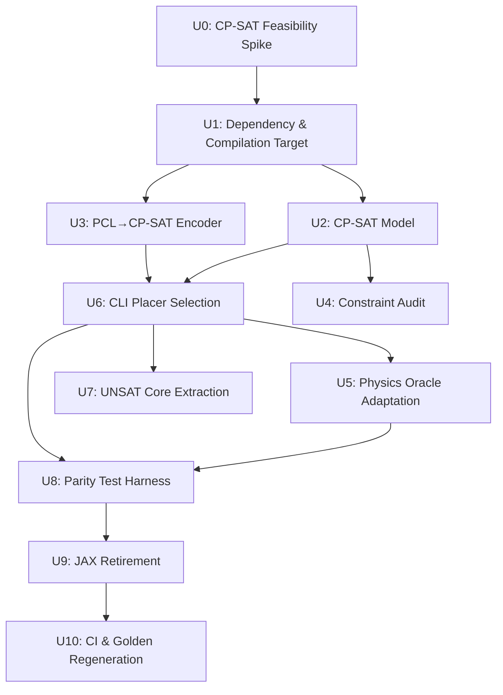

# feat: CP-SAT Feasibility-First Placer (Paradigm Swap from JAX Descent)

## Summary

Replace the JAX gradient-descent placement engine with a Google OR-Tools CP-SAT feasibility-first placer. Hard electrical/geometric constraints become true feasibility constraints in the CP-SAT model; wirelength and spread become a soft objective as tiebreaker. The CP-SAT placer runs alongside the JAX pipeline under a feature flag (strangler cutover) until it matches-or-beats JAX on the physics oracle; then the entire JAX descent stack is deleted outright.

---

## Problem Frame

For three development cycles the temper placer has fought optimizer pathologies — local minima, brittle weight ratios (thermal=4000 vs overlap=200, a 20:1 ratio), gradient vanishing at coincidence, the need for a C-CAP feasibility projector, and multi-seed runs to escape basins. Individually each looked like a tuning problem; collectively they share one root cause — hard electrical/geometric constraints are being forced through a soft continuous relaxation as weighted penalties (see origin: `docs/brainstorms/2026-07-03-cp-sat-feasibility-first-placer-paradigm-swap-requirements.md`). The temper board has N≈33 components — a scale where combinatorial/exact methods are tractable and where the conditions that make the differentiable paradigm necessary (10M+ cells, GPU parallelism) do not hold.

Five of the six placement initialization features merged in prior cycles were dead on arrival because their config flags defaulted to `False` with no activation surface — C-CAP had 93 passing unit tests but was never called in production (see `docs/solutions/architecture-patterns/silent-guard-condition-infrastructure-failure-pattern-2026-07-02.md`). This plan builds the CP-SAT path as net-new infrastructure with activation surfaces shipped in the same implementation units.

---

## Requirements

**Hard constraint encoding**

- R1. Pairwise non-overlap via CP-SAT `NoOverlap2D` over component bounding boxes on a 0.1mm integer grid. Irregular outlines (thermal pads, non-rectangular copper) are conservatively decomposed to rectangle unions.
- R2. HV↔LV creepage clearance (6.0mm DRC rail) as Chebyshev disjunctive spacing with a ×√2 safety factor (threshold = 8.5mm) to guarantee Euclidean DRC compliance. Pairs are limited to actual HV↔LV crossings; not all-pairs.
- R3. Thermal-edge anchoring: Q1, Q2, and heatsink-coupled parts are constrained to within Xmm of the bottom board edge (X from PCL).
- R4. Commutation-loop adjacency: the C_BUS→Q1→Q2→C_BUS loop parts are mutually adjacent (pairwise edge-to-edge ≤ Ymm) as a hard linear constraint.
- R5. HV-region membership: HV-tagged components are constrained inside the HV region rectangle; LV-tagged outside it.

**Soft objective**

- R6. Wirelength and spread as a CP-SAT minimization objective (tiebreaker only): minimize total Manhattan wirelength plus a small spread regularization term, subject to all hard constraints. The objective can only reorder within the feasible set.

**Integration / acceptance**

- R7. CP-SAT output is scored on the existing physics oracle (dual-rail clearance, thermal) and router_v6 (routability/closure), against the same acceptance criteria applied to JAX placements.
- R8. UNSAT is a first-class output: the placer reports the minimal conflicting constraint set (CP-SAT assumption-based core, refined to MUS via deletion) and exits cleanly.

**Retirement of JAX placement stack**

- R9. Retire: the `optimizer/` directory (all files), the `losses/` directory (all files), `pcl/loss_bridge.py`, and related JAX-specific modules. Deletion is gated on CP-SAT matching-or-beating JAX on the oracle for the temper board.
- R10. Survive: `router_v6/` and its pipeline, `physics/` and `metrics/` (physics oracle + dual-rail metric), `pcl/` (spec and parser), `cli/` (entry points), `io/` (KiCad adapters), `core/` (domain types).

**Strangler cutover**

- R11. CP-SAT placer runs alongside the JAX pipeline (feature-flagged via `--placer cp-sat`) until it matches-or-beats JAX on the oracle. Both run; neither is deleted until the gate condition is met.

**Origin actors:** A1 (CP-SAT placer engine), A2 (PCL constraint compiler), A3 (physics oracle), A4 (router_v6), A5 (Z3 verification gate)

**Origin flows:** F1 (placement), F2 (place-then-route acceptance), F3 (UNSAT handling)

**Origin acceptance examples:** AE1 (covers zero-overlap + zero HV↔LV violations + wirelength ≤ JAX baseline), AE2 (covers oracle scoring comparable to JAX baseline), AE3 (covers UNSAT with minimal conflicting subset), AE4 (covers JAX retirement after CP-SAT matches-or-beats), AE5 (covers thermal-edge anchoring and commutation-loop adjacency as hard constraints)

---

## Scope Boundaries

### Deferred for later

- Euclidean (NRA) spacing — v1 uses Chebyshev edge-to-edge spacing with a ×√2 safety factor to guarantee Euclidean DRC compliance. True Euclidean encoding is deferred.
- CP-SAT-internal routability — placements are scored by router_v6 post-placement; routability does not enter CP-SAT as a constraint or objective in v1.
- Rotation as a first-class variable — v1 treats rotations as a small enumerated set (0°/90°/180°/270°) for specific parts if needed; free-angle rotation is deferred.
- Pin-level alignment as a hard constraint — v1 places at bounding-box/component level.
- Multiple power boards / design-space exploration — out of scope. This swap is for the single temper board.
- PCL constraint types not supported by v1 CP-SAT encoder: `AlignedConstraint`, `LoopAreaConstraint`, `AnchoredConstraint` — these compile to warnings but do not block placement.

### Outside this product's identity

- General-purpose differentiable placement research — the JAX stack is not being retained as a research platform.
- A unified "placer interface" abstraction over CP-SAT and JAX — premature; one placer is enough until scale demands otherwise.

### Deferred to Follow-Up Work

- Remove JAX, optax, and flax from `pyproject.toml` dependencies after R9 deletion gate — these may have residual consumers outside the optimizer/losses paths that need audit before removal.
- Remove `temper-constraints/` Rust crate (pure loss computation) — separate PR after JAX stack deletion to avoid coupling.
- Z3 verification gate integration as post-placement certifier — the Z3 gate from `docs/brainstorms/2026-07-01-z3-smt-preplacement-verification-requirements.md` is a separate integration, not part of this plan.

---

## Context & Research

### Relevant Code and Patterns

- `packages/temper-placer/src/temper_placer/pcl/constraints.py` — PCL data model: 7 constraint types, `CompilationTarget` enum, `SemanticTag` dispatch. `CompilationTarget.SAT` already exists; `CompilationTarget.CP_SAT` will be added.
- `packages/temper-placer/src/temper_placer/pcl/sat_bridge.py` — Existing PCL→SAT compilation pattern: per-constraint-type handler dispatch with `ConstraintOrigin` bidirectional registry. CP-SAT encoder follows the same pattern.
- `packages/temper-placer/src/temper_placer/pcl/loss_bridge.py` — PCL→JAX loss compilation (to be retired). The `_register_backend("jax", _backend_adapter)` pattern is the registration model; CP-SAT uses `_register_backend("cp_sat", _cp_sat_adapter)`.
- `packages/temper-placer/src/temper_placer/optimizer/train.py` — Main JAX training loop (to be retired). Exports `train()`, `train_multiphase()`, `train_dpp_multiseed()`, `train_parallel()`, `TrainingState`, `TrainingResult`.
- `packages/temper-placer/src/temper_placer/optimizer/ccap.py` — C-CAP Dykstra projections (968 lines, to be retired). Never reached in production due to guard-condition nesting error.
- `packages/temper-placer/src/temper_placer/cli/__init__.py` — Click CLI group. The `optimize` command hardcodes the JAX pipeline; needs a `--placer` option.
- `packages/temper-placer/src/temper_placer/runner.py` — `PipelineRunner.resolve_and_run()` with strategy fallback. Placer dispatch lives here.
- `packages/temper-placer/src/temper_placer/protocol.py` — `PipelineStage` Protocol, `StageInput`/`StageOutput` dataclasses. Shared pipeline contract.
- `packages/temper-placer/src/temper_placer/regression/physics_oracle.py` — `run_physics_oracle()` internally runs `train_multiphase` (JAX). The existing `dual_rail_clearance_report()` and `thermal_score()` in `metrics/quality.py` can score arbitrary `PlacementState` positions directly — these are the reusable scorer functions.
- `packages/temper-placer/src/temper_placer/router_v6/` — Router v6 with SAT constraint model, ESL/BMC verification patterns (`esl.py`, `bmc.py`). The ESL predicate + BMC exhaustive enumeration pattern is reusable for CP-SAT constraint encoding verification.
- `packages/temper-placer/tests/conftest.py` — Shared fixtures: `rng_key`, `simple_board`, `temper_board`, `simple_components`, `temper_constraints_collection`.
- `packages/temper-placer/configs/pcl/temper_induction.yaml` — Full PCL constraint spec for the temper board (adjacency, separation, enclosing, on_side, anchored, loop_area).
- `packages/temper-placer/pyproject.toml` — Dependencies list. `ortools>=9.12` will be added.

### Institutional Learnings

- **Silent guard conditions cause dead infrastructure** (`docs/solutions/architecture-patterns/silent-guard-condition-infrastructure-failure-pattern-2026-07-02.md`): C-CAP was unreachable because its guard was indented inside an unreachable `else:` branch. The CP-SAT `--placer` flag must ship with an activation surface in the same PR; integration tests must exercise the placer through the CLI, not via direct import. Log deltas aggressively.
- **Features merged with config flags but no activation surface are dead on merge** (`docs/solutions/workflow-issues/dead-code-from-features-with-no-activation-surface-2026-07-01.md`): Five of six placement features shipped with `False` defaults and no CLI flag. The CP-SAT `--placer` flag must have a visible CLI option, not just a config key.
- **Strangler fig pipeline decomposition** (`docs/solutions/architecture-patterns/strangler-fig-pipeline-decomposition-2026-06-22.md`): CP-SAT should produce `placement.dsn` at the same pipeline boundary as JAX. Golden fixture parity testing at that seam enables self-certifying cutover.
- **PCL constraint system extension with PBT-verified semantic bridge** (`docs/solutions/architecture-patterns/pcl-constraint-system-triple-extension-2026-07-01.md`): The new PCL→CP-SAT encoder needs the same correctness architecture — ESL predicate per constraint type, BMC exhaustiveness prover, induction ladder. Existing `esl.py` (6 primitives) and `bmc.py` (91 verification tests) generalize to CP-SAT.
- **Unsound AtMostK capacity encoding** (`docs/solutions/logic-errors/unsound-atmostk-capacity-encoding.md`): Constraint-solver correctness cannot be assumed. Every CP-SAT output must be audited — verify the placement satisfies every hard constraint after every solve. Never keep a fallback solver that produces wrong answers.
- **Quality metrics built but never connected** (`docs/solutions/architecture-patterns/quality-metrics-built-but-never-connected-2026-07-01.md`): 35 metrics exist but were disconnected. Verify the physics oracle produces non-trivial results on CP-SAT placements before trusting parity scores.
- **Golden fixture ladder parity testing** (`docs/solutions/best-practices/golden-fixture-ladder-parity-testing-2026-06-22.md`): Existing golden fixture infrastructure at the `apply_placements` stage validates DSN output format, component placement, and coordinate bounds. Reuse for CP-SAT parity.

### External References

- OR-Tools CP-SAT Python API — `cp_model.CpModel()`, `AddNoOverlap2D`, `NewIntervalVar`, `OnlyEnforceIf`, `AddAssumptions`, `CpSolver`. Official docs: [developers.google.com/optimization/cp/cp_solver](https://developers.google.com/optimization/cp/cp_solver)
- CP-SAT Primer (community): [github.com/d-krupke/cpsat-primer](https://github.com/d-krupke/cpsat-primer)
- OR-Tools PyPI: `ortools>=9.12` with prebuilt wheels for macOS (x86_64/ARM64) and Linux (glibc). No C++ compilation required.
- `NoOverlap2D` uses a specialized global propagator (timetabling, energetic reasoning, selective pairwise) — substantially more efficient than hand-encoding O(N²) pairwise disjunctives.
- For N≈33 rectangles with ~200 side constraints, expected solve times: feasibility-only < 1s; with wirelength objective: 1–60s for first feasible solution; proving optimality may take longer. Set `max_time_in_seconds` and use `num_search_workers=8`.

---

## Key Technical Decisions

- **Feasibility-first over objective-first**: Hard electrical/geometric constraints become true CP-SAT feasibility constraints; wirelength/spread is a soft objective that can only reorder within the feasible set. Dissolves the weight-tuning pathology by construction.
- **CP-SAT primary, Z3 evaluated-not-primary**: CP-SAT's `NoOverlap2D` global constraint is purpose-built for rectangle packing under side constraints. Z3 SMT is more general but typically slower on pure packing. Z3 remains the right tool for the existing standalone verification gate (post-placement certification, exact arithmetic), not the primary placement engine.
- **Full JAX retirement**: After CP-SAT matches-or-beats JAX on the oracle for the temper board, the JAX descent stack is deleted. The five dead activation features (C-CAP, Constraint-Weighted Laplacian, Group Pre-Clustering, Thermal Anchoring, DPP Multi-Seed) retire with it. A deprecated `--placer jax-deprecated` flag is retained for one release cycle as recovery insurance; it is removed in a follow-up after field validation on additional boards beyond the CI corpus.
- **0.1mm integer grid**: mm coordinates are scaled by 10 (0.1mm = 1 unit). For a ~200mm board, variable domains are ~2000 units — well within CP-SAT's integer arithmetic range and sufficient for 0.1mm placement precision.
- **Chebyshev clearance with ×√2 safety factor for v1**: Encoding true Euclidean distance requires quadratic constraints. v1 uses Chebyshev (axis-separable) disjunctive constraints with a larger threshold (6.0mm × √2 ≈ 8.5mm) to guarantee Euclidean DRC compliance. This is conservative (some feasible placements may be rejected) but correct (no DRC violations pass through).
- **CP-SAT solve timeout**: 60 seconds in CI (`max_time_in_seconds=60`), 300 seconds in production (`max_time_in_seconds=300`). Timeout with a feasible solution is success (CP-SAT finds feasible solutions quickly); timeout without any solution is a soft failure — not UNSAT, but a retryable condition. **Cold-start provision:** the first CI run per board uses a longer timeout (300s) or bootstraps via a JAX placement hint (`model.AddHint`); subsequent CI runs use the 60s timeout after warm-start from the cached feasible solution.
- **Acceptance bar for cutover**: CP-SAT must match-or-beat JAX on each individual oracle metric (dual-rail clearance 3mm, dual-rail clearance 6mm, thermal score, routability completion rate) — Pareto rule, not a composite score. If CP-SAT wins on clearance but loses on routability, the gate is not met.
- **JAX retirement gate**: CP-SAT matching-or-beating the oracle triggers retirement. The in-flight `2026-07-02-001` JAX experiment runs to completion as information-only, not as a gate. **Decision log:** the origin required gating on both experiment completion AND oracle parity. This plan unbundles them because (a) the experiment was designed to tune JAX weights, which is moot when the paradigm itself is being replaced, and (b) CP-SAT parity alone demonstrates the replacement is ready regardless of experiment outcome. If the experiment has already completed or is near completion at cutover time, this unbundling is moot.
- **Penalty weights, multi-seed, gradient vanishing, local minima are not problems this plan fixes** — they are artifacts of the soft-relaxation paradigm. This plan removes the paradigm that generates them.

---

## Open Questions

### Resolved During Planning

- **Integer grid scale**: 0.1mm (1 unit = 0.1mm). Variable domains fit within CP-SAT's integer range for the temper board.
- **Chebyshev vs Euclidean clearance**: Chebyshev with ×√2 safety factor (8.5mm threshold) for v1. Guarantees Euclidean DRC compliance while avoiding quadratic constraints.
- **PCL `adjacency` construct for R4**: The existing `AdjacentConstraint` with `max_distance_mm` compiles to a hard linear proximity constraint in CP-SAT (no new PCL construct needed). The `max_distance_mm` value from PCL is carried forward directly.
- **CP-SAT vs Z3 primary engine**: CP-SAT. No spike needed — `NoOverlap2D` is purpose-built for this problem class.
- **Physics oracle adaptation**: New `score_placement()` function in `metrics/` that accepts raw (x, y) positions, constructs a `PlacementState`, and runs `dual_rail_clearance_report()` + `thermal_score()` without invoking the JAX optimizer. No KiCad export/re-import round-trip.
- **PCL constraint types supported in v1**: `SeparatedConstraint` (R2), `EnclosingConstraint` (R5), `OnSideConstraint` (R3), `AdjacentConstraint` (R4 with `max_distance_mm` treated as hard bound). `AlignedConstraint`, `LoopAreaConstraint`, `AnchoredConstraint`, and `KeepoutConstraint` are deferred — logged as warnings during compilation, not errors.

### Deferred to Implementation

- **Conservative rectangle-union decomposition of irregular outlines** — quantify the over-constrained area during implementation by comparing bounding-box area to true outline area per component. If any component's decomposition increases its footprint by >15%, flag for manual review.
- **Router_v6 failure on CP-SAT placement during strangler period** — warning only; does not block acceptance. If routability is systematically worse, initiate a follow-up investigation (not in this plan's scope).
- **Exact solver parameter tuning** (`num_search_workers`, search strategies, symmetry breaking) — depends on profiling against the actual temper board constraint set. Start with defaults (8 workers, no custom strategy) and tune only if solve times exceed thresholds.
- **Exact wirelength netlist decompilation** — how to model multi-pin nets as CP-SAT objective variables (star-model vs clique-model). Start with star-model (center-to-center Manhattan per net) and refine per observed placement quality.
- **ESL predicate set for CP-SAT model verification** — which specific predicates to port from the router_v6 `esl.py` primitives, and whether new predicates are needed for region membership and adjacency. Determined during U2/U3 implementation.

---

## Output Structure

```
packages/temper-placer/src/temper_placer/placer/cp_sat/
    __init__.py
    model.py          # CP-SAT model builder (NoOverlap2D + side constraints + objective)
    encoder.py        # PCL → CP-SAT constraint encoder (one handler per constraint type)
    audit.py          # Post-solve constraint audit (verify every hard constraint)

packages/temper-placer/tests/placer/cp_sat/
    __init__.py
    test_model.py     # CP-SAT model correctness tests (PBT, BMC)
    test_encoder.py   # PCL→CP-SAT encoder tests (round-trip, exhaustive N≤10)
    test_audit.py     # Constraint audit tests (deliberate violations, edge cases)
    test_e2e.py       # End-to-end: PCL → solve → audit → oracle
```

---

## High-Level Technical Design

> *This illustrates the intended approach and is directional guidance for review, not implementation specification. The implementing agent should treat it as context, not code to reproduce.*

### CP-SAT Model Structure

```python
# Per-component variables (k = scale factor, e.g., 10 for 0.1mm grid)
for comp in components:
    x_start[ref] = model.NewIntVar(0, board_w_units - comp.w_units)
    x_end       = model.NewIntVar(comp.w_units, board_w_units)
    x_iv[ref]   = model.NewIntervalVar(x_start, comp.w_units, x_end)

    y_start[ref] = model.NewIntVar(0, board_h_units - comp.h_units)
    y_end       = model.NewIntVar(comp.h_units, board_h_units)
    y_iv[ref]   = model.NewIntervalVar(y_start, comp.h_units, y_end)

# Global no-overlap (R1)
model.AddNoOverlap2D(x_ivs, y_ivs)

# Selective Chebyshev clearance (R2) — only HV↔LV pairs
for hv_comp, lv_comp in hv_lv_pairs:
    b_left, b_right, b_below, b_above = [model.NewBoolVar() for _ in range(4)]
    model.Add(x_lv >= x_hv + w_hv + clearance_units).OnlyEnforceIf(b_left)
    model.Add(x_hv >= x_lv + w_lv + clearance_units).OnlyEnforceIf(b_right)
    model.Add(y_lv >= y_hv + h_hv + clearance_units).OnlyEnforceIf(b_below)
    model.Add(y_hv >= y_lv + h_lv + clearance_units).OnlyEnforceIf(b_above)
    model.AddBoolOr([b_left, b_right, b_below, b_above])

# Edge anchoring (R3) — bottom edge
for comp in thermal_edge_comps:
    model.Add(y_start[comp] <= max_dist_from_edge_units)

# Commutation-loop adjacency (R4) — pairwise linear proximity
for a, b in commutation_pairs:
    model.Add(x_start[b] <= x_start[a] + w_a + max_dist_units)
    model.Add(x_start[a] <= x_start[b] + w_b + max_dist_units)
    model.Add(y_start[b] <= y_start[a] + h_a + max_dist_units)
    model.Add(y_start[a] <= y_start[b] + h_b + max_dist_units)

# Region membership (R5)
for comp in hv_components:
    model.Add(x_start[comp] >= region_x_min_units)
    model.Add(x_end[comp]   <= region_x_max_units)
    model.Add(y_start[comp] >= region_y_min_units)
    model.Add(y_end[comp]   <= region_y_max_units)

# Soft wirelength objective (R6)
for net in nets:
    # Star-model: minimize sum of Manhattan distances from each pin to net center
    dx_p = model.NewIntVar(0, board_w_units)
    dy_p = model.NewIntVar(0, board_h_units)
    model.Add(dx_p >= x_center[pin.comp] - net_x_center)
    model.Add(dx_p >= net_x_center - x_center[pin.comp])
    model.Add(dy_p >= y_center[pin.comp] - net_y_center)
    model.Add(dy_p >= net_y_center - y_center[pin.comp])
    net_wl += dx_p + dy_p

spread = (x_max - x_min) + (y_max - y_min)
model.Minimize(net_wl + EPSILON * spread)  # EPSILON small enough to be tiebreaker-only
```

### PCL→CP-SAT Encoder Dispatch Pattern

The encoder follows the existing `sat_bridge.py` handler pattern:

```python
# Per-constraint-type handler
def _encode_separated(constraint: SeparatedConstraint, model, ctx) -> list[cp_model.IntVar]:
    """Chebyshev clearance constraint for HV↔LV pairs."""
    ...

def _encode_enclosing(constraint: EnclosingConstraint, model, ctx) -> list[cp_model.IntVar]:
    """Region membership via bounding-box constraints."""
    ...

def _encode_on_side(constraint: OnSideConstraint, model, ctx) -> list[cp_model.IntVar]:
    """Edge anchoring via linear distance-from-edge constraints."""
    ...

def _encode_adjacent(constraint: AdjacentConstraint, model, ctx) -> list[cp_model.IntVar]:
    """Hard proximity via pairwise linear closeness constraints."""
    ...

# Registration (mirrors loss_bridge.py backend adapter pattern)
TYPE_HANDLERS: dict[ConstraintType, Callable] = {
    ConstraintType.SEPARATED: _encode_separated,
    ConstraintType.ENCLOSING: _encode_enclosing,
    ConstraintType.ON_SIDE: _encode_on_side,
    ConstraintType.ADJACENT: _encode_adjacent,
}

def compile_pcl_to_cp_sat(constraints: ConstraintCollection, ..., model: CpModel) -> list[cp_model.IntVar]:
    """Iterates constraint collection, dispatches to type handlers, collects assumption vars."""
    assumption_vars = []
    for constraint in constraints:
        handler = TYPE_HANDLERS.get(constraint.constraint_type)
        if handler is None:
            logger.warning("PCL constraint type %s not supported by CP-SAT v1 encoder", constraint.constraint_type)
            continue
        assumption_vars.extend(handler(constraint, model, ctx))
    return assumption_vars
```

### Integration Flow

```
temper optimize --placer cp-sat input.kicad_pcb --config config.yaml
    │
    ├─ Parse: KiCad PCB → Board + Netlist + Components
    ├─ Parse: PCL YAML → ConstraintCollection
    ├─ Placer dispatch: --placer cp-sat → CP_SAT path
    │
    ├─ U3: PCL→CP-SAT encoder (compile constraints + collect assumption vars)
    ├─ U2: CP-SAT model (NoOverlap2D + side constraints + wirelength objective)
    ├─ Solve: solver.Solve(model) with timeout
    │
    ├─ FEASIBLE/OPTIMAL → U4: constraint audit → extract (x,y) → write placement
    ├─ INFEASIBLE → U7: unsat-core extraction → MUS refinement → report
    └─ TIMEOUT (no solution) → soft failure, retry suggestion
```

---

## Implementation Units



### Phase 0: Feasibility Validation

### U0. CP-SAT Feasibility Spike

**Goal:** Validate that CP-SAT can solve the temper board with hard constraints within the timeout budget before committing to the full 10-unit build.

**Requirements:** R1 (NoOverlap2D), R2 (clearance), R3 (edge anchoring), R4 (adjacency), R5 (region membership) — feasibility check

**Dependencies:** None (standalone throwaway spike)

**Files:**
- Create: `packages/temper-placer/spikes/cp_sat_feasibility.py` (throwaway; not committed to main)
- Only dependency: `ortools` installed in dev environment (`uv pip install ortools`)

**Approach:**
- Hardcode the temper board's constraint values from `configs/pcl/temper_induction.yaml` into a standalone CP-SAT model script
- Build the model using the pseudocode from the High-Level Technical Design section above (NoOverlap2D + 4 side constraint types + star-model wirelength objective)
- Solve with `max_time_in_seconds=60` and `max_time_in_seconds=300`
- Acceptance criteria for proceeding to U1:
  - (a) Solver finds a feasible placement within 60s on average developer hardware
  - (b) Solver finds a feasible placement within 300s (production timeout)
  - (c) Manual ad-hoc audit confirms all hard constraints satisfied (preview of U4 logic)
- If the spike fails (UNSAT or >300s), investigate: Chebyshev×√2 over-constraining, grid scale, or solver parameter tuning before building infrastructure
- The spike is throwaway — it validates the premise, not the architecture. It produces no committed code, no tests, no CI integration

**Verification:**
- CP-SAT finds a feasible placement for the temper board within 60s
- Ad-hoc audit confirms no overlap, no HV↔LV clearance violations, thermal-edge anchoring, commutation-loop adjacency, and HV-region membership satisfied

---

### Phase 1: CP-SAT Placer Core

### U1. Dependency & Compilation Target

**Goal:** Add `ortools` as a project dependency and register CP-SAT as a new `CompilationTarget` in the PCL constraint system.

**Requirements:** R1 (infrastructure for hard constraint encoding)

**Dependencies:** None

**Files:**
- Modify: `packages/temper-placer/pyproject.toml`
- Modify: `packages/temper-placer/src/temper_placer/pcl/constraints.py`
- Test: `packages/temper-placer/tests/pcl/test_constraints.py`

**Approach:**
- Add `ortools>=9.12` to `pyproject.toml` dependencies
- Add `CompilationTarget.CP_SAT = "cp_sat"` to the `CompilationTarget` enum in `constraints.py`
- Update `ConstraintType` per-type `supported_targets` frozensets: add `CP_SAT` to SEPARATED, ENCLOSING, ON_SIDE, ADJACENT; explicitly exclude `CP_SAT` from ALIGNED, ANCHORED, LOOP_AREA, KEEPOUT
- Verify `import ortools` works in the test environment
- The existing `BaseConstraint.backends` registration dict already supports backends; CP-SAT backend registration happens in U3

**Patterns to follow:**
- Existing `CompilationTarget.SAT` and `CompilationTarget.DRC` enum entries in `constraints.py:54-59`
- Existing dependency declarations in `pyproject.toml` under `[project] dependencies`

**Test scenarios:**
- Happy path: `CompilationTarget.CP_SAT` is importable and has value `"cp_sat"`
- Happy path: `import ortools.sat.python.cp_model` succeeds in the test environment
- Edge case: OR-Tools import works on both macOS (ARM64) and Linux (CI container)

**Verification:**
- `uv sync` installs `ortools` without error
- `python -c "from temper_placer.pcl.constraints import CompilationTarget; assert CompilationTarget.CP_SAT.value == 'cp_sat'"` succeeds

---

### U2. CP-SAT Placement Model

**Goal:** Build the CP-SAT model that encodes component placement as integer-grid variables with `NoOverlap2D` and side constraints, plus a soft wirelength/spread objective, and solves it.

**Requirements:** R1 (NoOverlap2D), R2 (clearance constraints), R3 (edge anchoring), R4 (adjacency), R5 (region membership), R6 (wirelength objective)

**Dependencies:** U1

**Files:**
- Create: `packages/temper-placer/src/temper_placer/placer/__init__.py` (if not exists)
- Create: `packages/temper-placer/src/temper_placer/placer/cp_sat/__init__.py`
- Create: `packages/temper-placer/src/temper_placer/placer/cp_sat/model.py`
- Create: `packages/temper-placer/tests/placer/__init__.py` (if not exists)
- Create: `packages/temper-placer/tests/placer/cp_sat/__init__.py`
- Create: `packages/temper-placer/tests/placer/cp_sat/test_model.py`

**Approach:**
- `model.py` exports a `build_cp_sat_model(netlist, board, scale_factor=10) -> tuple[CpModel, dict]` function that constructs the CP-SAT model with all variables and a `solve_cp_sat_model(model, timeout_s=60) -> SolveResult` function that runs the solver
- `SolveResult` dataclass: status (OPTIMAL/FEASIBLE/INFEASIBLE/UNKNOWN), positions dict, objective value, solve time, wall time
- Per-component variables: `x_start`, `y_start` as `NewIntVar` with domain `[0, board_dim - comp_dim]`; interval vars for `NoOverlap2D`
- Board boundary constraints: all components must stay within board outline (implicit from variable domains)
- Hard constraints from `constraint_specs` parameter (callable from encoder in U3):
  - `add_chebyshev_clearance(model, pairs, clearance_units)` — disjunctive 4-Boolean encoding
  - `add_edge_anchoring(model, components, max_dist_units, edge)` — linear inequality
  - `add_proximity(model, pairs, max_dist_units)` — linear inequalities (4 per pair)
  - `add_region_membership(model, components, region_bounds_units)` — linear inequalities (4 per component)
- Objective: sum over nets of Manhattan wirelength (star-model), plus epsilon × bounding-box spread
- Solver parameters: `num_search_workers=8`, `max_time_in_seconds` from parameter, `log_search_progress=True`
- Warm-start from existing analytical placer placement if available (`model.AddHint`)
- Fixed components (connectors, MCU): set variable domains to exact positions, not free variables

**Execution note:** Start with a property-based test that verifies `NoOverlap2D` alone (N=10 random rectangles, assert no overlap in solution). Then add each side constraint type with BMC-style exhaustive enumeration for N≤6.

**Patterns to follow:**
- `packages/temper-placer/src/temper_placer/optimizer/train.py` — the `TrainingResult` dataclass pattern for solve result
- `packages/temper-placer/src/temper_placer/router_v6/bmc.py` — BMC exhaustive enumeration for constraint encoding verification

**Test scenarios:**
- Happy path: N=10 random rectangles on a 200×200 grid with `NoOverlap2D` only — solver finds a feasible placement in < 5s
- Happy path: N=10 rectangles with 3 clearance-constrained pairs — solver finds placement with all clearances satisfied
- Happy path: Components constrained to a sub-region — all placed inside the region bounds
- Happy path: Edge-anchored components — all within max_dist of specified edge
- Happy path: Adjacent pairs — all pairwise distances ≤ max_dist (Chebyshev)
- Edge case: All-zero component sizes — model handles gracefully (domain collapses to single point)
- Edge case: Board too small for all components (sum of areas > board area) — returns INFEASIBLE
- Edge case: Clearance threshold larger than board dimension — returns INFEASIBLE
- Error path: OR-Tools raises on invalid model construction — caught and surfaced as `ModelBuildError`
- Integration: Solver timeout with `max_time_in_seconds=5` — returns UNKNOWN status, does not hang

**Verification:**
- `NoOverlap2D` model with N=10 random rectangles produces zero-overlap placements
- Each side constraint type produces placements satisfying the constraint (verified by U4 audit)
- Solver respects timeout — does not run beyond `max_time_in_seconds`
- `SolveResult` carries all required fields for downstream consumers (U5, U6)

---

### U3. PCL→CP-SAT Constraint Encoder

**Goal:** Build the PCL-to-CP-SAT compilation bridge that maps PCL constraint objects to CP-SAT model constraints, following the existing `sat_bridge.py` handler dispatch pattern.

**Requirements:** R1 (NoOverlap2D via model), R2 (clearance), R3 (edge anchoring), R4 (adjacency), R5 (region membership)

**Dependencies:** U1, U2

**Files:**
- Create: `packages/temper-placer/src/temper_placer/placer/cp_sat/encoder.py`
- Modify: `packages/temper-placer/src/temper_placer/pcl/constraints.py` (register CP-SAT backend on constraint classes)
- Test: `packages/temper-placer/tests/placer/cp_sat/test_encoder.py`

**Approach:**
- `encoder.py` exports `compile_pcl_to_cp_sat(constraints, netlist, board, model, scale_factor=10) -> SolveContext`
- `SolveContext` carries: assumption variables (for UNSAT core in U7), constraint→variable mapping (for audit in U4), component→variable mapping (for solution extraction)
- Per-constraint-type handler functions registered in a `TYPE_HANDLERS` dict (mirrors `sat_bridge.py` pattern):
  - `SeparatedConstraint` → pairwise Chebyshev clearance (4 Booleans + 5 constraints per pair; only actual HV↔LV pairs, not all-pairs)
  - `EnclosingConstraint` → linear inequalities (4 per component: x_min, x_max, y_min, y_max bounds)
  - `OnSideConstraint` → linear inequality (distance-from-edge ≤ max)
  - `AdjacentConstraint` → linear proximity (4 inequalities per pair: two components within `max_distance_mm`)
- Unsupported constraint types (`Aligned`, `LoopArea`, `Anchored`, `Keepout`) log a warning and continue — v1 scope
- Each constraint that maps to an assumption switch wraps in `OnlyEnforceIf` and adds the Boolean to `SolveContext.assumption_vars`
- Component references are resolved against the `Netlist` (component names → indices) and `Board` (zone names → rectangles)
- Tag expressions (`{tag: POWER}`, `{or: [...]}`) are expanded via the existing `pcl/tag_dispatch.py` infrastructure
- Register `_cp_sat_adapter` on each supported `BaseConstraint` subclass's `backends` dict under `"cp_sat"` key

**Execution note:** Write BMC-style exhaustive enumeration tests first (N≤6, grid ≤ 100 units) to verify that CP-SAT constraint encodings agree with ground-truth geometry predicates for every possible assignment of the input variables.

**Patterns to follow:**
- `packages/temper-placer/src/temper_placer/pcl/sat_bridge.py` — `TYPE_HANDLERS` dict, per-type handler signature, `ConstraintOrigin` pattern for traceability
- `packages/temper-placer/src/temper_placer/pcl/loss_bridge.py` — `_register_backend()` / `backends` dict pattern for backend registration
- `packages/temper-placer/src/temper_placer/router_v6/esl.py` — ESL predicate primitives for BMC oracles
- `packages/temper-placer/src/temper_placer/router_v6/bmc.py` — BMC exhaustive enumeration infrastructure

**Test scenarios:**
- Happy path: PCL `SeparatedConstraint(HV, LV, min_distance_mm=8.5)` → CP-SAT model with 4-Boolean disjunctive clearance encoding for the correct component pair
- Happy path: PCL `EnclosingConstraint(HV_ZONE, [Q1, Q2])` → CP-SAT model with bounding-box inequalities for Q1 and Q2 against HV_ZONE rectangle
- Happy path: PCL `OnSideConstraint([Q1, Q2], edge=bottom, max_distance_from_edge_mm=15)` → CP-SAT model with y_start ≤ 15mm for both
- Happy path: PCL `AdjacentConstraint(Q1, Q2, max_distance_mm=10)` → CP-SAT model with 4 linear proximity inequalities
- Happy path: Tag expression `{tag: HV}` resolves to correct set of component references
- Edge case: Empty constraint collection → encoder returns empty context, model still has valid NoOverlap2D
- Edge case: Constraint references a non-existent component → raises `PCLCompileError` with component name
- Edge case: Unsupported constraint type (`Aligned`) → logs warning, returns empty context for that constraint, does not raise
- Integration: BMC exhaustive test for `SeparatedConstraint`: N=4 components, all possible assignments on a 20×20 grid (N≤6 exhaustive), CP-SAT encoding agrees with ground-truth geometry predicate for at least 95% of assignments (rounding tolerance for integer grid)
- Integration: BMC exhaustive test for `EnclosingConstraint` — same pattern, verifies all components inside zone for all assignments
- Integration: Full constraint collection round-trip: parse temper PCL YAML → encode to CP-SAT → solve → audit (U4) → all hard constraints satisfied

**Verification:**
- Each supported PCL constraint type compiles to correct CP-SAT constraints (verified by BMC exhaustive for N≤6)
- Unsupported types log warnings but do not block compilation
- `SolveContext` carries all assumption variables for U7 UNSAT core extraction
- BMC tests pass for all supported constraint types at N≤6 exhaustive enumeration

---

### U4. Post-Solve Constraint Audit

**Goal:** Build a post-solve audit that verifies every hard constraint encoded in the CP-SAT model is satisfied by the solver output, and raises a clear violation report if any constraint is broken.

**Requirements:** R1, R2, R3, R4, R5 (verification that hard constraints are actually satisfied)

**Dependencies:** U2, U3

**Files:**
- Create: `packages/temper-placer/src/temper_placer/placer/cp_sat/audit.py`
- Test: `packages/temper-placer/tests/placer/cp_sat/test_audit.py`

**Approach:**
- `audit.py` exports `audit_placement(positions, constraints, netlist, board, scale_factor=10) -> AuditReport`
- `AuditReport` dataclass: passed (bool), violations (list of `Violation` with constraint reference, component pair, actual distance), stats (total constraints checked, passed, failed)
- Audit checks (all use the same ground-truth geometry predicates as the ESL oracles):
  - **No-overlap**: check every component pair for AABB overlap
  - **Clearance**: for each `SeparatedConstraint` pair, check Chebyshev distance ≥ threshold
  - **Edge anchoring**: for each `OnSideConstraint`, check component-to-edge distance ≤ max
  - **Adjacency**: for each `AdjacentConstraint`, check Chebyshev distance ≤ max
  - **Region membership**: for each `EnclosingConstraint`, check component wholly within zone rectangle
- Conservative bounding-box decomposition check: for components with irregular outlines, the audit verifies the actual outline (not just the bounding box) fits within the region — flagging any that don't. This catches decomposition errors.
- The audit runs **unconditionally after every CP-SAT solve** — not gated on debug mode or verbose flags. Follows the unsound-atmostk pattern: never trust solver output without verification.
- Violation messages are human-readable and cite the PCL constraint's `because` field for context

**Execution note:** Write the audit first (TDD): define `AuditReport` and violation types, then write tests with deliberately violating placements before hooking into U2's solve output.

**Patterns to follow:**
- `packages/temper-placer/src/temper_placer/router_v6/verifier.py` — post-routing verification pattern
- `packages/temper-placer/src/temper_placer/router_v6/esl.py` — ground-truth geometry predicates
- `packages/temper-placer/tests/router_v6/` — invariant test patterns (test that specific constraint types are enforced)

**Test scenarios:**
- Happy path: Audit a known-valid CP-SAT placement → `AuditReport(passed=True, violations=[])`
- Edge case: Audit a placement with one overlapping pair → violation reported with pair names, overlap amount
- Edge case: Audit a placement with one clearance violation → violation reported with pair names, actual distance
- Edge case: Audit a placement where a component is outside its enclosing zone → violation reported with component name, zone name, and exceeded bounds
- Edge case: Audit a placement with zero components → `AuditReport(passed=True, stats.checked=0)`
- Error path: Constraint references a component not in the placement → raises `AuditError` with component name
- Integration: After CP-SAT solve with N=10 random rectangles + clearance constraints, audit confirms all constraints satisfied
- Integration: Deliberately corrupted placement (shift one component 5mm) → audit catches the violation

**Verification:**
- Audit catches every type of hard constraint violation (overlap, clearance, edge, adjacency, region)
- Audit produces human-readable violation messages citing PCL constraint `because` fields
- Audit runs in < 50ms for N=33 components (O(N²) AABB checks plus O(P) pairwise constraint checks)

---

### U5. Physics Oracle Adaptation

**Goal:** Add a `score_placement()` entry point to the physics oracle that accepts raw (x, y) positions (from CP-SAT or any external placer) and produces the same dual-rail clearance, thermal, and quality scores currently used for JAX placements.

**Requirements:** R7 (CP-SAT output scored on existing oracle)

**Dependencies:** U2 (needs CP-SAT output format)

**Files:**
- Create: `packages/temper-placer/src/temper_placer/metrics/external_oracle.py`
- Modify: `packages/temper-placer/src/temper_placer/metrics/__init__.py` (export new function)
- Modify: `packages/temper-placer/src/temper_placer/core/state.py` (add `PlacementState.from_numpy()` factory for JAX-free construction)
- Test: `packages/temper-placer/tests/metrics/test_external_oracle.py`

**Approach:**
- `score_placement(positions, netlist, board, design_rules, footprint_library) -> PhysicsOracleResult` accepts a dict of `{component_ref: (x_mm, y_mm)}` positions (mm scale, not integer grid)
- Constructs a `PlacementState` from raw positions by updating component positions in a copy of the initial state
- Calls existing scorer functions directly:
  - `dual_rail_clearance_report(placement_state, netlist, design_rules)` — existing, already accepts `PlacementState`
  - `thermal_score(placement_state, netlist)` — verify it works from `PlacementState` without JAX internals; if not, create a non-JAX path
  - `compute_quality_report(placement_state, ...)` — existing composite scorer
- Returns `PhysicsOracleResult` with the same fields as the existing `run_physics_oracle()` output (clearance_3mm, clearance_6mm, thermal_score, overall_passed, etc.), minus JAX-specific fields (loss_curves, gradient norms)
- The existing `run_physics_oracle()` is NOT modified — it continues to serve the JAX pipeline during the strangler period. `score_placement()` is a parallel entry point.
- Grid→mm conversion: CP-SAT positions are integer-grid values; `score_placement()` accepts mm-scale positions. The conversion (integer/scale_factor → mm) happens before calling this function (in U6 or in a thin adapter).

**Execution note:** Verify that each existing scorer function (`dual_rail_clearance_report`, `thermal_score`, `compute_quality_report`) actually works from a `PlacementState` constructed from raw positions — some may have implicit JAX array assumptions. Characterization test: score the human reference placement with both `run_physics_oracle()` and `score_placement()` and assert identical non-JAX-specific fields.

**Patterns to follow:**
- `packages/temper-placer/src/temper_placer/regression/physics_oracle.py` — `PhysicsOracleResult` dataclass, scorer function calls
- `packages/temper-placer/src/temper_placer/metrics/quality.py` — `dual_rail_clearance_report()`, `thermal_score()`
- `packages/temper-placer/src/temper_placer/core/state.py` — `PlacementState` construction and mutation

**Test scenarios:**
- Happy path: Score a known-good placement (human reference temper board) → scores match `run_physics_oracle()` non-JAX fields within tolerance
- Happy path: Score a placement with a deliberate 6mm clearance violation → `hv_clearance_ok=False`
- Happy path: Score a placement with all components on thermal edge → `thermal_compliance=True`
- Edge case: Empty component dict → raises `ValueError` with descriptive message
- Edge case: Component in positions but not in netlist → raises `KeyError` with component name
- Integration: CP-SAT placement (from U2) scored through `score_placement()` → produces non-trivial scores (not all 1.0 / constant — verifies oracle connectivity)
- Integration: `score_placement()` output has identical schema to `run_physics_oracle()` output for overlapping fields

**Verification:**
- `score_placement()` produces non-trivial, varying scores for different placements
- Scores match `run_physics_oracle()` for the same placement on non-JAX-specific fields
- `score_placement()` uses `PlacementState.from_numpy()` factory and does not invoke the JAX optimizer train loop (JAX may still be imported internally during strangler period; full decoupling deferred to post-U9)

---

### U6. CLI Placer Selection

**Goal:** Add a `--placer` flag to the `temper optimize` command that dispatches between the JAX pipeline (default) and the CP-SAT placer, and wire the CP-SAT path through the pipeline.

**Requirements:** R11 (strangler cutover — CP-SAT runs alongside JAX under feature flag)

**Dependencies:** U2, U3, U4, U5

**Files:**
- Modify: `packages/temper-placer/src/temper_placer/cli/__init__.py`
- Modify: `packages/temper-placer/src/temper_placer/runner.py`
- Test: `packages/temper-placer/tests/cli/test_cp_sat_flag.py`
- Test: `packages/temper-placer/tests/placer/cp_sat/test_integration.py`

**Approach:**
- Add `--placer` option to `optimize` command: `click.Choice(["jax", "cp-sat"])`, default `"jax"` during strangler period
- `temper optimize --placer cp-sat input.kicad_pcb --config config.yaml` triggers:
  1. Parse KiCad PCB → `Board`, `Netlist`, components
  2. Parse PCL YAML → `ConstraintCollection`
  3. Build CP-SAT model (U2)
  4. Encode PCL constraints (U3)
  5. Solve (U2)
  6. Audit placement (U4)
  7. Extract positions, convert grid→mm, write to placement state
  8. Score placement via `score_placement()` (U5)
  9. Run router_v6 on the placement
  10. Report scores + routability
- CP-SAT-specific CLI options (under `--placer cp-sat`):
  - `--cp-sat-timeout` (int, default 300): solver timeout in seconds
  - `--cp-sat-workers` (int, default 8): number of parallel search workers
  - `--cp-sat-grid-scale` (int, default 10): grid scale factor (units per mm)
- When `--placer jax` (or default), existing JAX pipeline runs unchanged
- `runner.py`: add a `PLACER_DISPATCH` dict mapping placer name to a callable that accepts `(board, netlist, constraints, config)` and returns a placement
- Log a prominent INFO-level message on each run naming which placer was invoked ("Using CP-SAT placer (--placer cp-sat)") — prevents silent-wrong-placer failures

**Execution note:** Add an A/B integration test before building the full pipeline: run `temper optimize --placer jax` and `temper optimize --placer cp-sat` on the temper board, assert that the CLI output format is the same for both placers and that CP-SAT produces a non-empty placement file. This catches silent-guard-condition failures early.

**Patterns to follow:**
- `packages/temper-placer/src/temper_placer/cli/__init__.py` — existing `@click.option` decorators
- `packages/temper-placer/src/temper_placer/runner.py` — `resolve_and_run()` strategy dispatch pattern
- `packages/temper-placer/src/temper_placer/pipeline/orchestrator.py` — `PipelineOrchestrator` phase dispatch

**Test scenarios:**
- Happy path: `temper optimize --placer cp-sat temper.kicad_pcb --config pcl/temper_induction.yaml` runs CP-SAT pipeline and produces a `.dsn` or equivalent placement output file
- Happy path: `temper optimize --placer jax temper.kicad_pcb --config pcl/temper_induction.yaml` runs the existing JAX pipeline unchanged
- Happy path: Default `temper optimize` (no `--placer`) runs JAX (preserves backward compatibility during strangler)
- Edge case: `--placer cp-sat` with incompatible JAX-specific flags (`--epochs`, `--weight-overlap`) → warns that flags are ignored but does not error
- Edge case: CP-SAT solve times out with `--cp-sat-timeout 5` → exits with non-zero code and "no solution within timeout" message
- Error path: OR-Tools not installed → `--placer cp-sat` produces clear error "ortools is not installed; run `uv sync` to install dependencies"
- Integration: CLI invocation with `--placer cp-sat` on the temper board produces a placement file that router_v6 can consume
- Integration: A/B test: CLIs for `--placer jax` and `--placer cp-sat` produce identically-structured output (same file format, same scoring section) — differing only in placer name and actual placement coordinates

**Verification:**
- `temper optimize --placer cp-sat` runs without crash on the temper board
- `temper optimize --placer jax` runs identically to before (no regression)
- CP-SAT output file is in the same format as JAX output (router_v6 consumable)
- Both placers log their identity at INFO level on every invocation

---

### Phase 2: Acceptance & Parity

### U7. UNSAT Core Extraction

**Goal:** When CP-SAT returns INFEASIBLE, extract the minimal conflicting constraint set using assumption-based core extraction with deletion-based MUS refinement, and surface it as a human-readable design finding.

**Requirements:** R8 (UNSAT as first-class output), F3 (UNSAT handling)

**Dependencies:** U3 (assumption variable collection), U6 (CLI output path)

**Files:**
- Create: `packages/temper-placer/src/temper_placer/placer/cp_sat/unsat.py`
- Test: `packages/temper-placer/tests/placer/cp_sat/test_unsat.py`

**Approach:**
- `unsat.py` exports `extract_unsat_core(solver, assumption_vars, constraint_map) -> UnsatReport`
- `UnsatReport` dataclass: sufficient_core (list of constraint IDs from assumption indices), minimal_core (after MUS refinement), solve_count (number of refinements), wall_time
- Sufficient core: `solver.SufficientAssumptionsForInfeasibility()` returns indices into the assumption variable list (one Boolean per potentially-conflicting constraint group)
- MUS refinement: deletion-based algorithm — iterate over sufficient core members, remove each, re-solve; if still INFEASIBLE, the member is redundant and removed. If FEASIBLE, the member is essential and kept.
- Re-solves for MUS refinement use the same model but with a different set of assumption variables (the test set). The model is re-created for each re-solve (CP-SAT solver is stateless).
- Human-readable report: for each constraint in the minimal core, look up its `because` field from the PCL constraint → produce a report like "Constraint 'Q1 must be ≥6mm from U_MCU' (because: 'Reinforced isolation per IEC 60335-1') conflicts with 'All HV components must fit inside HV_ZONE' (because: 'HV segregation for touch safety') — the HV zone is too small to hold all HV parts at required clearance."
- MUS refinement timeout: if refining takes >30 seconds, stop and return the sufficient core (annotated as "sufficient, not guaranteed minimal")
- The UNSAT report is emitted to stderr/console as a formatted panel (using Rich if available, plain text otherwise)

**Execution note:** Test with a trivially infeasible constraint set first (board too small for two large components) to validate the assumption-UNSAT-core extraction pipeline before building MUS refinement.

**Patterns to follow:**
- `packages/temper-placer/src/temper_placer/pcl/unsat_compiler.py` — existing UNSAT analysis patterns (though this module may not exist yet; verify)
- `packages/temper-placer/src/temper_placer/cli/_io.py` — Rich console output patterns

**Test scenarios:**
- Happy path: Two 60×60mm components on a 100×100mm board with 50mm clearance → INFEASIBLE, sufficient core identifies both components
- Happy path: MUS refinement on trivially infeasible set (board 100×100, three 60×60 components) → minimal core identifies two conflicting components (third is redundant because any two already conflict)
- Edge case: INFEASIBLE with a single constraint → sufficient core returns that single constraint; MUS refinement does nothing (already minimal)
- Edge case: MUS refinement timeout → returns sufficient core annotated with "not guaranteed minimal"
- Error path: Solver status is not INFEASIBLE → `extract_unsat_core()` raises `ValueError`
- Integration: Full round-trip: encode temper PCL with artificially reduced board size → solve → extract unsat core → report names conflicting constraints with `because` text

**Verification:**
- MUS refinement correctly identifies redundant constraints in multi-constraint conflicts (tested with known-infeasible combinations)
- UNSAT report is human-readable and cites PCL constraint `because` fields
- MUS refinement respects timeout and falls back to sufficient core
- The UNSAT path exits with a non-zero status code but prints the report to stderr

---

### U8. Parity Test Harness

**Goal:** Build a test harness that compares CP-SAT placements against JAX baseline placements on the physics oracle, enabling the strangler cutover gate decision.

**Requirements:** R11 (strangler comparison), R7 (same oracle scoring), R9 (deletion gate condition)

**Dependencies:** U5, U6

**Files:**
- Create: `packages/temper-placer/tests/regression/test_cp_sat_parity.py`
- Create: `packages/temper-placer/tests/regression/conftest.py` (if fixtures need extraction)

**Approach:**
- Parity test loads the temper board fixtures (same as existing regression tests), runs both placers (JAX via existing pipeline, CP-SAT via `--placer cp-sat`), and scores both through `score_placement()` (U5) and router_v6
- Compares on each individual metric:
  - `dual_rail_clearance_3mm` → CP-SAT must be ≥ JAX
  - `dual_rail_clearance_6mm` → CP-SAT must be ≥ JAX
  - `thermal_score` → CP-SAT must be ≥ JAX
  - `total_manhattan_wirelength` → CP-SAT must be ≤ JAX (or within 5% tolerance)
  - `router_v6_completion_rate` → CP-SAT must be ≥ JAX (or within 2% tolerance). Routability is a blocking gate: if CP-SAT loses on routability, the cutover gate is not met.
- Geometric tolerance: 0.1mm (matches grid resolution) — placements within that tolerance are considered equivalent
- Test is marked `@pytest.mark.slow` and `@pytest.mark.ci` so it runs in CI but can be skipped locally
- Test is also marked `@pytest.mark.comparison` (existing marker for ground-truth comparison tests)
- Covers AE1 (zero-overlap + zero HV↔LV violations + wirelength), AE2 (oracle scores comparable), AE4 (JAX retirement gate)
- Covers AE5 (thermal-edge anchoring and commutation-loop adjacency as hard constraints — verified via U4 audit on CP-SAT output)

**Patterns to follow:**
- `packages/temper-placer/tests/regression/` — existing regression test structure
- `packages/temper-placer/tests/test_closure_metrics.py` — closure/comparison test patterns
- `packages/temper-placer/tests/conftest.py` — `temper_board` fixture

**Test scenarios:**
- Happy path: Both placers run on temper board → all outputs are scoreable by `score_placement()` and `router_v6`
- Parity gate: CP-SAT scores ≥ JAX on all individual metrics → test passes
- Parity gate: CP-SAT beats JAX on clearance but loses on routability → test fails with per-metric breakdown
- Edge case: CP-SAT times out without solution → test is skipped (not failed) with reason "CP-SAT did not find a feasible placement"
- Covers AE1: CP-SAT placement has zero overlap (audit) and zero HV↔LV pairs below 8.5mm (audit)
- Covers AE2: Both placers scored through same `score_placement()` entry point → scores are comparable
- Covers AE5: CP-SAT placement has Q1/Q2 within edge distance AND commutation-loop parts mutually adjacent (audit)

**Verification:**
- Parity test passes when CP-SAT matches-or-beats JAX on all metrics
- Parity test produces a per-metric comparison summary on failure (not just "assert False")
- Parity test is runnable in CI under the existing `ci` and `comparison` markers

---

### Phase 3: Retirement

### U9. JAX Retirement

**Goal:** Delete the JAX descent stack after the strangler gate condition is met (CP-SAT matches-or-beats JAX on oracle), and remove the `--placer` flag, making CP-SAT the default and only placer.

**Requirements:** R9 (retire JAX stack), R10 (surviving components verified)

**Dependencies:** U8 (parity test passing)

**Files:**
- Delete: `packages/temper-placer/src/temper_placer/optimizer/` (entire directory)
- Delete: `packages/temper-placer/src/temper_placer/losses/` (entire directory)
- Delete: `packages/temper-placer/src/temper_placer/pcl/loss_bridge.py`
- Delete: `packages/temper-placer/src/temper_placer/placement/analytical.py`
- Delete: `packages/temper-placer/src/temper_placer/placement/spectral.py`
- Delete: `packages/temper-placer/src/temper_placer/placement/constraint_weights.py`
- Delete: `packages/temper-placer/src/temper_placer/placement/benders_loop.py`
- Delete: `packages/temper-placer/src/temper_placer/placement/legalization.py` (router_v6/pipeline.py refactored to use CP-SAT audit equivalent)
- Delete: `packages/temper-placer/src/temper_placer/heuristics/force_directed.py`
- Delete: `packages/temper-placer/src/temper_placer/ablation/` (entire directory; depends on JAX stack end-to-end)
- Modify: `packages/temper-placer/src/temper_placer/cli/__init__.py` (remove `--placer` flag, make CP-SAT the default optimize path; keep `--placer jax-deprecated` behind deprecation warning)
- Modify: `packages/temper-placer/src/temper_placer/runner.py` (remove JAX dispatch path)
- Modify: `packages/temper-placer/src/temper_placer/router_v6/pipeline.py` (replace `Legalizer` call with CP-SAT audit equivalent from U4)
- Modify: `packages/temper-placer/src/temper_placer/heuristics/pipeline.py` (remove `force_directed` imports from `create_default_pipeline` and `create_priority_pipeline`)
- Modify: `packages/temper-placer/src/temper_placer/adapters/placement_adapter.py` (remove `benders_placement` import)
- Modify: `packages/temper-placer/src/temper_placer/adapters/register_strategies.py` (remove `benders_placement` import)
- Modify: `packages/temper-placer/pyproject.toml` (remove JAX/optax/flax from dependencies if they have no other consumers)
- Test: Update all tests that imported from deleted modules — replace with CP-SAT equivalents or remove

**Approach:**
- This unit is a **post-gate cleanup** — it only runs after the parity test (U8) passes in CI
- Remove all JAX optimizer imports from `cli/__init__.py`, `runner.py`, and any other call sites
- Remove `PipelinePhase.GEOMETRIC` → JAX pipeline path from `orchestrator.py`
- Run `rg "from temper_placer.optimizer"` and `rg "from temper_placer.losses"` to verify zero remaining imports
- Run `rg "from temper_placer.heuristics.force_directed"` to verify zero remaining imports
- Run `rg "from temper_placer.placement.(analytical|spectral|constraint_weights|benders_loop|legalization)"` to verify zero remaining imports
- Run `rg "import jax"` in `src/temper_placer/` to verify JAX is only used in surviving modules (physics, metrics, etc.)
- Remove `jax`, `jaxlib`, `optax`, `flax` from `pyproject.toml` only if `rg "import jax"` returns zero results in `src/temper_placer/`
- Remove `--placer` CLI option; CP-SAT is now the only placer. `temper optimize` runs CP-SAT by default with no flag.
- Remove JAX-specific CLI flags (`--epochs`, `--weight-overlap`, `--curriculum`, `--ccap`, `--grad-norm`, etc.) — these are no longer applicable

**Patterns to follow:**
- The "five dead features" pattern from `docs/solutions/workflow-issues/dead-code-from-features-with-no-activation-surface-2026-07-01.md` — verify zero remaining imports of retired modules before considering deletion complete

**Test scenarios:**
- Happy path: `temper optimize temper.kicad_pcb --config pcl/temper_induction.yaml` runs CP-SAT (no --placer flag needed)
- Happy path: `rg "from temper_placer.optimizer" src/temper_placer/` returns zero matches
- Happy path: `rg "from temper_placer.losses" src/temper_placer/` returns zero matches
- Happy path: `rg "loss_bridge" src/temper_placer/` returns zero matches in import statements
- Edge case: Import of retired modules from `tests/` — all test imports updated or tests removed
- Edge case: JAX still needed by surviving modules (physics metrics, some heuristics) — JAX stays in deps, but optimizer/losses imports are gone

**Verification:**
- `uv sync` succeeds with updated dependencies
- `temper optimize` runs CP-SAT by default (no JAX path reachable)
- Zero imports of `optimizer/`, `losses/`, or `loss_bridge.py` anywhere in the codebase
- All existing tests pass (those that don't need rewriting are updated)
- CI green after deletion

---

### Phase 4: Integration & Verification

### U10. CI & Golden Fixture Regeneration

**Goal:** Update CI configuration for the CP-SAT placer, add CP-SAT test markers, regenerate golden fixtures for the temper board with CP-SAT placements, and verify the full pipeline passes in CI.

**Requirements:** R7 (oracle acceptance), R9 (deletion verification), R11 (strangler cutover verified)

**Dependencies:** U9 (JAX retirement complete)

**Files:**
- Modify: `.github/workflows/python-tests.yml` (add ortools install, CP-SAT test markers)
- Modify: `.github/workflows/placer-regression.yml` (update for CP-SAT, remove JAX-specific regression checks)
- Modify: `packages/temper-placer/pyproject.toml` (add `cp_sat` test marker)
- Modify: `packages/temper-placer/tests/fixtures/` — regenerate golden DSN/SES files for CP-SAT placements
- Test: CI gates (pass/fail in CI)

**Approach:**
- Add `cp_sat` pytest marker to `pyproject.toml` under `[tool.pytest.ini_options] markers`
- In `python-tests.yml`, add `ortools` to the `uv sync` step (should already be in deps from U1; verify)
- Update `placer-regression.yml` to run CP-SAT regression tests on the 5-board corpus (temper, minimal, rp2040_designguide, bitaxe_ultra, piantor_right)
- Remove JAX-specific regression checks that are no longer valid (JAX nondeterminism workarounds)
- Regenerate golden fixture files at the `apply_placements` pipeline stage with CP-SAT placements for the temper board
- Golden fixture update follows the existing golden fixture ladder pattern: `temper golden check --stage apply_placements --board temper` produces the diff; human reviews the diff; `temper golden accept` commits the new golden
- Run the full `temper optimize` → `router_v6` → `temper golden check` pipeline in CI to verify end-to-end correctness
- Remove or update the LOC cap gate if JAX code contributed significantly to the line count
- Update import-linter allowlist if `placer/cp_sat/` imports cross any `.importlinter` boundaries

**Execution note:** This unit depends on U9 (JAX retirement) being merged. If U9 and U10 are in the same PR, U10 runs after U9's deletions.

**Patterns to follow:**
- Existing CI workflow files in `.github/workflows/`
- Existing test markers in `pyproject.toml` (e.g., `ci`, `slow`, `comparison`)
- Golden fixture ladder from `docs/solutions/best-practices/golden-fixture-ladder-parity-testing-2026-06-22.md`

**Test scenarios:**
- CI: `temper optimize` (CP-SAT default) runs on temper board in CI → produces valid placement
- CI: Full pipeline closure test (`parse → place → route → DRC`) passes with CP-SAT placements
- CI: Golden fixture diff is zero (or within geometric tolerance) for CP-SAT placements
- Regression corpus: CP-SAT runs on all 5 boards (temper, minimal, rp2040, bitaxe_ultra, piantor_right) → at least 4 of 5 produce feasible placements (temper must pass; others are stretch goals for the same placer model)
- Edge case: OR-Tools installs correctly in CI container (verify in first CI run)

**Verification:**
- CI is green with CP-SAT as the default placer
- Golden fixtures regenerated and committed
- Full pipeline closure test passes end-to-end
- Placer regression workflow runs on the 5-board corpus

---

## System-Wide Impact

- **Interaction graph:** The `temper optimize` command changes its internal placer dispatch. `runner.py` loses the JAX branch after retirement. `pipeline/orchestrator.py` may lose the `GEOMETRIC` phase after retirement.
- **Error propagation:** U4 constraint audit errors are fatal (raise `AuditError`). U7 UNSAT reports exit with non-zero status but print formatted output to stderr. CP-SAT timeout (no solution) exits with non-zero and a retry suggestion.
- **State lifecycle risks:** No mutable state in the CP-SAT model — the solver is stateless. Per-solve state (assumption variables, constraint mapping) lives in `SolveContext`, which is created fresh per invocation.
- **API surface parity:** The `temper optimize` CLI output format is preserved (same file types, same scoring section). Downstream consumers (`router_v6`, golden fixture checks) see the same interface.
- **Integration coverage:** The parity test (U8) covers the cross-placer comparison. The closure test (existing) covers the full parse→place→route→DRC pipe with CP-SAT.
- **Unchanged invariants:** The physics oracle (`run_physics_oracle()`) is not modified — `score_placement()` is a new parallel entry point. Router_v6 is unchanged. PCL parser and data model are unchanged (CP-SAT compilation is additive). KiCad I/O adapters are unchanged.

---

## Risks & Dependencies

| Risk | Likelihood | Impact | Mitigation |
|------|-----------|--------|------------|
| CP-SAT model encoding is harder than expected — solve times exceed 300s for temper board | Medium | High | Warm-start from analytical placer (existing `model.AddHint()`); tighten variable domains aggressively; set 60s CI / 300s prod timeout as guardrail |
| Chebyshev ×√2 safety factor makes feasible placements infeasible (over-constrains) | Low | Medium | If placements are consistently UNSAT, fall back to post-hoc Euclidean audit (accept Chebyshev at 6.0mm, then verify Euclidean in audit; flag violations for human review) |
| Router_v6 fails to route CP-SAT placements (new placement shape unfamiliar to router) | Medium | Medium | Routability is a blocking gate in the parity test (U8). If systematic, follow-up investigation outside this plan's scope |
| PCL `because` field extraction for UNSAT reports requires linking CP-SAT variables back to PCL constraints — mapping is lost in encoding | Low | Medium | U3's `SolveContext` carries the mapping explicitly. U7 depends on it — architect the mapping structure before encoding |
| OR-Tools version incompatibility on some CI platform | Low | Low | Pin `ortools>=9.12,<10` in pyproject.toml. Verify on macOS ARM64 + Linux x86_64 before merging |
| Survivor modules depend on JAX types that were assumed universal — `score_placement()` can't construct `PlacementState` without JAX | Low | Medium | Characterization test (U5) catches this early. If `PlacementState` requires JAX arrays internally, build a `PlacementState.from_raw()` factory that wraps numpy arrays |

---

## Documentation / Operational Notes

- Update `packages/temper-placer/README.md`: replace "JAX-based PCB placement optimizer" description with "CP-SAT feasibility-first PCB placement optimizer"; update `temper optimize` usage examples to reflect CP-SAT as default
- Update AGENTS.md if the build/run commands change (e.g., `ortools` install step)
- Update `pyproject.toml` `[project] description` and `keywords` to remove JAX references after retirement (U9)
- Add a `docs/solutions/` entry for the CP-SAT paradigm swap — pattern for feasibility-first constraint programming in EDA placement

---

## Sources & References

- **Origin document:** `docs/brainstorms/2026-07-03-cp-sat-feasibility-first-placer-paradigm-swap-requirements.md`
- Related docs:
  - `docs/solutions/architecture-patterns/silent-guard-condition-infrastructure-failure-pattern-2026-07-02.md`
  - `docs/solutions/workflow-issues/dead-code-from-features-with-no-activation-surface-2026-07-01.md`
  - `docs/solutions/architecture-patterns/strangler-fig-pipeline-decomposition-2026-06-22.md`
  - `docs/solutions/architecture-patterns/pcl-constraint-system-triple-extension-2026-07-01.md`
  - `docs/solutions/logic-errors/unsound-atmostk-capacity-encoding.md`
  - `docs/solutions/architecture-patterns/quality-metrics-built-but-never-connected-2026-07-01.md`
  - `docs/solutions/best-practices/golden-fixture-ladder-parity-testing-2026-06-22.md`
- Related code:
  - `packages/temper-placer/src/temper_placer/pcl/constraints.py`
  - `packages/temper-placer/src/temper_placer/pcl/sat_bridge.py`
  - `packages/temper-placer/src/temper_placer/optimizer/`
  - `packages/temper-placer/src/temper_placer/losses/`
  - `packages/temper-placer/src/temper_placer/regression/physics_oracle.py`
  - `packages/temper-placer/src/temper_placer/router_v6/esl.py`
  - `packages/temper-placer/src/temper_placer/router_v6/bmc.py`
- External docs:
  - OR-Tools CP-SAT: <https://developers.google.com/optimization/cp/cp_solver>
  - CP-SAT Primer: <https://github.com/d-krupke/cpsat-primer>
  - OR-Tools PyPI: <https://pypi.org/project/ortools/>
