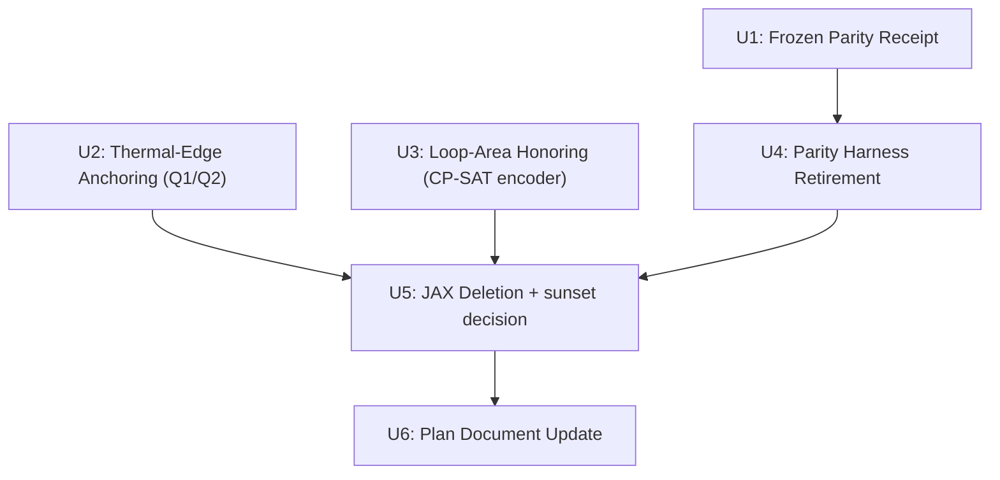

# feat: Calendar-Gate JAX Retirement (Override of Parity-Gate Requirement)

## Summary

Delete the JAX gradient-descent placement stack on a calendar date bounded by
a sunset decision, with two quality gaps (thermal-edge anchoring on Q1/Q2 in
PCL, loop-area honoring in the CP-SAT encoder) closing as prerequisites on the
same calendar.  The parity harness (#121) is retired; a frozen CP-SAT-vs-JAX
parity receipt is committed as a documentation artifact before deletion.  The
2026-07-02-001 experiment is fully retired.  `--placer jax-deprecated` becomes
a no-op deprecation warning.

This plan overrides the origin brainstorm's parity-gate requirement.  The
deviation follows the same documented-override pattern as the `--legacy-jax`
override from ce-doc-review (see plan `2026-07-03-001` Key Technical Decisions).

---

## Problem Frame

The origin brainstorm for the CP-SAT feasibility-first placer required JAX
retirement to be gated on CP-SAT matching-or-beating JAX across five oracle
metrics.  Three weeks into the strangler cutover, the parity job remains un-run,
the verdict framework is unimplemented beyond its test harness, and the decision
to retire JAX has been deferred into an instrument that exists to adjudicate it.
The structural argument (U0 spike: 0.1s feasibility, 652/652 audit pass) already
carries the decision; the remaining work is closing two PCL quality gaps (thermal-
edge anchoring for Q1/Q2, loop-area honoring in the CP-SAT encoder) as quality
work for CP-SAT itself, not parity-equalizing work.

This plan replaces the parity-gate requirement with a calendar gate bounded by a
sunset decision: if the date arrives and a quality gap is unresolved, an explicit
decision (accept/extend/revert) is required rather than an indefinite slip.  A
frozen CP-SAT-vs-JAX parity receipt is produced before gap closure and committed
as a documentation artifact, giving future maintainers the head-to-head evidence
without maintaining a live comparison harness.

---

## Requirements

All requirements from the origin document `docs/brainstorms/2026-07-03-calendar-gate-jax-retirement-requirements.md`.
Key R-IDs referenced below:

- R1-R2: Calendar gate with sunset decision at deadline
- R4-R5: Quality gaps (thermal-edge anchoring Q1/Q2, loop-area honoring)
- R6: Parity harness retirement + primitives extraction
- R7: Frozen parity receipt committed before deletion
- R8: 2026-07-02-001 experiment full retirement
- R9: `--placer jax-deprecated` as no-op deprecation warning

See the requirements doc for full text, acceptance examples, success criteria,
scope boundaries, and Deviations from Origin.

---

## Scope Boundaries

### Deferred to Follow-Up Work

- Removing `--placer jax-deprecated` CLI option entirely — follow-up cleanup PR
- True Euclidean (NRA) spacing in CP-SAT — already deferred in plan v1 scope

### Outside this work's identity

- Re-running CP-SAT-vs-JAX parity as a live CI gate
- Extracting a verdict from the 2026-07-02-001 experiment
- Re-debating the paradigm swap itself

---

## Context & Research

### Relevant Code and Patterns

- `packages/temper-placer/src/temper_placer/placer/cp_sat/` — CP-SAT model, encoder, audit, unsat modules (U2-U4, U7)
- `packages/temper-placer/src/temper_placer/metrics/external_oracle.py` — `score_placement()` entry point (U5)
- `packages/temper-placer/tests/regression/test_cp_sat_parity.py` — parity harness (U8, to be retired)
- `packages/temper-placer/src/temper_placer/cli/__init__.py` — `--placer` flag, CP-SAT dispatch (U6)
- `packages/temper-placer/configs/pcl/temper_induction.yaml` — PCL constraint spec for temper board
- `packages/temper-placer/configs/pcl/temper_induction_cooker.yaml` — existing OnSideConstraint for Q1/Q2
- `docs/plans/2026-07-03-001-feat-cp-sat-feasibility-first-placer-plan.md` — original CP-SAT plan (U9: JAX retirement section)
- `docs/reports/2026-07-03-cp-sat-feasibility-first-placer-implementation-report.md` — implementation report with feasibility validation
- `docs/brainstorms/2026-07-03-calendar-gate-jax-retirement-requirements.md` — requirements for this plan

### Institutional Learnings

- **Silent guard conditions cause dead infrastructure** (`docs/solutions/architecture-patterns/silent-guard-condition-infrastructure-failure-pattern-2026-07-02.md`): C-CAP was unreachable due to a guard-condition nesting error.  The `--placer jax-deprecated` no-op flag must print a visible deprecation warning — not silently exit.
- **Unsound AtMostK capacity encoding** (`docs/solutions/logic-errors/unsound-atmostk-capacity-encoding.md`): Constraint-solver correctness cannot be assumed.  The frozen parity receipt scores must be produced by the physics oracle, not by the parity harness alone.
- **OR-Tools `SufficientAssumptionsForInfeasibility()` proto indices** (`docs/solutions/logic-errors/or-tools-sufficient-assumptions-proto-indices-2026-07-03.md`): API discovery from U7 — proto indices must be reverse-mapped.
- **CP-SAT spread variable bounds cause INFEASIBLE** (`docs/solutions/logic-errors/cp-sat-spread-variable-bounds-infeasible-2026-07-03.md`): Bounds must match board dimensions, not component sizes.
- **CP-SAT feasibility-first paradigm** (`docs/solutions/architecture-patterns/cp-sat-feasibility-first-paradigm-2026-07-03.md`): Feasibility in 0.1s, optimization in 60s.
- **C-CAP alternating projections superseded** (`docs/solutions/architecture-patterns/alternating-projections-constraint-feasibility-optimization-init-2026-07-01.md`): Previous feasibility-first attempt (v2), now superseded by CP-SAT (v3).

---

## Implementation Units

---

### Phase 1: Evidence & Quality Gaps

### U1. Frozen Parity Receipt

**Goal:** Run CP-SAT against the JAX baseline once and commit the per-metric
scores as a frozen documentation artifact before the parity harness is deleted.
This gives future maintainers the head-to-head receipt without requiring the
harness to remain an active CI gate.

**Requirements:** R7 (frozen parity receipt before deletion)

**Dependencies:** None (runs against current CP-SAT v1, before gap closure)

**Files:**
- Create: `docs/evidence/cp-sat-jax-parity-2026-07-XX.md`
- Modify: `packages/temper-placer/tests/regression/test_cp_sat_parity.py` (run, do not modify — extract results)
- Reference: `packages/temper-placer/src/temper_placer/metrics/external_oracle.py` (`score_placement()`)
- Reference: `packages/temper-placer/src/temper_placer/placer/cp_sat/model.py` (model + solve)

**Approach:**
- Load the temper board components and constraints from fixtures (`Board.temper_default()`)
- Run CP-SAT feasibility-first solve (no objective, ~0.1s) to get a placement
- Run CP-SAT with wirelength objective (60s timeout) to get an optimized placement
- Score both placements via `score_placement()` for: clearance_3mm, clearance_6mm, thermal_score
- Compute total Manhattan wirelength for both placements
- Run router_v6 on both placements to get routability completion rate
- Compare against any available JAX baseline scores (if JAX baseline is unavailable, note that in the receipt)
- Write the receipt as a markdown table with per-metric scores, solve times, and a note about what was and wasn't compared
- The receipt is a documentation artifact, not a test — it does not assert pass/fail

**Execution note:** Run both feasibility-only AND with-objective CP-SAT solves.  The
feasibility-first paradigm doc records 0.1s vs 60s; the receipt should include both.

**Patterns to follow:**
- `docs/reports/2026-07-03-cp-sat-feasibility-first-placer-implementation-report.md` — feasibility validation table format
- `packages/temper-placer/tests/regression/test_cp_sat_parity.py` — existing parity comparison framework

**Test scenarios:**
- Happy path: `score_placement()` produces non-trivial scores on CP-SAT placements
- Happy path: CP-SAT feasibility-only placement passes audit (652/652 checks)
- Happy path: CP-SAT with-objective placement passes audit
- Integration: router_v6 runs on CP-SAT placement and produces a completion rate

**Verification:**
- `docs/evidence/cp-sat-jax-parity-2026-07-XX.md` exists with per-metric scores
- Receipt includes both feasibility-only and with-objective placement results
- Receipt clearly states what was and wasn't compared against JAX

---

### U2. Thermal-Edge Anchoring on Q1/Q2 in PCL

**Goal:** Add thermal-edge anchoring on Q1 and Q2 to the PCL constraint spec and
compile it through the CP-SAT encoder as a hard edge-anchoring constraint.
Closes the gap between v1's `OnSideConstraint` coverage and the temper board's
thermal-anchoring requirements.

**Requirements:** R4 (thermal-edge anchoring on Q1/Q2)

**Dependencies:** None (standalone quality gap closure)

**Files:**
- Modify: `packages/temper-placer/configs/pcl/temper_induction.yaml` (add `on_side` constraint for Q1/Q2 if not already present)
- Verify: `packages/temper-placer/configs/pcl/temper_induction_cooker.yaml` (existing OnSideConstraint; confirm it covers the right edge and distance)
- Modify: `packages/temper-placer/src/temper_placer/placer/cp_sat/encoder.py` (verify `OnSideConstraint` encoding works for Q1/Q2 with the specific edge and max_distance)
- Test: `packages/temper-placer/tests/placer/cp_sat/test_encoder.py` (add round-trip test for OnSideConstraint with temper board parameters)

**Approach:**
- First, audit the existing PCL configs: `temper_induction_cooker.yaml` already has `on_side` for Q1/Q2 at the top edge with flush.  Confirm this is the correct edge and distance per the thermal-anchoring requirements doc (2026-07-01).
- If the existing constraint is correct, verify it compiles through the CP-SAT encoder (U3's `_encode_on_side`) — it already supports `OnSideConstraint`.
- If the constraint needs adjustment (different edge, different max_distance), update the YAML and add a round-trip test.
- U_BUCK is NOT included per the 2026-07-01 analysis (2W buck converter needs spreading, not edge anchoring).

**Patterns to follow:**
- `packages/temper-placer/src/temper_placer/placer/cp_sat/encoder.py:_encode_on_side` — existing handler
- `packages/temper-placer/src/temper_placer/placer/cp_sat/model.py:add_edge_anchoring` — constraint encoding
- `docs/solutions/architecture-patterns/thermal-potential-field-anchoring-safety-gates-2026-07-01.md` — prior thermal analysis

**Test scenarios:**
- Happy path: PCL YAML load with `on_side` for Q1/Q2 compiles through CP-SAT encoder
- Happy path: CP-SAT placement with `OnSideConstraint` places Q1/Q2 within max_distance of the specified edge
- Edge case: `OnSideConstraint` with `edge=top` and positive max_distance — auditor confirms compliance
- Round-trip: PCL → encode → solve → audit → Q1/Q2 within edge distance
- Integration: temper board full model with thermal-edge anchoring passes 652/652 audit

**Verification:**
- Q1 and Q2 are placed within the specified edge distance in CP-SAT temper board placements
- Round-trip test passes in `test_encoder.py`
- Audit confirms no edge-anchoring violations

---

### U3. Loop-Area Honoring in CP-SAT Encoder

**Goal:** Add loop-area honoring to the CP-SAT encoder.  The `LoopAreaConstraint`
(currently deferred with a warning in U3) compiles to a soft wirelength-term
addition in the CP-SAT model, closing the gap between the encoder's supported
type set and the temper board's PCL spec.

**Requirements:** R5 (loop-area honoring in CP-SAT encoder)

**Dependencies:** None (standalone quality gap closure)

**Files:**
- Modify: `packages/temper-placer/src/temper_placer/placer/cp_sat/encoder.py` (add `_encode_loop_area` handler, register in `TYPE_HANDLERS`, remove from `UNSUPPORTED_TYPES`)
- Modify: `packages/temper-placer/src/temper_placer/placer/cp_sat/model.py` (add `add_loop_area_term()` helper for soft wirelength addition)
- Test: `packages/temper-placer/tests/placer/cp_sat/test_encoder.py` (add round-trip test for LoopAreaConstraint)

**Approach:**
- Remove `LOOP_AREA` from `UNSUPPORTED_TYPES` frozen set
- Add `_encode_loop_area(constraint, components, model, ctx, board)` handler:
  - Resolve the loop's component references against the component list
  - For each pair of consecutive components in the loop, add a Manhattan distance term to the objective (same pattern as `add_soft_wirelength_objective` but scoped to the loop pairs)
  - Create an assumption variable for UNSAT core extraction
- Register `_encode_loop_area` in `TYPE_HANDLERS` under `ConstraintType.LOOP_AREA`
- The encoding is a soft objective term — it MINIMIZES the loop's wirelength span, which is the same semantic as minimizing loop area for rectangular layouts
- Hard area bound (e.g., max 500mm²) is deferred to a follow-up; v1 compiles loop-area as a soft minimization term

**Execution note:** Write a BMC-style round-trip test first: create a small board with a 3-component loop, encode a `LoopAreaConstraint`, solve, verify the loop components are closer together than a baseline placement without the constraint.

**Patterns to follow:**
- `packages/temper-placer/src/temper_placer/placer/cp_sat/encoder.py:_encode_adjacent` — handler dispatch pattern
- `packages/temper-placer/src/temper_placer/placer/cp_sat/model.py:add_soft_wirelength_objective` — objective term addition pattern
- `packages/temper-placer/src/temper_placer/pcl/constraints.py:LoopAreaConstraint` — PCL data model

**Test scenarios:**
- Happy path: `LoopAreaConstraint` compiles through encoder without warning (not deferred)
- Happy path: `LoopAreaConstraint` generates an assumption variable for UNSAT core
- Happy path: CP-SAT placement with loop-area term has lower wirelength for loop components than without
- Edge case: `LoopAreaConstraint` with a component reference not in the component list — raises `PCLCompileError`
- Round-trip: PCL → encode → solve → verify loop components are mutually close
- Integration: temper board full model with loop-area honoring passes 652/652 audit

**Verification:**
- `LOOP_AREA` is removed from `UNSUPPORTED_TYPES`
- `TYPE_HANDLERS` includes `_encode_loop_area` for `ConstraintType.LOOP_AREA`
- Round-trip test passes in `test_encoder.py`
- No warnings logged for `LoopAreaConstraint` during temper board compilation

---

### Phase 2: Retirement

### U4. Parity Harness Retirement

**Goal:** Delete the parity comparison integration test while extracting
`score_placement()`, `MetricComparison`, `ParityComparisonResult`, and the
supporting test framework to reusable CP-SAT regression infrastructure.

**Requirements:** R6 (parity harness retirement + primitives extraction)

**Dependencies:** U1 (frozen parity receipt must be produced before deletion)

**Files:**
- Delete: `packages/temper-placer/tests/regression/test_cp_sat_parity.py`
- Create: `packages/temper-placer/src/temper_placer/regression/cp_sat_comparison.py` (extracted `MetricComparison`, `ParityComparisonResult`, `compare_metric_dicts()`)
- Modify: `packages/temper-placer/tests/regression/__init__.py` (if needed)
- Test: `packages/temper-placer/tests/regression/test_cp_sat_regression.py` (CP-SAT-vs-CP-SAT regression using extracted primitives; no JAX comparison)

**Approach:**
- Extract `MetricComparison`, `ParityComparisonResult`, and `compare_metric_dicts()` from `test_cp_sat_parity.py` into `cp_sat_comparison.py` as a library module
- Extract the synthetic fixture helpers (component generation, board setup) to `conftest.py` or a shared fixture module
- Delete the JAX-vs-CP-SAT comparison test methods
- Preserve the `@pytest.mark.cp_sat` marker usage pattern
- Create `test_cp_sat_regression.py` using the extracted primitives to compare CP-SAT placements against each other (solver parameter changes, model revisions) — CP-SAT-vs-CP-SAT, not CP-SAT-vs-JAX
- Both `score_placement()` (U5, already in `metrics/external_oracle.py`) and `MetricComparison` remain importable and independent of JAX

**Patterns to follow:**
- `packages/temper-placer/src/temper_placer/metrics/external_oracle.py` — existing `score_placement()` module structure
- `packages/temper-placer/tests/regression/test_cp_sat_parity.py` — source for extraction

**Test scenarios:**
- Happy path: `from temper_placer.regression.cp_sat_comparison import MetricComparison, ParityComparisonResult, compare_metric_dicts` succeeds
- Happy path: `compare_metric_dicts()` compares two CP-SAT placement scores and produces a per-metric breakdown
- Happy path: `score_placement()` produces scores on CP-SAT placements without JAX imports
- Edge case: Importing `cp_sat_comparison` does not import JAX or reference the JAX optimizer

**Verification:**
- `test_cp_sat_parity.py` is deleted
- `cp_sat_comparison.py` exports `MetricComparison`, `ParityComparisonResult`, `compare_metric_dicts()`
- `score_placement()` is importable from `metrics.external_oracle`
- No JAX-vs-CP-SAT comparison test runs in CI

---

### U5. JAX Deletion + 2026-07-02-001 Experiment Retirement

**Goal:** Delete the JAX optimizer stack and the 2026-07-02-001 experiment per
the plan U9 file list, with the sunset decision check at the calendar deadline.
If quality gaps (U2, U3) are not closed and the deadline has arrived, produce
the sunset decision rather than silently slipping.

**Requirements:** R1-R2 (calendar gate with sunset), R8 (experiment full retirement)

**Dependencies:** U2, U3 (quality gaps must be closed first); U4 (parity harness retired)

**Files:**
- Delete: `packages/temper-placer/src/temper_placer/optimizer/` (entire directory)
- Delete: `packages/temper-placer/src/temper_placer/losses/` (entire directory)
- Delete: `packages/temper-placer/src/temper_placer/pcl/loss_bridge.py`
- Delete: `packages/temper-placer/src/temper_placer/placement/analytical.py`
- Delete: `packages/temper-placer/src/temper_placer/placement/spectral.py`
- Delete: `packages/temper-placer/src/temper_placer/placement/constraint_weights.py`
- Delete: `packages/temper-placer/src/temper_placer/placement/benders_loop.py`
- Delete: `packages/temper-placer/src/temper_placer/placement/legalization.py`
- Delete: `packages/temper-placer/src/temper_placer/heuristics/force_directed.py`
- Delete: `packages/temper-placer/src/temper_placer/ablation/` (entire directory)
- Modify: `packages/temper-placer/src/temper_placer/cli/__init__.py` (rename `--placer jax` to `--placer jax-deprecated`, make it a no-op printing a deprecation warning and exiting; remove `--placer` option entirely)
- Modify: `packages/temper-placer/src/temper_placer/router_v6/pipeline.py` (replace `Legalizer` call with CP-SAT audit equivalent)
- Modify: `packages/temper-placer/src/temper_placer/heuristics/pipeline.py` (remove `force_directed` imports)
- Modify: `packages/temper-placer/src/temper_placer/adapters/placement_adapter.py` (remove `benders_placement` import)
- Modify: `packages/temper-placer/src/temper_placer/adapters/register_strategies.py` (remove `benders_placement` import)
- Delete: Any files, configs, or fixtures referencing `2026-07-02-001` experiment (determine exact list during implementation)
- Test: Update all tests that imported from deleted modules

**Approach:**
- This unit gates on U2 and U3 being merged — if either quality gap is not closed, the deletion is blocked
- If the sunset deadline has arrived and a gap is unresolved, the implementer produces the sunset decision (accept and delete, extend the date, or revert) as a documented decision — this is surfaced in the PR description or a decision log, not silently slipped
- Deletions follow the plan U9 file list exactly, extended with the additional files discovered during ce-doc-review (ablation/, adapters, heuristics/pipeline.py, router_v6/pipeline.py)
- Experiment artifacts are identified by grepping for `2026-07-02-001` and deleted alongside the optimizer stack
- `--placer jax-deprecated` prints a deprecation warning and exits with a non-zero code — it does NOT attempt to run the JAX pipeline (the optimizer has been deleted)
- Verification checks (per plan U9) are extended with additional grep patterns for force_directed, benders_loop, and legalization imports

**Execution note:** This is a deletion unit — the primary risk is missing an import reference.
Run the extended grep verification checks after deletion and before commit.

**Patterns to follow:**
- `docs/plans/2026-07-03-001-feat-cp-sat-feasibility-first-placer-plan.md` — plan U9: JAX Retirement section (file list, verification checks)
- `docs/solutions/workflow-issues/dead-code-from-features-with-no-activation-surface-2026-07-01.md` — verify zero remaining imports before declaring deletion complete

**Test scenarios:**
- Happy path: `--placer jax-deprecated` prints deprecation warning and exits non-zero
- Happy path: `rg "from temper_placer.optimizer" src/temper_placer/` returns zero matches
- Happy path: `rg "from temper_placer.losses" src/temper_placer/` returns zero matches
- Happy path: `rg "from temper_placer.heuristics.force_directed"` returns zero matches
- Happy path: `rg "2026-07-02-001"` returns zero references in the codebase
- Edge case: Existing tests that imported from deleted modules are updated or removed
- Error path: Sunset deadline arrived with gap unresolved — sunset decision is produced and documented

**Verification:**
- Zero imports of `optimizer/`, `losses/`, `loss_bridge.py`, `force_directed.py`, `benders_loop.py`, `legalization.py` anywhere in the codebase
- `temper optimize` runs CP-SAT by default (no `--placer` flag)
- `temper optimize --placer jax-deprecated` prints deprecation warning and exits non-zero
- `2026-07-02-001` returns zero references
- All existing tests pass (updated where needed)
- Sunset decision is documented if deadline arrived with unresolved gaps

---

### Phase 3: Documentation

### U6. Plan Document Update

**Goal:** Update the CP-SAT plan document to reflect the calendar-gate override,
removing parity-gate references and adding the sunset decision, frozen receipt,
and deprecated-flag no-op.

**Requirements:** Traceability (Deviations from Origin)

**Dependencies:** U5 (JAX deletion complete)

**Files:**
- Modify: `docs/plans/2026-07-03-001-feat-cp-sat-feasibility-first-placer-plan.md` (update Summary, Key Technical Decisions, U9 section, remove parity-gate references)
- Modify: `docs/brainstorms/2026-07-03-calendar-gate-jax-retirement-requirements.md` (update status to `completed`, record the actual calendar date and sunset outcome)

**Approach:**
- Update the plan's Summary to note that the parity gate was overridden by a calendar gate (see requirements doc)
- Add a Key Technical Decision documenting the calendar-gate override, referencing the requirements doc
- Update the plan U9 section to reflect the deprecated-flag no-op behavior
- Remove references to the parity gate as an active requirement (R7 becomes evidence-only, R9 becomes calendar-driven, R11 becomes no-op)
- If the sunset decision was triggered (gap unresolved at deadline), document the outcome in the requirements doc
- Update the requirements doc status from `active` to `completed` with the actual calendar date

**Patterns to follow:**
- `docs/plans/2026-07-03-001-feat-cp-sat-feasibility-first-placer-plan.md` — existing Key Technical Decisions section with Decision Log pattern

**Test scenarios:**
- Test expectation: none — documentation update only

**Verification:**
- Plan document no longer references parity gate as an active requirement
- Key Technical Decisions section includes calendar-gate override with reference to the requirements doc
- Requirements doc status is `completed`

---

## System-Wide Impact

- **CLI surface change**: `--placer jax` is removed.  `temper optimize` runs CP-SAT
  by default with no `--placer` flag.  `--placer jax-deprecated` prints a
  deprecation warning and exits.  Any scripts or CI workflows that invoke
  `--placer jax` will break and must be updated.
- **Import graph**: All JAX optimizer and losses imports are removed.  Surviving
  modules (`metrics/`, `physics/`, `router_v6/`, `core/`, `pcl/`, `io/`, `cli/`)
  must not import from deleted modules.
- **Test suite**: Tests that imported from deleted modules are updated or removed.
  Parity comparison tests are deleted; CP-SAT regression tests using extracted
  primitives remain.
- **Golden fixtures**: Regenerated with CP-SAT placements after JAX deletion.
- **Error propagation**: `--placer jax-deprecated` exits with non-zero code and
  prints a deprecation warning to stderr.  Sunset decision failures are surfaced
  in the PR description.

---

## Risks & Dependencies

| Risk | Likelihood | Impact | Mitigation |
|------|-----------|--------|------------|
| Quality gap (loop-area honoring) proves harder than expected — deletion blocked at sunset deadline | Low | High | Sunset decision provides explicit resolution path (accept/extend/revert); gap is soft objective term addition, not a hard constraint rewrite |
| Frozen parity receipt can't be produced because JAX baseline is unavailable or nondeterministic | Medium | Low | Receipt notes what was and wasn't compared; structural argument carries the decision regardless |
| `--placer jax-deprecated` removal breaks undiscovered scripts or CI workflows | Medium | Medium | No-op warning surface gives operators time to discover and update scripts before the flag is removed in a follow-up |
| Existing tests import from deleted modules and CI goes red | Low | Medium | Extended grep verification checks catch import references before deletion commit |
| Thermal-edge anchoring constraint already exists in `temper_induction_cooker.yaml` — U2 is a no-op audit | Low | Low | U2 becomes a verification-only unit: confirm the existing constraint compiles correctly and add a round-trip test |

---

## Outstanding Questions

### Resolved During Planning

- **Calendar date**: Same sprint as this requirements doc closes (the sprint that ships U1-U6).
- **Frozen parity receipt timing**: Before quality gaps close — receipt captures CP-SAT-vs-JAX on v1 state at decision time.

### Deferred to Implementation

- [Affects U5][Deletion scope] Which specific experiment artifacts (config files, runner scripts, test fixtures) reference `2026-07-02-001` and need deletion? Determined via `rg "2026-07-02-001"` during implementation.
- [Affects U5][Test migration] Which existing tests import from deleted modules and need updating? Determined during deletion via grep verification checks.
- [Affects U3][Technical] Exact CP-SAT encoding for loop-area — soft wirelength-term addition as the v1 approach; hard area bound deferred to follow-up.
- [Affects U4][Extraction scope] Which specific classes and test methods in `test_cp_sat_parity.py` are extracted vs deleted? Determined during implementation by reading the file.

---

## Sources & References

- **Requirements:** `docs/brainstorms/2026-07-03-calendar-gate-jax-retirement-requirements.md`
- **Origin CP-SAT plan:** `docs/plans/2026-07-03-001-feat-cp-sat-feasibility-first-placer-plan.md`
- **Implementation report:** `docs/reports/2026-07-03-cp-sat-feasibility-first-placer-implementation-report.md`
- **Related learnings:** `docs/solutions/architecture-patterns/cp-sat-feasibility-first-paradigm-2026-07-03.md`
- **Related learnings:** `docs/solutions/logic-errors/or-tools-sufficient-assumptions-proto-indices-2026-07-03.md`
- **Related learnings:** `docs/solutions/logic-errors/cp-sat-spread-variable-bounds-infeasible-2026-07-03.md`
