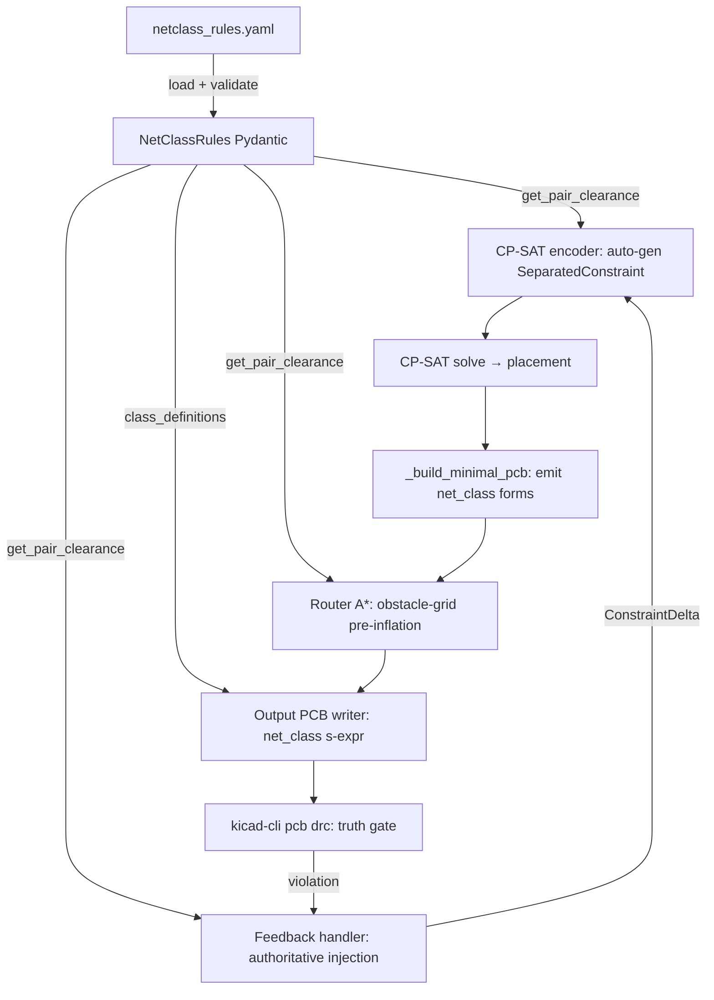

# feat: Add netclass-aware clearance single-source-of-truth with YAML authority

## Summary

Introduce `netclass_rules.yaml` as the single authoritative config for per-netclass-pair clearance values, consumed by CP-SAT placement, router_v6, and output-PCB generation — with the existing F3 feedback loop as backstop. The YAML derives into the existing `NetClassRules` Pydantic model, a new `get_pair_clearance` abstraction serves all consumers, and a per-layer experiment quantifies each layer's contribution to closing the 121→29 DRC-violation gap.

---

## Problem Frame

CP-SAT placement produces 121 DRC errors vs the 29-violation human baseline because the placer enforces geometric Chebyshev clearance while kicad-cli DRC checks per-netclass rules — and the temper PCB currently has zero `(net_class ...)` definitions, so DRC runs at KiCad's ~0.2mm default. The 6mm ACMains-to-signal rule the board should have is absent from both the placer and the PCB. Hand-maintaining netclass rules across YAML config, placer encoder, router spacing, and KiCad PCB s-expressions invites constraint drift — the preventive placement layer and the DRC truth gate would check against different rules.

(see origin: `docs/brainstorms/2026-07-06-netclass-aware-clearance-ssot-requirements.md`)

---

## Requirements

- **R1.** `netclass_rules.yaml` is the sole editable surface for netclass→clearance rules. Two tiers per the origin: safety-critical pairs with `because` fields citing physics derivations; routine pairs at manufacturer defaults. A `default_clearance_mm` field covers unlisted pairs.
- **R2.** CP-SAT auto-generates SEPARATED constraints for every cross-class component-net-pair from the YAML, with a Chebyshev→Euclidean safety factor.
- **R3.** Router_v6 routes with per-netclass spacing from the same YAML (obstacle-grid pre-inflation on the binary A* pathfinder).
- **R4.** The `temper optimize` output-PCB write step generates `(net_class ...)` KiCad s-expression forms from the YAML.
- **R5.** The existing F3 feedback loop's `_handle_clearance_violation` handler reads authoritative clearance values from the YAML rather than trusting the DRC violation's `required_mm` field.
- **R6.** A per-layer experiment with three checkpoints quantifies each layer's contribution to gap closure.

**Origin actors:** A1 (`netclass_rules.yaml`), A2 (CP-SAT encoder), A3 (router_v6), A4 (output-PCB write step), A5 (kicad-cli DRC truth gate), A6 (F3 feedback loop)
**Origin flows:** F1 (authority definition), F2 (preventive placement), F3 (preventive routing), F4 (output-PCB netclass-form write), F5 (reactive feedback), F6 (per-layer experiment)
**Origin acceptance examples:** AE1 (covers R1 — all consumers read identical clearance from YAML), AE2 (covers R2, R4 — placement at >=YAML clearance, output PCB carries same values), AE3 (covers R3 — routed track spacing >= YAML clearance), AE4 (covers R5 — feedback injects YAML-derived value on violation), AE5 (covers R6 — three-row experiment table with load-bearing finding)

---

## Scope Boundaries

- Full IEC 60335-1 Table 16 encoding is out of scope — only rows relevant to this board's voltage classes.
- Router_v6 internal architecture changes are out of scope — the A* binary grid stays; clearance is enforced via obstacle-grid pre-inflation, not a new channel model.
- Schematic-editor-integrated netclass declaration is out of scope.
- Per-pin or per-route-segment clearance rules are out of scope — rules are class-pair level.
- Track-width and via-size rules are in scope for the YAML and output-PCB write step, not for CP-SAT (placement doesn't choose track widths).
- The KiCad input PCB is not modified — only the output PCB carries derived `(net_class ...)` forms.
- `because` field propagation to UNSAT-core diagnostics is deferred to follow-up work (useful but not gating for the SSOT chain).

### Deferred to Follow-Up Work

- `because` field propagation from PCL constraints into CP-SAT UNSAT-core diagnostics: separate PR after the SSOT chain lands.
- `(net_class_pair ...)` syntax support if KiCad adds it in a future version: the output writer should be structured so the switch from per-class self-clearance to per-pair is a localized change.

---

## Context & Research

### Relevant Code and Patterns

- `packages/temper-placer/src/temper_placer/core/design_rules.py:96` — `NetClassRules` Pydantic model (frozen, with `clearance`, `creepage_mm`, `trace_width`, `safety_category`); `TEMPER_NET_CLASSES` (line 296) with 9 populated entries; `TEMPER_NET_ASSIGNMENTS` (line 433) with explicit net→class map.
- `packages/temper-placer/src/temper_placer/core/net_classification.py:75` — `classify_net_type()` with GROUND / POWER / HV / SIGNAL patterns; precedence: ground > power > hv > signal.
- `packages/temper-placer/src/temper_placer/placer/cp_sat/encoder.py:87` — `_encode_separated()` using `NoOverlap2D` with `OnlyEnforceIf` assumption wiring; `TYPE_HANDLERS` dispatch dict at line 470.
- `packages/temper-placer/src/temper_placer/placer/cp_sat/feedback.py:239` — `_handle_clearance_violation()` reads `violation.required_mm` with default 6.0, creates `SeparatedConstraint`. **Drift risk confirmed**: never consults a YAML.
- `packages/temper-placer/src/temper_placer/router_v6/constraints_design_rules.py:128` — `ClearanceMatrix` with `_clearances: dict[tuple[str,str], float]`, `_net_class_rules: dict[str, NetClassRules]`, and `get_clearance(net_a, net_b, x, y)`. Currently used for post-route DRC only.
- `packages/temper-placer/src/temper_placer/cli/__init__.py:478` — `temper optimize` output write path: places components via `_apply_placements_to_pcb()`, routes via `route_pcb()`, writes to output.
- `packages/temper-placer/src/temper_placer/io/kicad_exporter.py:419` — `export_routed_pcb()` writes PCB via `kiutils`; currently no `(net_class ...)` forms.
- `packages/temper-placer/src/temper_placer/placer/cp_sat/loop.py:469` — `_build_minimal_pcb()` generates synthetic PCB for loop-internal routing; currently no netclass forms.
- `packages/temper-placer/configs/constraints/safety_isolation.yaml` — IEC 60335-1 citations and clearance values (10mm reinforced, 12mm DC bus→MCU); YAML schema conventions: `version`, `metadata`, `tier`, `because`.
- `packages/temper-placer/configs/constraints/half_bridge_base.yaml` — `tier` as 1/2/3 integers; `because` always populated.

### Institutional Learnings

- **CP-SAT constraint encoder greenfield**: Every handler MUST wire its assumption via `.OnlyEnforceIf()` for UNSAT-core extraction. The two-tier gate catches forgotten assumptions. New netclass-generated SEPARATED constraints follow the same handler pattern — they must carry assumption literals.
- **Two-tier acceptance gate**: Chebyshev (L∞) 8.5mm ≈ Euclidean 6.0mm at 45°. Never ship on audit-pass alone — kicad-cli DRC is the final arbiter. Apply safety factor (×1.414) to CP-SAT clearance values to match Euclidean DRC rules.
- **Place→Route loop feedback**: Delta deduplication by `constraint.id` prevents over-constraint UNSAT. Never auto-loosen physics-grounded constraints. Feedback handler must carry authoritative YAML values to prevent injecting default-clearance values on safety-critical pairs.
- **Per-stage DRC fence**: Stages that write netclass assignments should declare invariants verifying the assignment hasn't drifted or been overwritten.
- **Pydantic dataclass migration**: `NetClassRules` Pydantic model with `Literal["HV","LV","AC","iso"]` safety_category catches typos at construction time. The YAML authority derives INTO this model, not replaces it.
- **LayerIndex SSOT**: Consolidation pattern — replace every duplicated representation with the canonical source, co-locate with existing concept, big-bang migrate in one PR.
- **Clearance false negatives per net pair**: When aggregation collapses per-layer violations to a single global minimum, multi-layer violations are silently dropped. DRC verification must check clearance per-layer.

### External References

- None required — the codebase has strong local patterns for YAML config consumption, CP-SAT constraint encoding, and KiCad s-expression writing. No external API or unfamiliar technology is introduced.

---

## Key Technical Decisions

- **YAML derives into `NetClassRules` Pydantic model, does not replace it.** The existing model (frozen, type-safe, 9 entries) is the natural canonical location. Adding an independent type would repeat the type-drift problem documented in the splr→rustsat-cadical migration. The YAML is loaded, validated against schema, and used to populate `NetClassRules` instances — existing consumers need no change except the new `get_pair_clearance` abstraction.
- **New `get_pair_clearance(class_a, class_b) -> float` function.** No cross-class pair lookup exists today — `NetClassRules.clearance` is self-clearance only. This function follows the `ClearanceMatrix._get_base_clearance` pattern: `max(explicit_pair_value, max(self_clearance_a, self_clearance_b))`, with the explicit YAML pair value taking precedence for safety-critical pairs that exceed both self-clearances.
- **Only cross-class pairs get SEPARATED constraints.** Same-class component pairs (e.g., Signal-Signal at 0.15mm) are handled by the existing global `NoOverlap2D` with the component's inflated bounding box. Adding per-pair SEPARATED constraints for same-class would double-constrain and waste CP-SAT variables. Cross-class pairs are the ones where YAML clearance exceeds self-clearance and the placer must enforce additional spacing.
- **Chebyshev→Euclidean safety factor = √2 ≈ 1.414.** CP-SAT's Chebyshev (L∞) distance at `d_cheb` guarantees `d_euclidean ≥ d_cheb / √2` at worst (45° diagonal). To ensure Euclidean distance ≥ `clearance_euc`, the placer enforces `clearance_cheb = clearance_euc × √2`. This safety factor is applied to all YAML-derived clearances before they enter `_encode_separated`. The two-tier gate can catch remaining violations if component geometry makes the exact clearance boundary tighter.
- **Obstacle-grid pre-inflation in router, not channel-model changes.** The router's A* pathfinder uses a binary occupancy grid. Before routing a net of class X, all already-routed cells whose nets are of class Y are inflated by `get_pair_clearance(X, Y)`. This keeps the A* loop fast (binary grid checks) at the cost of a per-net O(grid_cells) inflation pass before routing. This is the least invasive integration point; if it proves too slow or imprecise, the follow-up can explore channel-model constraints.
- **Feedback handler reads YAML authority directly, not the DRC violation's `required_mm`.** The DRC violation's `required_mm` is a derived artifact — on first-round (before netclass forms are written to output PCB) it's the KiCad 0.2mm default, creating a bootstrapping problem. The feedback classifier holds a reference to the loaded `NetClassRules` and uses `get_pair_clearance()` for the violating net pair. The violation's `required_mm` is kept as a cross-check (log warning if it differs from the YAML value).
- **`_build_minimal_pcb()` emits `(net_class ...)` forms from the YAML.** The loop's internal routing step generates its own PCB for `route_pcb()` to consume. Without netclass forms, the loop routes at default 0.2mm clearance and creates self-fulfilling DRC violations. The synthetic PCB must carry the same netclass rules as the output write step.
- **Output PCB merge semantics: YAML always wins on conflicts.** If the input PCB has pre-existing `(net_class ...)` forms (the temper board has none), YAML-derived values override on all fields the YAML declares. Input forms are preserved only for classes/fields the YAML does not declare. This enforces SSOT discipline even in merge scenarios.
- **Per-class self-clearance fallback for KiCad output if pair syntax unsupported.** Verify KiCad 9's `(net_class ...)` s-expression format during implementation of the output write step. If per-class-pair clearance is not supported (only per-class self-clearance), write conservative per-class values: for each class, `clearance = max(get_pair_clearance(C, D) for D in all_classes)`. Document the discrepancy — kicad-cli DRC will be slightly more conservative than placement enforcement on some pairs. This does not create safety gaps (the PCB is more conservative, not less).

---

## Open Questions

### Resolved During Planning

- **Where does netclass-aware spacing enter router_v6?** Obstacle-grid pre-inflation — see Key Technical Decisions.
- **Should `_handle_clearance_violation` be modified?** Yes — see Key Technical Decisions.
- **Which net classification is authoritative?** `TEMPER_NET_ASSIGNMENTS` explicit map takes priority; fall back to `classify_net_type()` from `core/net_classification.py` for nets not in assignments.
- **Merge semantics for pre-existing PCB `(net_class ...)` forms?** YAML wins on conflicts — see Key Technical Decisions.
- **KiCad per-class-pair syntax?** Resolved during implementation of U4 — if unsupported, fall back to per-class self-clearance — see Key Technical Decisions.
- **Experiment harness?** Three separate `temper optimize` runs with progressive layer toggles — see U8.

### Deferred to Implementation

- Exact KiCad `(net_class ...)` s-expression syntax — verified during U4 by writing a test PCB with `kiutils` and running `kicad-cli drc`.
- Exact YAML schema field names and validation — shaped during U1, informed by existing `safety_isolation.yaml` and `NetClassRules` field names.
- Track-width and via-size values per netclass — the YAML schema reserves these fields; values are defined as defaults matching existing `TEMPER_NET_CLASSES` entries. The router consumes them from the YAML (replacing hardcoded `create_default()` values), but CP-SAT ignores them.
- Safety factor exact value — the plan uses √2; implementation may tune to a slightly smaller factor if the board's component footprint shapes (not 45° diagonals) prove to be the limiting case.

---

## High-Level Technical Design

> *This illustrates the intended approach and is directional guidance for review, not implementation specification. The implementing agent should treat it as context, not code to reproduce.*

**Data flow:**

1. `netclass_rules.yaml` loaded → a `NetClassRules` dict keyed by class name, plus a cross-class-pair `dict[(str, str), float]` with `because` metadata.
2. A `get_pair_clearance(class_a, class_b) -> float` function resolves: `max(explicit_pair_value, max(self_clearance_a, self_clearance_b))`, falling back to `default_clearance_mm`.
3. **CP-SAT**: For every pair of components whose nets resolve to different classes (via `TEMPER_NET_ASSIGNMENTS` then `classify_net_type()`), generate a `SeparatedConstraint(min_distance_mm = get_pair_clearance(Ca, Cb) * sqrt(2))`. Encode via the existing `_encode_separated` handler — constraint generation happens before encoding, not inside the handler.
4. **Router**: Before routing each net of class X, iterate all cells already occupied by routed traces. For each occupied cell whose net is of class Y, inflate a square region of radius `get_pair_clearance(X, Y) / grid_cell_size` around the cell in the binary occupancy grid. The A* pathfinder then treats inflated cells as blocked.
5. **Output writer**: After routing, call a new function `write_netclass_forms(board: kiutils.Board, rules)` that iterates `TEMPER_NET_CLASSES` (populated from YAML) and writes `(net_class "ClassName" (clearance X.X) (trace_width Y.Y) (via_dia Z.Z) (via_drill W.W) ...)` into the board's s-expression before `board.to_file()`.
6. **Feedback**: `FeedbackClassifier.__init__()` accepts an optional `netclass_rules: NetClassRules | None` parameter. `_handle_clearance_violation()` uses `rules.get_pair_clearance(class_a, class_b, default=violation.required_mm)` — with the DRC violation's `required_mm` as fallback, but logging a warning when it differs from the YAML value.

---

## Output Structure

    packages/temper-placer/configs/
      netclass_rules.yaml          (new)

    packages/temper-placer/src/temper_placer/
      core/
        netclass_rules.py          (new - YAML loader + get_pair_clearance)
      placer/cp_sat/
        netclass_constraints.py    (new - cross-class SEPARATED generator)

---

## Implementation Units

### U1. Define `netclass_rules.yaml` schema and populate the temper board

**Goal:** Create the authoritative YAML file with schema, tiered clearance pairs, and `because` citations for safety-critical pairs.

**Requirements:** R1 (SSOT file creation)

**Dependencies:** None

**Files:**
- Create: `packages/temper-placer/configs/netclass_rules.yaml`

**Approach:**
- Schema follows existing YAML convention: `version`, `metadata` (name, description, author, date, board), `default_clearance_mm`, `net_classes` (list of {name, trace_width, clearance, creepage_mm, via_diameter, via_drill, safety_category, voltage_v}), `cross_class_clearances` (list of {class_a, class_b, clearance_mm, tier, because?}).
- Safety-critical pairs (with `because`): `<ACMains | HighVoltage> ↔ <Signal | GND | Power | FinePitch>` at 6.0mm, citing IEC 60335-1 Table 16 working isolation at 400V (sourced from `safety_isolation.yaml`).
- Routine pairs: Power↔Signal at 0.25mm, Power↔GND at 0.3mm (matching existing `TEMPER_NET_CLASSES` self-clearances), intra-HV at max(self-clearance).
- `default_clearance_mm: 0.2` for unlisted pairs.
- Track-width and via-size fields populated from existing `TEMPER_NET_CLASSES` defaults.
- Net class entries match the 9 classes in `TEMPER_NET_CLASSES`: ACMains, HighVoltage, FinePitch, Power, GateDrive, GND, HighSpeed, Signal, HighCurrent.

**Patterns to follow:**
- `packages/temper-placer/configs/constraints/safety_isolation.yaml` — `version`, `metadata`, `tier`, `because` conventions.
- `packages/temper-placer/src/temper_placer/core/design_rules.py:296` — `TEMPER_NET_CLASSES` values for per-class defaults.

**Test scenarios:**
- Happy path: Load YAML with PyYAML, verify all 9 net classes parse with correct `trace_width`, `clearance`, `safety_category`.
- Happy path: Verify each `cross_class_clearances` entry has valid `class_a` and `class_b` matching defined net class names.
- Edge case: Verify `default_clearance_mm` falls back correctly when querying an unlisted pair.
- Error path: Invalid safety_category value (not one of HV/LV/AC/iso) raises validation error.

**Verification:**
- YAML file passes schema validation; all `class_a`/`class_b` values in cross-class entries reference defined net classes; `because` fields present on all safety-critical pairs (tier 1).

---

### U2. Build netclass rules loading and the `get_pair_clearance` abstraction

**Goal:** Create the Python module that loads `netclass_rules.yaml`, validates it against the `NetClassRules` Pydantic model, and provides a `get_pair_clearance(class_a, class_b) -> float` lookup used by all consumers.

**Requirements:** R1 (SSOT consumption path), R2 (preventive placement input), R3 (preventive routing input), R4 (output-PCB input), R5 (feedback input)

**Dependencies:** U1

**Files:**
- Create: `packages/temper-placer/src/temper_placer/core/netclass_rules.py`
- Test: `packages/temper-placer/tests/pcl/test_netclass_rules.py`

**Approach:**
- Module exports `load_netclass_rules(path: Path) -> NetClassRulesDict`, returning a typed dict with `net_classes: dict[str, NetClassRules]`, `pair_clearances: dict[tuple[str,str], float]`, `default_clearance_mm: float`, `because: dict[tuple[str,str], str]`.
- `get_pair_clearance(class_a, class_b, *, rules, default=None) -> float`: returns `max(explicit_pair_value, max(self_clearance_a, self_clearance_b))`. Accepts direction-agnostic class pair (canonicalizes to sorted tuple). Falls back to `rules.default_clearance_mm`.
- `get_pair_because(class_a, class_b, *, rules) -> str | None`: returns the `because` text if the pair is safety-critical, None otherwise.
- Uses `classify_net_type()` from `core/net_classification.py` and `TEMPER_NET_ASSIGNMENTS` from `core/design_rules.py` for net→class resolution.
- `resolve_net_class(net_name: str) -> str`: priority — `TEMPER_NET_ASSIGNMENTS[net_name]`, then `classify_net_type(net_name)`. Returns the class name as used in the YAML.

**Execution note:** Implement test-first for the `get_pair_clearance` resolution logic — the combination of explicit pair value, max(self-clearance), and default fallback has subtle interactions.

**Patterns to follow:**
- `packages/temper-placer/src/temper_placer/core/design_rules.py:96` — `NetClassRules` Pydantic model for type safety.
- `packages/temper-placer/src/temper_placer/core/net_classification.py:75` — `classify_net_type()` for heuristic fallback.
- `packages/temper-placer/src/temper_placer/router_v6/constraints_design_rules.py:169` — `ClearanceMatrix.get_clearance()` for the direction-agnostic pair lookup pattern.

**Test scenarios:**
- Happy path: `get_pair_clearance("HighVoltage", "Signal")` returns 6.0mm (explicit pair value from YAML).
- Happy path: `get_pair_clearance("Power", "Signal")` returns max(0.25, 0.15) = 0.25mm (no explicit pair, falls back to max of self-clearances).
- Happy path: `get_pair_clearance("Signal", "Signal")` returns 0.15mm (same-class, self-clearance only).
- Edge case: Unlisted pair returns `default_clearance_mm` when neither explicit nor self-clearance available.
- Edge case: Direction-agnostic — `("HV", "Signal")` and `("Signal", "HV")` return same value.
- Happy path: `resolve_net_class("DC_BUS+")` returns "HighVoltage" (from TEMPER_NET_ASSIGNMENTS).
- Happy path: `resolve_net_class("UNKNOWN_NET")` returns "Signal" (catch-all from classify_net_type).
- Covers AE1: Loading the YAML and querying pair clearances returns the same values across all consumer modules.

**Verification:**
- `get_pair_clearance` returns correct values for all YAML-declared pairs; self-clearance fallback works for unlisted pairs; `resolve_net_class` returns consistent results regardless of whether a net is in TEMPER_NET_ASSIGNMENTS or classified via heuristics.

---

### U3. CP-SAT encoder: auto-generate SEPARATED constraints from netclass rules

**Goal:** Before the existing constraint encoding step, generate `SeparatedConstraint` entries for every cross-class component-net-pair from the loaded YAML, with the Chebyshev→Euclidean safety factor applied. Encode via the existing `_encode_separated` handler.

**Requirements:** R2 (preventive placement constraints), AE2 (placement >= YAML clearance)

**Dependencies:** U2

**Files:**
- Create: `packages/temper-placer/src/temper_placer/placer/cp_sat/netclass_constraints.py`
- Modify: `packages/temper-placer/src/temper_placer/placer/cp_sat/encoder.py`
- Modify: `packages/temper-placer/src/temper_placer/cli/__init__.py`
- Test: `packages/temper-placer/tests/pcl/test_netclass_constraints.py`

**Approach:**
- New `generate_netclass_separated_constraints(netlist, components, rules) -> list[SeparatedConstraint]`:
  1. For each component, resolve its net → netclass (via `resolve_net_class` from U2).
  2. For every pair of components in different classes, compute `clearance = get_pair_clearance(Ca, Cb) * SAFETY_FACTOR`, where `SAFETY_FACTOR = sqrt(2)`.
  3. If the pair already has a user-defined `SeparatedConstraint` in the PCL config, skip (user-specified constraints take priority).
  4. Generate a `SeparatedConstraint` with `tier=ConstraintTier.HARD` for safety-critical pairs (based on `get_pair_because`), `tier=ConstraintTier.HARD` for routine pairs.
  5. Attach `because` text from the YAML when available.
- Integration: In `encode_constraints()` (encoder.py:485) or in the `solve_placement()` / `PlaceRouteLoop` pipeline, insert the generated constraints into the constraint list before encoding. The generated constraints are regular `SeparatedConstraint` objects — no new encoder handler needed.
- The `safety_factor` is a constant in `netclass_constraints.py`, documented with the Chebyshev→Euclidean explanation. A future PR can make it configurable.
- Wire assumption literals per the existing `_encode_separated` pattern — each pair gets a dedicated assumption for UNSAT-core extraction.
- The CLI `temper optimize` pipeline must load `netclass_rules.yaml` and pass it to the constraint generator. The YAML path is either a CLI flag (`--netclass-rules`) or auto-discovered from `configs/netclass_rules.yaml` relative to the package root.

**Execution note:** Start with a PBT test that generates SEPARATED constraints for a small synthetic netlist and verifies clearance values match the YAML.

**Patterns to follow:**
- `packages/temper-placer/src/temper_placer/placer/cp_sat/encoder.py:87` — `_encode_separated()` pattern for `NoOverlap2D` + `OnlyEnforceIf`.
- `packages/temper-placer/src/temper_placer/pcl/constraints.py` — `SeparatedConstraint` class (import and instantiate).
- `packages/temper-placer/configs/constraints/safety_isolation.yaml` — existing PCL constraint format for `tier` and `because`.

**Test scenarios:**
- Happy path: 3-component netlist (1 HV, 2 Signal) → generates 2 SEPARATED constraints (HV↔Signal pairs), each at 6.0mm × √2 ≈ 8.49mm.
- Happy path: Components in same class (2 Signal) → no SEPARATED generated (handled by global NoOverlap2D).
- Edge case: Component with unclassified net → falls back to Signal class, generates appropriate constraints.
- Edge case: Component pair already has user-defined SEPARATED in PCL config → auto-generated constraint is skipped.
- Happy path: Safety-critical pair (HV↔Signal) constraint carries `tier=HARD` and `because` text from YAML.
- Covers AE2: Given YAML declares HV↔Signal at 6.0mm, placement produces component positions at ≥6.0mm Euclidean distance.

**Verification:**
- Generated constraint count is correct for a known netlist; clearance values match YAML × safety factor; assumption literals are generated for UNSAT-core extraction; existing user-defined SEPARATED constraints are not duplicated.

---

### U4. Output PCB writer: emit `(net_class ...)` KiCad s-expression forms

**Goal:** After routing, write `(net_class ...)` forms into the output `.kicad_pcb` from the YAML-derived net class definitions, so kicad-cli DRC checks against the same rules the placer and router enforced.

**Requirements:** R4 (output PCB as derived artifact), AE2 (output PCB carries same clearance values)

**Dependencies:** U2

**Files:**
- Modify: `packages/temper-placer/src/temper_placer/io/kicad_exporter.py`
- Modify: `packages/temper-placer/src/temper_placer/cli/__init__.py`
- Test: `packages/temper-placer/tests/validation/test_netclass_output.py`

**Approach:**
- New function `write_netclass_forms(board: kiutils.Board, rules: NetClassRulesDict)` in `kicad_exporter.py`.
- For each net class in `rules.net_classes`, generate a `(net_class "ClassName" ...)` s-expression with: `(clearance X.X)`, `(trace_width Y.Y)`, `(via_dia Z.Z)`, `(via_drill W.W)`. Write these before `board.to_file()`.
- If KiCad only supports per-class self-clearance (the likely case — verify during implementation by writing a test PCB and running `kicad-cli drc`), write conservative values: for each class `C`, `clearance = max(get_pair_clearance(C, D) for D in all_classes_unless_below_C_self)` — but prefer the YAML's per-class self-clearance if no cross-class clearance exceeds it.
  - **Fallback strategy**: Write each net class's own `clearance` field (self-clearance) as the `(net_class ...)` value, then document that kicad-cli DRC's pair clearance is per-class self-clearance (which is typically more conservative than the actual pair-clearance the placer enforces — since self-clearance is often larger than cross-class for routine pairs). For HV classes, the self-clearance (6.0mm) already covers the cross-class requirement. This is a documentation item, not a code path.
- If the input PCB already has `(net_class ...)` forms, the YAML-derived values merge per the Key Technical Decision (YAML wins on all fields it declares). For the temper board this is a no-op (zero existing forms).
- The output PCB is written after placement and routing in the CLI pipeline (around line 498 of `cli/__init__.py`). Integrate the `write_netclass_forms` call into the existing `route_pcb()` / `export_routed_pcb()` path, passing the loaded rules.

**Patterns to follow:**
- `packages/temper-placer/src/temper_placer/io/kicad_exporter.py:419` — `export_routed_pcb()` existing board manipulation with `kiutils`.
- `packages/temper-placer/src/temper_placer/router_v6/constraints_design_rules.py:462` — `DesignRulesParser` reads netclass forms FROM a KiCad PCB via `kiutils`, establishing the format direction (read → apply the reverse for write).

**Test scenarios:**
- Happy path: Write a small test PCB with 3 net classes (HV, Signal, Power), verify output `.kicad_pcb` contains `(net_class "HV" (clearance 6.0) ...)` and `(net_class "Signal" (clearance 0.15) ...)` with correct values.
- Happy path: Round-trip — write netclass forms, parse them back with `DesignRulesParser`, verify clearance values match YAML.
- Edge case: Input PCB has zero `(net_class ...)` forms (temper case) → output PCB gains them, input unchanged.
- Edge case: Input PCB has pre-existing `(net_class ...)` form for a class the YAML also defines → YAML values appear in output.
- Integration: Run `kicad-cli pcb drc` on output PCB, verify the DRC report's `required_mm` values match YAML clearances.
- Covers AE2: Output PCB's HV netclass form declares clearance matching the YAML's HV↔Signal value (or the conservative self-clearance fallback if pair syntax unsupported).

**Verification:**
- Output PCB contains valid `(net_class ...)` s-expressions; `kicad-cli pcb drc` reports clearance violations against YAML-derived values (not KiCad defaults); round-trip parse yields same values.

---

### U5. Feedback handler: read YAML authority for violation injection

**Goal:** Modify `_handle_clearance_violation` to use `get_pair_clearance()` from the loaded YAML rules instead of trusting the DRC violation's `required_mm` field directly.

**Requirements:** R5 (feedback backstop consumes YAML-derived values), AE4 (feedback injects YAML's value on violation)

**Dependencies:** U2

**Files:**
- Modify: `packages/temper-placer/src/temper_placer/placer/cp_sat/feedback.py`
- Test: `packages/temper-placer/tests/pcl/test_netclass_constraints.py` (feedback test alongside U3 tests)

**Approach:**
- Add optional `netclass_rules` parameter to `FeedbackClassifier.__init__()` — defaults to `None` for backward compatibility (no YAML loaded = handler uses existing behavior).
- In `_handle_clearance_violation`, when `netclass_rules` is available:
  1. Resolve the violating components' net classes via `resolve_net_class()` from U2.
  2. Compute `authoritative_mm = get_pair_clearance(Ca, Cb, rules=netclass_rules)`.
  3. Use `authoritative_mm` as the `min_distance_mm` for the injected `SeparatedConstraint`.
  4. If `violation.required_mm` differs from `authoritative_mm` by more than 0.01mm, log a warning: "Feedback: DRC violation required {required}mm but YAML authority says {authoritative}mm — using YAML value."
- With `because` from `get_pair_because()` for safety-critical pairs, include it in the constraint's `because` field.
- The handler's existing behavior (fallback to `violation.required_mm` with 6.0 default) is preserved when `netclass_rules` is `None`.
- In the `PlaceRouteLoop` (or wherever `FeedbackClassifier` is instantiated), pass the loaded rules when available.

**Patterns to follow:**
- `packages/temper-placer/src/temper_placer/placer/cp_sat/feedback.py:239` — existing handler structure; minimal change, parameter injection only.
- `packages/temper-placer/src/temper_placer/placer/cp_sat/loop.py` — `PlaceRouteLoop` instantiation site for the feedback classifier.

**Test scenarios:**
- Happy path: Violation between HV and Signal nets at 5.8mm → handler injects SEPARATED at 6.0mm (YAML value), not 5.8mm (violation value).
- Edge case: Violation where DRC reports 0.2mm (KiCad default, first round before netclass forms written) → handler injects YAML value (6.0mm for HV↔Signal), not 0.2mm.
- Backward compat: Handler with `netclass_rules=None` uses `violation.required_mm` (existing behavior).
- Happy path: Handler's injected constraint carries `because` text from YAML for safety-critical pairs.
- Covers AE4: DRC violation at 5.8mm → handler injects 6.0mm (YAML value), not 5.8mm.

**Verification:**
- Handler with YAML loaded uses YAML-derived clearance values; handler without YAML preserves existing behavior; drift between violation value and YAML value produces a logged warning.

---

### U6. Router_v6: obstacle-grid pre-inflation for netclass-aware preventive spacing

**Goal:** Before routing each net, inflate the binary occupancy grid by clearing cells occupied by differently-classed routes to enforce per-netclass spacing during routing.

**Requirements:** R3 (preventive routing with netclass spacing), AE3 (routed track spacing >= YAML clearance)

**Dependencies:** U2

**Files:**
- Modify: `packages/temper-placer/src/temper_placer/router_v6/astar_core.py` (or `astar_pathfinding.py`)
- Modify: `packages/temper-placer/src/temper_placer/router_v6/route_stage.py`
- Test: `packages/temper-placer/tests/validation/test_netclass_routing.py`

**Approach:**
- New function `inflate_obstacles_by_netclass(grid: OccupancyGrid, net_class: str, routed_nets: dict[str, str], clearance_matrix: ClearanceMatrix)`:
  1. For each cell in `grid`, check which net (if any) is routed through it.
  2. If the routed net's class differs from `net_class`, compute `clearance_mm = clearance_matrix.get_clearance(routed_net, current_net)`.
  3. Inflate a square of cells of radius `ceil(clearance_mm / grid_cell_size)` around the cell — mark them as occupied.
- Integration: In `route_stage.py` or wherever the A* pathfinder is invoked per net, call `inflate_obstacles_by_netclass` before A* for the net, using the `ClearanceMatrix` populated from the YAML in U2.
- The `ClearanceMatrix` is already populated in `DesignRulesParser`; extend `create_default()` or a new factory to accept YAML-derived rules and populate the `_clearances` dict with cross-class pairs.
- The existing `get_clearance(net_a, net_b)` method handles the lookup — the obstruction inflation step just calls it per occupied cell.

**Execution note:** This is the most architecturally invasive router change. Start with a characterization test: route a small board with 1 HV net and 2 Signal nets, verify track spacing ≥6.0mm.

**Patterns to follow:**
- `packages/temper-placer/src/temper_placer/router_v6/astar_core.py` — existing binary grid pathfinding.
- `packages/temper-placer/src/temper_placer/router_v6/constraints_design_rules.py:128` — `ClearanceMatrix` already supports `get_clearance(net_a, net_b)`.
- `packages/temper-placer/src/temper_placer/router_v6/obstacle_map.py` — existing obstacle geometry management.

**Test scenarios:**
- Happy path: Route 1 HV net and 1 Signal net → minimum track spacing between them ≥ 6.0mm (YAML value).
- Happy path: Route 2 Signal nets → minimum spacing ≥ 0.15mm (self-clearance, no unnecessary inflation).
- Edge case: Binary grid inflation does not inflate beyond board boundaries.
- Edge case: Sequential routing — net routed first gets placed freely; net routed second must respect first net's class clearance.
- Covers AE3: Two routed tracks (HV and Signal) have cross-track distance ≥ 6.0mm.

**Verification:**
- Track-to-track distance on routed PCB meets YAML clearance; no regression in routing completion rate; `kicad-cli pcb drc` clearance violations decrease compared to baseline (uninflated routing).

---

### U7. Update `_build_minimal_pcb` to emit netclass forms in the loop's synthetic PCB

**Goal:** The feedback loop's internal routing step (`_build_minimal_pcb` in `loop.py:469`) must carry the same `(net_class ...)` forms as the output writer so the loop's routing respects netclass-aware spacing.

**Requirements:** R3 (preventive routing applies during loop too), R5 (feedback backstop sees correct routing)

**Dependencies:** U2, U4

**Files:**
- Modify: `packages/temper-placer/src/temper_placer/placer/cp_sat/loop.py`

**Approach:**
- `_build_minimal_pcb` gains an optional `netclass_rules: NetClassRulesDict | None = None` parameter.
- When rules are available, emit `(net_class ...)` s-expression lines into the generated PCB string after the board outline and before net/component declarations.
- The exact s-expression format mirrors U4's `write_netclass_forms` output — generate lines like `(net_class "HighVoltage" (clearance 6.0) (trace_width 3.0) ...)`.
- The loop's `_route_placement` call (which invokes `_build_minimal_pcb`) passes through the loaded rules from the loop's initialization.

**Patterns to follow:**
- `packages/temper-placer/src/temper_placer/placer/cp_sat/loop.py:469` — existing `_build_minimal_pcb` string-building pattern; appending netclass forms before nets and components.
- Same s-expression format as U4's `write_netclass_forms`.

**Test scenarios:**
- Happy path: Synthetic PCB with YAML loaded contains `(net_class "HighVoltage" (clearance 6.0) ...)` in the output string.
- Backward compat: Without YAML loaded, no netclass forms emitted (existing behavior preserved).
- Integration: The loop's routing step runs without self-fulfilling DRC violations related to missing netclass rules.

**Verification:**
- Synthetic PCB contains netclass forms when YAML is loaded; loop's routing completion rate does not regress.

---

### U8. Per-layer experiment harness

**Goal:** Implement the three-checkpoint measurement: placement-only constraints, placement + routing, full pipeline with feedback — each reporting DRC error count against the 29-violation baseline.

**Requirements:** R6 (per-layer experiment), AE5 (three-row table with load-bearing finding)

**Dependencies:** U3, U4, U5, U6, U7

**Files:**
- Create: `packages/temper-placer/scripts/experiment_netclass_layers.py`

**Approach:**
- A standalone script (not part of the main `temper optimize` CLI) that runs three experiment variations:
  1. **Row A (placement-only):** Run `temper optimize` with CP-SAT only, no routing, no feedback loop. Output placed-only PCB. Run `kicad-cli pcb drc`.
  2. **Row B (placement + routing):** Run `temper optimize` with CP-SAT + routing (netclass-aware), feedback loop disabled. Output placed+routed PCB. Run `kicad-cli pcb drc`.
  3. **Row C (full pipeline):** Run `temper optimize` with all layers active (placement + netclass-aware routing + feedback loop). Output placed+routed PCB. Run `kicad-cli pcb drc`.
- Each variation is a subprocess call to `temper optimize` with appropriate flags: `--no-route` for Row A, `--no-feedback` for Row B, no special flags for Row C.
- The script reports a markdown table with DRC error counts and identifies the load-bearing layer (largest marginal reduction).
- The script also records the baseline DRC error count on the human-designed board for reference.
- The script output is written to `docs/experiments/netclass-layers-YYYY-MM-DD.md`.

**Patterns to follow:**
- Existing `temper optimize` CLI flags and subprocess invocation pattern.
- Markdown report format matching the brainstorm's R6 specification.

**Test scenarios:**
- Happy path: Script runs all three variations without errors, each producing a DRC error count.
- Covers AE5: Report contains three-row table with DRC error counts and a load-bearing layer finding.

**Verification:**
- Script runs end-to-end; table reports correct DRC counts; load-bearing finding is a single sentence identifying which layer contributed most to gap closure.

---

### U9. Integration test: end-to-end SSOT chain verification

**Goal:** A single test that loads the YAML, runs placement, verifies SEPARATED constraints carry correct values, checks output PCB has netclass forms, and confirms DRC runs against those forms.

**Requirements:** R1–R5 (integration verification)

**Dependencies:** U1–U7

**Files:**
- Test: `packages/temper-placer/tests/pcl/test_e2e_netclass_ssot.py`

**Approach:**
- End-to-end test (marked `@pytest.mark.slow` or `@pytest.mark.integration`) that:
  1. Loads `netclass_rules.yaml`.
  2. Loads a small synthetic netlist with mixed HV/Signal/Power components.
  3. Runs CP-SAT placement with netclass constraints enabled.
  4. Asserts generated SEPARATED constraints count and clearance values match YAML.
  5. Asserts placement produces component positions respecting YAML clearance (Chebyshev).
  6. Writes output PCB with netclass forms.
  7. Parses output PCB and asserts clearances in `(net_class ...)` forms match YAML.
- Does NOT run `kicad-cli drc` in unit tests (external dependency) — that's verified in the experiment harness (U8).

**Test scenarios:**
- Happy path: Full pipeline from YAML → SEPARATED constraints → placement → output PCB → parsed netclass forms — all clearance values consistent with YAML.
- Edge case: Mixed net classes produce correct cross-class constraints; same-class components produce none.
- Integration: SEPARATED constraint IDs are stable across re-runs (deterministic generation).

**Verification:**
- Test passes; SSOT chain is verified from YAML to output PCB forms.

---

## System-Wide Impact

- **Interaction graph:** The YAML authority flows through four consumers: CP-SAT encoder (via constraint generation), router_v6 (via obstacle inflation), output-PCB writer (via s-expression emission), and feedback handler (via authority lookup). Each consumer gets an identical `NetClassRulesDict` — no consumer reads from a different source.
- **Error propagation:** If the YAML fails to load (missing file, invalid schema), `temper optimize` exits early with a clear error message — no fallback to hardcoded defaults. If `get_pair_clearance` encounters an unclassified net, it falls back to `default_clearance_mm` with a warning.
- **State lifecycle risks:** The YAML is loaded once at pipeline start and passed by reference — no reloads mid-run, no state drift between stages. The output PCB is a derived snapshot at write time — if the user re-runs the pipeline, the output PCB is overwritten.
- **API surface parity:** The `temper optimize` CLI gains a new `--netclass-rules PATH` flag. The existing flag-less invocation auto-discovers `configs/netclass_rules.yaml` — no change to the default workflow.
- **Integration coverage:** The feedback loop's internal routing step (`_build_minimal_pcb`) must carry netclass forms (U7) — otherwise the loop routes without netclass-aware spacing, creating a self-fulfilling DRC violation cycle.
- **Unchanged invariants:** The CP-SAT encoder's `TYPE_HANDLERS` dispatch pattern is unchanged — netclass constraint generation happens BEFORE encoding. The `SeparatedConstraint` PCL class is unchanged. The A* pathfinder's core algorithm is unchanged — only the occupancy grid input is modified. The feedback loop's classification and delta-injection logic is unchanged — only the clearance value source changes.

---

## Risks & Dependencies

| Risk | Mitigation |
|------|------------|
| Router obstacle-grid inflation slows routing significantly | Benchmark on temper board (33 components) before committing; if inflation adds >20% to routing time, defer to follow-up optimization (spatial-indexed inflation instead of O(grid_cells)). |
| KiCad `(net_class ...)` format does not support per-class-pair clearance | Write conservative per-class self-clearance derived from worst-case pairs (see Key Technical Decisions). Document the discrepancy — the truth gate is slightly more conservative on some pairs but never more permissive. |
| Feedback handler in loop sees stale YAML if rules change mid-loop | YAML is loaded once at pipeline start — no mid-loop reload. If the YAML changes between runs, the user re-runs the pipeline with the updated YAML. |
| O(N²) SEPARATED constraints blow up CP-SAT model for larger boards | Cross-class only (not all-pairs) keeps count at |C1|×|C2| per class pair, not |N|² per component. Temper board: ~10 HV × ~23 LV = ~230 constraints — within CP-SAT's 1s re-solve target. For larger boards, a future optimization can group by zone. |
| `classify_net_type()` gives different answer than router's internal classifier | `TEMPER_NET_ASSIGNMENTS` explicit map takes priority (see Key Technical Decisions). For nets not in assignments, the plan uses `classify_net_type()` from `core/` — the same function that supersedes router duplicates. Any remaining divergence is a bug to fix in the router's classifier, not a plan risk. |

---

## Sources & References

- **Origin document:** [docs/brainstorms/2026-07-06-netclass-aware-clearance-ssot-requirements.md](../brainstorms/2026-07-06-netclass-aware-clearance-ssot-requirements.md)
- CP-SAT encoder: `packages/temper-placer/src/temper_placer/placer/cp_sat/encoder.py`
- Feedback handler: `packages/temper-placer/src/temper_placer/placer/cp_sat/feedback.py`
- Place→Route loop: `packages/temper-placer/src/temper_placer/placer/cp_sat/loop.py`
- CLI entry point: `packages/temper-placer/src/temper_placer/cli/__init__.py`
- Net classification: `packages/temper-placer/src/temper_placer/core/net_classification.py`
- Design rules: `packages/temper-placer/src/temper_placer/core/design_rules.py`
- Clearance matrix: `packages/temper-placer/src/temper_placer/router_v6/constraints_design_rules.py`
- KiCad exporter: `packages/temper-placer/src/temper_placer/io/kicad_exporter.py`
- Safety isolation config: `packages/temper-placer/configs/constraints/safety_isolation.yaml`
- Learnings: `docs/solutions/architecture-patterns/cp-sat-constraint-encoder-greenfield-hard-ceiling-2026-07-05.md`
- Learnings: `docs/solutions/architecture-patterns/two-tier-acceptance-gate-unsat-surfacing-2026-07-05.md`
- Learnings: `docs/solutions/architecture-patterns/place-route-loop-feedback-constraint-deltas-2026-07-05.md`
- Learnings: `docs/solutions/architecture-patterns/pydantic-dataclass-migration.md`
- Learnings: `docs/solutions/architecture-patterns/layer-index-ssot-placer-2026-06-23.md`
- Learnings: `docs/solutions/architecture-patterns/per-stage-drc-fence-verification-2026-06-22.md`
- Learnings: `docs/solutions/tooling-decisions/splr-to-rustsat-cadical-solver-migration-2026-06-29.md`
