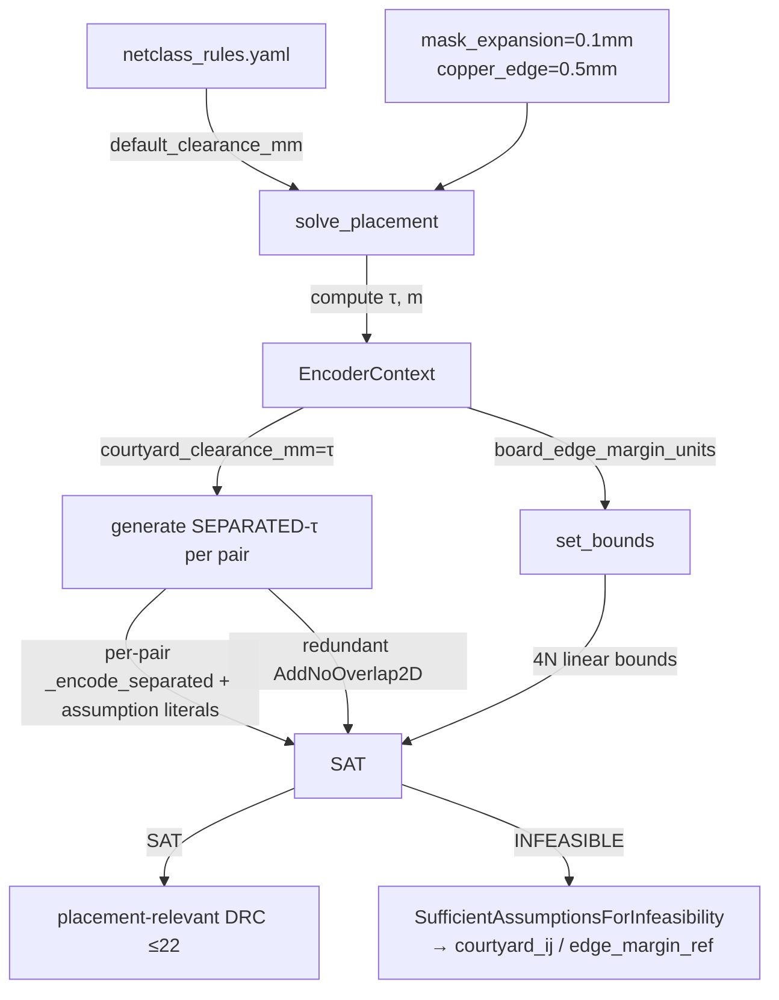

# feat: Per-Pair SEPARATED-τ + Board-Edge Margin for CP-SAT

## Summary

Add two hard constraint classes to the CP-SAT model: per-pair SEPARATED-τ (C1) to eliminate shorting and solder-mask-bridge DRC errors by enforcing a minimum pairwise clearance τ = max(default_clearance, 2·mask_expansion) via the existing `_encode_separated` handler, and board-edge margin (C2) to eliminate copper-edge-clearance violations by shrinking the placement domain by m mm on all four edges. Both are fully hard with UNSAT-core surfacing via per-pair assumption literals. A redundant global `AddNoOverlap2D` on copper intervals accelerates propagation. Soundness is proved and verified by a P1-P7 Hypothesis PBT suite.

Placement-relevant DRC target: ≤22 (human baseline), down from 41 (current CP-SAT).

---

## Problem Frame

The netclass 6mm SEPARATED constraint works (bug fixed in `8c3bc2a3`). 303 cross-class SEPARATED constraints fire; CP-SAT is OPTIMAL in ~2.6s. But placement-relevant DRC is 41 (vs human 22), with the excess entirely in three classes the model does not constrain:

| Violation type | Human | CP-SAT | Cause |
|---|---|---|---|
| shorting_items | 5 | 12 | `NoOverlap2D` runs on raw pad/fab bboxes with zero margin — allows 0-gap touching |
| solder_mask_bridge | 5 | 15 | Same — mask openings merge when boxes touch |
| copper_edge_clearance | 0 | 6 | No board-edge margin — components parked on x=0 |
| **Total** | **22** | **41** | |

(see origin: `docs/brainstorms/2026-07-08-cp-sat-courtyard-edge-constraints-requirements.md`)

---

## Requirements

- **R1 (C1 courtyard).** Generate a `SeparatedConstraint(min_distance_mm=τ)` for every component pair where `τ = max(default_clearance_mm, 2·mask_expansion_mm)`. Encode via the existing `_encode_separated` handler with per-pair `courtyard_<i>_<j>` assumption literals. A redundant global `AddNoOverlap2D` on copper intervals accelerates propagation. SAT ⇒ zero shorting_items and zero solder_mask_bridge.
- **R2 (C2 edge).** Constrain all components to [m, W−m]×[m, H−m] where m = ⌈s·copper_edge_clearance_mm⌉. SAT ⇒ zero copper_edge_clearance violations.
- **R3 (hard + UNSAT surfacing).** Both constraints are fully hard. On INFEASIBLE, `SufficientAssumptionsForInfeasibility()` names the violating class (courtyard pair or edge-margin component) with its physical `because`.
- **R4 (soundness).** Theorem C1 and C2 proved; I1 (pairwise Chebyshev gap ≥ τ) and I2 (all copper boxes within margin bounds) hold at SAT.
- **R5 (PBT).** Hypothesis P1-P7 suite verifies soundness, rotation-invariance, monotonicity, area floor, bounded completeness, determinism.
- **R6 (deterministic unit tests).** Two-component touching → UNSAT at δ>0; component at x=0 → UNSAT at m>0; golden temper board → three DRC classes read 0.
- **R7 (performance).** Both constraints are cheap (C1 changes interval sizes only; C2 adds 4N linear bounds). Regressions in solve status or time are failures.
- **R8 (parameter SSOT).** τ derives from netclass SSOT (`default_clearance_mm`) and board setup (`mask_expansion_mm` fallback). m derives from `copper_edge_clearance_mm` fallback.

**Origin actors:** none specified (model-internal constraints)
**Origin flows:** none specified (encoding pipeline)
**Origin acceptance examples:** none specified (P1-P7 + success criteria substitute)

---

## Scope Boundaries

- Non-rectangular board outlines / cut-outs — out of scope (deferred to keepout-polygon follow-up).
- Parsing real KiCad courtyard layers — out of scope (δ derived from SSOT, robust to missing courtyards).
- Routing-induced shorts — out of scope (placement-level guarantees; router must preserve them, tracked separately).
- Per-pad exact geometry — out of scope (bbox ⊕ margin is conservative and sufficient).
- Per-class δ (pairwise-max clearance) — out of scope per D1 (uniform δ, keep SEPARATED for cross-class).
- kiutils-based extraction of `solder_mask_expansion` or `copper_edge_clearance` from board `(setup)` — out of scope (hardcoded fallbacks 0.1mm / 0.5mm with documented derivation).

### Deferred to Follow-Up Work

- Keepout-polygon formulation for non-rectangular board outlines (replaces C2's axis-aligned rectangle with generalized keepout zones).
- Per-class δ if a future board needs pairwise-max base clearance (revisit D1; weaker per-pair proof).

---

## Context & Research

### Relevant Code and Patterns

- `packages/temper-placer/src/temper_placer/placer/cp_sat/model.py:197` — `add_no_overlap_2d()` constructs `NewIntervalVar(v.x_start, v.x_size, v.x_end)` and calls `AddNoOverlap2D`. C1 modifies the interval construction (size +2δ) before `NewIntervalVar`.
- `packages/temper-placer/src/temper_placer/placer/cp_sat/model.py:389` — `set_bounds(x_min, y_min, x_max, y_max)` adds 4 linear bounds per component. C2 modifies the call site in `encoder.py:784` to use margin values instead of zeros.
- `packages/temper-placer/src/temper_placer/placer/cp_sat/encoder.py:46` — `EncoderContext` carries `board_x_max_units`, `board_y_max_units`. New fields: `courtyard_clearance_mm`, `board_edge_margin_units`.
- `packages/temper-placer/src/temper_placer/placer/cp_sat/encoder.py:738` — `solve_placement()` constructs `EncoderContext`, calls `set_bounds`, and dispatches constraint encoding. Parameter plumbing entry point.
- `packages/temper-placer/src/temper_placer/placer/cp_sat/model.py:266` — `new_assumption(label)` registers assumption literals for UNSAT surfacing. C1/C2 use labels `courtyard_<i>_<j>` and `edge_margin_<ref>`.
- `packages/temper-placer/src/temper_placer/placer/cp_sat/model.py:351` — `SufficientAssumptionsForInfeasibility()` in `solve()`. Already wired; new constraint labels surface automatically.
- `packages/temper-placer/src/temper_placer/io/netclass_loader.py:40` — `dr.default_clearance = data["default_clearance_mm"]` (0.2mm). Source for τ's default_clearance.
- `packages/temper-placer/tests/pcl/test_keepout_pbt.py` — Canonical Hypothesis PBT pattern. `@st.composite` strategies, `@given`, `@settings(max_examples=50, deadline=30000)`.

### Institutional Learnings

- **cp-sat-constraint-encoder-greenfield**: Every handler must wire its constraint to `OnlyEnforceIf(assumption)` for UNSAT-core extraction. C1's per-pair SEPARATED-τ already produces `sep_{id}_{ra}_{rb}` literals via `_encode_separated`; C2's bounds register one per component.
- **cp-sat-midpoint-constraint-parity-bug**: `x_size` must be even (parity lock: `x_start + x_end == 2 * x_center`). Inflation `+2δ` preserves evenness (2δ is always even in units). Add an invariant test verifying this.
- **two-tier-acceptance-gate-unsat-surfacing**: Handle `UNKNOWN` solver status correctly in MUS refinement. The `SufficientAssumptionsForInfeasibility()` path is already correct in `model.py:351`.
- **hypothesis-invariant-test-suite-pattern**: Four-layer test structure: shared strategies → theorem classes → per-class test files → CI integration. Extend `test_placement_invariants.py` pattern rather than creating parallel files.
- **place-route-loop-feedback-constraint-deltas**: Delta deduplication by `constraint.id`. No auto-loosening of physics-grounded constraints. C1/C2 are hard — no relax path.

### External References

- None required — the codebase has strong local patterns for CP-SAT constraint encoding, Hypothesis PBT, and UNSAT surfacing.

---

## Key Technical Decisions

- **C1 via per-pair SEPARATED-τ, not inflated NoOverlap2D.** The CP-SAT global `NoOverlap2D` cannot carry per-pair enforcement literals (`OnlyEnforceIf` doesn't apply to global constraints). The existing `_encode_separated` handler (`encoder.py:87`) already produces the 4-Boolean Chebyshev disjunction with per-pair `sep_{id}_{ra}_{rb}` literals. C1 reuses this: generate a `SeparatedConstraint(min_distance_mm=τ)` for every pair. A redundant global `AddNoOverlap2D` on copper intervals accelerates propagation (proven tractable at N=33, all-pairs = 528). (see origin: D1 revision)
- **C2 reuses `set_bounds` with margin, not a new handler.** `set_bounds` already adds `x_start >= min`, `x_end <= max` per component — the C2 encoding is exactly that call with nonzero min and reduced max. No new handler dispatch needed.
- **Parameters hardcoded with documented derivation.** `mask_expansion_mm = 0.1` (industry-standard solder mask expansion), `copper_edge_clearance_mm = 0.5` (conservative default). Both are documented in the code with a TODO to parse from board `(setup)` via kiutils. The SSOT `default_clearance_mm` flows through the existing netclass pipeline.
- **Even-parity preservation.** `2δ` is always even in integer units (δ is integer via `ceil`, 2δ is even). Inflation adds `+2δ` → result is even when original `x_size` is even. The existing `mm_to_units` already enforces evenness; an invariant test guards against regression.
- **PBT strategy: new file in cp_sat test package with shared strategies.** `tests/placer/cp_sat/test_geometry_constraints_pbt.py` for P1-P7, with reusable Hypothesis strategies in `_strategies.py`. The existing `test_placement_invariants.py` is JAX-era code on the retirement path — coupling new CP-SAT PBT to it would create a dependency on a subsystem being deleted. The shared strategy module in the cp_sat directory gives future CP-SAT PBT tests one canonical generator.

---

## Open Questions

### Resolved During Planning

- **Where in the model does C1 encode?** `_encode_separated` at `encoder.py:87` — the existing handler produces the 4-Boolean Chebyshev disjunction with per-pair assumption literals. C1 auto-generates `SeparatedConstraint(min_distance_mm=τ)` for every pair.
- **Where does C2 add edge bounds?** `encoder.py:784` — change `set_bounds(0, 0, W, H)` to `set_bounds(m, m, W−m, H−m)`.
- **How do parameters flow?** Through `EncoderContext` (new fields `courtyard_clearance_mm`, `board_edge_margin_units`), computed in `solve_placement()` from `default_clearance_mm` (SSOT) and hardcoded `mask_expansion_mm`, `copper_edge_clearance_mm` fallbacks.
- **What assumption labels for UNSAT?** C1: `courtyard_<i>_<j>` (one per NoOverlap2D call, already labeled). C2: `edge_margin_<ref>` (one per component, new). Both follow existing `new_assumption()` pattern.

### Deferred to Implementation

- Exact PBT strategy generation (component count, board size distribution) — tuned during implementation to balance coverage vs wall-clock time.
- Hardcoded parameter values (0.1mm mask, 0.5mm edge) — may need adjustment after first temper board run.
- Whether the constraint generation should auto-deduplicate dominated pairs (both 6mm cross-class and τ same-class SEPARATED on the same pair — keep only the stronger 6mm).

---

## High-Level Technical Design

> *This illustrates the intended approach and is directional guidance for review, not implementation specification. The implementing agent should treat it as context, not code to reproduce.*

**C1 encoding (per-pair SEPARATED-τ):**
- Generate `SeparatedConstraint(min_distance_mm=τ_mm)` for every component pair via the existing `_encode_separated` handler
- Each pair carries a `courtyard_<i>_<j>` assumption literal (the handler's existing `sep_{id}_{ra}_{rb}` pattern)
- Cross-class pairs that already have a 6mm SEPARATED are deduplicated (the τ one is dominated)
- Redundant global `AddNoOverlap2D` on copper intervals for propagation strength

**C2 encoding (in `set_bounds`):** Already exists. Call site changes from `(0, 0, W, H)` to `(m, m, W−m, H−m)`.

---

## Implementation Units

### U1. Extend EncoderContext with new fields and compute δ, m in solve_placement

**Goal:** Add `courtyard_clearance_mm` and `board_edge_margin_units` fields to `EncoderContext`, compute them from SSOT + hardcoded fallbacks in `solve_placement`, and pass through to the model.

**Requirements:** R8 (parameter SSOT)

**Dependencies:** None

**Files:**
- Modify: `packages/temper-placer/src/temper_placer/placer/cp_sat/encoder.py`
- Test: `packages/temper-placer/tests/placer/cp_sat/test_courtyard_edge.py`

**Approach:**
- Add `courtyard_clearance_mm: float` and `board_edge_margin_units: int` to `EncoderContext` (default 0 for backward compatibility).
- In `solve_placement()`, compute `τ_mm = max(default_clearance_mm, 2 * 0.1)` and `m_units = model.mm_to_units(0.5)`.
- Read `default_clearance_mm` from the already-loaded netclass rules (if available) or fall back to `0.2`.
- Document the hardcoded fallbacks with explanatory comments and TODO markers.

**Patterns to follow:**
- `packages/temper-placer/src/temper_placer/placer/cp_sat/encoder.py:802` — existing `EncoderContext` construction in `solve_placement`.

**Test scenarios:**
- Happy path: `EncoderContext` with `courtyard_clearance_mm=0.2` and `board_edge_margin_units=50` stores values correctly.
- Happy path: With `default_clearance_mm=0.2`, `τ_mm = max(0.2, 0.2) = 0.2`.
- Edge case: Without netclass rules loaded (`default_clearance_mm` not available), falls back to 0.2mm.
- Edge case: `mm_to_units` produces even output — assert `mm_to_units(0.5) % 2 == 0`.

**Verification:**
- `EncoderContext` carries the new fields; `solve_placement` computes them from SSOT + fallbacks.

---

### U2. Generate per-pair SEPARATED-τ constraints + redundant NoOverlap2D

**Goal:** Generate a `SeparatedConstraint(min_distance_mm=τ)` for every component pair via the existing `_encode_separated` handler, with a redundant global `AddNoOverlap2D` for propagation strength.

**Requirements:** R1 (C1 courtyard), R4 (soundness), R6 (deterministic tests)

**Dependencies:** U1

**Files:**
- Modify: `packages/temper-placer/src/temper_placer/placer/cp_sat/encoder.py`
- Test: `packages/temper-placer/tests/placer/cp_sat/test_courtyard_edge.py`

**Approach:**
- In `solve_placement()`, generate a `SeparatedConstraint` for every pair of components with `min_distance_mm = τ_mm` (where `τ_mm = max(default_clearance_mm, 2 * mask_expansion_mm)` from U1).
- Existing cross-class SEPARATED constraints at 6mm are dominated by the weaker τ and can be merged or deduplicated (a pair with both a 6mm and a τ·mm SEPARATED only needs the 6mm one).
- Encode via the existing `_encode_separated` handler — each pair carries its own `courtyard_<i>_<j>` assumption literal (the handler already produces per-pair literals).
- Register a redundant global `AddNoOverlap2D` on the copper intervals for propagation acceleration (proven tractable at N=33).

**Execution note:** The existing `_encode_separated` handler at `encoder.py:87` already produces per-pair `sep_{id}_{ra}_{rb}` assumption literals via `OnlyEnforceIf`. No new encoding infrastructure needed — this is a generation/wiring task, not a new constraint type.

**Patterns to follow:**
- `packages/temper-placer/src/temper_placer/placer/cp_sat/encoder.py:87` — `_encode_separated` handler with per-pair assumption literals.
- `packages/temper-placer/src/temper_placer/placer/cp_sat/netclass_constraints.py` — `generate_netclass_separated_constraints` pattern for auto-generating constraint lists.

**Test scenarios:**
- Happy path: Two 2×2mm components with `τ_mm = 0.2` → UNSAT at zero gap, SAT when separated by ≥0.2mm.
- Happy path: 528 pairs generated for 33 components (all-pairs). Deduplication: cross-class pairs that already have a 6mm SEPARATED skip the τ one.
- Edge case: Single component — no SEPARATED-τ generated (not a pair).
- Edge case: `τ_mm = 0` → no SEPARATED constraints generated.

**Verification:**
- Covers P1 (soundness): min Euclidean gap ≥ τ_mm for all Hypothesis-generated instances.

---

### U3. Apply board-edge margin in set_bounds call

**Goal:** Pass `board_edge_margin_units` from `EncoderContext` to the `set_bounds()` call in `solve_placement`.

**Requirements:** R2 (C2 edge), R4 (soundness), R6 (deterministic tests)

**Dependencies:** U1

**Files:**
- Modify: `packages/temper-placer/src/temper_placer/placer/cp_sat/encoder.py`
- Test: `packages/temper-placer/tests/placer/cp_sat/test_courtyard_edge.py`

**Approach:**
- Change `model_wrapper.set_bounds(0, 0, board_w_units, board_h_units)` to `model_wrapper.set_bounds(margin_units, margin_units, board_w_units - margin_units, board_h_units - margin_units)`.
- The `set_bounds` method (already at `model.py:389`) does not need modification — it already constrains all registered components.

**Patterns to follow:**
- `packages/temper-placer/src/temper_placer/placer/cp_sat/encoder.py:784` — existing `set_bounds` call.

**Test scenarios:**
- Happy path: Component with edge at exactly `margin_units` → SAT.
- Happy path: Component with edge at `margin_units - 1` → UNSAT (violates edge clearance).
- Edge case: m=0 (no margin, existing behavior) → SAT for all placements within board.
- Integration: C1 and C2 together — placement respects both inflated NoOverlap and edge margin.

**Verification:**
- Covers P2 (soundness): min distance to board edge ≥ m mm for all Hypothesis-generated instances.
- Deterministic test: component at x=0 with m>0 → UNSAT.

---

### U4. Register UNSAT assumption literals for C1 and C2

**Goal:** Ensure C1's NoOverlap2D assumption literal and C2's per-component edge-margin assumptions are labeled for `SufficientAssumptionsForInfeasibility()` to identify.

**Requirements:** R3 (UNSAT surfacing)

**Dependencies:** U2, U3

**Files:**
- Modify: `packages/temper-placer/src/temper_placer/placer/cp_sat/model.py`
- Modify: `packages/temper-placer/src/temper_placer/placer/cp_sat/encoder.py`
- Test: `packages/temper-placer/tests/placer/cp_sat/test_courtyard_edge.py`

**Approach:**
- C1: Per-pair SEPARATED-τ already produces per-pair `sep_{id}_{ra}_{rb}` literals via `_encode_separated`. For clarity in UNSAT cores, the constraint IDs should use `courtyard_<ref_a>_<ref_b>` naming. No new model.py changes needed for C1 assumptions — the handler already wires `OnlyEnforceIf` per pair.
- C2: `set_bounds` currently adds constraints without assumption literals. Add `new_assumption(f"edge_margin_{ref}")` per component and wrap the four bounds with `OnlyEnforceIf`. The existing `OnlyEnforceIf` mechanism (`AddNoOverlap2D` already uses it at model.py:220) can be replicated for linear bounds.
- The UNSAT extraction in `model.py:351` (`SufficientAssumptionsForInfeasibility`) automatically picks up the new assumption labels.

**Patterns to follow:**
- `packages/temper-placer/src/temper_placer/placer/cp_sat/model.py:220` — `OnlyEnforceIf` pattern for NoOverlap2D.
- `packages/temper-placer/src/temper_placer/placer/cp_sat/model.py:351` — existing UNSAT extraction.

**Test scenarios:**
- Happy path: Over-constrained model (δ too large, board too small) → INFEASIBLE → UNSAT core contains `courtyard_no_overlap_2d` or `edge_margin_<ref>` label.
- Happy path: Sufficiently large board + small δ → SAT → no UNSAT core.
- Edge case: Only C1 causes infeasibility → core contains courtyard label, not edge margin.
- Integration: UNSAT core surfacing via `CpSatPlacementResult.unsat_core` includes the new labels.

**Verification:**
- Over-constrained instance produces UNSAT core with identifiable constraint class labels.
- SAT instance produces no false UNSAT core.

---

### U5. PBT suite P1-P7

**Goal:** Implement the Hypothesis property-based test suite verifying soundness, rotation-invariance, monotonicity, area floor, bounded completeness, and determinism.

**Requirements:** R4 (soundness), R5 (PBT)

**Dependencies:** U2, U3, U4

**Files:**
- Create: `packages/temper-placer/tests/placer/cp_sat/test_geometry_constraints_pbt.py`
- Create: `packages/temper-placer/tests/placer/cp_sat/_strategies.py` (shared Hypothesis strategies for CP-SAT geometry tests)
- Modify: `packages/temper-placer/tests/placer/cp_sat/test_courtyard_edge.py` (deterministic tests)

**Approach:**
- Shared strategies in `_strategies.py`: `component_sizes()`, `board_dimensions()`, `tau_and_margin()`, `placements_with_rotations()`. These are reusable by future CP-SAT PBT tests in the same directory.
- P1 (soundness C1): `@given` placement with known τ → solver SAT → extract positions/sizes → compute pairwise Euclidean gaps → assert min gap ≥ τ_mm.
- P2 (soundness C2): `@given` placement with known m → solver SAT → compute edge distances → assert min ≥ m/s mm.
- P3 (rotation-invariance): `@given` placements with forced rotations → P1/P2 still hold.
- P4 (monotonicity): `@given` placement → solve with (δ, m) and (δ', m') where δ'≥δ, m'≥m → SAT(δ',m') ⟹ SAT(δ,m).
- P5 (area floor): `@given` components with `Σ(w+2δ)(h+2δ) > (W−2m)(H−2m)` → UNSAT.
- P6 (bounded completeness): N≤3 with hand-constructed clearance ≥ 2δ and margin ≥ m → SAT.
- P7 (determinism): fixed seed + workers=1 → identical placement across runs.

**Patterns to follow:**
- `packages/temper-placer/tests/pcl/test_keepout_pbt.py` — `@st.composite` strategy pattern, `@given`, `@settings(max_examples=50, deadline=30000)`.
- `packages/temper-placer/tests/placer/cp_sat/test_encoder.py` — solver invocation pattern (build model, register components, encode constraints, solve, extract positions).

**Test scenarios:**
- P1: 50 Hypothesis-generated placements with varying δ → all satisfy min gap ≥ 2δ (soundness).
- P2: 50 placements with varying m → all satisfy edge clearance ≥ m.
- P3: 30 placements with forced rotations → rotation-invariant.
- P4: 20 instances → monotonicity holds.
- P5: 20 area-exceeding instances → UNSAT (never false SAT).
- P6: 10 hand-constructed feasible instances → SAT (never false UNSAT).
- P7: 3 runs with same seed → identical placement (regression anchor).

**Verification:**
- `python -m pytest tests/placer/cp_sat/test_courtyard_edge_pbt.py -v --hypothesis-show-statistics` — all 7 properties pass.

---

### U6. Regenerate temper placement and verify DRC target

**Goal:** Run the updated CP-SAT solver on the temper board, verify `shorting_items = 0`, `solder_mask_bridge = 0`, `copper_edge_clearance = 0`, and placement-relevant DRC total ≤ 22.

**Requirements:** R1, R2, R3, R6, R7 — target `shorting_items=0`, `solder_mask_bridge=0`, `copper_edge_clearance=0`, placement-relevant DRC total ≤22, solver regressions are failures.

**Dependencies:** U1-U5

**Files:**
- None (verification step)

**Approach:**
- Run `solve_placement` with the temper board, netclass rules loaded, and the new C1/C2 constraints active.
- Generate output PCB with `_apply_placements_to_pcb` (includes netclass forms).
- Run `kicad-cli pcb drc` on the output PCB.
- Verify `shorting_items`, `solder_mask_bridge`, `copper_edge_clearance` all read 0.
- Verify total placement-relevant DRC errors (excl. `lib_footprint_issues`) ≤ 22.
- Record solve time and status — regressions from current ~2.6s/OPTIMAL are failures.

**Verification:**
- `kicad-cli pcb drc` output shows zero for the three target violation types.
- Placement-relevant total ≤ 22 (human baseline).

---

## System-Wide Impact

- **Interaction graph:** C1 auto-generates per-pair SEPARATED constraints via `_encode_separated` and registers a redundant global `AddNoOverlap2D`. C2 modifies the `set_bounds` call — all component positions respect the margin.
- **Error propagation:** On INFEASIBLE, the UNSAT core names the violating constraint class (courtyard or edge margin). No silent relaxation — the model either satisfies both constraints or reports which failed.
- **State lifecycle:** `EncoderContext` fields are set once in `solve_placement()` and read-only during encoding. No mutable state drift.
- **Unchanged invariants:** Copper intervals (`ComponentVars.x_start`, `.x_size`, `.x_end`) are unchanged — SEPARATED, loop-area, and all other handlers operate on the original geometry. C1 only affects NoOverlap2D. C2 only affects the global bounds.
- **Performance:** C1 changes interval sizes only (cheap). C2 adds 4N linear bounds (cheap, N=33 → 132 bounds). The O(N²) variable count from SEPARATED is unchanged. Expected solve time within existing budget.

---

## Risks & Dependencies

| Risk | Mitigation |
|------|------------|
| Even-parity violation from inflation | `+2δ` preserves evenness; invariant test in U1 guards regression. |
| Over-constraint makes temper board INFEASIBLE | Monotonicity (P4) and area floor (P5) give predictive power. Relax parameters or increase board before hitting solver timeout. |
| UNSAT `UNKNOWN` status misclassified as SAT | `solve()` already handles `INFEASIBLE` vs `UNKNOWN` correctly per the two-tier gate learning. No change needed. |
| Hardcoded fallbacks (0.1mm mask, 0.5mm edge) are wrong for this board | Documented defaults are industry-standard; adjust after first temper run if DRC shows too-conservative or too-permissive. |
| C1's per-pair SEPARATED-τ interacts poorly with cross-class SEPARATED (double-constraint) | C1 uses τ (base same-class clearance + mask). The 6mm cross-class SEPARATED dominates τ on cross-class pairs; those pairs should carry only the cross-class constraint. Dedup by pair during generation. |

---

## Sources & References

- **Origin document:** [docs/brainstorms/2026-07-08-cp-sat-courtyard-edge-constraints-requirements.md](../brainstorms/2026-07-08-cp-sat-courtyard-edge-constraints-requirements.md)
- `packages/temper-placer/src/temper_placer/placer/cp_sat/model.py` — `add_no_overlap_2d`, `set_bounds`, `new_assumption`, `solve`
- `packages/temper-placer/src/temper_placer/placer/cp_sat/encoder.py` — `EncoderContext`, `solve_placement`, `set_bounds` call site
- `packages/temper-placer/src/temper_placer/io/netclass_loader.py` — `default_clearance_mm` SSOT
- Learnings: `docs/solutions/architecture-patterns/cp-sat-constraint-encoder-greenfield-hard-ceiling-2026-07-05.md`
- Learnings: `docs/solutions/logic-errors/cp-sat-midpoint-constraint-parity-bug-2026-07-06.md`
- Learnings: `docs/solutions/architecture-patterns/two-tier-acceptance-gate-unsat-surfacing-2026-07-05.md`
- Learnings: `docs/solutions/best-practices/hypothesis-invariant-test-suite-pattern-2026-06-28.md`
