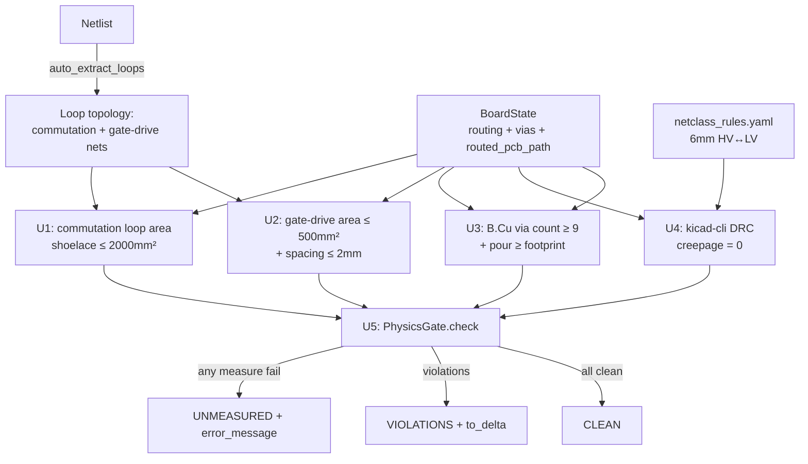

# feat: PhysicsGate — Physics as Routing Constraints (W3)

## Summary

Promote the physics oracle (`packages/temper-placer/src/temper_placer/physics/`) from a passive
metric computer to an enforcing **routing gate**. Implement `PhysicsGate`, a `ROUTING`-stage gate
conforming to the shared gate contract (`docs/brainstorms/2026-07-08-gate-contract.md`), that wraps
four sub-checks on the routed board:

1. **Commutation-loop area** — extract the power-loop polygon from routed traces (via the existing
   `loop_extractor.py:trace_commutation_loop` topology + a new area computation over routed geometry),
   assert `loop_area ≤ 2000 mm²` (R1).
2. **Gate-drive tightness** — measure GATE_H / GATE_L trace-to-return loop area, assert `≤ 500 mm²`
   per loop and edge-to-edge trace-to-return spacing `≤ 2 mm` (R2).
3. **Thermal via checker** — count B.Cu vias under Q1/Q2 footprints, assert `count ≥ 9` per device and
   B.Cu pour area `≥ device footprint area` (R3, new implementation).
4. **Creepage gate** — run `kicad-cli pcb drc` with the netclass 6mm HV↔LV clearance rules, filter to
   creepage/clearance violations, assert `0` (R4).

The gate enforces the contract's three-state measurement discipline: any sub-check whose measurement
cannot be performed (trace extraction fails, kicad-cli exits non-zero, oracle raises) makes the gate
return `UNMEASURED` — never a false `CLEAN`. Violations map to `ConstraintDelta`s the W5 loop can
inject. This is the induction-cooker-critical track: loop inductance, thermal margin, and creepage
become red-on-regression.

---

## Problem Frame

The physics oracle computes thermal (`physics/thermal.py`, `physics/thermal_potential.py`), inductive
(`physics/inductance.py`), EMI (`physics/emi.py`), and safety (`physics/safety.py`) metrics from board
geometry, and loop topology is auto-extracted by `core/loop_extractor.py`. But **none of this feeds
back into routing**. The metrics are "dark" — computed and reported, never enforced as a gate that
blocks a bad route (see learning `wiring-dark-physics-metrics-oracle-2026-07-02`).

A human designer routing an induction-cooker power stage would keep the commutation loop
(DC_BUS+ → Q1 → SW_NODE → Q2 → DC_BUS−) a tight polygon, pair the gate-drive traces with their
returns, drop a thermal via array + B.Cu pour under Q1/Q2, and hold 6mm creepage between HV and LV
copper per IEC 60335-1 Table 16. W3 encodes those four judgments as a single `PhysicsGate` that runs
after routing and reports violations the W5 loop can act on.

Two existing gaps this plan closes:
- **Loop area is measured on bounding boxes / convex hulls, not routed polygons.**
  `validation/trace_analyzer.py:calculate_actual_loop_area` uses a `ConvexHull` proxy — a conservative
  over-estimate, not the actual enclosed polygon. W3 needs the true routed loop area.
- **No post-route thermal via counting exists.** `physics/thermal.py` estimates junction temperature
  from a `copper_area_mm2` scalar; it does not count vias under a footprint or measure B.Cu pour area.
  R3 is a new implementation.

(see origin: `docs/brainstorms/2026-07-08-physics-as-routing-constraints-requirements.md`)

---

## Requirements

- **R1 (commutation-loop area).** Extract the commutation loop polygon from routed traces on the nets
  named by `loop_extractor.py:trace_commutation_loop` (DC+, SW_NODE, DC−). Compute enclosed area.
  Gate: `commutation_loop_area_mm2 ≤ 2000`. Trace extraction failure ⇒ `UNMEASURED`.
- **R2 (gate-drive tightness).** For each of GATE_H (U_GATE→Q1) and GATE_L (U_GATE→Q2), compute the
  routed loop area against its return path. Gate: `gate_drive_loop_area_mm2 ≤ 500` per loop AND
  edge-to-edge trace-to-return spacing `≤ 2 mm` on the same layer.
- **R3 (thermal pour + via array).** Count B.Cu vias falling under each IGBT (Q1, Q2) footprint bbox.
  Gate: `via_count ≥ 9` per device AND B.Cu pour area under the device `≥ device footprint area`.
  New implementation (existing `thermal.py` does not do post-route via counting).
- **R4 (copper creepage ≥ 6mm).** Run `kicad-cli pcb drc` with the netclass SSOT 6mm HV↔LV clearance
  rules already defined in `configs/netclass_rules.yaml`, filter results to creepage/clearance
  violations between HV and LV classes, assert `0`. kicad-cli non-zero exit ⇒ `UNMEASURED`.
- **R5 (gate object).** `PhysicsGate(stage=ROUTING, name="physics")` conforms to the gate contract:
  `check(state: BoardState) -> GateResult` (three-state), `to_delta(v) -> ConstraintDelta | None`.
  Wraps all four sub-checks. Any sub-check measurement failure ⇒ `GateResult(UNMEASURED, error_message=...)`.

**Origin actors:** none specified (routing-internal gate)
**Origin flows:** routed board → PhysicsGate.check → GateResult → W5 loop delta injection
**Origin acceptance examples:** Success Criteria 1–5 in the requirements doc substitute.

---

## Scope Boundaries

- Full thermal FEA — out of scope. Via-count + pour-area are conservative proxies (per requirements).
- EMI certification testing — out of scope. The loop-area ceiling is a design rule, not a cert.
- Per-layer creepage derating for internal layers (IEC 60664-1) — deferred; apply full 6mm on all layers.
- The `Gate`/`GateResult`/`GateStatus`/`Violation`/`BoardState`/`ConstraintDelta` **type definitions**
  are owned by the shared contract (W5 implements the registry + loop orchestration). W3 consumes them.
  If the contract types are not yet materialized in code when W3 lands, U5 defines a thin local shim
  matching the contract signatures, to be replaced by the W5 canonical module.
- W5 loop orchestration (registry, `all_gates_green`, delta injection) — out of scope; W3 only provides
  the gate and its `to_delta` mapping.

### Deferred to Follow-Up Work

- Return-path net identification heuristics beyond the half-bridge topology (multi-phase, full-bridge).
- Non-rectangular / rotated footprint bbox handling for the thermal via checker (use axis-aligned bbox
  of the rotated courtyard for now).

---

## Context & Research

### Relevant Code and Patterns

- `packages/temper-placer/src/temper_placer/core/loop_extractor.py:268` — `trace_commutation_loop`
  returns a `Loop` with `nets=[dc_plus, sw_node, dc_minus]` and the pin path. This gives the **net set**
  that defines the commutation loop; U1 computes the routed-polygon area over those nets.
- `packages/temper-placer/src/temper_placer/core/loop_extractor.py:338` — `trace_gate_drive_loop`
  returns per-switch gate-drive `Loop`s (`LoopType.GATE_DRIVE_HIGH/LOW`, `nets=[gate_net]`). U2 uses
  these to identify the GATE_H / GATE_L nets + return path.
- `packages/temper-placer/src/temper_placer/core/loop_extractor.py:442` — `auto_extract_loops` runs the
  half-bridge detection and returns a `LoopCollection` with commutation + both gate-drive loops. This is
  the single entry point U1/U2 call to get loop topology from the netlist.
- `packages/temper-placer/src/temper_placer/validation/trace_analyzer.py:30` —
  `calculate_actual_loop_area` (ConvexHull proxy). U1 replaces the proxy with a true enclosed-polygon
  area (shoelace over the ordered routed path), keeping the net-filtering pattern.
- `packages/temper-placer/src/temper_placer/validation/trace_analyzer.py:19` —
  `calculate_actual_trace_length` shows the `board.traces` iteration + `trace.net` / `trace.start` /
  `trace.end` access pattern U1/U2 reuse.
- `packages/temper-placer/src/temper_placer/core/loop.py:108` — `LoopEvent.estimated_inductance_nh` and
  `:132 max_area_for_inductance_nh` — the area↔inductance model, if the delta needs an inductance target.
- `packages/temper-placer/src/temper_placer/physics/inductance.py:10` — `estimate_loop_inductance`
  (area + perimeter → nH). Optional: report inductance alongside area in the violation `context`.
- `packages/temper-placer/src/temper_placer/validation/drc_runner.py:162` — `run_drc(pcb_path)` already
  shells out to `kicad-cli pcb drc --format json`, parses JSON, and raises `DrcRunnerError` on failure.
  U4 wraps this: `DrcRunnerError` / non-zero exit ⇒ `UNMEASURED`. `is_kicad_cli_available()` (`:85`)
  gates availability.
- `packages/temper-placer/src/temper_placer/validation/drc_result.py:663` — `safety_creepage` check id
  and `:511 TraceClearanceCheck` — the creepage/clearance violation shapes U4 filters on.
- `packages/temper-placer/configs/netclass_rules.yaml:12` — `ACMains`/`HighVoltage` classes carry
  `creepage_mm: 6.0`; `class_pairs` (`:82`) define the HV↔LV 6mm clearances. This is the SSOT U4 verifies
  the routed board against — U4 does **not** re-derive the number.
- `packages/temper-placer/src/temper_placer/validation/drc_types.py:523` — `Via` and `:539 ViaPlacement`
  (`.vias`, `net_name`, `layer`); `:41 ComponentPlacement.layer` ("F.Cu"/"B.Cu"). U3's via counting
  iterates vias, filters `layer == "B.Cu"` and point-in-footprint-bbox.
- `packages/temper-placer/src/temper_placer/io/kicad_parser.py:746` — `_calculate_footprint_bounds(fp)`
  returns `(width, height)` for a footprint; U3 uses this for the device footprint bbox + area.
- `packages/temper-placer/src/temper_placer/validation/validation_gates.py` — existing `ValidationGate`
  base + `GateResult`/`GateStatus` (a *different*, older PASS/FAIL/SKIP enum). **Do not reuse** — W3
  uses the CLEAN/VIOLATIONS/UNMEASURED contract enum. Noted to avoid the naming collision.
- `packages/temper-placer/src/temper_placer/deterministic/state.py` — `BoardState` (routing pipeline
  state with `.vias`, `.routes`). Cross-check against the contract's `BoardState` fields in U5.

### Institutional Learnings

- **wiring-dark-physics-metrics-oracle-2026-07-02** — the chain-of-proof pattern for activating
  dark physics metrics: TDD + PBT proving the metric is actually consumed, not just computed. W3's
  gate is exactly this activation for loop/thermal/creepage.
- **two-tier-acceptance-gate-unsat-surfacing-2026-07-05** — Chebyshev (bbox) over-estimates disagree
  with Euclidean/routed reality: **measure on the territory.** U1 must compute the true routed polygon
  area, not the convex-hull/bbox proxy. Also: a tool `UNKNOWN`/crash must not be read as pass.
- **place-route-loop-feedback-constraint-deltas-2026-07-05** — deltas dedupe by `constraint.id`; do not
  auto-loosen physics-grounded constraints; some constraint types are silently dropped by the encoder.
  W3's `to_delta` must emit constraint types the encoder actually consumes (verify in U5).
- **The `run_drc` false-zero bug** (cited in the gate contract) — an empty violation list means either
  "clean" or "couldn't measure." U4 must distinguish these: kicad-cli non-zero / missing output ⇒
  `UNMEASURED`, empty parsed violations on exit-0 ⇒ `CLEAN`.

### External References

- IEC 60335-1 Table 16 — HV↔LV working isolation at 400V ⇒ 6mm creepage (already encoded in the SSOT).
- Infineon AN half-bridge IGBT design guide — commutation-loop area rule-of-thumb (cited in R1).
- IPC-2152 — via thermal resistance basis for the 9-via array (cited in R3).

---

## Key Technical Decisions

- **Territory gates, not model gates.** Every sub-check measures the actual routed board: loop area from
  routed trace polygons, via count from placed vias, creepage from `kicad-cli` DRC on the routed
  `.kicad_pcb`. No bbox/convex-hull proxies for the enforced numbers (contract's "verify on the
  territory" invariant; two-tier-acceptance learning).
- **Topology from the netlist, geometry from the route.** `loop_extractor.auto_extract_loops` supplies
  *which nets* form each loop (commutation, gate-drive) from the netlist; the routed geometry supplies
  the *area*. This separation reuses the proven extractor and keeps W3 focused on measurement.
- **True enclosed-polygon area, not convex hull.** U1 orders the routed segments of the loop nets into a
  closed path and applies the shoelace formula. Convex hull (current `trace_analyzer` behavior) is a
  loose upper bound that would false-fail tight-but-nonconvex loops.
- **Reuse `drc_runner.run_drc` for creepage.** It already handles the kicad-cli invocation, JSON parse,
  timeout, and error raising. U4 adds a netclass-rule-injected DRC config + a creepage/clearance filter,
  and maps `DrcRunnerError` → `UNMEASURED`. No second kicad-cli wrapper.
- **PhysicsGate aggregates, sub-checks are pure functions.** Each of the four checks is a standalone,
  independently testable function returning `list[Violation]` or raising a typed measurement error.
  `PhysicsGate.check` orchestrates: first measurement error → `UNMEASURED`; else union of violations →
  `VIOLATIONS` or `CLEAN`. This mirrors the contract's `PhysicsGate` example and keeps each sub-check
  unit-testable in isolation.
- **UNMEASURED is fail-closed and specific.** The `error_message` names which sub-check failed and why
  (e.g. `"creepage: kicad-cli exit 3: <stderr>"`), so the W5 loop can surface it. A partial measurement
  (three checks clean, one crashed) is still `UNMEASURED` — never a mix reported as `VIOLATIONS`.

---

## Open Questions

### Resolved During Planning

- **Where does loop topology come from?** `core/loop_extractor.auto_extract_loops(netlist)` — returns the
  commutation loop (nets DC+/SW/DC−) and both gate-drive loops. W3 does not re-implement topology detection.
- **How is loop area measured?** Shoelace over the ordered routed segments of the loop nets, replacing
  the convex-hull proxy in `trace_analyzer.calculate_actual_loop_area`.
- **How is creepage measured?** `drc_runner.run_drc` on the routed `.kicad_pcb` with the netclass 6mm
  rules, filtered to creepage/clearance HV↔LV violations.
- **Which GateResult/GateStatus?** The contract's CLEAN/VIOLATIONS/UNMEASURED enum — *not* the older
  PASS/FAIL/SKIP enum in `validation_gates.py`. U5 imports from the W5 contract module (or a shim).

### Deferred to Implementation

- Exact ordering algorithm for routed segments into a closed polygon (nearest-endpoint chaining vs. graph
  cycle extraction) — chosen in U1 against real temper routed traces.
- The precise kicad-cli DRC rule-injection mechanism for the 6mm netclass forms (embed `(net_class ...)`
  in the exported PCB vs. a custom `.kicad_dru`) — verify which the routed export already carries.
- Whether `to_delta` for LOOP_INDUCTANCE emits a loop `max_area_mm2` tightening or a re-route hint the
  W5 encoder consumes — depends on the encoder's accepted constraint types (place-route-loop learning).

---

## High-Level Technical Design

> *Directional guidance for review, not implementation specification. The implementing agent should treat
> it as context, not code to reproduce.*

**Sub-check contract (each is a pure function):**
- Returns `list[Violation]` on successful measurement (empty = clean for that check).
- Raises a typed `MeasurementError` when it cannot measure (extraction failed, kicad-cli crashed).
- `PhysicsGate.check` catches `MeasurementError` → `UNMEASURED`; otherwise aggregates violations.

---

## Implementation Units

### U1. Commutation-loop area extraction + LoopInductanceGate sub-check

**Goal:** Extract the commutation loop polygon from routed traces and assert `area ≤ 2000 mm²`, returning
a measurement error (not a false-clean) when extraction fails.

**Requirements:** R1

**Dependencies:** None (topology from existing `loop_extractor`; geometry from `BoardState.routing`)

**Files:**
- Create: `packages/temper-placer/src/temper_placer/physics/loop_area.py` — `compute_commutation_loop_area(routing, netlist)` + shoelace helper + `MeasurementError`.
- Create: `packages/temper-placer/src/temper_placer/physics/physics_checks.py` — `check_commutation_loop(state) -> list[Violation]` sub-check.
- Test: `packages/temper-placer/tests/physics/test_loop_area.py`

**Approach:**
- Call `auto_extract_loops(netlist)` to get the commutation `Loop` (`LoopType.COMMUTATION`); read its
  `nets` (DC+, SW_NODE, DC−).
- Collect routed segments on those nets from `state.routing` (pattern: `trace_analyzer.py:19`).
- Order segment endpoints into a closed path (nearest-endpoint chaining); apply the shoelace formula for
  true enclosed area. Replace the `ConvexHull` proxy in `trace_analyzer.calculate_actual_loop_area` (keep
  that function as a thin wrapper or deprecate in-place).
- If no commutation loop is found, or fewer than 3 orderable points, or the path does not close, raise
  `MeasurementError` — the sub-check must not report `0 mm²` as "clean" (false-zero avoidance).
- `check_commutation_loop`: area > 2000 ⇒ one `Violation(type=LOOP_INDUCTANCE, components=("Q1","Q2","C_BUS1","C_BUS2"), severity=area, threshold=2000, context={"max_area_mm2":2000})`.

**Patterns to follow:**
- `validation/trace_analyzer.py:30` (net-filtered trace collection), `core/loop.py:108` (area→inductance if reporting nH in context).

**Test scenarios:**
- Happy path: synthetic routed loop of known area 1500 mm² → no violation; 2500 mm² → one LOOP_INDUCTANCE violation with `severity=2500`.
- Territory check: a tight non-convex loop whose convex hull > 2000 but true area < 2000 → **no** violation (proves shoelace, not hull).
- Measurement failure: netlist with no half-bridge / no routed loop nets → raises `MeasurementError` (never returns `[]`).
- Boundary: area exactly 2000 → no violation (≤ is inclusive).

**Verification:** `pytest tests/physics/test_loop_area.py -v` — area math, threshold, and fail-closed extraction all pass.

---

### U2. Gate-drive loop tightness sub-check

**Goal:** Measure GATE_H and GATE_L routed loop area against their return paths and assert `≤ 500 mm²`
per loop and trace-to-return edge-to-edge spacing `≤ 2 mm`.

**Requirements:** R2

**Dependencies:** U1 (reuses `loop_area.py` polygon/shoelace helper + `MeasurementError`)

**Files:**
- Modify: `packages/temper-placer/src/temper_placer/physics/loop_area.py` — add `compute_gate_drive_loop_area(routing, netlist, gate_loop)` and `min_trace_to_return_spacing(...)`.
- Modify: `packages/temper-placer/src/temper_placer/physics/physics_checks.py` — `check_gate_drive(state) -> list[Violation]`.
- Test: `packages/temper-placer/tests/physics/test_gate_drive.py`

**Approach:**
- From `auto_extract_loops(netlist)` take the two gate-drive `Loop`s (`GATE_DRIVE_HIGH`, `GATE_DRIVE_LOW`);
  each carries its `gate_net`. Identify the paired return net (driver ground / source-return) from the
  loop's components + pins.
- For each loop: compute routed loop area (U1 shoelace) and the minimum edge-to-edge spacing between the
  gate trace and its return trace on the same layer (segment-to-segment distance, generalizing
  `trace_analyzer.calculate_min_hv_lv_clearance`'s endpoint distance to full segments).
- Emit up to two violation kinds per loop:
  `Violation(LOOP_INDUCTANCE, nets=(gate_net,), severity=area, threshold=500, context={"loop":"GATE_H"})`
  and, if spacing > 2 mm, `Violation(LOOP_INDUCTANCE, severity=spacing, threshold=2.0, context={"metric":"spacing_mm"})`.
- Unmeasurable loop (missing return net, unroutable) ⇒ `MeasurementError`.

**Patterns to follow:**
- `core/loop_extractor.py:338` (`trace_gate_drive_loop` fields), `validation/trace_analyzer.py:61` (min-distance pattern).

**Test scenarios:**
- Happy path: GATE_H loop 300 mm², spacing 1.5 mm → clean; GATE_L loop 600 mm² → one violation (`severity=600`).
- Spacing: gate/return 3 mm apart → spacing violation emitted even when area is within budget.
- Per-loop independence: GATE_H clean, GATE_L over → exactly one area violation, tagged `GATE_L`.
- Measurement failure: gate-drive loop with no identifiable return net → `MeasurementError`.

**Verification:** `pytest tests/physics/test_gate_drive.py -v` — per-loop area + spacing thresholds and fail-closed path pass.

---

### U3. Thermal via checker (new post-route implementation)

**Goal:** Count B.Cu vias under each IGBT footprint and verify `count ≥ 9` and B.Cu pour area
`≥ device footprint area`.

**Requirements:** R3

**Dependencies:** None

**Files:**
- Create: `packages/temper-placer/src/temper_placer/physics/thermal_vias.py` — `count_thermal_vias(state, ref)`, `bcu_pour_area_under(state, ref)`.
- Modify: `packages/temper-placer/src/temper_placer/physics/physics_checks.py` — `check_thermal_vias(state) -> list[Violation]`.
- Test: `packages/temper-placer/tests/physics/test_thermal_vias.py`

**Approach:**
- Identify IGBTs via `loop_extractor.find_power_switches(netlist)` (returns the Q1/Q2 components).
- For each device: compute its footprint bbox (`io/kicad_parser.py:746 _calculate_footprint_bounds` +
  placement x/y/rotation → axis-aligned bbox of the rotated courtyard).
- Count vias with `layer == "B.Cu"` (through-vias touching B.Cu) whose center falls inside the bbox
  (`drc_types.py:523 Via`, `ViaPlacement.vias` / `state.vias`).
- Measure B.Cu copper pour/zone area overlapping the bbox (from `state.board` zones on B.Cu).
- Emit: `count < 9` ⇒ `Violation(VIA_COUNT, components=(ref,), severity=count, threshold=9)`;
  `pour_area < footprint_area` ⇒ `Violation(THERMAL, components=(ref,), severity=pour_area, threshold=footprint_area, context={"metric":"pour_area_mm2"})`.
- No vias/zones data available at all (unrouted, missing geometry) ⇒ `MeasurementError` (distinguish
  "measured 0 vias on a routed board" — a real violation — from "no routing to measure" — unmeasured).

**Patterns to follow:**
- `deterministic/stages/via_validation.py:72` (via iteration), `validation/drc_types.py:539` (ViaPlacement), `io/kicad_parser.py:746` (footprint bounds).

**Test scenarios:**
- Happy path: 9 B.Cu vias inside Q1 bbox + pour ≥ footprint → clean; 8 vias → VIA_COUNT violation (`severity=8`).
- Layer filter: 9 vias present but on F.Cu only → VIA_COUNT violation (B.Cu count 0).
- Pour: 9 vias but B.Cu pour area < footprint → THERMAL violation.
- Per-device: Q1 has 9, Q2 has 6 → exactly one VIA_COUNT violation tagged Q2.
- Measurement failure: routed state with no via collection at all → `MeasurementError`.

**Verification:** `pytest tests/physics/test_thermal_vias.py -v` — count, layer filter, pour area, per-device, fail-closed all pass.

---

### U4. Creepage gate via kicad-cli DRC

**Goal:** Verify the routed board respects the netclass 6mm HV↔LV clearance via `kicad-cli pcb drc`,
returning `UNMEASURED` when kicad-cli fails.

**Requirements:** R4

**Dependencies:** None (reuses `drc_runner.run_drc`)

**Files:**
- Create: `packages/temper-placer/src/temper_placer/physics/creepage.py` — `check_creepage(state) -> list[Violation]` wrapping `drc_runner.run_drc` + creepage/clearance filter.
- Test: `packages/temper-placer/tests/physics/test_creepage.py`

**Approach:**
- Require `state.routed_pcb_path`; if `None` or missing ⇒ `MeasurementError` ("no routed PCB to DRC").
- Ensure the exported PCB carries the netclass 6mm forms (from `configs/netclass_rules.yaml`
  `class_pairs`); the gate **verifies**, it does not re-derive the 6mm number (SSOT is authoritative).
- Call `drc_runner.run_drc(state.routed_pcb_path)`. Catch `DrcRunnerError` (kicad-cli non-zero, missing
  output, timeout) ⇒ `MeasurementError` → propagates to `UNMEASURED` (the run_drc false-zero fix, elevated
  to the contract invariant).
- Filter parsed violations to creepage/clearance between HV classes (`ACMains`, `HighVoltage`,
  `HighCurrent`) and LV classes; each ⇒ `Violation(CREEPAGE, nets=(...), severity=measured_mm, threshold=6.0, context={"required_mm":6.0})`.
- Exit-0 with no creepage violations ⇒ `[]` (clean).

**Patterns to follow:**
- `validation/drc_runner.py:162` (`run_drc`, `DrcRunnerError`, `is_kicad_cli_available`), `validation/drc_result.py:663` (`safety_creepage` id).

**Test scenarios:**
- Happy path (mocked run_drc): zero clearance violations → `[]`; one HV↔LV at 4mm → one CREEPAGE violation (`severity=4.0`, `threshold=6.0`).
- UNMEASURED: `run_drc` raises `DrcRunnerError` → `MeasurementError` (asserted via `PhysicsGate` → UNMEASURED in U5).
- False-zero guard: kicad-cli non-zero exit / no JSON → `MeasurementError`, **not** `[]`.
- Filter: an LV↔LV clearance warning present → not reported (only HV↔LV creepage counts).

**Verification:** `pytest tests/physics/test_creepage.py -v` — filter, threshold, and fail-closed behavior pass.

---

### U5. PhysicsGate object — contract conformance + delta mapping

**Goal:** Implement `PhysicsGate` wrapping the four sub-checks, conforming to the gate contract's
three-state discipline and `to_delta` mapping; any sub-check measurement failure ⇒ `UNMEASURED`.

**Requirements:** R5 (and integration of R1–R4)

**Dependencies:** U1, U2, U3, U4

**Files:**
- Create: `packages/temper-placer/src/temper_placer/physics/physics_gate.py` — `class PhysicsGate` + `to_delta`.
- Modify: `packages/temper-placer/src/temper_placer/physics/__init__.py` — export `PhysicsGate`.
- Test: `packages/temper-placer/tests/physics/test_physics_gate.py`

**Approach:**
- Import the contract types (`Gate`, `GateResult`, `GateStatus`, `GateStage`, `Violation`, `ViolationType`,
  `BoardState`, `ConstraintDelta`) from the W5 contract module. If that module does not yet exist in code,
  define a thin local shim matching the contract signatures and mark it `# TODO(W5): replace with canonical module`.
- `stage = GateStage.ROUTING`, `name = "physics"`.
- `check(state)`: run the four sub-checks in order inside a `try`; the first `MeasurementError` ⇒
  `GateResult(UNMEASURED, error_message=f"{check_name}: {e}")`. Otherwise aggregate all violations:
  non-empty ⇒ `GateResult(VIOLATIONS, tuple(violations))`, else `GateResult(CLEAN)`.
- `to_delta(v)`: map violation types to constraint deltas the W5 encoder actually consumes
  (place-route-loop learning — verify accepted types; emit `None` for a violation with no corrective
  delta, e.g. a creepage violation routing cannot fix without re-placement). LOOP_INDUCTANCE ⇒ tighten
  the relevant loop `max_area_mm2`; VIA_COUNT/THERMAL ⇒ thermal-via/pour delta or `None` if placement-owned.
- Do not mutate `state` (contract: all gates receive the same immutable `BoardState`).

**Patterns to follow:**
- Gate contract `PhysicsGate` example (contract §Gate Examples), `DrcGate.to_delta` mapping pattern.

**Test scenarios:**
- All clean → `GateResult(CLEAN, ())`.
- Loop over budget → `GateResult(VIOLATIONS,...)` containing the LOOP_INDUCTANCE violation.
- One sub-check raises `MeasurementError` (e.g. creepage kicad-cli fail) while others are clean →
  `GateResult(UNMEASURED)` with an `error_message` naming the creepage check — **never** CLEAN or VIOLATIONS.
- Multiple violation types (loop + via_count + creepage) → all present in `violations` tuple.
- `to_delta`: LOOP_INDUCTANCE → non-None loop-area-tightening delta; a placement-only violation → `None`.
- Immutability: `check` does not mutate the passed `BoardState`.

**Verification:** `pytest tests/physics/test_physics_gate.py -v` — three-state aggregation, UNMEASURED precedence, and delta mapping pass. `uv run python scripts/import_linter_gate.py` passes (no boundary violations).

---

## System-Wide Impact

- **Interaction graph:** `PhysicsGate` is a leaf consumer — it reads `BoardState` (routing, vias, board,
  netlist, `routed_pcb_path`) and produces a `GateResult`. It calls into `core/loop_extractor`
  (topology), the new `physics/loop_area`, `physics/thermal_vias`, `physics/creepage`, and
  `validation/drc_runner`. It is registered by the W5 loop (out of scope here).
- **Error propagation:** measurement failures fail-closed to `UNMEASURED` with a specific `error_message`;
  the W5 loop treats `UNMEASURED` as blocking (never green). No silent `[]`.
- **State lifecycle:** `PhysicsGate.check` is pure over `BoardState` — no mutation, no hidden global state.
- **Unchanged invariants:** the physics oracle's existing metric functions (`inductance.py`, `thermal.py`,
  `emi.py`, `safety.py`) are untouched; W3 adds enforcement modules alongside them. `trace_analyzer`'s
  convex-hull proxy is superseded by the true-polygon area (U1) but the function signature is preserved.
- **Performance:** loop/via/spacing checks are O(segments) / O(vias) — cheap. The creepage check shells
  out to kicad-cli (~seconds, `run_drc` 60s timeout) — the dominant cost, run once per routing gate pass.

---

## Risks & Dependencies

| Risk | Mitigation |
|------|------------|
| Routed segments don't chain into a clean closed polygon (branches, stubs) | U1 uses nearest-endpoint chaining with a closure tolerance; unclosable path ⇒ `MeasurementError`, not a bogus area. Tested against real temper routed traces. |
| Convex-hull vs. true-area regression re-introduced | U1 territory test: non-convex loop with hull > 2000 but true area < 2000 must pass. |
| kicad-cli absent / crashes in CI | `is_kicad_cli_available()` guard; `DrcRunnerError` → `UNMEASURED`. Creepage tests mock `run_drc` so they don't require kicad-cli. |
| False-zero: kicad-cli exit-0 with no report read as "clean" | U4 requires the JSON output to exist; missing output ⇒ `MeasurementError` (the exact `run_drc` false-zero fix). |
| `to_delta` emits a constraint type the W5 encoder silently drops | Verify accepted constraint types against the encoder (place-route-loop-feedback learning); emit `None` rather than a dropped delta. |
| Contract types not yet in code when W3 lands | U5 ships a thin shim matching the contract signatures, `# TODO(W5)` to replace with the canonical module. |
| Rotated / non-rectangular IGBT footprints mis-bbox the via count | Use axis-aligned bbox of the rotated courtyard; non-rectangular handling deferred (scope boundary). |
| **W0/W1/W2/W5 dependencies** (router build, single-layer route, 4-layer stackup, compound loop) | R3 (B.Cu pour) and return-path checks assume the W2 stackup; W3 gate consumption assumes the W5 loop. Land W3 behind those; sub-checks are independently unit-testable with synthetic `BoardState`s meanwhile. |

---

## Sources & References

- **Origin document:** [docs/brainstorms/2026-07-08-physics-as-routing-constraints-requirements.md](../brainstorms/2026-07-08-physics-as-routing-constraints-requirements.md)
- **Gate contract:** [docs/brainstorms/2026-07-08-gate-contract.md](../brainstorms/2026-07-08-gate-contract.md)
- `packages/temper-placer/src/temper_placer/core/loop_extractor.py` — `trace_commutation_loop`, `trace_gate_drive_loop`, `find_power_switches`, `auto_extract_loops`
- `packages/temper-placer/src/temper_placer/physics/{inductance,thermal,thermal_potential,emi,safety}.py` — existing oracle metrics
- `packages/temper-placer/src/temper_placer/validation/trace_analyzer.py` — routed-trace area/length/clearance (convex-hull proxy superseded by U1)
- `packages/temper-placer/src/temper_placer/validation/drc_runner.py` — `run_drc`, `DrcRunnerError`, `is_kicad_cli_available`
- `packages/temper-placer/src/temper_placer/validation/drc_types.py` — `Via`, `ViaPlacement`, `ComponentPlacement`
- `packages/temper-placer/configs/netclass_rules.yaml` — 6mm HV↔LV creepage SSOT
- Learnings: `docs/solutions/architecture-patterns/wiring-dark-physics-metrics-oracle-2026-07-02.md`
- Learnings: `docs/solutions/architecture-patterns/two-tier-acceptance-gate-unsat-surfacing-2026-07-05.md`
- Learnings: `docs/solutions/architecture-patterns/place-route-loop-feedback-constraint-deltas-2026-07-05.md`
