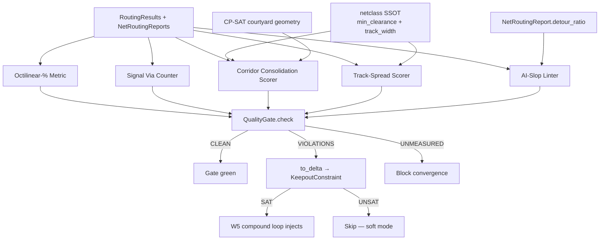

# feat: Human-Like Routing Quality Gate (W4) — Octilinear, Via Budget, Corridor, Slop Linting

## Summary

Implement the W4 quality gate — four post-route checks that operationalize "looks human-made":
1. **Octilinear metric:** % of track length at 45°/135° (diagonal). Gate: ≥70%.
2. **Via-count ceiling:** signal vias (excl. thermal/stitching) ≤100.
3. **Corridor consolidation + track-spread:** tracks sharing a channel are co-routed (score ≥0.7) and not unnecessarily sparse (score ≤1.5).
4. **AI-slop linter:** post-route detection of hairpin turns, zigzag patterns, isolated vias, and single-net detours. Gate: returns 0.

All four sub-checks are wrapped in a `QualityGate` conforming to the gate contract (`Gate`, `GateResult`, `GateStatus`, `Violation`). The gate is post-route only (`GateStage.ROUTING`). Slop-detected `UNSAT`-surfaced `KeepoutConstraint`s are soft (skip on UNSAT). Numeric thresholds are provisional — calibrate against the human golden board.

---

## Problem Frame

A human PCB designer follows implicit layout-quality rules that produce "clean" boards: tracks run at 45°, vias are used sparingly, parallel tracks are grouped into neat corridors, and routing doesn't wander across open board areas. AI-generated routing often produces "slop" — orthogonal-only tracks, excessive vias, spaghetti corridors, and tracks that detour across empty board for no reason. These don't affect DRC or electrical performance, but they affect manufacturability, inspectability, and trust.

The existing A* pathfinder (`astar_core.py:189`) already iterates all 8 directions unconditionally — diagonal routing is supported but not incentivized. The existing diagnostics infrastructure (`diagnostics.py`, `NetRoutingReport.detour_ratio`) provides partial measurement capability. This plan adds the missing metric functions and wraps them in a `QualityGate` conforming to the gate contract.

---

## Requirements

- **R1 (Octilinear routing).** Compute the fraction of track length at 45° or 135° (diagonal) vs. 0° or 90° (orthogonal). Gate: ≥70% diagonal. Raise diagonal share via a diagonal cost incentive or post-route rectification pass.
- **R2 (Via-count ceiling).** Count signal vias, excluding thermal and stitching vias. Gate: ≤100. Extend `human_reference_extractor.py` to compute the human baseline for calibration.
- **R3 (Corridor consolidation).** Define channel = rectangular gap between component courtyards >3 track widths. Define co-routed = two adjacent tracks in a channel with no foreign interleave. Score = (# co-routed pairs) / (# pairs sharing a channel). Gate: ≥0.7.
- **R4 (Track-spread).** Compute target spacing = `min_clearance + track_width` from netclass SSOT. Score = (max gap between adjacent tracks in a channel) / (target spacing). Gate: ≤1.5.
- **R5 (AI-slop linter).** Post-route detection of four artifact classes:
  - Hairpin turn: a track segment reversing direction within one grid cell (≥160° turn).
  - Zigzag pattern: 3+ consecutive alternating direction changes, excluding hairpin reversals.
  - Isolated via: a via with only one connected segment (stub).
  - Single-net detour: route_length / direct_distance > 1.5 (uses existing `diagnostics.detour_ratio`).
  Gate: linter returns 0 OR the offending region is constrained by a `KeepoutConstraint` that the loop could not satisfy (UNSAT-surfaced).
- **R6 (Gate contract conformance).** `QualityGate` implements `Gate` with `stage=GateStage.ROUTING`, a three-state `check()` returning `GateResult`, and `to_delta()` mapping violations to `ConstraintDelta`. `UNMEASURED` is returned when measurement cannot be performed (not treated as `CLEAN`).

**Origin actors:** post-route quality checker (no placement/routing inputs)
**Origin flows:** post-route measurement → gate check → delta feedback into W5 compound loop

---

## Scope Boundaries

- Curved/arc routing — out of scope (octilinear is sufficient).
- Differential-pair routing quality (W2 R6) — out of scope.
- Via tenting, solder mask expansion, silkscreen — out of scope.
- Feedback into the compound loop (W5) — deferred to W5; this plan defines the detection gates; W5 defines the constraint-delta feedback via `to_delta()`.
- Unnecessary layer switches detection — removed from spec (not reliably detectable post-route without pre-route layer-assignment intent).
- Pre-route constraint injection — this is a post-route gate only. The router operates without W4 constraints; the gate detects post-hoc.

---

## Context & Research

### Relevant Code and Patterns

- `packages/temper-placer/src/temper_placer/router_v6/astar_core.py:189` — A* already iterates 8 directions unconditionally. The work is (a) measuring diagonal share and (b) incentivizing diagonals via cost or post-route rectification.
- `packages/temper-placer/src/temper_placer/router_v6/diagnostics.py:126` — `NetRoutingReport.detour_ratio = route_length / direct_distance`. Existing field, used directly by R5's single-net detour check.
- `packages/temper-placer/src/temper_placer/router_v6/path_simplify.py` — `simplify_path()` removes collinear waypoints. Post-simplification path is the natural input for octilinear-%, hairpin, and zigzag detection.
- `packages/temper-placer/src/temper_placer/router_v6/corridor.py` — `extract_corridor_mask()` produces boolean masks for routing corridors. Channel geometry concepts (courtyard gaps, track widths) are the foundation for R3/R4 channel definitions.
- `packages/temper-placer/src/temper_placer/router_v6/channel_widths.py:30` — `ChannelWidths` with node/edge width measurements. Channel width thresholds (>3 track widths) can be derived from these measurements.
- `packages/temper-placer/src/temper_placer/router_v6/routing_results.py:34` — `RoutingResults` with `compiled_routes: dict[str, CompiledRoute]`. Each `CompiledRoute` carries `path` (grid cells), `vias`, and `width_mm`. Primary input for all W4 metrics.
- `packages/temper-placer/src/temper_placer/validation/human_reference_extractor.py:217` — `_compute_routing_metrics()` extracts `via_count` and `rdl` from parsed traces/vias. R2 extends this with signal-vs-thermal/stitching classification and octilinear-%, corridor, and track-spread metrics.
- `packages/temper-placer/src/temper_placer/deterministic/state.py:32` — existing `BoardState` (deterministic pipeline). The W4 gate receives a post-route `BoardState` with `RoutingResults` and `BottleneckAnalysis`.
- `docs/brainstorms/2026-07-08-gate-contract.md` — authoritative definition of `Gate`, `GateResult`, `GateStatus`, `GateStage`, `Violation`, `ViolationType`, `ConstraintDelta`, and `BoardState` (gate-contract version). The W4 `QualityGate` implements this interface.

### Institutional Learnings

- **two-tier-acceptance-gate-unsat-surfacing**: Gates return three-state results (`CLEAN` / `VIOLATIONS` / `UNMEASURED`). An empty violation list on a measurement tool crash must return `UNMEASURED`, not `CLEAN`. The W5 loop treats `UNMEASURED` as blocking.
- **cp-sat-constraint-encoder-greenfield-hard-ceiling**: Every constraint must wire to an assumption literal for UNSAT-core extraction. The slop linter (R5) surfaces keepout UNSAT via `to_delta()` → `KeepoutConstraint`; if the loop can't satisfy it, the delta is skipped (soft mode).
- **hypothesis-invariant-test-suite-pattern**: Four-layer test structure: shared strategies → per-check test files → CI integration. W4 metric functions are pure functions on grid-path data — Hypothesis PBT tests soundness efficiently.

### External References

- None required — the codebase has strong local patterns for post-route metrics and gate integration.

---

## Key Technical Decisions

- **Octilinear-% is computed on simplified paths, not raw A* output.** `simplify_path()` already collapses collinear waypoints into start-to-end segments with fixed direction. Running the octilinear-% measurement on the simplified path gives the correct segment-length decomposition without double-counting intermediate grid cells.
- **Diagonal cost incentive, not post-route rectification, is the primary mechanism.** The A* cost function already applies `1.414` for diagonals vs `1.0` for cardinals (`astar_core.py:196`). Lowering the diagonal cost factor (e.g., `1.2` instead of `1.414`) incentivizes diagonals without a separate rectification pass. A post-route rectification pass is kept as a secondary option if cost tuning alone is insufficient.
- **Via classification reuses the existing net-classification module.** Thermal vias connect to GND/PGND planes and are in thermal-pad footprints. Stitching vias connect plane layers with no signal net. Signal vias are the remainder. The `net_classification.py` module (`is_ground_net`, `is_power_net`) provides the classification basis.
- **Channel definition reuses courtyard geometry from the CP-SAT model.** Component courtyards are the copper bbox + clearance margin already computed in `EncoderContext.courtyard_clearance_mm`. The gap between two courtyards wider than 3·(track_width + min_clearance) is a channel. This ties R3/R4 channel detection to the same SSOT used by the placer.
- **Slop linter is pure post-route, no router modification.** The linter reads the completed `RoutingResults` and `NetRoutingReport` list. It does not inject constraints into the router. The `to_delta()` method produces `KeepoutConstraint` deltas that W5's compound loop may inject as placement constraints for re-placement.
- **All numeric thresholds are provisional — calibrate against the human golden board.** The gate thresholds (70% diagonal, 100 vias, 0.7 consolidation, 1.5 spread) are starting values. The W1 implementation includes extending `human_reference_extractor.py` to compute these metrics on the human golden board. Final thresholds are calibrated from those measurements.

---

## Open Questions

### Resolved During Planning

- **Where do channel definitions come from?** Component courtyards from the CP-SAT model's `EncoderContext` (copper bbox + `courtyard_clearance_mm`). The channel = gap between two courtyards wider than 3·(track_width + min_clearance).
- **How is track width / target spacing obtained?** From `NetRoutingReport`'s `width_mm` (already assigned per net via `TraceWidthAssignment`) and `DesignRules.min_clearance` from the netclass SSOT.
- **How are vias classified as signal vs. thermal/stitching?** Thermal vias are in thermal-pad footprints (identified by pad type/name pattern). Stitching vias connect plane nets (GND/PGND) and have no signal routing purpose. Signal vias are all others.
- **How does `to_delta()` work for slop violations?** Each slop artifact maps to a `KeepoutConstraint` at the offending region. W5's compound loop may inject these as placement constraints. If the CP-SAT solver returns UNSAT for the keepout, the delta is skipped (soft mode).
- **What happens when `detour_ratio` is infinity?** `NetRoutingReport.detour_ratio` is `float('inf')` when not computed. The single-net detour check treats `inf` as `UNMEASURED` — the gate returns `GateResult(UNMEASURED)` with a descriptive error.

### Deferred to Implementation

- Exact diagonal cost factor (1.2 vs 1.3 vs 1.0) — tuned during implementation to achieve ≥70% diagonal while preserving routability.
- Post-route rectification pass — implemented only if cost tuning alone cannot raise diagonal share above the 70% threshold.
- Human golden board calibration values — computed during W1 implementation of the extended `human_reference_extractor.py`; final gate thresholds derived from those measurements.
- Keepout constraint shape and size — determined empirically from the spatial extent of each slop artifact.

---

## High-Level Technical Design

> *This illustrates the intended approach and is directional guidance for review, not implementation specification. The implementing agent should treat it as context, not code to reproduce.*



**Key flow:**
1. Post-route, the W4 `QualityGate.check()` receives `RoutingResults` + `NetRoutingReport` list.
2. Four metric functions run independently, each producing either a score value or a list of slop artifacts.
3. Each metric is compared against its threshold; violations are packaged as `Violation(violation_type=SLOP | VIA_COUNT | ...)`.
4. `GateResult` is returned with the appropriate three-state status.
5. For violations, `to_delta()` maps each to a `KeepoutConstraint` (or returns `None` for un-actionable violations). W5 handles the soft/skip semantics.

---

## Implementation Units

### U1. Octilinear Segregation Metric + Diagonal Cost Incentive

**Goal:** Compute the fraction of total track length at 45° or 135° (diagonal) vs. 0° or 90° (orthogonal), and raise diagonal share above 70% via a diagonal cost incentive in the A* cost function.

**Requirements:** R1

**Dependencies:** None (metric runs on post-simplification paths)

**Files:**
- Create: `packages/temper-placer/src/temper_placer/router_v6/quality/__init__.py`
- Create: `packages/temper-placer/src/temper_placer/router_v6/quality/octilinear.py`
- Modify: `packages/temper-placer/src/temper_placer/router_v6/astar_core.py` (cost incentive — diagonal cost factor configurable)
- Test: `packages/temper-placer/tests/router_v6/test_quality_octilinear.py`

**Approach:**
- Implement `octilinear_fraction(path: list[GridCell]) -> float` that runs on the simplified path (output of `simplify_path()`):
  - For each consecutive cell pair on the same layer, classify direction: `dx != 0 and dy != 0` → diagonal (45°/135°), else → orthogonal (0°/90°).
  - Accumulate Euclidean length per segment (diagonal cost: `sqrt(2)·cell_size`, cardinal cost: `1.0·cell_size`).
  - Return diagonal_length / total_length.
- Add a configurable `diagonal_cost_factor` to the A* cost function (currently hardcoded `1.414` at `astar_core.py:196`). The factor is exposed as a module-level or context parameter (default 1.2 to incentivize diagonals, adjustable down to 1.0 for max incentive).
- The metric function is pure — it takes a path (list of grid-cell tuples or `CompiledRoute.path`) and returns a float in [0.0, 1.0].
- Edge case: single-segment paths (no direction change) — metric is well-defined (0.0 or 1.0).
- Edge case: layer transitions (vias) — segments across layer transitions are excluded from the fraction denominator (they are neither diagonal nor cardinal tracks).

**Patterns to follow:**
- `packages/temper-placer/src/temper_placer/router_v6/path_simplify.py` — `simplify_path()` cell-traversal pattern. Octilinear classification runs on the same simplified cell list.
- `packages/temper-placer/src/temper_placer/router_v6/diagnostics.py:274` — `calculate_routing_score()` pure-function pattern.

**Test scenarios:**
- Happy path: Straight diagonal path (dx=dy at every step) → `octilinear_fraction = 1.0`.
- Happy path: Straight orthogonal path (dx=0 or dy=0 at every step) → `octilinear_fraction = 0.0`.
- Happy path: Mixed path with 3 diagonal cells, 2 cardinal → ~0.68 (3·√2 / (3·√2 + 2)).
- Edge case: Path with layer transitions → via segments excluded, fraction computed on in-layer segments only.
- Edge case: Single-cell path → fraction = 0.0 (no segments).

**Verification:**
- `octilinear_fraction()` returns correct values on hand-constructed paths.
- Configuring `diagonal_cost_factor=1.0` on the temper board raises diagonal share above the current baseline. Baseline and delta are recorded.
- If baseline is already ≥70%, no cost incentive change is needed — only the metric function is added.

---

### U2. Signal Via Counting (Excluding Thermal and Stitching Vias)

**Goal:** Count signal vias on the routed board, excluding thermal vias (in thermal-pad footprints) and stitching vias (connecting plane nets). Gate: signal via count ≤100.

**Requirements:** R2

**Dependencies:** None (runs on `RoutingResults.compiled_routes`)

**Files:**
- Create: `packages/temper-placer/src/temper_placer/router_v6/quality/via_count.py`
- Modify: `packages/temper-placer/src/temper_placer/validation/human_reference_extractor.py` (extend `_compute_routing_metrics` with signal-via classification)
- Test: `packages/temper-placer/tests/router_v6/test_quality_via_count.py`

**Approach:**
- Implement `count_signal_vias(routing_results: RoutingResults) -> tuple[int, list[Via], list[Via], list[Via]]` returning `(signal_count, signal_vias, thermal_vias, stitching_vias)`:
  - Iterate all `CompiledRoute.vias` across all nets in `routing_results.compiled_routes`.
  - Classify each via:
    - **Thermal via:** via is in a footprint pad whose type/name indicates thermal pad (e.g., `pad.type == "thermal"` or pad name contains "thermal"/"PAD"). Via net is typically GND/PGND.
    - **Stitching via:** via connects a plane net (GND, VCC, PGND) and is not in a component footprint. These are board-level stitching vias for EMI/layer connectivity.
    - **Signal via:** all remaining vias.
  - Via net classification reuses `net_classification.py` (`is_ground_net`, `is_power_net`).
- Extend `human_reference_extractor.py._compute_routing_metrics()`:
  - Add fields `signal_via_count`, `thermal_via_count`, `stitching_via_count` to the output metrics dict.
  - Classification logic is identical to `via_count.py` (shared via module import, not copy-paste).
  - This provides the human baseline for threshold calibration.
- Edge case: board with zero vias → all counts 0.
- Edge case: all vias are thermal → signal count 0.

**Patterns to follow:**
- `packages/temper-placer/src/temper_placer/router_v6/net_classification.py` — `is_ground_net()`, `is_power_net()` for net-level classification.
- `packages/temper-placer/src/temper_placer/validation/human_reference_extractor.py:217` — `_compute_routing_metrics()` extraction pattern.

**Test scenarios:**
- Happy path: Board with 50 signal vias, 10 thermal, 5 stitching → signal count 50.
- Happy path: Board with 0 signal vias (all vias are thermal/stitching) → signal count 0.
- Edge case: Empty via list → (0, [], [], []).
- Edge case: Via on a net classified as both power and signal (should not happen; power nets get power classification).
- Integration: `human_reference_extractor` produces signal via count for the human golden board. Recorded value used to calibrate the ≤100 threshold.

**Verification:**
- `count_signal_vias` returns correct classification on hand-constructed via lists.
- Human golden board signal via count is measured and documented.
- The ≤100 gate threshold is confirmed as reasonable against the human measurement.

---

### U3. Corridor Consolidation + Track-Spread Metrics

**Goal:** Define and implement the corridor consolidation score (R3) and track-spread score (R4). Both operate on post-route track geometry and channel definitions derived from component courtyards.

**Requirements:** R3, R4

**Dependencies:** None (runs on `RoutingResults` + component courtyard geometry)

**Files:**
- Create: `packages/temper-placer/src/temper_placer/router_v6/quality/corridor.py`
- Modify: `packages/temper-placer/src/temper_placer/validation/human_reference_extractor.py` (extend with corridor + track-spread metrics)
- Test: `packages/temper-placer/tests/router_v6/test_quality_corridor.py`

**Approach:**
- Implement three functions:

  1. **`identify_channels(components: list[Courtyard], track_width_mm: float, min_clearance_mm: float) -> list[Channel]`:**
     - A `Channel` is a rectangular gap region between two component courtyards where the gap width > 3·(track_width_mm + min_clearance_mm).
     - `Courtyard` = component copper bbox expanded by `courtyard_clearance_mm` (from CP-SAT U1 `EncoderContext`).
     - Channels are identified by pairwise courtyard gap analysis: for each pair of overlapping projections (x or y), compute the gap in the orthogonal axis. Gaps > threshold are channels.
     - Returns list of `Channel` objects: `(region: Rect, gap_width_mm: float, component_a: str, component_b: str)`.

  2. **`corridor_consolidation_score(routing_results: RoutingResults, channels: list[Channel]) -> float`:**
     - For each channel, enumerate all track pairs that share the channel (both tracks pass through the channel region).
     - A pair is **co-routed** if the two tracks' y-positions (for vertical channels) or x-positions (for horizontal channels) are adjacent with no foreign-net track between them.
     - Score = `len(co_routed_pairs) / len(all_pairs_in_channel)`.
     - If a channel has <2 tracks, it contributes no pairs (excluded from denominator).
     - If no channels have ≥2 tracks, return 1.0 (vacuously consolidated).
     - Gate: score ≥ 0.7.

  3. **`track_spread_score(routing_results: RoutingResults, channels: list[Channel], target_spacing_mm: float) -> float`:**
     - For each channel, sort tracks by position in the channel's cross-axis.
     - Compute the maximum gap between adjacent track edges (track edge = track center ± track_width/2).
     - Track-spread score = `max_gap_mm / target_spacing_mm`.
     - `target_spacing_mm = min_clearance_mm + track_width_mm` from netclass SSOT (`DesignRules`).
     - Gate: score ≤ 1.5.

- Extend `human_reference_extractor.py` with `corridor_consolidation_score` and `track_spread_score` in `_compute_routing_metrics()`. The extraction reuses the same metric functions from `quality/corridor.py`.

- Edge case: board with no channels (components too close, all gaps <3 track widths) → consolidation score 1.0 (vacuously satisfied), track-spread score 0.0 (no tracks to spread).
- Edge case: single track in a channel → consolidation score 1.0 (no pairs), track-spread score 0.0 (no gaps).

**Patterns to follow:**
- `packages/temper-placer/src/temper_placer/router_v6/corridor.py` — `extract_corridor_mask()` for region-based track grouping.
- `packages/temper-placer/src/temper_placer/router_v6/channel_widths.py:30` — `ChannelWidths` measurement pattern with node/edge gap computation.
- `packages/temper-placer/src/temper_placer/core/design_rules.py` — `DesignRules` for `min_clearance` and trace width from netclass SSOT.

**Test scenarios:**
- Happy path: 3 tracks in a channel, 2 adjacent pairs are same-net, 1 pair has a foreign track between → score = 1/3.
- Happy path: 2 tracks in a channel, adjacent with no interleave → score = 1.0.
- Happy path: Track-spread with tracks at exactly target spacing → score = 1.0.
- Happy path: Tracks clustered tightly with a large gap elsewhere → score > 1.5.
- Edge case: Channel wider than 3·width but no tracks routed through it → no pairs, score 1.0.
- Edge case: All gaps between courtyard pairs < 3·(track_width + clearance) → no channels, scores 1.0 / 0.0.

**Verification:**
- `corridor_consolidation_score` returns correct values on hand-constructed channels + track lists.
- `track_spread_score` returns correct values.
- Human golden board scores are measured and documented for threshold calibration.

---

### U4. AI-Slop Pattern Linter

**Goal:** Implement post-route detection of four slop artifact classes: hairpin turns, zigzag patterns, isolated vias, and single-net detours. The linter returns a list of `SlopArtifact` objects. Gate: empty list OR artifacts are UNSAT-covered by keepout constraints.

**Requirements:** R5

**Dependencies:** U1 (shares simplified-path iteration pattern), U2 (shares via iteration)

**Files:**
- Create: `packages/temper-placer/src/temper_placer/router_v6/quality/slop_linter.py`
- Test: `packages/temper-placer/tests/router_v6/test_quality_slop_linter.py`

**Approach:**
- Define `SlopArtifact` dataclass:
  ```python
  @dataclass(frozen=True)
  class SlopArtifact:
      artifact_type: str  # "hairpin", "zigzag", "isolated_via", "single_net_detour"
      net_name: str
      position: tuple[float, float]  # (x, y) in mm
      severity: float  # deviation value (angle_deg, alternation_count, detour_ratio)
      description: str
  ```

- Implement four detection functions, each taking a `CompiledRoute` (or equivalent path + via data) and returning `list[SlopArtifact]`:

  1. **Hairpin detection (`detect_hairpins`):**
     - Iterate consecutive cell triples in the simplified path.
     - Compute the turn angle: `angle(incoming_vector, outgoing_vector)`.
     - If angle ≥ 160° within one grid cell → hairpin artifact.
     - Grid cell size is determined from the routing grid resolution (from `RoutingSpace`).

  2. **Zigzag detection (`detect_zigzags`):**
     - Iterate consecutive direction changes (5+ cells).
     - A zigzag is 3+ consecutive alternating direction changes (e.g., E→NE→E→NE→E) with no obstacle between them.
     - Hairpin reversals (≥160°) are excluded from the alternation count.
     - Obstacle check: no component pad or keepout zone exists between the alternating segments (verified against the occupancy grid or obstacle map).

  3. **Isolated via detection (`detect_isolated_vias`):**
     - Iterate all vias in `CompiledRoute.vias`.
     - A via is isolated if it has exactly one connected track segment (stub — the via terminates in a pad or dead-ends).
     - Check: count incident path segments at the via's grid cell. Segment count = 1 → isolated.

  4. **Single-net detour detection (`detect_single_net_detours`):**
     - Read `NetRoutingReport.detour_ratio` for each net.
     - If `detour_ratio > 1.5` → artifact.
     - If `detour_ratio` is `inf` (not computed) → `UNMEASURED` (handled by the gate).

- Implement `lint_slop(routing_results: RoutingResults, net_reports: list[NetRoutingReport]) -> list[SlopArtifact]` that runs all four detectors and returns the concatenated list.

- Edge case: empty routing results → empty artifact list.
- Edge case: path with <3 cells → no hairpin or zigzag possible.
- Edge case: via at the exact start/end of a path → not isolated (it's a pad connection).

**Patterns to follow:**
- `packages/temper-placer/src/temper_placer/router_v6/path_simplify.py:11` — `is_collinear()` for segment-direction computation.
- `packages/temper-placer/src/temper_placer/router_v6/diagnostics.py:126` — `detour_ratio` field access pattern.
- `packages/temper-placer/src/temper_placer/router_v6/routing_results.py:23` — `CompiledRoute` for path + via data access.

**Test scenarios:**
- Happy path: Path that turns 180° in one cell → 1 hairpin detected.
- Happy path: Path that alternates NE→E→NE→E→NE (5 changes) → 1 zigzag detected (3+ alternations).
- Happy path: Path that alternates NE→E→NE (only 2 changes) → no zigzag (below 3-alternation threshold).
- Happy path: Via with 2 incident segments → not isolated.
- Happy path: Via with 1 incident segment → isolated via artifact.
- Happy path: Net with `detour_ratio = 2.0` → single-net detour artifact.
- Happy path: Net with `detour_ratio = 1.2` → no artifact.
- Edge case: Path with <3 cells → no artifacts.
- Edge case: `detour_ratio = inf` → `UNMEASURED` surfaced by gate (not in artifact list).

**Verification:**
- `detect_hairpins`, `detect_zigzags`, `detect_isolated_vias`, `detect_single_net_detours` all return correct artifacts on hand-constructed inputs.
- `lint_slop` aggregates correctly.
- The combined linter returns 0 artifacts on a clean board.

---

### U5. QualityGate Integration — Gate Contract Conformance + W5 Wiring

**Goal:** Wrap U1-U4 metric functions into a `QualityGate` that conforms to the gate contract (`Gate`, `GateResult`, `GateStatus`, `Violation`). Register for W5 loop integration.

**Requirements:** R6 (gate contract conformance)

**Dependencies:** U1, U2, U3, U4 (all metric/linter functions must exist)

**Files:**
- Create: `packages/temper-placer/src/temper_placer/router_v6/quality/gate.py`
- Modify: `packages/temper-placer/src/temper_placer/router_v6/quality/__init__.py` (public exports)
- Test: `packages/temper-placer/tests/router_v6/test_quality_gate.py`

**Approach:**
- Implement `QualityGate(Gate)` per the gate contract:
  ```python
  class QualityGate(Gate):
      stage: GateStage = GateStage.ROUTING
      name: str = "quality"

      def check(self, state: BoardState) -> GateResult:
          ...
      def to_delta(self, violation: Violation) -> ConstraintDelta | None:
          ...
  ```

- **`check()` implementation:**
  1. Extract `RoutingResults` and `NetRoutingReport` list from `state`.
  2. If either is missing or `None` → return `GateResult(UNMEASURED, error_message="Routing results not available")`.
  3. Run U1-U4 checks:
     - `octi = octilinear_fraction(combined_paths)` → if `octi < 0.70` → `Violation(type=SLOP, severity=octi, threshold=0.70, description=...)`.
     - `sig_vias, _, _, _ = count_signal_vias(routing_results)` → if `sig_vias > 100` → `Violation(type=VIA_COUNT, severity=sig_vias, threshold=100, description=...)`.
     - `corr = corridor_consolidation_score(...)` → if `corr < 0.70` → `Violation(type=SLOP, severity=corr, threshold=0.70, description=...)`.
     - `spread = track_spread_score(...)` → if `spread > 1.5` → `Violation(type=SLOP, severity=spread, threshold=1.5, description=...)`.
     - `artifacts = lint_slop(...)` → if `len(artifacts) > 0` → one `Violation(type=SLOP)` per artifact class, with the artifact list in `context`.
  4. If any check throws an exception → catch, return `GateResult(UNMEASURED, error_message=f"Check X failed: {e}")`.
  5. If no violations → `GateResult(CLEAN)`.
  6. If violations → `GateResult(VIOLATIONS, violations=tuple(violations))`.

- **`to_delta()` implementation:**
  - For `VIA_COUNT` violations → return `None` (not fixable by placement deltas; this is a routing-parameter issue).
  - For `SLOP` violations with `artifact_type` context → produce a `KeepoutConstraint` at the artifact location:
    ```python
    ConstraintDelta(
        constraint=KeepoutConstraint(
            region=Circle(center=artifact.position, radius_mm=2.0),
        ),
        reason=f"Slop artifact at net {artifact.net_name}: {artifact.description}",
    )
    ```
  - The W5 loop treats slop keepout deltas as soft — if the CP-SAT solver returns UNSAT for the keepout, the delta is skipped rather than blocking convergence.

- **`ViolationType` extension:** Add `VIA_COUNT` to the gate contract's `ViolationType` enum (in the gate contract shared module). Reuse existing `SLOP` for all slop-related violations.

- **Gate registration:** Add `QualityGate` to the W5 gate registry (in the future W5 `PlaceRouteLoop.gates` list). This plan does not implement W5 — it provides the `QualityGate` class that W5 registers.

**Patterns to follow:**
- `docs/brainstorms/2026-07-08-gate-contract.md` — Gate interface definition, `GateResult`, `GateStatus`, `Violation`, `ConstraintDelta`.
- `docs/brainstorms/2026-07-08-gate-contract.md:101` — `DrcGate` example: three-state check pattern, exception → `UNMEASURED`.
- `docs/brainstorms/2026-07-08-gate-contract.md:127` — `PhysicsGate` example: exception handling, violation construction.

**Test scenarios:**
- Happy path: `check()` with clean board (all scores within thresholds, 0 slop artifacts) → `GateResult(CLEAN)`.
- Happy path: `check()` with diagonal share 50% → `GateResult(VIOLATIONS)` with one octilinear violation.
- Happy path: `check()` with 120 signal vias → `GateResult(VIOLATIONS)` with one via-count violation.
- Happy path: `check()` with 3 hairpins → `GateResult(VIOLATIONS)` with slop violation(s).
- Edge case: `check()` with missing `RoutingResults` → `GateResult(UNMEASURED)`.
- Edge case: `check()` with exception in octilinear computation → `GateResult(UNMEASURED)` with error message.
- Edge case: `to_delta()` on VIA_COUNT violation → returns `None`.
- Edge case: `to_delta()` on SLOP hairpin violation → returns `KeepoutConstraint` at artifact position.

**Verification:**
- `QualityGate` conforms to the gate contract interface (`stage`, `name`, `check()`, `to_delta()`).
- `check()` returns correct three-state results across all edge cases.
- `to_delta()` produces valid `ConstraintDelta` objects for slop artifacts.
- The gate can be instantiated and called with a post-route `BoardState` from the deterministic pipeline.

---

## System-Wide Impact

- **New module:** `router_v6/quality/` — namespace package for W4 metric functions and the `QualityGate`. Does not modify the routing pipeline, only reads its output.
- **New `ViolationType`:** `VIA_COUNT` added to the gate contract's enum. `SLOP` reused for all slop-artifact violations.
- **A* cost function:** `diagonal_cost_factor` is a configurable parameter, default 1.414 (existing behavior). Changing it requires no router pipeline changes — it's a constant in `astar_core.py`. The W4 gate does not set this value; it measures the resulting diagonal share.
- **`human_reference_extractor.py` extension:** New metrics (`signal_via_count`, `octilinear_fraction`, `corridor_consolidation_score`, `track_spread_score`) added to extraction output. The extraction logic is in `quality/` modules, imported by the extractor — no copy-paste.
- **No router modification:** All W4 checks are pure post-route. The gate does not inject constraints into the router.
- **W5 integration:** `QualityGate.to_delta()` produces `KeepoutConstraint` objects. W5's compound loop handles the soft/skip semantics for UNSAT keepouts. This plan does not implement W5.
- **Unchanged invariants:** All existing routing stages, the A* pathfinder, and the diagnostic pipeline are unchanged. W4 adds read-only measurement on top.

---

## Risks & Dependencies

| Risk | Mitigation |
|------|------------|
| Diagonal cost incentive lowers routability | Make the cost factor configurable; if routability degrades, revert to 1.414 and accept lower diagonal share. The gate is a quality measure, not a hard routing constraint. |
| Channel definition from courtyards is imprecise (courtyards don't perfectly reflect routing channels) | Start with pairwise courtyard gap analysis. If gaps don't match actual routing channels, refine with obstacle-map-based channel extraction in a follow-up. |
| Via classification (thermal vs. stitching vs. signal) is unreliable without footprint metadata | Thermal pad identification via pad name pattern matching is conservative (false negatives are safe — they just over-count signal vias). Document the classification logic for review. |
| Slop linter false positives (normal routing patterns flagged as "slop") | Hairpin threshold (160°) and zigzag minimum (3 alternations) are conservative. Start with these values; if false positives block clean boards, raise thresholds. |
| `detour_ratio = inf` causes UNMEASURED on boards that are otherwise clean | The gate correctly returns `UNMEASURED` — this is a measurement gap, not a false failure. The fix is to ensure `NetRoutingReport` always computes `detour_ratio` for routed nets. |
| Gate contract module not yet implemented (Gate, GateResult, etc. are specs, not code) | Implement `QualityGate` against the contract interface. If the shared gate module doesn't exist yet, create a provisional `quality/gate_types.py` that W1-W5 can later consolidate into a single `gates.py`. |

---

## Sources & References

- **Origin document:** [docs/brainstorms/2026-07-08-human-like-routing-quality-requirements.md](../brainstorms/2026-07-08-human-like-routing-quality-requirements.md)
- **Gate contract:** [docs/brainstorms/2026-07-08-gate-contract.md](../brainstorms/2026-07-08-gate-contract.md)
- `packages/temper-placer/src/temper_placer/router_v6/astar_core.py:189` — 8-direction A* iteration
- `packages/temper-placer/src/temper_placer/router_v6/diagnostics.py:126` — `NetRoutingReport.detour_ratio`
- `packages/temper-placer/src/temper_placer/router_v6/path_simplify.py` — path simplification for metric input
- `packages/temper-placer/src/temper_placer/router_v6/routing_results.py` — `RoutingResults`, `CompiledRoute`
- `packages/temper-placer/src/temper_placer/router_v6/corridor.py` — corridor mask extraction
- `packages/temper-placer/src/temper_placer/router_v6/channel_widths.py` — channel width measurement
- `packages/temper-placer/src/temper_placer/router_v6/net_classification.py` — net class identification
- `packages/temper-placer/src/temper_placer/validation/human_reference_extractor.py` — human baseline extraction
- `packages/temper-placer/src/temper_placer/core/design_rules.py` — netclass SSOT for spacing
- Learnings: `docs/solutions/architecture-patterns/two-tier-acceptance-gate-unsat-surfacing-2026-07-05.md`
- Learnings: `docs/solutions/best-practices/hypothesis-invariant-test-suite-pattern-2026-06-28.md`
