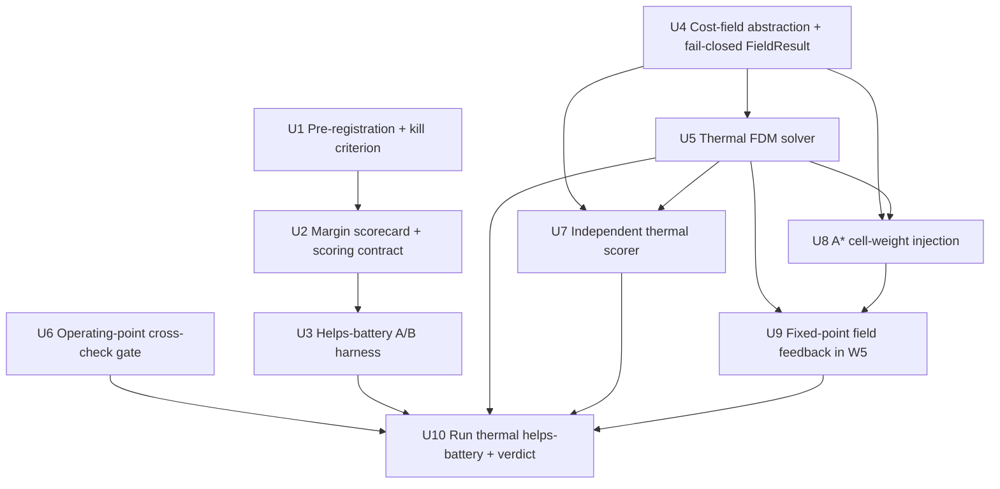

# feat: Physics-Informed Placement & Routing — Thermal Cost Field + Validation Discipline

## Summary

Build the **validation discipline first** (pre-registration, margin scorecard, independent-instrument scoring, controlled A/B helps-battery with a kill criterion), then build **exactly one soft cost field** — thermal — wire it into A* routing as additive cell weights and into the W5 loop as continuous fixed-point state, and let a pre-registered A/B decide whether it beats a cheap heuristic. The deliverable is the harness that can *kill* the field, not the field itself; generalization to other fields is out of scope until thermal earns it.

---

## Problem Frame

The recurring failure of this project is a green signal that measured a model instead of reality (the 121→0 default-clearance miss, the vacuous 6mm, weak-NoOverlap2D shorts that passed every model-level check, the single-seed results error). A physics field is the *most* prone to this class of failure: a field solve produces a rich, physical-looking number that is easy to trust and hard to falsify. This plan therefore treats "does the field help?" as an experiment to be pre-registered and potentially failed, not a feature to be shipped. Full motivation, the three-role architecture, and the K/H claim taxonomy live in the origin document (see Sources & References).

---

## Requirements

- R1. Physics enters in three distinct roles — **hard constraint**, **soft cost field**, **verification gate** — and the roles are never conflated in code or config. *(origin §2)*
- R2. Absolute limits are sourced from standards/datasheets and encoded as **hard** constraints; soft/lexicographic machinery is reserved for the genuinely-soft residual (wirelength, manufacturability, human-like), never for the physics. *(origin §2, §5)*
- R3. A reusable **soft cost-field layer** is built as additive A* cell weights (CP-SAT placement zone penalties deferred — see Scope Boundaries). *(origin §4.1)*
- R4. "**Works**" is proven as five separable claims: K1 solver-correct, K2 geometry-faithful, K3 integration-correct, K4 deterministic, K5 fail-closed. *(origin §6.1)*
- R5. "**Helps**" is proven as seven separable claims: H1 improves target margin, H2 regresses no other gate, H3 beats the cheap-heuristic baseline, H4 causal/controlled, H5 robust across perturbations, H6 scored by an independent instrument, H7 acceptable cost. *(origin §6.2)*
- R6. "Helps" is scored as a **continuous margin delta** (°C, nH, dB, mV), never as a pass-count delta. *(origin §6.3)*
- R7. The pass bar **and** kill criterion are **pre-registered before building** and the harness is *able* to conclude "the cheap heuristic captures the benefit; delete the field." *(origin §6.4)*
- R8. In-box (sim-only) mode is honestly bounded: borrow externally-validated territory, sweep both parametric **and structural** uncertainty, shrink the claim to "safe under modeled assumptions," and defer physical measurement to a power-on trigger before energizing a mains board. *(origin §7; review finding on structural error)*
- R9. **Thermal is the only field** built in this plan; other fields, the custom inductance solver, and FastHenry are generalized only if thermal earns it. *(origin §8, §9)*
- R10. The field gate is **fail-closed**: on non-convergence/export failure it emits `UNMEASURED` (loud, blocks convergence) and never silently substitutes a flat/zero field. *(origin §6.1 K5)*
- R11. An **operating-point cross-check** (coupled-load bounding, guarding SPICE circularity) gates the helps-battery; a wrong operating point must not silently propagate into every ceiling. *(origin §5; review finding, applied to origin §5)*
- R12. The place→field→route→field **fixed point** carries continuous field state across W5 rounds with a continuous-field convergence tripwire (not only ±0.1mm position equality). *(origin §4.3; review finding F1)*

**Origin flows:** place → field(guessed copper) → route → field(real copper) → re-place/route → iterate *(fidelity gradient, origin §4.3)*
**Origin acceptance examples:** the Tier 0–4 ladder in origin §6.4 (pre-register → K1 → K2 → K3/K4/K5 → HELPS BATTERY) is the acceptance spine this plan implements.

---

## Scope Boundaries

- No EMI/`dB·dt`, current-density/IR, or capacitive-coupling fields — thermal only.
- No force-directed / potential-field placement (reintroduces gradients; explicitly rejected in origin §4.1).
- No custom loop-inductance runtime solver and no FastHenry/FastCap integration in this plan.
- No datasheet-parsing engine — thermal device parameters (loss, `R_θ`) are supplied via the existing config/YAML authority with a `because` citation, not auto-extracted.
- No differentiable solver — the CP-SAT/A* paradigm uses no gradients (origin §3.1).
- Physical (IR/thermocouple) measurement is **not** performed here; it is triggered before first powered bring-up (R8).

### Deferred to Follow-Up Work

- **CP-SAT placement zone penalties**: deferred to a follow-up PR. Rationale: soft spatial cost in CP-SAT fights the repo's hard-constraints-only discipline and its O(n²)-objective timeout history; A*-only integration is the safe first cut. Revisit as a **bounded Phase-2 polish** term only after thermal proves out in routing.
- **Generalization to EMI / current-density / coupling fields** and the **custom inductance solver + FastHenry anchor**: follow-up work, gated on the thermal A/B verdict (origin §9 step 4).
- **Field-combination policy** (lexicographic net ordering vs blended cost across multiple fields): only relevant once a second field exists (origin §10).

---

## Context & Research

### Relevant Code and Patterns

- `placer/cp_sat/gates.py` — `GateResult` / `GateStatus{CLEAN|VIOLATIONS|UNMEASURED}`, `Gate` base (`check`/`to_delta`), `GateStage{PLACEMENT|ROUTING}`, `BoardState`. The field gate (U4/U6) conforms to this exact contract; `__post_init__` already rejects empty-violations-with-VIOLATIONS.
- `placer/cp_sat/loop.py` — `PlaceRouteLoop`, `RoundRecord`, `_detect_oscillation()` (~line 1053, ±0.1mm, `OSCILLATION_WINDOW=3`), `_solve_with_delta()`. U9 extends this loop with a parallel continuous-field-state path.
- `router_v6/astar_core.py` `_astar_search()` — binary obstruction cost today; `router_v6/adapter.py` carries an unused `_cost_maps` param; `router_v6/congestion_tensor.py` is the PathFinder-style per-cell additive-cost precedent (gated behind `congestion_weight`, default 0.0). U8 injects the thermal cost field through this seam.
- `router_v6/net_ordering.py` `order_nets()` — deterministic priority ordering; U8 uses it for lexicographic "route critical/thermal-sensitive nets first through a clean field."
- `regression/multi_seed_experiment.py` — existing multi-seed A/B experiment runner; `regression/physics_oracle.py`, `regression/runner.py`, `baseline.json` tolerance model. U2/U3 extend these rather than inventing an A/B harness.
- `physics/thermal_potential.py` — kernel-superposition scalar field (NOT a PDE solve). **Kept as a cheap-heuristic baseline arm**, not the physics field. `physics/thermal.py` lumped `T_j` estimate; `physics/loop_area.py` shows the routed-copper reconstruction pattern (`parse_kicad_pcb` → traces → networkx). `validation/spice.py` `NgspiceValidator` for U6.
- Domain model in `core/board.py`: `Board`/`Zone`/`Layer`/`Component`/`Pad`/`Trace`/`Via`; routed copper reachable via `RoutingResult.routed_pcb_path` → `io/kicad_parser.parse_kicad_pcb`.
- Import boundaries (`.importlinter`): a new `fields/` package and `validation/` additions may import `core` and `router_v6` **public** interfaces; `core` must not import them back.

### Institutional Learnings

- **Map-vs-territory (`weak-nooverlap2d-...`, `off-center-pad-offset-...`)**: three model-level checks can all pass while DRC burns. Every field claim must be checked against a territory (DRC/physics truth-gate), and geometry must use real copper/pads, not idealized bounds (K2).
- **Hard-constraints-only + O(n²) timeout (`cp-sat-constraint-encoder-...`, `cp-sat-pairwise-wirelength-...`)**: no soft weighted-sum objectives in CP-SAT; pairwise objectives time out. Directly justifies deferring CP-SAT zone penalties and keeping physics ceilings hard.
- **`because`-field SSOT (`netclass-clearance-ssot-...`)**: every threshold cites a standard clause (IPC-2221 / IEC 60335-1 / datasheet). Applies to every ceiling U6 checks.
- **Silent-guard / dark-metrics (`silent-guard-condition-...`, `wiring-dark-physics-metrics-...`)**: infra that passes unit tests but is never called; A/B ON/OFF producing byte-identical output is always a finding. Every new toggle (field on/off) needs an A/B divergence assertion.
- **False-zero gate (`baseline-extractor-four-silent-fail-...`)**: a tolerance floor that swallows zero is a false-pass machine. Every new metric needs a dynamic-range smoke test proving it can be non-zero/non-default on a real board before it gates anything.
- **Independent-instrument (`bfs-oracle-cost-model-mismatch-...`, `pipeline-observability-...`)**: an oracle that minimizes a different objective, or two references to the same value, is not validation. H6's scorer must be a genuinely independent code path/method (U7).
- **Two-tier gate (`two-tier-acceptance-gate-unsat-surfacing-...`)** and **place→route loop (`place-route-loop-feedback-...`)**: the CLEAN/VIOLATIONS/UNMEASURED + fast-audit/slow-truth pattern and the oscillation-detected/dedup/never-loosen-physics loop discipline are the templates for U4/U6 and U9.
- **Calibrate against human reference (`calibrate-physics-targets-...`)**: compute the metric on the human placement first; set targets at/above that floor (U10).

### External References

- None consulted — local patterns for gates/loop/PBT/CP-SAT/A* are strong; physics-solver internals are deferred implementation detail (origin already specifies the approach).

---

## Key Technical Decisions

- **Build the harness before the field.** The helps-battery (U1–U3) is the reusable core and the thing that prevents a sixth map-vs-territory failure; it ships and is smoke-tested before the thermal solver exists (origin §9). This is why U10 (the actual A/B run) is last, not first.
- **Routing is the field's home; placement zone penalties are deferred.** A* already sums cell costs and has a dormant `_cost_maps`/`CongestionTensor` seam; CP-SAT soft cost is forbidden by the hard-only + O(n²) learnings. Confirmed with user at scoping.
- **The cheap-heuristic arm is the existing `thermal_potential.py` kernel field (and/or Euclidean keep-away).** H3 — the claim everyone skips — needs a real cheap baseline, and one already exists; wiring it as an arm costs little and makes the kill criterion meaningful.
- **The independent instrument (H6) must be structurally different from the in-loop solver — and "a second FDM" does not qualify.** In-loop = FDM cost field (U5). Two FDMs solving the same steady-state PDE with the same BCs and the same `k`/`Q` reconstruction are "two references to the same value," so tighter agreement would confirm only the shared assumptions — the exact map-vs-territory trap this plan exists to prevent. External 3D-FEM was offered and declined at scoping, so the committed decision is: the U7 scorer must differ on **at least one structural axis** — a different PDE formulation (e.g., transient relaxation vs steady-state direct solve), a different spatial-discretization category (e.g., boundary/Green's-function vs domain FDM), or a different solver family — **and** U7 must ship a falsifiability test: a constructed input on which U5 and U7 are *expected to disagree*, proving they are not two compilations of the same model. A closed-form limiting-case anchor is a third, independent reference. This is a decision, not a deferred choice; the phrase "different-method in-house FDM" is banned as self-contradictory.
- **Fail-closed field state.** A non-converged or export-failed field is `UNMEASURED`, never a flat/zero field; it blocks loop convergence exactly like an UNMEASURED gate today (R10, learnings two-tier gate).
- **Continuous field state rides alongside — not inside — ConstraintDelta injection.** U9 adds a parallel field-state channel to `RoundRecord` and a continuous-field convergence check; it does not overload the discrete delta path or the ±0.1mm position tripwire (review F1).

---

## Open Questions

### Resolved During Planning

- *Where do soft fields enter — placement or routing?* Routing first (A* cell weights); CP-SAT zone penalties deferred. *(user-confirmed)*
- *Is W5 ready to carry a continuous field?* No — it carries only discrete `ConstraintDelta` and its tripwire compares positions. U9 explicitly builds the continuous-field channel. *(review F1, research-confirmed)*
- *What is the cheap-heuristic baseline for thermal?* The existing `thermal_potential.py` kernel field and/or Euclidean keep-away from sources, pre-registered in U1.

### Deferred to Implementation

- The concrete U7 evaluator *within* the committed structural-independence constraint (which specific non-FDM formulation) — decided when U7 is built; the *axis* of independence and the falsifiability requirement are settled in Key Technical Decisions, not deferred.
- Exact pre-registered numbers X (min margin gain), Y (min gain over baseline), N (perturbation count) — drafted conservatively in U1, frozen before U10 runs.
- Thermal FDM discretization/grid resolution and solver library choice (scipy sparse vs numba kernel) — U5 implementation detail; must remain deterministic (K4).
- Routed-copper → conductivity-field `k` reconstruction fidelity (trace-only vs including plane pours) — U5; start trace-based, note the fidelity gradient.

---

## High-Level Technical Design

> *This illustrates the intended approach and is directional guidance for review, not implementation specification. The implementing agent should treat it as context, not code to reproduce.*

Fixed-point data flow (the fidelity gradient — field gets truer as copper is specified):

```
pre-registered bar + kill criterion (U1)         operating-point cross-check (U6)
            │                                              │ gates
            ▼                                              ▼
   place ──► thermal field(guessed copper, U5) ──► route(A* + cell weights, U8)
     ▲                                                     │
     │                                                     ▼
   re-place/route ◄── field(REAL copper, U5) ◄─────────────┘        (loop = U9)
     │   continuous-field convergence tripwire (U9); UNMEASURED = fail-closed (U4)
     ▼
   HELPS BATTERY (U3): arms = no-field | cheap-heuristic(thermal_potential) | physics-field
                       control = same seed/net-order/toggle; scored by INDEPENDENT instrument (U7)
                       spread  = N perturbations (parametric + structural bounding)
                       verdict = keep or KILL against pre-registered bar (U10)
```

Unit dependency graph:



---

## Implementation Units

### U1. Pre-registration & kill-criterion artifact (Tier 0)

**Goal:** A timestamped, version-controlled pre-registration record — written before any field is built — capturing, per field: the named independent instrument, the cheap-baseline definition, parametric **and** structural sensitivity ranges, and the pass bar + kill criterion (ships iff margin gain ≥ X, no hard-gate regression, beats cheap baseline by ≥ Y, across ≥ N perturbations).

**Requirements:** R7, R8, R9

**Dependencies:** None

**Files:**
- Create: `packages/temper-placer/src/temper_placer/validation/prereg/schema.py` (pydantic model)
- Create: `packages/temper-placer/src/temper_placer/validation/prereg/thermal_prereg.yaml` (the frozen thermal pre-registration)
- Test: `packages/temper-placer/tests/validation/prereg/test_prereg.py`

**Approach:**
- Model fields: `field_name`, `independent_instrument`, `cheap_baseline`, `parametric_ranges`, `structural_bounding_cases`, `pass_bar{X,Y,N}`, `kill_criterion`, `created_at`, `because` citations.
- **Cost budget is a first-class pre-registered gate** (makes H7 falsifiable, not a label): `max_total_battery_seconds`, `max_rounds_budget`, `field_convergence_round_limit`, and `thermal_grid_cells_max` / `target_solve_time_ms_per_field`. If the battery exceeds the time/round budget before completing, U10's verdict is `INCONCLUSIVE` with a cost-violation reason — the same discipline as the kill criterion.
- Loader refuses to load a record whose `created_at` post-dates the battery run it is used for (enforced in U10) — pre-registration must demonstrably predate results.
- Thermal record commits conservative initial X/Y/N **and** cost budgets; frozen before U10.

**Patterns to follow:** `regression/manifest.py` YAML→pydantic loading; `netclass-clearance-ssot` `because`-field convention; extend the existing pre-registered-threshold-constant pattern in `regression/multi_seed_experiment.py` (`_DISSOLVED_CLR6_MIN` / `_DISSOLVED_THERM_MIN`) — YAML-driven and timestamped rather than replacing it.

**Test scenarios:**
- Happy path: a well-formed thermal record loads and exposes X/Y/N, the kill criterion, and the cost budgets.
- Edge case: a record missing `structural_bounding_cases` fails validation (structural uncertainty is mandatory, not optional).
- Edge case: a record missing a cost budget fails validation (H7 must be gateable).
- Error path: a record with `created_at` in the future relative to a supplied run timestamp is rejected.
- Happy path: every threshold field carries a non-empty `because` citation or load fails.

**Verification:** The thermal pre-registration exists, loads, exposes X/Y/N + cost budgets, and is referenced by U10; no field code depends on it being editable at battery time.

---

### U2. Margin scorecard + independent-instrument scoring contract

**Goal:** A continuous-margin scorecard (°C thermal headroom, and the general contract for nH/dB/mV) plus a scoring interface that structurally separates the *in-loop field* from the *independent instrument* that scores it.

**Requirements:** R5, R6, R4 (K1)

**Dependencies:** U1

**Files:**
- Create: `packages/temper-placer/src/temper_placer/validation/scorecard.py`
- Modify: `packages/temper-placer/src/temper_placer/regression/physics_oracle.py` (emit margins, not just pass/fail)
- Test: `packages/temper-placer/tests/validation/test_scorecard.py`

**Approach:**
- Scorecard records per-gate **margin** (continuous), not just CLEAN/VIOLATIONS, so a systematically-worse-but-still-passing board is detectable (origin §6.3).
- **Wrap, don't reinvent:** `scorecard.py` calls `regression/physics_oracle.run_physics_oracle(...)` and extracts continuous margins from its existing `quality_report` dict (`thermal_score`, `clearance_score`, `loop_area_score`, …); it does not reimplement any metric computation already in `regression/metrics/quality.py`.
- Scoring contract takes a `scorer` distinct from the `field` under test; the API makes it impossible to pass the field's own solver as its own scorer (type-level or explicit assertion).
- Dynamic-range smoke test asserts each margin metric produces non-zero, non-default values on a real golden board before it can gate.

**Execution note:** Prove each metric's dynamic range (can hit both a good and a bad value on constructed inputs) before wiring — the dark-metrics chain-of-proof lesson.

**Patterns to follow:** `regression/physics_oracle.py` scoring; `baseline-extractor` dynamic-range lesson; `pipeline-observability` independent-source rule.

**Test scenarios:**
- Happy path: a board with more thermal headroom scores a larger °C margin than a hotter board (monotone).
- Edge case: an all-default/empty input yields a flagged non-scorable result, not a silent 0.0 that passes.
- Error path: passing the field's own solver as its scorer raises (independence guard).
- Integration: scorecard margins flow from `physics_oracle` through to a battery-consumable record.

**Verification:** Scorecard emits continuous margins; independence guard blocks self-scoring; dynamic-range smoke test is green on a golden board.

---

### U3. Helps-battery A/B harness

**Goal:** A controlled A/B runner with three arms (no-field | cheap-heuristic | physics-field), same seed / net order / field-only toggle, scored by the independent instrument over N perturbations, evaluated against the pre-registered bar — and *able to conclude kill*.

**Requirements:** R5, R7, H1–H7

**Dependencies:** U1, U2

**Files:**
- Create: `packages/temper-placer/src/temper_placer/validation/helps_battery.py`
- Modify: `packages/temper-placer/src/temper_placer/regression/multi_seed_experiment.py` (reuse the multi-seed A/B machinery)
- Test: `packages/temper-placer/tests/validation/test_helps_battery.py`

**Approach:**
- Arms differ only by the field toggle; harness asserts the control variables (seed, net order) are byte-identical across arms.
- **Reuse the existing A/B machinery, don't reinvent it:** `helps_battery.py` calls into `regression/multi_seed_experiment.py` for seed management, per-run convergence gating, and statistical aggregation. The keep/kill/inconclusive verdict is a thin wrapper over the existing `DISSOLVED`/`HOLDS`/`INCONCLUSIVE` `DecisionRule` pattern, extended with a third arm and perturbation-awareness — not a parallel decision framework.
- **A/B divergence assertion**: physics-field vs no-field must produce measurably different layouts, else the toggle is a no-op (silent-guard lesson) — this is itself a test, run before trusting any verdict.
- Verdict function returns keep / kill / inconclusive strictly from the pre-registered X/Y/N; no post-hoc bar editing. An over-budget run (U1 cost gate) returns `INCONCLUSIVE` with a cost-violation reason.
- Distribution over perturbations (H5), not a point estimate.
- **Parallelism policy:** the `3 arms × N perturbations` runs are independent; state whether they run serially or via a process pool, and — if parallel — pin per-run seeds so results are reproducible across core counts (K4 must hold per arm and across the pool). **H7 is measured as CPU-seconds of the slowest arm**, not aggregate CPU-seconds, so the cost gate stays machine-size-independent.

**Patterns to follow:** `regression/multi_seed_experiment.py` (`DecisionRule`, `MultiSeedRunResult`); `silent-guard-condition` A/B divergence detection triad.

**Test scenarios:**
- Happy path: given synthetic arm scores where physics beats cheap by ≥ Y over ≥ N perturbations with no regression, verdict = keep.
- Happy path (kill-capable): given scores where cheap captures the benefit, verdict = kill — proving the harness can fail the field.
- Edge case: identical output across arms triggers the no-op/divergence failure, not a pass.
- Error path: a caller trying to run the battery with a pre-registration whose `created_at` post-dates the run is rejected (ties to U1/U10).
- Integration: harness consumes U2 scorecards and U1 pre-registration end to end on a small board.

**Verification:** The battery produces a keep/kill/inconclusive verdict from pre-registered numbers and demonstrably can return kill.

---

### U4. Cost-field abstraction + fail-closed FieldResult contract

**Goal:** A generic scalar-field-over-board type and a fail-closed `FieldResult{CLEAN|VIOLATIONS|UNMEASURED}`-style contract so a non-converged/failed field never becomes a silent flat/zero field.

**Requirements:** R3, R10, R4 (K5)

**Dependencies:** None

**Files:**
- Create: `packages/temper-placer/src/temper_placer/fields/__init__.py` (public interface)
- Create: `packages/temper-placer/src/temper_placer/fields/field.py` (`CostField` — per-cell scalar grid aligned to the routing grid)
- Create: `packages/temper-placer/src/temper_placer/fields/result.py` (`FieldResult` composing `GateResult`)
- Modify: `.importlinter` (register `temper_placer.fields`)
- Test: `packages/temper-placer/tests/fields/test_field_result.py`

**Approach:**
- `CostField` carries a per-cell scalar aligned to the A* occupancy grid coordinate system so U8 can add it to `g_score` without resampling ambiguity. **The field is layer-uniform** by default — the same per-cell cost applies to all routing layers (F.Cu/B.Cu/In1/In2); per-layer scaling is deferred.
- **Reuse the existing three-state contract — do not create a parallel one.** The field gate **is** a `Gate` subclass (`placer/cp_sat/gates.py`) whose `check()` returns `GateResult` with the existing `GateStatus{CLEAN|VIOLATIONS|UNMEASURED}` enum. `FieldResult` *composes/wraps* `GateResult` to also carry the grid array; it introduces **no new status enum** and reuses `GateResult.__post_init__`'s empty-means-clean invariant. `to_delta()` is inherited (a thermal violation may map to a placement delta or return `None`). This keeps a single source of truth so the loop's UNMEASURED-streak tracking (U9) works without a type mismatch.
- **Define the cost-field routing interface here** (U4 owns it) so U8 and U9 do not form a circular dependency: a single field-passing contract (the flattened cost array + weight) that both A* injection (U8) and the loop's route call (U9) depend on.
- New `fields/` package respects import boundaries (imports `core`/`router_v6` **public** only) — and `.importlinter` must be updated: add `temper_placer.fields` to the `core-public-interface-only` and `router-v6-public-interface-only` `source_modules` lists, and ensure `router_v6` (U8) / `placer.cp_sat` (U9) import `fields` only through its public `__init__.py`. `scripts/import_linter_gate.py` must stay green.

**Patterns to follow:** `placer/cp_sat/gates.py` `Gate` base + `GateResult.__post_init__` invariant (empty-means-clean rejection); two-tier-gate UNMEASURED discipline; `.importlinter` `source_modules` convention (existing `temper_placer.validation` entry as the template).

**Test scenarios:**
- Happy path: a converged solve yields a `CLEAN` `GateResult`-backed field whose grid matches the occupancy-grid shape.
- Edge case: constructing a `VIOLATIONS`/failed result with an implicit zero grid is impossible (no silent-flat path).
- Error path: a non-converged solve yields `UNMEASURED` with a reason, and consumers must branch on it.
- Property (PBT): for any grid shape, a `CostField` aligns 1:1 with the occupancy grid (no off-by-one).
- Integration: `scripts/import_linter_gate.py` passes with `fields/` present and consumed by `router_v6`/`placer`.

**Verification:** No code path converts a failed/UNMEASURED field into a usable flat/zero field; the three-state contract is `GateResult`/`GateStatus`, not a duplicate; the import-boundary gate is green.

---

### U5. Thermal FDM field solver (geometry-faithful, deterministic)

**Goal:** A finite-difference thermal solve of `∇·(k∇T) = −Q` that reads **real** copper and power, where placement sets `Q` locations/BCs and routing sets the conductivity field `k` (plus distributed `I²R`), producing a `CostField`.

**Requirements:** R4 (K1, K2, K4), R9

**Dependencies:** U4

**Files:**
- Create: `packages/temper-placer/src/temper_placer/physics/thermal_fdm.py` (FDM solver; lives in `physics/` beside `thermal.py`/`thermal_potential.py`, producing a `fields.CostField`)
- Test: `packages/temper-placer/tests/physics/test_thermal_fdm.py`
- Test: `packages/temper-placer/tests/physics/test_thermal_fdm_pbt.py`

**Approach:**
- Placement-time solve uses guessed default copper (crude); routing-time solve reconstructs real copper from the routed PCB (`parse_kicad_pcb` → traces, per `loop_area.py`) — the fidelity gradient.
- Geometry-faithfulness (K2): the solver sees actual pad/copper extents, not centered idealized bounds — audit against the off-center-pad and bounds⊇pads lessons.
- **Design constraints that must be pinned now (not deferred), because each can produce a physical-looking field that fails K2/K3/K4:**
  1. **Deterministic solver (K4):** use a sparse **direct** solver (`spsolve`/SuperLU) OR an iterative solver with **fixed tolerance AND fixed max-iterations AND a fixed (zero) initial guess AND a convergence-quality assertion** that fails loud (→ `UNMEASURED`) if it exits on max-iter rather than tolerance. Determinism contract: same inputs + same solver-library version → bit-identical field. Numba JIT paths must pin version and verify bit-stability.
  2. **Grid inherits the A* occupancy grid** (cell size, origin, shape) — U5 does not pick an independent resolution; this keeps U8 injection resample-free and K3-honest.
  3. **Trace→`k` reconstruction must guarantee continuity:** set conductivity from fractional copper coverage per cell (or apply 8-connected morphological closure) so a diagonal trace does not rasterize into grid-disconnected "on" cells that fabricate a false hot spot.
  4. **Boundary conditions declared:** Dirichlet (`T = T_ambient`) at the declared heatsink edge, Neumann adiabatic (`dT/dn = 0`) at other board edges; convective BCs are a later refinement. (Two implementers must not build different fields that each pass K1 against a different analytic solution.)
- **Grid-resolution / cost budget:** thermal gradients are smooth on FR4, so the field is coarsened relative to the routing grid; U5 honors the pre-registered `thermal_grid_cells_max` / `target_solve_time_ms_per_field` (U1). If a solve exceeds the budget it returns `UNMEASURED` (fail-closed per K5), never a silently truncated field.
- **Power source-of-truth shared with U6:** `Q(x,y)` heat-source magnitudes are the *same* per-device power values the operating-point gate (U6) validates, both sourced from the config/YAML authority — otherwise U6 validates numbers the solver never uses (false-pass).
- **Permissible perf optimization (note, not a commitment):** if the solver is iterative, feed the placement-time solution as the routing-time initial guess (~40% cut); for direct solvers, compute the `Δk` delta from routed copper rather than rebuilding the full Laplacian. Neither changes the converged field, so K2/K4/K5 are untouched.
- K1: validate against a closed-form limiting case (e.g., 1D bar / point-source analytic) on a known geometry.
- Distinct from `physics/thermal_potential.py` (kernel superposition) — that stays as the cheap-heuristic arm; docstring cross-references both it and `thermal.py`.

**Execution note:** Start with a failing K1 test against the closed-form limiting case before writing the solver.

**Test scenarios:**
- Happy path (K1): solver matches the closed-form analytic solution on a known geometry within tolerance.
- Happy path (K2): moving a hot component near real (offset) pads shifts the field where the copper actually is, not where the centered box is.
- Edge case (K4): two runs on the identical board produce bit-stable fields.
- Edge case: adjacent switches superimpose hot spots (field is higher between two sources than either alone).
- Integration: a wider routed trace lowers local `I²R` heat and increases spreading vs a thin trace (routing feeds `k` and `Q`).

**Verification:** K1/K2/K4 tests pass; the field is deterministic and reads real copper.

---

### U6. Operating-point cross-check gate (coupled-load bounding; gates the battery)

**Goal:** A gate that derives a **closed-form bounding operating point** for the coupled induction load (ideal-coupling vs zero-coupling extremes), confirms the datasheet ceilings stay feasible across that range, and guards against SPICE-vs-analytic circularity — blocking the helps-battery if the operating point is untrustworthy.

**Requirements:** R2, R11, R8

**Dependencies:** None (uses existing `validation/spice.py`)

**Files:**
- Create: `packages/temper-placer/src/temper_placer/physics/operating_point.py`
- Modify: `packages/temper-placer/src/temper_placer/validation/spice.py` (use `NgspiceValidator` as an independent check, flagged for shared-assumption risk)
- Test: `packages/temper-placer/tests/physics/test_operating_point.py`

**Approach:**
- Compute `di/dt` and per-device power at both coupling extremes; the datasheet ceilings (`T_j ≤ T_j(max)`, `L_loop ≤ (V_BR·derate − V_bus)/(di/dt)`) must hold across the whole range or the gate returns `VIOLATIONS` (design change needed) / `UNMEASURED`.
- **Power source-of-truth shared with U5:** the per-device power values this gate validates are the *same* values U5 uses as `Q` heat sources, both from the config/YAML authority — a cross-cutting invariant, not two independent models.
- SPICE is used as an **independent validator** but the gate records when SPICE and analytic share a model assumption (transformer coupling, no-eddy-loss) so agreement is not mistaken for correctness.
- Every ceiling carries a `because` citation (IEC 60335-1 / datasheet).

**Patterns to follow:** `placer/cp_sat/gates.py` gate contract; `netclass-clearance-ssot` `because`; `bfs-oracle-cost-model-mismatch` independence lesson.

**Test scenarios:**
- Happy path: with a benign load range, ceilings feasible across both extremes → `CLEAN`.
- Error path: a load range that makes the feasible band empty at one extreme → `VIOLATIONS` naming the physical knob (bigger `R_θ` / snubber / part swap).
- Edge case: SPICE unavailable → `UNMEASURED`, not a silent pass.
- Happy path: shared-assumption flag is set when SPICE and analytic use the same coupling model.

**Verification:** The gate blocks U10 when the operating point is infeasible/unmeasurable and records circularity risk.

---

### U7. Independent thermal scorer (H6: structurally-independent method + falsifiability)

**Goal:** The H6 instrument — a thermal evaluator that differs from U5's in-loop FDM on at least one **structural** axis (not "a second FDM"), ships a falsifiability test proving it is not the same model recompiled, anchors against a closed-form limiting case, and scores across **structural** uncertainty cases (neglected heat paths, 2D-vs-3D, wrong coupling), not just parametric sweeps.

**Requirements:** R5 (H6), R8, R4 (K1)

**Dependencies:** U4, U5

**Files:**
- Create: `packages/temper-placer/src/temper_placer/validation/thermal_scorer.py`
- Test: `packages/temper-placer/tests/validation/test_thermal_scorer.py`

**Approach:**
- **Structural independence (the committed decision, not "different mesh"):** the scorer differs from U5 on at least one of — a different PDE formulation (e.g., transient relaxation vs steady-state direct solve), a different spatial-discretization category (e.g., boundary/Green's-function vs domain FDM), or a different solver family. Two FDMs sharing the same PDE/BCs/`k`-reconstruction are "two references to the same value" and do **not** qualify (see Key Technical Decisions).
- **Falsifiability test (required):** a constructed input on which U5 and U7 are *expected to disagree*, proving they are genuinely independent code paths, not two compilations of one model. Ship it as a test.
- Structural-uncertainty bounding: enumerate the top ~3 modeling simplifications (mounting-hardware heat path, 2D vs 3D, linear vs nonlinear coupling), construct the maximally-violated bounding case for each, and require the helps verdict to hold across them (review structural-error finding).
- Closed-form limiting-case anchor bounds the expected range as a third, independent reference.
- Document the geometry-feature envelope the scorer is trusted on (in-box "borrowed territory" honesty).

**Patterns to follow:** `bfs-oracle-cost-model-mismatch` (same-objective, independent-method oracle); `pipeline-observability` independent-source rule.

**Test scenarios:**
- Happy path: scorer and U5 field agree within tolerance on the closed-form geometry (K1 cross-check) — via independent methods.
- Happy path (falsifiability): on the constructed divergence input, U5 and U7 **disagree** as expected — proving independence.
- Error path: a field that is systematically biased is caught by the independent scorer even though every hard gate passes (margin, not pass-count).
- Edge case: each structural bounding case produces a distinct score; the harness can require the verdict to hold across all.
- Integration: scorer plugs into U2's scoring contract as the `scorer`, never as the `field`.

**Verification:** The scorer differs structurally from U5, its falsifiability test shows the two disagree where expected, it spans structural bounding cases, and it is consumed as the independent instrument by U3/U10.

---

### U8. A* cell-weight injection (lexicographic net ordering)

**Goal:** Wire the thermal `CostField` into A* as **additive** per-cell weights in `g_score`, and route critical/thermal-sensitive nets first through a clean field via existing net ordering (lexicographic, not a blended weighted cost).

**Requirements:** R3, R4 (K3)

**Dependencies:** U4, U5

**Files:**
- Modify: `packages/temper-placer/src/temper_placer/router_v6/astar_core.py` and `router_v6/astar_core_numba.py` (thermal cost summed in the existing kernel step-cost)
- Modify: `packages/temper-placer/src/temper_placer/router_v6/route_stage.py` and `router_v6/adapter.py` (plumb the field through the dormant `_cost_maps` seam, using the U4-owned interface)
- Test: `packages/temper-placer/tests/router_v6/test_astar_cost_field.py`
- Test: `packages/temper-placer/tests/router_v6/test_astar_cost_field_pbt.py`

**Approach:**
- Additive cost only; hard obstacles stay masked cells (never large soft weights) — origin §10 and hard-vs-soft discipline.
- **Reuse the exact `CongestionTensor` kernel seam — do not add a second injection point.** The `CostField` grid is flattened into a `congestion_flat`-compatible `float32` array and fed through the existing Numba kernel path (`astar_core_numba.py` `congestion_flat` / `congestion_weight` / `max_congestion_cost`); a `thermal_weight` multiplier controls the thermal contribution and **sums with** the existing congestion cost inside the kernel's step-cost. No parallel additive path in `_astar_search` or the kernel.
- Field-off is byte-identical *for free*: `thermal_weight = 0.0` (or a zero field) hits the existing `congestion_weight > 0.0` early-out, so today's routes are unchanged without special-casing.
- Lexicographic ordering via `net_ordering.order_nets()`: EMI/thermal-sensitive/critical nets routed first through an un-congested field.
- K3 integration-correctness proven by PBT: routing measurably avoids high-cost cells.

**Test scenarios:**
- Happy path (K3): with a hot region, a routed net detours around high-cost cells vs the no-field baseline.
- Edge case: a zero/UNMEASURED field leaves routing byte-identical to today (no accidental behavior change when the field is off).
- Property (PBT): for any field, no path traverses a masked hard-obstacle cell (soft weights never override hard masks).
- Property (PBT): higher cell cost ⇒ weakly-lower traversal frequency across generated boards (integration-correct).
- Integration: the A/B toggle (field on vs off) produces divergent routes (feeds U3's divergence assertion).

**Verification:** A* consumes the field additively, respects hard masks, and demonstrably avoids high-cost cells; field-off path is unchanged.

---

### U9. Fixed-point field-feedback loop in W5 (continuous field state)

**Goal:** Extend `PlaceRouteLoop` to carry continuous field state across rounds (place → field[guessed] → route → field[real] → re-place/route), with a continuous-field convergence tripwire — without overloading the discrete `ConstraintDelta` path or the ±0.1mm position detector.

**Requirements:** R12, R10

**Dependencies:** U4, U5, U8

**Files:**
- Modify: `packages/temper-placer/src/temper_placer/placer/cp_sat/loop.py` (`RoundRecord` gains field state; new field-feedback channel; continuous-field stability tracker; solve-time-trend monitor)
- Modify: `packages/temper-placer/src/temper_placer/router_v6/adapter.py` (`route_pcb()` accepts the U4 cost-field interface — shared with U8, so U8 and U9 are not circular)
- Test: `packages/temper-placer/tests/placer/cp_sat/test_loop_field_feedback.py`

**Approach:**
- Add a parallel field-state channel to `RoundRecord` (the field grid + its `FieldResult`/`GateResult` status) distinct from `deltas_applied`. **Audit all `RoundRecord` consumers** (logger, reporter, serializers) so the new field is not mistaken for a `ConstraintDelta`.
- **Convergence is a stability tracker, not the oscillation detector.** The existing `_detect_oscillation()` flags *cycling* (a placement repeats within the window) and would never fire on a field converging *monotonically* to a limit. Add a dedicated field-stability criterion: `max_cell(|T_round[i] − T_round[i−1]|) < ε_field` (a pre-registered tolerance, e.g., 1 °C) for `STABILITY_ROUNDS` consecutive rounds. The existing ±0.1mm position check stays for placement.
- **Independent counters:** the field-stability counter is separate from the gate-stability counters (`sc1a_green_rounds` / `sc1b_green_rounds`). A field-unstable round resets only the field counter; convergence requires all counters ≥ `STABILITY_ROUNDS` simultaneously. This prevents one field-unstable round from forcing a full re-prove of gate convergence.
- **Longer-period cycle guard:** a period-4 place↔field cycle (A→fieldA→B→fieldB→A…) escapes the window-3 detector; use a field-aware detection window (e.g., 4) plus the ε_field max-norm criterion so slow drift and long cycles both terminate.
- **UNMEASURED type-compatibility:** because the field gate returns `GateResult` (U4) and participates in the existing `_unmeasured_streak` tracking, an `UNMEASURED` field is handled by the same loud exit path as any UNMEASURED gate — no separate, divergent tracker.
- **Field round budget:** honor U1's `field_convergence_round_limit` (distinct from `MAX_ROUNDS=10`); exceeding it exits with `UNMEASURED`, never a silent zero field.
- **Solve-time-trend monitor:** field detours can tighten the CP-SAT feasible region and push `solve_time_ms` toward timeout/UNKNOWN over rounds; U9 tracks the per-round trend and surfaces a warning on a monotonic increase across 3+ rounds, before a timeout occurs.
- Never auto-loosen physics-grounded hard constraints for convergence (place-route-loop lesson).

**Technical design:** *(directional)* round loop gains one step between place and route (field[guessed]) and one after route (field[real]); convergence = placement-stable AND field-Δ-stable (< ε_field) AND gates-CLEAN, with independent counters and a field-specific round/oscillation window.

**Test scenarios:**
- Happy path: a board reaches a stable fixed point (placement + field-Δ both below tolerance for STABILITY_ROUNDS) and the loop reports convergence.
- Edge case: a monotonically-drifting field never stabilizes and exits on the field round budget (not an infinite loop) — the case the oscillation detector would miss.
- Edge case: a period-4 place↔field cycle is caught by the field-aware window.
- Error path: an `UNMEASURED` field mid-loop blocks convergence and surfaces via the existing UNMEASURED exit path (fail-closed).
- Edge case: field-off (or zero-weight) reproduces today's place→route behavior (no regression); gate-stability counters behave exactly as before.
- Integration: `RoundRecord` carries both discrete deltas and continuous field state across ≥2 rounds, and every `RoundRecord` consumer handles the new field.
- Integration: monotonic `solve_time_ms` growth over 3 rounds raises the feasible-region-shrinkage warning.

**Verification:** The loop carries continuous field state, converges via the ε_field stability tracker with independent counters, terminates on drift/long-cycle/round-budget, fail-closes on UNMEASURED via the shared path, and leaves field-off behavior unchanged.

---

### U10. Run the thermal helps-battery A/B and record the keep/kill verdict

**Goal:** Execute the pre-registered thermal A/B (physics-field vs cheap-heuristic vs no-field), scored by the independent instrument over N parametric + structural-bounding perturbations, gated by the operating-point cross-check, calibrated against the human reference — and record the keep/kill verdict.

**Requirements:** R5, R6, R7, R8, R9, R11

**Dependencies:** U3, U5, U6, U7, U9; the human-reference placement (existing golden-board data under `regression/`, or regenerated if absent)

**Files:**
- Create: `packages/temper-placer/src/temper_placer/validation/results/` (battery result artifact + report)
- Modify: `packages/temper-placer/src/temper_placer/regression/reporter.py` (surface the verdict)
- Test: `packages/temper-placer/tests/validation/test_thermal_battery_run.py`

**Approach:**
- **Pre-battery integration smoke test (runs before the full battery):** on a single golden board verify field-on routing diverges from field-off, the field is non-zero on hot zones, and `UNMEASURED` propagation terminates the loop. This is the first point the whole pipeline runs together; catching silent plumbing failure here (field computed but not consumed, or weights so small nothing changes) avoids discovering it only after a full battery.
- The operating-point gate (U6) must be CLEAN before the battery runs; otherwise abort with a loud reason.
- Enforce the U1 **cost budget**: if the battery exceeds `max_total_battery_seconds` / `max_rounds_budget`, record `INCONCLUSIVE` with a cost-violation reason (H7 is a real gate).
- Compute the thermal margin on the **human reference** placement first and record it as the calibrated floor (calibrate-physics-targets lesson).
- Emit a report: per-arm margin distributions, the pre-registered bar, cost actuals vs budget, and keep/kill/inconclusive. If cheap wins, that is a **successful** result — record it and stop (origin §9.4).
- The result artifact records the pre-registration timestamp and the run timestamp to prove pre-registration predated results.

**Execution note:** This unit produces a decision, not a shipped field. A kill verdict is an acceptable and valuable outcome; do not tune the bar to force a keep.

**Test scenarios:**
- Happy path: a synthetic run where physics clears the bar records `keep` with the full scorecard.
- Happy path (kill): a run where cheap captures the benefit records `kill` and halts generalization.
- Error path: running with U6 not-CLEAN aborts before scoring.
- Error path: a run exceeding the cost budget records `INCONCLUSIVE` with a cost reason.
- Edge case: run timestamp earlier than pre-registration timestamp is rejected (no retro-fitting).
- Integration (smoke): field-on vs field-off diverges on one golden board and UNMEASURED terminates the loop — run before the full battery.
- Integration: end-to-end on one golden board across all three arms with the independent scorer.

**Verification:** A verdict artifact exists, is reproducible, is gated by U6, calibrated to the human reference, and can record kill.

---

## System-Wide Impact

- **Interaction graph:** New `fields/` package feeds `router_v6` A* (U8) and `PlaceRouteLoop` (U9); `validation/` harness consumes `regression/` A/B + oracle infra. `core` remains a leaf (no back-imports). `.importlinter` gains a `temper_placer.fields` entry (U4) so the boundary is enforced, not merely intended.
- **Cross-cutting invariant — one power model:** U5's `Q` heat-source magnitudes and U6's validated per-device power are the *same* config/YAML values. Two divergent power models would make U6 a false-pass gate for a field it doesn't describe.
- **Multi-layer field:** the thermal `CostField` is layer-uniform (same per-cell cost across F.Cu/B.Cu/In1/In2) in v1; per-layer scaling (outer layers hotter) is deferred.
- **Error propagation:** the field gate returns `GateResult` and its `UNMEASURED` propagates exactly like any gate's — loud, convergence-blocking, never coerced to zero (U4, U9). No parallel `FieldResult` enum exists.
- **State lifecycle risks:** Continuous field state added to `RoundRecord` (U9) must not leak into the discrete-delta dedup path or the position oscillation window; the two channels stay separate, and every `RoundRecord` consumer is audited.
- **API surface parity:** the A* cost seam is the existing `CongestionTensor` kernel path (`_cost_maps` dormant param); enabling it must keep the field-off (`thermal_weight = 0`) path byte-identical to today (U8 edge-case test).
- **Integration coverage:** the A/B divergence assertion (U3/U8) and the pre-battery smoke test (U10) are the cross-layer proof that the field toggle actually changes layouts — mocks alone cannot prove this.
- **Unchanged invariants:** Existing hard gates (DRC/creepage/loop-area/`PhysicsGate`) and the hard-constraints-only CP-SAT model are unchanged; the soft field is purely additive in routing and never relaxes a hard constraint.

### Cost Budget & Performance Envelope

- **Worst-case battery cost** is a fork-bomb: `3 arms × N perturbations × (MAX_ROUNDS × (place + 2×FDM + route + gates))`. Illustratively, N=5, MAX_ROUNDS=10, route ~3s, FDM ~0.5s/solve ⇒ ~10 min; at N=20 with a fine grid (~2s/solve) ⇒ ~70 min. This is why H7 must be a pre-registered gate (U1), not an afterthought, and why runs are parallelizable with H7 measured as CPU-seconds of the slowest arm (U3).
- **FDM grid resolution is the dominant lever (~25×).** Thermal gradients are smooth on FR4, so the field grid is coarsened relative to the ~0.1mm routing grid; U5 honors `thermal_grid_cells_max` / `target_solve_time_ms_per_field` and returns `UNMEASURED` if a solve exceeds budget. Determinism-vs-performance: a sparse direct solver is deterministic but memory-bound at fine grids; an iterative solver is cheaper but needs fixed tol+max-iter+initial-guess to stay bit-stable (K4).
- **Safe cost reducer:** iterative reuse of the placement-time solution as the routing-time initial guess (~40% cut) does not change the converged field, so K2/K4/K5 hold.

---

## Risks & Dependencies

| Risk | Mitigation |
|------|------------|
| Correlated error: in-loop FDM and the "independent" scorer share physics assumptions → H6 is vacuous (review A1) | U7 must differ on a structural axis (PDE formulation / discretization category / solver family) — "a second FDM" is banned — and ship a falsifiability test where U5 and U7 disagree; closed-form anchor; power-on trigger (R8) |
| Sensitivity sweep only tests parametric, not structural, error (review A2) | U7 constructs structural bounding cases; U1 makes structural ranges a mandatory pre-registration field |
| Wrong operating point cascades into every ceiling; SPICE validation circular (review A3) | U6 closed-form coupling-extreme bounding gate blocks the battery; records shared-assumption/circularity risk; U5/U6 share one power source-of-truth |
| Field silently degrades to flat/zero on non-convergence (false-zero lesson) | U4 has no flat-field path; U5 returns UNMEASURED on budget/convergence failure; U9 fail-closes on UNMEASURED |
| Soft field re-introduces tuning-hell / weighted-sum trap | Additive routing cost only, hard things stay masked cells; CP-SAT zone penalties deferred; lexicographic net ordering (U8) |
| CP-SAT O(n²) objective timeout if soft cost is added to placement | Placement zone penalties deferred to follow-up as a bounded polish term only |
| Field detours tighten the CP-SAT feasible region → solver drifts toward timeout/UNKNOWN over rounds (not O(n²), feasible-region shrinkage) | U9 monitors per-round `solve_time_ms` trend; monotonic growth across 3+ rounds surfaces a warning before timeout |
| Fixed-point loop never settles (long-period place↔field cycle or slow drift) escapes the window-3 detector | U9 uses an ε_field stability tracker + field-aware window + `field_convergence_round_limit` (U1) |
| Battery cost balloons unnoticed (H7 is a label) | U1 pre-registers `max_total_battery_seconds` / round + grid budgets; U10 records INCONCLUSIVE on overrun; runs parallelizable, H7 = slowest-arm CPU-seconds |
| New `fields/` package silently bypasses import boundaries | U4 registers `temper_placer.fields` in `.importlinter`; `import_linter_gate.py` must stay green |
| Duplicate three-state contract / duplicate A/B harness drift over time | U4 field gate reuses `GateResult`/`GateStatus`; U8 reuses the `CongestionTensor` kernel path; U2/U3 wrap `physics_oracle` / `multi_seed_experiment` rather than reinvent |
| Harness becomes a heavyweight platform investment that pressures a "keep" verdict (review product-lens) | U1/U3 keep the verdict strictly pre-registered; kill-capable tests are mandatory; U10 forbids retro-fitting the bar |
| New metric is a false-pass machine (tolerance floor swallows zero) | U2 dynamic-range smoke test per metric before it can gate |

---

## Phased Delivery

### Phase A — Validation core (build the instrument first)
- U1, U2, U3. The reusable helps-battery, pre-registration, and scoring contract — shippable and smoke-tested before any field exists.

### Phase B — The one field + its gate and scorer
- U4, U5, U6, U7. Cost-field abstraction, thermal FDM solver, operating-point gate, independent scorer.

### Phase C — Integration
- U8, U9. Wire the field into A* and the W5 fixed point.
- **Gate before Phase D:** the U10 pre-battery integration smoke test must pass (field-on ≠ field-off on one golden board; UNMEASURED terminates the loop) before the full battery runs.

### Phase D — Run the experiment, decide
- U10. Pre-registered A/B; keep or kill. Generalization to other fields is out of scope and gated on this verdict.

---

## Alternative Approaches Considered

- **Field-first, validate-later.** Rejected — this is precisely the "build the instrument, defer the measurement" failure mode broken four times before (origin §9). The harness is sequenced first on purpose.
- **CP-SAT zone penalties in the first cut.** Considered and deferred — fights the hard-constraints-only rule and the O(n²) objective-timeout history; A*-only integration is the safe, hook-ready first cut (user-confirmed).
- **Integrate an external 3D-FEM as the H6 scorer now.** Offered at scoping and declined; U7 instead commits to structural method-diversity (different PDE formulation / discretization category / solver family) plus a falsifiability test and a closed-form anchor — lighter than an external FEM while still delivering genuine independence. A same-method "second FDM" was rejected as non-independent.
- **A separate outer field loop instead of extending W5.** Rejected — a parallel field-state channel inside `PlaceRouteLoop` reuses the round machinery and the UNMEASURED exit path; it adds a dedicated ε_field stability tracker (distinct from the position oscillation detector) rather than standing up a second loop.

---

## Success Metrics

- The helps-battery can produce a **kill** verdict on a constructed input (proves it is falsifiable, not a rubber stamp).
- Thermal field passes K1 (closed-form), K2 (real copper), K3 (routing avoids high-cost cells), K4 (deterministic), K5 (fail-closed) — each as a distinct test.
- The thermal A/B returns a pre-registered keep/kill/inconclusive verdict scored by an independent-method instrument over parametric + structural perturbations, calibrated against the human reference.
- Field-off routing/placement is byte-identical to today (no accidental regression).

---

## Sources & References

- **Origin document:** [docs/brainstorms/2026-07-08-physics-informed-placement-routing-requirements.md](docs/brainstorms/2026-07-08-physics-informed-placement-routing-requirements.md)
- **Related workstream plans:** `docs/plans/2026-07-08-005-feat-physics-as-routing-constraints-plan.md` (W3), `docs/plans/2026-07-08-006-feat-human-like-routing-quality-plan.md` (W4), `docs/plans/2026-07-08-007-feat-compound-place-route-loop-plan.md` (W5)
- **Related code:** `placer/cp_sat/gates.py`, `placer/cp_sat/loop.py`, `router_v6/astar_core.py`, `router_v6/congestion_tensor.py`, `regression/multi_seed_experiment.py`, `physics/thermal_potential.py`, `validation/spice.py`
- **Key learnings:** `docs/solutions/logic-errors/weak-nooverlap2d-encoding-allows-zero-gap-2026-07-08.md`, `docs/solutions/architecture-patterns/two-tier-acceptance-gate-unsat-surfacing-2026-07-05.md`, `docs/solutions/architecture-patterns/place-route-loop-feedback-constraint-deltas-2026-07-05.md`, `docs/solutions/best-practices/bfs-oracle-cost-model-mismatch-astar-validation-2026-06-28.md`, `docs/solutions/architecture-patterns/silent-guard-condition-infrastructure-failure-pattern-2026-07-02.md`
