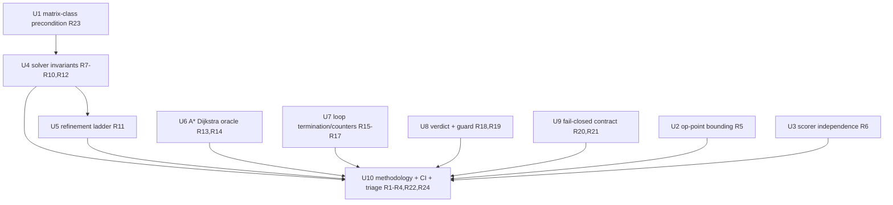

# feat: Physics Verification Rigor — Invariants, Induction & PBT for the Physics Feature

## Summary

Harden the merged physics-informed placement/routing feature by (1) fixing the two soundness gaps that make its keep/kill verdict provisional — the operating-point gate's endpoint-only bounding and the scorer's model-dependent "independence" — and (2) laying down per-unit invariant batteries (energy conservation, M-matrix monotonicity, A*-vs-Dijkstra optimality, loop termination, verdict totality, fail-closed contracts) organized as a light four-layer methodology with a BMC/k-induction ladder. Soundness fixes land first so the physics-U10 experiment can run on a trustworthy instrument; the full battery follows.

---

## Problem Frame

The physics feature was built to resist this project's signature failure — a green signal that measured a model instead of reality — yet its own suite is largely example-based, leaving the mathematical structure of the physics (conservation, monotonicity, solver well-posedness, search optimality, loop termination, verdict totality) unchecked. Review also found two errors that are unsound *design*, not missing tests: the op-point gate bounds only the two coupling endpoints (valid only if the function is monotone in coupling), and the "independent" scorer shares the solver's discretization (so its agreement confirms the linear solve, not the physics). Full motivation, the K/H claim taxonomy, and the map-vs-territory history live in the origin document.

---

## Requirements

Traces to the origin requirements doc (`docs/brainstorms/2026-07-09-physics-verification-rigor-requirements.md`). Grouped by concern; R-IDs are the origin's.

**Methodology & discipline** — R1 (four-layer pattern), R2 (BMC + k-induction ladder), R3 (independent-oracle rule), R4 (fail-capable metrics), R22 (bug-triage pipeline), R24 (future CP-SAT Chebyshev rule).
**Correctness fixes** — R5 (op-point bounding soundness), R6 (genuine scorer independence), R23 (matrix-class precondition).
**Solver invariants (physics-U5)** — R7 (energy/flux conservation), R8 (source monotonicity), R9 (discrete maximum principle), R10 (SPD well-posedness), R11 (order-of-accuracy ladder), R12 (metamorphic symmetry).
**Search invariants (physics-U8)** — R13 (A*=Dijkstra optimality), R14 (cost additivity).
**Loop invariants (physics-U9)** — R15 (termination), R16 (counter invariant), R17 (field-off idempotence).
**Contract & verdict (physics-U1–U4, U3)** — R18 (verdict totality/monotonicity), R19 (independence-guard totality), R20 (fail-closed sum-type), R21 (pre-registration ordering/completeness).

**Origin acceptance examples:** AE1 (R8 monotonicity), AE2 (R7 conservation), AE3 (R13 Dijkstra oracle), AE4 (R15 termination), AE5 (R18 kill verdict), AE6 (R5 bounding), AE7 (R20 fail-closed) — each maps to a unit's test scenarios below.

> **Naming:** a `physics-` prefix (e.g. `physics-U5`, `physics-U10`) always refers to a *feature* unit on branch `feat/physics-informed-placement-routing`; bare `U1…U10` always refer to this plan's own implementation units.

---

## Scope Boundaries

- No physical/hardware validation (thermocouple/IR vs prediction) — that is the complementary method for the *physical-correspondence* gap and is explicitly out of scope (origin Scope Boundaries). This plan verifies internal model consistency only.
- No machine-checked proofs (Coq/Lean) — PBT + BMC-exhaustive + hand induction only.
- No new physics fields, no custom inductance solver / FastHenry.
- No heavy verification *framework* — the methodology is a documented pattern + CI wiring, not an abstraction layer (see Key Technical Decisions).
- CP-SAT zone penalties remain deferred; R24 only records the discipline for when they return.

### Deferred to Follow-Up Work

- Running the physics-U10 thermal helps-battery A/B against a golden board (the reality check) — separate; this plan makes the instrument trustworthy so that run is meaningful.
- Pre-existing LOC-cap / stale-JAX allowlist cleanup — separate, not caused by this work.
- Extracting the four-layer pattern into a reusable framework for future fields — do it when a second field actually adopts it (surfaced in review; default is thermal-specific-first).
- **Full L3 model-independence of the whole thermal field** — U11 closes it only for the per-device `T_j` safety number (two-model-corroborated via datasheet R_θ). The interior model (5-point stencil, `k_eff`, conduction-only) is still shared for the *field* used as routing cost; a genuinely different interior formulation, or the power-on hardware trigger, remains the full close.

---

## Context & Research

### Relevant Code and Patterns

- `physics/thermal_fdm.py` — physics-U5. Confirmed **isotropic** per-cell conductivity (`k_eff` blend at `:179-216`), 5-point harmonic-mean interface stencil (`:324`), **`scipy.sparse.linalg.spsolve`** direct solve (`:451-455`). Isotropic + this stencil + one Dirichlet edge ⇒ SPD/M-matrix almost certainly holds — R23 is a cheap confirmation, not a likely reformulation.
- `validation/thermal_scorer.py` — physics-U7. Gauss-Seidel/SOR, **no matrix assembly, no `scipy.sparse`** — a different *solver family* but the **same PDE / same 5-point stencil / same k** (docstring `:4-23` states "Same PDE … same physics"). Confirms R6 is real: solver-independent but model-dependent.
- `physics/operating_point.py` — physics-U6. `OperatingPointGate.check` computes coupling extremes; R5 adds interior monotonicity proof/guard.
- `placer/cp_sat/loop.py` — physics-U9. Field-feedback with `FIELD_EPSILON`, `FIELD_OSCILLATION_WINDOW=4`, `FIELD_CONVERGENCE_ROUND_LIMIT=8` — the round-budget backstop for R15's fallback already exists.
- `router_v6/astar_core.py` / `astar_core_numba.py` / `congestion_tensor.py` — physics-U8 cost injection; R13 cross-validates against a Dijkstra on the same weighted grid.
- `fields/result.py` (`FieldResult`/`GateStatus`), `validation/scorecard.py` (`IndependenceViolationError`), `validation/helps_battery.py` (`BatteryVerdict`), `validation/prereg/` — R18–R21 contract targets.
- PBT precedent: `hypothesis>=6.148.7`; existing `*_pbt.py` suites and the `property` / `l3_pbt` markers in `packages/temper-placer/pyproject.toml`. Stateful testing via Hypothesis `RuleBasedStateMachine` for R16.

### Institutional Learnings

- `hypothesis-invariant-test-suite-pattern` — the four-layer suite (fuzz → invariant → cross-validator oracle → composition) is R1's basis.
- `bmc-induction-ladder-constraint-verification` — BMC-exhaustive small-N + k-induction + PBT middle is R2/R13/R15.
- `bfs-oracle-cost-model-mismatch` — the oracle must minimize the *same* objective via an independent method: use Dijkstra (not BFS) on the same weighted grid (R13); it also names the U5↔U7 shared-model trap (R6).
- `baseline-extractor-four-silent-fail-metrics` / `wiring-dark-physics-metrics` — a metric whose tolerance swallows zero is a false-pass machine; every metric must be fail-capable (R4).
- `two-tier-acceptance-gate-unsat-surfacing` — CLEAN/VIOLATIONS/UNMEASURED discipline for the fail-closed contract (R20).

### External References

- None — local patterns and the origin doc are sufficient; solver-internal numerics are implementation detail for the units below.

---

## Key Technical Decisions

- **Soundness fixes first, then batteries.** U1–U3 (R23, R5, R6) precede the invariant batteries because they determine whether the verdict is trustworthy at all. This also unblocks the deferred physics-U10 reality-check to run on a sound feature without waiting for full coverage. *(Reconciles the review's "validate value sooner" with "test a sound feature.")*
- **U3 is timeboxed; it is not a hard gate on the reality run.** U3 (genuine model independence) is the hardest, least-certain unit, and the delivery spine routes the physics-U10 reality run behind it. To avoid U3 becoming a single point of failure: timebox the independent-scorer prototype (≈2 weeks); if genuine model-independence proves infeasible in that window, fall back to explicit shared-assumption documentation + a "model-dependent (provisional)" verdict label, and treat U1+U2 (op-point bounding + matrix-class guard) as "sound enough" to unblock the reality run while U3 lands as a follow-up. U4–U9 do not depend on U3 and proceed regardless.
- **Methodology is a light pattern, not a framework.** R1/R2 land as a documented four-layer + BMC/induction convention plus CI wiring that runs the batteries — not a new abstraction layer. Rationale: only one consumer (thermal) exists today; extract a framework when a second field adopts it (review call-out; user chose to keep the organizing methodology, not necessarily a framework).
- **R6 needs model independence, not just solver independence.** Because the shipped scorer shares physics-U5's stencil and k, U3 adds a qualitatively different physical model — the convective-boundary FDM variant is primary (deterministic; a boundary term U5 omits). Green's-function is rejected (heterogeneous k forces the same `k_eff` approximation, so not independent); Monte-Carlo is a fallback with a fixed seed. The falsifiability test asserts a *quantified* disagreement on an input where both models are correct under their own assumptions, not "should differ."
- **R23 is a guard, not a rewrite.** Given isotropic k today, the SPD/M-matrix check is expected to pass; the unit keeps a sign-pattern/eigenvalue assertion as a standing guard, and a defined precondition-failure branch (classify → decision table of which of R7–R10 survive) so a future anisotropic variant can't silently invalidate the solver battery.
- **Invariants are fail-capable against realistic bug classes.** Per R4 (and the FYI from review), each invariant's fail-capability test perturbs a plausible bug (sign flip, index/stencil mis-orientation, BC swap), not a strawman value.
- **Rigor tools:** PBT (Hypothesis) for invariants/metamorphic/stateful; BMC-exhaustive for small-N optimality/termination; hand k-induction for the unbounded step; refinement ladder for solver order-of-accuracy. No proof assistant.

---

## Open Questions

### Resolved During Planning

- *Is physics-U5 SPD/M-matrix?* Very likely yes — isotropic per-cell k + harmonic-mean 5-point stencil + one Dirichlet edge. U1 confirms and guards.
- *Is physics-U7 already independent?* No — solver-independent (Gauss-Seidel vs direct) but shares the discretization/physical model. U3 is genuine work.
- *Methodology now or later, U10 before or after hardening?* Default: light methodology now; soundness fixes early so **physics-U10** can run right after U1–U3 (both revisable — see origin "Surfaced in review").

### Deferred to Implementation

- [R6] The primary independent-scorer method is the convective-boundary FDM variant; if prototyping shows the convection coefficient cannot be grounded at a fixed value, fall back to Monte-Carlo (fixed seed, bounded variance) — Green's-function is not viable (the heterogeneous-k case reduces to the same `k_eff` model). Prototype in U3.
- [R5] Is the operating point analytically monotone in coupling, or must U2 sample/interval-bound the interior? Determined by inspecting the op-point derivation in U2.
- [R15] Does a monotone ranking function exist for the loop, or is BMC+k-induction (with the fixed-iteration fallback) the pragmatic route? Determined in U7.
- [R11] Concrete grid-refinement factors and error tolerances for the order-of-accuracy ladder — set in U5.

---

## High-Level Technical Design

> *Directional guidance for review, not implementation specification.*

The four-layer methodology applied per unit, and the delivery spine:

```
Layer 1 fuzz (no-crash)      ┐
Layer 2 domain invariant     ├─ instantiated per unit (U4–U9)
Layer 3 independent oracle   │   Dijkstra (U6), model-independent scorer (U3)
Layer 4 composition          ┘   field-off idempotence, mask-respect

BMC-exhaustive (small N) ──► k-induction step ──► PBT middle   (U6 optimality, U7 termination)

Delivery: A soundness fixes (U1 R23 · U2 R5 · U3 R6)  ─► [physics-U10 reality run unblocked]
          B invariant batteries (U4 solver · U5 ladder · U6 search · U7 loop)
          C contract/verdict (U8 · U9)
          D methodology doc + CI wiring + triage (U10)
```

Dependency graph:



---

## Implementation Units

### U1. Confirm physics-U5 solver matrix class (SPD/M-matrix precondition)

**Goal:** Establish and standing-guard that the shipped thermal stencil yields a symmetric positive-definite M-matrix, so R7–R10 rest on a verified property rather than an assumption.

**Requirements:** R23, R10

**Dependencies:** None

**Files:**
- Modify: `packages/temper-placer/src/temper_placer/physics/thermal_fdm.py` (expose the assembled matrix for inspection if not already accessible)
- Test: `packages/temper-placer/tests/physics/test_thermal_fdm_matrix_class.py`

**Approach:**
- Assemble the system matrix on representative grids; assert symmetry, positive-definiteness (all eigenvalues > 0 or Cholesky succeeds), and M-matrix sign pattern (nonpositive off-diagonals, positive diagonal, weak diagonal dominance with the Dirichlet anchor).
- Keep the assertion as a standing guard parameterized over grid size and a copper-fraction field, so a future anisotropic-k variant trips it.
- **Precondition-failure branch (do not leave U4/U5 stranded):** if the property does *not* hold, classify the failure — loss of symmetry vs loss of diagonal dominance vs both — and map it to which of R7–R10 remain assertable under the weaker class (e.g., diagonally-dominant but not M-matrix still supports R9's maximum principle; loss of symmetry drops the SPD claim R10 but energy conservation R7 survives). U4 consumes that decision table; it does not assume all four invariants unconditionally. Given the shipped k is isotropic this branch is expected to be unused, but it is the defined recovery path rather than a circular "reformulate later."

**Patterns to follow:** existing `tests/physics/test_thermal_fdm*.py`; SPD check via `numpy.linalg.eigvalsh` or `scipy.linalg.cholesky`.

**Test scenarios:**
- Happy (R10): assembled matrix is symmetric and positive-definite on a random isotropic board.
- Property (PBT): for any grid shape and copper fraction in [0,1], the M-matrix sign pattern holds.
- Edge/guard: an injected anisotropic (directional) k makes the guard fail loudly (documents the boundary of validity).

**Verification:** SPD/M-matrix confirmed on the shipped stencil; a synthetic anisotropy trips the guard.

---

### U2. Fix physics-U6 operating-point bounding soundness

**Goal:** Make the coupling-extreme bounding sound — the reported worst case must bound *all* interior coupling values, not just the endpoints.

**Requirements:** R5

**Dependencies:** None

**Files:**
- Modify: `packages/temper-placer/src/temper_placer/physics/operating_point.py`
- Test: `packages/temper-placer/tests/physics/test_operating_point_monotonicity.py`

**Approach:**
- Define the continuous coupling model the current gate lacks: `L_eff(k) = L_coil·(1−k) + L_leakage·k` for k ∈ [0,1] (today `compute_extremes()` evaluates only the k=0/k=1 endpoints as labels, with no interior). Since `di/dt(k) = V_bus / L_eff(k)` is monotone in k and per-device power / `T_j` are independent of coupling, the endpoints provably bound the interior — document that proof and keep endpoint evaluation. If a future model makes any term non-monotone, sample the interior on a fixed grid (or use interval arithmetic) and take the true worst case.
- Gate emits `VIOLATIONS`/`UNMEASURED` (never a silent CLEAN) when an interior coupling value breaches a ceiling.

**Execution note:** Start with a failing test that constructs a non-monotone operating point with an interior violation and asserts the gate does not report CLEAN.

**Test scenarios:**
- Error (AE6/R5): a non-monotone operating point with an interior ceiling violation → gate is not CLEAN.
- Happy: a monotone benign range → CLEAN via endpoints.
- Property (PBT): sampled interior worst-case ≤ the reported worst-case for all generated coupling profiles (bounding soundness).

**Verification:** No interior coupling value can breach a ceiling while the gate reports CLEAN.

---

### U3. Rebuild physics-U7 for genuine model independence + falsifiability

**Goal:** Make the scorer independent of physics-U5 at the *model* level (not just the solver), so U5↔U7 agreement tests the physics; document residual shared assumptions.

**Requirements:** R6

**Dependencies:** None (consumes physics-U5 output for comparison)

**Files:**
- Modify: `packages/temper-placer/src/temper_placer/validation/thermal_scorer.py`
- Test: `packages/temper-placer/tests/validation/test_thermal_scorer_independence.py`

**Approach:**
- **Primary method: a convective-boundary FDM variant** — add a `h·(T − T_amb)` convective term at the three non-heatsink edges (physics-U5 treats those as adiabatic Neumann). This is deterministic (K4, same `spsolve` path — no seed/variance to tune, unlike Monte-Carlo), genuinely model-different (a boundary-physics term U5 omits, not just a different linear solve of the same stencil), and cheap. **Green's-function superposition is NOT viable** as the independent model: a closed-form Green's function for heterogeneous k requires the same uniform-`k_eff` approximation U5 already uses, so it is not model-independent. Monte-Carlo random-walk is a documented fallback only, and if used its seed is fixed and the disagreement threshold must absorb its bounded variance.
- **Acceptance constraints (gate U3 before full build):** any introduced parameter (e.g. the convection coefficient `h`) is physically grounded at a fixed value, never tuned to pass a test. The falsifiability input must be one where *both* models are correct under their own assumptions yet diverge because of the different physical treatment (e.g. a high-Biot-number geometry) — not an input where U5 simply ignores a term, which would game the threshold.
- Record which physical-model assumptions remain shared (effective interface conductivity, conduction-only in-plane, vias-as-bulk, no 3-D through-plane gradient) vs independent; expose that list. Shared systematic bias is a stated limitation, not something the falsifiability test can rule out.

**Patterns to follow:** `bfs-oracle-cost-model-mismatch` (same objective, independent method); the K1 closed-form anchor in `tests/physics/test_thermal_fdm.py` as the shared-truth cross-check.

**Test scenarios:**
- Happy (K1): U5 and U7 agree within tolerance on the closed-form geometry via independent methods.
- Falsifiability: on the constructed divergence input they disagree beyond the threshold (proves independence).
- Error: a systematically biased U5 field is flagged by U7 even though every hard gate passes.
- Integration (R19): U7 plugs into `build_scorecard(scorer=…)` as the scorer, never the field.

**Verification:** U7 differs from U5 at the model level, the falsifiability test passes, shared assumptions are documented; until merged, the verdict stays labeled provisional.

---

### U4. physics-U5 thermal invariant battery

**Goal:** Assert the solver's mathematical structure — conservation, monotonicity, maximum principle, well-posedness, symmetry.

**Requirements:** R7, R8, R9, R10, R12

**Dependencies:** U1

**Files:**
- Test: `packages/temper-placer/tests/physics/test_thermal_fdm_invariants_pbt.py`

**Approach:** Layer-2 invariants over Hypothesis-generated boards; each fail-capable against a realistic bug class (R4).

**Test scenarios:**
- Property (R7 / AE2): total injected power equals boundary flux within tolerance; fail-capable against a boundary-flux sign flip.
- Property (R8 / AE1): Q1 ≤ Q2 elementwise ⇒ T1 ≤ T2 elementwise; fail-capable against an assembly sign error.
- Property (R9): all-heating sources + one cold Dirichlet edge ⇒ no interior cell below ambient; fail-capable against a BC swap.
- Property (R10): matrix SPD (delegates to U1's check on generated inputs).
- Metamorphic (R12): translate/reflect/rotate a symmetric board ⇒ field transforms identically; fail-capable against an x/y-swap or row/col-major bug.

**Verification:** All five invariants pass on correct code and each is demonstrated to fail on its injected bug.

---

### U5. physics-U5 order-of-accuracy refinement ladder

**Goal:** Upgrade the K1 closed-form check from a point test to a convergence-rate test.

**Requirements:** R11

**Dependencies:** U4

**Files:**
- Test: `packages/temper-placer/tests/physics/test_thermal_fdm_refinement.py`

**Approach:** Solve a closed-form geometry at h, h/2, h/4; assert error decreases ~4× per halving (2nd-order). **Use a smooth, continuous-conductivity analytic case** for the rate check — the harmonic-mean interface treatment drops to 1st-order at a material discontinuity (copper/FR4 edge), so a correct stencil would fail a 4× expectation on a discontinuous board (false positive). Set concrete refinement factors/tolerances here; cap the finest grid at ≤ 40×40 to bound CI cost.

**Test scenarios:**
- Happy (R11): error(h/2)/error(h) ≈ 1/4 within a tolerance band on the analytic case.
- Edge: a deliberately 1st-order stencil variant fails the rate check (fail-capable).

**Verification:** The convergence rate matches the stencil's theoretical order; a wrong-order variant is caught.

---

### U6. physics-U8 A* Dijkstra same-cost oracle + cost additivity

**Goal:** Prove A*-with-field returns least-cost paths and accumulates field cost correctly.

**Requirements:** R13, R14

**Dependencies:** None

**Files:**
- Test: `packages/temper-placer/tests/router_v6/test_astar_dijkstra_oracle_pbt.py`

**Approach:** Cross-validate against Dijkstra on the *same* weighted grid, using the **exact same edge-cost function and neighbor model** as the A* kernel — the same `neighbor_validity` tensor (not naive 8-connectivity), the same diagonal-cost arithmetic, and the same per-cell thermal+congestion cost summation. Compare within a **floating-point epsilon**, not exact equality: the production A* runs in a Numba kernel (float semantics, tie-breaking, summation order may differ from pure Python), so exact equality would make the oracle a flake generator — the cited `bfs-oracle-cost-model-mismatch` learning prescribes `|A*_cost − Dijkstra_cost| ≤ ε` with either path accepted when costs tie within ε. Best option: implement Dijkstra in the same kernel so only the search algorithm differs. BMC-exhaustive over all source/target pairs on grids ≤ 8×8; PBT above. Assert the octile heuristic stays admissible under nonnegative field costs. Scope: the basic `_astar_search` with thermal injection — not the any-angle Theta*/Lazy-Theta* variants, which legitimately differ from Dijkstra.

**Test scenarios:**
- BMC (R13 / AE3): on grids ≤ 8×8 with a field, A* path cost equals Dijkstra's within ε for all source/target pairs, using the shared neighbor-validity tensor.
- Property (R13): admissibility — A* cost never below Dijkstra cost (minus ε) across generated fields.
- Property (R14): path-cost(field) − path-cost(no-field) equals summed field cost over traversed cells; fail-capable against a double-count.
- Property (composition): no path enters a hard-masked cell regardless of field magnitude.

**Verification:** A* matches Dijkstra within ε on the same weighted grid + neighbor model; additivity holds with no double-count; masks are never overridden.

---

### U7. physics-U9 loop termination, counter invariant, and idempotence

**Goal:** Prove the fixed-point loop halts (and, where it claims convergence, is near a fixed point), its counters never corrupt each other, and field-off is a no-op.

**Requirements:** R15, R16, R17

**Dependencies:** None

**Files:**
- Modify: `packages/temper-placer/src/temper_placer/placer/cp_sat/loop.py` (add a `_placement_solver` injection point defaulting to `solve_placement`, so the stateful PBT can drive round outcomes deterministically; and, only if needed, a ranking-function / provably-terminating restructure per the R15 fallback)
- Test: `packages/temper-placer/tests/placer/cp_sat/test_loop_termination_pbt.py`

**Approach:**
- **Split halting from convergence (do not conflate them):**
  - *R15a — halts:* every run terminates, proven by a monotone ranking function, else BMC over bounded round-outcome sequences + k-induction, else the fallback — the existing fixed round-budget makes the loop provably terminating. This alone is true of any finite loop and must NOT be reported as "convergence."
  - *R15b — converges:* when convergence detection fires (all stability counters ≥ STABILITY_ROUNDS), the final field is within ε of a fixed point (or oscillation amplitude is bounded). A monotonically-drifting field that exits on the round budget is a *halt without convergence* — it must be classified as budget-exhaustion, not a fixed point.
- Counter invariant (R16): Hypothesis `RuleBasedStateMachine` drives random per-round outcomes via the injected `_placement_solver` stub (returning predetermined `CpSatPlacementResult`s); assert field-stability and gate-stability counters stay independent and convergence ⟺ all counters ≥ STABILITY_ROUNDS.
- Idempotence (R17): field-off run is behaviorally identical to the legacy loop.

**Test scenarios:**
- Property (R15a / AE4): every generated round-outcome sequence halts (budget or ranking function).
- Property (R15b): a run that reports convergence has a final field within ε of a fixed point; a monotonically-drifting field is recorded as budget-exhaustion, *not* convergence.
- Stateful (R16): across ≤ 50 random transitions (via the injected solver stub), the counter invariant holds and convergence matches the counter condition.
- Edge: a period-4 place↔field cycle is caught by the field-aware window and classified as non-convergent.
- Idempotence (R17): field-off output equals legacy loop output byte-for-byte.

**Verification:** The loop provably halts; a "convergence" verdict implies near-fixed-point (halting alone is never reported as convergence); counters are invariant under all transitions; field-off is a no-op.

---

### U8. Verdict totality/monotonicity + scorecard independence-guard totality

**Goal:** Prove the keep/kill/inconclusive map is total and monotone, its KILL region is reachable, and the scorer-independence guard is total.

**Requirements:** R18, R19

**Dependencies:** None

**Files:**
- Test: `packages/temper-placer/tests/validation/test_verdict_properties_pbt.py`

**Approach:** PBT over synthetic arm-score distributions and pre-registered bars.

**Test scenarios:**
- Property (R18): every input yields exactly one verdict (totality).
- Property (R18): improving the physics-arm margin never moves the verdict away from KEEP (monotonicity); fail-capable against a `>=`/`>` threshold bug.
- Property (R18 / AE5): the KILL region is nonempty and characterized (cheap-captures-benefit ⇒ KILL); over-budget dominates to INCONCLUSIVE.
- Property (R19): for every scorer/field pair where scorer is/wraps the field, the independence guard raises.

**Verification:** Verdict logic is total, monotone, kill-reachable, budget-dominated; self-scoring always raises.

---

### U9. Fail-closed contract + pre-registration fuzz

**Goal:** Prove the `FieldResult` sum-type invariant and the pre-registration ordering/completeness rules over all inputs.

**Requirements:** R20, R21

**Dependencies:** None

**Files:**
- Test: `packages/temper-placer/tests/fields/test_fieldresult_invariants_pbt.py`
- Test: `packages/temper-placer/tests/validation/prereg/test_prereg_fuzz_pbt.py`

**Approach:** Constructor-fuzz the sum type and round-trip; record-fuzz the pre-registration loader.

**Test scenarios:**
- Property (R20 / AE7): across all construction paths, UNMEASURED ⟺ no grid and CLEAN/VIOLATIONS ⟺ grid present; no path coerces UNMEASURED to a flat/zero field.
- Property (R20): grid↔flat is a round-trip identity (catches row/col-major, off-by-one).
- Property (R21): created_at ≥ run timestamp is rejected; any missing mandatory field is rejected; complete valid records load.

**Verification:** No fail-closed bypass exists; pre-registration ordering/completeness hold over generated records.

---

### U10. Four-layer methodology, CI wiring, and bug-triage discipline

**Goal:** Crystallize the reusable pattern, wire the batteries into CI, and install the R22 triage rule and R24 forward-looking constraint.

**Requirements:** R1, R2, R3, R4, R22, R24

**Dependencies:** U4, U5, U6, U7, U8, U9 (and U2, U3 for the soundness-fix coverage)

**Files:**
- Create: `docs/physics-verification-methodology.md` (the four-layer + BMC/induction ladder + independent-oracle rule + fail-capable discipline; a documented pattern, not a framework)
- Modify: `.github/workflows/python-tests.yml` (run the invariant/PBT/BMC batteries as a gate)
- Modify: `AGENTS.md` (record the R22 triage rule and R24 CP-SAT-constraint rule as standing conventions)
- Test: `packages/temper-placer/tests/physics/test_methodology_conventions.py` (assert each battery is registered/discoverable and that the fail-capable markers exist)

**Approach:**
- Document the pattern with the thermal batteries as the worked example; state the independent-oracle rule (same objective, independent method) and the fail-capable rule (constructed failing input must match a plausible bug class).
- Wire the batteries into CI; ensure PBT/`l3_pbt` markers run on the intended cadence.
- Record the R22 triage pipeline (trivial fixes in-scope; architectural → follow-up) and R24 (future CP-SAT constraints need Chebyshev proof + BMC + audit) as standing docs.

**Test scenarios:**
- Integration: CI configuration references the new battery tests (they are collected, not silently skipped).
- Happy: the methodology doc's worked example matches the shipped battery structure (no drift).
- Test expectation: none for the AGENTS.md convention text — pure documentation.

**Verification:** The pattern is documented, the batteries gate in CI, and the triage/forward-looking rules are recorded.

---

### U11. Datasheet-R_θ lumped-network cross-check gate (partial L3 close — the safety number)

**Goal:** Corroborate each power device's junction temperature `T_j` — the number that gates the `T_j ≤ T_j(max)` hard **safety** ceiling — against a genuinely model-independent lumped R_θ network built from manufacturer datasheet values, so the limit that decides whether a mains switch survives rests on **two independent models** (distributed FDM + lumped R_θ), not one solver-validated model. This is the cheap partial-close for the L3 gap that sits specifically under the thermal hard constraint; it does **not** retire the power-on hardware trigger.

**Requirements:** R6 (extends H6 model-independence to the safety number), R10 (fail-closed), R5 (worst-case, not nominal); §5 datasheet-absolute-limits with `because` citations.

**Dependencies:** physics-U5 (`solve_thermal_fdm`), `physics/thermal.py` (`estimate_junction_temp` lumped model), U6 (worst-case operating point / per-device power), U2 (worst-case coupling). Independent of U1–U10 otherwise.

**Files:**
- Create: `packages/temper-placer/src/temper_placer/physics/tj_cross_check.py` (the gate — conforms to the `Gate`/`GateResult` contract)
- Modify/extend: the config/YAML authority for per-device `R_θJC`, `R_θCS`, `R_θSA` (or `R_θJA`) with `because` datasheet citations (never hardcoded)
- Test: `packages/temper-placer/tests/physics/test_tj_cross_check.py`

**Approach:**
- **Two independent estimates of the *same* quantity** (junction T_j at the same device, same worst-case power P from U6, same T_amb — the same-objective discipline; a mismatch of objective would be a bfs-oracle-class error, not evidence):
  - **Distributed (FDM):** `solve_thermal_fdm` at worst-case P → area-average the board/case temperature over the device footprint (pads/courtyard, not a single cell) → `T_j_fdm = T_case_fdm + P·R_θJC` (add the junction-to-case datasheet resistance the 2-D board field cannot represent).
  - **Lumped (datasheet R_θ ladder):** `T_j_lumped = T_amb + P·(R_θJC + R_θCS + R_θSA)` (or `T_amb + P·R_θJA`).
- **Document shared vs independent inputs.** *Shared:* P (operating point), T_amb. *Independent:* the thermal-transport model (distributed `k_eff` PDE vs lumped R_θ ladder) **and** the data source (derived conductivity vs manufacturer-measured R_θ — which folds in the convection the conduction-only FDM interior omits). This is genuine model + data independence, one rung above U3's boundary-only independence.
- **Gate (fail-closed):** `|T_j_fdm − T_j_lumped| ≤ τ`, τ pre-registered as an absolute °C or a fraction of the margin `T_j(max) − T_j`. `CLEAN` on agreement; `VIOLATIONS` on disagreement > τ (carry the per-device delta); `UNMEASURED` if any required R_θ is missing (never silently skip a device). Until CLEAN, the `T_j ≤ T_j(max)` ceiling is not trusted.
- **Worst-case, not nominal (L2 tie-in):** evaluate at the U6 operating point that *maximizes* T_j, so the corroborated number is the one the safety ceiling actually depends on.
- **Disagreement is information, not just failure:** attribute it — a large delta on a device far from the heatsink localizes the conduction-only / adiabatic-edge assumption (the FDM under-models convection there); a uniform delta suggests a global `k_eff` or ambient mismatch; a delta consistent with JEDEC test-condition differences (e.g. `R_θJA` measured on a standard 1"×1" test board vs this board's copper) flags that the datasheet number does not apply to this layout — itself a finding. Emit the attribution in the gate result.

**Test scenarios:**
- Happy: a well-heatsinked device — FDM-derived and lumped T_j agree within τ → CLEAN.
- **Fail-capable (R4):** inject a wrong `k_eff`, or a device far from the heatsink where the distributed gradient dominates and the single-resistor lumped model under-predicts → disagreement > τ → VIOLATIONS. Proves the gate is not a dark metric.
- Error / fail-closed: a device with a missing datasheet R_θ → UNMEASURED, not a silent pass.
- Worst-case: assert the cross-check uses the U6 worst-case P, not a nominal value.
- Attribution: a far-from-heatsink disagreement is labeled as convection/edge-assumption localization.

**Verification:** the `T_j ≤ T_j(max)` ceiling is corroborated by two independent-model estimates at the worst-case operating point; disagreement fails closed and localizes the biting assumption; the gate is CI-wired and demonstrably fail-capable. This moves L3 **for the safety number** from solver-validated to two-model-corroborated. It is a *partial* close: full model-independence of the whole field still needs a genuinely different interior formulation or hardware, and the power-on measurement trigger (L5) is unchanged.

---

## System-Wide Impact

- **Interaction graph:** Mostly additive test modules plus small guards/fixes in `physics/thermal_fdm.py` (U1), `physics/operating_point.py` (U2), `validation/thermal_scorer.py` (U3), and possibly `placer/cp_sat/loop.py` (U7 fallback). No new runtime dependencies on the hot path.
- **Behavior changes (not just tests):** U2 (bounding may now sample the interior), U3 (scorer method changes), and possibly U7 (loop restructure). Each carries its own verification and must keep field-off/default paths unchanged.
- **Error propagation:** U2/U3 must preserve the CLEAN/VIOLATIONS/UNMEASURED fail-closed contract; no new silent-pass path.
- **Unchanged invariants:** the physics feature's public APIs and the field-off routing/loop behavior are unchanged; these units add checks and fix soundness, they do not re-scope the feature.
- **CI cost:** BMC-exhaustive (U6) and stateful PBT (U7) plus the refinement ladder (U5) add runtime; concrete bounds keep it tractable — U6 BMC grid ≤ 8×8 (≈ n⁴ source/target pairs), U7 stateful PBT ≤ 50 rule applications (with the injected solver stub, no real CP-SAT solve), U5 refinement ≤ 40×40 — and heavy suites carry the `l3_pbt` marker for PR-only cadence.
- **U7 solver-injection point:** U7 adds a `_placement_solver` seam to `PlaceRouteLoop` so the stateful PBT drives round outcomes deterministically without expensive/nondeterministic real solves; the default preserves current behavior.

---

## Risks & Dependencies

| Risk | Mitigation |
|------|------------|
| An invariant is wrong for the real matrix class (anisotropy) and fails on correct code | U1 confirms SPD/M-matrix first; on failure its precondition-branch classifies the failure and maps which of R7–R10 survive under the weaker class (U4 consumes that table) — not a circular "reformulate later" |
| U3's "independent" model still shares a systematic bias with U5 | U3 documents shared vs independent assumptions and uses the convective-boundary variant (a boundary term U5 omits); shared bias is a stated limitation, not silently trusted |
| U3 genuine independence proves infeasible and blocks the reality run | U3 is timeboxed (~2 wk); fallback = shared-assumption doc + "model-dependent (provisional)" label, with U1+U2 unblocking the reality run while U3 lands as follow-up |
| No monotone ranking function exists / BMC state-space explodes for U7 | R15a fallback: the fixed round-budget makes the loop provably *halt*; R15b keeps "convergence" a separate, near-fixed-point claim (halting is never reported as convergence) |
| U5 refinement ladder gives a false positive (harmonic-mean drops to 1st order at material discontinuities) | U5 runs the order check on a smooth continuous-k analytic case, not a discontinuous copper/FR4 board |
| Dijkstra oracle flakes on Numba-vs-Python float differences | U6 compares within ε (not exact equality) and shares the exact cost + neighbor-validity model; ideally Dijkstra in the same kernel |
| Fail-capable tests pass on strawman inputs (dark-metric relapse) | R4 requires the failing input to match a plausible bug class (sign/index/BC-swap), enforced in U4/U5 scenarios |
| Bug-triage (R22) balloons if invariants surface a deep flaw | Trivial fixes in-scope; architectural fixes are documented and scoped as follow-up, not blanket-fixed here |
| BMC/PBT CI runtime regresses PR latency | Concrete bounds: U6 BMC grid ≤ 8×8, U7 stateful PBT ≤ 50 rule applications, U5 refinement ≤ 40×40; `l3_pbt` marker for PR-only cadence |

---

## Alternative Approaches Considered

- **Full battery before the soundness fixes.** Rejected — hardening a provisional instrument first delays a trustworthy verdict; fixing R5/R6 early lets the physics-U10 reality run happen on a sound feature.
- **Build a reusable verification framework now.** Rejected as default — one consumer (thermal) today; a documented pattern + CI wiring captures the leverage without framework carrying cost. Revisit when a second field adopts it (surfaced in review; user may override).
- **Machine-checked proofs (Coq/Lean).** Rejected — disproportionate; PBT + BMC + hand induction match the risk and the repo's existing verification learnings.
- **Keep U7 as-is (solver-independent).** Rejected — solver independence without model independence makes H6 vacuous; the whole verdict rests on it.

---

## Success Metrics

- The two soundness fixes (R5, R6) land and the keep/kill verdict is no longer labeled provisional.
- Every invariant passes on correct code and is demonstrated fail-capable against a realistic bug class.
- A*-with-field matches Dijkstra within ε on the same weighted grid; the loop provably *halts* and a "convergence" verdict implies a near-fixed-point (the two are not conflated); the verdict logic is total/monotone/kill-reachable.
- The batteries gate in CI and the methodology + triage rules are recorded; a future physics field can follow the documented pattern.

---

## Sources & References

- **Origin document:** [docs/brainstorms/2026-07-09-physics-verification-rigor-requirements.md](docs/brainstorms/2026-07-09-physics-verification-rigor-requirements.md)
- **Feature under verification:** [docs/plans/2026-07-08-008-feat-physics-informed-placement-routing-plan.md](docs/plans/2026-07-08-008-feat-physics-informed-placement-routing-plan.md) (branch `feat/physics-informed-placement-routing`)
- **Key code:** `physics/thermal_fdm.py`, `physics/operating_point.py`, `validation/thermal_scorer.py`, `placer/cp_sat/loop.py`, `router_v6/astar_core.py`, `fields/result.py`, `validation/helps_battery.py`, `validation/prereg/`
- **Key learnings:** `docs/solutions/best-practices/hypothesis-invariant-test-suite-pattern-2026-06-28.md`, `docs/solutions/best-practices/bmc-induction-ladder-constraint-verification-2026-07-01.md`, `docs/solutions/best-practices/bfs-oracle-cost-model-mismatch-astar-validation-2026-06-28.md`, `docs/solutions/logic-errors/baseline-extractor-four-silent-fail-metrics-2026-07-01.md`
