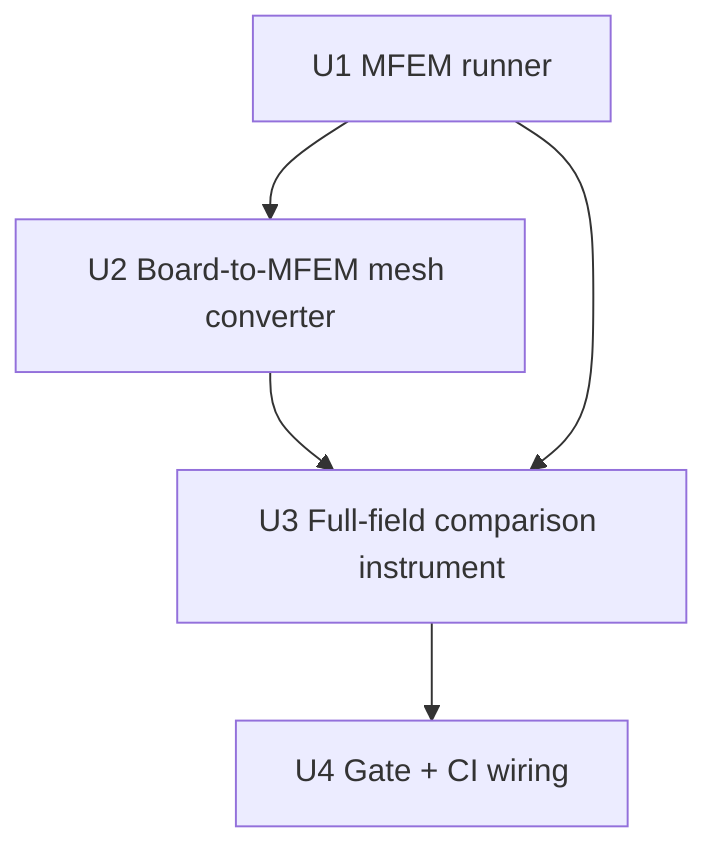

# feat: External MFEM-FEM Corroboration for Thermal Verification Chain

## Summary

Add **MFEM** (LLNL, BSD, `brew install mfem` in ~30s, serial build has zero external dependencies) — a lightweight open-source C++ finite-element library with a built-in Poisson example (steady-state heat conduction — exactly the PDE the 2-D FDM solves) and VTK output — as a second genuinely-independent model to corroborate the in-house 2-D FDM's full-board temperature distribution. Two different solver families (FDM vs FEM), two different mesh types (structured 2-D grid vs unstructured mesh), and a genuinely different codebase (LLNL, peer-reviewed, HPC-validated). Agreement across the full thermal field strengthens the validity rung from "single-model, solver-verified" to "multi-model-corroborated" for the thermal safety number that gates whether a mains switch survives.

---

## Problem Frame

The 2-D FDM is correctness-proven (MMS, 2nd-order) and soundness-proven (verified-interval bounds), and the U11 lumped-R_θ cross-check corroborates device T_j via a 0-D resistor network. It is still one model family. A genuinely independent finite-element solver — different mesh, different element type, different codebase — provides a new axis of evidence. **Elmer is a deferred alternative** — the Elmer pipeline scaffold proved the pipeline shape and the fail-closed gate contract. MFEM was chosen as the primary backend for its zero-dependency serial build, `brew install` simplicity, native VTK output, and the Poisson example that maps directly to steady-state thermal conduction.

---

## Requirements

Traces to the origin (`docs/brainstorms/2026-07-09-external-mfem-fem-corroboration-requirements.md`).

**Integration** — R1 (Python orchestrator), R2 (board-to-MFEM geometry conversion).
**Comparison** — R3 (full-field ΔT map), R4 (device T_j spot-checks), R5 (same-objective discipline).
**Validity claim** — R6 (scoped: evidence, not proof).
**Gate discipline** — R7 (fail-closed; disagreement is information).

---

## Scope Boundaries

- Semi-automated mesh generation from the existing board model — not a full KiCad→mesh pipeline.
- MFEM is a separate, infrequently-invoked corroboration instrument — not a replacement for the in-loop FDM.
- No GUI, no web interface.
- The power-on hardware measurement remains the deferred closing instrument.

### Deferred to Follow-Up Work

- Automated KiCad → MFEM mesh pipeline for arbitrary boards.
- The Elmer pipeline scaffold (commits, 55-test gate suite) is kept as a deferred alternative — MFEM is primary.

---

## Context & Research

### Relevant Code and Patterns

- `physics/tj_cross_check.py` (U11) — the `TjCrossCheckGate`, `Gate`/`GateResult` contract, per-device `DeviceThermalConfig` with `because` citations.
- `physics/thermal_fdm.py` — the FDM solver (the model being corroborated).
- `physics/copper_coverage.py`, `physics/heat_removal.py`, `physics/device_power.py` — copper, through-plane sink, and device power models feeding both solves.
- `core/board.py` — the authoritative board geometry for MFEM mesh conversion.
- Gate contract: `placer/cp_sat/gates.py`.
- Existing CLI patterns: `validation/spice.py` (`NgspiceValidator`). Mirror for MFEM (`check_mfem()` preflight checking for the compiled serial binary).

### External References

- MFEM (LLNL, mfem.org) — BSD license, HPC-validated, serial version has zero external deps. Poisson example maps to steady-state thermal conduction. VTK output. `brew install mfem` (macOS, ~30s), or `make serial -j` from source (< 1 min Linux).
- The temper board is a 4-layer 100×150mm PCB with STGW30NC60W TO-247 IGBTs.

---

## Key Technical Decisions

- **MFEM over Elmer.** Zero-dependency serial build, `brew install` in ~30s, BSD license, LLNL-developed, Poisson example maps directly to our PDE. Elmer is a deferred alternative.
- **Same-objective discipline.** Both solvers solve the same steady-state conduction problem on the same geometry with the same power dissipation — differing only in solver, mesh, element type, and BC treatment.
- **Full-field comparison over device-only T_j.**
- **Fail-closed gate.** If MFEM cannot run, result is `UNMEASURED` — never a silent pass.
- **Semi-automated mesh.** Scripted board→MFEM geometry translation, parameterised for the temper board.
- **Gate is conditional on MFEM availability.** CI skips when MFEM is not installed (same pattern as `NgspiceValidator`).

---

## Open Questions

### Resolved During Planning

- *Full-field vs device-only?* Full-field.
- *Automated mesh or semi-automated?* Semi-automated for the temper board.
- *Elmer vs MFEM?* MFEM — zero-dependency serial build, `brew install`, VTK output.

### Deferred to Implementation

- [R3] The pre-registered agreement tolerance.
- [R2] Exact mesh density and element sizing for the temper board.

---

## High-Level Technical Design

> *Directional guidance for review, not implementation specification.*

```
Board model (core/board.py)
  → U2: MFEM mesh converter (Gmsh/VTK mesh + config)
  → U1: MFEM serial example binary (subprocess: Poisson/mesh → VTK output)
  → U3: Full-field comparison against FDM field
      (project MFEM solution onto FDM grid → spatial ΔT map → device T_j)
  → U4: Gate (CLEAN | VIOLATIONS with attribution | UNMEASURED)
  → CI: l3_pbt cadence, conditional on MFEM binary availability
```



---

## Implementation Units

### U1. MFEM runner (compiled binary wrapper + preflight)

**Goal:** A Python module that wraps a compiled MFEM serial example binary (e.g., `ex1` — the Poisson solver), runs a steady-state thermal simulation from a mesh file + config, parses VTK output, and exposes a preflight check. Deterministic.

**Requirements:** R1, R5

**Dependencies:** None

**Files:**
- Create: `packages/temper-placer/src/temper_placer/validation/mfem_runner.py`
- Test: `packages/temper-placer/tests/validation/test_mfem_runner.py`

**Approach:**
- `MFEMRunner` class: `check_mfem()` preflight (looks for compiled serial binary), `run(mesh_path, config_path)` → subprocess `./ex1 -m mesh -c config`, parses VTK output into `(node_coords, temperature)` arrays.
- Mirror the `validation/spice.py` `NgspiceValidator` pattern for preflight + batch-mode invocation.
- When MFEM is not installed, `check_mfem()` returns absent → gate returns `UNMEASURED`.

**Test scenarios:**
- Happy: `check_mfem()` returns available when binary is present (skip if absent).
- Happy (integration): a tiny synthetic mesh runs and produces a VTK output (skip if MFEM absent).
- Error: missing binary → preflight returns absent. Invalid mesh → captured, not a crash.
- VTK parsing: a synthetic minimal VTK file is parsed correctly.

**Verification:** The MFEM runner wraps the compiled binary deterministically; preflight correctly detects availability.

---

### U2. Board-to-MFEM mesh converter

**Goal:** Convert the temper board geometry into an MFEM-compatible mesh file (Gmsh `.msh` or MFEM native `.mesh`), with material regions, device heat sources, and boundary conditions.

**Requirements:** R2

**Dependencies:** U1

**Files:**
- Create: `packages/temper-placer/src/temper_placer/validation/mfem_mesh.py`
- Test: `packages/temper-placer/tests/validation/test_mfem_mesh.py`

**Approach:**
- Generate a Gmsh `.geo` or MFEM-native `.mesh` file from the board stackup: extruded 2-D geometry with per-layer material regions (copper planes as high-k bodies, FR4 as bulk). Devices as volumetric heat source bodies in TO-247 footprint regions.
- Device power values (`power_map` from the U6 operating-point model) wired into the mesh config as per-body heat source values.
- Uses the existing `copper_coverage_grid`, `heat_removal` model, and `DeviceThermalConfig` for material properties and source-of-truth.

**Test scenarios:**
- Happy: converter produces a non-empty mesh file from the temper board model.
- Edge: empty board (no devices) produces a mesh with only ambient BCs.
- Power: per-device power values appear in the mesh config.
- Error: invalid geometry → rejected with clear error.

**Verification:** The temper board model is converted to a valid MFEM-compatible mesh.

---

### U3. Full-field comparison instrument

**Goal:** Run both the FDM and MFEM solves at the same operating point, project the MFEM solution onto the FDM grid, compute the spatial ΔT map, and produce a comparison result.

**Requirements:** R3, R4, R5

**Dependencies:** U1, U2

**Files:**
- Create: `packages/temper-placer/src/temper_placer/validation/mfem_compare.py`
- Test: `packages/temper-placer/tests/validation/test_mfem_compare.py`

**Approach:**
- Same-objective discipline: both solves use the same device power map, ambient, geometry.
- Project MFEM's nodal solution onto the FDM grid via `scipy.interpolate.griddata` (nearest-neighbor or linear, deterministic).
- Compute per-cell |ΔT| map. Spatial attribution: device footprint, near-heatsink, far-field, copper-plane.
- Device T_j spot-checks (R4).

**Test scenarios:**
- Happy: identical synthetic fields → zero ΔT, CLEAN.
- Device hotspot disagreement → VIOLATIONS with device attribution.
- Far-field-only disagreement → VIOLATIONS with far-field attribution.

**Verification:** The comparison produces a spatial ΔT map and device T_j spot-checks with spatial attribution.

---

### U4. Gate + CI wiring

**Goal:** Wire the MFEM corroboration into a `Gate` subclass, configure CI, and document it.

**Requirements:** R6, R7

**Dependencies:** U3

**Files:**
- Create: `packages/temper-placer/src/temper_placer/validation/mfem_gate.py`
- Modify: `.github/workflows/python-tests.yml`
- Test: `packages/temper-placer/tests/validation/test_mfem_gate.py`

**Approach:**
- `MFEMCorroborationGate(Gate)`: preflight → mesh → solve → project → compare → gate result.
- CLEAN when ΔT map is within tolerance AND device T_j spot-checks agree within U11 tau.
- VIOLATIONS when disagreement exceeds tolerance with spatial attribution.
- UNMEASURED when MFEM is not available — never a silent pass.
- CI: conditional step on `which mfem` or preflight check, `l3_pbt` cadence.

**Test scenarios:**
- Happy (MFEM available): synthetic board where FDM and MFEM agree → CLEAN.
- Edge (MFEM unavailable): preflight fails → UNMEASURED (fail-closed).
- Error: fields diverge beyond tolerance → VIOLATIONS with attribution.

**Verification:** Gate conforms to `Gate`/`GateResult` contract; CI skips gracefully when MFEM absent.

---

## System-Wide Impact

- **Interaction graph:** New `validation/mfem_*.py` modules depend on existing physics modules. No back-dependencies.
- **Behavior changes:** additive only. The MFEM gate is a new instrument.
- **Error propagation:** MFEM unavailability → `UNMEASURED`.
- **CI cost:** MFEM solve time is platform-dependent (seconds on a small mesh). Conditional execution prevents CI stalls.

---

## Risks & Dependencies

| Risk | Mitigation |
|------|------------|
| MFEM binary not compiled or not on PATH | Preflight detects absence → gate returns UNMEASURED |
| Mesh generation for the temper board is non-trivial | Semi-automated — parameterised once for the temper board |
| Serial example may not accept config parameters directly | Fork/wrap the example with a thin config-reader, or use pymfem Python bindings |
| MFEM solve time regression in CI | Timeout-bounded; `l3_pbt` cadence |

---

## Success Metrics

- MFEM produces a steady-state thermal field across the temper board mesh, and a spatial ΔT map vs the FDM field is generated.
- Device T_j from MFEM agrees with the FDM within U11 tau at the worst-case operating point.
- The corroboration gate is CI-wired, conditional on MFEM availability, fail-closed on unavailability.

---

## Sources & References

- **Origin document:** [docs/brainstorms/2026-07-09-external-mfem-fem-corroboration-requirements.md](docs/brainstorms/2026-07-09-external-mfem-fem-corroboration-requirements.md)
- **Verification plan:** [docs/plans/2026-07-09-001-feat-physics-verification-rigor-plan.md](docs/plans/2026-07-09-001-feat-physics-verification-rigor-plan.md)
- **Key code:** `physics/thermal_fdm.py`, `physics/tj_cross_check.py`, `physics/copper_coverage.py`, `physics/heat_removal.py`, `physics/device_power.py`, `core/board.py`, `validation/spice.py`
- **Key learnings:** `docs/solutions/best-practices/bfs-oracle-cost-model-mismatch-astar-validation-2026-06-28.md`, `docs/solutions/best-practices/mms-proves-correctness-converge-to-right-answer-2026-07-09.md`
- **MFEM:** [mfem.org](https://mfem.org) — LLNL, BSD license, zero-dependency serial build
