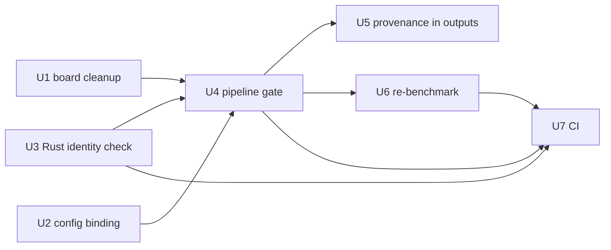

# feat: Artifact Identity & Provenance Gate

## Problem Frame

The repo has no machine check that a `.kicad_pcb` is the board you think it is
before a pipeline stage consumes it. The concrete failure: **14 of 15
`pcb/*.kicad_pcb` files are the same 33-component benchmark fixture** (one is
25 components), while the real design (`elec/build/default.net`) has ~100
components across 135 nets. Months of placer/router work ran against the
fixture. Related drift: ~11 placement config files reference fixture-only refs
(`U_GATE`, `C_BUS1`, …) with no binding to any specific board.

The fix (per origin) is to **derive** identity from the files and **verify** it
fail-closed, building on the existing typed Rust `temper-design-bundle` crate
rather than a hand-maintained `artifacts.yaml`. No hand-declared counts — a
declared `expected_components: 100` is itself a drift vector.

See origin: `docs/brainstorms/2026-07-15-artifact-identity-provenance-requirements.md`.

---

## Scope Boundaries

**In scope:** derived PCB↔netlist ref-designator identity check in the Rust
bundle; collapse board inventory to one (delete duplicates, quarantine one
fixture with a sunset); fail-closed pipeline gate at the placer/router entry
points; config→board binding; provenance blocks in pipeline outputs;
re-benchmark the placer/router against the real board; CI enforcement.

**Deferred to Follow-Up Work:**
- Deny-by-default on undeclared boards (directory convention obviates it).
- Automating KiCad "Update PCB from Schematic" (no CLI equivalent).

**Outside this plan (separate initiatives):**
- Schematic generation from atopile — **shipped** via `docs/plans/2026-07-15-002-feat-schematic-generation-from-atopile-plan.md`.
  `scripts/gen_schematics.py` generates all 7 `.kicad_sch` sheets from `elec/build/default.net`,
  oracle-verified (346 pins, 73 nets isomorphic), CI-gated via `python-tests.yml` regen-and-diff.
  Still pending: manual "Update PCB from Schematic" in KiCad GUI to produce the real production board.
- PCL SSOT / phantom-constraint work — tracked in `2026-07-11-001`.
- Bugs inside `elec/src/*.ato` (source-review discipline).

---

## Phased Delivery

| Phase | Units | Gating |
|-------|-------|--------|
| **A — now, unblocked** | U1, U2 | None. Reduces drift surface immediately. |
| **B — after production board exists** | U3, U4, U5, U6, U7 | Depends on `2026-07-11-001` (bundle boundary) **and** the schematic-generation plan producing a real ~100-component board. |



*Directional guidance for review, not implementation specification.*

---

## Key Technical Decisions

1. **Derive, never declare.** Component/net counts and overlap are read from
   the `.kicad_pcb` and `default.net` at check time. Nothing hand-typed, so
   nothing can drift. (Origin decision.)
2. **Extend the Rust bundle.** The identity check lives in
   `packages/temper-design-bundle` (typed, `DesignBundleError`, existing
   `Provenance`), exposed to Python through the existing PyO3 boundary pattern
   used by `temper-constraints`. No parallel Python checker.
3. **Role by directory convention.** A board's path is its role. The single
   surviving fixture lives under `pcb/benchmarks/`; construction infers that a
   board there can only build a fixture/dev bundle, never a production bundle.
   No role field written into files, no manifest.
4. **Fail-closed at every board entry point.** Both `InputStage` (pipeline DAG)
   and `scripts/internal_route.py` (which bypasses the DAG and parses the board
   directly) must call the gate. Missing either leaves a bypass.
5. **Threshold is a construction parameter, not a per-board number.** Safe
   default with an explicit bring-up mode for partially-populated boards.

---

## Implementation Units

### U1. Collapse board inventory to one; quarantine a single fixture

**Goal:** Delete the 14 confusing duplicate boards; keep exactly one fixture,
relocated and clearly quarantined with a documented sunset.

**Requirements:** R2 (origin). Phase A.

**Dependencies:** none.

**Files:**
- Delete 13 of the 14 duplicate `pcb/temper*_*.kicad_pcb` / `pcb/_autosave-*.kicad_pcb` and `pcb/medium_optimized_v4.kicad_pcb` (audit list below).
- Move the one kept fixture → `pcb/benchmarks/temper_fixture_33.kicad_pcb`.
- Create `pcb/benchmarks/README.md` (states: synthetic 33-component fixture, sunset once U6 lands, must never be a production input).
- Update any references found in: `Makefile` (`PCB_FILE`), `power_pcb_dataset/golden_manifest.yaml` (references `pcb/temper_placed.kicad_pcb`), regression corpus/manifests, tests, and scripts.

**Approach:** First grep the repo for every `pcb/*.kicad_pcb` path reference and
repoint or remove it **before** deleting files, so nothing breaks silently.
Choose the kept fixture as the one current benchmarks actually use
(`pcb/temper_placed.kicad_pcb` is referenced by `golden_manifest.yaml`) to
minimize churn. `make route`'s `PCB_FILE = pcb/temper.kicad_pcb` default will
point at a now-missing board — intentional; U4 makes that fail-closed, but in
the interim set `PCB_FILE` to the quarantined fixture path so `make route`
still runs for benchmarking until U6.

**Patterns to follow:** existing `power_pcb_dataset/corpus/manifest.yaml`
structure for how boards are referenced.

**Test scenarios:**
- Repo-wide grep for `pcb/` `.kicad_pcb` references returns only live paths after the change (no dangling references to deleted files).
- `make route` and `make regression` still resolve their input board path (smoke: path exists).
- Test expectation: mostly mechanical; the real verification is "no dangling path references remain" rather than new unit tests.

**Verification:** `git grep -n '\.kicad_pcb'` shows only existing files; the
regression corpus runner loads its board without a missing-file error.

---

### U2. Config→board binding

**Goal:** Bind each placement config to the board it targets so a config
written for the fixture cannot be silently applied to the production board.

**Requirements:** R4 (origin). Phase A.

**Dependencies:** U1 (board paths settle first).

**Status note (execution):** The *mechanism* ships in Phase A validated with
synthetic fixtures (`config_board_binding.py`): `extract_config_refs` +
`verify_config_matches_netlist` (fail-closed subset check, refs derived from
files — no declared counts). The **four existing config files remain
fixture-bound and are NOT migrated by this plan** — every checked-in config
(`configs/temper_deterministic_config.yaml` + three under
`packages/temper-placer/configs/`) references fixture-only refs (`U_GATE`,
`C_BUS1`, …) with **zero** overlap with the production netlist
(`elec/build/default.net`, refs `U1`–`U100`). There is nothing correct to
migrate them to until the schematic-generation plan delivers the real board;
authoring a "production" config by hand now would recreate the exact
declare-what-isn't-derived drift vector the brainstorm rejected. These configs
will correctly fail the gate once it is wired into the pipeline entry point in
**U4** (Phase B). The InputStage call site is therefore deferred to U4; U2
delivers only the reusable, tested mechanism.

**Files:**
- `packages/temper-placer/src/temper_placer/io/config_board_binding.py` — the binding mechanism (shipped).
- `packages/temper-placer/tests/io/test_config_board_binding.py` — synthetic-fixture tests (shipped).
- (Deferred to U4) `packages/temper-placer/src/temper_placer/pipeline/stages/input_stage.py` — call the mechanism against the board being operated on.

**Approach:** Prefer the lowest-drift binding: the config declares the
**atopile design entry** it targets (e.g. `src/main.ato:Top`) rather than a
board file path or a hand-typed component list. At load time, resolve the
config's referenced refs against the netlist's derived ref set; a config whose
refs are not a subset of the current board's netlist is rejected. This reuses
the same derived-ref machinery U3 builds — no second source of truth. Do not
introduce a hand-maintained `bound_to: X.kicad_pcb` field.

**Patterns to follow:** existing config loading in `input_stage.py`; net-name
mapping resolution already in `packages/temper-design-bundle/src/identity.rs`.

**Test scenarios:**
- A config whose refs are all present in the netlist loads successfully.
- A fixture-only config (refs `U_GATE`, `C_BUS1` absent from the production netlist) is rejected with a diagnostic naming the missing refs.
- Empty/малformed binding field → clear error, not a silent pass.
- Integration: loading a config through `InputStage` against a mismatched board fails before placement begins.

**Verification:** pointing a fixture config at the production board fails config
load with a ref-mismatch diagnostic.

---

### U3. Derived PCB↔netlist identity check in the Rust bundle

**Goal:** Add a typed, fail-closed check that a KiCad board's footprint refs
correspond to the netlist component refs, with counts derived from the files.

**Requirements:** R1 (origin). Phase B.

**Dependencies:** none (decision below removes the original dependency on
`2026-07-11-001` U2's Python-generated KiCad inventory DTO). Extends existing
`packages/temper-design-bundle/src/identity.rs`.

**Decision (resolves the open design question from scoping):** parse
`.kicad_pcb` footprint ref designators natively in Rust rather than depending
on a Python-generated DTO (`real_board_inventory.py`) crossing the PyO3
boundary. This keeps the identity gate's correctness self-contained inside the
typed Rust crate — no dependency on a second language's parser being correct
or even present — consistent with the origin brainstorm's core principle
("derive, don't declare") applied one layer deeper: the *mechanism* that
derives board identity shouldn't itself depend on an external, untyped
extraction step.

**Files:**
- `packages/temper-design-bundle/src/kicad_pcb.rs` (new) — minimal
  `.kicad_pcb` S-expression reader, extracting only footprint reference
  designators (not a general KiCad parser).
- `packages/temper-design-bundle/src/identity.rs` — add `validate_board_identity` (or extend `validate`).
- `packages/temper-design-bundle/src/model.rs` — board role enum (`Production | Fixture`) inferred from path, not stored in files.
- `packages/temper-design-bundle/src/error.rs` — new diagnostic codes (`identity_mismatch`, `role_violation`).
- `packages/temper-design-bundle/tests/fixtures/` — a 33-ref board inventory + a matching-vs-mismatching netlist fixture pair.

**Approach:** Compute the board's ref set by parsing `.kicad_pcb` directly in
Rust (new `kicad_pcb.rs`) and the netlist's ref set from the existing
`AtopileExport`/`Component` model, take the overlap ratio, and hard-fail below
a threshold (construction parameter, safe default) with a `DesignBundleError`
listing the disjoint refs on each side (capped sample). Role is derived: a
board path under the benchmarks directory yields `Fixture` and can never
construct a production bundle; any other path constructing a production
bundle must pass the overlap check. Counts are read from the files — nothing
is compared against a declared number.

**Technical design (directional, not spec):**
```
fn validate_board_identity(board_refs, netlist_refs, role, opts) -> Result<(), DesignBundleError>
  overlap = board_refs ∩ netlist_refs
  ratio   = overlap.len() / netlist_refs.len()
  match role:
    Fixture    if constructing production bundle -> Err(role_violation)
    Production if ratio < opts.min_overlap        -> Err(identity_mismatch{ only_in_board, only_in_netlist })
    _ -> Ok
```

**Patterns to follow:** existing `diagnostic(...)` construction and `HashSet`
reference-resolution style already in `identity.rs`.

**Test scenarios:**
- 33-ref board vs 100-ref netlist → `identity_mismatch`, ratio ~4%, disjoint refs listed. Covers the exact fixture bug.
- Production board with full ref overlap → Ok.
- Fixture-path board asked for a production bundle → `role_violation` regardless of overlap.
- Bring-up mode: partially-populated board below default threshold but flagged bring-up → Ok (explicit opt-in), and still fails without the flag.
- Empty netlist / empty board → deterministic error, no divide-by-zero.
- `proptest`: ratio is monotonic in overlap; role_violation never downgraded.

**Verification:** `cargo test -p temper-design-bundle` passes; the fixture-vs-
production pair produces the mismatch diagnostic.

**Status note (2026-07-17):** Shipped. Implemented independently on
`feat/identity-board-ref-check` (2026-07-15), discovered unmerged and landed
via merge commit rather than reimplemented. Native Rust `.kicad_pcb` and
netlist readers (`kicad_pcb.rs`, `netlist.rs`, shared `sexpr.rs`) parse both
sides directly rather than depending on a Python-generated DTO crossing the
PyO3 boundary. `cargo test -p temper-design-bundle`: 26/26 passing (one pre-existing stale
golden fixture found and fixed while merging — the committed golden JSON
had a field the `Provenance` struct no longer has, unrelated to U3's own
logic; regenerated in commit `171d36fd`).

---

### U4. Fail-closed pipeline gate at board entry points

**Goal:** No placement or routing run starts against a board that fails the
identity/role check.

**Requirements:** R3 (origin). Phase B.

**Dependencies:** U1, U2, U3. Requires the Rust check reachable from Python
(PyO3 — via `2026-07-11-001` U5 adapter, or a narrow function on the existing
boundary).

**Files:**
- `packages/temper-placer/src/temper_placer/pipeline/stages/input_stage.py` — call the gate right after `parse_kicad_pcb` (line ~24), before constraints apply.
- `scripts/internal_route.py` — call the gate after its own `parse_kicad_pcb` (line ~19); this path bypasses the DAG and must not be missed.
- `packages/temper-placer/src/temper_placer/io/design_bundle.py` (or existing adapter) — Python-side call into the Rust identity check.

**Approach:** A single Python entry (`preflight_identity(pcb_path, netlist_path)`)
that constructs/validates via the Rust boundary and raises a structured
exception on failure. Wire it into both entry points. Running the production
pipeline against a `pcb/benchmarks/` board raises a role-violation error
explaining the mismatch. Failures are exceptions, never warnings or empty
outputs (consistent with the bundle's hard-fail contract).

**Patterns to follow:** `PreflightStage`/`PreflightChecker` structure in
`packages/temper-placer/src/temper_placer/pipeline/preflight.py` (but this is
identity, run earlier, at input); PyO3 error-mapping style from
`temper-constraints`.

**Test scenarios:**
- `InputStage` against the quarantined fixture in production mode → raises role-violation before constraints apply.
- `InputStage` against a netlist-matched board → proceeds.
- `scripts/internal_route.py` against the fixture → exits non-zero with the identity diagnostic (the DAG-bypass path is covered).
- Missing netlist argument → clear configuration error, not a silent skip.
- Integration: full pipeline smoke on a matched board runs end-to-end past the gate.

**Verification:** `make route` against a fixture-path board fails closed with a
role diagnostic; against the production board it proceeds.

**Status note (2026-07-17):** Shipped (same branch/merge as U3).
`preflight_identity` exposed via PyO3, wrapped by
`design_bundle_preflight.py` (raises `BoardIdentityError`, never a
warning), wired into `InputStage` (soft-skip on missing netlist — it also
serves boards unrelated to this project) and `scripts/internal_route.py`
(hard error on missing netlist — this is the production/DAG-bypass path).
A third DAG-bypass path, `scripts/ci_closure_test.py`, was missed by the
original implementation and found the same day while auditing CI usage of
the retired fixture (commit `1353a42e` closes it — see U6's status note
for the full finding). Verified end-to-end: the real production board passes,
the fixture fails closed with `role_violation`, exit code 1 confirmed
without pipe-masking.

---

### U5. Provenance blocks in pipeline outputs

**Goal:** Every board the pipeline writes carries verifiable provenance tracing
back to its inputs.

**Requirements:** R5 (origin). Phase B.

**Dependencies:** U4.

**Files:**
- Placer/router output writer (the stage/function that writes `pcb/temper_routed.kicad_pcb` and placed boards) — emit KiCad `(comment …)` provenance.
- Reuse hash derivation from `packages/temper-design-bundle/src/model.rs::Provenance` via the Python boundary rather than re-hashing in Python.

**Approach:** At write time, compute SHA-256 of input board, netlist, and config
and embed them plus a timestamp as KiCad comment lines. Generated schematics
(from the schematic-generation plan) carry an analogous header with the source
netlist SHA-256 — coordinate the header format there; this unit owns only the
pipeline-written PCBs.

**Test scenarios:**
- A written output board contains provenance comments with non-empty SHA-256 for board+netlist+config.
- Re-running with identical inputs yields identical provenance hashes (deterministic).
- Changing an input changes the corresponding hash.
- Test expectation: assertion on the emitted comment block; no behavioral logic beyond hashing.

**Verification:** open a pipeline-written `.kicad_pcb`; provenance comments are
present and hashes match the inputs.

**Status note (2026-07-17):** Shipped, as a bonus alongside U3/U4 (not
originally scoped as a hard dependency of this pass, but a natural
extension once the crate's SHA-256 helper existed). New `sha256_hex` PyO3
export; `provenance.py`'s `compute_provenance()`/`embed_provenance()`;
`kicad_exporter.py`'s `export_board_state` gained optional
`netlist_path`/`config_path` params (skips provenance, doesn't fake it,
when the netlist isn't available for board/test paths unrelated to this
project).

---

### U6. Re-benchmark placer/router against the production board

**Goal:** Re-baseline placement/routing metrics against the real ~100-component
board; retire the last fixture.

**Requirements:** R8 (origin). Phase B.

**Dependencies:** U4, and the schematic-generation plan (production board must
exist).

**Files:**
- `power_pcb_dataset/golden_manifest.yaml` and `power_pcb_dataset/corpus/temper/baseline.json` — regenerate against the production board.
- `power_pcb_dataset/baselines/` — populate the pending baseline YAML(s).
- `scripts/extract_corpus_baselines.py` — used to regenerate.
- Delete `pcb/benchmarks/temper_fixture_33.kicad_pcb` and `pcb/benchmarks/README.md` once baselines are green.

**Status note (2026-07-17):** Placement re-baseline complete. The production
placement config (`configs/temper_production_config.yaml`) drives the
deterministic 22-stage pipeline to **149/149 finite placements** on the real
board (0 DRC violations, 0 placement violations); metrics recorded in
`power_pcb_dataset/baselines/temper_production_baseline.yaml` under
`deterministic_pipeline` (`component_count: 149`, `net_count: 95` — the
latter is `>=2`-pin connectivity, matching `temper-placer regression`'s own
definition; see `docs/solutions/logic-errors/
net-count-metric-definition-mismatch-regression-baseline.md`).

**Correction**: an earlier revision of this note claimed the quarantined
fixture (`pcb/benchmarks/temper_fixture_33.kicad_pcb`) was "already deleted
earlier in this arc." That was wrong — the file is still committed and
tracked as of this note. It's no longer a live danger (U3's role check makes
it structurally impossible for a `benchmarks`-path board to construct a
production bundle, regardless of overlap), and while auditing CI usage of it
today, four workflows (`regression.yml`, `metrics-record.yml`,
`pr-pipeline-scorecard.yml` ×2 jobs, `python-tests.yml`'s closure job) were
found genuinely scoring the fixture as their real target rather than a
negative test case — fixed by repointing them at `pcb/temper.kicad_pcb` and
closing a third identity-gate bypass (`ci_closure_test.py` called the parser
directly, missing U4's gate). Deletion of the fixture file itself is still
open — do it once nothing legitimately needs it as the negative test case
(`ci_identity_check.py` and two test suites still reference it intentionally
for that purpose).

Three follow-on bugs surfaced and were fixed while re-verifying this
baseline after an unrelated BOM change (5 new components from a
`BuckConverter3V3` stub-wiring fix): (1) the baseline's `net_count` had been
written from a different definition than the regression checker uses (fixed
— see the doc above); (2) `fixed_positions` was keyed by bare KiCad ref,
which silently misdirected 8 of 30 fixed placements onto the wrong physical
component after the designator renumbering that came with those 5 new parts
(fixed by keying on the atopile sheetpath instead — stable across
renumbering; see `docs/solutions/logic-errors/
fixed-positions-ref-fragility-across-renumbering.md`); (3) the four
CI-workflow fixture references above. All three are direct, concrete
instances of the identity/config-drift failure class U7 exists to close —
U7 has since landed (see its own section below), via a pre-existing,
independently-authored branch (`feat/identity-board-ref-check`) discovered
and merged rather than reimplemented.

**Remaining for full U6 closure — genuinely blocked, not just undone**: a
routing-completion baseline and the CP-SAT `cp_sat` block cannot currently
be populated. `temper-placer optimize`'s CP-SAT branch is a complete
no-op stub — it prints "Full CP-SAT pipeline integration is in progress"
and returns without ever invoking the solver, with any config, on any
board; its own suggested fallback (`temper pipeline`) is not a real
command. See `docs/solutions/logic-errors/
cp-sat-optimize-cli-non-functional-stub-2026-07-17.md` for the full
finding (root-caused to four specific lines in `cli/__init__.py` — the
underlying CP-SAT solver code appears intact elsewhere; only this CLI
entry point's wiring to it is missing). `cp_sat` is left `null` in the
baseline with that finding cited, rather than populated with fabricated
numbers. Closing this is real, separate integration work: connect
`optimize()`'s cp-sat branch to `temper_placer.placer.cp_sat`.

**Approach:** Run the corpus/golden regression against the production board,
review the new numbers (they will differ materially — 100 vs 33 components),
commit them as the new baseline, then remove the quarantined fixture. After
this unit, committed `.kicad_pcb` inventory is exactly one board and the role
concept is moot.

**Patterns to follow:** `packages/temper-placer/src/temper_placer/regression/`
corpus runner and `scripts/extract_corpus_baselines.py`.

**Test scenarios:**
- Corpus runner produces a baseline for the production board without errors.
- Regression run against the new baseline passes (self-consistency).
- After fixture deletion, no benchmark references a `pcb/benchmarks/` path.
- Test expectation: baseline regeneration is data, not logic; verification is a green regression run.

**Verification:** `make regression` passes against the production baseline; the
benchmarks directory is gone; one board remains in `pcb/`.

---

### U7. CI enforcement

**Goal:** CI fails on identity drift, undeclared board mismatch, or an
unreviewed baseline/provenance change.

**Requirements:** R7 (origin). Phase B.

**Dependencies:** U3, U4, U6.

**Files:**
- `.github/workflows/` — add/extend a job that constructs the production bundle (identity check) on every push and runs the placer/router identity gate before board-consuming tests.
- Existing `python-tests.yml` — run the identity construction before placer tests.

**Approach:** CI builds the production bundle; construction failure fails the
build. Board-consuming test jobs run the gate first. Follow the existing
regen-and-diff convention (like `config.h` / `transition_table.h`) for anything
generated. Respect the repo's `actionlint` workflow-lint gate (per AGENTS.md).

**Patterns to follow:** existing regen-and-diff CI jobs referenced in AGENTS.md;
`actionlint` gate for any workflow edits.

**Test scenarios:**
- CI job fails when pointed at a fixture-path board in production mode (role violation surfaces in CI).
- CI passes on the production board.
- A changed baseline without an intentional review update fails the diff gate.
- Test expectation: validated by a dry-run of the workflow logic locally where feasible; `actionlint` clean.

**Verification:** `actionlint` passes; the identity job is green on the
production board and red on the fixture.

**Status note (2026-07-17):** Shipped (same branch/merge as U3/U4/U5).
`cargo test` for `temper-design-bundle` now runs in CI for the first time
ever (no Rust crate in this repo had its test suite run in CI before this).
`scripts/ci_identity_check.py` rejects the fixture unconditionally and
enforces the gate against the real production board — "must pass if it
exists" upgraded from skipped to actually enforced now that the board does
exist. Plan doc's own units are now complete through U7; the plan's only
open item is U6's `cp_sat` baseline block, which is blocked on unrelated,
pre-existing broken CLI tooling (see U6's status note) rather than on
anything in this unit.

---

## Dependencies / Prerequisites

- **`2026-07-11-001` (Atopile+PCL+bundle boundary):** provides the typed bundle,
  KiCad inventory DTO, `identity.rs` foundation, and PyO3 adapter that U3–U5
  build on. Phase B cannot start until its U2/U5 land.
- **Schematic-generation plan (not yet written):** produces the real production
  board U3/U4/U6 validate against. Origin brainstorm exists; the plan does not.
  **This is the critical path for Phase B.**

---

## Risks & Mitigations

- **Deleting a board still referenced somewhere** → U1 greps and repoints all
  references before deletion; CI path checks catch stragglers.
- **PyO3 boundary not ready** (depends on `2026-07-11-001` U5) → Phase A (U1,U2)
  proceeds independently; sequence Phase B after the adapter lands.
- **Bring-up false positives** (partially-populated real board) → explicit
  bring-up mode on the threshold (U3), off by default.
- **`scripts/internal_route.py` bypass** → U4 explicitly wires the gate into
  that path, tested separately.
- **Baseline shock** (100 vs 33 components changes every number) → U6 reviews
  and commits new baselines deliberately; regression tolerance re-set there.

---

## Verification

```bash
cargo test -p temper-design-bundle
uv run pytest packages/temper-placer/tests/ -k identity
make route      # fails closed on a fixture-path board; runs on the production board
make regression # green against the re-baselined production board
actionlint
```
