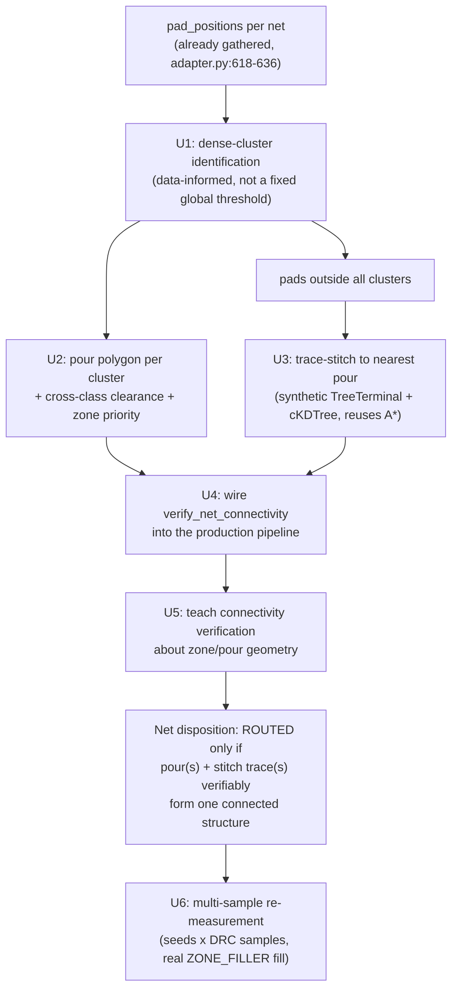

# Hybrid Pour + Trace-Stitch Completion for High-Fanout Plane-Style Nets

## Summary

Six high-fanout plane-style nets (`PWR_RTN`, `+3V3`, `vcc`, `+15V`, `+340V_BUS`, `DC_BUS_RTN`, plus smaller counts on others) fail to complete via the tree executor even with resilience (already shipped) and correct multi-layer routing. Three prior single-mechanism attempts at a copper-pour workaround failed for opposite reasons: a board-spanning bounding box (58-96% of board area, still on `main` today, flag-gated off), then over-aggressive spatial clustering (a fixed 2.5mm threshold fragmented `+3V3`'s 40 pads into 38 disconnected islands).

This plan replaces the single-mechanism approach with a hybrid: pour each net's dense pad cluster(s) with a keepout-aware, cross-class-clearance-respecting polygon, and trace-stitch any pad outside all dense clusters back to the nearest pour via the existing tree executor. Verification is upgraded to match — this work also wires the real geometric connectivity verifier (`verify_net_connectivity`) into the production pipeline for the first time (it exists, is well-tested, but is never actually called by `route_pcb()` today) and extends it to understand zone/pour geometry, so a net reported `ROUTED` via this hybrid path is verifiably, geometrically connected — not inferred from bookkeeping.

`enable_all_pad_tree`/`enable_zone_pours` stay behind their existing default-off flags. Promotion is gated on real, multi-sample DRC measurement (R14) showing production `unconnected_items` below the honest 260 baseline with corpus at 0 — not on this plan's own success criteria alone.

---

## Requirements Traceability

| Origin Requirement | Addressed By |
|---|---|
| R10 (identify dense pad cluster(s), avoid PR #267's fixed-threshold failure) | U1 |
| R11 (cross-class clearance + KiCad zone priority) | U2 |
| R12 (trace-stitch isolated pads to nearest pour) | U3 |
| R13 (verifiably one connected copper structure) | U4, U5 |
| R14 (multi-sample re-measurement before promotion) | U6 |

---

## High-Level Technical Design

*This illustrates the intended approach and is directional guidance for review, not implementation specification. The implementing agent should treat it as context, not code to reproduce.*

**Corrected starting point (verified against `main`, not assumed):** `zone_emission.py`'s bounding-box shape code, `enable_zone_pours` flag plumbing, `_zone_layers_for_net`, `_zone_params_for_net`, and the pad-position-gathering loop in `_write_routes_to_content` are all already on `main` (PR #260-263, merged) — flag-gated off by default. This work replaces the shape-selection logic (U1) and adds the missing clearance/priority layer (U2), it does not build zone emission from scratch. PR #267's cross-class clearance/priority/clustering code is **not** on `main` (that PR closed without merging) — it exists only in git history and as prior art in two solutions docs recovered onto branch `docs/recover-zone-pour-diagnosis-docs` (**open as PR #269, not yet merged** — see Dependencies/Assumptions); the clearance/priority mechanism is well-understood and directly reusable in spirit, but must be re-created as new commits, not cherry-picked wholesale (the clustering part of that PR is exactly what U1 replaces, not reuses).

**Dense-cluster identification (U1):** avoid PR #267's specific failure mode — a single fixed distance threshold (2.5mm) applied uniformly, when real inter-pad spacing on this board ranges from ~0.6mm (adjacent pins on one component) to 70-111mm (median, across scattered components). The threshold must be derived from the actual data per net (e.g., a k-nearest-neighbor distance elbow, or `scipy.cluster.hierarchy` with a data-driven cut), not a single global constant. `scipy>=1.10.0` is already a dependency, unused in `router_v6` today.

**Trace-stitching (U3):** no "route to a region" capability exists anywhere in this codebase's A* today — `execute_terminal_tree` and `terminal_tree.py`'s Prim planner are strictly point-to-point (`PadIdentity` → `PadIdentity`). The natural fit is a synthetic `TreeTerminal` representing the nearest point on (or pad already covered by) a pour polygon, used as an ordinary edge target — this reuses `_astar_route`'s existing point-to-point machinery unmodified rather than inventing a new A* goal-shape type. `scipy.spatial.cKDTree` (available, unused) is the natural tool for "nearest pour" queries.

**Connectivity verification (U4, U5):** `execute_terminal_tree`'s module/function docstrings claim `verify_net_connectivity` is "the sole authority" for disposition — this is not true today. Disposition is computed inline as `len(connected) == len(terminals)`, and `verify_net_connectivity`/`connectivity_preflight` (`connectivity.py`, `kicad_connectivity.py`) — a real, tested, geometric union-find over pad/track/via touch predicates — is never called in production (`pipeline.py`'s `compile_routing_results` call omits `connectivity=`). Per explicit direction, this plan wires the real verifier into production (U4, valuable and testable independent of zones — it closes a pre-existing gap for ordinary trace-based nets too) and then extends it with zone/pour geometry awareness (U5) — a new `CopperZone`/`CopperPour` primitive and touch predicates (`_zone_touches_pad`, `_zone_touches_track`, `_zones_touch`), analogous to the existing `_pads_touch`/`_track_touches_pad`/`_via_touches_pad`, plus zone-geometry extraction in `kicad_connectivity.py`'s post-write parser.

---

## Implementation Units

### U1. Data-informed dense-cluster identification for pour-eligible nets

**Goal:** For each net in the R8 target list, group its pad positions into dense spatial cluster(s) using a threshold derived from that net's own pad-distance distribution, not a fixed global constant — replacing `zone_emission.py`'s `_bounding_box` (still live on `main`, flag-gated) as the shape-selection input.

**Requirements:** R10 (origin doc)

**Dependencies:** None (first unit)

**Files:**
- `packages/temper-placer/src/temper_placer/router_v6/zone_emission.py` — new clustering function, consumed instead of (or alongside, for the continuity-sensitive case below) `_bounding_box`
- `packages/temper-placer/src/temper_placer/router_v6/adapter.py` — the existing zone-emission call site (`adapter.py:726-755`, live on `main`) loops one `compute_zone_for_net()` call per net, returning a single `ZoneDefinition`. Clustering returning multiple clusters per net requires restructuring this loop to iterate per-cluster and emit N zones for that net — a real, necessary change here, not confined to `zone_emission.py`.
- `packages/temper-placer/tests/router_v6/test_zone_emission.py` — new test coverage

**Approach:** For each net's `pad_positions` (already gathered at `adapter.py:618-636`, unaffected by anything this plan touches), compute a data-informed clustering — e.g. hierarchical clustering (`scipy.cluster.hierarchy.linkage` + `fcluster`) cut at a threshold derived from that specific net's own nearest-neighbor distance distribution (a large gap between "adjacent pins on one component" distances and "different components" distances is the natural cut point), rather than PR #267's single global 2.5mm constant. Return one or more spatial clusters per net. `GND`/`ACMains`/`HighVoltage`-class nets (return/ground paths, per the origin doc's electrical justification for continuous planes) should be evaluated for whether they need a continuity exemption similar to PR #267's `_CONTINUITY_EXEMPT_CLASSES` — but re-derive this decision from real data (which of the six target nets are actually this class — `PWR_RTN` is `GND`, `+340V_BUS`/`DC_BUS_RTN` are `HighVoltage`) rather than assuming the prior PR's specific carve-out is still the right one now that clustering itself is data-informed instead of fixed-threshold.

**Patterns to follow:** `packages/temper-placer/src/temper_placer/core/courtyard.py`'s `shapely` usage pattern (Polygon construction, affine ops) for the geometry side; `netclass_loader.py`'s `TEMPER_NET_ASSIGNMENTS` lookup for netclass resolution, already used identically in `_zone_layers_for_net`.

**Test scenarios:**
- Happy path: a net whose pads are all mutually close (e.g. adjacent pins on one component) produces exactly one cluster.
- Happy path: a net with pads in two genuinely separated groups (e.g. simulating `+3V3`'s real distribution) produces two clusters, each covering only its own dense group — not 38 near-singleton clusters (regression coverage for PR #267's specific failure mode, using the real board's measured distance distribution: median 70-111mm, min ~0.6-2.5mm within-component).
- Edge case: a net with a single pad produces a single degenerate "cluster" of one, handled without crashing.
- Edge case: a net whose pads are so uniformly scattered that no natural gap exists (e.g. simulating `PWR_RTN`'s 88 pads) — document and test the resulting behavior explicitly rather than silently producing an arbitrary result. **`PWR_RTN` specifically carries ~174 of the ~336 total unconnected-item entries across all six target nets (roughly half) — this net's outcome is not a minor edge case, it's the single largest lever U6's aggregate measurement has.** Building its continuity exemption (one pour over all its pads, per the `GND`-class EMI/loop-area justification) is in scope for this unit, not merely "evaluated" — if real data shows no natural clustering gap for `PWR_RTN` (plausible for 88 scattered pads), the exemption path must be exercised and tested, not left as an unresolved "likely" outcome.
- Integration scenario: the clustering output, fed through U2's pour generation, produces materially fewer total zone instances than PR #267's 162 (measured on the real production board) — this is the concrete, falsifiable target this unit should move.

**Verification:** Unit tests pass; running the clustering against the real production board's six target nets produces a cluster count per net that is inspected and sanity-checked against the real component layout (not just asserted programmatically) before moving to U2.

---

### U2. Cross-class pairwise clearance + native KiCad zone priority

**Goal:** Re-create (fresh, on `main`) the cross-class clearance resolution and KiCad-native `(priority N)` mechanism PR #267 prototyped and this session's code review independently verified as correct — the part of that closed PR that was never the problem.

**Requirements:** R11 (origin doc)

**Dependencies:** U1 (consumes its cluster output to generate one pour polygon per cluster)

**Files:**
- `packages/temper-placer/src/temper_placer/router_v6/adapter.py` — thread `design_rules` into `_write_routes_to_content` (currently NOT present on `main`; this is a real prerequisite, not already done — verify the exact current signature before assuming)
- `packages/temper-placer/src/temper_placer/router_v6/zone_emission.py` — `ZoneDefinition` gains a `priority: int` field; emit `(priority N)`
- `packages/temper-placer/tests/router_v6/test_adapter.py`, `test_zone_emission.py` — new test coverage

**Approach:** Mirror `netclass_constraints.py:106-119`'s pattern exactly: `effective_clearance = max(own_clearance, class_pairs.get(sorted_pair_key, {}).get("clearance", max(own, other)))`, resolved via `TEMPER_NET_ASSIGNMENTS`-derived netclass names (matching `_zone_layers_for_net`'s existing lookup, not the coarser `classify_net_type()` CP-SAT uses elsewhere — a mismatch here silently breaks every `class_pairs` lookup, as documented in the recovered solutions doc). Read `class_pairs` via `getattr(design_rules, 'class_pairs', {})`, and **explicitly avoid the "decoy trap"**: `result.pcb.design_rules` is a different, unrelated `stage0_data.DesignRules` class with no `class_pairs` concept — the real `design_rules` must be threaded as an explicit parameter into `_write_routes_to_content`, not assumed reachable via `result.pcb`. Invert each net's `dru_priority` (`TEMPER_NET_CLASSES`, already the AGENTS.md-mandated N4 SSOT ranking) into KiCad's higher-wins zone priority scheme.

**Patterns to follow:** `packages/temper-placer/src/temper_placer/placer/cp_sat/netclass_constraints.py:106-119`; `docs/solutions/architecture-patterns/netclass-clearance-ssot-designrules-consumer-chain-2026-07-07.md`; `docs/solutions/logic-errors/missing-cross-class-zone-clearance-regression-2026-07-21.md` for the exact prior-art mechanism and its "decoy trap" warning — **this doc is on PR #269, not yet on `main`; merge it (or inline the mechanism description below) before starting U2** (see Dependencies/Assumptions).

**Test scenarios:**
- Happy path: a `vcc` (Power, 0.25mm) pour and a `+340V_BUS` (HighVoltage, 6.0mm) pour on the same board resolve to 6.0mm effective clearance for `vcc` — the stricter applicable rule.
- Happy path: two pours of the same netclass keep their own class's clearance, unchanged (never weaken an existing guarantee).
- Edge case: a netclass with no explicit `class_pairs` entry against another present class falls back to `max(own, other)`.
- Integration scenario: the resolved clearance value is the value that reaches the emitted `(zone ... (connect_pads yes (clearance N)))` s-expression, and after a real `pcbnew.ZONE_FILLER` fill, the filled polygon respects it — not just that the Python function returns the right number in isolation (per `docs/solutions/conventions/verify-netclass-clearance-on-the-routing-path-2026-07-12.md`'s standing caution about this exact class of bug in this codebase).
- Integration scenario: calling `route_pcb(..., design_rules=<populated>, enable_zone_pours=True)` end-to-end produces zones whose emitted clearance reflects cross-class resolution — confirming `design_rules` was actually threaded through `_write_routes_to_content`, not silently dropped.

**Verification:** Unit tests pass; a manual `pcbnew.ZONE_FILLER` fill of a board with adjacent HV/Power-class pours shows the filled copper maintains the stricter clearance, inspected directly in the output `.kicad_pcb`.

---

### U3. Trace-stitching for pads outside all dense-cluster pours

**Goal:** For any pad of a target net not covered by any dense-cluster pour (U1), route a discrete trace via the existing tree executor connecting it back to the nearest pour.

**Requirements:** R12 (origin doc)

**Dependencies:** U1, U2 (needs cluster boundaries from U1 to know which pads are "outside," and U2's finished pour polygons — with clearance applied — as the actual nearest-pour targets, not just the raw clusters)

**Files:**
- `packages/temper-placer/src/temper_placer/router_v6/terminal_tree.py` — extend or wrap the Prim planner to accept a synthetic pour-boundary terminal
- `packages/temper-placer/src/temper_placer/router_v6/terminal_tree_execution.py` — no structural change expected (reuses `_astar_route`'s existing point-to-point path), but verify this assumption holds during implementation
- `packages/temper-placer/src/temper_placer/router_v6/adapter.py` — this is where U1's per-net cluster/pad data actually lives (the zone-emission call site, `adapter.py:726-755`); U3's stitching needs to be orchestrated from here or fed this data explicitly, not assumed reachable from inside `terminal_tree_execution.py` alone. U3 also needs live `OccupancyGrid`/`net_id` state to call `_astar_route` collision-aware — reachable via `result.stage2.occupancy_grids` / `result.stage4.pathfinding_result.net_ids` on the pipeline's `RouterV6Result`, but not part of any existing public interface between these stages; wiring this through is real, non-trivial integration work for this unit, not incidental plumbing.
- `packages/temper-placer/tests/router_v6/test_terminal_tree.py`, `test_terminal_tree_execution.py` — new test coverage

**Approach:** For each isolated pad, compute the nearest pour (straight-line distance via `scipy.spatial.cKDTree` over pour boundary/representative points, left to implementation whether a routability-aware search is warranted — see Outstanding Questions), construct a synthetic `TreeTerminal` representing that pour's nearest boundary point or an already-connected pad within it, and route a normal point-to-point A* edge from the isolated pad to that synthetic terminal, reusing `_astar_route` unmodified. This is new territory for this codebase (confirmed: no existing "route to a region" concept anywhere in `router_v6`), so treat the synthetic-terminal construction as the core new logic, not a minor extension.

**Patterns to follow:** `terminal_tree.py:46-81`'s Prim-style nearest-terminal selection (`_manhattan` distance, picking the globally-nearest `(connected, remaining)` pair) is the closest existing analog for "nearest X" logic, even though it operates over real terminals, not pour boundaries. **Note this pattern's `_manhattan` is XY-only — it does not account for which copper layer(s) a candidate occupies.** Since `_zone_layers_for_net` already governs which layers a given net's pours live on, and this plan explicitly targets nets on a genuinely multi-layer board, naively copying XY-only nearest-selection risks picking a geometrically-close pour on an unreachable or via-expensive layer over a farther same-layer one. Resolve during implementation whether candidate selection should filter/weight by layer reachability, or whether relying on `_astar_route`'s existing layer-transition costs to absorb a layer-mismatched choice is an acceptable simplification for this iteration — but make the choice deliberately, not by silent inheritance of the XY-only pattern.

**Test scenarios:**
- Happy path: a pad outside all clusters, with one pour nearby, gets a discrete trace connecting it to that pour's nearest point.
- Happy path: a pad equidistant-ish between two pours picks one deterministically (not randomly) — same seed, same result.
- Edge case: no legal path exists from an isolated pad to any pour (congestion-blocked) — this net's disposition must honestly reflect incompleteness (per R5's existing truthful-completion contract, not silently treated as connected).
- Integration scenario: after stitching, the isolated pad's trace endpoint and the pour polygon geometrically overlap (or the trace terminates at an already-covered pad) — the physical precondition U5's connectivity check will verify.

**Verification:** Unit tests pass; visually or programmatically confirmed on a small synthetic board with one dense cluster and one deliberately-isolated pad that the stitching trace actually reaches the pour.

---

### U4. Wire `verify_net_connectivity` into the production pipeline

**Goal:** Close the gap where `execute_terminal_tree`'s docstrings claim `verify_net_connectivity` is "the sole authority" for net disposition, but it is never actually called in production — `pipeline.py`'s `compile_routing_results` call omits `connectivity=`, so `RoutingResults.connectivity` is `None` today and disposition falls back to raw path-count bookkeeping. This is valuable and testable independent of zones (it fixes a real, pre-existing correctness gap for ordinary trace-based nets too) and is a prerequisite for U5.

**This is NOT a pure wiring fix (corrected during plan review — verified against source, not assumed):** `kicad_connectivity.py` defines a `_VIA_RE` regex but never uses it — `_segment_connectivity()` hardcodes `via_list: list[CopperVia] = []` with a stale comment ("the writer does not emit (via ...) entries yet") that is no longer true — `adapter.py`'s `_write_routes_to_content` has emitted real `(via ...)` s-expressions since U5 of an earlier plan. `verify_net_connectivity`'s union-find only joins same-net segments across layers *through* a `CopperVia` touch predicate; with `via_list` permanently empty, any net whose route crosses layers via a via — which is most of a real multi-layer production board — will appear as multiple disconnected components the moment this is wired into production. Via-parsing must be implemented as part of this unit; without it, the "no-op on ordinary nets" verification below would fail immediately.

**Requirements:** R13 (origin doc, prerequisite half)

**Dependencies:** None (independent of U1-U3; can land in parallel, but must land before U5)

**Files:**
- `packages/temper-placer/src/temper_placer/router_v6/kicad_connectivity.py` — implement via extraction using the existing (currently unused) `_VIA_RE` regex, populate real `CopperVia` objects, thread them into `verify_net_connectivity`'s `vias=` argument. This is the actual unblocking work, not `pipeline.py`'s one-line change.
- `packages/temper-placer/src/temper_placer/router_v6/pipeline.py` — pass `connectivity=` through to `compile_routing_results` (currently omitted at the call site around line 1277-1282), **gated behind a new flag defaulting off** (see Approach) rather than unconditionally live.
- `packages/temper-placer/tests/router_v6/test_kicad_connectivity_preflight.py`, `test_all_pad_connectivity.py` — extend existing coverage to assert production wiring, not just standalone unit behavior; add via-crossing test cases (currently zero via-related coverage exists in this test file)

**Approach:** Two real risks, not one wiring change: (1) via-parsing must be implemented first (see above) — without it this unit's own acceptance criterion (no regression on ordinary nets) will fail on any multi-layer board; (2) even after via-parsing lands, `verify_net_connectivity`'s geometric touch predicates have only ever been exercised against synthetic fixtures, never the production board's real emitted geometry, in a codebase with recent, measured history of exactly this class of near-miss geometric bug (commit `8fc2fdb8`, an epsilon-threshold pad-stitching gap found only via property-based mutation testing weeks before this plan). Land this behind a new flag (default off, independent of `enable_all_pad_tree`/`enable_zone_pours`) so a surprise disposition regression on ordinary, already-shipping nets can be reverted by flipping a flag, not by reverting code — matching this plan's existing discipline for `enable_all_pad_tree`/`enable_zone_pours`, which this unit's production-wiring change did not originally extend to itself. Confirm `RoutingResults.success_count`/`failure_count` (`routing_results.py:60-86`) reflects the real geometric verifier's disposition once the flag is on, not the pre-existing raw path-count fallback.

**Patterns to follow:** The existing test-only call sites in `test_kicad_connectivity_preflight.py` for how `connectivity_preflight` is invoked; `docs/solutions/architecture-patterns/via-aware-layer-transitions-completion-chain-2026-07-20.md`'s sequencing discipline (prove a safety-net mechanism works in isolation before relaxing anything that depends on it) — directly applicable here since this unit's own history is the precedent for "verify before trusting."

**Test scenarios:**
- Happy path: a synthetic net with a real via crossing F.Cu→B.Cu is parsed into a `CopperVia`, and `verify_net_connectivity` correctly joins the two same-net segments on either side of it into one connected component (net-new coverage; zero via-related tests exist in `test_kicad_connectivity_preflight.py` today).
- Happy path: an ordinary trace-based net (single-layer, no via) with real, correctly-touching pad/track geometry is reported `ROUTED` by the production pipeline path when the new flag is on (not just the standalone `connectivity_preflight` function in isolation).
- Regression/mutation scenario: deliberately inject a real disconnection (e.g. a track that doesn't actually touch a pad, or a via that doesn't actually touch either layer's track) into a test board, confirm the production pipeline path (flag on) now catches it and reports `INCOMPLETE`.
- Integration scenario: with the new flag ON, run the full existing production + corpus board suite (multi-layer nets included, not just single-layer) and confirm `unconnected_items`/`shorting_items` do not regress versus the flag-off baseline. This is the real acceptance bar — a "should be a no-op" claim is not assumed true; it must be demonstrated on the actual multi-layer production board, where via-crossing nets are common, not just on single-layer synthetic fixtures.

**Verification:** Unit tests pass, including new via-crossing coverage; the mutation-regression test demonstrates the wiring is live in the actual `route_pcb()` path; a full production-board run with the new flag ON (zones off) shows no regression in `unconnected_items`/`shorting_items` versus flag-off — checked against the real multi-layer board, not assumed from the single-layer case.

---

### U5. Teach connectivity verification about zone/pour geometry

**Goal:** Extend the now-production-wired `verify_net_connectivity` (U4) with a `CopperZone`/`CopperPour` primitive and geometric touch predicates, so a net completed via pour+stitch (U1-U3) can be verifiably confirmed `ROUTED` by the same real geometric authority ordinary trace-based nets use — not a separate, weaker bookkeeping check.

**Requirements:** R13 (origin doc, zone-aware half)

**Dependencies:** U1, U2, U3 (needs real pour+stitch output to verify against), U4 (needs the production wiring in place first)

**Files:**
- `packages/temper-placer/src/temper_placer/router_v6/connectivity.py` — new `CopperZone` dataclass; `_zone_touches_pad`, `_zone_touches_track`, `_zones_touch` predicates, analogous to existing `_pads_touch`/`_track_touches_pad`/`_via_touches_pad` (lines 215-283); extend the union-find to include zone primitives
- `packages/temper-placer/src/temper_placer/router_v6/kicad_connectivity.py` — extend the post-write regex parser to extract `(zone ...)` blocks (outline and/or filled-polygon geometry, depending on when this runs relative to `pcbnew.ZONE_FILLER` fill — resolve during implementation) alongside its existing `(segment ...)`/`(via ...)` extraction
- `packages/temper-placer/tests/router_v6/test_all_pad_connectivity.py` or a new `test_zone_connectivity.py` — new test coverage following the synthetic-fixture-plus-Hypothesis-property style of existing connectivity tests

**Approach:** Model zone/pour geometry as a first-class copper primitive in the same union-find `verify_net_connectivity` already runs over pads/tracks/vias, using shapely polygon-overlap predicates (already a dependency, already used for polygon geometry elsewhere in this codebase) for the zone-touches-pad and zone-touches-track checks. A net using hybrid completion is `ROUTED` only when its pour(s) and stitch trace(s) end up in one connected component in this same union-find — directly matching R5's existing truthful-completion contract (a net is `ROUTED` only when every pad is verifiably in one copper component), extended to cover pour-covered pads rather than only trace-connected ones.

**Patterns to follow:** `connectivity.py:215-283`'s existing touch-predicate style for the new zone predicates; `test_kicad_connectivity_preflight.py`'s synthetic-PCB-content-then-assert-disposition pattern for the new tests.

**Test scenarios:**
- Happy path: a pad geometrically inside a pour polygon (same net) is counted as connected to that pour's component in the union-find.
- Happy path: a net with one pour and one stitch trace, where the stitch trace's endpoint touches the pour polygon, is reported `ROUTED` — the full hybrid-completion path, end to end.
- Edge case: a pad that's supposed to be covered by a pour but geometrically falls just outside it (e.g. a pour computed with insufficient margin) is correctly reported as NOT connected — this is the precondition that would have caught PR #263's original (238 vs 260) partial-improvement claim, had it existed then.
- Error path: a pour of one net's copper touching a pad of a *different* net (a real short) is reported as a conflict, not silently ignored by the connectivity checker — even though DRC's `shorting_items` check is a separate mechanism, this unit's own zone-aware union-find should not produce a false `ROUTED` verdict in this case.
- Integration scenario: end-to-end, route the six target nets on the production board with U1-U3's hybrid completion active, and confirm the U4+U5-wired production pipeline reports accurate dispositions matching a manual/independent geometric inspection of the output `.kicad_pcb` — not just that the unit tests pass on synthetic fixtures.

**Verification:** Unit tests pass; the end-to-end integration scenario's dispositions are manually cross-checked against the real output PCB for at least one of the six target nets before trusting U6's aggregate measurement.

---

### U6. Multi-sample re-measurement

**Goal:** Confirm the combined U1-U5 work actually improves `unconnected_items` for the six target nets without regressing `shorting_items`, measured the same rigorous way this session's own investigation established as necessary to trust any such claim.

**Requirements:** R14 (origin doc)

**Dependencies:** U1, U2, U3, U4, U5 (measures their combined effect)

**Files:**
- `packages/temper-placer/tests/placer/cp_sat/test_hybrid_pour_stitch_measurement.py` (new) — standalone verification test, following the pattern of `test_zone_pour_production_measurement.py` (already on `main`, PR #260-263) and the (currently absent from `main`, needs re-creating) multi-sample methodology from PR #267's own U4 test
- Uses `tests.conftest.make_parsed_pcb_stub` — **ships with PR #268 (`fix/parsed-stub-missing-nets`), which is open but not yet merged as of this plan's writing.** U6 is blocked on that merge (see Dependencies/Assumptions), not ready to start today.

**Approach:** Route the production board across 4+ seeds with `enable_all_pad_tree=True, enable_zone_pours=True`, fill via real `pcbnew.ZONE_FILLER`, run `kicad-cli pcb drc` 3+ times per board, and compare `shorting_items`/`unconnected_items` distributions against a zones-off baseline measured the same way — mirroring the exact methodology this session validated as necessary (single-sample comparisons were shown twice in this codebase's history to be indistinguishable from noise). This is a standalone verification unit, not a new CI-blocking job — `enable_all_pad_tree`/`enable_zone_pours` stay behind their existing default-off flags; promotion (R9, already defined in the origin doc) is a separate decision this unit only produces evidence for.

**Patterns to follow:** `tests/placer/cp_sat/test_zone_pour_production_measurement.py`'s existing helpers (`_kicad_cli_available`, `_fill_zones_via_pcbnew`, `_run_drc`); the multi-sample methodology already proven in this session's own investigation (4 seeds × 3 DRC samples was sufficient to get non-overlapping distributions when a real effect was present).

**Test scenarios:**
- Covers R14. Given U1-U5 have shipped, when the production board is routed across 4+ seeds with both flags enabled, filled, and DRC'd 3+ times per board, then `unconnected_items` for the six target nets specifically (not just the board-wide aggregate) is measurably reduced versus the flags-off baseline.
- Given the same measurement, `shorting_items` does not regress beyond the flags-off baseline's own range — the specific failure mode of all three prior attempts.
- Test expectation: this unit produces a measurement report, not a pass/fail CI gate — consistent with R9's existing promotion-gate discipline (measure, don't assume).

**Verification:** Running the new test locally produces the distribution comparison table; results are recorded (a dated solutions-doc addendum, following this session's own established pattern) as the evidence base for the R9 promotion decision.

---

## Scope Boundaries

### Deferred to Follow-Up Work
- Promoting `enable_all_pad_tree`/`enable_zone_pours` to default-on (R9) — this plan's success criterion is U6's measurement showing improvement, not promotion itself.
- Wiring U6's verification into CI as a blocking or informational job — standalone/manual for this plan, CI integration is follow-up once proven.
- A general-purpose "route to a region" A* capability beyond what U3 needs for pour-stitching specifically — U3 solves this narrowly (synthetic terminal targeting a pour), not as a reusable primitive for other use cases.

### Outside This Plan's Identity
- The `parsed.nets` plumbing fix and the honest 260 baseline it enabled — already shipped separately (PR #268, pending merge; this plan's own premises depend on it landing first or concurrently — see Dependencies/Assumptions).
- The tree-executor resilience work (R1-R6) — already shipped (commit `5b15aaca`), not reopened here.
- Board-capacity/physical-board sequencing (#221) — separate requirements doc.

---

## Key Technical Decisions

- **U1's clustering is data-informed per net, not a fixed global threshold:** PR #267's specific, measured failure was a single 2.5mm constant applied to all nets regardless of real board scale (median real inter-pad distance: 70-111mm). Deriving the cut point from each net's own distance distribution avoids repeating that exact failure mode.
- **U2 re-creates PR #267's clearance/priority mechanism as new work, not a cherry-pick:** that PR's branch history is not mergeable cleanly (closed, diverged), and the mechanism itself — not its code — is what's being reused. The `class_pairs` pattern it mirrored (`netclass_constraints.py:106-119`) is unchanged and still the right pattern to follow.
- **U3's stitching targets a synthetic terminal, not a new A* goal-shape type:** minimizes new surface area in the A* kernel itself by representing "route to a pour" as "route to a specific point," reusing `_astar_route` unchanged.
- **R13 wires the real geometric verifier into production and teaches it zones (U4+U5), rather than extending `execute_terminal_tree`'s lighter bookkeeping:** a more architecturally correct verification path was explicitly chosen over the smaller, lower-risk alternative — accepting the larger scope (production wiring was never live before) in exchange for a real geometric union-find backing every hybrid-completion disposition, not inferred bookkeeping. U4 is scoped as its own unit specifically because it has value (and risk) independent of zones — it's a pre-existing correctness gap for ordinary nets too. A narrower rollout (make the real verifier authoritative only for the six zone/pour target nets, leaving ordinary nets on the existing bookkeeping until U4 is separately proven) was considered and rejected: `execute_terminal_tree`'s docstring already claims the verifier is "the sole authority" for every net, so a partial wiring would compound that existing inaccuracy rather than resolve it. U4's new default-off flag (added during plan review) achieves a similar risk-reduction goal without that inconsistency — the verifier becomes authoritative for every net at once, but only when explicitly enabled.
- **`route_pcb()` call sites that omit `design_rules` entirely (e.g. `adapters/register_strategies.py`'s `RoutingStage.run()`) silently get an empty `class_pairs`, the same "decoy trap" shape U2 fixes for the `result.pcb.design_rules` case — but this is a narrower, pre-existing gap unrelated to this plan's own measurement (U6's test harness already passes `design_rules` correctly) and is left as a follow-up, not blocking work here.**
- **U6 is standalone verification, not CI-wired, matching this session's established pattern:** keeps this plan's footprint on the geometry/verification work itself; CI integration is easy follow-up once proven.

---

## Dependencies / Assumptions

- **This plan's origin document's own factual claims (the honest 260 baseline, the measured six-net target list) depend on PR #268 (`fix/parsed-stub-missing-nets`), which is open but not yet merged.** U6 explicitly cannot start until it merges (it uses `make_parsed_pcb_stub`, which ships with that PR). If it lands after other units start, no conflict is expected for U1-U5 (different files), but R7/R8's "already answered" framing should be re-verified against `main` post-merge before U6's final measurement is trusted.
- **The two solutions docs cited as prior art for U2 (the cross-class clearance mechanism and its "decoy trap" warning) are on PR #269 (`docs/recover-zone-pour-diagnosis-docs`), also open but not yet merged.** U2's own Approach section inlines the load-bearing mechanism description directly, so U2 is not blocked on this merge — but the cited doc path won't resolve to real content on `main` until it lands.
- Assumes `DesignRules.class_pairs` and the `netclass_constraints.py:106-119` resolution pattern remain unchanged during this work — confirmed intact and unaffected by PR #267's closure.
- Assumes `shapely>=2.1.2` and `scipy>=1.10.0` (both already dependencies, currently unused in `router_v6`) are sufficient for U1's clustering and U5's zone-touch predicates — no new dependency required.
- Assumes `verify_net_connectivity`/`connectivity_preflight`'s existing union-find design (pad/track/via touch predicates) generalizes cleanly to a fourth primitive type (zones) without needing a structural rewrite — reasonably likely given the existing predicate-per-pair-type pattern, but worth confirming early in U5 rather than assuming.
- Assumes the multi-sample methodology (seeds × DRC runs) established this session remains a reasonable default for U6; exact counts may be tuned during implementation.

---

## Outstanding Questions

### Deferred to Implementation

- [Affects U1] Exact data-informed clustering method (hierarchical linkage + distance-based cut, k-NN elbow, or something else) — the requirement (must not be a fixed global threshold) is settled; the specific algorithm is not.
- [Affects U1] Exact shape of `PWR_RTN`'s continuity exemption (one pour over all pads, similar to PR #267's `_CONTINUITY_EXEMPT_CLASSES`) — the requirement that this net's outcome be resolved, not left "likely," is now settled (see U1 above, added during plan review since `PWR_RTN` carries roughly half the total defect count); the exact mechanism is implementation detail.
- [Affects U3] Straight-line nearest-pour distance vs. a routability-aware search for "nearest pour" — straight-line is simpler; routability-aware avoids picking a geometrically-close-but-unroutable pour, at the cost of complexity. Related: if the single nearest candidate is congestion-blocked (A* fails), whether U3 retries against the next-nearest pour(s) before declaring the pad unreachable, or accepts that as a known limitation for this iteration — the plan's test scenarios cover "no path to *any* pour" but not "nearest specifically fails, a farther one would work."
- [Affects U5] Whether zone geometry extraction in `kicad_connectivity.py` should use the zone's outline polygon or its computed `filled_polygon` (post-`ZONE_FILLER`) — the outline is available earlier in the pipeline; the filled polygon is more geometrically accurate but requires the fill step to have already run.
- [Affects U4/U5 sequencing] Whether U4 (production wiring) can genuinely ship and be verified as a no-op before U5 starts, or whether the two are tightly enough coupled that they should be developed together despite being separate units — the plan sequences them as a prerequisite relationship; implementation may find they're easier to validate together.
