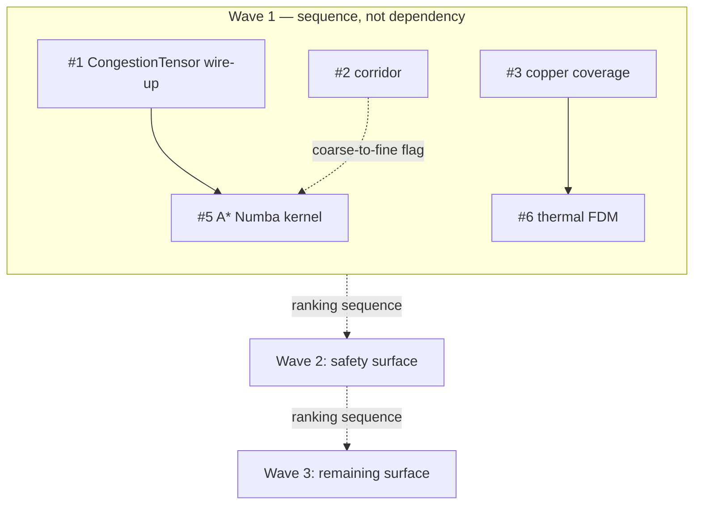

# Python → Rust Migration Roadmap — Plan

## Goal Capsule

**Objective:** Refreshed 2026-07-31. Rank the Python→Rust migration candidates as a three-wave consolidation program: Wave 1 revalidates the six hot-path targets (one is now a wire-up; the DRC clearance migration landed outside the roadmap and is removed from the candidate set), Wave 2 adds the safety-surface candidates (CP-SAT gate encodings, isolation/clearance constraint encoders, thermal/RTD validators, SPICE post-processing), Wave 3 covers the remaining placer/router/validator surface. Every candidate carries a per-driver scorecard; the original verification discipline (TDD, property tests, closure parity) is carried forward unchanged.

**Product authority:** temper-placer + temper-geometry maintainers.

**Open blockers:** None.

---

## Product Contract

### Summary

The roadmap ranks Python→Rust migration candidates in three waves — revalidated hot paths, safety-surface validators and CP-SAT encoders, then the remaining placer/router/validator surface — each scored per driver (performance, safety-confidence, consolidation) with days, risk, and current migration state. The plan's existing verification gates carry forward unchanged; the roadmap commits no engineering capacity against the board path.

### Problem Frame

The original roadmap (this file, 2026-07-23) ranked six hot paths and was never executed: the project pivoted to the fab-ready board, and STRATEGY.md (2026-07-25) records that the critical path is design completion, not tooling. Its prerequisites only partially landed — CP-SAT benchmarks and the profiling setup exist in skeletal form.

The pattern the roadmap established kept delivering anyway. DRC clearance moved to Rust outside the roadmap: `verify_route_clearance` in temper-drc-rs measures 9.7–124× faster than the quadratic Python baseline (180.9s at 3,200 routes), and the manufacturing-DRC stage that consumed 27 minutes and 9.2 GB RSS on a full board now adds ~0.7s to a ~124s route (docs/evidence/2026-07-26-clearance-rust-port.md, docs/evidence/2026-07-26-manufacturing-drc-scalability.md).

In the same period, silent-logic bugs kept being found in Python safety-relevant code: vacuous gate aggregation (a `history[-persistence_window:]` window of 0 returning the whole list), and clearance analysis joining component positions by reference designators that had silently stopped meaning the same part (STRATEGY.md, 2026-07-27 entries). These are domain-logic bugs — Rust does not prevent them — but they define where the safety wave should point: validators and constraint encoders where this class of bug has actually occurred, with parity verified against the corrected behavior.

### Key Decisions

- D1. **Consolidation program, not a one-off list** (session-settled: user-directed — chosen over "background track, low intensity" and "one blocking pain": the eventual surface to migrate is the whole placer/router/validator, ranked by dependency order). Governs R1, R3.
- D2. **Refresh this document in place** (session-settled: user-directed — chosen over a fresh plan: resume continuity; git holds the history of the previous revision).
- D3. **Wave-structured, single merged sequence** (session-settled: user-directed — chosen over two parallel tracks and over a charter-first split: waves give dependency order without forking the ranking).
- D4. **All three drivers, per-driver scorecard** (session-settled: user-directed — chosen over a single composite score: "top" stays readable per axis at the cost of no single winner column). Governs R2.
- D5. **Safety wave targets where Python silent-logic bugs actually occurred** (session-settled: user-approved — the honest promise is memory/type safety and auditable parity, not domain-logic correctness, which the R24 verification gates protect in any language). Governs R6, R7.
- D6. **Verification discipline carries forward unchanged** — TDD, property tests, and closure parity from the original plan, with the U5 path-identity carve-out (see R6 for the rule, KTD7 for the U5 exception). Governs R6.

### Requirements

**Roadmap structure**

- R1. The roadmap ranks all Python→Rust candidates in three waves: Wave 1 revalidated hot paths, Wave 2 safety-surface validators and CP-SAT constraint encoders, Wave 3 the remaining placer/router/validator surface; within Waves 1–2, candidates are ordered by dependency, and Wave 3 candidates are enumerated with ranking deferred until Waves 1–2 land.
- R2. Each Wave 1–2 candidate carries a per-driver scorecard — performance, safety-confidence, consolidation — plus days, risk, home crate, and current migration state (not started / Rust implementation exists but unwired / landed).
- R3. The waves are independently deliverable, but the program is one coherent migration of the surface, not three separate initiatives.

**Revalidation**

- R4. Candidates whose state changed since 2026-07-23 are recorded with their new state, never re-proposed as fresh work:
  - CongestionTensor: a Rust implementation already exists in temper-geometry but the Python copy remains in use — the candidate is now a wire-up, not a write.
  - DRC route clearance: landed 2026-07-26 in temper-drc-rs — removed from the candidate set.
- R5. Wave 1 keeps the six original candidates and their original perf estimates, updated only where evidence changed.

**Verification discipline**

- R6. Every migration satisfies the three original gates: TDD with the Python reference implementation as oracle, property-test invariants per the per-target counts below, and output parity against the closure test suite. For U5, path identity is cell-sequence equality with bit-identical output where float evaluation order is preserved (KTD7). Per-target counts carry from the original plan:

| Target | TDD tests | PBT properties | Induction proof |
|--------|:---:|:---:|:---:|
| CongestionTensor | 4 | 5 | grid-cell |
| corridor | 1 | 3 | component-count |
| copper coverage | 3 | 5 | layer-count |
| channel widths | 2 | 5 | grid-resolution |
| A* Numba kernel | 5 | 6 | path-length |
| thermal FDM | 3 | 5 | mesh-refinement |

- R7. Safety-wave parity is verified against the current, bug-fixed Python behavior — never against a pre-fix snapshot of a module that had a documented defect.

**Execution framing**

- R8. The roadmap commits no engineering capacity: it is a ranked, dependency-ordered backlog, and pulling a wave into execution is a separate decision. STRATEGY.md's "critical path is design completion, not tooling" is not overridden here.

### Ranked Migration Targets

#### Wave 1 — hot paths (revalidated)

| # | Candidate | State | Days | Risk | Perf gain | Home crate | Validation |
|---|-----------|-------|:---:|:---:|---|---|---|
| 1 | CongestionTensor | Rust impl exists, Python still in use — wire-up | 1–2 | Low | Unblocks #5 | temper-geometry | cost/increment bit-identical float32 vs Python oracle |
| 2 | corridor | Not started | 1 | Very low | Warm-up win | temper-geometry | boolean masks element-wise on 10 corpus boards |
| 3 | copper coverage | Not started | 5–7 | Medium | 5–15× rasterization | temper-geometry | grid arrays fp64 tol 1e-15 |
| 4 | channel widths | Not started | 5–8 | Medium | 3–8× EDT lookup (scipy → `edt` crate) | temper-geometry | node/edge widths tol 1e-6 mm |
| 5 | A* Numba kernel | Not started | 8–12 | High | 1.5–2× + Numba cold-start elimination | temper-rust-router-core | closure suite, path identity per KTD7 |
| 6 | thermal FDM | Not started | 10–15 | High | 10–50× matrix assembly | temper-thermal (new) | T_grid tol 1e-12 K |

Dependency chain within the wave (verified against the code, KTD10): #1 feeds #5 (kernel consumes the congestion flat array); #2 feeds #5 when coarse-to-fine is enabled (corridor mask); #3 feeds #6 (thermal FDM consumes copper coverage). #4 is independent — its consumers are router pipeline stages. Cross-wave arrows are ranking sequence, not dependency (R3).

#### Wave 2 — safety surface (new)

| Candidate | Days | Risk | State | Safety signal | Perf | Consolidation | Home crate (candidate) |
|---|---|---|---|---|---|---|---|
| CP-SAT gate encodings (~1.2k LOC, largest Python module in the package) | 3–5 | Medium | Not started | High — encodes physics-gated constraints under R24 | Medium — encoding loops | Medium | temper-constraints or new CP-SAT crate |
| HV/LV isolation + clearance constraint encoders | 5–8 | Medium | Not started | High — REQ-SAFE; bug history (vacuous aggregation, broken joins, 07-27) | Medium | High — adjacent to temper-drc-rs | temper-drc-rs-adjacent or new |
| Thermal/RTD validators | 5–8 | Medium | Not started | High — protection gates THM-01/02 | Low | Medium — shared domain with #6 | temper-thermal |
| SPICE result post-processing | 3–5 | Low | Not started | Medium — feeds gate measurements | Medium | Medium | temper-dsn-adjacent or new |

No hard dependencies inside Wave 2; order by safety-criticality × bug history. Validation follows the same two-tier pattern as Wave 1 (element-wise array comparison, bit-identical where float32) under R6's gates, with per-candidate TDD/property counts fixed at planning.

#### Wave 3 — remaining surface

Core board/netlist/loop models, I/O exporters and config loading, heuristics, CLI, and the remaining router stages. Ranked later: Wave 1 and Wave 2 establish the bridge patterns and crate boundaries this wave inherits. Nothing in Wave 3 is active scope today.

### How This Work Fits Together

<!-- ce-section: work-relationships -->

This plan owns the refreshed migration ranking. Surrounding work, current understanding rather than committed roadmap:

- Depends on CP-SAT benchmarks (docs/plans/2026-07-23-001-perf-cp-sat-benchmarks-plan.md) and profiling setup (docs/plans/2026-07-23-002-perf-profiling-setup-plan.md) — partially landed; they provide before/after validation for Wave 1 claims.
- Context, not scope: the fab-ready board pivot (docs/plans/2026-07-24-001-feat-close-honesty-tangent-pivot-to-fab-ready-plan.md, STRATEGY.md 2026-07-25) — the critical path this roadmap must not block (R8).
- Enables CI pipeline speedup (docs/plans/2026-07-23-004-perf-ci-pipeline-speedup-plan.md) by removing Python hot loops from test wall time.
- Shares boundaries with package consolidation (docs/plans/2026-07-25-003-refactor-package-consolidation-plan.md), which keeps this roadmap as-is.

### Scope Boundaries

- Deferred for later: the ~33k LOC of tooling and CI gates under `scripts/` — glue and gates, churny by design, not product surface; stays Python.
- Deferred for later: a one-shot whole-surface migration (e.g., the ~29k LOC router as a single unit) — decomposition into waves is the point of this roadmap.
- Never in scope: firmware.
- Not in scope: final adoption of the sparse solver and `edt` crate remains spike-gated per KTD8/KTD9; per-wave bridge patterns beyond KTD1 are planning's job.

### Dependencies / Assumptions

- Assumption: migrated modules exit the Python coverage gate and import-linter contracts by the established pattern (Rust crates are not linter subjects; coverage gates `temper_placer` Python only). Stale allowlist entries for migrated modules are removable per the monotonic-shrink rule (deletion from source).
- Assumption: the Numba A* path stays as the fallback under a dispatch flag until #5 lands, per the TEMPER_SAT_BACKEND precedent (docs/plans/2026-06-28-001-feat-router-v6-rust-topology-plan.md).
- Dependency: Wave 1 before/after comparisons need the profiling setup (2026-07-23-002) in a runnable state; exact bench commands are planning's job.

### Outstanding Questions

Deferred to Planning:

- Wave 2/3 home-crate assignments and bridge patterns beyond the candidates listed.

Settled by this plan's Planning Contract (see KTDs): `temper-thermal` as a new crate (KTD5), Numba→Rust A* determinism policy (KTD7), sparse-solver choice (KTD9), `edt` crate adoption (KTD8).

### Sources / Research

- This file's prior revision (2026-07-23), via git history — the six original targets, verification gates, and estimates this refresh validates.
- DRC clearance port: docs/evidence/2026-07-26-clearance-rust-port.md; manufacturing-DRC scalability: docs/evidence/2026-07-26-manufacturing-drc-scalability.md.
- Stage-3 SAT already in Rust, with profile: docs/evidence/2026-07-27-first-route-and-profile.md, docs/evidence/2026-07-27-stage3-model-and-rewrite.md.
- Silent-logic bug history: STRATEGY.md "Vacuous aggregation" and "clearance analysis joining on the wrong components" (2026-07-27).
- Bridge patterns: docs/plans/2026-06-28-001-feat-router-v6-rust-topology-plan.md (flag dispatch), docs/plans/2026-07-08-002 (rlib/core crate split, GIL fix), docs/plans/2026-07-11-001 (strangler-fig); `make extensions` / `make extensions-check` / `make venv-isolate` targets in the root Makefile.

---

## Planning Contract

### Key Technical Decisions

- KTD1. **Strangler-fig wrappers, zero call-site churn.** Each Python module keeps its public API and import path; internals delegate to the Rust pyclass/pyfunction. Call sites (route_stage, astar_search, astar_reconstruct) change only where the API genuinely grows. Follows the geometry re-export pattern (temper_placer/geometry/__init__.py) and the DRC strangler precedent (temper-drc-rs).
- KTD2. **Float parity policy.** Rust computes in f32 where Python does float32 math; parity tests compare the Python oracle output cast to f32 (f64→f32 of a correctly-rounded f64 is the correctly-rounded f32, so the comparison is exact). Where Python computes in float64 (log1p on a float64 raw), Rust uses f32 and the comparison is f32-cast both sides.
- KTD3. **CongestionTensor flat-array exposure without a numpy dependency.** The Rust side exposes its data as bytes (PyBytes) or a Vec copy; the Python wrapper presents `array` as `np.frombuffer(...).reshape(...)`. One copy per A* call — negligible against the ~1s search. No new numpy-crate dependency (version-matching risk with pyo3 0.29).
- KTD4. **world→grid mapping stays Python.** `grid.world_to_grid` is a Python method; the wrapper maps coordinates then batches the increments into a new Rust `increment_cells(pairs, weight)` method instead of a per-cell FFI loop.
- KTD5. **Home crates.** U1–U4 land in temper-geometry; U5 in temper-rust-router-core (rlib core + thin wrapper, per the 07-08 crate-split precedent); U6 in a new `temper-thermal` crate — thermal domain is separate from geometry, and temper-geometry is geometry-only.
- KTD6. **U5 ships behind a dispatch flag** (TEMPER_SAT_BACKEND precedent): env-var selection of the Rust kernel with the Numba kernel as fallback; cutover only after closure parity on the corpus. U1–U4 and U6 replace in place — default behavior is inert or parity-verified, so no flag.
- KTD7. **U5 path identity is cell-sequence equality.** Bit-identical closure output requires identical float evaluation order; the acceptance is identical cell sequences (paths), with bit-identical output where arithmetic order is preserved. Recorded in VERIFICATION.md per module.
- KTD8. **`edt` crate adoption is spike-gated in U4.** Spike executed 2026-07-31: the crate was REJECTED — its distance field diverges from scipy's `distance_transform_edt` (measured max diff 2.0–2.236 on random masks, even with a False-border padding workaround and transposed layout; the crate hardcodes grid-edge clamps). scipy's transform stays (C-speed, never the hot loop); a Rust-native exact EDT is the recorded fallback for a follow-up. U4's delivered win is the batched width lookup.
- KTD9. **U6 sparse-solver and tolerance: measured, not pre-fixed.** Spike executed 2026-07-31: faer 0.24.4 vs scipy spsolve agree to max 5.1e-13 K on the 2500-cell FDM matrix (residuals ~1e-15; independent dense-solve oracle on 20×20 confirms both to ~7e-13 K). Verdict: faer is numerically viable but adoption is NOT warranted — no perf win at these sizes and it would break bit-parity with the deterministic reference. scipy stays; the measured contract is recorded in temper-thermal/VERIFICATION.md and the differential suite.
- KTD10. **Verified dependency chain.** Real edges: U1→U5 (kernel consumes the congestion flat array), U2→U5 (corridor mask consumed by the constrained A* when coarse-to-fine is enabled), U3→U6 (thermal FDM consumes copper coverage). U4 is independent — its consumers are router pipeline stages, not the A* kernel or thermal FDM; U6 does not wait on U4.

## Implementation Units

### U1. Wire the existing Rust CongestionTensor into the router

- **Goal:** Route stage, astar_search, and astar_reconstruct use the Rust tensor from temper-geometry via a Python wrapper with the identical API; Python-only storage is removed from the hot path.
- **Files:** packages/temper-geometry/src/congestion_tensor.rs (extend), packages/temper-geometry/src/bridge.rs (register new methods), packages/temper-placer/src/temper_placer/router_v6/congestion_tensor.py (wrapper), tests: packages/temper-geometry/src/congestion_tensor.rs unit tests, packages/temper-placer/tests/router_v6/test_congestion_tensor_rust_differential.py, packages/temper-placer/tests/geometry/test_congestion_tensor_pbt.py.
- **Patterns:** strangler-fig wrapper (KTD1), geometry `__init__.py` re-export, differential parity tests (test_kicad_transform_rust_differential.py), proptest invariants.
- **Rust additions:** `increment_cells(pairs: Vec<(usize, usize)>, weight: f32)` batch method; flat-array exposure per KTD3. Python wrapper adds `increment_path(coords, grid, weight)` mapping via `grid.world_to_grid` then batching (KTD4); `array` property per KTD3 with the no-cache invariant; `weight`/`max_cost` passthrough.
- **Test scenarios:** three-way parity on fixed paths — Rust `cost()` vs the Python oracle's `cost()` (f32-cast, KTD2) AND vs the Numba kernel's actual formula (f32 `log(1+raw)`, the production consumer; rounds to 0 for raw < ~1e-7 where log1p does not); increment/decay/reset parity; increment_path on a real grid maps and increments identically (spot-check including out-of-bounds skip); weight passthrough; non-zero-weight A/B routing (Rust-backed vs Python-backed) as the closure gate — the default weight is 0.0, which makes the tensor inert and the plain closure run vacuous for this unit.
- **PBT:** cost monotonically increasing with usage; cost ≥ 1.0; increment+decay(1.0) ≈ identity; weight linearity; reset-zero. (5 properties, per the original plan.)
- **Verification:** `cargo test` in temper-geometry; differential pytest (three-way per test scenarios); `python3 scripts/ci_closure_test.py` bit-identical before/after plus a non-zero-weight A/B routing comparison; VERIFICATION.md with grid-cell induction.
- **Risk:** f32 vs f64 log1p mismatch (KTD2); the kernel's `log(1+raw)` formula differs from both (covered by the three-way test); `.array` staleness if the wrapper caches (no-cache invariant, KTD3).

### U2. Corridor mask builder in Rust

- **Goal:** `extract_corridor_mask` moves to temper-geometry; Python wrapper keeps the signature.
- **Files:** packages/temper-geometry/src/corridor.rs (new), bridge.rs registration, packages/temper-placer/src/temper_placer/router_v6/corridor.py (wrapper), tests: test_corridor.py (extend to differential), test_corridor_pbt.py.
- **Patterns:** pure-function pyfunction, strangler-fig wrapper, element-wise mask parity.
- **Test scenarios:** boolean mask identical element-wise on 10 corpus boards (mask parity); clamping at fine-grid bounds; buffer 0; coarse_path empty.
- **PBT:** corridor is connected for connected coarse paths; bounded within grid; symmetric under coarse-path reversal. (3 properties.)
- **Verification:** cargo test; differential pytest; VERIFICATION.md with component-count induction; closure suite.
- **Risk:** minimal (49-line pure function); bool-dtype conversion exactness.

### U3. Copper coverage rasterisation in Rust

- **Goal:** `copper_coverage_grid` and the polygon rasterisation hot loops move to temper-geometry.
- **Files:** packages/temper-geometry/src/copper_coverage.rs (new), bridge.rs, packages/temper-placer/src/temper_placer/physics/copper_coverage.py (wrapper), tests: test_copper_coverage_rust_differential.py, test_copper_coverage_pbt.py.
- **Patterns:** array-returning pyfunction; fp64 element-wise parity (tol 1e-15); strangler-fig.
- **Test scenarios:** grid arrays identical element-wise on corpus boards (1e-15); empty board → zero coverage; full-copper board → 1.0; layer aggregation.
- **PBT:** values bounded [0, 1]; monotonic in copper weight; empty-zero; full-one; additive across disjoint polygons. (5 properties.)
- **Verification:** cargo test; differential pytest; closure suite; VERIFICATION.md with layer-count induction.
- **Risk:** rasterisation edge conventions (polygon fill rule) — parity tests must cover slivers and touch-along-edge cases.

### U4. Channel widths EDT path in Rust

- **Goal:** `compute_channel_widths` and the EDT width lookup move to Rust; scipy dependency leaves the hot loop.
- **Files:** packages/temper-geometry/src/channel_widths.rs (new, incl. EDT kernel per KTD8), bridge.rs, packages/temper-placer/src/temper_placer/router_v6/channel_widths.py (wrapper), tests: test_channel_widths_rust_differential.py, test_channel_widths_pbt.py.
- **Patterns:** array-returning pyfunction; corpus parity at 1e-6 mm; edt-crate spike gate (KTD8).
- **Test scenarios:** node/edge widths identical (1e-6 mm) on corpus boards; cached-EDT path byte-identical reuse; fingerprint invalidation.
- **PBT:** widths non-negative; monotonic (wider boundary → wider width); scale-invariant; symmetric; bounded. (5 properties.)
- **Verification:** cargo test; differential pytest; closure suite; VERIFICATION.md with grid-resolution induction.
- **Risk:** scipy EDT output-format compatibility (KTD8 spike decides crate vs native); boundary-mask rasterisation parity (shared with U3).

### U5. A* Numba kernel in Rust

- **Goal:** The Numba A* kernel, 3D kernel, and line-of-sight kernel move to temper-rust-router-core, behind a dispatch flag with Numba fallback; consumes the U1 tensor's flat array.
- **Files:** packages/temper-rust-router-core/src/astar.rs (new), wrapper crate temper-rust-router (new pyfunctions), packages/temper-placer/src/temper_placer/router_v6/astar_core_numba.py (dispatch seam), tests: kernel differential (fixed grids), path-identity corpus tests, PBT.
- **Patterns:** crate split (07-08-002), TEMPER_SAT_BACKEND-style flag dispatch (KTD6), closure-suite path identity (KTD7).
- **Test scenarios:** identical paths on fixed grids (cell-sequence equality per KTD7); heuristics admissible; termination on blocked grids; LOS parity on the corpus; dispatch-flag A/B on a real net subset (completion rate and route length equality, per the SAT-bound precedent).
- **PBT:** heuristic admissible; no cell revisited; path length ≥ Manhattan bound; monotonic cost; path connectivity; termination. (6 properties.)
- **Verification:** cargo test; dispatch A/B on 15-net subset (identical completion rate and route length — precedent: sat_time_limit A/B in 07-27 evidence); full closure suite; VERIFICATION.md with path-length induction.
- **Risk:** highest — float evaluation order (KTD7 acceptance), heap behavior parity, numba caching interactions. Consumes U1 (congestion flat array) and U2 (corridor mask when coarse-to-fine is enabled); U4 is not a dependency (KTD10).

### U6. Thermal FDM solver in Rust

- **Goal:** System assembly and solve for `solve_thermal_fdm` / `get_system_matrix` move to a new temper-thermal crate.
- **Files:** packages/temper-thermal/ (new crate: src/lib.rs, src/fdm.rs, bridge), packages/temper-placer/src/temper_placer/physics/thermal_fdm.py (wrapper), tests: test_thermal_fdm_rust_differential.py, test_thermal_fdm_pbt.py.
- **Patterns:** new-crate pyo3 (per KTD5), sparse solver spike-gated (KTD9), fp64 element-wise parity 1e-12 K.
- **Test scenarios:** T_grid parity on corpus boards and the temper board mesh; steady-state fixture; heatsink boundary fixture; Neumann fixtures. The tolerance is set from the KTD9 spike (expect ~1e-9 K, not 1e-12 — two direct factorizations differ by ~κ·ε); an independent dense-solve oracle on a small mesh provides residual comparison.
- **PBT:** energy conserving; positive temperature; steady-state unique; boundary-respecting; mesh-convergent. (5 properties.)
- **Verification:** cargo test; differential pytest (ci_identity_check.py --thermal pattern); closure suite (with a non-zero thermal-weight A/B — the default weight 0.0 makes the plain closure run vacuous for this unit); VERIFICATION.md with mesh-refinement induction.
- **Risk:** sparse-solver parity and convergence; matrix assembly edge cases (point-to-segment distance, cell coverage); largest unit — estimate 10-15 days.

## Verification Contract

| Unit | Rust | Python differential | Closure | Property tests |
|---|---|---|---|---|
| U1 | `cargo test` (temper-geometry) | test_congestion_tensor_rust_differential.py (three-way per U1 scenarios) | ci_closure_test.py + non-zero-weight A/B routing | 5 proptest properties |
| U2 | `cargo test` | test_corridor differential cases | ci_closure_test.py | 3 proptest properties |
| U3 | `cargo test` | test_copper_coverage_rust_differential.py (1e-15) | ci_closure_test.py | 5 proptest properties |
| U4 | `cargo test` | test_channel_widths_rust_differential.py (1e-6 mm) | ci_closure_test.py | 5 proptest properties |
| U5 | `cargo test` (router-core) | dispatch A/B on 15-net subset | ci_closure_test.py path identity per KTD7 | 6 proptest properties |
| U6 | `cargo test` (temper-thermal) | test_thermal_fdm_rust_differential.py (tolerance per KTD9 spike) | ci_closure_test.py + non-zero thermal-weight A/B | 5 proptest properties |

After each unit: `make extensions` then `uv run --no-sync python scripts/check_stale_extensions.py` (0 STALE), and `uv run python scripts/import_linter_gate.py` clean. Rust additions carry proptest dev-dependencies in their crates.

## Definition of Done

The plan deliverable is complete when: every Wave 1–2 candidate carries a validated scorecard (R2), the verified dependency chain is recorded (KTD10), the KTDs settle every previously open question, and the verification gates per unit are documented with concrete commands. Unit execution is contingent on the separate pull decision (R8); when a unit is pulled and lands, its acceptance is: differential tests, property tests, VERIFICATION.md, closure parity (with the U1/U6 non-zero-weight A/B and U5 path identity per KTD7), no router completion-rate regression on the corpus, import-linter and coverage gates unchanged, and `make extensions` green.

