# Provable-Safety Place and Route - Plan

## Goal Capsule

- **Objective:** Establish the product shape of the place-and-route system: it emits only copper it can prove safe, refuses the rest, and treats that refusal as correct behavior. v1 covers the temper board.
- **Product authority:** This artifact owns the safety invariant, the refusal contract, the progress metric, and the ownership of copper pours. Generalizing the system beyond temper is not active scope.
- **Open blockers:** None. Two questions are deferred to planning.

---

## Product Contract

### Summary

Build a place-and-route system whose defining property is that it never emits copper it cannot prove safe, declining the nets it cannot discharge instead of routing them on a guess.
Copper pours become derived output regenerated after routing rather than hand-authored input.
The temper board is v1's state-space reduction — the concrete set of net classes, domains, and stackup the prover must cover — not the boundary of the thing being built.

### Problem Frame

The board cannot be routed, and the reasons compound.

The router declines 45 of 96 nets under the forced-segment fail-closed gate, and that number has been read as a defect rather than as output. Nothing in the system distinguishes "declined because unprovable" from "failed", so a run that behaves correctly on a mains board is indistinguishable from a broken one.

Separately, the routing that does happen is confined to one layer. The board carries 96 committed copper zones on `F.Cu` and `B.Cu`; stackup classification reads a layer's role from what is poured on it, so both outer layers register as planes and only the two inner layers survive as signal grids. A silent fallback in the routing pipeline then resolves both the front and back grid handles to the same object when neither key is present, which makes layer transitions structurally impossible — vias come out at 0 deterministically, against 48 in the last hand-checked commit. Removing the zones and re-running recovers four-layer behavior: 52 of 96 nets with 46 vias.

The cost of leaving this is not a slow router; it is a board that cannot be fabricated and a set of numbers nobody can act on. DRC on the routed board reports 1017 errors against a stated goal of zero, and the prior attempt to fix layer classification was reverted after a 12× completion regression because the code had been changed to match a document rather than the artifact it operates on.

### Key Decisions

- KD1. **Refusal is success, not failure.** (session-settled: user-directed — chosen over best-effort routing: a mains board routed by guessing at creepage is worse than a partially routed one.) Governs R1, R3, R4.
- KD2. **The prover gates emission; KiCad DRC grades the prover.** (session-settled: user-directed — chosen over letting the internal clearance model be the sole authority: a gate that grades its own homework is the vacuity pattern this project keeps finding.) Governs R2, R6.
- KD3. **Copper pours are derived output, regenerated after routing.** (session-settled: user-directed — chosen over pours as authored input: it matches what designers do and it is what recovers all four layers and 46 vias.) Governs R7, R8.
- KD4. **The fixed invariant and the growth metric are different things.** A single "provably-safe nets routed: 51/51" figure is satisfiable by proving less; safe emission is an invariant that never moves, prover coverage is a number that must grow. Governs R5, R6.
- KD5. **Temper is v1's state-space reduction, not the product boundary.** (session-settled: user-directed.) Governs R9, R10.
- KD6. **The system runs without a human in the loop.** (session-settled: user-directed — chosen over human/machine coexistence with net-locking: little to no human input should be necessary.) Governs R11, R12.

### Where pour authority moves

```mermaid
flowchart TB
  subgraph now["Today"]
    Z1["96 committed zones on F.Cu / B.Cu"] --> C1["Layer role inferred from zone contents"]
    C1 --> G1["2 signal grids (In1.Cu, In2.Cu)"]
    G1 --> F1["Front and back handles resolve to one grid"]
    F1 --> V1["Layer transitions impossible; 0 vias"]
  end
  subgraph target["Target"]
    S2["Stackup declares each layer's role"] --> G2["4 copper layers available to routing"]
    G2 --> T2["Route; decline what cannot be proven"]
    T2 --> P2["Regenerate pours from the routed result"]
  end
```

The diagram shows where authority sits, not the full rule; R7 and R8 carry it.

### Requirements

**Safety invariant and refusal**

- R1. The system emits no copper segment, via, or pour whose clearance and creepage it cannot prove against the board's domain rules.
- R2. Every emitted board is independently checked with KiCad DRC, and a violation on copper the system emitted fails the run as a defect in the prover rather than as an expected finding.
- R3. A net the system cannot prove safe is declined rather than routed on a best-effort basis, and a run that declines nets and emits only proven copper completes successfully.
- R4. Every declined net carries a machine-readable reason naming the specific rule the system could not discharge.

**Progress measurement**

- R5. Every run reports the safe-emission invariant as a pass/fail fact: zero unproven emissions. This is never traded against routing completion.
- R6. Prover coverage — how many of the board's nets the system can prove safe under R2's authority — is a ratchet that must grow and may not regress, with the declined nets standing as the prover's backlog rather than a queue handed to a human.

**Copper pours and layer availability**

- R7. Copper pours are regenerated from the routed result after routing, and the zones stored in the board file stop being an authoritative input.
- R8. Routing uses every copper layer the stackup declares available for signals, and a layer's role comes from the stackup declaration rather than from what happens to be poured on it.

**v1 boundary**

- R9. v1 covers the temper board's concrete state space: its stackup, its net classes, and its IEC 60335-1 SELV/HV domain separation.
- R10. The safety invariant, refusal contract, and coverage ratchet are expressed without reference to any temper-specific fact — board-specific facts enter the system as data.

**Unattended operation**

- R11. A full place-and-route run completes from a single invocation with no interactive prompts and no hand-edited intermediate artifact.
- R12. Two runs over identical inputs produce identical copper, so a coverage regression is always a real regression.

### Key Flows

- F1. Full board run
  - **Trigger:** An operator invokes place-and-route on the temper board.
  - **Steps:** The system reads the stackup and derives available signal layers; places and routes across all of them; declines any net whose safety it cannot discharge; regenerates pours from the routed result; runs DRC over the emitted board; reports the safe-emission invariant and the coverage number.
  - **Outcome:** A board carrying only proven copper, a list of declined nets with reasons, and two figures — invariant status and coverage.
  - **Covers R1, R2, R3, R5, R6, R7, R8, R11.**

- F2. A net the prover cannot discharge
  - **Trigger:** During routing, a net's candidate path cannot be shown to satisfy the clearance or creepage rule for its domain.
  - **Steps:** The system emits no copper for that net; records the net and the undischarged rule; continues with the remaining nets.
  - **Outcome:** The net appears in the declined list, coverage does not count it, and the run still completes successfully.
  - **Covers R3, R4, R6.**

- F3. DRC contradicts the prover
  - **Trigger:** DRC reports a clearance or creepage violation on a segment, via, or pour the system emitted.
  - **Steps:** The run fails and names the emitted item and the rule DRC applied; the net it belongs to is not counted toward coverage.
  - **Outcome:** The disagreement surfaces as a prover-soundness defect to fix, never as a violation to be absorbed into a ceiling.
  - **Covers R2, R5.**

### Acceptance Examples

- AE1. Declining is not failing
  - **Covers R3.**
  - **Given:** A board where 45 of 96 nets cannot be proven safe.
  - **When:** A full run completes.
  - **Then:** The run reports success, emits copper for the 51 proven nets only, and lists the 45 declined.

- AE2. Coverage cannot be gamed by proving less
  - **Covers R6.**
  - **Given:** A change that narrows what the prover attempts, raising the proven-of-attempted ratio while lowering the absolute count.
  - **When:** The ratchet is evaluated.
  - **Then:** It fails, because the count of nets proven safe fell.

- AE3. Unproven copper is never emitted to buy completion
  - **Covers R1, R5.**
  - **Given:** A net whose creepage cannot be discharged, on a board that would otherwise be fully routed.
  - **When:** The run completes.
  - **Then:** The safe-emission invariant still reports zero unproven emissions and the net is declined, regardless of the completion figure that results.

- AE4. A prover that believes wrongly is a failure, not a finding
  - **Covers R2.**
  - **Given:** A net the prover discharged and emitted, on which DRC then reports a clearance violation.
  - **When:** The run completes.
  - **Then:** The run fails and attributes the violation to the prover, and the net does not count toward coverage.

- AE5. Board zones are not routing input
  - **Covers R7, R8.**
  - **Given:** A board file whose stored zones cover both outer copper layers.
  - **When:** Routing begins.
  - **Then:** All four copper layers remain available for routing, and the stored zones are replaced by pours regenerated after routing.

<!-- ce-section: work-relationships -->
### How This Work Fits Together

This plan owns the temper-specific v1 of a general place-and-route system. The breakdown below is the current understanding, not a committed roadmap.

- Generalization beyond temper — a second board's stackup, net classes, and domain rules
  - Depends on R10 holding: board-specific facts entering as data rather than as code paths
  - Still to decide: whether the second board is real hardware or a synthetic state-space probe
- Clearance-aware routing cost
  - Enables coverage growth under R6 by making the router propose paths the prover can discharge
  - Can proceed independently of the pour-derivation work in R7 and R8
- DRC warning burndown
  - Shares the measurement surface with R2 but carries no product requirement here, since R2 governs errors on emitted copper rather than the silkscreen and courtyard warnings

### Dependencies and Assumptions

- Deriving pours makes the 96 zones committed in `pcb/temper.kicad_pcb` generated artifacts, so the DRC ceilings in `power_pcb_dataset/drc_ceiling.json` re-baselined on 2026-07-28 will shift again once R7 lands. Treat today's ceilings as provisional.
- R2 makes today's 1017 DRC errors the honest starting position rather than a separate burndown: the prover currently discharges rules the emitted copper does not satisfy, so coverage under R6 starts far below the 51 nets the router reports as routed.
- Unattended operation on a mains power stage (KD6, R11) is the project's central bet. Professional practice hand-routes that section precisely because the judgment is held to be unformalizable; the refusal contract in R1, R3, and R4 is what makes the bet safe to lose, since an unformalizable rule surfaces as a refusal rather than as bad copper.
- The prior stackup-classification revert recorded in `docs/evidence/2026-07-28-stackup-partial-revert.md` is load-bearing context for R8: the earlier attempt regressed completion 12× because layer roles were changed to match a document rather than the board.

### Scope Boundaries

**Deferred for later**

- Making the router's cost function clearance-aware, which is the most likely lever on R6's coverage number but is not required for the invariant to hold.
- Silkscreen and courtyard DRC warning burndown.
- Extending the system to a second board.

**Outside this product's identity**

- Human/machine coexistence: net-locking, hand-routed regions the system must preserve, or an interactive handoff for the nets it declines.
- Best-effort routing of any kind, including an opt-in flag that emits unproven copper.

### Outstanding Questions

**Deferred to Planning**

- The starting value for R6's coverage ratchet. Today's 51-of-96 figure counts nets the router emitted, not nets that survive R2's DRC check, and it was measured with zones stripped and outer layers recovered by hand. The real baseline is a measurement to take once R2 and R7 are in place.
- Where pour regeneration sits relative to the DRC check in a run, given that R7's derived pours are themselves copper R2 must grade.

### Sources

- `packages/temper-placer/src/temper_placer/router_v6/_pipeline_route.py:543-548` — the fallback that resolves the front and back grid handles to the same object, the mechanism behind the deterministic 0 vias.
- `packages/temper-placer/src/temper_placer/io/_parse_board.py` — `_extract_stackup`, where a layer's role is inferred from zone net names.
- `docs/evidence/2026-07-28-stackup-partial-revert.md` — the 12× completion regression from the previous attempt at layer classification, and its lesson.
- `power_pcb_dataset/drc_ceiling.json` — current ceilings and the recorded `error_ceiling: 0` goal.
- `docs/plans/2026-07-24-001-fix-forced-segment-fail-closed-plan.md` — the existing fail-closed gate this contract promotes from a safeguard to the defining behavior.
