# Provable-Safety Place and Route - Plan

## Landing Status (added 2026-07-29, during rebase of PR #421)

This document was originally authored on branch `feat/provable-safety-clean`
(PR #421). A merge of `main` into that branch produced 866 conflicted lines
across 7 files and was correctly aborted as too large to hand-resolve blind.
Rebasing found that **U1, U2, and U3 had already landed on `main`
independently** — reconciled from a sibling branch
(`feat/ato-net-classification-ssot`) under different commit SHAs, in
`refactor(router): split _astar_reconstruct, U1 decline attribution, U3 pour
regeneration (slice 3 of 8)` (#428) and `fix(netclass): HighVoltageIsolated
closure, GateDrive HV/SELV split, U2 stackup role (slice 4 of 8)` (#434),
and refined further since. This plan document itself, and several
`docs/solutions/` write-ups describing the incidents found while landing
U1-U3, had not yet reached `main`; both are carried over by that rebase for
the historical record, unmodified except for this note and the `status`
field above.

- **U1 (decline-reason contract):** Landed — `RoutingFailureReport.rule_id` /
  `.domain` / `.attribution_gap` in
  `packages/temper-placer/src/temper_placer/router_v6/_routing_reports.py`.
- **Module split (U1/U6 groundwork):** Landed — `_astar_reconstruct.py` split
  into `_routing_reports.py`, `_net_policy.py`, `_astar_search.py`, and a
  slimmed `_astar_reconstruct.py`.
- **U2 (stackup role SSOT):** Landed — `use_declared_layer_roles` opt-in,
  default `False`, on `_extract_stackup` /
  `parse_kicad_pcb_v6` in `packages/temper-placer/src/temper_placer/io/`.
- **U3 (pour regeneration after routing):** Landed —
  `packages/temper-placer/src/temper_placer/router_v6/_strip_copper.py`,
  wired into `_adapter_convert.py`'s `_write_routes_to_content`.
- **U4 (KiCad DRC as unconditional prover-soundness authority):** Not
  started. No `check_prover_soundness_gate.py` or equivalent exists.
- **U5 (coverage ratchet):** Not started. No `check_coverage_ratchet.py` or
  equivalent exists.
- **U6 (unattended, deterministic full-run orchestration):** Not started as
  a distinct unit, though downstream router-configuration-gap declines
  (`no_routable_layer`) and pre-existing-via obstacle handling have since
  been added to the router independently of this plan.

Status is `active`, not `completed`: half the implementation units (U4, U5,
and U6's single-entry-point orchestration) remain unbuilt. The rest of this
document is preserved as originally written and does not reflect the above.

## Goal Capsule

- **Objective:** Establish the product shape of the place-and-route system: it emits only copper it can prove safe, refuses the rest, and treats that refusal as correct behavior. v1 covers the temper board.
- **Product authority:** This artifact owns the safety invariant, the refusal contract, the progress metric, and the ownership of copper pours. Generalizing the system beyond temper is not active scope.
- **Open blockers:** None. Two questions are deferred to planning.

---

## Product Contract

### Summary

Build a place-and-route system whose defining property is that it never emits copper it cannot prove safe, declining the nets it cannot discharge instead of routing them on a guess.
Copper pours become derived output regenerated after routing rather than hand-authored input.
The temper board is v1's state-space reduction — the concrete set of net classes, domains, and stackup the prover must cover — not the boundary of the thing being built.

### Problem Frame

The board cannot be routed, and the reasons compound.

The router declines 45 of 96 nets under the forced-segment fail-closed gate, and that number has been read as a defect rather than as output. Nothing in the system distinguishes "declined because unprovable" from "failed", so a run that behaves correctly on a mains board is indistinguishable from a broken one.

Separately, the routing that does happen is confined to one layer. The board carries 96 committed copper zones on `F.Cu` and `B.Cu`; stackup classification reads a layer's role from what is poured on it, so both outer layers register as planes and only the two inner layers survive as signal grids. A silent fallback in the routing pipeline then resolves both the front and back grid handles to the same object when neither key is present, which makes layer transitions structurally impossible — vias come out at 0 deterministically, against 48 in the last hand-checked commit. Removing the zones and re-running recovers four-layer behavior: 52 of 96 nets with 46 vias.

The cost of leaving this is not a slow router; it is a board that cannot be fabricated and a set of numbers nobody can act on. DRC on the routed board reports 1017 errors against a stated goal of zero, and the prior attempt to fix layer classification was reverted after a 12× completion regression because the code had been changed to match a document rather than the artifact it operates on.

### Key Decisions

- KD1. **Refusal is success, not failure.** (session-settled: user-directed — chosen over best-effort routing: a mains board routed by guessing at creepage is worse than a partially routed one.) Governs R1, R3, R4.
- KD2. **The prover gates emission; KiCad DRC grades the prover.** (session-settled: user-directed — chosen over letting the internal clearance model be the sole authority: a gate that grades its own homework is the vacuity pattern this project keeps finding.) Governs R2, R6.
- KD3. **Copper pours are derived output, regenerated after routing.** (session-settled: user-directed — chosen over pours as authored input: it matches what designers do and it is what recovers all four layers and 46 vias.) Governs R7, R8.
- KD4. **The fixed invariant and the growth metric are different things.** A single "provably-safe nets routed: 51/51" figure is satisfiable by proving less; safe emission is an invariant that never moves, prover coverage is a number that must grow. Governs R5, R6.
- KD5. **Temper is v1's state-space reduction, not the product boundary.** (session-settled: user-directed.) Governs R9, R10.
- KD6. **The system runs without a human in the loop.** (session-settled: user-directed — chosen over human/machine coexistence with net-locking: little to no human input should be necessary.) Governs R11, R12.

### Where pour authority moves

```mermaid
flowchart TB
  subgraph now["Today"]
    Z1["96 committed zones on F.Cu / B.Cu"] --> C1["Layer role inferred from zone contents"]
    C1 --> G1["2 signal grids (In1.Cu, In2.Cu)"]
    G1 --> F1["Front and back handles resolve to one grid"]
    F1 --> V1["Layer transitions impossible; 0 vias"]
  end
  subgraph target["Target"]
    S2["Stackup declares each layer's role"] --> G2["4 copper layers available to routing"]
    G2 --> T2["Route; decline what cannot be proven"]
    T2 --> P2["Regenerate pours from the routed result"]
  end
```

The diagram shows where authority sits, not the full rule; R7 and R8 carry it.

### Requirements

**Safety invariant and refusal**

- R1. The system emits no copper segment, via, or pour whose clearance and creepage it cannot prove against the board's domain rules.
- R2. Every emitted board is independently checked with KiCad DRC, and a violation on copper the system emitted fails the run as a defect in the prover rather than as an expected finding.
- R3. A net the system cannot prove safe is declined rather than routed on a best-effort basis, and a run that declines nets and emits only proven copper completes successfully.
- R4. Every declined net carries a machine-readable reason naming the specific rule the system could not discharge.

**Progress measurement**

- R5. Every run reports the safe-emission invariant as a pass/fail fact: zero unproven emissions. This is never traded against routing completion.
- R6. Prover coverage — how many of the board's nets the system can prove safe under R2's authority — is a ratchet that must grow and may not regress, with the declined nets standing as the prover's backlog rather than a queue handed to a human.

**Copper pours and layer availability**

- R7. Copper pours are regenerated from the routed result after routing, and the zones stored in the board file stop being an authoritative input.
- R8. Routing uses every copper layer the stackup declares available for signals, and a layer's role comes from the stackup declaration rather than from what happens to be poured on it.

**v1 boundary**

- R9. v1 covers the temper board's concrete state space: its stackup, its net classes, and its IEC 60335-1 SELV/HV domain separation.
- R10. The safety invariant, refusal contract, and coverage ratchet are expressed without reference to any temper-specific fact — board-specific facts enter the system as data.

**Unattended operation**

- R11. A full place-and-route run completes from a single invocation with no interactive prompts and no hand-edited intermediate artifact.
- R12. Two runs over identical inputs produce identical copper, so a coverage regression is always a real regression.

### Key Flows

- F1. Full board run
  - **Trigger:** An operator invokes place-and-route on the temper board.
  - **Steps:** The system reads the stackup and derives available signal layers; places and routes across all of them; declines any net whose safety it cannot discharge; regenerates pours from the routed result; runs DRC over the emitted board; reports the safe-emission invariant and the coverage number.
  - **Outcome:** A board carrying only proven copper, a list of declined nets with reasons, and two figures — invariant status and coverage.
  - **Covers R1, R2, R3, R4, R5, R6, R7, R8, R11.**

- F2. A net the prover cannot discharge
  - **Trigger:** During routing, a net's candidate path cannot be shown to satisfy the clearance or creepage rule for its domain.
  - **Steps:** The system emits no copper for that net; records the net and the undischarged rule; continues with the remaining nets.
  - **Outcome:** The net appears in the declined list, coverage does not count it, and the run still completes successfully.
  - **Covers R3, R4, R6.**

- F3. DRC contradicts the prover
  - **Trigger:** DRC reports a clearance or creepage violation on a segment, via, or pour the system emitted.
  - **Steps:** The run fails and names the emitted item and the rule DRC applied; the net it belongs to is not counted toward coverage.
  - **Outcome:** The disagreement surfaces as a prover-soundness defect to fix, never as a violation to be absorbed into a ceiling.
  - **Covers R2, R5.**

### Acceptance Examples

- AE1. Declining is not failing
  - **Covers R3.**
  - **Given:** A board where 45 of 96 nets cannot be proven safe.
  - **When:** A full run completes.
  - **Then:** The run reports success, emits copper for the 51 proven nets only, and lists the 45 declined.

- AE2. Coverage cannot be gamed by proving less
  - **Covers R6.**
  - **Given:** A change that narrows what the prover attempts, raising the proven-of-attempted ratio while lowering the absolute count.
  - **When:** The ratchet is evaluated.
  - **Then:** It fails, because the count of nets proven safe fell.

- AE3. Unproven copper is never emitted to buy completion
  - **Covers R1, R5.**
  - **Given:** A net whose creepage cannot be discharged, on a board that would otherwise be fully routed.
  - **When:** The run completes.
  - **Then:** The safe-emission invariant still reports zero unproven emissions and the net is declined, regardless of the completion figure that results.

- AE4. A prover that believes wrongly is a failure, not a finding
  - **Covers R2.**
  - **Given:** A net the prover discharged and emitted, on which DRC then reports a clearance violation.
  - **When:** The run completes.
  - **Then:** The run fails and attributes the violation to the prover, and the net does not count toward coverage.

- AE5. Board zones are not routing input
  - **Covers R7, R8.**
  - **Given:** A board file whose stored zones cover both outer copper layers.
  - **When:** Routing begins.
  - **Then:** All four copper layers remain available for routing, and the stored zones are replaced by pours regenerated after routing.

---

## Technical Plan

*The Product Contract above is the origin (ce-brainstorm) artifact and is unchanged. Everything from here down is the ce-plan enrichment: how the requirements get built, not what gets built.*

### Context & Research

#### Relevant Code and Patterns

- `packages/temper-placer/src/temper_placer/router_v6/_pipeline_route.py:543-548` — the front/back occupancy-grid fallback that resolves to one object. Traced (not just read): `stage2.occupancy_grids` is built by `occupancy_grid.py`'s `OccupancyGridStage.run` from `state.routing_spaces`, and `routing_space.py`'s `compute_routing_space` (lines ~83-84) only creates a routing space for layers whose `layer_info.layer_type in ["signal", "mixed"]`. Because `_extract_stackup` classifies both outer layers as `"plane"` today, `occupancy_grids` contains only the two inner `"mixed"` grids, so both fallback expressions resolve to the same dict-iteration-order object. This confirms the 0-vias outcome is a downstream consequence of the stackup classification bug, not an independent defect — fixing one without the other does nothing.
- `packages/temper-placer/src/temper_placer/io/_parse_board.py` — `_extract_stackup` (roughly lines 102-300): builds `plane_assignments` from zone `netName` substring matching (`"GND"`, `"VCC"`, `"+"`, `"PWR"`), then types each layer `"plane"`/`"signal"`/`"mixed"`. Lines 234-263 carry an inline comment documenting the 2026-07-28 partial revert and why the zone-heuristic classification of the outer layers as `"plane"` was deliberately kept.
- `docs/evidence/2026-07-28-stackup-partial-revert.md` — commit `a1fe623e` (merged `52ccd14c`) correctly fixed a phantom-layer substring match (`.endswith(".Cu")`, keep this) but also force-set F.Cu/B.Cu to `"signal"` per `docs/hardware/POWER_PLANE_DESIGN.md`'s stated intent. Completion dropped 38.54% → 3.12% (12×) because those layers were still 100%-occupied by existing zone fill. Root-cause diagnosis was correct; the fix's consequence was never measured before merge. **This is the load-bearing precedent for U2/U3 below**: declaring layer role independent of zone content is only safe once the zone content used to derive routing obstacles is also no longer the pre-existing hand-authored zones — the two fixes are coupled, not sequential-independent.
- `packages/temper-placer/src/temper_placer/router_v6/_pipeline_verify.py:380-423` — the existing internal clearance/creepage verification stage already implements a fail-closed, anti-vacuous discipline (a checker that errors, or reports `total_checks == 0` on a board with real routed copper, is forced to `errored=True`). This is the internal "prover" KD2 refers to; it is explicitly *not* KiCad DRC, and per the vacuity precedent below is not sufficient on its own as final authority.
- `packages/temper-placer/src/temper_placer/router_v6/_astar_reconstruct.py:180-220` — `_should_route` and `_allow_forced_segments`. The latter already unconditionally returns `False` (2026-07-24 fail-closed gate, still live) — this is R1's "emit no unprovable copper" already implemented for one code path, and the pattern U1 generalizes.
- `packages/temper-placer/src/temper_placer/router_v6/connectivity.py:28-33` — `NetDisposition` enum (`ROUTED`/`INCOMPLETE`/`PLANE_CONNECTED`/`EXEMPT`/`FAILED`), currently wired only for the tree-executor path (`terminal_tree_execution.py:123`), not the general router_v6 pipeline. This is the extension point U1 uses rather than inventing a new schema.
- `packages/temper-placer/src/temper_placer/regression/drc_ratchet.py` (`DrcRatchet._check_board`), `scripts/ci_check_drc.py`, `power_pcb_dataset/drc_ceiling.json` — the current DRC gate: a "may only shrink" ceiling with exhaustive per-category breakdown (implicit-zero for unlisted categories) and a `Ceiling-Approval:`-trailer-gated raise check. It is explicitly designed to absorb known violations on already-emitted copper as tolerable budget — the opposite of what R2 needs for copper this run itself emits.
- `packages/temper-placer/src/temper_placer/validation/_drc_api.py` (`run_drc`) — the actual `kicad-cli`-backed external DRC invocation (the `"kicad-cli"` backend of `DrcRatchet`, which is what CI's `regression.yml:91` truth gate actually uses).
- `packages/temper-placer/src/temper_placer/router_v6/zone_emission.py`, `io/_write_zones.py`, `io/zone_manager.py`, `io/zone_filler.py`, `scripts/kicad_fill_zones.py` — existing, already-fixed pour-generation machinery (cross-class clearance, KiCad `(priority N)` ordering, clustered convex hulls, `pcbnew.ZONE_FILLER` fill step). Not built from scratch for U3 — currently gated behind `enable_zone_pours` (default off) and invoked pre/parallel-to-routing rather than post-routing; U3 is orchestration, not new geometry logic.
- `tools/loc_cap_check.py` / `.loc-allowlist.txt` and `power_pcb_dataset/drc_ceiling.json`'s own ratchet mechanism — the two established "committed baseline + hard-block + stale-entry detection + human-approval-trailer-to-relax" ratchet patterns U5's coverage ratchet should instantiate, inverted (blocks decreases, not increases).
- `scripts/check_measurement_provenance.py` — content-hashes measurement inputs (e.g. `pcb/temper.kicad_pcb`) and fails distinctly (exit 5) if the board moved since the baseline was measured. U4 and U5 should reuse or extend this rather than re-deriving staleness detection.

#### Institutional Learnings

- `docs/solutions/best-practices/gate-neutering-mechanisms-2026-07-26.md` and `.../gate-subset-blindness-2026-07-27.md` — the taxonomy of gates that cannot fail (`continue-on-error`, default-off flags, uninvoked code paths, vacuous-empty-collection `all([])`, and subset blindness on a silent minority of the true universe). The generalized rule — "every gate that did not print its denominator turned out to have one worth printing" — is load-bearing for U5.
- `docs/evidence/2026-07-28-drc-ratchet-enumeration.md` — `DrcRatchet`'s aggregate check previously short-circuited (`return` before the per-type loop ran), hiding six violation categories. Direct precedent for the exact failure mode to avoid in U1's decline-reason surfacing (an early return hiding downstream category detail).
- `docs/evidence/2026-07-27-drc-truth-gate-discrepancy.md` and `docs/evidence/2026-07-28-measurement-provenance.md` — a DRC ceiling was once measured against a board three commits stale, undetected until content-hash provenance checking was added. Also documents kicad-cli's own ~3% run-to-run jitter on `clearance`/`shorting_items` — directly relevant to U4/U6's determinism and gate-trust discussion.
- `docs/solutions/architecture-patterns/via-aware-layer-transitions-completion-chain-2026-07-20.md` — a closely analogous prior fix (an SSOT layer assignment neutralized by a `ssot == heuristic` no-op guard) for the same class of bug as the grid-handle fallback. Its explicit methodology — "run `kicad-cli pcb drc` before and after and gate the merge on the delta" — is the sequencing discipline U2/U3 must follow.
- `docs/solutions/architecture-patterns/4layer-invariant-chain-boundary-enforcement-2026-06-30.md` — the defense-in-depth pattern (invariant enforced independently at construction, deserialization, pipeline entry, and every output-write boundary) that U2's declared stackup role should follow, mirroring `LayerIndex`/`core/board.py`'s existing SSOT pattern.
- `docs/solutions/architecture-patterns/zone-pour-bounding-box-shorting-regression-2026-07-21.md` and `docs/solutions/logic-errors/missing-cross-class-zone-clearance-regression-2026-07-21.md` — filling emitted zones with real copper previously caused an ~11% `shorting_items` regression from missing cross-class clearance, non-deterministic fill priority, and board-spanning bounding-box hulls; already fixed in `zone_emission.py`. U3 reuses this fix rather than re-discovering it, and watches for the `result.pcb.design_rules` decoy-class trap that previously silently no-op'd cross-class clearance.
- `docs/solutions/logic-errors/deterministic-pipeline-drc-oracle-only-checks-routing-not-real-drc.md` — an internal "DRC oracle" elsewhere in this codebase reported "0 violations" on a board real `kicad-cli` found hundreds of violations on. Direct precedent for why KD2 mandates external DRC as authority, not an internal approximation.
- `docs/solutions/architecture-patterns/two-tier-acceptance-gate-unsat-surfacing-2026-07-05.md` — the UNSAT-core/"because"-field candor pattern U1's decline-reason contract follows: cite the specific rule, never fabricate a rationale, surface a missing "because" as its own finding.
- `docs/solutions/best-practices/lie-proof-the-green-before-believing-it-2026-07-11.md` — measure a plausible root-cause claim before trusting it; the reason U2/U3's verification requires a real production-board DRC/completion re-measurement, not green unit tests alone.

---

### Key Technical Decisions (Planning)

- **U2 (stackup SSOT) and U3 (pour regeneration) land as one reviewed change, enforced by a CI script measuring full-board completion and a `kicad-cli pcb drc` before/after delta** — not as independently mergeable units, and not as reviewer discipline alone. Rationale: landing the stackup-role flip without simultaneously making zone content non-authoritative reproduces the already-recorded 12× completion regression (`docs/evidence/2026-07-28-stackup-partial-revert.md`); relying only on "land together" as a procedural instruction gives this plan's single highest-risk item weaker enforcement than U4/U5's scripted gates, so it gets a script too. A completion drop is triaged against U1's decline-reason report before being called a regression — a drop backed by valid declines is KD1 (refusal is success) working correctly, not the 12× regression repeating.
- **Decline-reason attribution (U1) extends `NetDisposition` and reuses the UNSAT-core "because"-field precedent** rather than inventing a new schema, and treats the already-fail-closed `_allow_forced_segments` as the base case to generalize, not a mechanism to replace.
- **DRC-violation-to-emitted-copper attribution (U4) is built by geometric matching against this run's own emitted-item records**, not by trusting `kicad-cli`'s violation description text — prior work found KiCad's own violation text does not reliably name the zone/net involved (0 of 85 shorting violations named a zone in one prior investigation).
- **The coverage ratchet (U5) is modeled on the existing DRC-ceiling / LOC-cap gate shape** (committed JSON baseline, distinct exit codes for a stale baseline vs. a real regression, a human-authored trailer required to relax it) but inverted: it blocks a *decrease* in proven-net count, never an increase. The initial baseline commit must print the measured N-proven/M-total figure directly in the PR description (not just the committed JSON) so a human reviewer sees the real starting number before merge — an honest low number is the correct outcome per this plan's own scope (see Dependencies and Assumptions), but it must be visible, not buried in a diff.
- **Every new gate this plan adds (U4, U5, and the U2/U3 sequencing check above) ships with an explicit fault-injection/falsifier test, verified failing before the underlying defect exists**, before the gate is trusted in CI — required by this repo's documented history of gates structurally incapable of failing.
- **R9 and R10 are cross-cutting constraints, not owned by a single unit** — U1's decline-reason schema, U2's stackup declaration, U4's attribution layer, and U5's ratchet script must all source board-specific facts (net-class names, domain labels, layer roles) from U2's declared data, never as literals in general pipeline code. Each of those units' Requirements line is updated to cite R9/R10 alongside its primary requirement, and each carries a verification check that no board-specific literal leaked into code outside U2's declared data source.

---

### Open Questions

#### Resolved During Planning

- **Starting value for R6's coverage ratchet** (origin: Outstanding Questions) — resolved: the baseline is *measured*, not asserted here, at U5's implementation time, from a real run of U1-U4's landed code against the actual board. It is deliberately not the hand-stripped-zones figure origin already flags as unrepresentative, and this plan does not pre-guess the number. Note: the origin document itself cites two different values for that hand-stripped-zones figure — the Problem Frame says "52 of 96 nets with 46 vias" after removing zones, while the original Outstanding Question describes "today's 51-of-96 figure... measured with zones stripped." Neither number should be treated as authoritative for anything; U5's real re-measurement is what counts, and this discrepancy is flagged here so it isn't mistaken for a third data point.
- **Where pour regeneration sits relative to the DRC check** (origin: Outstanding Questions) — resolved: U3 (pour regeneration) runs after routing and after U1's declines are finalized, but before U4 (DRC). DRC grades the fully emitted board — routed copper plus regenerated pours — matching origin's own note that derived pours are themselves copper R2 must grade.

#### Deferred to Implementation

- The exact mechanism for DRC-violation-to-emitted-copper attribution (geometric matching against emitted-item records is the planning-time direction; the specific algorithm is an execution-time discovery once real `kicad-cli` JSON output is examined against real emitted geometry).
- Whether `kicad-cli`'s documented run-to-run jitter persists as a practical problem once U6's determinism fix lands, or whether U4's gate needs an explicit multi-sample tolerance — measure after U6 exists, don't assume either way now. Note: this is distinct from the `--all-track-errors` kicad-cli invocation fix already landed in `validation/_drc_api.py` and recorded in `power_pcb_dataset/drc_ceiling.json`'s `_march` history (which already reduced clearance jitter to roughly ±1 over 5 runs) — that fix is a different layer (the kicad-cli invocation itself) from U6's router-pipeline hash-order determinism work, and both may be needed; don't assume U6 alone resolves residual jitter, and don't re-investigate the already-landed `--all-track-errors` fix as if it hadn't happened.
- The exact location/shape of the board-data stackup declaration U2 introduces (a new small config file vs. extending an existing one) — an implementation-time discovery once the actual board-facts data source is examined directly.

---

## Implementation Units

### U1. Structured decline-reason contract

**Goal:** Generalize today's binary "unrouted" outcome into a structured decline: every net the system cannot prove safe carries a machine-readable reason naming the specific rule it could not discharge, wired through the general router_v6 pipeline (not just the tree-executor path `NetDisposition` is wired for today).

**Requirements:** R1, R3, R4, R10 (rule/domain identifiers in decline reasons must come from U2's declared board data, never a hardcoded literal)

**Dependencies:** None

**Files:**
- Modify: `packages/temper-placer/src/temper_placer/router_v6/connectivity.py` (extend `NetDisposition` with a decline-reason payload — rule id/description, not just a bare enum value)
- Modify: `packages/temper-placer/src/temper_placer/router_v6/_astar_reconstruct.py` (attach rule attribution at the point `_allow_forced_segments` and related failure paths currently produce a bare pass/fail)
- Modify: `packages/temper-placer/src/temper_placer/router_v6/_pipeline_route.py` (thread decline reasons from Stage 3's UNSAT-core and Stage 4/5 failure paths into the final `RoutingResults`/`failed_nets` structure)
- Test: `packages/temper-placer/tests/router_v6/test_adapter.py` (extend `TestHVACForcedSegmentFailClosed` to assert reason attribution, not just fail-closed behavior)
- Test: `packages/temper-placer/tests/router_v6/test_decline_reason_contract.py` (new)

**Approach:**
- Reuse the existing fail-closed base case (`_allow_forced_segments` unconditionally `False`) — this unit adds *why*, not a new refusal mechanism.
- Model the reason payload on the UNSAT-core "because"-field precedent: never fabricate a rationale; when the pipeline cannot identify which rule blocked a net, that gap is itself a surfaced finding, not silently blank.

**Patterns to follow:**
- `docs/solutions/architecture-patterns/two-tier-acceptance-gate-unsat-surfacing-2026-07-05.md` (candor discipline for rule attribution)
- Existing `except Exception: return False` discipline already present in `_astar_reconstruct.py`

**Test scenarios:**
- Happy path: a net blocked by a clearance rule under the HV domain → decline record names the exact rule id and domain.
- Edge case: a net that fails at Stage 3 topology (UNSAT before any clearance evaluation) → reason names "no topology found," not conflated with a clearance-discharge failure.
- Error path: an internal exception during a discharge attempt → net is declined (fail-closed) and the reason is marked "prover error," never silently dropped or read as proven-safe.
- Integration: full run over the real board → every declined net carries a non-empty, non-fabricated reason; a net with no identifiable reason fails an explicit "no unattributed declines" check rather than passing silently.

**Verification:** A full-board run's declined-net report has a structured, non-empty reason on 100% of entries — either a specific rule/domain or an explicit "attribution gap" marker — with no blank entries. No rule/domain identifier in the decline-reason code is a hardcoded temper-specific literal (R10) — a grep for the board's specific net-class or domain names outside U2's declared data source and its consumers returns nothing new.

---

### U2. Stackup role as declared SSOT, decoupled from zone content

**Goal:** Layer role (signal/mixed/plane) comes from an explicit board-data declaration, not from what happens to be poured on a layer today. Routing-space computation stops treating a "signal"-declared layer's legacy, about-to-be-replaced zone fill as a permanent obstruction.

**Requirements:** R8, R9, R10 (and groundwork for R7) — this unit is R9/R10's primary owner: it is where board-specific facts (stackup, net classes, domain separation) become data rather than a code path

**Dependencies:** None standalone, but see the Key Technical Decision above — **must land in the same reviewed change as U3.** Landing this alone reproduces the recorded 12× completion regression.

**Files:**
- Modify: `packages/temper-placer/src/temper_placer/io/_parse_board.py` (`_extract_stackup` — replace the zone-content heuristic with a declared-role source; retain the already-correct `.endswith(".Cu")` fix from the reverted commit)
- Create/modify: a board-facts data source for stackup role (satisfies R9/R10 — role is board-specific *data*, not a hardcoded branch in general pipeline code)
- Modify: `packages/temper-placer/src/temper_placer/router_v6/routing_space.py` (`compute_routing_space` — base layer availability on declared role plus "this layer's existing fill is pending regeneration," not on the raw occupancy snapshot of the un-regenerated input board)
- Test: `packages/temper-placer/tests/router_v6/test_stackup_parsing.py`, `tests/core/test_stackup.py`, `tests/manufacturing/test_stackup_validator.py` (extend — do not just re-pass the existing 36/36)
- Test: new full-board completion/DRC-delta measurement (not a unit test — a real run before/after, per the Execution note below)
- Create: a CI-enforced before/after check (a script, not just a procedural instruction) that runs the full-board completion + `kicad-cli pcb drc` measurement and fails the build if the delta isn't recorded — the U2/U3 pairing is this plan's single highest-risk sequencing decision, and per this repo's documented history of gates that were structurally incapable of failing, "land as one reviewed change" is not itself a gate; it needs a script equivalent to U4/U5's, not reviewer discipline alone

**Execution note:** Per `docs/solutions/architecture-patterns/via-aware-layer-transitions-completion-chain-2026-07-20.md`'s explicit guidance, run `kicad-cli pcb drc` and a real completion measurement before and after this change (combined with U3), and gate the merge on the delta with the CI check above, not a manual step alone. Unit tests alone did not catch the prior 12× regression.

**Technical design:** *This illustrates the intended approach and is directional guidance for review, not implementation specification.*
Today: `zone contents → inferred role → routing_space obstruction`.
Target: `declared board config → role → routing_space availability`, with the input board's existing zones treated purely as pending-regeneration state (owned by U3), never as a role signal.

**Patterns to follow:**
- `docs/solutions/architecture-patterns/4layer-invariant-chain-boundary-enforcement-2026-06-30.md` (frozen SSOT validated at construction and every write boundary — not re-derived at parse time from zone contents or from a design document's stated intent, which is the exact failure mode of the reverted attempt)

**Test scenarios:**
- Happy path: stackup declares F.Cu/B.Cu as signal, In1/In2 as plane → `_extract_stackup` returns that exact role set regardless of current zone contents.
- Edge case: a board with zero zones (already stripped) → role is unchanged from the zoned case, proving decoupling.
- Error path: the declared-role data source is missing or malformed for a given board run → the run fails closed (aborts with a clear error) rather than silently falling back to the zone-content heuristic; falling back would reintroduce the exact coupling bug this unit exists to remove and violate R8.
- Regression guard (the falsifier): full-board run after this unit lands (combined with U3) must not regress completion below the 52/96-nets, 46-via figure already achieved by hand-stripping zones, **unless the shortfall is fully accounted for by U1's decline-reason report** (i.e., every net below that floor carries a valid, non-fabricated decline reason) — a drop backed by genuine new refusals is the invariant working correctly, per KD1, not the 12× regression; an unexplained drop is the regression this check exists to catch.
- Integration: `compute_routing_space` on F.Cu with declared role=signal and the legacy full-board zone fill still present in the input → returns available routing area, not "0 free cells."

**Verification:** Real-board run produces via count > 0 deterministically (not on one lucky run); net completion is at or above the hand-measured 52/96 baseline, or any shortfall is fully attributable to valid decline reasons in U1's report (not silently accepted as "fewer nets, same invariant"); and the `kicad-cli pcb drc` before/after delta is measured, recorded, and enforced by the CI check above — never asserted from unit tests alone.

---

### U3. Pour regeneration after routing

**Goal:** After a run completes (including U1's declines), regenerate copper pours from the routed result and replace the board's stored zones — zones stop being authoritative input.

**Requirements:** R7 (completes R8 alongside U2)

**Dependencies:** U2 (needs corrected, declared stackup role to know which layers carry pours vs. signal routing). Land in the same reviewed change as U2 — see Key Technical Decision above.

**Files:**
- Modify/wire: `packages/temper-placer/src/temper_placer/router_v6/zone_emission.py` (`compute_zones_for_net`, `emit_zone_s_expr` — already correct on cross-class clearance and priority; orchestrate to run post-routing instead of pre/parallel-to-routing, and remove or bypass the `enable_zone_pours` default-off gate for this path)
- Modify: `packages/temper-placer/src/temper_placer/io/_write_zones.py` (`write_zones_to_pcb` — replace stored zones with regenerated ones, not append)
- Modify/wire: `packages/temper-placer/src/temper_placer/io/zone_filler.py`, `scripts/kicad_fill_zones.py` (fill regenerated zones under system Python before DRC — an unfilled zone outline reads as zero copper to `kicad-cli`)
- Test: `packages/temper-placer/tests/router_v6/test_zone_emission.py`, `tests/placer/cp_sat/test_zone_pour_production_measurement.py` (extend for the post-routing orchestration path)
- Test: new test asserting the output board's zones are provably derived from routed geometry, not carried over from the input board's zones

**Approach:**
- Reuse the already-fixed clearance/priority/clustering logic (`docs/solutions/architecture-patterns/zone-pour-bounding-box-shorting-regression-2026-07-21.md`, `docs/solutions/logic-errors/missing-cross-class-zone-clearance-regression-2026-07-21.md`) rather than re-deriving it.
- Watch for the `result.pcb.design_rules` decoy-class trap that previously silently no-op'd cross-class clearance in this same code.

**Patterns to follow:**
- `docs/solutions/architecture-patterns/hybrid-pour-trace-stitch-plane-nets-2026-07-22.md` (per-net clustering, cross-class clearance + priority, trace-stitching for pads left outside pours, geometric connectivity verification)

**Test scenarios:**
- Happy path: routed board on 4 layers → regenerated pours cover remaining net-assigned copper without overlapping routed signal traces, filled via `ZONE_FILLER`, and the written board's zones are provably derived from routed geometry.
- Edge case: a net entirely declined by U1 (no copper emitted) → no compensating pour is generated for it; regeneration only covers nets the router actually routed.
- Error/regression guard: re-run the 2026-07-21 shorting-items regression scenario (board-spanning bounding-box hulls, missing cross-class clearance) as a regression test, confirming the new post-routing orchestration didn't reintroduce it.
- Integration: full pipeline run → stored zones replaced end-to-end, filled, and readable by DRC as real copper, not an empty outline.

**Verification:** The emitted `.kicad_pcb`'s zones are structurally regenerated derived output every run (independent of whatever zones existed in the input file), and DRC sees non-zero copper in every regenerated pour.

---

### U4. KiCad DRC as unconditional prover-soundness authority, safe-emission invariant

**Goal:** Every run's final emitted board (routed copper + U3's regenerated pours) is checked by external `kicad-cli` DRC; any violation attributable to copper this run emitted is an unconditional, non-absorbable failure charged to the prover. The run reports a standalone pass/fail fact — zero unproven emissions — never traded against completion.

**Requirements:** R2, R5, R10 (the attribution layer resolves violations to emitted copper using geometry/identity, never a temper-specific rule name hardcoded in the attribution logic)

**Dependencies:** U1 (decline reasons determine which nets are even eligible to count as "proven"), U3 (needs the final board including derived pours to grade)

**Files:**
- Modify: `packages/temper-placer/src/temper_placer/validation/_drc_api.py` (`run_drc` — surface violation location/net/item identity as reliably as `kicad-cli`'s report allows)
- Create: an attribution layer resolving each DRC violation to "copper this run emitted" vs. "pre-existing/inherited" (new — `kicad-cli`'s own violation text does not reliably cite zone/net identity)
- Create: a new gate script (e.g. `scripts/check_prover_soundness_gate.py`, registered in `scripts/manifest.yaml`) that fails unconditionally on any attributed violation — separate from the existing ceiling-based `scripts/ci_check_drc.py`, which continues to cover only pre-existing/inherited defects explicitly out of R2's scope
- Test: a fault-injection test that deliberately emits a known clearance violation on copper the run itself produced, asserting the new gate fails (the falsifier proving this gate can fail before it is trusted)
- Test: `packages/temper-placer/tests/router_v6/test_manufacturing_drc_integration.py`, `tests/validation/test_drc.py` (extend)

**Execution note:** Write the fault-injection falsifier test first and confirm it fails against the pre-fix gate (i.e., confirm the gate doesn't yet catch it) before wiring the real gate logic — this is the "watch it fail" discipline this plan's scope requires for every new gate.

**Technical design:** *Directional, not implementation-specification.*
`emitted board → kicad-cli DRC → per-violation attribution (this-run-emitted vs. inherited) → [attributed to emitted copper] fail unconditionally / [inherited: silkscreen, courtyard] fall through to the existing ceiling gate, unaffected by this unit.`

**Patterns to follow:**
- `docs/solutions/logic-errors/deterministic-pipeline-drc-oracle-only-checks-routing-not-real-drc.md` (never trust an internal approximation's "0 violations" as equivalent to real DRC)
- `scripts/check_measurement_provenance.py` (reuse/extend for content-hash staleness protection on the graded board)

**Test scenarios:**
- Happy path: a run that emits only genuinely clearance-clean copper → gate passes, invariant reports "zero unproven emissions: true."
- Edge case: a run that declines every net (zero copper emitted) → gate trivially passes and is reported honestly as "0 nets proven," not as a false invariant success (feeds U5's denominator discipline).
- Error path (Covers AE4, the falsifier): a deliberately injected clearance violation on a net the pipeline believes it discharged → gate fails, naming the emitted item and the rule DRC applied.
- Integration: full board run → DRC executes against the exact board file this run wrote, using content-hash provenance so the gate cannot silently grade a stale board.

**Verification:** The fault-injection test demonstrably fails pre-fix and passes only once the underlying violation is actually resolved; every run prints the safe-emission invariant as an explicit pass/fail line independent of the coverage number. The attribution layer identifies emitted copper by geometry/identity, not by a hardcoded temper-specific rule or net name (R10).

---

### U5. Coverage ratchet: nets proven safe must not regress

**Goal:** A ratchet tracking how many of the board's nets are proven safe under U4's DRC authority, structured so it cannot be gamed by narrowing what the prover attempts, and prints its denominator every run.

**Requirements:** R6, R10 (the ratchet's per-domain/net-class breakdown reads class names from U2's declared data, not from a hardcoded temper-specific list)

**Dependencies:** U1 (declined vs. proven classification), U4 (a net only counts once its emitted copper survives external DRC, per KD2 — not merely once the router "routed" it)

**Files:**
- Create: a coverage baseline file analogous to `power_pcb_dataset/drc_ceiling.json`'s structure (committed JSON, per-domain/net-class breakdown, not just an aggregate)
- Create: a gate script (e.g. `scripts/check_coverage_ratchet.py`) modeled on `tools/loc_cap_check.py`'s distinct-exit-code-per-failure-class shape and `drc_ceiling.json`'s `Ceiling-Approval:`-trailer-gated raise mechanism, inverted to block any *decrease* in proven-net count
- Wire: content-hash provenance (extend `scripts/check_measurement_provenance.py`) so the baseline cannot silently grade a stale board
- Test: `packages/temper-placer/tests/regression/test_coverage_ratchet.py` (new, modeled on `tests/regression/test_drc_ratchet.py`)

**Approach:**
- Per `docs/solutions/best-practices/gate-subset-blindness-2026-07-27.md`, every run must print "N nets proven safe / M total nets" explicitly — never a bare pass/fail or a ratio alone. This is what makes AE2 mechanically detectable rather than merely a stated intention.

**Execution note:** Build the AE2 falsifier scenario (narrow the attempted-net set so the ratio improves while the absolute count falls) and confirm it fails the gate before trusting it in CI.

**Test scenarios:**
- Happy path: a run proving more nets than the committed baseline → ratchet passes, baseline may be updated forward.
- Edge case (Covers AE2, the falsifier): a run that narrows the attempted-net set so the proven-to-attempted *ratio* improves but the absolute proven count falls below baseline → ratchet must fail.
- Error path: a baseline measured against a board that has since changed → gate fails distinctly (a staleness-reserved exit code), not a silent comparison against the wrong tree.
- Integration: ratchet consumes U4's proven-net output directly, not a separately-computed router-only "routed" count, so a net that routes but fails DRC never counts toward coverage (structurally enforces KD4, not just by convention).

**Verification:** The AE2 falsifier scenario is run and observed to fail before the gate is trusted in CI; the initial committed baseline value is measured from a real run of U1-U4's landed code (see Open Questions above), not asserted in this plan; the measured N-proven/M-total figure is printed in the PR that introduces the baseline, not only stored in the committed JSON. Per-domain/net-class breakdown keys come from U2's declared data, not a hardcoded temper-specific list (R10).

---

### U6. Unattended, deterministic full-run orchestration

**Goal:** A single invocation runs the full F1 flow end-to-end (stackup read → route with declines → pour regeneration → fill → DRC → invariant + coverage report) with no interactive prompts or hand-edited intermediates, and identical inputs produce byte-identical copper across repeated runs.

**Requirements:** R11, R12

**Dependencies:** U1, U2, U3, U4, U5

**Files:**
- Create/modify: a top-level entry point orchestrating the full run (exact location deferred to implementation — likely alongside existing router_v6 pipeline entry points)
- Modify: any net-iteration code found to depend on Python's hash-randomized set/dict iteration order (audit U1-U3's newly-touched paths for recurrence of the previously-fixed `PYTHONHASHSEED`-sensitivity)
- Test: new determinism test running the full pipeline twice over identical inputs and diffing emitted copper byte-for-byte

**Approach:**
- Treat `kicad-cli`'s own measured ~3% run-to-run jitter (documented in `power_pcb_dataset/drc_ceiling.json`'s `_march` history) as a live risk to R12: if U4's gate sees different violation counts across two runs on unchanged input, that is either a determinism defect in this pipeline (fix it) or a `kicad-cli` measurement artifact — the two must be distinguished explicitly, never silently averaged away.

**Test scenarios:**
- Happy path: full run twice on the same inputs → identical routed copper, identical pours, identical declined-net list, identical coverage number.
- Edge case: a re-invoked run → no hand-edited intermediate artifact required to run cleanly from the single entry point.
- Error path: a genuine coverage regression on a real code change is never confused with run-to-run noise, because the two-run identical-input test must itself be green before any U5 ratchet failure is trusted as real.
- Integration: single invocation, zero interactive prompts, covers F1 end-to-end including U1-U5's gates in sequence. Covers F1.

**Verification:** Two full runs over an unchanged board produce identical output, diffed programmatically; the full F1 flow completes from one command with no prompts.

---

## System-Wide Impact

- **Interaction graph:** Touches router_v6 pipeline stages 2-5, `io/_parse_board.py` and `io/zone_*` modules, `validation/_drc_api.py`, `regression/drc_ratchet.py`, and CI (`.github/workflows/regression.yml`, `python-tests.yml`) plus new `scripts/manifest.yaml`-registered scripts.
- **Error propagation:** Declines and DRC failures surface through the same reporting path so a failed run is never mistaken for a partial success; U4/U5 gate failures must not be silently absorbed by the existing ceiling-based `scripts/ci_check_drc.py` path, which remains scoped to pre-existing/inherited defects only.
- **State lifecycle risks:** Pour regeneration replaces board-file state; a partially-completed run must not leave a mix of stale hand-authored zones and partially-regenerated ones — write should be atomic (temp file, then replace) so an interrupted run cannot corrupt the committed board artifact.
- **API surface parity:** `NetDisposition`/decline-reason changes touch any downstream consumer of `RoutingResults`/`failed_nets` (reporting, CI summaries) — audit call sites during implementation.
- **Integration coverage:** Real full-board runs (not mocked pipeline stages) are required at U2/U3's boundary, per the via-aware-layer-transitions precedent's explicit "`kicad-cli pcb drc` before/after" discipline — unit tests alone did not catch the prior 12× regression.
- **Unchanged invariants:** The existing ceiling-based `scripts/ci_check_drc.py` gate continues to apply, unmodified in mechanism, to violation categories explicitly out of R2's scope (silkscreen, courtyard warnings) per Scope Boundaries.

---

## Risk Analysis & Mitigation

| Risk | Likelihood | Impact | Mitigation |
|------|-----------|--------|------------|
| U2/U3 land out of sync, reproducing the already-recorded 12× completion regression | Med | High | Land as one reviewed change; enforce via a CI script measuring full-board completion + `kicad-cli` DRC delta (not reviewer discipline alone); triage any completion drop against U1's decline-reason report first — a drop fully backed by valid declines is KD1 working correctly, not a regression, and must not be misclassified as one |
| `kicad-cli`'s own ~3% run-to-run jitter is mistaken for a real coverage/DRC regression | Med | Med | U6's determinism work, plus running DRC/coverage gates only once the two-run identical-input test is itself green; residual jitter is a data-quality finding, never silently averaged |
| DRC violation attribution (emitted vs. inherited copper) is unreliable because `kicad-cli`'s violation text doesn't consistently name zones/nets | High | High | Build attribution via geometric matching against this run's own emitted-item records, not the violation description text (per the missing-cross-class-zone-clearance precedent — 0 of 85 shorting violations named a zone) |
| Coverage ratchet gamed by silently narrowing the attempted-net set | Med | High | AE2 falsifier test required before trusting the gate in CI; denominator always printed |
| New gate scripts join this repo's documented history of gates that cannot fail | Med | Critical | Every new gate (U4, U5) ships with a proof-of-fire fault-injection test, verified failing before the fix, per this repo's own gate-neutering taxonomy |

---

## Documentation / Operational Notes

- If U2's declared stackup config changes what `docs/hardware/POWER_PLANE_DESIGN.md` asserts about pour intent, update that document so it and the artifact stop diverging — divergence between the two was the root cause of the original revert.
- `power_pcb_dataset/drc_ceiling.json`'s ceilings are provisional per origin's own Dependencies & Assumptions; expect a re-baseline once U3 lands. Any ceiling *increase* still requires a human-authored `Ceiling-Approval:` commit trailer — never author that trailer as the implementing agent; if a ceiling genuinely must rise, stop and report it instead of raising it.

---

<!-- ce-section: work-relationships -->
### How This Work Fits Together

This plan owns the temper-specific v1 of a general place-and-route system. The breakdown below is the current understanding, not a committed roadmap.

- Generalization beyond temper — a second board's stackup, net classes, and domain rules
  - Depends on R10 holding: board-specific facts entering as data rather than as code paths
  - Still to decide: whether the second board is real hardware or a synthetic state-space probe
- Clearance-aware routing cost
  - Enables coverage growth under R6 by making the router propose paths the prover can discharge
  - Can proceed independently of the pour-derivation work in R7 and R8
- DRC warning burndown
  - Shares the measurement surface with R2 but carries no product requirement here, since R2 governs errors on emitted copper rather than the silkscreen and courtyard warnings

### Dependencies and Assumptions

- Deriving pours makes the 96 zones committed in `pcb/temper.kicad_pcb` generated artifacts, so the DRC ceilings in `power_pcb_dataset/drc_ceiling.json` re-baselined on 2026-07-28 will shift again once R7 lands. Treat today's ceilings as provisional.
- R2 makes today's 1017 DRC errors the honest starting position rather than a separate burndown: the prover currently discharges rules the emitted copper does not satisfy, so coverage under R6 starts far below the 51 nets the router reports as routed.
- Unattended operation on a mains power stage (KD6, R11) is the project's central bet. Professional practice hand-routes that section precisely because the judgment is held to be unformalizable; the refusal contract in R1, R3, and R4 is what makes the bet safe to lose, since an unformalizable rule surfaces as a refusal rather than as bad copper.
- The prior stackup-classification revert recorded in `docs/evidence/2026-07-28-stackup-partial-revert.md` is load-bearing context for R8: the earlier attempt regressed completion 12× because layer roles were changed to match a document rather than the board.

### Scope Boundaries

**Deferred for later**

- Making the router's cost function clearance-aware, which is the most likely lever on R6's coverage number but is not required for the invariant to hold.
- Silkscreen and courtyard DRC warning burndown.
- Extending the system to a second board.

**Outside this product's identity**

- Human/machine coexistence: net-locking, hand-routed regions the system must preserve, or an interactive handoff for the nets it declines.
- Best-effort routing of any kind, including an opt-in flag that emits unproven copper.

### Outstanding Questions

**Deferred to Planning**

- The starting value for R6's coverage ratchet. Today's 51-of-96 figure counts nets the router emitted, not nets that survive R2's DRC check, and it was measured with zones stripped and outer layers recovered by hand. The real baseline is a measurement to take once R2 and R7 are in place.
- Where pour regeneration sits relative to the DRC check in a run, given that R7's derived pours are themselves copper R2 must grade.

**Resolved during planning** — see "Open Questions" under the Technical Plan above for the resolution and reasoning on both items.

### Sources

- `packages/temper-placer/src/temper_placer/router_v6/_pipeline_route.py:543-548` — the fallback that resolves the front and back grid handles to the same object, the mechanism behind the deterministic 0 vias.
- `packages/temper-placer/src/temper_placer/io/_parse_board.py` — `_extract_stackup`, where a layer's role is inferred from zone net names.
- `docs/evidence/2026-07-28-stackup-partial-revert.md` — the 12× completion regression from the previous attempt at layer classification, and its lesson.
- `power_pcb_dataset/drc_ceiling.json` — current ceilings and the recorded `error_ceiling: 0` goal.
- `docs/plans/2026-07-24-001-fix-forced-segment-fail-closed-plan.md` — the existing fail-closed gate this contract promotes from a safeguard to the defining behavior.

**Additional sources found during planning (see Technical Plan → Context & Research for how each is used):**

- `packages/temper-placer/src/temper_placer/router_v6/occupancy_grid.py`, `router_v6/routing_space.py` — where a `"plane"`-typed layer is excluded from occupancy-grid construction, the root cause behind the U2 fallback bug.
- `packages/temper-placer/src/temper_placer/router_v6/_pipeline_verify.py:380-423` — the existing internal clearance/creepage verification stage (the "prover" KD2 distinguishes from KiCad DRC).
- `packages/temper-placer/src/temper_placer/router_v6/_astar_reconstruct.py:180-220`, `router_v6/connectivity.py:28-33` — `_allow_forced_segments` and `NetDisposition`, the extension points for U1.
- `packages/temper-placer/src/temper_placer/regression/drc_ratchet.py`, `scripts/ci_check_drc.py`, `validation/_drc_api.py` — the current ceiling-based DRC gate and external `kicad-cli` invocation U4 must supersede for emitted copper.
- `packages/temper-placer/src/temper_placer/router_v6/zone_emission.py`, `io/_write_zones.py`, `io/zone_manager.py`, `io/zone_filler.py`, `scripts/kicad_fill_zones.py` — existing pour-generation and zone-fill machinery U3 orchestrates post-routing.
- `tools/loc_cap_check.py`, `.loc-allowlist.txt`, `scripts/check_measurement_provenance.py` — ratchet and staleness-detection patterns U5 instantiates (inverted) and reuses.
- `docs/solutions/best-practices/gate-neutering-mechanisms-2026-07-26.md`, `docs/solutions/best-practices/gate-subset-blindness-2026-07-27.md` — the taxonomy of gates that cannot fail, motivating every falsifier test in U1/U4/U5.
- `docs/evidence/2026-07-28-drc-ratchet-enumeration.md`, `docs/evidence/2026-07-27-drc-truth-gate-discrepancy.md`, `docs/evidence/2026-07-28-measurement-provenance.md` — prior DRC-gate staleness and short-circuit bugs directly relevant to U4/U5's design.
- `docs/solutions/architecture-patterns/via-aware-layer-transitions-completion-chain-2026-07-20.md`, `docs/solutions/architecture-patterns/4layer-invariant-chain-boundary-enforcement-2026-06-30.md` — sequencing and SSOT-boundary discipline for U2/U3.
- `docs/solutions/architecture-patterns/zone-pour-bounding-box-shorting-regression-2026-07-21.md`, `docs/solutions/logic-errors/missing-cross-class-zone-clearance-regression-2026-07-21.md`, `docs/solutions/architecture-patterns/hybrid-pour-trace-stitch-plane-nets-2026-07-22.md` — prior pour-regeneration regressions and fixes U3 reuses.
- `docs/solutions/logic-errors/deterministic-pipeline-drc-oracle-only-checks-routing-not-real-drc.md` — precedent for why an internal oracle cannot substitute for external DRC (U4's core rationale).
- `docs/solutions/architecture-patterns/two-tier-acceptance-gate-unsat-surfacing-2026-07-05.md` — the UNSAT-core "because"-field candor pattern U1 follows.
- `docs/solutions/best-practices/lie-proof-the-green-before-believing-it-2026-07-11.md` — why U2/U3 require real production-board re-measurement, not green unit tests alone.
- `AGENTS.md` — CP-SAT physics constraint discipline (R24, structural template for prover soundness claims), bug-triage rule (R22), base-commit assertion, traceability convention, coverage gate, and script-manifest convention, all materially shaping implementation.
