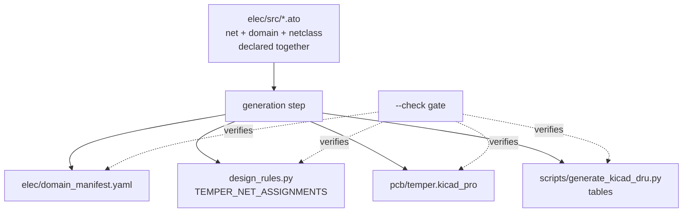

# Ato-Declared Net Classification SSOT - Plan

## Goal Capsule

- **Objective:** Make a net's safety domain and netclass declarable exactly once, in `elec/src/*.ato` beside the net itself, and generate every downstream consumer from that declaration.
- **Product authority:** This plan owns net classification and its derived surfaces. It does not own the runtime gates that verify external artifacts (copper, compiled extensions, board geometry), and does not own the open safety questions it surfaces.
- **Open blockers:** None. Two questions were resolved during scoping and became Key Decisions: `GateDrive` splits by domain, and every net declares one of three states. Both raise the work's size — the split needs routing re-verification, and full coverage needs a one-time pass over roughly 110 currently-undeclared nets.

---

## Product Contract

### Summary

Declare each net's safety domain and netclass in `.ato`, next to the net it describes, then generate the safety manifest, the Python assignment table, KiCad's project file, and the DRC generator's tables from that single declaration. A `--check` gate fails when any generated artifact drifts from its source, and generation fails when a net carries no declaration at all.

### Problem Frame

Four hand-maintained tables carry net→class assignments today, and none is generated from a shared source: `TEMPER_NET_ASSIGNMENTS` in `packages/temper-placer/src/temper_placer/core/design_rules.py`, `pcb/temper.kicad_pro`, `scripts/generate_kicad_dru.py`'s own tables, and the dead `configs/temper_production_config.yaml`. A fifth file, `elec/domain_manifest.yaml`, carries the safety-domain declaration independently. No gate compares any of them against each other.

The consequences are not hypothetical. Renaming `+340V_BUS` to `+170V_BUS` fixed the name and orphaned the classification: the phantom name kept its `HighVoltage` entry while the live rail — 12 pads on the board — resolved to no netclass, leaving every DRC rule conditioned on `NetClass == 'HighVoltage'` inert for the main high-voltage bus. A subsequent audit found 11 manifest-declared HV nets with no netclass anywhere, including `a`, the primary-side net of an isolator whose barrier had just been fitted with a 14.058 mm creepage slot. The slot was real; nothing was watching the crossing.

The failure reproduces under ideal conditions. `HighVoltageIsolated` was added to `pcb/temper.kicad_pro` and `packages/temper-placer/configs/netclass_rules.yaml` on 2026-07-28, and `design_rules.py` never received it — the same drift shape, inside a single day, on a fix made because of drift, with the failure mode freshly documented and a gate already in place.

Prior work addressed a neighbouring problem and stopped short of this one. `docs/plans/2026-07-22-004-refactor-cross-language-domain-codegen-plan.md` is complete and generates the `NetClassRules` **type shape** from a manifest into Python and Rust, with a `--check` gate already wired into CI. Its stated scope excluded net assignments. So the repo has a working generate-and-verify pattern pointed at the schema, and none pointed at the data.

### Key Decisions

- **Declare in `.ato`, not in a central manifest.** (session-settled: user-directed — chosen over a central manifest: a manifest still centralizes a name→class dict, which `docs/solutions/best-practices/rename-orphans-derived-keys-2026-07-28.md` already identifies as a standing liability independent of any one rename.) Governs R1, R2, R3.
- **Generate the safety manifest too, rather than keeping it hand-written.** (session-settled: user-directed — chosen over preserving `elec/domain_manifest.yaml` as a hand-authored review artifact: it is a hand-copied duplicate of the same design intent, not an independently derived second opinion, so it supplies drift rather than cross-checking value.) Governs R5.
- **Domain is declared; connectivity is derived; the partition check compares them.** A designer can declare a net HV and still wire it to a SELV net, so `scripts/check_domain_partition.py` keeps its meaning after the manifest becomes generated. Governs R1, R12.
- **Generation fails closed on an undeclared net.** An unclassified net silently becoming `Default` is the mechanism behind 11 of today's defects; absence must be an error at generation time rather than a permissive default at rule-evaluation time. Governs R10.
- **Every net declares one of three states, and silence is not one of them.** (session-settled: user-directed — chosen over declaring only safety-relevant nets: an undeclared net is ambiguous between "reviewed, not safety-relevant" and "someone forgot", and that ambiguity is the defect itself.) Governs R1, R10.
- **A netclass belongs to exactly one domain, so `GateDrive` splits.** (session-settled: user-directed — chosen over treating class and domain as orthogonal axes: `GATE_HS`/`GATE_LS` sit on the HV side of U7's reinforced barrier and `PWM_HS`/`PWM_LS` on the SELV side, so one class spanning both leaves "which domain is this class?" unanswerable for every rule keyed on it.) Governs R12.

### The fan-out this replaces

### Requirements

**Declaration site**

- R1. Each net declares its safety domain in `.ato`, on the signal it describes, as exactly one of three states: HV, SELV, or an explicit "reviewed, not safety-relevant". Omission is not one of the three.
- R2. Each net declares its netclass in `.ato`, on the signal it describes.
- R3. Isolator designations (which component provides galvanic isolation, and which of its pins are primary versus secondary) and protective-impedance chains are declared in `.ato`.

**Class model**

- R4. Each netclass belongs to exactly one safety domain. `GateDrive` splits accordingly, since `GATE_HS`/`GATE_LS` and `PWM_HS`/`PWM_LS` sit on opposite sides of U7's reinforced barrier.

**Generated surfaces**

- R5. `elec/domain_manifest.yaml` is generated from the `.ato` declarations.
- R6. `TEMPER_NET_ASSIGNMENTS` in `packages/temper-placer/src/temper_placer/core/design_rules.py` is generated.
- R7. `pcb/temper.kicad_pro`'s netclass assignments are generated, preserving the fields KiCad owns and rewrites.
- R8. `scripts/generate_kicad_dru.py`'s netclass tables are generated.
- R9. `configs/temper_production_config.yaml` is removed; it carries assignments no code loads.

**Fail-closed behavior**

- R10. Generation fails when any net in the compiled netlist carries no declaration, naming each undeclared net.
- R11. A `--check` mode fails when any generated artifact differs from what the current `.ato` declarations would produce, and runs in CI without `continue-on-error`.

**Preserved verification**

- R12. `scripts/check_domain_partition.py` continues to compare declared domain against netlist-derived connectivity.
- R13. Gates that verify external artifacts — copper against netlist, compiled extension freshness, board geometry — are unchanged by this work.

### Key Flows

- F1. Renaming a net
  - **Trigger:** An engineer changes a net's name in `.ato`.
  - **Steps:** The name and its domain/netclass declarations move together, because they are the same declaration. Generation re-emits all four surfaces. The `--check` gate passes because every consumer was regenerated from the same source.
  - **Outcome:** No derived key can reference the old name, because no derived key is hand-maintained.
  - **Covered by:** R1, R2, R5, R6, R7, R8, R11

- F2. Adding a net without classifying it
  - **Trigger:** An engineer adds a signal in `.ato` and does not declare its domain or netclass.
  - **Steps:** Generation halts and names the undeclared net.
  - **Outcome:** The net cannot reach the board unclassified; the omission surfaces at generation rather than as a permissive default during rule evaluation. Declaring it "reviewed, not safety-relevant" is a valid resolution; leaving it silent is not.
  - **Covered by:** R1, R10

### Acceptance Examples

- AE1. **Covers R1, R10.** Given a net present in the compiled netlist with no domain declared in `.ato`, when generation runs, then it exits non-zero and names that net.
- AE2. **Covers R1.** Given a net declared "reviewed, not safety-relevant", when generation runs, then it succeeds and that net appears in no HV or SELV domain list.
- AE3. **Covers R11.** Given a generated surface edited by hand so it no longer matches the `.ato` declarations, when `--check` runs, then it exits non-zero and names the differing surface.
- AE4. **Covers R1, R12.** Given a net declared SELV in `.ato` but wired to an HV-domain net, when the domain-partition check runs, then it reports the crossing — the declaration and the connectivity disagree even though both originate in `.ato`.
- AE5. **Covers R4.** Given a netclass assigned to nets in two different domains, when generation runs, then it exits non-zero and names the class — a class spans exactly one domain.
- AE6. **Covers R7.** Given KiCad has rewritten `pcb/temper.kicad_pro` and changed fields this work does not own, when generation runs, then those fields survive and only the netclass assignments are replaced.

### Scope Boundaries

- Runtime gates that verify external artifacts stay. Copper-against-netlist, compiled-extension freshness, and board geometry cannot be reached by generation, because their inputs are produced outside the design source.
- Retiring or consolidating the existing gate set is not part of this work. Reducing the count is a possible downstream consequence, not a requirement here.
- Per-class rule *values* — the clearance and creepage figures in `packages/temper-placer/configs/netclass_rules.yaml` — are out of scope. This work owns which net belongs to which class, not what each class requires.
- Re-verifying routing after `GateDrive` splits is downstream of this work. R4 changes the class model; whether the board still routes and clears under the split classes is a separate pass.

### Dependencies / Assumptions

- Net attributes are readable through atopile's instance API: `get_data_dict(addr)` returns all assignments for an instance, and `override_net_name` — already used at `elec/src/main.ato:241` — is one consumer of that mechanism.
- Declared attributes do **not** survive into the compiled netlist. Net records in `elec/build/default.net` carry no property slot, so generation must read `.ato` through atopile rather than reading `default.net`.
- That API is internal to atopile, not a documented public surface. The project pins `atopile>=0.2,<0.3`, which makes it stable in range and a real break risk on upgrade.
- The generate-and-verify pattern already exists in this repo and can be followed rather than invented: `scripts/gen_domain_models.py --check` is wired into CI at `.github/workflows/python-tests.yml:753`.

### Outstanding Questions

**Deferred to Planning**

- Names for the two classes `GateDrive` splits into, and whether any other existing class also spans domains and needs the same treatment.

- The `.ato` syntax for the declarations, and whether domain and netclass are separate attributes or one.
- Whether generation reads `.ato` through atopile in-process or through a sidecar extraction step invoked beside `make netlist`.
- `PWR_RTN`'s classification, flagged as ambiguous with a large blast radius during the 2026-07-28 reconciliation and deliberately left unchanged.
- Whether the 21 currently-unclassified SELV nets need the same treatment as the HV set.

### Sources / Research

- `docs/plans/2026-07-22-004-refactor-cross-language-domain-codegen-plan.md` — completed; generates the `NetClassRules` type shape and explicitly excludes net assignments.
- `docs/solutions/best-practices/rename-orphans-derived-keys-2026-07-28.md` — records the recommendation this plan implements: prefer resolving classification against live design data over a maintained name→class dict.
- `docs/evidence/2026-07-28-netclass-defect-reconciliation.md` — the sweep that found 11 unclassified HV nets and a fourth drift surface.
- `docs/evidence/2026-07-28-hv-isolated-rules-and-creepage-triage.md` — `HighVoltageIsolated` reaching two surfaces and not the third, same day.
- `scripts/gen_domain_models.py`, `.github/workflows/python-tests.yml:753` — the existing generate-and-`--check` pattern to follow.
- `elec/src/main.ato:241` — `override_net_name`, the existing precedent for a signal-level attribute, and the site of the rename that orphaned `+340V_BUS`.
