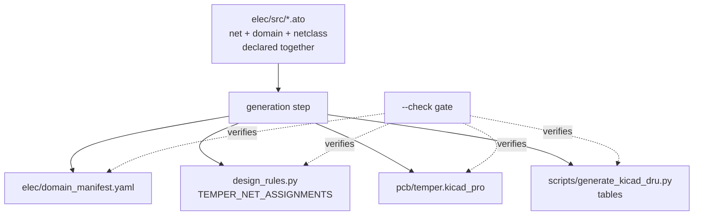

# Ato-Declared Net Classification SSOT - Plan

## Goal Capsule

- **Objective:** Make a net's safety domain and netclass declarable exactly once, in `elec/src/*.ato` beside the net itself, and generate every downstream consumer from that declaration.
- **Product authority:** This plan owns net classification and its derived surfaces. It does not own the runtime gates that verify external artifacts (copper, compiled extensions, board geometry), and does not own the open safety questions it surfaces.
- **Open blockers:** None. Two questions were resolved during scoping and became Key Decisions: `GateDrive` splits by domain, and every net declares one of three states. Both raise the work's size — the split needs routing re-verification, and full coverage needs a one-time pass over roughly 110 currently-undeclared nets.

---

## Product Contract

### Summary

Declare each net's safety domain and netclass in `.ato`, next to the net it describes, then generate the safety manifest, the Python assignment table, KiCad's project file, and the DRC generator's tables from that single declaration. A `--check` gate fails when any generated artifact drifts from its source, and generation fails when a net carries no declaration at all.

### Problem Frame

Four hand-maintained tables carry net→class assignments today, and none is generated from a shared source: `TEMPER_NET_ASSIGNMENTS` in `packages/temper-placer/src/temper_placer/core/design_rules.py`, `pcb/temper.kicad_pro`, `scripts/generate_kicad_dru.py`'s own tables, and the dead `configs/temper_production_config.yaml`. A fifth file, `elec/domain_manifest.yaml`, carries the safety-domain declaration independently. No gate compares any of them against each other.

The consequences are not hypothetical. Renaming `+340V_BUS` to `+170V_BUS` fixed the name and orphaned the classification: the phantom name kept its `HighVoltage` entry while the live rail — 12 pads on the board — resolved to no netclass, leaving every DRC rule conditioned on `NetClass == 'HighVoltage'` inert for the main high-voltage bus. A subsequent audit found 11 manifest-declared HV nets with no netclass anywhere, including `a`, the primary-side net of an isolator whose barrier had just been fitted with a 14.058 mm creepage slot. The slot was real; nothing was watching the crossing.

The failure reproduces under ideal conditions. `HighVoltageIsolated` was added to `pcb/temper.kicad_pro` and `packages/temper-placer/configs/netclass_rules.yaml` on 2026-07-28, and `design_rules.py` never received it — the same drift shape, inside a single day, on a fix made because of drift, with the failure mode freshly documented and a gate already in place.

Prior work addressed a neighbouring problem and stopped short of this one. `docs/plans/2026-07-22-004-refactor-cross-language-domain-codegen-plan.md` is complete and generates the `NetClassRules` **type shape** from a manifest into Python and Rust, with a `--check` gate already wired into CI. Its stated scope excluded net assignments. So the repo has a working generate-and-verify pattern pointed at the schema, and none pointed at the data.

### Key Decisions

- **Declare in `.ato`, not in a central manifest.** (session-settled: user-directed — chosen over a central manifest: a manifest still centralizes a name→class dict, which `docs/solutions/best-practices/rename-orphans-derived-keys-2026-07-28.md` already identifies as a standing liability independent of any one rename.) Governs R1, R2, R3.
- **Generate the safety manifest too, rather than keeping it hand-written.** (session-settled: user-directed — chosen over preserving `elec/domain_manifest.yaml` as a hand-authored review artifact: it is a hand-copied duplicate of the same design intent, not an independently derived second opinion, so it supplies drift rather than cross-checking value.) Governs R5.
- **Domain is declared; connectivity is derived; the partition check compares them.** A designer can declare a net HV and still wire it to a SELV net, so `scripts/check_domain_partition.py` keeps its meaning after the manifest becomes generated. Governs R1, R12.
- **Generation fails closed on an undeclared net.** An unclassified net silently becoming `Default` is the mechanism behind 11 of today's defects; absence must be an error at generation time rather than a permissive default at rule-evaluation time. Governs R10.
- **Every net declares one of three states, and silence is not one of them.** (session-settled: user-directed — chosen over declaring only safety-relevant nets: an undeclared net is ambiguous between "reviewed, not safety-relevant" and "someone forgot", and that ambiguity is the defect itself.) Governs R1, R10.
- **A netclass belongs to exactly one domain, so `GateDrive` splits.** (session-settled: user-directed — chosen over treating class and domain as orthogonal axes: `GATE_HS`/`GATE_LS` sit on the HV side of U7's reinforced barrier and `PWM_HS`/`PWM_LS` on the SELV side, so one class spanning both leaves "which domain is this class?" unanswerable for every rule keyed on it.) Governs R12.

### The fan-out this replaces

### Requirements

**Declaration site**

- R1. Each net declares its safety domain in `.ato`, on the signal it describes, as exactly one of three states: HV, SELV, or an explicit "reviewed, not safety-relevant". Omission is not one of the three.
- R2. Each net declares its netclass in `.ato`, on the signal it describes.
- R3. Isolator designations (which component provides galvanic isolation, and which of its pins are primary versus secondary) and protective-impedance chains are declared in `.ato`.

**Class model**

- R4. Each netclass belongs to exactly one safety domain. `GateDrive` splits accordingly, since `GATE_HS`/`GATE_LS` and `PWM_HS`/`PWM_LS` sit on opposite sides of U7's reinforced barrier.

**Generated surfaces**

- R5. `elec/domain_manifest.yaml` is generated from the `.ato` declarations.
- R6. `TEMPER_NET_ASSIGNMENTS` in `packages/temper-placer/src/temper_placer/core/design_rules.py` is generated.
- R7. `pcb/temper.kicad_pro`'s netclass assignments are generated, preserving the fields KiCad owns and rewrites.
- R8. `scripts/generate_kicad_dru.py`'s netclass tables are generated.
- R9. `configs/temper_production_config.yaml` is removed; it carries assignments no code loads.

**Fail-closed behavior**

- R10. Generation fails when any net in the compiled netlist carries no declaration, naming each undeclared net.
- R11. A `--check` mode fails when any generated artifact differs from what the current `.ato` declarations would produce, and runs in CI without `continue-on-error`.

**Preserved verification**

- R12. `scripts/check_domain_partition.py` continues to compare declared domain against netlist-derived connectivity.
- R13. Gates that verify external artifacts — copper against netlist, compiled extension freshness, board geometry — are unchanged by this work.

### Key Flows

- F1. Renaming a net
  - **Trigger:** An engineer changes a net's name in `.ato`.
  - **Steps:** The name and its domain/netclass declarations move together, because they are the same declaration. Generation re-emits all four surfaces. The `--check` gate passes because every consumer was regenerated from the same source.
  - **Outcome:** No derived key can reference the old name, because no derived key is hand-maintained.
  - **Covered by:** R1, R2, R5, R6, R7, R8, R11

- F2. Adding a net without classifying it
  - **Trigger:** An engineer adds a signal in `.ato` and does not declare its domain or netclass.
  - **Steps:** Generation halts and names the undeclared net.
  - **Outcome:** The net cannot reach the board unclassified; the omission surfaces at generation rather than as a permissive default during rule evaluation. Declaring it "reviewed, not safety-relevant" is a valid resolution; leaving it silent is not.
  - **Covered by:** R1, R10

### Acceptance Examples

- AE1. **Covers R1, R10.** Given a net present in the compiled netlist with no domain declared in `.ato`, when generation runs, then it exits non-zero and names that net.
- AE2. **Covers R1.** Given a net declared "reviewed, not safety-relevant", when generation runs, then it succeeds and that net appears in no HV or SELV domain list.
- AE3. **Covers R11.** Given a generated surface edited by hand so it no longer matches the `.ato` declarations, when `--check` runs, then it exits non-zero and names the differing surface.
- AE4. **Covers R1, R12.** Given a net declared SELV in `.ato` but wired to an HV-domain net, when the domain-partition check runs, then it reports the crossing — the declaration and the connectivity disagree even though both originate in `.ato`.
- AE5. **Covers R4.** Given a netclass assigned to nets in two different domains, when generation runs, then it exits non-zero and names the class — a class spans exactly one domain.
- AE6. **Covers R7.** Given KiCad has rewritten `pcb/temper.kicad_pro` and changed fields this work does not own, when generation runs, then those fields survive and only the netclass assignments are replaced.

### Scope Boundaries

- Runtime gates that verify external artifacts stay. Copper-against-netlist, compiled-extension freshness, and board geometry cannot be reached by generation, because their inputs are produced outside the design source.
- Retiring or consolidating the existing gate set is not part of this work. Reducing the count is a possible downstream consequence, not a requirement here.
- Per-class rule *values* — the clearance and creepage figures in `packages/temper-placer/configs/netclass_rules.yaml` — are out of scope. This work owns which net belongs to which class, not what each class requires.
- Re-verifying routing after `GateDrive` splits is downstream of this work. R4 changes the class model; whether the board still routes and clears under the split classes is a separate pass.

### Dependencies / Assumptions

- Net attributes are readable through atopile's instance API: `get_data_dict(addr)` returns all assignments for an instance, and `override_net_name` — already used at `elec/src/main.ato:241` — is one consumer of that mechanism.
- Declared attributes do **not** survive into the compiled netlist. Net records in `elec/build/default.net` carry no property slot, so generation must read `.ato` through atopile rather than reading `default.net`.
- That API is internal to atopile, not a documented public surface. The project pins `atopile>=0.2,<0.3`, which makes it stable in range and a real break risk on upgrade.
- The generate-and-verify pattern already exists in this repo and can be followed rather than invented: `scripts/gen_domain_models.py --check` is wired into CI at `.github/workflows/python-tests.yml:753`.

### Outstanding Questions

**Deferred to Planning**

- Names for the two classes `GateDrive` splits into, and whether any other existing class also spans domains and needs the same treatment.

- The `.ato` syntax for the declarations, and whether domain and netclass are separate attributes or one.
- Whether generation reads `.ato` through atopile in-process or through a sidecar extraction step invoked beside `make netlist`.
- `PWR_RTN`'s classification, flagged as ambiguous with a large blast radius during the 2026-07-28 reconciliation and deliberately left unchanged.
- Whether the 21 currently-unclassified SELV nets need the same treatment as the HV set.

### Sources / Research

- `docs/plans/2026-07-22-004-refactor-cross-language-domain-codegen-plan.md` — completed; generates the `NetClassRules` type shape and explicitly excludes net assignments.
- `docs/solutions/best-practices/rename-orphans-derived-keys-2026-07-28.md` — records the recommendation this plan implements: prefer resolving classification against live design data over a maintained name→class dict.
- `docs/evidence/2026-07-28-netclass-defect-reconciliation.md` — the sweep that found 11 unclassified HV nets and a fourth drift surface.
- `docs/evidence/2026-07-28-hv-isolated-rules-and-creepage-triage.md` — `HighVoltageIsolated` reaching two surfaces and not the third, same day.
- `scripts/gen_domain_models.py`, `.github/workflows/python-tests.yml:753` — the existing generate-and-`--check` pattern to follow.
- `elec/src/main.ato:241` — `override_net_name`, the existing precedent for a signal-level attribute, and the site of the rename that orphaned `+340V_BUS`.

---

## Planning Contract

### Summary

Build one generator that reads `.ato` declarations through atopile's instance API and emits four consumers, following `scripts/gen_domain_models.py`'s established shape: render, byte-compare, replace only on change, and a `--check` mode that fails on drift. The fail-closed behavior lands in two steps — warn first, hard-fail after the classification pass — because the reader it depends on does not exist yet.

### Key Technical Decisions

- **Mirror `gen_domain_models.py` rather than invent a generator shape.** It already solves atomic full-file writes, delimited-block partial writes, `--check` byte-diffing, and CI wiring without `continue-on-error`. Governs U3.
- **`.kicad_pro` needs dict-key surgery, not delimited markers.** JSON cannot carry comment markers and KiCad re-serializes the file. Replace the `netclass_assignments` key and leave every sibling key byte-identical. Governs U5.
- **Generation is the sole writer of record for net-class assignment.** KiCad's Net Inspector writes the same field a human can edit through normal EDA workflow. A KiCad-side change is drift the check reports, not an accepted edit. Governs U5.
- **`netclass_patterns` is removed, not generated.** Four of its seven entries match zero live nets — `VCC*`, `VDD*`, `VBOOT_*`, `AC_*` — because the real nets are lowercase. Wildcard name-matching is the drift class this work eliminates, and explicit generated assignments make it redundant. Governs U5.
- **`safety_category` in the netclass config is a fifth generated surface.** The Product Contract scoped that file out as "rule values", but `safety_category` is a domain classification, not a clearance figure: `router_v6/_adapter_convert.py` carries it for the forced-segment gate and `router_v6/bottleneck_geometry.py` ranks it numerically. Splitting the gate-drive class without differentiating it leaves the HV-side class marked `LV`. Governs U7.
- **Declare fields explicitly rather than assigning implicitly.** Implicit assignment emits `Implicit Declaration Future Deprecation Warning`; the build carries 4 today and per-net attributes would add roughly 328. `elec/src/fac_utils.ato` already declares typed fields with no value. Governs U2.
- **Freshness reuses `scripts/_lib/freshness.py`.** Generation reads `.ato` for declarations and the compiled netlist for the net universe — the same two-input staleness problem `check_domain_partition.py` already solved. CI caches the netlist, so a rename can otherwise produce a green run against a stale net name. Governs U3, U9.
- **Retired aliases survive regeneration through an explicit list.** `TEMPER_NET_ASSIGNMENTS` deliberately keeps `+340V_BUS`, `AC_L`, `GATE_H` for backward compatibility; a naive regenerate drops them silently. Governs U4.
- **Disagreement between merged signals is a generation error.** Several `.ato` signals joined with `~` become one net; if they declare different domains, generation stops rather than picking a winner. Governs U3.

### Context & Research

**Patterns to follow**

- `scripts/gen_domain_models.py` — `atomic_write()` (render to tmp, byte-compare, `os.replace` only on change), `replace_rust_block()` (validates marker presence, uniqueness, order), `--check` renders in memory and diffs. Wired at `.github/workflows/python-tests.yml:753`, not `continue-on-error`.
- `scripts/check_stale_extensions.py` — gate exit discipline: `EXIT_OK = 0`, violation `3`, `GateError` → `5`. Denominator printed every run. Zero discovered raises rather than passing.
- `scripts/check_domain_partition.py` — two-input freshness via `check_freshness`, and the "GATE ERROR, not a violation" distinction for untrustworthy input.
- `scripts/tests/test_check_stale_extensions.py` — `sys.path.insert` then import the gate's internals directly; test classes grouped by concern including an explicit anti-vacuity class; `tmp_path` fixtures with small builders.
- `Makefile` `netlist` target — `&&`-chaining so a freshness stamp never lands next to a failed build.
- `elec/src/fac_utils.ato` — declaration-only typed fields (`rows: int`, `current_rating: current`).

**Institutional learnings that shape this plan**

- `rename-orphans-derived-keys-2026-07-28.md` — a rename is two edits: the declaration and every derived key. Migration must prove no orphaned key survives, and must distinguish a dead alias with a live counterpart from a net with no classification anywhere.
- `a-rule-that-matches-nothing-reads-as-coverage-2026-07-28.md` — two DRU rules on this board have matched nothing, ever. Verify generated rules by forcing an absurd threshold and confirming a nonzero match; `0 → 0` at intended thresholds proves nothing.
- `fail-soft-defaults-hide-the-failure-2026-07-28.md` — no `.get(net, default_domain)` anywhere in the generators, not only at the top-level gate.
- `substring-net-classification-drifts-from-ssot-2026-07-27.md` — the same defect recurred nine times because each fix addressed only the reported instance. Sweep for remaining hand-maintained classifiers after cutover.
- `net-name-is-a-claim-not-an-authority-2026-07-26.md` — a declared domain is still a claim. The check should flag self-contradiction rather than trusting the declaration because it is now the single site.

### Open Questions

**Resolved during planning**

- Can `.ato` declare arbitrary attributes? Yes — atopile 0.2.69 keeps `instance.assignments` as a plain dict with no closed vocabulary; `override_net_name` has no special status.
- Are type annotations enforced? No — `_get_type_info` returns the annotation as raw text and the type-checking code below it is unreachable. Declaration gives syntactic discipline, not validation; the generator validates.
- Do the mains nets have a live classification hole? No — `ac_l`/`ac_n` are covered by explicit assignments, so the dead `AC_*` pattern is redundant rather than a live gap. `vcc` has neither, and falls in the already-flagged unclassified-SELV set.

**Deferred to implementation**

- Exact syntax for declaring a field on an existing signal (a short spike in U2, not a research question).
- Whether the reader runs in-process or as a sidecar beside `make netlist` — U1 decides it by trying the cheaper one first.
- Names for the two classes the gate-drive class splits into.

---

## Implementation Units

### U1. Prove the `.ato` reader round-trips

**Goal:** Establish that a declaration written in `.ato` is readable from Python, before anything depends on it.

**Requirements:** R1, R2

**Dependencies:** None

**Files:**
- Create: `scripts/_lib/ato_declarations.py`
- Test: `scripts/tests/_lib/test_ato_declarations.py`

**Approach:**
- Read declarations through atopile's instance API; the compiled netlist carries no property slot, so `elec/build/default.net` is not a viable source.
- Decide in-process versus sidecar here by trying in-process first and falling back if atopile's front-end cannot be driven from an already-running interpreter.
- Isolate every atopile import behind this one module. The pinned range is `>=0.2,<0.3`, and a later atopile closes the attribute vocabulary this design depends on — one module is the whole blast radius of that upgrade.

**Execution note:** Start with a failing test that asserts one known signal's declaration is readable.

**Test scenarios:**
- Happy path: a signal carrying a declared domain returns that value.
- Edge case: a signal with no declaration returns absent, distinguishable from a declared empty value.
- Error path: an unreadable or unparseable `.ato` raises rather than returning empty.
- Integration: the existing `override_net_name` assignments are readable through the same call, confirming the mechanism against data already in the tree.

**Verification:** A test proves a declaration written in `.ato` arrives in Python with its value intact.

### U2. Declare the fields in `.ato` for a pilot set

**Goal:** Establish the declaration syntax without flooding the build with deprecation warnings.

**Requirements:** R1, R2, R3

**Dependencies:** U1

**Files:**
- Modify: `elec/src/main.ato`, `elec/src/modules.ato`

**Approach:**
- Declare the fields explicitly rather than assigning implicitly. `elec/src/fac_utils.ato` shows the declaration-only form.
- Apply to the known HV set first, not all 164 nets — this unit establishes shape, U8 does volume.
- Count `Implicit Declaration Future Deprecation Warning` occurrences before and after; the count must not grow.

**Test scenarios:**
- Happy path: `make netlist` succeeds and the pilot declarations are readable through U1's module.
- Edge case: the implicit-declaration warning count is unchanged from its baseline of 4.
- Error path: a declaration with an unrecognized domain value is rejected by the generator, not silently carried.

**Verification:** Pilot nets carry declarations, the build is no noisier than before, and U1's reader returns them.

### U3. Generator core and the safety manifest

**Goal:** One generator that reads declarations and emits `elec/domain_manifest.yaml`, with `--check`.

**Requirements:** R5, R10, R11

**Dependencies:** U1, U2

**Files:**
- Create: `scripts/gen_net_classification.py`
- Modify: `scripts/manifest.yaml`
- Test: `scripts/tests/test_gen_net_classification.py`

**Approach:**
- Mirror `gen_domain_models.py`: render, byte-compare, replace only on change, `--check` diffs in memory.
- Denominator on every run — nets in the compiled netlist versus nets carrying a declaration.
- Undeclared nets **warn** in this unit. The hard-fail flip is U9, so there is a working middle state rather than only "gate off" or "build broken".
- Call `check_freshness` from `scripts/_lib/freshness.py` against both inputs before generating.
- Merged-signal disagreement is an error naming both signals and the net they join into.

**Test scenarios:**
- Happy path: declarations in, manifest out, byte-identical on a second run.
- Edge case: zero nets discovered raises a gate error rather than emitting an empty manifest.
- Edge case: two signals merging into one net with different domains halts generation and names both.
- Error path: a stale netlist relative to `.ato` sources is a gate error, not a violation.
- Error path: no `.get(net, default)` fallback exists anywhere — an undeclared net is never silently assigned a domain.
- Integration: the generated manifest is accepted unchanged by `scripts/check_domain_partition.py`.

**Verification:** The manifest regenerates byte-identically, `--check` passes on a clean tree and fails on a hand-edit.

### U4. Generate the Python assignment table

**Goal:** `TEMPER_NET_ASSIGNMENTS` becomes generated, preserving deliberately-retained aliases; the dead config file is removed.

**Requirements:** R6, R9, R11

**Dependencies:** U3

**Files:**
- Modify: `packages/temper-placer/src/temper_placer/core/design_rules.py`, `scripts/gen_net_classification.py`
- Delete: `configs/temper_production_config.yaml`
- Test: `scripts/tests/test_gen_net_classification.py`

**Approach:**
- Delimited-block replacement, as `board.rs` uses — this file holds much more than the table. Validate marker presence, uniqueness, and order, erroring on any violation.
- Carry retired aliases through an explicit list rather than dropping them; `+340V_BUS`, `AC_L`, `GATE_H` are kept on purpose.
- Delete `configs/temper_production_config.yaml` — a fourth assignment surface no code loads. Confirm no importer exists before removing.
- Every emitted class must carry a non-`None` `safety_category` so the DRC-side keyword fallback documented in `AGENTS.md` never fires.

**Test scenarios:**
- Happy path: the generated block matches what the declarations imply.
- Edge case: a retired alias with no live counterpart survives regeneration.
- Edge case: a missing, duplicated, or out-of-order marker errors rather than corrupting the file.
- Integration: `grep -c` each retired net name across all consumers before and after — no orphaned key appears.

**Verification:** The table regenerates byte-identically and no retired alias is lost.

### U5. Generate KiCad's project file and remove the pattern mechanism

**Goal:** `netclass_assignments` becomes generated; `netclass_patterns` is removed.

**Requirements:** R7, R11

**Dependencies:** U3

**Files:**
- Modify: `pcb/temper.kicad_pro`, `scripts/gen_net_classification.py`
- Test: `scripts/tests/test_gen_net_classification.py`

**Approach:**
- Dict-key surgery: replace `net_settings.netclass_assignments`, leave `net_settings.classes`, `meta`, and every other key byte-identical. Markers are not available in JSON and KiCad re-serializes.
- Remove `netclass_patterns`. Four of seven entries match zero live nets, and generated explicit assignments make the mechanism redundant.
- Generation is the sole writer of record. A net-class edit made through KiCad's Net Inspector is drift reported by `--check`.

**Test scenarios:**
- Happy path: assignments replaced, sibling keys byte-identical.
- Edge case: a KiCad-rewritten file with reordered keys and changed unrelated fields still round-trips with only assignments replaced.
- Edge case: removing the pattern mechanism does not orphan any net that relied on it — every previously pattern-matched net has an explicit assignment.
- Error path: a hand edit to a net-class assignment is reported as drift, not accepted.

**Verification:** KiCad opens the project without complaint, and `--check` reports a manual assignment edit.

### U6. Generate the DRC rule generator's tables

**Goal:** `generate_kicad_dru.py` reads generated classification instead of its own hand-maintained tables.

**Requirements:** R8, R11

**Dependencies:** U3

**Files:**
- Modify: `scripts/generate_kicad_dru.py`
- Test: `scripts/tests/test_generate_kicad_dru.py`

**Approach:**
- Replace the local `netclass_assignments`/`netclass_patterns` tables — which still reference retired names — with the generated source.
- Emitted rule conditions must keep using forms measured to bind: `A.NetClass`, `A.Reference`, `A.Pad_Type`. `A.Footprint` and `insideCourtyard(B.Reference)` match nothing.

**Test scenarios:**
- Happy path: generated rules reference only live net classes.
- Edge case: every classification-dependent rule produces a nonzero match when its threshold is forced to an absurd value — a rule silent at 999 mm has a broken condition, not zero violations.
- Integration: rule count and per-class coverage before and after, with denominators.

**Verification:** No retired net name survives in the generator, and every emitted rule is shown to bind.

### U7. Split the gate-drive class and differentiate `safety_category`

**Goal:** One netclass belongs to one domain, including in the field the router consumes.

**Requirements:** R4

**Dependencies:** U3

**Files:**
- Modify: `packages/temper-placer/configs/netclass_rules.yaml`, `elec/src/main.ato`, `scripts/gen_net_classification.py`
- Test: `packages/temper-placer/tests/router_v6/test_adapter.py`

**Approach:**
- Split the gate-drive class into HV-side and SELV-side classes; the HV-side outputs and the SELV-side inputs sit on opposite sides of a reinforced barrier.
- Set differentiated `safety_category` on the two new classes. Both currently read `LV`; leaving the HV-side class as `LV` reproduces the exact failure this split exists to fix, one file deeper than the four generated surfaces reach.
- Generation validates that every class maps to exactly one domain and errors otherwise.

**Test scenarios:**
- Happy path: the two split classes carry different `safety_category` values in the direction the domain split demands.
- Edge case: a class assigned to nets in two domains halts generation and names the class.
- Integration: the router's forced-segment gate sees the HV-side class as HV, not LV.

**Verification:** The split classes differ in `safety_category`, and the router consumes the corrected value.

### U8. Classify the remaining nets

**Goal:** Every net in the compiled netlist carries one of the three declared states.

**Requirements:** R1

**Dependencies:** U2, U3

**Files:**
- Modify: `elec/src/main.ato`, `elec/src/modules.ato`

**Approach:**
- 164 nets compiled, 54 declared today. The remainder need a declaration, most of them the explicit "reviewed, not safety-relevant" state.
- Work from the generator's own undeclared-net report, so the denominator is measured rather than assumed.
- Two flagged items stay unresolved and are declared as such rather than guessed: `PWR_RTN`'s classification and the unclassified SELV set.

**Test scenarios:**
- Happy path: the generator reports zero undeclared nets.
- Edge case: a net declared "not safety-relevant" appears in no domain list.
- Integration: the domain-partition check still passes, and its own denominator grows to the full net count.

**Verification:** The undeclared count reaches zero with every declaration attributable to a deliberate choice.

### U9. Flip to fail-closed and wire CI

**Goal:** Undeclared nets stop the build; drift stops CI.

**Requirements:** R10, R11, R12, R13

**Dependencies:** U4, U5, U6, U7, U8

**Files:**
- Modify: `scripts/gen_net_classification.py`, `.github/workflows/python-tests.yml`, `Makefile`, `AGENTS.md`
- Test: `scripts/tests/test_gen_net_classification.py`

**Approach:**
- Flip undeclared nets from warn to error. This is a separate commit from U3 on purpose.
- Chain generation after `netlist` with `&&` so it never runs against a failed or absent build.
- Wire `--check` into CI without `continue-on-error`, beside the existing generator's check step.
- Update the `AGENTS.md` section documenting the hand-maintained tables this work replaces — the repo's documentation-sync rule requires it.
- Sweep for any remaining hand-maintained classifier the four surfaces did not cover.

**Test scenarios:**
- Happy path: a clean tree passes both generation and `--check`.
- Error path: one undeclared net fails generation and names it.
- Error path: a hand edit to any generated surface fails `--check` and names the surface.
- Integration: all currently-green gates stay green; `check_domain_partition` and `check_copper_net_consistency` are unaffected.

**Verification:** Generation and `--check` both fail closed, CI runs them unmasked, and no gate regresses.

---

## System-Wide Impact

- **Interaction graph:** the router consumes `safety_category` for its forced-segment gate and ranks it in bottleneck geometry; the DRC side resolves it with a keyword fallback when absent. Generated classes must never leave it `None`.
- **Error propagation:** generation errors are gate errors (exit 5), not violations (exit 3) — a stale or unreadable input means the check could not run, which is different from a rule being broken.
- **State lifecycle risks:** the generated surfaces and the compiled netlist can drift independently; freshness is checked against both inputs before generating.
- **Unchanged invariants:** copper-against-netlist, extension freshness, board geometry, and the clearance and creepage figures in the netclass config are untouched.

---

## Risks & Dependencies

| Risk | Mitigation |
|---|---|
| A later atopile closes the attribute vocabulary this design depends on — the newer line already defines a fixed attribute list | Every atopile import sits behind one module, so the upgrade blast radius is one file |
| The gate-drive split changes DRC rule targets and may change routing outcomes | Routing re-verification is named as downstream work, not folded into this plan |
| A generated rule can be syntactically valid and match nothing, as two existing rules already do | Every classification-dependent rule is verified to bind by forcing an absurd threshold |
| CI's netlist cache can serve a stale netlist, producing a green run against an old net name | Generation and `--check` call the shared freshness helper against both inputs |
| The classification pass touches many nets at once and could bury a wrong call | The fail-closed flip is a separate commit, so the pass lands reviewable while the gate still warns |

---

## Verification Contract

| Check | Applies to | Signal |
|---|---|---|
| `make netlist` | U2, U8 | Build succeeds; implicit-declaration warning count unchanged |
| `uv run --no-sync python scripts/gen_net_classification.py --check` | U3–U9 | Exit 0 on a clean tree, non-zero on any hand edit |
| `uv run --no-sync python -m pytest scripts/tests/test_gen_net_classification.py` | U3–U9 | All pass, anti-vacuity cases included |
| The ten currently-green gates | U9 | No regression |
| `uv run --no-sync python -m pytest elec/validation` | U2, U7, U8 | Safety assertions hold |
| Absurd-threshold rule audit | U6 | Every classification-dependent rule matches non-zero |

---

## Definition of Done

- Every net in the compiled netlist carries one of three declared states, and the generator reports zero undeclared.
- All five surfaces regenerate byte-identically from `.ato`, and `--check` fails on a hand edit to any of them.
- No retired net name survives as an orphaned key in any consumer.
- The two split gate-drive classes carry differentiated `safety_category`, and the router reads the corrected value.
- `netclass_patterns` is gone, with every net that relied on it explicitly assigned.
- Generation and `--check` run in CI without `continue-on-error`, and the ten currently-green gates stay green.
