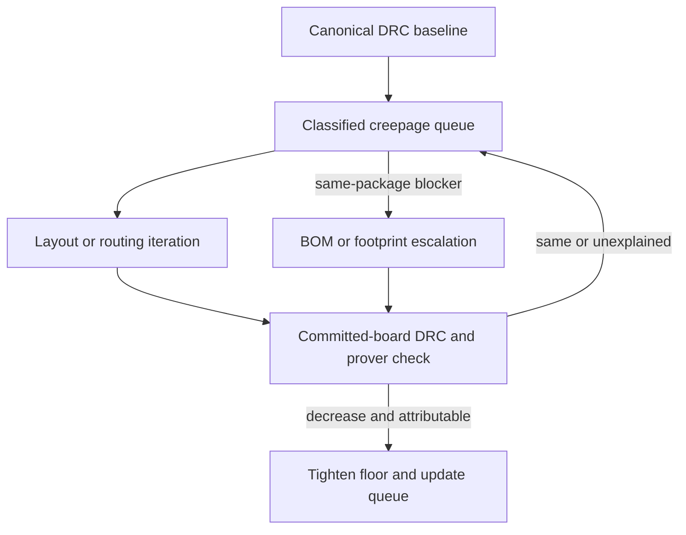

# Creepage Campaign One - Plan

## Goal Capsule

- **Objective:** Drive the current committed board's KiCad creepage violations to zero through the placer/router workflow, beginning with a trustworthy, fix-classified work queue.
- **Product authority:** The committed board and canonical KiCad DRC measurement define external safety debt; the placer/router and prover define whether a change is attributable progress; human-owned BOM decisions resolve physical package blockers.
- **Current baseline:** The canonical 120-sample run observed aggregate errors at 1343-1347, with an enforced aggregate ceiling of 1348. Creepage observed 311-313, with an enforced ceiling of 314.
- **Active campaign:** Creepage is first in `power_pcb_dataset/drc_campaign.json`.
- **Open blockers:** The current 312-count creepage set needs reclassification under the converged trunk. Some same-package violations may require BOM or footprint decisions, and the board/router reconciliation tolerance must be made deterministic during planning.

## Product Contract

### Summary

Campaign One turns the current creepage baseline into an actionable, safety-ordered work queue. It credits progress only when the committed board improves and the placer/router path remains consistent enough to explain that improvement.

### Problem Frame

The baseline now measures rules that were previously absent or incomplete in the KiCad project, including PD3 creepage and explicit HV netclasses. The resulting creepage count is more honest, but an aggregate ceiling alone can remain green indefinitely while no defect is removed.

The queue must distinguish layout/routing problems from same-package limitations and rule-classification artifacts. Repeating layout work against an incorrect category wastes effort, while accepting a package limitation as a routing failure hides a BOM decision.

### Key Decisions

- KTD1. **Layout-first, BOM as escalation** (session-settled: user-directed — chosen over BOM-first remediation: preserve the placer/router path for board-fixable debt and escalate only violations that geometry cannot resolve).
- KTD2. **Board and router evidence are both required** (session-settled: user-directed — chosen over treating either the committed board or router output alone as progress: the board is the external gate and the router is the means of credited change).
- KTD3. **Safety-ordered campaigns with an automatic tightening floor** (session-settled: user-approved — chosen over an automatic ratchet alone: a ratchet prevents growth but does not force the active category to improve).
- KTD4. **Creepage owns this work unit; other DRC categories remain guardrails.** Clearance and fabrication categories are later campaigns, not parallel requirements here.

### Requirements

**Campaign scope and authority**

- R1. The campaign MUST own the creepage error category and target zero measured creepage violations on the committed board.
- R2. The campaign MUST treat the canonical KiCad DRC path and its 120-sample protocol as the authority for measured creepage counts and run-to-run variation.
- R3. The campaign MUST keep aggregate errors and inactive error categories from increasing while creepage is active; warnings remain outside the active error campaign.

**Violation work queue**

- R4. Every current creepage violation MUST receive a stable identity and a fix class: layout/routing-fixable, same-package/BOM escalation, or rule/policy investigation.
- R5. Each queue item MUST retain enough evidence to explain the relevant nets or components, measured distance, required distance, and why its fix class was assigned.
- R6. The queue MUST reclassify the current converged-trunk measurement rather than copying the older 205-violation triage buckets without verification.

**Credited progress**

- R7. A campaign iteration MUST claim progress only when the committed board's measured creepage count decreases and the placer/router/prover output explains the changed copper within a deterministic reconciliation tolerance.
- R8. A router completion improvement without committed-board DRC improvement MUST be reported as capability progress, not creepage progress.
- R9. A board DRC improvement without attributable placer/router/prover evidence MUST not be credited as campaign progress.
- R10. Any board/router divergence outside the declared tolerance MUST become a visible campaign blocker rather than being silently accepted.

**Escalation and safety**

- R11. A same-package violation MUST be escalated to a BOM or footprint decision after layout-first evidence shows that the required creepage cannot be achieved by permitted geometry changes.
- R12. A rule or policy artifact MUST be corrected or explicitly dispositioned before it is counted as physical board debt.
- R13. The campaign MUST never lower the required PD3/12.6 mm safety determination to make a queue item pass.

**Evidence and tightening**

- R14. Every accepted campaign iteration MUST record board provenance, tool/version/flags, sample count, observed creepage range, aggregate result, queue deltas, and attribution evidence.
- R15. A successful reduction MUST tighten the relevant ceiling to the measured result plus only the established headroom for confirmed nondeterminism.
- R16. A ceiling increase MUST remain human-approved and attributed; Campaign One MUST NOT use an increase to make a failing iteration green.

### Actors

- A1. **Campaign owner:** selects the next queue slice and approves whether evidence is sufficient to close or escalate it.
- A2. **Placer/router:** proposes and emits geometry changes that may receive progress credit.
- A3. **KiCad DRC/prover:** measures the committed board and checks whether emitted copper is attributable and safe.
- A4. **BOM/safety authority:** resolves same-package or component-choice blockers that layout cannot remove.

### Key Flows

- F1. **Baseline and classify**
  - **Trigger:** Campaign One starts from the converged trunk baseline.
  - **Actors:** A1, A3.
  - **Steps:** Measure the canonical board; enumerate the creepage violations; assign each item a fix class; record uncertain classification as an investigation item.
  - **Outcome:** A complete, reviewable creepage queue exists before layout work begins.
  - **Covered by:** R2, R4, R5, R6, R14.

- F2. **Layout-first iteration**
  - **Trigger:** A queue slice is classified as layout/routing-fixable.
  - **Actors:** A1, A2, A3.
  - **Steps:** Select a bounded slice; produce placer/router output; evaluate the committed-board DRC result; compare router/prover evidence with the changed board geometry.
  - **Outcome:** The slice either reduces creepage with attributable evidence or returns to the queue with a visible failure reason.
  - **Covered by:** R7, R8, R9, R10, R14, R15.

- F3. **BOM escalation**
  - **Trigger:** A queue item remains below the required creepage after permitted layout-first attempts and is bounded by package geometry.
  - **Actors:** A1, A2, A4.
  - **Steps:** Preserve the measured evidence; identify the package or footprint constraint; hand the item to the BOM/safety decision; keep it open until the replacement or disposition is measured.
  - **Outcome:** Physical blockers become explicit design decisions instead of indefinite routing retries or silent exemptions.
  - **Covered by:** R11, R13, R14.

### Acceptance Examples

- AE1. **Inactive-category guardrail**
  - **Covers:** R3, R7.
  - **Given:** An iteration reduces creepage but increases solder-mask bridges.
  - **When:** The campaign evaluates the iteration.
  - **Then:** The iteration receives no accepted campaign progress and reports the inactive-category increase.

- AE2. **Router-only improvement**
  - **Covers:** R7, R8.
  - **Given:** Router completion improves but the committed board's creepage count does not change.
  - **When:** The campaign evaluates the iteration.
  - **Then:** It records router capability progress without reducing the creepage campaign count.

- AE3. **Unattributed board improvement**
  - **Covers:** R7, R9, R10.
  - **Given:** The committed board's creepage count decreases but the emitted-copper evidence cannot explain the change.
  - **When:** The campaign evaluates the iteration.
  - **Then:** It withholds progress credit and records a reconciliation blocker.

- AE4. **Package blocker**
  - **Covers:** R4, R11.
  - **Given:** A violation is bounded by same-package geometry after layout-first analysis.
  - **When:** The queue classifies the item.
  - **Then:** It enters BOM/footprint escalation and is not mislabeled as a router failure.

- AE5. **Measured nondeterminism**
  - **Covers:** R2, R14, R15, R16.
  - **Given:** The 120-sample run produces a creepage range rather than one value.
  - **When:** The campaign records the result.
  - **Then:** It preserves the observed range, applies only documented headroom, and does not treat sampling noise as a physical improvement.

### Success Criteria

- The current creepage set is completely classified or each unresolved item has an explicit investigation disposition.
- A campaign report can distinguish board DRC progress, router capability progress, prover attribution, and BOM escalation without conflating them.
- The first accepted layout iteration reduces creepage while leaving inactive DRC categories no worse than their current ceilings.
- A campaign can close only at measured zero creepage; a human-owned physical-design decision is required before same-package blockers can be closed.

### Scope Boundaries

- **In scope:** The current converged-trunk creepage queue, fix-classification rules, layout-first campaign behavior, board/router reconciliation, BOM escalation handoff, and measurement evidence.
- **Deferred to later campaigns:** Clearance, shorting, track crossing, copper-edge, hole, annular, via, drill, solder-mask, and courtyard categories.
- **Deferred to planning:** The numeric reconciliation tolerance and the exact queue representation, provided both remain deterministic and auditable.
- **Out of scope:** Selecting replacement components, changing the PD3 determination, hand-editing the committed PCB as credited campaign work, or silently waiving same-package violations.

### Dependencies and Assumptions

- PD3/12.6 mm is the active safety determination recorded in `docs/evidence/2026-07-30-pollution-degree-determination.md` and reflected by the converged trunk.
- The committed board remains the external acceptance artifact; router output may differ while the reconciliation tolerance is being established, but the difference must be reported.
- Same-package blockers may prevent a layout-only path to zero and therefore require a human BOM/safety decision before the campaign can close.

### Outstanding Questions

- **Deferred to Planning:** What deterministic tolerance best reconciles the committed board with placer/router output without allowing missing or inherited geometry to masquerade as credited progress?
- **Deferred to Planning:** What stable queue identity is sufficient to survive reruns, footprint changes, and netlist renumbering while remaining readable to a human reviewer?

### Sources / Research

- `power_pcb_dataset/drc_ceiling.json` — canonical 120-sample baseline and measurement provenance.
- `power_pcb_dataset/drc_campaign.json` — active safety-ordered campaign state.
- `docs/plans/2026-07-30-002-impl-drc-burndown-to-zero-plan.md` — implementation-level campaign contract and ordering context.
- `docs/brainstorms/2026-07-29-mains-selv-barrier-requirements.md` — existing fix-class and isolation-boundary analysis.
- `docs/brainstorms/2026-07-30-hv-isolation-architecture-options.md` — package, placement, and BOM escalation context.
- `docs/evidence/2026-07-30-creepage-205-triage.md` — prior rule-artifact and same-package classification evidence; current queue must revalidate it against the converged trunk.

## Planning Contract

### Delivery approach

Implement the campaign in two bounded layers. First, add a typed, deterministic creepage queue model that can preserve evidence and classify layout, same-package, and rule/policy candidates. Second, connect that model to the existing safety-ordered campaign evaluator without changing ordinary ceiling-ratchet behavior. Campaign evaluation remains an explicit operation over a baseline snapshot and a candidate snapshot; an ordinary DRC ceiling check must not require every unrelated pull request to reduce creepage.

### Planning decisions

- **Stable identity:** Queue identity is derived from normalized rule, nets, physical location, and measured geometry, not component reference designators alone. This makes reruns and reference-designator renumbering observable without pretending two materially different violations are the same item.
- **Evidence before classification:** A queue item retains the raw human-readable message and structured fields. Classification is a typed disposition, not an inferred claim that can erase missing evidence.
- **Same-package handling:** A single-component violation is an escalation candidate, not an automatic waiver. It remains open until layout-first analysis or a human BOM/footprint decision supplies closure evidence.
- **Campaign boundary:** The existing ceiling ratchet remains the safety floor. The campaign evaluator compares explicit baseline/current category snapshots and reports approval requirements; it does not mutate ceilings or author `Ceiling-Approval:` trailers.
- **Measurement policy:** Missing category keys are not silently treated as measured zero in queue or campaign evidence. Tests must cover omitted, permuted, duplicated, and unchanged inputs.

### Assumptions and risks

- Current KiCad JSON exposes enough structured context for the queue adapter; if a future KiCad version omits a field, the adapter must retain the raw message and emit an investigation disposition rather than fabricate geometry.
- The first implementation will not decide the numeric router/board reconciliation tolerance. It will carry an explicit `reconciliation_status` boundary so that tolerance selection remains a reviewable follow-up rather than an accidental constant.
- The queue classifier is deliberately conservative. A false escalation is reviewable; a false claim that a violation is layout-fixable would corrupt campaign accounting.

## Implementation Units

### U1. Typed creepage evidence and queue

- **Goal:** Represent normalized creepage observations, stable identities, and explicit fix dispositions with immutable, validated types.
- **Files:** `packages/temper-placer/src/temper_placer/regression/creepage_queue.py`, `packages/temper-placer/tests/regression/test_creepage_queue.py`.
- **TDD sequence:** Add failing validation, identity, classification, and ordering tests; implement the smallest frozen dataclasses and pure functions; then refactor normalization without changing the contract.
- **Property-based coverage:** Generate permutations, duplicate observations, optional component/net names, and floating-point measurements. Assert deterministic ordering, identity invariance under input permutation, and rejection of invalid measurements.
- **Metamorphic coverage:** Renaming only a component reference must not change the stable identity; changing a net or location must change it; adding an unrelated observation must not change existing queue items; classifying the same normalized observation twice must be idempotent.
- **First-slice result:** The live board queue was measured at 312–313 creepage errors across repeat samples. The selector produced a deterministic 16-item layout-only slice, ordered by measured deficiency; same-package and rule/policy items were excluded from that slice.

### U2. Explicit campaign evaluation boundary

- **Goal:** Make campaign-vs-ceiling evaluation explicit and typed, preserving inactive-category guardrails and approval semantics already established by `drc_campaign.py`.
- **Files:** `packages/temper-placer/src/temper_placer/regression/drc_campaign.py`, `packages/temper-placer/tests/regression/test_drc_campaign.py`, and only the smallest necessary adapter in `scripts/ci_check_drc.py` if an existing invocation can consume the explicit campaign input without changing default CI behavior.
- **TDD sequence:** Add failing tests for omitted categories, explicit campaign snapshots, and no mutation of the ceiling path; implement the boundary; run existing property tests and the new metamorphic cases.
- **Non-goal:** Do not make a normal ceiling check demand active-category progress, and do not write `drc_ceiling.json` from the campaign evaluator.
- **Router handoff:** The current full-board production router did not emit a review-path candidate in two isolated attempts; bounded/net-scoped routing is tracked as GitHub issue #505. No layout progress is credited until that candidate exists and passes canonical DRC reconciliation.

### U3. Evidence/report handoff

- **Goal:** Ensure a campaign result can report board DRC counts, router/prover attribution, reconciliation status, and BOM escalation separately.
- **Files:** Extend the smallest existing regression result type and tests; add no new `scripts/*.py` entry unless the current invocation graph proves a script is necessary, in which case update `scripts/manifest.yaml` in the same change.
- **TDD sequence:** Add failing serialization and anti-vacuity tests first. A result with no board evidence, no attribution, or an unresolved same-package item must remain visibly incomplete rather than pass.
- **Deferred decision:** Numeric reconciliation tolerance and the exact canonical report filename remain review inputs; this unit may expose typed fields without selecting a tolerance.
- **Delivery status:** Deferred from this work unit; tracked as GitHub issue #499. The current repository has no committed router/prover snapshot interchange format or canonical campaign-report filename, so implementing a serializer now would create an unowned format. The typed queue and explicit campaign boundary land first; this unit is the concrete follow-up once those two external inputs are chosen.

## Verification Contract

- **Unit tests:** Run the focused regression tests for queue and campaign behavior.
- **Property-based tests:** Hypothesis tests cover permutation invariance, duplicate stability, category monotonicity, and invalid-input rejection.
- **Metamorphic tests:** Verify component-reference renaming, unrelated-observation addition, repeated classification, and category-key permutation properties.
- **Static checks:** Run `ruff check` on changed Python files, `ty` on the package scope when available, and the repository import-boundary gate.
- **Repository gates:** Run the relevant manifest/provenance checks; no PCB change is expected in this work unit, so no DRC remeasurement is authorized by this plan.
- **Evidence review:** Confirm the final diff preserves typed raw evidence, does not lower PD3/12.6 constraints, does not silently classify missing data as zero, and leaves the worktree clean after commit.

## Definition of Done

- U1 is implemented with frozen validated types, deterministic stable identity, explicit dispositions, and focused/PBT/metamorphic tests.
- U2 preserves the existing ceiling-ratchet default while making campaign progress evaluation explicit and regression-tested.
- U3 is recorded as a concrete follow-up with its missing external decision; no unsupported campaign progress is claimed.
- All verification commands that are available in the worktree pass, and any environment-specific limitation is reported with the exact command and reason.
- The implementation is committed and pushed from the isolated worktree, with no board or ceiling changes outside this scope.

<!-- ce-section: work-relationships -->
### How This Work Fits Together

This plan owns the first safety-ordered DRC campaign: creepage. The broader zero-error programme remains the surrounding context, not additional scope for this artifact.

- Later clearance campaign **Depends on** this campaign's queue and reconciliation rules.
- Later fabrication-error campaigns **Can proceed independently of** the creepage queue mechanics once the shared floor behavior is planned.
- BOM/footprint resolution **Enables** closure of same-package blockers but is not itself selected by this plan.
- Router capability and prover attribution **Share** the evidence contract with later campaigns.
