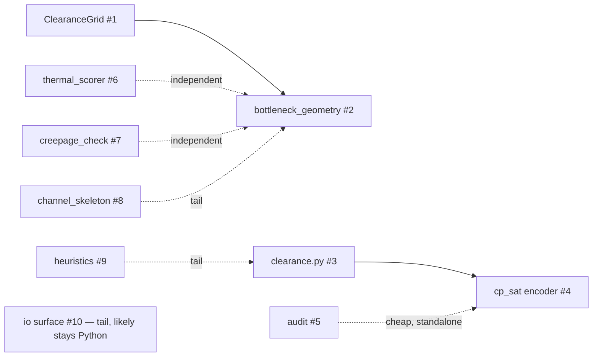

# Wave 3 Python → Rust Migration Roadmap — Ranking

## Goal Capsule

**Objective:** Deliver the ranking the parent roadmap deferred (R1 of `docs/plans/2026-07-23-003-perf-rust-migration-roadmap-plan.md`): enumerate the remaining Python→Rust migration candidates with per-driver scorecards (performance / safety-confidence / consolidation), dependency-ordered, against the bridge patterns and crate boundaries Waves 1–2 established. Nothing here is active scope; the parent plan's R8 execution policy (the roadmap commits no capacity; the board path is the critical path) carries forward unchanged.

**Product authority:** temper-placer + temper-geometry/temper-thermal maintainers.

**Open blockers:** None. Waves 1–2 are landed at HEAD (`2f89a190a` Wave 1; Wave 2 slices `0ba3a8c5c`/`932d13908`/`ed931e924`/`c764ba1d7`), so the ranking this plan was waiting on is now unblocked.

---

## Product Contract

### Summary

Rank the ~11k LOC of remaining Python surface into a dependency-ordered Wave 3 candidate list, scored per driver. Two candidates carry genuine Python-compute cost (bottleneck geometry, thermal scorer); the rest are driven by consolidation and safety-confidence. Contract/dataclass layers and orchestration stay Python by the Wave 2 lesson.

### Problem Frame

The migration program is a consolidation program, not a performance program. Wave 1 (hot paths) and Wave 2 (safety surface) proved the bridge pattern — pure compute moves to Rust as pyo3 pyfunctions, the Python module keeps its public API and delegates, differential tests pin bit-exact parity against the pre-migration oracle — and established the crate boundaries (temper-geometry for grid/geometry math, temper-thermal for FDM, temper-rust-router(-core) for routing kernels, temper-drc-rs for clearance checks, temper-constraint-compiler/temper-pcl-ir for the constraint IR).

Wave 3 exists now because Wave 3 is what the parent plan's R1/R3 promised: a coherent migration of the whole surface, ranked, not three separate initiatives. What remains falls into five bands: (1) grid/graph geometry that is still pure Python with documented perf budgets (`bottleneck_geometry.py` carries a wall-clock deadline and a 30 s closure-test budget for ~60 failed nets); (2) a second, independent thermal FDM scorer whose repeated sparse solves sit inside battery experiments; (3) the REQ-SAFE clearance/creepage validator whose pad-polygon math is pure Python in exactly the rotation-convention class where 102 violations were unmasked across 12 sites (`0a8e7194f`); (4) the CP-SAT encoder/audit surface — parent Wave 2's row 1, only partially landed (the IPC-2152 slice), explicitly reassigned here (D7); and (5) the churny glue — config loading, KiCad parse/export, heuristics, CLI, visualization — where the honest value is consolidation only, and low at that.

Be honest about the perf axis up front: most Wave 3 candidates are NOT hot loops. The hot loops moved in Waves 1–2 or live inside C-speed libraries (shapely, networkx, scipy) that Rust would not outrun. The drivers for most candidates are safety-confidence (validators and gates where silent-logic bugs actually occurred — the parent plan's D5) and consolidation (fewer languages, one home per domain). The scorecards below reflect that.

### Key Decisions

- D1. **Per-driver scorecards, no composite** (inherited from parent D4; session-settled: user-directed). Each candidate is scored High/Medium/Low on perf, safety-confidence, and consolidation, plus days, risk, home crate, current state, and dependency position.
- D2. **Honest perf framing** (session-settled: user-directed — the parent session settled all three drivers apply; this ranking records that most candidates score Low on perf). A candidate may carry a perf score above Low only where evidence exists: a documented budget (bottleneck timeout), a repeated-solve loop (thermal scorer battery), or a numba cold-start/copy overhead (ClearanceGrid). Governs R3.
- D3. **Contract/dataclass layers stay Python** (extends the Wave 2 gates.py lesson, session-settled by this ranking). Dataclass/enum surfaces (`core/loop.py`, `core/board.py`, `core/netlist.py`, `core/net_types.py`, `core/design_rules.py`, `core/priority.py`, `pcl/constraints.py`, `router_v6/constraint_model.py`, `router_v6/routing_results.py`, `validation/drc_types.py`, `fields/`) are high-churn contracts; porting them buys nothing and churns every call site. Not candidates.
- D4. **Already-Rust-backed modules are recorded as landed, never re-proposed** (extends parent R4 to Wave 3). Verified at HEAD via crate imports: geometry/ package, congestion_tensor, corridor, copper_coverage, channel_widths, astar_core_numba, thermal_fdm, pad_geometry, isolation_barrier, rtd_safety, spice, drc_oracle + drc_runner + clearance_check, loop_extractor, dsn_*, pcl/rust_bridge. Governs R2.
- D5. **Dependency order before safety-criticality order** (session-settled by this ranking): where one candidate feeds another (the ClearanceGrid rasterisation feeds `bottleneck_geometry`; `requirements/validators/clearance.py` feeds the CP-SAT domain-clearance gate), the upstream module ranks first. Where candidates are independent, safety-confidence × bug history breaks ties (parent D5).
- D6. **Home-crate mapping follows established boundaries** (inherited from parent KTD5's principle): grid/graph geometry → temper-geometry; thermal solves → temper-thermal; safety validators → temper-geometry primitives or temper-drc-rs-adjacent. Naming note: the parent roadmap's "temper-constraints" is the PCL constraint-engine crate where the Wave 2 IPC slice landed; `temper-constraint-compiler` is a distinct constraint-IR crate. Exact per-candidate assignment is planning's job. Governs R6.
- D7. **Parent Wave 2 reassignment, stated** (session-settled by this ranking): the parent roadmap's Wave 2 row 1 ("CP-SAT gate encodings", ~1.2k LOC) landed only partially in Wave 2 — the IPC-2152 ampacity slice — and the encoder surface itself (`_encoder_core.py`/`_encoder_solve.py`/`concrete_gates.py`/`unsat.py`) was NOT migrated. It is explicitly reassigned to Wave 3 (candidate #4) here; the parent's Wave 2 table is superseded on this row. This is why the ranking could not run before: the parent R1 deferral ("ranking deferred until Waves 1–2 land") is now satisfied — Wave 2's remaining rows (isolation/clearance encoders, thermal/RTD validators, SPICE) all landed.

### Requirements

- R1. The roadmap ranks all Wave 3 candidates in dependency order with a per-driver scorecard — performance, safety-confidence, consolidation — plus days, risk, home crate (candidate), current migration state, and dependency position; no composite score.
- R2. Candidates whose surface is already Rust-backed are recorded as landed in this plan's Scope Boundaries and excluded from the candidate set (extends parent R4).
- R3. Perf scores above Low require documented or structurally-evident Python-compute cost; a candidate with no such evidence is scored Low on perf even if it is large (heuristics, config loading, exporters).
- R4. Every migration satisfies the parent plan's three gates unchanged: TDD with the Python reference implementation as oracle, property-test invariants per module, and closure parity; safety-surface parity is verified against the current bug-fixed Python behavior (parent R6/R7).
- R5. The roadmap commits no engineering capacity (extends parent R8): pulling any candidate into execution is a separate decision; STRATEGY.md's "critical path is design completion, not tooling" is not overridden.
- R6. Safety-gate-adjacent candidates (R24 post-solve audit, REQ-SAFE validators, thermal verdicts) are ranked by safety-confidence × recorded bug history, after dependency order (D5), per the parent plan's D5.
- R7. Contract/dataclass layers listed in Scope Boundaries are out of the candidate set; a later migration may revisit one only with a written reason that is not "consolidation".

### Ranked Migration Targets

The `#` column is the rank; the table is ordered by dependency first (D5): upstream modules rank before their consumers. The renumbering from the draft reflects this — the ClearanceGrid surface ranks before the bottleneck geometry it feeds.

| # | Candidate (LOC) | State | Days | Risk | Perf | Safety | Consolidation | Home crate (candidate) | Depends on |
|---|---|---|---|---|---|---|---|---|---|
| 1 | `deterministic/stages/_grid_core.py` ClearanceGrid (+ `_grid_fence.py` + `_grid_hv.py`, ~850) | Not started; numba-jitted block funcs exist | 5–8 | Med | Med — numba is already fast; win is cold-start elimination + consolidation (Wave 1 #5 precedent) | Med — grid feeds bottleneck capacities and stage DRC | High — rasterisation into temper-geometry | temper-geometry | none; feeds #2 |
| 2 | `router_v6/bottleneck_geometry.py` (+ `core/pin_geometry.py`, ~1,190) | Not started; PBT surface exists (`test_bottleneck_analysis_pbt.py`, `test_bottleneck_ordering_pbt.py`) | 8–12 | Med-High | **High** — pure-Python cell loops + capacitated graph + min-cut, no numpy; carries `BOTTLENECK_TIMEOUT_S=0.5` and a documented ~30 s closure budget (~60 failed nets) | Med-High — models safety-category creepage capacity discounts (R4 "category-HIGH on category-LOW") | High — grid/graph math into temper-geometry | temper-geometry | #1 (ClearanceGrid); feeds diagnostics → routing_results → closure JSON |
| 3 | `requirements/validators/clearance.py` + `_copper.py` (828+320) | Not started | 5–8 | Med | Low | **High** — REQ-SAFE-01; pad-polygon rotation math is pure Python, the exact class unmasked at 102 violations across 12 sites (`0a8e7194f`) | High — pad-polygon distance math overlaps temper-geometry primitives | temper-geometry primitives | feeds CP-SAT `domain_clearance` gate (stays Python until #4) |
| 4 | `placer/cp_sat/_encoder_core.py` + `_encoder_solve.py` + `concrete_gates.py` + `unsat.py` (~1,277) | Not started — reassigned from parent Wave 2 row 1 (D7); only the IPC-2152 slice landed in Wave 2 | 8–12 | Med | Low-Med — unsat refinement loops repeat sub-solves | High — R24 physics-gated constraint encoding surface | Med | temper-constraints (PCL engine) or new CP-SAT crate | #3 (domain rules); feeds the CP-SAT solve |
| 5 | `placer/cp_sat/audit.py` (369) | Not started | 2–3 | Low | Low | High — implements the R24 post-solve audit ("mismatch is a hard CI failure"); Chebyshev gap recomputation | Med — `_bbox`/`_chebyshev_gap` math into temper-geometry | temper-geometry | standalone; consumed by `gate.py` |
| 6 | `validation/thermal_scorer.py` (789) | Not started; independent-scorer tests exist (`test_thermal_scorer_independence.py`) | 8–12 | Med | **Med-High** — repeated sparse assembly + spsolve per placement inside battery runs | High — independent T_j scorer; `falsifiability_assertion` vs the Rust field solver is the THM-adjacent cross-check | High — shared thermal domain with temper-thermal; KTD9 parity contract known | temper-thermal | temper-thermal crate; feeds battery_run → physics_oracle |
| 7 | `router_v6/creepage_check.py` (557) | Not started | 5–8 | Med | Low | **High** — pure-Python HV-isolation clearance/creepage validator, the D5/R6 class (safety validator with bug-history exposure) | Med — HV/LV geometry into temper-geometry primitives | temper-geometry primitives | feeds router DRC reporting |
| 8 | `router_v6/channel_skeleton.py` (464) | Not started | 5–8 | Med-High | Low — shapely Voronoi + networkx orchestration over C-speed libs (R3) | Low-Med — feeds channel_widths (Rust) + constraint_model | Med | temper-geometry or stay-shapely | none (independent of #1/#2) |
| 9 | `heuristics/organizational.py` + `structural.py` + `style.py` (~2,197) | Not started | 10–15 | Low-Med | Low | Med — placement-strategy surface | Low-Med — decision logic, churny by design (style/pipeline keep evolving) | temper-geometry (keepout mask) | none |
| 10 | `io/config_loader.py` + `kicad_parser.py` + `_parse_*` + `kicad_exporter.py` (~3,100) | Not started; dsn surface already Rust (temper-dsn) | 15–20 | High | Low | Low-Med — input validation | Med — temper-io-types exists for export types | temper-io-types or stay Python | none |

Sequence: #1 → #2 (grid feeds capacities); #3 → #4 (validator feeds the gate encoding) — both within the wave's dependency order; #5, #6, #7 are independent and can land in any order after #1/#3; #8, #9, #10 are tail, low priority, and likely to stay Python (see Outstanding Questions).

### Scope Boundaries

- **Out of the candidate set — already Rust-backed (R2):** `geometry/` package; `router_v6/congestion_tensor.py`, `corridor.py`, `channel_widths.py`, `astar_core_numba.py` (Wave 1); `physics/thermal_fdm.py`, `copper_coverage.py` (Wave 1); `core/pad_geometry.py`, `placer/cp_sat/isolation_barrier.py`, `validation/rtd_safety.py`, `validation/spice.py`, gates.py ampacity paths (Wave 2); `validation/drc_oracle.py`, `validation/drc_runner.py`, `router_v6/clearance_check.py` (temper-drc-rs); `core/loop_extractor.py` (temper-rust-router); `io/dsn_*.py` (temper-dsn); `pcl/rust_bridge.py` (temper-pcl-ir). Note: `report/formatter.py` + `summary.py` are pure Python (f-string report builders moved from the deleted temper-drc package) and are NOT Rust-backed — they belong to the glue bucket below.
- **Out of the candidate set — contract/dataclass layers (D3):** `core/loop.py`, `core/board.py`, `core/netlist.py`, `core/net_types.py`, `core/design_rules.py`, `core/priority.py`, `pcl/constraints.py`, `router_v6/constraint_model.py`, `router_v6/routing_results.py`, `validation/drc_types.py`, `fields/`, plus `validation/drc_result.py` (dataclass result surface).
- **Out of the candidate set — orchestration/glue (stays Python):** `cli/`, `visualization/` (incl. `board_renderer.py` at 1012 LOC — Plotly/HTML), `regression/`, `explainability/`, `report/` (incl. `formatter.py` + `summary.py` — f-string builders, no crate), `adapters/`, `analysis/`, `metrics/`, `topological/`, `manufacturing/`, `pipeline/`, `validation/results/battery_run.py`, `validation/scheduler.py`, `validation/drc.py`, `validation/drc_fence.py`, `validation/_drc_api.py` (kicad-cli wrapper), `router_v6/thermal_relief.py`, `router_v6/occupancy_grid.py`, `router_v6/congestion.py`, `router_v6/diagnostics.py`, `router_v6/_adapter_convert.py`, `router_v6/constraints_drc_oracle.py`, `router_v6/constraints/` package, `deterministic/` stage orchestration (excluding `_grid_core.py`/`_grid_fence.py`/`_grid_hv.py`, candidate #1).
- Deferred: a one-shot whole-surface migration — decomposition into a ranked wave is the point of this roadmap (parent scope boundary, unchanged).
- Never in scope: firmware.

### Dependencies / Assumptions

- Assumption: migrated modules exit the Python coverage gate and import-linter contracts by the established pattern; stale allowlist entries are removable per the monotonic-shrink rule (parent plan, unchanged).
- Dependency: #2's parity tolerance contract is already measured (KTD9: two direct factorizations differ by ~κ·ε; scipy stays in Wave 1 #6's path); #2's independent scorer pins against its own current output, and the falsifiability assertion's 1.0 °C threshold is a separate, preserved contract.
- Dependency: #2's oracle is the current module including its Fix #4/#5 semantics (deadline-stride aborts and creepage discounts) — parity must be pinned against the module as committed, per parent R7.
- Assumption: `bottleneck_geometry.py`'s min-cut semantics are stable enough to pin; its own plan (`docs/plans/2026-06-23-006-feat-min-cut-bottleneck-plan.md`) is the reference for the intended semantics where the code and plan disagree.

### Outstanding Questions

Resolve Before Planning:

- Q1. `requirements/validators/clearance.py`: should the pad-polygon math delegate to existing temper-geometry primitives first (shrinking the Rust surface to the pairing/domain logic), or be ported wholesale? Note the classifier contract: `domain_clearance.py` imports five symbols from `clearance.py` including private helpers (`_components_in_domain`, `_domain_boundary_pairs`, `_nets_domain_map`) — the migration must preserve these as unchanged wrapper re-exports until the CP-SAT encoder surface (candidate #4) is migrated, so the "one classifier, cannot drift" invariant survives. Also note `_copper.py`'s rotation math actually delegates to `kicad_transform.rotate_local_to_world` (pure Python) — the delegation target is that module, not reimplemented rotation.

Deferred to Planning:

- Q2. `bottleneck_geometry.py`: the parity contract is pinned against the module as committed (per the Dependencies/Assumptions entry — the current min-cut semantics, deadline-stride aborts, and R4 creepage discounts are the oracle). Whether a semantics-freeze commit is needed before pinning is answered by the module's own plan (`docs/plans/2026-06-23-006-feat-min-cut-bottleneck-plan.md`) being the reference where code and plan disagree; if they diverge materially, planning freezes semantics first.
- Q3. `thermal_scorer.py`: the parity target is the scorer's own numeric output (T_grid); the falsifiability assertion's 1.0 °C threshold against the Rust field solver is a separate, preserved contract (see Dependencies/Assumptions) — the two imply different test oracles and are both in scope for planning.
- Q4. Per-candidate TDD/PBT property counts, exact bridge patterns, and per-candidate home-crate split (the parent plan deferred the same, unchanged).
- Q5. `channel_skeleton.py`: whether the Voronoi dependency moves to a Rust geometry library or stays shapely with Python orchestration — the edt-crate spike (parent KTD8) shows third-party geometry libraries diverge, so this needs its own spike before any commitment.
- Q6. The io surface (candidate #10): whether KiCad parse/export stays Python permanently as a `kiutils` adapter — a format-churn decision, not a performance one, and likely yes.

### Sources / Research

- Parent roadmap: `docs/plans/2026-07-23-003-perf-rust-migration-roadmap-plan.md` (R1's deferred Wave 3 ranking; D4/D5; KTD5/KTD8/KTD9; R6/R7/R8).
- Execution policy and bug history: `docs/STRATEGY.md` (2026-07-25, critical-path framing; 2026-07-27 vacuous-aggregation and broken-join entries; rotation-convention fix context).
- Bottleneck work: `docs/plans/2026-06-23-006-feat-min-cut-bottleneck-plan.md`; `router_v6/bottleneck_geometry.py`'s own budget documentation (`BOTTLENECK_TIMEOUT_S`, deadline-stride comment).
- Wave landing commits at HEAD: `2f89a190a` (Wave 1), `0ba3a8c5c`/`932d13908`/`ed931e924`/`c764ba1d7` (Wave 2 slices); crate verification via imports in `temper_placer/`.
- Bridge patterns: `docs/plans/2026-06-28-001-feat-router-v6-rust-topology-plan.md` (flag dispatch), `docs/plans/2026-07-08-002` (crate split), `docs/plans/2026-07-11-001` (strangler-fig); `packages/temper-geometry/VERIFICATION.md`, `packages/temper-thermal/VERIFICATION.md`; `docs/evidence/2026-07-26-clearance-rust-port.md`.
- Surface inventory measured 2026-07-31 at HEAD `c764ba1d7` via `find ... | xargs wc -l` (122,657 LOC total Python surface; ~11k LOC in candidate modules; the remainder is bucketed in Scope Boundaries).

---

## Planning Contract

Deferred. Per the artifact_readiness contract (requirements-only), implementation units, key technical decisions, and the verification contract for Wave 3 belong to a later ce-plan enrichment of this roadmap, once a candidate is pulled into execution (R5).
