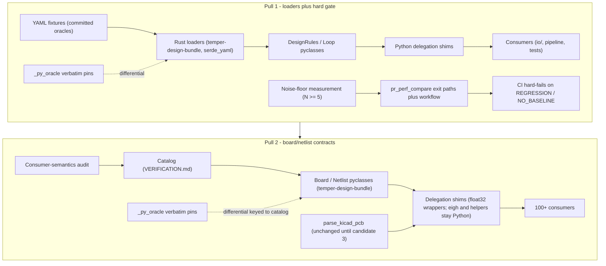

# Wave 4 Phase 3 First Pulls - Plan

## Goal Capsule

**Objective:** carry the Wave-4 Phase 3 formats/IO phase's first execution slice to landed state: two sequential pulls — the loaders (netclass/loop) as the pilot, then the board/netlist contracts as the spine — plus the Phase-0 hard perf-gate wiring the slice depends on. The parent plan (`docs/plans/2026-08-02-001-feat-wave4-phase3-formats-io-plan.md`) is requirements-only and ready; this plan pins the pull-level contract it left open: the consumer-semantics audit's deliverable, the perf-gate wiring's scope, and the pull sequencing.

**Product authority:** temper-placer plus temper-design-bundle/temper-io-types maintainers, with residual verdicts (R3) reviewed at the program's product authority.

**Open blockers:** none. The two risk centers resolved in-plan: the required-status-check arm of program R2 is recorded as blocked-by-governance (main has no branch protection, per AGENTS.md), and the delegation-mode CI noise floor is a required measurement inside pull 1, not an assumed existing asset.

---

## Product Contract

### Summary

The slice is two sequential pulls that open Phase 3. Pull 1 migrates the netclass and loop loaders onto their already-Rust contracts and ships the hard perf-gate wiring (program R2 completion). Pull 2 migrates `core/board.py` and `core/netlist.py` to Rust pyclasses with pure-delegation shims, backed by a full consumer-semantics enumeration whose catalog is committed in the crate's VERIFICATION.md and enforced through the existing per-pull scorecard convention — no new CI gate.

### Problem Frame

The parent Phase 3 plan is ready to pull, but three pull-level decisions were open when it landed, and the session handoff (`docs/handoffs/2026-08-03-wave4-migration-program.md`) named them as the next actions. First, the plan budgets a consumer-semantics audit for the board/netlist migration without defining its deliverable or enforcement. Second, the mandatory performance A/B (program R1b) runs on a comment-only harness: `pr-perf-check.yml:75` still carries `continue-on-error: true` with a `temper-N6-U8` stub and a 2026-09-01 hard-fail date, so program R2's "Phase 0 wires it as a real hard gate" is incomplete on main despite the handoff's Phase 0/1 complete claim. Third, the handoff leaves the sequencing of the first pulls to the puller.

The audit's blast radius is verified at origin/main: 69 src modules import `temper_placer.core.board` and 77 import `temper_placer.core.netlist`, consistent with the parent plan's "100+ consumers each". The numpy surface is bounded per the parent plan's D2 evidence: `Board`'s float32 returns are direct conversions of its own f64 fields, and `compute_eigenvector_centrality` at `netlist.py:427` (`np.linalg.eigh`) is the one non-deterministic kernel, already assigned to stay in the shim.

The tension behind the audit's deliverable shape is in-repo documented: simple cataloging drifts (the coverage allowlist's monotonic-shrink rule exists because entries go stale), and CI is saturated by concurrent agent workstreams (handoff lesson 7). The resolution reuses the mechanism the repo already maintains — per-pull VERIFICATION.md scorecard updates — instead of adding a new gate.

### Key Decisions

- D1. **Slice scope is Phase 3 candidates 1 and 2 together** (session-settled: user-directed — chosen over a single candidate and over Phase-A continuation: the handoff's next-action ordering makes the loaders pilot plus the contracts spine the first execution slice of Phase 3). Governs R1, R2, R3.
- D2. **Two sequential pulls, loaders first** (session-settled: user-directed — chosen over one combined pull and over parallel pulls: the pilot exercises the full gate set — differential, stub sync, allowlist, hard perf gate — on a 3-5 day surface before the 8-12 day spine). Governs R1, R4.
- D3. **Full consumer enumeration for the audit** (session-settled: user-directed — chosen over a bounded API-parity audit and over product-path-ranked enumeration: maximal semantic confidence on the critical-path spine; every access pattern of all 69+77 src importers is pinned). Governs R11, R12.
- D4. **Hard perf-gate wiring lands in this slice** (session-settled: user-directed — chosen over deferring to a separate pull: pure-delegation pulls are the safest first victims of a hard gate, and program R2 is verifiably unwired on main). Governs R4, R5, R6.
- D5. **Audit catalog committed in VERIFICATION.md, no new CI gate** (session-settled: user-directed — chosen over a PR-time catalog and over a CI-enforced inventory: the repo's own drift and CI-saturation evidence made committed catalog plus scorecard enforcement the resolution). Governs R11, R13.
- D6. **"Wired" means workflow-level hard fail, not a required status check** (session-settled: user-approved — chosen over adding branch protection on main: AGENTS.md documents main's no-branch-protection posture, so the required-check arm is recorded as blocked-by-governance, not claimed). Governs R6.

### Requirements

**Pull structure**

- R1. The slice ships as two sequential, independently mergeable pulls: pull 1 is the loaders migration plus the perf-gate wiring, pull 2 is the board/netlist contract migration (D2). Each pull is closed by the full parent plan gate set per the program contract (G1-G8, B1-B10, R1a-R1h) and the program R3 procedure where applicable.
- R2. Neither pull touches the board path: `pcb/**`, `elec/src/**`, and the DRC ratchet constants in `test_regression_drc.py` are read-only for this slice; the #575 ratchet decision stays with the board workstream (standing constraints, unchanged).
- R3. Pull 2 lands only after pull 1 has merged, and the migration pipeline (`docs/migration-pipeline.md`) governs both: brainstorm → doc-review → work → code-review → verify → land.

**Perf-gate wiring (pull 1)**

- R4. The hard gate ships in pull 1: `pr-perf-check.yml` loses `continue-on-error`, the comparison script exits non-zero on regression, and a missing or empty baseline file fails closed — file-level per KTD8, with per-key NO_BASELINE rows reported rather than failing — plus the workflow-level arms of program R2, with the margins preserved (TIMING_MARGIN 0.20, COMPLETION_MARGIN 0.10, IMPROVEMENT_THRESHOLD 0.10). Completes program R2.
- R5. The delegation-mode CI noise floor is quantified and recorded as part of the wiring: the "no regression beyond noise" calibration for pure-delegation modules that pull 1's own migration and pull 2's migration are measured against. The measurement exists before pull 1 claims the gate.
- R6. The required-status-check arm of program R2 is recorded in pull 1's notes as blocked-by-governance, with the AGENTS.md evidence cited; the pull does not silently claim a required check main cannot enforce (D6).

**Loaders pull (candidate 2, parent R5 subset)**

- R7. `io/netclass_loader.py` and `io/loop_loader.py` migrate onto their Rust target contracts with YAML-to-contract bit-parity differentials, per the parent plan's candidate 2 scope and parity oracle (YAML fixtures feeding DesignRules and loop pyclasses).
- R8. Each loader's `.pyi` stub surface is updated in the same pull, the allowlist shrinks or stays unchanged, and any consumer adaptations land inside the pull per parent R7 (the `LoopType.members()` precedent).

**Contracts pull (candidate 1, parent R1)**

- R9. `core/board.py` and `core/netlist.py` migrate to Rust pyclasses in temper-design-bundle with pure-delegation shims; the differential pins construction and round-trip field parity bit-identical against the verbatim pre-migration dataclasses (parent R1).
- R10. The numpy float32-returning methods stay in the shim as thin deterministic wrappers, and `compute_eigenvector_centrality` (the `np.linalg.eigh` kernel) stays in the shim as the recorded non-deterministic exception, never gated by the bit-parity differential (parent R1).
- R11. The consumer-semantics audit is full enumeration: every src consumer of Board and Netlist is cataloged with its access patterns (iteration, dunders, attribute access, numpy returns), the catalog is committed in `packages/temper-design-bundle/VERIFICATION.md`, and the differential suite is keyed to it — every enumerated pattern gets a pin (D3, D5).
- R12. When an enumerated pattern cannot be reproduced by the pyclass, the resolution order is: pyclass gains the missing compat surface, then the consumer is adapted inside the PR, then — if neither clears the parent gate set — an R3 JUSTIFIED-KEEP is recorded with a named blocker. The catalog records each outcome.

**Recording and stability**

- R13. Drift protection is the existing per-pull scorecard convention: every later pull that consumes Board/Netlist (parse engine, config loaders, downstream phases) records new consumer adaptations against the committed catalog in its own pull; no new CI gate or inventory is added (D5).
- R14. The round-trip corpus and goldens stay frozen for this slice's differentials per parent R10, and any concurrent board change during the slice re-measures per the repo's provenance gates rather than silently moving the oracle.

### Phased Migration Path

LOC from the parent plan's 2026-08-03 measurement at origin/main, re-verified at pull time per parent plan guidance.

| Pull | Scope (repo-relative) | LOC | Risk | Gates |
|---|---|---|---|---|
| 1 | Loaders + perf-gate wiring: `io/netclass_loader.py`, `io/loop_loader.py` → Rust; `pr-perf-check.yml` + `scripts/pr_perf_compare.py` hard-fail | 402 + wiring | Low | R1 gate set; YAML→contract bit-parity (R7); noise floor quantified (R5) |
| 2 | Contracts: `core/board.py`, `core/netlist.py` → temper-design-bundle pyclasses + delegation shims + consumer-semantics catalog | 1,243 | High | R1 with construction/round-trip bit-parity (R9); full enumeration catalog (R11); resolution order (R12) |

Dependency rationale: pull 1 first because it is the pilot — small surface, already-Rust target contracts, and the first migration to run against the hard perf gate it ships. Pull 2 second because its 100+ consumer surface needs the pilot's proven gate path and because `parse_kicad_pcb` constructs the contracts, so the migrated target types are the prerequisite for the phase's later parse pulls.

### Acceptance Examples

- AE1. **Non-reproducible pattern.** When the audit finds a consumer pattern the pyclass cannot reproduce (e.g., int-comparison on a member-identity enum), the pull follows R12's order: compat surface, then in-PR consumer adaptation, then an R3 JUSTIFIED-KEEP with a named blocker; the catalog entry records which outcome landed.
- AE2. **Hard-gate failure modes.** When the perf baseline file is missing or empty, CI fails closed (R4, file-level per KTD8) instead of skipping; when the PR profile produces no metrics at all, CI fails closed rather than silently passing; a delegation migration's delta trips the margin-based REGRESSION check, and the measured noise floor (R5) demonstrates the margins exceed run-to-run noise — the pull fails rather than commenting.
- AE3. **Later-pull drift.** When a future pull (parse engine, config loaders) adds a Board/Netlist consumer with an access pattern absent from the catalog, that pull records the new pattern and its resolution against the committed catalog in VERIFICATION.md (R13) — no new gate fires, and the scorecard diff is the review evidence.

### Scope Boundaries

- In scope: pull 1 (netclass/loop loaders + hard perf-gate wiring + noise-floor measurement), pull 2 (board/netlist contracts + full-enumeration catalog), the two-candidate slice of the parent Phase 3 plan.
- Out: Phase 3 candidates 3-7 (parse engine, write/export engine, config/reference loaders, DSN surface, residuals) — pulled in their own decisions; the kiutils-removal gate (parent R4) closes at the parse/write pulls, not this slice.
- Out: Phase A kernel continuation, Phase 5 orchestration (`ParsedPCB` verdict), Phase 6 residuals — recorded program areas, not active scope.
- Out: the #575 DRC-ratchet decision — owned by the board workstream; `test_regression_drc.py` is read-only here (R2).
- Out: branch protection on main — a repo-governance change beyond this slice; the required-status-check arm is recorded, not claimed (D6, R6).
- Deferred: per-module bridge patterns, home-crate splits for candidates outside this slice (parse/write/DSN), and PBT/metamorphic counts beyond the minima — planning's job per pull (parent Q3/Q4; the loaders' own home is settled by KTD1).

<!-- ce-section: work-relationships -->

### How This Work Fits Together

This plan owns the Phase 3 first-pull slice of the Wave-4 full-migration program. The broader program breakdown below is the current understanding, not a committed roadmap.

- **Phase 3 candidates 3-7 (parse engine, write engine, config/reference loaders, DSN, residuals)** — Depends on this slice's pull 2: the parse engine's differential asserts against the migrated contract types, so candidate 3 lands after the contracts pull; candidates 2 (this slice) and 6 are the independent opportunists.
- **Phase A compute-kernel continuation (metrics/physics/regression)** — Can proceed independently of this slice; if nothing clean remains, the program R7 procedure (JUSTIFIED-KEEP with evidence) applies rather than forcing.
- **Phase 5 orchestration and Phase 6 residuals** — Depends on Phase 3 closing; `ParsedPCB` stays Python with its verdict owned at Phase 5.
- **#575 board-workstream DRC-ratchet decision** — Independent of this slice; owned by the board workstream, and both pulls keep the ratchet test read-only.
- **Phase 2 leftovers (`validation/drc_types.py`, `validation/drc_result.py`)** — Still to decide at their own pull; they consume parse output downstream and do not gate this slice.

### Dependencies / Assumptions

- **Parent plans:** `docs/plans/2026-08-02-001-feat-wave4-phase3-formats-io-plan.md` (candidate scope, D1-D7, R1-R10, Q1-Q5) and `docs/plans/2026-08-01-001-feat-wave4-full-migration-program-plan.md` (discipline contract G1-G8/B1-B10, R1a-R1h, R2, R3, R5).
- **Seed crates:** temper-design-bundle (net_types, loops, design_rules, gates, priority pyclasses) and temper-io-types (DSN primitives, serializers), per parent plan; the `.pyi` stub at `packages/temper-placer/stubs/temper_design_bundle_python/__init__.pyi` is the keep-in-sync contract for every pyclass change in this slice.
- **Verified facts (origin/main, 2026-08-03):** `pr-perf-check.yml` still carries `continue-on-error: true` with the `temper-N6-U8` stub (verified at line 75); `scripts/pr_perf_compare.py` holds the margins but no delegation-mode noise floor; 69 src modules import board, 77 import netlist; main has no branch protection (AGENTS.md).
- **Build discipline:** `make extensions` / `make extensions-check` / `make venv-isolate` and `scripts/check_stale_extensions.py` remain mandatory per migrated crate; fresh-`.so` verification (`hasattr` check) is part of each pull's work.
- Assumption: the loaders' YAML fixtures (`packages/temper-placer/configs/netclass_rules.yaml`, loop templates) are the parity oracle and stay frozen through pull 1.
- Assumption: the differential-oracle and scorecard conventions documented in the parent plan's discipline anchors apply unchanged to both pulls.

### Outstanding Questions

Resolve Before Planning: none (the requirements-only draft's own Q1-Q3 — loader home-crate, noise-floor procedure, PBT/metamorphic counts — resolved in this enrichment to KTD1, KTD4, and the plan minima of 5 properties and 3 relations per module; these are the draft's numbers, distinct from the parent plan's Q1/Q2, which are out of slice or carried as the float-parse assumption below).

Deferred:

- Q1. The required-status-check arm's eventual disposition — recorded in pull 1's PR notes as blocked-by-governance (R6); unblocking is a repo-governance decision outside this plan.
- Q2. Float-parse parity on the loaders' YAML numeric tokens (parent-plan Q2) — assumed IEEE-correct round-to-nearest; the loaders' differential verifies it before the engine is claimed, and a divergence is recorded as a new B-catalog class, not absorbed.

### Sources / Research

- Parent Phase 3 plan: `docs/plans/2026-08-02-001-feat-wave4-phase3-formats-io-plan.md` (D2 audit budget, candidate 1/2 rows, R1/R5/R7/R10, Q3/Q4).
- Program plan: `docs/plans/2026-08-01-001-feat-wave4-full-migration-program-plan.md` (R1b mandatory perf A/B, R2 hard-gate wiring, R3/R5 governance).
- Session handoff: `docs/handoffs/2026-08-03-wave4-migration-program.md` (next actions, audit precedent, lessons 5-8).
- Harness state: `.github/workflows/pr-perf-check.yml`, `scripts/pr_perf_compare.py` (margins at lines 24-26; `continue-on-error` at workflow line 75; `main()` returns 0 on every path at line 228 — verified on origin/main `52df5627a`).
- Governance posture: `docs/STRATEGY.md` (board path is critical; the program commits no capacity) and AGENTS.md (branch-protection absence, DRC ceiling protocol, git-stash guard).
- Migration pipeline: `docs/migration-pipeline.md` (per-pull stage order).
- Landed migration pattern: `packages/temper-design-bundle/src/{net_types,loops,design_rules,gates,priority}.rs` (enum macros, `members()`, `py_str_repr`/`py_float_str` helpers, Python call-backs), `packages/temper-placer/src/temper_placer/core/{loop,design_rules,priority}.py` (delegation shims), `packages/temper-placer/tests/{core,placer}/test_{loop,design_rules,gates,priority}_rust_differential.py` plus the `_py_oracle.py` convention, `packages/temper-placer/stubs/temper_design_bundle_python/__init__.pyi`, `packages/temper-design-bundle/VERIFICATION.md` scorecard format (lines 219-236, 543-555).
- Institutional learnings: `docs/solutions/architecture-patterns/temper-drc-rust-migration-shim-then-delete-2026-08-03.md`, `docs/solutions/best-practices/green-rust-tests-are-not-evidence-the-extension-was-rebuilt-2026-07-27.md`, `docs/solutions/best-practices/characterize-oracle-noise-floor-2026-07-26.md`, `docs/solutions/best-practices/gate-neutering-mechanisms-2026-07-26.md`, `docs/solutions/best-practices/moved-function-relocates-monkeypatch-surface-2026-07-29.md`, `docs/solutions/best-practices/substring-net-classification-drifts-from-ssot-2026-07-27.md`, `docs/solutions/build-errors/stale-rust-build-artifacts-gil-crash-2026-07-06.md`.

---

## Planning Contract

### Key Technical Decisions

- KTD1. **The loaders' Rust home is temper-design-bundle** (session-settled: user-directed — chosen over temper-io-types: the loaders construct design-bundle contracts, `serde_yaml` 0.9 is already a dependency there, and the `design_rules.rs` call-back precedent covers the remaining Python constants). Governs the U2/U3 approach.
- KTD2. **LayerIndex follows the priority IntEnum precedent** (session-settled: user-directed — chosen over adding an int-compat pyclass surface: member identity, `__str__` (KiCad name), `members()`, and value getters are reproduced; int-comparison becomes a documented deviation, and consumers that need it are adapted inside the migration PR per R12). Governs the U5 approach.
- KTD3. **Hard-gate mechanism: exit-code paths plus workflow removal plus race fix plus trigger widening** (session-settled: user-directed — chosen over deferring the wiring: the comparison script currently exits 0 on every path; the wiring adds non-zero exits for REGRESSION and NO_BASELINE, resolves the JSON-parse race the stub comment cites, widens the trigger to `scripts/` and `benchmarks/`, and records the required-check arm as blocked-by-governance). Instantiates D4; governs R4-R6, U1.
- KTD4. **Noise-floor protocol: N≥5 profile runs, median plus range per metric, stated in the PR body** (session-settled: user-directed — chosen over assuming a floor exists: the R2 carve-out requires a quantified floor before a delegation pull claims "no regression beyond noise"). Instantiates D4; governs R5, U1.
- KTD5. **Differential-oracle pinning** — each migration pins a verbatim pre-migration copy as a `_py_oracle` module at the pre-migration commit; construction parity drives identical kwargs into both sides; floats canonicalize via `.hex()`; enums compare via `getattr` plus `members()`; full `repr` is byte-parity using the landed `py_str_repr`/`py_float_str` helpers (B9/B10); `ValueError`/`LoopLoadError` texts match exactly. Governs U2, U3, U5, U6.
- KTD6. **Numpy boundary: f64 in Rust, float32 wrappers in the shim** — `Board.polygon_array`/bounds arrays and `Netlist.get_bounds_array`/`get_fixed_mask` stay in the delegation shim as deterministic wrappers, and the differential asserts dtype explicitly (per R10, `np.float32(10.0) == 10.0` hides dtype loss). Governs U5, U6.
- KTD7. **Python-kept helper surface** — `compute_eigenvector_centrality` (eigh, R10), `build_adjacency_matrix`, `find_isomorphic_groups`, `save_loop_to_yaml`, and the loader-side `NetClassRulesDict` wrapper stay Python in the delegation modules, per the priority/gates precedent of keeping non-data helpers Python; the Rust netclass loader imports `TEMPER_NET_ASSIGNMENTS` from Python at call time per the `design_rules.rs` precedent (per `docs/solutions/best-practices/substring-net-classification-drifts-from-ssot-2026-07-27.md`: one home for the keyword tables). Governs U2, U3, U6.
- KTD8. **NO_BASELINE scoping: file-level fail-closed, per-key reported, baseline-coverage reconciliation** (session-settled: user-approved — chosen over per-key fail-closed: the PR-side `--module all` profile emits `loss-fn`/`router-bench` records that main's baseline has no rows for, so per-key fail-closed would redden every PR; the gate fails only when the baseline file is missing or empty, per-key NO_BASELINE rows are reported in the comparison output, and U1 reconciles baseline key coverage before the gate goes hard). Governs R4, AE2, U1.

### High-Level Technical Design

The slice is two dependency-ordered pulls. Pull 1 builds the loader pyclasses (Rust side), keeps the public loader API through delegation shims, and makes the perf gate real so both pulls' mandatory performance A/B runs against a hard gate. Pull 2 builds the contract pyclasses after a committed consumer-semantics audit; the shims hold the entire numpy surface and the non-data helpers, so `parse_kicad_pcb` and every existing consumer see no behavior change. The differential oracles pin both sides of every migration to verbatim pre-migration copies.

---

## Implementation Units

### U1. Hard perf-gate wiring plus noise-floor measurement (pull 1)

- **Goal:** make the performance gate real and prove it fires, and quantify the delegation-mode noise floor both pulls are measured against.
- **Requirements:** R4, R5, R6.
- **Dependencies:** none.
- **Files:**
  - `scripts/pr_perf_compare.py` (exit paths; NO_BASELINE fail-closed)
  - `.github/workflows/pr-perf-check.yml` (continue-on-error removal; trigger widening; race handling)
  - `scripts/tests/test_pr_perf_compare.py` (new — exit-path unit tests)
  - Noise-floor evidence record under `docs/evidence/` (N≥5 runs, median plus range per metric)
- **Approach:**
  1. Add non-zero exit paths: REGRESSION fails the run; a missing or empty baseline file fails closed (file-level, per KTD8); OK and IMPROVED exit zero. Per-key NO_BASELINE rows — a PR key the baseline has no rows for — are reported in the comparison output, not failing (KTD3, KTD8).
  2. Make the empty-PR-metrics path fail closed: the current return-0 "No PR metrics found — skipping comparison" path exits non-zero, so a profile that produced no data is loud, not silent-green (Covers AE2).
  3. Reconcile baseline key coverage before the gate goes hard: enumerate the PR-side `--module all` keys (`pipeline`, `loss-fn`, `router-bench`) against the baseline rows; wire the main-branch metrics recording for `loss-fn`/`router-bench` so the baseline covers the PR profile keys (they run best-effort today and never commit rows); record any permanently-absent keys as documented exceptions in the PR notes (KTD8).
  4. Resolve the JSON-parse race the stub comment cites — either harden the report parsing or demonstrate on main's recent history that it no longer occurs — before removing `continue-on-error` (the comment is a real claimed race, not a stub placeholder).
  5. Remove `continue-on-error` from the compare step and record the required-status-check arm as blocked-by-governance in the PR notes, citing AGENTS.md (R6).
  6. Widen the workflow trigger beyond `packages/**` to the `scripts/` and `benchmarks/` paths that carry migrated code (program R2).
  7. Measure the noise floor: N≥5 `temper profile run --module all --board temper --json` runs, median plus range per metric, committed as evidence (KTD4; per `docs/solutions/best-practices/characterize-oracle-noise-floor-2026-07-26.md`).
- **Patterns to follow:** `docs/solutions/best-practices/gate-neutering-mechanisms-2026-07-26.md` (prove the gate fires; anti-vacuity), `docs/solutions/best-practices/characterize-oracle-noise-floor-2026-07-26.md` (N≥5, median plus range, control reruns).
- **Test scenarios:**
  - The comparison script exits non-zero when a REGRESSION row is present
  - The script exits non-zero when the baseline file is missing or empty (file-level NO_BASELINE, per KTD8)
  - The script reports, and does not fail on, a per-key NO_BASELINE row when the baseline file exists but lacks that key (KTD8)
  - The script exits non-zero when the PR metrics file is empty or missing (Covers AE2)
  - The script exits zero on OK and IMPROVED rows
  - A synthetic REGRESSION fault-injection run is documented turning the workflow red (recorded in the PR, run on a scratch branch so main's CI is not deliberately reddened)
- **Verification:** exit paths covered by the new unit tests; the fault-injection run documented in the PR body; noise-floor evidence committed; the baseline-coverage reconciliation recorded in the PR notes (PR-side keys vs baseline rows); `actionlint` clean on the workflow change; the R6 governance-blocker note present in the PR notes.
- **Execution note:** land the exit-code and noise-floor work first; the workflow change is the last step, after the race resolution is verified.

### U2. netclass_loader migration (pull 1)

- **Goal:** migrate `io/netclass_loader.py` to Rust with YAML-to-contract bit-parity; the Python module becomes a delegation shim.
- **Requirements:** R1, R7, R8; parent-plan R5; KTD1, KTD5, KTD7.
- **Dependencies:** U1 (the pull's perf A/B needs the measured noise floor), then independent of U3.
- **Files:**
  - `packages/temper-design-bundle/src/netclass_loader.rs` (new)
  - `packages/temper-design-bundle/src/lib.rs` (module registration)
  - `packages/temper-placer/src/temper_placer/io/netclass_loader.py` (delegation shim)
  - `packages/temper-placer/tests/io/_netclass_loader_py_oracle.py` (new — verbatim pin)
  - `packages/temper-placer/tests/io/test_netclass_loader_rust_differential.py` (new)
  - `packages/temper-placer/tests/io/test_netclass_loader_pbt.py` (new)
  - New YAML parity fixtures under `packages/temper-placer/tests/io/fixtures/` (undeclared-net-class cases exercising the keyword fallback)
  - `packages/temper-placer/stubs/temper_design_bundle_python/__init__.pyi`
  - `packages/temper-design-bundle/VERIFICATION.md` (scorecard)
- **Approach:**
  1. Port the YAML-to-contract mapping: field-name translation (`layer` → `required_layer`), scalar defaults, `class_pairs` key split plus sort, and the assignments update (KTD1, KTD7).
  2. Construct `NetClassRules` entries via the Python call-back (inheriting Pydantic validation) and import `TEMPER_NET_ASSIGNMENTS` from Python at call time, per the `design_rules.rs` call-back precedent; keep the `NetClassRulesDict` wrapper Python-side in the shim (KTD7).
  3. Pin the oracle at the pre-migration commit and write the differential per KTD5, including full `repr` byte-parity on the produced `DesignRules`.
  4. Extend the parity fixtures with undeclared-net-class cases so the keyword-fallback semantics are pinned, not silently moved (per `docs/solutions/best-practices/substring-net-classification-drifts-from-ssot-2026-07-27.md`).
  5. Update the stub in the same PR (R8).
- **Patterns to follow:** `packages/temper-design-bundle/src/design_rules.rs` (Python call-backs, real-Python-object containers), `tests/io/test_netclass_loader.py` (existing consumer anchors, must stay green).
- **Test scenarios:**
  - Every YAML field maps identically for a representative net class (clearance, widths, drill, creepage, voltage, layer, safety category, priorities)
  - `class_pairs` key split, sort, and dict semantics match the oracle
  - `TEMPER_NET_ASSIGNMENTS` inheritance matches (including a net class that overrides an assignment)
  - An undeclared net class hits the keyword fallback identically (Covers the SSOT rule's parity surface)
  - `DesignRules` produced by the Rust loader is `repr`-byte-identical to the oracle's
  - PBT: 5 non-vacuous properties (round-trip invariance, key coverage, pair symmetry, assignment inheritance, default fallbacks); 3 metamorphic relations (net-class rename, pair order swap, default-less input)
- **Verification:** differential and PBT green; existing `test_netclass_loader.py` green; stub synced; type-check allowlist shrinks or holds; `make extensions-check` 0 STALE.

### U3. loop_loader migration (pull 1)

- **Goal:** migrate `io/loop_loader.py`'s load path to Rust with YAML-to-contract bit-parity; the Python module becomes a delegation shim that keeps the save path.
- **Requirements:** R1, R7, R8; parent-plan R5; KTD5, KTD7.
- **Dependencies:** U1; independent of U2.
- **Files:**
  - `packages/temper-design-bundle/src/loop_loader.rs` (new)
  - `packages/temper-design-bundle/src/lib.rs` (module registration)
  - `packages/temper-placer/src/temper_placer/io/loop_loader.py` (delegation shim; save path stays)
  - `packages/temper-placer/tests/io/_loop_loader_py_oracle.py` (new — verbatim pin)
  - `packages/temper-placer/tests/io/test_loop_loader_rust_differential.py` (new)
  - `packages/temper-placer/tests/io/test_loop_loader_pbt.py` (new)
  - `packages/temper-placer/stubs/temper_design_bundle_python/__init__.pyi`
  - `packages/temper-design-bundle/VERIFICATION.md` (scorecard)
- **Approach:**
  1. Port the load path: `_parse_events`, `_parse_pins`, `_parse_loop_type`, `_parse_priority`, `load_loop_from_dict`, `load_loop_template`, `load_loop_collection`, and `LoopLoadError` message texts.
  2. Use the landed `LoopType.members()` staticmethod for case-insensitive matching, mirroring the already-adapted Python (the `members()` iteration substitute is the established pattern).
  3. Keep `save_loop_to_yaml` Python-side in the shim — PyYAML's dumper formatting is not in the parity surface and the save path is not part of the loaders' migration scope (KTD7).
  4. Pin the oracle at the pre-migration commit; differential per KTD5, including exact `LoopLoadError` text.
- **Patterns to follow:** the existing `members()` adaptation at `io/loop_loader.py` (docstring documents behavior identity), `packages/temper-design-bundle/src/loops.rs` (enum macros), `tests/io/test_loop_loader.py` (consumer anchors).
- **Test scenarios:**
  - All five template files in `packages/temper-placer/configs/templates/loops/` load bit-identically to the oracle
  - Case-insensitive loop-type matching and the unknown-type error text match exactly
  - Priority default (`MEDIUM`) and explicit priority match
  - `load_loop_collection` ordering (sorted glob, README skip) and per-file `LoopLoadError` wrapping match
  - Malformed-input parity: missing or unknown fields in a loop template, and an invalid loop-type string, raise `LoopLoadError` with byte-identical message text
  - Round trip: a Rust-loaded loop re-saved by the Python save path re-loads identically
  - PBT: 5 non-vacuous properties; 3 metamorphic relations (event omission, pin order shuffle, template rename)
- **Verification:** differential and PBT green; existing `test_loop_loader.py` green; stub synced; type-check allowlist shrinks or holds; `make extensions-check` 0 STALE.

### U4. Consumer-semantics audit plus catalog (pull 2)

- **Goal:** enumerate every src consumer of Board and Netlist, catalog their access patterns in VERIFICATION.md, and key the U5/U6 differentials to the catalog.
- **Requirements:** R11, R12, R13; KTD2.
- **Dependencies:** U3 (pull 1 landed).
- **Files:**
  - `packages/temper-design-bundle/VERIFICATION.md` (committed catalog section, per the scorecard convention)
  - `docs/evidence/` audit working record (enumeration, per-consumer access patterns, monkeypatch-surface survey)
- **Approach:**
  1. Enumerate all 69 board importers and 77 netlist importers in `src/`, counted as modules with `from temper_placer.core.board import` / `from temper_placer.core.netlist import` statements, excluding `__init__.py` re-exports (counts at origin/main `52df5627a` under this rule; the U4 audit records the counting rule so later pulls can reproduce it).
  2. Catalog access patterns per consumer: iteration, `len`/indexing, dunders (`__eq__`/`__hash__`/`__repr__`/`__str__`/`__iter__`), attribute access, constructor call sites (positional, keyword, defaults), numpy float32 consumption with dtype, and identity checks (`x is`).
  3. Survey `mock.patch.object` surfaces on the pre-migration modules and record them in the audit so U5/U6 repoint patches to where names are looked up (per `docs/solutions/best-practices/moved-function-relocates-monkeypatch-surface-2026-07-29.md` — no re-export band-aids).
  4. Record each pattern's resolution slot (reproduced / consumer-adapted / shim-kept / documented deviation) in the catalog — the KTD2 IntEnum deviation uses the documented-deviation slot — and the differentials in U5/U6 key their pins to catalog entries (R11).
- **Patterns to follow:** the `core/loop.py`/`core/design_rules.py` consumer adaptation precedent (adaptations land inside the migration PR), the `LayerIndex` SSOT doc's warning about string-literal layer defaults.
- **Test scenarios:** none — analysis and documentation unit. Completeness is cross-checked by the enumeration commands recorded in the audit record, and the catalog itself is the review evidence (D5: no new CI gate).
- **Verification:** catalog committed; every importer enumerated; monkeypatch survey recorded; U5/U6 differentials reference catalog entries.

### U5. Board contract migration (pull 2)

- **Goal:** migrate `core/board.py` to Rust pyclasses with a pure-delegation shim, bit-parity per the catalog, consumer adaptations inside the PR.
- **Requirements:** R9, R10, R11, R12, R13, R14; parent-plan R1/R7; KTD2, KTD5, KTD6.
- **Dependencies:** U4 (catalog), U1 (hard gate).
- **Files:**
  - `packages/temper-design-bundle/src/board.rs` (new — Board, Component, Pad, Trace, Via, MountingHole, Layer, LayerStackup, Rect, Zone, GroundDomain, LayerIndex, module functions)
  - `packages/temper-design-bundle/src/lib.rs` (module registration)
  - `packages/temper-placer/src/temper_placer/core/board.py` (delegation shim)
  - `packages/temper-placer/tests/core/_board_py_oracle.py` (new — verbatim pin)
  - `packages/temper-placer/tests/core/test_board_rust_differential.py` (new)
  - `packages/temper-placer/tests/core/test_board_pbt.py` (new)
  - `packages/temper-placer/stubs/temper_design_bundle_python/__init__.pyi`
  - `packages/temper-design-bundle/VERIFICATION.md` (scorecard)
  - Consumer adaptation files identified by U4
- **Approach:**
  1. Port the dataclass surface as pyclasses: frozen ones with read-only getters, `Rect` with its tuple-drop-in dunders (`__iter__`, `__getitem__`, `__len__`, tuple-compatible `__eq__`/`__hash__`, `from_xyxy`/`from_xywh`/`coerce`), `Zone` with `__post_init__` Rect coercion, `LayerStackup` defaults plus the `_test_only_2layer` RuntimeError guard (KTD5).
  2. Port `LayerIndex` with the enum-macro pattern: member identity, `__str__` returning the KiCad name, `members()`, documented int-comparison deviation; adapt consumers per the audit (KTD2, R12).
  3. Keep `polygon_array`, `get_bounds_array`, and `get_relative_bounds_array` in the shim as deterministic float32 wrappers over the Rust f64 fields (R10, KTD6).
  4. Port `rotated_90` deep-copy rotation semantics and the containment/zone/ground-domain methods.
  5. Write the differential keyed to the catalog: identical-kwargs construction, field-level round trip, full repr byte-parity with the B9/B10 helpers, dtype assertions on the shim wrappers.
- **Patterns to follow:** `design_rules.rs`/`loops.rs` (container dunders, enum macros, `py_str_repr`/`py_float_str`), `test_loop_rust_differential.py` (canonicalization, `.hex()` floats, RED guard).
- **Test scenarios:**
  - Every cataloged access pattern has a pin: iteration over `keepout_regions`, `len`/indexing, `Rect` unpacking in tuple contexts, attribute reads, `contains_point`/`point_in_keepout` parity
  - Construction parity: identical kwargs into oracle and pyclass, default-construction parity, all-fields round trip (Covers AE1 for the non-reproducible-pattern resolution order)
  - `repr`/`str` byte-identical for representative instances (B9/B10)
  - `rotated_90` parity on a board with zones, holes, and keepouts
  - float32 wrapper dtype and shape asserted explicitly (KTD6)
  - `_test_only_2layer` guard raises for non-test callers with matching text
  - PBT: 5 non-vacuous properties; 3 metamorphic relations (translation, rotation, board-symmetric variants)
- **Verification:** differential and PBT green; the 69 board importers' suites green with adaptations; stub synced; type-check and coverage allowlists shrink or hold; `make extensions-check` 0 STALE.

### U6. Netlist contract migration (pull 2)

- **Goal:** migrate `core/netlist.py` to Rust pyclasses with a pure-delegation shim, bit-parity per the catalog, consumer adaptations inside the PR.
- **Requirements:** R9, R10, R11, R12, R13, R14; parent-plan R1/R7; KTD5, KTD6, KTD7.
- **Dependencies:** U4 (catalog), U1 (hard gate).
- **Files:**
  - `packages/temper-design-bundle/src/netlist_contracts.rs` (new — Pin, Component, Net, Netlist pyclasses, `apply_net_class_mapping`)
  - `packages/temper-design-bundle/src/lib.rs` (module registration)
  - `packages/temper-placer/src/temper_placer/core/netlist.py` (delegation shim)
  - `packages/temper-placer/tests/core/_netlist_py_oracle.py` (new — verbatim pin)
  - `packages/temper-placer/tests/core/test_netlist_rust_differential.py` (new)
  - `packages/temper-placer/tests/core/test_netlist_pbt.py` (new)
  - `packages/temper-placer/stubs/temper_design_bundle_python/__init__.pyi`
  - `packages/temper-design-bundle/VERIFICATION.md` (scorecard)
  - Consumer adaptation files identified by U4
- **Approach:**
  1. Port Pin/Component/Net/Netlist as pyclasses with their lookup methods (`get_component`, `get_net`, `get_component_nets`, `get_net_pins`, index properties) and `apply_net_class_mapping` in-place mutation.
  2. Keep `get_bounds_array` (float32) and `get_fixed_mask` (bool) in the shim as deterministic wrappers (R10, KTD6).
  3. Keep `build_adjacency_matrix` and `compute_eigenvector_centrality` (eigh) Python-side, and `find_isomorphic_groups` Python-side per KTD7 (hashlib-based algorithm; non-data helper precedent) — recorded in the scorecard, never gated by the bit-parity differential (R10).
  4. Write the differential keyed to the catalog, including mutation-path parity for `apply_net_class_mapping`.
- **Patterns to follow:** `design_rules.rs` mutation-path precedent (`test_mutation_paths_persist_identically`), `test_priority_rust_differential.py` (construction parity via `_split_enum_kwargs`).
- **Test scenarios:**
  - Every cataloged access pattern has a pin: `len`/indexing, iteration over `.nets`/`.components`, attribute reads, getter parity
  - Construction parity: identical kwargs, defaults, all-fields round trip; `get_pins_for_net`/`get_component_refs` parity
  - `apply_net_class_mapping` mutation parity incl. in-place persistence
  - float32 bounds and bool mask dtype/shape asserted explicitly
  - `validate` error paths with matching messages
  - Shim-kept functions return identical results through the delegation path (recorded as shim-kept per R10/KTD7 in the catalog)
  - PBT: 5 non-vacuous properties; 3 metamorphic relations (component reorder, net rename, index permutation)
- **Verification:** differential and PBT green; the 77 netlist importers' suites green with adaptations; stub synced; type-check and coverage allowlists shrink or hold; `make extensions-check` 0 STALE.

### U7. Pull-2 closeout plus gates sweep

- **Goal:** cross-check catalog-to-pin coverage, run the full gate sweep, inventory stale doc paths, and close the pull-2 PR.
- **Requirements:** R13, R14; parent-plan R7/R9/R10; program gate set (R1a-R1h).
- **Dependencies:** U5, U6.
- **Files:**
  - `packages/temper-design-bundle/VERIFICATION.md` (final scorecards and structural proofs for board/netlist)
  - `.coverage-allowlist`, `.typecheck-allowlist` (monotonic-shrink removals only)
  - Docs path inventory record (grep of `docs/`, AGENTS.md for the old module paths)
  - Perf A/B evidence for pull 2 (no-regression-beyond-noise against the U1 noise floor)
- **Approach:**
  1. Cross-check every catalog entry carries a differential pin; unresolved entries follow the R12 resolution order and are recorded, not dropped (Covers AE1).
  2. Run the full gate sweep: ruff, mypy gate, vulture, import-linter, coverage gate, extensions-check, `cargo test` and `cargo clippy --all-features` in temper-design-bundle.
  3. Remove allowlist entries only under the monotonic-shrink rule (function deleted from source or newly tested).
  4. Inventory every doc/plan/handoff citation of the old module paths and record it, per the shim-then-delete learning (`docs/solutions/architecture-patterns/temper-drc-rust-migration-shim-then-delete-2026-08-03.md` — stale anchors survive deletion; the shim commits should not leave new ones).
- **Test scenarios:** none — closeout unit; the gate sweep below is the verification (R13 keeps the scorecard convention as the drift mechanism, no new gate).
- **Verification:** all gates green; catalog cross-check recorded; allowlist deltas justified in the PR; perf A/B evidence committed; the pull-2 PR passes the full verification contract.

---

## System-Wide Impact

- **CI behavior:** the performance gate becomes hard for every future PR touching the widened paths. This is a repo-wide behavior change, not local to the slice; the required-status-check arm stays blocked-by-governance (no branch protection on main, AGENTS.md).
- **Type checking:** the `.pyi` stub grows with every new pyclass; the keep-in-sync rule (handoff lesson) makes drift a hard mypy-gate failure.
- **Coverage and import-linter:** migrated Python functions leave the coverage allowlist (shrink under monotonic-shrink); delegation shims add no import-linter edges (verified precedent in #622).
- **Consumers:** 100+ src modules observe no behavior change; the documented exceptions are the IntEnum int-comparison deviation (KTD2) and any consumer adaptations, both landing inside the migration PRs.
- **Board path:** untouched — `pcb/**`, `elec/src/**`, and the DRC ratchet test are read-only (R2); #575 remains the board workstream's call.
- **Concurrent workstreams:** main moves under the slice; the parent plan's re-verify-at-pull-time rule applies to file lists and oracle commits (main was at `52df5627a` when this plan was written).

## Risks & Dependencies

- **JSON-parse race (high):** the workflow's own comment claims a real race in PR-comment reporting; removing `continue-on-error` without resolving it trades a silent skip for a flaky red. U1 fixes or verifies it before the removal (KTD3).
- **Stale extension hazards (high):** `cargo test` proves only the rlib; a stale `.so` makes the differential test the old implementation against itself — a vacuous pass. Mitigation: `make extensions` plus `make extensions-check` plus a `hasattr` smoke check before any differential run (per `docs/solutions/best-practices/green-rust-tests-are-not-evidence-the-extension-was-rebuilt-2026-07-27.md` and `docs/solutions/build-errors/stale-rust-build-artifacts-gil-crash-2026-07-06.md`).
- **Main drift (medium):** the loaders and contracts are measured at specific commits; concurrent workstreams may shift LOC and import counts. Mitigation: re-verify at pull time and pin oracles at the actual pre-migration commit.
- **Float-parse parity (medium):** Rust `str::parse::<f64>()` vs Python `float()` on YAML tokens is assumed IEEE-correct; the loaders' differential verifies it before the engine is claimed (Q2).
- **CI saturation (low):** concurrent agents queue runners; PRs may wait, and docs-only PRs already follow the admin-merge convention (handoff lesson 7).
- **Baseline staleness (medium):** main's `pipeline_metrics.jsonl` last row predates the slice (2026-06-30), and the `loss-fn`/`router-bench` keys are never committed. U1's reconciliation step (key coverage + wiring the main-branch recording) and a staleness flag in the PR comment handle this; comparisons still run on the rolling window, which is acceptable for pure-delegation modules whose perf does not move (KTD8).
- **The eigh kernel (informational):** `compute_eigenvector_centrality` is not bit-reproducible across BLAS; it stays Python and is never gated (R10) — this is the plan's recorded exception, not a parity gap.

## Verification Contract

- **Session prep:** `make venv-isolate` for any worktree building Rust; `make extensions`; `make extensions-check` (0 STALE); `hasattr` smoke check of each new pyclass before running differentials.
- **Rust:** `cargo test` and `cargo clippy --all-features` in `packages/temper-design-bundle` (clippy lints the `#[cfg(feature = "python")]` code).
- **Python suites (from `packages/temper-placer/`):** the four new differential suites (board, netlist, netclass_loader, loop_loader) plus their PBT modules; existing anchors `tests/io/test_netclass_loader.py`, `tests/io/test_loop_loader.py`, and the affected consumer suites must stay green.
- **Repo gates:** `uv run python scripts/check_typecheck_gate.py`, ruff, vulture, `uv run python scripts/import_linter_gate.py`, `scripts/check_coverage_gate.py` (allowlists shrink or hold, never grow without a TODO ticket), `scripts/check_stale_extensions.py` (0 STALE), `actionlint` on the workflow change.
- **Perf gate proof:** `scripts/tests/test_pr_perf_compare.py` green (REGRESSION, file-level NO_BASELINE, per-key reported, empty-PR-metrics fail-closed paths); fault-injection run documented; noise-floor evidence committed under `docs/evidence/`; baseline-coverage reconciliation recorded (KTD8).
- **Pipeline stages:** per `docs/migration-pipeline.md` — doc-review, code review, then land; the ratchet/corpus rules from AGENTS.md apply unchanged.

## Definition of Done

- **Global:** both pulls landed and merged in order (pull 1, then pull 2 per R3); every unit's Verification list is satisfied; the perf gate is live with a measured noise floor and proof-of-fire (U1); the consumer-semantics catalog is committed and every catalog entry has a pin (U4, U7); no ratchet, allowlist cap, or ceiling was weakened; `pcb/**`, `elec/src/**`, and the DRC ratchet test are untouched; the corpus and goldens are frozen (R14); no abandoned-attempt or experimental code remains in either final diff (cleanup criterion); no new CI gate was added (D5).
- **Per-unit:** U1-U7 each complete when its own Verification list passes and its requirements are satisfied; U2/U3 additionally require their existing consumer tests green and stubs synced; U5/U6 additionally require their consumer adaptations' suites green and allowlists shrunk or held.
