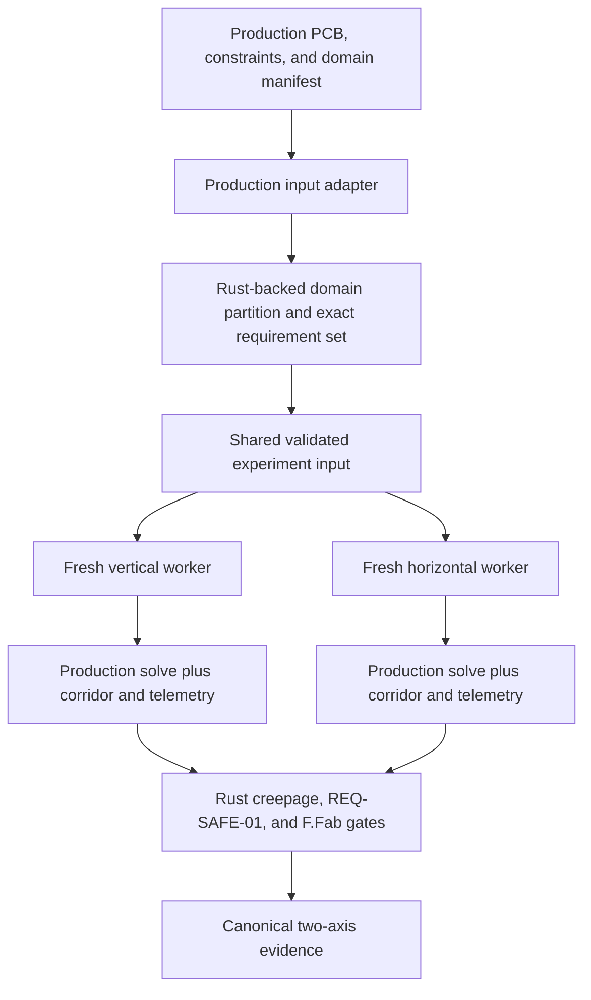
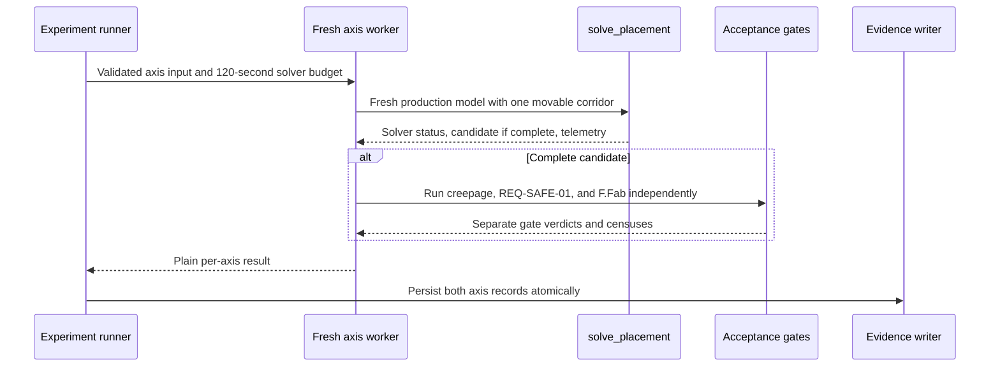
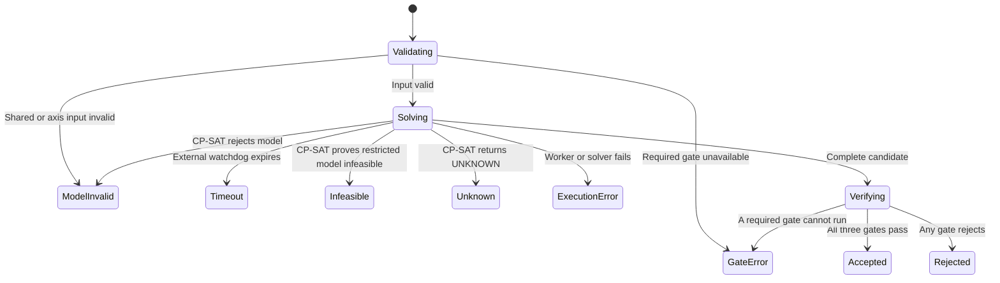

# Designer-declared creepage search corridor experiment - Plan

## Goal Capsule

- **Objective:** Determine whether one designer-declared HV/SELV box-ordering topology can make the production exact-creepage model produce a placement accepted by all three required post-solve geometry gates within its existing solve bound.
- **Means:** Extend the production CP-SAT entrypoint with an opt-in movable search corridor, then compare independent vertical and horizontal fresh-model probes (KTD1, KTD2).
- **Product authority:** This plan owns only the bounded experiment and its evidence. It does not establish a production configuration format or a compliant physical isolation barrier.
- **Open blockers:** None.
- **Stop conditions:** Stop without promoting the experiment if both axes remain unresolved or fail acceptance. Stop and report instead of weakening an exact requirement, reclassifying a timeout, or bypassing an unavailable acceptance gate.
- **Execution profile:** Implement and test the reusable experiment seams, run both 120-second production-board probes, and preserve the measured comparison.
- **Tail ownership:** The implementation run owns focused tests, repository gates, the bounded measurement, evidence capture, and removal of dead experimental code.

---

## Product Contract

### Summary

Run two fresh production-board models with one designer-declared search corridor. HV-only component boxes occupy one side, SELV-only boxes occupy the other, and the separator position remains free. A useful result is a complete placement accepted by all three required post-solve geometry gates within 120 seconds.

### Problem Frame

The ordinary production model solves quickly without generated creepage, and the stripped model solves with all 9,176 exact requirements. Combining them returns `unknown` with no incumbent after 120 seconds. Local cuts and independent direction hints move violations without establishing a stable global topology.

The repository already contains graph-derived grouped cuts and a physical isolation-barrier model. The former does not express designer intent. The latter is a different claim: it constrains isolator pads across a physical keepout, and the current board has already been shown infeasible for that governed barrier. This experiment tests component-box search ordering only.

### Key Decisions

- **Use designer-declared domain clusters.** (session-settled: user-approved — chosen over automatic inference: the first probe must be inspectable and attributable.) Governs R1, R2.
- **Keep the work experimental.** (session-settled: user-approved — chosen over an immediate production feature: the declaration format earns permanence only after a successful probe.) Governs R8, R9.
- **Use hard shared ordering.** (session-settled: user-approved — chosen over soft direction hints: the independent-hint control already returned `unknown`.) Governs R3, R5.
- **Model a search corridor, not a physical barrier.** (session-settled: user-approved — chosen over reusing the pad-straddling isolation barrier: the physical barrier has a separately proven component-level contradiction.) Governs R2, R4, R7.
- **Run two fresh axis probes.** (session-settled: user-directed — chosen over fixed-centerline and solver-selected-axis alternatives: movable separators avoid a bad position, while independent models preserve propagation and interpretability.) Governs R1, R3, R6.

### Requirements

**Experiment definition**

- R1. The experiment must run one vertical and one horizontal corridor probe as independent fresh production models.
- R2. Both probes must use the same explicit designer-declared HV-only and SELV-only component-reference sets. The declarations must completely cover and exactly match the corresponding authoritative board-domain buckets; authoritative classification validates the declaration but does not infer it.
- R3. Each probe must enforce one hard axis ordering with a solver-selected separator coordinate and a 12.6 mm empty box gap between the declared sides.
- R4. Isolators and unclassified components must remain outside the corridor relation and retain their ordinary placement freedom.
- R5. Every existing production constraint and all 9,176 exact component-pair creepage requirements must remain authoritative; the corridor may only restrict search.

**Measurement and acceptance**

- R6. Each axis probe must receive an independent 120-second solve bound and separately retain solver status (`not-run`, `optimal`, `feasible`, `infeasible`, `unknown`, or `model-invalid`), external execution outcome (`not-started`, `returned`, `timeout`, or `error`), and acceptance verdict (`accepted`, `rejected`, `not-run`, or `gate-error`) without collapsing one dimension into another.
- R7. A complete solver candidate must pass the exhaustive Rust creepage verifier, the REQ-SAFE-01 validator-aligned copper-clearance audit, and the F.Fab collision audit over all parsed body geometry before it is accepted. The validator audit must have trusted geometry, no hard failures, and no coverage gaps; placement-independent intra-footprint findings remain separately reported.
- R8. The experiment must report model size, presolve reductions, conflicts, branches, first-incumbent time, final status, elapsed time, and acceptance-gate results when applicable.
- R9. The experiment must preserve enough canonical input identity and result data to distinguish the two probes and reproduce the comparison without creating a production-facing configuration contract.

### Key Flow

- F1. Run the designer corridor comparison.
  - **Trigger:** The authoritative production board, domain inputs, exact requirement set, and solve limits are available.
  - **Steps:** Validate the declared component partition; build the vertical model; run and classify it; build a separate horizontal model; run and classify it; invoke acceptance gates only for complete candidates; persist the comparison.
  - **Outcome:** The evidence identifies whether either declared axis produces an accepted candidate and preserves unresolved outcomes without reinterpretation.
  - **Covered by:** R1–R9.

### Acceptance Examples

- AE1. One axis validates the hypothesis.
  - **Covers:** R1, R3, R5–R8.
  - **Given:** Both probes use identical authoritative inputs and independent 120-second bounds.
  - **When:** The vertical probe returns a complete candidate in 80 seconds and the horizontal probe returns `unknown`.
  - **Then:** The candidate passes all three acceptance gates, the experiment is successful, and the horizontal result remains unresolved.

- AE2. A declared topology is disproven.
  - **Covers:** R1, R4–R6, R8.
  - **Given:** The vertical probe contains the exact corridor and production constraints.
  - **When:** CP-SAT proves that model infeasible.
  - **Then:** The result disproves only the vertical declared topology; it does not imply that the unrestricted production model is infeasible.

- AE3. The probe produces an unacceptable placement.
  - **Covers:** R7, R8.
  - **Given:** A probe returns a complete solver candidate.
  - **When:** Exact creepage verification, REQ-SAFE-01 validation, or the F.Fab audit rejects it.
  - **Then:** The candidate is rejected, and the solver status remains recorded separately from the acceptance verdict.

- AE4. Neither axis decides within its bound.
  - **Covers:** R6, R8, R9.
  - **Given:** Both fresh models run with valid inputs.
  - **When:** Both return `unknown` or time out without a complete candidate.
  - **Then:** The experiment records a negative performance result without claiming infeasibility or promoting the corridor format.

### Success Criteria

- At least one axis produces a complete candidate within 120 seconds.
- That candidate passes exhaustive Rust creepage verification with zero violations.
- That candidate passes the REQ-SAFE-01 validator-aligned audit with trusted geometry, zero hard failures, and zero coverage gaps; placement-independent intra-footprint findings remain reported.
- That candidate passes the F.Fab collision audit over all available parsed body geometry.
- The comparison makes axis choice, solver outcome, and post-solve acceptance independently inspectable.

### Scope Boundaries

**Deferred for later**

- Automatic cluster inference from nets, loops, placement, or graph structure.
- Secondary corridors for switching-node or functional sub-clusters.
- A permanent declaration schema or production CLI surface.
- Collision-cut generation during search.

**Outside this experiment’s claim**

- Pad-level or routed-copper compliance with a board-spanning isolation keepout.
- BOM or footprint changes needed by the physical isolation-barrier work.
- Weakening, approximating, or replacing any exact creepage requirement.

### Dependencies and Assumptions

- The authoritative domain inputs can classify the intended HV-only, SELV-only, isolator, and unclassified component sets without inventing empty placeholders.
- The corridor is a search restriction. Failure of both declared axes does not settle feasibility of the unrestricted exact-creepage production model.
- F.Fab acceptance covers components with parsed body geometry; absent F.Fab geometry remains outside that audit’s census.

---

## Planning Contract

### Product Contract preservation

The Product Contract's direction, stable R/F/AE IDs, and session-settled decisions are preserved. Planning made three codebase-grounded clarifications: R2 makes the designer declaration—not classifier inference—the experiment authority; R6 separates solver, execution, and acceptance dimensions; R7 enumerates the existing REQ-SAFE-01 production gate alongside exhaustive creepage and F.Fab.

### Key Technical Decisions

- KTD1. **Add one experiment-only corridor seam to the production solver.** Extend `solve_placement` with an opt-in corridor input carrying explicit designer-authored HV-only and SELV-only component-reference lists, and post the axis inequalities only after all component rectangles exist. Use `isolation_barrier.load_domain_manifest_nets` and the Rust-backed `classify_domain_partition` path only to validate declaration eligibility, exact coverage, and drift. Keep the unavoidable OR-Tools model posting in Python and do not add a Python domain-classification source of truth. This implements R1–R5.
- KTD2. **Run each axis in its own child process and fresh model.** Assemble both probes from the same production inputs and exact requirement set. Give each solver an internal 120-second budget and an external watchdog with cleanup grace. The grace cannot increase the CP-SAT budget. Continue to the second axis after an axis-local error; only shared input invalidity stops both. This implements R1, R5, R6, and AE1–AE4.
- KTD3. **Capture telemetry at the existing solver chokepoint.** Add opt-in telemetry to `CpSatPlacementResult` instead of building an alternate solver path. Record input model counts, presolved counts or an explicit unavailable reason, conflicts, branches, first-incumbent time, solver wall time, and the raw stable solver statistics needed to audit derived fields. This implements R8.
- KTD4. **Keep solver outcome and acceptance verdict independent.** Preserve the CP-SAT status even when a complete candidate fails exhaustive creepage, REQ-SAFE-01 validation, or F.Fab. Represent each gate result and the aggregate rejection separately so neither can become solver infeasibility or a generic worker error. An outer watchdog expiration is `timeout`; an internally returned CP-SAT `UNKNOWN` remains `unknown`. This implements R6–R8 and AE2–AE4.
- KTD5. **Persist a versioned experiment record, not a production configuration.** Write one canonical JSON artifact atomically after both axes finish. Its identity includes source hashes, exact requirement digest and census, resolved partition, corridor parameters, solver settings, tool/code identity, and per-axis results. The record may preserve complete candidates for audit, but it does not create a cache or user-facing schema. This implements R8 and R9.

### High-Level Technical Design

The experiment extends existing ownership boundaries. Rust remains authoritative for domain partitioning and exhaustive creepage verification. Python owns only input marshalling, OR-Tools model construction, process isolation, audit orchestration, and evidence serialization.

Each probe uses the same sequence and never inherits state from the other.

Per-axis classification is a state machine. It prevents a restricted-model proof or rejected candidate from being generalized beyond the probe.

These lifecycle terminals populate the separate R6 solver-status, external-execution, and acceptance-verdict fields; they never replace those dimensions. A worker or solver failure is an execution error, while an unavailable post-solve gate is a gate error.

### Assumptions

- The declared clusters are explicit, versioned component-reference lists supplied to the experiment. They must be nonempty and exactly equal the `hv_only` and `selv_only` buckets produced from `elec/domain_manifest.yaml` by the existing Rust-backed classifier; unknown refs, missing classified refs, overlap, or leakage from the isolator/unclassified buckets invalidates the shared input.
- HV occupies the low-coordinate side and SELV the high-coordinate side for both axes, matching the existing isolation-barrier ordering convention. The evidence records this polarity because reversing it is a different experiment.
- Both probes receive the same complete Rust-verified stripped placement as an initial hint. No result or partial state from the first axis becomes a hint for the second.
- The corridor gap comes from the authoritative exact requirement set and must resolve to the current 12.6 mm maximum. A mismatch invalidates the experiment instead of introducing another safety literal.
- The production no-loop input adapter defines the common model. The experiment restores exact generated creepage and the available production tank-creepage constraint before adding the corridor. Post-solve audit inputs are consumed by the experiment runner so gate rejection remains observable.
- Solver-log parsing is acceptable only for presolve fields that OR-Tools 9.15 does not expose through a stable response API. The evidence must retain the source statistic or an unavailable reason rather than fabricate a reduction count.

### Sequencing

U1 establishes the hard corridor semantics. U2 adds opt-in telemetry without changing ordinary solves. U3 combines both seams into the bounded two-axis runner and evidence model. U4 runs the production measurement only after the implementation and measurement instruments pass their gates.

### Risks and Mitigations

| Risk | Consequence | Mitigation |
|---|---|---|
| A corridor is described as physical isolation | Reviewers may infer a safety claim the model does not make | Name every record as a search corridor, persist excluded buckets, and keep the Product Contract’s physical-barrier exclusion in the evidence interpretation. |
| One axis consumes the other axis’s budget | The comparison becomes biased or incomplete | Use independent workers and independent internal solve budgets; do not use a shared campaign deadline. |
| A post-solve audit exception erases a feasible solver result | Candidate rejection is misreported as solver failure | Run all three acceptance gates after result extraction and store solver status before gate verdicts. |
| Telemetry changes search behavior | The experiment measures its instrumentation | Make capture opt-in, pin worker/seed settings, and test that telemetry-disabled ordinary solves retain their current path. |
| The outer watchdog races CP-SAT’s internal deadline | `unknown` is mislabeled as `timeout` and final statistics are lost | Give the process only bounded cleanup grace after the 120-second solver limit and persist an explicit watchdog outcome when the worker still fails to return. |
| Existing extensions are stale at measurement time | The recorded result does not correspond to the source tree | Run `make extensions-check` immediately before the production measurement and rebuild through `make extensions` only if the freshness gate requires it. |

---

## Implementation Units

### U1. Add the hard movable search-corridor encoding

- **Goal:** Provide one opt-in solver constraint that orders the complete HV-only and SELV-only rectangle sets around a movable separator while leaving excluded buckets free.
- **Requirements:** R1–R5; F1; AE2.
- **Dependencies:** None.
- **Files:**
  - Create `packages/temper-placer/src/temper_placer/placer/cp_sat/creepage_search_corridor.py`.
  - Modify `packages/temper-placer/src/temper_placer/placer/cp_sat/_encoder_solve.py`.
  - Modify `packages/temper-placer/src/temper_placer/placer/cp_sat/__init__.py` only if the experiment API needs package export.
  - Create `packages/temper-placer/tests/placer/cp_sat/test_creepage_search_corridor.py`.
  - Modify `packages/temper-placer/tests/placer/cp_sat/test_encoder.py` for the solver integration boundary.
- **Approach:**
  1. Accept explicit experiment-local HV-only and SELV-only component-reference lists. Reuse the manifest loader and Rust-backed partition classifier only to validate eligibility, exact four-bucket coverage, declaration drift, and anti-vacuity before posting constraints.
  2. Create one bounded separator variable on the chosen axis. Constrain each HV-only rectangle end at or below the separator and each SELV-only rectangle start at or above the separator plus the authoritative gap.
  3. Do not create pairwise direction literals, assumptions, isolator pad constraints, rectangular cluster envelopes, or constraints for isolator/unclassified refs.
  4. Return a plain report that records orientation, polarity, gap, sorted bucket members, and the solved separator coordinate when a candidate exists.
- **Patterns to follow:** `isolation_barrier.add_isolation_barrier_to_model` for post-registration model access and side ordering; `CpSatModel.mm_to_units` for the sole millimetre conversion; `stripped_creepage_solver.py` for keeping OR-Tools posting in Python while Rust owns validation and truth.
- **Test scenarios:**
  1. Covers AE2. A synthetic vertical model places all HV-only rectangles on the low side and all SELV-only rectangles on the high side with at least the declared box gap.
  2. A horizontal model applies the same relation to Y coordinates and reports the solved separator.
  3. Two feasible fixtures with different component packing force different separator coordinates, proving the separator is movable rather than fixed at board center.
  4. Isolator and unclassified fixtures remain unconstrained by the corridor and may occupy either side or the gap while ordinary production constraints still apply.
  5. Empty HV-only or SELV-only buckets, unknown refs, duplicate membership, cross-bucket overlap, omitted classified refs, and a gap wider than the board fail before solve.
  6. Misleading net names do not affect classification; exact manifest membership through the Rust-backed classifier determines the buckets.
  7. With the corridor option absent, the production solver builds the same model path and returns no corridor report.
- **Verification:** Focused unit and solver-integration tests prove both axes, separator mobility, exact membership validation, excluded-bucket freedom, and opt-in behavior.

### U2. Add opt-in CP-SAT search telemetry

- **Goal:** Make every corridor probe report the model and search measurements required by R8 without creating a second solve path.
- **Requirements:** R6, R8.
- **Dependencies:** U1.
- **Files:**
  - Create `packages/temper-placer/src/temper_placer/placer/cp_sat/solver_telemetry.py`.
  - Modify `packages/temper-placer/src/temper_placer/placer/cp_sat/_encoder_solve.py`.
  - Create `packages/temper-placer/tests/placer/cp_sat/test_solver_telemetry.py`.
  - Modify `packages/temper-placer/tests/placer/cp_sat/test_encoder.py` for result integration.
- **Approach:**
  1. Add an opt-in telemetry collector around the existing `CpSolver` invocation. Keep the default logging and callback behavior unchanged when capture is off.
  2. Count the input model from the CP-SAT model proto. Capture presolved counts from supported response fields or bounded log parsing, with the source and availability recorded.
  3. Record conflicts and branches from solver statistics. Use a solution callback to record time to the first complete incumbent, leaving it absent with a reason when none exists.
  4. Attach a plain immutable telemetry record to `CpSatPlacementResult` for all solver-returned statuses. Preserve raw model/response statistic text or normalized source lines needed to audit parsed values.
- **Patterns to follow:** `CpSatPlacementResult` for additive diagnostics; OR-Tools 9.15 APIs pinned in `uv.lock`; existing result fields that distinguish absent post-solve audits from clean audits.
- **Test scenarios:**
  1. A feasible synthetic solve reports nonnegative model counts, branches/conflicts, solver wall time, and a first-incumbent time no greater than final wall time.
  2. An infeasible or unknown solve has no first-incumbent time and records the reason without inventing zero.
  3. Presolve extraction reports both input and presolved counts when the pinned solver emits the supported source data.
  4. A fixture with deliberately unavailable or changed presolve text produces an unavailable reason rather than a false reduction.
  5. Telemetry capture disabled leaves ordinary result behavior and solver logging unchanged.
  6. Repeated parsing of the same captured statistics is deterministic.
- **Verification:** Focused telemetry tests prove field semantics and nullability; existing encoder tests prove the additive result field does not change normal solve behavior.

### U3. Build the two-axis production experiment and evidence contract

- **Goal:** Run the two fresh models, apply all three authoritative acceptance gates, and preserve truthful per-axis outcomes in one canonical record.
- **Requirements:** R1–R9; F1; AE1–AE4.
- **Dependencies:** U1, U2.
- **Files:**
  - Create `packages/temper-placer/src/temper_placer/placer/cp_sat/creepage_search_corridor_experiment.py`.
  - Modify `packages/temper-placer/src/temper_placer/placer/cp_sat/__init__.py` only for intentionally exported experiment entrypoints.
  - Create `packages/temper-placer/tests/placer/cp_sat/test_creepage_search_corridor_experiment.py`.
- **Approach:**
  1. Prepare the authoritative production model, stripped instance, explicit designer declaration, validating domain partition, REQ-SAFE-01 validator input, F.Fab bodies, and allowlist once. Validate all shared inputs before starting either axis.
  2. Give vertical and horizontal independent child processes, internal solver limits, and watchdogs. Pass identical source inputs and the same Rust-verified stripped hint; never pass a result between axes.
  3. Extract and validate a complete candidate before acceptance. Run the existing production Rust creepage verifier, `audit_domain_clearance_validator`, and `audit_body_collisions` independently without short-circuiting after an earlier gate rejects. Treat untrusted validator geometry, hard failures, or coverage gaps as rejection; preserve placement-independent intra-footprint findings as diagnostics.
  4. Store solver status, external execution outcome, acceptance verdict, gate censuses, telemetry, elapsed times, diagnostics, and complete candidate data as separate fields.
  5. Derive overall success only when at least one axis passes all three gates. Persist both records atomically even when one axis times out, errors, or rejects its candidate.
  6. Expose the runner as an experiment-only module entrypoint. Do not add a permanent optimize flag, configuration schema, or alternate production placement path.
- **Patterns to follow:** `production_constraint_family_inputs.py` for authoritative input assembly and the Rust verifier adapter; `validator_audit.py` for REQ-SAFE-01 classification and trust semantics; `constraint_family_campaign.py` for child-process containment and status mapping; `constraint_family_frontier.py` for canonical JSON validation and atomic replacement; `body_collision.py` for the F.Fab truth function.
- **Test scenarios:**
  1. Covers AE1. Vertical returns a complete accepted candidate before 120 seconds while horizontal returns unknown; the overall record succeeds and preserves the horizontal uncertainty.
  2. Covers AE2. One worker returns infeasible; the evidence names only that axis’s declared topology and still runs the other axis.
  3. Covers AE3. A solver-feasible candidate fails Rust creepage, REQ-SAFE-01 validation, F.Fab, or any combination; solver status remains feasible and the exact gate verdicts are recorded as rejection.
  4. Covers AE4. Both workers return unknown or hit their watchdogs; the record is a negative performance result and not an infeasibility claim.
  5. A worker exits without a payload, raises, returns model-invalid, or returns incomplete refs; the affected axis is error/model-invalid and the other axis still runs.
  6. An unavailable Rust verifier, unavailable or malformed REQ-SAFE-01 validator input, zero parsed F.Fab bodies, or missing F.Fab allowlist produces `solver_status=not-run`, `execution_outcome=not-started`, and `acceptance_verdict=gate-error` for both axes before either solver starts. A stale partition or requirement-census mismatch instead records shared input invalidity with acceptance `not-run`; individual components without parsed F.Fab remain outside the audit census per the Product Contract.
  7. The second worker receives no positions, telemetry, or hints from the first worker.
  8. Identity changes when the PCB, constraints, domain manifest, exact requirement set, polarity, gap, seed, worker count, or solve limit changes.
  9. Canonical serialization is byte-stable for equivalent input and writes atomically without leaving a partial destination.
- **Verification:** Unit tests cover every terminal state and gate combination. A focused integration test runs both synthetic fresh models through the real solver seam and round-trips the canonical evidence record.

### U4. Run and document the bounded production-board comparison

- **Goal:** Produce the decision evidence for the real Temper board and update the investigation record with only supported conclusions.
- **Requirements:** R6–R9; AE1–AE4; Success Criteria.
- **Dependencies:** U1, U2, U3.
- **Files:**
  - Create `docs/evidence/2026-08-28-creepage-search-corridor-experiment.json` from the experiment entrypoint.
  - Modify `docs/solutions/performance-issues/cp-sat-creepage-topology-restoration-search-2026-08-28.md` with the measured comparison and interpretation.
- **Approach:**
  1. Verify all installed pyo3 extensions immediately before the measurement, then run the vertical and horizontal probes against `pcb/temper.kicad_pcb`, `packages/temper-placer/configs/temper_constraints.yaml`, and `elec/domain_manifest.yaml`.
  2. Inspect the evidence identity, exact requirement census, resolved partition, per-axis budgets, telemetry, candidates, and all three gate verdicts before reporting the result.
  3. Report only the strongest supported conclusion. Accepted means all three gates passed. Infeasible applies only to one declared axis topology. Unknown and timeout remain unresolved. Candidate rejection is not solver infeasibility.
  4. Remove experimental branches or instrumentation that did not contribute to the final probe. Keep the bounded runner and evidence only if they reproduce the reported comparison.
- **Execution note:** Treat this as a measurement-instrument task. Re-run `make extensions-check` immediately before the result that will be committed. If freshness fails, rebuild through the repository’s extension workflow and verify again before measuring.
- **Patterns to follow:** The measurement discipline in `docs/solutions/performance-issues/cp-sat-creepage-topology-restoration-search-2026-08-28.md` and the stale-extension safeguards in `AGENTS.md`.
- **Test expectation:** None — this unit executes the already-tested experiment and records its production-board evidence.
- **Verification:** The committed JSON hashes the current authoritative inputs, contains both independent axis records, and agrees with the prose interpretation. No board file changes, so DRC ceiling re-measurement is not triggered.

---

## Verification Contract

| Verification layer | Applies to | Command or evidence | Pass condition |
|---|---|---|---|
| Focused unit tests | U1–U3 | `uv run pytest packages/temper-placer/tests/placer/cp_sat/test_creepage_search_corridor.py packages/temper-placer/tests/placer/cp_sat/test_solver_telemetry.py packages/temper-placer/tests/placer/cp_sat/test_creepage_search_corridor_experiment.py` | All corridor, telemetry, process, status, gate, and serialization scenarios pass. |
| Encoder regression tests | U1, U2 | `uv run pytest packages/temper-placer/tests/placer/cp_sat/test_encoder.py packages/temper-placer/tests/placer/cp_sat/test_validator_audit.py packages/temper-placer/tests/placer/cp_sat/test_body_collision.py packages/temper-placer/tests/placer/cp_sat/test_constraint_family_campaign.py` | Existing solver and audit behavior remains green with the experiment options absent. |
| CP-SAT package tests | U1–U3 | `uv run pytest packages/temper-placer/tests/placer/cp_sat` | No placement-model regressions in the affected package. |
| Python quality | U1–U3 | `uv run ruff check packages/temper-placer/src/temper_placer/placer/cp_sat packages/temper-placer/tests/placer/cp_sat` | No lint failures in changed Python surfaces. |
| Import boundaries | U1–U3 | `uv run python scripts/import_linter_gate.py` | No new dependency-boundary violation. |
| Generated artifacts | U1–U4 | `make regen-check` | No committed generated artifact drifts. |
| Extension freshness | U4 | `make extensions-check` immediately before measurement | Every pyo3 extension is fresh and loadable for the source tree being measured. |
| Production experiment | U4 | Run the experiment-only module for `pcb/temper.kicad_pcb` with the production constraints and canonical evidence destination | Both axes receive independent 120-second solver budgets; the JSON is complete, canonical, and truthfully classified. |
| Diff hygiene | U1–U4 | `git diff --check` and review the scoped diff | No whitespace errors, dead attempts, unrelated edits, production CLI/config additions, or board changes. |

The production experiment is the acceptance measurement. A speed or branching improvement without an accepted candidate is diagnostic only. If at least one candidate is accepted, its stored placement must reproduce zero exhaustive Rust creepage violations, a trusted and clean REQ-SAFE-01 validator-aligned audit, and zero disallowed/worsened F.Fab collisions under the same recorded inputs.

---

## Definition of Done

- U1 is done when both axis encodings use one movable separator, constrain every resolved HV-only/SELV-only box, leave excluded buckets free, and remain absent from ordinary solves.
- U2 is done when solver-returned outcomes carry auditable model, presolve, branch, conflict, timing, and first-incumbent telemetry without changing telemetry-disabled behavior.
- U3 is done when the experiment preserves independent budgets, solver outcomes, acceptance verdicts, all three gate results, and canonical identity across every tested terminal path.
- U4 is done when the real-board comparison is measured with fresh extensions, committed as canonical evidence, and interpreted without overstating infeasibility or safety compliance.
- Every applicable command in the Verification Contract passes.
- The Product Contract's stable R/F/AE IDs and session-settled meaning remain preserved.
- No exact creepage requirement, production constraint, or acceptance gate is weakened or silently skipped.
- No production-facing configuration or optimize CLI surface is introduced.
- No abandoned hint, cut, corridor, telemetry, or serialization experiment remains in the diff.
