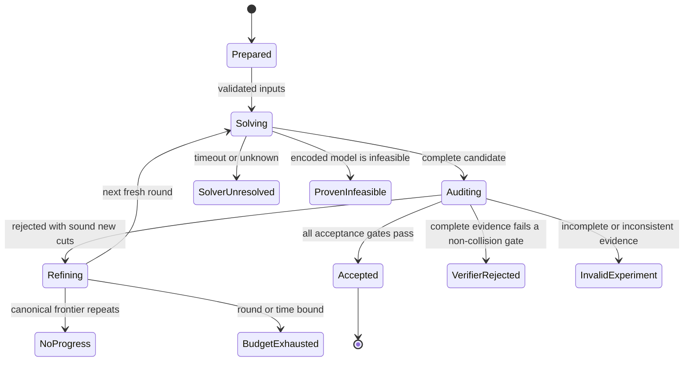
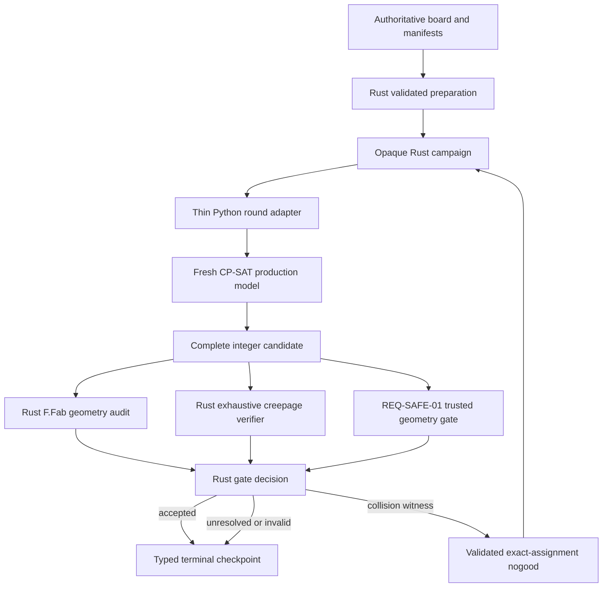
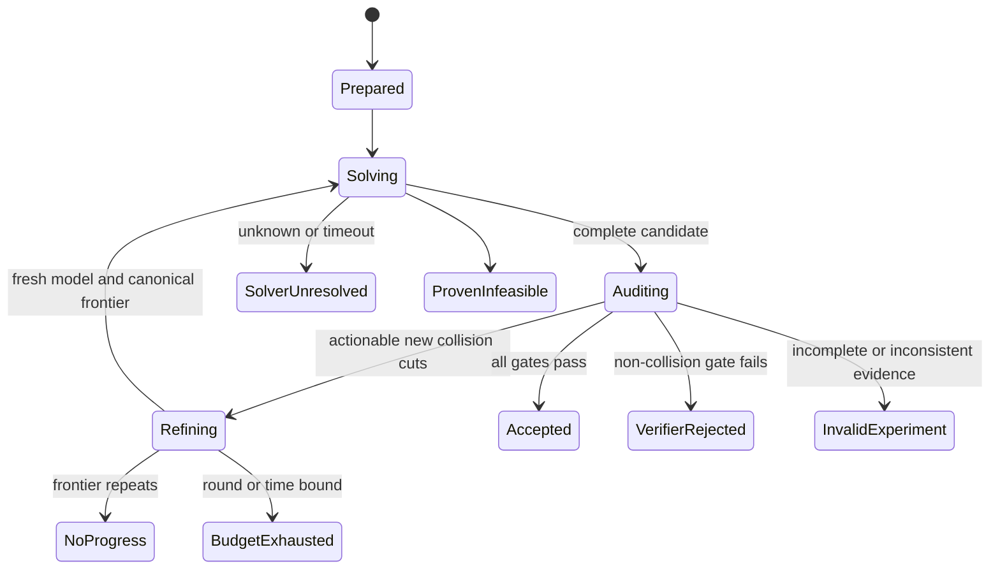

# Collision-Aware Creepage Corridor

## Goal Capsule

- **Objective:** Produce a complete production-board placement that passes exhaustive creepage and physical body-collision acceptance while retaining the corridor experiment's demonstrated search tractability.
- **Means:** Add a bounded lazy collision-cut campaign around the designer-declared creepage corridor, founded on Rust-owned validated domain types and legal state transitions.
- **Product authority:** Rust owns physical collision meaning, cut identity, campaign state, and acceptance. Python may adapt those decisions into CP-SAT and manage child processes but may not redefine them.
- **Open blockers:** None before planning.

---

## Product Contract

### Summary

Extend the successful HV/SELV corridor experiment with exact, collision-aware refinement. Each complete solver candidate is audited, rejected candidates produce sound replayable cuts, and only a candidate passing both exhaustive creepage and F.Fab collision gates can be accepted.

### Problem Frame

The merged corridor experiment supplied the missing global propagation: both axes produced optimal candidates in about 60 seconds where unrestricted exact creepage produced no incumbent. Neither candidate was physically acceptable. Each retained one exact creepage violation and 14 disallowed F.Fab body collisions.

The current body-collision implementation is a Python post-solve audit. Adding iterative cuts around that representation would create a second Python source of truth for collision policy and would permit malformed combinations of pair identity, overlap severity, campaign phase, and verdict. This work must first establish a Rust authority whose constructors and transitions admit only valid states.

### Key Decisions

- **Rust owns the collision-cut domain and campaign lifecycle.** (session-settled: user-directed — chosen over Python-owned orchestration objects: strong Rust types should prevent bugs by making invalid states unrepresentable.) Governs R1-R6, R11.
- **Preserve exact F.Fab semantics.** Conservative courtyard or rectangular-envelope overlap is not substituted for physical body overlap because it would reject benign, valid placements. Governs R7-R8.
- **Use bounded lazy refinement, not an always-on production feature.** The first outcome is evidence about whether collision cuts converge with the proven corridor topology. Governs R9-R13.
- **Acceptance remains conjunctive.** Solver feasibility, exhaustive creepage, and body-collision acceptance stay distinct; no one signal can promote a candidate alone. Governs R5, R10-R12.

The lifecycle is closed and monotone:

### Requirements

**Typed authority and boundaries**

- R1. Rust must own validated component references, canonical unordered component pairs, quadrant rotations, finite non-negative overlap areas, positive clearances, cut identities, round identities, and campaign budgets.
- R2. Construction must reject self-pairs, duplicate canonical pairs, unknown references, non-finite measurements, negative areas, invalid rotations, zero budgets, and mismatched board or input identity before CP-SAT mutation.
- R3. Campaign states must be a closed Rust state model whose API exposes only legal transitions and cannot represent a candidate as both rejected and accepted, audited and unaudited, or terminal and resumable.
- R4. Every cut must carry the collision witness and exact input identity from which it was derived; replay must reject stale, foreign, duplicate, or weaker conflicting records.
- R5. Rust must return closed verdict variants that distinguish accepted, refine-with-cuts, solver-unresolved, proven-infeasible, verifier-rejected, invalid-experiment, no-progress, and budget-exhausted outcomes.
- R6. The pyo3 surface must be thin and typed: Python can submit validated primitive input, receive opaque or serialized Rust decisions, and post approved constraints, but cannot construct an accepted verdict or reinterpret a rejection kind.

**Physical correctness and cut soundness**

- R7. Collision witnesses must use real F.Fab body geometry with the canonical KiCad `R(-theta)` transform and the existing `1e-6 mm²` boundary-touch tolerance; courtyard-only overlap remains non-violating.
- R8. A generated cut must remove its witnessed collision without excluding a placement merely because conservative bounding boxes overlap; unsupported geometry must fail closed rather than fall back to an invented body or envelope.
- R9. Each refinement round must use a fresh CP-SAT model containing the unchanged production constraints, the selected corridor relation, all exact creepage requirements, and the canonical accumulated collision cuts.

**Acceptance, progress, and evidence**

- R10. Every complete candidate must pass the exhaustive Rust creepage verifier and the Rust-owned F.Fab audit before acceptance; a failed gate yields a typed rejection, never solver infeasibility.
- R11. The campaign must stop deterministically on acceptance, solver terminal status, invalid evidence, repeated cut frontier, maximum rounds, or total time budget.
- R12. A successful experiment requires a complete candidate with zero exhaustive creepage violations, zero new or worsened F.Fab collisions, trusted REQ-SAFE-01 geometry coverage, and no acceptance-gate error.
- R13. Evidence must persist exact board/input hashes, axis and corridor declaration, per-round candidate identity, solver telemetry, collision witnesses, cut frontier, gate results, and terminal reason so an interrupted run can resume without reinterpreting prior outcomes.
- R14. The comparison must report both corridor axes and the unrestricted exact-creepage control using first-incumbent time, conflicts, branches, rounds, unique cuts, repeated-frontier detection, and final acceptance.

### Key Flows

- F1. Prepare a campaign
  - **Trigger:** An operator requests an axis probe for the production board.
  - **Steps:** Validate board identity, authoritative domain buckets, corridor parameters, F.Fab coverage, limits, and prior frontier; construct the Rust `Prepared` state only after all checks pass.
  - **Outcome:** A fresh solvable round or a typed invalid-experiment result without model mutation.
  - **Covered by:** R1-R4, R9, R13

- F2. Refine a rejected candidate
  - **Trigger:** CP-SAT returns a complete candidate.
  - **Steps:** Run exhaustive creepage and F.Fab audits; derive canonical sound cuts from actionable collision witnesses; reject repeated or stale cuts; transition through `Auditing` and `Refining` into a fresh round.
  - **Outcome:** The next round contains only validated accumulated cuts, or the campaign terminates with a precise reason.
  - **Covered by:** R4-R11

- F3. Accept or terminate
  - **Trigger:** All gates finish or a bound is reached.
  - **Steps:** Rust combines typed gate outcomes into one terminal verdict and emits complete evidence.
  - **Outcome:** Exactly one `Accepted` or non-accepted terminal state, never a partial success presented as a clean board.
  - **Covered by:** R5, R10-R14

### Acceptance Examples

- AE1. Covers R1-R3, R6: Given a self-pair, NaN overlap, rotation `4`, or zero-round budget, when campaign input is constructed, then Rust rejects it before Python can post any CP-SAT constraint.
- AE2. Covers R4, R13: Given a cut frontier captured for a different board hash or corridor axis, when replay is requested, then preparation fails with an identity mismatch and no cut is applied.
- AE3. Covers R7-R8: Given two bodies whose courtyards overlap but whose F.Fab polygons do not, when audited, then no collision witness or cut is produced.
- AE4. Covers R8-R10: Given a true non-rectangular F.Fab collision, when a cut is derived, then the witnessed placement is excluded while a polygon-clear placement with overlapping bounding boxes remains admissible.
- AE5. Covers R10-R12: Given a solver-optimal candidate with one 0.005 mm creepage shortfall, when gates run, then the campaign cannot enter `Accepted` even if the F.Fab audit is clean.
- AE6. Covers R10-R12: Given a creepage-clean candidate with one new F.Fab collision, when gates run, then it transitions only to refinement or a non-accepted terminal state.
- AE7. Covers R11: Given two rounds that produce the same canonical cut frontier, when the second audit completes, then the campaign terminates as no-progress instead of looping.
- AE8. Covers R12-R14: Given a candidate passing every acceptance gate, when the terminal verdict is serialized and replayed, then it remains `Accepted` only under the exact recorded input identity.

### Success Criteria

- The Rust API admits no unchecked public construction path for collision pairs, measurements, cuts, campaign phases, or accepted verdicts.
- Mutation and property tests demonstrate rejection of malformed inputs and illegal state transitions.
- At least one bounded production axis campaign reaches an accepted candidate, or the experiment produces a reproducible typed terminal result that establishes bounded non-convergence or insufficient evidence under the declared regime.
- Evidence distinguishes search failure, physical rejection, verifier rejection, invalid instrumentation, repeated frontier, and budget exhaustion without collapsing them into `infeasible`.

### Scope Boundaries

- Do not change `pcb/temper.kicad_pcb`; this experiment evaluates placement candidates and therefore does not trigger a DRC-ceiling remeasurement.
- Do not replace exact F.Fab geometry with courtyard, AABB, or fabricated fallback geometry.
- Do not make the experimental corridor a user-facing production configuration surface.
- Do not regenerate or enable the absent validator netlist in this work; validator-audit enablement remains separate.
- Do not repair the six allowlisted body collisions on the current board or repin their baselines.
- Do not restore a Python collision or campaign source of truth after the Rust authority exists; compatibility modules must delegate and are candidates for deletion once differential oracles are pinned.

### Dependencies and Assumptions

- The merged corridor experiment and its exact input/evidence identity remain the baseline comparison.
- Production components remain restricted to quadrant rotations for this campaign; support for arbitrary-angle F.Fab cut generation is outside scope and must fail closed if encountered.
- Existing exhaustive Rust creepage verification remains authoritative for creepage acceptance.
- Python continues to own OR-Tools object mutation because CP-SAT is currently exposed there, but every mutation is driven by a validated Rust cut decision.

### Sources / Research

- `docs/solutions/performance-issues/cp-sat-creepage-topology-restoration-search-2026-08-28.md` — measured search wall, corridor results, and acceptance failures.
- `docs/plans/2026-08-28-1712-creepage-search-corridor-plan.md` — authoritative corridor experiment contract and deferred collision-cut scope.
- `packages/temper-placer/src/temper_placer/placer/cp_sat/body_collision.py` — current F.Fab audit semantics and allowlist policy to migrate behind Rust authority.
- `packages/temper-placer/src/temper_placer/placer/cp_sat/creepage_cut_replay.py` — existing deterministic replay and identity discipline.
- `packages/temper-quality-oracle/src/regional_feasibility.rs` — adjacent Rust-owned acceptance contract.
- `packages/temper-quality-oracle/src/types.rs` — constructor-validated scalar and closed-verdict patterns.

---

## Planning Contract

**Product Contract preservation:** Product Contract unchanged.

### Key Technical Decisions

- KTD1. **Use a consuming Rust campaign state machine behind an opaque one-shot pyo3 handle.** (session-settled: user-directed — chosen over Python-owned mutable campaign records: strong Rust types should make illegal lifecycle combinations unrepresentable.) Each transition consumes an internal generation, invalidates the prior Python alias, and returns one new phase or terminal verdict. Governs R1-R6, R11.
- KTD2. **Port exact F.Fab polygon classification to `temper-geometry` before deleting Python ownership.** Rust uses the existing canonical transform and `geo` polygon Boolean support. The current Shapely implementation becomes a pinned differential oracle until production inputs, asymmetric rotations, concave polygons, edge touches, allowlist outcomes, and invalid geometry agree. Governs R7-R8, R10.
- KTD3. **Begin with exact model-unit assignment nogoods.** A collision cut forbids only the witnessed tuple of both components' scaled CP-SAT integer x/y positions and existing `RotationQuadrant` values. A validated model-coordinate type carries the scale; millimetres are derived only for geometry auditing. The cut does not impose AABB separation or claim a preferred escape direction. Governs R4, R8-R9.
- KTD4. **Rebuild the production model on every refinement round.** Each round receives the full canonical cut frontier and may use only an accepted complete placement as a hint. This avoids hidden incremental solver state and old-cut accumulation. Governs R9, R11, R13.
- KTD5. **Checkpoint only validated Rust states.** A privately constructed Rust `CampaignCheckpoint` binds the board, rules, solver build, corridor axis, campaign limits, candidate, gate results, and cut frontier. Rust owns versioned serialization and restoration; Python performs atomic byte I/O only. Terminal checkpoints are immutable and do not resume. Governs R4-R5, R11, R13-R14.
- KTD6. **Require complete body and pose coverage for this experiment.** Missing F.Fab geometry, position, or rotation produces `InvalidExperiment`; rotation zero is never synthesized. This is stricter than the current reporting-only audit because acceptance cannot prove an excluded body clear. Governs R2, R7, R10-R12.

### High-Level Technical Design

The pure kernels and policy live below Python. Python owns OR-Tools object mutation and child-process control only.

The opaque campaign enforces the legal lifecycle. Each transition consumes the prior phase and returns one next phase or one terminal verdict.

The first cut grammar is deliberately narrow. It records a canonical pair, both exact integer poses, the overlap witness, the candidate digest, and input identity. The Python adapter projects the pose tuple onto registered CP-SAT variables and posts one forbidden assignment. Any missing variable or identity mismatch returns an error to Rust; no cut is silently ignored.

### Implementation Constraints

- `temper-geometry` owns transforms, validated polygons, overlap area, and the `Clear` versus `Overlap` relation.
- `temper-orchestration` owns component references, canonical pairs, witnesses, cuts, frontiers, phase states, gate outcomes, budgets, checkpoints, and terminal verdicts.
- The pyo3 modules register each new symbol exactly once. Registration tests must detect shadowing or missing exports.
- A pyo3 campaign handle is one-shot. Reusing any retained pre-transition alias returns a consumed-generation error before state or model mutation.
- The existing Python body-collision implementation stays frozen as an oracle during the differential period. Once Rust is proven, the public Python module delegates to Rust and the old computation is deleted; the pinned oracle remains under tests.
- AABB checks may reject obvious non-overlap before polygon Boolean work. They cannot produce a collision witness or a cut.
- The experiment uses four refinement rounds and independent 120-second budgets per axis. These are evidence identities, not production defaults.
- The comparison includes the historical 120-second unrestricted control and a new unrestricted control with the same 480-second cumulative allowance as one four-round axis campaign. Telemetry reports per-round and cumulative first-incumbent time, conflicts, branches, and wall time.
- The canonical cut key is input identity plus canonical unordered pair plus both exact model-unit poses. Candidate digest and overlap witness are provenance. A second record with the same key and a materially different witness is inconsistent evidence and terminates as `InvalidExperiment`; otherwise it is the same cut and cannot grow the frontier.
- The REQ-SAFE-01 gate is explicit: trusted geometry, zero hard failures, and zero coverage gaps are required for acceptance.

### Sequencing

U1 establishes exact geometry and measured-relation types. U2 builds the campaign types on that foundation. U3 exposes the Rust authority through pyo3. U4 adds the only permitted CP-SAT cut projection. U5 integrates fresh-round execution and persistence. U6 runs the bounded production comparison and records the learning.

### Risks and Mitigations

- **Polygon parity risk:** Rust and GEOS can agree on the same mistake or disagree on degenerate polygons. Fail closed on unsupported input, require independently authored area/relation gold fixtures in addition to the differential oracle, and do not delete Python computation until both evidence sets agree.
- **Weak-cut risk:** Exact-assignment nogoods may require too many rounds. Keep the campaign bounded and treat non-convergence as a valid experiment result. Do not strengthen the cut to an unsound AABB separation during this work.
- **pyo3 drift risk:** A stale extension or duplicate registration can test old behavior. Run extension freshness immediately before every reported measurement and cover the imported symbol beneath the shim.
- **Evidence identity risk:** A resumed frontier can belong to a different board, solver, or rule set. Rust constructors validate every identity field before exposing a resumable state.
- **Meaning risk:** `INFEASIBLE` applies to the encoded corridor-plus-cut model only. Evidence and solution text must not generalize it to physical board impossibility.

---

## Implementation Units

### U1. Rust F.Fab geometry authority

- **Goal:** Create validated Rust body geometry and exact overlap classification with differential proof against the existing oracle.
- **Requirements:** R1-R2, R7-R8, R10; AE1, AE3-AE4
- **Dependencies:** None
- **Files:**
  - `packages/temper-geometry/src/body_collision.rs`
  - `packages/temper-geometry/src/lib.rs`
  - `packages/temper-geometry/src/bridge.rs`
  - `packages/temper-geometry/src/wasm_test_registry.rs`
  - `packages/temper-geometry/Cargo.toml`
  - `packages/temper-placer/src/temper_placer/io/fab_body_extraction.py`
  - `packages/temper-placer/tests/placer/cp_sat/_body_collision_py_oracle.py`
  - `packages/temper-placer/tests/placer/cp_sat/test_body_collision_rust_differential.py`
- **Approach:** Add private-field newtypes for component references, finite coordinates, non-negative areas, and validated polygons. Reuse `temper_geometry::rotation_quadrant::RotationQuadrant` and the canonical KiCad transform. Return a closed polygon relation. Extend extraction to report explicit present, missing, and invalid coverage for every expected reference. Compare Rust results against a frozen copy of the current Shapely implementation and independent relation/area golds before changing the public Python owner.
- **Execution note:** Establish adversarial oracle coverage before changing the imported production path.
- **Patterns to follow:** `packages/temper-quality-oracle/src/types.rs`; `packages/temper-geometry/src/world_position.rs`; `docs/solutions/architecture-patterns/typed-rust-quality-oracle-pipeline-2026-07-01.md`.
- **Test scenarios:**
  - Covers AE1. Reject empty references, non-finite points, polygons with fewer than three usable vertices, invalid quadrant rotations, and negative overlap inputs.
  - Covers AE3. Classify a courtyard-only/AABB-overlap pair with disjoint F.Fab polygons as clear.
  - Covers AE4. Match Shapely overlap area and relation for convex, concave, asymmetric, boundary-touching, and repaired-or-rejected invalid fixtures.
  - Match independently authored expected areas and relations for concave, invalid, boundary-touch, and tolerance-edge fixtures without consulting Shapely output.
  - Reuse `RotationQuadrant` directly and reject any unvalidated numeric rotation at the pyo3 edge.
  - Verify an asymmetric 45-degree oracle fixture cannot pass under `R(+theta)` even though production campaign rotations remain quadrants.
  - Match every current production-board checked pair and allowlist measurement within the pinned tolerance.
- **Verification:** Pure Rust tests, WASM registry execution, imported-extension differential tests, and the live rotation oracle agree.

### U2. Valid-state collision campaign core

- **Goal:** Represent collision evidence, cut eligibility, campaign phases, budgets, gate outcomes, and terminal verdicts as a closed Rust domain.
- **Requirements:** R1-R5, R10-R11; F1-F3; AE1-AE2, AE5-AE8
- **Dependencies:** U1
- **Files:**
  - `packages/temper-orchestration/src/collision_campaign.rs`
  - `packages/temper-orchestration/src/lib.rs`
  - `packages/temper-orchestration/src/wasm_test_registry.rs`
  - `packages/temper-orchestration/Cargo.toml`
- **Approach:** Use private constructors, canonical ordering, non-zero budgets, and consuming transitions. Permit `CollisionCut` construction only from an actionable overlap witness plus complete integer poses and matching input identity. Model solver-unresolved, infeasible, verifier-rejected, invalid, no-progress, budget-exhausted, and accepted as distinct terminal variants.
- **Execution note:** Implement new domain behavior test-first with property tests for constructor and transition closure.
- **Patterns to follow:** `packages/temper-orchestration/src/partition_planner.rs`; `packages/temper-orchestration/src/net_route_result.rs`; `packages/temper-quality-oracle/src/regional_feasibility.rs`.
- **Test scenarios:**
  - Covers AE1. Reject self-pairs, duplicate canonical pairs, empty refs, non-finite witness values, zero budgets, invalid pose coverage, and stale identities.
  - Prove pair and cut IDs are stable under input pair reversal and insertion-order changes.
  - Covers AE5-AE6. Prevent `Accepted` construction when any required gate is rejected, unresolved, untrusted, or incomplete.
  - Covers AE7. Return `NoProgress` when a round adds no canonical cut and prevent another solve transition.
  - Distinguish every solver and audit terminal reason in serialization and round-trip tests.
  - Property-test that no public transition leaves a terminal state resumable.
  - Retain each old pyo3 handle alias and prove every post-transition call fails as consumed before mutation.
- **Verification:** Rust unit/property tests exercise every constructor error and every legal state edge; no public API can build an unchecked terminal verdict.

### U3. Thin pyo3 boundary and Python delegation

- **Goal:** Expose the typed Rust geometry and campaign authority without recreating policy in Python.
- **Requirements:** R2-R7, R10-R11; AE1-AE3, AE8
- **Dependencies:** U1-U2
- **Files:**
  - `packages/temper-geometry/src/bridge.rs`
  - `packages/temper-orchestration/src/lib.rs`
  - `packages/temper-placer/src/temper_placer/core/fab_body.py`
  - `packages/temper-placer/src/temper_placer/placer/cp_sat/body_collision.py`
  - `packages/temper-placer/tests/placer/cp_sat/test_body_collision.py`
  - `packages/temper-placer/tests/placer/cp_sat/test_body_collision_rust_differential.py`
  - `scripts/check_stale_extensions.py`
- **Approach:** Export opaque pyclasses or immutable result views with no Python constructor for cuts, phases, or accepted verdicts. Convert input failures to typed Python exceptions at the boundary and catch Rust panics. After differential parity is established, make the production modules pure delegation shims and delete their old computation while retaining the pinned oracle.
- **Patterns to follow:** Existing `temper_orchestration` pyclasses and `packages/temper-orchestration/src/stage_ledger.rs`; the repo rule for Rust-first migration and differential-oracle retention.
- **Test scenarios:**
  - Import the actual extension and prove each new symbol is registered once and resolves to the intended Rust owner.
  - Attempt Python-side construction or mutation of cuts, phases, and accepted verdicts and verify it is unavailable.
  - Covers AE1. Confirm malformed primitive input raises before any adapter mutation callback runs.
  - Covers AE2 and AE8. Reject stale checkpoint/cut identity across the real pyo3 boundary.
  - Mutation-test the Rust symbol beneath the Python shim so source-only delegation tests cannot pass vacuously.
- **Verification:** Extension freshness passes; Python behavior tests execute the rebuilt Rust symbols; no production collision arithmetic remains in Python.

### U4. Sound CP-SAT nogood projection

- **Goal:** Apply validated collision cuts to registered component pose variables without broadening their meaning.
- **Requirements:** R4, R6, R8-R9; F2; AE2-AE4, AE7
- **Dependencies:** U2-U3
- **Files:**
  - `packages/temper-placer/src/temper_placer/placer/cp_sat/collision_cut_adapter.py`
  - `packages/temper-placer/src/temper_placer/placer/cp_sat/_encoder_solve.py`
  - `packages/temper-placer/src/temper_placer/placer/cp_sat/model.py`
  - `packages/temper-placer/tests/placer/cp_sat/test_collision_cut_adapter.py`
  - `packages/temper-placer/tests/placer/cp_sat/test_encoder.py`
  - `packages/temper-placer/tests/placer/cp_sat/test_creepage_search_corridor.py`
- **Approach:** Resolve every cut ref to x/y/rotation variables only after model registration. Accept only Rust model-coordinate values whose scale matches the model. Post one forbidden assignment over the exact witnessed pose tuple. Report missing variables, fixed-rotation disagreement, duplicate application, digest mismatch, and scale mismatch back to Rust. Do not call the generic AABB `SeparatedConstraint` path.
- **Execution note:** Start with solver tests that exhibit polygon-clear/AABB-overlap placements and prove they remain feasible.
- **Patterns to follow:** `packages/temper-placer/src/temper_placer/placer/cp_sat/grouped_creepage_cuts.py` for a thin Rust-planned adapter; `packages/temper-placer/src/temper_placer/placer/cp_sat/creepage_cut_replay.py` for canonical identity checks.
- **Test scenarios:**
  - Covers AE4. Exclude the witnessed six-variable assignment while leaving a one-unit pose change feasible.
  - Keep a polygon-clear placement feasible even when its component AABBs overlap.
  - Reject unknown refs, missing position variables, absent rotations, stale candidate digests, and partial pose tuples without mutating the model.
  - Reject a model-coordinate scale mismatch and prove no rounded millimetre value enters the forbidden tuple.
  - Apply pair-reversed representations to the same canonical cut exactly once.
  - Verify an adapter exception becomes `InvalidExperiment`, not a silently omitted cut or solver infeasibility.
- **Verification:** Focused CP-SAT tests prove exact exclusion and pre-mutation failure; the adapter contains no collision classification policy.

### U5. Fresh-round campaign, checkpoints, and evidence

- **Goal:** Run bounded fresh-model refinement for each corridor axis and persist resumable, identity-bound evidence.
- **Requirements:** R9-R14; F1-F3; AE2, AE5-AE8
- **Dependencies:** U1-U4
- **Files:**
  - `packages/temper-placer/src/temper_placer/placer/cp_sat/collision_corridor_campaign.py`
  - `packages/temper-placer/src/temper_placer/placer/cp_sat/collision_corridor_checkpoint.py`
  - `packages/temper-placer/src/temper_placer/placer/cp_sat/creepage_search_corridor_experiment.py`
  - `packages/temper-placer/src/temper_placer/placer/cp_sat/_encoder_solve.py`
  - `packages/temper-placer/src/temper_placer/io/fab_body_extraction.py`
  - `packages/temper-placer/src/temper_placer/placer/cp_sat/production_constraint_family_inputs.py`
  - `packages/temper-placer/tests/placer/cp_sat/test_collision_corridor_campaign.py`
  - `packages/temper-placer/tests/placer/cp_sat/test_collision_corridor_checkpoint.py`
- **Approach:** Add a campaign-only solve path that omits the legacy raising `body_collision_input` while preserving ordinary callers' fail-closed behavior. Return the complete candidate, run the Rust F.Fab audit, and feed its typed result to the campaign. Preparation compares explicit F.Fab coverage with the complete netlist set. Each round feeds the complete canonical frontier into a fresh model. Python atomically writes only Rust-serialized checkpoint bytes. Do not use rejected candidates as hints in the initial experiment.
- **Patterns to follow:** `constraint_family_campaign.py` for fresh child models; `constraint_family_frontier.py` for atomic identity-bound persistence; `creepage_replay_campaign.py` and `creepage_replay_resume.py` for bounded resume behavior.
- **Test scenarios:**
  - Run prepare, solve, audit, refine, fresh-solve, and accept with deterministic fake solver/audit adapters.
  - Covers AE5-AE6. Preserve creepage and collision rejection as separate typed gate outcomes.
  - Treat missing body geometry, missing rotation, untrusted REQ-SAFE-01 geometry, audit error, unknown, and timeout as distinct non-accepted terminals.
  - Verify ordinary production solving still raises on a new or worsened collision while the campaign path returns the same candidate and typed witness for refinement.
  - Covers AE7. Stop on a repeated cut frontier and on round/time budget without launching another child.
  - Resume an auditing/refining checkpoint exactly once; return a stored terminal checkpoint without rerunning.
  - Covers AE2 and AE8. Reject mismatched schema, board, rules, solver, axis, corridor, candidate, or frontier identities.
  - Prove x and y campaigns share no state or budget.
- **Verification:** Integration tests cover every state edge, crash-safe checkpoint write, resume idempotence, and fresh-model construction count.

### U6. Production comparison and durable learning

- **Goal:** Measure both collision-aware corridor axes against unrestricted exact-creepage controls and capture the accepted result or bounded non-convergence.
- **Requirements:** R12-R14; AE8
- **Dependencies:** U1-U5
- **Files:**
  - `docs/evidence/2026-08-30-collision-aware-creepage-corridor.json`
  - `docs/solutions/performance-issues/cp-sat-creepage-topology-restoration-search-2026-08-28.md`
  - `packages/temper-placer/tests/placer/cp_sat/test_collision_corridor_evidence.py`
  - `scripts/manifest.yaml`
- **Approach:** Run the historical 120-second control, a matched 480-second unrestricted control, and independent x/y campaigns with fixed seeds and recorded engine identities. Persist per-round and cumulative solver telemetry, witnesses, cuts, gate results, and terminal verdict. Call a bounded non-accepted outcome non-convergence or insufficient evidence unless the predeclared falsification condition was exercised: at least one complete rejected candidate, one sound applied cut, and then a repeated frontier or exhausted bound. Update the existing solution with the narrow evidence-backed conclusion. Add a manifest entry only if implementation requires a new script.
- **Execution note:** Rebuild and re-check every pyo3 extension immediately before the measurement whose numbers will be reported.
- **Patterns to follow:** `docs/evidence/2026-08-28-creepage-search-corridor-experiment.json`; `docs/evidence/2026-08-28-constraint-family-frontier.json`; the measurement-instrument guidance in the repository instructions.
- **Test scenarios:**
  - Reject evidence with missing rounds, inconsistent totals, unknown terminal tags, stale hashes, or an accepted verdict whose gates are not all accepted.
  - Verify each axis has an independent budget and exact corridor declaration.
  - Verify the control and campaign telemetry share a comparable regime identity.
  - Verify cumulative first-incumbent time and the equal 480-second allowance are calculated consistently across the matched control and both campaigns.
  - Verify solution conclusions distinguish encoded-model infeasibility, bounded non-convergence, verifier rejection, and physical acceptance.
- **Verification:** The evidence validator accepts the committed artifact; reported measurements are reproducible from recorded identities; the solution cites exact terminal outcomes.

---

## Verification Contract

| Gate | Applies to | Required outcome |
|---|---|---|
| Pure Rust unit and property tests for `temper-geometry` and `temper-orchestration` | U1-U2 | Constructors, polygon relations, stable identities, transitions, and terminal closure pass without pyo3. |
| WASM test registry generation and execution | U1-U2 | New pure Rust tests are registered and pass in the repository's WASM tier. |
| Rebuilt extension freshness gate | U1-U6 | All pyo3 extensions are loadable, current, and export every expected symbol exactly once. |
| Focused Python differential and adapter tests | U1, U3-U5 | Rust matches the pinned oracle; Python adapters fail before mutation and carry no policy. |
| Import-boundary and generated-artifact gates | U3-U6 | No boundary violation or generated registry drift remains. |
| Production corridor comparison | U6 | Both axes and the unrestricted control produce identity-bound terminal evidence under the declared budgets. |
| Acceptance gates | U5-U6 | A result is accepted only with zero exhaustive creepage violations, zero new/worsened F.Fab collisions, and trusted REQ-SAFE-01 geometry with zero hard failures and coverage gaps. |
| Repository diff and relevant full-suite checks | All | No unrelated regression, manifest drift, stale oracle, or formatting defect remains. |

The production measurement is reportable only after the extension freshness check runs immediately beforehand. A plain Cargo build is not a valid extension rebuild. The board file must remain byte-identical; if implementation unexpectedly changes it, stop and follow the full DRC-ceiling remeasurement contract before proceeding.

---

## Definition of Done

- U1 is done when Rust owns validated F.Fab geometry and relation classification, every differential fixture passes, and the old Python computation is retained only as a pinned test oracle.
- U2 is done when illegal campaign states and unchecked terminal verdicts have no public construction path and every legal transition has Rust coverage.
- U3 is done when production Python modules delegate to rebuilt Rust symbols, registration is unique, and mutation tests prove the underlying symbol is exercised.
- U4 is done when the exact witnessed pose is excluded, all other assignments remain admissible, and adapter errors fail before model mutation.
- U5 is done when every round uses a fresh model, checkpoints are atomic and identity-bound, resumes are idempotent, and every terminal reason is distinct.
- U6 is done when both axes and the unrestricted control have reproducible terminal evidence and the durable solution states only what those outcomes prove.
- The Product Contract's R1-R14 and AE1-AE8 are traceable through units and verification.
- No Python collision or campaign source of truth remains after Rust parity is proved; the differential oracle remains pinned.
- The campaign-only non-raising audit path is isolated from ordinary production solving, whose existing fail-closed collision behavior remains intact.
- No abandoned experimental cut encoding, dead adapter, duplicate pyo3 registration, stale generated registry, or untracked measurement artifact remains in the final diff.
- `pcb/temper.kicad_pcb` is unchanged, or the work stops until its mandatory same-PR 120-sample DRC-ceiling remeasurement and provenance update are included.
