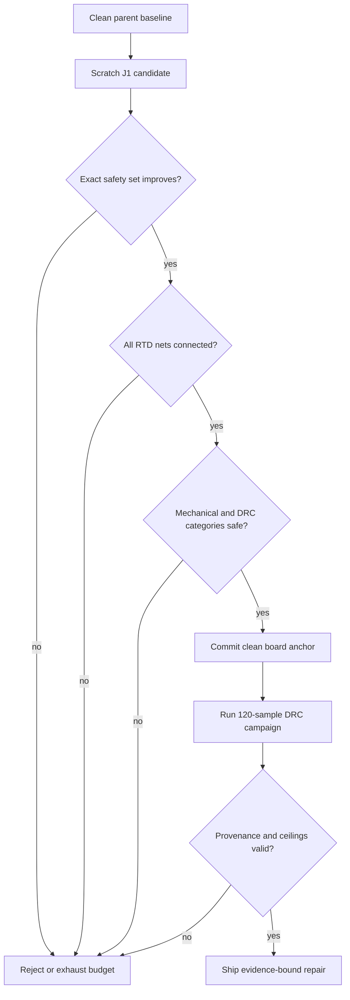
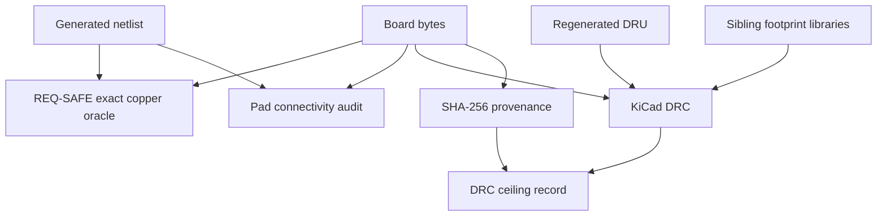

# K1-J1 Creepage Repair - Plan

## Goal Capsule

- **Objective:** The production PCB clears the reinforced 12.6 mm creepage requirement between K1's mains contact and J1's SELV RTD connection with at least 13.1 mm nominal copper separation, without weakening the relay's internal isolation or creating new board-safety debt.
- **Means:** Validate J1's land pattern, use a finite J1-first scratch search, reroute the affected RTD conductors, and graduate only a Pareto-safe candidate to the tracked board (KTD1-KTD4 and KTD6).
- **Product authority:** This work owns the bounded K1-J1 physical repair and the measurements required to prove it. A continuous whole-board mains-SELV isolation barrier remains separate work.
- **Stop conditions:** Stop if the clean-parent violation cannot be reproduced, the bounded candidate budget finds no acceptable landing, any safety signature worsens, or DRC produces an unexplained category rise.
- **Execution profile:** Safety-critical PCB change with proof-first geometry, connectivity, mechanical review, and a clean 120-sample DRC campaign.
- **Tail ownership:** Standalone `ce-work` owns simplification, review, commit, push, pull-request creation, and CI handoff. After the clean board anchor, any tail edit to the board or a board-derived artifact invalidates U3 and requires the full measurement campaign and provenance update to be repeated.

---

## Product Contract

### Summary

Repair the current production board's K1-J1 reinforced-creepage violation with a bounded J1-region placement and routing change. Bind the result to fresh safety, connectivity, and DRC evidence in the same pull request.

### Problem Frame

Canonical copper geometry currently measures 9.686463929644992 mm between K1 pad 4 on `w1_2` and J1 pad 4 on `rtd_force_n`, below the 12.6 mm reinforced target. That number is a reproduction target for the checked-in board, not the acceptance authority: J1's project-local footprint is hand-built and differs from the official KiCad/JST land pattern, so candidate geometry must be measured only after the land pattern is validated and synchronized. K1's Schrack RT33K012 footprint already provides a compliant 17.800 mm internal coil-to-contact gap, so the actionable defect is inter-component placement rather than relay selection.

The broader mains-SELV isolation-barrier gate remains red because the current board has no continuous barrier corridor. Existing evidence concludes that closing that gap requires a domain-first refloorplan and reroute, which is not a proportional prerequisite for correcting this localized violation.

**Product Contract preservation:** unchanged; planning corrected one source path and added implementation contracts without changing product scope.

### Key Decisions

- **Bound this work to the K1-J1 defect.** Governs R1-R9. (session-settled: user-approved — chosen over full isolation-barrier redesign: bounded K1-J1 placement repair fixes the actionable physical defect without reopening whole-board topology.)
- **Treat measurement artifacts as part of the board change.** Governs R6-R8. The repair is incomplete until its safety and DRC claims are reproducible from the changed board.
- **Keep the continuous-barrier gate honest.** Governs R5. This work may leave the known gate red but must not weaken, suppress, or misdescribe it.

### Requirements

**Electrical safety**

- R1. Canonical copper geometry must measure at least 12.6 mm between all K1 mains copper and all J1 SELV copper, including pads, tracks, and vias. The accepted layout must target at least 13.1 mm nominal separation; safety comparisons use the canonical full-precision values, never rounded display text.
- R2. K1's minimum internal coil-to-contact copper gap must remain at least its current canonical 17.800 mm value, compared at full precision.
- R3. The changed board must introduce no new safety-violation signature and must not reduce the distance of any existing signature.

**Physical and functional integrity**

- R4. The repair must respect board edges, courtyards, component clearances, board-local connector access, and manufacturable routing while preserving K1 and J1 electrical connectivity. Because no authoritative enclosure model exists, this repair must not claim enclosure compatibility.
- R5. The repair must not change safety thresholds, domain assignments, baseline accounting rules, or the behavior of `scripts/check_isolation_keepout.py`; the known missing continuous barrier remains a red gate pending a domain-first redesign.

**Evidence and delivery**

- R6. The full current REQ-SAFE measurement strata must be rerun on the changed board, and any baseline-pin reduction may include only locally reproduced improvements.
- R7. The pull request that changes `pcb/temper.kicad_pcb` must also carry a fresh measured-live `power_pcb_dataset/drc_ceiling.json` record produced with the repository's required tool setup, 120 samples, valid content-hash provenance, and the noise-headroom invariant.
- R8. Any DRC ceiling rise must be attributable to the deliberate repair, recorded in a new `_march` entry, and approved through the repository contract; an unexplained rise stops delivery.
- R9. J1's pad, drill, fabrication outline, and courtyard must be validated against JST's B4B-XH-A drawing and the approved KiCad land pattern before candidate selection; the project-local footprint and embedded board copy must be synchronized when they differ.

### Key Flows

- F1. Safety-feasible placement
  - **Trigger:** The current K1-J1 pair measures below 12.6 mm.
  - **Steps:** Validate J1's land pattern, then evaluate bounded physical candidates against canonical copper geometry and board-local mechanical constraints; accept a candidate only when it covers R1-R5 and R9.
  - **Outcome:** A production-board layout exists that resolves the target pair without trading it for another safety or physical defect.
- F2. Evidence-bound delivery
  - **Trigger:** A board candidate covers R1-R5.
  - **Steps:** Freeze the final board bytes, reproduce the safety strata, measure DRC noise, update provenance and ceilings under the repository contract, and reject unexplained regressions. Any later board-byte change repeats the complete DRC campaign.
  - **Outcome:** The same pull request contains the board repair and the evidence required by R6-R8.

### Acceptance Examples

- AE1. **Covers R1-R4 and R9.** Given a candidate built from the validated J1 land pattern, when canonical safety geometry evaluates all relevant pad, track, and via copper, then K1-J1 is at least 13.1 mm nominal, K1 internal isolation is at least its current full-precision 17.800 mm value, and no new or worsened safety signature appears.
- AE2. **Covers R4.** Given a geometrically safe candidate, when the board is inspected in KiCad and checked with repository board rules, then footprints and affected copper remain connected, accessible, collision-free, inside the board, and manufacturable.
- AE3. **Covers R5.** Given the localized repair, when `scripts/check_isolation_keepout.py` runs, then its existing missing-barrier failure remains visible unless the board independently satisfies it; the check is neither weakened nor converted into an acceptance criterion for this repair.
- AE4. **Covers R7-R8.** Given the final committed board candidate, when the required DRC campaign runs, then the ceiling record is hash-bound to that board, records at least 120 samples, satisfies noise headroom, and contains no unexplained rise.
- AE5. **Covers R6.** Given the changed board, when the complete REQ-SAFE strata rerun finishes, then its exact result is recorded; if the checked-in pin is lowered, every removed violation must be present in that local evidence rather than inferred from an unrelated CI run.

<!-- ce-section: work-relationships -->
### How This Work Fits Together

This plan owns only the localized K1-J1 safety repair; the broader breakdown is context, not a committed roadmap.

- **Can proceed independently of:** unrelated PD3 creepage repairs and fact-drift cleanup.
- **Preserves evidence for:** the future domain-first refloorplan and continuous mains-SELV barrier redesign described in `docs/evidence/2026-08-03-mains-selv-barrier-keepout.md`.
- **Depends on:** same-pull-request board measurement and provenance discipline whenever `pcb/temper.kicad_pcb` changes.

### Scope Boundaries

- Full-board domain-first refloorplanning, rerouting, and construction of a continuous `MAINS_SELV_ISOLATION_BARRIER` are deferred.
- A K1 relocation is excluded because the prior ±14 mm sweep exhausted the local K1-only search. A milled slot or groove is excluded because it changes the fabrication process and is unnecessary unless the two validated-footprint J1 candidates both fail; candidate exhaustion hands the unresolved defect to the deferred domain-first work instead of inventing a third remedy.
- Other pre-existing PD3 violations are excluded unless a candidate worsens them, in which case R3 rejects that candidate.
- Unrelated facts, generated artifacts, or baseline drift are excluded unless the changed board or an evidence-backed local measurement requires their update.
- Threshold reductions, gate suppression, unexplained DRC ratcheting, and safety-baseline laundering are prohibited.

### Dependencies and Assumptions

- The canonical REQ-SAFE requirement is owned by `packages/temper-design-bundle/src/safety_value.rs` and exposed through `packages/temper-drc-rs/src/req_safe_01.rs`; `packages/temper-placer/configs/pair_creepage.generated.yaml` supplies the complementary KiCad/router table.
- J1 source authority is JST's XH-series B4B-XH-A drawing and KiCad's generated `JST_XH_B4B-XH-A_1x04_P2.50mm_Vertical` footprint. The current project-local footprint must not be used as its own oracle.
- The current board has enough local geometric freedom for a bounded J1-region repair; implementation must stop if every candidate violates R1-R5.
- DRC evidence is valid only after regenerating `pcb/temper.kicad_dru`, resolving the footprint library beside the board, and using the repository DRC API with the current nondeterministic categories from `power_pcb_dataset/drc_ceiling.json`.

### Sources and Research

- `packages/temper-placer/tests/requirements/safety/test_clearance_copper.py` owns the K1 inter-component and 17.800 mm internal-gap regression checks.
- `docs/evidence/2026-08-26-regional-layout-bounded-candidates.md` provides the finite scratch-candidate and Pareto-veto pattern.
- `docs/solutions/workflow-issues/board-correcting-pr-fallout-classes-2026-08-23.md` distinguishes remeasurable board artifacts from safety alarms that may only ratchet toward improvement.
- `docs/evidence/2026-08-03-mains-selv-barrier-keepout.md` records why a continuous barrier is separate domain-first redesign work.
- `docs/solutions/best-practices/drc-ceiling-same-pr-discipline-2026-08-19.md` owns the same-pull-request DRC measurement discipline.
- JST's primary XH-series drawing (`https://www.jst-mfg.com/product/pdf/eng/eXH.pdf`) and KiCad's generated Connector_JST footprint are the J1 land-pattern authorities.

---

## Planning Contract

### Key Technical Decisions

- KTD1. **Establish the exact clean-parent oracle before editing.** Capture the checked-in board's reproduction baseline, then create a scratch authority baseline with J1's validated land pattern. For both, record normalized safety signatures, per-signature distances, REQ-SAFE strata, coverage guards, affected-net connectivity, and the isolation-gate finding. Count-only baselines cannot detect same-stratum substitution. Covers R1-R6 and R9.
- KTD2. **Search J1 first with a finite scratch budget.** After synchronizing J1's validated footprint in scratch, begin with a +5.0 mm Y translation at unchanged rotation and require at least 13.1 mm nominal K1-J1 copper separation. If it fails any veto, evaluate exactly one second deterministic +5.5 mm Y translation; then stop. Do not reopen the exhausted K1-only ±14 mm sweep. Covers R1-R5 and R9. (session-settled: user-approved — chosen over full isolation-barrier redesign: a bounded J1-region repair targets the remaining actionable pair without reopening whole-board topology.)
- KTD3. **Move copper with the connector and prove all four RTD nets.** Replace only the affected J1 approach copper, preserve the three currently routed conductors, and complete `rtd_force_n` if the candidate remains Pareto-safe. `pad_connectivity_audit` must prove connectivity because endpoint proximity alone is insufficient. Covers R3-R4.
- KTD4. **Reject every new safety signature and every per-category DRC rise by default.** A lower aggregate cannot offset a new reinforced pair or a warning-category regression. Covers R3 and R8.
- KTD5. **Measure from a clean board anchor.** Commit the accepted board and required board-derived artifacts before the 120-sample campaign. Any later board-byte change invalidates the campaign and requires remeasurement. Covers R6-R8.
- KTD6. **Snapshot the continuous-barrier failure as an independent invariant.** Compare the clean-parent and candidate boards while keeping the gate implementation, domain manifest, barrier name, and minimum-width policy unchanged. The normalized missing-barrier finding may remain unchanged or improve; this localized repair is not required to make the gate pass. Covers R5.

### Assumptions

- A downward J1 translation preserves its keying and cable-insertion direction. KiCad inspection can confirm board-edge setback and board-local insertion clearance, but not enclosure serviceability without a mechanical authority.
- Completing the already-unrouted `rtd_force_n` conductor is part of returning the moved connector to intended netlist connectivity under R4, provided it passes KTD4.
- A throwaway scratch harness is sufficient for the two-candidate search. No new committed script is needed unless implementation discovers reusable logic that cannot be expressed through `scripts/evaluate_regional_layout.py`.
- No Rust or pyo3 code change is expected. Extension freshness remains a measurement precondition because the safety geometry is Rust-backed.

### High-Level Technical Design

The candidate pipeline is fail-closed. Only a scratch candidate that passes every earlier veto reaches the tracked board.

The evidence paths remain independent so one instrument cannot certify what it does not measure.

### Sequencing

1. U1 establishes the clean-parent evidence and graduates one scratch candidate.
2. U2 applies the candidate, reroutes J1, and commits a clean board anchor with regenerated board-bound artifacts.
3. U3 runs the 120-sample campaign and binds its result to the anchor.
4. U4 captures the durable learning after the measured result is known.

### Risks and Mitigations

| Risk | Consequence | Mitigation |
|---|---|---|
| A J1 move clears one pad pair but creates another | Safety debt is substituted, not fixed | Compare normalized exact signature sets and distances per KTD1 and KTD4 |
| The hand-built J1 footprint understates pad or courtyard geometry | A nominally safe candidate is based on the wrong copper or body | Synchronize to the JST/KiCad land-pattern authority before evaluating candidates |
| A 12.6 mm knife-edge pass loses practical margin | The design passes only at its arithmetic boundary | Require 13.1 mm nominal copper separation and report the full-precision minimum |
| Connector copper remains at the old pad positions | Three RTD conductors silently disconnect | Replace affected approach copper and prove all four nets with the connectivity audit |
| Pad-only geometry misses routed-copper creepage | A new track or via violates the barrier | Require KiCad DRC set comparison plus exact REQ-SAFE checks |
| Mechanical clearance passes but cable access fails | The board becomes unserviceable | Preserve orientation and inspect the board-local insertion envelope, edge setback, and courtyard in KiCad; do not claim enclosure fit |
| A capped or misconfigured DRC run looks clean | False evidence enters provenance | Regenerate DRU, verify libraries/extensions, reject 199/499 caps, and use the repository API |
| Board bytes change after measurement | Provenance no longer identifies the shipped board | Measure only from the clean anchor and rerun after any board-byte change |

---

## Implementation Units

### U1. Baseline and bounded candidate selection

**Goal:** Reproduce the defect and select one scratch candidate without editing the tracked board.

**Requirements:** R1-R6 and R9; F1; AE1-AE3.

**Dependencies:** None.

**Files:**

- `pcb/temper.kicad_pcb`
- `pcb/libs/Connector_JST.pretty/JST_XH_B4B-XH-A_1x04_P2.50mm_Vertical.kicad_mod`
- `packages/temper-placer/tests/requirements/safety/test_clearance.py`
- `packages/temper-placer/tests/requirements/safety/test_clearance_copper.py`
- `packages/temper-placer/tests/requirements/safety/_req_safe_01_baseline.py`
- `scripts/evaluate_regional_layout.py`
- `scripts/check_isolation_keepout.py`
- `docs/evidence/2026-08-30-k1-j1-creepage-repair.md`

**Approach:**

1. Generate the board fixture and verify extension freshness before trusting geometry. Compare J1's local footprint against the JST drawing and official KiCad land pattern, then synchronize the scratch footprint and embedded J1 copy to that authority.
2. Record parent-board hashes, the checked-in reproduction baseline, the validated-footprint scratch baseline, normalized safety signatures and distances, REQ-SAFE strata, K1's internal gap, RTD-net connectivity, and the isolation-gate finding.
3. Build candidate 1 as a fully staged scratch board with basename-matched project/rules sidecars plus sibling `fp-lib-table` and libraries. Move J1 with its affected approach copper and score it against KTD1, KTD3, KTD4, and KTD6. Evaluate candidate 2 only if candidate 1 is vetoed.
4. For parent and each candidate, run repository-API KiCad DRC three times, normalize net-order swaps in each violation identity, intersect each board's three exact signature sets, compare those stable sets independently of the regional evaluator's category counters, and record unstable signatures separately.
5. Write the candidate table and rejection reasons into the evidence record. Stop if neither candidate passes every veto; leave the tracked board unchanged and ship an evidence-only pull request that hands the unresolved defect to the deferred domain-first refloorplan.

**Execution note:** Proof-first. Observe the current K1 inter-component test fail and capture the parent characterization before changing board bytes.

**Patterns to follow:** `docs/evidence/2026-08-26-regional-layout-bounded-candidates.md`; `docs/evidence/2026-08-17-pd3-creepage-12-reexamination.md`.

**Test scenarios:**

- Covers AE1. The checked-in parent reproduces K1-J1 at 9.686463929644992 mm; the validated-footprint scratch baseline records its own full-precision value; K1 internal isolation remains 17.800 mm through the canonical Rust-backed geometry path.
- A scratch J1 translation is rejected when it adds a safety signature, reduces an existing distance, raises any DRC category, breaks an RTD net, overlaps a body or courtyard, or violates the edge and connector envelope.
- Covers AE3. The candidate reports an unchanged or improved normalized missing-barrier finding while the gate implementation, domain manifest, barrier name, and minimum-width policy remain unchanged.
- A stale extension, missing generated netlist, missing DRU or footprint-library context, empty safety denominator, or 199/499 DRC cap invalidates the measurement instead of producing a candidate verdict.

**Verification:** One candidate has a recorded position and rotation, verified J1 land pattern, exact removed/new signature diff, affected-net connectivity delta, board-local mechanical verdict, three-run stable DRC set comparison, executable regional-evaluator result, and no unresolved veto.

### U2. Production board repair and clean anchor

**Goal:** Apply the accepted J1 placement and routing change, update required board-bound artifacts, and create the clean measurement anchor.

**Requirements:** R1-R6 and R9; F1; AE1-AE3 and AE5.

**Dependencies:** U1.

**Files:**

- `pcb/temper.kicad_pcb`
- `pcb/libs/Connector_JST.pretty/JST_XH_B4B-XH-A_1x04_P2.50mm_Vertical.kicad_mod`
- `pcb/temper.kicad_pcb.source-digest`
- `packages/temper-placer/tests/requirements/safety/_req_safe_01_baseline.py`
- `packages/temper-placer/configs/temper_constraints.references.yaml`
- `scripts/board_defect_corpus.yaml`
- `docs/evidence/2026-08-30-k1-j1-creepage-repair.md`

**Approach:**

1. Apply the validated J1 footprint, accepted placement, affected trace, and necessary via changes. Keep J1 orientation and keying unchanged.
2. Reconcile all four RTD nets against the generated netlist and require every J1 pad to be connected without fake completion.
3. Rerun the exact safety set, K1-specific tests, containment, courtyard and body checks, the regional evaluator, and the independent isolation-gate snapshot.
4. Lower the REQ-SAFE pin only for locally reproduced removed strata. Regenerate or semantically revalidate every board-bound artifact and change it only when its gate requires an update.
5. Inspect J1, K1, the RTD routes, edge setback, board-local cable insertion clearance, and surrounding copper in KiCad before committing the anchor. Remove abandoned candidate copper and scratch artifacts before this commit.

**Execution note:** Keep the board diff surgical. Remove abandoned candidate copper and avoid a whole-file PCB rewrite for a coordinate-and-route repair.

**Patterns to follow:** The one-line placement discipline in `docs/evidence/2026-08-04-r24-barrier-resolve.md`; the fallout classification in `docs/solutions/workflow-issues/board-correcting-pr-fallout-classes-2026-08-23.md`.

**Test scenarios:**

- Covers AE1. The accepted board has at least 13.1 mm nominal separation from all K1 mains copper to all J1 SELV pads, tracks, and vias; it retains the full-precision 17.800 mm K1 internal gap, adds no safety signature, and reduces no existing distance.
- Covers AE2. All four J1 pads match their netlist nets, all four RTD nets pass pad-connectivity audit, and no new fake-completion, short, or unconnected regression appears.
- The board remains contained; J1's validated courtyard and body are collision-free; orientation, keying, board-edge setback, and board-local cable access remain valid. No enclosure-fit claim is made.
- Covers AE5. A lower REQ-SAFE total changes only the strata and signatures reproduced in U1 and U2 evidence.
- Covers AE3. The continuous-barrier gate stays fail-closed with an identical or improved normalized finding while its implementation, domain manifest, barrier name, and minimum-width policy remain unchanged.

**Verification:** A clean commit contains the accepted board bytes, required board-bound artifacts, exact safety evidence, connectivity proof, and no unrelated PCB reformatting.

### U3. DRC campaign and provenance

**Goal:** Measure the clean board anchor over 120 samples and update the DRC ceiling record without laundering a regression.

**Requirements:** R7-R8; F2; AE4.

**Dependencies:** U2.

**Files:**

- `power_pcb_dataset/drc_ceiling.json`
- `docs/evidence/2026-08-30-k1-j1-creepage-repair.md`

**Approach:**

1. Regenerate the gitignored DRU as a measurement input, then verify sibling footprint libraries, extension freshness, tool version, clean tree, anchor commit, and board hash.
2. Run 120 repository-API DRC samples and retain every error and warning distribution.
3. Classify nondeterminism from this campaign. For each scattering category, apply `ceiling >= max(observed) + spread` and preserve any required uncapped-total evidence.
4. Add fresh measured-live provenance and a structured `_march` cause with per-type deltas. Reject any unexplained rise under KTD4.
5. Run the DRC ratchet, provenance, noise-headroom, and ceiling-approval gates against the candidate record.

**Execution note:** Measure immediately after verifying the instrument. If board bytes or the installed geometry extension change, discard the campaign and restart.

**Patterns to follow:** `docs/solutions/best-practices/drc-ceiling-same-pr-discipline-2026-08-19.md`; `docs/evidence/2026-08-11-creepage-noise-headroom-guard-fix.md`.

**Test scenarios:**

- Covers AE4. The record contains at least 120 samples from the current kicad-cli version, `source: measured-live`, a clean resolvable anchor, and the exact shipped board hash.
- A category with observed spread receives at least one full spread of headroom; a deterministic category receives no invented noise allowance.
- A raw 199/499 cap is treated as censored and requires the repository's uncapped method rather than being stored as a count.
- Any per-category rise stops the unit unless its cause is measured, recorded, and explicitly approved under R8.
- The warning-side distribution and aggregate are recorded and checked with the same rigor as error categories.

**Verification:** The DRC, provenance, noise-headroom, cap-saturation, and raise-approval gates pass against the same board hash committed by U2.

### U4. Durable compound learning and shipping evidence

**Goal:** Capture the solved placement-and-connectivity pattern as a durable repo learning and prepare a reviewable pull request.

**Requirements:** R1-R9; F2; AE1-AE5.

**Dependencies:** U3.

**Files:**

- `docs/solutions/`
- `docs/evidence/2026-08-30-k1-j1-creepage-repair.md`

**Approach:**

1. Use the `ce-compound` workflow to document why a J1-region move succeeded or failed where K1-only search could not, how routed connector copper changed the acceptance problem, and which instruments supplied independent proof.
2. Link the learning to the evidence record and existing DRC same-PR discipline without copying their full normative text.
3. Summarize exact safety, connectivity, mechanical, and DRC outcomes in the pull request. State that the independent continuous-barrier gate remains fail-closed and outside this repair.

**Test expectation:** None — this unit documents verified outcomes and does not change behavior.

**Verification:** The solution document has valid frontmatter, repo-relative evidence links, no unsupported safety claim, and enough detail for the next PCB repair to reuse the pattern.

---

## Verification Contract

| Gate | Applicability | Required outcome |
|---|---|---|
| `env -u CONDA_PREFIX make extensions-check` | Before every reported Rust-backed geometry measurement | All pyo3 extensions load and report fresh; rebuild with `env -u CONDA_PREFIX make extensions` only when stale |
| `make netlist` | Before board/netlist safety and connectivity checks | `elec/build/default.net` exists and matches current electrical sources |
| Focused K1 tests in `packages/temper-placer/tests/requirements/safety/test_clearance_copper.py` | U1-U2 | Parent inter-component test is observed red; candidate inter-component test passes; 17.800 mm internal-gap test passes on both |
| `test_clearance.py::TestClearanceIntegration::test_temper_board_clearance_compliance` | U1-U2 | Full REQ-SAFE strata and coverage guards reproduce parent and improve without signature substitution |
| `temper_placer.router_v6.pad_connectivity_audit.audit_pcb_file` | U1-U2 | All four RTD nets connect on the candidate; no affected net loses a pad or becomes fake-complete |
| Three repository-API DRC runs per parent/candidate | U1 | Net-order-normalized stable signature intersections contain no new candidate signature; unstable signatures are recorded separately |
| `uv run --no-sync python scripts/evaluate_regional_layout.py --baseline pcb/temper.kicad_pcb --candidate <scratch-board>` | U1-U2 | With basename-matched project/rules sidecars and sibling footprint libraries, exact safety set improves and no DRC category, body collision, or routed endpoint regresses |
| `uv run --no-sync python scripts/check_netlist_board_reconciliation.py` | U2 | Board pads and nets reconcile with the generated netlist |
| `uv run --no-sync python scripts/check_board_containment.py` | U2 | Every footprint and pad remains inside the board |
| `uv run --no-sync python scripts/check_isolation_keepout.py` | U1-U2 | Known missing-barrier failure is normalized and unchanged or improved; nonzero exit is documented, not suppressed |
| KiCad visual inspection | U2 | J1 keying, board-local cable access, edge setback, validated courtyards, affected tracks/vias, and surrounding copper are acceptable; enclosure compatibility is not asserted |
| 120 calls through `temper_placer.validation._drc_api.run_drc` | U3 | Complete per-category error and warning distributions from the clean anchor, with no instrument signature or uncensored cap |
| `uv run --no-sync python scripts/ci_check_drc.py --backend kicad-cli` | U3 | Candidate ceiling passes ratchet, cap, and noise-headroom checks |
| `uv run --no-sync python scripts/check_measurement_provenance.py` | U3 | Fresh measured-live record is clean, hash-bound, and resolvable |
| `uv run --no-sync python scripts/check_drc_ceiling_approval.py` | U3 | No unapproved ceiling rise |
| `make regen` | U2-U4 | Safe generated artifacts are refreshed; evidence artifacts are not laundered |
| `make regen-check` | U2-U4 | Generated artifacts are current and no defect evidence is laundered |
| `uv run --no-sync python scripts/import_linter_gate.py` | U4 | Import boundaries remain clean |
| `git diff --check` | U1-U4 | No whitespace or patch-format errors |

---

## Definition of Done

### Global

- The validated J1 land pattern matches the JST/KiCad authority in the library and embedded board footprint.
- The exact K1-J1 reinforced-creepage signature is absent, all K1-mains-to-J1-SELV copper is at least 13.1 mm apart nominally, and no new safety signature exists.
- K1's canonical internal coil-to-contact gap remains 17.800 mm.
- All four RTD connector nets are connected after the J1 move, with no new fake completion or short.
- The accepted layout passes containment, collision, board-local connector-access, and KiCad visual review; no unsupported enclosure-fit claim is made.
- The same pull request contains fresh 120-sample DRC ceilings, structured cause attribution, and clean hash-bound provenance.
- The independent continuous-barrier gate remains fail-closed and is neither weakened nor misrepresented.
- Dead-end candidate files and abandoned copper are removed before the clean board anchor.
- After the clean board anchor, simplification, review fixes, and cleanup do not modify the board or board-derived artifacts. Any such edit repeats U3's full 120-sample campaign and reissues provenance.
- The compound solution document and evidence record describe only measured outcomes.
- Review findings are resolved or reported, the branch is pushed, and an open pull request contains exact verification evidence.

### Per Unit

| Unit | Done when |
|---|---|
| U1 | The clean parent is reproduced and one bounded scratch candidate clears every acceptance veto, or the run stops with an evidence-backed infeasibility report |
| U2 | The accepted board and affected RTD routing pass exact safety, connectivity, mechanical, and board-derived artifact gates in a clean anchor commit |
| U3 | The 120-sample DRC record passes provenance, noise-headroom, cap, ratchet, and approval gates against the U2 board hash |
| U4 | The durable solution and pull-request evidence accurately connect the defect, repair, measurements, known red barrier gate, and remaining scope |

### Stopped run

If U1 exhausts both candidates, the tracked board remains unchanged. Completion then requires a dated evidence record with the checked-in and validated-footprint baselines, both candidate geometries, every veto and repeated-DRC result, plus an evidence-only pull request that explicitly hands the unresolved reinforced-creepage defect to the deferred domain-first refloorplan.
