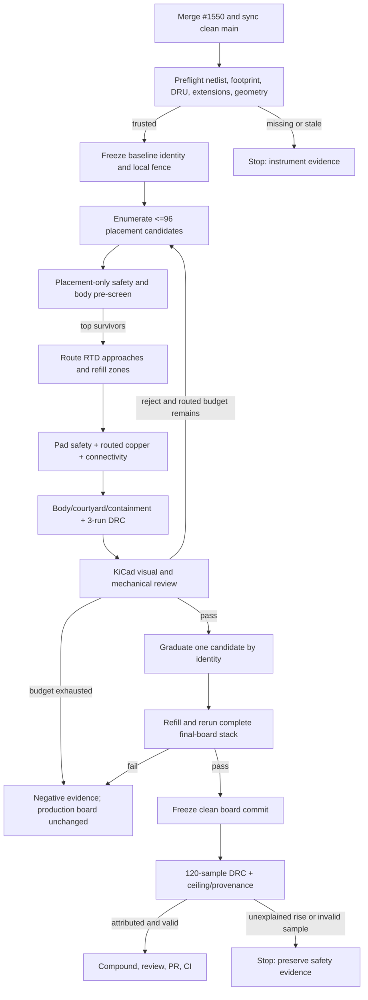

# K1-J1 domain-first neighborhood refloorplan

## Goal Capsule

- **Objective:** Replace the rejected connector-only K1-J1 nudges with one bounded, domain-first neighborhood refloorplan that preserves electrical and mechanical correctness while establishing at least 13.1 mm nominal K1-to-J1 copper separation and at least 12.6 mm from J1.4 and its approach copper to the nearby In3.Cu high-voltage route.
- **Means:** Merge the completed rejection evidence, freeze a clean authoritative baseline, explore a finite scratch-only family that jointly places J1/R45/R58/R66/SW1/U22 and the U8 approaches, and graduate exactly one candidate only after every independent acceptance gate passes.
- **Product authority:** `pcb/temper.kicad_pcb` is the production artifact; the compiled Atopile netlist owns component and net identity; the approved KiCad/JST footprint owns J1 geometry; Rust-backed geometry and quality oracles own machine verdicts; a recorded PCB-engineering inspection owns connector access and visual acceptance.
- **Open blockers:** None before execution. Missing geometry, unresolved measurement identity, capped DRC output, or a need to move outside the declared neighborhood is a terminal non-acceptance result rather than permission to expand or weaken the rules.
- **Stop condition:** If the predeclared placement/routing budget produces no fully passing layout, keep the production board, footprint library, and DRC ceiling unchanged and ship evidence of the evaluated deterministic sample, its coverage fraction of the declared anchor/rotation space, and the next topology decision. Budget exhaustion is not proof that the unsampled space is infeasible.

---

## Product Contract

### Summary

Repair the local K1-J1 isolation topology as a PCB neighborhood, not as another isolated connector translation. The work jointly owns the connector, its nearby RTD passives and switch, and the routes approaching U8. It does not claim that the absent board-wide `MAINS_SELV_ISOLATION_BARRIER` has been implemented.

### Problem Frame

PR #1550 established that moving J1 alone by +5.0 mm or +5.5 mm improves the direct K1-J1 gap but produces five new pad-level safety signatures, a real J1.4-to-In3.Cu creepage violation, five courtyard overlaps, three F.Fab body collisions, and worse DRC totals. Those are topology failures, not evidence for a third connector nudge.

With the approved J1 footprint, the unchanged baseline K1-J1 copper gap is 9.594676710156559 mm; U1 remeasures that value and the current J1.4-to-In3.Cu routed-copper gap from the exact implementation baseline before search. The governing 12.6 mm minimum is the Rust-owned <=400 V, pollution-degree-3 reinforced creepage value in `packages/temper-design-bundle/src/safety_value.rs` (`6.3 x 2`, IEC 60335-1 clause 29.2.3). The 13.1 mm nominal K1-J1 target adds the explicit 0.5 mm layout margin defined in R6.

The next design unit is the complete local neighborhood: J1, R45, R58, R66, SW1, U22, and the routes/vias/zones by which all four RTD nets reach U8. The K1 high-voltage side and the nearby `discharge.r_snub1-p2` In3.Cu route are fixed obstacles for this bounded study. The study may relocate and reroute only the declared neighborhood inside an explicit local fence; discovering that another component or non-neighborhood route must move stops the study and names the required scope expansion.

This local repair is sequenced ahead of the board-wide physical-barrier program because it closes a concrete connector/RTD defect, repairs the currently broken `rtd_force_n` path, and produces reusable footprint authority, object/fence census, and measurement evidence without pretending to settle the global topology. A later barrier program may relocate K1 and force this neighborhood to be re-derived; fabrication therefore remains blocked on that separate program, and a local success is not assumed to survive it unchanged.

Three conventional alternatives are deliberately outside this bounded run: a board slot/cutout changes the mechanical board/enclosure contract; relocating J1 to another board edge expands cable and enclosure scope; and moving K1 or the high-voltage route belongs to the board-wide domain/barrier refloorplan. A negative result records these as the next decision set rather than silently expanding into one of them.

### Key Decisions

- **Merge PR #1550 before implementation.** (session-settled: user-directed — chosen over leaving the evidence branch open because the new work must inherit the authoritative rejection evidence and durable learning before changing the board.) Governs R1 and R14.
- **Use a domain-first neighborhood refloorplan.** (session-settled: user-approved — chosen over another isolated J1 nudge because both measured nudges created electrical, safety, and mechanical regressions.) Governs R2-R9.
- **Graduate only a fully passing candidate.** (session-settled: user-directed — chosen over accepting or rebaselining regressions because a local target-pair improvement is not board correctness.) Governs R6-R13.
- **Keep DRC ceiling and provenance in the board-changing PR.** (session-settled: user-directed — chosen over follow-up measurement because the content hash fails closed as soon as board bytes change.) Governs R12-R14.
- **Treat the board-wide isolation barrier as a separate known-red gate.** This work records and preserves the current missing-barrier result; it must not claim full mains-SELV isolation closure or weaken `scripts/check_isolation_keepout.py`. Governs R3 and R11.

### Requirements

**Authority and bounded scope**

- R1. The implementation branch must incorporate the merged contents of PR #1550 before any production-board edit, so the rejection evidence and topology learning are present in the implementation history.
- R2. Candidate mutation must be confined to J1, R45, R58, R66, SW1, U22, the J1-to-U8 RTD traces/vias, and zone fill affected by those objects. K1, the In3.Cu high-voltage route, unrelated components, unrelated tracks, board outline, mounting features, and global rule values remain fixed.
- R3. Before search, execution must record one clean baseline identity, regenerate the compiled netlist and KiCad DRU, confirm fresh Rust extensions, verify complete footprint/F.Fab/REQ-SAFE inputs, and preserve the current board-wide isolation-keepout result as an explicitly out-of-scope known red gate.
- R4. Every scratch candidate must use the approved `Connector_JST:JST_XH_B4B-XH-A_1x04_P2.50mm_Vertical` revision as its J1 geometry; hand-built proxy geometry cannot be used for a safety measurement. Only after a candidate passes may U4 synchronize that revision across `elec/src/components.ato`, the project footprint library, compiled netlist, and production board. A negative study leaves those production artifacts unchanged.
- R5. The candidate family must be finite and declared before mutation: quadrant rotations only; a local coordinate fence derived from the fixed neighboring obstacles and board edge; deterministic grid/anchor choices for the six movable footprints; at most 96 placement-only candidates; and a fixed maximum of 24 fully routed survivors. A candidate that requires movement beyond the fence is rejected, not silently widened.

**Safety, electrical, and mechanical acceptance**

- R6. Every candidate must provide at least 13.1 mm nominal edge-to-edge copper separation between K1 and J1 using authoritative pad geometry, reported at full precision with pad identities and transform convention. The 13.1 mm target is the current 12.6 mm reinforced-creepage requirement plus 0.5 mm of explicit layout margin; 12.6 mm remains the governing safety minimum, while the margin prevents a nominally exact placement from spending the entire tolerance budget.
- R7. Every candidate must provide at least 12.6 mm edge-to-edge distance between J1.4 plus every connected approach segment/via/filled-zone copper item and the fixed `discharge.r_snub1-p2` In3.Cu high-voltage route. Pad-only cross-domain measurement cannot substitute for this routed-copper gate.
- R8. No candidate may introduce or worsen any exact pad-level REQ-SAFE signature, named hard-veto DRC category, warning category, F.Fab body collision, courtyard overlap, hole/board-edge violation, or untrusted/missing geometry result relative to the clean baseline. Existing findings may remain only where unchanged and explicitly identified as baseline debt.
- R9. All four RTD nets must finish fully connected from J1 through the affected neighborhood to their required endpoints at U8. The current `rtd_force_n` baseline is broken (one of two required pad groups connected) and must be repaired rather than treated as acceptable inherited debt. Endpoint presence is insufficient: the full pad-connectivity audit must pass after zone fill, with no net merge, split, dangling approach, or deleted component.
- R10. Mechanical inspection must confirm J1 insertion direction, housing and mating clearance, local tool/finger access, component-body and courtyard clearance, board-edge clearance, silkscreen legibility, and manufacturable route neck-down/via geometry. Enclosure compatibility remains explicitly unverified unless an authoritative enclosure model is available; evidence and the PR must record J1's before/after absolute origin and rotation as an open mechanical verification item that blocks fabrication until cleared by the enclosure owner.
- R11. The accepted candidate must pass the regional oracle, containment/inventory/footprint drift checks, the normalized three-run DRC comparison, and a recorded KiCad visual review across all copper, F.Fab, courtyard, and silkscreen layers. An indeterminate error or warning delta triggers bounded additional sampling and rejects the candidate if it remains unresolved; it is never treated as a pass. A raw count of 199/499 is a saturation signal, not a count: execution must recover a validated true total or candidate delta through `scripts/measure_uncapped_drc.py`; a missing instrument, unrecovered cap, or incomplete census is a tool error and cannot pass.

**Graduation, measurement, and shipping**

- R12. Exactly one scratch candidate may be graduated. Its board bytes and authoritative J1 footprint must match the accepted scratch identity, zones must be refilled, and the complete acceptance stack must be rerun on `pcb/temper.kicad_pcb` after graduation.
- R13. After final board bytes are frozen on a clean, reachable commit, execution must run 120 samples through `temper_placer.validation._drc_api.run_drc`, record per-category ranges and set-level changes, apply the noise-headroom invariant to every currently nondeterministic category, and update `power_pcb_dataset/drc_ceiling.json` with measured-live provenance, matching SHA-256, tool version, sample count, and an attributed structured `_march` entry. Any rise requires a `Ceiling-Approval:` trailer; unexplained rises stop the work.
- R14. The implementation PR must include the implementation plan, final or negative evidence, the durable solution learning, all board/library/ceiling changes when a candidate graduates, and the exact verification results. No board-change PR may omit the same-PR DRC record.

### Key Flows

- F1. **Establish the authority and baseline.** Merge PR #1550; synchronize the implementation branch with the new `main`; regenerate netlist and DRU; verify extension, footprint, geometry, and project context; record board/hash/tool identity and baseline gates. Outcome: either one trusted baseline or a fail-closed preflight result. Covers R1-R4.
- F2. **Explore the bounded neighborhood.** Declare the fence, anchors, rotations, movable objects, fixed obstacles, 96-candidate placement-screen budget, and 24-candidate routed budget. Pre-screen placement geometry across the declared family, then create full-context scratch boards and route/refill only ranked survivors before applying the remaining acceptance stack. Outcome: one ranked fully passing candidate or an exhausted negative result. Covers R2, R5-R11.
- F3. **Graduate and independently re-prove.** Copy only the accepted candidate's canonical changes into the production board/library, refill zones, and rerun all safety, connectivity, mechanical, visual, and three-run DRC gates against final bytes. Outcome: a frozen passing production board or rollback to unchanged production artifacts plus negative evidence. Covers R4, R6-R12.
- F4. **Measure and ship.** Commit frozen board bytes, run the 120-sample campaign, update the DRC ceiling/provenance record, compound the learning, review the diff, and open the implementation PR. Outcome: an auditable PR whose board and measurement record share one content identity. Covers R13-R14.

### Acceptance Examples

- AE1. Given a scratch candidate with K1-J1 = 13.4 mm and no new pad signatures, when J1.4 approach copper measures 12.59 mm from the In3.Cu route, then the candidate is rejected and never touches the production board.
- AE2. Given a geometrically clean candidate whose four J1 pads still have local endpoints, when the full connectivity audit finds `rtd_force_n` split before U8, then the candidate is rejected despite endpoint presence.
- AE3. Given three baseline and three candidate DRC runs, when a signature appears in the candidate intersection but also appears in any baseline run, then it is not definitely new; when it appears in the candidate intersection and in no baseline run, it is definitely new and rejects the candidate. All other unstable differences trigger up to seven additional paired runs and reject the candidate if still indeterminate; they cannot justify a pass or ceiling change.
- AE4. Given a candidate whose category count is exactly 199 or 499, when DRC is evaluated, then the raw value is treated only as a saturation signal. The category can advance only through a validated uncapped true total or baseline/candidate delta; without that recovery the measurement is invalid.
- AE5. Given a scratch candidate that passes every automated gate, when visual review finds the JST mating path blocked by SW1, then it is mechanically rejected and another declared candidate may be tried.
- AE6. Given one fully passing scratch candidate, when its graduated board is refilled and rechecked, then any byte-identity mismatch, new DRC finding, footprint drift, or connectivity difference cancels graduation and preserves the prior production board.
- AE7. Given a final 120-sample category range of 205-209, when setting a nondeterministic ceiling, then it must be at least 213 (`max + spread`); a lower value fails the noise-headroom invariant.
- AE8. Given all 24 routed promotions rejected or a candidate requiring movement outside the fence, when the budget closes, then production board/library/ceiling remain unchanged and the PR records the evaluated sample, full declared-space size, coverage fraction, deterministic selection rule, and next topology decision without claiming global infeasibility or weakening safety rules.

### Success Criteria

- PR #1550 is merged and its evidence is incorporated before the first production-board mutation.
- One candidate passes R6-R11 and is reproduced exactly on the production board, or the bounded sample ends with evidence and no production-board or ceiling change.
- A graduated board establishes all required RTD connectivity, including repair of the inherited `rtd_force_n` break, contains no new/worsened safety or manufacturing signatures, and has recorded visual/mechanical acceptance.
- A graduated board and `drc_ceiling.json` carry matching, clean, measured-live content identity from at least 120 valid samples, with the noise-headroom and approval gates green.
- The implementation PR includes the plan and compound documentation and is reviewed through CI without suppressing the separate global isolation-barrier failure.

### Scope Boundaries

- Do not place or weaken the board-wide `MAINS_SELV_ISOLATION_BARRIER`; that remains a separate board-topology program.
- Do not move K1, the fixed high-voltage In3.Cu route, unrelated components/tracks, the board outline, or mounting hardware in this bounded study.
- Do not change electrical values, domain classifications, creepage/clearance requirements, net classes, or DRC rules to make a candidate pass.
- Do not add a Python geometry or placement source of truth. Reuse existing Rust owners and thin adapters; any reusable new logic belongs in the existing Rust crate with differential/oracle coverage.
- Do not claim enclosure compatibility without an authoritative enclosure model.
- Do not raise a DRC ceiling to absorb an unexplained or candidate-caused regression.

### Dependencies and Assumptions

- The official KiCad footprint revision captured by the #1550 study is the provisional geometry authority; execution must verify its source/hash and JST dimensional basis before promotion.
- The six named neighboring footprints and their U8 approach copper can move within a fence determined from the current board without relocating any fixed obstacle. If that assumption fails, execution stops with a scoped expansion question.
- The 13.1 mm nominal K1-J1 target deliberately includes 0.5 mm of placement/manufacturing margin above the 12.6 mm safety minimum; the plan never treats that margin as a different standards threshold.
- The current board uses quadrant rotations for the affected neighborhood, matching the canonical body audit. Arbitrary rotations are outside this run.
- `scripts/evaluate_regional_layout.py` remains a Pareto guard, not a complete connectivity or routed-creepage proof; the independent audits in R7 and R9 remain mandatory.
- The current `drc_ceiling.json` declares no nondeterministic error categories, but execution must inspect the record again immediately before measurement and follow the then-current declaration and observed ranges.

### Sources / Research

- PR #1550 and `docs/evidence/2026-08-30-k1-j1-creepage-repair.md` — measured rejection of the two connector-only candidates and authoritative footprint comparison.
- `docs/solutions/architecture-patterns/dense-creepage-repair-is-neighborhood-topology.md` — directly establishes the next design unit and veto ordering.
- `docs/solutions/architecture-patterns/physical-isolation-barrier-requires-domain-first-floorplan-2026-07-30.md` — domain-first floorplanning precedent; its historical 8.0 mm value is superseded here by the current 12.6 mm authority.
- `docs/solutions/performance-issues/cp-sat-creepage-topology-restoration-search-2026-08-28.md` — failed search abstractions, exhaustive acceptance requirements, and the rule that `unknown` is not evidence.
- `docs/solutions/best-practices/measurement-convention-must-be-stated-2026-07-28.md` — full-precision, direct artifact-resolved, edge-to-edge measurement discipline.
- `docs/solutions/logic-errors/drc-api-wrapper-components-and-location-always-empty.md` — preserve raw KiCad item/net identity for set-level DRC attribution.
- `docs/solutions/workflow-issues/board-correcting-pr-fallout-classes-2026-08-23.md` and `docs/solutions/best-practices/drc-ceiling-same-pr-discipline-2026-08-19.md` — board-change fallout and same-PR measurement contract.
- `scripts/evaluate_regional_layout.py` and `packages/temper-quality-oracle/src/regional_feasibility.rs` — current fail-closed regional acceptance adapter and Rust verdict owner.
- `packages/temper-placer/src/temper_placer/router_v6/pad_connectivity_audit.py` — independent full-net connectivity owner.

---

## Planning Contract

### Product Contract preservation

The implementation units preserve the Product Contract and its stable R/F/AE IDs. Planning adds no weaker threshold or broader movement authority. The local repair/global barrier distinction is explicit so a successful neighborhood does not overclaim compliance.

### Key Technical Decisions

- KTD1. **Fence and order the candidate space before editing.** Derive the smallest polygonal/rectangular neighborhood that contains the six movable footprints and their existing U8 approach copper while excluding K1, the fixed In3.Cu route, unrelated copper, the board edge keepout, and mounting features. Persist the fence, object census, full anchor/rotation Cartesian-space size, and coverage fraction in evidence. Before inspecting outcomes, order placements lexicographically by direct K1-J1 margin descending, minimum F.Fab/courtyard separation descending, estimated straight-line RTD route length ascending, total footprint displacement ascending, then canonical candidate ID. Pre-screen at most the first 96 placements and fully route no more than the first 24 survivors in that same order; the first fully passing routed candidate is the sole graduation candidate. This prevents unbounded manual nudging, post-hoc selection, and spending the routed budget on placement-invalid layouts while keeping a negative result honest about sampling. This implements R2 and R5.
- KTD2. **Use existing KiCad/Rust owners and retain scratch files as evidence inputs.** Candidate assembly may use KiCad's board API or an existing parser/writer, but reusable geometry, transform, candidate identity, and verdict logic must remain Rust-owned. Each candidate receives the production `.kicad_pro`, regenerated `.kicad_dru`, `fp-lib-table`, and `libs/` context; incomplete context is an instrument error. This implements R3-R5 and R11.
- KTD3. **Separate three geometry claims.** Direct K1-J1 copper gap uses authoritative pad polygons; all-domain REQ-SAFE uses the exhaustive cross-domain pad oracle; J1.4/approach-to-In3.Cu uses raw KiCad DRC item/net identity and direct routed-copper geometry. Passing one does not imply either other claim. This implements R6-R8.
- KTD4. **Use nondeterminism-safe set comparison.** Normalize net-order swaps and compare three baseline runs with three candidate runs. `candidate_intersection - baseline_union` is definitely new; `baseline_intersection - candidate_union` is definitely resolved; every other signature delta is indeterminate. An indeterminate error/warning delta triggers up to seven additional paired runs (ten per board total); if it still cannot be classified, the candidate is rejected rather than called clean. This short screen cannot rule out rarer findings, so U5's paired 120-sample control/candidate campaign remains an independent graduation gate. Counts are supplemental; a 199/499 raw cap triggers the existing exhaustive uncapped measurement path and invalidates the run only when no validated recovery is available. This implements R8, R11, and AE3-AE4.
- KTD5. **Treat connectivity, physical fit, and visual quality as independent gates.** Run full `audit_pcb_file` connectivity after zone fill, check footprint/inventory/containment and F.Fab/courtyard bodies, and record a layer-by-layer KiCad checklist and images. No automated geometry score can waive connector mating access or a broken RTD net. This implements R9-R11.
- KTD6. **Graduate by identity, then re-prove final bytes.** Record the accepted scratch hash and a normalized affected-object diff. Apply only that diff to the production project, refill zones, assert the same affected-object identity, and rerun every gate. This prevents a passing scratch candidate from becoming an unmeasured hand-edited board and implements R12.
- KTD7. **Freeze board bytes before the 120-sample campaign.** Make a clean board-state commit first, measure that reachable commit, then update only the measurement/evidence artifacts. A later board-byte change invalidates the campaign and requires rerunning it. This implements R13-R14.

### High-Level Technical Design

This is a gated artifact lifecycle, not a continuous optimizer. The sketch fixes ownership and promotion boundaries; exact coordinates remain an execution result.

### Sequencing

U1 merges the evidence authority and establishes a trusted baseline. U2 declares the finite candidate space and precommitted ordering. U3 performs placement screening and routed acceptance. U4 graduates and re-proves one candidate. U5 performs the paired 120-sample control/candidate campaign. U6 ships either the passing change or a restored-baseline negative result from any terminal gate.

### Risks and Mitigations

| Risk | Consequence | Mitigation |
|---|---|---|
| The official footprint and checked-in proxy disagree | Safety distances are measured from invented copper/body geometry | Verify the source revision/hash and use it in every full-context scratch candidate; synchronize production library, netlist, and board only when U4 graduates a passing candidate. |
| A local move displaces the problem onto a trace, via, or pour | Pad gap improves while routed creepage fails | Independently inspect every J1.4 approach copper item against the fixed In3.Cu route after zone fill. |
| A tool reports a partial or capped DRC set | A regression is hidden or falsely attributed | Require full project/library context, treat 199/499 as saturation, recover the true category total/delta with the established uncapped tool, retain raw item/net identities, and use union/intersection set rules. |
| Visual/manual edits drift from the accepted scratch candidate | The measured artifact is not the selected design | Graduate by affected-object identity and rerun the entire stack on final bytes. |
| The local fence is too small | Work silently becomes a board-wide redesign | Stop on the first required out-of-fence movement and report the exact blocking obstacle. |
| Zone refill changes connectivity or creepage | Pre-fill acceptance is invalid | Refill before every final connectivity/DRC verdict and again after graduation. |
| A ceiling rise absorbs a real regression | Board debt silently increases | Require per-type set attribution, 120 samples, noise headroom, structured `_march`, and `Ceiling-Approval:`; stop on unexplained rises. |
| A local success is presented as full isolation closure | Reviewers infer a safety claim not proved | Preserve the known missing global-barrier gate and state the local scope in evidence and PR copy. |

---

## Implementation Units

### U1. Merge the rejection evidence and freeze a trusted baseline

- **Goal:** Begin implementation from the merged #1550 evidence and one reproducible board/tool identity.
- **Requirements:** R1, R3-R4; F1.
- **Dependencies:** None.
- **Files:** Merge PR #1550; update this branch from merged `origin/main`; generated `elec/build/default.net`; generated `pcb/temper.kicad_dru`; evidence working artifacts under OS temp until U3.
- **Approach:** Verify #1550 remains mergeable and its required checks pass, while separating the known inherited non-required Board/Provenance aggregate failure from PR-caused checks; if a required check is red or the PR is unmergeable, stop and report before board mutation. Squash-merge #1550, fetch `main`, and merge the new base into this feature branch. Run `make netlist`, `make extensions-check` (rebuild with `env -u CONDA_PREFIX make extensions` only if stale), and `python3 scripts/generate_kicad_dru.py`. Verify J1's official footprint source and hash, `scripts/check_footprint_drift.py`, domain/REQ-SAFE geometry coverage, full project/library context, containment, pad connectivity, and current isolation-keepout result. Capture the clean board SHA-256, commit, tool versions, object census, exact baseline gaps, and three raw normalized DRC runs. Record the inherited live REQ-SAFE result separately from its committed pin and the inherited `rtd_force_n` connectivity break so neither can be misattributed to the refloorplan or silently repinned with candidate changes.
- **Test scenarios:**
  - **Happy:** Fresh extensions, netlist, DRU, footprint/library resolution, complete geometry, and uncapped DRC establish a baseline with reproducible identity.
  - **Failure:** Any stale extension, proxy footprint, missing F.Fab/REQ-SAFE input, 168/0 library-resolution signature, or capped DRC category without a validated `measure_uncapped_drc.py` recovery terminates preflight without candidate mutation.
  - **Scope:** `check_isolation_keepout.py` remains red only for the known absent board-wide barrier and is recorded, not waived or relabeled green.
- **Verification:** The baseline report names hashes, versions, exact gaps, per-net connectivity (including the broken `rtd_force_n` baseline), live-versus-pinned REQ-SAFE census, geometry census, raw DRC signatures, and the known global barrier status; no production artifact has changed.

### U2. Define and materialize the finite scratch candidate family

- **Goal:** Make the neighborhood search inspectable, bounded, and reproducible before evaluating a layout.
- **Requirements:** R2, R4-R5; F2; AE8.
- **Dependencies:** U1.
- **Files:** Create a date-stamped helper/evidence driver under `docs/evidence/scripts/` only if existing KiCad APIs cannot express the deterministic candidate transform; add focused Rust/test changes only if reusable candidate identity or geometry authority is missing; scratch project directories under OS temp; final evidence path reserved for U3.
- **Approach:** Derive and record the local fence from fixed obstacles and the board edge. Enumerate the six movable footprint identities, affected RTD nets/tracks/vias/zones, and all immutable nearby objects. Define deterministic anchor/grid placements and quadrant rotations, calculate the full Cartesian-space size, apply KTD1's precommitted ordering, cap the placement screen at 96, and reserve at most 24 routed promotions. Copy the complete KiCad project context into each scratch directory, insert the authoritative J1 footprint, move the declared objects only, and assert an affected-object diff rejects any out-of-scope mutation.
- **Test scenarios:**
  - **Happy:** A candidate moves only declared footprints/copper inside the fence and has a stable identity that can be replayed.
  - **Mutation guard:** Moving K1, the In3.Cu route, an unrelated track, outline, or mounting feature rejects the candidate before measurement.
  - **Budget:** Placement candidate 97 and routed promotion 25 cannot be created; every attempted routed promotion consumes one slot even if routing proves impossible; an out-of-fence requirement closes the study with a named topology blocker.
  - **Geometry:** Non-quadrant rotations or incomplete body geometry fail closed.
- **Verification:** The candidate manifest records the fence, movable/fixed census, full declared-space size, deterministic KTD1 ordering, 96 placement candidates, coverage fraction, 24-candidate routed bound, authoritative footprint digest, and a normalized diff for every materialized scratch board.

### U3. Route and evaluate scratch candidates through independent gates

- **Goal:** Select one candidate that improves the target topology without moving debt elsewhere.
- **Requirements:** R6-R11; F2; AE1-AE5 and AE8.
- **Dependencies:** U2.
- **Files:** Scratch boards/projects; `docs/evidence/2026-08-31-k1-j1-domain-refloorplan.md`; targeted tests beside any changed reusable Rust or adapter code.
- **Approach:** Pre-screen all placement candidates in cheapest-veto order using the authoritative K1-J1 gap, exhaustive pad signatures, F.Fab body collisions, and courtyard geometry, retaining KTD1's precommitted order. For up to 24 survivors, route all affected RTD paths to U8 using existing net-class widths/vias, refill zones, and run the remaining gates: repeat pad/body checks; explicit J1.4/approach-to-In3.Cu routed-copper clearance; full pad connectivity; containment/inventory; regional quality verdict; normalized three-run DRC; then recorded KiCad visual/mechanical inspection. Preserve raw signatures and distinguish definitely new/resolved/indeterminate differences. The first candidate in KTD1 order that passes every gate is selected; otherwise continue until the routed budget is exhausted.
- **Test scenarios:**
  - **Target-only false positive:** A 13.1+ mm K1-J1 candidate with a 12.59 mm routed-copper gap is rejected.
  - **Connectivity false positive:** Local endpoints exist but a split RTD path rejects under `audit_pcb_file`.
  - **Nondeterminism and saturation:** A signature present in unstable baseline output is indeterminate, while a candidate-intersection signature absent from the baseline union is definitely new and rejects. Raw-capped categories use the same validated uncapped partition on baseline and candidate so saturation cannot hide a delta.
  - **Mechanical:** A geometrically clean candidate with blocked JST mating access is rejected by the checklist.
  - **Success:** One candidate meets both distances, preserves all nets, creates no new/worsened finding, and passes visual/mechanical review.
- **Verification:** Evidence gives full-precision distances and item identities, all four RTD connectivity outcomes, body/courtyard/containment results, three-to-ten raw DRC sets as needed, images/checklist, per-candidate rejection causes classified as safety/hard-veto, connectivity, mechanical, or warning-only, and the selected hash or budget-limited negative conclusion with coverage fraction.

### U4. Graduate exactly one candidate and re-prove production bytes

- **Goal:** Reproduce the passing scratch topology in the canonical board and prove that graduation changed no acceptance result.
- **Requirements:** R4, R6-R12; F3; AE6.
- **Dependencies:** U3 has one fully passing candidate. Skip board mutation if U3 ends negative.
- **Files:** Modify `pcb/temper.kicad_pcb`; modify `pcb/libs/Connector_JST.pretty/JST_XH_B4B-XH-A_1x04_P2.50mm_Vertical.kicad_mod` and `elec/src/components.ato` only if U1 proves the official revision differs; generated project/netlist artifacts as required; extend U3 evidence with final-board identity.
- **Approach:** Apply the accepted affected-object diff, explicitly replace both the library and board-embedded J1 footprint copies with the verified revision, refill zones, regenerate the netlist/derived project artifacts, write the board sync stamp, refresh any board-hash provenance in `packages/temper-placer/configs/temper_constraints.references.yaml`, and assert the production affected-object identity matches scratch. Rerun the entire U3 gate stack plus footprint drift, copper/netlist reconciliation, board containment, inventory, `scripts/check_isolation_keepout.py`, and layer-by-layer visual inspection on `pcb/temper.kicad_pcb`. The isolation result must be identical to the U1 known-red baseline; any new or worsened result rejects graduation. If any result differs, restore the production artifacts to the pre-graduation bytes using the recorded baseline copies and terminate with evidence.
- **Test scenarios:**
  - **Identity:** Final affected objects and routes hash to the accepted scratch identity.
  - **Drift:** A pad-size, net assignment, zone-fill, or route difference fails before measurement.
  - **Inventory:** Deleted or duplicated footprints fail even if containment alone is green.
  - **Negative path:** A graduation-only failure leaves production board/library/ceiling unchanged.
- **Verification:** Final production board repeats the accepted full-precision distances, all connectivity and geometry gates, normalized three-run DRC verdict, and visual checklist with no unexplained difference from scratch.

### U5. Freeze and remeasure the board with same-PR provenance

- **Goal:** Bind the final board bytes to a valid 120-sample DRC ceiling record.
- **Requirements:** R13-R14; F4; AE7.
- **Dependencies:** U4 passes and final board bytes are frozen.
- **Files:** Modify `power_pcb_dataset/drc_ceiling.json`; extend `docs/evidence/2026-08-31-k1-j1-domain-refloorplan.md`; commit metadata/trailer.
- **Approach:** Commit the final board/library state so `measured_at_commit` resolves and the board is clean. Immediately verify extensions and regenerated DRU, then collect 120 `_drc_api.run_drc` samples for both the unchanged `origin/main` control and final candidate with identical sibling footprint libraries and pinned single-thread environment. Record per-category ranges and raw signature evidence, detect caps, inspect the current nondeterministic declaration, and compute each ceiling with the noise-headroom invariant. Any candidate-attributable signature first exposed by the long campaign is a graduation failure: restore production board/library/ceiling to baseline in a new commit and route the negative evidence to U6, never raise a ceiling for it. Otherwise update totals, per-type maps, measured-live provenance, matching board SHA-256, version, sample count, and a structured `_march` attribution. Add `Ceiling-Approval:` to a PR commit if any aggregate or category rises; stop rather than attribute an unexplained rise.
- **Test scenarios:**
  - **Stable:** All 120 samples agree and ceilings ratchet or remain unchanged with matching provenance.
  - **Noisy:** A category range receives at least `max + spread` headroom and is declared nondeterministic.
  - **Cap:** Any 199/499 result triggers `scripts/measure_uncapped_drc.py`; the campaign advances only with a validated true total or exhaustive comparable delta.
  - **Regression:** A candidate-attributable finding fails graduation; a rise attributable to neither the accepted neighborhood diff nor a newly observed nondeterministic range with recorded paired-sample evidence stops shipping.
  - **Provenance:** Dirty tree, dangling commit, hash mismatch, missing version, or sample count below 120 fails.
- **Verification:** `scripts/ci_check_drc.py --backend kicad-cli`, measurement provenance, DRC approval, and noise-headroom checks all pass against the frozen board identity.

### U6. Compound, review, and ship the implementation PR

- **Goal:** Leave the board decision, its limits, and its verification durable and reviewable.
- **Requirements:** R14; F4.
- **Dependencies:** U3 negative; U4 or U5 terminated with production board/library/ceiling restored to baseline bytes; or U4-U5 passing.
- **Files:** Finalize `docs/evidence/2026-08-31-k1-j1-domain-refloorplan.md`; create or refresh one focused `docs/solutions/...` learning; include this plan and any relevant generated indexes such as `docs/plans/README.md`/`CONCEPTS.md` through normal regeneration.
- **Approach:** Document why the neighborhood topology passed or why the evaluated sample failed, including its coverage fraction, exact measurement conventions, false-positive instruments avoided, the separate status of the global barrier, and the unverified enclosure fit/fabrication blocker. Run simplification and structured code review, apply eligible findings, run repository regeneration/import/manifest/board gates and proportional tests, commit with any required approval trailer, push, open the PR, and monitor required CI and review feedback to merge-ready state.
- **Test scenarios:**
  - **Positive PR:** Board, footprint, ceiling, plan, evidence, and solution docs are all present and share consistent identities/claims.
  - **Negative PR:** Only plan/evidence/learning/tooling changes are present; production board/library/ceiling are byte-identical to baseline.
- **Claim audit:** No text calls the local repair a complete mains-SELV isolation barrier; the PR names the before/after J1 origin and rotation and keeps enclosure verification as a fabrication blocker.
- **Verification:** Clean working tree after commits, PR diff contains all required markdown and measurement artifacts, required CI is green or any inherited non-required debt is explicitly separated from PR-caused failures, and no unresolved actionable review thread remains.

---

## System-Wide Impact

- **Board and library:** The six movable footprints—J1, R45, R58, R66, SW1, and U22—may move; only the four RTD approach nets may reroute. The authoritative footprint may change only to the verified official revision. K1, HV route, board outline, unrelated copper, and rules remain fixed.
- **Electrical source and netlist:** No circuit-value or net-topology change is intended. `make netlist`, footprint drift, copper consistency, and full connectivity provide independent proof that physical edits preserve design intent.
- **Geometry/quality boundary:** Existing Rust-backed transforms and the regional quality oracle remain owners. Any reusable missing identity/verdict type is added in Rust with a thin pyo3 surface and differential/oracle tests; scratch orchestration does not become a production Python source of truth.
- **State lifecycle:** Baseline bytes -> bounded scratch candidates -> one accepted candidate -> graduated final bytes -> clean commit -> 120-sample record. Identity is checked at each transition; failures do not partially promote state.
- **Failure propagation:** Missing input, stale extension, capped DRC, unknown attribution, out-of-fence movement, indeterminate safety delta, connectivity break, or visual rejection all become non-acceptance. None is coerced to success or solver infeasibility.
- **CI and evidence:** A board change makes `drc_ceiling.json` and provenance mandatory in the same PR. The known missing global isolation barrier remains separately visible and cannot be normalized away by this local work.
- **Operations/manufacturing:** Visual review covers assembly-access evidence available from the PCB. Enclosure and physical prototype validation remain downstream because no authoritative enclosure model or fabricated unit is supplied in this scope.

---

## Verification Contract

| Stage | Command / evidence | Required outcome |
|---|---|---|
| Preflight | `make netlist`; `make extensions-check`; `python3 scripts/generate_kicad_dru.py`; footprint/domain/geometry gates | Fresh, authoritative, nonempty inputs with complete project/library context |
| Baseline/candidate geometry | `uv run python scripts/measure_cross_domain_creepage.py ...`; direct routed-copper evidence; `uv run python scripts/evaluate_regional_layout.py ...` | K1-J1 >=13.1 mm, J1.4/approach-to-HV >=12.6 mm, no new/worsened signatures |
| Connectivity | `pad_connectivity_audit.audit_pcb_file` plus copper/netlist reconciliation | All four RTD nets reach required endpoints, including repair of inherited `rtd_force_n`; no merge/split/dangling/deletion |
| Mechanical | `uv run python scripts/check_board_containment.py`; F.Fab/courtyard audits; recorded KiCad images/checklist | No new overlap/containment issue; J1 mating and route geometry accepted |
| Short DRC | Three `_drc_api.run_drc` runs for baseline and candidate, extended to ten paired runs for an indeterminate delta, plus `scripts/measure_uncapped_drc.py` for saturated categories | No definitely new or unresolved-indeterminate error/warning signature; every raw cap has a validated true total or comparable exhaustive delta |
| Global barrier preservation | `uv run python scripts/check_isolation_keepout.py` on baseline and final board | Known missing-barrier failure remains identical; no new/worsened isolation result |
| Final board | `make regen`; `make regen-check`; `uv run python scripts/check_footprint_drift.py`; `uv run python scripts/import_linter_gate.py` plus U3 stack | Final production bytes reproduce accepted scratch identity and gates |
| 120-sample record | `_drc_api.run_drc` x120 each for unchanged control and final candidate after the final clean board commit | Valid paired ranges, attribution, headroom, and measured-live provenance; any late candidate-caused finding cancels graduation |
| Ratchet/provenance | `python3 scripts/ci_check_drc.py --backend kicad-cli`; `python3 scripts/check_measurement_provenance.py`; `python3 scripts/check_drc_ceiling_approval.py` | All pass; approval trailer present for every rise |
| Shipping | Structured review, focused/unit tests for changed code, PR required checks | No unresolved PR-caused failure or actionable review thread |

The exact pytest targets are determined by the files changed during U2-U4. If no reusable code changes, no synthetic unit test substitutes for the real-board acceptance stack.

---

## Documentation and Operational Notes

- The evidence document must state every distance as edge-to-edge copper with full precision, name the artifacts and pad/track identities, and record the KiCad transform convention. Center-to-center pitch or hand-built proxy dimensions are not acceptable.
- Preserve raw scratch candidates or canonical diffs under an evidence-accessible location until the PR is merge-ready; OS-temp-only files must be summarized with hashes and reproducible inputs before cleanup.
- Run `make extensions-check` immediately before any measurement reported in evidence, even if it passed earlier in the session.
- Regenerate the DRU before every DRC campaign and ensure the board has sibling `fp-lib-table` plus `libs/`.
- If a board candidate graduates, any later edit to `pcb/temper.kicad_pcb` invalidates U5 and requires a new 120-sample campaign.
- A negative result is a valid completion only when the full declared-space size, deterministic evaluated sample and coverage fraction, rejection reasons, and next topology expansion are explicit and production board/library/ceiling remain unchanged.

---

## Open Questions

No product blocker remains open. Execution owns only evidence-resolved details inside settled boundaries: the exact fence coordinates, deterministic anchor list within the 96-placement/24-routed caps, and whether the verified official J1 revision requires a source/library update. If any of those details would expand the movable set or weaken acceptance, execution stops rather than deciding silently.
