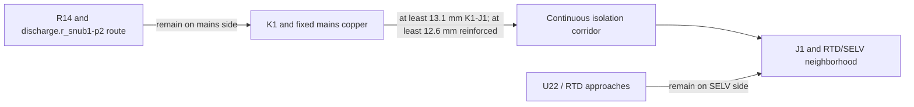
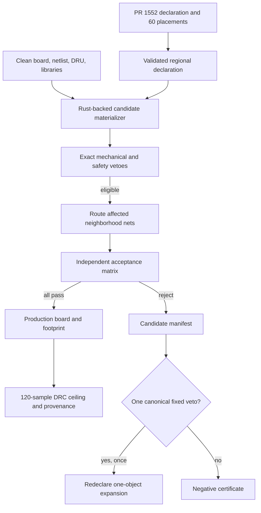
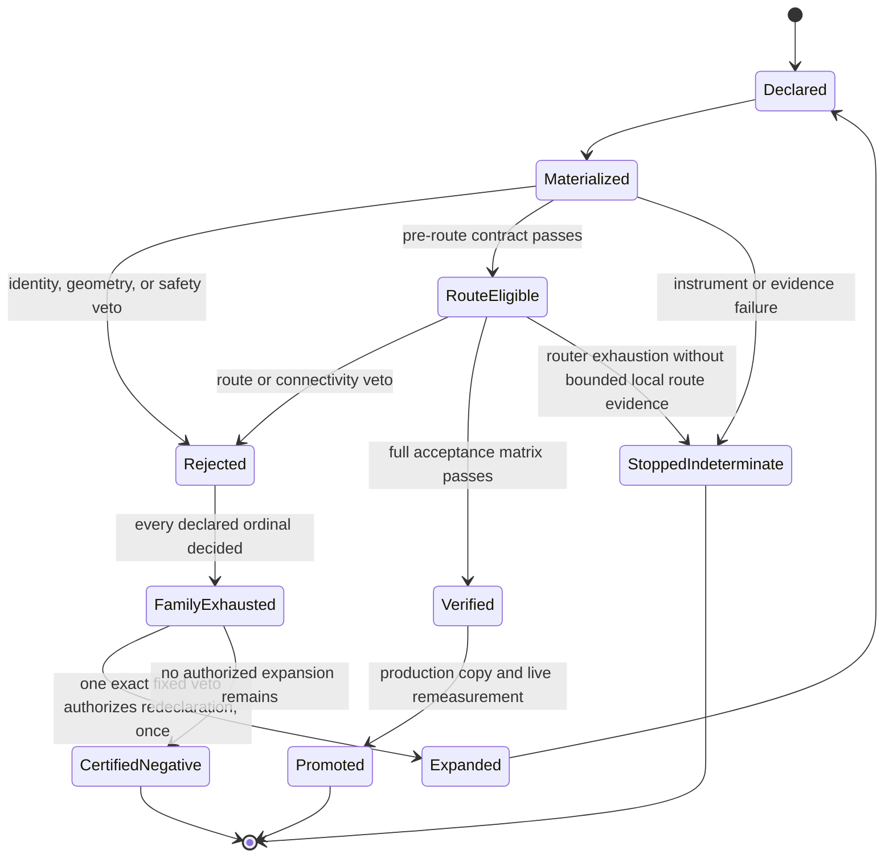

# R14 and High-Voltage Isolation Corridor Refloorplan - Plan

## Goal Capsule

- **Objective:** Produce a fabrication-reviewable Temper PCB neighborhood in which the K1 mains domain and the J1 RTD/SELV domain are separated by a complete local reinforced-isolation corridor without breaking the connector interface, local function, routing, or board mechanics.
- **Means:** Replace connector-only packing with a bounded corridor-first refloorplan that jointly owns R14, its local high-voltage route, J1, and the coupled RTD/UVLO neighborhood.
- **Product authority:** The compiled Atopile netlist owns electrical identity; the approved KiCad/JST footprint owns J1 geometry; `pcb/temper.kicad_pcb` owns the production layout; the repository's Rust-backed geometry, safety, connectivity, containment, and DRC gates own machine acceptance.
- **Open blockers:** None before planning. A missing enclosure model is handled by preserving the existing connector access envelope; any candidate that needs a different board-edge interface is outside this work.
- **Stop condition:** Graduate one candidate only if every requirement below passes. If the bounded families are exhausted first, leave the production board and DRC ceiling unchanged and publish a reproducible negative certificate naming the next fixed veto.

---

## Product Contract

### Summary

Establish the reinforced barrier as the organizing geometry, then place and route the coupled high-voltage and RTD/SELV objects around it. The work may expand beyond the initial neighborhood only when a measured failing object proves that expansion necessary.

### Problem Frame

The corrected K1-J1 local campaign evaluated all 60 mechanically valid placements from a declared 972-placement family. Every placement achieved the 13.1 mm nominal K1-J1 target, but all 60 failed full safety before routing because fixed R14/high-voltage copper and local functional spacing remained too close.

The limiting measurements were not the headline K1-J1 pair. J1-R14 remained at 10.3036..11.3831 mm, R14-U22 at 8.7136..9.2111 mm, and the fixed J1.4-to-`discharge.r_snub1-p2` In3.Cu corridor started at 10.152471950642665 mm. The board also has no continuous `MAINS_SELV_ISOLATION_BARRIER` implementation. A successful design therefore has to solve the domain boundary as a topology, not optimize one component pair.

### Key Decisions

- **Corridor-first authority** (session-settled: user-approved — chosen over moving only R14 and bending one trace: the prior failures span reinforced and functional relationships). Governs R1-R8.
- **Preserve the connector interface** (session-settled: user-approved — chosen over relocating J1 to another board edge: cable reach, insertion access, and enclosure authority are unresolved). Governs R9-R10.
- **Fail closed on production promotion** (session-settled: user-directed — chosen by the repeated instruction to perform professional PCB design and ship evidence: a partial geometric improvement is not a board result). Governs R11-R17.

### Requirements

**Declared authority and search boundary**

- R1. The first candidate family shall declare J1, R14, R45, R58, R66, SW1, U22, the complete net-41 In3.Cu `discharge.r_snub1-p2` segment chain from the fixed upstream endpoint at `(112, 218)` through its ordered tstamp set to blind via `80dc97ff-4224-5905-925a-d96851a93537` co-located with R14 pad 2, and the approach copper needed to reconnect moved neighborhood components as movable authority before any candidate is materialized.
- R2. K1, U8, the board outline, mounting features, unrelated footprints, and unrelated copper shall remain fixed in the first family.
- R3. A later family may add a component or route only after the current family identifies that exact object in a failing safety, mechanical, or connectivity signature; the expanded family shall be redeclared before mutation.
- R4. Each family shall be finite, deterministic, and bounded by predeclared placement-screen and routed-promotion budgets large enough to audit the evaluated space.

**Isolation and electrical correctness**

- R5. The accepted layout shall provide at least 13.1 mm nominal copper-edge distance between the K1 and J1 copper sets.
- R6. The accepted layout shall provide at least 12.6 mm reinforced separation across every affected mains-to-SELV pad, track, via, and zone relationship, including J1-R14, R14-U22, and the moved high-voltage route.
- R7. The accepted layout shall add no new safety signature and worsen no baseline safety signature, including functional creepage relationships among R54, R66, U22, and SW1.
- R8. Every moved component and rerouted net shall retain the compiled netlist's endpoint identity, complete connectivity, legal layer transitions, and suitable high-voltage trace width/current capacity.

**Mechanical and interface integrity**

- R9. The accepted layout shall add no F.Fab body or courtyard overlap, shall keep all copper and bodies contained by the board, and shall preserve mounting, keepout, and assembly access constraints.
- R10. J1 shall retain the present board-edge access direction, mating orientation, and insertion envelope unless repository-owned enclosure evidence proves an alternative interface equivalent.

**Promotion, measurement, and evidence**

- R11. Candidate boards shall be generated and measured in scratch space; `pcb/temper.kicad_pcb` shall change only by promoting the single best fully passing candidate.
- R12. A promoted candidate shall carry the approved J1 footprint geometry in every production authority that must remain consistent with the board.
- R13. The promotion decision shall use exact rotation-resolved geometry under KiCad's `R(-theta)` child transform and external-oracle-backed kernels where the repository provides them.
- R14. Before promotion, the candidate shall pass affected-scope connectivity, isolation, containment, body/courtyard, three-run set-based no-refill DRC comparison, and a paired scratch-only zone-refill safety comparison; the global known-red barrier finding shall remain an identical structured signature.
- R15. If the production board changes, the same PR shall remeasure `power_pcb_dataset/drc_ceiling.json` with the required live sample count, provenance, noise-headroom invariant, and attributed `_march` entry; any ceiling rise shall carry the required approval evidence.
- R16. A positive result shall preserve the declaration, candidate manifest, winning board identity, before/after safety and DRC signatures, visual-review record, and deterministic replay recipe.
- R17. A negative result shall preserve the declaration, complete evaluated coverage, rejection-signature set, candidate identities, and the terminal fixed veto when one canonical veto exists, while leaving the production board, footprint authority, and DRC ceiling byte-identical. Missing or indeterminate evidence shall produce a distinct stopped-indeterminate result, never a topology rejection or negative certificate.

### Actors

- A1. **PCB designer:** declares the topology, evaluates candidates, reviews routability and assembly access, and accepts or rejects promotion.
- A2. **Verification tooling:** supplies exact geometry, safety signatures, connectivity, containment, DRC, provenance, and reproducibility evidence.
- A3. **Fabrication reviewer:** can reproduce the selected result and determine whether the board is ready for enclosure-aware hardware review.

### Key Flows

- F1. Declare and screen the topology.
  - **Trigger:** The authoritative production baseline and prior negative certificate are frozen.
  - **Actors:** A1, A2
  - **Steps:** Declare movable and fixed authority; generate the finite family; reject mechanical and safety failures before routing.
  - **Outcome:** Only candidates eligible for routed promotion consume routing and DRC effort.
  - **Covers:** R1-R7, R9, R11, R13
- F2. Route and verify survivors.
  - **Trigger:** A placement passes the exact pre-route contract.
  - **Actors:** A1, A2
  - **Steps:** Reconnect every moved endpoint; evaluate complete copper signatures; run containment, connectivity, DRC, and visual review.
  - **Outcome:** Each routed survivor has a complete acceptance record rather than a pairwise distance score.
  - **Covers:** R6-R10, R13-R14
- F3. Promote or stop.
  - **Trigger:** The bounded routed family is exhausted or a fully passing candidate exists.
  - **Actors:** A1-A3
  - **Steps:** Promote and remeasure the board when all gates pass, or preserve a negative certificate without modifying production artifacts.
  - **Outcome:** The PR contains either one reviewable board improvement with current measurement authority or a durable topology result that narrows the next design step.
  - **Covers:** R11-R17

### Acceptance Examples

- AE1. A candidate clears K1-J1 but R14-U22 is 11.9 mm.
  - **Covers:** R5-R7, R11
  - **Given:** The candidate satisfies its target pair and mechanical screens.
  - **When:** Full affected safety signatures are evaluated.
  - **Then:** The candidate is rejected before production promotion.
- AE2. Every candidate is vetoed by the same fixed R54 relationship.
  - **Covers:** R3-R4, R17
  - **Given:** The declared family has been fully evaluated.
  - **When:** R54 is identified by exact failing signatures across the surviving set.
  - **Then:** A new bounded family may declare R54 movable, or the run stops with R54 named as the next topology boundary.
- AE3. One routed candidate passes every electrical and mechanical gate.
  - **Covers:** R8-R16
  - **Given:** The candidate has complete connectivity and no new or worsened safety signature.
  - **When:** DRC, provenance, visual, and interface review also pass.
  - **Then:** That candidate alone is promoted and the DRC ceiling is remeasured in the same PR.
- AE4. A promising candidate requires rotating J1 into a different cable approach.
  - **Covers:** R10-R11, R17
  - **Given:** No repository-owned enclosure evidence validates the new interface.
  - **When:** The candidate changes the connector insertion envelope.
  - **Then:** It is excluded from this work and recorded as a possible enclosure-led follow-up.

### Success Criteria

- One candidate satisfies R5-R16 and is ready for fabrication-review handoff, or the full declared family is preserved as a reproducible negative result under R17.
- Every reported distance identifies the exact object pair and geometry convention; every board comparison identifies the board content hash and tool state.
- A cold reviewer can replay the campaign without relying on `/tmp` artifacts or an agent transcript.

### Scope Boundaries

- No change to safety thresholds, net identity, electrical function, board outline, mounting locations, or mechanical keepouts is permitted to make a candidate pass.
- No new board slot, isolation cutout, connector family, or enclosure redesign is part of this work.
- No board-edge J1 relocation is active scope; that is the fallback only after enclosure and cable authority exist.
- This work does not claim the whole board's missing isolation barrier is solved unless the accepted copper and enforcement evidence demonstrates it.
- Component moves outside the declared family are not convenience edits; R3 is the only expansion path.

### Dependencies and Assumptions

- PR #1552's approved-footprint baseline, complete 60-candidate manifest, and negative certificate are the predecessor evidence and must be available on this branch or its PR dependency chain.
- The current connector access envelope is the best available enclosure proxy; preserving it is a load-bearing assumption, not proof of finished enclosure fit.
- Counts at a kicad-cli cap are saturation signals, and unexpected measurement regressions require instrument validation before design conclusions.
- The current production baseline is known-red for the absent continuous isolation-barrier keepout; acceptance uses exact candidate-versus-baseline signatures plus the explicit reinforced distances above.

### Sources

- `docs/evidence/2026-08-31-k1-j1-domain-refloorplan.md`
- `docs/evidence/k1-j1-domain-refloorplan-20260831/negative-certificate.md`
- `docs/solutions/architecture-patterns/dense-creepage-repair-is-neighborhood-topology.md`
- `docs/plans/2026-08-30-2314-fix-k1-j1-creepage-repair-plan.md`
- `scripts/check_isolation_keepout.py`
- `scripts/check_measurement_provenance.py`

---

## Planning Contract

**Product Contract preservation:** Restructured, no scope change: clarified that this work closes the complete local K1/J1/R14 corridor while preserving the board-wide missing-barrier finding as known-red evidence.

### Key Technical Decisions

- KTD1. **Make PR #1552 evidence part of this branch before measuring.** Pin commit `6b89c315468b658b26eb6b68abf1442964792537` and verify every recorded artifact hash before the new campaign uses the 60 predecessor placements. This satisfies the predecessor dependency without treating another worktree or a PR URL as durable input. Governs R1-R4, R16-R17.
- KTD2. **Use a local east-shifted dogleg corridor, not the global straight-corridor helper.** (session-settled: user-approved — chosen over relocating J1 to another board edge: the current connector interface remains the only available enclosure authority.) Seed the family from the predecessor's 60 geometry-valid placements and pair each with four declared R14/high-voltage-route templates shifted 4.0, 4.5, 5.0, and 5.5 mm east. The existing global corridor helper remains unchanged because it requires the complete HV/SELV partition and cannot represent this local L-shaped boundary. Governs R1-R6, R9-R10.
- KTD3. **Keep semantic mutation and verdict ownership in Rust.** Add a validated route-replacement primitive to `temper-design-bundle` and extend the Rust regional oracle with deterministic declaration and candidate identity. Python only stages KiCad sidecars, asks Rust to materialize declared mutations, invokes existing instruments, and serializes returned evidence. Exact-veto expansion state is added only by the conditional U3E unit after the first family proves it has a current consumer. Governs R3-R4, R8, R11-R13, R16-R17.
- KTD4. **Use independent vetoes rather than one aggregate score.** `evaluate_regional_layout.py` remains an additional Pareto guard. Acceptance separately records the IEC matrix, direct pad/track/via/zone copper relationships, full-net connectivity, courtyard and F.Fab geometry, containment, netlist reconciliation, no-refill DRC signature sets, a paired scratch-only KiCad zone-refill safety probe, and connector-interface invariants. The existing no-refill protocol remains the DRC-ceiling authority; the refill probe is an additional hard promotion veto. Governs R5-R10, R13-R14.
- KTD5. **Authorize and execute at most one exact-veto expansion.** A first family contains 240 declared candidates and promotes at most eight routed survivors. If the completed family has one canonical fixed-object veto, conditional U3E may add only that object with the `2/5/10/20 mm` displacement ladder from `constraint_restoration_campaign.py`; U3 and U4 then execute that second declaration through the same screen, route, replay, and receipt contract before U5 can close the campaign. Timeout, unknown, cap, aggregate-count drift, router exhaustion, or instrument error cannot expand scope. Governs R3-R4, R11, R17.
- KTD6. **Treat promotion as a content-addressed state transition.** A scratch candidate becomes eligible only when its declaration ordinal, board hash, fixed-object hash, affected-object diff, project sidecars, tool versions, and all veto receipts agree. A positive transition copies one board and the approved J1 library footprint into production before same-PR DRC remeasurement; a negative transition copies evidence only. Governs R11-R17.

### High-Level Technical Design

This design is directional. Exact coordinates remain owned by the committed declaration and Rust-validated route templates.

Every candidate moves through a closed lifecycle. No later stage may infer that an earlier veto was satisfied.

### Implementation Constraints

- The first-family declaration owns the 60 predecessor placement rows, four east-shift templates, 240 deterministic ordinals, a 240-placement screen budget, and an eight-candidate routed-promotion budget.
- Each route template keeps net 41's upstream In3.Cu endpoint at `(112, 218)` fixed, moves R14 and blind via `80dc97ff-4224-5905-925a-d96851a93537` co-located with pad 2 by the same eastward delta, and replaces the complete ordered declared segment/via chain by tstamp identity.
- The approved J1 footprint remains at 180 degrees and uses only predecessor positions that preserve its mating access vector. Non-quadrant footprint rotations fail closed.
- The fixed-object hash covers K1, U8, the board outline, mounting features, unrelated footprints, unrelated segments, unrelated vias, and zones.
- An exact expansion veto is a canonical safety pair/item first, then a connectivity or mechanical identity. A recognized displacement-assumption core may authorize the same object. Solver status or an aggregate count alone never does.
- DRC comparison uses three paired baseline/candidate no-refill runs and normalized signatures keyed by rule, nets, and items. Counts at 199 or 499 are tool errors. Indeterminate declared-noise categories receive ten paired runs before rejection or acceptance. A separate paired scratch copy is refilled with KiCad's zone filler and compared by normalized safety signatures; immutable zone declarations and generated fill geometry receive separate hashes.
- `check_isolation_keepout.py` is compared as a structured signature. The only permitted global result is the byte-for-byte-equivalent absent `MAINS_SELV_ISOLATION_BARRIER` finding; this local work does not claim global closure.
- Production promotion is conditional. An unchanged board requires no DRC ceiling edit; a changed board requires the full same-PR 120-sample measurement contract.

### Assumptions

- The four 4.0..5.5 mm east shifts are the smallest declared corridor expansion that can cover the predecessor's R14-U22 deficit while retaining the current J1 access envelope. Exact geometry remains a veto, so this bet cannot force acceptance.
- One expansion family is enough to learn whether the next boundary is still local. A second distinct veto ends this run with evidence instead of growing into an undeclared board-wide move.
- Selective affected-net routing is implemented only if U3 produces a survivor. The router receives an explicit affected-net-name set through topology and Stage 4, removes only declared old copper on those nets, treats all retained copper as obstacles, and proves unrelated copper byte-identical. An automated-router timeout is insufficient evidence; the highest-ranked timed-out survivor receives one bounded local/manual routing attempt, and absence of a complete route after that attempt produces `StoppedIndeterminate`, not a topology veto.
- Positive local promotion may coexist with the unchanged global missing-barrier finding because R14 and the Scope Boundaries explicitly forbid a whole-board closure claim.

### Sequencing

U1 makes the predecessor evidence and baseline reproducible. U2 establishes the Rust-owned first-family mutation and campaign contracts. U3 executes the placement and pre-route study. If and only if U3 proves one canonical fixed-object veto, U3E adds the one bounded expansion contract and returns that family to U3. U4 routes and fully verifies eligible candidates from each executed family. U5 promotes and remeasures a winner, freezes a complete negative certificate, or records a stopped-indeterminate result. U6 documents the result as a durable learning.

### Risks and Mitigations

- **Local/global ambiguity:** A local success could be misreported as board-wide isolation closure. Preserve the global structured finding and use “local corridor” in every verdict.
- **Track mutation drift:** Replacing only visible coordinates can leave an orphan segment or move unrelated copper. Bind the old chain by net, tstamp set, fixed endpoint, and input hash before Rust emits a candidate.
- **Parser rotation risk:** Repository parsers have historically agreed on the wrong transform. Verify the imported geometry owners against the pcbnew pad-world oracle before reporting distances.
- **Routing-cost risk:** Full routing is expensive. Spend it only on at most eight candidates that already pass every pre-route veto, and use timeouts above the measured 1193-second production case.
- **Measurement-instrument risk:** Stale extensions, missing DRU/library context, capped counts, or run-to-run noise can manufacture a verdict. Run freshness and setup checks immediately before every reported campaign stage.
- **Stacked-PR risk:** The predecessor may merge or change while this branch is active. Pin its content hashes and let the final PR diff collapse naturally after #1552 merges; do not silently regenerate its evidence.

---

## Implementation Units

### U1. Predecessor evidence and clean campaign baseline

- **Goal:** Make the prior 60-placement result and the new authoritative baseline independently available on this branch.
- **Requirements:** R1-R4, R11, R13, R16-R17; F1
- **Dependencies:** None
- **Files:**
  - `docs/evidence/2026-08-31-k1-j1-domain-refloorplan.md`
  - `docs/evidence/k1-j1-domain-refloorplan-20260831/`
  - `docs/evidence/k1-j1-domain-refloorplan-20260831/approved-j1-footprint.kicad_mod`
  - `pcb/temper.kicad_pcb`
  - `pcb/libs/Connector_JST.pretty/JST_XH_B4B-XH-A_1x04_P2.50mm_Vertical.kicad_mod`
- **Approach:** Integrate the exact predecessor commit, verify its artifact hashes, derive a canonical scratch `.kicad_mod` from the predecessor-approved J1 block, record its SHA-256 in the declaration, regenerate the netlist and DRU, stage a clean scratch KiCad project with its library table, and record baseline board, fixed-object, footprint, netlist, tool, and extension identities. Verify pads, F.Fab, F.CrtYd, and model fields between the canonical footprint and every embedded candidate footprint. The production board remains untouched.
- **Execution note:** Characterize the clean baseline before authoring any mutation path.
- **Test scenarios:**
  - Recompute every hash listed in the predecessor README and reject any missing or drifted artifact.
  - Rebuild the approved J1 scratch baseline, match its recorded board and canonical-footprint hashes, and reject any semantic field mismatch between the library and embedded forms.
  - Confirm the scratch directory includes the matching project, DRU, `fp-lib-table`, and footprint libraries and does not produce the 168/0 library-resolution signature.
  - Run the pcbnew rotation oracle and extension-freshness gate immediately before recording the baseline.
- **Verification:** The predecessor replay, netlist reconciliation, generated-artifact checks, and three baseline DRC runs reproduce or stop with an instrument error.

### U2. Rust-owned regional declaration and route mutation

- **Goal:** Make invalid first-family declarations, partial route replacements, and stale identities unrepresentable at the Python boundary.
- **Requirements:** R1-R4, R8, R11-R13, R16-R17; AE2
- **Dependencies:** U1
- **Files:**
  - `packages/temper-design-bundle/src/sexpr_writer.rs`
  - `packages/temper-design-bundle/src/lib.rs`
  - `packages/temper-design-bundle/src/wasm_test_registry.rs`
  - `packages/temper-quality-oracle/src/regional_feasibility.rs`
  - `packages/temper-quality-oracle/src/lib.rs`
  - `packages/temper-quality-oracle/src/wasm_test_registry.rs`
  - `packages/temper-design-bundle/tests/temper_bundle.rs`
  - `packages/temper-placer/tests/io/test_sexpr_writer_oracle_differential.py`
  - `packages/temper-placer/tests/rust_integration/test_quality_oracle.py`
- **Approach:** Add private-field Rust types for the first-family declaration identity, candidate ordinal, route-chain identity, fixed endpoint, and east-shift template. Extend the design-bundle writer with one atomic operation that validates and replaces the declared segment/via chain while moving R14 in the same output. Expose thin pyo3 functions once, then keep Python free of route arithmetic and acceptance policy. Do not add terminal-veto or expansion state until U3E has evidence that it is needed.
- **Execution note:** Add focused failing Rust and imported-extension tests before exposing the writer to the campaign runner.
- **Test scenarios:**
  - Accept a synthetic net-41 chain only when every declared tstamp, net, layer, width, fixed endpoint, and moved endpoint matches.
  - Reject a missing, duplicate, unrelated, or stale segment/via identity before returning modified board text.
  - Preserve every byte outside the declared footprint and route nodes, including zones and unrelated copper.
  - Generate the same 240 candidate IDs regardless of input-map order and reject a declaration whose cardinality exceeds its budget.
  - Import the rebuilt pyo3 modules and prove each new symbol is registered once and calls the Rust owner.
- **Verification:** Rust unit/WASM tests and Python boundary tests prove atomic mutation, deterministic identity, and absence of duplicate registration.

### U3. Bounded R14/high-voltage pre-route campaign

- **Goal:** Exhaust the declared local placement family and identify every candidate eligible for routing.
- **Requirements:** R1-R7, R9-R11, R13, R16-R17; F1; AE1-AE2, AE4
- **Dependencies:** U1-U2
- **Files:**
  - `docs/evidence/r14-hv-domain-refloorplan-20260831/README.md`
  - `docs/evidence/r14-hv-domain-refloorplan-20260831/declaration.json`
  - `docs/evidence/r14-hv-domain-refloorplan-20260831/run_campaign.py`
  - `docs/evidence/r14-hv-domain-refloorplan-20260831/pre-route-manifest.json`
- **Approach:** Load the predecessor's 60 placement rows, declare four paired R14/route shifts, ask Rust for the 240 deterministic ordinals, and materialize each board in a complete scratch project. Evaluate exact K1-J1 and mains-SELV geometry, IEC safety signatures, F.Fab and courtyard polygons, containment, the J1 interface invariant, and the fixed-object hash before ranking up to eight survivors. If U3E authorizes a second family, execute its declared ordinals through this same unit and keep first- and second-family coverage receipts distinct.
- **Execution note:** Treat declaration and candidate identity tests as the red evidence before running the production-board campaign.
- **Test scenarios:**
  - Materialize all 240 ordinals exactly once and match a replayed candidate's content hash on a second run.
  - Reject any candidate below 13.1 mm K1-J1 or 12.6 mm affected reinforced separation even if aggregate violation counts improve.
  - Reject a new or worsened R54/R66/U22/SW1 functional signature, body/courtyard overlap, containment error, interface change, or fixed-object drift.
  - Record missing F.Fab/courtyard coverage, stale extensions, wrong rotation oracle, empty denominator, or malformed scratch context as insufficient evidence rather than a topology result.
  - If all candidates share one canonical fixed veto, emit one expansion declaration; otherwise terminate without changing production artifacts.
- **Verification:** The committed declaration cardinality, pre-route manifest, candidate hashes, rejection signatures, and survivor list replay deterministically from a clean checkout.

### U3E. Conditional exact-veto expansion contract

- **Goal:** Add and execute one bounded expansion only when the completed first family proves one canonical fixed-object veto.
- **Requirements:** R3-R4, R11, R17; AE2
- **Dependencies:** U3; invoked only when U3's complete receipt authorizes it
- **Files:**
  - `packages/temper-quality-oracle/src/regional_feasibility.rs`
  - `packages/temper-quality-oracle/src/lib.rs`
  - `packages/temper-quality-oracle/src/wasm_test_registry.rs`
  - `packages/temper-placer/tests/rust_integration/test_quality_oracle.py`
  - `docs/evidence/r14-hv-domain-refloorplan-20260831/declaration.json`
- **Approach:** Add the Rust-owned terminal-veto and expansion-state types only after U3 supplies a complete first-family manifest with one canonical exact failing object. Accept that one object with the existing `2/5/10/20 mm` displacement ladder, reject timeout, unknown, capped output, aggregate drift, instrument failure, mixed vetoes, and any second expansion, then return the new deterministic declaration to U3 and U4 for full execution.
- **Test scenarios:**
  - Authorize exactly one expansion from one canonical exact veto backed by complete family coverage.
  - Reject missing coverage, mixed fixed vetoes, tool-status labels, aggregate counts, and a second authorization.
  - Replay every expanded ordinal and require the same screen, route, receipt, and candidate-identity contract as the first family.
- **Verification:** The conditional Rust/Python boundary tests and second-family receipts prove that expansion was evidence-triggered, bounded, executed, and never inferred from tool uncertainty.

### U4. Routed survivor and complete acceptance campaign

- **Goal:** Reconnect eligible candidates and determine whether one satisfies the complete local promotion contract.
- **Requirements:** R6-R11, R13-R14, R16-R17; F2; AE1, AE3-AE4
- **Dependencies:** U3
- **Files:**
  - `docs/evidence/r14-hv-domain-refloorplan-20260831/run_routed_promotions.py`
  - `docs/evidence/r14-hv-domain-refloorplan-20260831/routed-manifest.json`
  - `scripts/evaluate_regional_layout.py`
  - `packages/temper-placer/src/temper_placer/router_v6/_adapter_convert.py`
  - `packages/temper-placer/src/temper_placer/router_v6/_pipeline_core.py`
  - `packages/temper-placer/src/temper_placer/router_v6/_pipeline_route.py`
  - `packages/temper-placer/src/temper_placer/router_v6/pad_connectivity_audit.py`
- **Approach:** If U3 produces survivors, add an explicit affected-net-name filter through the router adapter, topology stage, and Stage 4 fallback. Remove only declaration-owned old copper on those nets, retain every unrelated segment/via/zone byte-for-byte, and treat retained copper as routing obstacles. Route at most eight survivors per executed family in deterministic rank order while preserving the declared high-voltage chain. Verify actual candidate files with independent owners: exhaustive IEC signatures, raw pad/track/via/zone distances, full-net connectivity and fake-completion detection, netlist reconciliation, F.Fab/courtyard geometry, containment, regional Pareto verdict, paired no-refill DRC signature sets, and a paired scratch-only KiCad zone-refill safety probe. Export local F.Cu/In3.Cu/In4.Cu/B.Cu/F.Fab/F.CrtYd/Edge.Cuts views for human review.
- **Execution note:** Use full-chain candidate files as integration evidence; coordinate-only tests are insufficient.
- **Test scenarios:**
  - Accept connectivity only when every moved pad is connected to its intended net and no pre-existing connected pad loses an endpoint.
  - Reject a new routed copper relationship, fake completion, width/layer error, new short, clearance rise, or unresolved DRC-noise signature.
  - Reject 199/499 caps, the 168/0 library signature, missing sidecars, stale extensions, and three-run set disagreement outside declared noise handling.
  - Reject a candidate whose refilled-zone signature adds or worsens any safety, short, or connectivity relationship even when its no-refill DRC result passes.
  - Treat automated-router exhaustion as insufficient evidence; attempt one bounded local/manual route on the highest-ranked timed-out survivor, then stop indeterminate if no complete route evidence exists.
  - Preserve the global missing-barrier signature exactly and reject any additional layer intrusion or changed boundary finding.
  - Require the visual record to show an unobstructed local corridor, correct R14 orientation, legal vias, J1 mating access, and assembly clearance.
- **Verification:** Each routed record contains pre-fill board hash, immutable-zone hash, normalized gate receipts, three-run or ten-run no-refill DRC sets, post-fill safety receipt, connectivity results, unrelated-copper byte comparison, exported views, and a final accepted, rejected, or stopped-indeterminate verdict.

### U5. Conditional promotion or negative certificate

- **Goal:** Publish one reviewable production candidate or a complete bounded-family rejection without laundering an unsafe partial result.
- **Requirements:** R11-R17; F3; AE2-AE4
- **Dependencies:** U4
- **Files:**
  - `pcb/temper.kicad_pcb`
  - `pcb/libs/Connector_JST.pretty/JST_XH_B4B-XH-A_1x04_P2.50mm_Vertical.kicad_mod`
  - `power_pcb_dataset/drc_ceiling.json`
  - `docs/evidence/2026-08-31-r14-hv-domain-refloorplan.md`
  - `docs/evidence/r14-hv-domain-refloorplan-20260831/negative-certificate.md`
- **Approach:** If one candidate passes U4, copy only that content-addressed board and the exact hashed canonical J1 footprint into production, verify the promoted embedded footprint against it, then run the required 120-sample live DRC campaign and provenance/approval gates. If every executed family is conclusively rejected, keep all three production artifacts byte-identical and write a negative certificate bounded to those exact declarations. If any required evidence is missing or indeterminate, keep the production artifacts byte-identical and write a stopped-indeterminate receipt instead of a negative certificate.
- **Test scenarios:**
  - Positive path: reproduce the winning scratch hash after promotion and verify board, footprint, netlist, DRC ceiling, provenance, `_march`, and any approval trailer are mutually consistent.
  - Negative path: prove the board, J1 library footprint, and DRC ceiling hashes match the pre-work baseline while the certificate covers every declared ordinal.
  - Indeterminate path: prove the same three production hashes remain unchanged and state which missing receipt prevented either promotion or a topology conclusion.
  - Reject a ceiling raise without measured-live provenance, 120 samples, noise headroom, attributed per-type delta, and `Ceiling-Approval:` commit evidence.
  - Reject a negative claim that generalizes beyond the declared templates, optional one-object expansion, or measured tool state.
- **Verification:** Positive and negative branches are mutually exclusive and satisfy the corresponding R16 or R17 evidence contract.

### U6. Durable PCB learning and review handoff

- **Goal:** Make the topology outcome reusable by the next PCB designer and independently reviewable in the PR.
- **Requirements:** R16-R17; A1-A3; F3
- **Dependencies:** U5
- **Files:**
  - `docs/solutions/architecture-patterns/dense-creepage-repair-is-neighborhood-topology.md`
  - `docs/evidence/2026-08-31-r14-hv-domain-refloorplan.md`
  - `CONCEPTS.md`
- **Approach:** Update the existing neighborhood-topology learning with the measured R14/route outcome and the exact next boundary. Keep evidence identities in the evidence document, reusable rules in the solution, and glossary changes only for genuinely new domain terms.
- **Test scenarios:**
  - Cross-check every numeric claim and hash against the committed manifests rather than transcript or `/tmp` output.
  - Ensure a positive result says local corridor, not board-wide isolation closure.
  - Ensure a negative result names the exact exhausted family and next fixed veto without claiming physical impossibility.
  - Confirm all markdown links and replay paths resolve inside the repository.
- **Verification:** Compound documentation, code review, generated-artifact checks, and the final PR diff agree on the same verdict and production-artifact state.

---

## Verification Contract

| Applies to | Command or review | Done signal |
|---|---|---|
| U1-U5 | `env -u CONDA_PREFIX make extensions-check` immediately before each reported measurement | All 10 pyo3 extensions are fresh and importable. |
| U1 | `make netlist && .venv/bin/python scripts/generate_kicad_dru.py` | Netlist and scratch DRU are current before baseline measurement. |
| U1-U2 | `.venv/bin/python scripts/check_pad_world_position_oracle.py --verify-live-oracle` | Asymmetric pcbnew probes and every registered implementation agree on `R(-theta)`. |
| U2 | `PYO3_PYTHON="$(pwd)/.venv/bin/python" cargo test --manifest-path packages/temper-design-bundle/Cargo.toml --features python && PYO3_PYTHON="$(pwd)/.venv/bin/python" cargo test --manifest-path packages/temper-quality-oracle/Cargo.toml --features python`, followed by `env -u CONDA_PREFIX make extensions && make extensions-check` | New Rust contracts pass and the release pyo3 artifacts remain loadable. |
| U2 | `.venv/bin/pytest packages/temper-placer/tests/io/test_sexpr_writer_oracle_differential.py packages/temper-placer/tests/rust_integration/test_quality_oracle.py` | Imported bindings execute Rust owners and reject mutation/registration faults. |
| U3E, when invoked | `PYO3_PYTHON="$(pwd)/.venv/bin/python" cargo test --manifest-path packages/temper-quality-oracle/Cargo.toml --features python`, followed by `env -u CONDA_PREFIX make extensions && make extensions-check` and the focused quality-oracle Python boundary tests | Exact-veto expansion is Rust-owned, evidence-triggered, and the rebuilt extension is current. |
| U3 | `.venv/bin/python docs/evidence/r14-hv-domain-refloorplan-20260831/run_campaign.py --replay` | All declared ordinals and semantic manifests reproduce. |
| U3-U4 | `.venv/bin/python scripts/check_board_containment.py --board <candidate>` and `.venv/bin/python scripts/check_netlist_board_reconciliation.py --board <candidate>` | Each promoted candidate passes containment and netlist identity. |
| U4 | `.venv/bin/python scripts/evaluate_regional_layout.py --baseline <baseline> --candidate <candidate> --min-creepage-mm 12.6 --endpoint-tolerance-mm 0.01 --json <receipt>` | Regional Pareto guard accepts with no instrument error. |
| U4 | `kicad-cli pcb export svg --layers F.Cu,In3.Cu,In4.Cu,B.Cu,F.Fab,F.CrtYd,Edge.Cuts --exclude-drawing-sheet <candidate>` | Human review confirms local barrier, route, via, connector, and assembly geometry. |
| U4 | Three paired `_drc_api.run_drc()` runs, extended to ten for unresolved declared noise | Normalized candidate signature sets add no unresolved affected finding and no hard-veto rule rises. |
| U4 | Three paired scratch `kicad-cli pcb drc --all-track-errors --refill-zones --format json` runs under `_single_threaded_kicad_env()` | Refilled candidate copper adds or worsens no normalized safety, short, or connectivity signature relative to a paired refilled baseline; no filled file is promoted or used as the ceiling basis. |
| U5 positive | 120 live `_drc_api.run_drc()` samples plus `.venv/bin/python scripts/ci_check_drc.py --backend kicad-cli` | Candidate ceiling satisfies provenance, sample count, and noise-headroom invariants. |
| U5 positive | `.venv/bin/python scripts/check_measurement_provenance.py` and `.venv/bin/python scripts/check_drc_ceiling_approval.py` | Board hash, measurement identity, `_march`, and any raise approval pass. |
| U5 negative | SHA-256 comparison of production board, J1 footprint, and DRC ceiling against U1 | All production authorities remain byte-identical. |
| U6 | `uv run python scripts/import_linter_gate.py && make regen && make regen-check` | Import boundaries and generated artifacts are clean. |
| U1-U6 | Relevant focused pytest/Rust tests, then the repository's changed-surface test suite | No changed-surface regression remains. |

---

## Definition of Done

- U1-U6 are complete in dependency order, U3E is complete if invoked, and every applicable Verification Contract row has a durable receipt.
- The predecessor evidence is committed on this branch or present through a merged base; no source path points to another worktree or `/tmp`.
- The first 240-candidate declaration is complete. Any second family proves its single exact expansion authority and remains within KTD5.
- Every reported distance identifies exact objects and uses verified `R(-theta)` geometry. Every DRC claim uses configured libraries, uncapped output, and normalized sets.
- A positive result promotes exactly one fully accepted candidate, updates the approved J1 footprint, and remeasures the DRC ceiling in the same PR.
- A negative result leaves the board, J1 footprint, and DRC ceiling byte-identical and commits the complete negative certificate. An instrument or routing uncertainty instead commits a stopped-indeterminate receipt and makes no topology claim.
- The evidence narrative, replay bundle, compound solution, review findings, and PR description state the same bounded verdict.
- Abandoned candidate generators, scratch boards, dead-end route templates, and temporary debugging code are absent from the final diff.
- The branch is reviewed, committed, pushed, and attached to an open PR with all markdown evidence files included.
