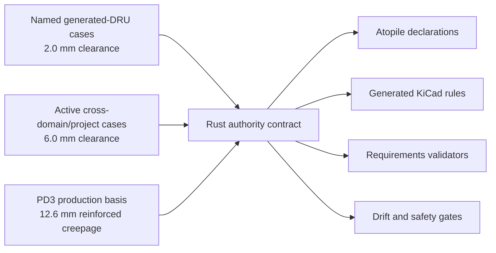
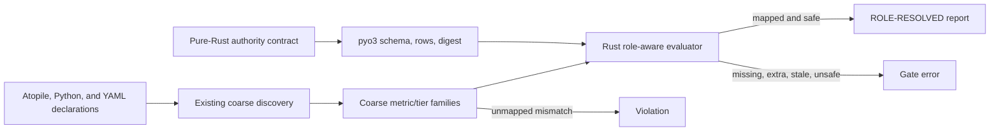

# Reinforced Isolation Authority and Net-41 Topology - Plan

## Goal Capsule

- **Objective:** Give Temper one reviewable isolation contract that distinguishes standards-derived minima, conservative design targets, fabrication checks, and production creepage requirements, then use that contract to define the next complete J1/net-41 topology campaign.
- **Means:** Replace coarse same-tier equality with role-aware, fail-closed authority checks and declare a whole-corridor topology family after the R14 east-shift family produced no pre-route survivor and stopped indeterminate.
- **Product authority:** Rust owns machine-readable safety semantics; compiled Atopile and generated KiCad rules own electrical and fabrication projections; current repository evidence owns the provisional numeric derivation; a qualified appliance-safety reviewer with access to the current IEC text owns final conformance approval.
- **Open blockers:** Licensed review of IEC 60335-1:2020+A1:2025 and IEC 60335-2-6:2024 is required before any threshold is reduced or final compliance is claimed. That review does not block this no-number-change authority repair or the next topology declaration.

## Product Contract

### Summary

Model isolation values by physical metric, boundary, authority role, and environmental basis instead of treating every value with the same insulation-tier label as interchangeable. Keep all live safety values unchanged, fail on unsafe movement, and declare a new net-41 In3.Cu corridor campaign rather than implicitly expanding the stopped-indeterminate R14 family.

### Problem Frame

Temper currently carries 2.0 mm and 6.0 mm clearance values under the same coarse `reinforced` label even though repository evidence assigns them different jobs. The 2.0 mm value is the current generated-DRU rule for named HV/LV and same-side cases under a 120 V/OVC-II derivation, while 6.0 mm remains an active cross-domain requirement and conservative project value in other surfaces. The drift gate groups only by metric and tier, so it reports the known disagreement without representing that distinction.

The production creepage authority is clearer: the as-built forced-air product remains PD3 and requires 12.6 mm reinforced creepage. The predecessor screened all 240 declared combinations of 60 placements and four R14 east shifts, found no pre-route survivor, and terminated `stopped-indeterminate` because live pcbnew verification was unavailable and a baseline DRC category was capped. Its common measured veto was the already-movable J1 against the already-declared net-41 corridor. That result authorizes a separately declared `new-design-hypothesis`; it does not claim global or even east-shift-family infeasibility.

### Key Decisions

- **Preserve every current numeric enforcement point in the authority repair** (session-settled: user-approved — chosen over synchronizing all declarations to 2.0 mm or 6.0 mm: the present disagreement is semantic and the current-edition standard text has not been independently reviewed). Governs R1-R5.
- **Make semantic safety authority Rust-owned** (session-settled: user-approved — chosen over adding another Python source of truth: the repository is migrating domain logic to Rust). Governs R6-R9.
- **Declare a complete corridor family next** (session-settled: user-approved — chosen over another R14-only shift: all 240 screened predecessors had the J1-to-net-41 pre-route veto, while the terminal campaign remained `stopped-indeterminate`). Governs R10-R16.

### Requirements

**Isolation authority**

- R1. The authority model shall distinguish clearance from creepage and shall identify the electrical boundary, insulation purpose, environmental basis, and authority role for every governed value.
- R2. The authority repair shall preserve the live 2.0 mm, 6.0 mm, and 12.6 mm values at their current enforcement points; changing a number requires a separate attributed safety decision.
- R3. The model shall register a provisional 2.0 mm standards-minimum authority row for the named 120 V/OVC-II HV/LV and same-side cases; map `classes.HighVoltage.clearance` to the 2.0 mm fabrication-check projection of that row; map `HV_to_LV.min_clearance` to the 6.0 mm conservative design target and `classes.HighVoltageIsolated.clearance` to its 6.0 mm fabrication-check projection; and identify 12.6 mm as the enforced PD3 production reinforced-creepage requirement.
- R4. No repository artifact may claim final conformance to the current IEC 60335 editions until a qualified reviewer verifies the applicable current-edition clauses and national deviations.
- R5. The PD2 8.0 mm reinforced-creepage fallback shall remain non-production and shall fail if it reappears as the as-built production authority.
- R5a. Every provisional contract row shall carry a machine-readable current-edition-review-required status, reviewer authority, and source limitation. The drift gate shall print a persistent, non-suppressible review-required diagnostic until an attributed qualified-review decision replaces that status; a role-resolved pass shall never imply final conformance.

**Machine enforcement**

- R6. Rust shall own the typed authority contract and any compatibility logic; Python may parse external files, call Rust, and render diagnostics but shall not independently decide safety equivalence.
- R7. The drift gate shall retain coarse discovery and reporting, then let the role-aware contract adjudicate the mapped reinforced-clearance family without adding another `ACCEPTED_DRIFT` entry.
- R8. A conservative project value may exceed a standards-derived minimum, but a fabrication or production constraint below its applicable minimum shall fail closed.
- R9. The gate shall require an explicit mapping for every declaration in the governed reinforced-clearance family, report its role and source, and reject unknown values, unsafe directional movement, missing or stale mappings, missing required projections, stale accepted sets, and any role-aware result that loses coarse-gate coverage.

**Next J1/net-41 topology declaration**

- R10. The next campaign shall declare J1, R14, the complete production-board net-41 `discharge.r_snub1-p2` copper graph, its layer transitions, and the affected SELV denominator as one machine-validated topology authority.
- R11. The first family shall explore a net-41 corridor redesign on the existing In3.Cu routing layer while preserving K1, U8, the board outline, mounting features, connector mating orientation, net identity, endpoint connectivity, current capacity, and unrelated copper.
- R12. Candidate acceptance shall use the current 6.0 mm conservative clearance floor and 12.6 mm PD3 reinforced-creepage requirement across every affected pad, track, via, and zone relationship.
- R13. The family shall be finite, deterministic, content-addressed, bound to a PCB design-basis authorization and an exact survivor-ranking rule, and evaluated by independent mechanical, connectivity, containment, safety-signature, and DRC vetoes before any production-board promotion.
- R14. An enclosure-led J1 relocation, a new-layer or new-via-span route family, and a manufacturing-approved isolation slot shall remain separate future families unless their missing enclosure, stackup, fabrication, and safety authority is supplied before declaration.
- R15. Exhaustion, partial execution, instrument failure, measurement indeterminacy, or a tool cap shall leave the production board unchanged and shall never be reported as global topology infeasibility.
- R16. The declaration shall retain the raw per-candidate clearance, creepage, mechanical, and route-length measurements plus every veto's value, authority role, and source, so a later qualified authority change can re-adjudicate recorded candidates without rerunning geometry.

### Actors

- A1. **PCB designer:** owns topology declarations, electrical feasibility, route current capacity, assembly access, and promotion judgment.
- A2. **Safety authority tooling:** preserves typed requirements and fails closed when a declaration is missing, incomparable, or unsafe.
- A3. **Qualified safety reviewer:** approves current-edition standards applicability and any future numeric change.
- A4. **Fabrication and enclosure reviewers:** authorize slots, connector-access changes, and mechanical assumptions before those enter a family.

### Key Flows

- F1. Classify and reconcile isolation declarations.
  - **Trigger:** A safety declaration is added, changed, or scanned by the drift gate.
  - **Actors:** A2
  - **Steps:** Resolve its metric, boundary, basis, purpose, and role; compare it with the applicable typed contract; render its relationship to other projections.
  - **Outcome:** Equivalent declarations agree, conservative declarations are directionally safe, and ambiguous or unsafe declarations fail.
  - **Covers:** R1-R9
- F2. Review a future numeric change.
  - **Trigger:** A contributor proposes to move 2.0 mm, 6.0 mm, 8.0 mm, or 12.6 mm.
  - **Actors:** A1-A3
  - **Steps:** Bind the proposal to current standards text and product conditions; record the derivation and reviewer authority; update the Rust contract and all projections together.
  - **Outcome:** No number changes through drift cleanup or compatibility code.
  - **Covers:** R2-R5, R8-R9
- F3. Execute the next topology family.
  - **Trigger:** The authority gate is green and the prior 240-candidate receipt is verified.
  - **Actors:** A1-A2, with A4 only if scope expands
  - **Steps:** Declare the complete corridor; screen bounded candidates; route survivors; independently verify safety, connectivity, mechanics, and DRC; promote one passing candidate or preserve a terminal receipt.
  - **Outcome:** The repository gains either one fabrication-reviewable improvement or a reproducible result that names the next authorized design boundary.
  - **Covers:** R10-R16

### Acceptance Examples

- AE1. A new 2.0 mm HV-to-LV fabrication rule is scanned next to a 6.0 mm conservative validator target.
  - **Covers R1-R3, R7-R9.**
  - **Given:** Both declarations carry distinct registered roles for the same boundary.
  - **When:** The authority gate compares them.
  - **Then:** It reports the reviewed role relationship and passes because the conservative target is not below the applicable minimum.
- AE2. A contributor changes production reinforced creepage from 12.6 mm to 8.0 mm.
  - **Covers R2, R5, R8-R9.**
  - **Given:** The as-built product remains on the PD3 basis.
  - **When:** The authority gate evaluates the changed declaration.
  - **Then:** It fails closed and identifies the production-basis mismatch.
- AE3. A layer/corridor candidate clears J1-to-net-41 but creates an 11.9 mm J1-to-zone relationship.
  - **Covers R10-R13.**
  - **Given:** The candidate passes placement and connectivity checks.
  - **When:** Complete affected copper is measured.
  - **Then:** The candidate is rejected before production promotion.
- AE4. A promising candidate requires an isolation slot.
  - **Covers R13-R15.**
  - **Given:** No fabrication authority defines slot dimensions, tolerances, or acceptance.
  - **When:** The candidate attempts to count the slot toward creepage.
  - **Then:** It is excluded and recorded as a separately authorized future family.
- AE5. The 2.0 mm fabrication projection is present but its applicable standards-minimum row or review-required status is removed.
  - **Covers R3, R5a, R8-R9.**
  - **Given:** The generated rule still carries the same numeric value.
  - **When:** The authority gate evaluates the projection.
  - **Then:** It fails closed instead of treating numeric equality as sufficient authority.

### Success Criteria

- The authority gate is green on the reviewed baseline without hiding any declaration or weakening a live threshold.
- A cold reviewer can trace each governed value to its role, boundary, basis, and source without inferring meaning from a tier label.
- The next topology declaration owns every object implicated by the prior terminal receipt, carries a bounded PCB design authorization and necessary-bound evidence, and can be executed without inventing enclosure or fabrication authority.

### Scope Boundaries

- No PCB copper, component placement, DRC ceiling, or generated board measurement changes in the authority-repair work.
- No threshold reduction, standard-certification claim, PD2 production assumption, or suppression of unresolved drift.
- No new Python safety source of truth.
- No isolation slot, connector-family change, or board-edge J1 relocation without its external authority.

### Dependencies and Assumptions

- The repository's recovered primary-text derivation is provisional because it does not establish the values in the current IEC editions.
- The as-built forced-air board remains PD3 until the mechanical design earns the documented PD2 microenvironment.
- PR #1556 and `docs/evidence/r14-hv-domain-refloorplan-20260831/terminal-receipt.json` are the predecessor evidence for the next topology family.
- The predecessor's accepted successor relation is `new-design-hypothesis` only: all 240 candidates were screened with no pre-route survivor, but `stopped-indeterminate` is not exhaustion and authorizes no implicit expansion.
- A future board mutation must update `power_pcb_dataset/drc_ceiling.json` in the same PR under the 120-sample provenance and noise-headroom contract.

<!-- ce-section: work-relationships -->
### How This Work Fits Together

This plan owns the isolation authority contract and the declaration of the next complete net-41 corridor family.

- **Enables:** A later execution plan may materialize, route, and evaluate the declared topology against the corrected authority.
- **Depends on:** Any numeric safety change depends on qualified review of current IEC editions and applicable national deviations.
- **Still to decide:** An enclosure-authorized J1 relocation may become a later family if the corridor redesign cannot pass.
- **Still to decide:** A fabrication-authorized isolation slot may become a later family if manufacturing rules and enclosure constraints make it viable.

### Sources

- `docs/evidence/2026-08-12-highvoltage-clearance-discrepancy.md`
- `docs/evidence/2026-08-15-pending-decisions.md`
- `docs/evidence/2026-08-15-safety-constant-census.md`
- `docs/evidence/2026-08-15-pd2-pd3-data-driven-decision.md`
- `docs/evidence/2026-08-31-k1-j1-domain-refloorplan.md`
- `docs/evidence/r14-hv-domain-refloorplan-20260831/stopped-indeterminate.md`
- `docs/evidence/r14-hv-domain-refloorplan-20260831/terminal-receipt.json`
- `docs/solutions/architecture-patterns/dense-creepage-repair-is-neighborhood-topology.md`
- `elec/src/constraints.ato`
- `scripts/generate_kicad_dru.py`
- `scripts/check_creepage_clearance_drift.py`
- `packages/temper-design-bundle/src/safety_value.rs`
- IEC 60335-1:2020+A1:2025, official publication record: `https://webstore.iec.ch/en/publication/61880`
- IEC 60335-2-6:2024, official publication record: `https://webstore.iec.ch/en/publication/65424`

---

## Planning Contract

**Product Contract preservation:** Restructured, no scope change: R7 and R9 now define the combined coarse/role-aware verdict, R10 defines topology completeness by the production-board graph, and R15 names partial and instrument-failure outcomes.

### Key Technical Decisions

- KTD1. **Add one pure-Rust isolation-authority module with a thin pyo3 boundary.** The module owns closed enums for metric, electrical boundary, insulation purpose, environmental basis, authority role, review status, comparison relation, and stable declaration identity. It registers the provisional 2.0 mm standards minimum separately from its generated fabrication projection, reuses `SafetyValue` for the 12.6 mm derived creepage value, and labels the carried 6.0 mm design target as unsourced rather than silently upgrading its provenance. Governs R1-R6, R8-R9.
- KTD2. **Resolve the known coarse mismatch through a closed role-aware migration, not `ACCEPTED_DRIFT`.** The existing scanner still discovers and prints the three-member `[clearance/reinforced]` family. Rust requires exact set equality between those discovered identities and the contract mappings, checks their values and compatibility, and returns a role-resolved verdict. Missing, extra, duplicate, stale, or unsafe members remain gate errors. Governs R2-R3, R7-R9.
- KTD3. **Make the pyo3 evaluation transaction self-identifying and fail closed.** One versioned request/response carries canonical discovered rows, a Rust-computed discovery-input digest echoed by the verdict, the contract schema/digest, and ordered typed results. Import failure, a missing accessor, unsupported schema, zero or duplicate rows, non-finite values, either digest disagreement, or lossy projection is a gate error with no literal fallback. Governs R6-R9.
- KTD4. **Migrate only consumers needed to prove the authority path.** The drift gate consumes the Rust verdict, and the regional quality oracle consumes both the governing 6.0 mm conservative-clearance role and 12.6 mm production-creepage role plus a digest scoped to those consumed rows. Existing Python public shapes and pinned oracles remain byte-for-byte unless execution proves a required, separately reviewed change. Governs R2, R5-R9, R12-R13, R16.
- KTD5. **Treat the next topology declaration as immutable pre-run authority and a new design hypothesis.** A committed `status: declared` artifact binds its schema, predecessor terminal receipt, `predecessor_relation: new-design-hypothesis`, a dedicated PCB design-basis authorization, accepted predecessor statuses, production board, generated inputs, topology-authority digest, complete net-41 graph, complete SELV denominator, allowed mutation set, typed corridor templates, screening score, deterministic survivor selector, ordering, and budgets. Execution may produce separate manifests and terminal receipts but may not rewrite the declaration. Governs R10-R16.
- KTD6. **Version candidate identity instead of rewriting predecessor identity.** Legacy v1 retains `R14HV-###` for predecessor receipt/replay compatibility. Corridor v2 derives a canonical key from strategy schema/version, canonical strategy parameters, declaration hash, board/generated-input hashes, and the topology-authority digest scoped to its 6.0 mm and 12.6 mm roles; ordinal is display-only. A change to the declaration or either consumed authority row invalidates v2 candidate identity, cache, and replay, while unrelated future contract growth does not. Governs R10-R16.
- KTD7. **Stop this change before production-board mutation.** This work can make the safety contract executable and the next family ready to run, but it does not promote a candidate, edit `pcb/temper.kicad_pcb`, or update the DRC ceiling. Governs R13-R16.

### High-Level Technical Design

The authority path has one semantic owner and keeps the current broad scanner as an anti-blind-spot instrument.

The topology declaration is an input to execution, not a summary reconstructed afterward.

```mermaid
stateDiagram-v2
  [*] --> Declared: immutable content-addressed input
  Declared --> Validated: board graph, predecessor, contract, and scope agree
  Declared --> InstrumentError: authority or validation instrument unavailable
  Validated --> InstrumentError: execution instrument unavailable
  Validated --> Running: scratch candidates materialized
  Running --> InstrumentError: execution instrument fails
  Running --> Completed: all candidates decided; one or more pass
  Running --> Exhausted: all candidates decided; none pass
  Running --> StoppedIndeterminate: partial, capped, or incomplete evidence
  Completed --> [*]
  Exhausted --> [*]
  StoppedIndeterminate --> [*]
  InstrumentError --> [*]
```

### Implementation Constraints

- Stable declaration identity is `(repo-relative file, logical name)`, never a line number.
- Contract and candidate values use millimetres and must be finite, non-negative values with deterministic ordering and serialization.
- Boundary pairs are canonicalized only where the contract marks them symmetric; unregistered orderings and role combinations are incomparable and fail closed.
- Equal roles require equal values. A production or fabrication constraint must be at least its applicable minimum. A conservative project value may be higher only when the contract explicitly relates the two roles.
- The role-aware migration initially governs exactly `(packages/temper-placer/configs/netclass_rules.yaml, classes.HighVoltage.clearance)`, `(elec/src/constraints.ato, HV_to_LV.min_clearance)`, and `(packages/temper-placer/configs/netclass_rules.yaml, classes.HighVoltageIsolated.clearance)`; the coarse scanner remains authoritative for every other family.
- The current generated-DRU 2.0 mm rules, Rust requirement-matrix 6.0 mm rows, and PD3 12.6 mm consumers are pinned before and after the migration.
- The new declaration must reconstruct net 41 from the production board and reject any topology that differs from the exact declared predecessor. The current predecessor is explicitly disconnected at C7.1; the successor family must start on C7.1 and prove a connected C7.1-to-R14.2 graph before promotion.
- The affected SELV denominator is the complete production-board set of pads, tracks, vias, and zones on every net classified SELV by the declaration-bound domain manifest. It is explicit and non-empty; any omitted, extra, duplicated, or stale object invalidates the declaration before scratch mutation. Net 41 currently has no zones, while SELV zones remain part of this denominator.
- Terminal artifacts use versioned schemas and distinct `completed`, `exhausted`, `stopped-indeterminate`, and `instrument-error` outcomes with declared/evaluated counts.

### Declared Corridor Family

The first successor family is a same-layer In3.Cu dogleg-corridor redesign. It changes route topology while preserving the connector interface and avoids adding unverified via-stack assumptions.

- Inputs: all 60 predecessor connector-neighborhood placements, the four predecessor R14 endpoints at x = `122.64`, `123.14`, `123.64`, and `124.14` mm with y = `252.5225` mm, four corridor centerlines at x = `120.0`, `120.5`, `121.0`, and `121.5` mm, and three entry portals at y = `226.0`, `230.0`, and `234.0` mm.
- Route template: start at the exact C7.1 pad `(112.0, 206.0)`, repairing the predecessor's 12 mm open; route to `(corridor_x, entry_y)`, remain on the corridor centerline through `(corridor_x, 250.0)`, and connect to the selected R14 blind-via endpoint. Width remains `0.5` mm; the final endpoint retains the existing `0.9/0.3` mm In3.Cu-to-F.Cu blind via.
- Cartesian ordering: predecessor placement ID, R14 endpoint x, corridor x, then entry y, all ascending. Cardinality is `60 x 4 x 4 x 3 = 2,880` candidates.
- Necessary-bound admission: before declaration, replay all 60 predecessor placements against the current production-board hash and compute a conservative best-case envelope for each corridor/portal template against fixed copper, mechanics, current capacity, the 6.0 mm clearance role, and the 12.6 mm creepage role. At least one template envelope must remain potentially feasible; otherwise the family is rejected before identities and declaration authority are frozen.
- Screening score: only hard-veto survivors rank. Sort by descending worst safety margin `min(clearance_mm - 6.0, creepage_mm - 12.6)`, then descending clearance margin, descending creepage margin, ascending route length, and ascending canonical candidate ID. All inputs use finite millimetres and are retained in the manifest.
- Screening completeness: the bound v3 screen request carries the full Rust-generated candidate set and must supply one unique measurement row for every declared candidate ID. Missing, extra, substituted, or duplicated rows fail before ranking.
- Screening stages: the Rust role-aware scorer emits only a `clearance_creepage_prefilter_subset`. The execution driver must apply the remaining declared connectivity, denominator, containment, overlap, safety-signature, and uncapped-DRC vetoes before naming any route-first survivors.
- Budgets: screen all 2,880 declared candidates, route the first 12 survivors under the bound screening score (or all survivors when fewer than 12), and promote at most one only in later execution work.
- Movable authority: J1, R14, R45, R58, R66, SW1, U22, the complete net-41 graph, and affected reconnect copper already owned by the predecessor neighborhood. Fixed authority: K1, U8, board outline, mounting features, unrelated footprints, unrelated copper, and connector access direction.
- Excluded strategies: F.Cu/B.Cu surface routing, new through/blind-via spans, slots, and enclosure-led J1 access changes. A later declaration may add one only with new evidence and authority.

### Assumptions

- A closed Rust mapping for the three current reinforced-clearance declarations is the smallest safe migration because the coarse scanner continues to discover every other declaration.
- The first new topology is an In3.Cu corridor redesign that preserves the connector interface. New layer/via spans, enclosure-led relocation, and manufacturing slots remain separate authority-bearing families.
- The regional quality oracle is the correct first topology consumer of the scoped topology-authority digest because it already owns candidate identity and pre-route safety vetoes.
- Current-edition IEC review remains an external release blocker, not an implementation blocker for this no-number-change work.

### System-Wide Impact

- **Safety tooling:** A known red family becomes green only through complete typed adjudication; discovery coverage does not shrink.
- **Rust/Python boundary:** A new pyo3 symbol requires extension freshness, stub, duplicate-registration, and unwired-kernel verification.
- **PCB workflow:** Future candidate manifests and receipts bind to the exact safety contract used to screen them.
- **Certification:** The repository states provisional derivation and reviewer authority without upgrading internal evidence into a compliance claim.

### Risks and Mitigations

- **Role mappings can hide declarations.** Exact set equality between coarse discovery and Rust mappings makes omissions and stale entries fail.
- **A stale extension can run old safety logic.** The Python boundary rejects a missing or mismatched schema/digest, and extension freshness is checked immediately before reported measurements.
- **A generated digest can create circular authority.** Rust computes the digest from canonical semantic rows; Python only verifies and transports it.
- **The new family can overclaim physical feasibility.** The declaration is `declared`, not executed, and contains no positive layout verdict.
- **The corridor grid can be dead on arrival.** A PCB design-basis artifact must derive the grid and record a necessary-bound screen before U6 freezes identities; failing that screen blocks declaration rather than spending the campaign budget.
- **A provisional value can disappear behind a green verdict.** Every provisional row emits a persistent current-edition-review-required diagnostic even when its role relationship passes.
- **Contract growth can invalidate unrelated evidence.** Candidate identity binds the digest scoped to the two consumed topology roles, while a change to either consumed row deliberately invalidates the family.
- **Historical evidence can imply stale PD2 values.** Current PD3 sources and the predecessor terminal receipt are the only numeric/topology authorities carried into the new declaration.

---

## Implementation Units

### U1. Add the Rust isolation authority contract

**Goal:** Provide a pure, deterministic Rust contract and evaluator for the governed isolation roles without changing any live value.

**Requirements:** R1-R6, R5a, R8-R9; KTD1-KTD3.

**Dependencies:** None.

**Files:**

- Create `packages/temper-design-bundle/src/isolation_authority.rs`
- Modify `packages/temper-design-bundle/src/lib.rs`
- Modify `packages/temper-placer/stubs/temper_design_bundle_python/__init__.pyi`
- Regenerate `packages/temper-design-bundle/src/wasm_test_registry.rs`
- Test in `packages/temper-design-bundle/src/isolation_authority.rs`
- Test in `packages/temper-placer/tests/test_isolation_authority_pyo3.py`

**Approach:**

1. Define closed role, review-status, and applicability types, canonical semantic authority rows, stable projection identities, a versioned serializer, a full-contract digest, and scoped digests over selected roles.
2. Implement a pure evaluator that accepts discovered declaration identities and values, enforces exact target coverage, applies the compatibility matrix, and returns deterministic per-row diagnostics plus the combined verdict.
3. Expose the contract and evaluator through uniquely named pyo3 functions registered once by the module's existing top-level `register()` path.
4. Add the Python stub and fail-closed boundary tests without adding Python-owned literals or equivalence rules.

**Execution note:** Write the pure Rust value, coverage, and invalid-state tests before wiring pyo3; preserve the current matrix-value pin as an independent regression oracle.

**Patterns to follow:** `packages/temper-design-bundle/src/safety_value.rs`, `scripts/generate_kicad_dru.py` stale-accessor guard, and `packages/temper-placer/tests/requirements/test_iec60335_requirements_rust_differential.py`.

**Test scenarios:**

- Contract rows are deterministic, uniquely identified, schema-versioned, and digest-stable.
- The provisional 2.0 mm standards-minimum row and its named generated-DRU fabrication projection, active 6.0 mm conservative target and fabrication projection, and 12.6 mm PD3 production-creepage role retain their exact values and honest provenance.
- Equal roles with different values fail; a production or fabrication value below its applicable minimum fails; an explicitly related conservative value above the minimum passes.
- A fabrication projection with no applicable minimum fails, and a provisional row always retains its current-edition-review-required status.
- Unknown enum values, asymmetric boundary misuse, NaN, infinity, negative values, duplicate rows, zero rows, missing mappings, extra mappings, and duplicate declaration identities fail.
- The installed pyo3 accessor preserves row order, semantic identity, values, version, and digest exactly.
- Missing or duplicate pyo3 registration is caught by the repository registration gates.

**Verification:** Rust and installed-extension tests prove identical contract content, all pre-existing requirement-matrix pins remain green, and the generated wasm registry is current.

### U2. Make the drift gate role-aware without shrinking discovery

**Goal:** Turn the known reinforced-clearance mismatch into a reviewed role-resolved result while every unsafe or unclassified change remains red.

**Requirements:** R2-R3, R5a, R6-R9; F1-F2; AE1-AE2, AE5; KTD2-KTD4.

**Dependencies:** U1.

**Files:**

- Modify `scripts/check_creepage_clearance_drift.py`
- Modify `scripts/tests/test_check_creepage_clearance_drift.py`

**Approach:**

1. Keep current Atopile, Python, and YAML discovery plus coarse family construction unchanged.
2. Pass the governed coarse-family members to Rust by stable identity and value, then print the returned role, scope, relation, source, review status, and digest.
3. Mark the coarse family role-resolved only when Rust reports exact mapping coverage and a safe contract result; do not add or widen an `ACCEPTED_DRIFT` entry.
4. Convert extension import/accessor/version/digest and mapping failures into gate errors with no fallback; print a persistent `REVIEW REQUIRED` diagnostic for every provisional row even when the combined role-aware verdict passes.

**Execution note:** Characterize the current red three-member output first, then preserve all unrelated family, flagged, blind-spot, and declared-not-enforced output in exact or structurally equivalent assertions.

**Patterns to follow:** Existing `_check_accepted_drift()` self-verification and selection-alias completeness checks in `scripts/check_creepage_clearance_drift.py`.

**Test scenarios:**

- Covers AE1. The current 2.0/6.0/6.0 family is fully printed, role-resolved, and does not set violation state.
- Covers AE2. Changing the production 12.6 mm PD3 declaration to 8.0 mm still fails closed through the existing reinforced-creepage path.
- Removing, renaming, duplicating, or adding one governed reinforced-clearance declaration fails exact-set coverage.
- Changing any governed value outside its registered role contract fails even when the coarse distinct-value set remains `{2.0, 6.0}`.
- A missing extension, missing accessor, unsupported schema, empty rows, duplicate row, non-finite value, or digest mismatch is a gate error.
- Removing the 2.0 mm applicable minimum or clearing a provisional review-required status without an attributed qualified-review record fails closed.
- Synthetic trees with no governed identities continue to exercise the coarse gate without requiring the production mapping.
- All existing accepted-drift, tier-classification, selection-alias, anti-vacuity, and parse-error tests retain their behavior.

**Verification:** The baseline gate exits clean with one explicit role-resolved reinforced-clearance family; deliberate mutations prove that neither discovery loss nor unsafe movement can inherit that result.

### U3. Bind regional topology identity to the safety contract

**Goal:** Remove the regional oracle's free 6.0 mm and 12.6 mm literals and make it capable of naming corridor strategies rather than only east shifts.

**Requirements:** R2, R5-R6, R10-R13, R16; KTD4, KTD6.

**Dependencies:** U1.

**Files:**

- Modify `packages/temper-quality-oracle/Cargo.toml`
- Modify `packages/temper-quality-oracle/Cargo.lock`
- Modify `packages/temper-quality-oracle/src/regional_feasibility.rs`
- Modify `packages/temper-quality-oracle/src/lib.rs`
- Modify `packages/temper-quality-oracle/src/wasm_test_registry.rs`
- Modify `scripts/regen_derived.py`
- Modify existing regional-feasibility Rust tests in `packages/temper-quality-oracle/src/regional_feasibility.rs`
- Modify `packages/temper-placer/tests/rust_integration/test_quality_oracle.py`

**Approach:**

1. Add a no-default-features dependency on `temper-design-bundle` and resolve the governing 6.0 mm conservative-clearance role, 12.6 mm production-creepage role, and topology-authority digest from Rust.
2. Preserve the current east-shift identity as legacy v1 and add corridor v2 with canonical layer, portal, J1 placement, endpoint, and complete route-transform parameters.
3. Derive the v2 candidate key from canonical strategy content, an opaque caller-supplied declaration hash, board/generated-input hashes, and the scoped topology-authority digest while retaining ordinal only for display and deterministic ordering. U6 produces and validates the declaration/candidate digests; U3 treats them as inputs rather than duplicating board authority.
4. Extend the pre-route verdict to accept raw minimum-clearance, minimum-creepage, and route-length measurements, apply both governing roles, emit role/value/source-attributed vetoes, and preserve the raw inputs for later re-adjudication.
5. Implement the bound survivor score and deterministic tie-break from the Planning Contract, then regenerate and gate the quality-oracle wasm registry through the repository regeneration driver.

**Execution note:** Add characterization tests for every predecessor identity before generalizing the type; a changed predecessor identity is a regression, not an expected migration artifact.

**Patterns to follow:** `RegionalCandidateIdentity`, `declare_regional_candidates`, and the content-addressed receipt pattern in `packages/temper-quality-oracle/src/regional_feasibility.rs`.

**Test scenarios:**

- Existing east-shift declarations retain their exact v1 IDs, ordering, and 12.6 mm threshold.
- Corridor strategies with different semantic parameters produce different IDs; reordered serialization produces the same canonical ID.
- Duplicate materialized strategies, unsupported schema versions, missing contract/declaration digests, and ordinal-only identity collisions fail.
- Changing the v2 declaration or scoped topology-authority digest invalidates candidate identity and stale replay while leaving v1 predecessor replay intact.
- A strategy cannot lower either governing value or substitute clearance and creepage roles.
- Reordered survivor inputs produce the same first-12 routing subset, and exact score ties resolve by canonical candidate ID.
- Every rejection retains raw measurements and identifies the vetoing value, role, and source.
- The pyo3 boundary exposes the generalized identity without duplicate or shadowed registration.

**Verification:** The predecessor replay identity remains stable, new strategy identities and routing subsets are deterministic, and the quality oracle reads the same scoped digest and two values as U1.

### U7. Authorize the PCB corridor design basis

**Goal:** Establish that the corridor grid is a bounded, designer-reviewed scratch hypothesis with at least one potentially feasible envelope before freezing 2,880 candidate identities.

**Requirements:** R10-R16; A1; KTD5-KTD7.

**Dependencies:** U1, U3.

**Files:**

- Create `docs/evidence/net41-route-layer-corridor-20260831/design-basis.json`
- Document the derivation in `docs/evidence/net41-route-layer-corridor-20260831/README.md`
- Test the committed basis in `packages/temper-placer/tests/test_regional_topology_declaration.py`

**Approach:**

1. Bind the current production-board hash, predecessor placements and receipt, exact corridor/portal grid, stackup and via assumptions, connector-access direction, route width/current-capacity assumptions, fixed-copper set, and the two topology authority roles.
2. Revalidate all 60 predecessor placements on the bound board, derive each corridor and portal coordinate from named fixed geometry, and compute conservative best-case clearance and creepage envelopes before the declaration exists.
3. Record the author role as PCB designer, the approval scope as bounded scratch screening/routing only, the engineering basis, limitations, and explicit exclusions. This is not fabrication release or qualified safety approval.
4. Require at least one template envelope to remain potentially feasible against both governing values. If none survives, stop without producing the candidate declaration.

**Test scenarios:**

- A board, predecessor, placement, corridor, portal, stackup, width, current-capacity, or authority-digest change invalidates the basis.
- Every predecessor placement is present exactly once and revalidates against the current board.
- Non-finite measurements, missing fixed-copper categories, an unapproved via span, or a best-case envelope below either governing value blocks authorization.
- The artifact cannot claim fabrication release, production promotion, or qualified standards approval.

**Verification:** A clean checkout recomputes the necessary-bound evidence byte-for-byte and proves at least one declared topology envelope remains eligible for a bounded scratch campaign.

### U6. Add an identity-preserving topology declaration validator

**Goal:** Validate complete board topology and authorized mutation scope in the Rust board owner before the quality oracle evaluates candidates.

**Requirements:** R10-R16; KTD5-KTD7.

**Dependencies:** U1, U7.

**Files:**

- Create `packages/temper-design-bundle/src/regional_topology.rs`
- Modify `packages/temper-design-bundle/src/lib.rs`
- Modify `packages/temper-placer/stubs/temper_design_bundle_python/__init__.pyi`
- Refactor identity-preserving parse/write helpers from `packages/temper-design-bundle/src/sexpr_writer.rs`
- Regenerate `packages/temper-design-bundle/src/wasm_test_registry.rs`
- Test in `packages/temper-design-bundle/src/regional_topology.rs`
- Test the pyo3 boundary in `packages/temper-placer/tests/test_regional_topology_declaration.py`

**Approach:**

1. Extract a pure identity-preserving board view that retains pad, segment, via, zone, net, layer, and tstamp identity without duplicating the existing writer's exact replacement logic.
2. Validate the declaration against the authorized PCB design basis, reconstructed net connectivity, endpoint/pad membership, legal layer transitions, exact movable/fixed partitions, and the complete domain-manifest-derived SELV denominator.
3. Validate the concrete 2,880-candidate corridor Cartesian product, bound screening score and survivor selector, reject duplicate materializations, and return canonical declaration/candidate digests to the quality oracle.
4. Expose validation through one uniquely registered pyo3 function for the evidence-local replay harness.

**Execution note:** Characterize the existing segment/via replacement and connectivity behavior before extracting the pure core; identity loss is a hard failure.

**Patterns to follow:** Identity-preserving replacement in `packages/temper-design-bundle/src/sexpr_writer.rs` and the pure-module/pyo3-registration split in `packages/temper-design-bundle/src/safety_value.rs`.

**Test scenarios:**

- On the declaration-bound board hash, Rust reconstructs exactly one complete net-41 graph with the declared endpoints, the currently observed 15 segment identities, one blind via, no net-41 zones, and expected layer membership; a changed board hash requires a new declaration rather than repinning the count in place.
- Missing, extra, duplicated, wrong-net, wrong-layer, disconnected, or endpoint-mismatched objects fail.
- An empty, incomplete, duplicated, or stale affected-SELV denominator fails.
- The concrete Cartesian product contains exactly 2,880 unique canonical candidates in the declared order.
- The same screened result set always yields the same first-12 routing subset, independent of input order.
- Mutation of K1, U8, outline, mounting, unrelated footprint/copper, or connector access authority fails before materialization.
- Rust and pyo3 return identical declaration and candidate digests.

**Verification:** A clean production board and the committed declaration produce a deterministic validated receipt; every one-object completeness mutation fails.

### U4. Commit and validate the next net-41 topology declaration

**Goal:** Produce an immutable, replayable pre-run declaration for the next In3.Cu corridor family without changing the production board.

**Requirements:** R10-R16; F3; AE3-AE4; KTD5-KTD7.

**Dependencies:** U1, U3, U7, U6.

**Files:**

- Create `docs/evidence/net41-route-layer-corridor-20260831/README.md`
- Create `docs/evidence/net41-route-layer-corridor-20260831/declaration.json`
- Create `docs/evidence/net41-route-layer-corridor-20260831/validate_declaration.py`
- Test the committed artifact in `packages/temper-placer/tests/test_regional_topology_declaration.py`

**Approach:**

1. Bind the declaration to PR #1556's `stopped-indeterminate` receipt as a `new-design-hypothesis`, explain why its 240/240 pre-route vetoes justify a successor without claiming exhaustion, and bind the PCB design-basis authorization, current production-board hash, generated input hashes, topology-authority digest, approved J1 geometry, and immutable production-authority hashes.
2. Enumerate the full net-41 graph and affected SELV denominator, then encode the exact In3.Cu corridor family defined in the Planning Contract.
3. Keep enclosure-led J1 relocation, new layer transitions, surface routing, and manufacturing slots outside the allowed mutation set.
4. Bind the exact screening score and first-12 selector, and require later manifests/receipts to retain raw measurements plus role/value/source-attributed vetoes.
5. Use the evidence-local harness to invoke the Rust validator, regenerate canonical serialization in scratch space, verify the committed declaration digest, and reject stale manifests or receipts without rewriting the declaration.

**Execution note:** Validate the declaration against the production board and predecessor receipt before generating any candidate; this unit intentionally stops before routing or production promotion.

**Patterns to follow:** `docs/evidence/r14-hv-domain-refloorplan-20260831/declaration.json`, with lifecycle corrected so declaration precedes execution, and `docs/solutions/architecture-patterns/dense-creepage-repair-is-neighborhood-topology.md`.

**Test scenarios:**

- The committed declaration validates against the exact production board, predecessor receipt, PCB design basis, generated inputs, approved footprint, and scoped topology-authority digest.
- The predecessor relation accepts only the explicitly authorized `stopped-indeterminate` new-design-hypothesis path and never reports it as exhaustion.
- Removing or adding a net-41 track, via, pad, zone, endpoint, layer transition, or SELV denominator object invalidates completeness.
- Wrong net identity, illegal layer/via span, disconnected endpoints, duplicate object IDs, empty denominator, or mutation outside the declared partition fails.
- Covers AE3. The declaration requires every pad, track, via, and zone relationship to meet the governing safety contract before later promotion.
- Covers AE4. A slot or connector-access change is rejected because neither is in the allowed strategy vocabulary.
- A declaration hash change invalidates v2 candidate IDs plus stale manifests and receipts; partial or interrupted execution cannot rewrite `status: declared`.

**Verification:** A clean checkout can validate the declaration byte-for-byte, while `pcb/temper.kicad_pcb` and `power_pcb_dataset/drc_ceiling.json` remain unchanged.

### U5. Capture authority rationale and repository checks

**Goal:** Leave reviewers with durable safety provenance, current-standard limitations, and a complete verification record.

**Requirements:** R2-R5a, R13-R16; A1-A4; KTD7.

**Dependencies:** U1-U4, U6-U7.

**Files:**

- Modify `CONCEPTS.md`
- Create a dated learning under `docs/solutions/` through `ce-compound`
- Modify `docs/plans/2026-08-31-2009-fix-reinforced-isolation-authority-plan.md` only for factual implementation discoveries that affect handoff
- Modify generated registries only when their owning regeneration tools require it

**Approach:**

1. Define the repository term `Isolation authority role` without restating the plan or standard.
2. Capture why 2.0, 6.0, and 12.6 cannot be normalized by label, why additive role migration preserves coverage, and why declarations must precede candidate execution.
3. Record current IEC edition review as an external release dependency and state that this PR makes no compliance-certification claim.
4. Run the full focused and repository gates, then perform structured code and document review before shipping.

**Test scenarios:**

- Test expectation: none -- this unit records validated behavior and refreshes generated metadata; behavioral proof lives in U1-U4 and U6-U7.

**Verification:** Learning frontmatter is valid, plan and evidence links resolve, generated artifacts are current, and no unowned file or unrelated user change enters the diff.

---

## Verification Contract

### Focused behavioral proof

- Build every pyo3 extension through `make extensions`, then immediately require `make extensions-check` before measuring or reporting Python behavior.
- Run the `temper-design-bundle` Rust unit suite with its Python feature enabled through the repository-supported test invocation and verify the wasm registry tier for the new unconditional module.
- Run `scripts/tests/test_check_creepage_clearance_drift.py`, `packages/temper-placer/tests/test_isolation_authority_pyo3.py`, `packages/temper-placer/tests/test_regional_topology_declaration.py`, the regional-feasibility tests, and the existing requirement-matrix differential tests.
- Run `scripts/check_creepage_clearance_drift.py` against the repository and require a clean result with a fully printed role-resolved reinforced-clearance family.
- Replay PR #1556's terminal evidence and validate the new `status: declared` artifact without materializing a production candidate.

### Boundary and anti-shadowing proof

- Run `scripts/check_pyo3_duplicate_registration.py`, `scripts/check_unwired_kernels.py`, and `scripts/check_stale_extensions.py` after the final Rust edit and rebuild.
- Run `scripts/import_linter_gate.py` to preserve Python import boundaries.
- Exercise mutations for missing/extra role mappings, cleared review-required status, stale schema/digest, duplicate registration, unsafe value movement, incomplete net graph or SELV denominator, stale predecessor/design-basis hash, duplicate candidate identity, nondeterministic survivor input, and unsupported terminal status.

### Repository gates

- Run `make regen`, review every generated change, then run `make regen-check`; the regeneration driver must cover both changed Rust crates' wasm registries.
- Run focused formatting, lint, type, and test gates for changed Rust and Python surfaces.
- Compare `pcb/temper.kicad_pcb` and `power_pcb_dataset/drc_ceiling.json` against the branch base and require both content hashes to match the values bound into the declaration. A working-tree-only diff is insufficient after commits exist. No live DRC remeasurement is required because this plan forbids a production-board change.
- Treat any sudden broad test regression as a suspect instrument until extension freshness and environment integrity are reverified.

---

## Definition of Done

- U1 is complete when Rust owns the versioned authority contract and evaluator, pyo3 exposes one verified projection, and every existing safety value remains unchanged.
- U2 is complete when the repository drift gate is green through role-aware adjudication with unchanged coarse discovery and no new `ACCEPTED_DRIFT` entry.
- U3 is complete when the regional oracle consumes both governing Rust roles and the scoped topology digest, attributes every safety veto, selects survivors deterministically, and supports corridor identity while replaying prior east-shift identities exactly.
- U7 is complete when a committed PCB design-basis authorization revalidates the predecessor placements, derives the corridor grid, and proves at least one topology envelope remains potentially feasible without claiming fabrication or safety approval.
- U6 is complete when Rust reconstructs and validates exact topology identity and the declared candidate Cartesian product without duplicating board ownership in the quality oracle.
- U4 is complete when the committed pre-run declaration validates its complete topology, concrete 2,880-candidate family, inputs, mutation authority, ordering, and budgets without changing production PCB artifacts.
- U5 is complete when durable learning, current-edition limitations, generated artifacts, and all required verification evidence are present and reviewed.
- Every Product Contract requirement is covered by a completed unit and a verification outcome. R12-R13, R15-R16, F3, and AE3 are satisfied at declaration level here: the committed artifacts encode the thresholds, raw measurements, veto set, ranking, budgets, and terminal-status vocabulary; materialization, routing, and terminal execution proof belong to the follow-on execution plan.
- No threshold is reduced, no standard compliance is claimed, no candidate is promoted, and no DRC ceiling is changed.
- Abandoned experiments, unused mappings, duplicate helpers, temporary artifacts, and dead-end code are absent from the final diff.
- The branch is committed, pushed, reviewed, and opened as a PR with all Markdown and evidence files included.
