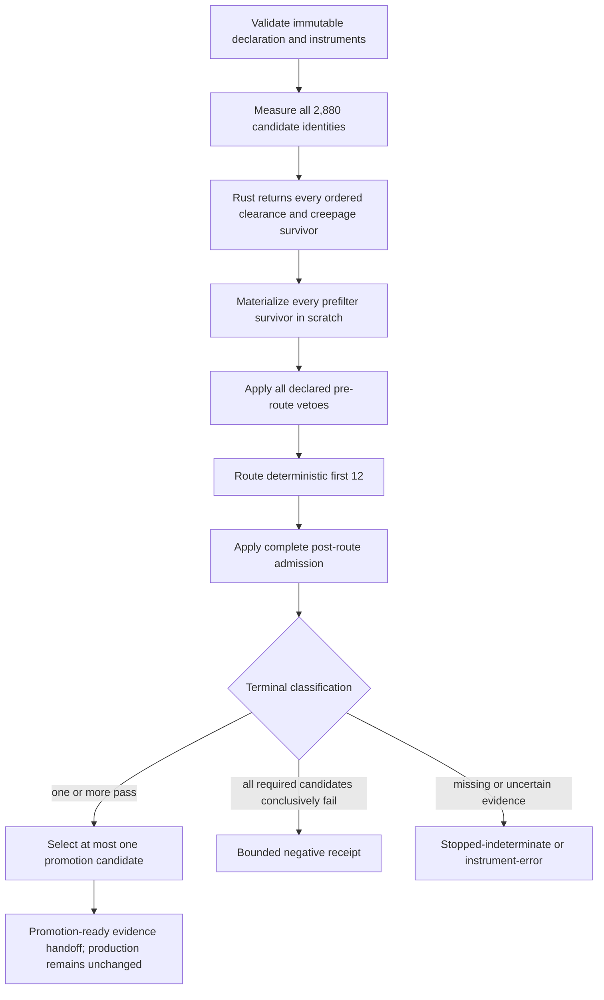

# Net-41 Corridor Execution and Admission - Plan

## Goal Capsule

- **Objective:** Produce a trustworthy terminal verdict for the declared Net-41 In3.Cu corridor family: either one fully admitted promotion candidate, a negative result bounded to every candidate the declaration requires this campaign to decide, or an indeterminate result that preserves production authority unchanged.
- **Means:** Build a Rust-owned staged execution and admission driver around the immutable 2,880-candidate declaration, with Python limited to KiCad staging and instrument transport.
- **Product authority:** `docs/evidence/net41-route-layer-corridor-20260831/declaration.json` fixes the family, mutation fence, safety roles, ranking, route budget, and one-candidate selection limit. This plan may execute that declaration but may not rewrite it or treat the selection limit as production-promotion authority.
- **Open blockers:** None block planning. PR #1557 must first be merge-ready, the live pcbnew rotation oracle must be available before measurements are credited, and current-edition appliance-safety review remains external to this campaign.

---

## Product Contract

### Summary

Build the missing execution layer between the role-aware clearance/creepage prefilter and a promotion-ready scratch-board verdict. The campaign screens all 2,880 exact candidate identities, preserves every ordered prefilter survivor until the remaining vetoes run, routes at most the declared first 12 complete pre-route survivors, and selects at most one fully admitted candidate without changing the production board.

### Problem Frame

PR #1557 establishes an immutable net-41 corridor declaration and a Rust-owned candidate set. It also corrects an unsafe naming error: the current quality-oracle result proves only clearance and creepage bounds, not route readiness. No execution driver yet turns that prefilter into scratch boards, applies the remaining vetoes, routes the bounded subset, or emits a complete terminal receipt.

The production predecessor is already disconnected at `C7.1`, with a 12 mm pad-center-to-segment-start coordinate gap. A campaign that measures only distances can therefore appear safe while preserving an electrically open net. The reverse failure is also possible: a connected route can create a new SELV safety signature, mechanical interference, containment error, or DRC regression. Admission must join these independent verdicts without letting any one instrument stand in for the rest.

Issue #505 records the operational gap. Internal target-net routing and review-output writing now exist, but the production adapter does not expose the scope, the driver removes all copper rather than only declaration-owned net-41 copper, and campaign-specific completion receipts are missing. This campaign extends those partial capabilities into a bounded, selective, replayable path.

### Key Decisions

- **Use a staged bounded pipeline.** Screen the exact declared set first, preserve every ordered prefilter survivor, apply every declared pre-route veto second, then route and fully admit only the deterministic first 12. Governs R1-R14.
- **Keep semantic ownership in Rust.** Rust owns candidate identity, mutation validation, verdict ordering, terminal classification, and receipt integrity; Python stages KiCad projects and calls instruments. Governs R2-R4, R11-R13.
- **Select without promoting.** The current design basis denies production promotion, so this unit may emit one promotion-candidate selection record but shall leave the production board and DRC ceiling byte-identical. Governs R13-R16.

The staged pipeline is preferred over running KiCad DRC on all 2,880 candidates because most candidates can be rejected with cheaper exact geometry and topology checks. It is preferred over adaptive or sampled search because those approaches cannot support the declaration's exact-set coverage contract or a bounded negative result.

### Requirements

**Declaration and identity**

- R1. Execution shall validate the immutable declaration, production-board hash, generated-input hashes, predecessor evidence, topology-authority digest, exact net-41 graph, complete SELV denominator, and candidate-set digest before creating a scratch candidate.
- R2. Rust shall generate and validate the exact 2,880 candidate identities in declaration order; Python may JSON-encode Rust-owned values for transport but shall not define canonical candidate serialization, compute candidate digests, create a parallel family, or own terminal classification.
- R3. The prefilter request shall contain one unique, finite measurement row for every declared candidate ID and shall fail before ranking on any missing, extra, duplicated, substituted, stale, or authority-mismatched row.
- R4. The prefilter output shall remain explicitly limited to clearance and creepage and shall preserve the complete ordered survivor denominator; the route budget shall not truncate the set before every declared pre-route veto runs.

**Scratch materialization and pre-route admission**

- R5. Every prefilter survivor shall be materialized as a complete scratch KiCad project with the declared sidecars and libraries, while fixed footprints, fixed copper, zones, outline, mounting features, connector access, and unrelated content remain byte-identical.
- R6. Pre-route admission shall independently check the materialized candidate's connected `C7.1`-to-`R14.2` net-41 graph, exact SELV denominator, new or worsened safety signatures, route geometry and current-capacity invariants, containment, body and courtyard overlap, allowed-mutation scope, uncapped normalized DRC output, DRC hard rules, and the declaration's clearance and creepage roles.
- R7. Candidate measurements shall use KiCad's `R(-theta)` placement convention verified by a live asymmetric, non-orthogonal pcbnew oracle probe before any campaign number is credited.
- R8. A missing sidecar, missing footprint library, stale pyo3 extension, capped DRC output, disagreement among required repeated measurements, or unavailable required oracle shall be instrument failure or indeterminate evidence, never a candidate rejection or pass.

**Bounded routing and complete admission**

- R9. The router shall accept an explicit net-41 scope, preserve retained copper as obstacles, replace only declaration-owned net-41 copper, and emit a content-addressed scratch PCB plus completion and provenance receipts without touching the committed board.
- R10. The campaign shall apply the route budget only after R6, then route the deterministic first 12 complete pre-route survivors, or all survivors when fewer than 12 exist, without silently substituting or exceeding the budget.
- R11. Final admission shall repeat every route-sensitive R6 check on the routed board and require a connected `C7.1`-to-`R14.2` graph, no fake completion, legal width/layer/via geometry, netlist reconciliation, and no new or worsened normalized DRC or safety signature.
- R12. If the automated router cannot produce complete evidence for the highest-ranked eligible candidate, the driver may make one bounded local/manual routing attempt under the same mutation and evidence contract; unresolved routing or measurement uncertainty then terminates indeterminate.

**Evidence and terminal authority**

- R13. Every candidate record shall retain its canonical identity, scratch-board hash, raw measurements, role/value/source attribution, ordered veto reasons, instrument state, routing result, and links to normalized receipts sufficient for deterministic replay.
- R14. Terminal classification shall use the mutually exclusive rules below, with exact declared, measured, materialized, pre-route-survivor, routed, admitted, and untested-eligible denominators.
- R15. Every terminal result in this unit shall leave `pcb/temper.kicad_pcb` and `power_pcb_dataset/drc_ceiling.json` byte-identical and shall not claim global topology infeasibility, qualified standards approval, fabrication release, or production-promotion authority.
- R16. A `completed` result shall select at most one exact scratch board by the declaration's ranking and shall emit a promotion-candidate record rather than copying that board to production.

**Terminal state rules**

| State | Exclusive trigger |
|---|---|
| `completed` | At least one scratch board passed full admission; every higher-ranked route candidate has a conclusive verdict, and the highest-ranked pass is recorded as the sole selection. |
| `exhausted` | All 2,880 candidates have conclusive prefilter or materialized-veto outcomes, every complete pre-route survivor has a conclusive routed outcome, no survivor remains beyond the 12-route budget, and none passed. |
| `stopped-indeterminate` | Trustworthy scoped evidence exists, but an eligible candidate remains untested, the bounded router/manual attempt is unresolved, or required evidence became inconclusive before `completed` or `exhausted` could be established. |
| `instrument-error` | A required instrument could not execute or returned structurally invalid evidence before the campaign formed any trustworthy scoped candidate verdict. |

### Actors

- A1. **PCB designer:** owns route review, manufacturing realism, promotion selection, and the bounded meaning of the terminal result.
- A2. **Rust campaign authority:** owns identities, mutation fences, ordered admission verdicts, exact coverage, and terminal receipt integrity.
- A3. **KiCad and geometry instruments:** provide pcbnew placement truth, scratch-board DRC sets, connectivity, containment, and rendered review evidence.
- A4. **Python transport layer:** stages isolated projects, invokes Rust and external instruments, and serializes returned evidence without creating semantic authority.
- A5. **Qualified safety reviewer:** remains the authority for current-edition standards applicability and fabrication release; this campaign does not impersonate that role.

### Key Flows

- F1. Validate and prefilter the declaration.
  - **Trigger:** The execution campaign starts from a clean checkout.
  - **Actors:** A2-A4
  - **Steps:** Verify authority and instrument prerequisites; generate the exact candidate set; measure every ID; ask Rust for the clearance/creepage prefilter.
  - **Outcome:** The run either has exact 2,880-candidate coverage and the complete ordered prefilter-survivor denominator or stops without creating an engineering verdict.
  - **Covers:** R1-R4, R7-R8, R13
- F2. Materialize and route eligible candidates.
  - **Trigger:** F1 returns a valid prefilter subset.
  - **Actors:** A1-A4
  - **Steps:** Materialize each prefilter survivor; apply every declared pre-route veto including connectivity and DRC; route the deterministic first 12 complete survivors; repeat route-sensitive admission on the outputs and preserve review artifacts.
  - **Outcome:** Each admitted route-budget candidate has a conclusive pass, rejection, or explicitly indeterminate evidence state.
  - **Covers:** R5-R13
- F3. Classify and publish the bounded result.
  - **Trigger:** No more candidate is required under the declared execution policy, or a required instrument prevents continuation.
  - **Actors:** A1-A4
  - **Steps:** Classify the terminal state from exact coverage; select at most one fully admitted promotion candidate; prove production artifacts unchanged.
  - **Outcome:** The repository contains one replayable terminal truth with no implied authority beyond the declaration.
  - **Covers:** R13-R16

### Acceptance Examples

- AE1. One of the 2,880 measurement rows is missing.
  - **Covers R1-R4, R8, R13-R14.**
  - **Given:** Every submitted row passes its individual distance bounds.
  - **When:** Rust compares measured identities with the declaration.
  - **Then:** Screening fails before ranking and no partial subset is reported as campaign coverage.
- AE2. A prefilter survivor overlaps an unrelated courtyard after materialization.
  - **Covers R4-R6, R10-R11.**
  - **Given:** Its clearance and creepage measurements pass.
  - **When:** Complete pre-route admission evaluates the scratch board.
  - **Then:** The candidate is rejected before consuming a route-budget slot.
- AE3. A routed candidate closes the C7.1 open but creates a new J1-to-net-41 safety signature.
  - **Covers R6, R9-R11, R13.**
  - **Given:** The router reports net-41 complete.
  - **When:** Post-route admission compares exact safety-signature sets.
  - **Then:** The candidate is rejected and the connectivity success cannot override the safety regression.
- AE4. The live pcbnew oracle cannot execute during campaign preflight.
  - **Covers R7-R8, R14-R15.**
  - **Given:** No trustworthy candidate verdict has yet been formed.
  - **When:** The driver validates required instruments.
  - **Then:** It records `instrument-error`, preserves the production artifacts, and makes no engineering verdict.
- AE5. The router times out after trustworthy pre-route evidence exists.
  - **Covers R8, R12, R14-R15.**
  - **Given:** The bounded manual attempt also cannot produce complete evidence.
  - **When:** The driver classifies the run.
  - **Then:** It records `stopped-indeterminate`, retains the scoped evidence, and makes no infeasibility claim.
- AE6. More than 12 candidates pass every pre-route veto and the routed first 12 all fail.
  - **Covers R10, R13-R15.**
  - **Given:** At least one eligible candidate remains untested because of the declared route budget.
  - **When:** The driver reaches the budget.
  - **Then:** It records `stopped-indeterminate`, names the untested eligible denominator, and does not claim exhaustion.
- AE7. One routed candidate passes every admission gate.
  - **Covers R9-R11, R13-R16.**
  - **Given:** Its exact scratch board and receipts replay from a clean checkout.
  - **When:** The PCB designer selects it for promotion.
  - **Then:** The highest-ranked passing candidate receives the sole promotion-candidate selection record while the production board and DRC ceiling remain byte-identical.

### Success Criteria

- The campaign reports exact declared, measured, materialized, pre-route-survivor, routed, and fully admitted denominators, with no stage using the preceding stage's name or authority.
- Every candidate and terminal receipt replays to the same hashes and ordered verdict from a clean checkout with fresh extensions and configured KiCad sidecars.
- The production board and DRC ceiling remain byte-identical while the repository gains either one promotion-ready candidate or a truthful bounded terminal receipt.
- Issue #505's partial bounded-router capability is extended through the public path with selective net-41 replacement, a reviewable scratch PCB, and campaign completion provenance.

### Scope Boundaries

- No change to the 2.0 mm fabrication check, 6.0 mm conservative target, or 12.6 mm PD3 production creepage role.
- No isolation slot, new copper layer, new via span, enclosure-led connector move, K1/U8 move, outline change, mounting change, or connector-access change.
- No adaptive candidate-family expansion and no rewrite of the immutable declaration after measurements begin.
- No reuse of a Python campaign script as a new safety, identity, mutation, ranking, or terminal-state source of truth.
- No production-board or DRC-ceiling edit under the current scratch-only design basis.
- No fabrication release or claim that a local net-41 route closes the board-wide missing isolation barrier.

### Dependencies and Assumptions

- PR #1557 supplies the role-aware authority, exact declaration validator, Rust candidate identities, exact-set prefilter, and committed evidence used by this execution unit.
- The current production board remains the declaration's content-addressed predecessor; any hash drift invalidates the campaign rather than being absorbed.
- Generated `pcb/temper.kicad_dru`, the sibling `fp-lib-table` and libraries, a seeded KiCad environment, fresh pyo3 extensions, and live pcbnew bindings are available before reported measurements.
- Current-edition IEC 60335-1 and IEC 60335-2-6 review remains required. It does not block scratch exploration, but it blocks any claim of qualified safety approval or fabrication release.

### Outstanding Questions

**Deferred to Planning**

- Which existing internal `target_nets`, review-output, Rust route-mutation, and orchestration surfaces should be extended through the public path without introducing a second candidate owner?
- Which existing evidence schemas should be extended for materialization, per-stage receipts, and terminal replay rather than creating overlapping formats?
- Which changed-surface verification commands provide the smallest complete closure set after the execution driver and terminal result are known?

<!-- ce-section: work-relationships -->
### How This Work Fits Together

This plan owns execution and terminal admission of the already-declared net-41 corridor family. The broader breakdown is contextual and may change after the measured result.

- **Depends on:** PR #1557 becoming merge-ready without weakening branch-local or inherited safety gates.
- **Enables:** A separately authorized production-promotion unit for the selected scratch board, including same-change 120-sample DRC remeasurement and provenance.
- **Enables:** A later enclosure-led J1 relocation family if this bounded corridor campaign cannot produce a full survivor and enclosure authority becomes available.
- **Enables:** A later fabrication-authorized isolation-slot family if manufacturing tolerances and safety review establish that authority.
- **Can proceed independently of:** Qualified current-edition standards review for scratch execution, while production approval and fabrication release remain dependent on that review.

### Sources

- `docs/plans/2026-08-31-2009-fix-reinforced-isolation-authority-plan.md`
- `docs/plans/2026-08-31-1559-fix-r14-hv-domain-refloorplan-plan.md`
- `docs/evidence/net41-route-layer-corridor-20260831/README.md`
- `docs/evidence/net41-route-layer-corridor-20260831/declaration.json`
- `docs/evidence/net41-route-layer-corridor-20260831/design-basis.json`
- `docs/evidence/r14-hv-domain-refloorplan-20260831/terminal-receipt.json`
- `packages/temper-design-bundle/src/regional_topology.rs`
- `packages/temper-quality-oracle/src/regional_feasibility.rs`
- `scripts/route_board.py`
- GitHub issue #505, `Make production router emit a bounded campaign candidate`
