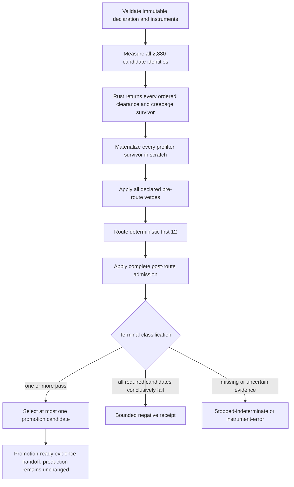
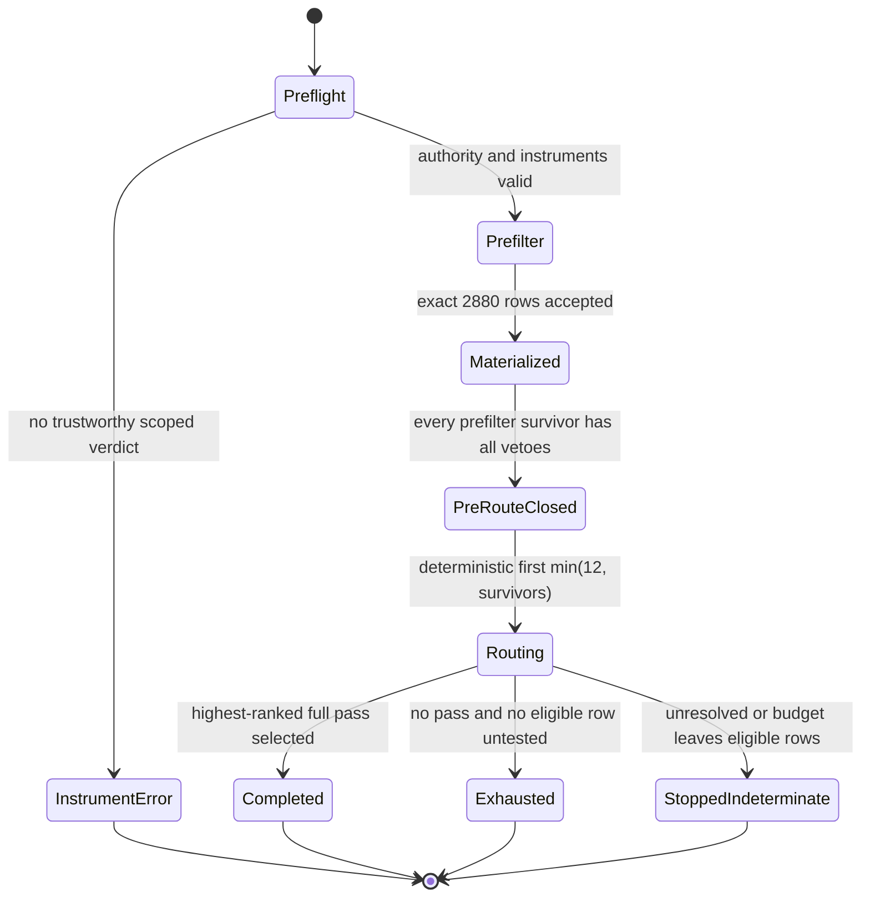

# Net-41 Corridor Execution and Admission - Plan

## Goal Capsule

- **Objective:** Produce a trustworthy terminal verdict for the declared Net-41 In3.Cu corridor family: either one fully admitted promotion candidate, a negative result bounded to every candidate the declaration requires this campaign to decide, or an indeterminate result that preserves production authority unchanged.
- **Means:** Build a Rust-owned staged execution and admission driver around the immutable 2,880-candidate declaration, with Python limited to KiCad staging and instrument transport.
- **Product authority:** `docs/evidence/net41-route-layer-corridor-20260831/declaration.json` fixes the family, mutation fence, safety roles, ranking, route budget, and one-candidate selection limit. This plan may execute that declaration but may not rewrite it or treat the selection limit as production-promotion authority.
- **Stop conditions:** Stop with `instrument-error` when preflight cannot form trustworthy scoped evidence. Stop with `stopped-indeterminate` when trustworthy evidence exists but a required verdict remains unresolved. Never convert either state into a candidate rejection or production change.
- **Execution profile:** Deep, scratch-only implementation and measurement campaign. PR #1557 is the exact code prerequisite; its branch-owned gates are green and its remaining failures reproduce on its base.
- **Tail ownership:** The implementing goal owns code, measurements, evidence, review, compound documentation, commit, successor PR, and merge-readiness monitoring.

---

## Product Contract

### Summary

Build the missing execution layer between the role-aware clearance/creepage prefilter and a promotion-ready scratch-board verdict. The campaign screens all 2,880 exact candidate identities, preserves every ordered prefilter survivor until the remaining vetoes run, routes at most the declared first 12 complete pre-route survivors, and selects at most one fully admitted candidate without changing the production board.

### Problem Frame

PR #1557 establishes an immutable net-41 corridor declaration and a Rust-owned candidate set. It also corrects an unsafe naming error: the current quality-oracle result proves only clearance and creepage bounds, not route readiness. No execution driver yet turns that prefilter into scratch boards, applies the remaining vetoes, routes the bounded subset, or emits a complete terminal receipt.

The production predecessor is already disconnected at `C7.1`, with a 12 mm pad-center-to-segment-start coordinate gap. A campaign that measures only distances can therefore appear safe while preserving an electrically open net. The reverse failure is also possible: a connected route can create a new SELV safety signature, mechanical interference, containment error, or DRC regression. Admission must join these independent verdicts without letting any one instrument stand in for the rest.

Issue #505 records the operational gap. Internal target-net routing and review-output writing now exist, but the production adapter does not expose the scope, the driver removes all copper rather than only declaration-owned net-41 copper, and campaign-specific completion receipts are missing. This campaign extends those partial capabilities into a bounded, selective, replayable path.

### Key Decisions

- **Use a staged bounded pipeline.** Screen the exact declared set first, preserve every ordered prefilter survivor, apply every declared pre-route veto second, then route and fully admit only the deterministic first 12. Governs R1-R14.
- **Keep semantic ownership in Rust.** Rust owns candidate identity, mutation validation, verdict ordering, terminal classification, and receipt integrity; Python stages KiCad projects and calls instruments. Governs R2-R4, R11-R13.
- **Select without promoting.** The current design basis denies production promotion, so this unit may emit one promotion-candidate selection record but shall leave the production board and DRC ceiling byte-identical. Governs R13-R16.

The staged pipeline is preferred over running KiCad DRC on all 2,880 candidates because most candidates can be rejected with cheaper exact geometry and topology checks. It is preferred over adaptive or sampled search because those approaches cannot support the declaration's exact-set coverage contract or a bounded negative result.

### Requirements

**Declaration and identity**

- R1. Execution shall validate the immutable declaration, production-board hash, generated-input hashes, predecessor evidence, topology-authority digest, exact net-41 graph, complete SELV denominator, and candidate-set digest before creating a scratch candidate.
- R2. Rust shall generate and validate the exact 2,880 candidate identities in declaration order; Python may JSON-encode Rust-owned values for transport but shall not define canonical candidate serialization, compute candidate digests, create a parallel family, or own terminal classification.
- R3. The prefilter request shall contain one unique, finite measurement row for every declared candidate ID and shall fail before ranking on any missing, extra, duplicated, substituted, stale, or authority-mismatched row.
- R4. The prefilter output shall remain explicitly limited to clearance and creepage and shall preserve the complete ordered survivor denominator; the route budget shall not truncate the set before every declared pre-route veto runs.

**Scratch materialization and pre-route admission**

- R5. Every prefilter survivor shall be materialized as a complete scratch KiCad project with the declared sidecars and libraries, while fixed footprints, fixed copper, zones, outline, mounting features, connector access, and unrelated content remain byte-identical.
- R6. Pre-route admission shall independently check the materialized candidate's connected `C7.1`-to-`R14.2` net-41 graph, exact SELV denominator, new or worsened safety signatures, route geometry and current-capacity invariants, containment, body and courtyard overlap, allowed-mutation scope, uncapped normalized DRC output, DRC hard rules, and the declaration's clearance and creepage roles.
- R7. Candidate measurements shall use KiCad's `R(-theta)` placement convention verified by a live asymmetric, non-orthogonal pcbnew oracle probe before any campaign number is credited.
- R8. A missing sidecar, missing footprint library, stale pyo3 extension, capped DRC output, disagreement among required repeated measurements, or unavailable required oracle shall be instrument failure or indeterminate evidence, never a candidate rejection or pass.

**Bounded routing and complete admission**

- R9. The router shall accept an explicit net-41 scope, preserve retained copper as obstacles, replace only declaration-owned net-41 copper, and emit a content-addressed scratch PCB plus completion and provenance receipts without touching the committed board.
- R10. The campaign shall apply the route budget only after R6, then route the deterministic first 12 complete pre-route survivors, or all survivors when fewer than 12 exist, without silently substituting or exceeding the budget.
- R11. Final admission shall repeat every route-sensitive R6 check on the routed board and require a connected `C7.1`-to-`R14.2` graph, no fake completion, legal width/layer/via geometry, netlist reconciliation, and no new or worsened normalized DRC or safety signature.
- R12. If the automated router cannot produce complete evidence for the highest-ranked eligible candidate, the driver may make one bounded local/manual routing attempt under the same mutation and evidence contract; unresolved routing or measurement uncertainty then terminates indeterminate.

**Evidence and terminal authority**

- R13. Every candidate record shall retain its canonical identity, scratch-board hash, raw measurements, role/value/source attribution, ordered veto reasons, instrument state, routing result, and links to normalized receipts sufficient for deterministic replay.
- R14. Terminal classification shall use the mutually exclusive rules below, with exact declared, measured, materialized, pre-route-survivor, routed, admitted, and untested-eligible denominators.
- R15. Every terminal result in this unit shall leave `pcb/temper.kicad_pcb` and `power_pcb_dataset/drc_ceiling.json` byte-identical and shall not claim global topology infeasibility, qualified standards approval, fabrication release, or production-promotion authority.
- R16. A `completed` result shall select at most one exact scratch board by the declaration's ranking and shall emit a promotion-candidate record rather than copying that board to production.

**Terminal state rules**

| State | Exclusive trigger |
|---|---|
| `completed` | At least one scratch board passed full admission; every higher-ranked route candidate has a conclusive verdict, and the highest-ranked pass is recorded as the sole selection. |
| `exhausted` | All 2,880 candidates have conclusive prefilter or materialized-veto outcomes, every complete pre-route survivor has a conclusive routed outcome, no survivor remains beyond the 12-route budget, and none passed. |
| `stopped-indeterminate` | Trustworthy scoped evidence exists, but an eligible candidate remains untested, the bounded router/manual attempt is unresolved, or required evidence became inconclusive before `completed` or `exhausted` could be established. |
| `instrument-error` | A required instrument could not execute or returned structurally invalid evidence before the campaign formed any trustworthy scoped candidate verdict. |

### Actors

- A1. **PCB designer:** owns route review, manufacturing realism, promotion selection, and the bounded meaning of the terminal result.
- A2. **Rust campaign authority:** owns identities, mutation fences, ordered admission verdicts, exact coverage, and terminal receipt integrity.
- A3. **KiCad and geometry instruments:** provide pcbnew placement truth, scratch-board DRC sets, connectivity, containment, and rendered review evidence.
- A4. **Python transport layer:** stages isolated projects, invokes Rust and external instruments, and serializes returned evidence without creating semantic authority.
- A5. **Qualified safety reviewer:** remains the authority for current-edition standards applicability and fabrication release; this campaign does not impersonate that role.

### Key Flows

- F1. Validate and prefilter the declaration.
  - **Trigger:** The execution campaign starts from a clean checkout.
  - **Actors:** A2-A4
  - **Steps:** Verify authority and instrument prerequisites; generate the exact candidate set; measure every ID; ask Rust for the clearance/creepage prefilter.
  - **Outcome:** The run either has exact 2,880-candidate coverage and the complete ordered prefilter-survivor denominator or stops without creating an engineering verdict.
  - **Covers:** R1-R4, R7-R8, R13
- F2. Materialize and route eligible candidates.
  - **Trigger:** F1 returns a valid prefilter subset.
  - **Actors:** A1-A4
  - **Steps:** Materialize each prefilter survivor; apply every declared pre-route veto including connectivity and DRC; route the deterministic first 12 complete survivors; repeat route-sensitive admission on the outputs and preserve review artifacts.
  - **Outcome:** Each admitted route-budget candidate has a conclusive pass, rejection, or explicitly indeterminate evidence state.
  - **Covers:** R5-R13
- F3. Classify and publish the bounded result.
  - **Trigger:** No more candidate is required under the declared execution policy, or a required instrument prevents continuation.
  - **Actors:** A1-A4
  - **Steps:** Classify the terminal state from exact coverage; select at most one fully admitted promotion candidate; prove production artifacts unchanged.
  - **Outcome:** The repository contains one replayable terminal truth with no implied authority beyond the declaration.
  - **Covers:** R13-R16

### Acceptance Examples

- AE1. One of the 2,880 measurement rows is missing.
  - **Covers R1-R4, R8, R13-R14.**
  - **Given:** Every submitted row passes its individual distance bounds.
  - **When:** Rust compares measured identities with the declaration.
  - **Then:** Screening fails before ranking and no partial subset is reported as campaign coverage.
- AE2. A prefilter survivor overlaps an unrelated courtyard after materialization.
  - **Covers R4-R6, R10-R11.**
  - **Given:** Its clearance and creepage measurements pass.
  - **When:** Complete pre-route admission evaluates the scratch board.
  - **Then:** The candidate is rejected before consuming a route-budget slot.
- AE3. A routed candidate closes the C7.1 open but creates a new J1-to-net-41 safety signature.
  - **Covers R6, R9-R11, R13.**
  - **Given:** The router reports net-41 complete.
  - **When:** Post-route admission compares exact safety-signature sets.
  - **Then:** The candidate is rejected and the connectivity success cannot override the safety regression.
- AE4. The live pcbnew oracle cannot execute during campaign preflight.
  - **Covers R7-R8, R14-R15.**
  - **Given:** No trustworthy candidate verdict has yet been formed.
  - **When:** The driver validates required instruments.
  - **Then:** It records `instrument-error`, preserves the production artifacts, and makes no engineering verdict.
- AE5. The router times out after trustworthy pre-route evidence exists.
  - **Covers R8, R12, R14-R15.**
  - **Given:** The bounded manual attempt also cannot produce complete evidence.
  - **When:** The driver classifies the run.
  - **Then:** It records `stopped-indeterminate`, retains the scoped evidence, and makes no infeasibility claim.
- AE6. More than 12 candidates pass every pre-route veto and the routed first 12 all fail.
  - **Covers R10, R13-R15.**
  - **Given:** At least one eligible candidate remains untested because of the declared route budget.
  - **When:** The driver reaches the budget.
  - **Then:** It records `stopped-indeterminate`, names the untested eligible denominator, and does not claim exhaustion.
- AE7. One routed candidate passes every admission gate.
  - **Covers R9-R11, R13-R16.**
  - **Given:** Its exact scratch board and receipts replay from a clean checkout.
  - **When:** The PCB designer selects it for promotion.
  - **Then:** The highest-ranked passing candidate receives the sole promotion-candidate selection record while the production board and DRC ceiling remain byte-identical.

### Success Criteria

- The campaign reports exact declared, measured, materialized, pre-route-survivor, routed, and fully admitted denominators, with no stage using the preceding stage's name or authority.
- Every candidate and terminal receipt replays to the same hashes and ordered verdict from a clean checkout with fresh extensions and configured KiCad sidecars.
- The production board and DRC ceiling remain byte-identical while the repository gains either one promotion-ready candidate or a truthful bounded terminal receipt.
- Issue #505's partial bounded-router capability is extended through the public path with selective net-41 replacement, a reviewable scratch PCB, and campaign completion provenance.

### Scope Boundaries

- No change to the 2.0 mm fabrication check, 6.0 mm conservative target, or 12.6 mm PD3 production creepage role.
- No isolation slot, new copper layer, new via span, enclosure-led connector move, K1/U8 move, outline change, mounting change, or connector-access change.
- No adaptive candidate-family expansion and no rewrite of the immutable declaration after measurements begin.
- No reuse of a Python campaign script as a new safety, identity, mutation, ranking, or terminal-state source of truth.
- No production-board or DRC-ceiling edit under the current scratch-only design basis.
- No fabrication release or claim that a local net-41 route closes the board-wide missing isolation barrier.

### Dependencies and Assumptions

- PR #1557 supplies the role-aware authority, exact declaration validator, Rust candidate identities, exact-set prefilter, and committed evidence used by this execution unit.
- The current production board remains the declaration's content-addressed predecessor; any hash drift invalidates the campaign rather than being absorbed.
- Generated `pcb/temper.kicad_dru`, the sibling `fp-lib-table` and libraries, a seeded KiCad environment, fresh pyo3 extensions, and live pcbnew bindings are available before reported measurements.
- Current-edition IEC 60335-1 and IEC 60335-2-6 review remains required. It does not block scratch exploration, but it blocks any claim of qualified safety approval or fabrication release.

<!-- ce-section: work-relationships -->
### How This Work Fits Together

This plan owns execution and terminal admission of the already-declared net-41 corridor family. The broader breakdown is contextual and may change after the measured result.

- **Depends on:** PR #1557 becoming merge-ready without weakening branch-local or inherited safety gates.
- **Enables:** A separately authorized production-promotion unit for the selected scratch board, including same-change 120-sample DRC remeasurement and provenance.
- **Enables:** A later enclosure-led J1 relocation family if this bounded corridor campaign cannot produce a full survivor and enclosure authority becomes available.
- **Enables:** A later fabrication-authorized isolation-slot family if manufacturing tolerances and safety review establish that authority.
- **Can proceed independently of:** Qualified current-edition standards review for scratch execution, while production approval and fabrication release remain dependent on that review.

### Sources

- `docs/plans/2026-08-31-2009-fix-reinforced-isolation-authority-plan.md`
- `docs/plans/2026-08-31-1559-fix-r14-hv-domain-refloorplan-plan.md`
- `docs/evidence/net41-route-layer-corridor-20260831/README.md`
- `docs/evidence/net41-route-layer-corridor-20260831/declaration.json`
- `docs/evidence/net41-route-layer-corridor-20260831/design-basis.json`
- `docs/evidence/r14-hv-domain-refloorplan-20260831/terminal-receipt.json`
- `packages/temper-design-bundle/src/regional_topology.rs`
- `packages/temper-quality-oracle/src/regional_feasibility.rs`
- `scripts/route_board.py`
- GitHub issue #505, `Make production router emit a bounded campaign candidate`

---

## Planning Contract

### Key Technical Decisions

- KTD1. **Extend the existing Rust corridor authority.** Add execution-state and receipt types beside `regional_feasibility` in `temper-quality-oracle`; reuse `temper-design-bundle` for exact board mutation. This keeps identity, order, hard-veto evaluation, terminal classification, and receipt integrity in Rust. Governs R1-R6, R10-R14.
- KTD2. **Expose the existing target-net capability through the public router adapter.** Thread an explicit `target_nets` value from `route_pcb` into `RouterV6Pipeline`; reject an empty scope and preserve the current whole-board default when it is absent. Governs R9-R12.
- KTD3. **Materialize before truncating.** Use the Rust-derived prefilter order as input, materialize every prefilter survivor, and submit one exact pre-route verdict row for each survivor before Rust returns the first 12 route candidates. Governs R3-R6, R10, R14.
- KTD4. **Treat evidence as an append-only, content-addressed stage ledger.** Extend the existing declaration and predecessor receipt vocabulary with candidate, instrument, stage, and terminal records. The Python runner may write Rust-returned JSON and raw instrument artifacts, but it may not derive terminal state. Governs R8, R13-R16.
- KTD5. **Compare normalized DRC sets against a repeated baseline.** Generate the DRU, stage the full project and libraries, run the baseline and each admitted candidate with the repository DRC API, reject caps or inconsistent repeated sets, and compare normalized rule/net/item identities rather than aggregate counts. Governs R6-R8, R11.
- KTD6. **Keep the committed result scratch-only.** Store compact manifests, receipts, logs, and at most one selected scratch-board artifact under the evidence directory. Keep bulk candidate projects outside the repository and prove production board and DRC-ceiling hashes unchanged. Governs R13-R16.

### High-Level Technical Design

The Rust campaign authority consumes complete stage submissions. Each submission names the declaration digest, candidate-set digest, exact candidate IDs, content hashes, instrument states, and normalized verdicts. Rust validates stage coverage and produces the next admissible set or one terminal receipt. Python transports files and invokes pcbnew, KiCad DRC, geometry, connectivity, and routing instruments. No Python branch decides rank, pass, exhaustion, or selection.

### Implementation Constraints

- The immutable declaration remains the only candidate-family authority. Candidate IDs, ordering, route geometry, thresholds, budgets, and the one-selection limit are not regenerated in Python.
- `replace_declared_route_and_move_footprint` remains the mutation fence for declaration-owned Net-41 copper and footprint movement. Any extension must validate exact identities before emitting bytes and preserve all unrelated bytes.
- `target_nets` is a routing scope, not permission to delete retained copper. The caller supplies a scratch board with only the declaration-owned route removed or replaced; unrelated copper remains an obstacle.
- Live pcbnew verification uses an asymmetric 45-degree probe before measurement. A pinned corpus pass alone is not sufficient for campaign credit.
- A DRC result at a known category cap, a failed command, a missing sidecar/library, an unloadable or stale extension, or disagreement between repeated normalized sets is an instrument condition.
- The runner shall not edit `pcb/temper.kicad_pcb`, `power_pcb_dataset/drc_ceiling.json`, or the immutable declaration.

### Sequencing

1. Define and test Rust lifecycle schemas before adding transport code.
2. Expose target-net routing and exact route replacement behind tests before the campaign calls it.
3. Build the thin runner and complete pre-route measurement path before spending the route budget.
4. Run full admission and let Rust emit the terminal result.
5. Replay the result, review the diff and evidence, compound the learning, then ship and monitor the successor PR.

### Risks and Mitigations

| Risk | Consequence | Mitigation |
|---|---|---|
| A Python helper becomes a second authority | Candidate or terminal truth can drift | Rust accepts complete raw stage evidence and returns ordered/terminal records; mutation tests alter the Python transport and the Rust owner independently. |
| Target-net routing still strips or rewrites unrelated copper | Scratch result is not mutation-scoped | Byte-identity tests cover unrelated segments, vias, zones, footprints, outline, and sidecars before any production-board run. |
| DRC or geometry instrumentation lies | A false pass or false rejection is committed | Fresh-extension gate, live pcbnew oracle, generated DRU, full library staging, cap detection, repeated normalized DRC sets, and external-oracle tests run before campaign credit. |
| Materializing all survivors is expensive | The route budget is applied early and hides candidates | Keep projects in scratch storage, write compact receipts, and checkpoint content hashes without truncating the survivor set. |
| Twelve routed failures are misreported as exhaustion | The negative result exceeds its bound | Rust requires `untested_eligible_count == 0` for `exhausted`; otherwise the terminal state is `stopped-indeterminate`. |
| Shared pyo3 artifacts are stale or poisoned | Tests execute code no commit describes | Build with `make extensions`, verify with `make extensions-check` immediately before credited measurements, and never use a featureless bare Cargo build. |

### Deferred to Follow-Up Work

- Promoting a selected scratch board into `pcb/temper.kicad_pcb`, including same-change 120-sample DRC remeasurement and ceiling provenance.
- Adding a broader enclosure-led J1 family, an isolation slot, a new copper layer/span, or any adaptive expansion beyond the immutable 2,880 candidates.
- Current-edition appliance-safety approval and fabrication release.

---

## Implementation Units

### U1. Rust campaign lifecycle and receipt authority

- **Goal:** Add a closed Rust state machine that validates complete stage evidence, preserves canonical order, enforces route and selection budgets, and emits exactly one terminal classification.
- **Requirements:** R1-R4, R8, R10, R13-R16; F1, F3; AE1, AE4-AE7.
- **Dependencies:** PR #1557 exact head.
- **Files:** `packages/temper-quality-oracle/src/corridor_campaign.rs`, `packages/temper-quality-oracle/src/lib.rs`, `packages/temper-quality-oracle/src/wasm_test_registry.rs`, `packages/temper-placer/tests/rust_integration/test_quality_oracle.py`.
- **Approach:**
  1. Define deny-unknown-fields schemas for preflight, materialized veto, routed admission, instrument state, candidate record, selection, and terminal receipt.
  2. Bind every request to the declaration and candidate-set digests and validate exact expected IDs at each stage.
  3. Reuse the prefilter order from `regional_feasibility`; accept no caller-supplied rank.
  4. Encode mutually exclusive terminal rules and prove that `exhausted` is impossible when an eligible candidate remains untested.
  5. Expose one JSON PyO3 seam that transports complete stage evidence and returns Rust-owned records.
- **Patterns to follow:** `regional_feasibility::validate_and_screen_corridor_evidence`, deny-unknown-fields evidence structs, `collision_campaign` closed-state tests.
- **Test scenarios:**
  - Covers AE1. A request missing one of 2,880 prefilter IDs fails before a stage receipt exists.
  - Duplicate, extra, reordered, non-finite, stale-digest, and unknown-field submissions fail closed.
  - Covers AE4. Preflight instrument failure produces `instrument-error` only when no scoped candidate verdict exists.
  - Covers AE5. The same failure after trustworthy pre-route evidence produces `stopped-indeterminate`.
  - Covers AE6. Twelve routed failures plus one untested eligible candidate cannot produce `exhausted`.
  - Covers AE7. Multiple full passes select only the highest-ranked pass after all higher-ranked routed rows are conclusive.
- **Verification:** Rust and Python boundary tests reproduce all four terminal states and the serialized terminal receipt is stable under replay.

### U2. Public bounded Net-41 routing and mutation seam

- **Goal:** Make the existing target-net router capability reachable through the public adapter while retaining unrelated copper and replacing only declaration-owned Net-41 content.
- **Requirements:** R5, R9-R12; F2; AE3.
- **Dependencies:** U1.
- **Files:** `packages/temper-placer/src/temper_placer/router_v6/_adapter_convert.py`, `packages/temper-placer/src/temper_placer/router_v6/_pipeline_core.py`, `scripts/route_board.py`, `packages/temper-design-bundle/src/sexpr_writer.rs`, `packages/temper-placer/tests/router_v6/test_adapter.py`, `packages/temper-placer/tests/io/test_sexpr_writer_oracle_differential.py`, `packages/temper-placer/tests/scripts/test_route_board.py`.
- **Approach:**
  1. Thread non-empty `target_nets` into the existing pipeline without changing absent-scope behavior.
  2. Add a scratch-only route mode that does not call whole-board `strip_existing_copper`.
  3. Extend the Rust writer only if the declaration-owned route must be removed before routing; validate exact segment/via IDs and preserve unrelated bytes.
  4. Carry target scope, input hash, output hash, completion, pad connectivity, and per-net route result into the public receipt.
- **Patterns to follow:** Existing `RouterV6Pipeline.target_nets`, `_write_routes_to_content`, Rust atomic route mutation, topology/copper audit receipts.
- **Test scenarios:**
  - An absent scope preserves the current adapter behavior.
  - An empty or unknown target scope fails before routing.
  - A one-net scope reaches both 2D and n-layer routing stages.
  - Unrelated segments, vias, zones, footprint blocks, and outline bytes survive a scoped route unchanged.
  - A stale or partial declared Net-41 identity fails before output bytes exist.
  - A router-reported complete net with disconnected target pads remains incomplete in the public receipt.
- **Verification:** Adapter integration tests prove scope propagation and byte preservation; the public route receipt distinguishes route generation from connected completion.

### U3. Scratch materialization and complete pre-route admission

- **Goal:** Materialize every ordered prefilter survivor and run every declared pre-route veto before Rust applies the route budget.
- **Requirements:** R3-R8, R10, R13-R15; F1-F2; AE2, AE4.
- **Dependencies:** U1, U2.
- **Files:** `docs/evidence/net41-corridor-execution-20260901/run_campaign.py`, `docs/evidence/net41-corridor-execution-20260901/README.md`, `packages/temper-placer/tests/rust_integration/test_corridor_campaign.py`.
- **Approach:**
  1. Stage the board, project, generated DRU, `fp-lib-table`, libraries, domain manifest, and netlist into isolated candidate directories.
  2. Ask Rust for the declaration and materialize candidate bytes with the existing Rust mutation owners.
  3. Collect exact clearance/creepage rows for all 2,880 identities and submit one atomic v4 prefilter request.
  4. For every prefilter survivor, collect graph connectivity, full SELV denominator, safety-set deltas, route geometry/current capacity, containment, body/courtyard overlap, mutation scope, and repeated normalized DRC evidence.
  5. Submit all materialized rows to Rust and use only its ordered route-candidate output.
- **Execution note:** Run the live pcbnew oracle and fresh-extension check immediately before the credited campaign. Keep all bulk scratch projects outside git.
- **Patterns to follow:** `docs/evidence/r14-hv-domain-refloorplan-20260831/run_campaign.py`, `_drc_api.run_drc`, `regional_topology` graph and exact-denominator validation.
- **Test scenarios:**
  - Covers AE2. A geometry-prefilter survivor with a courtyard overlap is rejected before routing.
  - A missing sidecar or the 168/0 footprint-resolution signature becomes an instrument condition.
  - A capped DRC category or disagreement across normalized repeated sets cannot become a candidate verdict.
  - The pre-route stage rejects missing, duplicated, extra, or unmaterialized survivor rows.
  - A materialized board with an open C7.1-to-R14.2 graph fails connectivity even when distances pass.
- **Verification:** The campaign ledger accounts for all 2,880 candidates and every prefilter survivor, with raw role/value/source measurements and no route-budget truncation.

### U4. Bounded routing, post-route admission, and terminal evidence

- **Goal:** Route at most the deterministic first 12 complete pre-route survivors, fully admit their outputs, and commit one replayable terminal result without production changes.
- **Requirements:** R8-R16; F2-F3; AE3, AE5-AE7.
- **Dependencies:** U1-U3.
- **Files:** `docs/evidence/net41-corridor-execution-20260901/run_campaign.py`, `docs/evidence/net41-corridor-execution-20260901/candidate-manifest.json`, `docs/evidence/net41-corridor-execution-20260901/terminal-receipt.json`, `docs/evidence/net41-corridor-execution-20260901/promotion-candidate.json`, `docs/evidence/net41-corridor-execution-20260901/README.md`, `packages/temper-placer/tests/rust_integration/test_corridor_campaign.py`.
- **Approach:**
  1. Route the Rust-selected prefix with explicit Net-41 scope and retained-copper obstacles.
  2. Repeat every route-sensitive admission instrument and reconcile router completion with exact pad connectivity and netlist identity.
  3. Submit conclusive, indeterminate, or instrument evidence to Rust without local terminal branching.
  4. Commit at most one selected scratch PCB and promotion-candidate record when full admission succeeds; omit `promotion-candidate.json` otherwise.
  5. Record hashes proving the production board and DRC ceiling are unchanged.
- **Patterns to follow:** Content-addressed terminal receipts in `docs/evidence/r14-hv-domain-refloorplan-20260831`, normalized DRC set comparison, per-stage DRC fences.
- **Test scenarios:**
  - Covers AE3. Connected routing with a new safety signature is rejected.
  - Covers AE5. Router timeout plus unresolved manual attempt produces `stopped-indeterminate`.
  - Covers AE6. The route budget never exceeds 12 and preserves the untested eligible count.
  - Covers AE7. A fully admitted result emits exactly one selection whose board hash and candidate identity replay.
  - An output that changes unrelated copper, violates current capacity, or fails netlist reconciliation is rejected.
- **Verification:** The evidence directory contains one terminal receipt whose exact denominators, hashes, reasons, instrument state, and optional selection replay from a clean scratch directory.

### U5. Closure, documentation, and shipping

- **Goal:** Prove the implementation and evidence are trustworthy, capture the reusable learning, and ship the successor PR to merge-ready.
- **Requirements:** R1-R16; all flows and acceptance examples.
- **Dependencies:** U1-U4.
- **Files:** `docs/solutions/architecture-patterns/`, `docs/evidence/net41-corridor-execution-20260901/README.md`, generated registries affected by U1-U4.
- **Approach:**
  1. Replay the campaign with fresh extensions and truthful instruments.
  2. Run changed-surface, generated-artifact, import-boundary, workflow, and production-authority guards.
  3. Perform correctness, testing, and standards review; fix actionable findings without weakening inherited gates.
  4. Write a compound document that records the semantic-owner pattern, terminal-state discipline, and any instrument incident learned during execution.
  5. Commit all code and Markdown/evidence artifacts, push, open the successor PR, and monitor it until branch-owned merge-readiness is established.
- **Test scenarios:** Test expectation: none -- this unit verifies and documents the behavioral units rather than adding behavior.
- **Verification:** The PR contains the plan, implementation, evidence, terminal receipt, and compound documentation; production authorities are byte-identical and all branch-owned gates are green.

---

## Verification Contract

| Surface | Verification | Done signal |
|---|---|---|
| Rust campaign authority | `env -u CONDA_PREFIX cargo test -p temper-quality-oracle --features python` | Lifecycle, exact coverage, mutation, terminal-state, and serialization tests pass without creating a featureless pyo3 artifact. |
| Rust board mutation | `env -u CONDA_PREFIX cargo test -p temper-design-bundle --features python` | Exact identity and unrelated-byte preservation tests pass. |
| Public router scope | Targeted `pytest` selection for `test_adapter.py`, `test_route_board.py`, and writer integration | Scope reaches the pipeline, retained copper survives, and false completion is rejected. |
| Python/Rust boundary | Targeted `pytest` selection for `test_quality_oracle.py` and `test_corridor_campaign.py` | Unknown fields, stale identities, partial coverage, and all terminal transitions fail or pass as specified. |
| Extension truth | `env -u CONDA_PREFIX make extensions` followed immediately by `make extensions-check` | All pyo3 extensions are loadable and fresh immediately before credited measurement. |
| Geometry truth | Live `check_pad_world_position_oracle.py --verify-live-oracle` plus the committed pad-core oracle | Asymmetric 45-degree pcbnew probes and registered import-and-call sites pass. |
| DRC truth | Campaign baseline and candidate checks through `_drc_api.run_drc`, repeated and normalized | No cap, library-resolution signature, command failure, or unexplained repeated-set disagreement is admitted. |
| Generated artifacts | `make regen` then `make regen-check` | No generated registry, oracle hash, or documented count drifts. |
| Repository boundaries | `uv run python scripts/import_linter_gate.py` and workflow lint when applicable | Import contracts pass; workflow changes, if any, pass `actionlint`. |
| Production authority | Byte-hash comparison for `pcb/temper.kicad_pcb` and `power_pcb_dataset/drc_ceiling.json` | Both match the prerequisite head exactly. |
| Review and PR | `ce-code-review`, PR checks, and `ce-babysit-pr` | No unresolved branch-owned correctness, testing, standards, or CI failure remains. |

The campaign receipt is the measurement exit criterion. It must report all six denominators, one of the four legal terminal states, content hashes for every selected artifact, raw instrument state, and zero production-authority changes.

---

## Definition of Done

- U1 is done when Rust alone can validate every stage and emit exactly one stable terminal receipt for all declared edge cases.
- U2 is done when the public router honors an explicit non-empty target-net scope and tests prove unrelated board content is preserved.
- U3 is done when all 2,880 exact candidates are screened and every prefilter survivor receives every pre-route veto before truncation.
- U4 is done when at most 12 Rust-selected survivors have conclusive routed evidence or an explicit indeterminate condition, and the terminal result replays.
- U5 is done when reviews, generated checks, import boundaries, truthful-instrument checks, compound documentation, successor PR creation, and merge-readiness monitoring are complete.
- The immutable declaration, production board, and DRC ceiling remain byte-identical to the prerequisite head.
- No dead-end implementation, duplicate Python authority, bulk scratch project, or superseded evidence artifact remains in the diff.
- The final PR description states the bounded claim precisely and includes every Markdown and evidence file required to audit it.
