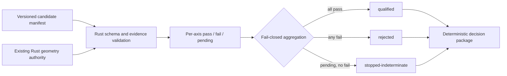
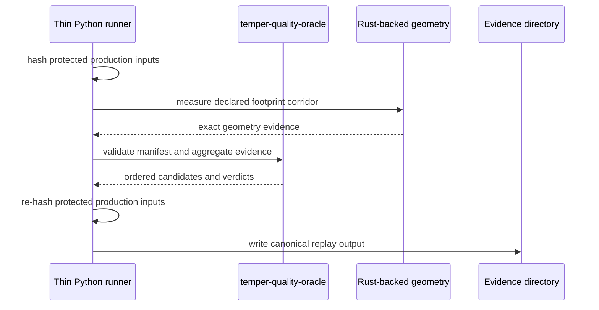

# Isolation Component Architecture Qualification

## Goal Capsule

- **Objective:** Produce an owner-ready, reproducible decision on the T1/T2 current-sensing and U6 gate-drive isolation architectures that can unlock a safe single-board PD3 refloorplan.
- **Means:** Evaluate bounded retain-with-slot, replacement, and hybrid families against electrical, certification, mechanical, sourcing, footprint, and exact 12.6 mm corridor requirements before any production-board mutation.
- **Product authority:** Atopile owns electrical identity; manufacturer and certification documents own component ratings; approved library footprints own land geometry; Rust-backed geometry and safety gates own machine acceptance; the board owner approves the final architecture.
- **Open blockers:** None for planning the qualification system. Certification-lab rulings, structural evidence, or unavailable qualified parts may produce a conclusive negative or stopped-indeterminate result rather than a selection.
- **Stop condition:** Select one fully qualified architecture for both sensing and gate drive, or publish a bounded negative/stopped-indeterminate decision package that identifies the next external authority needed. Do not modify the production PCB in this unit.

---

## Product Contract

### Summary

Build a component-architecture qualification gate for the three boundary references that prevent the current 12.6 mm straight isolation corridor: T1, T2, and U6. The gate evaluates whole architectures rather than part-number headlines and emits evidence suitable for an owner decision before another floorplan solve begins.

### Problem Frame

The current straight-corridor model is infeasible in both orientations. Solver-independent footprint geometry measures usable gaps of 9.1 mm for T1, 9.1 mm for T2, and 8.1 mm for U6 against the governing 12.6 mm PD3 requirement. Moving footprints, expanding the board, increasing solver time, or changing random seeds cannot enlarge those internal land-pattern gaps.

The repository's bounded searches found no verified drop-in component that preserves the required electrical function while also providing recognized isolation and at least 12.6 mm of external PCB geometry. This is not a universal market-absence claim. Prior slot studies produce promising modeled path lengths, but their standards credit, structural integrity, routing cost, and assembly implications remain unresolved. The next useful product is therefore a decision-quality qualification system, not another speculative board candidate.

### Key Decisions

- **Qualify architectures before floorplanning.** (session-settled: user-approved — chosen over continuing coordinate searches: the current footprint gaps are intrinsic.) Governs R1-R12.
- **Keep the PD3 requirement fixed.** (session-settled: user-approved — chosen over restoring the historical PD2 exception: the protected compartment needed for that exception is not built.) Governs R3, R6, R9, R12.
- **Preserve the single-board direction.** (session-settled: user-directed — chosen over starting a split-board redesign: the user approved the full-board refloorplan workstream.) Governs R1, R10, R14.
- **Qualify the staged OCP-02 architecture rather than treating it as fielded.** T2 remains present in the schematic design but is currently DNF/off-board; adding or replacing it changes independent fault coverage and needs an owner decision. Governs R4-R5, R8, R13.

### Requirements

**Qualification authority and evidence**

- R1. The qualification shall evaluate three bounded families: retain-current-parts with approved slots, component/package replacement, and a hybrid of those mechanisms.
- R2. Every candidate shall record manufacturer identity, lifecycle and sourcing status, authoritative datasheet and certification references, package identity, footprint provenance, and the date each external claim was checked.
- R3. Every candidate land pattern shall be evaluated with exact rotation-resolved copper geometry and shall either admit a 12.6 mm straight corridor or name the approved alternate insulation mechanism it relies on.
- R4. Every architecture shall preserve the compiled design's net identities and shall state whether it qualifies the currently staged OCP-02 channel, retains the present DNF state, or supplies an owner-approved equivalent safety mechanism.

**T1/T2 current sensing**

- R5. The sensing decision shall cover the fielded tank-return OCP-01 path and the schematic's staged DC-bus-return OCP-02 path, including their distinct trip windows, companion circuitry, and the consequences of leaving T2 DNF/off-board.
- R6. A sensing candidate shall re-derive ratio, burden, bandwidth, saturation headroom, fault latency, tolerance, conductor heating, and high-frequency behavior rather than assuming compatibility from nominal current alone.
- R7. An aperture or bus-bar architecture shall include conductor insulation, retention, strain relief, vibration, thermal, assembly, service, and creepage responsibilities as part of the candidate, not as later integration details.
- R8. A slot-based CST3015 candidate shall require certification authority for the claimed creepage path and structural evidence for the heavy transformer mounting before it can qualify.

**U6 gate drive**

- R9. The selected gate-drive architecture shall preserve two half-bridge channels, 3.3 V control compatibility, 15 V floating supplies, peak drive capability, dead-time behavior, disable/shutdown behavior, UVLO behavior, and reinforced isolation.
- R10. A two-package gate-drive candidate shall include both devices and their combined timing, shutdown, loop-area, area, BOM, thermal, and failure-mode consequences.
- R11. Package or pin-count similarity shall not establish compatibility; every candidate shall bind the actual orderable package, pinout, omitted pins, recommended land pattern, and external creepage/clearance geometry.

**Verdict and downstream handoff**

- R12. A candidate shall fail closed when certification, mechanical, sourcing, geometry, or functional evidence is missing, pending, internally inconsistent, or weaker than the governing PD3 construction.
- R13. The final decision package shall compare every evaluated architecture on uniform criteria, identify exact rejection reasons, and distinguish qualified, rejected, and stopped-indeterminate outcomes.
- R14. No production PCB, DRC ceiling, or safety baseline shall change during qualification; a selected architecture shall hand off its approved electrical and footprint contracts to a separately verified refloorplan unit.

### Actors

- A1. **Board owner:** chooses among architectures that the evidence marks qualified and approves any change to independent protection coverage.
- A2. **Electrical designer:** owns sensing transfer functions, gate-drive behavior, component ratings, and schematic/BOM compatibility.
- A3. **Mechanical and certification authority:** owns slot credit, conductor retention, vibration, enclosure, assembly, and recognized-insulation conclusions.
- A4. **Qualification tooling:** reproduces footprint geometry, candidate identities, comparisons, and fail-closed verdicts.

### Key Flows

- F1. Baseline and declare candidate families.
  - **Trigger:** The current T1/T2/U6 electrical and footprint authorities are frozen.
  - **Actors:** A2, A4
  - **Steps:** Record the incumbent contracts; declare bounded candidates and required evidence; reject candidates missing authoritative identity.
  - **Outcome:** Every evaluated architecture has a stable identity and complete comparison fields.
  - **Covers:** R1-R4, R11-R12
- F2. Qualify sensing and gate-drive architectures.
  - **Trigger:** Candidate evidence is available.
  - **Actors:** A2-A4
  - **Steps:** Re-derive function; evaluate certification and mechanics; generate or validate exact footprints; run corridor geometry; record independent vetoes.
  - **Outcome:** Each candidate is qualified, rejected, or stopped indeterminate with a reproducible reason.
  - **Covers:** R3-R12
- F3. Select and hand off.
  - **Trigger:** Both functional domains (sensing and gate drive) have at least one qualified option, or their bounded studies are exhausted.
  - **Actors:** A1-A4
  - **Steps:** Compare whole-system trade-offs; approve one combined architecture or record the missing external authority; freeze the selected contracts for planning the refloorplan.
  - **Outcome:** The next floorplan unit receives approved inputs, or stops without changing production artifacts.
  - **Covers:** R12-R14

### Acceptance Examples

- AE1. A CT has a suitable current rating but only 8 mm external creepage.
  - **Covers:** R2-R3, R6, R12
  - **Given:** Its electrical transfer can be made compatible.
  - **When:** Exact package geometry is evaluated against PD3.
  - **Then:** It is rejected rather than promoted by electrical score alone.
- AE2. A CST3015 slot clears the modeled path but lacks a certification ruling.
  - **Covers:** R8, R12-R13
  - **Given:** Geometry and routing are reproducible.
  - **When:** Standards credit remains pending.
  - **Then:** The candidate is stopped indeterminate, not called qualified or physically impossible.
- AE3. Two single-channel gate drivers clear the corridor but alter shutdown timing.
  - **Covers:** R9-R12
  - **Given:** Both packages and footprints meet isolation geometry.
  - **When:** Combined behavior fails the incumbent shutdown/dead-time contract.
  - **Then:** The architecture is rejected until the functional contract is restored and reverified.
- AE4. Leaving the staged T2 channel DNF creates enough board space.
  - **Covers:** R4-R5, R13
  - **Given:** Geometry improves.
  - **When:** The architecture is evaluated against the desired independent fault-coverage contract.
  - **Then:** The DNF decision and its coverage consequence are surfaced for owner approval rather than silently accepted as placement optimization.

### Success Criteria

- Every evaluated candidate has a complete electrical, certification, sourcing, footprint, and geometry evidence record: authoritative evidence where available, or an explicit pending status with the next required authority where it is unavailable.
- At least one complete sensing architecture and one complete gate-drive architecture qualify, or the bounded decision package identifies the exact external ruling or redesign needed next.
- A cold reviewer can reproduce all local geometry and comparison verdicts without relying on an agent transcript or `/tmp` output.
- The production PCB, DRC ceiling, and safety baselines remain byte-identical throughout this unit.

### Scope Boundaries

- The production refloorplan, routing, keepout emission, and 120-sample DRC campaign are downstream work enabled by this qualification.
- Split-board architecture is not reconsidered in this unit.
- The 12.6 mm PD3 target, board outline, mounting strategy, or protection coverage cannot be weakened merely to create a qualified candidate.
- Distributor stock is time-sensitive evidence, not a permanent qualification; manufacturer lifecycle and approved sourcing policy remain authoritative.

### Dependencies and Assumptions

- Certification-lab or mechanical-review evidence may be required to qualify slot and aperture candidates.
- The current single-board enclosure and assembly envelope is the working mechanical boundary until an owner approves a change.
- External component availability can change; every selection must carry an as-of date and a replayable source trail.

### Sources

- `docs/solutions/architecture-patterns/physical-isolation-barrier-requires-domain-first-floorplan-2026-07-30.md`
- `docs/evidence/2026-08-14-certification-lab-package-pd3-and-60664-4.md`
- `docs/evidence/2026-08-18-open-edge-reaching-slot-does-not-sidestep-annex-l.md`
- `docs/evidence/2026-08-13-t2-ct-replacement-creepage-and-placement-search.md`
- `elec/src/components.ato`
- `elec/src/modules.ato`
- [Coilcraft CST3015](https://www.coilcraft.com/en-us/products/transformers/power-transformers/current-sensing/cst3015/)
- [TI UCC21550](https://www.ti.com/product/UCC21550/part-details/UCC21550BDWKR)
- [Talema AS series](https://talema.com/wp-content/uploads/datasheets/AS.pdf)

---

## Planning Contract

### Key Technical Decisions

- **KTD1. Extend `temper-quality-oracle` with the qualification domain and fail-closed verdict engine.** (session-settled: user-directed — chosen over a Python source of truth: repository policy assigns new logic to Rust.) The Rust owner validates candidate identity, evidence completeness, functional checks, geometry results, and uniform verdict ordering. The pyo3 layer only converts inputs and outputs. Implements R1-R13.
- **KTD2. Store qualification inputs as a versioned committed JSON manifest and emit a deterministic JSON decision package.** A schema-versioned manifest separates dated external assertions from computed verdicts. Each external claim binds the reviewed document's revision or publication identity, retrieval metadata, and SHA-256. Stable ordering and canonical fields make replays reviewable and diffable. Implements R1-R3, R11-R13.
- **KTD3. Represent each requirement axis as an independent evidence check with `pass`, `fail`, or `pending`.** Any required `fail` rejects a candidate; otherwise any required `pending` produces `stopped-indeterminate`; only an all-pass candidate qualifies. This preserves the distinction in AE2 and prevents weighted scores from masking vetoes. Implements R3-R13.
- **KTD4. Reuse the sanctioned exact pad/copper geometry path for straight-corridor evidence; fail closed on slot detours.** The current Rust authority supplies exact straight-line geometry but explicitly does not implement slot-aware surface pathing. A slot candidate remains pending unless a separately authoritative, digest-bound path result and certification ruling are supplied. This unit does not port the legacy Python slot model or treat it as acceptance authority. Implements R3, R8, R11-R12.
- **KTD5. Make production-artifact immutability an explicit gate with a plan-owned protected set.** Protect `pcb/temper.kicad_pcb`, `power_pcb_dataset/drc_ceiling.json`, `elec/domain_manifest.yaml`, `docs/ENVIRONMENTAL_SPEC.md`, and `packages/temper-placer/src/temper_placer/core/isolation_constants.py`. The manifest pins each file's expected SHA-256 at the campaign base revision; the runner requires both pre-run and post-run hashes to equal those pins and never writes these files. Implements R14.

### High-Level Technical Design

### Implementation Constraints

- Candidate identities bind the architecture family, function (`sensing` or `gate-drive`), orderable part/package, footprint provenance, and evidence as-of date. Blank or duplicate identities are invalid.
- External URLs are evidence citations, not runtime fetches. A replay is deterministic and offline; refreshing an external claim is a separately reviewed manifest change.
- Each external claim includes the authoritative document revision or publication identifier, retrieval date and URL, and SHA-256 of the reviewed bytes. A URL without immutable identity cannot support `pass`.
- Functional and certification conclusions are explicit evidence records. The gate does not infer ratings from product names, package similarity, or distributor stock.
- Geometry evidence must name the authoritative footprint and rotation-resolved measurement. An alternate insulation mechanism must carry its approving authority; a descriptive slot claim alone stays pending.
- Verdict reasons use stable machine codes plus human explanations. Candidate and reason ordering is deterministic.
- The initial evidence set may end with no qualified architecture. That is a valid bounded result when each rejection or pending authority is explicit.

### Required Evidence Axes

Unknown or duplicate axis codes invalidate a candidate. A missing mandatory axis also invalidates the candidate rather than becoming an implicit pending result.

| Axis code | Governing requirement | Mandatory for |
|---|---|---|
| `identity.lifecycle` | R2 | all candidates |
| `identity.sourcing` | R2 | all candidates |
| `package.footprint_provenance` | R2, R11 | all candidates |
| `geometry.straight_corridor` | R3 | all candidates |
| `geometry.alternate_authority` | R3, R8 | slot and hybrid candidates that rely on a detour |
| `certification.insulation` | R2-R3, R8-R9 | all candidates |
| `sensing.transfer_function` | R5-R6 | sensing candidates |
| `sensing.saturation_thermal_hf` | R6 | sensing candidates |
| `sensing.coverage_disposition` | R4-R5 | sensing candidates |
| `mechanical.conductor_and_mounting` | R7-R8 | sensing aperture, slot, and hybrid candidates |
| `gate.channel_and_supply_contract` | R9 | gate-drive candidates |
| `gate.timing_shutdown_uvlo` | R9-R10 | gate-drive candidates |
| `gate.integration_consequences` | R10 | two-package and hybrid gate-drive candidates |
| `protected_inputs.base_identity` | R14 | all candidates through the campaign envelope |

### Sequencing

U1 establishes the Rust data model and aggregation contract. U2 adds the pyo3 boundary and integration coverage. U3 adds committed candidate inputs and the thin replay runner. U4 generates and audits the durable decision package, then runs repository gates.

### Assumptions

- The bounded initial candidate set uses only architectures already named in the Product Contract or its cited evidence; implementation does not broaden into an unbounded market search.
- Existing exact geometry APIs may require a small Rust-facing adapter, but no independent rotation formula is allowed.
- Missing certification or mechanical authority is expected to remain `pending`, not guessed or converted into a pass.

---

## Implementation Units

### U1. Rust qualification model and fail-closed verdict engine

**Goal:** Add a typed, deterministic qualification domain to the existing safety-verdict owner.

**Requirements:** R1-R13; KTD1-KTD3.

**Dependencies:** None.

**Files:**

- `packages/temper-quality-oracle/src/isolation_qualification.rs` (create)
- `packages/temper-quality-oracle/src/lib.rs`
- `packages/temper-quality-oracle/src/wasm_test_registry.rs`
- `packages/temper-quality-oracle/Cargo.toml`

**Approach:** Define schema-versioned architecture, candidate, evidence-axis, protected-input, and verdict types. Encode the Required Evidence Axes table as the Rust completeness contract and validate required, unknown, duplicate, and family-inapplicable axes before aggregating. Return ordered diagnostics rather than short-circuiting so the decision package exposes every veto. Keep aggregation pure and serialization deterministic.

**Execution note:** Implement the state table and invalid-input cases test-first; the three-way verdict is the safety contract.

**Patterns to follow:** `packages/temper-quality-oracle/src/regional_feasibility.rs` for pure Rust verdict ownership and wasm registration; `packages/temper-quality-oracle/src/types.rs` for typed public results.

**Test scenarios:**

- Covers AE1. A candidate with passing electrical evidence and failed 8 mm geometry is `rejected` with the geometry reason.
- Covers AE2. A slot candidate with passing modeled geometry and pending certification is `stopped-indeterminate`.
- Covers AE3. A two-device gate driver with a failed shutdown/dead-time axis is `rejected` even when geometry passes.
- Covers AE4. A sensing architecture that leaves T2 DNF without an approved coverage disposition is not `qualified`.
- An all-pass sensing or gate-drive candidate is `qualified`.
- A candidate containing both a failed and pending axis is `rejected`, proving failure precedence.
- Missing, duplicate, unknown, or internally inconsistent required fields return validation errors rather than a verdict.
- Permuted input candidates and evidence axes serialize into the same canonical ordering.

**Verification:** Rust unit and wasm-registry tests prove validation, state aggregation, precedence, and ordering without Python.

### U2. Thin pyo3 qualification boundary

**Goal:** Expose Rust manifest evaluation to Python without duplicating qualification behavior.

**Requirements:** R1-R13; KTD1-KTD3.

**Dependencies:** U1.

**Files:**

- `packages/temper-quality-oracle/src/lib.rs`
- `packages/temper-placer/tests/rust_integration/test_quality_oracle.py`

**Approach:** Add one uniquely registered pyfunction that accepts the serialized manifest and returns the canonical Rust decision package. The Rust path validates authoritative geometry-evidence identity and the applicable axis contract; it does not trust a loose caller-supplied corridor scalar. Conversion errors map to stable Python exceptions, and the wrapper contains no verdict rules.

**Patterns to follow:** Existing regional-feasibility bindings in `packages/temper-quality-oracle/src/lib.rs` and their integration tests.

**Test scenarios:**

- A valid manifest crosses the extension boundary and returns the same candidate verdicts and order as the Rust contract.
- Invalid JSON, an unsupported schema version, and a missing required axis raise the documented exception class with a useful message.
- The module exports exactly one qualification evaluator registration, preventing silent pyo3 shadowing.
- The Python-side test demonstrates that changing a veto axis changes the Rust-produced verdict rather than Python post-processing.

**Verification:** A rebuilt extension passes Rust integration tests and the stale-extension check reports the crate loadable and current.

### U3. Candidate manifest and replay runner

**Goal:** Commit bounded, dated qualification inputs and a reproducible runner that produces the decision package without mutating production artifacts.

**Requirements:** R1-R14; KTD2, KTD4-KTD5.

**Dependencies:** U2.

**Files:**

- `power_pcb_dataset/isolation_architecture_candidates.json` (create)
- `scripts/check_isolation_architecture_qualification.py` (create)
- `scripts/manifest.yaml`
- `packages/temper-placer/tests/scripts/test_check_isolation_architecture_qualification.py` (create)

**Approach:** Encode incumbents and the bounded slot, replacement, and hybrid candidate families with immutable source identities, as-of dates, package/footprint provenance, and explicit pass/fail/pending axes. The runner validates repository paths, obtains exact straight-corridor geometry through existing Rust-backed APIs, leaves unsupported slot detours pending, checks the plan-owned protected set against base-revision pins, invokes the Rust evaluator, and writes only to an explicit output path. Register the new script and its invocation graph.

**Execution note:** Use fixtures and temporary output directories for tests; never copy or edit the production PCB to exercise the runner.

**Patterns to follow:** `scripts/check_measurement_provenance.py` for content identities and fail-closed diagnostics; `scripts/manifest.yaml` for script registration; existing geometry-oracle gates for import-and-call behavior.

**Test scenarios:**

- The repository manifest contains all three candidate families and both functional domains, with T2 explicitly represented as staged/DNF.
- A normal replay writes canonical JSON and leaves the protected PCB, DRC ceiling, and safety inputs byte-identical.
- Missing source date, package identity, footprint provenance, required evidence axis, or protected file fails before producing a qualified verdict.
- A geometry measurement below 12.6 mm rejects the candidate; an approved alternate mechanism without authority remains pending.
- A mocked attempt to change a protected input between pre- and post-hash fails the run and does not publish success.
- Two replays from identical inputs produce byte-identical decision packages apart from no volatile wall-clock field.

**Verification:** Script tests prove offline determinism, protected-input immutability, manifest coverage, and fail-closed error behavior.

### U4. Durable decision package and repository verification

**Goal:** Publish the bounded qualification result and prove it is replayable by a cold reviewer.

**Requirements:** R2, R12-R14; KTD2, KTD5.

**Dependencies:** U1-U3.

**Files:**

- `docs/evidence/2026-09-01-isolation-component-architecture-qualification.json` (create)
- `docs/evidence/2026-09-01-isolation-component-architecture-qualification.md` (create)
- `scripts/oracle_hashes.json`

**Approach:** Run the committed manifest through the rebuilt extension and commit its canonical JSON. Add a concise evidence narrative that states the bounded search, uniform criteria, exact rejection/pending reasons, protected-input digests, reproduction entry point, and next authority required. Register new oracle evidence if the repository gate classifies it as an oracle; never accept drift in an existing pin.

**Test scenarios:**

- The committed output exactly matches a fresh replay from the committed manifest.
- The narrative and JSON agree on every candidate identity and verdict.
- Every evaluated architecture has all required evidence denominators; no empty field can appear as a pass.
- The package distinguishes qualified, rejected, and stopped-indeterminate and gives the next authority for every pending result.
- Protected production input hashes match the working-tree files at verification time.

**Verification:** The replay comparison, generated-artifact checks, script manifest gate, import-boundary gate, extension freshness check, focused Rust/Python suites, and `git diff --check` all pass. No diff exists for the production PCB, DRC ceiling, or governing safety baselines.

---

## Verification Contract

- Build the pyo3 extensions with the repository-supported maturin flow, with `CONDA_PREFIX` unset, and verify freshness immediately before measuring or generating evidence.
- Run the `temper-quality-oracle` Rust unit suite through the repository's pyo3-safe build path and its wasm registry coverage when applicable.
- Run `packages/temper-placer/tests/rust_integration/test_quality_oracle.py` and `packages/temper-placer/tests/scripts/test_check_isolation_architecture_qualification.py`.
- Replay `scripts/check_isolation_architecture_qualification.py` from the committed manifest and require byte equality with the committed JSON evidence.
- Run the script-manifest/invocation checks, oracle-hash check, import-linter gate, generated-artifact check, and `git diff --check`.
- Compare protected input hashes before and after the complete verification run. Require both observations to equal the campaign-base pins for `pcb/temper.kicad_pcb`, `power_pcb_dataset/drc_ceiling.json`, `elec/domain_manifest.yaml`, `docs/ENVIRONMENTAL_SPEC.md`, and `packages/temper-placer/src/temper_placer/core/isolation_constants.py`.
- Treat a stale or unloadable extension, unavailable geometry authority, unresolved footprint, missing external evidence, or changed protected input as a failed instrument or stopped-indeterminate result, never as qualification.

---

## Definition of Done

- U1-U4 meet their stated verification outcomes and all R1-R14 have an implementation owner.
- The Rust engine is the sole qualification-rule authority; Python remains orchestration and I/O only.
- The committed candidate manifest covers retain-with-slot, replacement, and hybrid families for sensing and gate drive with authoritative, dated evidence fields.
- A fresh offline replay produces the committed canonical decision package and exposes stable reasons for every rejected or stopped-indeterminate candidate.
- The decision package either names one qualified sensing architecture and one qualified gate-drive architecture, or identifies the exact external ruling/redesign needed next without overstating a market-wide absence.
- The production PCB, DRC ceiling, and governing safety baselines are byte-identical to their pre-work state.
- Focused tests and repository gates pass with a freshly rebuilt extension; no existing oracle pin is repinned without separate evidence.
- Abandoned experiments, duplicate registrations, generated scratch files, and temporary outputs are absent from the final diff.
