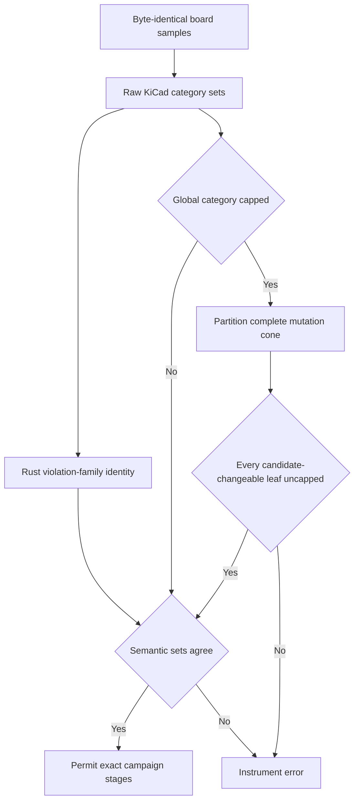
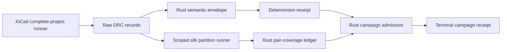
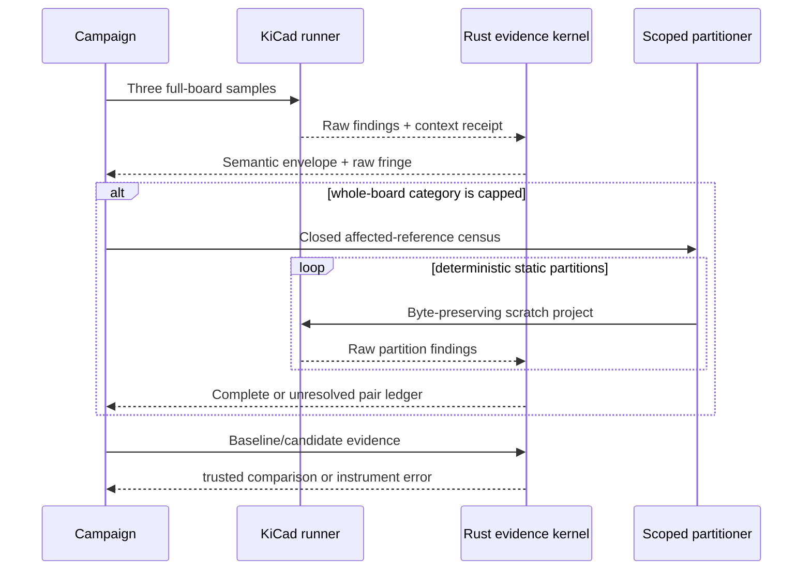
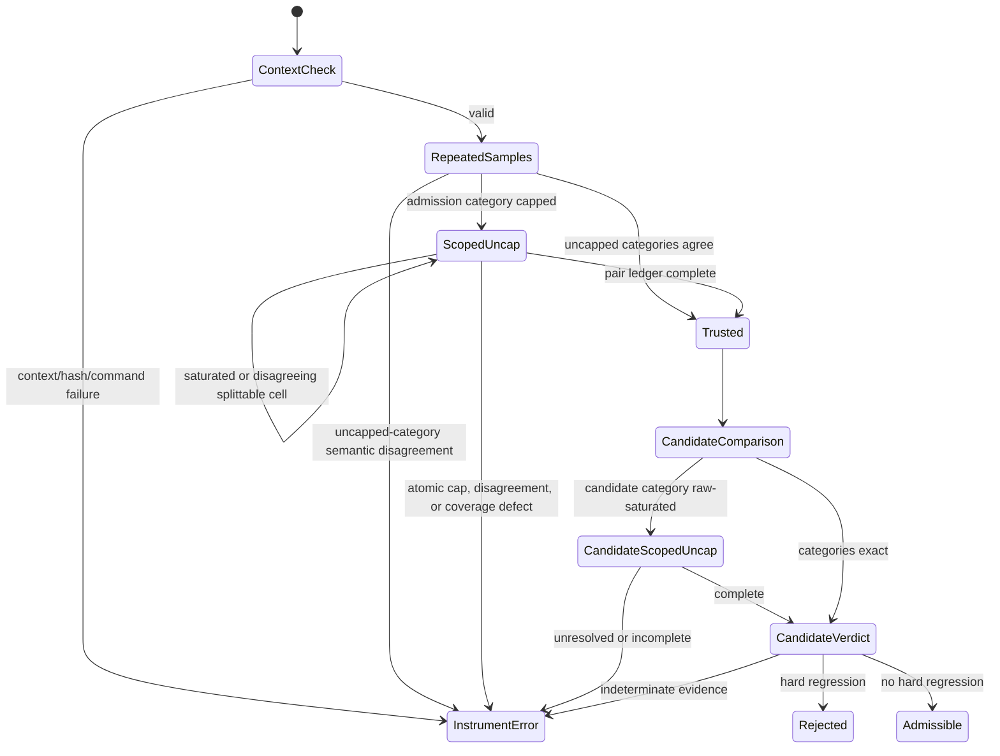

# Net-41 DRC Instrument Reliability - Plan

## Goal Capsule

- **Objective:** The unchanged Net-41 corridor campaign can distinguish a candidate-caused DRC change from KiCad reporting truncation and interchangeable provider output, then proceed only on complete repeatable evidence.
- **Means:** Add provider-aware Rust violation identity, an exhaustive mutation-scoped uncapping protocol for `silk_overlap`, and auditable repeated-set receipts.
- **Product authority:** This work owns DRC measurement reliability for the immutable Net-41 campaign. It does not alter candidate geometry, safety thresholds, route budget, the production board, or the DRC ceiling.
- **Open blockers:** PRs #1557 and #1558 must land before this stacked work can merge. Their merge is operationally blocked until the GitHub credential has `workflow` scope or a maintainer merges them in the browser.

---

## Product Contract

### Summary

Make the campaign's DRC preflight conclusive without treating KiCad's `199` warning floor as a count or treating its choice of an interchangeable copper primitive as a changed creepage violation.

### Problem Frame

The first exact run terminated before screening all 2,880 declared candidates. Three byte-identical baseline runs returned `W:silk_overlap=199`, KiCad's known warning cap, and 100 creepage findings whose normalized sets disagreed even though their counts and engineering meaning were stable.

The creepage disagreement is narrower than a physical set change. KiCad alternates among connected track primitives for the same rule, measured distance, exact net pair, and component set. The current determinism harness includes the chosen track's description and length in identity, so provider traversal becomes apparent board variance.

The silk cap is real and cannot be normalized away. However, a Net-41 candidate can change only violations incident to its declared mutable footprints. Static `C2`/`C3` silk debt dominates the global cap but cannot change in this campaign. A complete partition of the mutation cone can therefore provide uncapped candidate-admission evidence while the raw global result remains recorded as a saturated floor.

### Key Decisions

- **Preserve fail-closed campaign semantics.** (session-settled: user-approved — chosen over crediting candidates through an untrusted preflight: the first run correctly proved that an instrument failure is not a candidate failure.) Governs R1, R9-R13.
- **Normalize provider-equivalent evidence, not physical changes.** The identity may omit only the interchangeable primitive chosen inside one unchanged electrical violation family. Governs R3-R5.
- **Uncapp only the candidate mutation cone.** Exhaustive scoped KiCad measurements provide the authority needed for candidate admission without claiming an exact whole-board silk total. Governs R6-R9.

### Requirements

**Measurement identity and repeatability**

- R1. Every campaign DRC measurement shall regenerate the current DRU and run through a complete KiCad project with the sibling project, footprint table, libraries, `--all-track-errors`, and the single-thread configuration.
- R2. Each receipt shall retain the KiCad version, subject hash, sample count, raw per-category count distribution, normalized set digests, intersection size, union size, and unstable fringe.
- R3. Violation-family identity shall be Rust-owned and exposed through a thin pyo3 boundary so the campaign and determinism harness cannot independently redefine equivalence.
- R4. Creepage identity shall retain the category, rule and reported distance semantics, exact sorted net multiset, and exact sorted component multiset while excluding only KiCad's interchangeable representative copper item.
- R5. Three repeated semantic multisets for one immutable subject shall agree before candidate admission; the receipt shall expose raw representative-item churn without letting that churn alone decide a baseline-to-candidate verdict. Cross-subject hard-rule comparison shall use the same provider-omitted family and observation keys while retaining raw differences as review evidence.

**Cap-complete mutation scope**

- R6. A capped global category shall remain a recorded saturation floor and shall not become an exact count through a ceiling, label, or normalization change.
- R7. The `silk_overlap` admission instrument shall derive its affected-reference universe from the campaign's closed mutation allowlist and cover every affected-to-affected and affected-to-static footprint pair exactly once.
- R8. The scoped instrument shall partition static references into byte-preserving scratch boards and recursively split any saturated cell until every candidate-changeable leaf has three agreeing samples below KiCad's Rust-owned safe reporting threshold or the instrument returns an unresolved-cap error.
- R9. Scoped evidence may establish only whether the campaign can change the capped category; it shall not claim the whole-board `silk_overlap` set or total is known.

**Campaign integration and safety boundary**

- R10. Baseline and candidate DRC comparison shall cover the union of categories and reject new or worsened hard-rule families, including equal-count substitutions, while retaining non-hard scoped deltas as review evidence.
- R11. Missing project context, incomplete mutation coverage, a saturated scoped leaf, semantic set disagreement, or any command failure shall remain instrument evidence and shall never become a candidate rejection or pass.
- R12. Rust shall remain the authority for candidate identity, stage coverage, terminal classification, and admission; Python may stage scratch projects and transport instrument records only.
- R13. This unit shall leave `pcb/temper.kicad_pcb`, `power_pcb_dataset/drc_ceiling.json`, the immutable 2,880-candidate declaration, safety values, and the 12-route budget byte-identical.
- R14. After the instrument tests pass, the unchanged campaign shall rerun from fresh extensions and produce one content-addressed terminal receipt without promotion authority.

### Key Flows

- F1. Establish a trusted baseline
  - **Trigger:** The operator replays the Net-41 campaign on unchanged production inputs.
  - **Steps:** Verify extensions and the live pcbnew oracle; regenerate the DRU; run three complete-project DRC samples; form raw and semantic envelopes; resolve candidate-changeable silk pairs through uncapped partitions.
  - **Outcome:** The campaign receives a trusted baseline receipt or terminates as `instrument-error` before candidate credit.
  - **Covers:** R1-R9 and R11-R13.

- F2. Compare a materialized or routed candidate
  - **Trigger:** A declared candidate survives the preceding stage.
  - **Steps:** Repeat the semantic DRC measurement on its content hash; measure the same complete mutation cone; compare hard families and record scoped non-hard deltas.
  - **Outcome:** Rust receives conclusive instrument evidence or a typed indeterminate/error record.
  - **Covers:** R1-R12.

- F3. Replay the unchanged campaign
  - **Trigger:** The reliability gates and anti-vacuity tests pass.
  - **Steps:** Build fresh extensions; execute the existing 2,880-candidate driver without changing its declaration or budgets; write only Rust-returned evidence and optional scratch review boards.
  - **Outcome:** One honest terminal receipt reports the exact stage denominators and any selected candidate without mutating production authority.
  - **Covers:** R13-R14.

### Acceptance Examples

- AE1. Interchangeable creepage representative
  - **Covers:** R2-R5.
  - **Given:** Three runs report the same creepage rule, actual distance, net pair, and component set but alternate between two connected track descriptions.
  - **When:** The semantic envelope is formed.
  - **Then:** The semantic set is stable, the raw fringe records both representatives, and the instrument may continue.

- AE2. Real creepage change
  - **Covers:** R3-R5 and R10-R11.
  - **Given:** One run changes the reported distance, net pair, component set, or multiplicity.
  - **When:** The semantic envelope is formed.
  - **Then:** The sets disagree and no candidate verdict is credited.

- AE2a. Cross-subject provider churn only
  - **Covers:** R5 and R10.
  - **Given:** Baseline and candidate subjects have equal semantic family, distance, nets, components, and multiplicity but KiCad chooses different connected-track representatives.
  - **When:** The hard-rule verdict is formed.
  - **Then:** The raw difference remains in the receipt but does not by itself reject the candidate or make the comparison indeterminate.

- AE3. Static silk debt saturates the whole board
  - **Covers:** R6-R9.
  - **Given:** Raw `silk_overlap` remains at 199 because unchanged static footprints collide.
  - **When:** The affected-reference partition measures every pair a candidate can change below the cap.
  - **Then:** The receipt preserves the global floor, marks the mutation cone complete, and permits admission without a whole-board exact-count claim.

- AE4. One mutation-scoped cell still saturates
  - **Covers:** R7-R9 and R11.
  - **Given:** Recursive partitioning reaches an atomic affected/static or affected/affected leaf at the cap.
  - **When:** The scoped instrument closes its receipt.
  - **Then:** It reports an unresolved-cap instrument error and the campaign stops without candidate credit.

- AE5. Mutation coverage drifts
  - **Covers:** R7, R11-R13.
  - **Given:** A future materializer can move a footprint absent from the scoped instrument's affected-reference census.
  - **When:** Stage identity is validated.
  - **Then:** Construction fails before DRC comparison rather than silently omitting its silk pairs.

- AE6. Reliability fix is complete
  - **Covers:** R13-R14.
  - **Given:** Anti-vacuity tests, live baseline receipts, generated checks, and extension freshness pass.
  - **When:** The unchanged driver executes.
  - **Then:** It enters screening or stops for a newly observed truthful reason, while production board and ceiling hashes remain unchanged.

### Success Criteria

- The current board's three-run creepage envelope is semantically stable while retaining its observed raw representative-item fringe.
- Every candidate-changeable silk pair is covered by uncapped KiCad output, with mutation-census and pair-coverage checks proving completeness.
- Synthetic changes to distance, nets, components, multiplicity, coverage, and cap state each force the intended fail-closed result.
- The replay reports all 2,880 declared candidates and never attributes instrument failure to a candidate.

<!-- ce-section: work-relationships -->
### How This Work Fits Together

This plan owns the instrument-reliability unit that unblocks the already-built Net-41 execution pipeline.

- **Depends on:** PR #1557's role-aware authority and PR #1558's immutable campaign driver.
- **Enables:** A fresh unchanged 2,880-candidate campaign run with meaningful materialization, routing, and admission denominators.
  - **May enable later:** A separately reviewed production-board promotion if one candidate survives every gate.
- **Can proceed independently of:** Repairing inherited production-board DRC debt or raising a DRC ceiling.

### Scope Boundaries

- Do not change production-board placement, copper, zones, footprints, the DRC ceiling, or measurement provenance. Content-bound scratch candidate and partition boards are permitted.
- Do not weaken or rename a hard DRC rule, safety signature, clearance role, creepage role, candidate identity, or terminal state.
- Do not normalize actual distance, rule, net identity, component identity, multiplicity, or a candidate-caused geometric change.
- Do not substitute internal Rust geometry for KiCad DRC truth; Rust owns evidence identity and admission semantics, not the external measurement.
- Do not generalize the mutation-scoped protocol into a whole-board ceiling remeasurement in this unit.
- Do not promote a surviving scratch board from this branch; that remains a separate PCB PR with same-PR DRC remeasurement.

### Dependencies and Assumptions

- KiCad 10.0.5 remains available for replay, and the receipt binds the actual version used.
- The campaign's closed mutation scope remains footprint references `J1`, `R45`, `R58`, `R66`, `SW1`, `U22`, and `R14`; any drift must fail before measurement.
- The existing byte-preserving board partition and exact KiCad project-staging helpers remain reusable.
- Three repeated runs are the campaign set-consistency protocol. The 120-sample rule remains reserved for a DRC ceiling remeasurement when a nondeterministic category must establish its observed range.
- `silk_overlap` is pairwise-local: removing footprints not incident to a retained pair cannot create or destroy an overlap between that pair. A below-cap full-board fixture must independently falsify this assumption before live use.
- KiCad 10.0.5 exposes no CLI report-limit override, and `silk_overlap` is a built-in non-DRU category, so a conditioned generated rule cannot isolate its static debt. Those cheaper cap-avoidance routes do not replace physical partitioning.

## Assumptions

- The current three-run live sample is representative enough to define the provider-equivalence boundary: only the selected connected copper item changes while category, rule, actual distance, nets, components, and multiplicity remain fixed.
- Existing byte-preserving footprint filtering and project staging are extended rather than replaced; this unit does not introduce a second KiCad execution path.
- Candidate admission needs exact evidence only for DRC findings incident to the closed mutation scope. Static-to-static findings remain outside the candidate comparison while the raw whole-board cap remains visible.
- A hard-rule comparison uses a family key without measured distance and an observation key with measured distance. A new family, increased multiplicity, or reduced clearance/creepage distance is a regression; an uncomparable changed hard family fails closed.

---

## Planning Contract

### Key Technical Decisions

- **KTD1 — Rust owns both family and observation identity.** A family key preserves category, rule, normalized message semantics, exact net multiset, and exact component multiset. An observation key adds the exact reported distance. Multiset operations preserve occurrence counts. Repeatability and cross-subject verdicts use these provider-omitted keys; raw provider differences remain diagnostic evidence and never alone cause rejection or indeterminacy. This instantiates R3-R5 and R10.
- **KTD2 — One canonical raw KiCad seam feeds every consumer.** The existing complete-project runner returns both its parsed result and raw JSON records so the determinism harness, campaign, and mutation-cone instrument share command flags, environment, project context, and failure handling. This instantiates R1-R2 and R11.
- **KTD3 — Scoped silk evidence is pair-ledgered, not count-subtracted.** Rust compares each materialized subject with its source board, proves the actual footprint-mutation census is a subset of the declared allowlist, and binds that census into the receipt. Each unordered actual-mutation-incident footprint pair belongs to exactly one leaf; Python stages byte-preserving cross-product boards and filters raw results to that assigned pair. Recursive footprint and item splitting continues until every leaf is below Rust's safe reporting threshold, and Rust proves expected, covered, duplicate, missing, and foreign pairs. Per candidate, only leaves incident to actually moved footprints are remeasured; fully completed baseline leaves may be reused only when KTD6's projection identity is unchanged. This instantiates R6-R9 and R12.
- **KTD4 — Raw saturation and admission saturation are separate typed states.** Each category is `uncapped-exact`, `raw-saturated-scoped-complete`, or `raw-saturated-unresolved`. Only `silk_overlap` may use the middle state in this unit; every other cap remains unresolved. The whole-board floor and scoped receipt remain present, so no terminal rule is weakened and no exact global total is implied. This instantiates R6, R9, and R11-R12.
- **KTD5 — Reliability is proved before campaign throughput.** Characterization fixtures and anti-vacuity mutations land before the unchanged 2,880-candidate replay; the replay cannot update the production board, DRC ceiling, candidate declaration, or route budget. This instantiates R11-R14.
- **KTD6 — Completed scoped evidence is content-bound and reusable.** A scoped receipt binds the source subject, actual mutation census, Rust-derived silk projection, project/rule/runner identity, partition manifest, and leaf hashes. Only a fully closed receipt may be reused by another subject with the same Rust-validated silk projection; partial trees are never cached or trusted. This instantiates R2, R11-R14.

### High-Level Technical Design

The design is directional. Exact Rust types and Python function signatures remain implementation details.

### Implementation Sequence

`U1 → U2 → U3 → U4 → U5`. U1 supplies the identity authority; U2 makes its live inputs canonical; U3 resolves the capped mutation cone; U4 wires both receipts into terminal admission; U5 proves the unchanged campaign and records the learning.

### Risks and Mitigations

- **Over-normalizing real creepage changes:** keep actual distance, nets, components, rule, and multiplicity identity-bearing; mutation tests must change each independently.
- **Silk subset blindness:** derive expected pairs independently from the Rust mutation declaration and fail on missing, duplicate, foreign, or saturated atomic coverage.
- **Scratch-board semantic drift:** reuse byte-preserving filtering and the complete project/library staging path; assert the all-kept board is byte-identical.
- **Stale extension evidence:** rebuild all pyo3 crates and run the freshness gate immediately before live replay.
- **Accidental production mutation:** hash board and ceiling before and after every live phase; keep all candidate and partition artifacts under the run directory.
- **Unbounded replay cost:** record per-command deadlines, exit outcomes, and the expected/actual KiCad invocation count per candidate; remeasure only leaves incident to actual mutations and reuse only fully completed receipts with exact tool/config/source/projection identity. Candidate routing keeps a timeout above the measured 1,200-second path.
- **Lifecycle ambiguity:** baseline or coverage failure before screening is `instrument-error`; subject-specific measurement failure after trusted screening is `stopped-indeterminate`; conclusive hard-rule worsening is a candidate veto.

---

## Implementation Units

### U1 — Rust semantic DRC identity and envelope

- **Requirements:** R2-R5, R10-R12; KTD1; AE1-AE2.
- **Files:** `packages/temper-drc-rs/src/`, `packages/temper-drc-rs/src/lib.rs`, and focused Rust/pyo3 integration tests under `packages/temper-placer/tests/`.
- **Approach:** Add Rust-owned parsing of raw KiCad findings into family, observation, and raw-provider identities. Produce canonical bag digests, minimum-count intersection, maximum-count union, and signed unstable fringe. Reuse duplicate-preserving raw item parsing, register each pyo3 function once, replace Python identity logic with a delegation shim, and keep a production-shaped differential oracle without repinning historical fixtures.
- **Execution note:** Characterize the three real creepage variants first, then write failing mutations for distance, nets, components, and multiplicity before implementing normalization.
- **Test scenarios:**
  - Three production-shaped records differing only in connected-track description form one stable observation set and expose a non-empty raw fringe.
  - A changed actual distance, net, component, rule, or multiplicity makes semantic samples disagree.
  - Item and net order swaps canonicalize without losing duplicate nets/components.
  - Missing or malformed identity-bearing fields return a typed error rather than a partial key.
- **Verification:** Focused Rust-backed Python tests pass after a fresh extension build; the pyo3 module exposes one live registration for each new function.

### U2 — Canonical raw KiCad measurement seam

- **Requirements:** R1-R2, R5, R11; KTD2; F1-F2.
- **Depends on:** U1.
- **Files:** `packages/temper-placer/src/temper_placer/validation/_drc_api.py`, `scripts/check_drc_determinism.py`, and their focused tests.
- **Approach:** Refactor the existing runner so one strict complete-project invocation can return raw JSON plus the current parsed `DrcResult`. It must reject ambient-thread fallback and dynamically reject the resolution-failure signature `lib_footprint_issues == subject footprint count` with zero mismatches on production, candidate, and partition boards. Route determinism analysis through U1 while preserving the public parsed API. Delete Python cap authority in favor of Rust `cap_for`; keep safe-margin policy distinct from the hard cap.
- **Test scenarios:**
  - The runner still passes `--all-track-errors`, uses the generated DRU and staged footprint context, and rejects a failed or malformed command.
  - A reduced-footprint scratch subject whose library-issue count equals its footprint census and whose mismatch count is zero is rejected as a resolution failure.
  - Three provider-only creepage variants report semantic stability and raw instability.
  - A capped `199` or `499` category is labeled a floor and never emitted as exact.
  - A semantic mutation returns nonzero/instrument-error status even when per-category counts match.
- **Verification:** Existing DRC JSON/parser tests remain green, and the determinism command produces the expected current-board semantic envelope across three live runs.

### U3 — Exhaustive mutation-cone silk measurement

- **Requirements:** R6-R9, R11-R13; KTD3-KTD4; AE3-AE5.
- **Depends on:** U1-U2.
- **Files:** `packages/temper-drc-rs/src/`, `scripts/measure_uncapped_drc.py`, `scripts/run_net41_corridor_campaign.py`, and focused script/Rust integration tests.
- **Approach:** Reuse byte-preserving filters but replace the diagnostic bucket-sum algorithm with assigned cross-product cells. Rust derives the actual footprint-mutation census from a source/subject comparison, validates it against the declaration, and supplies the expected pair universe. Python stages each cell through the canonical runner; raw silk findings are attributed only to assigned pairs. Split footprint sides and then all KiCad silk-checkable child items while any repeated sample reaches Rust's safe threshold or disagrees. Bind the completed tree to source, actual census, projection, project, tool, rule, runner, manifest, and leaf hashes; cache only fully closed Rust-validated receipts.
- **Test scenarios:**
  - Affected-to-affected pairs appear once in the final union even though affected refs are present in every scratch board.
  - Each affected-to-static pair is covered exactly once; static-to-static findings are ignored without being claimed measured.
  - A saturated or near-cap partition splits deterministically and closes only when three child samples agree below the Rust safe threshold.
  - An atomic saturated cell, missing pair, duplicate pair, unknown reference, or changed mutation allowlist fails closed.
  - Moving one undeclared static footprint fails the actual-versus-declared mutation census before scoped DRC.
  - Item-level recursion includes text, property, graphic, and other silk-checkable footprint children rather than only primitive lines/arcs/polygons.
  - Keeping every reference returns byte-identical board text and scratch execution includes the sibling project, footprint table, and libraries.
  - On a fixture whose whole-board silk category is below the cap, scoped leaf findings for each retained pair exactly match the full-board raw findings for that pair.
- **Verification:** Synthetic capped fixtures prove recursion/coverage, then the production baseline produces a complete mutation-cone ledger while retaining the raw global silk floor.

### U4 — Campaign admission integration

- **Requirements:** R10-R14; KTD1, KTD4-KTD5; F2-F3; AE2, AE4-AE6.
- **Depends on:** U1-U3.
- **Files:** `scripts/run_net41_corridor_campaign.py`, `packages/temper-quality-oracle/src/corridor_campaign.rs`, `packages/temper-quality-oracle/src/lib.rs`, pyo3 registration, and campaign/oracle tests.
- **Approach:** Replace the coarse cap boolean with Rust category states and pass semantic repeatability, scoped-cap resolution, coverage, and family-distance comparison into admission evidence. Permit only a complete scoped `silk_overlap` floor; any other cap is unresolved. Each compared candidate runs its own scoped path for actually mutated footprints before verdict formation, reusing only KTD6-valid completed baseline leaves. Compare the union of baseline/candidate categories and exact multisets. Within a comparable hard family, pair ascending baseline and candidate distances by rank: added observations or any lower candidate rank regress, while missing/nonnumeric distance evidence is indeterminate. Preserve the established preflight `instrument-error` versus later `stopped-indeterminate` split.
- **Test scenarios:**
  - A raw global silk cap with complete unchanged scoped evidence permits later stages.
  - The same cap with one unresolved leaf produces `instrument-error`, zero candidate credit, and zero route-budget consumption.
  - A new hard family, increased multiplicity, or smaller hard-rule distance rejects the candidate; an improved distance does not.
  - Missing semantic or coverage evidence cannot be represented as a pass.
  - All previous terminal precedence and denominator invariants remain unchanged.
- **Verification:** Focused corridor campaign tests and Rust-backed quality-oracle tests pass with anti-vacuity mutations.

### U5 — Live replay, durable evidence, and compound learning

- **Requirements:** R13-R14; KTD5; F3; AE6.
- **Depends on:** U1-U4.
- **Files:** `docs/evidence/net41-corridor-execution-20260901/`, `docs/solutions/`, generated indexes/counts if required, and no production board or ceiling files.
- **Approach:** Rebuild all extensions, verify freshness immediately before measurement, run the live pad-position oracle and three-run DRC preflight, then replay the exact 2,880-candidate campaign. Persist compact cryptographic payload commitments rather than duplicating full repeated finding arrays in every checkpoint and manifest row. Bind resume identity to the Rust engineering-semantic baseline plus the strict instrument context so allowlisted provider-only churn can reuse evidence but a physical or tool change cannot. Update the content-addressed execution evidence and add a compound document explaining provider-aware identity, scoped cap resolution, and the limits of the result.
- **Test scenarios:**
  - Pre/post hashes prove the production board and DRC ceiling are byte-identical.
  - Pre/post authority hashes also prove the safety-value sources and 12-route budget unchanged, while the validated candidate declaration retains its exact 2,880-identity content hash despite edits to its containing runner.
  - The terminal receipt declares exactly 2,880 candidate identities and accurately reports measured, materialized, routed, and admitted denominators.
  - A production-shaped diagnostic payload compacts to a bounded checkpoint index that retains the full-payload digest and changes when any omitted byte changes.
  - Equivalent provider-only baseline churn preserves the resume identity; an engineering-observation change invalidates it.
  - A run that still stops does so for newly captured truthful instrument or candidate evidence, never by silently bypassing a cap or disagreement.
- **Verification:** Full focused suite, import boundary gate, generated-artifact check, extension freshness check, and committed evidence validation pass.

---

## Verification Contract

Run in dependency order and stop on the first unexplained failure:

1. `env -u CONDA_PREFIX make extensions`
2. `make extensions-check`
3. Focused Rust-backed identity, DRC API, determinism, uncapping, and campaign pytest selections named by U1-U4.
4. `uv run python scripts/check_drc_determinism.py -n 3 --pcb pcb/temper.kicad_pcb` after regenerating `pcb/temper.kicad_dru`; require semantic-set agreement and retain the raw fringe/cap floor.
5. Run the mutation-cone uncapping entry point against `pcb/temper.kicad_pcb`; require a complete pair ledger retaining the raw global silk floor, or stop with an explicit unresolved-cap instrument error before campaign replay.
6. `make extensions-check` again immediately before the live campaign replay.
7. Run the unchanged Net-41 campaign command recorded by its existing evidence README; write scratch outputs only under a fresh run directory.
8. `uv run python scripts/import_linter_gate.py`.
9. `make regen-check`.
10. Verify `git diff --exit-code -- pcb/temper.kicad_pcb power_pcb_dataset/drc_ceiling.json`; hash-check the safety-value and route-budget authority sources; assert the validated declaration's exact 2,880-identity content hash; and validate final receipt/evidence hashes.

The live campaign may be long-running. A truthful terminal result satisfies the reliability unit even if no candidate survives; only a measurement setup or evidence-contract failure blocks completion.

---

## Definition of Done

- U1-U4 are implemented with Rust authority, thin Python seams, production-shaped characterization fixtures, and anti-vacuity tests.
- Current-board creepage samples agree semantically while their raw provider fringe remains inspectable.
- The Net-41 mutation cone has an exhaustive pair ledger and no unresolved capped leaf, or the implementation returns a typed instrument error with no candidate credit.
- The unchanged campaign is replayed from fresh extensions and emits one honest content-addressed terminal receipt.
- Production board, DRC ceiling, candidate declaration, safety values, and route budget remain byte-identical.
- A durable compound document records the solved instrument pattern and its limits.
- Simplification and structured code review find no unresolved correctness issues; changes are committed, pushed, and opened as a stacked PR behind #1558.

### Sources

- `docs/evidence/net41-corridor-execution-20260901/README.md`
- `docs/evidence/net41-corridor-execution-20260901/baseline-drc-preflight.json`
- `docs/plans/2026-09-01-0049-fix-net41-corridor-execution-plan.md`
- `scripts/run_net41_corridor_campaign.py`
- `scripts/check_drc_determinism.py`
- `scripts/measure_uncapped_drc.py`
- `packages/temper-placer/src/temper_placer/validation/_drc_api.py`
- `packages/temper-drc-rs/src/drc_count.rs`
- `docs/evidence/2026-08-17-drc-ceiling-methodology-gaps-silk-overlap-and-sampling.md`
- `docs/evidence/2026-08-21-footprint-drift-drc-remeasure.md`
- `docs/solutions/architecture-patterns/isolation-values-need-role-aware-authority-2026-08-31.md`
