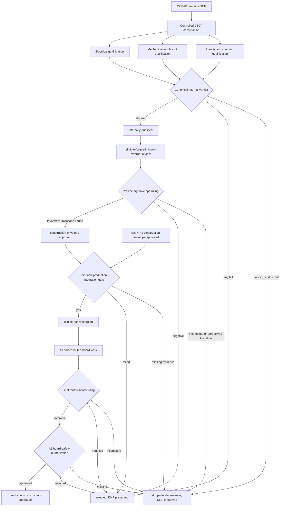
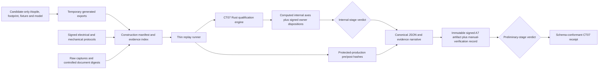
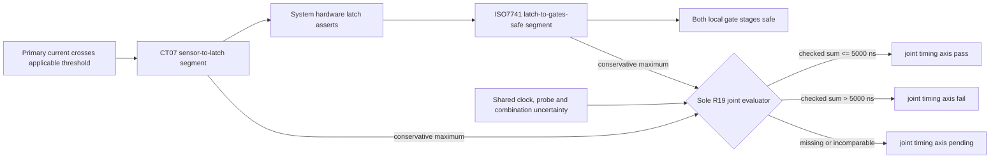

# CT07 T2 Sensing Owner Qualification - Plan

## Goal Capsule

- **Objective:** Produce a frozen CT07/T2 construction envelope that can earn preliminary external approval and, together with the approved ISO7741 envelope and a shared integration pass, make the combined architecture eligible for refloorplanning without authorizing OCP-02 reinstatement.
- **Means:** Qualify the sensing element, primary conductor, retention, secondary circuit, installed geometry, and evidence trail as one controlled construction while the fielded baseline remains OCP-02 DNF.
- **Product authority:** Temper owns the electrical, mechanical, assembly, PCB, sourcing, verification, and final board-safety decisions. Controlled manufacturer documents own part claims. An external certification authority owns preliminary PD3 credit for the frozen envelope and final PD3 approval for the routed production board.
- **Open blockers:** None for planning the qualification work. Missing controlled CT07 evidence or an unavailable preliminary certification ruling can stop qualification but does not prevent the owner work from being planned.
- **Stop condition:** Publish either a `construction-envelope-approved` CT07 domain that contributes to a shared `eligible-for-refloorplan` decision, or a reproducible `rejected`/`stopped-indeterminate` result that leaves OCP-02 DNF and names the unresolved authority.

---

## Product Contract

### Summary

Temper will qualify a formed, mechanically controlled CT07 primary-conductor assembly as the preferred T2 mechanism for a future independent OCP-02 path. This unit produces a frozen domain envelope and a staged eligibility decision; it neither reinstates T2 nor treats preliminary PD3 acceptance as approval of a later routed production board.

### Problem Frame

OCP-02 is deliberately DNF because the staged CST3015 T2 footprint has 9.1 mm intrinsic primary-to-secondary creepage against the governing 12.6 mm PD3 requirement. Its schematic and hardware-latch interface remain available, and its 60 A peak acceptance line remains visible and unmet. Reinstatement is therefore a safety-architecture decision, not a placement cleanup.

CT07 removes the fixed primary PCB pads by using a customer-supplied conductor through a 9.20 mm aperture. That makes the installed path controllable, but also makes the conductor, insulation, retention, footprint, burden network, and assembly process part of the safety construction. The recorded 13.2655 mm aperture path is only a model, and the part's recorded 3.2 kHz typical self-resonant frequency makes compatibility with the real 35 kHz content and sub-5 µs trip target an electrical veto that must be measured.

### Approaches Considered

| Approach | Product mechanism | Strengths | Costs and risks | Best suited when |
|---|---|---|---|---|
| Retained insulated lead | A serviceable insulated wire passes through CT07 and is constrained by board or enclosure retention features. | Lowest custom-part commitment and easiest early experiments. | More positional tolerance, more assembly steps, harder inspection, and more opportunities for service or vibration to shorten the path. | Early feasibility fixtures, not production qualification. |
| Controlled formed conductor | A keyed formed conductor and dedicated retainer define the primary path, orientation, strain relief, and CT position as one replaceable assembly. | Makes electrical resistance, path geometry, movement, inspection, and assembly error deterministic. | Requires a designed mechanical interface, controlled fabrication, and full assembly qualification. | **Recommended:** the production-intent qualification candidate. |
| Preserve DNF | OCP-02 remains absent and the accepted OCP-01 plus firmware protection baseline remains unchanged. | No new power-path joint, mechanical assembly, or unqualified isolation claim. | Leaves the independent `DC_BUS_RTN` sensing channel and internal OCP-02 acceptance line unmet. | The fail-safe outcome if the controlled construction cannot qualify. |

### Key Decisions

- **Qualify the controlled construction envelope, not the CT headline.** The conductor, retainer, CT, footprint, secondary front end, and production controls share one domain verdict. Governs R7-R17.
- **Use a controlled formed conductor as the production-intent candidate.** A retained wire may support experiments but cannot be promoted as an alternate production construction inside this unit. Governs R11-R14.
- **Keep OCP-02 DNF through both certification stages.** Qualification and refloorplan eligibility may not silently reinstate T2 or mutate the production baseline. Governs R1, R17-R20.
- **Preserve independent protection behavior.** The candidate restores `DC_BUS_RTN` fault coverage as a hardware-latched backstop while OCP-01 remains the first trip on a rising fault. Governs R2-R6.
- **Use two external construction rulings.** Preliminary review rules on the frozen domain envelope before refloorplanning; final review rules on the routed production board after it exists. Neither substitutes for Temper-owned engineering. Governs R12, R16-R17, R19-R20.

### Requirements

**Protection behavior**

- R1. OCP-02 shall remain DNF and absent from the production board throughout this unit and until R20 produces `production-construction-approved` and the final board-safety owner separately authorizes the production implementation; candidate-only qualification fixtures are permitted under R18 and do not populate the production board.
- R2. The candidate shall sense the `DC_BUS_RTN` shoot-through path independently of OCP-01 so a single sensor failure cannot disable both hardware current channels.
- R3. OCP-02 shall trip at 60 A peak with all tolerance corners inside 55-65 A and shall publish a conservative measured sensor-to-latch latency bound, without a private domain allocation, for the sole R19 joint evaluator to combine with the ISO7741 bound and joint-only uncertainty when deciding whether both local gate stages become safe within 5000 ns (5 µs) of the normative primary-current threshold crossing.
- R4. OCP-01 shall trip first for every shared current, temperature, supply, and component-tolerance corner, with a positive worst-case separation and no reset or sequencing race.
- R5. OCP-02 shall remain a firmware-independent hardware trip and shall preserve safe behavior during power-up, power-down, brownout, reset, and a persistent fault.
- R6. The construction's single-fault analysis shall cover open, shorted, misassembled, displaced, and degraded sensor, conductor, burden, comparator, supply, and fault-path states without reducing safety below the current DNF baseline.

**Electrical fitness**

- R7. The owner calculation shall re-derive ratio, magnetizing current, burden, threshold, filter, reference, comparator, tolerance, temperature, and component-rating behavior for the exact CT07 variant and conductor construction.
- R8. Representative hardware shall demonstrate correct detection without false or missed trips across normal current, startup, the 35 kHz operating content and harmonics, asymmetry, declared fault waveforms, and worst-case overdrive; nominal ratio arithmetic or a low-frequency source alone is insufficient.
- R9. The candidate shall demonstrate volt-time and saturation margin for the full waveform and at least the staged design's 1.42x current headroom above its worst-case high trip point without treating the 200 A reference rating as saturation evidence.
- R10. The primary conductor, CT secondary, burden network, and adjacent circuitry shall remain within electrical and thermal ratings at 15 A RMS continuous operation, the declared fault envelope, 10-40 °C rated ambient with mandated derating through 60 °C, and the project's conducted and radiated immunity conditions.

**Controlled physical construction**

- R11. The qualification identity shall include the exact CT07 variant, formed conductor, insulation system, terminals and joints, keyed retainer, released land pattern, body envelope, orientation, and assembly sequence as one revision-controlled construction.
- R12. The shortest as-built path from every accessible primary-conductor surface to every secondary pin, solder fillet, PCB conductor, fastener, shield, and service-access surface shall remain at least 12.6 mm under component, PCB, conductor, fixture, solder, and assembly tolerances; the modeled 13.2655 mm path cannot establish a pass.
- R13. The assembled construction shall preserve R2-R12 and pass post-test functional, structural, dielectric, leakage, and geometry checks after the applicable environmental baseline: 10-150 Hz vibration at 1 g for one hour per axis, 15 g shock for three shocks per axis, ten -20 to +60 °C thermal cycles, and 40 °C/93% RH damp heat for 96 hours.
- R14. Production controls shall prevent or detect a wrong CT variant, conductor, orientation, insertion depth, retention state, insulation condition, or displaced assembly, and the CT/conductor pair shall be replaced only as its controlled assembly rather than serviced as independent field parts.

**Authority, evidence, and verdict**

- R15. Qualification shall bind the exact manufacturer identity, current controlled datasheet and drawing, lifecycle status, approved source, delivered marking, and dated sourcing evidence to the candidate.
- R16. Preliminary external review shall bind its signed disposition to the exact frozen CT07 construction envelope, governing conditions, standard edition and clauses, credited surfaces, shortest path, and limitations; Hi-Pot, flammability, CTI, or an agency logo alone cannot satisfy this requirement.
- R17. The mandatory internal axes are R1 DNF preservation, R2-R6 individually, electrical fitness under R7-R10, physical construction under R11-R14, identity and supply under R15, and the R18 protected-artifact boundary; each shall resolve independently to pass, fail, or pending, any fail produces `rejected`, otherwise any pending produces `stopped-indeterminate`, and only all-pass evidence produces `internally-qualified` and `eligible-for-preliminary-external-review`. A favorable R16 ruling produces `construction-envelope-approved` only when every compatible non-mutating limitation is recorded as a separate binding envelope and joint-gate condition; an explicit negative or definitely incompatible R16 ruling produces `rejected`, an unresolved limitation produces `stopped-indeterminate`, and any requested construction, projection, or transform-policy change creates a new construction identity that must renew every affected qualification before approval.
- R18. The qualification and shared non-production integration work shall not change the production PCB, DRC ceiling, electrical domain manifest, environmental specification, isolation constants, canonical `elec/src/` and `elec/ato.yaml` sources, production-generated schematic or netlist outputs, `docs/hardware/BOM.md`, or production firmware/configuration; candidate schematics, netlists, BOMs, footprints, and board models shall remain separately identified qualification artifacts, and only an R19 `eligible-for-refloorplan` result hands the frozen contracts to production implementation work.
- R19. Before the combined architecture becomes `eligible-for-refloorplan`, both domain envelopes shall be `construction-envelope-approved` and the component-architecture qualification campaign shall be the sole owner of one shared digest-bound non-production candidate and the aggregate 5000 ns (5.0 µs) verdict. It shall demonstrate simultaneous corridor, loop, retention, thermal, electrical-interface, and shutdown feasibility against both frozen contracts and every binding preliminary-ruling limitation. Its shutdown evidence shall prove that OCP-02's firmware-independent system-facing active-high hardware-latch assertion reaches both ISO7741 local safe-state paths, brings both gate stages safe within the overall R3 latency, remains set-dominant while a fault is active and after source deassertion until the qualified explicit reset through the same reset authority as system `SHUTDOWN`, stays safe when the primary barrier supply or either local barrier/driver supply is lost, and passes combined fault injection on both paths; any failed joint axis produces `rejected`, while missing evidence produces `stopped-indeterminate`.
- R20. After refloorplanning and routing, the external authority shall review the as-built production-board construction against the preliminary envelope and all routing, copper, assembly, and tolerance evidence; `production-construction-approved` requires both a favorable final ruling and a separately recorded A1 board-safety authorization, and no earlier status authorizes T2 population or production release.

### Mandatory Protection Verdict Axes

R2-R6 are independent mandatory axes, not one discretionary protection score. Each owner decides the named technical criterion, A5 verifies the evidence and records `pass`, `fail`, or `pending`, and R17 aggregates without weighting.

| Axis | Decision owner | Independent verifier | Deterministic pass rule | Fail or pending rule |
|---|---|---|---|---|
| R2 independent coverage | A1, A2 | A5 | Fault coverage and injection evidence show that OCP-02 responds to the declared `DC_BUS_RTN` fault with the OCP-01 sensor path unavailable, while loss of OCP-02 cannot disable OCP-01. | Any shared sensor dependency or lost declared coverage fails; incomplete evidence is pending. |
| R3 trip window and latency publication | A2 | A5 | Every declared waveform and tolerance corner trips inside 55-65 A, and CT07 publishes a valid conservative measured sensor-to-latch bound from the normative threshold crossing with all domain uncertainty included and no private 5000 ns allocation. | A threshold excursion or a false/missed trip fails; an invalid, unresolved, or unbounded CT07 latency measurement is pending. A valid CT07 bound does not fail this domain merely because the sole R19 joint evaluator later computes an aggregate above 5000 ns. |
| R4 trip ordering | A1, A2 | A5 | The highest OCP-01 trip remains below the lowest OCP-02 trip at every shared corner, and combined injection observes OCP-01 first. | Any overlap, reversal, or race fails; an untested shared corner is pending. |
| R5 hardware-latch lifecycle | A1, A2 | A5 | OCP-02 asserts without firmware, an active fault dominates every clear/reset request, source deassertion does not clear the latch, and only the qualified explicit reset restores operation after every declared supply/reset state. | Any unintended clear, unsafe default, or firmware dependency fails; an untested state is pending. |
| R6 single-fault containment | A1, A2, A3 | A5 | Every declared single fault reaches a named safe or contained outcome, no single fault disables both current channels, and no outcome is worse than the accepted DNF baseline. | Any uncontained or dual-channel-disabling fault fails; an unanalyzed or untested fault is pending. |

### Actors

- A1. **Board and product-safety owner:** owns R1, the protection-coverage decision, and final authorization after every other signature is complete.
- A2. **Electrical owner:** owns R2-R10, including the waveform envelope, trip behavior, tolerance proof, FMEA, and bench verdict.
- A3. **Mechanical and assembly owner:** owns the conductor, retainer, joint, environmental-stress, service, and inspection contracts in R11, R13-R14.
- A4. **PCB and insulation-layout owner:** owns the released footprint and worst-case installed path in R11-R12 without claiming external standards credit.
- A5. **Verification owner:** owns test independence, sample traceability, evidence digests, replayability, the R18 protected-artifact check, and the uniform verdicts under R17-R20.
- A6. **Sourcing and manufacturing owner:** owns exact identity, approved-source, lifecycle, marking, and production-control evidence under R14-R15.
- A7. **External certification authority:** rules preliminarily on the frozen R16 envelope and finally on the routed R20 board construction, and cannot waive a failed Temper-owned axis.

### Owner Sign-off Model

| Decision gate | Required owner | Minimum evidence | Effect |
|---|---|---|---|
| Protection contract | A1, A2, A3, A5 | Fault coverage, trip ordering, latency, reset behavior, and FMEA | Records independent `pass`, `fail`, or `pending` results for R2-R6. |
| Electrical fitness | A2, A5 | Calculations plus representative waveform, tolerance, saturation, thermal, and immunity results | Records `pass`, `fail`, or `pending` for R7-R10. |
| Physical construction | A3, A4, A5 | Released construction, tolerance path, stress results, and inspection evidence | Records `pass`, `fail`, or `pending` for R11-R14. |
| Identity and supply | A6, A5 | Controlled documents, exact marking, lifecycle, source, and traceability | Records `pass`, `fail`, or `pending` for R15. |
| Internal verdict | A1, A5 | Complete independent signatures, deterministic R17 aggregation, and evidence that every R18 protected production artifact remains unchanged | Produces `internally-qualified`, `rejected`, or `stopped-indeterminate`. |
| Preliminary PD3 envelope | A7, witnessed by A1 and A4 | Signed scope-specific ruling against the frozen construction envelope | Produces `construction-envelope-approved` with every compatible non-mutating limitation separately bound to the envelope and joint gate, `rejected`, or `stopped-indeterminate` under R16-R17; a construction/projection/transform-policy change requires a new identity and renewed affected qualification. |
| Shared non-production integration | A1-A5 and the corresponding ISO7741 package owners | Both `construction-envelope-approved` identities plus combined corridor, loop, retention, thermal, interface, and active-high latch/safe-state evidence; shared records use only KTD3's exact descriptive `ct07.*` signer roles and ISO U8's exact `iso.*` signer roles, while `joint.*` values are axis codes and never signer roles | Produces combined `eligible-for-refloorplan`, `rejected`, or `stopped-indeterminate` under R19. |
| Final routed-board PD3 construction | A7 and A1, witnessed by A3 and A4 | Signed ruling against routed board, assembly, and tolerance evidence plus separate board-safety authorization | Produces `production-construction-approved`, `rejected`, or `stopped-indeterminate` under R20. |

One Temper contributor may hold more than one internal role, but the A5 independent-verification signature for an axis shall come from a different contributor than anyone who created or owns that axis's evidence, and each role signs its own axis. No owner may trade a failed axis against strength elsewhere or reinterpret a pending external ruling as a pass.



### Key Flows

- F1. Establish the owner candidate.
  - **Trigger:** The current DNF baseline and CT07 evidence identities are frozen.
  - **Actors:** A1-A6
  - **Steps:** Confirm the future protection-coverage objective; declare one controlled formed-conductor construction; bind its exact evidence and acceptance matrix.
  - **Outcome:** One production-intent candidate exists without changing any production artifact.
  - **Covers:** R1-R2, R11, R15, R18
- F2. Close electrical behavior.
  - **Trigger:** A representative construction and declared waveform envelope are available.
  - **Actors:** A2, A5
  - **Steps:** Complete the calculation, corner, fault, waveform, thermal, immunity, and timing evidence; publish the conservative measured CT07 sensor-to-latch bound without assigning a private share of 5000 ns; record each independent domain veto.
  - **Outcome:** R2-R10 resolve to `pass`, `fail`, or `pending`; any CT07-domain failure rejects the candidate and any pending row produces `stopped-indeterminate` with a reproducible cause. A valid CT07 timing bound remains a domain pass even if the sole R19 joint evaluator later rejects the aggregate end-to-end result.
  - **Covers:** R2-R10, R17
- F3. Close physical behavior.
  - **Trigger:** The construction geometry and assembly controls are released for qualification.
  - **Actors:** A3-A5
  - **Steps:** Establish worst-case paths; run environmental stress; remeasure geometry and electrical behavior; verify production inspection catches declared errors.
  - **Outcome:** R11-R14 resolve to `pass`, `fail`, or `pending`; any failure rejects the candidate and any pending row produces `stopped-indeterminate` with a reproducible cause.
  - **Covers:** R11-R14, R17
- F4. Decide the canonical internal verdict.
  - **Trigger:** Every mandatory internal axis has a recorded result.
  - **Actors:** A1, A5
  - **Steps:** Confirm all required owner signatures; aggregate under R17; freeze the construction envelope and evidence identities or publish the rejection/stopped package.
  - **Outcome:** The CT07 package is `internally-qualified`, `rejected`, or `stopped-indeterminate`; DNF remains intact.
  - **Covers:** R1-R15, R17-R18
- F5. Obtain the preliminary envelope ruling.
  - **Trigger:** The package is `internally-qualified` and therefore `eligible-for-preliminary-external-review`.
  - **Actors:** A1, A4, A7
  - **Steps:** Submit the frozen cross-section, path analysis, environmental limits, and installation controls; bind the signed preliminary ruling to those identities.
  - **Outcome:** The domain becomes `construction-envelope-approved` with every compatible non-mutating limitation represented separately and bound to the frozen envelope and R19 joint gate, is `rejected` on a negative or definitely incompatible ruling, or remains `stopped-indeterminate` on incomplete evidence or an unresolved limitation. A requested construction/projection/transform-policy change starts a new identity and renews affected qualification; none of these outcomes authorizes board work by itself.
  - **Covers:** R12, R16-R18
- F6. Establish combined refloorplan eligibility.
  - **Trigger:** The CT07 and ISO7741 domain envelopes are both `construction-envelope-approved`.
  - **Actors:** A1-A5 and the corresponding ISO7741 package owners
  - **Steps:** Supply the frozen CT07 envelope, evidence identities, and KTD3-registry owner signatures to the component-architecture qualification campaign, which keeps the exact descriptive `ct07.*` roles distinct from ISO U8's exact `iso.*` roles and treats `joint.*` only as axis codes, exercises the shared corridor, loop, retention, thermal, electrical-interface, active-high hardware-latch, and two-path safe-state contract against both package identities, and solely aggregates the joint result without modifying production artifacts.
  - **Outcome:** The component-architecture qualification campaign publishes combined `eligible-for-refloorplan` when R19 passes; a failed joint axis produces `rejected`, and missing joint evidence produces `stopped-indeterminate`, with DNF preserved in either case.
  - **Covers:** R1, R3-R6, R18-R19

### Acceptance Examples

- AE1. The burden calculation lands inside 55-65 A, but representative 35 kHz-rich faults ring or attenuate enough to produce a false/missed trip or prevent a valid conservative CT07 sensor-to-latch bound; alternatively, CT07 publishes a valid bound but the sole R19 joint evaluator computes an aggregate above 5000 ns (5.0 µs).
  - **Covers R3, R7-R9, R17.**
  - **Then:** A false/missed trip fails the CT07 electrical axis and rejects the candidate, while an invalid or unbounded CT07 latency result remains pending; the nominal trip calculation cannot override either measured outcome. If the CT07 bound is valid and only the aggregate exceeds 5000 ns, the joint campaign rejects its timing axis without changing the CT07 domain verdict.
- AE2. Nominal geometry measures 13.3 mm, but a tolerance corner or post-vibration conductor position measures 12.4 mm.
  - **Covers R11-R14, R17.**
  - **Then:** The physical axis fails and the candidate is rejected even if the certification authority accepted the nominal concept.
- AE3. Every Temper-owned axis passes, but the certification authority will not credit the aperture construction under PD3.
  - **Covers R12, R16-R17.**
  - **Then:** An explicit negative ruling rejects the candidate; no internal owner substitutes a Hi-Pot or modeled path.
- AE4. Electrical and physical evidence pass, but current lifecycle or approved-source identity is unavailable.
  - **Covers R15, R17.**
  - **Then:** The internal verdict is `stopped-indeterminate`, and the envelope does not reach preliminary external review.
- AE5. The CT07 and ISO7741 envelopes are each `construction-envelope-approved`, and the shared non-production candidate passes its corridor, loop, retention, thermal, and interface axes while proving the active-high OCP-02 latch drives both local safe-state paths within the end-to-end latency under normal and supply-loss fault injection.
  - **Covers R1, R3-R6, R16-R19.**
  - **Then:** The combined architecture becomes `eligible-for-refloorplan`; OCP-02 remains DNF, no production board is changed, and neither domain is production-approved.
- AE6. A routed production board implements the two approved envelopes and passes its complete internal verification, but either the final external board review or the separate A1 board-safety authorization is still pending.
  - **Covers R18-R20.**
  - **Then:** The board is not `production-construction-approved` and T2 cannot be populated for production until both the favorable final ruling is bound to the as-built construction and A1 records the separate board-safety authorization.

### Success Criteria

- The result closes every Temper-owned electrical, mechanical, layout, sourcing, manufacturing, and verification decision required through the shared joint gate without asking the certification authority to design the construction; final routed-board engineering and board-safety authorization remain downstream work under R20.
- R2-R6 and every other mandatory axis carry an owner, independent evidence, and a deterministic `pass`, `fail`, or `pending` result that aggregates to the canonical R17 internal verdict.
- An `internally-qualified` CT07 envelope receives a digest-bound preliminary ruling and becomes `construction-envelope-approved`, or terminates as `rejected`/`stopped-indeterminate` with stable reasons.
- The combined architecture reaches `eligible-for-refloorplan` only when both selected domain envelopes are `construction-envelope-approved` and R19 passes against their frozen identities.
- A cold reviewer can trace every calculation, physical sample, document identity, stress result, signature, and verdict without an agent transcript or temporary file.
- Every preliminary-ruling limitation remains bound through the joint gate, and the production status requires both final external approval and separate board-safety authorization.
- The production PCB, DRC ceiling, safety baselines, schematic, and BOM remain unchanged throughout this qualification and joint non-production integration work.

<!-- ce-section: work-relationships -->
### How This Work Fits Together

This plan owns only the CT07/T2 sensing construction. The broader breakdown is contextual and may change as each workstream is planned.

- **Can proceed independently of this work:** The ISO7741 Gate-Drive Owner Qualification plan qualifies the other functional domain while sharing the 12.6 mm PD3 and protected-baseline rules.
- **Shares a canonical lifecycle with this work:** Each domain produces `internally-qualified`, `rejected`, or `stopped-indeterminate`; an internally qualified frozen envelope advances to preliminary external review and may become `construction-envelope-approved`.
- **Depends on both domain envelopes:** The component-architecture qualification campaign produces combined `eligible-for-refloorplan` only after both envelopes are `construction-envelope-approved` and the shared non-production integration gate in R19 passes.
- **Depends on `eligible-for-refloorplan`:** The production single-board refloorplan, routing, and 120-sample DRC campaign remain separate implementation work, followed by the final routed-board ruling required for `production-construction-approved`.
- **Can reuse this work but is not active scope:** A future T1 aperture conversion may reuse the controlled-conductor acceptance model; it requires its own electrical and production decision because OCP-01 is fielded primary protection.

### Scope Boundaries

- This unit specifies one CT07-based T2 envelope, obtains its preliminary construction ruling, and contributes to the shared non-production integration gate; it does not convert T1, redesign the gate-drive domain, or search the market again for unrelated sensing mechanisms.
- It does not modify production electrical sources or outputs, firmware/configuration, BOM, PCB, DRC ceiling, domain manifest, environmental specification, isolation constants, enclosure, or pollution-degree decision.
- It does not perform the production refloorplan, routing, fabrication release, DRC remeasurement, or final routed-board ruling enabled by `eligible-for-refloorplan`.
- It does not claim certification authority, infer agency scope from marketing material, or lower PD3 to make the candidate pass.
- It does not reinstate OCP-02 merely because a bench prototype, preliminary envelope ruling, or shared integration gate passes; only `production-construction-approved` can support a later production release.

### Dependencies and Assumptions

- The formal 2026-08-16 DNF decision remains the production baseline through internal qualification, preliminary envelope approval, refloorplanning, and the final R20 ruling.
- The current CT07 facts are dated manufacturer inputs, not approval: the exact revision, certificate scope, lifecycle, orderability, and delivered marking remain evidence to close.
- The recorded 3.2 kHz typical self-resonant frequency creates a serious compatibility risk against the declared waveform and timing contract; the plan assumes no electrical suitability until R8 passes on representative hardware.
- The environmental test conditions in `docs/ENVIRONMENTAL_SPEC.md` govern unless a later approved product specification is stricter.
- The ISO7741 domain must independently reach `construction-envelope-approved` before the shared R19 gate can produce `eligible-for-refloorplan`.
- A certification authority may reject or condition the aperture envelope at preliminary review, or reject the routed implementation at final review; either is a valid blocking outcome.

### Outstanding Questions

**Resolve Before Planning**

- None.

**Resolved During Planning**

- KTD5 and U5 define how the normal, startup, asymmetry, fault, harmonic, and overdrive waveform envelope is frozen before capture and how replayable injection evidence closes it.
- KTD6 and U6 define a released, controlled formed-conductor construction whose exact material, insulation, joints, retainer, and tolerance stack become qualification-manifest outputs before environmental stress begins.
- KTD5 and U4-U5 make the burden, filter, reference, and comparator values model- and bench-selected outputs; the current REF2025/TLV3201 pattern is a starting point, not a frozen answer.
- KTD7 defines the owner-floor sample, uncertainty, and zero-failure contract; U6, U5, and U9 implement and verify it without presenting an engineering screen as certification evidence.
- KTD8 and U8 define the CT07 timing handoff as the conservative measured checked-integer-nanosecond field `ct07.sensor_threshold_to_system_latch_assertion_max_ns`. The sole downstream R19 joint evaluator, not this domain plan, combines it with the ISO bound and joint-only uncertainty against 5000 ns (5 µs).
- KTD9 and U8 separate the preliminary frozen-envelope package from the later routed-board package by digest-bound construction identities and explicit authority-stage tokens.

### Sources

- `docs/evidence/2026-09-01-ct07-t2-authority-request-packet.md`
- `docs/evidence/2026-09-01-isolation-component-architecture-qualification.md`
- `docs/evidence/2026-08-16-ocp02-descope-decision.md`
- `docs/evidence/2026-08-16-ocp02-descope-implementation.md`
- `docs/evidence/2026-08-13-t2-ct-replacement-creepage-and-placement-search.md`
- `docs/FUNCTIONAL_TEST_CRITERIA.md`
- `docs/ENVIRONMENTAL_SPEC.md`
- `elec/src/modules.ato`
- `power_pcb_dataset/isolation_architecture_candidates.json`
- `docs/plans/2026-09-01-1137-feat-iso7741-gate-drive-owner-qualification-plan.md`
- [ICE Components CT07 series](https://www.icecomponents.com/product/ct07-series/)
- [ICE Components CT07 series datasheet](https://www.icecomponents.com/wp-content/uploads/2023/10/CT07-Series-Datasheet.pdf)

---

## Planning Contract

### Product Contract Preservation

The Product Contract above is preserved without changing the meaning or identifiers of R1-R20, A1-A7, F1-F6, or AE1-AE6; the former planning questions are resolved below as implementation decisions, protocols, and handoffs without expanding production scope.

### Context and Repository Research

| Repository evidence | Planning consequence |
|---|---|
| `packages/temper-quality-oracle/src/isolation_qualification.rs` and `scripts/check_isolation_architecture_qualification.py` | Follow the existing pure-Rust verdict/thin-Python replay split and stable diagnostics. Consume the ISO plan U2 extraction of its base-tree pins, single-read buffers, local-reference digests, output-path hardening, atomic publication, and pre/post protected hashes through one sealed helper; do not clone the 691-line security boundary or create a Python qualification authority. |
| `packages/temper-placer/tests/rust_integration/test_quality_oracle.py` and `packages/temper-placer/tests/scripts/test_check_isolation_architecture_qualification.py` | Test the Rust contract directly, then prove the pyo3 boundary, protected-path behavior, deterministic replay, and failure precedence through Python. |
| `elec/src/modules.ato::SecondaryOCPComparator` | Reuse the existing hardware-latched OCP topology as a starting interface contract, but re-derive the CT ratio, burden, reference, filter, comparator, and tolerances for CT07; CST3015 values are not transferable evidence. |
| `elec/validation/test_ucc21550_contract.py` | Validate the generated candidate netlist and strip comments in any source-contract checks so a comment cannot impersonate a real connection. |
| `elec/validation/test_rtd_fault_latch_transient_spice.py` and its `.cir.in` template | Use parameterized ngspice fixtures for early front-end and lifecycle screening, while reserving the qualification verdict for representative hardware evidence. |
| `docs/solutions/best-practices/provenance-is-an-axis-not-a-value-2026-07-29.md` | Keep result, evidence provenance, verifier identity, and external-authority disposition separate. Automation validates signatures and digests but never creates an A5 or A7 approval. |
| `docs/solutions/architecture-patterns/physical-isolation-barrier-requires-domain-first-floorplan-2026-07-30.md` | Qualify the physical component/conductor envelope before production floorplanning; keep all candidate board and footprint work outside production sources. |
| `docs/solutions/best-practices/fault-latch-fan-in-capacity-budget-2026-07-26.md` | Trace the actual OCP-02-to-latch and reset nets in generated connectivity and injected lifecycle tests; do not infer capacity from a pin label or historical schematic count. |
| `docs/solutions/workflow-issues/compound-engineering-safety-closure-evidence-2026-07-30.md` | Layer model, bench, environmental, authority, and replay evidence. A green repository gate proves package integrity, not electrical suitability or certification. |
| `docs/solutions/best-practices/green-rust-tests-are-not-evidence-the-extension-was-rebuilt-2026-07-27.md` | Rebuild the pyo3 extension and run the freshness check immediately before any replay whose output will be reported as canonical evidence. |
| `docs/plans/2026-09-01-1137-feat-iso7741-gate-drive-owner-qualification-plan.md` U8-U9 | Consume U8's canonical `power_pcb_dataset/qualification/isolation_joint/contract.json` by full digest and publish only the CT07 projection/transform/timing receipt it defines; ISO U9 alone constructs and evaluates the real joint candidate. |

External web research is not required during implementation planning: the Product Contract already freezes the manufacturer facts and external-authority boundary. Any refreshed CT07 document is ingested as a reviewed, digest-bound evidence revision rather than fetched during replay.

### Key Technical Decisions

- **KTD1. Put every computed qualification rule in `temper-quality-oracle`.** The new `ct07_t2_qualification` Rust domain owns schema validation, numeric bounds, evidence completeness, lifecycle aggregation, signature-role constraints, and deterministic serialization. One uniquely named pyo3 function exposes it; Python performs repository I/O and orchestration only. This follows repository policy and avoids a second source of truth. Implements R2-R17 and F2-F4.
- **KTD2. Give CT07 a candidate-only namespace with no production import path.** Candidate Atopile, footprint, fixture, model, and test sources live under `elec/qualification/ct07_t2/`; committed manifests and machine evidence live under `power_pcb_dataset/qualification/ct07_t2/`. Ignored build products are replayed in temporary directories and byte-compared with committed canonical exports rather than copied into `elec/build/`, `elec/src/`, or the production board. Implements R1, R11, R18 and F1.
- **KTD3. Bind raw evidence, derived results, and human dispositions as separate records.** Raw captures and controlled documents carry SHA-256 identities; Rust derives numeric axes from the exact byte buffers supplied by the runner; A1-A6 and A7 dispositions reference an immutable signed artifact and identify signer, role, scope, evidence-index digest, construction digest, signing time, and A5 manual-signature-verification record. Shared records serialize the closed CT07 mapping exactly: A1=`ct07.board_product_safety`, A2=`ct07.electrical`, A3=`ct07.mechanical_assembly`, A4=`ct07.pcb_insulation_layout`, A5=`ct07.verification`, A6=`ct07.sourcing_manufacturing`, and A7=`ct07.external_certification`. ISO signers use only ISO U8's closed `iso.*` registry; `joint.*` values are combined-axis codes, never signer roles. Automation validates bytes, digests, scope, and role separation but does not claim cryptographic or human-signature authority. A claimed `pass` scalar from Python, editable signer metadata, a bare A-role, an alias, an unknown/wrong-domain role, a `joint.*` value used as a signer, or an unsigned approval cannot become a domain pass. Implements R7-R17 and F2-F5.
- **KTD4. Enforce the expanded R18 boundary through one shared sealed-replay I/O owner and one Rust policy owner.** The ISO plan's U2 extracts the hardened repository I/O in `scripts/check_isolation_architecture_qualification.py` into `scripts/_lib/qualification_replay.py`. CT07's evidence index carries the protected descriptor; the Rust CT07 schema requires its exact files, inventory patterns/classes, and base identities, while the shared helper executes secure reads/rechecks/publication from that validated descriptor. The CT07 runner supplies only manifest/evaluator selection and report formatting, so neither security mechanics nor protected policy is duplicated in Python. Tracked production sources are pinned to a resolvable campaign-base Git tree and checked against live bytes before and after replay. Recursive inventories detect additions and removals, including untracked entries and initially absent protected roots. Ignored production-generated outputs cannot be proven against that tree, so the helper snapshots and checks their live bytes before and after without writing them. Any missing, added, changed, hard-linked, symlinked, non-regular, or path-escaping protected artifact stops publication. Implements R1, R18 and F1-F4.
- **KTD5. Front-load electrical feasibility and freeze the waveform protocol before expensive construction testing.** The first candidate uses the existing REF2025/TLV3201 latch-facing pattern only as a simulation/fixture starting point. The exact burden, filter, reference, comparator, current waveform family, injection fixtures, capture bandwidth, probes, and acceptance corners become revisioned manifest outputs. CT07's recorded 3.2 kHz typical self-resonant frequency against 35 kHz operating content is an early veto: a failed model or representative bench screen rejects the candidate before environmental fixtures are built. Implements R3-R10, AE1 and F2.
- **KTD6. Qualify one controlled formed-conductor assembly; retained wire is feasibility-only.** The released construction manifest freezes CT variant, conductor cross-section/material/plating, insulation, joints, keyed retainer, insertion/orientation features, footprint, tolerances, assembly sequence, inspection characteristics, and replacement identity. Exact dimensions are execution outputs selected inside R9-R14 and frozen before qualification stress, not assumptions hidden in this plan. Implements R9-R15, AE2 and F1/F3.
- **KTD7. Use conservative uncertainty bounds and a predeclared owner-floor sample protocol.** Numeric passes use the adverse side of expanded measurement uncertainty: trip-low minus uncertainty is at least 55 A; trip-high plus uncertainty is at most 65 A; OCP-02's conservative low bound is strictly above OCP-01's conservative high bound; the sensor-to-latch maximum plus domain uncertainty is a valid finite published checked-integer-nanosecond bound rather than a private 5000 ns allocation; and measured creepage minimum minus uncertainty is at least 12.6 mm. Each protocol enumerates uncertainty component IDs, units, distribution/correlation treatment, calibration source, and coverage factor; use at least `k=2`, and arithmetically sum components whose distribution or correlation is not justified. Repeats do not reduce a safety bound by averaging unless the signed protocol predeclared and justified that estimator. The engineering screen uses at least five complete production-intent assemblies from at least two independently built conductor/retainer lots when available, three repeated captures per declared electrical corner, and zero false trips, missed trips, geometry failures, or post-stress failures. This is an internal owner floor, not a statistical reliability or certification claim; A7 may require more. A missing second lot remains pending, and lowering the floor requires a newly signed protocol before testing. Implements R3-R4, R7-R15, R17 and F2-F4.
- **KTD8. Publish a CT07 timing bound; leave the combined 5000 ns decision to R19.** (session-settled: user-approved — chosen over assigning arbitrary domain budgets: the two measured domains must be combined with one versioned uncertainty policy.) The `ct07` receipt object exposes the exact canonical checked-integer field `ct07.sensor_threshold_to_system_latch_assertion_max_ns`, where `sensor_threshold` is normatively a calibrated primary-current event under the signed waveform protocol—not a CT-secondary or comparator-node crossing. The protocol polarity-normalizes the monitored current so the declared fault-entering direction is increasing, declares the applicable R3 threshold and a below-threshold precondition interval, and predeclares either exact persistence/hysteresis qualification or that none applies. The start timestamp is the first qualifying transition after that precondition from below threshold to equal-or-above threshold, linearly interpolated between the final calibrated sample below threshold and the first sample equal to or above it; exact equality counts at that sample. If a candidate crossing fails the predeclared persistence/hysteresis rule, evaluation continues to the next crossing; once a crossing qualifies, later equality or recrossing never restarts the clock. Clipping, ambiguous polarity/direction, a missing precondition, insufficient bandwidth or samples to bracket and interpolate the crossing or evaluate its qualifier, an out-of-calibration crossing, or crossings indistinguishable within timestamp uncertainty invalidate the capture rather than permit post-hoc selection. The domain-inclusive maximum covers CT transfer, burden/filter, comparator, and hardware-latch delays through system-latch assertion plus every CT07 clock/probe and measurement-uncertainty component exactly once. The shared field and each uncertainty component use canonical decimal serialization of checked non-negative integer nanoseconds; exact decimal source quantities are converted without binary floating point, every fractional-nanosecond maximum or uncertainty rounds upward, and negative, non-finite, non-canonical, or overflowing values are invalid. The receipt also binds the timing basis, uncertainty-component IDs/correlation declarations, evidence digest, construction identity, lifecycle polarity, full ISO U8 `joint_contract_digest`, and CT07's `construction_projection_digest`/`allowed_transform_policy_digest`, so a matching version label cannot conceal contract or construction drift. The sole downstream component-architecture evaluator performs checked addition of `ct07.sensor_threshold_to_system_latch_assertion_max_ns`, `iso.system_latch_assertion_to_both_gates_safe_max_ns`, and joint-only uncertainty against R3's inclusive 5000 ns (5 µs) boundary. Missing or non-comparable bounds stop the joint decision; 5001 ns rejects only the joint timing axis, while exactly 5000 ns passes that joint axis when every other joint axis passes. CT07 neither preallocates a slice, rejects its domain merely because that aggregate exceeds 5000 ns, nor implements a second joint evaluator. Implements R3, R5, R19, AE1, AE5 and F6.
- **KTD9. Keep preliminary envelope approval and final routed-board approval as two digest-bound stages.** (session-settled: user-approved — chosen over waiting until after refloorplanning: preliminary review prevents committing to a rejected envelope while final review still owns routed-board approval.) The preliminary package binds A7's signed ruling and every limitation to the frozen CT07 construction digest. The later R20 package must bind a new routed-board digest and separate A1 authorization; no status emitted here can impersonate it. Implements R12, R16-R20, AE3, AE6 and F5-F6.
- **KTD10. Aggregate three typed lifecycle stages without collapsing prior results.** The internal stage aggregates R1-R15 plus R18 to `internally-qualified`, `rejected`, or `stopped-indeterminate`. The preliminary stage consumes the immutable internal-result digest plus R16/A7 evidence and separately emits `construction-envelope-approved`, `rejected`, or `stopped-indeterminate` while preserving the internal verdict. Handoff publication is allowed only from `construction-envelope-approved`; invalid handoff data is a publication/replay error, not an internal axis. Within each applicable stage, malformed schemas, unknown/duplicate axes, digest mismatch, signer-role conflicts, out-of-protocol exclusions, or changed protected inputs are replay errors; otherwise any fail beats pending, pending beats pass, and only all pass advances. Implements R16-R19 and AE1-AE5.
- **KTD11. Parse candidate board bytes with the existing Rust owner, compute 2D copper through `temper-geometry`, and publish a transform-aware construction projection while keeping 3D authority external.** `temper-quality-oracle` depends on the public `temper_design_bundle::parse_kicad_document` entry point to obtain fail-closed `RawBoard` pads, tracks, vias, zones, layers, and transforms from the candidate fixture bytes. It converts those typed records to public pure-Rust `temper-geometry` distance/placement inputs; unsupported in-scope copper constructs are an error, and no new parser, raw trigonometry, or independent Python geometry is allowed. Rust also emits `construction_projection.json` in a canonical local anchor frame with exact part/net/footprint identity, boundary ports, local copper/relative geometry, external mechanical-envelope/report identities, and a finite allowed-rigid-transform policy. Translation and only the explicitly declared 90-degree rotations may be allowed when R11 orientation is satisfied. Compatible non-mutating A7 limitations are recorded as separate binding conditions on the approved envelope and joint campaign; they do not rewrite the construction projection or transform policy. Any authority-requested projection, boundary-port, local-geometry, construction, or allowed-transform-policy change—including narrowing the transform set—creates a new construction identity and requires renewed qualification of every affected axis before approval or handoff. Mirror, layer flip, scale, local-geometry change, or an undeclared rotation is never accepted under an existing identity. The canonical policy carries its own `allowed_transform_policy_digest`, and the full projection carries a separate digest. The embedded footprint identity is checked against the committed candidate footprint digest. A synthetic asymmetric 45-degree fixture must agree with the existing pcbnew polygon oracle. Exact 2D computation and projection cover candidate-board copper only; the signed mechanical report remains authoritative for conductor, fillet, fastener, shield, retainer, and service-surface paths. Implements R11-R12, R16, R19, AE2 and F3/F6.

### High-Level Technical Design

These diagrams describe ownership and flow, not implementation syntax.

```mermaid
stateDiagram-v2
  [*] --> Draft
  Draft --> InternallyQualified: all internal axes pass
  Draft --> Rejected: any internal axis fails
  Draft --> StoppedIndeterminate: valid evidence remains pending
  InternallyQualified --> PreliminaryReview
  PreliminaryReview --> ConstructionEnvelopeApproved: favorable ruling; limitations bound
  PreliminaryReview --> Rejected: negative ruling
  PreliminaryReview --> StoppedIndeterminate: unresolved ruling or limitation
  ConstructionEnvelopeApproved --> JointCampaign: handoff to ISO U8 evaluator; real run in ISO U9
  JointCampaign --> EligibleForRefloorplan: both envelopes plus joint axes pass
  JointCampaign --> Rejected: any joint axis fails
  JointCampaign --> StoppedIndeterminate: joint evidence incomplete
  EligibleForRefloorplan --> RoutedBoardWork: separate downstream unit
  RoutedBoardWork --> ProductionConstructionApproved: final A7 ruling plus separate A1 authorization
  note right of Draft
    Orthogonal production invariant through this unit:
    OCP-02 remains DNF through joint eligibility.
  end note
```







### Candidate-Only Artifact Layout

```text
elec/qualification/ct07_t2/
├── ato.yaml
├── src/
│   ├── main.ato
│   ├── components.ato
│   └── modules.ato
├── footprints/
│   └── CT07-1000-QUALIFICATION.kicad_mod
├── fixture/
│   └── ct07_t2_fixture.kicad_pcb
└── validation/
    ├── ct07_t2_front_end.cir.in
    ├── test_candidate_contract.py
    └── test_ct07_t2_front_end_spice.py

power_pcb_dataset/qualification/ct07_t2/
├── construction_manifest.json
├── construction_projection.json
├── electrical_protocol.json
├── mechanical_protocol.json
├── single_fault_analysis.json
├── evidence_index.json
├── internal_decision.json
├── generated/
│   ├── candidate.csv
│   ├── candidate.layouts.json
│   ├── candidate.net
│   └── manifest.json
├── captures/
│   └── <capture-id>/
│       ├── manifest.json
│       └── waveform.json
├── authority/
│   ├── internal_dispositions.json
│   ├── preliminary_ruling.json
│   ├── preliminary_decision.json
│   └── signed/
│       └── <artifact-id>.<ext>
└── joint_handoff.json
```

Canonical result artifacts are `docs/evidence/2026-09-01-ct07-t2-owner-qualification.json` and `docs/evidence/2026-09-01-ct07-t2-owner-qualification.md`. Large controlled source documents remain outside Git when licensing or size requires it; `evidence_index.json` still records their immutable identity, custodian, reviewed revision, and approved retrieval location. No path in this tree is a production schematic, board, BOM, firmware, or baseline input.

### Evidence and Verdict Contract

Every axis applicable to the current lifecycle stage records its governing R-ID, owner role, A5 verifier where required, evidence IDs, status, stable reason code, and construction-manifest digest. Rust validates the following contract before aggregation. Internal, preliminary, and handoff results remain separate fields; a later pending result never rewrites an earlier valid result.

| Lifecycle stage | Axis code | Governing requirements | Computed or signed evidence | Pass boundary |
|---|---|---|---|---|
| Internal | `baseline.dnf_preserved` | R1, R18 | Computed protected-set comparison | All protected sources and generated outputs are unchanged and T2 remains absent from production artifacts. |
| Internal | `protection.independent_coverage` | R2 | Generated connectivity plus fault injection | OCP-02 detects the declared `DC_BUS_RTN` fault with OCP-01 unavailable; OCP-02 loss cannot disable OCP-01. |
| Internal | `protection.trip_window` | R3 | Raw capture-derived threshold and sensor-to-latch bounds | Every declared corner remains within 55-65 A after adverse uncertainty, and the normative crossing rule yields a valid finite conservative `ct07.sensor_threshold_to_system_latch_assertion_max_ns` checked-integer bound without applying the aggregate 5000 ns verdict. |
| Internal | `protection.trip_ordering` | R4 | OCP-01 authority data plus CT07 captures | The minimum conservative OCP-02 threshold is strictly greater than the maximum conservative OCP-01 threshold at every shared corner. |
| Internal | `protection.latch_lifecycle` | R5 | Generated connectivity and lifecycle injection | Firmware-independent assertion, set dominance, persistence after source deassertion, explicit qualified reset, and safe power/reset transitions all pass. |
| Internal | `protection.single_fault` | R6 | Signed FMEA plus representative injection | Every declared open, short, misassembly, displacement, degradation, and supply/fault-path fault is safe or contained and no fault disables both channels. |
| Internal | `electrical.transfer_and_tolerance` | R7 | Rust calculation from controlled values | Ratio, magnetizing current, burden, reference, comparator, filter, tolerance, temperature, and ratings are complete and self-consistent. |
| Internal | `electrical.waveform_detection` | R8 | Raw waveform captures | No false or missed trips across normal, startup, 35 kHz/harmonics, asymmetry, fault, and overdrive cases. |
| Internal | `electrical.volt_time_saturation` | R9 | Model plus bench capture | The full declared waveform and at least 1.42x the conservative high trip point retain declared margin without relying on the 200 A reference rating. |
| Internal | `electrical.thermal_immunity` | R10 | Thermal and immunity records | Ratings and behavior pass at 15 A RMS, the fault envelope, declared ambient/derating, and applicable immunity conditions. |
| Internal | `construction.identity` | R11 | Manifest, construction projection, and inspection records | One exact revision-controlled CT, conductor, insulation, joint, retainer, footprint, orientation, sequence, local geometry, boundary-port set, and allowed-transform policy is present on every sample. |
| Internal | `construction.creepage` | R12 | Exact 2D board geometry plus signed installed-path report | Every in-scope path is at least 12.6 mm after adverse uncertainty and tolerance; Rust exact geometry does not claim authority over unmodeled 3D surfaces. |
| Internal | `construction.environmental` | R13 | Pre/post raw measurements and stress logs | Every sample retains structure, dielectric/leakage, geometry, and electrical function after all required stresses. |
| Internal | `construction.production_controls` | R14 | Misbuild challenge and control plan | Wrong variant, construction, orientation, depth, retention, insulation, or displacement is prevented or detected; replacement occurs only as a controlled pair. |
| Internal | `identity.supply` | R15 | Signed controlled documents and dated sourcing evidence | Exact variant, current controlled documents, lifecycle, approved source, delivered marking, and traceability are complete. |
| Preliminary | `authority.preliminary_envelope` | R16 | Immutable signed A7 artifact plus A5 manual-verification record | The favorable ruling is digest-bound to the internally qualified construction; every compatible non-mutating limitation is a separate binding condition, and any requested projection, transform-policy, or construction change requires a new identity and renewed affected qualification. |
| Handoff publication | `handoff.joint_contract` | R19 | Producer-schema validation | The receipt is digest-bound, lifecycle-compatible, polarity-complete, and contains the conservative CT07 timing field; it does not claim the downstream joint result. |

For computed numeric axes, missing units, uncertainty, calibration identity, capture bandwidth, sample/lot identity, declared corner, or raw evidence digest yields `pending`, not pass. An actual out-of-bound measurement yields `fail`. A sample may be excluded only by an invalidity rule signed before testing; post-hoc removal of an inconvenient result invalidates the protocol. A record containing both pending and failed mandatory axes aggregates to `rejected`.

### Flow and Edge Analysis

- **Electrical feasibility flow:** freeze the power-stage waveform authority and measurement chain; simulate the re-derived CT07 front end; build representative fixtures; capture raw current, comparator, and latch traces at every declared corner; derive bounds in Rust; reject before mechanical campaign spending if any threshold, detection, saturation, timing, or thermal veto fails.
- **Construction flow:** release one construction revision; manufacture and inspect serialized samples; measure pre-stress geometry/electrical baselines; apply the mandated vibration, shock, thermal-cycle, and damp-heat sequence under the signed protocol; repeat geometry, dielectric/leakage, and electrical tests; prohibit component substitution or repair that would erase construction identity.
- **Authority flow:** internal owners sign their independent axes only after evidence-index freeze; A5 must be a different contributor from the evidence creator/axis owner; Rust validates role separation and signed-artifact scope/digests but cannot manufacture or cryptographically verify a human signature. A5 records manual verification of each immutable signed artifact and the runner binds that verification record. Only an all-pass internal result is submitted to A7. A7's preliminary ruling is represented exactly as favorable, negative, or unresolved with limitations, never inferred from logos, Hi-Pot, CTI, or flammability evidence. Compatible non-mutating limitations remain separate binding conditions; a requested construction, projection, or transform-policy mutation starts a new construction identity and renews the affected qualification rather than being folded into the ruling record.
- **Single-fault catalog:** include sensor/conductor/burden/comparator/supply/fault-path open and short, wrong or reversed CT, incomplete insertion, loose/displaced retainer, damaged insulation, connector/joint degradation, OCP-01 unavailable while OCP-02 must respond, OCP-02 unavailable while OCP-01 remains effective, active fault during reset, source deassertion, persistent fault, brownout, power-up/down, and loss of primary or local barrier/driver supplies.
- **Geometry edge:** the CT07 Rust evaluator passes the supplied candidate fixture bytes through `temper_design_bundle::parse_kicad_document`, converts the public `RawBoard` pads/tracks/vias/zones/layers into `temper-geometry` inputs, and fails on unsupported in-scope copper instead of dropping it. It extracts the frozen domain into a canonical local construction projection and hashes the exact finite allowed-transform policy separately from the representative fixture's absolute board coordinates. A synthetic asymmetric, non-orthogonal fixture is checked against the existing pcbnew polygon oracle so the production board's all-orthogonal pad set cannot mask a rotation-sign error. A signed installed-construction report owns 3D conductor, solder, fastener, shield, retainer, and service-surface paths. Missing 3D authority remains pending even when the computed 2D model is above 12.6 mm; a ruling limited to the fixture's absolute coordinates cannot authorize joint reuse. An authority condition that would alter the projection or allowed-transform policy cannot be represented as a limitation on the existing identity and instead returns the affected construction axes to qualification.
- **Sampling edge:** all five owner-floor assemblies receive electrical tests. The same serialized set may receive a predeclared sequential stress program with checks between exposures; A7 may require independent groups or more samples. If two independently built lots cannot be obtained, manufacturing repeatability remains pending rather than being inferred from one lot.
- **Instrument edge:** calibration expiry, clipping, insufficient bandwidth, trigger ambiguity, ambiguous current polarity or crossing direction, missing threshold precondition, unresolved crossing interpolation/persistence, missing uncertainty, wrong shunt/probe identity, or clock-domain mismatch invalidates the affected capture. The protocol records those rules before execution and retains the invalid raw record plus reason instead of deleting it.
- **Identity edge:** a document refresh, source change, footprint revision, conductor/retainer change, assembly-process change, construction-projection change, or allowed-transform-policy change creates a new construction identity and invalidates downstream signatures, preliminary approval, and handoff until every affected axis is requalified. A compatible non-mutating A7 limitation remains a separately identified binding condition and invalidates the approval/handoff only if it is missing, violated, or cannot be evaluated; it does not silently change the construction digest.
- **Replay edge:** network access is forbidden during canonical replay. Missing local controlled bytes produce a precise pending/error reason. Output symlinks, hard links, path traversal, an existing non-regular output, or a protected-parent alias fail before writes. Canonical output is atomic and deterministic.
- **Lifecycle edge:** `internally-qualified`, `construction-envelope-approved`, and `eligible-for-refloorplan` are distinct tokens. None enables T2 population; only the separate R20 flow can produce `production-construction-approved` after the routed board exists.

### Implementation Constraints

- The candidate uses an isolated Atopile project rooted at `elec/qualification/ct07_t2/ato.yaml`; it may import released package APIs but shall not edit or generate into production `elec/src/`, `elec/ato.yaml`, or `elec/build/`.
- All production-changing code paths remain outside this plan. In particular, do not edit `pcb/temper.kicad_pcb`, remeasure `power_pcb_dataset/drc_ceiling.json`, populate T2, regenerate production electrical outputs, or change firmware/configuration.
- Every new Python script under `scripts/` receives a `scripts/manifest.yaml` entry and refreshed invocation metadata. Tests use temporary output directories and representative fixture bytes.
- Python securely resolves and opens each evidence artifact once, derives repository/path metadata and the claimed digest from that same byte buffer, and passes the exact bytes to Rust. Rust recomputes SHA-256 from those supplied bytes and owns all evidence-identity, numeric, completeness, lifecycle, and verdict validation. No rule depends on a path being reopened after its digest was computed.
- The pyo3 registration is unique and tested by import-and-call. Do not add a second alias that can shadow the evaluator through module registration order.
- Candidate source-contract tests inspect generated connectivity, not comments or loose source substrings. Simulation is screening evidence and cannot satisfy representative-hardware axes by itself.
- Exact conductor and front-end values are selected after U4 screening and frozen by U6 before U5 captures begin. A U5 failure may motivate a new candidate, but changing any frozen value creates a new U6 construction revision and invalidates prior captures/signatures.
- No existing oracle pin is repinned as part of this unit. If the new canonical JSON qualifies for oracle registration, add it as a new pin; unexplained drift stops the work.

### Sequencing

U1 establishes the typed safety contract before any runner or evidence can claim a verdict. U4-A then executes the isolated model and representative-device feasibility veto while U2 exposes the Rust owner and U3 builds the hardened replay path in parallel. After U3 lands, U4-B binds the viable candidate to canonical generated artifacts and replay. U7-A next closes exact variant, controlled-document, lifecycle, approved-source, and delivered-marking eligibility before U6 spends on a two-lot construction campaign. U6 freezes the production-intent construction and fabricates the serialized lot/sample set before U5 qualifies electrical behavior against that exact digest. U9 applies environmental and production-control stress to the same samples and repeats the affected electrical/geometry checks. U7-B then closes final lot traceability, FMEA, owner signatures, and role separation. U8 publishes the deterministic domain verdict, binds the preliminary A7 ruling, and emits only the CT07 receipt defined by the ISO plan's U8 shared R19 contract. Any construction change after U6 invalidates U5/U9 and returns execution to U6; any identity/source change invalidates U7-A and every dependent construction result.

### Assumptions and Execution-Time Choices

- The exact controlled CT07 datasheet/drawing and delivered samples can be obtained. Until their identities are recorded, R15 remains pending rather than blocking code scaffolding.
- The existing Atopile toolchain can build the isolated qualification project. Any needed package pin belongs in candidate `ato.yaml`, not production `elec/ato.yaml`.
- Five complete assemblies and two independently built conductor/retainer lots are an internal screening floor selected for repeatability and zero-failure evidence, not a certification sample-size claim. A7's protocol can increase or separate groups.
- REF2025 and TLV3201 are plausible starting parts because they match the existing latch-facing pattern; U4 may replace them inside the candidate-only tree before U6 freeze when bandwidth, tolerance, rating, or lifecycle evidence requires it.
- A controlled formed conductor can be fabricated within the dimensional envelope. The exact material, insulation, cross-section, plating, joint, and retainer are U6 outputs; inability to freeze them produces `stopped-indeterminate` or rejection, not a production workaround.
- The external authority may require evidence not anticipated here. Compatible non-mutating limitations are appended as separate required axes or joint conditions without weakening any Product Contract acceptance boundary; a construction-, projection-, or transform-policy-changing request returns to U6 with a new identity and renews every affected qualification.

### Unresolved Blockers

There are no blockers to implementation of U1-U2, U4-A, U6 protocol/geometry scaffolding, or U7 schema scaffolding. U3 and U4-B depend on the ISO plan's U2 landing the sealed replay helper. U7-A requires controlled manufacturer identity/lifecycle/source documents and delivered-marking evidence before U6 fabrication is released. Favorable U5/U9 evidence then requires representative CT07 hardware, two independently built construction lots, and named independent A5 verification. U8 additionally depends only on the ISO plan's contract-first U8 schema/evaluator checkpoint; missing, negative, and unresolved A7 inputs remain valid fail-closed stage inputs, while only a valid favorable disposition permits joint-handoff publication. U8 does not wait for ISO U9's real joint decision. These are named execution dependencies with fail-closed states, not reasons to change the production baseline.

---

## Implementation Units

### U1. CT07 Rust schema, evidence validation, and verdict engine

**Goal:** Create the sole machine authority for CT07 evidence completeness, numeric acceptance, lifecycle states, and deterministic verdict aggregation.

**Requirements and flows:** R2-R17; F2-F4; AE1-AE4; KTD1, KTD3, KTD7, KTD10.

**Dependencies:** None.

**Files:**

- `packages/temper-quality-oracle/src/ct07_t2_qualification.rs` (create)
- `packages/temper-quality-oracle/src/lib.rs`
- `packages/temper-quality-oracle/src/wasm_test_registry.rs`
- `packages/temper-quality-oracle/Cargo.toml`
- `packages/temper-quality-oracle/Cargo.lock`
- `packages/temper-quality-oracle/testdata/ct07_t2_threshold_crossings/*.json` (create fixed monotonic, equality, multi-crossing, ringing, and invalid-capture fixtures)

**Approach:** Define versioned construction, protocol, evidence-index, capture, owner-disposition, authority-disposition, protected-input, axis, internal-result, preliminary-result, and verdict types. Do not define a CT07-owned shared handoff type in this unit; CT07 producer serialization and validation belong to U8 against the ISO U8-owned shared contract. Add the repository-established `sha2` 0.10 dependency already used by `temper-design-bundle`/`temper-io-types`, and recompute digests from the exact byte buffers supplied in the evaluation payload. Validate units and construction identities, derive the numeric acceptance bounds in KTD7, enforce A5 role separation/manual-verification records, and encode stage-specific required-axis tables. Return all ordered diagnostics after validation; preserve the internal verdict while evaluating preliminary evidence, and apply failure precedence only inside the applicable stage. Register direct Rust and wasm-compatible unit cases.

**Patterns to follow:** `packages/temper-quality-oracle/src/isolation_qualification.rs` for deterministic typed aggregation; `packages/temper-quality-oracle/src/types.rs` for result types; existing wasm registry modules for test discovery.

**Test scenarios:**

- Covers AE1: waveform captures whose threshold is nominally 60 A but whose adverse uncertainty crosses 65 A, or whose latency bound is incomplete, fail or remain pending as applicable.
- Covers AE2: a 13.3 mm nominal path with a 12.4 mm adverse measured sample is rejected.
- Covers AE3: all internal axes pass and remain `internal_verdict=internally-qualified`; a missing A7 disposition makes only the preliminary stage `stopped-indeterminate`, while a negative A7 disposition makes only that stage `rejected` and never emits approval.
- Covers AE4: missing lifecycle or approved-source evidence yields `stopped-indeterminate`.
- A package with both a failed and pending mandatory axis aggregates to `rejected`.
- Threshold ordering equality fails because R4 requires strict positive separation; all shared temperature/supply/tolerance corners must be present.
- Fixed threshold-crossing fixtures prove linear interpolation, exact-equality handling, polarity/direction normalization, a ringing crossing that fails its predeclared persistence/hysteresis qualifier before a later crossing qualifies, and a qualified first crossing whose later recrossing does not restart the clock.
- Fixed clipped, under-sampled, missing-precondition, ambiguous-polarity/direction, and timestamp-uncertainty-overlap fixtures are invalid and cannot be rescued by selecting a more convenient crossing.
- Missing uncertainty, units, calibration identity, raw digest, sample/lot identity, or declared corner cannot pass.
- Duplicate/unknown stage axes, unsupported schema versions, digest mismatch, missing signed-artifact reference/manual-verification record, signer-role collision, and post-hoc sample exclusion are invalid input rather than pending evidence.
- Permuting captures, axes, signers, or diagnostics yields byte-identical canonical ordering.

**Verification:** Direct Rust tests prove computation, validation, state precedence, role separation, digest binding, and deterministic serialization without Python.

### U2. Thin pyo3 boundary and cross-language contract

**Goal:** Expose the Rust owner to repository tooling without duplicating CT07 rules.

**Requirements and flows:** R2-R17; F2-F4; KTD1, KTD10.

**Dependencies:** U1.

**Files:**

- `packages/temper-quality-oracle/src/lib.rs`
- `packages/temper-placer/tests/rust_integration/test_quality_oracle.py`

**Approach:** Register one uniquely named pyfunction that accepts a serialized, repository-resolved qualification payload and returns canonical Rust output. Map malformed input to stable Python exceptions and leave all axis/result calculations in Rust. Add an import-and-call test that distinguishes the new symbol from the existing generic isolation qualification evaluator.

**Test scenarios:**

- A valid payload produces the same axes, reason ordering, construction digest, and verdict across direct Rust and pyo3 paths.
- Invalid JSON, unsupported schema version, digest mismatch, and missing required axes raise stable, actionable exceptions.
- Mutating a raw threshold or uncertainty input changes the Rust-derived result without Python post-processing.
- The module exposes exactly one CT07 evaluator registration, preventing silent shadowing.
- A freshly rebuilt extension is loadable and exposes the new symbol.

**Verification:** Rust integration tests pass against a freshly rebuilt extension, and extension freshness reports `temper-quality-oracle` current immediately before evidence replay.

### U3. Hardened candidate-only replay and production-boundary gate

**Goal:** Resolve qualification inputs safely, invoke Rust, and publish deterministic output without changing a protected production artifact.

**Requirements and flows:** R1, R17-R18; F1, F4; KTD2-KTD4, KTD10.

**Dependencies:** U1-U2; U2 of `docs/plans/2026-09-01-1137-feat-iso7741-gate-drive-owner-qualification-plan.md`, which owns `scripts/_lib/qualification_replay.py` and `scripts/tests/test_qualification_replay.py`.

**Files:**

- `scripts/check_ct07_t2_qualification.py` (create)
- `scripts/manifest.yaml`
- `scripts/invocation_graph.json`
- `packages/temper-placer/tests/scripts/test_check_ct07_t2_qualification.py` (create)

**Approach:** Use the sealed replay helper owned by the ISO plan's U2 for clean local-base resolution, base-tree reads, local reference digests, candidate/base equality, safe input/output topology, exact-once evidence reads, pre/post protected hashes, evaluator invocation, and atomic publication. `scripts/check_ct07_t2_qualification.py` supplies only the evidence-index path, evaluator selection, and exit/report formatting; it contains no independent secure-open, protected-policy, or publication implementation. Rust first validates that the evidence index declares the exact R18 descriptor, then the helper executes that descriptor and returns the byte buffers/observations to the Rust evaluator. Derive each evidence digest and Rust payload from the helper's same in-memory bytes so a path mutation cannot create a hash/content split. Require tracked `pcb/temper.kicad_pcb`, `power_pcb_dataset/drc_ceiling.json`, `elec/domain_manifest.yaml`, `docs/ENVIRONMENTAL_SPEC.md`, `packages/temper-placer/src/temper_placer/core/isolation_constants.py`, `elec/ato.yaml`, and `docs/hardware/BOM.md`. For `pcb/*.kicad_sch`, `elec/src/**`, and `firmware/**`, require the live recursive Git-visible inventory (tracked plus non-ignored untracked paths) to equal the base tree's tracked path set and every file digest to match, so a new untracked production source is also drift without treating ignored compiler/test caches as firmware. Snapshot the recursively inventoried `elec/build/**` working-tree-only class, including its absent-directory state, while requiring the five current expected files `default.csv`, `default.layouts.json`, `default.net`, `default.net.source-digest`, and `manifest.json` when the directory exists. Inventories reject additions, removals, untracked entries, non-regular files, symlinks, and hardlink aliases.

**Test scenarios:**

- A valid offline replay publishes canonical JSON only at an explicit safe output path and leaves every protected byte unchanged.
- An omitted, renamed, extra, or weakened protected-descriptor entry is rejected by Rust before the helper can publish a result.
- A modified, added, removed, untracked, symlinked, hard-linked, non-regular, or path-escaping protected input fails before favorable publication, including a new source under `elec/src/` or `firmware/` and a new tracked/generated schematic under `pcb/`.
- A base commit that is missing, dirty, or not resolvable, or a tracked payload that differs from the base tree, fails closed.
- A protected-input mutation between pre- and post-hash checks fails and removes no existing valid evidence output; an evidence-file mutation after its single read cannot change the Rust-evaluated bytes and is detected by the publication-time identity recheck.
- Creating `elec/build/` after an initially absent snapshot, adding a child, or removing one of the five expected outputs is detected as protected inventory drift.
- Output traversal, protected-parent alias, symlink, hard link, FIFO/device, and non-atomic overwrite attempts are rejected.
- Network unavailability does not affect replay; missing local controlled evidence produces an explicit unresolved reason.
- Two identical input trees produce byte-identical canonical results with no volatile time field.

**Verification:** `scripts/tests/test_qualification_replay.py` proves shared path/TOCTOU/atomic-publication behavior; CT07 script tests prove protected-set completeness, CT07 payload/evaluator selection, deterministic output, registration, and that the runner remains a thin consumer of the sealed helper.

### U4. Isolated CT07 electrical candidate and executable front-end model

**Goal:** Establish one candidate-only schematic/connectivity identity and cheaply determine whether CT07 can plausibly meet the waveform and threshold contract.

**Requirements and flows:** R2-R9, R11, R18; F1-F2; AE1; KTD2, KTD5-KTD6.

**Dependencies:** U1 for the U4-A feasibility checkpoint. U4-B canonical candidate publication additionally depends on U2-U3 and a passing U4-A result.

**Files:**

- `elec/qualification/ct07_t2/ato.yaml` (create)
- `elec/qualification/ct07_t2/src/main.ato` (create)
- `elec/qualification/ct07_t2/src/components.ato` (create)
- `elec/qualification/ct07_t2/src/modules.ato` (create)
- `elec/qualification/ct07_t2/validation/ct07_t2_front_end.cir.in` (create)
- `elec/qualification/ct07_t2/validation/test_candidate_contract.py` (create)
- `elec/qualification/ct07_t2/validation/test_ct07_t2_front_end_spice.py` (create)
- `power_pcb_dataset/qualification/ct07_t2/construction_manifest.json` (create)
- `power_pcb_dataset/qualification/ct07_t2/generated/candidate.csv` (create)
- `power_pcb_dataset/qualification/ct07_t2/generated/candidate.layouts.json` (create)
- `power_pcb_dataset/qualification/ct07_t2/generated/candidate.net` (create)
- `power_pcb_dataset/qualification/ct07_t2/generated/manifest.json` (create)

**Approach:** Execute two checkpoints without changing the U4 identity. **U4-A, early feasibility:** re-derive the 1:1000 CT07 front end without importing CST3015 arithmetic; parameterize burden, reference, filter, comparator, magnetizing inductance, DCR, parasitics, temperature, source waveform, and tolerances; and exercise the isolated model plus at least one representative CT07 device through the 35 kHz-rich/asymmetric threshold and latency screen. U4-A is a go/no-go engineering screen, not U5 qualification evidence, and can reject the mechanism before the shared replay helper lands. **U4-B, canonical integration:** after U3 is available, encode the viable latch-facing candidate, generate only in a temporary build root, byte-compare against the committed canonical exports, and register the candidate inputs with the sealed replay path. Source-contract tests inspect generated nets for independent `DC_BUS_RTN` sensing, actual hardware-latch fan-in, reset authority, and absence of production imports/writes. Either checkpoint rejects obvious threshold, bandwidth, ringing, saturation, ordering, false/missed-trip, unbounded-timing, connectivity, or replay-identity failures before a mechanical campaign; it does not apply the aggregate 5000 ns criterion.

**Test scenarios:**

- Generated connectivity proves the CT07 secondary feeds the candidate burden/comparator and the active-high result reaches the intended hardware-latch interface independently of OCP-01.
- Comment-only or disconnected pseudo-connections fail the generated-net contract.
- Nominal and tolerance sweeps exercise 55 A, 60 A, 65 A, the conservative OCP-01 high threshold, 15 A RMS operation, 35 kHz content/harmonics, asymmetry, and at least 1.42x the conservative high OCP-02 point.
- A deliberately low-bandwidth or resonant CT model produces false/missed trips or no valid finite timing bound and fails U4-A; a finite conservative bound is published without a private allocation, and the representative-device screen cannot be replaced by model agreement alone.
- Reset during an active fault, source deassertion, and declared supply transitions preserve the set-dominant lifecycle in the candidate connectivity/model.
- U4-A runs without the CT07 runner or shared sealed helper and cannot publish a canonical qualification verdict.
- U4-B cannot publish until U3 is available; its temporary regeneration matches committed canonical exports and does not create or modify `elec/build/` or production sources.

**Verification:** U4-A records a digest-bound model and representative-device go/no-go result from the isolated root before replay infrastructure is required. After U3 lands, candidate Atopile build/validation and ngspice screening tests pass, the canonical generated artifacts match a clean U4-B replay, and any electrical veto stops U7-A/U6 construction release.

### U6. Controlled construction release and pre-stress geometry

**Goal:** Freeze the complete production-intent formed-conductor construction and fabricate the serialized samples before representative electrical qualification begins.

**Requirements and flows:** R9, R11-R12, R14-R15, R17-R18; F1, F3; AE2; KTD2-KTD3, KTD6-KTD7, KTD11.

**Dependencies:** U1-U4, the passing U7-A identity/source eligibility checkpoint, and production-intent mechanical fabrication capability.

**Files:**

- `elec/qualification/ct07_t2/footprints/CT07-1000-QUALIFICATION.kicad_mod` (create)
- `elec/qualification/ct07_t2/fixture/ct07_t2_fixture.kicad_pcb` (create)
- `packages/temper-geometry/src/clearance_geometry.rs`
- `packages/temper-geometry/src/lib.rs`
- `packages/temper-quality-oracle/src/ct07_t2_qualification.rs`
- `packages/temper-quality-oracle/Cargo.toml`
- `packages/temper-quality-oracle/Cargo.lock`
- `power_pcb_dataset/qualification/ct07_t2/mechanical_protocol.json` (create and freeze pre-stress protocol)
- `power_pcb_dataset/qualification/ct07_t2/construction_manifest.json` (freeze mechanical/electrical identity)
- `power_pcb_dataset/qualification/ct07_t2/construction_projection.json` (create; Rust-extracted local construction and allowed-transform policy)
- `power_pcb_dataset/qualification/ct07_t2/evidence_index.json` (create/update)
- `power_pcb_dataset/qualification/ct07_t2/captures/<capture-id>/manifest.json` (create per pre-stress geometry record)

**Approach:** Release exact CT identity, selected front-end values, conductor, insulation, joints, keyed retainer, footprint, orientation, insertion, tolerance, assembly, inspection, and replacement identities. Fabricate at least five complete assemblies from at least two independently built conductor/retainer lots under that digest. Add default-feature-free `temper-design-bundle` and `temper-geometry` dependencies to `temper-quality-oracle`. Reuse `temper_design_bundle::parse_kicad_document` for raw candidate-board bytes; expose only the missing public pure-Rust distance adapters from `temper-geometry`; convert `RawBoard` pads, tracks, vias, zones, layers, and transforms in the CT07 module; and fail closed on any unsupported in-scope copper shape/layer. Extract `construction_projection.json` from those typed records in a canonical local anchor frame, including exact part/net/footprint identity, boundary ports, local copper/relative geometry, external mechanical-envelope/report identities, and the finite allowed rigid transforms. Canonically hash the transform policy into `allowed_transform_policy_digest`, hash the complete projection separately, and keep the representative fixture's absolute board digest as evidence rather than reusable construction identity. Verify that the embedded fixture footprint matches the committed `.kicad_mod` digest. Bind a signed tolerance/measurement report for all 3D accessible surfaces. Record pre-stress geometry, dielectric/leakage, structural, inspection, and electrical-baseline identities. Retained wire may appear only in feasibility evidence and never in the frozen construction. After freeze, any projection, transform-policy, or other construction change creates a new U6 construction identity and renews every affected qualification; it is not an amendment to the existing identity.

**Patterns to follow:** `packages/temper-design-bundle/src/parse_engine.rs::parse_kicad_document` and its public `RawBoard` model for fail-closed KiCad parsing; `packages/temper-geometry/src/kicad_transform.rs` and `clearance_geometry.rs` for sanctioned placement/distance behavior; `scripts/check_pad_core_polygon_oracle.py` for pcbnew-grounded rotation correctness.

**Test scenarios:**

- Every serialized sample and lot maps to the same frozen construction digest; any component, dimension, process, or front-end change creates a new revision and invalidates later evidence.
- Computed 2D copper distance and signed 3D installed path minus uncertainty remain at least 12.6 mm for all in-scope surfaces and tolerance corners before electrical qualification.
- A synthetic off-origin, asymmetric rectangular pad at 45 degrees agrees with `scripts/check_pad_core_polygon_oracle.py`; an injected R(+theta) implementation fails.
- Pads, tracks, vias, and zones on relevant copper layers enter the minimum-distance set; an unsupported copper primitive, unknown layer, malformed board, or footprint-digest mismatch fails rather than disappearing.
- Translating or applying an explicitly allowed 90-degree rotation to the complete domain preserves the canonical projection, while mirror, layer flip, scale, local-geometry/boundary-port change, or undeclared rotation changes the projection or policy digest and fails.
- Changing the allowed-transform set, even by narrowing it, produces a new policy digest and construction identity rather than preserving qualification under the prior identity.
- Missing 3D conductor/fillet/fastener/shield/retainer/service-surface authority remains pending despite passing 2D copper geometry.
- Five complete production-intent samples exist across two independently built construction lots; a missing second lot keeps manufacturing repeatability pending.
- Wrong or retained-wire construction cannot share the production-intent construction identity.

**Verification:** One immutable construction digest, separately hashed canonical construction projection and allowed-transform policy, serialized sample/lot set, pre-stress geometry package, and candidate-only footprint/fixture are ready for U5; exact 2D Rust geometry and the external 3D authority boundary are both tested.

### U5. Electrical protocol, representative captures, and computed axis closure

**Goal:** Replace nominal CT arithmetic with traceable representative-hardware evidence for R2-R10 and the CT07 side of the timing contract, using the exact U6 construction.

**Requirements and flows:** R2-R10, R17; F2; AE1; KTD3, KTD5, KTD7-KTD8.

**Dependencies:** U1-U4 and U6's frozen construction/sample set.

**Files:**

- `power_pcb_dataset/qualification/ct07_t2/electrical_protocol.json` (create)
- `power_pcb_dataset/qualification/ct07_t2/evidence_index.json` (create/update)
- `power_pcb_dataset/qualification/ct07_t2/captures/<capture-id>/manifest.json` (create per capture)
- `power_pcb_dataset/qualification/ct07_t2/captures/<capture-id>/waveform.json` (create per capture)
- `power_pcb_dataset/qualification/ct07_t2/construction_manifest.json` (retain frozen identity)

**Approach:** Before data collection, sign the waveform/corner matrix, fixture and calibration identities, bandwidth/sample-rate requirements, uncertainty method, invalidity rules, lot/sample serialization, repetitions, zero-failure acceptance, and KTD8 threshold-crossing policy against U6's construction digest. The crossing policy declares current polarity and fault-entering direction, threshold, below-threshold precondition, interpolation rule, equality/recrossing treatment, and either the exact persistence/hysteresis qualifier or that none applies. Exercise normal load, startup, 35 kHz and harmonics, declared asymmetry/fault waveforms, threshold sweeps, worst-case overdrive, temperature/supply/component corners, 15 A RMS thermal operation, immunity conditions, OCP-01 unavailable, and lifecycle/supply-loss cases. Retain normalized raw current/comparator/latch traces plus acquisition metadata; Rust computes trip, ordering, the conservative CT07 domain-inclusive checked-integer-nanosecond bound without a private 5000 ns allocation, saturation/volt-time, false/missed-trip, and thermal axes. Any construction change invalidates the complete U5 capture set and returns execution to U6.

**Test scenarios:**

- All five U6 serialized assemblies produce three valid captures at every required electrical corner with zero false or missed trips.
- Conservative threshold bounds remain within 55-65 A and strictly above the conservative OCP-01 high bound.
- The raw trace proves `ct07.sensor_threshold_to_system_latch_assertion_max_ns` from KTD8's deterministic calibrated primary-current crossing through CT transfer, burden/filter, comparator, and hardware-latch assertion, including CT07 clock/probe uncertainty exactly once and without subtracting an assumed ISO segment or applying a CT07 allocation.
- Exact decimal conversion fixtures prove conservative upward rounding of fractional-nanosecond maxima/uncertainties and rejection of negative, non-finite, non-canonical, or overflowing shared values without binary floating point.
- The fixed monotonic, exact-equality, multi-crossing, and ringing fixtures replay the same first-qualifying-crossing result in Rust; fixed clipped, ambiguous, under-sampled, and missing-precondition captures remain invalid.
- Representative 35 kHz-rich/asymmetric faults and at least 1.42x conservative high trip point neither saturate nor create a late/missed response.
- 15 A RMS, fault-envelope, temperature/derating, and immunity tests remain inside electrical/thermal ratings.
- A clipped, under-bandwidth, expired-calibration, missing-corner, missing-uncertainty, construction-digest mismatch, or post-hoc-excluded capture cannot pass.

**Verification:** U5 derives the measured and computed evidence contributions to R2-R10 from digest-bound raw records on U6's exact construction; final pass closure for R2, R5, and R6 additionally consumes U7's signed FMEA and owner dispositions. A cold replay reproduces the same bounds and reason codes. No CT07-domain rule compares the valid sensor-to-latch bound with the combined 5000 ns ceiling.

### U9. Environmental stress, post-stress replay, and production controls

**Goal:** Prove that the exact construction qualified in U5 retains geometry, electrical behavior, integrity, and detectability through the required environmental and assembly-control challenges.

**Requirements and flows:** R10, R12-R14, R17-R18; F3; AE2; KTD3, KTD6-KTD7, KTD11.

**Dependencies:** U5-U6.

**Files:**

- `power_pcb_dataset/qualification/ct07_t2/mechanical_protocol.json` (finalize stress/control sequence)
- `power_pcb_dataset/qualification/ct07_t2/construction_manifest.json` (retain frozen identity)
- `power_pcb_dataset/qualification/ct07_t2/evidence_index.json` (update)
- `power_pcb_dataset/qualification/ct07_t2/captures/<capture-id>/manifest.json` (create per stress/geometry record)
- `power_pcb_dataset/qualification/ct07_t2/captures/<capture-id>/waveform.json` (create for post-stress electrical replay)

**Approach:** Apply the predeclared R13 vibration, shock, thermal-cycle, and damp-heat sequence to U6's same serialized assemblies after their U5 electrical baseline. At each specified checkpoint, repeat structural, dielectric/leakage, installed-path, inspection, and affected electrical tests using the frozen protocols. Challenge wrong variant/orientation/depth/retention/insulation/displacement controls and the controlled-pair replacement rule. A failed sample remains in the record; repair, substitution, or a changed process starts a new U6 revision rather than rescuing the result.

**R2-R12 post-stress preservation matrix:**

| Requirement | Post-stress re-establishment |
|---|---|
| R2 independent coverage | Repeat OCP-02 fault injection with OCP-01 unavailable and prove OCP-02 loss still cannot disable OCP-01. |
| R3 trip window and latency | Repeat the full threshold/corner/timing matrix and rederive the conservative sensor-to-latch bound. |
| R4 trip ordering | Repeat the combined OCP-01/OCP-02 ordering cases at the conservative shared corners. |
| R5 latch lifecycle | Repeat firmware-independent assertion, active-fault reset dominance, source deassertion, power-up/down, brownout, persistent-fault, and supply-loss cases. |
| R6 single-fault containment | Re-run every fault injection whose outcome can change through physical/environmental degradation and revalidate the complete FMEA against unchanged identities. |
| R7 transfer and tolerances | Recompute from the unchanged controlled values and compare post-stress threshold/temperature captures with the pre-stress bounds. |
| R8 waveform detection | Repeat the signed normal, startup, 35 kHz/harmonic, asymmetry, fault, and overdrive waveform matrix with zero false or missed trips. |
| R9 volt-time and saturation | Repeat the full-waveform and 1.42x conservative-high-trip overdrive captures and retain the declared margin. |
| R10 thermal/immunity | Repeat the applicable 15 A RMS thermal, fault-envelope, temperature/derating, and immunity checks without a rating or behavior excursion. |
| R11 construction identity | Re-inspect exact variant, conductor, insulation, joints, retainer, footprint, orientation, insertion, and assembly identity on every serialized sample. |
| R12 installed path | Remeasure computed 2D copper and signed 3D accessible-surface paths with tolerance/uncertainty; the minimum remains at least 12.6 mm. |

**Test scenarios:**

- The full 10-150 Hz at 1 g/one hour per axis, 15 g/three shocks per axis, ten -20 to +60 °C cycles, and 40 °C/93% RH/96-hour sequence is traceable to every sample ID and required checkpoint.
- Minimum installed path minus uncertainty remains at least 12.6 mm for conductor, secondary pins/fillets, PCB conductors, fasteners, shields, retainers, and service-access surfaces after every applicable stress.
- Post-stress threshold, ordering, latency, saturation, false/missed-trip, 15 A RMS thermal, dielectric/leakage, and structural checks retain the U5 acceptance boundaries with zero failures.
- Wrong CT variant, flipped CT, wrong conductor, incomplete insertion, unlocked retainer, damaged insulation, and displacement are prevented or detected by documented production controls.
- CT or conductor replacement as an independent field part is rejected by the service/control contract.
- A sample repair, replacement, process change, or digest mismatch invalidates reuse of its pre-stress qualification.

**Verification:** R10 and R12-R14 replay from the same construction/sample identities used by U5; post-stress electrical results reproduce through Rust; no production board or DRC artifact changes.

### U7. Identity, sourcing, FMEA, and owner-signature package

**Goal:** Gate expensive construction on an eligible exact device/source, then close the remaining non-numeric owner axes and prove that each approval applies to the same construction and evidence set.

**Requirements and flows:** R2, R5-R6, R11, R14-R17; F1-F4; AE4; KTD3, KTD6, KTD10.

**Dependencies:** **U7-A identity/source eligibility:** passing U4-B candidate identity. **U7-B final closure:** U5, U6, and U9 evidence frozen plus the unchanged U7-A identity.

**Files:**

- `power_pcb_dataset/qualification/ct07_t2/construction_manifest.json` (final internal freeze)
- `power_pcb_dataset/qualification/ct07_t2/construction_projection.json` (consume and bind the unchanged U6 projection/policy)
- `power_pcb_dataset/qualification/ct07_t2/evidence_index.json` (final internal freeze)
- `power_pcb_dataset/qualification/ct07_t2/electrical_protocol.json`
- `power_pcb_dataset/qualification/ct07_t2/mechanical_protocol.json`
- `power_pcb_dataset/qualification/ct07_t2/single_fault_analysis.json` (create)
- `power_pcb_dataset/qualification/ct07_t2/authority/internal_dispositions.json` (create)
- `power_pcb_dataset/qualification/ct07_t2/authority/signed/<artifact-id>.<ext>` (create for redistributable signed bytes; otherwise bind the controlled external locator)
- `docs/evidence/2026-09-01-ct07-t2-owner-qualification.md` (draft internal narrative)

**Approach:** Execute two checkpoints without renumbering the unit. **U7-A, prequalification eligibility:** before U6 fabrication release, bind the exact manufacturer/variant identity, current controlled datasheet and drawing revisions, lifecycle status, approved source, dated sourcing evidence, and delivered sample marking to the selected U4-B candidate. Any missing or mismatched item stops before the two-lot campaign. **U7-B, final closure:** after U9, confirm that the same eligible identity remains current, add final lot/serial traceability, bind the unchanged `construction_projection_digest` and `allowed_transform_policy_digest` into the evidence root, complete the declared single-fault catalog and safe/contained outcomes against the current DNF baseline, and collect per-axis A1-A6 dispositions plus independent A5 verification against the frozen evidence-index digest. Preserve A1-A7 as the Product Contract role IDs while serializing any shared evidence with KTD3's exact descriptive `ct07.*` mapping. The replay engine checks completeness, the closed semantic-role registry, and role separation but retains each human signer as provenance.

**Test scenarios:**

- A delivered marking or controlled-document revision mismatch fails U7-A and prevents U6 construction release.
- Missing lifecycle, approved-source, dated sourcing, delivered-marking, or current drawing evidence stops at U7-A; missing final lot traceability stops at U7-B.
- A lifecycle, source, document, or identity change between U7-A and U7-B invalidates the construction digest and all dependent U6/U5/U9 evidence.
- Every sensor/conductor/burden/comparator/supply/fault-path open, short, misassembly, displacement, and degradation row has a tested or justified safe/contained outcome.
- OCP-01 unavailable does not prevent OCP-02 response; OCP-02 unavailable cannot disable OCP-01.
- Reset under active fault, persistent fault, deassertion, brownout, power-up/down, and local/primary supply loss have no unsafe lifecycle outcome.
- A5 signing an axis whose evidence the same contributor created/owns is rejected as invalid provenance.
- A shared-evidence disposition with a bare A-role, an alias, an unknown or wrong-domain `iso.*`/`ct07.*` role, or a `joint.*` axis code used as a signer is rejected; the only CT07 signer names are KTD3's seven exact descriptive roles.
- Missing immutable signed-artifact bytes/controlled locator, altered signed scope or evidence/construction digest, and absent A5 manual-signature-verification record prevent the associated disposition from passing.

**Verification:** U7-A records an eligible exact variant/source identity before U6 releases fabrication. U7-B proves that identity remained unchanged and that all internal axes carry valid construction/evidence digests, owning roles, independent verifier identity, and pass/fail/pending results; no authority is inferred from automation.

### U8. Canonical verdict, preliminary ruling, and shared-campaign handoff

**Goal:** Publish the replayable CT07 domain result and approved transform-aware construction projection, bind the preliminary external disposition and exact shared-contract digest, and hand the frozen CT07 receipt to the sole joint-campaign extension owned by the ISO plan's U8 without authorizing production.

**Requirements and flows:** R1, R3-R6, R12, R16-R20; F4-F6; AE3, AE5-AE6; KTD2-KTD4, KTD8-KTD10.

**Dependencies:** U1-U7 and U9; the contract-first U8 of `docs/plans/2026-09-01-1137-feat-iso7741-gate-drive-owner-qualification-plan.md`, which lands the versioned shared receipt types, sole joint evaluator, runner, and synthetic fixtures without depending on real CT07/ISO receipts. An A7 preliminary disposition is optional stage input so missing, negative, and unresolved cases remain replayable; only a valid favorable disposition may publish `joint_handoff.json`. The ISO plan's U9 is downstream of this CT07 U8 and owns actual joint consumption/publication.

**Files:**

- `power_pcb_dataset/qualification/ct07_t2/construction_projection.json` (consume frozen U6 artifact)
- `power_pcb_dataset/qualification/ct07_t2/authority/preliminary_ruling.json` (create)
- `power_pcb_dataset/qualification/ct07_t2/internal_decision.json` (create from the internal-stage replay)
- `power_pcb_dataset/qualification/ct07_t2/authority/preliminary_decision.json` (create from the ruling-stage replay)
- `power_pcb_dataset/qualification/ct07_t2/authority/signed/<artifact-id>.<ext>` (create for redistributable A7 signed bytes; otherwise bind the controlled external locator)
- `power_pcb_dataset/qualification/ct07_t2/joint_handoff.json` (create)
- `power_pcb_dataset/qualification/isolation_joint/contract.json` (consume exact ISO U8-owned shared contract; do not modify)
- `docs/evidence/2026-09-01-ct07-t2-owner-qualification.json` (create)
- `docs/evidence/2026-09-01-ct07-t2-owner-qualification.md` (finalize)
- `scripts/oracle_hashes.json` (only if the new canonical JSON is classified as a new oracle)

**Approach:** Replay the frozen internal evidence into `internal_decision.json`, then reconcile the canonical evidence JSON/narrative against that immutable stage digest. If internally qualified, ingest A7's immutable signed ruling plus A5 manual-verification record with standard edition/clauses, credited surfaces, shortest path, limitations, construction digest, construction-projection digest, allowed-transform-policy digest, and signature identity; write the separately derived `preliminary_decision.json` without rewriting the internal decision. Emit `construction-envelope-approved` only for a favorable ruling whose scope approves the reusable projection and transform policy—not merely the representative fixture's absolute placement—and whose compatible non-mutating limitations are represented as separate binding envelope/joint conditions. A ruling that requests any construction, projection, boundary-port, local-geometry, or transform-policy change—including a narrower allowed-transform set—cannot approve the existing identity: create a new U6 construction identity and renew every affected qualification before resubmission. U8 owns CT07 producer serialization and producer-side validation by instantiating the sensing-producer type from the exact canonical contract defined by the ISO plan's contract-first U8 in `packages/temper-quality-oracle/src/isolation_joint_qualification.rs` and `power_pcb_dataset/qualification/isolation_joint/contract.json`; it does not introduce a CT07-local shared handoff type. Cross-check `joint_handoff.json` against `packages/temper-placer/tests/fixtures/isolation_joint_qualification/ct07_receipt.json`. Include the SHA-256 `joint_contract_digest` over the full exact `contract.json` bytes, CT07 construction/internal/preliminary result digests, `construction_projection_digest`, `allowed_transform_policy_digest`, lifecycle token, active-high latch/reset/supply-loss contract, exact checked-integer `ct07.sensor_threshold_to_system_latch_assertion_max_ns`, the complete normative threshold-crossing policy and its digest, timing basis, checked-integer-nanosecond domain uncertainty components and correlation declarations, non-overlap declarations, every binding A7 limitation as a separate condition, and KTD3's exact descriptive CT07 signer roles. The downstream ISO U9 feeds the real CT07 and ISO receipts plus the combined-candidate evidence to `scripts/check_isolation_joint_qualification.py`, extracts both constructions from that candidate, permits only each receipt's declared transforms, writes `power_pcb_dataset/qualification/isolation_joint/manifest.json`, and publishes `power_pcb_dataset/qualification/isolation_joint/decision.json`; that evaluator is the sole owner of the aggregate 5000 ns (5.0 µs) and joint verdict, and CT07 neither implements nor tests it.

**Test scenarios:**

- A fresh offline replay is byte-identical to the committed canonical JSON and agrees with every narrative status/reason.
- `internal_decision.json`, `preliminary_decision.json`, and the canonical evidence JSON agree on their respective stage digests while retaining distinct input/output identities.
- Favorable, negative, missing, and limitation-unresolved A7 inputs produce the preliminary-stage `construction-envelope-approved`, `rejected`, or `stopped-indeterminate` exactly under R16-R17 while retaining the same immutable internal result.
- Missing signed-artifact bytes, altered signed scope/digest, missing A5 manual-verification record, signer-role conflict, or an unqualified/cross-domain shared role name invalidates the preliminary input rather than creating approval.
- Any construction, projection, transform-policy, or evidence digest change invalidates the ruling and handoff; compatible non-mutating limitations retain separate digests and bind without changing construction identity.
- The handoff contains exact canonical `ct07.sensor_threshold_to_system_latch_assertion_max_ns`, checked-integer-nanosecond uncertainty components, and the digest-bound normative crossing policy but no microsecond timing field, private 5000 ns allocation, aggregate, or joint result.
- A `_max_us` alias, floating-point or string timing value, negative/non-canonical integer, fractional quantity that bypasses exact upward conversion, or checked-integer overflow is invalid producer output.
- A handoff with only the right schema-version label but a missing or wrong full `joint_contract_digest`, `construction_projection_digest`, or `allowed_transform_policy_digest` is invalid; the ISO U8-owned contract bytes are never rewritten by CT07.
- A favorable ruling limited to the representative fixture's absolute placement cannot emit a reusable handoff. Any requested projection, boundary-port, local-geometry, construction, or transform-policy change creates a new identity and requires renewed affected qualification; it cannot be smuggled in as a limitation on the approved identity.
- Compatible non-mutating limitations remain separately represented binding conditions in the handoff and are evaluated without rewriting the construction projection or transform policy.
- The CT07 receipt serializes and validates against the shared sensing-producer type and synthetic CT07 fixture using KTD3's exact descriptive `ct07.*` signer roles; `joint.*` remains reserved for combined-axis codes. Compatible, missing/non-comparable, exactly-5000-ns, 5001-ns, fractional-nanosecond-round-up, and overflow behavior is tested against synthetic receipts in ISO U8; the 5001 ns fixture rejects only the joint timing result and leaves the valid CT07 receipt/domain verdict unchanged. Real receipt consumption/publication belongs to ISO U9.
- `construction-envelope-approved` leaves T2 DNF and cannot be parsed as `eligible-for-refloorplan` or `production-construction-approved`.
- No existing oracle hash changes; any new registration is explicit and reproducible.

**Verification:** Canonical replay, evidence/narrative consistency, authority binding, handoff-schema compatibility, protected-input hashes, new-oracle registration rules, and lifecycle non-escalation all pass.

---

## System-Wide Impact

- **Rust/Python boundary:** One new CT07 evaluator is added to `temper-quality-oracle`; the existing generic isolation evaluator remains unchanged. Python callers receive typed canonical output and cannot submit precomputed pass/fail scalars for numeric axes.
- **Electrical tooling:** The isolated Atopile root and ngspice fixture exercise candidate-only sources. Production generated outputs are monitored as protected working-tree artifacts, not refreshed.
- **Evidence lifecycle:** Construction, local construction projection, allowed-transform policy, protocol, raw capture, owner signature, preliminary ruling, shared joint contract, and joint handoff each have separate identities. Changing an upstream identity invalidates every dependent signature/status instead of silently carrying approval forward.
- **Safety-state lifecycle:** Qualification can advance from draft to internally qualified, construction-envelope-approved, and downstream joint eligibility while the orthogonal production-population state remains DNF throughout this unit. Rejection or pending also preserves DNF. No code in this unit changes firmware behavior or the production hardware latch.
- **Shared campaign interface:** CT07 publishes `power_pcb_dataset/qualification/ct07_t2/construction_projection.json` inside its approved envelope and emits only `power_pcb_dataset/qualification/ct07_t2/joint_handoff.json` across domains. That receipt binds the projection digest, allowed-transform-policy digest, full digest of the ISO U8-owned `power_pcb_dataset/qualification/isolation_joint/contract.json`, separate compatible limitation identities, exact checked-integer `ct07.sensor_threshold_to_system_latch_assertion_max_ns`, and KTD3's closed descriptive `ct07.*` signer roles. The ISO plan's contract-first U8 owns the shared receipt types and sole evaluator in `packages/temper-quality-oracle/src/isolation_joint_qualification.rs`, the runner `scripts/check_isolation_joint_qualification.py`, canonical contract, and synthetic fixtures. ISO U9 later owns the real combined candidate/evidence under ISO U8's closed `iso.*`/`ct07.*` signer registry and `joint.*` axis codes, `power_pcb_dataset/qualification/isolation_joint/manifest.json`, and `power_pcb_dataset/qualification/isolation_joint/decision.json`. Each domain keeps its own qualification engine and evidence owner; the joint campaign solely owns combined geometry, interface, supply-loss, fault-injection, limitations, the aggregate 5000 ns (5.0 µs) comparison, and joint verdict decisions.
- **Failure propagation:** Electrical or construction failure rejects early; incomplete legitimate evidence stops indeterminate; malformed/provenance-invalid packages fail replay; preliminary limitations become mandatory joint conditions; any protected-byte drift prevents publication.
- **Repository operations:** The CT07 script depends on the ISO plan U2 sealed replay helper and requires manifest/invocation registration; it must not fork that helper's security policy. Rust changes require a fresh pyo3 rebuild and freshness check. New deterministic evidence may require new-oracle registration, never repinning an existing oracle.
- **Production/data migration:** There is no production schema, PCB, firmware, BOM, or baseline migration. Candidate artifacts are additive and removable without altering fielded behavior.

## Risks and Mitigations

| Risk | Consequence | Mitigation and stop rule |
|---|---|---|
| CT07 bandwidth/SRF cannot reproduce the real 35 kHz-rich fault current faithfully enough. | False/missed trips or an invalid/unbounded latency measurement make the mechanism unsafe despite nominal ratio arithmetic; a valid finite bound may still cause the sole joint evaluator to reject the aggregate. | Execute U4 before construction release and U5 before U9 environmental stress; a representative false/missed response is a hard rejection under R8, an invalid/unbounded bound remains pending, and a valid bound is passed unchanged to the joint campaign. |
| The formed conductor or retainer cannot maintain 12.6 mm across tolerances and stress. | Preliminary approval or physical qualification fails. | Freeze all accessible surfaces and tolerance terms, measure adverse bounds, stress serialized assemblies, and reject any lower-bound excursion. |
| Exact CT07 identity, lifecycle, controlled documents, source, or delivered marking is unavailable. | A costly construction campaign could finish against an ineligible or untraceable device. | Run U7-A after the cheap electrical veto and before U6; missing or mismatched eligibility evidence stops fabrication. |
| Five samples/two lots are unavailable or insufficient for A7. | Manufacturing repeatability or certification remains unproven. | Preserve pending status; never downsample after results. Allow A7 to increase/separate groups before execution. |
| Measurement chain hides ringing, saturation, or latency. | False pass from clipped/slow/unsynchronized instruments. | Predeclare bandwidth, clock, calibration, uncertainty, and invalidity rules; retain raw traces; derive conservative maxima in Rust. |
| Model and Python agree with each other but not hardware. | A green automated suite overstates electrical suitability. | Treat simulation as screening only; representative raw bench and external authority records remain mandatory axes. |
| Human approval is inferred from an automated green result or editable signer metadata. | Unowned safety/certification claim. | Reference immutable signed-artifact bytes, bind scope/digests, require an independent A5 manual-verification record, and state explicitly that Rust does not cryptographically authenticate a human signature. |
| Evidence identity changes after stress/signoff. | Results apply to a different construction. | Construction digest keys every sample, capture, signature, ruling, and handoff; any change invalidates downstream states. |
| Candidate generation mutates production electrical outputs or another worktree's artifacts. | R18 violation and contaminated evidence. | Generate in temporary roots, compare committed candidate exports, pre/post hash production sources/outputs, and reject hardlink/symlink aliases. |
| Duplicate pyo3 registration or stale extension executes old rules. | Replay output does not match source. | One named binding, import-and-call test, supported rebuild flow, and freshness verification immediately before canonical replay. |
| CT07 and ISO plans assign inconsistent contract, projection, transform, timing, or signer semantics. | The combined candidate can drift from an approved envelope, the joint sum can be incomparable/double-count latency, or a signer can be attributed to the wrong domain/axis. | Bind the full ISO U8 `contract.json` digest plus CT07 projection/policy digests in the receipt; use exact checked-integer `ct07.sensor_threshold_to_system_latch_assertion_max_ns`, integer-nanosecond uncertainty, exact decimal conversion/upward rounding, KTD3's closed `ct07.*` roles, ISO U8's closed `iso.*` roles, and `joint.*` only as axis codes; missing/non-comparable identities remain pending, exactly 5000 ns passes, and only the R19 owner combines them. |
| Preliminary A7 acceptance is mistaken for routed-board approval. | Premature T2 population or refloorplan authority. | Preserve distinct lifecycle tokens and digests; R20 final ruling plus separate A1 authorization remain outside this plan. |
| Controlled documents cannot be committed for licensing/size reasons. | Cold reviewer cannot verify evidence identity. | Commit digest, revision, custodian, retrieval metadata, and signed review disposition; unavailable bytes remain pending for reviewers without authorized access. |

## Phased Delivery

1. **Early contract and cheap electrical veto:** Complete U1, then run U4-A while U2-U3 proceed in parallel; stop the candidate immediately if CT07 bandwidth, threshold, ordering, saturation, or lifecycle feasibility fails.
2. **Canonical candidate and source eligibility:** After U3, complete U4-B and then U7-A; stop before fabrication if replay identity, exact variant, controlled documents, lifecycle, approved source, or delivered marking is missing or mismatched.
3. **Construction release:** Complete U6 only after U7-A, freeze the exact mechanical/electrical construction digest, and fabricate/inspect the serialized two-lot sample set.
4. **Representative electrical closure:** Execute U5 only on the U6 construction and sample identities; any construction change returns to U6 and invalidates the captures.
5. **Environmental and control closure:** Execute U9 on the same samples, replay affected electrical/geometry axes after stress, and challenge production controls.
6. **Internal owner closure:** Complete U7-B, revalidate the U7-A identity, and close final lot traceability, FMEA, production controls, immutable signed artifacts, manual signature verification, and independent axis verification.
7. **External and shared handoff:** Complete U8 after the ISO plan's contract-first U8 shared schema/evaluator is available; a favorable preliminary ruling produces only `construction-envelope-approved`, then ISO U9 runs that sole evaluator on the real receipts to decide combined refloorplan eligibility.

Each phase may terminate as rejected or stopped-indeterminate while leaving OCP-02 DNF. Work does not advance past a failed electrical or physical veto merely to collect a complete-looking evidence package.

## Documentation Plan

- Keep machine truth in `docs/evidence/2026-09-01-ct07-t2-owner-qualification.json`; keep the adjacent Markdown as a readable explanation of scope, methods, results, limitations, and reproduction entry point.
- Document every protocol revision, sample/lot identity, instrument/calibration identity, invalid capture, raw digest, computation version, signer role, and construction digest in the qualification namespace; shared records use only KTD3's seven exact descriptive `ct07.*` signer names, never a bare A-role, alias, or `joint.*` axis code.
- State plainly that the owner-floor sample protocol is an engineering screen and identify any larger A7 sample requirement.
- Record preliminary ruling clauses and limitations verbatim only within copyright limits; otherwise preserve a precise paraphrase plus controlled-document identity and approved retrieval location.
- Update `docs/plans/README.md` only through the repository regeneration workflow after implementation artifacts change plan counts/status; do not hand-edit generated counts.
- If implementation uncovers a new reusable safety/evidence pattern, capture it separately under `docs/solutions/`; do not bury it inside the canonical verdict.

## Verification Contract

- Build the pyo3 extensions with the repository-supported maturin flow and `CONDA_PREFIX` unset; run the extension freshness check immediately before every canonical replay or reported measurement.
- Run direct Rust unit tests and wasm registry coverage for `ct07_t2_qualification`, then the focused pyo3 integration cases in `packages/temper-placer/tests/rust_integration/test_quality_oracle.py`.
- Run `packages/temper-placer/tests/scripts/test_check_ct07_t2_qualification.py` for base-tree identity, protected sets, path topology, TOCTOU, deterministic output, and failure precedence.
- Build the isolated Atopile candidate in a temporary output root and require byte equality with `power_pcb_dataset/qualification/ct07_t2/generated/`; run the candidate connectivity and ngspice screening tests explicitly.
- Exercise the pure-Rust `temper-geometry` integration on the candidate footprint/fixture and an asymmetric 45-degree pad case; require agreement with the pinned pcbnew corpus through `scripts/check_pad_core_polygon_oracle.py` while keeping signed 3D installed-path evidence independently mandatory.
- Replay every committed raw capture and require Rust-derived bounds/statuses to match the canonical JSON. Replay the fixed monotonic, exact-equality, multi-crossing, ringing, clipped, ambiguous, and under-sampled threshold fixtures against KTD8's normative start rule. Require three valid repetitions per declared electrical corner and the signed owner-floor sample/lot matrix unless A7's protocol is stricter.
- Verify U4-A can produce the early device/model veto without U3, while U4-B refuses canonical publication until the sealed replay helper is available and reproduces the committed candidate exports.
- Verify U7-A closed exact variant, controlled documents, lifecycle, approved source, dated sourcing, and delivered marking before U6; then verify U6 froze that identity before U5 and U9 covered the same serialized samples and every required stress with pre/post electrical, geometry, dielectric/leakage, structural, and inspection checks.
- Require the A5 verifier to differ from every creator/owner of the evidence for the signed axis. Validate immutable signed-artifact bytes, scope, construction/evidence digests, signer role, and A5's manual-verification record without treating the runner as a cryptographic or approving authority.
- Compare the complete R18 protected set before and after the full replay. Require tracked sources to equal base-tree pins and working-tree-only generated outputs to remain byte-identical to their pre-run snapshots.
- Verify `joint_handoff.json` against the sensing-producer type and exact `contract.json` owned by the ISO plan's U8. Require the full `joint_contract_digest`, `construction_projection_digest`, `allowed_transform_policy_digest`, exact checked-integer `ct07.sensor_threshold_to_system_latch_assertion_max_ns`, checked-integer-nanosecond uncertainty components, normative threshold-crossing policy digest, separately identified compatible limitations, and KTD3's exact descriptive `ct07.*` signer roles; reject `_max_us`, floating-point timing, bare/aliased/wrong-domain roles, and `joint.*` used as a signer. Verify A7 approved the reusable projection/policy and confirm the receipt contains no aggregate, joint verdict, or production authorization. Any construction/projection/transform-policy change must carry a new identity and renewed affected qualification. Synthetic combined receipt/limitation/timing/projection cases belong to `packages/temper-placer/tests/scripts/test_check_isolation_joint_qualification.py`, and ISO U9 owns the later real combined-candidate/replay/publication work; neither belongs to the CT07 suite.
- Run script manifest/invocation checks, import-boundary checks, generated-artifact checks, new-oracle registration checks, and `git diff --check`. If any protected production artifact differs, stop; do not regenerate or ratchet it in this unit.
- Treat an unavailable controlled document, representative sample, second lot, calibration, A5 verifier, A7 ruling, or comparable ISO handoff as `stopped-indeterminate`; treat an observed out-of-bound result as `rejected`; never convert either into an implementation assumption.

## Definition of Done

- U1-U9 meet their verification outcomes, and every R1-R20 obligation in this unit is traced to an implementation owner or explicit downstream R19/R20 boundary.
- `packages/temper-quality-oracle/src/ct07_t2_qualification.rs` is the sole CT07 computation/verdict authority; Python remains safe repository I/O and orchestration only.
- U4-A supplies an early representative-device electrical veto without waiting on replay infrastructure; U4-B and U7-A establish canonical candidate and source eligibility before U6 spends on construction.
- One exact eligible CT07 identity, controlled formed-conductor construction, electrical front end, footprint, fixture, process, sample set, evidence index, transform-aware local construction projection, and allowed-transform policy share immutable, explicitly linked digests.
- Every mandatory internal axis resolves independently to pass, fail, or pending from raw/digest-bound evidence, with failure precedence and no weighted tradeoffs; the preliminary and handoff stages preserve rather than overwrite that internal result.
- Threshold, ordering, waveform, saturation/volt-time, latency, thermal/immunity, single-fault, lifecycle, geometry, environmental, production-control, identity, sourcing, and provenance cases satisfy their stated conservative boundaries or produce a reproducible rejection/pending result.
- The canonical JSON and Markdown agree, replay offline and deterministically, name the exact next authority for every unresolved item, and retain invalid/excluded-record provenance.
- An internally qualified package is bound to a signed preliminary A7 disposition. Only a favorable, limitation-complete ruling emits `construction-envelope-approved`.
- `joint_handoff.json` publishes the frozen CT07 identity, conservative checked-integer `ct07.sensor_threshold_to_system_latch_assertion_max_ns`, checked-integer-nanosecond uncertainty components, normative threshold-crossing policy digest, full ISO U8 `joint_contract_digest`, CT07 `construction_projection_digest`, `allowed_transform_policy_digest`, separately bound compatible limitations, and KTD3's exact descriptive `ct07.*` signer roles; the component-architecture evaluator defined by ISO U8 and run on the real combined candidate/receipts by ISO U9 is the only owner of the combined 5000 ns (5 µs) and `eligible-for-refloorplan` verdict.
- OCP-02 remains DNF. No production PCB, DRC ceiling, electrical source/output, BOM, firmware/configuration, safety baseline, environmental specification, domain manifest, or isolation constant changes in this unit.
- A stale extension, changed protected artifact, missing controlled evidence, signer conflict, unsafe output topology, or non-reproducible replay prevents a favorable result.
- Temporary build products, raw instrument scratch files, duplicate pyo3 registrations, unregistered scripts, unexplained oracle drift, and abandoned candidate variants are absent from the final diff.
- `production-construction-approved` remains impossible until separate routed-board work, final A7 review, and separate A1 board-safety authorization complete R20.
