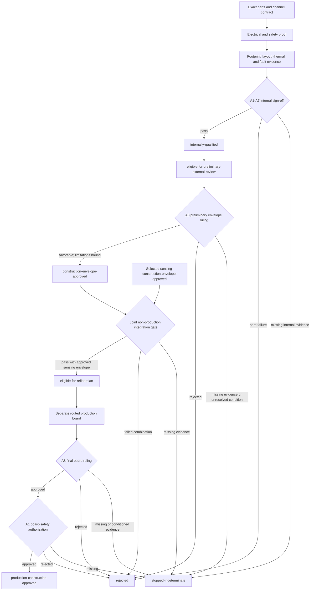
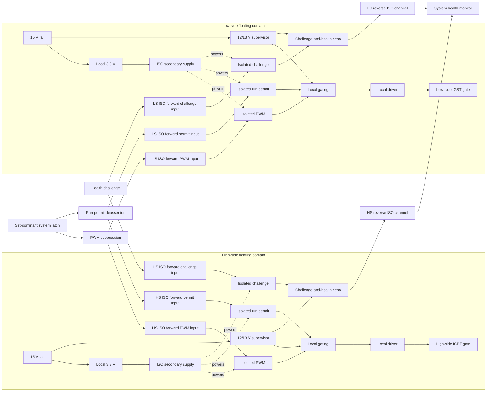
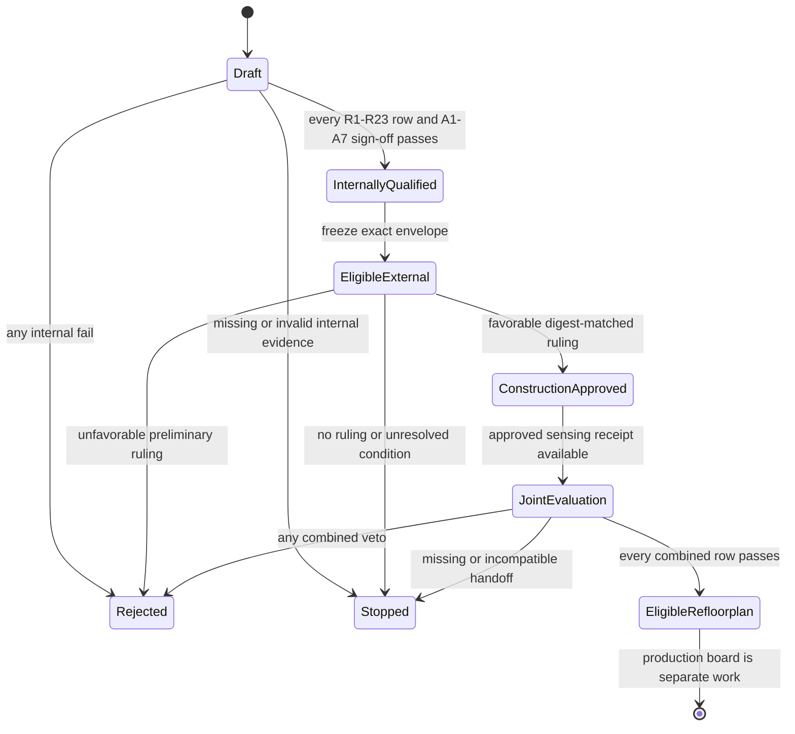
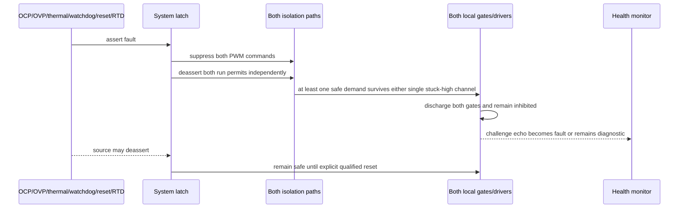
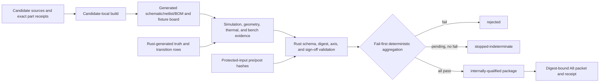
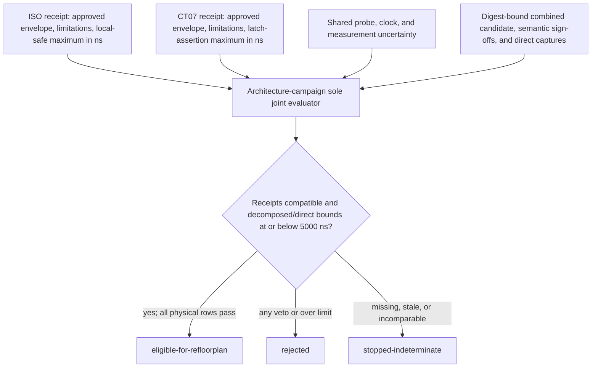

# ISO7741 Gate-Drive Owner Qualification - Plan

## Goal Capsule

- **Objective:** Produce an internally owned, evidence-backed gate-drive construction envelope that can earn preliminary external approval and pass joint non-production integration before a later production refloorplan, without weakening Temper's protection behavior or PD3 bar.
- **Means:** Qualify two `ISO7741FQDWWRQ1` isolation devices, one per switch domain, with supervised local gate-driver stages and independently traceable safe-state control and health reporting.
- **Product authority:** `docs/evidence/2026-09-01-gate-replacement-iso7741-authority-request.md`, `docs/FUNCTIONAL_TEST_CRITERIA.md`, and `docs/hardware/UCC21550_INTERFACE_CONTRACT.md` define the incumbent contracts this work must preserve or explicitly supersede.
- **Open blockers:** None before planning; preliminary external approval and joint integration remain refloorplan blockers, and final approval of the routed production board remains a production-release blocker.

---

## Product Contract

**Product Contract preservation:** Product Contract meaning is unchanged; R1-R27, A1-A8, F1-F5, and AE1-AE11 retain their original meaning and stable identifiers.

### Summary

Temper will own the electrical, safety, component, footprint, layout-proof, thermal, sourcing, and verification decisions needed to turn the ISO7741 replacement from `stopped-indeterminate` into a frozen construction envelope.
The package will qualify a supervised dual-path control mechanism against the incumbent gate-drive contracts, obtain a preliminary external ruling on that envelope, and participate in a joint non-production integration gate with the selected sensing construction.
The routed production board remains a later implementation that requires a final external ruling on its exact construction.

### Problem Frame

The DWW-16 `ISO7741-Q1` package is the only declared replacement candidate with published package spacing above the 12.6 mm governing corridor, but package spacing alone does not create a working or certifiable gate drive.
The existing candidate has no approved local-driver selection, no complete footprint set, no closed two-device timing budget, no demonstrated 12/13 V UVLO behavior, and no replacement-specific shutdown, loop, thermal, or failure-mode evidence.
Treating those gaps as somebody else's owner rulings would leave the core design undecided even though Temper owns every one except the final standards interpretation.

### Approaches Considered

| Approach | Mechanism | Advantages | Liabilities and unknowns | Best suited for |
|---|---|---|---|---|
| Command-only transport | One forward PWM channel per isolator feeds a local driver; primary-side PWM suppression carries most shutdown responsibility. | Smallest support circuit and simplest timing model. | A default, stuck, or supply-faulted isolation output can bypass the intended shutdown semantics unless added local protection recreates the supervised design. | A non-safety switching product where loss of command is already guaranteed safe. |
| Supervised dual-path control | Each switch domain receives its PWM command and a separately traceable safe-state signal, while the reverse channel reports local rail or driver health. | Uses the DWW device's available channel directions, preserves independent shutdown observability, and closes UVLO and supply-loss behavior at the affected domain. | Adds local supervision and requires a complete fault-priority and timing budget. | Temper's current safety-latched half bridge. |
| Liveness-coded local authority | Each local stage requires a continuously valid command or heartbeat and times out safe when the control stream becomes static or malformed. | Converts several stuck-at faults into safe shutdown and provides the strongest loss-of-control behavior. | Introduces a new local state machine, new timing failure modes, and more verification than the present protection contract calls for. | A later escalation if the supervised dual-path FMEA cannot contain a credible single fault. |

**Recommendation:** Use supervised dual-path control.
It is the smallest mechanism that preserves Temper's set-dominant shutdown intent across two independent floating domains and makes local rail failure visible, while avoiding a new encoded-control protocol that the current safety case does not require.

### Key Decisions

- **Qualify a supervised channel in each floating domain.** Governs R1-R4, R9-R11.
- **Preserve the 12/13 V gate-rail UVLO contract rather than accepting a local driver's lower internal UVLO.** Governs R7, R10-R12.
- **Use the stricter critical-loop checklist as the owner acceptance bar; the uncited 500 mm² physics threshold is diagnostic only.** Governs R14-R16.
- **Use two external authority stages.** A8 rules preliminarily on the frozen construction envelope before refloorplanning and finally on the routed production board; neither ruling substitutes for Temper-owned engineering. Governs R19, R21, and R26-R27.
- **Keep production artifacts frozen throughout qualification.** Governs R20.
- **Make every gate and health state explicit before sign-off.** A versioned truth table and replayable oracle govern command, safe-state, health, reset, default, and supply-loss behavior. Governs R3, R11-R12, and R22-R23.
- **Require a joint non-production integration gate.** Separately approved gate-drive and sensing envelopes do not become refloorplan-eligible until their combined physical and shutdown contracts coexist. Governs R24-R25.

<!-- ce-section: work-relationships -->
### How This Work Fits Together

This plan owns the ISO7741 gate-drive replacement's internal architecture, frozen construction envelope, preliminary external ruling, and contribution to the joint integration gate; the broader breakdown is context, not a committed roadmap.

- **Can proceed independently of:** the CT07/T2 sensing redesign through internal qualification and preliminary external review, because each domain has a separate electrical and mechanical acceptance boundary.
- **Shares with:** the component-architecture qualification gate, whose current ISO7741 candidate and reason codes identify the gaps this work closes.
- **Converges with:** the frozen CT07/T2 or other selected sensing envelope at a digest-bound, non-production integration gate that owns simultaneous physical feasibility and the OCP-02 shutdown handoff.
- **Enables:** a separate domain-first production refloorplan only after both selected domain envelopes are preliminarily approved and their joint gate passes.
- **Does not include:** production-board mutation, DRC-ceiling remeasurement, final approval of the routed board, or import of a new verdict into the canonical qualification evidence.

### Actors

- A1. **Board/architecture owner:** owns the replacement mechanism, preservation of system behavior, and the decision to advance or reject the package.
- A2. **Electrical/power owner:** owns channel references, driver and supervisor selection, timing, gate-network, UVLO, CMTI, supply, and thermal electrical evidence.
- A3. **Safety owner:** owns fault priority, set-dominant shutdown, safe-state behavior, reset authorization, and single-fault disposition.
- A4. **PCB/layout owner:** owns reviewed footprints, isolation-corridor proof, gate and bootstrap loop evidence, and manufacturability constraints.
- A5. **Mechanical/thermal owner:** owns package mounting, airflow, vibration, assembly, service access, and the construction submitted for review.
- A6. **Sourcing owner:** owns exact orderability, lifecycle, approved sources, alternates, and change control for every selected component.
- A7. **Verification owner:** owns evidence identity, calibrated tests, reproducibility, coverage traceability, and final internal-package acceptance.
- A8. **External certification/compliance authority:** alone owns the IEC 60335-1 and PD3 construction ruling; this actor is outside Temper's internal sign-off chain.

### Requirements

**Architecture and domain behavior**

- R1. The architecture shall use one `ISO7741FQDWWRQ1` barrier and one local gate-driver stage for each of the high-side and low-side switch domains, with no shared secondary reference between them.
- R2. Each switch domain shall receive an independently traceable PWM command and safe-state command and shall return an independently traceable local-health indication.
- R3. System-facing `SHUTDOWN` shall remain active-high and set-dominant, while any post-barrier encoding shall make de-energized, floating, reset, and default-output states safe.
- R4. The high-side stage shall reference `SW_NODE`, the low-side stage shall reference the low-side floating return, and neither stage shall create an undeclared bridge to `gnd`, `CTRL_GND`, or the other switch domain.

**Component and supply contract**

- R5. Every isolator, local driver, supervisor, support component, and footprint shall have an exact MPN, package code, pin contract, immutable manufacturer source identity, lifecycle result, approved source, and reviewed land pattern.
- R6. Each local drive stage shall have a reviewed operating envelope covering 3.3 V input compatibility, 15 V operation, source/sink performance, gate charge, absolute maximums, and CMTI.
- R7. Each gate rail shall enter its safe state below 12.0 V falling and shall recover only above 13.0 V rising under the qualified tolerance, temperature, and ramp-rate corners.
- R8. Existing gate resistors, pulldowns, negative-bias elements, bootstrap parts, and floating supplies may be retained only when replacement-specific corner analysis and measurement approve their values and references.

**Timing and switching behavior**

- R9. The complete worst-case high-side versus low-side path shall deliver at least 300 ns effective non-overlap and at least 50 ns margin over the verified worst-case IGBT turn-off time across component spread, supply, load, and temperature.
- R10. Startup, steady switching, shutdown, UVLO entry and recovery, reset, and one-channel-late behavior shall avoid cross-conduction and shall keep both gates in their required states.

**Safety and faults**

- R11. Every existing OCP, OVP, thermal, watchdog, firmware-runaway, reset, and independent RTD fault source shall force both local stages safe and remain latched until the qualified explicit reset sequence.
- R12. The FMEA shall cover isolator stuck-high and stuck-low, channel misconfiguration, local-driver input and output faults, each supply open and short, UVLO, bootstrap loss, resistor and pulldown faults, thermal shutdown, reset sequencing, CMTI disturbance, and cross-channel mismatch with a named safe state, detection path, response time, latent risk, and recovery authority for each case.

**Physical and thermal acceptance**

- R13. Digest-bound approved footprints and a representative complete-placement proof shall demonstrate a 12.6 mm straight isolation corridor for each barrier without relying on the DWW package headline or a slot detour as the board measurement.
- R14. Each routed gate loop shall remain below 200 mm².
- R15. Each gate path shall place its resistor within 5 mm of the driver, keep total gate trace below 30 mm, and pair gate with its source return.
- R16. Each routed bootstrap loop shall remain below 100 mm².
- R17. Worst-case dissipation and temperature evidence shall cover all isolators, local drivers, supervisors, bootstrap parts, and support components through the 70 C system ambient corner and the declared power-derating behavior.

**Evidence, authority, and change boundary**

- R18. The qualification package shall bind calculations, simulations, schematics, netlists, BOM, footprints, layout proofs, calibrated captures, and fault-injection results to immutable source identities and reproducible test conditions.
- R19. A1-A7 shall sign their owned internal-qualification rows under R1-R23 before preliminary external submission; the R24-R27 joint and downstream rows shall be signed only at their named later gates, and no Temper sign-off shall be represented as either A8 standards ruling.
- R20. Qualification shall not modify `pcb/temper.kicad_pcb`, `power_pcb_dataset/drc_ceiling.json`, `elec/domain_manifest.yaml`, `docs/ENVIRONMENTAL_SPEC.md`, `packages/temper-placer/src/temper_placer/core/isolation_constants.py`, the canonical `elec/src/` and `elec/ato.yaml` production electrical sources, production-generated schematic or netlist outputs, `docs/hardware/BOM.md`, or production firmware and configuration under `firmware/`; qualification schematics, netlists, BOMs, footprints, and board models shall remain candidate-specific artifacts with immutable identities.
- R21. Every required A1-A7 internal-qualification row under R1-R23 shall resolve to `pass`, `fail`, or `pending`: any fail produces `rejected`, otherwise any pending produces `stopped-indeterminate`, and only all-pass evidence produces `internally-qualified`. That all-pass verdict makes the frozen gate-drive envelope `eligible-for-preliminary-external-review` but does not qualify a combined architecture, authorize refloorplanning, or imply external approval.

**State, cross-domain, and staged-authority contract**

- R22. Before A1-A7 sign-off, the qualification package shall contain a versioned truth table and replayable test oracle covering each domain's PWM command, safe-state command, reverse-health indication, isolator supply, local-driver supply, supervisor state, reset, floating input, and specified default output; every combination shall name the required gate state, system-visible health state, detection path, maximum response time, and reset authority, and every table row shall have reproducible evidence or a rejecting result.
- R23. The reverse-health contract shall make every unpowered, floating, reset, default, ambiguous, or stale state resolve to fault at the system side, and no health state shall clear, mask, or override a safe-state command.
- R24. If the selected sensing envelope includes CT07/T2 OCP-02, its firmware-independent system-facing active-high hardware-latch assertion shall reach both local safe-state paths, bring both gate stages safe within the shared qualified 5 µs end-to-end latency, remain set-dominant while the initiating fault is active and after source deassertion until the qualified explicit reset through the same reset authority as system `SHUTDOWN`, stay safe when the primary barrier supply or either local barrier/driver supply is lost, and pass combined fault injection on both paths; neither gate may remain enabled or resume from an OCP-02 event without that reset.
- R25. Before any combined architecture becomes `eligible-for-refloorplan`, the gate-drive and selected sensing envelopes shall each be `construction-envelope-approved`, and the component-architecture qualification campaign shall own one digest-bound, non-production combined candidate that demonstrates simultaneous corridor, loop, retention, thermal, interface, and R24 shutdown feasibility against both frozen contracts and every binding preliminary-ruling limitation; any failed axis rejects the combination, while missing evidence produces `stopped-indeterminate`.
- R26. A8 shall rule preliminarily on the exact frozen gate-drive construction envelope before it may become `construction-envelope-approved`; a favorable ruling may impose recorded limitations that bind the envelope and joint gate, while any unresolved condition leaves the envelope `stopped-indeterminate`, and no preliminary ruling shall be represented as final production approval.
- R27. After the separate production refloorplan produces a routed board, `production-construction-approved` shall require both A8's favorable final ruling on that exact production construction and a separately recorded A1 board-safety authorization; `eligible-for-refloorplan` shall not be represented as this final approval.

The evidence boundary has internal, preliminary-envelope, joint-integration, and final-board gates:



### Key Flows

- F1. **Architecture selection**
  - **Trigger:** The current ISO7741 candidate is `stopped-indeterminate`.
  - **Actors:** A1, A2, A3, A6
  - **Steps:** Freeze incumbent behavior, compare eligible local stages, select exact parts and channel roles, and reject any combination that cannot meet the owner contract.
  - **Outcome:** One versioned component and domain contract is ready for proof.
  - **Covers:** R1-R8.
- F2. **Electrical and safety qualification**
  - **Trigger:** Exact parts and channel roles are selected.
  - **Actors:** A2, A3, A7
  - **Steps:** Complete the R22 truth table and oracle, then exercise timing, UVLO, shutdown, reverse-health, recovery, corner, and fault cases from low-energy simulation through calibrated bench tests; freeze the R24 CT07 latch interface contract when that sensing envelope is selected, but defer its combined proof to F5.
  - **Outcome:** Every electrical, state, health, and safety row has a reproducible pass, a hard rejection, or named missing evidence that produces `stopped-indeterminate`.
  - **Covers:** R3, R9-R12, R18, R22-R23 and the R24 interface contract.
- F3. **Physical integration proof**
  - **Trigger:** The electrical architecture survives qualification.
  - **Actors:** A2, A4, A5, A7
  - **Steps:** Review footprints, construct a representative complete placement and routed loop proof, and produce geometry and thermal evidence without touching production artifacts.
  - **Outcome:** Physical feasibility is demonstrated, the architecture is rejected, or named missing evidence produces `stopped-indeterminate` before refloorplanning.
  - **Covers:** R13-R18, R20.
- F4. **Preliminary authority handoff**
  - **Trigger:** A1-A7 have produced the R21 verdict `internally-qualified` for the frozen envelope.
  - **Actors:** A1, A7, A8
  - **Steps:** A7 freezes the replayable envelope that produced the internal verdict, A1 confirms its identity, and A1 submits that exact envelope to A8 for the preliminary ruling.
  - **Outcome:** The envelope becomes `construction-envelope-approved` only with compatible binding limitations recorded, is rejected on an unfavorable ruling or definite limitation conflict, or remains `stopped-indeterminate` on named missing evidence, ambiguous scope, or an unresolved condition.
  - **Covers:** R18-R23, R26.
- F5. **Joint integration and downstream authority boundary**
  - **Trigger:** The gate-drive and selected sensing envelopes are each `construction-envelope-approved`.
  - **Actors:** A1-A5, A7
  - **Steps:** Supply the frozen ISO7741 envelope, evidence identities, owner signatures, and binding preliminary-ruling limitations to the component-architecture qualification campaign, which binds both domain contracts into one non-production candidate, exercises their simultaneous physical constraints and R24 shutdown handoff, and aggregates the joint verdict without changing production artifacts.
  - **Outcome:** The component-architecture qualification campaign marks the combination `eligible-for-refloorplan`, `rejected`, or `stopped-indeterminate`; only a later routed board with final A8 approval and separate A1 board-safety authorization can become `production-construction-approved`.
  - **Covers:** R20, R24-R27.

### Acceptance Examples

- AE1. **Covers R3, R10-R12, R22-R23.** Given either isolator or local-driver supply disappears while PWM was high, when the applicable truth-table row is exercised, then both local gate stages reach and remain safe, the affected reverse-health state resolves to fault at the system side, and no firmware action is needed.
- AE2. **Covers R7.** Given a candidate local driver whose internal UVLO falls near 5 V, when no separate 12/13 V supervisor closes the gate-rail criterion, then the component combination is rejected rather than accepted on the driver's internal UVLO claim.
- AE3. **Covers R9-R10.** Given nominal propagation delays pass but worst-case local-driver spread reduces effective non-overlap below the governed minimum, when the timing matrix is evaluated, then the architecture is rejected or its qualified dead-time target is increased and retested.
- AE4. **Covers R11.** Given OCP asserts and later clears, when no qualified reset has occurred, then both gates remain safe and PWM cannot resume.
- AE5. **Covers R3, R12, R22-R23.** Given one isolation output is forced stuck high or one reverse-health input becomes unpowered, floating, defaulted, or stale, when the independent safe-state path asserts, then the affected gate reaches the safe state within the approved response time and the system cannot observe a false healthy state.
- AE6. **Covers R13-R16.** Given the DWW isolator alone has published spacing above 14.5 mm but a local driver or routed return encroaches on the corridor or loop limits, when the complete placement is measured, then package spacing cannot produce a pass.
- AE7. **Covers R17-R18.** Given the four active ICs pass at room temperature, when the 70 C ambient and switching-load corner exceeds a selected part's derated temperature limit, then the internal result is rejected rather than recorded as a conditional pass.
- AE8. **Covers R19, R21, R26.** Given every internal owner signs and every internal test passes, when A8 has not ruled preliminarily on the exact frozen envelope, then the internal verdict is `internally-qualified` and the envelope is `eligible-for-preliminary-external-review`, not `construction-envelope-approved` or production-qualified.
- AE9. **Covers R11, R22-R24.** Given CT07/T2 OCP-02 is selected and its hardware latch asserts while one barrier supply is absent, when the combined fault oracle runs, then both local safe-state paths reach and remain safe within the approved latency and neither can resume before the qualified explicit reset.
- AE10. **Covers R25.** Given the separately approved gate-drive and sensing envelopes each pass alone but their combined non-production candidate violates a corridor, loop, retention, thermal, interface, or shutdown row, when the joint verdict is aggregated, then the combination is rejected rather than marked `eligible-for-refloorplan`.
- AE11. **Covers R26-R27.** Given the preliminary envelope ruling and joint integration gate pass, when either A8's final routed-board ruling or A1's separate board-safety authorization is missing, then the combined architecture remains only `eligible-for-refloorplan` and the routed board cannot be called `production-construction-approved`.

### Owner Sign-Off Model

| Authority | Required acceptance | Gate effect |
|---|---|---|
| A1 Board/architecture | Confirms the supervised dual-path mechanism, preserved system behavior, R21 lifecycle state, R25 joint handoff boundary, and separate final board-safety authorization under R27. | Missing sign-off stops the applicable package or final board gate. |
| A2 Electrical/power | Accepts R1-R10, R22-R23, and the electrical parts of R12 and R14-R17 for internal qualification; freezes the R24 interface contract internally and accepts its combined evidence at R25. | Any failed electrical, state-table, health, or latch-handoff row rejects the architecture or combination. |
| A3 Safety | Accepts R3, R10-R12, and R22-R23 for internal qualification; freezes R24 fault priority, latch, and reset semantics internally and accepts their combined evidence at R25. | Any unsafe or uncontained single fault rejects the architecture or combination. |
| A4 PCB/layout | Accepts R5, R13-R16, and the physical rows of R25 using approved footprints and measured geometry. | Failed geometry, loop, or joint-integration evidence rejects the architecture or combination. |
| A5 Mechanical/thermal | Accepts the construction, the mechanical parts of R13 and R17, and the joint construction under R25. | Missing evidence stops; a hard environmental, assembly, or combined-construction failure rejects. |
| A6 Sourcing | Accepts R5 for every exact orderable line and its change-control policy. | A missing sole-source identity stops; an unavailable required part rejects the combination. |
| A7 Verification | Accepts R18 and R20-R23 for internal qualification, then separately accepts R24-R27 coverage and replay at each named later gate. | Non-reproducible, incomplete, or mutable evidence stops the applicable gate. |
| A8 External certification/compliance | Rules preliminarily on the frozen construction envelope and finally on the routed production board under the applicable product standard and pollution degree. | Preliminary approval gates the joint integration stage; favorable final approval is necessary but requires A1's separate board-safety authorization before `production-construction-approved`. |

### Success Criteria

- All A1-A7 internal sign-offs required by R19 are complete with no blank internal owner row and produce exactly one R21 internal verdict; later-gate rows remain unsigned until their own evidence exists.
- Every in-scope qualification and joint-gate requirement has R18 evidence or a hard rejection, with no favorable claim supported only by a product-page headline or nominal calculation; the downstream R27 board gate remains unsigned until the separate routed-board work exists.
- The complete R18 package replays to the same result from a clean checkout.
- The preliminary A8 ruling is bound to the same frozen envelope the internal owners signed.
- The combination reaches `eligible-for-refloorplan` only after both selected envelopes are `construction-envelope-approved` and R25 passes.
- No result is called `production-construction-approved` before the routed board receives A8's favorable final ruling and A1's separate board-safety authorization.
- The protected production artifacts in R20 remain byte-identical.

### Scope Boundaries

**In scope**

- Exact isolator, local-driver, supervisor, support-part, and footprint qualification.
- Channel allocation, supply references, shutdown, UVLO, timing, gate-network, thermal, layout-proof, sourcing, and FMEA contracts.
- Low-energy and representative switching evidence needed for internal owner sign-off.
- A digest-bound preliminary external-review packet for the frozen gate-drive construction envelope.
- A digest-bound, non-production joint integration proof that consumes the frozen approved sensing envelope without redesigning it.

**Out of scope**

- Any downward change to the 12.6 mm PD3 corridor or any pollution-degree or voltage-domain reclassification.
- Production PCB placement or routing, DRC-ceiling remeasurement, production electrical-source, schematic, firmware, configuration, or BOM changes.
- The CT07/T2 sensing redesign itself; this unit consumes only its frozen approved envelope and verifies the shared shutdown and integration contracts.
- An internal substitute for the A8 certification ruling.
- Final A8 approval of the routed production board; R27 defines its downstream gate but this unit does not create that board or ruling.
- A liveness-coded local state machine unless the supervised dual-path FMEA proves it necessary.

### Dependencies, Assumptions, and Risks

**Dependencies**

- Current manufacturer-primary data for the exact DWW `F` ordering code and every selected local component.
- A representative switching fixture and calibrated probes that can observe both driver outputs and both IGBT `VGS` waveforms safely.
- The existing isolation qualification engine and authority packet as the consumer of the finished evidence.
- A frozen, preliminarily approved sensing-domain envelope before R25 can run.

**Assumptions**

- The two separate floating secondary domains remain a fixed architectural fact.
- The incumbent 3.3 V logic, 15 V gate rails, IGBT family, fault sources, and reset semantics remain product constraints unless a separate owner-approved requirements change supersedes them.
- The existing floating supply and bootstrap concept may be reused only after R8 passes.

**Risks**

- A local driver with no useful cross-device matching bound may consume the narrow timing margin even if its nominal delay is fast.
- A safe default at the isolator pin may become unsafe after local inversion, supply sequencing, or an unpowered supervisor; R22-R23 must expose rather than assume those states.
- Four active ICs and added supervision may satisfy electrical behavior but fail physical corridor, loop, or thermal integration.
- A complete internal package may still be rejected or conditioned during A8's preliminary envelope review.
- A preliminary envelope approval may not survive the routed production board, which is why final A8 approval remains a separate release gate.

### Planning Resolutions

The requirements-only artifact left no blocker before planning. Planning resolves its implementation questions as follows without changing the Product Contract:

| Product question | Planning resolution |
|---|---|
| Local driver and supervisor | Qualify the exact candidate baseline in Assumption P1 through U3-U5; any incompatibility rejects that baseline rather than weakening R5-R11. |
| Safe-state encoding and reverse health | KTD4 assigns two independent active-high forward permits plus diagnostic-only challenge/echo semantics; U1 and U4 prove every default and fault state. |
| Dead-time setting | KTD5 defines a conservative measured-bound derivation. U4 freezes the resulting candidate target; a required production firmware/config change is a downstream handoff, not an R20 exception. |
| Representative layout and fixtures | KTD6 and U5 define candidate-only Atopile, fixture-board, simulation, and bench artifact locations. |
| Preliminary and final A8 laboratory | The exact provider and provider-specific report format remain an external execution dependency. U7 produces a provider-neutral, digest-bound packet; no receipt produces `stopped-indeterminate`, and final routed-board review remains outside this plan. |

### Sources and Research

- `docs/evidence/2026-09-01-gate-replacement-iso7741-authority-request.md` — current gap inventory, manufacturer facts, frozen incumbent contracts, acceptance matrix, and authority split.
- `docs/evidence/2026-09-01-isolation-component-architecture-qualification.md` — current `stopped-indeterminate` verdict and protected-input boundary.
- `docs/evidence/2026-07-30-pd3-isolation-mechanism-alternatives.md` — two-device/two-driver mechanism and unresolved cross-device timing risk.
- `docs/hardware/UCC21550_INTERFACE_CONTRACT.md` — incumbent disable, latch, supply, domain, and dead-time authority.
- `docs/FUNCTIONAL_TEST_CRITERIA.md` and `docs/evidence/2026-07-25-uvl01-gate-drive-uvlo-unmeasured.json` — UVLO thresholds and proof that the current 12/13 V behavior is not measured.
- `docs/hardware/CRITICAL_LOOP_DESIGN.md` and `docs/evidence/2026-08-17-gate-drive-loop-inductance-check.md` — stricter loop checklist and the uncited status of the looser physics threshold.
- `docs/hardware/MILLER_CURRENT_ANALYSIS.md` — incumbent IGBT Miller-injection analysis; its negative-bias conclusion invalidates a 0 V off-bias planning baseline unless replacement-specific evidence formally supersedes it.
- `docs/hardware/SYSTEM_THERMAL_BUDGET.md` and `docs/ENVIRONMENTAL_SPEC.md` — ambient, derating, and construction context.
- `elec/src/components.ato`, `elec/src/modules.ato`, and `elec/domain_manifest.yaml` — current power devices, gate network, supply topology, and domain identities.
- `https://www.ti.com/product/ISO7741-Q1` and `https://www.ti.com/lit/ds/symlink/iso7741-q1.pdf` — current manufacturer identity, 3-forward/1-reverse channel direction, active status, timing, and DWW package facts.
- `https://www.ti.com/product/UCC27517A-Q1` and `https://www.ti.com/lit/gpn/ucc27517a-q1` — automotive single-channel driver identity, supply range, 4 A source/sink capability, supply-independent TTL/CMOS input thresholds, dual-input behavior, and low internal UVLO.
- `https://www.ti.com/product/TPS7B69-Q1` — automotive 40 V-input local 3.3 V regulator identity and operating envelope.
- `https://www.ti.com/product/TLV1701-Q1` — automotive open-collector comparator identity, supply range, and timing used by the external 12/13 V supervisor candidate.
- `https://www.ti.com/product/TLV431B-Q1` — automotive 0.5% low-voltage precision shunt-reference identity and DBZ orderable used by the supervisor candidate.
- `https://www.ti.com/product/SN74LVC1G08-Q1` — automotive two-input AND identity, partial-power-down behavior, and sub-5 ns local gating timing.
- `https://www.ti.com/product/SN74LVC1G04-Q1` — automotive inverter identity and partial-power-down behavior used to convert permit-and-rail-good into the driver's active-high inhibit input.

---

## Planning Contract

### Key Technical Decisions

- **KTD1. Put every qualification rule and lifecycle transition in `temper-quality-oracle`, with one sealed repository-I/O boundary.** Rust owns schema/protected-set policy, truth-table completeness, evidence-axis completeness, owner-signature coverage, stage transitions, ruling compatibility, and verdict precedence. `scripts/_lib/qualification_replay.py` owns secure open/read-once/hash/recheck and atomic publication for the existing architecture, ISO, CT07, and joint runners; those scripts remain argument/exit-code shims. Implements R18-R23 and extends the existing Rust owner without multiplying Python security-policy copies.
- **KTD2. Model internal qualification, preliminary authority, joint integration, and final production authority as separate stages.** The gate-domain evaluator may emit only the R21 internal result and R26 preliminary-envelope result. The shared Rust joint evaluator in `isolation_joint_qualification.rs` alone owns the aggregate R24 timing calculation, the inclusive 5000 ns comparison, and the R25 joint verdict; ISO and CT07 producers may validate and sign only their own domain terms and may not emit, cache, or independently compare an end-to-end total. No code in this plan can emit R27 `production-construction-approved`. Implements R19, R21, R24-R27.
- **KTD3. Build and replay only inside a candidate-specific workspace protected by base and post-run digests.** Candidate sources and ignored build scratch live below `elec/qualification/iso7741_gate_drive/`; committed canonical generated exports and machine evidence live below `power_pcb_dataset/qualification/iso7741_gate_drive/`. The protected snapshot binds both file bytes and directory membership, including initially absent production generated-output roots. The runner refuses a missing base pin, an added/removed/changed protected entry, a non-regular entry, a hardlink into a protected tree, an output escape, a clean-build/canonical-export byte mismatch, or a pre/post-run race. Implements R18 and R20.
- **KTD4. Allocate the isolator channels as PWM, active-high run permit, diagnostic challenge, and reverse diagnostic echo.** ISO7741F's default-low claim applies only in the datasheet-defined powered-receiver/enable state; every enable, receiver-power-loss, brownout, and high-impedance case is made safe by explicit pulls, power-on inhibition, and UCC27517A's two-input truth table. PWM drives the non-inverting input through a pulldown. `NOT(run-permit AND rail-good)` drives the inverting input through a pullup, so either primary PWM suppression or permit deassertion independently disables the driver. The primary state machine may assert only the low-side permit during a typed, bounded `precharge-authorized` mode; the high-side remains hard-inhibited and any latched fault asynchronously cancels both PWM and permit. The reverse path implements `echo = challenge AND local-health`; it proves response freshness but never overrides either safe-state path or becomes a liveness-coded local authority. Implements R2-R4, R10-R12, and R22-R23.
- **KTD5. Derive, do not assume, the candidate dead-time target.** The timing proof sums independent worst-case high-side and low-side isolator, local-logic, driver, gate-network, load, supply, and temperature extrema, then adds routed measurement uncertainty. The frozen target must yield at least 300 ns effective non-overlap and at least 50 ns over the verified worst-case IGBT turn-off bound. If the target differs from production configuration, the handoff records a later firmware/config requirement without editing `firmware/**` under R20. Implements R9-R10 and AE3.
- **KTD6. Use reviewed candidate footprints and sanctioned Rust geometry for the representative construction.** Corridor, gate-loop, bootstrap-loop, and placement evidence comes from the exact candidate board and exact footprint digests. Any rotation-sensitive calculation uses the repository's KiCad transform authority and non-orthogonal oracle cases; no new raw trigonometry or package-headline substitution is accepted. Implements R5 and R13-R18.
- **KTD7. Freeze and submit the construction envelope before production refloorplanning.** (session-settled: user-approved — chosen over final-only review: an early A8 ruling prevents a later refloorplan from embedding an unacceptable construction while preserving final routed-board authority.) A favorable preliminary receipt is valid only for the submitted construction, projection, and allowed-transform-policy digests and for limitations compatible with every immutable R1-R23 operating/safety constraint. A compatible limitation may bind use of that unchanged identity; it may not silently rewrite it. A definite limitation conflict rejects this application, ambiguous scope stops, and any requested construction, projection, or transform-policy change creates a new identity and requires renewed U3-U7 qualification and submission. Implements R19, R21, and R26-R27.
- **KTD8. Make the CT07 shutdown budget a shared, digest-bound joint calculation.** (session-settled: user-approved — chosen over domain-only qualification: separately passing domains can still violate the combined physical or 5 us shutdown contract.) The shared receipt schema names domain objects and fields explicitly: `ct07.sensor_threshold_to_system_latch_assertion_max_ns` and `iso.system_latch_assertion_to_both_gates_safe_max_ns`. Timing values and uncertainty components are checked non-negative integer nanoseconds in canonical decimal serialization. Any decimal source quantity is converted exactly, without binary floating point, and every maximum or uncertainty with a fractional nanosecond is rounded upward; negative, non-finite, non-canonical, or overflowing inputs are invalid. Only the shared Rust joint evaluator performs checked addition of both domain-inclusive maxima and joint-only uncertainty components exactly once and compares the integer result inclusively with 5000 ns. Duplicate or missing component IDs, double-counted terms, endpoint mismatch, undeclared correlation, or arithmetic overflow is invalid; 5001 ns rejects and exactly 5000 ns satisfies timing only when every other joint row passes. Implements R24-R25 and AE9-AE10.
- **KTD9. Treat evidence and authority receipts as immutable typed inputs, not narrative claims.** Every pass-producing record binds schema version, subject digest, source revision, source SHA-256, test conditions, tool identity, and owner. Owner dispositions also reference an immutable signature artifact, signer identity and domain-qualified semantic role, signed scope-node digest, envelope digest, verification method, and verifier ingestion record; external-authority dispositions instead bind the submission-index and envelope digests. Serialized roles use the `iso.*` or `ct07.*` registry defined by U8, never a bare actor number whose meaning differs between domain plans. Editable JSON metadata alone is not a signature. Duplicate, unknown, stale, superseded, wrong-domain, or construction-mutating signatures and limitations are invalid. Implements R5, R18-R19, and R21-R27.
- **KTD10. Freeze a transform-aware construction projection, not the representative fixture's absolute board coordinates.** Rust extracts each domain's exact part/net/footprint identity, local copper and relative geometry, boundary ports, and anchor frame into `construction_projection.json`, with canonical handoff fields `construction_projection_digest` and `allowed_transform_policy_digest`. Translation and declared 90-degree rotation may be allowed, but mirror, layer flip, scale, local-geometry change, boundary-port change, or any alteration or narrowing of the frozen transform policy changes identity and requires requalification. A compatible A8 limitation may bind use only within the unchanged policy; it cannot mutate that policy in place. The representative fixture board retains its own evidence digest. The preliminary packet asks A8 to rule on the projection plus its transform policy and fixture evidence; a ruling limited to the fixture's absolute placement cannot authorize U9. The combined candidate must extract byte-equivalent ISO and CT07 projections before joint evidence can count. Implements R13, R18, R25-R26 and AE6, AE8-AE10.
- **KTD11. Use scoped evidence digests so an evidence-only request has deterministic re-signing semantics.** `evidence_index.json` is a canonical DAG of immutable evidence objects and named owner-scope nodes. Each A1-A7 signature binds the construction digest plus only its assigned scope-node digest; A7's verification scope covers the full evidence root. Replacing evidence preserves construction identity, changes every referencing scope node, invalidates those owners plus A7, and preserves an unaffected signature only when its scope digest and every reachable byte remain identical. A8 signs the separate submission-index digest. No signature byte feeds the digest it signs. Implements R18-R19, R21, R26 and AE8.

### Assumptions

These are explicit planning bets because this plan was enriched non-interactively. Implementation must test them at the named fail-fast checkpoint; none may silently weaken the Product Contract.

- **P1 — exact electrical baseline:** start with two `ISO7741FQDWWRQ1` devices, two `UCC27517AQDBVRQ1` drivers, one `TPS7B6933QDBVRQ1` local 3.3 V regulator per floating domain, one `TLV1701QDBVRQ1` comparator plus one `TLV431BQDBZRQ1` reference and tolerance-bounded divider per 15 V rail, two `SN74LVC1G08QDBVRQ1` gates and one `SN74LVC1G04QDBVRQ1` inverter per domain for permit/rail inhibition and diagnostic echo. UCC27517A-Q1 is used instead of UCC27519A-Q1 because its input thresholds are supply-independent and specified for 3.3 V logic at a 15 V driver supply. U3 rejects or replaces the baseline through an explicit manifest revision if exact orderability, threshold, pin, temperature, default-state, or timing evidence fails; it does not patch around a contradiction informally.
- **P2 — negative off-bias baseline:** retain and rederive the incumbent -5.1 V zener-referenced topology because `docs/hardware/MILLER_CURRENT_ANALYSIS.md` concludes that 0 V off-bias is unsafe for the current IGBT family. With a 15 V driver span, U3 must explicitly qualify the resulting approximate -5.1/+9.9 V gate levels, UCC27517A supply/reference limits, conduction loss, and turn-on behavior before downstream artifacts exist. If the positive level is inadequate, the baseline rejects and a new negative-bias-capable supply/driver construction receives a new envelope identity; 0 V off-bias cannot become the fallback without evidence that supersedes the prior Miller conclusion.
- **P3 — typed bounded bootstrap precharge:** the representative candidate retains the bootstrap concept and includes `precharge-authorized` as a real primary/control-interface mode, not fixture-only behavior. After the central latch is clear and startup authorization is explicit, only the low-side run permit may assert and only bounded low-side pulses may occur; the high-side permit remains low. A fault, timeout, current violation, supply loss, reset, or re-entry attempt asynchronously cancels the mode and returns boot-disabled. U3-U4 bind pulse count/time/current, entry/exit priority, and the future production interface. A dedicated isolated high-side supply is a follow-up architecture, not a silent fallback inside the same digest.
- **P4 — explicit re-arm after every supply return:** a power cycle never counts as the qualified reset. Every domain returns disabled, health-faulted, and unarmed until the central reset/arm authority completes the same qualified sequence required after a latched fault.
- **P5 — candidate-local Atopile toolchain:** use the repository's currently invoked `atopile==0.2.69` in the candidate-local project, write only below that project, and record the tool version. If the installed compiler cannot express the candidate without touching `elec/ato.yaml` or `elec/src/**`, stop rather than using production outputs.
- **P6 — external laboratory:** the implementation may finish internally before an approved A8 provider and provider-specific template are selected. U7 must still create a provider-neutral packet; until a valid receipt exists, the envelope remains `eligible-for-preliminary-external-review` or `stopped-indeterminate`, never approved.

### High-Level Technical Design

The diagrams describe required relationships and state ownership; they are not circuit or API specifications.

#### Candidate electrical relationships



#### Qualification lifecycle



#### Startup and bootstrap protocol

```mermaid
sequenceDiagram
  participant System as System latch/fixture controller
  participant LS as Low-side domain
  participant Boot as High-side bootstrap
  participant HS as High-side domain
  System->>LS: hold run permit low; confirm safe default
  System->>HS: hold run permit low; health is fault while unpowered
  System->>System: clear latch and authorize startup-only precharge
  System->>LS: assert low-side permit; high-side permit remains low
  System->>LS: issue bounded precharge PWM pulses
  LS->>Boot: bounded low-side pulses charge high-side rail
  Boot-->>HS: 15 V and local 3.3 V enter valid windows
  System->>LS: remove precharge PWM and low-side permit
  System->>LS: alternate challenge and verify fresh echo
  System->>HS: alternate challenge and verify fresh echo
  System->>System: authorize full arm only after both paths pass
  System->>LS: assert run permit
  System->>HS: assert run permit
```

#### Set-dominant fault shutdown



#### Evidence data flow



#### Shared CT07 handoff



#### Mode and authority matrix

| Mode | Drive authority | Health interpretation | Exit authority |
|---|---|---|---|
| Unpowered/reset | none; local pulls and unpowered logic hold low | fault | power may recover, but explicit arm remains required |
| Bootstrap precharge | typed primary startup authority permits bounded low-side-only pulses; high side hard-inhibited | low side fresh, high side fault until rail valid | bounded completion; any fault/timeout/reset cancels and forbids automatic re-entry |
| Armed switching | PWM AND run permit AND rail-good in each domain | alternating challenge must produce fresh echo | any fault, stale echo policy, rail loss, or explicit stop |
| Latched safe | none; PWM suppressed and permit low independently | fault or diagnostic-only | qualified explicit reset after initiating fault clears |
| Preliminary review | no production authority | frozen evidence only | digest-matched A8 receipt |
| Joint evaluation | no production authority | both signed handoffs | architecture-campaign verdict only |

### Output Structure

```text
elec/qualification/iso7741_gate_drive/
├── ato.yaml
├── src/
│   ├── components.ato
│   ├── modules.ato
│   └── main.ato
├── footprints/temper_iso7741_gate_drive.pretty/
│   ├── ISO7741_DWW16.kicad_mod
│   ├── Package_DBV5.kicad_mod
│   └── Package_DBZ3.kicad_mod
├── build/                         # ignored scratch; never an evidence source
│   ├── default.net
│   └── default.csv
├── layout/iso7741_gate_drive_fixture.kicad_pcb
└── validation/
    ├── iso7741_gate_drive_corner.cir
    ├── iso7741_gate_drive_faults.cir
    ├── schematic_layout.json
    └── fixture_contract.json

power_pcb_dataset/qualification/iso7741_gate_drive/
├── manifest.json
├── source_receipts.json
├── generated/
│   ├── iso7741_gate_drive.kicad_sch
│   ├── iso7741_gate_drive_stage.kicad_sch
│   ├── iso7741_gate_drive.net
│   └── iso7741_gate_drive.csv
├── truth_table_evidence.json
├── transition_evidence.json
├── electrical_evidence.json
├── fault_injection_evidence.json
├── geometry_evidence.json
├── thermal_evidence.json
├── bench_evidence.json
├── construction_projection.json
├── evidence_index.json
├── owner_signoffs.json
├── internal_decision.json
├── authority/
│   ├── submission_index.json
│   ├── preliminary_ruling.json
│   └── signed/
│       └── <artifact-id>.<ext>
├── preliminary_decision.json
└── joint_handoff.json

power_pcb_dataset/qualification/isolation_joint/
├── contract.json
├── manifest.json
├── combined_candidate.json
├── corridor_evidence.json
├── loop_evidence.json
├── retention_evidence.json
├── thermal_evidence.json
├── interface_evidence.json
├── shutdown_evidence.json
├── fault_injection_evidence.json
├── owner_signoffs.json
├── captures/
│   └── <row-id>/
│       ├── manifest.json
│       └── raw.<ext>
└── decision.json

elec/qualification/isolation_joint/
├── interface_contract.json
├── layout/isolation_joint_candidate.kicad_pcb
└── validation/fixture_contract.json
```

### Implementation Constraints

- The protected set is rooted at the campaign base revision and includes the five existing isolation-campaign protected files, the complete `elec/src/**` inventory, `elec/ato.yaml`, every production `pcb/*.kicad_sch`, `docs/hardware/BOM.md`, and tracked production firmware/configuration plus any newly added source/config entry under `firmware/**` outside declared build/cache roots. The snapshot records absent-directory state for `elec/build/`; creating, removing, or changing `default.net`, `default.csv`, or another production-generated electrical output is a hard failure. Directory inventories reject additions, removals, non-regular entries, symlinks, hardlink aliases, and byte changes.
- Candidate outputs must resolve beneath `elec/qualification/iso7741_gate_drive/` or `power_pcb_dataset/qualification/iso7741_gate_drive/`; symlink, `..`, hardlink, alternate-case, or output-root escape attempts fail before publication.
- `elec/qualification/iso7741_gate_drive/build/` is disposable, globally ignored scratch. A clean candidate build must byte-compare its `default.net`/`default.csv` and generated schematic with committed canonical exports below `power_pcb_dataset/qualification/iso7741_gate_drive/generated/`; only those committed copies may enter evidence or envelope digests.
- The exact part baseline is a candidate to qualify, not a favorable conclusion. Source receipts must use manufacturer-primary document identifiers and reviewed-byte SHA-256 values; distributor inventory may support sourcing but cannot establish electrical ratings.
- The UVLO proof must contain all-corner inequalities: the gate is inhibited at and below 12.0 V, cannot become eligible until at and above 13.0 V, and cannot chatter or re-arm during slow/noisy ramps. Comparator offset, reference tolerance, input bias, divider tolerance/tempco, hysteresis, pull-up domain, startup, and propagation are part of the bound.
- Truth-table axes are finite typed enums, not free-form labels. Rust generates every canonical row key, rejects duplicates and omissions, and permits `unreachable-with-proof` only when a named invariant is machine-checked. Cross-domain transitions cover one-channel-late and mismatch cases separately from steady-state rows.
- Health means only that a challenge transition returned through the declared local-health gate within its deadline. It does not prove gate voltage, driver output integrity, comparator integrity, or local safe-state-channel integrity; those remain explicit fault-injection rows.
- Timing evidence separates manufacturer extrema, conservative uncorrelated extrema where matching is unspecified, simulation, and representative routed measurement. Shared timing and uncertainty values use checked integer nanoseconds; exact decimal-to-nanosecond conversion rounds every safety maximum and uncertainty upward, rejects overflow or non-canonical input, and serializes one canonical integer form. Sample measurements may validate a model but cannot replace absent production bounds with nominal averages.
- The shared start event is the same deterministic threshold-crossing event the CT07 producer signs: the first crossing in the declared fault direction of the applicable R3 primary-current threshold on the calibrated primary-current trace after the armed capture epoch. The contract binds threshold value and units, polarity/direction, sample-clock identity, calibration, any permitted preprocessing, and an exact rational interpolation rule; equality/plateau selects the earliest qualifying sample. A CT-secondary, burden, comparator, latch, trigger, or post-filter proxy is not the start event. Missing bracketing samples, ambiguous multiple crossings under the signed rule, clipped data, or producer/joint semantic-digest mismatch invalidates the timing row.
- A8 limitations may constrain use without changing the submitted identity only when Rust proves them compatible with R1-R23 and the frozen construction, projection, and allowed-transform-policy bytes remain identical. A requested part, footprint, threshold, channel, layout, protocol, construction projection, or transform-policy change—including policy narrowing—invalidates the receipt, creates a new construction identity, and returns to U3-U7. An evidence-only request preserves construction identity but creates a new evidence revision and invalidates every changed owner scope plus A7 before U7 resubmission.
- The Rust module is registered exactly once in pyo3 and in the generated wasm registry. The runner is added to `scripts/manifest.yaml`, and `scripts/trace_invocations.py` refreshes the committed invocation graph.
- Build Rust extensions with the repository-supported maturin flow and verify freshness immediately before evidence replay. Do not trust a fast cached rebuild or a bare cargo build that leaves an unloadable or stale extension.

### Required Evidence Axes

Unknown or duplicate axis codes invalidate the package. A missing mandatory internal axis is an input error, while an explicitly `pending` row with named evidence and owner produces `stopped-indeterminate`.

| Axis code | Primary owner | Required proof | Governs |
|---|---|---|---|
| `identity.exact_parts` | A2, A6 | exact MPN/package/pin contracts and approved-source status | R1, R5-R8 |
| `identity.manufacturer_sources` | A6, A7 | document revision, retrieval identity, reviewed-byte digest | R5, R18 |
| `topology.domain_separation` | A1, A2 | two secondary references with no undeclared bridge | R1-R4 |
| `topology.channel_contract` | A2, A3 | PWM, permit, challenge, echo polarity and default-state proof | R2-R4, R22-R23 |
| `state.truth_table` | A3, A7 | complete canonical steady-state rows and evidence references | R3, R10-R12, R22-R23 |
| `state.transition_matrix` | A3, A7 | startup, recovery, reset, mismatch, and one-channel-late transitions | R10-R12, R22-R23 |
| `safety.fault_matrix` | A3, A7 | every R12 fault with safe state, detection, latency, residual, reset | R11-R12 |
| `uvlo.all_corner_thresholds` | A2 | 12/13 V inequalities, ramp/noise behavior, measured confirmation | R7, R10-R12 |
| `timing.non_overlap` | A2, A7 | path extrema, IGBT turn-off bound, candidate target, routed captures | R9-R10 |
| `timing.local_safe_latency` | A2, A3, A7 | latch-input-to-both-gates-safe maximum and uncertainty | R11, R24 |
| `power.bootstrap_startup` | A2, A3 | precharge, hold-up, duty/frequency corners, loss and recovery | R8, R10-R12 |
| `power.gate_network_and_bias` | A2 | gate charge, current, resistor/pulldown, Miller/dV/dt, off bias | R6, R8-R10 |
| `layout.isolation_corridors` | A4, A5 | exact footprint/board digest and two 12.6 mm straight corridors | R13 |
| `layout.gate_loops` | A2, A4 | both loops under 200 mm2, resistor distance, trace and return pairing | R14-R15 |
| `layout.bootstrap_loop` | A2, A4 | high-side bootstrap loop under 100 mm2 | R16 |
| `thermal.environment_corner` | A2, A5 | 70 C ambient and derating for every active/support part | R17 |
| `verification.fixture_calibration` | A7 | fixture identity, instrument calibration, probes, sample/lot conditions | R18 |
| `reproducibility.protected_inputs` | A1, A7 | base, pre-run, and post-run protected-set identities | R18, R20 |
| `owners.internal_signoffs` | A1-A7 | exact requirement/axis rows, evidence digests, no superseded signature | R19, R21 |
| `authority.preliminary_ruling` | A8 | digest-matched favorable/reject/unresolved receipt and limitations | R26 |
| `handoff.joint_contract` | A1-A5, A7 | approved receipt, limitations, latency term, interface and geometry digest | R24-R25 |

### Shared Semantic Signer Registry

The shared contract never serializes a bare `A1`-`A8` role because those actor numbers have different meanings in the ISO and CT07 Product Contracts. It uses this closed, domain-qualified registry and rejects aliases, unknown roles, and cross-domain substitutions.

| Serialized role | Product Contract role |
|---|---|
| `iso.board_architecture` | ISO A1 Board/architecture owner |
| `iso.electrical_power` | ISO A2 Electrical/power owner |
| `iso.safety` | ISO A3 Safety owner |
| `iso.pcb_layout` | ISO A4 PCB/layout owner |
| `iso.mechanical_thermal` | ISO A5 Mechanical/thermal owner |
| `iso.sourcing` | ISO A6 Sourcing owner |
| `iso.verification` | ISO A7 Verification owner |
| `iso.external_compliance` | ISO A8 External certification/compliance authority; receipt authority only, never a combined-axis owner |
| `ct07.board_product_safety` | CT07 A1 Board and product-safety owner |
| `ct07.electrical` | CT07 A2 Electrical owner |
| `ct07.mechanical_assembly` | CT07 A3 Mechanical and assembly owner |
| `ct07.pcb_insulation_layout` | CT07 A4 PCB and insulation-layout owner |
| `ct07.verification` | CT07 A5 Verification owner |
| `ct07.sourcing_manufacturing` | CT07 A6 Sourcing and manufacturing owner |
| `ct07.external_certification` | CT07 A7 External certification authority; receipt authority only, never a combined-axis owner |

`owner_signoffs.json` carries one row per required semantic role and combined axis. Both domain verification roles sign replay/provenance for every combined axis, and a verifier must be a different contributor from the evidence creator or decision owner it verifies. External-authority roles remain immutable receipt signers and are referenced through the two approved handoffs; they are not copied into combined owner dispositions.

| Combined axis code | Required domain decision owners | Required independent verification |
|---|---|---|
| `joint.identity_limitations` | `iso.board_architecture`, `ct07.board_product_safety` | `iso.verification`, `ct07.verification` |
| `joint.corridor` | `iso.pcb_layout`, `iso.mechanical_thermal`, `ct07.mechanical_assembly`, `ct07.pcb_insulation_layout` | `iso.verification`, `ct07.verification` |
| `joint.loop` | `iso.electrical_power`, `iso.pcb_layout`, `ct07.electrical` | `iso.verification`, `ct07.verification` |
| `joint.retention` | `iso.mechanical_thermal`, `ct07.mechanical_assembly`, `ct07.pcb_insulation_layout` | `iso.verification`, `ct07.verification` |
| `joint.thermal` | `iso.electrical_power`, `iso.mechanical_thermal`, `ct07.electrical`, `ct07.mechanical_assembly` | `iso.verification`, `ct07.verification` |
| `joint.interface` | `iso.electrical_power`, `iso.safety`, `ct07.board_product_safety`, `ct07.electrical` | `iso.verification`, `ct07.verification` |
| `joint.shutdown_fault` | `iso.electrical_power`, `iso.safety`, `ct07.board_product_safety`, `ct07.electrical` | `iso.verification`, `ct07.verification` |
| `joint.timing_evidence` | `iso.electrical_power`, `iso.safety`, `ct07.electrical` | `iso.verification`, `ct07.verification` |
| `joint.reproducibility_verdict` | `iso.board_architecture`, `ct07.board_product_safety` | `iso.verification`, `ct07.verification` |

### System Impact

- **Rust ownership:** one new gate-domain evaluator and one shared joint evaluator extend `temper-quality-oracle`; existing public behavior is unchanged outside new schema-versioned entry points.
- **Python boundary:** two thin offline runners handle repository I/O and atomic publication. No circuit, safety, lifecycle, or aggregation rule is duplicated in Python.
- **Electrical design:** all Atopile sources, generated schematic/netlist/BOM, footprints, simulations, and layout stay in the candidate tree. Production sources and board remain byte-identical.
- **Firmware:** no production code or config changes. The frozen envelope may emit later requirements for dead time, challenge cadence, timeout, bootstrap precharge, and explicit arm/reset semantics.
- **Verification:** focused Rust, pyo3, script, Atopile-contract, geometry-oracle, simulation, and evidence-replay tests are added. Bench/A8 absence is represented as pending evidence, not a green test substitute.
- **Shared campaign:** the architecture campaign gains the only consumer of signed gate and CT07 receipts, one digest-bound non-production combined candidate/evidence package, and the only R24-R25 combined verdict path; neither domain package nor receipt compatibility alone can self-approve joint integration.

### Sequencing

1. **Phase A — safety kernel, repository boundary, and shared contract:** U1-U2 establish typed state/lifecycle ownership, protected inputs, and deterministic replay, then U8 freezes and proves the shared receipt/evaluator contract before either domain publishes against it. CT07 may begin its conforming publication work as soon as this checkpoint passes; no A8 receipt is required.
2. **Phase B — candidate construction and proof:** U3 fixes the exact electrical construction; U4 proves state, timing, UVLO, shutdown, and fault behavior; U5 proves representative physical, thermal, and bench feasibility.
3. **Phase C — authority and real shared integration:** U6 freezes A1-A7 evidence, U7 ingests the preliminary A8 ruling, and U9 builds/measures the non-production combined candidate before consuming its evidence, the U7-approved gate handoff, and CT07's U8-approved handoff through the already-proved U8 R24-R25 gate.

---

## Implementation Units

### U1. Typed gate-domain qualification and lifecycle engine

**Goal:** Create the Rust source of truth for candidate identity, truth/transition completeness, evidence axes, sign-offs, staged authority, and deterministic verdicts.

**Requirements:** R1-R23, R26; KTD1-KTD2, KTD4, KTD9-KTD11.

**Dependencies:** None.

**Files:**

- `packages/temper-quality-oracle/src/iso7741_gate_drive_qualification.rs` (create)
- `packages/temper-quality-oracle/src/lib.rs`
- `packages/temper-quality-oracle/src/wasm_test_registry.rs` (regenerate)
- `scripts/gen_wasm_test_registry.py` (only if discovery cannot register the new module without a generic fix)

**Approach:** Define schema-versioned typed inputs for the candidate envelope, canonical state axes, transition scenarios, evidence rows, owner signatures, preliminary receipts, limitations, and stage results. Generate truth-row identities from finite enums; require evidence for every reachable row and proof for every unreachable row. Validate the ISO owner matrix by R-ID and stage, serializing the Product Contract actors through the closed `iso.*` semantic-role registry rather than bare actor numbers. Aggregate deterministically with failure precedence, then pending, then the exact R21/R26 success state. Keep R24-R25 and R27 impossible in this module.

**Execution note:** Implement invalid-input, failure-precedence, and lifecycle-legality cases before the all-pass path; a green happy path alone is not safety evidence.

**Patterns to follow:** `packages/temper-quality-oracle/src/isolation_qualification.rs` for typed deterministic verdicts; `packages/temper-quality-oracle/src/types.rs` for public result conventions; generated wasm registry markers for test discovery.

**Test scenarios:**

- Covers AE1 and AE5. Loss of either isolation/local supply while PWM is high requires the affected local gate low, health fault, and no firmware-dependent recovery; any contradictory row rejects.
- Covers AE2. A driver with internal UVLO below the governed band cannot pass without the external all-corner supervisor axis.
- Covers AE3. Nominal timing may pass while worst-case path spread fails; the result rejects until a larger candidate target and new evidence are supplied.
- Covers AE4. Clearing a fault source without the explicit reset leaves every drive state inhibited.
- Covers AE8. Complete A1-A7 internal evidence yields `internally-qualified` and external-review eligibility, never preliminary or production approval.
- Missing, duplicate, unknown, stale, or superseded axes/signatures are invalid, and a package with both `fail` and `pending` resolves `rejected`.
- Every generated steady-state key is represented exactly once; `unreachable-with-proof` without a passing invariant is invalid.
- A favorable A8 receipt for a different envelope digest, or a condition that changes construction, cannot yield `construction-envelope-approved`.
- A favorable A8 receipt with a limitation that definitely excludes an R1-R23 operating/safety constraint rejects this application; ambiguous limitation scope stops; only compatible limitations can approve.
- Replacing one evidence object invalidates every changed owner-scope digest plus A7's full-verification scope, while an unrelated owner signature remains valid only when its scope digest and all reachable bytes are unchanged.
- Permuting evidence, state rows, signatures, or limitations yields byte-stable canonical output ordering.

**Verification:** Native Rust tests and the generated wasm registry execute the same lifecycle, completeness, precedence, and canonicalization cases.

### U2. Thin pyo3 boundary, protected-set runner, and manifest skeleton

**Goal:** Expose the Rust evaluator through one registration and create a fail-closed, offline repository runner that cannot mutate protected production artifacts.

**Requirements:** R18-R23, R26; KTD1-KTD3, KTD9.

**Dependencies:** U1.

**Files:**

- `packages/temper-quality-oracle/src/lib.rs`
- `scripts/check_iso7741_gate_drive_qualification.py` (create)
- `scripts/_lib/qualification_replay.py` (create)
- `scripts/tests/test_qualification_replay.py` (create)
- `scripts/check_isolation_architecture_qualification.py`
- `packages/temper-placer/tests/scripts/test_check_isolation_architecture_qualification.py`
- `scripts/manifest.yaml`
- `scripts/invocation_graph.json` (regenerate)
- `packages/temper-placer/tests/rust_integration/test_quality_oracle.py`
- `packages/temper-placer/tests/scripts/test_check_iso7741_gate_drive_qualification.py` (create)
- `power_pcb_dataset/qualification/iso7741_gate_drive/manifest.json` (create)
- `power_pcb_dataset/qualification/iso7741_gate_drive/source_receipts.json` (create)

**Approach:** Register one uniquely named pyo3 function that accepts the serialized qualification package and returns the Rust result. The runner securely resolves and opens each candidate/evidence file once, reads one byte buffer, derives its digest and Rust payload from that same buffer, then rechecks file identity before publication. It checks base identity plus protected directory membership and pre/post-run bytes; rejects symlinks/hardlinks/races/output escapes; invokes Rust; and atomically writes only an explicit candidate output. Record source document identity without fetching the network during replay.

**Patterns to follow:** Extract the proven base-tree containment, protected hashes, file-descriptor rechecks, and atomic-output behavior from `scripts/check_isolation_architecture_qualification.py` into the sealed helper, then keep the existing runner's focused regression suite green. Evaluator-specific scripts supply schemas/arguments but cannot fork the secure replay mechanics.

**Test scenarios:**

- Valid JSON crosses the rebuilt extension and matches direct Rust output; invalid JSON and unsupported schema versions fail with stable diagnostics.
- The module exports exactly one new evaluator registration, preventing silent pyo3 shadowing.
- Normal replay writes beneath the candidate tree and leaves every R20 protected path byte-identical.
- Missing base pins, changed pre/post hashes, added/removed protected entries, initially absent `elec/build/` created during replay, hardlink aliases, symlinks, non-regular files, case/path traversal, output-root escape, and file replacement between resolution/read/evaluation all fail before a favorable output.
- Source receipts with blank document revision, non-SHA-256 identity, future/superseded review state, or missing A6/A7 ownership cannot support `pass`.
- Two identical replays produce byte-identical output with no wall-clock field in the canonical result.
- The existing architecture runner, new ISO runner, and a minimal fake evaluator all traverse the same sealed helper; mutation tests fail each caller identically and source inspection shows no duplicate secure-open/publication implementation in the runners.

**Verification:** Focused Rust integration and runner tests pass against the rebuilt real extension; script manifest and invocation graph checks recognize the new runner.

### U3. Candidate-only electrical construction and exact footprint set

**Goal:** Produce one exact, buildable two-domain schematic/netlist/BOM/footprint envelope without touching canonical electrical sources.

**Requirements:** R1-R8, R10-R13, R17-R18, R20, R22-R23; KTD3-KTD4, KTD6; Assumptions P1-P2, P5.

**Dependencies:** U2.

**Files:**

- `elec/qualification/iso7741_gate_drive/ato.yaml` (create)
- `elec/qualification/iso7741_gate_drive/src/components.ato` (create)
- `elec/qualification/iso7741_gate_drive/src/modules.ato` (create)
- `elec/qualification/iso7741_gate_drive/src/main.ato` (create)
- `elec/qualification/iso7741_gate_drive/footprints/temper_iso7741_gate_drive.pretty/ISO7741_DWW16.kicad_mod` (create)
- `elec/qualification/iso7741_gate_drive/footprints/temper_iso7741_gate_drive.pretty/Package_DBV5.kicad_mod` (create)
- `elec/qualification/iso7741_gate_drive/footprints/temper_iso7741_gate_drive.pretty/Package_DBZ3.kicad_mod` (create)
- `elec/qualification/iso7741_gate_drive/validation/schematic_layout.json` (create; candidate root filename and sheet mapping)
- `elec/qualification/iso7741_gate_drive/build/default.net` (ignored scratch; generate only)
- `elec/qualification/iso7741_gate_drive/build/default.csv` (ignored scratch; generate only)
- `power_pcb_dataset/qualification/iso7741_gate_drive/generated/iso7741_gate_drive.kicad_sch` (create; canonical generated export)
- `power_pcb_dataset/qualification/iso7741_gate_drive/generated/iso7741_gate_drive_stage.kicad_sch` (create; canonical generated child sheet)
- `power_pcb_dataset/qualification/iso7741_gate_drive/generated/iso7741_gate_drive.net` (create; canonical generated export)
- `power_pcb_dataset/qualification/iso7741_gate_drive/generated/iso7741_gate_drive.csv` (create; canonical generated export)
- `scripts/gen_schematics.py` (extend with candidate-configurable root filename and sheet mapping while preserving current defaults)
- `scripts/tests/test_gen_schematics_candidate_config.py` (create)
- `elec/validation/test_iso7741_gate_drive_candidate_contract.py` (create)

**Approach:** Encode the two isolated domains, exact part/package/pin contracts, local rail generation, precision-reference/comparator supervisor, dual-input driver inhibit, typed precharge interface, diagnostic echo, and negative-bias gate network. Drive UCC27517A's non-inverting input from PWM through a pulldown and its inverting input from `NOT(run-permit AND rail-good)` through a pullup. Declare both ISO enable pins and every receiver power/default condition explicitly; local power-on inhibition must keep the driver safe while the 15 V rail is valid and local 3.3 V is absent or indeterminate. Use separate named local references and explicit primary/secondary crossings. Build Atopile only into the candidate-local ignored `build/`. Extend `scripts/gen_schematics.py` so checked `schematic_layout.json` selects root `iso7741_gate_drive.kicad_sch`, maps candidate modules to the single `Gate_Drive` child `iso7741_gate_drive_stage.kicad_sch`, and leaves production defaults unchanged when the option is absent. Atomically publish byte-for-byte canonical root/child schematic, netlist, and BOM exports below the qualification dataset. Review land patterns against manufacturer drawings and bind their digests to exact packages before downstream measurement.

**Execution note:** First prove UCC27517A's 3.3 V input thresholds, two-input truth table, 15 V supply span, resulting -5.1/+9.9 V gate levels, gate-current capability, and local-logic/POR default behavior against the existing Miller conclusion. If any exact fact fails, revise the manifest and candidate sources together before producing favorable downstream evidence.

**Patterns to follow:** `elec/src/components.ato` and `elec/src/modules.ato` for typed constraints; `elec/validation/test_ucc21550_contract.py` for comment-stripped source plus generated-netlist assertions; `scripts/gen_schematics.py` for BOM-backed identity and oracle checking, retaining its existing production defaults when no candidate config is supplied.

**Test scenarios:**

- The built netlist contains exactly two ISO7741F DWW barriers, two independent local references, two local drivers, two rail supervisors, and no unintended bridge to control ground or the opposite domain.
- Removing either PWM or run permit, losing local 3.3 V, or declaring rail-not-good forces the local driver input low in the netlist-derived truth model.
- In the powered-receiver state, the `F` suffix produces the specified low default; receiver disable, power-down, brownout, high-impedance, and indeterminate-voltage states rely on the declared external pulls/POR inhibit and still leave UCC27517A disabled.
- Opening or shorting either UCC27517A input, inverter output, ISO enable, or external pull produces the R12-declared safe state or a rejecting result; neither driver input is left implicit in the schematic or truth model.
- Each exact MPN maps to the expected symbol pins and reviewed footprint pad count; swapped DWW/DBV/DCK pin contracts fail.
- Candidate compilation creates or changes no `elec/build/default.*`, `elec/src/**`, `elec/ato.yaml`, production schematic, or BOM artifact.
- A clean scratch build plus candidate-configured schematic generation byte-matches all four committed canonical exports; a missing root/child sheet, production-only sheet-map fallback, wrong root filename, nondeterministic byte, or manually edited export fails.
- The retained bias produces the declared approximate -5.1/+9.9 V gate levels without violating UCC27517A limits; positive-drive adequacy and Miller margin both pass, or the baseline rejects before U4.
- The netlist exposes distinct low-side-only `precharge-authorized` and full-arm paths; no high-side permit or unbounded PWM is possible in precharge mode.

**Verification:** Candidate Atopile compilation, candidate-configured schematic tests/oracle, byte comparison against committed canonical exports, generated-netlist tests, footprint pin/pad checks, and protected-tree hashes pass from a clean checkout after deleting the ignored candidate scratch directory.

### U4. State, startup, UVLO, timing, and fault proof

**Goal:** Convert the complete state space and fault inventory into bounded simulation/fixture evidence and a frozen candidate timing contract.

**Requirements:** R3, R6-R12, R18, R22-R24; KTD4-KTD5, KTD8-KTD9; Assumptions P2-P4.

**Dependencies:** U1, U3.

**Files:**

- `elec/qualification/iso7741_gate_drive/validation/iso7741_gate_drive_corner.cir` (create)
- `elec/qualification/iso7741_gate_drive/validation/iso7741_gate_drive_faults.cir` (create)
- `elec/qualification/iso7741_gate_drive/validation/fixture_contract.json` (create)
- `power_pcb_dataset/qualification/iso7741_gate_drive/truth_table_evidence.json` (create)
- `power_pcb_dataset/qualification/iso7741_gate_drive/transition_evidence.json` (create)
- `power_pcb_dataset/qualification/iso7741_gate_drive/electrical_evidence.json` (create)
- `power_pcb_dataset/qualification/iso7741_gate_drive/fault_injection_evidence.json` (create)
- `packages/temper-placer/tests/physics/test_iso7741_gate_drive.py` (create)

**Approach:** Have Rust enumerate stable state and transition row IDs; drive those rows through bounded analytical/simulation models and later fixture captures. Sweep part tolerance, temperature, rail, load, ramp, bootstrap duty/frequency, and independent high/low path extrema. Freeze the smallest candidate dead-time setting that clears R9 with uncertainty, plus challenge cadence/timeout, precharge limits, and the local-safe latency maximum. Attach evidence to row IDs rather than copying truth logic into the harness.

**Test scenarios:**

- Covers AE1. Each primary, local ISO/LDO, driver, and supervisor supply loss while PWM is high drives safe and produces fault health without automatic re-arm.
- Covers AE3. Independent high/low propagation extrema and verified IGBT turn-off retain both required margins; a 1 ns deficit rejects.
- Covers AE4-AE5. Each forward channel stuck high/low, reverse channel stuck/floating/stale, and primary fault fanout case proves the other independent demand still makes the gate safe where the single-fault claim applies.
- A canonical per-domain common-cause isolation row forces isolated PWM and run-permit outputs high together while the rail is otherwise valid. The row may be `unreachable-with-proof` only when named manufacturer safety/FMEDA evidence proves no credible single internal fault can create it; otherwise the baseline rejects unless a mechanism independent of both forward outputs holds the gate safe. Diagnostic echo alone cannot satisfy this row, and adding local liveness authority or a separate shutdown mechanism requires a new construction identity and renewed owner review.
- Slow/noisy ramps at both threshold boundaries cannot chatter, enable at or below 12.0 V, or recover below 13.0 V across component and temperature tolerance.
- Startup from all supply orders, only-one-domain-powered states, primary loss with local power present, and concurrent reset/fault all remain inhibited except the A3-approved `precharge-authorized` state.
- Precharge permits only low-side pulses within the frozen count/time/current bounds, keeps the high side hard-inhibited, reaches the required rail without deadlock, and is asynchronously canceled by any fault, timeout, reset, supply loss, current violation, or prohibited re-entry. Static/low-frequency operation preserves hold-up or rejects.
- Challenge low/default, stuck high, missing transitions, delayed echo, and stale echo never count healthy merely because the received level is plausible.
- The negative-bias gate span preserves the prior Miller margin and acceptable IGBT turn-on/conduction behavior; failure of either side rejects P2 and changes the envelope identity before any alternative is evaluated.

**Verification:** Rust completeness tests, circuit-model sweeps, physics tests, and fixture-contract replay agree on every stable row ID and produce no favorable row from missing bench evidence.

### U5. Representative layout, loop, thermal, and calibrated bench evidence

**Goal:** Demonstrate the exact electrical envelope is physically feasible as a complete two-domain construction.

**Requirements:** R5, R8, R13-R18, R20; KTD3, KTD6, KTD9-KTD10; Assumption P3.

**Dependencies:** U3-U4.

**Files:**

- `elec/qualification/iso7741_gate_drive/layout/iso7741_gate_drive_fixture.kicad_pcb` (create)
- `power_pcb_dataset/qualification/iso7741_gate_drive/geometry_evidence.json` (create)
- `power_pcb_dataset/qualification/iso7741_gate_drive/thermal_evidence.json` (create)
- `power_pcb_dataset/qualification/iso7741_gate_drive/bench_evidence.json` (create)
- `power_pcb_dataset/qualification/iso7741_gate_drive/construction_projection.json` (create; Rust-extracted local construction and transform policy)
- `docs/evidence/2026-09-01-iso7741-gate-drive-owner-qualification.md` (create)
- `packages/temper-placer/tests/physics/test_iso7741_gate_drive.py`

**Approach:** Place and route both complete domain stages on a representative candidate board with the exact footprints, gate components, bootstrap network, test points, and corridor keepouts. Extract the two domain constructions through Rust into a canonical anchor frame that includes exact parts/nets/footprints, boundary ports, local copper/relative geometry, and an explicit allowed-transform set; keep the absolute fixture board digest as separate evidence. Measure straight corridors and loop polygons through sanctioned Rust geometry; calculate loss/derating at 70 C; capture both driver outputs and both IGBT `VGE` waveforms on a calibrated low-energy fixture before representative switching/fault tests. The narrative records limitations and reproduction commands without becoming the verdict authority.

**Patterns to follow:** `packages/temper-placer/tests/physics/test_gate_drive.py` for fail-closed loop checks; `temper_placer.geometry.kicad_transform` and pad-position/core-polygon oracles for rotation; `docs/hardware/CRITICAL_LOOP_DESIGN.md` for the strict loop bar.

**Test scenarios:**

- Covers AE6. Both exact DWW barriers have at least 12.6 mm straight board corridor, while every gate loop, resistor placement, gate trace/return pair, and bootstrap loop meets R14-R16 simultaneously.
- A package headline over 14.5 mm cannot pass when any local copper, support component, routed return, or opposite domain violates the measured corridor.
- Non-orthogonal asymmetric geometry probes match the KiCad/pcbnew oracle; substituting the wrong rotation convention changes a golden case and fails.
- Covers AE7. Each isolator, regulator, comparator/reference, logic gate, driver, bootstrap part, and resistor remains inside derated limits at 70 C or the candidate rejects.
- Bench captures identify fixture revision, board/source digest, instrument/probe/calibration identity, sample lot, environmental conditions, uncertainty, and raw-data digest.
- Short/open probes, one-domain power loss, UVLO ramps, PWM/permit stuck faults, stale health, precharge, dead time, and shutdown latency reproduce the required outcome on both domains.
- Any attempt to run geometry or bench publication against a different footprint, netlist, or board digest stops as stale evidence.
- Translating or applying an allowed 90-degree rotation to a complete domain preserves its canonical projection; mirroring, layer flipping, scaling, modifying local copper/relative geometry, changing a boundary port, or using an undeclared transform changes the digest and fails.

**Verification:** Geometry, loop, thermal, and bench evidence replay against the exact candidate construction; protected production hashes remain unchanged.

### U6. A1-A7 sign-off and frozen internal decision package

**Goal:** Bind every internal owner decision to the exact evidence and produce the R21 internal result reproducibly.

**Requirements:** R18-R23; KTD1-KTD3, KTD9-KTD11.

**Dependencies:** U1-U5.

**Files:**

- `power_pcb_dataset/qualification/iso7741_gate_drive/owner_signoffs.json` (create)
- `power_pcb_dataset/qualification/iso7741_gate_drive/evidence_index.json` (create; immutable objects and named owner-scope digests)
- `power_pcb_dataset/qualification/iso7741_gate_drive/internal_decision.json` (create)
- `power_pcb_dataset/qualification/iso7741_gate_drive/authority/signed/<artifact-id>.<ext>` (create as immutable A1-A7 signature artifacts arrive)
- `power_pcb_dataset/qualification/iso7741_gate_drive/manifest.json`
- `docs/evidence/2026-09-01-iso7741-gate-drive-owner-qualification.md`

**Approach:** Materialize the Product Contract's Owner Sign-Off Model as exact R-ID/evidence-digest rows, require A1-A7 coverage only where assigned, and let Rust calculate the internal result. Serialize those actors as `iso.board_architecture`, `iso.electrical_power`, `iso.safety`, `iso.pcb_layout`, `iso.mechanical_thermal`, `iso.sourcing`, and `iso.verification`; reject bare actor numbers or any `ct07.*` role in this domain package. Freeze the construction-envelope digest over candidate sources, canonical generated exports, footprints, and `construction_projection.json`; bind the absolute representative fixture board through the evidence index instead of making its board coordinates the reusable construction identity. Build `evidence_index.json` as immutable evidence objects plus canonical semantic-role scope nodes and a full root. Each owner row signs the construction digest and its already-frozen scope-node digest; `iso.verification` signs the full verification root. Signature bytes live below `authority/signed/`, with a safe artifact ID, byte digest, signer role, signed scope, verification method, and ingestion record; `owner_signoffs.json` is only the index/metadata layer. The internal stage-result digest may bind signature bytes and the sign-off index, but neither signature nor stage result feeds back into the construction or evidence digest it signs. Publish the package only through a replay comparison; no human-edited status field is authoritative.

**Test scenarios:**

- Every R1-R23 requirement has its named owner coverage and pass/fail/pending evidence; blank, duplicate, wrong-owner, superseded, wrong-scope, wrong-digest, absent-signature-artifact, or signer-role-conflict dispositions fail validation.
- Missing, altered, wrong-scope, wrong-digest, symlinked, or unreferenced signed-artifact bytes fail clean replay even when `owner_signoffs.json` still looks valid.
- Changing one evidence object changes the full root and every owner-scope node that references it; only signatures whose recomputed scope nodes remain byte-identical survive, and A7 always re-signs any evidence-root change.
- Any failed axis produces `rejected`; otherwise any pending row produces `stopped-indeterminate`; only all required pass rows yield `internally-qualified` and external-review eligibility.
- Later R24-R27 rows are absent or explicitly not-yet-applicable rather than falsely signed at the internal stage.
- A fresh clean replay produces byte-identical `internal_decision.json` and the narrative agrees with its status, reasons, and digest.
- Protected production paths remain equal to their campaign-base pins after the complete replay.

**Verification:** The committed internal decision byte-matches a fresh runner output and every owner row resolves through existing evidence with no orphan or mutable reference.

### U7. Preliminary A8 packet, receipt validation, and construction-envelope freeze

**Goal:** Submit the exact internally qualified envelope and turn only a valid preliminary ruling into the R26 construction state.

**Requirements:** R18-R21, R26-R27; KTD2, KTD7, KTD9-KTD11; Assumption P6.

**Dependencies:** U6.

**Files:**

- `power_pcb_dataset/qualification/iso7741_gate_drive/authority/preliminary_ruling.json` (create; immutable authority input)
- `power_pcb_dataset/qualification/iso7741_gate_drive/authority/submission_index.json` (create; provider-neutral digest index)
- `power_pcb_dataset/qualification/iso7741_gate_drive/authority/signed/<artifact-id>.<ext>` (create as immutable A8/provider artifacts arrive)
- `power_pcb_dataset/qualification/iso7741_gate_drive/preliminary_decision.json` (create; Rust-derived output)
- `power_pcb_dataset/qualification/iso7741_gate_drive/internal_decision.json`
- `power_pcb_dataset/qualification/iso7741_gate_drive/construction_projection.json`
- `power_pcb_dataset/qualification/iso7741_gate_drive/evidence_index.json`
- `power_pcb_dataset/qualification/iso7741_gate_drive/manifest.json`
- `docs/evidence/2026-09-01-iso7741-gate-drive-owner-qualification.md`

**Approach:** Generate a provider-neutral `submission_index.json` with its own evidence/submission digest, the frozen transform-aware construction projection and allowed-transform policy, absolute fixture/evidence identities, standard/construction question, owner receipts, and reproduction instructions. Store A8's signed or otherwise independently verifiable ruling bytes below `authority/signed/`; `preliminary_ruling.json` references their safe artifact ID, byte digest, `iso.external_compliance` signer/provider identity, signed scope, verification method, and `iso.verification` ingestion record. Rust derives a separate preliminary decision that preserves the internal-result digest. First classify every limitation against immutable R1-R23: definite incompatibility rejects, ambiguous scope stops, and only compatible limitations that leave the frozen construction, projection, and transform-policy bytes unchanged may bind approval. Then classify requests as evidence-only or identity-changing. An evidence-only request keeps construction identity stable, creates a new evidence-index revision, marks the preliminary stage pending, invalidates each changed owner scope plus `iso.verification`, and preserves an unrelated signature only after exact scope/reachability recomputation. Any construction, projection, or transform-policy change starts a new construction identity and returns to U3-U6 before a new U7 submission. Do not encode a final production ruling field in the domain schema.

**Test scenarios:**

- Covers AE8. All internal passes with no receipt remain `eligible-for-preliminary-external-review`, not externally approved.
- A favorable receipt on the exact digest with non-mutating limitations yields `construction-envelope-approved` and binds those limitations into the handoff.
- A favorable receipt limited to the absolute representative fixture, or one that does not approve the submitted projection/transform policy, remains `stopped-indeterminate` for joint reuse.
- A non-mutating limitation that excludes PD3 use, the required environment, shutdown behavior, or another immutable R1-R23 condition rejects; a limitation whose scope cannot be compared deterministically stops.
- An unfavorable ruling rejects; missing provider identity, unresolved conditions, unverifiable receipt, or digest mismatch stops.
- Missing, altered, wrong-scope, wrong-digest, symlinked, or unresolved A8 signed-artifact bytes stop even when `preliminary_ruling.json` metadata is otherwise favorable; an unreferenced signed artifact cannot influence the result.
- A condition requesting a different part, footprint, threshold, layout, channel, protocol, construction projection, or allowed-transform policy—including a narrower policy—starts a new construction revision and requires renewed U3-U6 qualification plus a new U7 submission; a request for additional proof alone preserves construction identity and invalidates only the affected evidence/signatures before resubmission.
- Covers AE11. No preliminary result can emit final routed-board approval or satisfy A1's separate R27 authorization.
- An evidence-only response invalidates exactly the changed owner scopes plus A7; a mutation test that preserves stale signatures or invalidates an unrelated byte-identical scope fails.

**Verification:** The submission index and both internal/A8 signature references resolve every immutable byte digest locally; clean replay detects missing, altered, wrong-scope, and wrong-digest artifacts, matches the committed preliminary result, and never advances without a valid A8 receipt.

### U8. Contract-first shared receipt schema and joint evaluator

**Goal:** Land one independently testable shared receipt and evaluator contract before CT07 publishes its real handoff, so both domain plans can depend in one direction and no circular implementation dependency exists.

**Requirements:** R24-R25; KTD2, KTD8-KTD9.

**Dependencies:** U1-U2 for typed lifecycle conventions and the sealed replay boundary. This unit deliberately has no dependency on U7 or on a CT07 implementation unit.

**Files:**

- `packages/temper-quality-oracle/src/isolation_joint_qualification.rs` (create)
- `packages/temper-quality-oracle/src/lib.rs`
- `packages/temper-quality-oracle/src/wasm_test_registry.rs` (regenerate)
- `scripts/check_isolation_joint_qualification.py` (create)
- `scripts/manifest.yaml`
- `scripts/invocation_graph.json` (regenerate)
- `packages/temper-placer/tests/rust_integration/test_quality_oracle.py`
- `packages/temper-placer/tests/scripts/test_check_isolation_joint_qualification.py` (create)
- `packages/temper-placer/tests/fixtures/isolation_joint_qualification/contract_manifest.json` (create)
- `packages/temper-placer/tests/fixtures/isolation_joint_qualification/iso_receipt.json` (create)
- `packages/temper-placer/tests/fixtures/isolation_joint_qualification/ct07_receipt.json` (create)
- `packages/temper-placer/tests/fixtures/isolation_joint_qualification/combined_candidate.json` (create)
- `packages/temper-placer/tests/fixtures/isolation_joint_qualification/shutdown_evidence.json` (create)
- `packages/temper-placer/tests/fixtures/isolation_joint_qualification/owner_signoffs.json` (create; same semantic-role matrix and shape as U9)
- `power_pcb_dataset/qualification/isolation_joint/contract.json` (create; canonical schema/endpoint/row/evaluator-fixture identity, no real receipt)

**Approach:** Add the shared Rust schema and evaluator using synthetic, digest-valid `iso` and `ct07` receipt objects plus combined-candidate evidence. The contract fixes receipt schema/version negotiation; `construction-envelope-approved` stage semantics; limitation representation; exact `construction_projection_digest` and `allowed_transform_policy_digest` fields; the deterministic CT07 primary-current threshold-crossing event; checked integer-nanosecond timing and uncertainty fields; exact decimal conversion and upward rounding rules; uncertainty-component IDs and correlation groups; synchronized direct-capture endpoints; decomposed-versus-direct agreement policy; combined-candidate identity; the closed `iso.*`/`ct07.*` semantic signer registry and complete combined-axis matrix; combined physical/fault rows; and the only legal joint verdicts. `owner_signoffs.json` in both the synthetic corpus and U9 uses the same row schema and semantic role names, with no bare `A*` values. Publish `contract.json` as the canonical digest over those schema, endpoint, threshold-event, timing, signer-role, combined-row, evaluator, and frozen fixture-corpus definitions. Every domain handoff must bind that full `joint_contract_digest`, not only a version string. Validate the evaluator through the real pyo3/runner path against fixtures, but do not publish either domain's real handoff, construct the real combined candidate, or publish an architecture-campaign decision in this unit. This is the pre-CT contract checkpoint: the CT07 publication unit may depend on U8's checked contract and fixtures without depending on U9.

**Execution note:** Implement compatibility, missing-receipt, numeric-boundary, signer-matrix, direct-capture, and over-budget tests before the fixture happy path. Do not copy CT07 or gate-domain qualification rules into the joint evaluator; consume their signed results. The joint evaluator is nevertheless the sole code allowed to add `ct07.*_max_ns`, `iso.*_max_ns`, and joint-only uncertainty or compare the aggregate with 5000 ns. U8 is complete only when the schema version and fixture bytes are frozen and its public compatibility tests pass.

**Test scenarios:**

- Covers AE9. A valid `ct07.sensor_threshold_to_system_latch_assertion_max_ns` term plus `iso.system_latch_assertion_to_both_gates_safe_max_ns` term sums with joint-only uncertainty through checked integer addition to at most 5000 ns and remains set-dominant until the shared explicit reset.
- Covers AE10 at the contract level. Two fixture-approved envelopes still reject when any combined corridor, loop, retention, thermal, interface, or shutdown row fails.
- Receipt compatibility without a digest-bound combined candidate, complete named evidence rows, immutable captures where required, and every combined-axis `iso.*`/`ct07.*` sign-off remains `stopped-indeterminate`; it can never emit `eligible-for-refloorplan`.
- Missing, stale, non-approved, wrong-digest, incompatible-semantic, or limitation-conflicting receipts produce `stopped-indeterminate`, never a partial pass. A limitation that changes construction, projection, or allowed-transform-policy identity requires a newly qualified receipt rather than an in-place limitation update.
- A producer with the right schema-version label but a different `joint_contract_digest`, construction-projection policy, evaluator identity, or fixture-corpus identity stops before semantic comparison.
- The CT07 start event matches the producer's signed threshold value, calibrated primary-current trace, polarity/direction, sample clock, preprocessing, and exact interpolation semantics. A proxy-node start, semantic-digest mismatch, missing bracket, clipped trace, or ambiguous crossing is invalid.
- Decimal-to-nanosecond fixtures prove exact conversion and conservative upward rounding without binary floats. Checked-addition fixtures cover zero, sub-nanosecond positive quantities, 4999 ns, exactly 5000 ns, 5001 ns, maximum representable inputs, overflow, negative/non-finite/non-canonical values, reordered components, duplicate/missing component IDs, undeclared correlation, endpoint mismatch, and a joint term already included by a producer. The 4999 ns and exactly-5000 ns cases pass timing; 5001 ns rejects.
- Synchronized direct-capture fixtures start at the canonical CT07 primary-current crossing and end independently at the real high-side and low-side gate-safe endpoints. Missing either endpoint, mixed clock identity, incomplete supply-loss coverage, a direct bound plus uncertainty above 5000 ns, or disagreement with the decomposed model outside the frozen tolerance rejects or stops according to whether evidence is unsafe or invalid/missing.
- Missing, duplicate, wrong-domain, or wrong-axis `iso.*`/`ct07.*` sign-offs stop; a bare actor number, an external-authority role used as a combined-axis owner, or a fixture matrix that differs from U9 is invalid.
- OCP-02 assertion reaches both gates safe under primary barrier-supply loss, each local ISO/logic supply loss, each driver-supply loss, asymmetric supply recovery, reset attempted during an active fault, and source deassertion before reset. Missing any matrix row stops; an unsafe row rejects.
- The joint evaluator cannot emit `construction-envelope-approved` or `production-construction-approved` and cannot alter either domain receipt. Conversely, no producer or runner may emit or persist the aggregate nanosecond value, aggregate timing pass, or R25 verdict outside this evaluator's canonical output.
- Identical joint manifests replay byte-identically regardless of input ordering.

**Verification:** Default-feature-free native Rust tests, shared wasm tests, and rebuilt-extension pyo3/runner tests all replay the same frozen normal, numeric-boundary, overflow, signer-matrix, threshold-semantic, direct-capture, and limitation-identity fixtures; CT07's handoff-schema conformance test can import the U8 contract without requiring an ISO A8 receipt, real CT07 receipt, or published joint decision.

### U9. Real handoff consumption and R24-R25 joint decision

**Goal:** Build and prove one digest-bound non-production combined construction, then bind its owner-approved evidence and the construction-approved ISO/CT07 handoffs into the architecture campaign's one real joint decision.

**Requirements:** R18-R20, R24-R25; KTD2-KTD3, KTD6, KTD8-KTD9.

**Dependencies:** U7, U8, and the CT07/T2 plan's U8 construction-approved receipt/handoff publication unit.

**Files:**

- `elec/qualification/isolation_joint/interface_contract.json` (create)
- `elec/qualification/isolation_joint/layout/isolation_joint_candidate.kicad_pcb` (create)
- `elec/qualification/isolation_joint/validation/fixture_contract.json` (create)
- `power_pcb_dataset/qualification/isolation_joint/contract.json` (consume read-only from U8)
- `power_pcb_dataset/qualification/ct07_t2/construction_projection.json` (consume read-only from CT07 U8)
- `power_pcb_dataset/qualification/ct07_t2/joint_handoff.json` (consume read-only from CT07 U8)
- `power_pcb_dataset/qualification/iso7741_gate_drive/construction_projection.json` (consume read-only from U5-U7)
- `power_pcb_dataset/qualification/iso7741_gate_drive/joint_handoff.json` (create)
- `power_pcb_dataset/qualification/isolation_joint/manifest.json` (create)
- `power_pcb_dataset/qualification/isolation_joint/combined_candidate.json` (create)
- `power_pcb_dataset/qualification/isolation_joint/corridor_evidence.json` (create)
- `power_pcb_dataset/qualification/isolation_joint/loop_evidence.json` (create)
- `power_pcb_dataset/qualification/isolation_joint/retention_evidence.json` (create)
- `power_pcb_dataset/qualification/isolation_joint/thermal_evidence.json` (create)
- `power_pcb_dataset/qualification/isolation_joint/interface_evidence.json` (create)
- `power_pcb_dataset/qualification/isolation_joint/shutdown_evidence.json` (create)
- `power_pcb_dataset/qualification/isolation_joint/fault_injection_evidence.json` (create)
- `power_pcb_dataset/qualification/isolation_joint/owner_signoffs.json` (create)
- `power_pcb_dataset/qualification/isolation_joint/captures/<row-id>/manifest.json` (create; binds combined candidate, semantic endpoint, clock, probes, calibration, conditions, uncertainty, and raw digest)
- `power_pcb_dataset/qualification/isolation_joint/captures/<row-id>/raw.<ext>` (create as immutable synchronized evidence artifact)
- `power_pcb_dataset/qualification/isolation_joint/decision.json` (create)
- `elec/validation/test_isolation_joint_candidate_contract.py` (create)
- `packages/temper-placer/tests/physics/test_isolation_joint_candidate.py` (create)
- `docs/evidence/2026-09-01-isolation-component-architecture-qualification.md` (update with the joint stage without rewriting the earlier decision)

**Approach:** Emit the `iso` handoff only from U7's digest-matched `construction-envelope-approved` result, including its `construction_projection_digest`, `allowed_transform_policy_digest`, U8's exact `joint_contract_digest`, every binding A8 limitation, and the checked-integer `iso.system_latch_assertion_to_both_gates_safe_max_ns` term. Require CT07 U8 to publish the same contract/projection identities and `ct07.sensor_threshold_to_system_latch_assertion_max_ns`. Materialize one candidate-only board/fixture that places both frozen domain constructions and their real interface under every preliminary limitation without changing either envelope. Rust extracts both domain projections from that board and requires exact equality after only each receipt's allowed transform. Bind the board, fixture, interface contract, immutable raw captures and capture-manifest digests, evidence JSON, and every semantic-role sign-off required by U8's combined-axis matrix into `combined_candidate.json`; the real `owner_signoffs.json` uses exactly the fixture-proved `iso.*`/`ct07.*` schema and roles.

Collect synchronized direct end-to-end captures on the combined candidate from the U8-defined calibrated primary-current threshold crossing through both real gate-safe endpoints, observing the high-side and low-side gate voltages rather than a latch, isolation pin, driver input, or software proxy. Cover the predeclared representative worst-case operating corners and the R24 primary-barrier and local barrier/logic/driver supply-loss cases. Each capture binds the combined-candidate digest, raw-byte digest, channel map, common sample-clock and trigger identity, probe/calibration identity, threshold-event semantic digest, conditions, and both endpoint derivations. U8's sole Rust joint evaluator rounds each direct maximum and uncertainty upward to integer nanoseconds, derives the worse of the two endpoints, and requires its uncertainty-inclusive bound to be at most 5000 ns. The frozen agreement policy compares these direct results with the decomposed CT07-plus-ISO model; any unexplained disagreement rejects rather than allowing either model to excuse the other.

Build the shared manifest from that approved evidence package and both immutable handoffs, then replay U8's shared evaluator and publish its output beneath the architecture campaign. Only that evaluator performs checked addition of the two domain-inclusive bounds and joint-only components, compares the decomposed and direct bounds with 5000 ns, and emits the aggregate timing and R25 verdict. Aggregate simultaneous corridor, loop, retention, thermal, electrical-interface, and combined two-path fault rows. Emit only `eligible-for-refloorplan`, `rejected`, or `stopped-indeterminate`; never rewrite either domain receipt.

**Execution note:** Treat U8's fixture-tested schema/version as immutable input. A producer mismatch changes or rejects that producer's handoff; it does not trigger an ad hoc shared-schema edit during U9.

**Test scenarios:**

- The real ISO and CT07 receipts match their frozen construction and handoff digests, preserve all preliminary limitations, and reproduce the fixture-proved endpoint/unit/uncertainty semantics.
- Any preliminary limitation that would alter either construction projection or allowed-transform policy requires a new domain identity and renewed qualification; U9 cannot narrow or patch an approved identity in place.
- The combined board places both frozen constructions simultaneously and binds exact board/footprint/interface/fixture digests; a domain substitution, limitation conflict, changed layout byte, or evidence captured against another digest stops.
- Extracted ISO and CT07 construction projections match their approved handoffs after allowed rigid transforms; mirror, layer flip, scale, local-geometry drift, boundary-port drift, forbidden rotation, or a receipt bound only to absolute fixture placement stops.
- Every combined-axis row has exactly the U8 matrix's required `iso.*` and `ct07.*` decision-owner and independent-verifier sign-offs. Missing, duplicate, bare-numbered, wrong-domain, wrong-axis, stale, contributor-conflicted, or wrong-digest joint sign-off stops.
- A missing U7 approval, absent CT07 U8 receipt, schema-version mismatch, producer digest drift, missing combined artifact/capture, or incomplete evidence row yields `stopped-indeterminate` and publishes no favorable partial result.
- Covers AE9. The joint evaluator alone adds the real CT07 and ISO integer-nanosecond terms plus joint-only uncertainty, and an inclusive total of at most 5000 ns remains set-dominant until the shared explicit reset.
- Synchronized direct captures for every predeclared representative worst-case operating and R24 supply-loss case start at the canonical primary-current threshold crossing and contain both real gate-safe endpoints on one timebase. The evaluator rejects if either endpoint's conservative maximum plus uncertainty exceeds 5000 ns.
- A capture missing either real gate endpoint, using a proxy endpoint, mixing clock identities, failing exact threshold-crossing semantics, lacking a bound raw digest/calibration/condition, or covering a different combined-candidate digest cannot support a pass.
- The decomposed model and direct end-to-end result agree within the predeclared U8 tolerance and attribution policy. Any disagreement without a bound, evidence-backed explanation rejects, including a direct capture slower than the decomposed maximum or an unexplained model/capture ordering reversal.
- Covers AE10. The real pair still rejects when any combined corridor, loop, retention, thermal, interface, or shutdown/fault row fails even though both domain receipts are approved.
- Combined fault injection covers OCP-02 under primary barrier loss, each local ISO/logic loss, each driver-supply loss, asymmetric recovery, reset while fault is active, and source deassertion before reset using both real paths and immutable row-ID captures.
- The committed decision names both construction, ruling, handoff, and manifest digests plus every bound limitation and uncertainty component.

**Verification:** Candidate contract/geometry tests and calibrated synchronized joint-fixture captures pass against the exact combined digest; every U8-required `iso.*`/`ct07.*` semantic signer row is complete; integer-nanosecond decomposed and direct bounds, uncertainties, threshold-event semantics, raw-capture digests, both gate endpoints, and disagreement disposition replay through U8's sole Rust evaluator and sealed runner; the committed joint decision byte-matches that replay and names both real input envelope digests, combined-candidate/evidence/signature/capture digests, and every binding limitation; and no ISO/CT receipt or handoff byte changes during evaluation.

---

## Verification Contract

### Fast fail-first checks

- Rebuild with `env -u CONDA_PREFIX make extensions`, confirm an actual compile occurred for changed Rust, then run `env -u CONDA_PREFIX make extensions-check` immediately before any reported replay.
- Run `cargo test --manifest-path packages/temper-quality-oracle/Cargo.toml --no-default-features` for the supported native Rust configuration. Regenerate/check its wasm test registry with `python3 scripts/gen_wasm_test_registry.py --crate temper-quality-oracle` followed by `python3 scripts/gen_wasm_test_registry.py --crate temper-quality-oracle --check`.
- Treat the rebuilt-extension suite as the pyo3 boundary: run `uv run pytest packages/temper-placer/tests/rust_integration/test_quality_oracle.py packages/temper-placer/tests/scripts/test_check_iso7741_gate_drive_qualification.py packages/temper-placer/tests/scripts/test_check_isolation_joint_qualification.py -v --tb=short` only after the extension rebuild/freshness check above.
- Build the candidate Atopile project from its own `ato.yaml`; run `uv run pytest elec/validation/test_iso7741_gate_drive_candidate_contract.py packages/temper-placer/tests/physics/test_iso7741_gate_drive.py -v --tb=short`.

### Evidence replay

- Run `scripts/check_iso7741_gate_drive_qualification.py` from the committed manifest into a temporary output, then require byte equality with `internal_decision.json` or the applicable preliminary stage output.
- Run `scripts/check_isolation_joint_qualification.py` from the committed joint manifest into a temporary output, then require byte equality with the committed joint decision only when both domain handoffs and the complete digest-bound combined candidate/evidence/sign-off package exist.
- Verify every evidence reference resolves beneath the candidate/shared qualification roots and every digest, owner, tool, calibration, sample, limitation, and stage identity matches.
- Re-run `make extensions-check` immediately before the evidence replay that will be reported; a stale, unloadable, or unexpectedly reverted extension invalidates the measurement.

### Repository gates and immutability

- Run `uv run python scripts/trace_invocations.py`, the script-manifest gate, `uv run python scripts/import_linter_gate.py`, `make regen-check`, and `git diff --check`.
- Run geometry oracle checks for pad world position and pad-core polygons, including the live pcbnew oracle when the configured interpreter is available. Absence of the external oracle leaves the geometry row pending; self-agreement is not a substitute.
- Compare the protected set at the campaign base, before each runner, after each runner, and at final diff. Require equality for `pcb/temper.kicad_pcb`, `power_pcb_dataset/drc_ceiling.json`, `elec/domain_manifest.yaml`, `docs/ENVIRONMENTAL_SPEC.md`, `packages/temper-placer/src/temper_placer/core/isolation_constants.py`, tracked production electrical/schematic/BOM/firmware paths, and any pre-existing production-generated netlist/BOM output.
- Do not run a production PCB DRC remeasurement because this plan forbids a production board change. Any production-board diff is a scope violation, not a reason to update `drc_ceiling.json`.

### Stage exit checks

| Exit | Required evidence |
|---|---|
| Phase A | Invalid state spaces, evidence sets, signatures, paths, and lifecycle transitions fail in Rust and through the real extension. |
| Phase B | Exact candidate build plus electrical, fault, geometry, thermal, and bench evidence resolves every R1-R18 and R22-R23 axis to pass/fail/pending without production mutation. |
| Internal qualification | A1-A7 signatures resolve every assigned R1-R23 row and replay yields exactly one R21 result. |
| Preliminary authority | A8 receipt matches the frozen digest; favorable non-mutating limitations are bound, otherwise result stops or rejects. |
| Joint contract checkpoint | U8's schema/version, `iso`/`ct07` fixture receipts, integer-nanosecond boundary/overflow corpus, threshold-event semantics, semantic signer matrix, direct-capture corpus, sole evaluator, pyo3 boundary, and runner pass without either real domain receipt. |
| Joint integration | Both approved receipts and handoffs are compatible; one digest-bound non-production combined candidate has every required `iso.*`/`ct07.*` sign-off and complete corridor, loop, retention, thermal, interface, shutdown/fault, and synchronized direct end-to-end capture evidence; every row passes; and only U8's joint evaluator establishes that both the decomposed and direct uncertainty-inclusive R24 bounds are at or below 5000 ns with no unexplained disagreement. |

---

## Risks and Mitigations

| Risk | Early signal | Mitigation / stop rule |
|---|---|---|
| Exact driver or support part cannot satisfy thresholds, sourcing, temperature, or gate-current bounds | U3 source/netlist contract fails | Reject P1, revise exact baseline under a new manifest/envelope identity, and repeat downstream proof. |
| Retained negative bias leaves inadequate positive gate drive | U3 gate span or IGBT conduction/turn-on proof fails | Reject P2 before downstream artifacts; evaluate a new bipolar supply/driver construction under a new envelope identity. |
| Typed precharge deadlocks or cannot remain bounded and fault-cancelable | high-side health never becomes fresh, a limit is exceeded, or a fault fails to cancel a pulse | Reject P3; make a dedicated high-side supply a follow-up architecture requiring new U3-U7 evidence. |
| Cross-package spread consumes dead-time margin | worst-case bound exceeds nominal configuration | Increase and freeze the candidate target, record downstream firmware handoff, or reject if switching behavior cannot tolerate it. |
| Comparator tolerance cannot fit the 12/13 V band | all-corner inequalities overlap or chatter | Change reference/divider/comparator under a new candidate digest; never accept the driver's low internal UVLO. |
| Reverse echo looks healthy while local behavior is unsafe | stuck/floating/stale injection produces a plausible level | Require observed transitions and retain separate fault-injection coverage; never elevate echo to proof of gate state. |
| One ISO7741 internal fault can assert PWM and permit together | common-cause row is reachable and no independent local shutdown exists | Reject the baseline; accept `unreachable-with-proof` only from named manufacturer safety evidence, or start a new construction/owner decision for an independent shutdown mechanism. |
| Candidate fits alone but conflicts with CT07 | joint corridor, retention, thermal, interface, or timing veto | Shared evaluator rejects the combination; neither domain receipt is rewritten to hide the conflict. |
| A8 conditions change the construction | receipt requests part/layout/protocol change | Invalidate the envelope and repeat internal qualification before resubmission. |
| Build or geometry instrument lies | stale extension, missing footprint table, capped/zero category, or rotation mismatch | Stop evidence publication, repair the instrument, rebuild, and rerun; do not reinterpret the candidate to fit suspect data. |
| Protected production artifact changes incidentally | any base/pre/post digest delta | Fail the run and remove the out-of-scope mutation without updating production baselines. |

---

## Documentation Contract

- Update `docs/evidence/2026-09-01-iso7741-gate-drive-owner-qualification.md` with the exact construction, envelope digest, reproduction entry points, evidence-axis table, owner results, limitations, and honest stage status.
- Keep `docs/hardware/UCC21550_INTERFACE_CONTRACT.md` as the incumbent authority during qualification. Any later production supersession is a separate refloorplan change and must preserve history rather than rewrite the incumbent contract during candidate work.
- Record downstream firmware obligations for dead time, challenge cadence/timeout, bootstrap precharge, and explicit re-arm in the handoff and preliminary packet; do not edit production firmware docs as though the candidate were already selected.
- When U9 runs, document the combined candidate/evidence/signature digests, both domain receipt digests, the full uncertainty-inclusive latency equation, every binding limitation, and the exact combined verdict in the shared architecture evidence and decision package.

---

## Definition of Done

- U1-U9 meet their dependencies, tests, and verification outcomes; every R1-R27, F1-F5, and AE1-AE11 has an implementation, evidence, authority, or explicitly downstream owner without changing its meaning.
- Rust is the sole authority for gate-domain completeness/lifecycle and shared joint aggregation; Python contains repository orchestration only, and each pyo3 function is registered exactly once.
- The exact candidate Atopile sources build reproducibly below the candidate tree into digest-bound schematic, netlist, BOM, footprint, and representative board artifacts.
- Every mandatory evidence axis is explicit and every truth/transition row is covered by pass, fail, pending, or machine-proved unreachable status; no missing row becomes an implicit pass.
- The internal package resolves through A1-A7 to exactly `rejected`, `stopped-indeterminate`, or `internally-qualified`; only a valid matching A8 receipt can add `construction-envelope-approved`.
- The `iso` and `ct07` handoffs state their domain-inclusive checked-integer nanosecond maxima, exact endpoints, and uncertainty components. The shared evaluator is the sole owner of checked aggregate addition, the inclusive 5000 ns comparison, and the R25 joint result.
- No pair of compatible domain receipts is sufficient by itself: `eligible-for-refloorplan` additionally requires the exact non-production combined candidate, every digest-matched semantic signer in the U8 `iso.*`/`ct07.*` matrix, complete physical/thermal/interface/two-path fault evidence, and synchronized direct captures from the normative CT07 primary-current threshold crossing through both real gate-safe endpoints at representative worst-case and supply-loss cases.
- A clean replay produces byte-identical internal, preliminary, and applicable joint decisions, with exact envelope/evidence/source/signature/ruling identities and stable reason ordering.
- The production PCB, DRC ceiling, canonical electrical sources and generated outputs, domain/environment constants, BOM, schematics, and firmware remain byte-identical to their campaign-base state.
- Default-feature-free native Rust, wasm, rebuilt-extension pyo3, runner, Atopile/netlist, geometry, physics, provenance, manifest, import-boundary, generated-artifact, and diff checks pass at the stages where their inputs exist; the Rust/pyo3/replay paths share boundary and adversarial timing fixtures.
- Missing bench access or A8/CT07 authority remains an explicit `stopped-indeterminate` dependency; no internal completion, preliminary receipt, or joint result is represented as final production approval.
- Temporary outputs, unregistered scripts, duplicate registrations, stale extensions, oracle repins without separate evidence, and production-side scratch files are absent from the final change.
