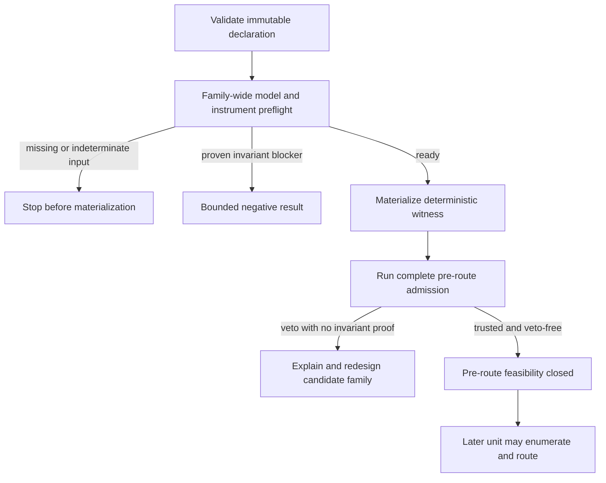
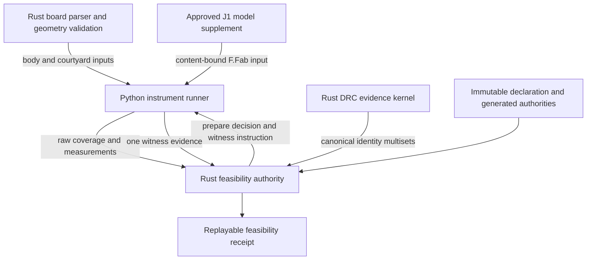
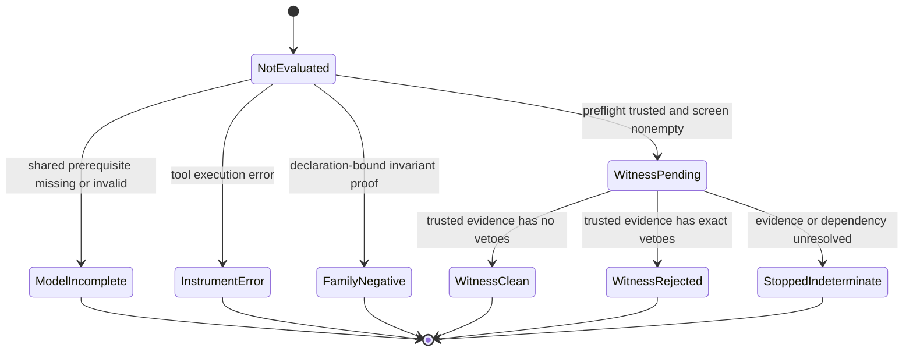
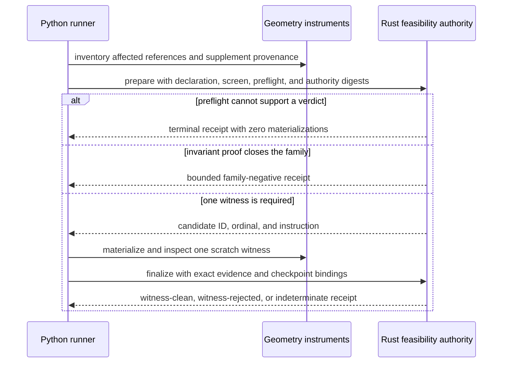

# Net-41 Pre-route Feasibility Closure - Plan

## Goal Capsule

- **Objective:** Make Net-41 candidate-family feasibility observable before mass materialization, ending with either one trusted pre-route-clean witness or an early, correctly bounded explanation of why the family cannot produce one.
- **Means:** Add an additive Rust-owned feasibility protocol with family-wide completeness checks, exact blocker evidence, and one deterministic pre-route witness ahead of exhaustive materialization (KTD1-KTD5).
- **Product authority:** The immutable 2,880-candidate declaration and the existing safety, DRC, containment, connectivity, ampacity, and mutation-scope gates remain authoritative. This work may decide whether that family is ready to execute; it may not rewrite the family or weaken a gate.
- **Open blockers:** None. The plan resolves schema compatibility additively and uses the previously approved J1 F.Fab artifact as a content-bound measurement input without changing a production authority.

---

## Product Contract

### Summary

Add a pre-route feasibility boundary beside the historical Net-41 campaign protocol. It validates shared measurement inputs, preserves exact blocker evidence, and evaluates one Rust-selected representative through complete pre-route admission before a later unit may materialize the full family or spend route budget.

### Problem Frame

The completed campaign conclusively rejected all 2,880 candidates before
routing, but it discovered shared blockers only after materializing and
measuring the entire family. Every candidate carried the same containment
finding, which resolves to missing J1 geometry rather than an off-board body.
Every row also serialized a false netlist Boolean even though reconciliation
is a post-route check and was not evaluated.

The campaign still produced a valid `exhausted` result: its instruments were
trusted, all declared candidates received conclusive outcomes, and no eligible
candidate remained untested. The gap is stage architecture, not terminal
honesty. A family-wide model defect should stop before enumeration, while a
candidate-specific failure should remain a candidate result. Neither should
be confused with router behavior.

### Key Decisions

- **Close pre-route feasibility before touching routing.** (session-settled: user-approved — chosen over a preflight-only patch and a combined generator/router redesign: it fixes the proven upstream boundary while preserving a clean later router experiment.) Governs R3-R6, R11, R16.
- **Keep negative outcomes as first-class results.** A model-completeness failure, a proven family-invariant blocker, and a candidate-dependent witness veto carry different authority. Governs R3-R6, R14-R16.
- **Keep semantic authority in Rust.** Stage state, blocker classification, exact evidence identity, and terminal authority cannot become Python-owned campaign logic. Governs R1-R2, R7-R10, R13-R15.

**Product Contract preservation:** Enriched in place without changing the approved product scope or the meaning of R1-R16, F1-F3, and AE1-AE6. Planning resolves the previously deferred implementation choices through KTD1-KTD7 and keeps unproved singleton dependencies unresolved.

### Requirements

**Lifecycle and authority**

- R1. Stage-gated evidence shall distinguish `not-evaluated`, a completed clean result, and a completed result with findings; an unevaluated check shall not serialize as a failed Boolean.
- R2. Rust shall own lifecycle states, allowed transitions, blocker semantics, and terminal authority; Python may invoke external instruments and transport their typed results.

**Family preflight and witness**

- R3. Before materializing any candidate, the campaign shall prove that every affected reference has all shared geometry, position, domain, denominator, and instrument inputs required by the complete pre-route gate set.
- R4. A missing or indeterminate shared input shall stop before candidate creation, identify the exact unavailable subject and requirement, and receive no candidate-rejection or physical-failure credit.
- R5. A blocker may authorize an early negative family result only when its dependence on family-invariant inputs is proved; a failure observed on one candidate shall not be generalized to the whole family.
- R6. After preflight passes, the campaign shall materialize one deterministic representative and run the same complete pre-route admission contract used by exhaustive execution. Full-family materialization and routing remain closed until a trusted, veto-free witness exists.

**Exact diagnostics and construction**

- R7. Safety and DRC evidence shall retain exact finding identities needed to compute family intersections and candidate fringes; aggregate and category counts remain summaries, not admission substitutes.
- R8. Diagnostic output shall classify each blocker as family-invariant, placement-dependent, route-shape-dependent, or unresolved, and shall identify the candidate dimensions on which a non-invariant blocker changes.
- R9. A proven invariant constraint shall move into the Rust-owned feasibility contract or candidate construction boundary so the campaign cannot repeatedly materialize candidates that violate it by construction.
- R10. Containment shall distinguish missing body geometry from a body proven outside the board. J1 must have evaluable geometry before the campaign may issue a physical containment verdict for it.

**Bounded outcome and evidence**

- R11. This unit shall stop at pre-route feasibility closure. It shall not exercise, modify, tune, or evaluate the router, even when a clean witness is produced.
- R12. All candidate work shall remain scratch-only, leaving `pcb/temper.kicad_pcb` and `power_pcb_dataset/drc_ceiling.json` byte-identical.
- R13. The immutable 2,880-candidate declaration shall remain unchanged. The new feasibility boundary gates whether execution begins; it does not shrink, sample, reorder, or redefine the declared denominator.
- R14. Receipts and human-readable summaries shall state whether a check was not evaluated, failed as an instrument/model prerequisite, or completed with candidate findings. Existing evidence shall remain interpretable without rewriting its historical raw receipts.
- R15. Every feasibility and witness result shall bind the declaration, production authorities, scratch subject, instrument set, and exact blocker evidence sufficiently for deterministic validation and replay.
- R16. The unit has two valid successful terminals: one trusted pre-route-clean witness, or an early conclusive negative result backed by a proved family-invariant blocker. Any other no-witness outcome remains indeterminate and cannot be called `exhausted`.

### Actors

- **PCB designer:** Reviews the physical meaning of blockers and decides whether a later routing campaign is warranted.
- **Rust campaign authority:** Owns feasibility state, evidence identity, classification, witness admission, and terminal semantics.
- **Python instrument runner:** Stages scratch KiCad projects and invokes external measurements without defining admission meaning.
- **KiCad and geometry instruments:** Supply physical observations whose completeness and subject identity must be proved before use.

### Key Flows

- **F1. Validate family feasibility.** The Rust authority validates the declaration and complete shared input inventory. Missing J1 body geometry stops here as model incompleteness, before a scratch candidate exists. Covers R1-R5, R10, R13-R15.
- **F2. Evaluate the witness.** Once F1 is ready, the runner materializes the deterministic representative and returns the complete pre-route instrument set to Rust. Rust either admits the witness or classifies its exact veto identities without generalizing candidate-dependent findings. Covers R2, R5-R10, R15-R16.
- **F3. Close the unit.** A clean witness produces a pre-route-feasible handoff for later exhaustive execution. A proved invariant blocker produces a bounded negative result; every unresolved or candidate-only no-witness outcome remains indeterminate. Covers R11-R16.

### Acceptance Examples

- **AE1 — Missing J1 geometry.** Given J1 is in the affected scope but has no body polygon, when family preflight runs, then it stops with a model-completeness finding, materializes zero candidates, and makes no claim that J1 lies outside the board. Covers R3-R5, R10, R14-R16.
- **AE2 — Netlist reconciliation before routing.** Given no route exists, when pre-route evidence is serialized, then reconciliation is `not-evaluated`, contributes no veto, and cannot be described as a failed check. Covers R1-R2, R14.
- **AE3 — Identity change hidden by a count.** Given a witness removes five baseline hard DRC identities and introduces five different hard identities, when admission compares evidence, then it reports five new observations and rejects the witness despite an unchanged total. Covers R7-R8, R15.
- **AE4 — Candidate-dependent witness failure.** Given preflight is complete but the representative has a route-shape-dependent safety finding, when the unit closes, then it reports the exact dependency and remains indeterminate rather than declaring the family exhausted. Covers R5-R8, R16.
- **AE5 — Proved invariant failure.** Given every candidate in the immutable declaration necessarily shares a safety conflict established from declaration-bound inputs, when preflight classifies it, then the unit emits a conclusive negative result without materializing the family. Covers R3-R5, R9, R13, R15-R16.
- **AE6 — Clean witness.** Given all shared inputs are complete and the representative passes every pre-route gate with trusted evidence, when the witness receipt is validated, then pre-route feasibility closes without invoking the router or changing production authorities. Covers R6, R11-R16.

### Success Criteria

- An incomplete shared model stops with zero candidate materializations and an exact, machine-readable cause.
- A cold reader can distinguish unevaluated, instrument/model failure, candidate finding, family-invariant negative, and pre-route-clean states without reconstructing a hidden stage flag.
- Exact safety and DRC blocker identities support reproducible intersection/fringe analysis; counts alone cannot authorize a verdict.
- The result contains either one replayable pre-route-clean witness or a replayable proof of a family-invariant blocker, while unresolved results remain visibly indeterminate.
- Production-board and DRC-ceiling hashes remain unchanged, and no output claims router performance, standards approval, fabrication release, or production readiness.

### Scope Boundaries

- No router invocation, router implementation change, route-quality claim, or route-budget experiment.
- No production-board mutation, DRC-ceiling update, or production candidate promotion.
- No safety, DRC, containment, connectivity, ampacity, mutation-scope, or evidence-integrity relaxation.
- No change to the immutable 2,880-candidate declaration, ranking, geometry values, or denominator.
- No enclosure-led connector relocation, isolation-slot design, board-outline change, or broader floorplan search.
- No claim of current-edition standards approval or fabrication release.

#### Deferred to Follow-Up Work

- Compute exact intersections and candidate fringes from a complete declaration-bound evidence matrix during the later exhaustive-screening unit. This unit preserves the canonical identities and multiplicities required for that analysis but does not build an analyzer with no current complete-matrix producer.

### Dependencies and Assumptions

- PR #1560 supplies the trusted campaign evidence and current Rust-owned execution authority; this work remains stacked on it until the prerequisite lands.
- Fresh pyo3 extensions, generated KiCad rules, the sibling footprint library table, and the live geometry oracles are prerequisites for any measurement reported by this unit.
- The correct J1 geometry source exists or can be derived from current board/library authority without inventing a Python source of truth.
- The historical 2,880-candidate result remains valid as an exhausted result under its original schema even though its human summary misclassified the unevaluated netlist field.

<!-- ce-section: work-relationships -->
### How This Work Fits Together

This plan owns pre-route feasibility closure for the existing Net-41 family.
The broader breakdown is contextual and may change after the witness result.

- **Depends on:** PR #1560 and its trusted terminal campaign evidence.
- **Corrects:** The human interpretation of J1 containment and unevaluated netlist reconciliation without rewriting historical raw receipts.
- **Enables:** A later exhaustive-screening and bounded-routing unit after a clean witness exists.
- **Can redirect:** A proved invariant blocker into a separately scoped candidate-family or PCB-design change.
- **Can proceed independently of:** Router tuning and production-board promotion, both of which remain outside this unit.

### Sources

- `docs/solutions/architecture-patterns/pre-route-candidate-campaigns-need-feasibility-witnesses.md`
- `docs/solutions/architecture-patterns/drc-admission-needs-typed-semantic-and-scoped-evidence-2026-09-01.md`
- `docs/evidence/net41-corridor-execution-20260901/README.md`
- `docs/evidence/net41-corridor-execution-20260901/candidate-manifest.json`
- `docs/evidence/net41-corridor-execution-20260901/terminal-receipt.json`
- `docs/evidence/net41-route-layer-corridor-20260831/declaration.json`
- `docs/plans/2026-09-01-0049-fix-net41-corridor-execution-plan.md`
- `docs/plans/2026-09-01-0903-fix-net41-drc-instrument-reliability-plan.md`
- `packages/temper-quality-oracle/src/corridor_campaign.rs`
- `packages/temper-drc-rs/src/drc_evidence.rs`
- `packages/temper-placer/src/temper_placer/io/fab_body_extraction.py`
- `scripts/run_net41_corridor_campaign.py`

---

## Planning Contract

### Key Technical Decisions

- KTD1. **Add a separate feasibility protocol beside campaign v1.** Keep `temper-corridor-campaign-request/v1` and its replay semantics unchanged. Add versioned prepare/finalize feasibility requests and one receipt family in `temper-quality-oracle` so old `netlist_reconciled: false` bytes are never silently reinterpreted. Governs R1-R2, R6, R11, R14-R16.
- KTD2. **Model evaluation and trust as orthogonal Rust enums.** Evaluation is `not-evaluated`, `completed-clean`, or `completed-with-findings`; trust is `trusted`, `indeterminate`, or `error`. Rust rejects impossible state/payload combinations and excludes pre-route netlist reconciliation from veto derivation. Governs R1-R2, R4, R14, R16.
- KTD3. **Treat J1 geometry as an explicit content-bound model supplement.** Use `extract_fab_body_coverage` for the Rust-derived board inventory. Add a Rust parser entry point for standalone footprint roots, then extract J1's local body polygon from `docs/evidence/k1-j1-domain-refloorplan-20260831/approved-j1-footprint.kicad_mod` and bind that artifact's full digest in the preflight receipt. The boundary validates that `REF**` is mapped only to J1 and never synthesizes a pad, courtyard, rectangle, or board edit. Governs R3-R4, R10, R12, R15.
- KTD4. **Carry canonical finding multisets across a new DRC boundary.** Keep the existing `temper.drc-admission-comparison/v2` endpoint byte-stable for campaign v1 replay. Add a versioned v3 endpoint that exposes exact new, worsened, indeterminate, and scoped-silk identities with multiplicity for the feasibility protocol. Rust derives the v3 summary counts and vetoes from those identities. Governs R2, R7-R8, R14-R15.
- KTD5. **Select the witness from existing Rust order.** The prepare response names the first member of the validated `clearance_creepage_prefilter_subset` and binds its candidate ID, declaration ordinal, and materialization instruction. Python may materialize only that witness before finalize. Governs R5-R6, R11, R13, R15-R16.
- KTD6. **Allow family-negative only from registered Rust predicates.** Each supported preflight predicate declares the exact fields it reads and the declaration axes it excludes. Rust recomputes the predicate, binds its version and inputs, and permits `family-invariant` only when no varying axis is a dependency. Caller-authored labels, recurring counts, and a singleton witness remain `unresolved`. Complete-matrix intersection and fringe analysis is deferred. Governs R5, R7-R9, R15-R16.
- KTD7. **Reuse only fully bound checkpoints.** Feasibility receipts and witness checkpoints bind the declaration, candidate-set digest, all generated inputs, model supplements, tool context, witness identity/instruction, scratch subject, and canonical finding payload. Any drift invalidates reuse; writes remain atomic. Governs R4, R6-R8, R12-R16.

### Assumptions

- The approved J1 footprint artifact is authoritative for a scratch-only body model because its committed evidence already records validation against the JST drawing and KiCad land pattern. This plan does not promote that footprint into the production board or library.
- The existing clearance/creepage screening measurements remain necessary to choose a representative from the validated Rust order. The new runner mode may reuse a fully content-bound screen receipt, but it may not accept caller-selected order.
- A current-board live run can validly stop as `model-incomplete`, `instrument-error`, or `witness-rejected`. Those are truthful completed executions but do not satisfy the two successful closure terminals in R16.
- The historical 2,880-row artifacts lack the exact safety and DRC payload bodies needed to reconstruct a trustworthy family intersection. The new schema preserves future analysis inputs; it does not manufacture identities from old counts or digests.

### High-Level Technical Design

The diagrams are directional. Exact Rust types and function signatures remain implementation details.

### System-Wide Impact

- The pyo3 surface of `temper-quality-oracle` gains new registered functions, so every dependent extension must be rebuilt before Python verification.
- `temper-drc-rs` comparison receipts gain exact diagnostic fields while retaining the existing counts and schema behavior expected by current consumers.
- The legacy campaign runner path and committed v1 evidence remain replayable. A new explicit pre-route mode writes separate feasibility evidence and never enters the router call path.
- Human-readable evidence and the existing DRC-admission learning must stop describing pre-route `netlist_reconciled=false` as a failed reconciliation.

### Risks and Mitigations

| Risk | Consequence | Mitigation |
|---|---|---|
| Stale pyo3 artifacts mask the Rust implementation | Python tests exercise old semantics | Rebuild with `make extensions`, require a real compile when needed, and run `make extensions-check` immediately before reported measurements. |
| A model supplement becomes an untracked geometry fallback | Physical verdicts use unaudited dimensions | Accept only explicit reference, source kind, full digest, and validated polygon; pin J1 to the committed approved artifact and reject all implicit fallbacks. |
| One witness is generalized to 2,880 candidates | A candidate rejection is mislabeled as family infeasibility | KTD6 keeps singleton dependency unresolved and reserves family-negative for a validated invariant certificate. |
| Exact DRC arrays drift from summary counts | Counts and veto identities disagree | Rust owns both identities and derived counts; tests mutate identities under constant totals. |
| The new mode accidentally reaches routing | This unit claims evidence outside its authority | Put routing outside the feasibility call graph and test with a bomb callable plus routed count zero. |
| A checkpoint survives authority drift | Replay accepts evidence for a different subject | KTD7 binds every authority and payload digest and rejects any single-field mutation. |

### Sequencing

1. Add a DRC v3 comparison endpoint with canonical exact identity deltas and prove the existing v2 bytes unchanged.
2. Add Rust feasibility types, lifecycle validation, prepare/finalize transitions, witness selection, and diagnostic analysis.
3. Rebuild pyo3 extensions and prove the new boundary is registered before changing Python orchestration.
4. Add explicit body coverage plus the content-bound J1 supplement, then add the pre-route-only runner mode and checkpointing.
5. Run focused tests, one bounded live feasibility execution when instruments are available, documentation corrections, and repository-wide gates.

---

## Implementation Units

### U1. Exact DRC identity receipt

- **Goal:** Add a Rust DRC v3 comparison that returns the canonical identities and multiplicities behind every hard and scoped-silk summary without changing v2 bytes.
- **Requirements:** R2, R7-R8, R14-R15; KTD4.
- **Files:** `packages/temper-drc-rs/src/drc_evidence.rs`; existing pyo3/integration tests that exercise `drc_admission_comparison_json`.
- **Approach:** Share the internal comparison kernel but serialize v2 through its current endpoint and exact shape. Serialize v3 through a new endpoint, and derive its count fields from emitted identity bags so there is one authority for identity and cardinality.
- **Test scenarios:**
  - Equal baseline and candidate multisets emit empty deltas and zero counts.
  - Equal totals with one substituted hard identity emit one removal/new identity and retain a hard veto.
  - Repeated multiplicity changes are represented without set collapse.
  - A shorter candidate distance emits the exact worsened observation identity.
  - Unstable repeats or unresolved caps emit indeterminate identities/state without a false exact delta.
  - Comparable scoped-silk receipts emit exact new findings and derived counts.
  - A pinned v2 request remains byte-identical after the v3 endpoint is added.
- **Verification:** `env -u CONDA_PREFIX cargo test -p temper-drc-rs --features python` and its Python boundary tests pass.
- **Dependencies:** None.

### U2. Rust feasibility lifecycle and replay contract

- **Goal:** Add the additive prepare/finalize feasibility protocol, orthogonal evidence states, exact blocker types, terminal precedence, and receipt bindings.
- **Requirements:** R1-R9, R11, R13-R16; F1-F3; AE2-AE5; KTD1-KTD2, KTD4-KTD7.
- **Files:** `packages/temper-quality-oracle/src/corridor_campaign.rs` or a focused sibling module; `packages/temper-quality-oracle/src/lib.rs`; `packages/temper-placer/tests/rust_integration/test_corridor_campaign.py`; Rust unit tests in the owning crate.
- **Approach:** Preserve campaign v1 unchanged. Validate all evaluation/trust combinations, typed finding identities, subject digests, instrument sets, and state transitions in Rust. Prepare validates the immutable evidence envelope and selects the first Rust-ordered survivor. Finalize accepts only that witness and emits the bounded terminal receipt.
- **Test scenarios:**
  - `not-evaluated` with findings, completed-clean with findings, completed-with-findings without findings, and trusted evidence without a receipt are rejected.
  - Pre-route netlist is `not-evaluated`, produces no veto, and cannot be submitted as a completed failure.
  - Historical campaign v1 JSON still deserializes and produces the same terminal receipt.
  - Unsupported versions, unknown fields, and downgrade-shaped submissions fail closed.
  - First-survivor witness selection is deterministic; duplicate, reordered, foreign, or ID/ordinal-mismatched submissions fail.
  - Same-count safety and DRC identity substitutions remain vetoes.
  - A singleton or caller-authored dependency claim cannot create a family-invariant result; a registered Rust predicate recomputes from bound inputs and excludes every varying declaration axis.
  - Terminal precedence distinguishes model incomplete, instrument error, family negative, witness rejected, stopped indeterminate, and witness clean.
- **Verification:** `env -u CONDA_PREFIX cargo test -p temper-quality-oracle --features python` and focused pyo3 integration tests pass.
- **Dependencies:** U1.

### U3. Complete family model inventory and J1 supplement

- **Goal:** Prove shared body, position, domain, denominator, and instrument prerequisites for every Rust-declared affected reference before a candidate directory exists.
- **Requirements:** R2-R4, R10, R12, R14-R15; F1; AE1; KTD3, KTD7.
- **Files:** `packages/temper-design-bundle/src/parse_engine.rs` and its pyo3 registration/tests; `packages/temper-placer/src/temper_placer/io/fab_body_extraction.py`; `packages/temper-placer/tests/io/test_fab_body_extraction.py`; focused helpers in `scripts/run_net41_corridor_campaign.py`; existing approved J1 evidence remains byte-identical.
- **Approach:** Consume `extract_fab_body_coverage` rather than map absence. Classify absent reference, missing F.Fab, invalid F.Fab, missing position/domain/denominator, and tool error separately. Parse standalone `.kicad_mod` roots in Rust, validate the expected reference mapping, and merge J1 only as an explicit digest-bound supplement.
- **Test scenarios:**
  - The unaugmented real board reports J1 present with missing F.Fab and no physical outside-board finding.
  - The approved supplement completes only J1 and records its full source digest.
  - Missing, malformed, foreign-reference, and digest-mismatched supplements fail before candidate materialization.
  - Pads, courtyard, silkscreen, or an ad hoc rectangle are never synthesized as a body.
  - Standalone footprint parsing accepts the approved root shape and rejects a board root, nested foreign reference, or missing F.Fab.
  - A fully covered fixture returns complete with deterministic reference ordering.
- **Verification:** `uv run pytest packages/temper-placer/tests/io/test_fab_body_extraction.py scripts/tests/test_run_net41_corridor_campaign.py -q` passes after fresh extensions.
- **Dependencies:** U2.

### U4. Pre-route-only orchestration and checkpointing

- **Goal:** Add an explicit runner mode that performs prepare, materializes and inspects at most one witness, finalizes, and stops before routing.
- **Requirements:** R2-R8, R11-R16; F1-F3; AE1-AE6; KTD1-KTD7.
- **Files:** `scripts/run_net41_corridor_campaign.py`; `scripts/tests/test_run_net41_corridor_campaign.py`; separate evidence output under `docs/evidence/` only after a trusted live run.
- **Approach:** Preserve the default/replay campaign v1 path. The new explicit mode writes a versioned atomic feasibility checkpoint and receipt, uses only the Rust prepare response for witness identity/order, transports exact evidence, and has no control-flow edge to `route_and_inspect_candidate`.
- **Test scenarios:**
  - Model-incomplete and instrument-error preflights create zero candidate directories and produce distinct machine-readable terminals and exit classes.
  - A ready screen materializes exactly one Rust-selected witness; mismatched ID, ordinal, instruction, or board hash fails closed.
  - A bomb replacement for the router is never called for clean, rejected, or indeterminate witnesses.
  - Witness rejection states that one candidate failed and the remainder are untested; it never prints `exhausted`.
  - A clean witness enables later exhaustive execution without starting it.
  - A checkpoint replays only when every KTD7 binding matches and is invalidated by each authority/payload mutation.
  - Existing `--replay` retains historical v1 behavior and bytes.
- **Verification:** Focused runner and Rust integration tests pass; a cold and warm synthetic replay are byte-identical.
- **Dependencies:** U1-U3.

### U5. Evidence interpretation and durable learning

- **Goal:** Correct the human record and document the new feasibility boundary without rewriting historical machine receipts.
- **Requirements:** R8, R10-R16; F3; AE1-AE6.
- **Files:** `docs/evidence/net41-corridor-execution-20260901/README.md`; `docs/solutions/architecture-patterns/drc-admission-needs-typed-semantic-and-scoped-evidence-2026-09-01.md`; `docs/solutions/architecture-patterns/pre-route-candidate-campaigns-need-feasibility-witnesses.md`; `CONCEPTS.md`; the implementation plan.
- **Approach:** State that pre-route netlist reconciliation was unevaluated, J1 containment was model-incomplete, and the router received no candidate. Document observed-across-family versus proved-invariant authority and link any new live feasibility receipt.
- **Test scenarios:**
  - Repository search finds no statement that all 2,880 candidates failed netlist reconciliation.
  - Documentation never converts J1 missing geometry into an outside-board verdict or zero routed candidates into a router failure.
  - Frontmatter and documented-claim validators accept all changed learning files.
- **Verification:** Documentation validators and targeted textual assertions pass.
- **Dependencies:** U4.

---

## Verification Contract

| Surface | Command or check | Required result |
|---|---|---|
| Rust DRC identities | `env -u CONDA_PREFIX cargo test -p temper-drc-rs --features python` | Exact multiset, cap-state, and count-derivation tests pass. |
| Rust feasibility authority | `env -u CONDA_PREFIX cargo test -p temper-quality-oracle --features python` | Lifecycle, transition, binding, witness-order, terminal, and v1 compatibility tests pass. |
| Extension boundary | `env -u CONDA_PREFIX make extensions` then `make extensions-check` | All discovered modules rebuild and the immediate freshness/import check passes. |
| Python geometry and runner | `uv run pytest packages/temper-placer/tests/io/test_fab_body_extraction.py packages/temper-placer/tests/rust_integration/test_corridor_campaign.py scripts/tests/test_run_net41_corridor_campaign.py -q` | Coverage, pyo3, orchestration, no-router, and replay tests pass. |
| Import boundaries | `uv run python scripts/import_linter_gate.py` | No new boundary violations. |
| Generated artifacts | `make regen` then `make regen-check` | Safe generated files are current; no oracle drift or hash-order defect is accepted. |
| Production authority | Compare `git hash-object pcb/temper.kicad_pcb power_pcb_dataset/drc_ceiling.json` with the branch base | Both hashes remain byte-identical. No DRC ceiling remeasurement is triggered. |
| Documentation | Run the repository solution frontmatter and mechanical-claim validators used by the existing learning store | All changed docs validate and stale netlist/containment claims are absent. |
| Live feasibility | Run the new explicit pre-route mode only after an immediate `make extensions-check` | At most one witness is materialized, routed count is zero, production hashes are unchanged, and the receipt has a truthful bounded terminal. |
| Review | Run `ce-code-review` on the final diff and apply all confirmed findings | No unresolved correctness, compatibility, or safety finding remains. |

The live run is evidence, not a prerequisite for lying about availability. If KiCad, pcbnew, or another required instrument is unavailable, the implementation must emit the corresponding typed terminal and tests must still prove every deterministic branch. A clean live witness is never inferred from mocks.

---

## Definition of Done

- U1-U5 are complete and every unit's named test scenarios are represented by executable tests or a documented live check.
- The new Rust feasibility receipt distinguishes evaluation, trust, dependency authority, and terminal state without overloading a Boolean.
- Historical campaign v1 replay behavior and raw evidence files remain unchanged.
- Family preflight covers every Rust-declared affected reference and either binds the approved J1 model supplement or stops before any candidate directory exists.
- The runner materializes no more than one deterministic witness, never invokes the router, and never labels a singleton rejection `exhausted` or family-invariant.
- Exact safety, containment, overlap, and DRC v3 identities cross the pyo3 boundary with multiplicity; Rust derives or validates every new summary count while DRC v2 remains byte-stable.
- Feasibility receipts and checkpoints reject drift in declaration, generated inputs, model source, tools, witness identity/instruction, scratch subject, or blocker payload.
- `pcb/temper.kicad_pcb`, `power_pcb_dataset/drc_ceiling.json`, the immutable declaration, and historical raw receipts match their base-branch bytes.
- Required Rust, Python, extension, import, regeneration, documentation, and review gates pass, with any unavailable live instrument reported as such.
- Human-readable evidence states that netlist reconciliation was not evaluated pre-route, J1 lacked model geometry in the old run, and routing was never invoked.
- Abandoned experiments, duplicate Python semantic authority, temporary evidence, and dead checkpoint formats are absent from the final diff.
