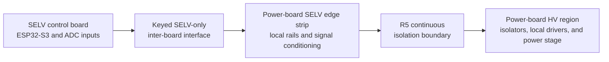
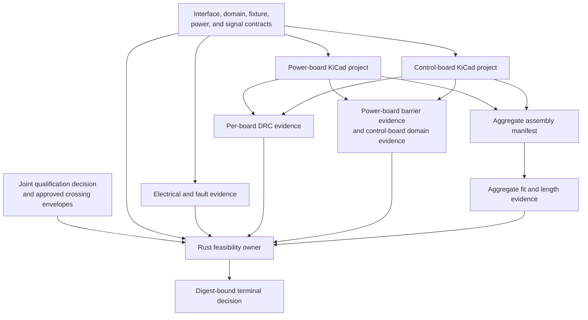
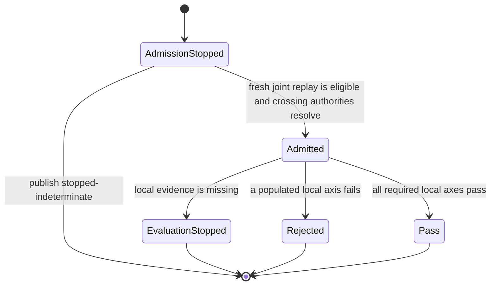
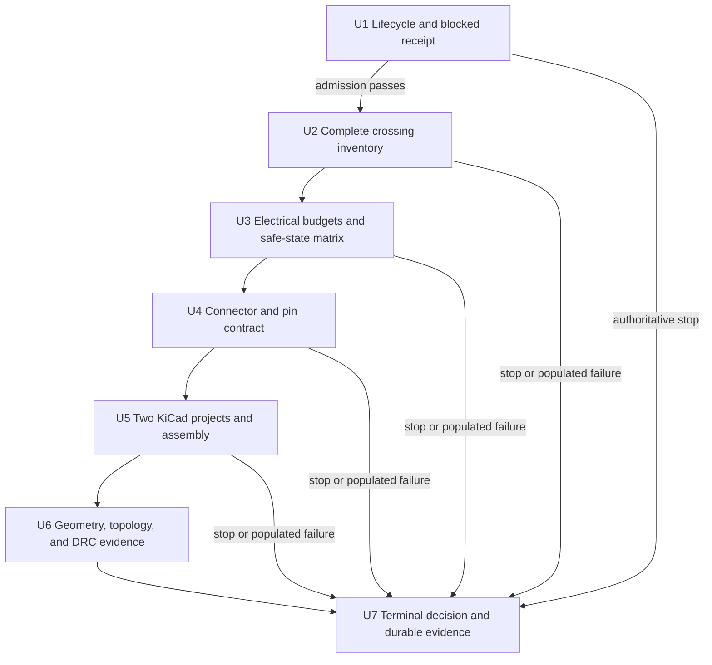

# Split-Board Interface and Feasibility Proof - Plan

## Goal Capsule

- **Objective:** Give Temper's hardware owner a defensible go/no-go on whether a two-board power/control architecture can satisfy the governing isolation, control, sensing, and critical-loop constraints inside the current 152 mm by 234 mm aggregate PCB envelope.
- **Means:** Define a replacement SELV inter-board contract and evaluate two digest-bound non-production KiCad projects plus their aggregate assembly under KTD1-KTD10 and the bounded candidate-family rule.
- **Product authority:** The repo owner approves the architecture; `docs/STRATEGY.md`, `docs/requirements/FIRMWARE_REQUIREMENTS.md`, `docs/FUNCTIONAL_TEST_CRITERIA.md`, and approved component qualification receipts define the behavior and safety contracts this work must preserve.
- **Stop conditions:** The current joint isolation decision is `stopped-indeterminate`: the gate candidate is rejected, the CT07 candidate is indeterminate, and no joint candidate is materialized. Implementation must publish that honest blocked state before it may admit geometry, and it must stop again if any required crossing lacks an approved construction.
- **Execution profile:** Code-backed qualification evidence and non-production KiCad artifacts; no production PCB, schematic, firmware behavior, or DRC ceiling mutation.
- **Tail ownership:** A `pass` enables a separate production split-board plan. Candidate-scoped `rejected` and `stopped-indeterminate` results return to the named qualification, interface-budget, or candidate-design owner with measured witnesses. An architecture no-go requires the stronger KTD7 exhaustion or fixed-input proof.

---

## Product Contract

The Product Contract preserves R1-R30, F1-F4, and AE1-AE7 from the confirmed requirements-only artifact. R14 and F1 are clarified without changing scope: the power budget covers every served load, and envelope admission follows the repository's canonical joint decision.

### Summary

Temper will replace single-board isolation salvage with a two-board feasibility proof: a SELV control board beside a high-voltage power board whose only SELV region is a controlled edge strip.
The proof will redesign the board-to-board interface from functional needs and test exact qualified subassemblies in a dedicated KiCad floorplan before any production schematic, PCB, firmware, or enclosure is changed.

### Problem Frame

The production board interleaves high-voltage and SELV circuitry so thoroughly that straight, polyline, and general-polygon barrier searches have not found a valid continuous 12.6 mm partition.
The immediate PR evidence includes about 9.686 mm between K1 and J1 against the 12.6 mm target and no named `MAINS_SELV_ISOLATION_BARRIER` on the board.
Repeated local placement searches moved individual conflicts but exposed other high-voltage-to-SELV violations, so another component shuffle would not resolve the topology.

The project strategy already selects separate power and control boards, but the current manifest's nine-net interface is an early guard rather than a complete functional contract.
It omits control-board sensing needs that appear in the firmware requirements and carries two supply rails even though the interface has not been power-budgeted.
A professional feasibility review therefore needs to rederive the crossings, use qualified footprints and subassembly envelopes, and issue an explicit verdict before production layout begins.

### Key Decisions

- **Use two boards rather than continue single-board placement salvage.** (session-settled: user-directed — chosen over repairing the current PCB: the interleaved topology has no defensible continuous barrier.) Governs R1-R6 and R24-R27.
- **Make one continuous power-board edge strip the only SELV region on that board.** (session-settled: user-approved — chosen over fragmented SELV islands: one boundary is inspectable and enforceable.) Governs R3-R6 and R25.
- **Keep the ESP32-S3 as the sole real-time control authority.** (session-settled: user-directed — chosen over a local power-board controller: shorter signal paths do not justify another firmware and safety authority.) Governs R7-R9 and R16-R17.
- **Replace the existing connector contract from functional needs.** (session-settled: user-directed — chosen over preserving its signal list or pinout: the current contract omits required telemetry and has no verified power or EMC budget.) Governs R10-R21.
- **Carry one protected SELV bulk supply from the power-board auxiliary isolation stage and derive local rails at each load island.** (session-settled: user-directed — chosen over carrying both `+15V` and `+3V3`: one feed gives the local island and control board a reviewable load, filtering, and sequencing boundary.) Governs R10-R15.
- **Keep sensing analog but keep protection independent of firmware.** (session-settled: user-directed — chosen over adding a power-board ADC: buffered telemetry preserves the current MCU architecture while a separate hardware path retains fault authority.) Governs R16-R21.
- **Require a dedicated KiCad floorplan proof before production design.** (session-settled: user-directed — chosen over document-only analysis or a partially routed product board: this is a spatial feasibility question, but production detail is premature.) Governs R22-R30.
- **Consume qualified component envelopes rather than qualifying parts here.** (session-settled: user-directed — chosen over merging qualification into this plan: the existing owner plans already define that work and its evidence.) Governs R22-R25 and R28-R30.

The architecture relationship is:



<!-- ce-section: work-relationships -->
### How This Work Fits Together

This plan owns the replacement inter-board contract and the integrated non-production floorplan verdict; the surrounding breakdown is the current understanding, not a committed roadmap.

- **Depends on:** the gate-drive and CT07 owner plans producing a joint `eligible-for-refloorplan` result, plus approved exact constructions for every other retained auxiliary, relay, Y-capacitor, voltage-sensing, temperature-sensing, and protection-chain crossing.
- **Shares with:** the component-architecture qualification campaign, which owns the combined gate-drive and sensing compatibility verdict before any envelope becomes eligible for refloorplanning.
- **Enables:** a later production schematic split and two-board refloorplan only after this work returns a pass.
- **Enables:** later firmware integration against the approved signal, timing, ADC, startup, and fault contract without introducing another control authority.
- **Still to decide later:** final mounting, cable routing, cooling, compartment sealing, service access, and whether the complete appliance construction earns PD2.

### Requirements

**Board and domain architecture**

- R1. The feasibility candidate shall contain exactly two electrically distinct PCB outlines: one power board and one SELV control board.
- R2. The two boards, their required separation, and the complete interconnect service envelope shall fit within the current 152 mm by 234 mm aggregate planar envelope.
- R3. The control board and every board-to-board contact shall contain SELV conductors only.
- R4. The power board shall contain the mains input, rectified bus, switching power path, resonant path, HV-referenced sensing, gate-drive output stages, and every galvanic transition between HV and SELV.
- R5. The power board shall provide one named, continuous, edge-to-edge isolation boundary that separates its SELV edge strip from its HV region at the 12.6 mm PD3 target.
- R6. Every HV-to-SELV crossing shall pass through an exact, approved isolation construction positioned across R5; connectors, cable spacing, labels, and net names shall not be credited as isolation.

**Control and fail-safe behavior**

- R7. The control-board ESP32-S3 shall remain the only programmable real-time authority for PWM generation, operating state, and commanded power.
- R8. The interface shall carry the direct high-side and low-side switching commands required by the approved gate-drive envelope without adding a second MCU or encoded local control state machine.
- R9. The physical interface and its signal budget shall preserve the timing, dead-time, latency, jitter, and shutdown behavior owned by the approved gate-drive construction.
- R10. The disconnected, unpowered, partially mated, reset, brownout, and invalid-command states shall leave both gate stages disabled and all power actuators in their defined safe states.
- R11. A firmware-independent, set-dominant shutdown path shall cross the interface and reach every local power-stage safe-state path within the approved protection latency.
- R12. Hardware fault status shall return to the control board independently of analog telemetry and shall remain observable while shutdown is asserted.

**SELV power distribution**

- R13. The power-board auxiliary isolated supply shall source one protected SELV bulk rail and its defined return across the interface rather than distributing independent logic and analog rails.
- R14. The selected bulk voltage shall be derived from a worst-case source, load, dropout, transient, cable-loss, thermal, startup, and fault budget for every served load and local conversion stage on both boards, including the complete power-board SELV edge strip.
- R15. The power-board SELV edge strip shall derive and supervise its local rails so that startup, shutdown, brownout, and loss of either local rail satisfy R10-R12 without back-powering through signal pins.

**Commands, telemetry, and connector contract**

- R16. The functional crossing inventory shall cover gate commands, protective shutdown and fault status, required relay and discharge controls, current telemetry, bus-voltage telemetry, IGBT-temperature telemetry, the bulk supply, and every necessary return.
- R17. A proposed crossing not required by an approved control, protection, sensing, test, or service behavior shall be excluded from the production interface.
- R18. Current, bus-voltage, and IGBT-temperature telemetry shall be buffered on the power-board SELV edge strip and delivered as bounded low-impedance analog signals compatible with the control-board ADC contract.
- R19. Each analog channel shall have an owned bandwidth, accuracy, source-impedance, settling, common-mode, filtering, return-current, and fault-behavior budget that remains valid across the chosen connector.
- R20. The connector construction shall be keyed, mechanically retained, orderable, derated for its electrical and environmental loads, and analyzable for reversal, partial mating, adjacent-pin shorts, and open contacts.
- R21. Pin assignment shall give power, high-edge-rate commands, analog telemetry, and fault signals controlled return paths and shall meet the accepted crosstalk, emissions, immunity, and ground-shift budgets at the maximum floorplan interconnect length.

**Qualified-envelope integration**

- R22. Every isolation, sensing, driver, regulator, connector, heatsink, and mechanically constraining part used to claim feasibility shall have an exact orderable part identity and reviewed footprint.
- R23. The floorplan shall import each approved gate-drive and sensing construction as a digest-bound placement and copper envelope with only its explicitly allowed transforms.
- R24. The integrated candidate shall preserve every isolation, gate-loop, bootstrap-loop, sensing, retention, thermal, and shutdown constraint owned by the imported qualification envelopes.
- R25. Support components, copper envelopes, mounting hardware, test points, and service clearances shall remain on their assigned side of R5 and shall not narrow the qualified isolation corridor.

**Floorplan proof and verdict**

- R26. The feasibility artifact shall contain two dedicated non-production KiCad projects bound as one feasibility candidate; neither project shall modify or masquerade as `pcb/temper.kicad_pcb`.
- R27. The floorplan shall represent complete component ownership, exact footprints, board outlines, keepouts, courtyards, mounting reserves, cooling reserves, connector access, and the physical route envelope between boards.
- R28. The proof shall emit digest-bound evidence for board dimensions, domain ownership, barrier geometry, imported envelope identity, critical relative placement, interconnect length, and every pass/fail budget used in the verdict.
- R29. The verdict shall be `pass` only when every required construction and budget is present and passing, `rejected` when a populated candidate violates a requirement, and `stopped-indeterminate` when an input or measurement is missing or provisional.
- R30. A failing or indeterminate candidate shall report the constraining requirement and measured witness; it shall not gain a pass by reducing R5's target, substituting a placeholder, discarding a required crossing, or absorbing an unexplained violation.

### Key Flows

- F1. Qualified-envelope intake
  - **Trigger:** Secure replay of `power_pcb_dataset/qualification/isolation_joint/decision.json` returns `eligible-for-refloorplan`.
  - **Steps:** Verify the joint decision and every referenced receipt, artifact digest, exact part identity, allowed transform, and owned constraint before admitting any envelope to the candidate.
  - **Outcome:** The floorplan starts from immutable qualified geometry or stops as indeterminate.
  - **Covered by:** R22-R25, R29-R30.
- F2. Interface derivation
  - **Trigger:** A qualified envelope set is available.
  - **Steps:** After admission, trace every required control, protection, sensing, power, return, and service behavior; reject inherited or speculative crossings; derive budgets before selecting and freezing a connector and pinout. Before admission, work is limited to schemas, evaluators, fixtures, and explicit missing-authority records.
  - **Outcome:** One reviewable SELV-only interface contract replaces the current nine-net draft.
  - **Covered by:** R7-R21.
- F3. Spatial feasibility evaluation
  - **Trigger:** Exact interface and component envelopes are available.
  - **Steps:** Place the two board outlines, the power-board boundary, qualified subassemblies, connector, mechanical reserves, and interconnect envelope; then measure every owned constraint from the resulting candidate.
  - **Outcome:** One digest-bound candidate carries enough evidence for an unambiguous verdict.
  - **Covered by:** R1-R6, R22-R30.
- F4. Decision handoff
  - **Trigger:** The candidate evaluator returns a terminal verdict.
  - **Steps:** On pass, freeze the candidate geometry and interface as inputs to production planning; on rejection, identify the violated constraint; on indeterminate, name the missing authority or evidence.
  - **Outcome:** Production work either receives bounded inputs or remains blocked without weakening the safety bar.
  - **Covered by:** R28-R30.

### Acceptance Examples

- AE1. **Covers R3-R6.** Given a connector pin, control-board pad, or trace is assigned an HV-referenced net, when domain ownership is evaluated, then the candidate is rejected even if geometric spacing around that item looks adequate.
- AE2. **Covers R10-R12, R15.** Given the connector is unplugged, partially seated, or loses its bulk supply while switching is commanded, when the interface enters that state, then both gate stages and every power actuator reach the defined safe state without waiting for firmware telemetry.
- AE3. **Covers R16-R21.** Given the floorplan fits geometrically but an analog channel lacks a settling/noise budget or a PWM path lacks a timing/return-path budget, when the verdict is aggregated, then the candidate is stopped-indeterminate rather than passed.
- AE4. **Covers R22-R25, R29-R30.** Given a placeholder isolator or generic connector outline fits, when no approved exact construction exists, then its apparent clearance contributes no passing evidence.
- AE5. **Covers R2, R24-R25, R30.** Given the exact qualified subassemblies cannot coexist inside the aggregate envelope without violating an imported loop or the isolation corridor, when the candidate is measured, then the result is rejected and the governing target remains unchanged.
- AE6. **Covers R26, R28-R30.** Given the non-production proof leaves `pcb/temper.kicad_pcb` byte-identical, when its DRC evidence is produced, then the proof uses its own clean evidence and does not rewrite the production board's DRC ceiling record.
- AE7. **Covers R26, R28-R30.** Given later work promotes the candidate into or otherwise changes `pcb/temper.kicad_pcb`, when that production change is prepared, then the same-PR DRC remeasurement and provenance contract applies to that later work.

### Success Criteria

- Every run returns exactly one verdict under R29, classifies the decision as admission-, candidate-, or architecture-scoped, and gives production planning stable inputs only when that verdict is `pass`.
- An early stop is successful evidence when it names the authoritative missing or non-passing input, records later axes as not reached, and makes no spatial-feasibility claim.
- A pass-capable output identifies one exact, orderable connector and complete pin contract derived from the functional crossing inventory.
- A pass-capable output contains one digest-bound KiCad candidate in which every component and net has explicit board and safety-domain ownership.
- A pass-capable output demonstrates the R5 power-board isolation boundary and compatibility with every imported construction envelope without provisional geometry.
- A pass-capable output includes reviewed power, timing, analog integrity, fault, mating, pre-route capacity, and interconnect budgets tied to the floorplan's maximum physical lengths.
- An architecture no-go names either the fixed-input witness common to every declared family member or the complete set of exhausted members and their individual witnesses.

### Scope Boundaries

This work includes the replacement interface contract, exact connector selection, the power-board SELV edge-strip contract, and the integrated non-production KiCad floorplan and verdict.

#### Deferred to Follow-Up Work

- Executing or changing the gate-drive, sensing, auxiliary-supply, or isolation-component qualification campaigns.
- Splitting the production electrical source, generating production schematics, routing either production board, or producing fabrication and assembly outputs.
- Changing control algorithms, completing currently commented firmware initialization, or introducing a second programmable controller.
- Final mounting, harness, enclosure, airflow, thermal, ingress, service, and regulatory validation.
- Claiming the conditional 8.0 mm PD2 target before the complete protected compartment is implemented and approved.
- Updating `power_pcb_dataset/drc_ceiling.json` while `pcb/temper.kicad_pcb` remains unchanged.

#### Outside This Product's Identity

- Further single-board component shuffling.
- A three-board architecture with a separate gate-drive module.
- A stacked, mezzanine, or other non-coplanar assembly; the confirmed 152 mm by 234 mm coplanar envelope is the boundary for this feasibility decision, while final enclosure architecture remains follow-up work.

### Dependencies and Assumptions

- R5 remains the governing floorplan target; the conditional PD2 construction cannot relax this proof.
- Every retained crossing must have an approved exact construction with compatible digests and allowed transforms; gate-drive and CT07 inputs additionally require a passing joint-integration verdict.
- The current 152 mm by 234 mm aggregate planar envelope is the feasibility boundary; later enclosure validation may still veto a geometrically passing candidate.
- The intended firmware-facing behavior is taken from firmware requirements and HAL contracts, not from a claim that every production initialization path is complete today.
- A non-production KiCad project can carry its own DRC and measurement evidence without triggering production-board DRC-ceiling remeasurement while `pcb/temper.kicad_pcb` remains byte-identical.

### Sources and Research

- `docs/STRATEGY.md` — product-level two-board architecture authority.
- `docs/superpowers/specs/2026-07-31-split-power-control-board-design.md` — prior split-board decision and environmental framing; its interface enumeration is superseded by this contract.
- `elec/domain_manifest.yaml` — current nine-net SELV-only interface guard and domain taxonomy.
- `docs/plans/2026-09-01-1137-feat-iso7741-gate-drive-owner-qualification-plan.md` — gate-drive construction and critical-layout authority.
- `docs/plans/2026-09-01-1137-feat-ct07-t2-sensing-owner-qualification-plan.md` — sensing construction and interface authority.
- `docs/evidence/2026-09-01-isolation-component-architecture-qualification.md` — current candidate verdicts and absence of a fully qualified replacement.
- `docs/evidence/2026-08-08-isolation-barrier-geometry-analysis.md` — continuous-barrier infeasibility on the current interleaved board.
- `docs/evidence/2026-08-30-k1-j1-creepage-repair.md` — exact K1/J1 blocker and prior repair evidence.
- `docs/requirements/FIRMWARE_REQUIREMENTS.md` and `firmware/components/hal/include/temper_pins.h` — intended control and sensing surface.
- [Infineon, Isolated Gate Driving Solutions](https://www.infineon.com/assets/row/public/documents/24/42/infineon-gatedriveric-eicedriver-isolated-gate-driving-solutions-applicationnotes-en.pdf) — isolation-barrier placement and local gate-loop guidance.
- [Analog Devices, AN-7625](https://www.analog.com/en/resources/app-notes/an-7625.html) — PCB construction as part of the end-to-end isolation rating.
- [KiCad 10 project documentation](https://docs.kicad.org/10.0/en/getting_started_in_kicad/getting_started_in_kicad.html#_project) and [PCB DRC CLI](https://docs.kicad.org/10.0/en/cli/cli.html#_pcb_drc) — each floorplan is an independent project and each DRC invocation evaluates one board.
- [IEC 61984](https://webstore.iec.ch/en/publication/20206) and [IEC 60512-1](https://webstore.iec.ch/en/publication/26491) — connector safety and test authority; vendor guidance supplements but does not replace these standards.
- [Analog Devices, EMI grounding guidance](https://www.analog.com/en/resources/technical-articles/passing-emi-compliance-testing-the-first-time-part-3.html) — controlled signal returns and interface partitioning.
- `docs/solutions/architecture-patterns/physical-isolation-barrier-requires-domain-first-floorplan-2026-07-30.md` — domain topology precedes placement and routing.
- `docs/solutions/architecture-patterns/isolation-values-need-role-aware-authority-2026-08-31.md` — role-specific safety targets come from the repository authority rather than local literals.
- `docs/solutions/architecture-patterns/dual-path-rtd-fault-containment-2026-07-13.md` — firmware diagnoses while independent hardware inhibits.
- `docs/solutions/best-practices/qualification-exports-require-clean-build-replay-2026-09-01.md` — exported qualification evidence requires clean replay and protected-set checks.
- `docs/solutions/best-practices/drc-ceiling-same-pr-discipline-2026-08-19.md` — production-board DRC provenance remains deferred until a later production board change.

---

## Planning Contract

### Key Technical Decisions

- KTD1. **Use a fresh canonical joint-qualification replay as the admission gate.** Today, replay U9 ("Real handoff consumption and R24-R25 joint decision") from `docs/plans/2026-09-01-1137-feat-iso7741-gate-drive-owner-qualification-plan.md` through `scripts/check_isolation_joint_qualification.py` and publish its blocked state. After that upstream unit completes, replay the full canonical joint package, require `eligible-for-refloorplan`, byte-compare the published upstream decision, and bind a separate immutable `admission_decision.json`. This plan does not modify the upstream lifecycle to create an eligible result. Individual receipts and a copied verdict cannot admit geometry. This follows `packages/temper-quality-oracle/src/owner_joint_candidate.rs` and governs F1, R22-R25, and R29-R30.
- KTD2. **Keep schemas, identity checks, topology, and verdict aggregation in Rust.** Add one owner module to `temper-quality-oracle`, expose it through one uniquely registered pyo3 function, and keep the Python command as a delegation and presentation layer. The existing Python keepout gate remains a differential oracle, not candidate policy. This applies the repository's Rust-ownership rule to R5-R6 and R28-R30.
- KTD3. **Represent the candidate as two independent KiCad projects plus one aggregate assembly manifest.** KiCad DRC evaluates one board at a time, so the assembly manifest binds both board digests, their relative transforms, the gap, and the service-loop envelope for R1-R2 and R26-R28.
- KTD4. **Keep candidate authorities separate from production authorities.** Store candidate contracts under `elec/qualification/split_board_feasibility/`. Protect the production PCB/project/library context, DRC ceiling, domain manifest, `elec/ato.yaml`, `elec/src/`, production electrical exports, environmental and BOM authorities, firmware and HAL inputs, Rust safety-authority sources, and every consumed qualification byte at campaign base, pre-run, publication, and post-run checkpoints. This governs R3-R6 and R26.
- KTD5. **Use four independent evidence layers.** Electrical/fault evidence satisfies declarative budgets, board-role domain and barrier evidence owns topology, per-board KiCad DRC owns native board-rule findings, and aggregate evidence owns two-board fit and interconnect length. No contract may attest to its own satisfaction, and no layer may infer another layer's pass for R2-R6 and R9-R30.
- KTD6. **Resolve safety values and transforms through repository authorities.** Use `temper_design_bundle::safety_value::reinforced_creepage_400v_pd3()` for the R5 target, `MAINS_SELV_ISOLATION_BARRIER` as the boundary name, and sanctioned `temper-geometry` transforms backed by non-orthogonal pcbnew oracles. Local `12.6` literals and raw rotation trigonometry are prohibited in the new evaluator.
- KTD7. **Use an acyclic identity graph, bounded candidate family, and fail-closed verdict scope.** A construction digest binds contracts, exact parts, footprints, board bytes, and assembly transforms. A measurement-bundle digest adds protocols, tool identities, and raw evidence. A signed-scope digest adds the evidence index. The final decision binds construction, measurements, and signoffs without circular references. Before geometry starts, the manifest closes the candidate family over the admitted crossing-envelope set, retained bulk-rail choices, exact connector/pinout candidates, and supported strip topologies. A tool change invalidates evidence but does not rename unchanged hardware; any unresolved input prevents reuse under R28-R30. `decision.json` distinguishes a candidate rejection caused by a revisable design choice from an architecture no-go supported by a fixed-input witness or exhaustion of every declared family member.
- KTD8. **Prove the electrical interface as a bounded fault-aware contract.** The contract uses distinct PWM/digital, analog, and bulk-power return paths with declared joins, local safe-state biasing, numeric no-backpower limits, and a finite mating/open/short fault corpus. Signal returns cannot claim the bulk return path or vice versa. This governs R9-R21.
- KTD9. **Use a closed semantic signoff matrix.** Each evidence axis has the exact owner/verifier pair below. The signer identities must be distinct, and every signoff binds immutable signature-artifact, signed-scope, and construction-envelope digests. Editable signer metadata cannot substitute for the bound review artifacts. This follows `owner_joint_candidate.rs` and governs R22-R25 and R28-R30.

  | Evidence axis | Owner role | Independent verifier role |
  |---|---|---|
  | Admission identity and limitations | `split.qualification_integration` | `split.verification_qualification` |
  | Crossing inventory and safety domains | `split.system_architecture` | `split.verification_safety` |
  | Bulk power, shutdown, and fault behavior | `split.electrical_power_protection` | `split.verification_electrical` |
  | PWM, analog, and return-path integrity | `split.electrical_signal_integrity` | `split.verification_electrical` |
  | Connector mating, retention, and sourcing | `split.connector_mechanical_sourcing` | `split.verification_mechanical_sourcing` |
  | Barrier topology and per-board DRC | `split.pcb_safety_layout` | `split.verification_pcb_safety` |
  | Aggregate fit, service loop, and thermal reserves | `split.mechanical_thermal_integration` | `split.verification_mechanical` |
  | Reproducibility and terminal verdict | `split.qualification_integration` | `split.verification_qualification` |

- KTD10. **Use a straight constant-width edge strip as the supported first-tier barrier proof.** The Rust evaluator must reject necked polygons and return `stopped-indeterminate` with `unsupported-barrier-shape` for otherwise plausible general polygons rather than relying on polygon erosion as proof of minimum width everywhere. A straight-strip failure rejects that candidate, but cannot by itself prove an architecture no-go. A non-straight family member may contribute only after a separate minimum-width construction and external geometry oracle are added and declared in the candidate family. This is the smallest inspectable construction that implements the continuous edge-strip decision and governs R5-R6 and R25.

### High-Level Technical Design

The authoritative data flow keeps human-reviewed contracts upstream of all geometry and lets one Rust owner aggregate their evidence.



The candidate lifecycle prevents placeholder geometry from becoming apparent feasibility evidence.



Every terminal result is immutable. Revised construction inputs or measurement protocols start a new evaluation identity under KTD7 rather than mutating a prior result.

Implementation follows the evidence dependency graph rather than the visual appeal of the floorplan.



### Output Structure

```text
elec/qualification/split_board_feasibility/
  interface_contract.json
  domain_manifest.yaml
  fixture_contract.json
  assembly_manifest.json
  footprints/
    split_board_connector.kicad_mod
  layout/
    power_board/
      power_board_floorplan.kicad_pcb
      power_board_floorplan.kicad_pro
      power_board_floorplan.kicad_dru
      fp-lib-table
      libs/
    control_board/
      control_board_floorplan.kicad_pcb
      control_board_floorplan.kicad_pro
      control_board_floorplan.kicad_dru
      fp-lib-table
      libs/
power_pcb_dataset/qualification/split_board_feasibility/
  manifest.json
  crossing_inventory.json
  power_budget.json
  signal_budget.json
  connector_fault_matrix.json
  component_ownership.json
  barrier_evidence.json
  control_board_domain_evidence.json
  power_evidence.json
  signal_evidence.json
  safe_state_fault_evidence.json
  connector_fault_evidence.json
  power_board_drc.json
  control_board_drc.json
  drc_run_manifest.json
  drc_raw/
    power_board/
    control_board/
  drc_normalized_sets.json
  aggregate_geometry.json
  route_capacity_evidence.json
  evidence_index.json
  owner_signoffs.json
  admission_decision.json
  decision.json
```

The exact split among evidence files may change if an existing qualification schema provides a better home. KTD7's acyclic identity graph and the per-unit file lists remain authoritative.

### Sequencing and Stop Rules

1. U1 first reproduces the current `stopped-indeterminate` admission state through the exact upstream unit named in KTD1. Its positive fixture uses the full canonical joint evaluator. It does not weaken or rewrite that unit's current hard stop.
2. Before admission passes, U2-U4 may implement only schemas, evaluators, synthetic fixtures, and explicit missing-authority records. They may not validate, finalize, or freeze a live candidate contract, part, budget, connector, or pinout against provisional or unapproved envelopes.
3. U5 starts only after KTD1's admission gate passes and every R6 crossing has an approved construction or an explicit no-crossing disposition.
4. U6 measures an immutable construction digest. Any board, footprint, transform, connector, return, filter, voltage, or envelope change creates a new construction identity; any protocol or tool change creates a new measurement bundle.
5. U7's aggregator is callable after every gate: any authoritative absence publishes `stopped-indeterminate`, and any populated failing axis publishes `rejected`, without requiring later units to run. `pass` remains available only after U1-U6 complete and can alone become an input to production planning.
6. The campaign freezes its candidate-family members before U5. It may declare an architecture no-go only after every member is evaluated or one fixed-input witness proves the failure applies to every member; a revisable connector, pinout, rail, placement, or supported-shape choice rejects only that candidate.

### Deferred Implementation Decisions

- Select the bulk SELV voltage from the completed U3 load, cable-loss, startup, dropout, and fault budget; no voltage is presumed by this plan.
- Select the connector family and pin assignment in U4 after the electrical and mating-fault budgets exist; generic outlines cannot enter U5.
- Choose the split line, board gap, and relative transforms in U5 within the R2 envelope and the approved envelope transforms.
- Choose each analog buffer and filter topology in U3 from the firmware ADC contract and approved sensing handoffs.

These are bounded implementation decisions, not launch-blocking product questions. A missing authoritative input produces `stopped-indeterminate` rather than an invented default.

### System-Wide Impact

- **Electrical architecture:** the feasibility contract becomes the candidate-local source for board ownership and crossings, while the production domain manifest stays unchanged.
- **Firmware integration:** HAL names and firmware requirements supply behavior and ADC constraints, but this work changes no firmware behavior or initialization.
- **Qualification lifecycle:** the new decision consumes the existing joint isolation lifecycle and adds downstream crossing, connector, and aggregate-fit evidence without duplicating upstream verdict ownership.
- **Build boundary:** a new pyo3 surface requires all extensions to be rebuilt and freshness-checked before evidence is trusted.
- **Production measurement:** candidate DRC evidence is independent of the production DRC ceiling. Any later production board edit triggers the separate 120-sample same-PR provenance contract.

### Risks and Mitigations

| Risk | Consequence | Mitigation |
|---|---|---|
| Upstream gate or sensing qualification remains non-passing | Floorplan work cannot claim feasibility | U1 publishes the blocked decision with exact replay witnesses; downstream geometry remains unadmitted. |
| An upstream owner changes the crossing, timing, return, or envelope contract after budgets begin | Power, signal, connector, and floorplan evidence can remain internally consistent but evaluate stale premises | Every U2-U4 row binds its source handoff digest; changed source bytes invalidate dependent evidence and return the campaign to admission or budget derivation. |
| A required crossing is absent from the gate and CT07 campaigns | The board can appear isolated while auxiliary or protection paths violate R6 | U2 inventories every galvanic crossing and requires an approved construction or explicit disposition before admission. |
| A connector fits mechanically but fails during partial mating or removal | Gates or actuators can energize in an invalid state | U3-U4 bind safe bias, contact sequencing, open/short cases, no-backpower limits, and retention evidence. |
| KiCad DRC is treated as an aggregate or topology oracle | Cross-board fit or barrier continuity can pass without proof | KTD5 separates electrical, topology, per-board DRC, and aggregate authorities and requires all four. |
| Footprint libraries or generated rules are unresolved | DRC counts describe a broken harness rather than the board | Each project carries a local `fp-lib-table`, libraries, and generated rules; U6 rejects `lib_footprint_issues` equal to that candidate board's footprint count when `lib_footprint_mismatch` is zero, and rejects category-cap saturation. |
| Rotation math agrees with the current orthogonal board by coincidence | A non-orthogonal footprint can invalidate envelope placement | KTD6 requires sanctioned transforms and asymmetric live pcbnew checks at a non-90-degree angle. |
| A stale Rust extension evaluates new contracts | Evidence reflects code that no commit describes | Rebuild all pyo3 crates and run the freshness check immediately before reported measurements. |
| Candidate work mutates production or prerequisite artifacts | The proof silently becomes an unproven product-board change or evaluates moving inputs | KTD4 applies the established complete qualification protected set at base, pre-run, publication, and post-run checkpoints. |
| A declarative budget is accepted as proof of its own limits | An unevaluated power, timing, analog, or mating claim can contribute to pass | KTD5 requires separate electrical and fault evidence bound to the reviewed contract and candidate geometry. |
| Signoff metadata is editable or self-approved | A role list can look complete without independent review | KTD9 closes the role matrix and verifies independent signer, scope, envelope, and signature-artifact bindings. |
| An unrouted floorplan fits but has no escape or corridor capacity | Production routing can fail after the feasibility decision | U4-U6 bind the pinout, stackup, width/clearance/via rules, escape map, corridor cross-sections, occupancy, and maximum path lengths as a separate pre-route capacity axis. |
| A straight-strip candidate fails although a valid non-straight barrier may exist | A candidate limitation can be mistaken for an architecture no-go | KTD10 reports unsupported general shapes as indeterminate and KTD7 permits architecture rejection only after supported-family exhaustion or a fixed-input witness. |

### Alternatives Considered

- **One KiCad board containing two disconnected outlines:** rejected because `kicad-cli pcb drc` evaluates a single board document and cannot own the mechanical relationship between two independent PCB products.
- **A Python-owned feasibility schema and evaluator:** rejected because the repository is migrating this logic to Rust and pure-delegation Python shims are not authoritative.
- **Reusing `elec/domain_manifest.yaml` for the candidate:** rejected because that file describes production topology and must remain protected until a later production implementation.
- **Letting per-board DRC imply barrier and aggregate fit:** rejected because KiCad does not prove the named edge-to-edge topology or the two-board assembly envelope.

---

## Implementation Units

### U1. Add the fail-closed feasibility lifecycle owner

- **Goal:** Create the Rust-owned candidate schema, secure replay boundary, identity model, and terminal verdict precedence, then publish a fixture-backed decision that truthfully reproduces the current blocker.
- **Requirements:** R22-R25, R28-R30; F1, F4; AE4.
- **Dependencies:** None.
- **Files:**
  - Create `packages/temper-quality-oracle/src/split_board_feasibility.rs`.
  - Modify `packages/temper-quality-oracle/src/lib.rs`.
  - Regenerate `packages/temper-quality-oracle/src/wasm_test_registry.rs`.
  - Create `scripts/check_split_board_feasibility.py`.
  - Modify `scripts/manifest.yaml` and `scripts/invocation_graph.json`.
  - Modify `packages/temper-placer/tests/rust_integration/test_quality_oracle.py`.
  - Create `packages/temper-placer/tests/scripts/test_check_split_board_feasibility.py`.
  - Create `power_pcb_dataset/qualification/split_board_feasibility/manifest.json` and `admission_decision.json`.
- **Approach:**
  1. Mirror the receipt replay, canonical JSON, and protected-set patterns in `owner_joint_candidate.rs`, `scripts/check_isolation_joint_qualification.py`, and `scripts/_lib/qualification_replay.py`.
  2. Implement KTD1, KTD2, and KTD7 in Rust, including explicit malformed-input errors distinct from valid `stopped-indeterminate` results, closed candidate-family membership, verdict scope, and non-pass cause classes.
  3. Register one pyo3 function exactly once and make the Python command delegate evaluation and format its result without owning thresholds or verdict vocabulary.
  4. Implement KTD4's complete protected set and read-once identity rechecks for every upstream joint receipt, evidence record, and decision byte.
  5. Replay the exact upstream U9 package named in KTD1 rather than trusting its checked-in decision, then publish an immutable admission result that names the rejected gate candidate, indeterminate CT07 candidate, and missing materialized joint candidate.
- **Execution note:** Start with fixture tests that prove the existing blocked state before adding any passing fixture.
- **Patterns to follow:** `packages/temper-quality-oracle/src/owner_joint_candidate.rs`, `packages/temper-quality-oracle/src/lib.rs`, `scripts/_lib/qualification_replay.py`, and `docs/solutions/best-practices/qualification-exports-require-clean-build-replay-2026-09-01.md`.
- **Test scenarios:**
  - A complete canonical joint-evaluator fixture whose published upstream decision byte-matches `eligible-for-refloorplan` is admitted for downstream evaluation.
  - Covers F1 / AE4. The current non-eligible joint decision returns `stopped-indeterminate` and admits no geometry.
  - A missing referenced receipt or valid but incomplete evidence package returns `stopped-indeterminate` with the missing authority named.
  - A malformed path, schema, digest, or unknown axis returns a replay error and no terminal verdict.
  - Upstream non-eligibility stops admission, while a local populated failure outranks local missing evidence and local missing evidence outranks pass.
  - A candidate-scoped revisable failure cannot serialize as architecture no-go; architecture scope requires family exhaustion or a fixed-input witness that names every affected member.
  - Duplicate or shadowed pyo3 registration is detected by the integration surface test.
- **Verification:** Rust and Python entry points return the same canonical decision; the current repository state is blocked for the recorded reasons; the new script is manifest-registered and has no independent policy constants.

### U2. Define the complete crossing and ownership contract

- **Goal:** Replace the inherited nine-net draft with a candidate-local inventory that accounts for every required crossing, board owner, safety domain, return, and approved isolation construction.
- **Requirements:** R1, R3-R8, R11-R12, R16-R17, R22-R25, R29-R30; F1-F2; AE1, AE4.
- **Dependencies:** U1.
- **Files:**
  - Create `elec/qualification/split_board_feasibility/domain_manifest.yaml`.
  - Create `power_pcb_dataset/qualification/split_board_feasibility/crossing_inventory.json` and `component_ownership.json`.
  - Create `elec/validation/test_split_board_candidate_contract.py`.
  - Modify `packages/temper-quality-oracle/src/split_board_feasibility.rs` and its Rust integration tests.
- **Approach:**
  1. Derive functional needs from `firmware/components/hal/include/temper_pins.h`, `elec/src/main.ato`, firmware requirements, and approved owner handoffs instead of copying the existing connector list.
  2. Account for gate commands, hardware shutdown, independent fault status, relay and discharge controls, current telemetry, bus-voltage telemetry, IGBT-temperature telemetry, bulk power, all returns, auxiliary supply, Y-capacitor, and every retained protection-chain crossing.
  3. Require each HV-to-SELV crossing to identify its exact approved construction and every allowed transform; an absent authority remains indeterminate.
  4. Enforce exactly two boards, SELV-only connector contacts, and complete component/net ownership under KTD4-KTD6.
  5. Bind every live inventory row to the exact upstream behavior or qualification handoff digest that requires it; changed source bytes invalidate that row and its dependents.
- **Execution note:** Before KTD1 admission passes, implement and test only the schema/evaluator surface with synthetic fixtures and the live missing-authority result. Do not finalize the live crossing inventory or validate it as a candidate input.
- **Patterns to follow:** `elec/domain_manifest.yaml`, the isolation-joint manifest and owner receipts, `docs/solutions/architecture-patterns/physical-isolation-barrier-requires-domain-first-floorplan-2026-07-30.md`.
- **Test scenarios:**
  - A complete two-board manifest with one owner and domain for every component, net, and connector contact passes structural validation.
  - Covers AE1. An HV-referenced net on either connector or control board is rejected even when its geometric clearance is adequate.
  - A one-board or three-board candidate is rejected.
  - A required auxiliary-supply, relay, discharge, Y-capacitor, bus-voltage, IGBT-temperature, or protection-chain crossing without an approved construction returns `stopped-indeterminate`.
  - A speculative crossing with no approved behavior owner is rejected from the interface.
  - Any mutation to `elec/domain_manifest.yaml` or `pcb/temper.kicad_pcb` fails the protected-set check.
- **Verification:** The inventory traces every R16 behavior to a board/domain owner and either an approved crossing construction or an explicit non-crossing disposition; production authorities remain byte-identical.

### U3. Close power, timing, analog, and safe-state budgets

- **Goal:** Turn the crossing inventory into measurable electrical contracts for bulk power, PWM, protection, telemetry, returns, startup, brownout, and connector fault behavior.
- **Requirements:** R7-R21, R28-R30; F2; AE2-AE3.
- **Dependencies:** U2.
- **Files:**
  - Create `elec/qualification/split_board_feasibility/interface_contract.json` and `fixture_contract.json`.
  - Create `power_pcb_dataset/qualification/split_board_feasibility/power_budget.json`, `signal_budget.json`, `connector_fault_matrix.json`, `power_evidence.json`, `signal_evidence.json`, and `safe_state_fault_evidence.json`.
  - Create `packages/temper-placer/tests/physics/test_split_board_feasibility.py`.
  - Modify `packages/temper-quality-oracle/src/split_board_feasibility.rs` and its integration tests.
- **Approach:**
  1. Produce an executable safe-state truth table for disconnected, unpowered, partial-mate, reset, brownout, invalid command, asserted shutdown, and missing-supervision states.
  2. Define the power-board auxiliary isolated output as the source of the connector bulk rail, then produce separate derivation evidence for source limits, all loads and local converters on both boards, cable loss, startup, dropout, thermal limits, transients, and faults under R13-R15.
  3. Define PWM latency, jitter, dead time, edge rate, receiver clamps, filtering, default bias, and maximum pre-layout path limits, then produce separate analysis evidence against the approved gate-drive handoff. Bind each budget row to that handoff's exact digest.
  4. Define analog bandwidth, accuracy, source impedance, settling, common mode, filtering, ADC injection, and fault limits for each channel, then produce separate analysis evidence. Bind each row to its sensing and firmware contract digests.
  5. Apply KTD8 with distinct `PWM_RTN`, `ANALOG_RTN`, and bulk return paths, declared joins, numeric no-backpower limits, and finite open/short/mating cases; publish the evaluated safe-state results separately from the required-case matrix.
- **Execution note:** Before KTD1 admission passes, implement only contract schemas, evaluators, synthetic fixtures, and missing-authority behavior. Do not select the live bulk voltage, validate live budgets, or publish passing electrical evidence.
- **Patterns to follow:** `docs/solutions/architecture-patterns/dual-path-rtd-fault-containment-2026-07-13.md`, existing gate and CT07 handoff schemas, and the firmware HAL pin contract.
- **Test scenarios:**
  - Covers AE2. Unplugged, partially seated, reset, brownout, and lost-bulk states disable both gates and power actuators without waiting for firmware telemetry.
  - Independent hardware shutdown remains set-dominant while the fault-status path remains observable.
  - Covers AE3. A missing timing, analog-settling, return-current, no-backpower, or power-startup budget returns `stopped-indeterminate`.
  - The chosen bulk voltage passes minimum/maximum source, cable-loss, dropout, simultaneous startup, steady-state thermal, and fault-load cases for both boards.
  - An analog or digital signal cannot credit the bulk return as its controlled high-frequency return.
  - A signal-pin backpower path above the named manufacturer absolute-maximum or injection limit is rejected; absent limits are indeterminate.
  - A fixture-supplied measured service-loop length longer than the pre-layout budget is rejected; the live measured length remains a U5-U6 input.
- **Verification:** Every interface function has one owner, safe default, return path, numeric budget, and fault behavior; all R16 crossings are accounted for without adding a second control authority.

### U4. Select and bind the exact inter-board connector

- **Goal:** Select one orderable connector family and exact pin assignment that satisfies the completed electrical, mechanical, sourcing, and fault contracts.
- **Requirements:** R2-R3, R10, R13, R16-R22, R27-R30; F2; AE2-AE4.
- **Dependencies:** U3.
- **Files:**
  - Modify `elec/qualification/split_board_feasibility/interface_contract.json` and `fixture_contract.json`.
  - Modify `power_pcb_dataset/qualification/split_board_feasibility/connector_fault_matrix.json` and `component_ownership.json`.
  - Create `power_pcb_dataset/qualification/split_board_feasibility/connector_fault_evidence.json`.
  - Create the canonical exact connector footprint under `elec/qualification/split_board_feasibility/footprints/`; U5 materializes digest-identical copies in each project-local library.
  - Modify `elec/validation/test_split_board_candidate_contract.py` and `packages/temper-placer/tests/physics/test_split_board_feasibility.py`.
- **Approach:**
  1. Evaluate keyed, latched, retained candidates with orderable identities, current/voltage/environmental derating, mating-cycle evidence, and reviewed footprints.
  2. Require exact contact geometry when safe behavior depends on mate-first/break-last sequencing; marketing claims without contact-length evidence do not satisfy the contract.
  3. Allocate pins under KTD8, including controlled returns and physical separation or ground interleaving for high-edge-rate and analog paths.
  4. Bind connector, terminal, housing, footprint, and cable/service-loop identities into KTD7's construction digest.
  5. Before U5, record every retained exact connector/pinout candidate and eliminated candidate with its governing electrical, mechanical, sourcing, or fault witness so the bounded family is closed rather than retroactively narrowed.
- **Execution note:** Before KTD1 admission passes, implement only candidate-enumeration schemas, fault evaluators, and synthetic fixtures. Do not select or freeze the live connector family or pinout.
- **Patterns to follow:** the repository's exact-part qualification receipts, [IEC 61984](https://webstore.iec.ch/en/publication/20206), [IEC 60512-1](https://webstore.iec.ch/en/publication/26491), and vendor drawings for the selected family.
- **Test scenarios:**
  - The selected plug, receptacle, terminals, and footprint all resolve to exact orderable identities and compatible revisions.
  - Reversal is mechanically prevented and electrically rejected in the fault matrix.
  - Partial insertion, contact bounce, each single open, each credible adjacent-pin short, return loss, and energized removal all satisfy the U3 safe-state contract or produce rejection.
  - High-edge-rate pins and analog pins retain their controlled returns at the maximum candidate cable length.
  - A generic footprint, provisional pin assignment, missing retention evidence, or unavailable mating-sequence dimension returns `stopped-indeterminate`.
- **Verification:** One exact connector and pinout closes every U3 budget and fault case, and its reviewed footprints and service envelope are ready for admitted floorplanning.

### U5. Materialize the two-board KiCad feasibility candidate

- **Goal:** Create two independently resolvable KiCad projects and one digest-bound aggregate assembly using only admitted exact envelopes and footprints.
- **Requirements:** R1-R6, R22-R27, R29-R30; F3; AE4-AE6.
- **Dependencies:** U4. Execution is additionally gated by KTD1's passing admission result.
- **Files:**
  - Create `elec/qualification/split_board_feasibility/layout/power_board/power_board_floorplan.kicad_pcb`, `.kicad_pro`, generated `.kicad_dru`, `fp-lib-table`, and project-local `libs/`.
  - Create `elec/qualification/split_board_feasibility/layout/control_board/control_board_floorplan.kicad_pcb`, `.kicad_pro`, generated `.kicad_dru`, `fp-lib-table`, and project-local `libs/`.
  - Create `elec/qualification/split_board_feasibility/assembly_manifest.json`.
  - Modify `elec/qualification/split_board_feasibility/fixture_contract.json`.
  - Modify `packages/temper-quality-oracle/src/split_board_feasibility.rs` and `packages/temper-placer/tests/rust_integration/test_quality_oracle.py`.
  - Modify `scripts/check_split_board_feasibility.py` and `packages/temper-placer/tests/scripts/test_check_split_board_feasibility.py`.
  - Modify `elec/validation/test_split_board_candidate_contract.py`.
- **Approach:**
  1. Generate exact closed `Edge.Cuts` outlines and project-local footprint resolution for each board under KTD3. Materialize the canonical connector footprint into both local libraries with byte identity recorded in the construction digest.
  2. Place the control board, power-board HV region, power-board SELV edge strip, exact connector, qualified crossing envelopes, support components, cooling/mounting reserves, and service-loop envelope.
  3. Name the power-board boundary `MAINS_SELV_ISOLATION_BARRIER` and implement KTD10's straight constant-width construction across all copper and mechanical layers.
  4. Render both candidate `.kicad_dru` files from the Rust-owned candidate domain and safety contracts, publish them atomically, and bind their exact bytes; do not hand-author them or assume the production generator targets candidate paths.
  5. Bind relative transforms, board gap, aggregate orientation, and service loop in the assembly manifest without representing the assembly as one KiCad board.
  6. Produce a pre-route capacity model for the exact U4 pinout: bind the stackup, trace widths, clearances, via rules, connector escape map, corridor cross-sections and occupancy, layer changes, and maximum allowed path lengths. This model is feasibility evidence, not permission to claim a completed route.
- **Execution note:** Do not materialize placeholder envelopes. If admission is unavailable, leave U5 unstarted and preserve U1's blocked decision.
- **Patterns to follow:** existing qualification fixture projects under `elec/qualification/`, KiCad's project-local `${KIPRJMOD}` library convention, and `scripts/generate_kicad_dru.py`.
- **Test scenarios:**
  - Exactly two closed board outlines resolve with their own project, rules, library table, and exact footprints.
  - The combined outlines, minimum gap, and full service-loop envelope fit at 152 mm by 234 mm and fail when either aggregate dimension exceeds its limit by 0.001 mm.
  - Covers AE4. A generic or digest-mismatched envelope cannot contribute placement evidence.
  - An admitted envelope accepts only its declared transforms and rejects a mirrored or undeclared rotation.
  - Covers AE5. A candidate that fits only by narrowing the isolation corridor or violating an imported loop constraint is rejected.
  - A floorplan whose connector escape or required corridor demand exceeds its declared per-layer capacity is rejected even when every footprint fits.
  - Changing the pinout, stackup, width, clearance, via rule, or corridor geometry invalidates the pre-route capacity evidence.
  - Covers AE6. Project materialization leaves the production board and DRC ceiling unchanged.
- **Verification:** Both KiCad projects open with resolved footprints, the assembly manifest reproduces their exact aggregate placement, and every placed object traces to admitted ownership and envelope evidence.

### U6. Measure topology, geometry, route capacity, and per-board DRC

- **Goal:** Produce independent, reproducible evidence for the continuous isolation boundary, per-board rule compliance, qualified placement constraints, aggregate fit, and interconnect length.
- **Requirements:** R2-R6, R21, R23-R30; F3; AE1, AE3, AE5-AE6.
- **Dependencies:** U5.
- **Files:**
  - Modify `packages/temper-quality-oracle/src/split_board_feasibility.rs`.
  - Modify `packages/temper-design-bundle/src/parse_engine.rs`, `packages/temper-design-bundle/src/lib.rs`, and regenerate `packages/temper-design-bundle/src/wasm_test_registry.rs`.
  - Modify `packages/temper-placer/src/temper_placer/validation/_drc_api.py`.
  - Create or update `power_pcb_dataset/qualification/split_board_feasibility/barrier_evidence.json`, `control_board_domain_evidence.json`, `power_board_drc.json`, `control_board_drc.json`, `drc_run_manifest.json`, `drc_normalized_sets.json`, `drc_raw/power_board/`, `drc_raw/control_board/`, `aggregate_geometry.json`, and `route_capacity_evidence.json`.
  - Modify `packages/temper-placer/tests/scripts/test_check_split_board_feasibility.py`, `packages/temper-placer/tests/physics/test_split_board_feasibility.py`, `packages/temper-placer/tests/validation/test_drc_api_parsing.py`, `packages/temper-placer/tests/validation/test_drc_api_thread_pinning.py`, and `packages/temper-placer/tests/validation/test_drc_project_context_required.py`.
- **Approach:**
  1. Extend the Rust design-bundle parser so rule areas retain typed keepout settings for tracks, vias, pads, zones, and footprints. Reject unsupported in-scope primitives instead of silently dropping them.
  2. Reuse the repository safety authority and sanctioned geometry transforms under KTD5-KTD6. Prove KTD10's straight constant-width edge strip directly. Classify a general polygon as `unsupported-barrier-shape` and stop indeterminate unless a separately declared construction and external oracle exist; do not turn the evaluator's shape limit into an architecture rejection.
  3. In Rust, evaluate power-board barrier continuity, both-side ownership, crossing placement, and all-layer intrusions. Evaluate the control board separately for zero HV-owned items and SELV-only connector contacts.
  4. Use the unchanged `scripts/check_isolation_keepout.py` on the power board as a restricted differential oracle; do not add candidate schema, thresholds, transforms, or verdict policy to Python.
  5. Evaluate critical relative placement, aggregate dimensions, service-loop length, and the U5 pre-route capacity model as axes separate from topology and DRC.
  6. Extend the shared DRC API to return exact raw report bytes alongside parsed records before its temporary report is removed. Invoke candidate DRC with `--all-track-errors`, `--severity-all`, and `--refill-zones`, and retain both forms for at least three runs per board through the seeded project environment.
  7. Preserve included and excluded findings in raw and normalized evidence. Use the shared category-specific cap classifier, record `included_severities`, reject required checks in `ignored_checks`, reject any safety or manufacturability finding excluded from the verdict view, and allow only candidate-bound enumerated `unconnected_items`.
  8. Verify non-orthogonal world positions and pad polygons against live pcbnew before reporting geometry.
- **Patterns to follow:** `scripts/check_isolation_keepout.py`, `scripts/generate_kicad_dru.py`, `temper_placer.validation._drc_api`, `temper_placer.geometry.kicad_transform`, and the live pad-position and pad-core oracle scripts.
- **Test scenarios:**
  - The R5 boundary passes at exactly the repository-authority target and fails below it.
  - A discontinuity, endpoint gap, necked polygon, copper intrusion, footprint child on the wrong side, or unapproved crossing rejects barrier evidence; an undeclared general polygon stops as `unsupported-barrier-shape` rather than proving architecture infeasibility.
  - Each rule-area keepout setting survives Rust parsing, and a mutation that permits tracks, vias, pads, zones, or footprints rejects the candidate.
  - An unsupported rule-area or board primitive in the evaluator's declared scope produces an explicit unsupported-input result rather than disappearing from evidence.
  - A valid control board with no HV domain passes its role-specific predicate, while any HV-owned pad, trace, component, or connector contact rejects it.
  - Covers AE1. Domain rejection remains independent of geometric clearance.
  - Covers AE5. Aggregate fit passes at each inclusive bound and rejects a 0.001 mm overflow or a service loop beyond its budget.
  - The exact pinout and stackup pass only when every required escape and corridor cross-section remains within its declared per-layer occupancy and path-length limits.
  - An asymmetric footprint offset at 45 degrees matches pcbnew's clockwise child transform and fails under the mirrored convention.
  - Each board's raw DRC bytes reparse to its recorded findings, prove all three required CLI flags were used, and its three normalized sets contain no disallowed short, clearance, creepage, courtyard, hole, edge, or barrier finding.
  - The three-run minimum detects immediate set instability. Any normalized safety-set divergence records pairwise symmetric differences and triggers a 120-sample characterization before that DRC axis may pass.
  - A `lib_footprint_issues` count equal to the footprint count with zero mismatches, or a count at the shared classifier's category cap, invalidates evidence; uncapped creepage is not misclassified.
  - A required severity omitted from `included_severities`, a required check in `ignored_checks`, an excluded safety/manufacturability finding, or an unenumerated `unconnected_item` invalidates the run.
  - Covers AE6. Candidate measurement does not update the production ceiling; a fixture that mutates the production PCB is rejected by protected-set validation.
- **Verification:** The immutable construction and measurement-bundle identities reproduce all four evidence layers; every pass/fail claim contains its measured witness and tool identity; repeated DRC runs are normalized without hiding category or item differences.

### U7. Aggregate, document, and freeze the feasibility verdict

- **Goal:** Bind all reviewed evidence and signoffs into one terminal decision and a durable evidence narrative that cannot authorize production unless every requirement passes.
- **Requirements:** R1-R30; F4; AE1-AE7.
- **Dependencies:** U1 for an admission-stage terminal result; the latest completed unit for an early local stop or rejection; U6 only for a pass-capable complete evaluation.
- **Files:**
  - Create or update `power_pcb_dataset/qualification/split_board_feasibility/evidence_index.json`, `owner_signoffs.json`, and `decision.json`.
  - Modify `power_pcb_dataset/qualification/split_board_feasibility/manifest.json`.
  - Create `docs/evidence/2026-09-03-split-board-interface-feasibility.md`.
  - Modify `packages/temper-quality-oracle/src/split_board_feasibility.rs`.
  - Modify `packages/temper-placer/tests/rust_integration/test_quality_oracle.py`, `packages/temper-placer/tests/scripts/test_check_split_board_feasibility.py`, `packages/temper-placer/tests/physics/test_split_board_feasibility.py`, and `elec/validation/test_split_board_candidate_contract.py`.
  - Regenerate repository-derived artifacts affected by the new tests, script, and evidence document.
- **Approach:**
  1. Make terminal aggregation callable after each gate. Bind every applicable R-ID to its authoritative input, measured evidence, reviewer role, and witness, and mark downstream R-IDs as not reached when an earlier authoritative stop terminates the campaign; do not reference the final decision digest from the evidence index.
  2. Validate KTD9's exact owner/verifier matrix and immutable signature-artifact, signed-scope, and construction-envelope bindings for every axis reached by the evaluation.
  3. Aggregate under R29 and KTD7 without a waiver path: populated failures reject, missing authorities stop as indeterminate, and only a U1-U6 complete passing package passes. Classify each non-pass witness as fixed-input irreducible, revisable candidate choice, unsupported evaluator capability, or missing authority/evidence.
  4. Issue an architecture no-go only when every predeclared candidate-family member is rejected or a fixed-input irreducible witness proves all members fail. Otherwise publish the candidate-scoped rejection or indeterminate stop and name the next owning unit.
  5. Record construction, measurement-bundle, signed-scope, decision, protected-set, and exact qualification identities without a cyclic digest dependency.
  6. Document the decision, limiting constraints, production handoff boundary, and AE7's later same-PR production-board DRC/provenance obligation without claiming certification or production readiness.
- **Patterns to follow:** `docs/evidence/2026-09-01-isolation-component-architecture-qualification.md`, existing owner signoff and decision packages, and `docs/solutions/best-practices/qualification-exports-require-clean-build-replay-2026-09-01.md`.
- **Test scenarios:**
  - A complete package with passing R1-R30 evidence and all owner signoffs returns exactly `pass` and freezes its candidate identity.
  - The current non-eligible upstream replay publishes a complete `stopped-indeterminate` decision after U1 without requiring U2-U6 artifacts.
  - A missing authority or populated failure first discovered in U2-U5 publishes a terminal decision with later axes marked not reached, not missing evidence that obscures the first stop.
  - Covers AE3-AE4. Any missing budget, provisional geometry, unsigned owner axis, or unresolved digest returns `stopped-indeterminate`.
  - Covers AE1-AE2 and AE5. Any populated domain, safe-state, barrier, DRC, fit, or imported-envelope failure returns `rejected` with the governing R-ID and witness.
  - A missing semantic role, self-verification, editable scope label without matching bytes, or mismatched signature-artifact digest stops the decision.
  - A revisable connector, pinout, bulk-rail, placement, or supported-shape failure rejects only that candidate; architecture no-go requires declared-family exhaustion or a fixed-input witness common to every member.
  - Changing a connector, pinout, voltage, return, bias, filter, envelope, board, assembly transform, or footprint library creates a new construction identity; changing a protocol, tool, or raw evidence file creates a new measurement bundle.
  - The evidence index, signed scope, and final decision contain no circular digest reference.
  - Clean-build replay reproduces the same terminal decision and rejects untracked protected-set mutations.
- **Verification:** The evidence index traces every reached R-ID and explicitly marks later axes not reached after an earlier stop; each terminal decision is reproducible from a clean environment; only a digest-bound `pass` is described as an input to later production planning.

---

## Verification Contract

Verification is ordered so a stale extension or broken KiCad environment cannot manufacture evidence. Commands that regenerate files run before the final no-drift checks.

| Gate | Command or evidence | Applies to | Passing signal |
|---|---|---|---|
| Native Rust unit tests | `task_target="$(mktemp -d)"; CARGO_TARGET_DIR="$task_target" cargo test --manifest-path packages/temper-quality-oracle/Cargo.toml --no-default-features; CARGO_TARGET_DIR="$task_target" cargo test --manifest-path packages/temper-design-bundle/Cargo.toml --no-default-features` | U1-U7 before extension rebuild | Both native suites use the same isolated temporary target; Rust lifecycle, parser, identity, and topology mutations pass without replacing the shared pyo3 artifacts. |
| Rust extension rebuild | `env -u CONDA_PREFIX make extensions` | U1-U7 after Rust or pyo3 changes | Every extension rebuilds without a missing `PyInit_` warning. |
| Extension freshness | `make extensions-check` | Immediately before each reported evaluator or DRC measurement | All pyo3 extensions are loadable and current. |
| Feasibility unit and integration suite | `uv run pytest packages/temper-placer/tests/rust_integration/test_quality_oracle.py packages/temper-placer/tests/scripts/test_check_split_board_feasibility.py packages/temper-placer/tests/physics/test_split_board_feasibility.py elec/validation/test_split_board_candidate_contract.py scripts/tests/test_check_isolation_keepout.py packages/temper-placer/tests/validation/test_drc_api_parsing.py packages/temper-placer/tests/validation/test_drc_api_thread_pinning.py packages/temper-placer/tests/validation/test_drc_project_context_required.py` | U1-U7 | Lifecycle, schemas, budgets, parser, topology, raw DRC capture, geometry, and protected-set scenarios pass. |
| Candidate replay | `uv run python scripts/check_split_board_feasibility.py` | U1 and U7 | At U1, output byte-matches `admission_decision.json`; at U7, it byte-matches the applicable early-terminal or complete `decision.json`. |
| Invocation graph | `uv run python scripts/trace_invocations.py` | U1, U6, and U7 | The new runner's manifest imports and invocation edges are current before general regeneration. |
| Import boundaries | `uv run python scripts/import_linter_gate.py` | U1-U7 | No new boundary violation or unjustified allowlist entry. |
| Environment integrity | `uv run python scripts/check_venv_integrity.py` | Before rebuild and final replay | The active environment belongs to this worktree; any reported path is inspected for the known nested-worktree classifier defect before action. |
| Geometry convention | `uv run python scripts/check_pad_world_position_oracle.py --verify-live-oracle` and `uv run python scripts/check_pad_core_polygon_oracle.py --verify-live-oracle` | U5-U6 | Asymmetric non-90-degree probes match live pcbnew. |
| Differential barrier oracle | Unchanged `scripts/check_isolation_keepout.py` against the candidate power board and candidate manifest | U6-U7 | The independent Python result agrees with the Rust candidate topology result for the supported straight-strip construction; unsupported general shapes cannot become a rejection through this oracle. |
| KiCad project integrity | Candidate evaluator raw evidence for both project-local `fp-lib-table` contexts | U5-U6 | Both boards resolve exact footprints; neither reports `lib_footprint_issues` equal to its footprint count with zero mismatches, and no shared-classifier cap saturation appears. |
| Pre-route capacity | Digest-bound stackup, pin escape, corridor cross-section/occupancy, via, width, clearance, and path-length evidence | U5-U7 | Every required interface path has physical escape and corridor capacity within its exact rules; no result claims completed routing. |
| Per-board DRC | Three or more normalized shared-API samples for each candidate board with Rust-rendered `.kicad_dru` files and `--all-track-errors --severity-all --refill-zones` | U6-U7 | Raw bytes reparse; included and excluded findings are retained; required severities/checks ran; only enumerated unrouted items remain informational; and category-cap checks pass. Any normalized safety-set divergence records set deltas and triggers 120-sample characterization before pass. |
| Generated artifacts | `make regen` followed by `make regen-check` | U1, U6, and U7 after the invocation tracer | Both WASM registries, plan index, manifest presence, oracle hashes, and other registered derived artifacts are current without accepted oracle drift. |
| Registration uniqueness | Quality-oracle source and boundary tests for the new pyo3 symbol | U1-U7 | The function is registered exactly once and Python contains no duplicate policy owner. |
| Protected-set integrity | Feasibility replay checkpoints under KTD4 | U1-U7 | Campaign-base, pre-run, publication, and post-run snapshots match for all production and consumed qualification inputs. |
| Diff hygiene | Repository whitespace and unexpected-generated-file inspection | U7 | No malformed patch, unrelated file, cache output, abandoned experiment, or unplanned oracle pin remains. |

No implementation measurement is reportable unless `make extensions-check` was run immediately before it. A sudden broad failure is an instrument-integrity incident until a fresh rebuild and clean replay exclude a cached or stale extension.

---

## Definition of Done

- One of two completion paths is satisfied from a clean, isolated environment: an authoritative early stop/rejection is published through U7 with all reached-unit gates passing, or a pass-capable evaluation completes U1-U7 and the full verification table.
- The Product Contract retains stable R1-R30, F1-F4, and AE1-AE7 meanings. Every reached ID traces to implementation evidence or an explicit stop witness, and every downstream ID not reached after an earlier terminal gate is marked as such.
- For a pass-capable evaluation, the candidate contains exactly two independently resolvable KiCad projects and one digest-bound aggregate assembly manifest.
- For a pass-capable evaluation, every galvanic crossing has an exact approved construction, every component and net has board/domain ownership, and no connector contact is HV-referenced.
- For a pass-capable evaluation, the power, timing, analog, return, safe-state, connector, mating-fault, and no-backpower budgets are complete and tied to measured maximum interconnect geometry.
- For a pass-capable evaluation, the named continuous power-board boundary, imported envelopes, critical loops, board outlines, route capacity, mechanical reserves, and aggregate 152 mm by 234 mm envelope are independently verified.
- For a pass-capable evaluation, each candidate board has uncapped, footprint-resolved, repeated DRC evidence with retained raw and normalized included/excluded findings; any observed normalized safety-set divergence has completed its 120-sample characterization.
- `decision.json` returns exactly one R29 verdict, binds every applicable authority and evidence digest, classifies each non-pass cause, and reports the governing R-ID plus witness.
- An architecture no-go is reported only after declared-family exhaustion or a fixed-input irreducible witness. A revisable candidate failure or unsupported barrier shape cannot be promoted to architecture no-go.
- The production PCB, production domain manifest, and production DRC ceiling remain unchanged; the evidence document states that production design and certification require follow-up work.
- The final diff contains no placeholder geometry, duplicated Python policy, raw rotation trigonometry, unexplained oracle re-pin, accepted DRC regression, or abandoned experimental code.
