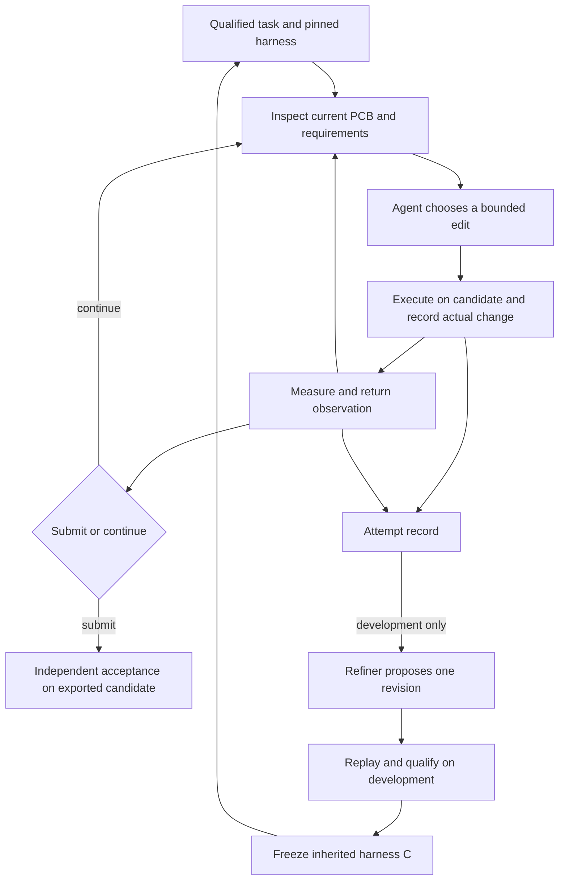

# Experiment 01: Can harness engineering improve a small PCB task?

## Goal Capsule

The recommended first milestone is now the smaller Experiment 00 below. After it establishes a working observation/edit/verification loop, Experiment 01 builds the environment in which an agent can place and route Temper's nine-component 3.3 V buck converter. Experiment 01 compares three harness versions with the same model, PCB tools, task inputs, and budgets. It determines separately whether the agent can complete the task, whether focused feedback helps, and whether a procedure learned from earlier attempts helps on unseen variants.

This is a plan, not a measured result. Implementation starts by qualifying the fixture and instruments; scored runs cannot start until that gate passes. A negative experiment with trustworthy evidence is a completed experiment. It is not permission to expand the system until a favorable result appears.

Keep the same repository and history. Establish `harness-lab/` as the active experiment area. Existing implementation, documentation, tests, and workflows remain on the shelf by default. The first experiment admits only the circuit facts and tools it actually needs.

The user's September 9 decisions govern scope. Numeric budgets and experimental thresholds below are proposed operating choices, not claims from the papers. The task's frozen electrical/layout contract governs acceptance; the solver and refiner cannot modify it. Whole-board layout, fabrication, power-on testing, and general PCB capability are outside this experiment.

---

## Proposed first milestone: Experiment 00

**Task:** place the buck's real input capacitor C9 near its fixed regulator U3 in a two-footprint fixture. C9 is the only editable object. Use the real footprint geometry and pin/net mapping: C9 pad 1 to U3 VIN, C9 pad 2 to U3 GND. The existing board explicitly identifies C9 as `power_mgmt.buck_3v3.c_in`. Keep the remaining converter connections declared as outside this placement task; this fixture is not a complete converter.

The agent chooses C9's position and one of four orthogonal orientations. There is no functional routing, new solver, harness comparison, automated refiner, or learned-memory library in this milestone. Its acceptance scope is placement only; the broader construction and Gate Q criteria later in this document apply to Experiment 01.

**Build only:** a fresh task workspace with an isolated candidate and protected input contract; three operations (`inspect`, `place`, `check`); and an append-only attempt log. Inspection returns exact pad geometry, the requirements, and a labeled view if useful. Placement returns the actual measured change and current findings. Checking independently reloads the saved candidate. Retain the initial and final files; a snapshot copy supplies recovery without building a general checkpoint service.

**Qualification:** freeze a small outline, 0.2 mm minimum copper clearance, and a 5 mm maximum center-to-center distance for each corresponding capacitor/regulator pad pair. These are task-specific geometry thresholds, not manufacturer limits or power-performance claims. Establish a witness placement that passes. Prove that the checker rejects a distant capacitor, an overlapping placement, a net reassignment, a moved regulator, and missing/invalid measurement output. Record which native KiCad checks ran; intentionally open electrical connections do not become a claimed full-DRC pass.

**Pass:** all three predeclared, solvable bad starting placements are repaired in fresh trials, each within five minutes and ten placement edits. Both mapped-pad distances meet the limit; the footprint stays within the outline and outside prohibited overlap; applicable clearance checks pass; U3, identities, nets, and rules are unchanged; the independently reloaded candidate and complete action log agree. No human placement hints during a trial. Invalid measurement is indeterminate and cannot pass. Freeze the starts and thresholds before the agent runs; do not repeat failed trials until three successes accumulate.

**Claim supported:** the agent can observe and repair one real PCB placement constraint through a trustworthy tool loop. This does not demonstrate routing, complete block construction, learned transfer, comparative harness benefit, or hardware readiness. A failing milestone still supplies a narrow diagnosis. Engineering facts, interface behavior, and resulting traces can earn admission to Experiment 01.

**Next increment:** once Experiment 00 passes, add only the two capacitor-to-regulator connections, validate actual connectivity and clearance, then expand toward the complete buck. Automated refinement follows useful task traces. Container orchestration, Harbor integration, and repository-wide archival moves are unnecessary prerequisites; enforce task isolation with the selected local runtime and qualify it directly.

---

## Product Contract

### Problem frame

Repeated whole-board solver development has mixed together algorithm quality, tool defects, missing context, and electrical-design questions. A small functional block makes those failures easier to isolate. The experiment tests an agent's ability to use reliable operations and feedback, without making the accumulated repository a prerequisite.

### Requirements

| ID | Requirement |
|---|---|
| R1 | Keep the repository; begin with a clean active area and explicitly admit any legacy dependency. |
| R2 | Start each construction attempt with all nine functional footprints unplaced and all functional copper absent; preserve the qualified circuit and boundary obligations. |
| R3 | Give the agent inspection, placement, copper editing, validation, and checkpoint recovery through a small operation interface. |
| R4 | Separate deterministic acceptance from agent judgment; invalid, incomplete, tampered, and unmeasurable results cannot pass. |
| R5 | Hold the model, backend capabilities, task inputs, and per-attempt limits constant while comparing harness policies. |
| R6 | Capture the actual supplied context, actions, resulting states, measurements, costs, and interventions. |
| R7 | Allow a bounded refiner to improve procedures from development traces, then freeze its output before held-out evaluation. |
| R8 | Report construction, harness benefit, and learning benefit as separate pass/fail results, with all scheduled attempts accounted for. |

### Settled scope

KTD1. **Same repository, shelf everything initially** (session-settled: user-directed — chosen over both wholesale reuse and a separate new repository because accumulated complexity should earn readmission). Governs R1. Physical archival moves are deferred; the experiment workspace and build entry point define the active boundary.

KTD2. **Small functional units first** (session-settled: user-directed — chosen over whole-board exploration to obtain faster feedback and build a useful dataset). Governs R2 and R8. Nine components is a proposed first fixture; later MCU, paired-block, and RTD experiments are follow-up work.

Only Bennet is the intended user. The output is a reviewable board artifact and experimental report. A graphical product, multi-agent swarm, model training, new placement solver, and public benchmark are deferred.

---

## Connection to the talks and paper

| Input idea | Decision in this experiment | Evidence that we implemented it |
|---|---|---|
| YC: capability depends on the environment and tool loop | A real mutable PCB environment with local actions and external feedback | The agent changes component placement and copper; exported artifacts are independently checked |
| YC: keep the harness thin | One solver, five operation families, one sequential refiner phase | The first run works without importing the old optimizer stack or building a specialist swarm |
| YC: persistence and additional search can matter | A completion gate, checkpoints, and a diagnostic intervention after repeated unproductive actions | No unsupported success declaration; a stalled run changes its experiment or stops with evidence |
| Chase: deliver relevant context at the right moment | Arm B assembles focused electrical/geometry observations and change reports | A/B runs differ in presentation and search policy, while access to underlying facts and actions stays equal |
| Chase: private evaluations and trace-based diagnosis | Qualified block tasks, immutable inputs, complete attempt records, held-out comparisons | Every reported success resolves to a candidate hash and verifier receipt; failures have inspectable context |
| Continual Harness: improve the harness using recent trajectories | A refiner edits a bounded procedure/observation policy from development attempts | Arm C inherits a versioned revision that was exercised during development and frozen before evaluation |
| Both talks: cost and tool behavior matter | Fixed resource ceilings, explicit errors/no-ops, total effort accounting | Scores include unsuccessful runs and refinement costs; no-op loops and validator failures remain visible |

YC mapping uses the user's supplied talk notes and timestamps: thin harness at 56:51, persistence at 57:44, and permissions at 58:28. The YouTube page was reachable but its transcript was not available through the research tool; these are attributed notes, not independently verified quotations. [YC video](https://www.youtube.com/watch?v=n9xKblqyQ28).

Chase describes customization as a spectrum and emphasizes context visibility. [Sequoia transcript](https://sequoiacap.com/podcast/owning-your-intelligence-starts-with-the-harness). The paper alternates task actions with edits to harness state and reports capability-dependent results. [Continual Harness, sections 3–4](https://arxiv.org/html/2605.09998v1).

Our adaptation deliberately resets board state between trials while preserving learned procedures. It is a transfer experiment inspired by continual harness refinement, not a reproduction of the paper's reset-free benchmark. We do not require spending the entire budget after verified success. An unconditional time floor and mid-evaluation self-modification would confound this first comparison and are deferred.

---

## Planning Contract

### The task

Use `BuckConverter3V3` in `elec/src/modules.ato` as the initial circuit reference: U3, L2, C9–C13, R16, R17. Reconcile exact instance-to-reference, footprint, pad, value, and net mappings before admission. The source names `BOOT`; TI calls pin 6 `CB`, so verify aliases by pin number. The external interface must include supply input, 3.3 V output, ground, and enable. Omitted enable or return connectivity is a failed fixture.

Start with a 40 × 35 mm rectangular task region, top-side components, orthogonal placement rotations, and the source board's six-layer stackup as a proposed fixture configuration. Confirm layer ordering and stackup import in native KiCad. These are benchmark choices; they do not establish integration feasibility in the full board. No functional tracks or zones are supplied initially. Put footprints in a neutral staging arrangement outside the region that contains no reference placement information.

Represent the four external connections with locked fixture terminal pads. They are explicitly labeled fixture objects, separate from the nine functional components. Their geometry and net identities are immutable. The exported evaluation board retains them for connectivity checking and is labeled a fixture, not a production board. Later composition must replace their interface deliberately.

Create two development variants and four reserved variants. Change region aspect ratio, port access, or one legitimate obstacle; use the same circuit. Avoid treating rotations of the same layout as independent circuit families. Establish a passing witness layout for every variant before freezing the split. Witnesses and their coordinates are unavailable to the solver and refiner. If a proposed region cannot be qualified, replace it before freezing; do not relax it after observing evaluation failures.

### Qualification before scored runs: Gate Q

All conditions must pass:

1. **Circuit and fixture:** exactly nine expected functional components plus the four declared fixture terminals, correct pin/net mapping, qualified footprint geometry, and an independently checked boundary contract. Supply voltage range, load assumption, copper thickness, numeric widths/clearances/via limits, and applicable layout rules are populated in the task manifest.
2. **Feasibility:** every variant has a witness accepted under the same checks that will judge the agent. No witness is used as an agent starting layout.
3. **Instrument validity:** native KiCad loads the exported board, refills zones, and runs DRC with pinned version, rules, library table, and configuration. Three repeated checks on every witness all pass. Missing reports, missing rules/libraries, tool failure, output caps, and inconsistent results are indeterminate, never zero violations.
4. **Negative controls:** the evaluator rejects every mandatory corrupt fixture: missing component, altered pad net, an open boundary connection, a copper short, clearance failure, out-of-region placement, absent required rule, stale receipt, and a DRC-clean violation of a buck-specific layout check.
5. **Operation integrity:** placement, route addition/removal, zone refill, and restore change exactly the requested state; asymmetric 45-degree probes agree with KiCad's own pad coordinates even though experiment rotations are orthogonal. An unsupported operation or unchanged board is reported explicitly.
6. **Isolation and evidence:** the solver cannot read held-out witnesses, the shelved repository, prior trial memories, or verifier implementation. It can read all applicable requirements. Every operation produces a hash-linked receipt and actual observation. A fresh process replays a recorded edit sequence to the same canonical board state.

Gate Q failure stops the scored comparison and produces an infrastructure/fixture report. Correct it and issue a new task/environment version before scheduling trials. This does not count as model failure.

### What a candidate must pass

Every mandatory predicate must pass; there is no weighted score that trades a short circuit for shorter wire length.

| Predicate | Passing condition |
|---|---|
| Identity and scope | Exact required component/pad/net identities, unchanged immutable terminals/rules/outline; no extra functional components or unauthorized edits |
| Placement | All nine functional footprints in the allowed region, legal orientations/layers, no prohibited overlap or keepout intrusion |
| Copper connectivity | Every required pin and terminal connected to the correct net after zone refill, zero shorts, zero outstanding required connections |
| Physical rules | Zero mandatory KiCad DRC findings and zero task-rule failures on three fresh validations of the same final artifact |
| Buck layout | All frozen locality, return-path, feedback separation, and routing-width checks pass |
| Evidence | Candidate hash matches the receipt and input manifest; all mandatory checks ran successfully; missing evidence fails acceptance |
| Autonomy and budget | No human placement/routing hints or edits during the attempt; candidate submitted before any attempt limit expires |

For buck layout, qualify concrete limits in Gate Q instead of inheriting the unrelated `buck_15v.yaml` template. The initial proposed geometric limits are: input bypass pads within 5 mm of the corresponding U3 VIN/GND pad centers; bootstrap pads within 5 mm of U3 CB/SW; feedback junction pads within 5 mm of U3 FB; and L2's switching-side pad within 8 mm of U3 SW. These distances are experiment proxies, not TI-specified limits. Gate Q must verify that witness layouts satisfy them and that they discriminate deliberately poor placement.

Also require local top-side ground copper connecting input/output capacitor returns to U3 GND, the frozen power-net width rules, and feedback/sense routing outside the inductor's body projection and away from switching copper. Record a numeric separation threshold and any package-escape exception before trials. These last checks may initially use a fixed, arm-blind human review rubric backed by native KiCad measurements; unresolved items fail acceptance. Review happens after submission and cannot guide that attempt. Give the reviewer randomized candidate identifiers without arm, policy, cost, or success metadata; retain the mapping in the experiment record and reveal it after verdicts. Report review minutes separately from in-run assistance.

TI's layout guidance motivates these checks: local capacitor returns, a short input loop, feedback isolation, and adequate power/thermal copper. It does not supply all numeric geometry limits. [LMR51430 datasheet, section 9.4](https://www.ti.com/lit/ds/symlink/lmr51430.pdf). Freeze explicit numeric manufacturing/current-dependent limits during U2; a manifest with missing values cannot pass Gate Q. The experiment establishes compliance with this layout contract, not measured thermal, EMI, transient-response, or powered-hardware performance.

### Three arms and what changes

**A — minimal baseline:** task brief, complete machine-readable rules/state, native reports, and the five PCB operation families. One generic solver instruction. No curated procedure, automatic focused summary, or project stall intervention. Standard runtime behavior and hard limits still apply.

**B — engineered observations:** exactly A's model, environment, backend operations, and authoritative facts, plus focused block/region observations, renders with stable identifiers, introduced/resolved findings, checkpoint recommendations, and the stall policy below. No learned cross-task procedure. B versus A tests this harness bundle; it does not identify the isolated effect of each feature.

**C — inherited revision:** B plus one selected revision produced by the refiner from development traces. The revision can change a short procedure, retrieval/summary policy, or composition of existing operations. It cannot add a new PCB backend capability, change requirements, or patch the evaluator. Freeze the revision before evaluation; no learning carries between held-out trials.

The model identifier, reasoning setting, runtime version, tool schemas, and dependencies are pinned in the experiment manifest before the first development run. Use one available headless coding-agent runtime that meets Gate Q's isolation and trace contract. Keep its familiar shell/edit primitives. Implement the domain wrapper in Rust; a small native-KiCad adapter may delegate to supported KiCad bindings. Runtime choice is an execution qualification step, not a new orchestration-framework project. If the existing runner cannot expose adequate context or isolation, use a minimal explicit model/tool loop and requalify it before comparison. No silent fallback or model change during a run.

### Attempt loop and refinement

Use five operation families: inspect/render; place/rotate a component or group; add/remove selected tracks/vias and ground zones; evaluate/export; checkpoint/restore. Low-level explicit copper edits must work without a whole-board router. A routing helper can be admitted only before the arms are frozen and must be identical in all arms. Do not claim shove/rip-up support without a working adapter test.

Each call includes an expected parent-state identity and returns status, affected objects, actual resulting state identity, measurements, and raw-artifact references. Reject stale edits atomically. Failed commands cannot partially replace the current candidate. Mandatory validations use protected originals rather than candidate-controlled configuration.

B and C detect three repeated equivalent actions with no state or relevant finding change. They supply a targeted diagnostic and require the next proposal to name a different scope, operation, or hypothesis. If three further equivalent actions still make no progress, end as `stalled`. This threshold is a proposed heuristic to test, not a claim from YC. Any agent may stop early with an honest failure; success always requires independent acceptance. There is no token-spending floor.

Run A and B once on each of the two development variants: four attempts. Then permit at most three refiner cycles, each proposing one revision and replaying it once on each development variant: at most six more construction attempts. Refiner input includes successful and failed traces, requirements, and B's harness, but no witness solution. Keep only a revision whose behavior is valid and whose observed development result motivates testing it; select one C using a predeclared ordering of accepted completions, then total cost. Selection is development optimization, not evidence of transfer.

If no valid revision is produced, record the learning stage as failed; do not relabel an unchanged B as a learned C. A/B construction and harness evaluation can still proceed. Otherwise freeze A, B, and C, then run all three on the four held-out variants twice: eight trials per arm, 24 total. Randomize arm order within each variant/repeat block, record seeds where the provider supports them, and use fresh state and memory for every trial. Do not inspect held-out feedback to alter the harness before the batch ends.

### Budgets and stopping

Proposed initial ceilings are **20 minutes, 50,000 total reported model tokens, 200 mutating PCB operations, or US$5 model spend per construction attempt, whichever occurs first**. Tool/startup time counts in elapsed time; in-loop evaluation counts too. Reserve up to five additional minutes for independent post-run verification and record it separately. A timed-out verifier makes acceptance indeterminate. Human review time is also separate and reported.

Each refiner cycle has a 10-minute, 20,000-token, US$2 ceiling; its two replays use normal attempt limits. The maximum design is 34 construction attempts plus three refiner calls: at most US$176 in model spend, with a US$200 overall cap including metered auxiliary calls. These are proposed caps, not price estimates or permission to spend now. Before dispatching a model call, reserve its maximum possible charge using the pinned price schedule, known input size, and bounded output; reconcile actual usage afterward. If the runtime cannot bound spend or expose usage accounting, scored runs cannot start with that adapter. Record token accounting coverage, including any provider-reported reasoning tokens.

After three engineering days without one complete fixture→edit→export→validate→record path, stop adding features and report the concrete missing capability. This is a scope checkpoint, not a promised implementation duration. Backend or fixture fixes after an arm freezes require a new version and rerunning all affected comparisons. Do not silently replace failed attempts. Externally canceled or infrastructure-affected batches remain reported as incomplete.

---

## Verification Contract

### Predeclared experimental decisions

Let S_A, S_B, and S_C be accepted, unassisted constructions out of eight scheduled held-out trials per arm. Timeouts, stalled runs, agent-induced tool errors, rejected candidates, and indeterminate final measurements contribute zero accepted completions and remain in the denominator.

| Decision | Pass | Fail or other outcome |
|---|---|---|
| Q: Is the environment trustworthy? | Every qualification condition and negative control passes | Stop scored runs; report fixture/instrument failure |
| F: Can the engineered agent build this block reliably enough to continue? | S_B ≥ 6/8, with at least one success on each of the four variants | This construction setup misses the initial feasibility bar |
| H: Did engineering the harness help? | F passes and S_B ≥ S_A + 2 | No demonstrated harness completion gain under this criterion; a saturated baseline is inconclusive for improvement |
| L: Did learned procedure reuse help? | S_C ≥ 6/8, at least one success per variant, and either S_C ≥ S_B + 2, or S_C ≥ S_B with at least 20% lower fully charged model cost per accepted result | No demonstrated learning benefit; retain B if it passed F |
| E: Is the dataset usable? | Every scheduled trial has an input/version identity, terminal status, trace, cost record, and candidate/receipt when produced; all successes reproduce acceptance | No experimental success claim until evidence gaps are resolved |

For L's cost branch, charge C with its held-out model spend **plus all refiner calls and all six refinement replay attempts actually used**, divided by S_C. Compare with B's held-out spend divided by S_B. Require C's mean held-out wall time across all eight attempts to be no more than 1.2× B's, so a cost win cannot hide an extreme latency regression. Report setup and A/B development effort separately, and publish a second total-project-cost view. No amortization over imagined future boards. If S_B is zero, the cost branch is ineligible.

Every reported accepted candidate must pass the full frozen contract. One false positive invalidates Q/E and all affected results until repaired and rerun. A post-freeze environment defect invalidates the affected comparison; preserve original records and label it incomplete rather than drawing a model/harness conclusion from bad instruments.

These are small-sample engineering thresholds, not statistical significance claims. Two repetitions on four layouts are not eight independent circuit families. Publish the per-trial table and counts, not just a percentage. The overall outcome is a vector such as `Q pass / F pass / H fail / L pass / E pass`, rather than collapsing unlike findings into one score.

### Interpretation and next action

- Q or E fails: repair instruments or records; do not infer PCB capability.
- F fails with valid evidence: use traces to distinguish action-interface, context, model reasoning, and task difficulty; target one bottleneck before a new experiment.
- F passes, H fails: keep the simpler baseline if its results justify it; do not credit additional harness machinery automatically.
- H passes, L fails: keep the measured observation/search improvements; postpone automatic refinement.
- F and H pass, with L reported either way: qualify the next functional block, then test composition separately. The MCU's placeholder button footprints must be addressed before admitting that task.

---

## Implementation Units

### U1. Establish the clean experiment boundary

**Goal:** A reproducible entry point that starts with only admitted material. **Requirements:** R1, R5; KTD1. **Dependencies:** none.

**Files:** `harness-lab/README.md`, `harness-lab/AGENTS.md`, `harness-lab/Cargo.toml`, `harness-lab/admitted.md`, `harness-lab/environment/`, `harness-lab/tests/environment_contract.rs`.

**Approach:** Give the lab a standalone build boundary inside this repository. Stage per-run agent workspaces with only the qualified task, selected tools, applicable instructions, and selected harness version. Preserve legacy files in place initially. Record each admitted item with its needed capability, source/version, and qualifying evidence. Use a sandbox that excludes the shelf, witnesses, verifier implementation, other trials, and production board writes. The active instructions must explicitly reflect the new project direction; leaving obsolete parent instructions in the runtime's effective context is not isolation. File boundaries below are a starting layout and may be consolidated; this experiment needs no plugin registry, service fleet, database, or general runtime abstraction.

**Test scenarios:** A cold workspace runs the tool version probes without importing old packages; a read of a held-out witness or shelved file is denied; a write to authoritative rules is denied; a second trial has no first-trial memory. **Verification:** a saved environment manifest and evidence for Gate Q isolation. Prefer smoke and integration checks over boilerplate scaffold tests.

### U2. Qualify the buck tasks and acceptance oracle

**Goal:** Solvable construction tasks with checks that cannot produce a vacuous pass. **Requirements:** R2, R4. **Dependencies:** U1.

**Files:** `harness-lab/tasks/buck-3v3/` for manifests, input circuits and six variants; `harness-lab/evaluation/witnesses/` and `harness-lab/evaluation/corruptions/` excluded from agent mounts; `harness-lab/src/verify.rs`; `harness-lab/tests/fixture_contract.rs`; `harness-lab/tests/acceptance_controls.rs`.

**Approach:** Extract or reauthor only the admitted circuit and footprint data. Qualify numeric constraints, layout rubric, stackup, and ports against TI guidance and project intent. Create the witnesses and deliberately faulty candidates before scoring agents. Export with native KiCad and pin all project/rule/library sidecars. Use raw reports and hashes as evidence; legacy DRC wrappers and receipts are references, not automatic dependencies.

**Test scenarios:** Every Gate Q corruption is rejected; a missing report is indeterminate; a missing rule cannot yield a pass; an omitted enable terminal fails; valid ground-zone connectivity survives refill; a DRC-clean remote bypass capacitor fails the layout contract. **Verification:** all six witnesses pass the exact final acceptance path, and all negative controls fail for the expected reason. Undefined current/width or layout limits block Q rather than being guessed during evaluation.

### U3. Expose bounded PCB actions and state receipts

**Goal:** Agent actions reliably change the intended candidate. **Requirements:** R3, R4, R6. **Dependencies:** U1, qualified task representation from U2; finish before Gate Q.

**Files:** `harness-lab/src/board.rs`, `harness-lab/src/operations.rs`, `harness-lab/src/receipts.rs`, `harness-lab/adapters/kicad/`, `harness-lab/tests/action_contract.rs`, `harness-lab/tests/kicad_oracle.rs`.

**Approach:** Implement the five operation families and atomic parent-bound mutations. Prefer native KiCad geometry/editing behavior; keep any language bridge thin. Expose explicit track/via/zone construction and deletion so a new autorouter is unnecessary. Restore from immutable checkpoints and compare canonical geometry/connectivity as well as raw file hashes. Pin any reused Rust extension's build identity; no importing the old workspace as a shortcut.

**Test scenarios:** Moving and rotating an asymmetric footprint matches native KiCad; invalid net/layer edits leave state unchanged; stale-parent edits are rejected; interrupted export retains the prior candidate; restore returns geometry and connectivity to the checkpoint; repeating a no-op returns `unchanged`; recorded operations replay in a fresh process. **Verification:** a manually specified sequence can construct, undo, reconstruct, export, and validate a candidate without agent interpretation.

### U4. Run A and B with complete observations and budgets

**Goal:** The same model can operate the task under the two declared harness policies. **Requirements:** R3, R5, R6. **Dependencies:** U2, U3, Gate Q.

**Files:** `harness-lab/src/runner.rs`, `harness-lab/src/observe.rs`, `harness-lab/src/trace.rs`, `harness-lab/agents/baseline.md`, `harness-lab/agents/focused.md`, `harness-lab/experiment.toml`, `harness-lab/tests/runner_contract.rs`.

**Approach:** Use one qualified runtime adapter, not several providers. Preserve raw tool outputs and separately record their selected presentation, summary policy, truncation, supplied instructions, and harness version. Do not claim visibility into hidden provider context or hidden reasoning. Mark visibility gaps; required application-level context and usage must remain auditable. Assemble B's region observations from the same information A can query. Enforce resource ceilings and terminal states outside the agent's final prose.

**Test scenarios:** Equivalent requests in A/B expose the same underlying facts/actions; a summary cannot remove a mandatory rule from authoritative context; three repeated unchanged edits trigger B's diagnostic; limits terminate child operations and preserve evidence; premature success becomes rejected unless independently accepted; an assisted run is labeled assisted. **Verification:** four development attempts recorded, with timing split across model, editing, validation, and startup; all Gate Q checks still pass.

### U5. Refine once, freeze, and evaluate transfer

**Goal:** Test learned procedure reuse without contaminating evaluation. **Requirements:** R5–R8. **Dependencies:** U4.

**Files:** `harness-lab/src/refine.rs`, `harness-lab/src/score.rs`, `harness-lab/agents/refiner.md`, `harness-lab/skills/`, `harness-lab/tests/refinement_boundary.rs`, `harness-lab/tests/scoring_contract.rs`, `harness-lab/results/experiment-01/` for retained run records and report.

**Approach:** Run the bounded development/refinement schedule, freeze the selected policy and split, then execute the randomized held-out schedule. A procedure can compose existing actions but cannot smuggle a new backend or a stored witness solution into C. Track its use and actual outcomes. Save large artifacts in an artifact directory with content hashes and a committed index; preserve the failed attempts too. Publish Q/F/H/L/E, the full outcome matrix, cost/latency and review effort, diagnosis, and the next experiment justified by evidence.

**Test scenarios:** Refiner attempts to change a rule or access a held-out witness fail; unused or no-op revisions are not credited as learning; each trial starts without another trial's memory; false positives invalidate results; the scorer keeps timeouts and indeterminate runs in the denominator; C's charged cost includes all actual refinement and replay spend; interrupted batches remain incomplete. **Verification:** the experimental decisions can be recalculated from immutable records and every claimed pass can be revalidated on its exported candidate.

---

## Definition of Done

The harness and dataset are implemented when U1–U5 are verifiable, Gate Q has passed, and the scheduled comparison has produced a reproducible report. A documented Gate Q blocker or incomplete batch is an honest stopping artifact but does not satisfy the full experiment's Definition of Done.

The experiment is finished when every scheduled trial is accounted for, Q/F/H/L/E is reported without changing thresholds after results, successes have independent receipts, and the report names the next action. Passing H or L is not necessary to finish; it is necessary to claim the corresponding benefit. No production PCB edit or repository-wide archive migration is part of this plan.

## Sources and inspected references

- User's September 9 conversation: project-specific harness, small blocks, same repository, everything shelved until useful. This document consolidates those decisions and supersedes the companion draft's unspecified trial counts and budgets for Experiment 01 only.
- `elec/src/modules.ato` / `BuckConverter3V3`, `elec/src/components.ato` / `LMR51430`, and `pcb/temper.kicad_pcb`: candidate circuit, alias, footprint, and stackup sources. Reference inspection used main `84c5e5b61000d45eec09834cb23e6bba8fa51169`; this plan's isolated worktree starts at refreshed `origin/main` `eea522adc47e85520bb8a85c5ad96b6e2e40d7a8`. Runtime behavior was not tested during planning.
- `docs/solutions/best-practices/three-silent-failures-measurement-pipeline-2026-07-07.md`: nonempty classification checks, actual format loading, and explicit subprocess failure motivated Q's negative controls.
- `AGENTS.md`, measurement-instrument and rotation incidents: qualify against external KiCad behavior, preserve full validation context, and reject invalid measurement. These are lessons to test, not instructions to import the old implementation.
- [YC talk](https://www.youtube.com/watch?v=n9xKblqyQ28), via the supplied notes; [Chase's original Sequoia transcript](https://sequoiacap.com/podcast/owning-your-intelligence-starts-with-the-harness); [Continual Harness](https://arxiv.org/html/2605.09998v1); [TI LMR51430 datasheet](https://www.ti.com/lit/ds/symlink/lmr51430.pdf).
- [Harbor task documentation](https://www.harborframework.com/docs/tasks): instructions/environment/verifier packaging is a useful reference. Harbor adoption is optional and should not delay the first qualified local trial.
