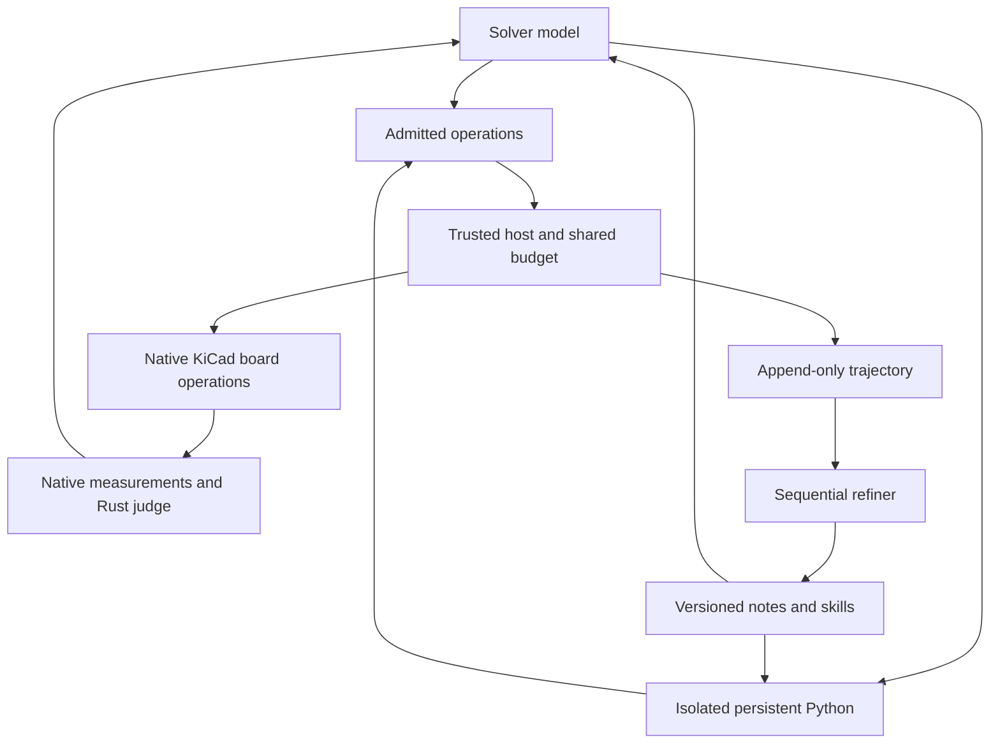

# Buck Continual Harness - Plan

## Goal Capsule

Determine whether an agent can place and route Temper's complete nine-component 3.3 V buck, and whether reusable procedures refined during construction improve its performance on reserved layout variants.
The September 9 conversation approves this scope and its comparison of fixed, inherited-frozen, and inherited-updating harnesses.
The user's subsequent correction excludes a new DSL: executable procedures use ordinary code in an isolated standard interpreter.
The existing two-footprint experiments remain independent historical results.
Stop model execution on an unqualified fixture, compromised isolation, unmeasurable board, or incomplete transport evidence; retain the unsuccessful attempt.

---

## Product Contract

### Summary

Extend the lab to the complete buck, add a persistent programming workspace and versioned reusable procedures, and run a bounded pilot with native verification and complete traces.

### Problem Frame

The current five-operation interface passed three joint C9 placement and two-net routing trials.
It does not yet test complete circuit construction, programmable working state, automatic harness refinement, or transfer to unseen layouts.

### Requirements

**Circuit construction**

- R1. Admit U3, L2, C9–C13, R16, and R17 from the source board, with an explicit reconciliation to `BuckConverter3V3` and its external net obligations.
- R2. Begin construction with all nine functional footprints in a neutral staging arrangement and no functional copper; frozen terminals represent the external connections.
- R3. Permit explicit placement, track/via editing, inspection, and independent checking while preserving footprint/pad/net identity, external terminals, outline, and rules.
- R4. Acceptance requires complete physical connectivity, legal placement, all mandatory native DRC checks, and a frozen buck layout contract with feasible witnesses.

**Programmable working state and refinement**

- R5. Supply a persistent standard scripting interpreter with ordinary code, structured observations, and callable admitted PCB operations; do not create a DSL or hide a placement/router algorithm inside a primitive.
- R6. A bounded sequential refiner reads the ongoing attempt's trace and updates versioned notes or executable skills while construction retains its board, action history, and remaining budget.
- R7. Every harness revision records its source trajectory, parent version, contents, and application boundary; inherited versions can be restored without erasing intervening evidence.
- R8. Generated code and refinements cannot read witnesses, other trials, credentials, the shelved repository, or evaluator internals, and cannot change acceptance rules or budgets.

**Experiment and evidence**

- R9. Compare a fixed base harness, inherited procedures with refinement disabled, and the same inherited procedures with refinement enabled, holding the model, native operations, task inputs, and total attempt ceilings constant.
- R10. Freeze development/evaluation splits and inherited state before evaluation; each evaluation trial starts with fresh working state and contributes no learning to another trial.
- R11. Preserve every scheduled attempt, actual supplied context, code execution, revision, board action, native report, transport outcome, and resource receipt.
- R12. Report circuit completion, observed refinement effects, and transfer effects separately, including regressions and inconclusive small-sample outcomes.

### Key Decisions

- **Use the complete buck** (session-settled: user-approved — chosen over further two-footprint refinement because the existing task leaves little completion headroom). Governs R1–R4.
- **Refine during an ongoing attempt** (session-settled: user-approved — chosen over between-attempt-only refinement to exercise the papers' continual mechanism). Governs R6, R7, R9.
- **Use ordinary code** (session-settled: user-directed — a custom DSL adds unnecessary language and maintenance burden). Governs R5.

### Scope Boundaries

This is a local PCB experiment for Bennet, not a fabrication or powered-hardware qualification.
Use the existing Muse Spark Contributor Free route through OpenCode Zen under the previously accepted terms; no paid or alternate-provider fallback is part of this experiment.
Recursive teams, model-weight training, whole-board integration, production board edits, and public publication remain outside this milestone.

---

## Planning Contract

### Key Technical Decisions

- KTD1. Retain `harness-lab/` and its isolated standalone Rust judge; implement new domain judgment in Rust and native KiCad/process glue in Python. Reuse raw native serialization and census-before-connectivity from `routing_native.py`.
- KTD2. Add a full-buck profile alongside the existing profiles, preserving their frozen fixtures and results. Start with two copper layers and an approximately 50 × 40 mm region; exact feasible geometry and numeric rules are frozen during local qualification before model work.
- KTD3. Use an isolated ordinary Python interpreter for model-authored programs, with persistent variables and a small RPC bridge to the same validated PCB actions. Enforce file/process/network access outside Python and qualify denied-access behavior; interpreter import filtering is not a sandbox.
- KTD4. Keep trusted board/evaluator operations in the host process. Generated programs see observations and their own workspace; every nested PCB action passes the same budget, validation, logging, and independent acceptance path as a direct tool call.
- KTD5. Apply refinement at recorded action boundaries with no board reset. A separate sequential invocation of the same model edits only the admitted notes/skill store, and its time counts against the original attempt deadline. Load each applied version into subsequent interpreter use and observations; persisted files alone do not establish reuse. The MCP operation timeout must cover the bounded refinement and native measurement while remaining inside the attempt deadline.
- KTD6. Freeze a small pilot: two development variants and two reserved evaluation variants. Run fixed and updating conditions on development, then three conditions once on each reserved variant. Ten construction attempts is the maximum scheduled pilot; it is not a statistical generalization study.
- KTD7. Each construction attempt has a 20-minute elapsed ceiling and 200 mutating PCB operations, including nested program actions; allow at most three refinement calls, each bounded by 90 seconds and the remaining attempt deadline. Track reported tokens and cost, without claiming an independently verified dollar bill or a hard token ceiling.
- KTD8. All conditions expose the same computation and native operation capabilities. Fixed conditions prohibit changes to reusable inherited artifacts but retain ordinary working computation. Updating conditions may revise the reusable store; each trial begins from its designated immutable initial version.
- KTD9. Choose an inherited development revision only from fully recorded, locally qualified artifacts, preferring a revision associated with complete construction, then lower total elapsed time, then lexical revision identity. If no usable revision is produced, report that failure and do not label the unchanged baseline as learned.

### Paper Alignment

[Prime Agent, §§2.2–2.6](https://arxiv.org/html/2608.23552v1#S2) grounds KTD3–KTD5: retained computation, revisable external state, and explicit accounting.
Its §3.5 specification-exploit example motivates R8 and independently checked board identity.
This milestone implements a single-agent subset of that architecture and does not claim recursive orchestration.

[Continual Harness, §§3.1–3.2 and 4.1](https://arxiv.org/html/2605.09998v1#S3) grounds the live refinement and inherited-frozen/updating comparison.
Board state continues across revisions within an attempt; independent benchmark trials reset intentionally.
The experiment therefore tests online adaptation and cross-variant transfer separately.
The reported capability floor and regressions in §4.4 make a negative result admissible.

### High-Level Technical Design



```mermaid
sequenceDiagram
    participant S as Solver
    participant H as Host
    participant R as Refiner
    S->>H: Inspect, compute, and edit
    H-->>S: Measured state and findings
    H->>R: Recent trace at eligible boundary
    R->>H: Proposed reusable-state revision
    H->>H: Validate, version, and apply
    H-->>S: Updated artifacts; same board and deadline
    S->>H: Continue and submit
    H->>H: Independent final validation
```

### Qualification Decisions

Reconcile actual reference/pin/net mappings before fixture admission, including whether enable is tied to the input supply in the admitted design.
Do not invent a separate electrical net to accommodate a fixture terminal.
Freeze input/boot/feedback locality, feedback-to-switching separation, power copper widths, and return connectivity as explicit benchmark constraints supported by native measurements and TI layout guidance.
Numeric geometry proxies are not manufacturer guarantees or evidence of electrical performance.
Every variant needs a passing witness and negative controls; witnesses remain outside solver/refiner access.

### Risks and Dependencies

The local standard interpreter's sandbox and native KiCad 10.0.4 are qualification dependencies.
If an isolation primitive fails on this host, qualify an available standard process/container boundary before continuing; do not substitute an ad hoc safe-eval language.
Transport failures invalidate the affected attempt even if its final board happens to pass.
More components or refinement may exceed the model's useful capacity; preserve the measured outcome without tuning the reserved batch.

---

## Implementation Units

### U1. Qualify the full buck environment

- **Requirements:** R1–R4, R8.
- **Files:** `harness-lab/buck_native.py`, `harness-lab/build_buck.py`, `harness-lab/src/buck.rs`, `harness-lab/src/main.rs`, `harness-lab/fixtures/buck-contract.json`, `harness-lab/qualify_buck.py`, `harness-lab/test_buck_boundary.py`.
- **Approach:** Extend the native/Rust boundary under KTD1–KTD2; freeze source mapping, terminals, starts, rules, and protected hashes.
- **Patterns:** `combined_native.py`, `routing_native.py`, `qualify_combined.py`.
- **Test scenarios:** Each witness passes repeated native validation; missing terminal connectivity, wrong raw copper net, moved protected terminal, altered rules, short, clearance error, outside footprint, and DRC-clean locality violation are rejected.
- **Verification:** All admitted variants have independent positive and negative evidence; production board hash remains unchanged.

### U2. Add complete-circuit operations

- **Requirements:** R3, R4, R11. **Dependencies:** U1.
- **Files:** `harness-lab/buck_host.py`, `harness-lab/harness.py`, `harness-lab/test_buck_boundary.py`.
- **Approach:** Provide explicit per-component placement and branched multi-pad copper editing through KTD4, with atomic validation and shared accounting.
- **Test scenarios:** Invalid arguments leave state unchanged; placement leaves existing copper stationary; replacing one net preserves other copper; exhausted/stale requests cannot mutate; a submitted board is independently reloaded and verified.
- **Verification:** A recorded complete construction replays through the public operations and passes the same checker used for model trials.

### U3. Add isolated programmable working state

- **Requirements:** R5, R8, R11. **Dependencies:** U2.
- **Files:** `harness-lab/workspace.py`, `harness-lab/workspace_worker.py`, `harness-lab/test_workspace.py`, `harness-lab/buck_host.py`.
- **Approach:** Apply KTD3–KTD4 using ordinary Python, persistent variables, bounded output/runtime, and audited nested calls.
- **Test scenarios:** Variables persist between calls; an ordinary function composes PCB operations; attempted secret/witness reads, subprocess creation, network access, and writes to protected state fail; infinite execution/output ends within limits; nested edits exhaust the real shared budget.
- **Verification:** Real isolated subprocess controls pass, not just mocked path checks.

### U4. Add versioned live refinement

- **Requirements:** R6–R8, R10, R11. **Dependencies:** U3.
- **Files:** `harness-lab/refinement.py`, `harness-lab/test_refinement.py`, `harness-lab/buck_host.py`, `harness-lab/run_buck_trials.py`.
- **Approach:** Apply KTD5 and KTD8; version complete artifact contents, expose revisions on the next solver boundary, and retain their source windows.
- **Test scenarios:** A revision changes a subsequent skill invocation without resetting board or deadline; frozen artifacts reject edits; malformed/path-escaping revisions are rejected; rollback retains prior history; refiner timeout is recorded and cannot extend the construction budget.
- **Verification:** Scripted end-to-end controls prove revision, reuse, continuation, and rejection semantics before live calls.

### U5. Run and report the bounded comparison

- **Requirements:** R9–R12. **Dependencies:** U1–U4.
- **Files:** `harness-lab/run_buck_trials.py`, `harness-lab/test_buck_runner.py`, `harness-lab/TRIAL-INPUTS.md`, `harness-lab/BUCK-EXPERIMENT.md`, `harness-lab/BUCK-RESULTS.md`, `harness-lab/README.md`, `harness-lab/evidence/`.
- **Approach:** Reuse the serial Zen relay and complete wire audit under KTD6–KTD9; preflight the exact new catalog and payload before development, then freeze inherited state before reserved trials.
- **Test scenarios:** Qualification/source drift blocks launch; no reserved trace enters development or another trial; all requested/served models and tool schemas match; upstream failure ends admission; missing evidence cannot pass; all scheduled trials appear in the report.
- **Verification:** Retained pilot receipts support each stated result, including an honest blocked or negative outcome where a gate prevents further experiments.

---

## Verification Contract

Run the lab's existing `make check` plus the new focused native qualification and real-process isolation controls.
Preserve all earlier fixture results by rerunning their relevant qualification after changes to shared hosts or measurement paths.
Use KiCad-generated geometry and physical connectivity as external evidence; Rust/Python self-agreement is insufficient.
Record the exact interpreter, KiCad, OpenCode, source, contract, and judge identities before live inference.
Review the completed diff for correctness, isolation, and evidence integrity before local commits are finalized.

## Definition of Done

The environment, public operations, programmable workspace, and live refinement pass their named controls.
Every scheduled pilot attempt is retained and classified, or a concrete qualification/operational blocker explains which attempts could not run.
The report distinguishes implemented capability from model behavior actually observed and compares total effort without hiding refinement overhead.
Deliver reviewable local commits and evidence; the existing unpublished branch is not implicitly authorized for publication.

## Execution Appendix: Muse Spark Builder Handoff

### Workspace, route, and authority

The canonical checkout is `/Users/bennet/Desktop/temper/.worktrees/codex/buck-harness-experiment-plan`, branch `codex/buck-harness-experiment-plan`. The code baseline before this plan's checkpoint is `772f183e2aa7e6457c0c243cbc8165aff1abbe10`. Preserve its earlier unpublished commits and all earlier experiment artifacts. The host records the plan checkpoint and supplies the resulting exact base SHA for each implementation unit; the worker must verify its HEAD against that supplied SHA.

The user selected **OpenCode Zen → Meta Muse Spark 1.3 Contributor Free** as the implementation author as well as the experiment model. Pin the builder to `opencode/muse-spark-1.3-contributor-free`; record the requested model and any actual served-model receipt separately. No paid model, alternate provider, recursive delegation, push, PR, or production-board change is authorized by this handoff.

Use the CE Work cross-model controller and its fixed OpenCode adapter for serial builder units. The controller creates a detached sibling worktree, checkpoints this plan, captures the worker's complete diff, and lets the host verify and integrate it. A builder receives a bounded unit packet and can read tracked repository content in its worktree. It may use source editing and shell/build tools. Workspace and command restrictions in the OpenCode builder adapter are cooperative; a linked worktree is not an OS sandbox. The host owns canonical Git operations, scope review, and authoritative verification. The worker leaves its changes uncommitted and never touches another checkout or another agent's work.

The existing `run_zen_trials.py` configuration is a **solver** configuration: its tool allowlist cannot implement source changes. Do not loosen that configuration to create the builder. Give the builder a separate configuration with the selected model, sharing and unrelated plugins disabled, and no automatic paid/provider fallback. Any configuration or permission limitation must be recorded before dispatch rather than silently dropped.

Builder time is separate from scored construction time. Each builder unit has a two-hour hard ceiling; retain progress if it expires. That ceiling does not replace the 20-minute per-trial limit in KTD7.

### Required context and installed tools

Read the root `AGENTS.md` and any applicable nested instructions, then the active unit and its cited requirements/decisions. Read these existing patterns as needed:

- `harness-lab/README.md`, `TRIAL-INPUTS.md`, `COMBINED-EXPERIMENT.md`, `COMBINED-RESULTS.md`, and `VALIDATOR-CONTROLS.md` for actual scope and historical controls.
- `harness.py`, `native.py`, `routing_native.py`, `combined_native.py`, `routing_host.py`, `combined_host.py`, `qualify_combined.py`, `src/main.rs`, and `src/routing.rs` for the native boundary and judge.
- `run_zen_trials.py` and `test_zen_runner.py` for the fixed provider, full-stream accounting, and restricted solver runtime. Discover additional tests by imports rather than assuming this list is exhaustive.
- `elec/src/modules.ato` (`BuckConverter3V3` and `PowerManagement`) and `pcb/temper.kicad_pcb` as read-only circuit sources.
- `docs/solutions/best-practices/three-silent-failures-measurement-pipeline-2026-07-07.md` and root guidance on raw KiCad serialization, rotation oracles, shared Cargo output, and measurement failures.
- The two papers linked under Paper Alignment and TI's [LMR51430 datasheet, layout section](https://www.ti.com/lit/ds/symlink/lmr51430.pdf). Record source versions in fixture provenance; unavailable references are reported rather than reconstructed from memory.

Host paths observed during planning: OpenCode `/Users/bennet/.opencode/bin/opencode`; KiCad CLI `/opt/homebrew/bin/kicad-cli`; pcbnew Python `/Applications/KiCad/KiCad.app/Contents/Frameworks/Python.framework/Versions/3.9/bin/python3.9`; Ruff `/Users/bennet/Miniforge3/bin/ruff`. Verify availability/version at execution. The lab Makefile supplies the shared Cargo target directory; this independent Rust binary is not a pyo3 extension. Do not rebuild production packages or mutate global environments.

Baseline checks, run from the worker's own `harness-lab/` directory:

```sh
make build
make check
```

Use fresh output directories for native qualification. A native DRC permission failure or crash is indeterminate; return its command and log for host execution under the existing permission boundary. Never substitute an empty DRC report. The host must distinguish a sandbox denial from a missing KiCad capability.

### Fixture decisions and qualification authority

Preserve the actual source mapping below and verify it again before extraction. U3 enable is tied to +15V in both the schematic and board; there is no separate enable net. Use three protected external terminals: VIN on +15V, GND on gnd, and VOUT on +3V3.

| Net | Functional pads |
|---|---|
| +15V | C9.1, U3.3, U3.5 |
| gnd | C9.2, C11.2, C12.2, C13.2, R17.2, U3.1 |
| sw | U3.2, C10.2, L2.1 |
| boot | U3.6, C10.1 |
| fb | U3.4, R16.2, R17.1 |
| +3V3 | L2.2, C11.1, C12.1, C13.1, R16.1 |

Freeze a versioned contract containing full source/fixture/context hashes, native version, pad census, protected terminal poses, outline, supported layers, allowed copper kinds, connectivity obligations, and named numerical layout checks. Do not inherit the old judge's two-footprint census, intentional U3.5 disconnection, one-open-connection allowance, or fixed ten-edit budget. Complete construction permits zero open required connections.

The builder may determine exact terminal poses, neutral staging poses, four variant geometries, and numerical engineering proxies during U1 qualification. Start with two copper layers and a 50 × 40 mm region. Use two development and two reserved variants with meaningful terminal-access or region differences; label their split before model trials. Every choice requires a passing native witness and independently failing controls. Record why each locality/separation/width threshold was chosen; distinguish benchmark proxies from TI requirements. This is explicit design authority before the contract is frozen, not permission to tune constraints after observing model performance.

Measure input-capacitor and bootstrap locality, output-capacitor/inductor locality, feedback-resistor locality and separation from switching copper, minimum power-copper widths, and connected local ground returns. Use native geometry; arbitrary-angle checks must include an asymmetric non-orthogonal oracle case. A declaration that a pad belongs to gnd does not prove a local return path. Explicit ground pours are allowed, with the model supplying layer and polygon and KiCad supplying normal zone filling; no hidden routing or placement search is allowed. Inventory saved copper nets before connectivity rebuilding can propagate assignments.

Every witness must pass three fresh native evaluations; keep the full reports. Each named negative control must fail for its intended defect, not merely fail for some unrelated reason. A malformed/missing report must be indeterminate, never pass. If a complete witness cannot satisfy the proposed contract, investigate before freezing it and document the outcome; do not run or score a model against an unqualified fixture.

### Stable public operation contract

U1 establishes the measured JSON/contract schema; U2 implements these ordinary tool calls. Publish their exact JSON schemas and examples before U3. All arguments are finite values with unknown keys rejected; invalid arguments leave the board unchanged. Units are millimetres and KiCad degrees.

| Operation | Arguments and behavior |
|---|---|
| `inspect` / `check` | No arguments. Return saved geometry, constraints, connectivity, DRC findings, revision identity, and remaining budgets; `check` performs independent native validation. |
| `place` | `reference`, `x_mm`, `y_mm`, `angle_deg`; move one of the nine functional footprints only. Copper stays stationary. Admit 0/90/180/270 initially. |
| `replace_copper` | `net`, `segments`, `vias`, `zones`; atomically replace all mutable copper for that one admitted net, preserving other nets. An empty set removes that net's copper. |
| `execute` | `code`; execute ordinary Python with persistent working variables, bounded output, and a `pcb.call(operation, arguments)` bridge to the same host operations. It cannot recursively call `execute`. |

Each segment has `start_mm`, `end_mm`, `layer`, and `width_mm`; each via has `position_mm`, `diameter_mm`, and `drill_mm` spanning the two admitted copper layers. Each zone has `layer` and `outline_mm` vertices, with native filling and frozen clearance/connection settings. Only gnd zones are admitted initially. Freeze per-call object and output limits in the public schema before live trials. One successful `place` or `replace_copper` consumes one mutation; every nested call consumes the same budget. Checks and computation still consume the shared elapsed deadline. Tool responses and final scoring use the same judge.

### Runtime and live refinement decisions

Use a persistent standard Python subprocess. On this macOS host, first qualify `/usr/bin/sandbox-exec` with an explicit deny-by-default profile that admits the Python runtime and dedicated working directory, passes no credentials, and denies other files, network, and new subprocesses. A real denial test is required for each restriction. If unavailable, use an available container boundary and rerun the same tests; do not replace it with import filtering, an AST whitelist, or a DSL. An unavailable OS/container boundary blocks U3 and all model trials, while retaining completed U1/U2 work.

The host communicates over a bounded RPC channel; Python code cannot supply a raw board path or evaluator command. Cap each `execute` at 120 elapsed seconds and 64 KiB returned output, inside the unchanged attempt deadline. Exceeding a limit terminates the worker, records loss of working state, and ends the attempt as indeterminate. Host actions already completed remain in the trace. Test infinite computation, output flooding, malformed RPC, and nested budget exhaustion using real processes.

Reusable artifacts are `notes.md` and `skills.py`, initially an explicitly versioned minimal base. Working variables/scratch code are separate. In updating conditions, trigger refinement after the 20th, 60th, and 100th successful mutation, after its native measurement, unless construction has passed or the deadline has expired. Apply a proposal only at that boundary. Freeze this schedule for all live trials.

Each refiner call receives task/tool instructions, current notes/skills, current observation, and the last 20 operation request/response pairs from its own trial. Bound the serialized input to 128 KiB by removing oldest complete pairs, recording exactly what was supplied; an oversized indispensable input skips refinement with a receipt. It returns complete replacement contents for those two artifacts through a structured update tool, at most 64 KiB combined. It receives no board editing, shell, repository, witness, other-trial, or provider-switching tools.

Record parent and child hashes, contents, source window, model/transport evidence, elapsed time, and application boundary. Validate syntax/path/size, then load the new skill module in the isolated worker under a new revision namespace while preserving ordinary working variables. Calls through the current `skills` binding must use the applied revision; retained aliases remain attributed to their old revision. Syntax validation is not security validation. Artifact parse failures/timeouts retain the old revision and consume time. Transport-integrity failures follow the plan's indeterminate-attempt rule. The solver's next observation exposes the revision and its notes. MCP calls must allow the 120-second execution plus a bounded 90-second refinement and native checks, but never exceed the shared remaining deadline.

### Checkpoints and command interfaces to implement

The commands below are required deliverable interfaces; they do not all exist yet. Run serially from the checkout root and capture argv, working directory, source/contract/binary hashes, exit status, logs, and machine-readable receipts. Qualification and preflight commands must exit nonzero on incomplete evidence. A successfully recorded scored failure is a valid experimental result and must not be silently retried.

| Stage | Command / required evidence before advancing |
|---|---|
| U1: fixture and judge | `python3 harness-lab/qualify_buck.py <fresh-output>` produces `qualification.json` for all four variants, three passing witness checks each, intended negative-control results, protected-state checks, and unchanged production-board digest. Run `make -C harness-lab build check` as well. Stop the first builder unit here. |
| U2: operations | `python3 -m unittest discover -s harness-lab -p 'test_buck_boundary.py'` plus qualification proves atomic operations, stationary copper on placement, shared budgets, and a complete witness replay through public operations. |
| U3: ordinary Python | `python3 -m unittest discover -s harness-lab -p 'test_workspace.py'` proves persistence, composed PCB edits, real denied access, and process/output limits. |
| U4: refinement | `python3 -m unittest discover -s harness-lab -p 'test_refinement.py'` proves changed skill behavior, continuing board/deadline, frozen conditions, failure handling, and retained history. No live refinement is needed to establish these controls. |
| U5: preflight | `python3 harness-lab/run_buck_trials.py <fresh-output> --phase preflight --qualification <qualification.json>` uses the exact trial configuration in inspection-only mode and records model/tool/context identities. |
| U5: development | `python3 harness-lab/run_buck_trials.py <fresh-output> --phase development --qualification <qualification.json> --preflight-receipt <results.json>` runs exactly four declared attempts and produces a frozen inherited revision manifest or an explicit no-usable-revision outcome. |
| U5: evaluation | `python3 harness-lab/run_buck_trials.py <fresh-output> --phase evaluation --qualification <qualification.json> --preflight-receipt <results.json> --inheritance <inheritance.json>` runs exactly six declared attempts, one per reserved variant/condition. Refuse launch if no usable inherited revision exists. |

The host independently reviews and verifies each unit before dispatching its successor. U1 delivery includes native evidence and exact rerun instructions; a worker's claim of success alone cannot advance the experiment. Regression qualification for earlier profiles is required whenever their shared paths change. U1's expected file scope also includes generated `harness-lab/fixtures/buck/**`, new `harness-lab/evidence/buck-qualification*` receipts/archives, a focused `harness-lab/BUCK-QUALIFICATION.md`, and minimal `harness-lab/Makefile` changes needed for its checks. Existing frozen fixture/evidence files are not editable. Keep temporary native output under ignored `harness-lab/runs/` and retain a compact, reproducible committed evidence artifact.

### Context separation, receipts, and recovery

Never reuse the builder's conversation, working directory, OpenCode session, or notes as solver/refiner context. Builders may know witnesses; solvers/refiners may not. Each scored attempt uses fresh isolated OpenCode state and interpreter state. Only the explicit frozen inherited artifact manifest crosses trial boundaries; neither development transcripts nor reserved-trial outputs do. The developer model and the solver may have the same model identity without sharing a session.

Keep a durable host run receipt outside this plan: canonical/base SHA, plan digest, controller run/attempt/job identifiers, builder model receipts, changed paths, verification results, and next eligible stage. Keep builder transcripts separate from experiment trace archives. Redact credential-bearing transport headers while retaining model requests/responses. Trial receipts also include conditions, variant/revision hashes, all actions/revisions, native reports, elapsed time, supplied token/cost reports, and pass/fail/indeterminate classification.

On interruption, inspect the existing controller run and worker job before launching anything. Resume or collect that job; do not create a duplicate builder. A terminal failed builder retains its diff/logs for recovery. An interrupted scored attempt remains recorded as indeterminate and consumes its declared slot; do not restart it with a fresh deadline or quietly add a replacement. Future exploratory retries require a separately labelled batch outside this pilot.

An evidence-backed blocker names the failed command/control, retained artifacts, affected stage, and the exact capability or decision needed to continue. Never bypass a qualification failure, loosen rules after scoring begins, fabricate a pass, or label the unchanged baseline as learned. Final delivery distinguishes completed implementation units from live trials actually executed.
