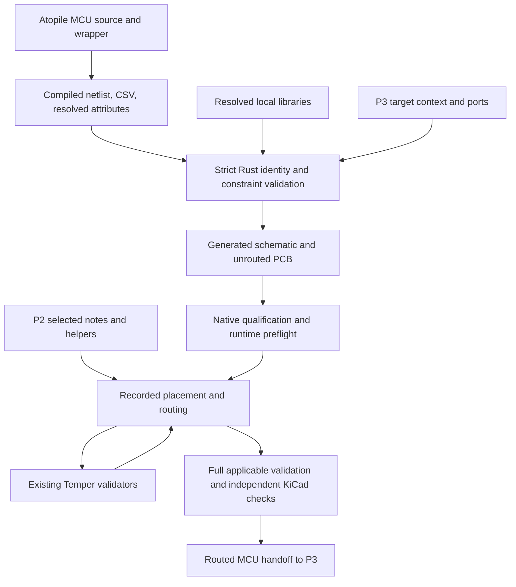

# Atopile to Routed MCU - Plan

## Goal Capsule

**Objective:** Produce a checked MCU layout whose circuit and starting PCB are traceable to Temper's Atopile source.

**Means:** Connect copied Rust engineering validators to the existing source-generation and Python/KiCad editing flow. The agent chooses placements/routes; board passing and coverage are the priority.

**Authority and ownership:** P1 owns Zapote validation packages/coverage and thin host/source integration, including needed MCU source corrections. P2 owns memory; P3 owns physical context/composition. Retain existing Python adapters under the latest user direction; preserve unrelated work.

**Stop:** Compiler/part/pin ambiguity, missing necessary target constraints, invalid native measurement, or unqualified runtime prevents the affected stage from passing. Resolve the actual defect without changing acceptance to fit a candidate.

---

## Product Contract

### Summary

Generate an unrouted MCU board from compiled source, let the agent place and route it with explicitly loaded memory, and deliver independently verified artifacts for full-board composition.

### Problem Frame

`harness-lab/circuit_native.py` builds real Atopile and validates circuit identity against an existing board. `build_buck.py` and the v2 builder instead construct fixtures from old KiCad geometry. They do not prove that compiler outputs can create the exact board the agent subsequently edits.

### Requirements

**Source and physical identity**

- R1. Compile the current `MCU` module in an isolated wrapper and retain netlist, BOM, resolved attributes, and source/tool identities.
- R2. Create the starting PCB and schematic from those outputs and resolved footprint/symbol libraries. Preserve canonical instance-path identity across compiler reference renumbering.
- R3. Every required pin maps to the actual numbered footprint pad, using an explicit reviewed map where names differ. Ambiguous positional fallback, omitted components, unintended opens, extra connectivity, and unresolved exact purchased parts prevent admission.
- R4. Use P3's board context and interface contract for placement/routing. The start has no functional copper or inherited solution placement.

**Execution and acceptance**

- R5. The construction agent can inspect source-derived circuit facts, geometry, relevant constraints, memory, findings, and remaining budget; all PCB mutations use the same bounded native operations as final verification.
- R6. A construction result passes only when its required internal and boundary connectivity, native ERC/DRC, MCU layout constraints, protected state, and full attempt evidence pass independent checks.
- R7. Keep this development profile separate from the historical buck benchmark and its engineering-admission registry. Report electrical-performance validation and hardware validation independently.
- R8. Retain every attempt, changed harness/model version, intervention, rejected edit, and incomplete result. P2's selected memory revision and delivery/use receipts are required outputs.
- R9. The agent chooses placement coordinates/orientations and routing paths. The harness exposes explicit board edits and existing Temper validator feedback; it contains no replacement placer/router and does not delegate construction to the old algorithms.

- R10. Validation implementation/tests are Rust in Zapote. Keep the working Python/KiCad editing, source/export and transport boundary; replacing it is deferred. No duplicate rule logic in Python and no new placer/router/editor.
- R11. Inventory and progressively cover actual cooker requirements per `zapote/VALIDATION.md`; retain a full-board baseline, rule/input coverage, seeded-fault results and final suite evidence. A two-rule smoke test qualifies wiring only.

### Scope Boundaries

Includes source discrepancies material to this MCU, a strict source-to-board bridge, the MCU development profile, and actual recorded construction. No custom router, wholesale migration of old tools, new provider fallback, fabricated waveform qualification, or production-board overwrite. Simulation is required only for an expressly adopted claim that depends on it; RF, EMC, boot reliability, and hardware operation are not inferred from layout checks.

---

## Planning Contract

### Key Technical Decisions

- KTD1. Reuse pinned Atopile 0.2.69 compilation/export and current Python schematic/PCB-generation seams. Copy needed Rust identity kernels and independently check source/board correspondence. A Rust-only source host is not a prerequisite.
- KTD2. Copy required `temper-design-bundle` identity/validation kernels into `zapote-core` and use typed source conversion in `zapote-harness`. Preserve constraint origins, safety floors, strict pin maps and non-production candidate identity. Convert distinct schemas explicitly, rejecting missing/contradictory fields.
- KTD3. Use Atopile instance paths/Sheetpath as identity and an explicit path-to-refdes projection for KiCad presentation. Netlist connectivity, CSV MPNs, and resolved attributes are complementary inputs. Atopile's aliased `libsource` and `?` values are not authoritative part identities.
- KTD4. Reuse native footprint loading and native transforms. The existing skeleton's positional pad fallback is forbidden for this profile; verification must compare raw actual pad numbers and independent compiled pin partitions, not normalize both sides through the same fallback.
- KTD5. Keep the existing host/adapter lifecycle and add a thin Zapote validation integration. Do not rewrite provider transport, workers or the board editor to change implementation language. Preserve historical profile semantics.
- KTD6. Construction uses agent-specified native KiCad edits. Do not invoke or rebuild CP-SAT placement, `scripts/route_board.py`, path-search routing, or hidden repair logic. Native transformations, geometry queries, zone refill, and execution of explicit edit batches remain tool capabilities; the agent chooses the layout and route paths.
- KTD7. Use the selected supported existing construction runtime, recording actual model and input/tool exchanges. Preserve local traces and the task telemetry preference. Rust transport migration is later work.
- KTD8. Retain the existing 1,200-second attempt deadline and 200 committed-mutation ceiling for the first development attempt. The host enforces them across nested calls. A subsequent diagnostic run is separately identified; it cannot overwrite or extend the first attempt's result. Construction success terminates the attempt without waiting for refinement thresholds.
- KTD9. Copy needed registered rules/tests into `zapote-drc` and `zapote-erc`, sharing typed inputs/findings via core. Keep the kernels free of Python and donor runtime dependencies; a thin external binding or CLI bridge to the retained host is allowed. Preserve independent oracles. Zapote owns its copies/fixes; the harness must not duplicate engineering rules.

### High-Level Technical Design

### Source Reconciliation and Deferred Execution Facts

Start with the ten physical instances in `elec/src/modules.ato::MCU`. Verify the exact ESP32-S3-WROOM-1 variant, local footprint, exposed ground pads, boot/reset buttons, supply capacitors, and every exported interface against the compiled artifacts and current manufacturer documents. In particular, `c_en` declares +/-2% while its selected MPN must be checked, its RC assertions depend on that tolerance, and the DRDY mapping comment calls IO9 an assumption. Correct contradictory source fields or pin mappings; do not preserve a false assertion merely to make the build pass. Reconcile firmware-owned pin assignments without changing generated firmware configuration as a side effect.

Current full-board stackup and domain placement must come from P3 U1 rather than stale prose. Exact numeric MCU layout rules are established in U1 from manufacturer guidance and target context before the first construction attempt. They are execution inputs with a named owner, not unresolved product choices.

### Sources

- `docs/solutions/architecture-patterns/validated-atopile-pcl-design-bundle-boundary.md` — typed source/constraint ownership.
- `docs/solutions/tooling-decisions/generated-schematics-from-atopile-netlist-2026-07-15.md` — generation and connectivity oracle.
- `scripts/resync_pcb_netlist.py` — instance-path preservation; source/board synchronization pattern.
- [Espressif ESP32-S3 hardware design guidance](https://docs.espressif.com/projects/esp-hardware-design-guidelines/en/latest/esp32s3/pcb-layout-design.html) — adopted as the source for module placement and antenna constraints, with exact applicable revision/sections recorded during U1.

---

## Implementation Units

### U0. Connect the Rust suite and inventory full-board coverage

**Goal:** Make existing Rust checks useful to the actual board/agent and expose coverage gaps.

**Requirements:** R5, R6, R9-R11. **Dependencies:** Existing validators, editing harness and real board.

**Files:** Zapote core/DRC/ERC and validation entry point, Cargo/ports metadata, `zapote/validation/coverage.json` (new), retained host integration, and current-board baseline reports.

**Approach:** Inventory actual existing Rust rules/kernels and adopted requirements, copy needed checks/tests, and integrate through the working host. Keep checks Python-independent while reusing transport/KiCad editing. Record full-board results and missing coverage; expand in priority order.

Use the current `place` / `replace_copper` operations and their staged atomic/native-check contract. KiCad owns object edits and serialization. Add a positive/negative control showing a real copied rule's finding reaches the agent and its explicit edit corrects that finding. Keep native check and adapter evidence; do not replace this with a new Rust file editor. Then run the applicable full-board baseline and record rule/input gaps; the smoke-test fixture is not the acceptance workload.

**Verification:** Real positive/negative controls reach the agent; native board state and Rust check inputs agree. Whole-board baseline names actual executed rules/gaps. Cargo validators have no optimizer/Python rule dependency; the retained adapter is explicit.

### U1. Reconcile the MCU circuit and target interfaces

**Goal:** Establish the exact source-derived circuit the agent will build.

**Requirements:** R1, R3, R4, R7. **Dependencies:** P3 U1 for physical context; work proceeds jointly without waiting for a routed board.

**Files:** `elec/src/modules.ato` / `components.ato` as needed; `zapote/experiments/mcu/` wrapper/requirements/part map; `zapote-harness/tests/source.rs`.

**Approach:** Compile/export fresh through existing glue; reconcile netlist/BOM/resolved source attributes, manufacturer pins, libraries and firmware. Freeze numeric layout rules and interfaces with provenance. Do not replace functioning source tooling merely because it is Python.

**Test scenarios:**

1. MCU compilation and export include exactly the expected physical instances and their interfaces.
2. Reference renumbering preserves instance identity and connected-pin partitions.
3. A missing pad, wrong ESP32 variant, contradictory part tolerance, or swapped exported pin is rejected with the responsible source identified.

**Verification:** Source inventory and numeric layout contract are complete; discrepancies that prevent trustworthy layout are fixed. Unmeasured functional behavior stays explicit.

### Source input contract for U2

Use the existing pinned Atopile build/export path for a fresh wrapper build. Consume `build/default.net` (export E), `default.csv`, resolved attributes and available build manifests from that same successful build. Retain source/output hashes; Python process/export glue is allowed while Rust owns identity and validation decisions.

| Input | Required data and authority |
|---|---|
| `default.net` components | `ref`, footprint identifier, `sheetpath.names`, and compiler timestamps/IDs. Normalize the known build-root prefix using the build manifest; preserve module/instance path. Refdes is presentation, canonical instance path is identity. Reject collisions. |
| `default.net` nets | Canonical net name and every `(ref, pin)` node. Resolve ref through the component map, preserving actual compiler pin identifiers and connected-pin partitions. Numeric net codes are local presentation only. |
| `default.csv` | Current captured headers are `Comment,Designator,Footprint,LCSC,Price`. Expand grouped designators and join by ref within this build, then canonical path. Footprint/part claims must agree with the reviewed part inventory; `LCSC`, `Comment`, aliases and `?` are not independently trusted MPN authorities. |
| `parts.json` (new declarative input) | Schema version; component entries keyed by canonical instance path; manufacturer, MPN, value/tolerance/ratings needed by adopted checks, symbol/footprint IDs, explicitly reviewed compiler-pin-to-pad map, intentional NC pins, and evidence/source hashes. Each field records compiler-derived or reviewed-source/manufacturer origin. Conflicts block admission; the map cannot change compiler connectivity. |
| Local symbols/footprints | Resolve library tables to exact `.kicad_sym`/`.kicad_mod` bytes, including custom libraries. Hash files and library maps; retain actual pad numbers, duplicate-number pads, layers and geometry. Every source pin/required pad is mapped or explicitly NC. No positional fallback. |
| P3 context | Board/stackup/domains/net classes and authored requirements, hashed separately from compiler facts. Missing required validator input blocks that check's acceptance. |

Record schemas and full hashes for the source closure, entry/build configuration, netlist, CSV, part map, libraries and physical context. Source changes invalidate dependent reviewed fields until reconciled. Replay/renumbering tests exercise these joins against captured real compiler files; do not invent a convenient exporter schema or quietly accept a stale prior build.

### U2. Generate the MCU schematic and starting board

**Goal:** Close the compiler-to-PCB gap without copying a solved layout.

**Requirements:** R1-R4, R10. **Dependencies:** U0 and U1.

**Files:** Copied Zapote identity checks, thin source adapter, existing schematic/skeleton generator seams as needed, source tests, and `zapote/experiments/control-assembly/` wrapper. P1 owns shared changes.

**Approach:** Reuse generation and native KiCad I/O to create fresh schematic/PCB/library/project/rules packages. Apply P3 context and neutral staging; strict Rust identity/pin checks admit outputs. Preserve old caller semantics and unrelated objects.

The current Python resolved exporter may be reused. Netlist supplies pin partitions; resolved attributes or an explicitly reviewed source-bound part map supply exact identity; CSV corroborates the path-to-refdes BOM; libraries supply actual pads. Do not label manual fields compiler-resolved or let a part map change connectivity. P3 supplies hashed context/rules. Generate MCU and combined wrappers through one checked path; no language migration prerequisite.

**Test scenarios:**

1. A clean source build produces a natively loadable PCB and matching schematic with no functional copper.
2. Every pad net matches the independent compiled pin partition, including repeated same-number ground pads and explicitly unconnected pins.
3. Duplicate/missing maps, positional-only mappings, altered footprint bytes, stale source exports, and extra components fail.
4. Repeated generation has stable canonical identities and geometry; timestamp-bearing output is identified separately from semantic reproducibility.

**Verification:** Native reload and independent identity/connectivity comparison pass on generated artifacts. The starting board does not depend on extracting MCU geometry/placement from the production PCB.

### U3. Qualify the development profile and memory interface

**Goal:** Expose enough trustworthy actions and feedback to construct the new block.

**Requirements:** R4-R11. **Dependencies:** U2 and P2 memory interfaces.

**Files:** Zapote Rust validation/memory interfaces and tests, minimal retained host/adapter changes, coverage manifest and fault corpus.

**Approach:** Feed the actual candidate/context into the growing Rust suite and deliver findings to the active agent. Keep current native six-layer/via/zone handling, atomic edits and budgets. Add required rule/fault coverage without copying rules into Python. Generation/acceptance remains host-controlled.

Use the existing host lifecycle and explicit tool operations; integrate Rust validator and memory interfaces with minimal glue. A duplicate runtime or editor is out of scope.

P1 owns the Rust validator adapter/tests composing copied Zapote rules over actual saved-board, source, stackup, domain and constraint data. The donor live registry is a coverage reference, not a PyO3 dependency. Record requirement-to-check mappings and missing/inapplicable outcomes. Forward structured findings intact; use supported incremental checks and full applicable final checks.

**Test scenarios:**

1. A scripted valid MCU candidate passes; removed ground, shorted IO, antenna keepout intrusion, moved protected port, and hidden missing part fail.
2. A 45-degree asymmetric footprint transform agrees with KiCad; equivalent negative angles normalize correctly.
3. A rejected/stale edit is atomic; timeout or missing/capped native report becomes indeterminate, never a zero-error pass.
4. Selected memory reaches the actual worker and next model observation; a loaded helper's nested operations use the same budget and record its revision.
5. Legacy buck profile code remains unchanged; copied behavioral controls run in Rust with their prior acceptance semantics.
6. An intentionally violated copied Rust rule fires through the real Zapote entry point and reaches the active agent; an explicit agent edit corrects it. Compare adapter output with direct rule invocation on the same inputs.
7. Missing required constraints, unavailable/stale validator binaries, disabled required rules, or dropped findings cannot produce an all-clear result. Explicitly inapplicable checks remain distinguishable from passing ones.
8. Placement/routing traces contain agent-specified edits; the profile never calls a placement solver, autorouter, or concealed automatic repair path.

**Verification:** Local positive/negative native controls and runtime inspection-only preflight pass on the actual MCU profile. A valid failing design check remains useful construction feedback.

### U4. Construct and deliver the routed MCU

**Goal:** Complete a real development attempt and hand its checked output to P3.

**Requirements:** R5-R11. **Dependencies:** U3 and frozen memory/suite versions.

**Files:** `zapote/runs/mcu-<run-id>/`, committed compact artifact index, accepted `pcb/blocks/mcu/`, and Zapote Rust runtime tests.

**Approach:** Run under KTD7/KTD8, retaining all operations and actual memory delivery. Bind the actual model-input payload/trace to this attempt ID, selected notes/helper content hashes, observations, and final output; missing live delivery evidence cannot be replaced by U3's control result. Independently regenerate/check source identity and validate the final saved board. If operator edits are needed, retain the autonomous outcome and label the subsequent assisted candidate separately. Hand exact board, source, library, context, and memory identities to P3/P2.

**Verification:** Zero required internal/boundary opens and mandatory native findings, passing MCU-specific checks, complete evidence, and exact source correspondence. No live attempt is counted solely from its final prose.

---

## Verification Contract

Use the existing source-generation/BOM, board reconciliation, footprint drift, placement roundtrip, and harness boundary suites plus the named block tests. Native verification uses isolated KiCad 10.0.6 with resolved sibling libraries/project/rules; retain ERC with all severities and DRC with all-track-errors, schematic parity, and all severities. Run the final native check three times with complete reports. Pin any different tool version explicitly and requalify controls before reporting results.

Copied Temper validators in Zapote are mandatory where applicable. Record executed rule identities and input coverage. Run the full applicable set independently of the task judge; controls prove actual invocation and model-visible feedback. No placement/routing algorithm is a deliverable.

Keep source/physical validation distinct from analog/physical evidence. Verify Rust validator provenance and current binaries, plus any retained Python/PyO3 adapter dependencies, before measurement. A schematic simulation does not qualify routed hardware.

---

## Definition of Done

A fresh Atopile build produces the exact unrouted board used by a recorded MCU construction attempt; the independently checked routed MCU and its complete evidence are available to P3. P2 memory was actually delivered with use evidence recorded honestly. Generated artifacts and source agree, old buck gates remain intact, required tests pass, and abandoned implementation paths are removed.
