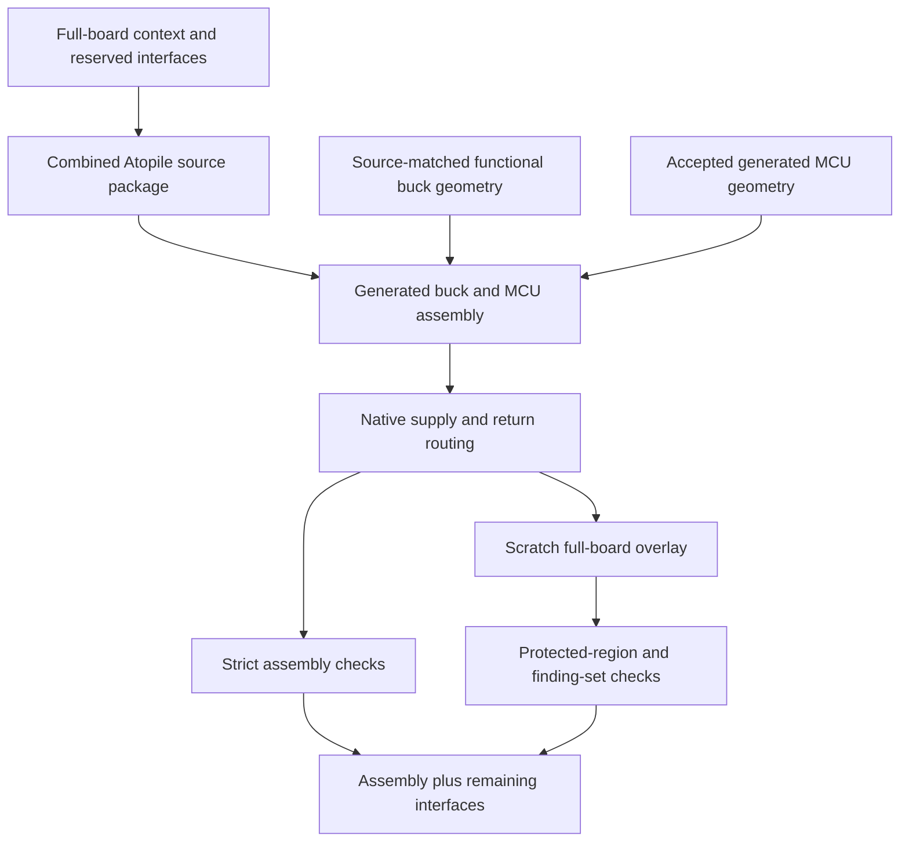

# Buck and MCU Full-Board Composition - Plan

## Goal Capsule

**Objective:** Deliver a checked buck/MCU section that fits the cooker board and exposes the connections needed by the next units.

**Means:** Use a source-derived assembly circuit, a domain-first target floorplan, and native import/routing checks to compose the completed blocks.

**Ownership:** P3 owns physical context/candidates, `zapote-harness/src/composition.rs`, composition tests and integration reports. P1 owns workspace/shared packages and source/runtime integration; P2 owns memory. Follow `zapote/ARCHITECTURE.md` and preserve unrelated edits.

**Stop:** A contradictory target stackup/domain requirement, incomplete component mapping, new short/open, invalid measurement, or altered protected region prevents integration acceptance. Preserve diagnostic artifacts and return the defect to its owner.

---

## Product Contract

### Summary

Establish the MCU's physical place in the cooker before construction, then assemble the buck and MCU on that target context with their real power and signal interfaces.

### Problem Frame

A stand-alone block can pass its own checks yet fail in the full board because of port access, return routing, keepouts, mechanical boundaries, or layer mapping. The current production board declares six copper layers, while the buck prototype is a two-layer project with test terminals and mounting holes. Copying it wholesale would introduce prototype fixtures and stale assumptions into the cooker.

### Requirements

**Context and composition**

- R1. Record one authoritative target context: board outline, physical copper-layer order, stackup, relevant voltage domains/isolation corridors, mechanical/antenna keepouts, block region, and external port obligations.
- R2. Generate the assembly circuit from Atopile with the actual buck and MCU modules connected through 3.3 V and the correct return. Other MCU signals remain named, accounted-for future interfaces.
- R3. Import only source-matched functional components and approved reusable geometry from the block outputs. Prototype-only connectors, test pads, mounting holes, fixture terminals, and their stubs do not silently become product components.
- R4. Map layers, instance identities, nets, and transforms explicitly; revalidate source identity and physical connectivity after composition and zone refill.

**Acceptance and handoff**

- R5. The assembly has complete required buck/MCU connectivity and no new mandatory physical/layout violations attributable to the section or its interfaces.
- R6. Preserve the source production board and untouched full-board regions. Provide an integration candidate, delta evidence, and a complete remaining-interface inventory.
- R7. Record existing full-board findings separately from introduced findings. A partial block assembly cannot be labeled a fully routed or qualified cooker.

### Scope Boundaries

Includes electrical/physical integration of these two units, target interface reservations, and a reproducible candidate package. Changes to unrelated power/safety circuits, a new overall product floorplan, production-board promotion, prototype purchasing, RF certification, and powered tests are outside this milestone. If the target context itself has an unresolved contradiction, report the specific conflict rather than declaring an arbitrary new floorplan final.

---

## Planning Contract

### Key Technical Decisions

- KTD1. P3 U1 starts immediately with existing source artifacts and provides P1's physical context. P1/P3 jointly reconcile electrical interface names; neither requires a completed route to publish its input contract.
- KTD2. Use the current six-layer physical stackup as the working integration context after native reconciliation of PCB/project/constraint sources. Do not interpret ordinal layer IDs or alphabetical layer names as physical order. Record exact thickness and copper data from the authoritative target rather than copying the two-layer prototype settings.
- KTD3. Keep two views of one candidate: a source-derived buck/MCU assembly package for strict local checks, and a scratch copy of the full board for surrounding geometry/interface checks. Both reference the same functional component/net identities and geometry manifest. The production board remains read-only.
- KTD4. P1 generates the combined source package through its new bridge. Import accepted MCU geometry and the buck's functional nine-component layout by canonical source paths. For the buck, map F.Cu/B.Cu to target outer copper layers and explicitly recreate supported through vias with the target span. Reject unsupported layer features instead of dropping them. Any geometry changes invalidate prior block-layout receipts and require current checks.
- KTD5. Prototype J1/J2/TPs/holes are excluded by the combined source inventory. Remove copper stubs serving excluded objects, then route the required inter-block supply/return in the target context. Preserve the converter's local loops and MCU keepouts; revise placement when the measured combined constraints require it.
- KTD6. Define named external interfaces with required destination, voltage domain/reference, direction where known, and access region. Future endpoints are obligations, not fictional product connectors or suppressed required internal opens. A full-board overlay routes only interfaces whose actual counterpart is in this milestone.
- KTD7. Use native KiCad through the current Python adapter and copied Rust identity/geometry checks. Preserve correct via spans, zones and source identity. Rust IPC/editor replacement is deferred.
- KTD8. Compare full-board finding sets, not just counts. Normalize only known representational differences while preserving components, nets, rule identity, and locations. Pre-existing debt stays visible; a lower aggregate count cannot hide a newly introduced violation.
- KTD9. The agent chooses integration placements/routes. P3 uses P1's Rust validation integration with existing host/KiCad tools. Composition may reuse thin Python/native glue; it must not add a placer/router or duplicate engineering rules.

### High-Level Technical Design

### Evidence Inputs

- `pcb/temper.kicad_pcb`, `pcb/temper.kicad_pro`, `pcb/fp-lib-table` and current authored/derived constraints — target context, not inherited claims of correctness.
- `pcb/prototypes/buck-reva/` current source manifest and functional geometry — use current bytes, not a digest copied from a prior conversation. The Samsung capacitor update may postdate older receipts.
- P1's accepted `pcb/blocks/mcu/` and source manifest.
- `CONCEPTS.md` definitions of voltage domain, isolation barrier, domain-first floorplan, and bounded candidate study.
- `docs/solutions/best-practices/per-net-isolation-routing-diagnosis-2026-07-10.md` — diagnose a failed net against fixed surrounding copper before assuming the router or placement is at fault.

---

## Implementation Units

### U1. Establish target context and port obligations

**Goal:** Give MCU construction a realistic destination in the cooker.

**Requirements:** R1, R6, R7. **Dependencies:** None; collaborate with P1 U1 for electrical names.

**Files:** New `pcb/blocks/control-assembly/target-context.json`, `interfaces.json`, and context README; source PCB/project/rules are read-only.

**Approach:** Inventory the current native board outline/layers, nearby components/copper, domain barriers, and mechanical constraints. Resolve contradictory source statements against current artifacts and explicitly adopted requirements. Reserve the MCU region and antenna access with adequate nearby buck placement/port access. Record internal required connections separately from future RTD/safety/programming destinations.

The existing full board already contains buck/MCU objects. Publish a replacement ledger keyed by source paths and native object identities: components and internal copper to remove, geometry to retain, and explicit cut/reconnection endpoints for shared or crossing nets. Define an owned boundary envelope around those endpoints; never delete an entire shared supply/ground net by net name. Outside that envelope, preserve surrounding geometry. A crossing connection that cannot be replaced within this scope is a named interface blocker, not permission to reroute unrelated circuits.

**Verification:** P1 can generate a board with a definite outline, stackup, allowed region, and interface obligations. Every input has a source and digest. Artifact extraction is checked against native KiCad; do not add tests that merely mirror a manually authored context table.

### U2. Compose source-derived block geometry

**Goal:** Build a coherent assembly without importing prototype fixtures or stale identities.

**Requirements:** R2-R4, R6. **Dependencies:** U1, P1 U2 and accepted MCU from P1 U4; P1 supplies combined source wrapper/export.

**Files:** Assembly artifacts/manifests under `pcb/blocks/control-assembly/`; `zapote/packages/zapote-harness/src/composition.rs` and `tests/composition.rs`. Request shared core/KiCad changes from P1.

**Approach:** Reuse thin native composition plumbing with Rust identity/geometry verdicts. Map source identities/layers, remove fixtures and preserve protected surroundings. Do not rewrite native editing for language uniformity; keep rule logic in Rust.

Apply U1's replacement ledger before inserting the section into the scratch overlay. Verify each removed object existed in the baseline, reject duplicate functional instances, account for old copper connected to replaced pads, and check boundary net continuity after insertion. Retain before/after identities for every touched object.

**Test scenarios:**

1. The generated combined source maps every functional buck/MCU instance and no prototype-only objects.
2. Refdes and numeric net-code changes preserve canonical connections; duplicate or missing instance maps fail.
3. An asymmetric transform matches native KiCad, and every imported via has the intended target span.
4. Unsupported layer content, orphan fixture stubs, or an unexpected change outside the owned region fails before publication.

**Verification:** Generated schematic, assembled PCB, and source pin partitions agree; retained block geometries have explicit current identity or are flagged for requalification.

### U3. Route and verify the combined section

**Goal:** Prove that the two units work as a physical layout assembly.

**Requirements:** R4-R7. **Dependencies:** U2 and P1's development/native tools.

**Files:** Assembly/overlay candidates, `zapote-harness/tests/control_assembly.rs`, and native reports/renders under the candidate verification directory.

**Approach:** Route shared supply/return and admitted external connections with the existing agent tools. If a failure requires source or placement changes, return it to P1 and rebind affected evidence. Refill zones; run local mandatory checks and full-board delta checks. Inspect native renders for antenna access, return continuity, decoupling placement, port accessibility, and interaction with reserved domains.

Run the applicable copied Zapote Rust validators on assembly and overlay with their real contexts. Return findings through P1's host; retain explicit agent corrections and recheck. Ask P1 for shared adapter/validator fixes rather than adding parallel rules or solver logic.

**Test scenarios:**

1. Both blocks and the inter-block supply/return are physically connected to the correct source nets.
2. An open inter-block return, short to a different voltage-domain net, antenna keepout intrusion, or narrowed required power path fails.
3. Zone refill and layer remapping cannot turn a visually connected path into an accepted but electrically open path.
4. A new violation is detected even when removing an old violation keeps the aggregate count unchanged.
5. Unchanged outside-region geometry and source production digest remain exact.
6. Replacement cannot leave an old MCU/buck instance or orphan copper behind, or silently disconnect a retained boundary endpoint.
7. A changed pad, track, via, filled zone, or endpoint in only one candidate view fails the cross-view comparison.

**Verification:** Strict local assembly checks pass; the surrounding-board comparison has no new mandatory violations from the integrated section. Pre-existing findings are retained and attributed, not suppressed. After final routing/refill, independently extract the owned section from both views and compare canonical source identities, transformed pad geometry, tracks/vias/zone definitions, and interface endpoints in target coordinates. Distinguish any intentionally context-dependent zone fill and verify its connectivity in each view. Bind both artifact hashes and the comparison report in one manifest; the bound overlay is the cooker integration handoff, accompanied by its strictly checked local assembly. Any later edit invalidates that binding.

### U4. Package integration evidence and next-unit interfaces

**Goal:** Let the next owner extend the actual cooker layout.

**Requirements:** R5-R7. **Dependencies:** U3 and P2 memory closeout.

**Files:** `docs/hardware/control-assembly/README.md`, `integration-report.md`, annotated native renders, and candidate manifest/index.

**Approach:** Provide source-to-board lineage, layer/identity mappings, finding-set delta, current native reports, all pending external interfaces, and P2's memory report link. Identify any assisted changes. Retain failed attempts separately and remove abandoned executable implementations.

**Verification:** A fresh reader can load the candidate, reproduce checks, and identify exactly which RTD/safety/programming connections remain. No purchasing or fabrication package is required for this handoff.

---

## Verification Contract

Use isolated KiCad 10.0.6 with complete local project, footprint/symbol libraries, and rules context. Regenerate applicable derived rules for the scratch target before DRC; retain which generator and inputs were used. Run all-severity ERC and all-track-errors/schematic-parity/all-severity DRC on the local assembly, with repeated native checks and independent source connectivity comparison.

The full-board overlay uses the same full-board baseline context and reports introduced/resolved/persistent finding sets, protected geometry, and outside-region nets. The source board's existing DRC debt cannot be treated as a pass threshold for the local assembly. If a required measurement cannot handle the target geometry, fix or replace that measurement path before claiming the result.

Compare copied Zapote validator findings alongside native KiCad, retaining separate rule/input coverage. Full applicable final checks are required even when incremental checks supplied feedback. The task judge is not a replacement for those engineering rules.

No changes to `pcb/temper.kicad_pcb` are made. Actual production promotion is a later, separately reviewed change and must follow the repository's same-PR DRC-ceiling provenance requirements.

---

## Definition of Done

The source-derived buck/MCU assembly passes its mandatory local checks and introduces no new mandatory findings into the scratch full-board context. Exact identities, transforms, layer mappings, interfaces, and source/native receipts are available for replay. The production board is unchanged, remaining cooker interfaces are explicit, and the coordinator can close the milestone from evidence rather than owner summaries.
