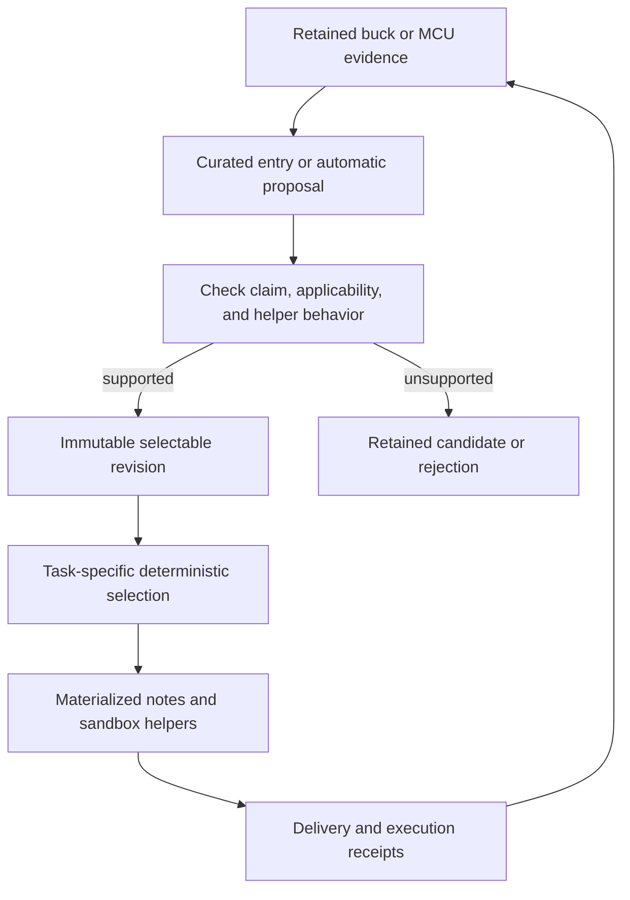

# Reusable Engineering Agent Memory - Plan

## Goal Capsule

**Objective:** Let the MCU construction agent use applicable lessons from the buck work, and leave checked knowledge that the following cooker-unit agent can use.

**Means:** Carry the existing evidence-backed immutable-memory contract into a small Rust module in Zapote, with explicit applicability, selection, delivery and use receipts.

**Ownership:** P2 owns `zapote-harness/src/memory.rs`, its Rust tests and `zapote/skills/` catalog. P1 owns workspace manifests, registration and runtime integration. Follow `zapote/ARCHITECTURE.md`; no CAD, circuit or acceptance changes.

**Stop:** A rejected memory item remains excluded or a labeled candidate; it never becomes authority for source facts or verification. A missing required memory package must be reported before the task starts, not silently replaced by empty notes.

---

## Product Contract

### Summary

Convert the useful buck experience into a small reviewed memory package, load only compatible entries into MCU construction, and record what the agent received and used.

### Problem Frame

`artifacts.py`, `refinement.py`, `workspace.py`, and `src/continual.rs` already support versioned `notes.md` and `skills.py`, immutable revisions, sandbox application, and same-experiment inheritance. The base skills contain only inspection/check helpers. Written audits and conversation summaries are not automatically consumed by the next agent, and the full-buck learning pilot has not run.

### Requirements

**Knowledge and scope**

- R1. Each entry records its claim or procedure, applicability, evidence references/hashes, provenance class, and validation state.
- R2. Distinguish expert-curated lessons, automatically proposed lessons, verified executable helpers, and runtime fixes. Existing manual notes must never be described as learning produced by the unrun buck pilot.
- R3. Transfer general procedures by matching required capabilities and declared applicability. Transfer exact component/board facts only when their relevant source identities match. Buck-specific numerical values cannot become MCU constraints.
- R4. Acceptance rules and current compiler/manufacturer facts override memory. Conflicting or unverifiable entries are excluded with explicit reasons.

**Runtime and persistence**

- R5. Select deterministically from a small local registry and publish a content-bound selection receipt before construction starts.
- R6. The exact selected notes and helpers must reach the active worker and model-visible context. Record helper execution separately from merely loading it; do not infer that reading notes caused a decision.
- R7. Proposals become selectable only after review/checks appropriate to their claim. Keep rejected proposals and prior versions recoverable, and never change active skills in the middle of a native operation.
- R8. Keep the historical buck inheritance and engineering gates unchanged. Cross-unit reuse has its own explicit path and cannot manufacture a historical learning receipt.

### Scope Boundaries

Use repository files and Rust memory policy with the existing host/workspace delivery path. Retained Python may transport notes and invoke bounded helpers; it must not duplicate engineering rules. Do not make memory transport migration a prerequisite for board validation.

Memory supports the agent's own engineering decisions: applicability guidance, explanations of existing validator findings, and procedures for inspecting or checking the board. Helpers may batch explicit agent-chosen edits, but this work does not build or reintroduce an automatic placer/router behind a skill. Engineering limits remain in the authored constraints and existing Rust validators, not duplicated or weakened in memory entries.

---

## Planning Contract

### Key Technical Decisions

- KTD1. Keep new selection/promotion policy in Rust and reuse existing artifact/workspace host integration where adequate. P1 owns shared registration/runtime calls. Copy meaningful policy/tests with provenance; no full worker rewrite.
- KTD2. Store reviewed entries under `zapote/skills/` and materialize versioned notes/metadata through the existing host. Use explicit capabilities/tags/source dependencies and the retained 64-KiB bound; report overflow.
- KTD3. Applicability is per claim, not equality of the entire source and target design. A generic “inspect failed nets before editing” procedure can cross from buck to MCU. An exact C11 bias value requires the same part/evidence context and is inapplicable here. Commit identifiers are advisory provenance; authoritative artifact hashes and declared compatibility decide freshness.
- KTD4. Promotion has three outcomes: candidate, verified/selectable, or rejected. A complete valid failing attempt may support a diagnostic lesson if the diagnosis/correction has independent evidence. A timeout alone cannot support a circuit-performance claim. MCU source facts are always reread from current compiled artifacts.
- KTD5. During the first MCU task, load reviewed seed memory before construction and perform automatic extraction after the attempt ends. A Luna reviewer or equivalent bounded review validates proposed content and executable helper tests before next-run selection. Do not depend on the buck's mutation-20/60/100 refinement schedule firing on a short task. Keep existing online refinement unchanged for historical profiles.
- KTD6. Deliver notes through the existing host/workspace path. Start with prose procedures; use current bounded inspect/check/edit helpers where adequate, including retained Python glue. Engineering limits stay in Rust validators. Record source/build identities and actual delivery/calls; no new helper framework or hidden solver.
- KTD7. Deterministic selection orders eligible entries by explicit task priority then stable entry ID. Record exclusions and unmet required capabilities. A zero-entry selection is valid only when explicitly requested as a baseline; it cannot satisfy this milestone's required buck-memory handoff.

### Memory Lifecycle

### Initial Seed Candidates

These are expert-curated candidates with named evidence, not already-promoted automatic learning:

| Lesson | Evidence | Where it belongs |
|---|---|---|
| Inspect exact findings, edit the affected connection, then independently check | `harness-lab/REPAIR-RESULTS.md` | General construction guidance; no claim of optimality |
| Track placement findings separately from incomplete routing | `harness-lab/COMBINED-RESULTS.md` | General feedback-reading procedure |
| Distinguish a transport failure from a failed board | `harness-lab/STREAM-DIAGNOSTIC.md` | Diagnostic guidance; timeout correction itself remains code |
| A plausible simulation is evidence only inside its declared model boundary | `docs/solutions/best-practices/behavioral-model-evidence-boundary.md` | General claim-scoping guidance |
| Verify raw pin/part identity independently of aliases | `docs/solutions/tooling-decisions/generated-schematics-from-atopile-netlist-2026-07-15.md` | Source-import guidance, checked against P1's current bridge |

The historical orientation normalization bug belongs in the native evaluator regression suite, not a helper that compensates for incorrect coordinates. No seed includes witness coordinates, prior solution copper, supplier stock counts, or unqualified capacitor/inductor guarantees.

---

## Implementation Units

### U1. Curate the initial buck memory with evidence

**Goal:** Supply useful starting knowledge without claiming unperformed learning.

**Requirements:** R1-R4. **Dependencies:** None; can run alongside P1 source work.

**Files:** `zapote/skills/README.md`, catalog and `zapote/skills/entries/`; existing audits/results remain read-only evidence.

**Approach:** Review the seed candidates, retain only supported and useful content, and record provenance/applicability. Separate portable guidance from exact-part facts and code defects. Keep the package small enough to read before a construction decision.

**Verification:** Every seed claim resolves to retained evidence; no entry claims a live full-buck inheritance result. Content curation needs source review, not tests that merely repeat the text.

### U2. Add cross-unit selection and promotion policy

**Goal:** Make reuse deterministic and prevent stale or incompatible knowledge from being treated as current.

**Requirements:** R1-R5, R7, R8. **Dependencies:** U1 schema draft; P1's task-context identity fields.

**Files:** `zapote/packages/zapote-harness/src/memory.rs`, `tests/memory_policy.rs`, and the catalog. P1 owns manifests/registration/shared types.

**Approach:** Implement KTD1-KTD4/KTD7 as typed Rust validate/select/inspect/promote operations. Preserve immutable parents and atomic publication. Keep donor evidence identity; reject mismatches with actionable reasons.

**Test scenarios:**

1. A general procedure selects for MCU despite a different board digest; an exact buck-only electrical fact does not.
2. A changed required source/footprint or tampered evidence rejects the dependent entry; unrelated file changes do not invalidate a general lesson.
3. Candidate/rejected entries, unsupported promotion, missing files, path escape, duplicate IDs, and partial writes cannot enter a selection.
4. Selection ordering is stable and over-limit/empty required selections produce explicit results.
5. Historical artifact loading and same-experiment inheritance retain their existing behavior.

**Verification:** Rust policy controls pass and the retained host returns source-linked byte-verified selections. Python transport remains allowed; it does not reimplement the selection or engineering rules.

### U3. Deliver memory through the actual construction runtime

**Goal:** Prove that stored knowledge reaches the next agent, not just the filesystem.

**Requirements:** R5-R8. **Dependencies:** U2; P1 U3 integrates the supplied interface.

**Files:** P2 owns the memory module and `zapote-harness/tests/memory_integration.rs`. P1 owns runtime/model-input/tool dispatch and shared tests; P2 supplies the interface/controls.

**Approach:** Integrate Rust selection with the current notes/helper delivery mechanism. Retain model-input and helper receipts with version identities. Memory grants no extra tools or filesystem access; the host language is not a gate.

**Test scenarios:**

1. A selected checked helper performs an inspect/check sequence through real admitted operations and records the executing revision.
2. The actual model-input capture contains selected notes; a worker load acknowledgement alone cannot prove model delivery.
3. A failing helper initialization retains the previous active revision and reports rejection.
4. A helper cannot escape the sandbox, mutate source/requirements, reset the budget, or read another attempt's hidden artifacts.
5. Reopening a retained task resolves the same portable entry bytes without relying on absolute temporary paths.

**Verification:** A native local control proves selection, delivery, invocation, receipt, and independent board check. In addition, every live MCU attempt retains its actual model-input payload or equivalent runtime trace, bound to the attempt ID, selected revision/content hashes, observations, and final output. Missing or mismatched live delivery evidence makes the memory-reuse result indeterminate and prevents milestone closeout; a separate control cannot stand in for it. Keep board correctness and memory-delivery outcomes separate. Software-control provenance remains distinct from live learned memory.

### U4. Capture the MCU learning and publish the next-run package

**Goal:** Leave useful memory for the next cooker unit.

**Requirements:** R1-R8. **Dependencies:** P1 U4 and U3.

**Files:** `zapote/skills/entries/`, run-local proposals/review records, `docs/hardware/control-assembly/memory-report.md`, and relevant Rust policy tests.

**Approach:** Run a bounded post-attempt extraction from the actual trace, label proposals automatic, and validate their evidence and applicability. Add executable procedures only when repeated operations justify them and a native behavioral test supports them. No new valid lesson is an acceptable result; do not fabricate a revision to make the count positive. Publish the selected-input and reviewed-output memory identities to the coordinator.

**Verification:** The report separates what was selected, delivered, executed, proposed, and promoted. Evidence can support lessons from failure without converting a failed board into a passing design.

---

## Verification Contract

Port the relevant artifact/refinement/workspace behavior tests to Rust and add selection/delivery controls. Include a native registered-helper call and captured model-input delivery through P1's Rust path. Tamper, capability/path boundary, failed selection and old-receipt controls must fail for their intended reasons.

Memory reuse is established by delivery/use receipts. Improvement in success rate, cost, or speed requires a separate comparison and is not claimed here.

---

## Definition of Done

The MCU run starts with a reviewed, nonempty applicable buck-memory selection, actual delivery is recorded, and executable-helper use is attributed where it occurs. A reviewed MCU closeout either produces selectable new knowledge or records why none was supported. Historical benchmark gates stay unchanged; local evidence remains portable; abandoned policy paths are removed.
