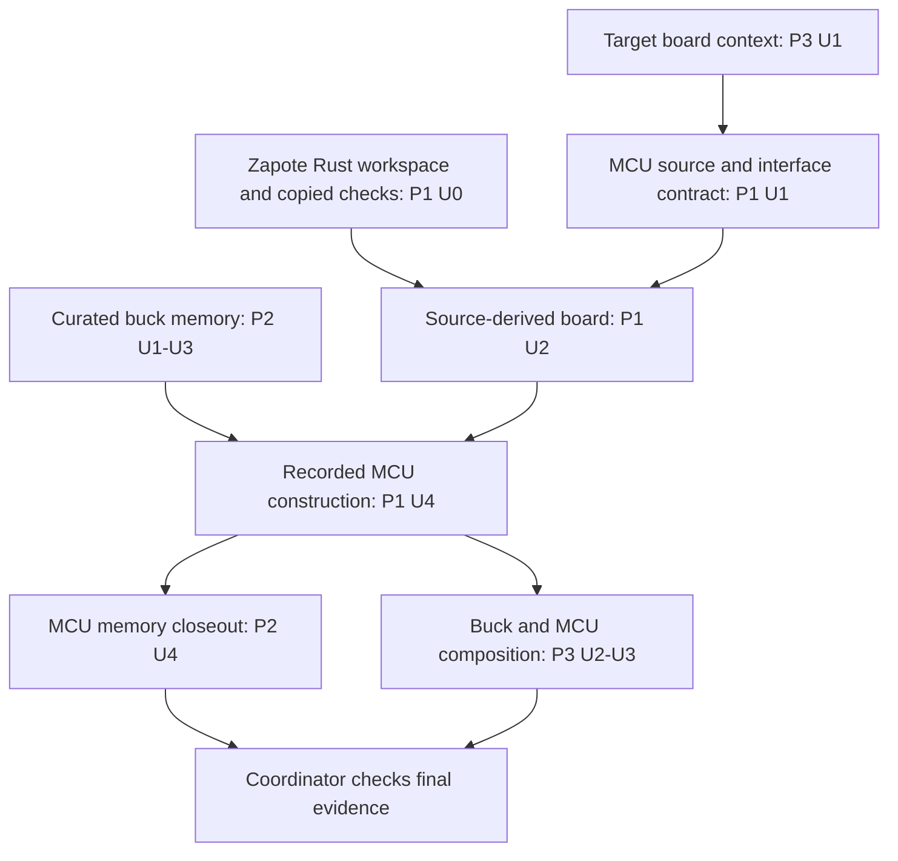

# MCU Harness and Cooker Integration - Plan

This is milestone 1 of the [overall cooker roadmap](2026-09-10-1627-zapote-cooker-roadmap-plan.md).
It supplies the detailed control-section plan within that delivery order.

## Goal Capsule

**Objective:** Add a checked MCU section to the growing induction-cooker layout, with evidence that the engineering agent reused applicable lessons from the buck work.

**Means:** The agent places/routes through the working Python/KiCad adapter. Zapote Rust validators supply the engineering verdict and feedback. Prioritize board correctness and broad coverage; Python replacement is deferred.

**Authority:** The user's September 10 request makes real cooker construction, the complete Atopile-to-routed-board flow, and reusable learning the milestone. Earlier buck benchmark admission rules remain authoritative for their historical experiment; this is a separately named development task.

**Execution:** Luna implementation owners, one coordinator, and a separately identified construction model/runtime. Planning does not start a live model run or authorize publication, purchasing, fabrication, or powered testing.

**Stop conditions:** Preserve and classify a failed attempt when compiler identity, required layout constraints, native measurement, or execution isolation cannot be established. Diagnose and repair the responsible stage within scope. Do not reinterpret a blocked measurement as a layout pass.

**Tail owner:** The coordinator owns the joined source, memory, routed-board, and integration evidence. Individual owner completion is insufficient to close the milestone.

---

## Product Contract

### Summary

Build the actual ESP32-S3 MCU block from Atopile, use retained engineering knowledge during construction, and combine its routed layout with the buck in the intended full-board context.

### Problem Frame

The earlier small fixtures demonstrated placement, routing, repair, and joint construction. The later buck harness compiles Atopile for comparison but starts PCB construction from prepared KiCad fixtures. Its reusable-memory machinery exists, while its live learning pilot remains unrun. A completed prototype therefore does not establish the full source-to-board flow or cross-unit memory reuse.

### Requirements

**Construction**

- R1. The MCU starting board must be generated from current compiled Atopile artifacts, with exact part, footprint, pin, and net identity checked before placement and after routing.
- R2. The resulting MCU and buck/MCU assembly must satisfy their declared connectivity, geometric, layout, and interface obligations in the full-board context.
- R3. The existing production board remains a read-only source during this milestone; the deliverable is an integration candidate and a reviewable change description.

**Learning and evidence**

- R4. The MCU attempt loads an explicit, versioned selection of applicable buck lessons and records delivery, helper execution where applicable, and subsequent outcomes.
- R5. The report distinguishes expert-curated knowledge, automatically proposed learning, verified procedures, and runtime code fixes. It makes no causal improvement claim from one construction task.
- R6. All construction attempts and interventions remain accounted for, including valid design failures, apparatus failures, assisted changes, and incomplete runs.
- R7. The agent owns placement/routing. Copy needed Temper validators/tests into Zapote packages; no placer/router algorithms are rebuilt or invoked. Deliver actual findings during construction and final checks.
- R8. New engineering validators/tests live in Zapote Rust packages with copy provenance. Retain the existing Python/KiCad adapter, source/export glue and host as needed; their replacement must not block board work. Python carries inputs/edits/results, not duplicate engineering rules.
- R9. Work toward the broad board-validation objective in `zapote/VALIDATION.md`, including the user's 100–1,000× ambition. Inventory actual full-board coverage/gaps, deliver actionable Rust findings, and distinguish production rules, evaluated instances, validator tests and detected fault classes. The multiplier is a target pending a comparable baseline, not an achieved CAD-product comparison.

### Key Decisions

- **Build the next required cooker unit** (session-settled: user-directed — chosen over continuing buck-only benchmark preparation: the project outcome is the complete induction cooker). Governs R1, R2.
- **Exercise the full artifact chain and deliberate memory reuse** (session-settled: user-approved — chosen over another prepared fixture with implicit conversational memory). Governs R1, R4, R5.
- **Agent constructs; existing validators judge** (session-settled: user-directed — the harness supplies board-editing tools and validator feedback, without rebuilding placer/router logic). Governs R2, R7.

- **Rust validators first; Python/KiCad bridge retained** (session-settled: user-directed — prioritize the board passing a huge Rust suite; replace transport later). Governs R7-R9.

### Scope Boundaries

This package covers MCU source reconciliation, source-derived PCB creation, agent-operated placement/routing, memory selection/promotion, and buck/MCU composition. It does not require a new optimizer, a vector database, a full benchmark matrix, or resolution of every buck analog-model uncertainty before layout work can proceed.

Deferred follow-up work: RTD and safety/power-stage construction, full-board production promotion, procurement and fabrication, physical tests, and controlled comparisons of harness versions. Their existing requirements are not waived by this milestone.

---

## Planning Contract

### Key Technical Decisions

- KTD1. Treat the three child plans as disjoint implementation ownership, with their contracts handed through the coordinator. This prevents concurrent edits to shared runner and Rust dispatch files.
- KTD2. The agent decides component positions/orientations and track/via paths. Native board tools execute explicit edits; inspection, geometry queries, and validation are supporting capabilities. Do not add or invoke CP-SAT placement, autorouting, route-search algorithms, or hidden automatic repair. Reuse validator/data adapters from the established codebase without entering its optimizer orchestration.
- KTD3. Create a new development profile whose admission requires source identity, current task constraints, measurement validity, and runtime controls. Keep electrical-performance and hardware-validation status separate. Never remove the old full-buck engineering gate or relabel old scored results.
- KTD4. Follow `zapote/ARCHITECTURE.md` and `VALIDATION.md`. Copy needed Rust validators/tests into clean packages. Keep native editing/serialization in KiCad through existing Python glue; no new board editor or Rust IPC client is required.
- KTD5. Pin the source tree, target board context, compiler, KiCad runtime, harness revision, and memory selection for each attempt. Cross-stage checks use content identities rather than trusting filenames or a summary saying “pass.”
- KTD6. P1 seeds core/DRC/ERC and needed validation interfaces, integrating them with the working host. Defer `zapote-kicad` and a full host rewrite. Missing required inputs/checks remain explicit; native KiCad is an independent complementary check.

### Dependency and Ownership Map

| Workstream | Plan | Exclusive ownership | Entry dependency | Exit handoff |
|---|---|---|---|---|
| P1: source and MCU construction | `docs/plans/2026-09-10-1322-feat-atopile-mcu-flow-plan.md` | Rust validation packages/coverage, thin existing-host integration, source/PCB identity and needed source corrections | Existing code and board evidence | Full-board coverage baseline, working feedback loop and source-derived routed MCU |
| P2: reusable engineering memory | `docs/plans/2026-09-10-1322-feat-engineering-agent-memory-plan.md` | Memory records, selection/promotion policy and tests | Can begin with retained buck evidence | Frozen memory selection, loading interface, checked helpers and MCU closeout learning |
| P3: physical composition | `docs/plans/2026-09-10-1322-feat-buck-mcu-composition-plan.md` | Target-board contract, assembly candidate, integration checks/report | Context extraction can begin immediately; final assembly needs P1/P2 | Checked buck/MCU assembly and remaining-interface inventory |
| Coordinator | This plan | Contract acceptance, final join, documentation indexes | Throughout | Milestone report with exact evidence identities |

P1 owns validator manifests/ports, core/DRC/ERC extraction, the coverage inventory, and thin integration into the existing host/adapter. P2 owns memory policy/catalog; P3 owns context/composition. Shared host changes go through P1. Preserve unrelated work; never use git stash.

### Working Assumptions

The MCU is the selected next unit from the preceding discussion. Its current ten-component source is an initial inventory, not an assertion that all fields and pins are correct. The target board currently declares six copper layers; P3 establishes a consistent target context from current artifacts before layout. The two-layer buck prototype cannot be copied into that context without explicit mapping and revalidation.

Luna remains the implementation/review preference. Use the existing supported construction runtime/transport, recording actual model, payload and receipt; do not rewrite it merely for language uniformity. No silent provider fallback. Request any newly required consent only after the payload is concrete and reviewable.

---

## Implementation Units

### U1. Join the owner contracts

**Goal:** Let the source and memory owners work in parallel without inventing incompatible interfaces.

**Requirements:** R1, R3, R4, R7-R9. **Dependencies:** None; P1/P3 establish contracts together.

**Files:** Child outputs, `zapote/experiments/mcu/README.md`, and final report index under `docs/hardware/control-assembly/`.

**Approach:** Agree source/context/memory/validation contracts and inventory the Rust checks against full-board requirements. Run the full-board validation baseline on a scratch candidate through existing adapters, retaining coverage and missing inputs. Keep MCU construction as a tractable slice; the baseline does not claim the cooker passes.

**Verification:** All child handoffs name the same current source and board context. Missing inputs have a named owner. Documentation-only coordination requires no new unit tests.

### U2. Complete construction and composition

**Goal:** Deliver R2 and R4 through an actual recorded attempt followed by physical integration.

**Requirements:** R1-R9. **Dependencies:** U1 and child units.

**Files:** Child-plan outputs and tests, `docs/hardware/control-assembly/harness-report.md` (new).

**Approach:** Connect Rust findings to the active agent and work through recorded construction/correction attempts. Expand required rules and fault cases according to `zapote/VALIDATION.md`, freezing suite/input versions per attempt. Complete MCU/composition and memory checks without delaying for Python replacement.

**Verification:** The combined report resolves back to generated source artifacts, actual submitted boards, native receipts, memory selection/application, and the integrated assembly. It states any assisted construction explicitly.

The report also identifies the existing validators invoked, their input/configuration identities, actual outcomes, and which findings were delivered to the agent. Trace placement/routing edits to agent-specified actions. A passing experiment judge alone does not establish that Temper's engineering checks ran.

### U3. Close the milestone and hand off the next unit

**Goal:** Make the completed section usable by the next cooker-unit owner.

**Requirements:** R2-R9. **Dependencies:** U2.

**Files:** `docs/hardware/control-assembly/README.md`, `harness-report.md`, `zapote/README.md`, `zapote/MIGRATION.md`, and artifact indexes.

**Approach:** Publish the remaining interface obligations for RTD, safety, programming, and power. Explain what transferred, what failed, what changed in the harness, and which knowledge is now available for the next run. Remove abandoned implementation code; preserve failed-run evidence as evidence.

**Verification:** Retain whole-board baseline/coverage and final adopted-suite results for the completed section. Passing the section is an intermediate result, not a whole-cooker pass or achievement of the 100–1,000× target. Required child work remains mandatory.

---

## Verification Contract

Each child plan owns its feature tests and native controls. The coordinator verifies their join and a clean-directory replay of the retained source-to-board and final-check paths. A replay reproduces construction operations and checks, not the model's stochastic decisions.

Demonstrate the actual agent-edit / existing-validator / feedback loop on an intentionally invalid candidate and its agent-directed correction. Verify both that the underlying registered Rust rule executed and that its finding reached the active agent. Run all applicable final checks on the saved candidate; incremental feedback alone cannot establish final acceptance. Validator reuse requires neither the old placer nor the old router.

Run Zapote Rust rule/corpus/dependency checks, retained Python adapter integration tests and native board checks. The validator kernels remain independent of Python/optimizer logic; the retained host dependency is explicit. Keep Cargo output distinct from legacy extensions and check their freshness when used.

The production PCB's input digest must remain unchanged under R3. Its DRC-ceiling remeasurement is therefore not an output of this candidate-only milestone.

---

## Definition of Done

P1, P2, and P3 satisfy their Definitions of Done; the coordinator's report verifies the joined evidence and lists remaining whole-board interfaces. The MCU starting board demonstrably comes from Atopile, the agent performed placement/routing through explicit board edits, existing Temper validators supplied feedback and final checks, and selected prior knowledge was delivered through the runtime with honest use evidence. A blocked or unsuccessful attempt is useful progress but does not substitute for the required checked assembly.
