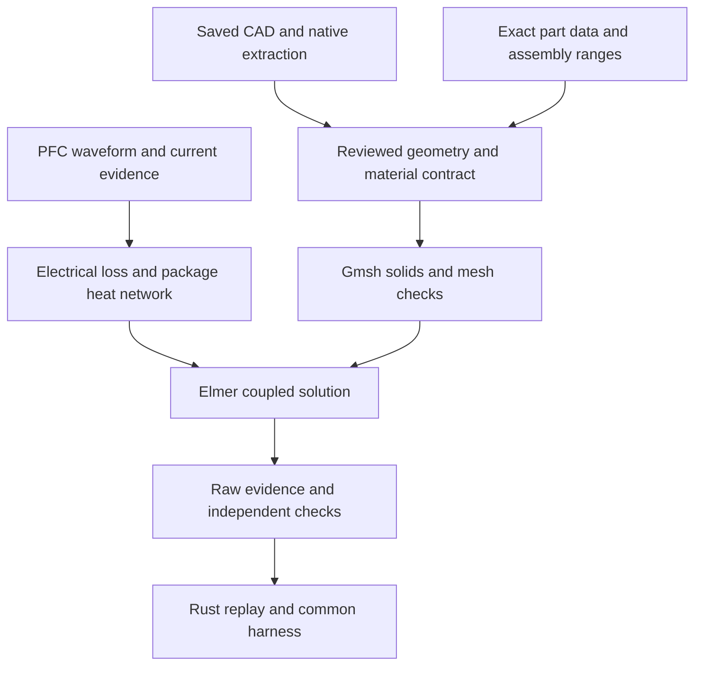

# Bridge physical thermal model - Plan

## Goal Capsule

Make thermal comparisons depend on the bridge's physical heat paths rather than unexplained contact assumptions, and make the harness reject unsupported or stale comparisons.
Retain Gmsh + Elmer and Rust ownership of generation, validation and verdicts.
Deliver a validated model extension and its evidence; the coordinator performs final board/cooling integration.

---

## Product Contract

### Summary

Extend the local model to represent bridge leads, solder and plated holes, with explicit uncertainty for unavailable package internals.
Support reviewed board variants without weakening baseline identity checks.

### Problem Frame

The present model applies independent terminal/rest-board reservoirs through assumed conductances.
Its numerical convergence is good, but the physically uncertain connections change predicted temperature by tens of degrees.
The importer also hardcodes the exact original package, trace UUIDs, widths and lengths.

### Requirements

- R1. Every physical dimension and material property has units, provenance and a justified range or explicit unknown status.
- R2. Represent lead, solder, barrel, both pad faces and nearby copper heat paths without counting bridge heat twice.
- R3. Bind current and bridge dissipation to the actual circuit and waveform; distinguish RMS conductor heating from diode loss.
- R4. Validate geometry transfer, electrical/thermal energy balance, temperature-dependent coupling, domain size and same-physics mesh convergence.
- R5. Reviewed variants receive their own source identity and model applicability; unsupported geometry fails closed.
- R6. Production harness replay recomputes conclusions from retained raw evidence and preserves conditional versus established applicability.
- R7. No new pass can remove the existing current findings without their own reviewed electrical disposition.

---

## Planning Contract

- KTD1. Extend `zapote-thermal` and its public APIs; do not implement a second thermal solver or Python authority.
- KTD2. Start with explicitly dimensioned solids for leads/barrels/solder and a reduced package thermal network where proprietary internals are unavailable.
- KTD3. Treat published junction-to-case resistance as one measurement condition, not a complete package network. Do not infer an unmeasured junction-to-lead split from it.
- KTD4. Version the variant input schema and reviewed identity mapping. Keep the old 40-case and 20-case replays immutable and valid for their original scope.
- KTD5. First expose one geometry-only comparison with original boundary assumptions; then compare the improved physical model on baseline and alternatives. This separates model change from board improvement.
- KTD6. Use one shared package thermal network coupled to all four lead paths and the sink. A combined FEM domain or coupled subdomains may implement it, but four independently heated package replicas are invalid. The global balance includes bridge dissipation and conductor Joule heating exactly once; unknown package-path parameters retain INDETERMINATE applicability.
- KTD7. Add a versioned loss-input record under `zapote/thermal/physical-model/` binding the exact bridge MPN, source datasheet bytes/curve, junction-temperature range, tolerance treatment and the PFC profile from `zapote/packages/zapote-harness/src/pfc_power.rs::Report.waveform`. Rust recomputes diode loss from that evidence. Missing guaranteed bounds remain unresolved; retain the 40 W comparison allowance until a reviewed bound supports a change.

### Ownership and dependencies

Own `zapote/packages/zapote-thermal/**`, `zapote/packages/zapote-harness/src/bridge_thermal.rs`, `zapote/packages/zapote-harness/tests/bridge_thermal.rs`, necessary narrowly scoped thermal dispatch changes/tests in `runner.rs`, and new `zapote/thermal/physical-model/**`.
Do not edit CAD, selected assembly documents, the v1 cooling contract, shared README/AGENTS files or `zapote/validation/units.json`.
Publish the supported input geometry early to the board owner.
Run the baseline first; U4 awaits candidate manifests and the cooling owner's parameter envelope.

### High-Level Technical Design

---

## Implementation Units

### U1. Define reviewed variant and assembly inputs

**Requirements:** R1, R2, R5. **Dependencies:** none.
**Files:** `neck_geometry.rs`, `neck_transfer.rs`, new physical-model contract/types as needed; `tests/neck_transfer.rs`; `zapote/thermal/physical-model/input-contract.md` and `loss-input.json`.
**Approach:** Separate historical exact identity from supported geometry constraints. Specify lead protrusion, cross-section, drill/finished-hole distinction, barrel plating, solder wetting/fill, pad layers, copper thickness and domain boundaries. Mark inaccessible internals unknown.
**Test scenarios:**
1. Original board maps to the existing reviewed geometry without changing original replays.
2. A reviewed wider or shorter candidate imports its actual dimensions.
3. Wrong pin/net, missing/duplicate pad, unreviewed package, stale manifest or changed hole geometry rejects.
4. Rotated asymmetric geometry matches native KiCad, including non-orthogonal probes where supported.
**Verification:** Native geometry census and independent analytical area/volume checks.

### U2. Add physical solids and heat partition

**Requirements:** R1–R4. **Dependencies:** U1.
**Files:** `neck_geo.rs`, `neck_physics.rs`, new package-network module if needed; `tests/neck_physics.rs`, new `tests/bridge_physical_model.rs`; raw reference cases in `zapote/thermal/physical-model/`.
**Approach:** Add conforming interfaces, realistic electrical and thermal material behavior and finite thermal paths into the package and surrounding board. Preserve an explicit uncertainty interval for contact and package properties not established by source data.
**Test scenarios:**
1. A uniform lead/barrel reference matches closed-form resistance and heat conduction.
2. An independently solved two-path heat network conserves power and gives the correct limiting behavior when one path is removed.
3. Zero current/injected power introduces no fictitious heating; temperature must remain within the passive boundary envelope.
4. Missing barrel, disconnected solder, overlapping solids or convection on an internal interface rejects.
5. Bridge power is allocated once across sink/lead paths; no independent source is duplicated in four per-neck solves.
**Verification:** Analytical and external-solver references, electrical/thermal balances, interface continuity and temperature-dependent iteration checks. Implement KTD6's coupled package/lead energy contract and verify global as well as per-domain residuals.

### U3. Bind the extension to the harness

**Requirements:** R5–R7. **Dependencies:** U1, U2.
**Files:** `bridge_cooling.rs`, `neck_run.rs`, thermal CLI registration; harness `bridge_thermal.rs`, `runner.rs`; corresponding unit/integration tests.
**Approach:** Reuse existing evidence capture/replay and mandatory thermal coverage. New raw quantities and model identities enter the evidence chain and recomputed assessment.
Bind KTD7's loss record to the production PFC profile, not a producer-supplied scalar or self-hash alone. Coverage must require the loss-binding result as part of numerical validity or a new mandatory rule.
**Test scenarios:**
1. Real production dispatch reads the declared physical-model contract and produces all required thermal rule results.
2. Missing contract/runner hook cannot fall back to fewer green checks.
3. A changed lead, solder material, loss split or summary fails even after only artifact hashes are regenerated.
4. Wrong branch RMS, solver/process failure, missing raw case, missing uncertainty corner or a changed-board replay fails closed.
5. A physically unresolved model can pass numerical checks while applicability stays INDETERMINATE.
6. Changed diode curve, junction-temperature range, current waveform, duty/phase weighting or total package heat rejects stale evidence even when the producer refreshes its own hashes.
**Verification:** Regression tests through the normal runner boundary, not only direct helper calls. Retain both historical replay paths.

### U4. Evaluate baseline and frozen alternatives

**Requirements:** R1–R7. **Dependencies:** U3 plus board U2 and cooling U2.
**Files:** new attempt directories under `zapote/thermal/physical-model/evidence/`, `comparison.md`, `handoff.json`.
**Approach:** Use an initial three-resolution baseline and domain-size sensitivity check. Select physically motivated uncertainty corners before seeing results; justify corner coverage and add samples where non-monotonic behavior prevents a bound. Bound variant runs to the frozen candidate set.
**Verification:** Same source/load/material definitions across comparisons; no mesh refinement across changed physics. Quantify model discrepancy, numerical error and assembly uncertainty separately.
**Output:** Thermal ranking and clear remaining physical evidence gaps. If unknowns dominate, identify which dimension/property/measurement would change the decision instead of accumulating fine meshes.

---

## Verification Contract

Run `cargo test --manifest-path zapote/Cargo.toml -p zapote-thermal -p zapote-harness` using the existing dedicated Zapote target directory.
Run all-target Clippy for changed crates, old evidence replays and new analytical/mutation tests.
Retain executable versions, commands, source hashes, raw logs, meshes and summary derivations.
Coordinator finishes with the common seven-unit suite after integrating the selected candidate and contract.
New application support must not turn unrelated unsupported geometry into acceptance.

---

## Definition of Done

The physical-model extension runs on the actual baseline and at least the supported modified candidate, with independent references and passing negative controls.
Uncertain package internals remain identified rather than invented.
The harness consumes the extension through its production path and rejects stale or materially altered evidence.
A committed handback identifies completed units and any dependency-blocked U4 work precisely.
Remove abandoned code, preserve failed-run evidence, and propose durable lessons tied to executable regressions.
## Shared baseline and handoff

Baseline: commit `a4509b26bcc399a2df379d5263eb668c8552a0d4`.
Board: `zapote/power-entry/candidate/section.kicad_pcb`, SHA-256 `84f4b325b25e4be71fcf990d9420ddb4346687ca1c28be63fb44a0d661fa2317`.
The retained result is `zapote/thermal/bridge-cooling.md` and its linked 20-case evidence.
It predicts 100.48–107.86 °C locally with the declared design connections and 125.09–147.77 °C with quarter conductance.
These are conditional calculations, not hardware measurements.
Four `DRC.PFC.BRANCH_COPPER` findings remain open.

Keep 15 A branch RMS and 40 °C cooling inlet as comparison inputs.
This is the existing 1,800 W nominal AC-input class, not a promise of 1,800 W delivered to the DC bus; preserve the input-current limit and current waveform.
Treat the 40 W bridge loss allowance as an assumption to check against the PFC waveform and exact-part behavior.
The existing 110 °C PCB and 125 °C junction ceilings remain in force; they are engineering limits, not independently established assembly ratings.
Do not lower load, increase temperature limits, assign more favorable contacts, or suppress findings to obtain acceptance.
A proposed comparison objective is at least 15 K nominal headroom below each ceiling, plus compliance across a justified uncertainty envelope.
This headroom objective is a design-ranking assumption, not a new safety certification or replacement for uncertainty analysis.

The three plans are:
- Connections: `docs/plans/2026-09-14-1215-fix-bridge-connections-plan.md`.
- Physical model and harness: `docs/plans/2026-09-14-1215-feat-bridge-physical-model-plan.md`.
- Cooling assembly: `docs/plans/2026-09-14-1215-feat-bridge-cooling-assembly-plan.md`.

Each owner works in an isolated worktree and stages only owned files.
No owner overwrites historical evidence or another owner's work.
Coordinator owns integration, `zapote/validation/units.json`, maintained-candidate promotion, shared README/AGENTS/memory updates, and final common-suite evidence.
Owners commit their bounded deliverables and report exact paths, hashes, verification, unresolved assumptions and dependency handoffs.
A partial handback is labeled partial, never completed.
Hardware purchasing, fabrication and powered tests are outside this batch.

---
