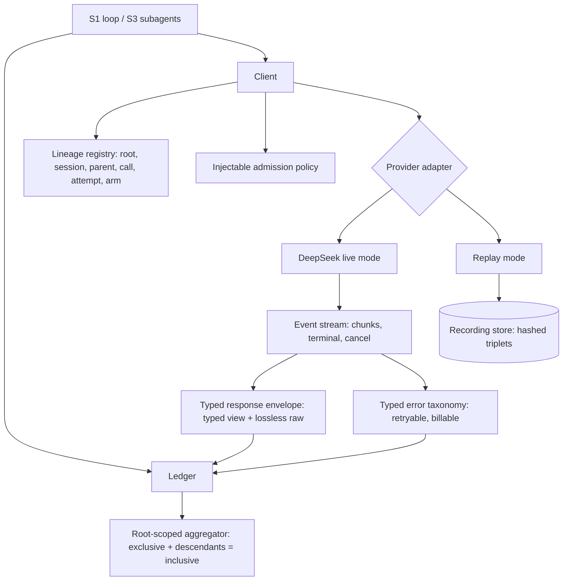

# DeepSeek PCB Harness S0 Provider Transport - Plan

## Goal Capsule

- **Objective:** Build the provider transport layer for a self-owned agent harness on the official DeepSeek API, so every later layer (loop, kernel, subagents, memory) calls one client whose failure modes, cost, and fidelity are already proven.
- **Deliverable:** A new `packages/temper-harness/` Python package providing a DeepSeek client, a typed error taxonomy, an exact cost/token ledger with session lineage, a record/replay store, and a three-tier fidelity oracle.
- **Authority:** This plan is authoritative for S0. `docs/superpowers/specs/2026-09-17-deepseek-pcb-harness-design.md` is the parent design and is authoritative for S1–S7. Where they conflict, the conflict is recorded on the affected KTD.
- **Execution profile:** Python, test-first per unit. No Rust, no pyo3 boundary, no optimizer work.
- **Stop conditions:** Stop and report rather than proceeding if U1 shows the provider cannot express parallel tool calls or strict tool schemas, or if any required usage field is absent with no substitute.
- **Tail ownership:** S0 ends at a proven transport. The loop, L1 assembly, compaction, and budget enforcement are S1 and are out of scope here.

---

## Product Contract

### Summary

This plan builds only the substrate: one DeepSeek client, one error taxonomy, one cost ledger, one replay store, one fidelity oracle. It deliberately does not build the agent loop. The reason to isolate it is that the parent design makes descendant-inclusive cost accounting and a transport-versus-model failure distinction load-bearing for a later fixed-expenditure experiment, and both are cheap now and rewrites later.

### Problem Frame

The 2026-09-09 → 2026-09-17 harness attempt spent 2,676,994,364 tokens across 477 threads, 73.7% of it in subagent workers, and never ran its headline experiment. Two of the defects that made that possible live in the transport layer: accounting that would have been root-only, and provider failures that were indistinguishable from model failures. S0 exists so that neither can recur, and so that the parent design's own falsification test — can the official API sustain a recursive, high-fan-out call pattern — can be run at all.

### Requirements

**Session lineage and cost accounting**

- R1. Every transport call carries registered session lineage (root session, session, parent session, call, attempt, arm), allocated before the request is sent. A call without registered lineage is a hard error.
- R2. Cost aggregation has exactly one entry point. It takes a root session and returns root-exclusive, descendant, and root-inclusive totals, with the inclusive total equal to the sum of the other two.
- R3. Every request that reaches the provider produces exactly one append-only ledger row, including failed, retried, and partial-stream calls. Retries are never collapsed into one row.
- R4. Usage fields the provider does not report are `null`, never `0`. Each row records where its usage came from and whether it was served live or replayed.

**Transport behavior**

- R5. The transport exposes an event-yielding, cancellable interface. A buffered implementation is the S0 default.
- R6. Provider failures are classified into distinct typed errors carrying retryable and billable flags, so a transport failure is never recorded as a model failure.
- R7. The client preserves arbitrary JSON Schema in tool definitions and the exact pairing and ordering of tool calls with their results. A malformed message array raises locally, before any network I/O.
- R8. A recorded response retains the lossless raw payload alongside a typed view.

**Replay**

- R9. Live and replay are explicit, mutually exclusive modes. A missing recording in replay mode is a hard typed error, and no code path leads from a failed live call to a recording.
- R10. Recordings carry request and response content hashes plus provider, model, and schema identity. A request-hash mismatch refuses to serve rather than replaying a near-miss.
- R11. Recordings retain an allowlisted header set only. No credentials reach disk.

**Verification**

- R12. The fidelity oracle has three tiers: recorded (CI, deterministic), live canary (opt-in, hashed evidence), and socket fault injection (no model). The live tier is required before the oracle is trusted as a fidelity instrument.
- R13. Every gate fails closed on an empty scan, and each ships a committed fault-injection test that fails on the exact input it exists to catch.
- R14. Ledger, error, and store records are defined by committed schema files, not inline constants.

### Scope Boundaries

**Deferred to later sub-projects**

- Retry and backoff policy, budget enforcement, L1 assembly, and compaction — S1.
- Tool registry, dispatch, and permissioning — S2.
- Subagent session tree, daemon, and message queues — S3. S0 supplies lineage hooks only.
- Agents View — S5. Long-horizon controls — S6.

**Outside this work's identity**

- A multi-provider framework. One interface, one DeepSeek adapter, one fixture adapter.
- A hand-written mock provider. Recorded fixtures are used instead, because a hand-written mock encodes the author's assumptions and proves nothing.
- A local tokenizer as an authoritative usage source.
- A general "run the harness offline" mode. The store serves tests and the oracle.

### Dependencies

- The official DeepSeek API and a provisioned key. No key is present in the environment today.
- The parent design's L2/L3 boundaries, so the store's scope does not drift into S1's offline-run mode.

### Outstanding Questions

- **Deferred:** which git ref carries the Zapote Rust validators and the Python/KiCad adapter. This blocks S2, not S0.
- **Deferred:** the interlock unit's acceptance checklist in machine-readable form. This blocks S1 and the S7 scalar.
- **Deferred:** the interlock verifier's end-to-end latency and the pre-registered fixed cost `C*`. This blocks S7.
- **Blocking:** none. The one blocking unknown — what `deepseek-v4.1-flash` actually emits — is resolved by U1 as the plan's first unit rather than assumed.

### Sources

- Parent design: `docs/superpowers/specs/2026-09-17-deepseek-pcb-harness-design.md`.
- Prior control plane on the unmerged ref `origin/codex/buck-harness-experiment-plan`: `harness-lab/run_zen_trials.py` (a recorder/relay that validates the tool catalog against expected schemas and writes one request/status/response triple per call), `harness-lab/STREAM-DIAGNOSTIC.md` (five socket fault cases), and `harness-lab/telemetry.py` (the inline `SCHEMA_VERSION` anti-pattern). Port the fault tests, not the policy.
- Repo precedents for fail-closed recorded artifacts: `scripts/oracle_hashes.json` with `scripts/check_oracle_hashes.py`, `scripts/_lib/qualification_replay.py`, and `tools/wasm/r19_agreement_ledger.py`.
- Measurement discipline: `docs/solutions/best-practices/a-measurement-carries-its-commit-2026-07-26.md`, `docs/evidence/2026-08-07-drc-ceiling-provenance-identity-incident.md`, `docs/solutions/logic-errors/drc-api-wrapper-components-and-location-always-empty.md`, `docs/evidence/2026-08-19-measurement-instruments-that-lie.md`.

---

## Planning Contract

### Key Technical Decisions

- KTD1. **S0 ships as `packages/temper-harness/`, a member of the existing uv workspace.** (session-settled: user-directed — chosen over a new top-level `harness/` tree: `packages/**` is already a trigger path in `.github/required-checks.json`, whereas a new top-level tree matches none and would ship with no required contexts.) This is also a deliberate exception to the repo-wide Rust preference in `AGENTS.md`: the runtime is a Python-dominant subsystem that is not a port of existing Rust logic, and the repo has no HTTP client precedent to extend. Rationale: workspace membership inherits Core Tests, Repo Hygiene & Import Gates, Fast Gates, and the vacuous-gate and orphaned-module scans.
- KTD2. **The fidelity oracle's authority is a live canary; recorded replay is the regression guard.** (conflict call-out: the approved parent design's S0 gate reads "fidelity tests pass against recorded responses". That wording is necessary but not sufficient, and if it is the only gate it is the self-consistency trap this repo has already hit twice — `test_clearance_rust_differential.py` pinned Rust equal to Python bit-for-bit and could not see a rotation-sign error, and the `R(+theta)` incident reproduced `kicad-cli` to four decimals while being the mirror of the truth. Recorded replay proves the client is reproducible, never that it carries the provider's semantics. The decision stands as the parent design's intent; the gate wording is strengthened per the evidence, not the decision reversed.)
- KTD3. **Accounting is descendant-inclusive by construction.** Per-call lineage (R1) plus a single root-scoped aggregator (R2), with usage merged across all stream chunks and unknown fields left `null` (R4). Chosen over a single-process counter upgraded once subagents exist, because the prior attempt's numbers make the cost concrete: 6 root sessions reported 331.9 M tokens against a true 2.68 B. A root-only sum is unnameable through the public API.
- KTD4. **U1 probes the live provider and freezes the schema from captured bytes.** Chosen over coding against the documented shape, because cache fields, whether reasoning tokens sit inside or beside completion tokens, parallel tool-call support, strict-schema support, and which stream chunk carries usage are all unverified for `deepseek-v4.1-flash` here.
- KTD5. **The ledger is an append-only JSONL file, not an in-memory counter and not a locked database.** Chosen so the S3 daemon can append from multiple processes without a server, and so a stream death loses at most the open row (see the "provider stream died silently" learning). A row is opened before the request and closed on response, so a crash leaves an explicit `incomplete` row rather than a silent zero. Canonical JSONL mirrors `tools/wasm/r19_agreement_ledger.py`.
- KTD6. **Store scope is capture plus deterministic replay for tests and the oracle.** Chosen over a general offline-run mode, which belongs to S1's record/replay row in the parent design. Mode-exclusivity invariants stay in S0 because the seam is here.
- KTD7. **USD is derived from a versioned price table, recorded per row, with both provider-reported and computed cost retained.** Chosen over a hardcoded rate, because a rate change would silently shift the fixed-expenditure comparison. Field names carry the convention (`billed_usd` versus `estimated_usd`) rather than a bare `cost`.
- KTD8. **The live canary is opt-in and does not run in CI by default.** It needs the production key, so it follows the `scripts/check_pad_world_position_oracle.py --verify-live-oracle` precedent: run on demand, evidence hashed and committed. Until it has run, the oracle is recorded-only and must say so.

### High-Level Technical Design

The caller never talks to a raw HTTP response. The adapter is the only place that knows the wire format; the envelope is what every later layer consumes. Live and replay are the only two adapters, and mode selection is explicit.

### Assumptions

- The official DeepSeek API supports a chat-completions surface with tool calling, and its `usage` block is reachable from a non-streaming call. If U1 falsifies either, the transport contract changes and the plan returns to planning rather than absorbing the change.
- `packages/**` triggers remain sufficient to gate the new package. If maintainers want the harness gated more tightly, `.github/required-checks.json` is extended deliberately, not by accident.

---

## Implementation Units

### U1. Probe the live provider and freeze the schema

**Goal:** Replace every assumption about `deepseek-v4.1-flash`'s wire behavior with captured bytes.

**Requirements:** R4, R14. **Depends on:** nothing.

**Files:** `packages/temper-harness/pyproject.toml`, `packages/temper-harness/src/temper_harness/provider/probe.py`, `packages/temper-harness/tests/provider/test_probe.py`, `packages/temper-harness/schemas/` (JSON Schema files), plus fixtures under `packages/temper-harness/tests/fixtures/captured/`.

**Approach:** Issue a small number of real requests covering: a plain completion; a completion with parallel tool calls; a completion with a strict-schema tool definition containing `additionalProperties: false`, `required`, `enum`, `$defs`/`$ref` and a nested `oneOf`; a streamed completion; and a deliberately invalid request. Capture raw request and response bytes verbatim. From those, write the committed schemas for the typed envelope, the usage record, the error record, and the ledger row, and record in the plan's follow-up notes which fields the provider does not emit.

**Test Scenarios:** Captured fixtures parse into the committed schemas. A schema file exists for the envelope, usage, error, and ledger row, and each is validated in CI. Every captured response's `usage` is present and non-null, or the gap is recorded as a named unknown. Parallel tool calls appear with distinct ids and stable ordering, or the limitation is recorded. Reasoning content is either absent or captured, and its token accounting is stated as inside-or-beside completion tokens from the observed bytes, never inferred.

**Verification:** The captured fixtures exist under version control; the schema files validate them; the recorded unknowns are enumerated in the plan's Definition of Done.

### U2. Cost ledger and session lineage

**Goal:** Make descendant-inclusive accounting structural rather than a convention.

**Requirements:** R1, R2, R3, R4, R14. **Depends on:** U1.

**Files:** `packages/temper-harness/src/temper_harness/ledger/`, `packages/temper-harness/schemas/ledger_row.schema.json`, `packages/temper-harness/tests/ledger/`.

**Approach:** Lineage is a registry the caller must register with before a call; the call record is opened as an incomplete append-only row before the request is sent and closed on response or error. Aggregation is a single function whose only argument capable of selecting spend is a root session id. Usage merges across all stream chunks. Unknown fields are `null`. The price table is versioned data, and its identity is recorded on every row.

**Test Scenarios:** A synthetic tree of a root, two children, and a grandchild with known spend satisfies inclusive equal to exclusive plus descendants, and a partial sum cannot be produced through the public API. A call with no registered lineage raises. A simulated crash between row-open and response leaves an `incomplete` row rather than no row. A failed call and its retry produce two rows. A usage field absent from the provider response is `null`, not `0`. A response whose usage arrives split across chunks is merged correctly. A recorded row retains the price-table identity that produced its USD.

**Verification:** `uv run --no-sync pytest packages/temper-harness/tests/ledger` passes, including the reconciliation invariant and the crash-simulation test.

### U3. Transport interface, error taxonomy, and provider adapter

**Goal:** One client seam whose failures are classified before any later layer sees them.

**Requirements:** R5, R6, R7, R8. **Depends on:** U1, U2.

**Files:** `packages/temper-harness/src/temper_harness/provider/`, `packages/temper-harness/schemas/error.schema.json`, `packages/temper-harness/tests/provider/`.

**Approach:** The interface yields events and supports cancellation; a buffered implementation is the default. Errors are distinct types for rate limit, server error, timeout, malformed stream, incomplete stream, context-length exceeded, tool-schema rejection, and content filtering, each carrying retryable and billable flags. Admission is injectable so S3 can raise concurrency; S0 ships a serial default. The message builder enforces tool-call id pairing and ordering and raises before network I/O. The DeepSeek adapter is the only module that knows the wire format; a fixture adapter reads the U1 captures.

**Test Scenarios:** Two or more tool calls in one response preserve ids, indices, and nested or unicode arguments, and the typed view re-serializes to the captured bytes for provider-emitted fields. A tool message whose id matches no preceding call raises locally with zero network calls. A message array with an assistant tool-call turn followed by two tool results round-trips in order. Provider schema rejection is a distinct error from content filtering and from rate limiting. A truncated stream raises an incomplete-stream error, retains partial usage, and is not billed as complete. A 200 response with a non-JSON body raises a malformed-response error with raw bytes retained. Request-as-sent equals request-as-constructed, proving no hidden mutation or truncation. Cancellation stops the stream without leaving an open ledger row.

**Verification:** `uv run --no-sync pytest packages/temper-harness/tests/provider` passes. `finish_reason` is asserted present on every terminal event.

### U4. Record and replay store with mode exclusivity

**Goal:** Deterministic reruns without network, that cannot silently substitute for a live call.

**Requirements:** R8, R9, R10, R11. **Depends on:** U1, U3.

**Files:** `packages/temper-harness/src/temper_harness/store/`, `packages/temper-harness/tests/store/`.

**Approach:** A recording is the request bytes, the response bytes, an allowlisted header subset, and a content hash of each plus provider, model, and schema identity. Mode is selected explicitly at construction. A request-hash mismatch is a hard error; there is no nearest-match fallback and no path from a failed live call into a recording.

**Test Scenarios:** A request-hash mismatch refuses to serve. Replay mode with a missing recording raises and makes zero live calls. A recording round-trips to byte-identical response bytes. A redaction canary scans the on-disk store for a planted key and fails if found. An empty recording scan fails rather than reporting clean. A recording whose schema version is unparseable fails. The store cannot be written during a replay run.

**Verification:** `uv run --no-sync pytest packages/temper-harness/tests/store` passes, including the redaction canary and the empty-scan failure.

### U5. Recorded fidelity oracle and fault injection

**Goal:** Make each S0 gate demonstrably fail on the input it exists to catch.

**Requirements:** R12, R13, R14. **Depends on:** U3, U4.

**Files:** `packages/temper-harness/tests/oracle/`, `packages/temper-harness/tests/faults/`.

**Approach:** Tier A runs the recorded corpus in CI and is deterministic. Tier C injects the five socket faults, without a model. Each gate carries a committed perturbation test proving it goes red.

**Test Scenarios:** Perturbing a tool schema makes the fidelity oracle fail. Dropping a usage field makes the ledger fail closed. Mutating one response byte makes replay detect the mismatch. An empty recorded corpus fails the oracle. Interleaving a full system, user, assistant-tool-call, tool, tool, assistant sequence round-trips with ordering intact. A duplicate provider tool-call id raises a protocol error. A chunk boundary inside a UTF-8 codepoint reassembles without mojibake. The five socket faults each classify into their intended error type, and a 429 followed by a success produces two ledger rows with the failed row retained and not billable.

**Verification:** `uv run --no-sync pytest packages/temper-harness/tests/oracle packages/temper-harness/tests/faults` passes. Each perturbation test fails when its guard is removed, confirmed by running it against the unguarded implementation once during review.

### U6. Live canary and the fan-out scenario

**Goal:** Anchor the oracle to the real provider and answer the parent design's falsification question.

**Requirements:** R12, R2. **Depends on:** U3.

**Files:** `packages/temper-harness/tests/canary/`, `packages/temper-harness/README.md`.

**Approach:** An opt-in canary issues the U1 probe set against the live API and compares the shapes against the recorded corpus, writing hashed evidence. The fan-out scenario runs a modest number of concurrent sessions in the recursive shape the `rlm` primitive will use, and measures rate-limit behavior, per-session attribution, and inclusive cost. Both are documented as on-demand, not CI gates, consistent with KTD8.

**Test Scenarios:** Every concurrent session's calls are attributed to their own session and included in the root aggregate. A live shape change from the recorded corpus fails the canary. The canary writes hashed evidence naming the model, the date, and the corpus hash. Running the canary without a key produces a typed blocked error, not a skip that reports clean.

**Verification:** The canary is run once by hand against the live API and its evidence committed under `packages/temper-harness/tests/canary/evidence/`. The fan-out scenario's per-session attribution assertions pass.

---

## Verification Contract

| Command | Applies to | Proves |
|---|---|---|
| `uv run --no-sync pytest packages/temper-harness/tests` | all units | Unit and oracle suites pass |
| `uv run --no-sync python scripts/check_vacuous_gates.py` | U5 | No unguarded vacuous aggregation in gate paths |
| `uv run --no-sync python scripts/check_orphaned_python_modules.py` | all units | No module is unreachable from a test or entry point |
| `uv run --no-sync python scripts/check_hash_order_determinism.py` | U2, U4 | No new `PYTHONHASHSEED`-dependent ordering in a determinism-bearing artifact |
| `uv run --no-sync python scripts/import_linter_gate.py` | all units | Import boundaries hold |
| `uv run --no-sync python scripts/check_manifest_gate.py` | if scripts are added | Any new `scripts/*.py` carries a manifest entry |
| `make regen-check` | plan landing | Generated plan counts and derived artifacts match |
| `make extensions-check` | not applicable | S0 adds no pyo3 crate; recorded as not applicable rather than skipped silently |

`packages/temper-harness/tests` must be added to `testpaths` and `pythonpath` in the root `pyproject.toml` so the suite runs under the default `pytest` invocation. The live canary is deliberately excluded from the table because it needs a production key; running it is a manual step whose evidence is committed.

---

## Definition of Done

**Global**

- All six units' test scenarios pass, and each gate has been observed failing on its motivating input at least once.
- The four schema files are committed and validated in CI; no `SCHEMA_VERSION` constant exists inline in Python.
- Descendant-inclusive aggregation is the only public way to obtain a cost total, demonstrated by the reconciliation test.
- The live canary has run once against the official API and its hashed evidence is committed, or the report states plainly that S0's fidelity claim rests on recorded replay alone.
- Cleanup: any abandoned probe scripts, throwaway adapters, and dead branches from approaches that did not pan out are removed, not left in the diff.
- `make regen-check` is clean, and the branch is pushed.

**Per unit**

- U1 complete when the captured fixtures and four schemas are committed, and every unverified provider behavior is named rather than assumed.
- U2 complete when the reconciliation invariant holds on a synthetic three-level tree and a crash leaves an `incomplete` row.
- U3 complete when a malformed message array raises before network I/O and every error type is distinct with retryable and billable flags.
- U4 complete when a request-hash mismatch refuses to serve and the redaction canary fails on a planted key.
- U5 complete when each perturbation test is shown to fail without its guard.
- U6 complete when the fan-out scenario attributes every call to its session and the canary evidence is committed or its absence is reported.

**Not claimed**

S0 proves nothing about model capability, PCB design quality, or the harness's advantage over a direct agent. It establishes only that the transport, its accounting, and its fidelity instruments are trustworthy. Physical, electrical, and safety claims remain untouched and unclaimed, per the parent design.
